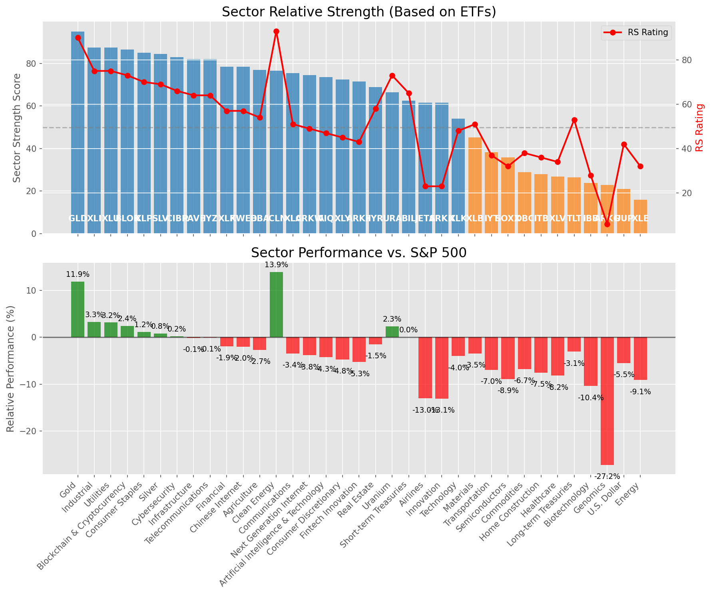

# **Daily Relative Strength Report**

**Date:** 2025-05-20

## **Market Valuation (Buffett Indicator)**

| Metric | Value |
|--------|-------|
| **Market Valuation** | **Fair Valued** |
| **Current Ratio** | 9.75 |
| **Historical Mean** | 9.39 |
| **Standard Deviation** | 0.50 |
| **Z-Score (StdDev from Mean)** | 0.76 |
| **Total Market Cap** | $292.33 trillion |
| **GDP** | $29.98 trillion |

## **Market Insights**

### **Market is Fairly Valued**

The market appears to be trading within a reasonable range of historical valuations. This suggests a balanced approach to equity investing is appropriate. Investors should:

- Focus on individual stock selection based on fundamentals and technicals
- Maintain normal equity allocations aligned with long-term goals
- Pay attention to sector rotation and relative strength
- Watch for changes in market leadership

Fair valuation typically suggests normal market returns can be expected, with stock selection becoming increasingly important.

### **Buffett Indicator Overview**

The Buffett Indicator (Total Market Cap / GDP) is a measure of the stock market's valuation relative to the size of the economy. It is named after Warren Buffett, who described it as "probably the best single measure of where valuations stand at any given moment."

- **Values above +2 standard deviations:** Market significantly overvalued
- **Values above +1 standard deviation:** Market overvalued
- **Values between -1 and +1 standard deviations:** Market fairly valued
- **Values below -1 standard deviation:** Market undervalued
- **Values below -2 standard deviations:** Market significantly undervalued

---

## **Sector Relative Strength**

Based on William O'Neil's Relative Strength Methodology

| ETF | Strength | RS Rating | Performance | Above Key MAs | Trend | Sector |
|-----|----------|-----------|-------------|--------------|-------|--------|
| [GLD](https://www.tradingview.com/chart/?symbol=GLD) | 95.0 | 90.0 | 11.66% | 10d ✓, 50d ✓, 200d ✓ | ↗️ | Gold |
| [BLOK](https://www.tradingview.com/chart/?symbol=BLOK) | 88.0 | 76.0 | 3.89% | 10d ✓, 50d ✓, 200d ✓ | ↗️ | Blockchain & Cryptocurrency |
| [XLI](https://www.tradingview.com/chart/?symbol=XLI) | 88.0 | 76.0 | 3.75% | 10d ✓, 50d ✓, 200d ✓ | ↗️ | Industrial |
| [XLU](https://www.tradingview.com/chart/?symbol=XLU) | 87.0 | 74.0 | 3.37% | 10d ✓, 50d ✓, 200d ✓ | ↗️ | Utilities |
| [XLP](https://www.tradingview.com/chart/?symbol=XLP) | 84.5 | 69.0 | 1.29% | 10d ✓, 50d ✓, 200d ✓ | ↗️ | Consumer Staples |
| [SLV](https://www.tradingview.com/chart/?symbol=SLV) | 84.0 | 68.0 | 0.65% | 10d ✓, 50d ✓, 200d ✓ | ↗️ | Silver |
| [IYZ](https://www.tradingview.com/chart/?symbol=IYZ) | 83.5 | 67.0 | 0.56% | 10d ✓, 50d ✓, 200d ✓ | ↗️ | Telecommunications |
| [PAVE](https://www.tradingview.com/chart/?symbol=PAVE) | 83.0 | 66.0 | 0.43% | 10d ✓, 50d ✓, 200d ✓ | ↗️ | Infrastructure |
| [CIBR](https://www.tradingview.com/chart/?symbol=CIBR) | 83.0 | 66.0 | 0.46% | 10d ✓, 50d ✓, 200d ✓ | ↗️ | Cybersecurity |
| [XLF](https://www.tradingview.com/chart/?symbol=XLF) | 78.5 | 57.0 | -1.52% | 10d ✓, 50d ✓, 200d ✓ | ↗️ | Financial |
| [DBA](https://www.tradingview.com/chart/?symbol=DBA) | 78.0 | 56.0 | -2.09% | 10d ✓, 50d ✓, 200d ✓ | ↗️ | Agriculture |
| [KWEB](https://www.tradingview.com/chart/?symbol=KWEB) | 78.0 | 56.0 | -2.02% | 10d ✓, 50d ✓, 200d ✓ | ↗️ | Chinese Internet |
| [ICLN](https://www.tradingview.com/chart/?symbol=ICLN) | 76.5 | 93.0 | 14.49% | 10d ✓, 50d ✓, 200d ✓ | ↘️ | Clean Energy |
| [XLC](https://www.tradingview.com/chart/?symbol=XLC) | 76.0 | 52.0 | -2.74% | 10d ✓, 50d ✓, 200d ✓ | ↗️ | Communications |
| [AIQ](https://www.tradingview.com/chart/?symbol=AIQ) | 74.0 | 48.0 | -3.87% | 10d ✓, 50d ✓, 200d ✓ | ↗️ | Artificial Intelligence & Technology |
| [XLY](https://www.tradingview.com/chart/?symbol=XLY) | 73.0 | 46.0 | -4.09% | 10d ✓, 50d ✓, 200d ✓ | ↗️ | Consumer Discretionary |
| [ARKF](https://www.tradingview.com/chart/?symbol=ARKF) | 72.5 | 45.0 | -4.55% | 10d ✓, 50d ✓, 200d ✓ | ↗️ | Fintech Innovation |
| [IYR](https://www.tradingview.com/chart/?symbol=IYR) | 68.8 | 58.0 | -1.25% | 10d ✓, 50d ✓, 200d ✗ | ↗️ | Real Estate |
| [URA](https://www.tradingview.com/chart/?symbol=URA) | 66.5 | 73.0 | 2.63% | 10d ✓, 50d ✓, 200d ✓ | ↘️ | Uranium |
| [BIL](https://www.tradingview.com/chart/?symbol=BIL) | 62.0 | 64.0 | 0.01% | 10d ✓, 50d ✓, 200d ✓ | ↘️ | Short-term Treasuries |
| [ARKK](https://www.tradingview.com/chart/?symbol=ARKK) | 62.0 | 24.0 | -12.08% | 10d ✓, 50d ✓, 200d ✓ | ↗️ | Innovation |
| [JETS](https://www.tradingview.com/chart/?symbol=JETS) | 61.5 | 23.0 | -12.49% | 10d ✓, 50d ✓, 200d ✓ | ↗️ | Airlines |
| [XLK](https://www.tradingview.com/chart/?symbol=XLK) | 54.5 | 49.0 | -3.60% | 10d ✓, 50d ✓, 200d ✓ | ↘️ | Technology |
| [IYT](https://www.tradingview.com/chart/?symbol=IYT) | 48.5 | 37.0 | -7.03% | 10d ✓, 50d ✓, 200d ✓ | ↘️ | Transportation |
| [XLB](https://www.tradingview.com/chart/?symbol=XLB) | 45.3 | 51.0 | -3.06% | 10d ✓, 50d ✓, 200d ✗ | ↘️ | Materials |
| [SOXX](https://www.tradingview.com/chart/?symbol=SOXX) | 36.3 | 33.0 | -8.35% | 10d ✓, 50d ✓, 200d ✗ | ↘️ | Semiconductors |
| [ITB](https://www.tradingview.com/chart/?symbol=ITB) | 28.9 | 38.0 | -6.64% | 10d ✗, 50d ✓, 200d ✗ | ↘️ | Home Construction |
| [DBC](https://www.tradingview.com/chart/?symbol=DBC) | 28.4 | 37.0 | -6.69% | 10d ✓, 50d ✗, 200d ✗ | ↘️ | Commodities |
| [XLV](https://www.tradingview.com/chart/?symbol=XLV) | 26.9 | 34.0 | -7.96% | 10d ✓, 50d ✗, 200d ✗ | ↘️ | Healthcare |
| [XLE](https://www.tradingview.com/chart/?symbol=XLE) | 25.9 | 32.0 | -8.61% | 10d ✓, 50d ✗, 200d ✗ | ↘️ | Energy |
| [TLT](https://www.tradingview.com/chart/?symbol=TLT) | 25.5 | 51.0 | -3.02% | 10d ✗, 50d ✗, 200d ✗ | ↘️ | Long-term Treasuries |
| [IBB](https://www.tradingview.com/chart/?symbol=IBB) | 23.4 | 27.0 | -10.57% | 10d ✓, 50d ✗, 200d ✗ | ↘️ | Biotechnology |
| [ARKG](https://www.tradingview.com/chart/?symbol=ARKG) | 22.8 | 6.0 | -26.77% | 10d ✓, 50d ✓, 200d ✗ | ↘️ | Genomics |
| [UUP](https://www.tradingview.com/chart/?symbol=UUP) | 21.0 | 42.0 | -5.31% | 10d ✗, 50d ✗, 200d ✗ | ↘️ | U.S. Dollar |
| [ARKW](https://www.tradingview.com/chart/?symbol=ARKW) | 0.0 | 0.0 | 0.00% | 10d ✗, 50d ✗, 200d ✗ | ↘️ | Next Generation Internet |

### **Sector ETF Performance Interpretation**

This table shows the relative strength metrics for different market sectors based on their representative ETFs:

- **ETF**: The ETF used to measure sector performance (click for chart)
- **Strength**: Overall sector strength score (0-100) combining multiple factors
- **RS Rating**: O'Neil RS rating of the sector ETF
- **Performance**: Performance of the sector ETF relative to SPY
- **Above Key MAs**: Whether the ETF is trading above its 10, 50, and 200-day moving averages
- **Trend**: Whether the sector is in an uptrend (↗️) or downtrend (↘️)

### **Current Sector Leadership**

The current market leadership is coming from the following sectors: **Gold, Blockchain & Cryptocurrency, Industrial**.

The **Gold** sector (represented by **GLD**) is showing particularly strong relative strength with an RS rating of 90.0 and performance of 11.66% vs. the S&P 500. This sector is trading above its 10-day, 50-day, 200-day moving average(s). Investors should consider focusing on high RS stocks within these leading sectors for potential outperformance.

---

## **Buy Recommendations**

The following 114 stocks show exceptional relative strength:

| RS Rating | Buy Score | Current Price | Chart | Name | Ticker |
|-----------|-----------|---------------|-------|------|--------|
| 100 | 100 | $160.31 | [Chart](https://www.tradingview.com/chart/?symbol=NRG) | NRG Energy, Inc. | NRG |
| 100 | 100 | $28.45 | [Chart](https://www.tradingview.com/chart/?symbol=DB) | Deutsche Bank Aktiengesellschaft | DB |
| 100 | 100 | $19.52 | [Chart](https://www.tradingview.com/chart/?symbol=SPNT) | SiriusPoint Ltd. | SPNT |
| 100 | 100 | $99.23 | [Chart](https://www.tradingview.com/chart/?symbol=SEZL) | Sezzle Inc. Common Stock | SEZL |
| 100 | 100 | $41.44 | [Chart](https://www.tradingview.com/chart/?symbol=DRS) | Leonardo DRS, Inc. Common Stock | DRS |
| 100 | 100 | $195.00 | [Chart](https://www.tradingview.com/chart/?symbol=DAVE) | Dave Inc. Class A Common Stock | DAVE |
| 100 | 100 | $36.08 | [Chart](https://www.tradingview.com/chart/?symbol=KTOS) | Kratos Defense & Security Solutions, Inc. | KTOS |
| 100 | 100 | $23.23 | [Chart](https://www.tradingview.com/chart/?symbol=PRA) | ProAssurance Corporation | PRA |
| 100 | 100 | $133.69 | [Chart](https://www.tradingview.com/chart/?symbol=VSEC) | VSE Corp | VSEC |
| 99 | 100 | $30.08 | [Chart](https://www.tradingview.com/chart/?symbol=FMS) | Fresenius Medical Care AG | FMS |
| 99 | 100 | $134.91 | [Chart](https://www.tradingview.com/chart/?symbol=ATGE) | Adtalem Global Education Inc. Common Shares | ATGE |
| 99 | 100 | $188.98 | [Chart](https://www.tradingview.com/chart/?symbol=AGX) | Argan, Inc | AGX |
| 99 | 100 | $26.70 | [Chart](https://www.tradingview.com/chart/?symbol=UVE) | UNIVERSAL INSURANCE HLDG, INC. | UVE |
| 99 | 100 | $44.68 | [Chart](https://www.tradingview.com/chart/?symbol=EXEL) | Exelixis Inc | EXEL |
| 99 | 100 | $72.29 | [Chart](https://www.tradingview.com/chart/?symbol=ULS) | UL Solutions Inc. | ULS |
| 99 | 100 | $35.58 | [Chart](https://www.tradingview.com/chart/?symbol=AHR) | American Healthcare REIT, Inc. | AHR |
| 99 | 100 | $414.91 | [Chart](https://www.tradingview.com/chart/?symbol=MSTR) | MicroStrategy Inc | MSTR |
| 99 | 100 | $80.81 | [Chart](https://www.tradingview.com/chart/?symbol=RBLX) | Roblox Corporation | RBLX |
| 99 | 100 | $24.03 | [Chart](https://www.tradingview.com/chart/?symbol=GRND) | Grindr Inc. | GRND |
| 98 | 100 | $24.22 | [Chart](https://www.tradingview.com/chart/?symbol=OR) | OR Royalties Inc. | OR |
| 98 | 100 | $100.95 | [Chart](https://www.tradingview.com/chart/?symbol=LBRDK) | Liberty Broadband Corporation Class C | LBRDK |
| 98 | 100 | $155.26 | [Chart](https://www.tradingview.com/chart/?symbol=CAH) | Cardinal Health, Inc. | CAH |
| 98 | 100 | $741.20 | [Chart](https://www.tradingview.com/chart/?symbol=AXON) | Axon Enterprise, Inc. Common Stock | AXON |
| 97 | 100 | $37.16 | [Chart](https://www.tradingview.com/chart/?symbol=AS) | Amer Sports, Inc. | AS |
| 97 | 100 | $89.02 | [Chart](https://www.tradingview.com/chart/?symbol=RBRK) | Rubrik, Inc. | RBRK |
| 97 | 100 | $39.34 | [Chart](https://www.tradingview.com/chart/?symbol=PAY) | Paymentus Holdings, Inc. | PAY |
| 97 | 100 | $137.95 | [Chart](https://www.tradingview.com/chart/?symbol=UGL) | ProShares Ultra Gold | UGL |
| 97 | 100 | $73.58 | [Chart](https://www.tradingview.com/chart/?symbol=WRB) | W.R. Berkley Corporation | WRB |
| 97 | 100 | $524.41 | [Chart](https://www.tradingview.com/chart/?symbol=DUOL) | Duolingo, Inc. Class A Common Stock | DUOL |
| 97 | 100 | $131.20 | [Chart](https://www.tradingview.com/chart/?symbol=COOP) | Mr. Cooper Group Inc. Common Stock | COOP |
| 97 | 100 | $35.50 | [Chart](https://www.tradingview.com/chart/?symbol=UTI) | Universal Technical Institute, Inc. | UTI |
| 96 | 100 | $121.77 | [Chart](https://www.tradingview.com/chart/?symbol=EHC) | Encompass Health Corporation Common Stock | EHC |
| 96 | 100 | $31.34 | [Chart](https://www.tradingview.com/chart/?symbol=BCH) | Banco de ChileAmerican Depositary Shares (Each representing 200 shares of Common Stock) | BCH |
| 96 | 100 | $164.93 | [Chart](https://www.tradingview.com/chart/?symbol=HWM) | Howmet Aerospace Inc. | HWM |
| 96 | 100 | $162.94 | [Chart](https://www.tradingview.com/chart/?symbol=SE) | Sea Limited American Depositary Shares, each representing one Class A Ordinary Share | SE |
| 96 | 100 | $176.70 | [Chart](https://www.tradingview.com/chart/?symbol=RGLD) | Royal Gold Inc | RGLD |
| 96 | 100 | $20.60 | [Chart](https://www.tradingview.com/chart/?symbol=TFPM) | Triple Flag Precious Metals Corp. | TFPM |
| 96 | 100 | $82.39 | [Chart](https://www.tradingview.com/chart/?symbol=WPM) | Wheaton Precious Metals Corp. Common Stock | WPM |
| 96 | 100 | $449.55 | [Chart](https://www.tradingview.com/chart/?symbol=GEV) | GE Vernova Inc. | GEV |
| 95 | 100 | $24.25 | [Chart](https://www.tradingview.com/chart/?symbol=CRK) | Comstock Resources, Inc. | CRK |
| 95 | 100 | $163.59 | [Chart](https://www.tradingview.com/chart/?symbol=FNV) | Franco-Nevada Corporation | FNV |
| 95 | 100 | $131.50 | [Chart](https://www.tradingview.com/chart/?symbol=HIG) | The Hartford Insurance Group, Inc. | HIG |
| 95 | 100 | $47.79 | [Chart](https://www.tradingview.com/chart/?symbol=EWI) | iShares MSCI Italy ETF | EWI |
| 94 | 100 | $328.55 | [Chart](https://www.tradingview.com/chart/?symbol=PODD) | Insulet Corporation | PODD |
| 94 | 100 | $41.71 | [Chart](https://www.tradingview.com/chart/?symbol=EWG) | iShares MSCI Germany ETF | EWG |
| 94 | 100 | $173.54 | [Chart](https://www.tradingview.com/chart/?symbol=PM) | Philip Morris International Inc. | PM |
| 94 | 100 | $73.83 | [Chart](https://www.tradingview.com/chart/?symbol=VRNA) | Verona Pharma plc | VRNA |
| 94 | 100 | $44.39 | [Chart](https://www.tradingview.com/chart/?symbol=BTI) | British American Tobacco p.l.c. American Depositary Shares, American Depositary Shares, each representing one Ordinary Share | BTI |
| 94 | 100 | $17.84 | [Chart](https://www.tradingview.com/chart/?symbol=BCS) | Barclays PLC | BCS |
| 94 | 100 | $84.67 | [Chart](https://www.tradingview.com/chart/?symbol=LB) | LandBridge Company LLC | LB |
| 93 | 100 | $23.94 | [Chart](https://www.tradingview.com/chart/?symbol=BTSG) | BrightSpring Health Services, Inc. Common Stock | BTSG |
| 93 | 100 | $31.23 | [Chart](https://www.tradingview.com/chart/?symbol=NTGR) | NETGEAR, Inc. | NTGR |
| 93 | 100 | $25.30 | [Chart](https://www.tradingview.com/chart/?symbol=BSAC) | Banco Santander-Chile | BSAC |
| 93 | 100 | $31.77 | [Chart](https://www.tradingview.com/chart/?symbol=TGS) | Transportadora de Gas del Sur S.A. ADS | TGS |
| 92 | 100 | $126.67 | [Chart](https://www.tradingview.com/chart/?symbol=PLTR) | Palantir Technologies Inc. Class A Common Stock | PLTR |
| 92 | 100 | $119.21 | [Chart](https://www.tradingview.com/chart/?symbol=BJ) | BJs Wholesale Club Holdings, Inc. Common Stock | BJ |
| 92 | 100 | $111.79 | [Chart](https://www.tradingview.com/chart/?symbol=AEM) | Agnico Eagle Mines Ltd. | AEM |
| 92 | 100 | $1187.82 | [Chart](https://www.tradingview.com/chart/?symbol=NFLX) | NetFlix Inc | NFLX |
| 92 | 100 | $103.38 | [Chart](https://www.tradingview.com/chart/?symbol=AXS) | Axis Capital Holders Limited | AXS |
| 92 | 100 | $274.09 | [Chart](https://www.tradingview.com/chart/?symbol=TRV) | The Travelers Companies, Inc. | TRV |
| 92 | 100 | $40.85 | [Chart](https://www.tradingview.com/chart/?symbol=AB) | AllianceBernstein Holding, L.P. | AB |
| 92 | 100 | $63.51 | [Chart](https://www.tradingview.com/chart/?symbol=SLF) | Sun Life Financial Inc. | SLF |
| 92 | 100 | $19.59 | [Chart](https://www.tradingview.com/chart/?symbol=KT) | KT Corp. | KT |
| 91 | 100 | $145.31 | [Chart](https://www.tradingview.com/chart/?symbol=TW) | Tradeweb Markets Inc. Class A Common Stock | TW |
| 91 | 100 | $60.01 | [Chart](https://www.tradingview.com/chart/?symbol=MO) | Altria Group, Inc. | MO |
| 91 | 100 | $173.48 | [Chart](https://www.tradingview.com/chart/?symbol=ITA) | iShares U.S. Aerospace & Defense ETF | ITA |
| 90 | 100 | $61.88 | [Chart](https://www.tradingview.com/chart/?symbol=IAU) | iShares Gold Trust | IAU |
| 90 | 100 | $32.72 | [Chart](https://www.tradingview.com/chart/?symbol=IAUM) | iShares Gold Trust Micro | IAUM |
| 90 | 100 | $234.91 | [Chart](https://www.tradingview.com/chart/?symbol=CRS) | Carpenter Technology Corp | CRS |
| 90 | 100 | $42.89 | [Chart](https://www.tradingview.com/chart/?symbol=FHI) | Federated Hermes, Inc. | FHI |
| 90 | 100 | $31.30 | [Chart](https://www.tradingview.com/chart/?symbol=SGOL) | abrdn Physical Gold Shares ETF | SGOL |
| 90 | 100 | $34.00 | [Chart](https://www.tradingview.com/chart/?symbol=FDP) | Fresh Del Monte Produce Inc. | FDP |
| 90 | 100 | $64.98 | [Chart](https://www.tradingview.com/chart/?symbol=GLDM) | SPDR Gold MiniShares | GLDM |
| 90 | 100 | $302.44 | [Chart](https://www.tradingview.com/chart/?symbol=GLD) | SPDR Gold Trust, SPDR Gold Shares | GLD |
| 90 | 100 | $32.40 | [Chart](https://www.tradingview.com/chart/?symbol=AAAU) | Goldman Sachs Physical Gold ETF Shares | AAAU |
| 90 | 100 | $81.73 | [Chart](https://www.tradingview.com/chart/?symbol=NFG) | National Fuel Gas Co. | NFG |
| 90 | 100 | $235.22 | [Chart](https://www.tradingview.com/chart/?symbol=GE) | GE Aerospace | GE |
| 89 | 100 | $37.75 | [Chart](https://www.tradingview.com/chart/?symbol=CNP) | CenterPoint Energy, Inc. | CNP |
| 89 | 100 | $277.39 | [Chart](https://www.tradingview.com/chart/?symbol=CME) | CME Group Inc. | CME |
| 88 | 100 | $25.03 | [Chart](https://www.tradingview.com/chart/?symbol=PHYS) | Sprott Physical Gold Trust | PHYS |
| 87 | 100 | $82.32 | [Chart](https://www.tradingview.com/chart/?symbol=UNM) | Unum Group | UNM |
| 86 | 99 | $251.25 | [Chart](https://www.tradingview.com/chart/?symbol=RSG) | Republic Services Inc. | RSG |
| 86 | 99 | $235.36 | [Chart](https://www.tradingview.com/chart/?symbol=TTWO) | Take-Two Interactive Software Inc | TTWO |
| 88 | 98 | $60.30 | [Chart](https://www.tradingview.com/chart/?symbol=IBIT) | iShares Bitcoin Trust ETF | IBIT |
| 87 | 98 | $137.34 | [Chart](https://www.tradingview.com/chart/?symbol=RTX) | RTX Corporation | RTX |
| 86 | 98 | $64.67 | [Chart](https://www.tradingview.com/chart/?symbol=HOOD) | Robinhood Markets, Inc. Class A Common Stock | HOOD |
| 87 | 97 | $53.93 | [Chart](https://www.tradingview.com/chart/?symbol=EPR) | EPR Properties | EPR |
| 86 | 97 | $50.05 | [Chart](https://www.tradingview.com/chart/?symbol=TRP) | TC Energy Corporation | TRP |
| 83 | 97 | $1393.90 | [Chart](https://www.tradingview.com/chart/?symbol=ORLY) | O'Reilly Automotive, Inc. | ORLY |
| 85 | 96 | $59.11 | [Chart](https://www.tradingview.com/chart/?symbol=IGF) | iShares Global Infrastructure ETF | IGF |
| 85 | 96 | $54.89 | [Chart](https://www.tradingview.com/chart/?symbol=RELX) | RELX PLC | RELX |
| 84 | 96 | $47.58 | [Chart](https://www.tradingview.com/chart/?symbol=MRCY) | Mercury Systems Inc. | MRCY |
| 83 | 96 | $159.50 | [Chart](https://www.tradingview.com/chart/?symbol=ATO) | Atmos Energy Corporation | ATO |
| 83 | 96 | $89.22 | [Chart](https://www.tradingview.com/chart/?symbol=L) | Loews Corporation | L |
| 82 | 96 | $69.97 | [Chart](https://www.tradingview.com/chart/?symbol=KR) | The Kroger Co. | KR |
| 81 | 96 | $27.89 | [Chart](https://www.tradingview.com/chart/?symbol=T) | AT&T Inc. | T |
| 85 | 95 | $47.83 | [Chart](https://www.tradingview.com/chart/?symbol=FTS) | Fortis Inc. Common Shares | FTS |
| 85 | 95 | $31.36 | [Chart](https://www.tradingview.com/chart/?symbol=PRDO) | Perdoceo Education Corporation | PRDO |
| 83 | 95 | $456.09 | [Chart](https://www.tradingview.com/chart/?symbol=CASY) | Casey's General Stores Inc | CASY |
| 82 | 95 | $28.93 | [Chart](https://www.tradingview.com/chart/?symbol=CEF) | Sprott Physical Gold and Silver Trust | CEF |
| 82 | 94 | $197.98 | [Chart](https://www.tradingview.com/chart/?symbol=LOPE) | Grand Canyon Education, Inc | LOPE |
| 82 | 94 | $44.09 | [Chart](https://www.tradingview.com/chart/?symbol=HMN) | Horace Mann Educators Corporation | HMN |
| 83 | 93 | $62.26 | [Chart](https://www.tradingview.com/chart/?symbol=RYTM) | Rhythm Pharmaceuticals, Inc. Common Stock | RYTM |
| 83 | 93 | $189.30 | [Chart](https://www.tradingview.com/chart/?symbol=GDDY) | GoDaddy Inc | GDDY |
| 83 | 93 | $31.94 | [Chart](https://www.tradingview.com/chart/?symbol=MFC) | Manulife Financial Corp. | MFC |
| 81 | 93 | $208.64 | [Chart](https://www.tradingview.com/chart/?symbol=DRI) | Darden Restaurants, Inc. | DRI |
| 81 | 93 | $286.87 | [Chart](https://www.tradingview.com/chart/?symbol=PGR) | Progressive Corporation | PGR |
| 82 | 92 | $224.27 | [Chart](https://www.tradingview.com/chart/?symbol=CBOE) | Cboe Global Markets, Inc. | CBOE |
| 81 | 92 | $138.72 | [Chart](https://www.tradingview.com/chart/?symbol=DTE) | DTE Energy Company | DTE |
| 80 | 91 | $97.21 | [Chart](https://www.tradingview.com/chart/?symbol=CALM) | Cal-Maine Foods Inc | CALM |
| 80 | 91 | $311.83 | [Chart](https://www.tradingview.com/chart/?symbol=VRSK) | Verisk Analytics, Inc. Common Stock | VRSK |
| 80 | 91 | $298.02 | [Chart](https://www.tradingview.com/chart/?symbol=CVNA) | Carvana Co. | CVNA |
| 80 | 90 | $176.15 | [Chart](https://www.tradingview.com/chart/?symbol=ICE) | Intercontinental Exchange  Inc. | ICE |
| 80 | 89 | $194.55 | [Chart](https://www.tradingview.com/chart/?symbol=GPOR) | Gulfport Energy Corporation | GPOR |

---

## **Sell Recommendations**

The following 75 stocks show deteriorating relative strength:

| RS Rating | Sell Score | Current Price | Chart | Name | Ticker |
|-----------|------------|---------------|-------|------|--------|
| 2 | 100 | $50.14 | [Chart](https://www.tradingview.com/chart/?symbol=CCOI) | Cogent Communications Holdings, Inc. | CCOI |
| 2 | 100 | $13.52 | [Chart](https://www.tradingview.com/chart/?symbol=IART) | Integra LifeSciences Holdings | IART |
| 3 | 100 | $14.42 | [Chart](https://www.tradingview.com/chart/?symbol=DQ) | Daqo New Energy Corp. American Depositary Shares (each representing 5 Ordinary Shares) | DQ |
| 3 | 100 | $11.61 | [Chart](https://www.tradingview.com/chart/?symbol=CLB) | Core Laboratories Inc. | CLB |
| 3 | 100 | $30.73 | [Chart](https://www.tradingview.com/chart/?symbol=TWST) | Twist Bioscience Corporation Common Stock | TWST |
| 4 | 100 | $17.71 | [Chart](https://www.tradingview.com/chart/?symbol=VRNT) | Verint Systems Inc | VRNT |
| 4 | 100 | $23.25 | [Chart](https://www.tradingview.com/chart/?symbol=RPD) | Rapid7, Inc. Common Stock | RPD |
| 4 | 100 | $31.98 | [Chart](https://www.tradingview.com/chart/?symbol=CYTK) | Cytokinetics Inc. | CYTK |
| 5 | 100 | $20.86 | [Chart](https://www.tradingview.com/chart/?symbol=VERA) | Vera Therapeutics, Inc. Class A Common Stock | VERA |
| 5 | 100 | $15.29 | [Chart](https://www.tradingview.com/chart/?symbol=PENN) | PENN Entertainment, Inc. Common Stock | PENN |
| 5 | 100 | $10.97 | [Chart](https://www.tradingview.com/chart/?symbol=LSPD) | Lightspeed Commerce Inc. | LSPD |
| 5 | 100 | $14.82 | [Chart](https://www.tradingview.com/chart/?symbol=IMVT) | Immunovant, Inc. Common Stock | IMVT |
| 6 | 100 | $127.08 | [Chart](https://www.tradingview.com/chart/?symbol=TFX) | Teleflex Incorporated | TFX |
| 6 | 100 | $12.67 | [Chart](https://www.tradingview.com/chart/?symbol=ARCT) | Arcturus Therapeutics Holdings Inc. Common Stock | ARCT |
| 7 | 100 | $15.35 | [Chart](https://www.tradingview.com/chart/?symbol=DXC) | DXC Technology Company | DXC |
| 8 | 100 | $21.64 | [Chart](https://www.tradingview.com/chart/?symbol=UCO) | ProShares Ultra Bloomberg Crude Oil | UCO |
| 8 | 100 | $21.07 | [Chart](https://www.tradingview.com/chart/?symbol=AMRK) | A-Mark Precious Metals, Inc. | AMRK |
| 11 | 100 | $47.79 | [Chart](https://www.tradingview.com/chart/?symbol=RHI) | Robert Half Inc. | RHI |
| 17 | 100 | $95.84 | [Chart](https://www.tradingview.com/chart/?symbol=CHRD) | Chord Energy Corporation Common Stock | CHRD |
| 20 | 100 | $18.61 | [Chart](https://www.tradingview.com/chart/?symbol=NVDS) | Investment Managers Series Trust II Tradr 1.5X Short NVDA Daily ETF | NVDS |
| 8 | 99 | $14.82 | [Chart](https://www.tradingview.com/chart/?symbol=INMD) | InMode Ltd. Ordinary Shares | INMD |
| 9 | 99 | $11.93 | [Chart](https://www.tradingview.com/chart/?symbol=APLE) | Apple Hospitality REIT, Inc. | APLE |
| 5 | 98 | $10.31 | [Chart](https://www.tradingview.com/chart/?symbol=VREX) | Varex Imaging Corporation Common Stock | VREX |
| 5 | 98 | $10.22 | [Chart](https://www.tradingview.com/chart/?symbol=HPK) | HighPeak Energy, Inc. Common Stock | HPK |
| 12 | 98 | $64.06 | [Chart](https://www.tradingview.com/chart/?symbol=SPB) | Spectrum Brands Holdings, Inc. | SPB |
| 7 | 97 | $91.19 | [Chart](https://www.tradingview.com/chart/?symbol=BCC) | Boise Cascade Company | BCC |
| 11 | 96 | $12.27 | [Chart](https://www.tradingview.com/chart/?symbol=WEN) | The Wendy's Company | WEN |
| 13 | 96 | $13.41 | [Chart](https://www.tradingview.com/chart/?symbol=VRDN) | Viridian Therapeutics, Inc. Common Stock | VRDN |
| 12 | 95 | $50.60 | [Chart](https://www.tradingview.com/chart/?symbol=ERX) | Direxion Daily Energy Bull 2X Shares | ERX |
| 20 | 95 | $19.97 | [Chart](https://www.tradingview.com/chart/?symbol=BITI) | ProShares Short Bitcoin ETF | BITI |
| 17 | 94 | $11.31 | [Chart](https://www.tradingview.com/chart/?symbol=PBR.A) | Petroleo Brasileiro S.A.-Petrobras | PBR.A |
| 13 | 93 | $12.05 | [Chart](https://www.tradingview.com/chart/?symbol=PBR) | PETROLEO BRASILEIRO S.A.-PETROBRAS ADS (REP 1 COMMON SHARE) | PBR |
| 14 | 93 | $34.70 | [Chart](https://www.tradingview.com/chart/?symbol=SLB) | Schlumberger Limited | SLB |
| 15 | 92 | $32.79 | [Chart](https://www.tradingview.com/chart/?symbol=TENB) | Tenable Holdings, Inc. | TENB |
| 20 | 92 | $53.59 | [Chart](https://www.tradingview.com/chart/?symbol=KBH) | KB Home | KBH |
| 23 | 92 | $13.22 | [Chart](https://www.tradingview.com/chart/?symbol=ZUMZ) | Zumiez Inc. | ZUMZ |
| 22 | 91 | $10.17 | [Chart](https://www.tradingview.com/chart/?symbol=LBTYK) | Liberty Global Ltd. Class C Common Shares | LBTYK |
| 12 | 90 | $115.86 | [Chart](https://www.tradingview.com/chart/?symbol=BLDR) | Builders FirstSource, Inc. | BLDR |
| 18 | 89 | $36.04 | [Chart](https://www.tradingview.com/chart/?symbol=TECK) | Teck Resources Limited | TECK |
| 18 | 87 | $132.29 | [Chart](https://www.tradingview.com/chart/?symbol=KRYS) | Krystal Biotech, Inc. Common Stock | KRYS |
| 22 | 86 | $10.54 | [Chart](https://www.tradingview.com/chart/?symbol=HOPE) | Hope Bancorp, Inc. | HOPE |
| 16 | 84 | $13.02 | [Chart](https://www.tradingview.com/chart/?symbol=ERII) | Energy Recovery, Inc. | ERII |
| 21 | 84 | $23.41 | [Chart](https://www.tradingview.com/chart/?symbol=GPK) | Graphic Packaging Holding Company | GPK |
| 26 | 84 | $17.76 | [Chart](https://www.tradingview.com/chart/?symbol=STR) | Sitio Royalties Corp. | STR |
| 26 | 84 | $35.38 | [Chart](https://www.tradingview.com/chart/?symbol=SU) | Suncor Energy, Inc. | SU |
| 25 | 83 | $19.88 | [Chart](https://www.tradingview.com/chart/?symbol=FOR) | Forestar Group Inc. | FOR |
| 20 | 82 | $31.89 | [Chart](https://www.tradingview.com/chart/?symbol=AXTA) | Axalta Coating Systems Ltd. | AXTA |
| 21 | 82 | $14.59 | [Chart](https://www.tradingview.com/chart/?symbol=RYLD) | Global X Russell 2000 Covered Call ETF | RYLD |
| 26 | 82 | $16.77 | [Chart](https://www.tradingview.com/chart/?symbol=MLNK) | MeridianLink, Inc. | MLNK |
| 28 | 82 | $14.45 | [Chart](https://www.tradingview.com/chart/?symbol=OCSL) | Oaktree Specialty Lending Corporation | OCSL |
| 24 | 81 | $11.93 | [Chart](https://www.tradingview.com/chart/?symbol=TWO) | Two Harbors Investment Corp. | TWO |
| 24 | 80 | $16.23 | [Chart](https://www.tradingview.com/chart/?symbol=PD) | PagerDuty, Inc. | PD |
| 28 | 80 | $15.09 | [Chart](https://www.tradingview.com/chart/?symbol=HR) | Healthcare Realty Trust Incorporated | HR |
| 31 | 80 | $59.72 | [Chart](https://www.tradingview.com/chart/?symbol=BMRN) | BioMarin Pharmaceuticals Inc | BMRN |
| 35 | 80 | $25.93 | [Chart](https://www.tradingview.com/chart/?symbol=RCI) | Rogers Communications, Inc. | RCI |
| 35 | 80 | $10.88 | [Chart](https://www.tradingview.com/chart/?symbol=LBTYA) | Liberty Global Ltd. Class A Common Shares | LBTYA |
| 25 | 79 | $34.38 | [Chart](https://www.tradingview.com/chart/?symbol=SQM) | Sociedad Quimica y Minera de Chile SA | SQM |
| 29 | 79 | $26.38 | [Chart](https://www.tradingview.com/chart/?symbol=WY) | Weyerhaeuser Company | WY |
| 33 | 79 | $67.87 | [Chart](https://www.tradingview.com/chart/?symbol=MTH) | Meritage Homes Corporation | MTH |
| 22 | 78 | $58.23 | [Chart](https://www.tradingview.com/chart/?symbol=TRNO) | Terreno Realty Corporation | TRNO |
| 28 | 78 | $10.35 | [Chart](https://www.tradingview.com/chart/?symbol=SCS) | Steelcase, Inc. | SCS |
| 26 | 77 | $132.91 | [Chart](https://www.tradingview.com/chart/?symbol=HES) | Hess Corporation | HES |
| 35 | 76 | $35.66 | [Chart](https://www.tradingview.com/chart/?symbol=CPB) | The Campbell's Company Common Stock | CPB |
| 32 | 75 | $10.68 | [Chart](https://www.tradingview.com/chart/?symbol=AVO) | Mission Produce, Inc. Common Stock | AVO |
| 30 | 74 | $10.78 | [Chart](https://www.tradingview.com/chart/?symbol=SEMR) | SEMrush Holdings, Inc. | SEMR |
| 30 | 74 | $107.40 | [Chart](https://www.tradingview.com/chart/?symbol=MHK) | Mohawk Industries, Inc. | MHK |
| 34 | 74 | $295.50 | [Chart](https://www.tradingview.com/chart/?symbol=BLD) | TopBuild Corp. Common Stock | BLD |
| 37 | 73 | $21.41 | [Chart](https://www.tradingview.com/chart/?symbol=DBC) | Invesco DB Commodity Index Tracking Fund | DBC |
| 31 | 72 | $15.61 | [Chart](https://www.tradingview.com/chart/?symbol=SAFE) | Safehold Inc. | SAFE |
| 31 | 70 | $10.59 | [Chart](https://www.tradingview.com/chart/?symbol=LADR) | LADDER CAPITAL CORP | LADR |
| 39 | 69 | $10.47 | [Chart](https://www.tradingview.com/chart/?symbol=MYI) | BLACKROCK MUNIYIELD QUALITY FUND III, INC. | MYI |
| 39 | 68 | $12.96 | [Chart](https://www.tradingview.com/chart/?symbol=PMT) | PennyMac Mortgage Investment Trust | PMT |
| 39 | 67 | $27.92 | [Chart](https://www.tradingview.com/chart/?symbol=KHC) | The Kraft Heinz Company Common Stock | KHC |
| 39 | 67 | $11.95 | [Chart](https://www.tradingview.com/chart/?symbol=NVG) | Nuveen AMT-Free Municipal Credit Income Fund | NVG |
| 39 | 62 | $12.86 | [Chart](https://www.tradingview.com/chart/?symbol=PCN) | PIMCO Corporate & Income Strategy Fund | PCN |

## **Methodology**

This report uses William O'Neil's relative strength methodology from Investors Business Daily:

* **RS Rating**: Percentile rank of stock's performance vs. S&P 500 over the past 63 trading days (1-99 scale)
* **Buy Criteria**: RS Rating >= 80, price above 50-day MA, strong uptrend, increasing volume
* **Sell Criteria**: RS Rating < 40, price below 50-day MA, downtrend, decreasing volume

### **O'Neil's Key Principles**

1. **Focus on relative performance** - stocks outperforming the market
2. **Price trend confirmation** - stock must be in an uptrend
3. **Volume confirmation** - strong volume supports price moves
4. **Moving average validation** - price above key moving averages
5. **Market leaders only** - concentrate on top-performing stocks

*Report generated automatically after market close*