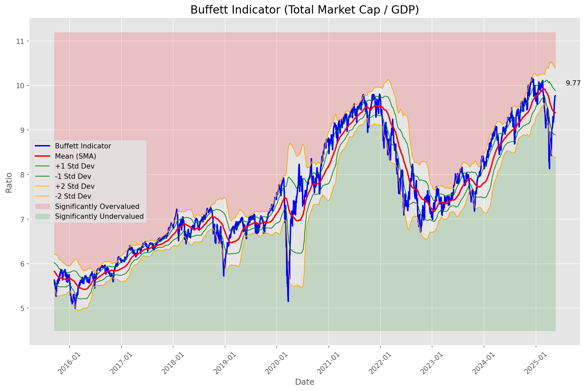
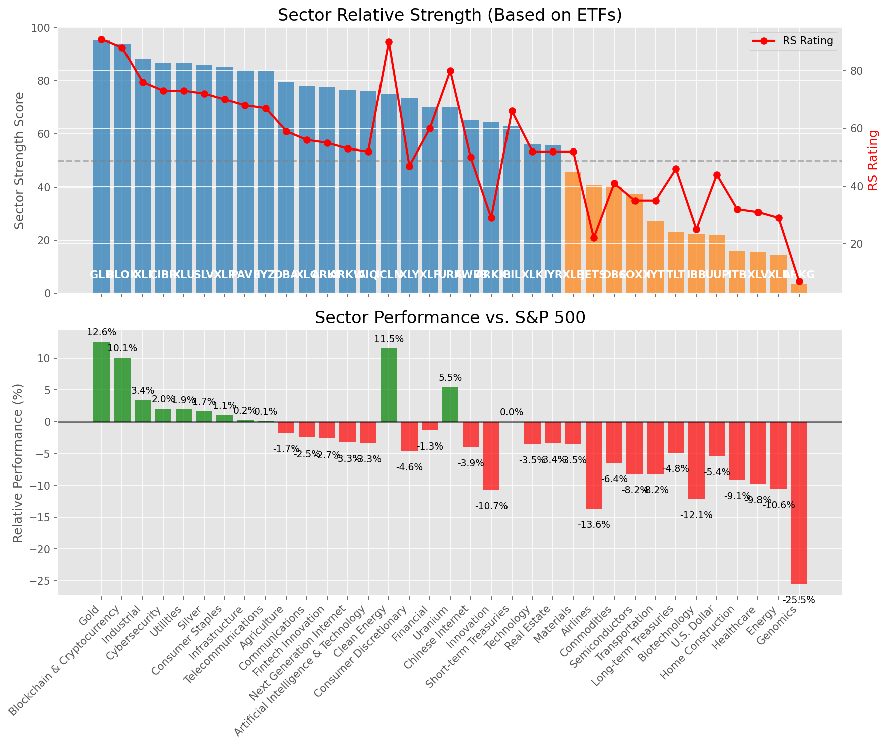

# **Daily Relative Strength Report**

**Date:** 2025-05-21

## **Market Valuation (Buffett Indicator)**

| Metric | Value |
|--------|-------|
| **Market Valuation** | **Fair Valued** |
| **Current Ratio** | 9.71 |
| **Historical Mean** | 9.39 |
| **Standard Deviation** | 0.49 |
| **Z-Score (StdDev from Mean)** | 0.71 |
| **Total Market Cap** | $291.10 trillion |
| **GDP** | $29.98 trillion |

## **Market Insights**

### **Market is Fairly Valued**

The market appears to be trading within a reasonable range of historical valuations. This suggests a balanced approach to equity investing is appropriate. Investors should:

- Focus on individual stock selection based on fundamentals and technicals
- Maintain normal equity allocations aligned with long-term goals
- Pay attention to sector rotation and relative strength
- Watch for changes in market leadership

Fair valuation typically suggests normal market returns can be expected, with stock selection becoming increasingly important.

### **Buffett Indicator Overview**

The Buffett Indicator (Total Market Cap / GDP) is a measure of the stock market's valuation relative to the size of the economy. It is named after Warren Buffett, who described it as "probably the best single measure of where valuations stand at any given moment."

- **Values above +2 standard deviations:** Market significantly overvalued
- **Values above +1 standard deviation:** Market overvalued
- **Values between -1 and +1 standard deviations:** Market fairly valued
- **Values below -1 standard deviation:** Market undervalued
- **Values below -2 standard deviations:** Market significantly undervalued

---

## **Sector Relative Strength**

Based on William O'Neil's Relative Strength Methodology

| ETF | Strength | RS Rating | Performance | Above Key MAs | Trend | Sector |
|-----|----------|-----------|-------------|--------------|-------|--------|
| [GLD](https://www.tradingview.com/chart/?symbol=GLD) | 95.5 | 91.0 | 12.69% | 10d ✓, 50d ✓, 200d ✓ | ↗️ | Gold |
| [BLOK](https://www.tradingview.com/chart/?symbol=BLOK) | 95.0 | 90.0 | 12.44% | 10d ✓, 50d ✓, 200d ✓ | ↗️ | Blockchain & Cryptocurrency |
| [XLI](https://www.tradingview.com/chart/?symbol=XLI) | 87.5 | 75.0 | 3.08% | 10d ✓, 50d ✓, 200d ✓ | ↗️ | Industrial |
| [XLU](https://www.tradingview.com/chart/?symbol=XLU) | 86.5 | 73.0 | 1.88% | 10d ✓, 50d ✓, 200d ✓ | ↗️ | Utilities |
| [SLV](https://www.tradingview.com/chart/?symbol=SLV) | 86.5 | 73.0 | 2.00% | 10d ✓, 50d ✓, 200d ✓ | ↗️ | Silver |
| [XLP](https://www.tradingview.com/chart/?symbol=XLP) | 84.5 | 69.0 | 0.64% | 10d ✓, 50d ✓, 200d ✓ | ↗️ | Consumer Staples |
| [CIBR](https://www.tradingview.com/chart/?symbol=CIBR) | 84.5 | 69.0 | 0.57% | 10d ✓, 50d ✓, 200d ✓ | ↗️ | Cybersecurity |
| [IYZ](https://www.tradingview.com/chart/?symbol=IYZ) | 83.5 | 67.0 | 0.07% | 10d ✓, 50d ✓, 200d ✓ | ↗️ | Telecommunications |
| [PAVE](https://www.tradingview.com/chart/?symbol=PAVE) | 82.0 | 64.0 | -0.33% | 10d ✓, 50d ✓, 200d ✓ | ↗️ | Infrastructure |
| [DBA](https://www.tradingview.com/chart/?symbol=DBA) | 79.0 | 58.0 | -2.03% | 10d ✓, 50d ✓, 200d ✓ | ↗️ | Agriculture |
| [XLC](https://www.tradingview.com/chart/?symbol=XLC) | 77.5 | 55.0 | -2.63% | 10d ✓, 50d ✓, 200d ✓ | ↗️ | Communications |
| [ICLN](https://www.tradingview.com/chart/?symbol=ICLN) | 76.0 | 92.0 | 12.99% | 10d ✓, 50d ✓, 200d ✓ | ↘️ | Clean Energy |
| [AIQ](https://www.tradingview.com/chart/?symbol=AIQ) | 75.5 | 51.0 | -3.51% | 10d ✓, 50d ✓, 200d ✓ | ↗️ | Artificial Intelligence & Technology |
| [ARKF](https://www.tradingview.com/chart/?symbol=ARKF) | 74.5 | 49.0 | -4.12% | 10d ✓, 50d ✓, 200d ✓ | ↗️ | Fintech Innovation |
| [XLY](https://www.tradingview.com/chart/?symbol=XLY) | 72.5 | 45.0 | -5.08% | 10d ✓, 50d ✓, 200d ✓ | ↗️ | Consumer Discretionary |
| [URA](https://www.tradingview.com/chart/?symbol=URA) | 69.5 | 79.0 | 4.84% | 10d ✓, 50d ✓, 200d ✓ | ↘️ | Uranium |
| [KWEB](https://www.tradingview.com/chart/?symbol=KWEB) | 68.1 | 56.0 | -2.33% | 10d ✗, 50d ✓, 200d ✓ | ↗️ | Chinese Internet |
| [XLF](https://www.tradingview.com/chart/?symbol=XLF) | 68.1 | 56.0 | -2.50% | 10d ✗, 50d ✓, 200d ✓ | ↗️ | Financial |
| [BIL](https://www.tradingview.com/chart/?symbol=BIL) | 63.0 | 66.0 | 0.02% | 10d ✓, 50d ✓, 200d ✓ | ↘️ | Short-term Treasuries |
| [ARKK](https://www.tradingview.com/chart/?symbol=ARKK) | 62.5 | 25.0 | -12.54% | 10d ✓, 50d ✓, 200d ✓ | ↗️ | Innovation |
| [IYR](https://www.tradingview.com/chart/?symbol=IYR) | 57.9 | 56.0 | -2.38% | 10d ✗, 50d ✓, 200d ✗ | ↗️ | Real Estate |
| [XLK](https://www.tradingview.com/chart/?symbol=XLK) | 56.5 | 53.0 | -3.22% | 10d ✓, 50d ✓, 200d ✓ | ↘️ | Technology |
| [JETS](https://www.tradingview.com/chart/?symbol=JETS) | 51.6 | 23.0 | -13.67% | 10d ✗, 50d ✓, 200d ✓ | ↗️ | Airlines |
| [SOXX](https://www.tradingview.com/chart/?symbol=SOXX) | 48.5 | 37.0 | -7.38% | 10d ✓, 50d ✓, 200d ✓ | ↘️ | Semiconductors |
| [XLB](https://www.tradingview.com/chart/?symbol=XLB) | 45.3 | 51.0 | -3.52% | 10d ✓, 50d ✓, 200d ✗ | ↘️ | Materials |
| [DBC](https://www.tradingview.com/chart/?symbol=DBC) | 29.9 | 40.0 | -6.62% | 10d ✓, 50d ✗, 200d ✗ | ↘️ | Commodities |
| [IYT](https://www.tradingview.com/chart/?symbol=IYT) | 27.4 | 35.0 | -8.13% | 10d ✗, 50d ✓, 200d ✗ | ↘️ | Transportation |
| [XLV](https://www.tradingview.com/chart/?symbol=XLV) | 26.4 | 33.0 | -9.04% | 10d ✓, 50d ✗, 200d ✗ | ↘️ | Healthcare |
| [TLT](https://www.tradingview.com/chart/?symbol=TLT) | 25.0 | 50.0 | -3.91% | 10d ✗, 50d ✗, 200d ✗ | ↘️ | Long-term Treasuries |
| [IBB](https://www.tradingview.com/chart/?symbol=IBB) | 23.9 | 28.0 | -11.08% | 10d ✓, 50d ✗, 200d ✗ | ↘️ | Biotechnology |
| [UUP](https://www.tradingview.com/chart/?symbol=UUP) | 21.0 | 42.0 | -6.05% | 10d ✗, 50d ✗, 200d ✗ | ↘️ | U.S. Dollar |
| [ITB](https://www.tradingview.com/chart/?symbol=ITB) | 17.5 | 35.0 | -8.21% | 10d ✗, 50d ✗, 200d ✗ | ↘️ | Home Construction |
| [XLE](https://www.tradingview.com/chart/?symbol=XLE) | 15.5 | 31.0 | -10.12% | 10d ✗, 50d ✗, 200d ✗ | ↘️ | Energy |
| [ARKG](https://www.tradingview.com/chart/?symbol=ARKG) | 3.0 | 6.0 | -28.14% | 10d ✗, 50d ✗, 200d ✗ | ↘️ | Genomics |
| [ARKW](https://www.tradingview.com/chart/?symbol=ARKW) | 0.0 | 0.0 | 0.00% | 10d ✗, 50d ✗, 200d ✗ | ↘️ | Next Generation Internet |

### **Sector ETF Performance Interpretation**

This table shows the relative strength metrics for different market sectors based on their representative ETFs:

- **ETF**: The ETF used to measure sector performance (click for chart)
- **Strength**: Overall sector strength score (0-100) combining multiple factors
- **RS Rating**: O'Neil RS rating of the sector ETF
- **Performance**: Performance of the sector ETF relative to SPY
- **Above Key MAs**: Whether the ETF is trading above its 10, 50, and 200-day moving averages
- **Trend**: Whether the sector is in an uptrend (↗️) or downtrend (↘️)

### **Current Sector Leadership**

The current market leadership is coming from the following sectors: **Gold, Blockchain & Cryptocurrency, Industrial**.

The **Gold** sector (represented by **GLD**) is showing particularly strong relative strength with an RS rating of 91.0 and performance of 12.69% vs. the S&P 500. This sector is trading above its 10-day, 50-day, 200-day moving average(s). Investors should consider focusing on high RS stocks within these leading sectors for potential outperformance.

---

## **Buy Recommendations**

The following 97 stocks show exceptional relative strength:

| RS Rating | Buy Score | Current Price | Chart | Name | Ticker |
|-----------|-----------|---------------|-------|------|--------|
| 100 | 100 | $199.37 | [Chart](https://www.tradingview.com/chart/?symbol=DAVE) | Dave Inc. Class A Common Stock | DAVE |
| 100 | 100 | $19.52 | [Chart](https://www.tradingview.com/chart/?symbol=SPNT) | SiriusPoint Ltd. | SPNT |
| 100 | 100 | $28.94 | [Chart](https://www.tradingview.com/chart/?symbol=DB) | Deutsche Bank Aktiengesellschaft | DB |
| 100 | 100 | $42.22 | [Chart](https://www.tradingview.com/chart/?symbol=FARO) | Faro Technologies Inc | FARO |
| 100 | 100 | $23.20 | [Chart](https://www.tradingview.com/chart/?symbol=PRA) | ProAssurance Corporation | PRA |
| 100 | 100 | $102.50 | [Chart](https://www.tradingview.com/chart/?symbol=SEZL) | Sezzle Inc. Common Stock | SEZL |
| 99 | 100 | $30.11 | [Chart](https://www.tradingview.com/chart/?symbol=FMS) | Fresenius Medical Care AG | FMS |
| 99 | 100 | $82.09 | [Chart](https://www.tradingview.com/chart/?symbol=RBLX) | Roblox Corporation | RBLX |
| 99 | 100 | $35.23 | [Chart](https://www.tradingview.com/chart/?symbol=KTOS) | Kratos Defense & Security Solutions, Inc. | KTOS |
| 99 | 100 | $26.56 | [Chart](https://www.tradingview.com/chart/?symbol=UVE) | UNIVERSAL INSURANCE HLDG, INC. | UVE |
| 99 | 100 | $162.57 | [Chart](https://www.tradingview.com/chart/?symbol=PLMR) | Palomar Holdings, Inc. Common stock | PLMR |
| 99 | 100 | $417.18 | [Chart](https://www.tradingview.com/chart/?symbol=MSTR) | MicroStrategy Inc | MSTR |
| 99 | 100 | $71.39 | [Chart](https://www.tradingview.com/chart/?symbol=ULS) | UL Solutions Inc. | ULS |
| 99 | 100 | $131.27 | [Chart](https://www.tradingview.com/chart/?symbol=VSEC) | VSE Corp | VSEC |
| 99 | 100 | $24.64 | [Chart](https://www.tradingview.com/chart/?symbol=GRND) | Grindr Inc. | GRND |
| 98 | 100 | $133.28 | [Chart](https://www.tradingview.com/chart/?symbol=ATGE) | Adtalem Global Education Inc. Common Shares | ATGE |
| 98 | 100 | $44.23 | [Chart](https://www.tradingview.com/chart/?symbol=EXEL) | Exelixis Inc | EXEL |
| 98 | 100 | $38.22 | [Chart](https://www.tradingview.com/chart/?symbol=AS) | Amer Sports, Inc. | AS |
| 97 | 100 | $164.77 | [Chart](https://www.tradingview.com/chart/?symbol=SE) | Sea Limited American Depositary Shares, each representing one Class A Ordinary Share | SE |
| 97 | 100 | $35.32 | [Chart](https://www.tradingview.com/chart/?symbol=UTI) | Universal Technical Institute, Inc. | UTI |
| 97 | 100 | $89.70 | [Chart](https://www.tradingview.com/chart/?symbol=RBRK) | Rubrik, Inc. | RBRK |
| 97 | 100 | $140.58 | [Chart](https://www.tradingview.com/chart/?symbol=UGL) | ProShares Ultra Gold | UGL |
| 97 | 100 | $153.76 | [Chart](https://www.tradingview.com/chart/?symbol=CAH) | Cardinal Health, Inc. | CAH |
| 97 | 100 | $21.31 | [Chart](https://www.tradingview.com/chart/?symbol=TFPM) | Triple Flag Precious Metals Corp. | TFPM |
| 97 | 100 | $85.38 | [Chart](https://www.tradingview.com/chart/?symbol=WPM) | Wheaton Precious Metals Corp. Common Stock | WPM |
| 97 | 100 | $39.38 | [Chart](https://www.tradingview.com/chart/?symbol=PAY) | Paymentus Holdings, Inc. | PAY |
| 97 | 100 | $32.02 | [Chart](https://www.tradingview.com/chart/?symbol=EUFN) | iShares MSCI Europe Financials ETF | EUFN |
| 97 | 100 | $281.28 | [Chart](https://www.tradingview.com/chart/?symbol=VRSN) | VeriSign Inc | VRSN |
| 97 | 100 | $461.16 | [Chart](https://www.tradingview.com/chart/?symbol=GEV) | GE Vernova Inc. | GEV |
| 97 | 100 | $100.11 | [Chart](https://www.tradingview.com/chart/?symbol=LBRDK) | Liberty Broadband Corporation Class C | LBRDK |
| 97 | 100 | $73.30 | [Chart](https://www.tradingview.com/chart/?symbol=WRB) | W.R. Berkley Corporation | WRB |
| 96 | 100 | $48.12 | [Chart](https://www.tradingview.com/chart/?symbol=EWI) | iShares MSCI Italy ETF | EWI |
| 96 | 100 | $120.51 | [Chart](https://www.tradingview.com/chart/?symbol=EHC) | Encompass Health Corporation Common Stock | EHC |
| 96 | 100 | $178.50 | [Chart](https://www.tradingview.com/chart/?symbol=RGLD) | Royal Gold Inc | RGLD |
| 96 | 100 | $164.79 | [Chart](https://www.tradingview.com/chart/?symbol=HWM) | Howmet Aerospace Inc. | HWM |
| 96 | 100 | $31.41 | [Chart](https://www.tradingview.com/chart/?symbol=TGS) | Transportadora de Gas del Sur S.A. ADS | TGS |
| 96 | 100 | $128.75 | [Chart](https://www.tradingview.com/chart/?symbol=COOP) | Mr. Cooper Group Inc. Common Stock | COOP |
| 95 | 100 | $114.97 | [Chart](https://www.tradingview.com/chart/?symbol=AEM) | Agnico Eagle Mines Ltd. | AEM |
| 95 | 100 | $31.03 | [Chart](https://www.tradingview.com/chart/?symbol=BCH) | Banco de ChileAmerican Depositary Shares (Each representing 200 shares of Common Stock) | BCH |
| 94 | 100 | $130.52 | [Chart](https://www.tradingview.com/chart/?symbol=HIG) | The Hartford Insurance Group, Inc. | HIG |
| 94 | 100 | $44.56 | [Chart](https://www.tradingview.com/chart/?symbol=BTI) | British American Tobacco p.l.c. American Depositary Shares, American Depositary Shares, each representing one Ordinary Share | BTI |
| 94 | 100 | $174.59 | [Chart](https://www.tradingview.com/chart/?symbol=PM) | Philip Morris International Inc. | PM |
| 94 | 100 | $17.81 | [Chart](https://www.tradingview.com/chart/?symbol=BCS) | Barclays PLC | BCS |
| 94 | 100 | $42.10 | [Chart](https://www.tradingview.com/chart/?symbol=EWG) | iShares MSCI Germany ETF | EWG |
| 94 | 100 | $1208.06 | [Chart](https://www.tradingview.com/chart/?symbol=NFLX) | NetFlix Inc | NFLX |
| 93 | 100 | $30.68 | [Chart](https://www.tradingview.com/chart/?symbol=NTGR) | NETGEAR, Inc. | NTGR |
| 93 | 100 | $25.32 | [Chart](https://www.tradingview.com/chart/?symbol=BSAC) | Banco Santander-Chile | BSAC |
| 92 | 100 | $62.07 | [Chart](https://www.tradingview.com/chart/?symbol=IBIT) | iShares Bitcoin Trust ETF | IBIT |
| 92 | 100 | $30.89 | [Chart](https://www.tradingview.com/chart/?symbol=HODL) | VanEck Bitcoin ETF | HODL |
| 91 | 100 | $66.68 | [Chart](https://www.tradingview.com/chart/?symbol=HOOD) | Robinhood Markets, Inc. Class A Common Stock | HOOD |
| 91 | 100 | $33.03 | [Chart](https://www.tradingview.com/chart/?symbol=IAUM) | iShares Gold Trust Micro | IAUM |
| 91 | 100 | $305.22 | [Chart](https://www.tradingview.com/chart/?symbol=GLD) | SPDR Gold Trust, SPDR Gold Shares | GLD |
| 91 | 100 | $62.45 | [Chart](https://www.tradingview.com/chart/?symbol=IAU) | iShares Gold Trust | IAU |
| 91 | 100 | $236.93 | [Chart](https://www.tradingview.com/chart/?symbol=GE) | GE Aerospace | GE |
| 91 | 100 | $31.59 | [Chart](https://www.tradingview.com/chart/?symbol=SGOL) | abrdn Physical Gold Shares ETF | SGOL |
| 91 | 100 | $126.43 | [Chart](https://www.tradingview.com/chart/?symbol=PLTR) | Palantir Technologies Inc. Class A Common Stock | PLTR |
| 90 | 100 | $102.83 | [Chart](https://www.tradingview.com/chart/?symbol=AXS) | Axis Capital Holders Limited | AXS |
| 90 | 100 | $172.85 | [Chart](https://www.tradingview.com/chart/?symbol=ITA) | iShares U.S. Aerospace & Defense ETF | ITA |
| 90 | 100 | $117.89 | [Chart](https://www.tradingview.com/chart/?symbol=BJ) | BJs Wholesale Club Holdings, Inc. Common Stock | BJ |
| 90 | 100 | $59.70 | [Chart](https://www.tradingview.com/chart/?symbol=MO) | Altria Group, Inc. | MO |
| 90 | 100 | $280.66 | [Chart](https://www.tradingview.com/chart/?symbol=CME) | CME Group Inc. | CME |
| 90 | 100 | $19.43 | [Chart](https://www.tradingview.com/chart/?symbol=KT) | KT Corp. | KT |
| 90 | 100 | $82.30 | [Chart](https://www.tradingview.com/chart/?symbol=LB) | LandBridge Company LLC | LB |
| 89 | 100 | $233.81 | [Chart](https://www.tradingview.com/chart/?symbol=CRS) | Carpenter Technology Corp | CRS |
| 89 | 100 | $25.27 | [Chart](https://www.tradingview.com/chart/?symbol=PHYS) | Sprott Physical Gold Trust | PHYS |
| 88 | 100 | $81.15 | [Chart](https://www.tradingview.com/chart/?symbol=NFG) | National Fuel Gas Co. | NFG |
| 87 | 100 | $252.05 | [Chart](https://www.tradingview.com/chart/?symbol=RSG) | Republic Services Inc. | RSG |
| 89 | 99 | $64.31 | [Chart](https://www.tradingview.com/chart/?symbol=RYTM) | Rhythm Pharmaceuticals, Inc. Common Stock | RYTM |
| 88 | 98 | $33.72 | [Chart](https://www.tradingview.com/chart/?symbol=FDP) | Fresh Del Monte Produce Inc. | FDP |
| 87 | 98 | $55.39 | [Chart](https://www.tradingview.com/chart/?symbol=RELX) | RELX PLC | RELX |
| 87 | 98 | $137.12 | [Chart](https://www.tradingview.com/chart/?symbol=RTX) | RTX Corporation | RTX |
| 85 | 98 | $81.29 | [Chart](https://www.tradingview.com/chart/?symbol=UNM) | Unum Group | UNM |
| 85 | 98 | $29.32 | [Chart](https://www.tradingview.com/chart/?symbol=CEF) | Sprott Physical Gold and Silver Trust | CEF |
| 85 | 98 | $35.51 | [Chart](https://www.tradingview.com/chart/?symbol=UGI) | UGI Corporation | UGI |
| 87 | 97 | $48.15 | [Chart](https://www.tradingview.com/chart/?symbol=FTS) | Fortis Inc. Common Shares | FTS |
| 83 | 97 | $1386.22 | [Chart](https://www.tradingview.com/chart/?symbol=ORLY) | O'Reilly Automotive, Inc. | ORLY |
| 86 | 96 | $31.32 | [Chart](https://www.tradingview.com/chart/?symbol=PRDO) | Perdoceo Education Corporation | PRDO |
| 85 | 96 | $58.80 | [Chart](https://www.tradingview.com/chart/?symbol=IGF) | iShares Global Infrastructure ETF | IGF |
| 84 | 96 | $47.53 | [Chart](https://www.tradingview.com/chart/?symbol=MRCY) | Mercury Systems Inc. | MRCY |
| 85 | 95 | $49.65 | [Chart](https://www.tradingview.com/chart/?symbol=TRP) | TC Energy Corporation | TRP |
| 82 | 95 | $229.75 | [Chart](https://www.tradingview.com/chart/?symbol=TTWO) | Take-Two Interactive Software Inc | TTWO |
| 81 | 95 | $23.86 | [Chart](https://www.tradingview.com/chart/?symbol=SRAD) | Sportradar Group AG Class A Ordinary Shares | SRAD |
| 80 | 95 | $27.59 | [Chart](https://www.tradingview.com/chart/?symbol=T) | AT&T Inc. | T |
| 84 | 94 | $18.30 | [Chart](https://www.tradingview.com/chart/?symbol=MIR) | Mirion Technologies, Inc. | MIR |
| 82 | 94 | $197.11 | [Chart](https://www.tradingview.com/chart/?symbol=LOPE) | Grand Canyon Education, Inc | LOPE |
| 82 | 94 | $43.96 | [Chart](https://www.tradingview.com/chart/?symbol=HMN) | Horace Mann Educators Corporation | HMN |
| 81 | 94 | $157.28 | [Chart](https://www.tradingview.com/chart/?symbol=ATO) | Atmos Energy Corporation | ATO |
| 83 | 93 | $225.75 | [Chart](https://www.tradingview.com/chart/?symbol=CBOE) | Cboe Global Markets, Inc. | CBOE |
| 81 | 93 | $32.78 | [Chart](https://www.tradingview.com/chart/?symbol=ZLAB) | Zai Lab Limited American Depositary Shares | ZLAB |
| 81 | 92 | $13.89 | [Chart](https://www.tradingview.com/chart/?symbol=MUFG) | Mitsubishi UFJ Financial Group, Inc. | MUFG |
| 81 | 92 | $297.73 | [Chart](https://www.tradingview.com/chart/?symbol=CVNA) | Carvana Co. | CVNA |
| 81 | 92 | $312.93 | [Chart](https://www.tradingview.com/chart/?symbol=VRSK) | Verisk Analytics, Inc. Common Stock | VRSK |
| 80 | 92 | $59.90 | [Chart](https://www.tradingview.com/chart/?symbol=HSBC) | HSBC Holdings PLC | HSBC |
| 81 | 91 | $176.69 | [Chart](https://www.tradingview.com/chart/?symbol=ICE) | Intercontinental Exchange  Inc. | ICE |
| 80 | 91 | $200.05 | [Chart](https://www.tradingview.com/chart/?symbol=DFS) | Discover Financial Services | DFS |
| 81 | 90 | $194.92 | [Chart](https://www.tradingview.com/chart/?symbol=GPOR) | Gulfport Energy Corporation | GPOR |
| 80 | 90 | $96.99 | [Chart](https://www.tradingview.com/chart/?symbol=CALM) | Cal-Maine Foods Inc | CALM |

---

## **Sell Recommendations**

The following 115 stocks show deteriorating relative strength:

| RS Rating | Sell Score | Current Price | Chart | Name | Ticker |
|-----------|------------|---------------|-------|------|--------|
| 1 | 100 | $17.26 | [Chart](https://www.tradingview.com/chart/?symbol=FWRD) | Forward Air Corp | FWRD |
| 1 | 100 | $17.64 | [Chart](https://www.tradingview.com/chart/?symbol=BEAM) | Beam Therapeutics Inc. Common Stock | BEAM |
| 2 | 100 | $53.87 | [Chart](https://www.tradingview.com/chart/?symbol=LABU) | Direxion Daily S&P Biotech Bull 3X Shares | LABU |
| 2 | 100 | $29.53 | [Chart](https://www.tradingview.com/chart/?symbol=TWST) | Twist Bioscience Corporation Common Stock | TWST |
| 2 | 100 | $13.06 | [Chart](https://www.tradingview.com/chart/?symbol=IART) | Integra LifeSciences Holdings | IART |
| 2 | 100 | $48.35 | [Chart](https://www.tradingview.com/chart/?symbol=CCOI) | Cogent Communications Holdings, Inc. | CCOI |
| 3 | 100 | $26.33 | [Chart](https://www.tradingview.com/chart/?symbol=FIVN) | FIVE9, INC. | FIVN |
| 3 | 100 | $10.55 | [Chart](https://www.tradingview.com/chart/?symbol=MBC) | MasterBrand, Inc. | MBC |
| 3 | 100 | $11.45 | [Chart](https://www.tradingview.com/chart/?symbol=CLB) | Core Laboratories Inc. | CLB |
| 3 | 100 | $14.06 | [Chart](https://www.tradingview.com/chart/?symbol=DQ) | Daqo New Energy Corp. American Depositary Shares (each representing 5 Ordinary Shares) | DQ |
| 3 | 100 | $13.87 | [Chart](https://www.tradingview.com/chart/?symbol=DNLI) | Denali Therapeutics Inc. Common Stock | DNLI |
| 4 | 100 | $46.80 | [Chart](https://www.tradingview.com/chart/?symbol=WFRD) | Weatherford International plc Ordinary Shares | WFRD |
| 4 | 100 | $17.62 | [Chart](https://www.tradingview.com/chart/?symbol=VRNT) | Verint Systems Inc | VRNT |
| 4 | 100 | $23.09 | [Chart](https://www.tradingview.com/chart/?symbol=RPD) | Rapid7, Inc. Common Stock | RPD |
| 4 | 100 | $10.22 | [Chart](https://www.tradingview.com/chart/?symbol=HPK) | HighPeak Energy, Inc. Common Stock | HPK |
| 4 | 100 | $14.91 | [Chart](https://www.tradingview.com/chart/?symbol=PENN) | PENN Entertainment, Inc. Common Stock | PENN |
| 5 | 100 | $20.54 | [Chart](https://www.tradingview.com/chart/?symbol=VERA) | Vera Therapeutics, Inc. Class A Common Stock | VERA |
| 5 | 100 | $12.70 | [Chart](https://www.tradingview.com/chart/?symbol=ARCT) | Arcturus Therapeutics Holdings Inc. Common Stock | ARCT |
| 5 | 100 | $32.09 | [Chart](https://www.tradingview.com/chart/?symbol=CYTK) | Cytokinetics Inc. | CYTK |
| 5 | 100 | $14.77 | [Chart](https://www.tradingview.com/chart/?symbol=IMVT) | Immunovant, Inc. Common Stock | IMVT |
| 6 | 100 | $11.05 | [Chart](https://www.tradingview.com/chart/?symbol=LSPD) | Lightspeed Commerce Inc. | LSPD |
| 8 | 100 | $14.48 | [Chart](https://www.tradingview.com/chart/?symbol=INMD) | InMode Ltd. Ordinary Shares | INMD |
| 8 | 100 | $15.27 | [Chart](https://www.tradingview.com/chart/?symbol=DXC) | DXC Technology Company | DXC |
| 8 | 100 | $21.18 | [Chart](https://www.tradingview.com/chart/?symbol=UCO) | ProShares Ultra Bloomberg Crude Oil | UCO |
| 9 | 100 | $21.01 | [Chart](https://www.tradingview.com/chart/?symbol=AMRK) | A-Mark Precious Metals, Inc. | AMRK |
| 10 | 100 | $43.59 | [Chart](https://www.tradingview.com/chart/?symbol=MTDR) | MATADOR RESOURCES COMPANY | MTDR |
| 10 | 100 | $46.60 | [Chart](https://www.tradingview.com/chart/?symbol=RHI) | Robert Half Inc. | RHI |
| 13 | 100 | $91.81 | [Chart](https://www.tradingview.com/chart/?symbol=CHRD) | Chord Energy Corporation Common Stock | CHRD |
| 14 | 100 | $15.74 | [Chart](https://www.tradingview.com/chart/?symbol=AMZY) | YieldMax AMZN Option Income Strategy ETF | AMZY |
| 17 | 100 | $18.05 | [Chart](https://www.tradingview.com/chart/?symbol=NVDS) | Investment Managers Series Trust II Tradr 1.5X Short NVDA Daily ETF | NVDS |
| 19 | 100 | $11.25 | [Chart](https://www.tradingview.com/chart/?symbol=GES) | Guess?, Inc. | GES |
| 22 | 100 | $46.98 | [Chart](https://www.tradingview.com/chart/?symbol=LINE) | Lineage, Inc. Common Stock | LINE |
| 8 | 99 | $22.16 | [Chart](https://www.tradingview.com/chart/?symbol=SPT) | Sprout Social, Inc Class A Common Stock | SPT |
| 8 | 99 | $126.86 | [Chart](https://www.tradingview.com/chart/?symbol=TFX) | Teleflex Incorporated | TFX |
| 9 | 99 | $11.65 | [Chart](https://www.tradingview.com/chart/?symbol=APLE) | Apple Hospitality REIT, Inc. | APLE |
| 17 | 99 | $10.34 | [Chart](https://www.tradingview.com/chart/?symbol=CMRE) | Costamare Inc. | CMRE |
| 21 | 99 | $14.83 | [Chart](https://www.tradingview.com/chart/?symbol=FXN) | First Trust Energy AlphaDEX Fund | FXN |
| 7 | 98 | $89.92 | [Chart](https://www.tradingview.com/chart/?symbol=BCC) | Boise Cascade Company | BCC |
| 8 | 98 | $79.95 | [Chart](https://www.tradingview.com/chart/?symbol=WHR) | Whirlpool Corp. | WHR |
| 9 | 98 | $11.80 | [Chart](https://www.tradingview.com/chart/?symbol=WEN) | The Wendy's Company | WEN |
| 9 | 98 | $10.47 | [Chart](https://www.tradingview.com/chart/?symbol=PK) | Park Hotels & Resorts Inc. Common Stock | PK |
| 11 | 98 | $219.72 | [Chart](https://www.tradingview.com/chart/?symbol=OIH) | VanEck Oil Services ETF | OIH |
| 6 | 97 | $10.28 | [Chart](https://www.tradingview.com/chart/?symbol=SONO) | Sonos, Inc. Common Stock | SONO |
| 6 | 97 | $10.31 | [Chart](https://www.tradingview.com/chart/?symbol=VREX) | Varex Imaging Corporation Common Stock | VREX |
| 8 | 97 | $33.35 | [Chart](https://www.tradingview.com/chart/?symbol=ENOV) | Enovis Corporation | ENOV |
| 10 | 97 | $48.95 | [Chart](https://www.tradingview.com/chart/?symbol=ERX) | Direxion Daily Energy Bull 2X Shares | ERX |
| 6 | 96 | $21.42 | [Chart](https://www.tradingview.com/chart/?symbol=ARKG) | ARK Genomic Revolution ETF | ARKG |
| 6 | 95 | $48.89 | [Chart](https://www.tradingview.com/chart/?symbol=LSCC) | Lattice Semiconductor Corp | LSCC |
| 11 | 95 | $26.64 | [Chart](https://www.tradingview.com/chart/?symbol=WERN) | Werner Enterprises Inc | WERN |
| 14 | 95 | $11.99 | [Chart](https://www.tradingview.com/chart/?symbol=PBR) | PETROLEO BRASILEIRO S.A.-PETROBRAS ADS (REP 1 COMMON SHARE) | PBR |
| 18 | 95 | $11.30 | [Chart](https://www.tradingview.com/chart/?symbol=PBR.A) | Petroleo Brasileiro S.A.-Petrobras | PBR.A |
| 10 | 94 | $111.34 | [Chart](https://www.tradingview.com/chart/?symbol=BLDR) | Builders FirstSource, Inc. | BLDR |
| 15 | 94 | $36.33 | [Chart](https://www.tradingview.com/chart/?symbol=RARE) | Ultragenyx Pharmaceutical Inc. | RARE |
| 18 | 94 | $19.40 | [Chart](https://www.tradingview.com/chart/?symbol=BITI) | ProShares Short Bitcoin ETF | BITI |
| 20 | 94 | $52.62 | [Chart](https://www.tradingview.com/chart/?symbol=KBH) | KB Home | KBH |
| 20 | 94 | $11.18 | [Chart](https://www.tradingview.com/chart/?symbol=GSBD) | Goldman Sachs BDC, Inc. | GSBD |
| 22 | 94 | $10.04 | [Chart](https://www.tradingview.com/chart/?symbol=LBTYK) | Liberty Global Ltd. Class C Common Shares | LBTYK |
| 14 | 93 | $64.00 | [Chart](https://www.tradingview.com/chart/?symbol=SPB) | Spectrum Brands Holdings, Inc. | SPB |
| 23 | 93 | $13.03 | [Chart](https://www.tradingview.com/chart/?symbol=ZUMZ) | Zumiez Inc. | ZUMZ |
| 10 | 92 | $10.51 | [Chart](https://www.tradingview.com/chart/?symbol=VYX) | NCR Voyix Corporation | VYX |
| 14 | 92 | $110.93 | [Chart](https://www.tradingview.com/chart/?symbol=A) | Agilent Technologies Inc. | A |
| 14 | 92 | $82.20 | [Chart](https://www.tradingview.com/chart/?symbol=EMN) | Eastman Chemical Company | EMN |
| 15 | 92 | $34.45 | [Chart](https://www.tradingview.com/chart/?symbol=SLB) | Schlumberger Limited | SLB |
| 17 | 92 | $17.55 | [Chart](https://www.tradingview.com/chart/?symbol=COLD) | Americold Realty Trust, Inc. | COLD |
| 15 | 90 | $32.53 | [Chart](https://www.tradingview.com/chart/?symbol=TENB) | Tenable Holdings, Inc. | TENB |
| 11 | 89 | $25.58 | [Chart](https://www.tradingview.com/chart/?symbol=IRDM) | Iridium Communications Inc. | IRDM |
| 17 | 89 | $30.50 | [Chart](https://www.tradingview.com/chart/?symbol=CRNX) | Crinetics Pharmaceuticals, Inc. | CRNX |
| 19 | 89 | $36.12 | [Chart](https://www.tradingview.com/chart/?symbol=TECK) | Teck Resources Limited | TECK |
| 19 | 89 | $31.80 | [Chart](https://www.tradingview.com/chart/?symbol=DVN) | Devon Energy Corporation | DVN |
| 19 | 89 | $29.13 | [Chart](https://www.tradingview.com/chart/?symbol=BP) | BP p.l.c. | BP |
| 20 | 89 | $10.29 | [Chart](https://www.tradingview.com/chart/?symbol=HOPE) | Hope Bancorp, Inc. | HOPE |
| 18 | 87 | $71.62 | [Chart](https://www.tradingview.com/chart/?symbol=WD) | Walker & Dunlop, Inc. | WD |
| 18 | 87 | $131.54 | [Chart](https://www.tradingview.com/chart/?symbol=KRYS) | Krystal Biotech, Inc. Common Stock | KRYS |
| 30 | 87 | $65.71 | [Chart](https://www.tradingview.com/chart/?symbol=MTH) | Meritage Homes Corporation | MTH |
| 16 | 86 | $34.05 | [Chart](https://www.tradingview.com/chart/?symbol=TECS) | Direxion Daily Technology Bear 3x Shares | TECS |
| 21 | 86 | $23.09 | [Chart](https://www.tradingview.com/chart/?symbol=GPK) | Graphic Packaging Holding Company | GPK |
| 24 | 86 | $16.09 | [Chart](https://www.tradingview.com/chart/?symbol=PD) | PagerDuty, Inc. | PD |
| 25 | 86 | $10.15 | [Chart](https://www.tradingview.com/chart/?symbol=SCS) | Steelcase, Inc. | SCS |
| 18 | 85 | $64.19 | [Chart](https://www.tradingview.com/chart/?symbol=MAS) | Masco Corporation | MAS |
| 21 | 85 | $11.24 | [Chart](https://www.tradingview.com/chart/?symbol=NEWT) | NewtekOne, Inc. Common Stock | NEWT |
| 25 | 85 | $14.70 | [Chart](https://www.tradingview.com/chart/?symbol=HR) | Healthcare Realty Trust Incorporated | HR |
| 27 | 85 | $16.73 | [Chart](https://www.tradingview.com/chart/?symbol=MLNK) | MeridianLink, Inc. | MLNK |
| 16 | 84 | $12.91 | [Chart](https://www.tradingview.com/chart/?symbol=ERII) | Energy Recovery, Inc. | ERII |
| 17 | 84 | $111.85 | [Chart](https://www.tradingview.com/chart/?symbol=EOG) | EOG Resources, Inc. | EOG |
| 18 | 83 | $15.54 | [Chart](https://www.tradingview.com/chart/?symbol=BCSF) | Bain Capital Specialty Finance, Inc. | BCSF |
| 20 | 83 | $56.73 | [Chart](https://www.tradingview.com/chart/?symbol=TRNO) | Terreno Realty Corporation | TRNO |
| 21 | 83 | $31.61 | [Chart](https://www.tradingview.com/chart/?symbol=AXTA) | Axalta Coating Systems Ltd. | AXTA |
| 22 | 83 | $11.66 | [Chart](https://www.tradingview.com/chart/?symbol=TWO) | Two Harbors Investment Corp. | TWO |
| 22 | 83 | $14.50 | [Chart](https://www.tradingview.com/chart/?symbol=RYLD) | Global X Russell 2000 Covered Call ETF | RYLD |
| 26 | 83 | $17.60 | [Chart](https://www.tradingview.com/chart/?symbol=STR) | Sitio Royalties Corp. | STR |
| 26 | 83 | $25.68 | [Chart](https://www.tradingview.com/chart/?symbol=WY) | Weyerhaeuser Company | WY |
| 28 | 83 | $35.37 | [Chart](https://www.tradingview.com/chart/?symbol=SU) | Suncor Energy, Inc. | SU |
| 29 | 83 | $14.34 | [Chart](https://www.tradingview.com/chart/?symbol=OCSL) | Oaktree Specialty Lending Corporation | OCSL |
| 31 | 82 | $34.83 | [Chart](https://www.tradingview.com/chart/?symbol=CPB) | The Campbell's Company Common Stock | CPB |
| 36 | 82 | $147.82 | [Chart](https://www.tradingview.com/chart/?symbol=MTN) | Vail Resorts, Inc. | MTN |
| 26 | 80 | $10.40 | [Chart](https://www.tradingview.com/chart/?symbol=SEMR) | SEMrush Holdings, Inc. | SEMR |
| 26 | 80 | $34.12 | [Chart](https://www.tradingview.com/chart/?symbol=SQM) | Sociedad Quimica y Minera de Chile SA | SQM |
| 27 | 80 | $88.05 | [Chart](https://www.tradingview.com/chart/?symbol=COP) | ConocoPhillips | COP |
| 31 | 79 | $59.11 | [Chart](https://www.tradingview.com/chart/?symbol=BMRN) | BioMarin Pharmaceuticals Inc | BMRN |
| 31 | 79 | $15.02 | [Chart](https://www.tradingview.com/chart/?symbol=SAFE) | Safehold Inc. | SAFE |
| 37 | 78 | $10.88 | [Chart](https://www.tradingview.com/chart/?symbol=LBTYA) | Liberty Global Ltd. Class A Common Shares | LBTYA |
| 23 | 77 | $136.32 | [Chart](https://www.tradingview.com/chart/?symbol=CVX) | Chevron Corporation | CVX |
| 25 | 77 | $131.00 | [Chart](https://www.tradingview.com/chart/?symbol=HES) | Hess Corporation | HES |
| 28 | 77 | $18.02 | [Chart](https://www.tradingview.com/chart/?symbol=UE) | UBRAN EDGE PROPERTIES | UE |
| 32 | 77 | $291.23 | [Chart](https://www.tradingview.com/chart/?symbol=BLD) | TopBuild Corp. Common Stock | BLD |
| 38 | 77 | $26.02 | [Chart](https://www.tradingview.com/chart/?symbol=RCI) | Rogers Communications, Inc. | RCI |
| 28 | 74 | $10.33 | [Chart](https://www.tradingview.com/chart/?symbol=LADR) | LADDER CAPITAL CORP | LADR |
| 35 | 73 | $12.66 | [Chart](https://www.tradingview.com/chart/?symbol=PMT) | PennyMac Mortgage Investment Trust | PMT |
| 31 | 71 | $82.71 | [Chart](https://www.tradingview.com/chart/?symbol=XLE) | Energy Select Sector SPDR Fund | XLE |
| 33 | 70 | $22.07 | [Chart](https://www.tradingview.com/chart/?symbol=MGY) | Magnolia Oil & Gas Corporation Class A Common Stock | MGY |
| 38 | 70 | $161.18 | [Chart](https://www.tradingview.com/chart/?symbol=IBP) | INSTALLED BUILDING PRODUCTS, INC. | IBP |
| 34 | 68 | $21.32 | [Chart](https://www.tradingview.com/chart/?symbol=REM) | iShares Mortgage Real Estate ETF | REM |
| 35 | 68 | $92.27 | [Chart](https://www.tradingview.com/chart/?symbol=ITB) | iShares U.S. Home Construction ETF | ITB |
| 39 | 65 | $34.92 | [Chart](https://www.tradingview.com/chart/?symbol=NSA) | National Storage Affiliates Trust | NSA |
| 39 | 61 | $14.52 | [Chart](https://www.tradingview.com/chart/?symbol=GOF) | Guggenheim Strategic Opportunities Fund | GOF |

## **Methodology**

This report uses William O'Neil's relative strength methodology from Investors Business Daily:

* **RS Rating**: Percentile rank of stock's performance vs. S&P 500 over the past 63 trading days (1-99 scale)
* **Buy Criteria**: RS Rating >= 80, price above 50-day MA, strong uptrend, increasing volume
* **Sell Criteria**: RS Rating < 40, price below 50-day MA, downtrend, decreasing volume

### **O'Neil's Key Principles**

1. **Focus on relative performance** - stocks outperforming the market
2. **Price trend confirmation** - stock must be in an uptrend
3. **Volume confirmation** - strong volume supports price moves
4. **Moving average validation** - price above key moving averages
5. **Market leaders only** - concentrate on top-performing stocks

*Report generated automatically after market close*