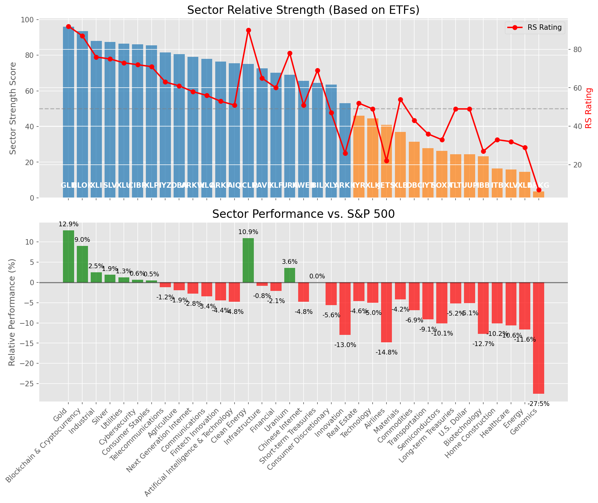

# **Daily Relative Strength Report**

**Date:** 2025-05-21

## **Market Valuation (Buffett Indicator)**

| Metric | Value |
|--------|-------|
| **Market Valuation** | **Fair Valued** |
| **Current Ratio** | 9.66 |
| **Historical Mean** | 9.39 |
| **Standard Deviation** | 0.49 |
| **Z-Score (StdDev from Mean)** | 0.71 |
| **Total Market Cap** | $289.49 trillion |
| **GDP** | $29.98 trillion |

## **Market Insights**

### **Market is Fairly Valued**

The market appears to be trading within a reasonable range of historical valuations. This suggests a balanced approach to equity investing is appropriate. Investors should:

- Focus on individual stock selection based on fundamentals and technicals
- Maintain normal equity allocations aligned with long-term goals
- Pay attention to sector rotation and relative strength
- Watch for changes in market leadership

Fair valuation typically suggests normal market returns can be expected, with stock selection becoming increasingly important.

### **Buffett Indicator Overview**

The Buffett Indicator (Total Market Cap / GDP) is a measure of the stock market's valuation relative to the size of the economy. It is named after Warren Buffett, who described it as "probably the best single measure of where valuations stand at any given moment."

- **Values above +2 standard deviations:** Market significantly overvalued
- **Values above +1 standard deviation:** Market overvalued
- **Values between -1 and +1 standard deviations:** Market fairly valued
- **Values below -1 standard deviation:** Market undervalued
- **Values below -2 standard deviations:** Market significantly undervalued

---

## **Sector Relative Strength**

Based on William O'Neil's Relative Strength Methodology

| ETF | Strength | RS Rating | Performance | Above Key MAs | Trend | Sector |
|-----|----------|-----------|-------------|--------------|-------|--------|
| [GLD](https://www.tradingview.com/chart/?symbol=GLD) | 95.5 | 91.0 | 12.62% | 10d ✓, 50d ✓, 200d ✓ | ↗️ | Gold |
| [BLOK](https://www.tradingview.com/chart/?symbol=BLOK) | 94.0 | 88.0 | 10.12% | 10d ✓, 50d ✓, 200d ✓ | ↗️ | Blockchain & Cryptocurrency |
| [XLI](https://www.tradingview.com/chart/?symbol=XLI) | 88.0 | 76.0 | 3.40% | 10d ✓, 50d ✓, 200d ✓ | ↗️ | Industrial |
| [CIBR](https://www.tradingview.com/chart/?symbol=CIBR) | 86.5 | 73.0 | 2.04% | 10d ✓, 50d ✓, 200d ✓ | ↗️ | Cybersecurity |
| [XLU](https://www.tradingview.com/chart/?symbol=XLU) | 86.5 | 73.0 | 1.94% | 10d ✓, 50d ✓, 200d ✓ | ↗️ | Utilities |
| [SLV](https://www.tradingview.com/chart/?symbol=SLV) | 86.0 | 72.0 | 1.70% | 10d ✓, 50d ✓, 200d ✓ | ↗️ | Silver |
| [XLP](https://www.tradingview.com/chart/?symbol=XLP) | 85.0 | 70.0 | 1.05% | 10d ✓, 50d ✓, 200d ✓ | ↗️ | Consumer Staples |
| [PAVE](https://www.tradingview.com/chart/?symbol=PAVE) | 84.0 | 68.0 | 0.24% | 10d ✓, 50d ✓, 200d ✓ | ↗️ | Infrastructure |
| [IYZ](https://www.tradingview.com/chart/?symbol=IYZ) | 83.5 | 67.0 | 0.11% | 10d ✓, 50d ✓, 200d ✓ | ↗️ | Telecommunications |
| [DBA](https://www.tradingview.com/chart/?symbol=DBA) | 79.5 | 59.0 | -1.74% | 10d ✓, 50d ✓, 200d ✓ | ↗️ | Agriculture |
| [XLC](https://www.tradingview.com/chart/?symbol=XLC) | 78.0 | 56.0 | -2.49% | 10d ✓, 50d ✓, 200d ✓ | ↗️ | Communications |
| [ARKF](https://www.tradingview.com/chart/?symbol=ARKF) | 77.5 | 55.0 | -2.65% | 10d ✓, 50d ✓, 200d ✓ | ↗️ | Fintech Innovation |
| [ARKW](https://www.tradingview.com/chart/?symbol=ARKW) | 76.5 | 53.0 | -3.27% | 10d ✓, 50d ✓, 200d ✓ | ↗️ | Next Generation Internet |
| [AIQ](https://www.tradingview.com/chart/?symbol=AIQ) | 76.0 | 52.0 | -3.34% | 10d ✓, 50d ✓, 200d ✓ | ↗️ | Artificial Intelligence & Technology |
| [ICLN](https://www.tradingview.com/chart/?symbol=ICLN) | 75.0 | 90.0 | 11.55% | 10d ✓, 50d ✓, 200d ✓ | ↘️ | Clean Energy |
| [XLY](https://www.tradingview.com/chart/?symbol=XLY) | 73.5 | 47.0 | -4.61% | 10d ✓, 50d ✓, 200d ✓ | ↗️ | Consumer Discretionary |
| [XLF](https://www.tradingview.com/chart/?symbol=XLF) | 70.1 | 60.0 | -1.31% | 10d ✗, 50d ✓, 200d ✓ | ↗️ | Financial |
| [URA](https://www.tradingview.com/chart/?symbol=URA) | 70.0 | 80.0 | 5.47% | 10d ✓, 50d ✓, 200d ✓ | ↘️ | Uranium |
| [KWEB](https://www.tradingview.com/chart/?symbol=KWEB) | 65.1 | 50.0 | -3.92% | 10d ✗, 50d ✓, 200d ✓ | ↗️ | Chinese Internet |
| [ARKK](https://www.tradingview.com/chart/?symbol=ARKK) | 64.5 | 29.0 | -10.74% | 10d ✓, 50d ✓, 200d ✓ | ↗️ | Innovation |
| [BIL](https://www.tradingview.com/chart/?symbol=BIL) | 63.0 | 66.0 | 0.01% | 10d ✓, 50d ✓, 200d ✓ | ↘️ | Short-term Treasuries |
| [XLK](https://www.tradingview.com/chart/?symbol=XLK) | 56.0 | 52.0 | -3.46% | 10d ✓, 50d ✓, 200d ✓ | ↘️ | Technology |
| [IYR](https://www.tradingview.com/chart/?symbol=IYR) | 55.9 | 52.0 | -3.40% | 10d ✗, 50d ✓, 200d ✗ | ↗️ | Real Estate |
| [XLB](https://www.tradingview.com/chart/?symbol=XLB) | 45.8 | 52.0 | -3.46% | 10d ✓, 50d ✓, 200d ✗ | ↘️ | Materials |
| [JETS](https://www.tradingview.com/chart/?symbol=JETS) | 40.9 | 22.0 | -13.63% | 10d ✗, 50d ✓, 200d ✗ | ↗️ | Airlines |
| [DBC](https://www.tradingview.com/chart/?symbol=DBC) | 40.3 | 41.0 | -6.44% | 10d ✓, 50d ✓, 200d ✗ | ↘️ | Commodities |
| [SOXX](https://www.tradingview.com/chart/?symbol=SOXX) | 37.3 | 35.0 | -8.17% | 10d ✓, 50d ✓, 200d ✗ | ↘️ | Semiconductors |
| [IYT](https://www.tradingview.com/chart/?symbol=IYT) | 27.4 | 35.0 | -8.23% | 10d ✗, 50d ✓, 200d ✗ | ↘️ | Transportation |
| [TLT](https://www.tradingview.com/chart/?symbol=TLT) | 23.0 | 46.0 | -4.82% | 10d ✗, 50d ✗, 200d ✗ | ↘️ | Long-term Treasuries |
| [IBB](https://www.tradingview.com/chart/?symbol=IBB) | 22.4 | 25.0 | -12.13% | 10d ✓, 50d ✗, 200d ✗ | ↘️ | Biotechnology |
| [UUP](https://www.tradingview.com/chart/?symbol=UUP) | 22.0 | 44.0 | -5.37% | 10d ✗, 50d ✗, 200d ✗ | ↘️ | U.S. Dollar |
| [ITB](https://www.tradingview.com/chart/?symbol=ITB) | 16.0 | 32.0 | -9.14% | 10d ✗, 50d ✗, 200d ✗ | ↘️ | Home Construction |
| [XLV](https://www.tradingview.com/chart/?symbol=XLV) | 15.5 | 31.0 | -9.79% | 10d ✗, 50d ✗, 200d ✗ | ↘️ | Healthcare |
| [XLE](https://www.tradingview.com/chart/?symbol=XLE) | 14.5 | 29.0 | -10.60% | 10d ✗, 50d ✗, 200d ✗ | ↘️ | Energy |
| [ARKG](https://www.tradingview.com/chart/?symbol=ARKG) | 3.5 | 7.0 | -25.49% | 10d ✗, 50d ✗, 200d ✗ | ↘️ | Genomics |

### **Sector ETF Performance Interpretation**

This table shows the relative strength metrics for different market sectors based on their representative ETFs:

- **ETF**: The ETF used to measure sector performance (click for chart)
- **Strength**: Overall sector strength score (0-100) combining multiple factors
- **RS Rating**: O'Neil RS rating of the sector ETF
- **Performance**: Performance of the sector ETF relative to SPY
- **Above Key MAs**: Whether the ETF is trading above its 10, 50, and 200-day moving averages
- **Trend**: Whether the sector is in an uptrend (↗️) or downtrend (↘️)

### **Current Sector Leadership**

The current market leadership is coming from the following sectors: **Gold, Blockchain & Cryptocurrency, Industrial**.

The **Gold** sector (represented by **GLD**) is showing particularly strong relative strength with an RS rating of 91.0 and performance of 12.62% vs. the S&P 500. This sector is trading above its 10-day, 50-day, 200-day moving average(s). Investors should consider focusing on high RS stocks within these leading sectors for potential outperformance.

---

## **Buy Recommendations**

The following 102 stocks show exceptional relative strength:

| RS Rating | Buy Score | Current Price | Chart | Name | Ticker |
|-----------|-----------|---------------|-------|------|--------|
| 100 | 100 | $199.14 | [Chart](https://www.tradingview.com/chart/?symbol=DAVE) | Dave Inc. Class A Common Stock | DAVE |
| 100 | 100 | $28.85 | [Chart](https://www.tradingview.com/chart/?symbol=DB) | Deutsche Bank Aktiengesellschaft | DB |
| 100 | 100 | $103.41 | [Chart](https://www.tradingview.com/chart/?symbol=SEZL) | Sezzle Inc. Common Stock | SEZL |
| 100 | 100 | $23.18 | [Chart](https://www.tradingview.com/chart/?symbol=PRA) | ProAssurance Corporation | PRA |
| 100 | 100 | $156.85 | [Chart](https://www.tradingview.com/chart/?symbol=NRG) | NRG Energy, Inc. | NRG |
| 100 | 100 | $24.68 | [Chart](https://www.tradingview.com/chart/?symbol=GRND) | Grindr Inc. | GRND |
| 100 | 100 | $42.20 | [Chart](https://www.tradingview.com/chart/?symbol=FARO) | Faro Technologies Inc | FARO |
| 99 | 100 | $131.27 | [Chart](https://www.tradingview.com/chart/?symbol=VSEC) | VSE Corp | VSEC |
| 99 | 100 | $35.23 | [Chart](https://www.tradingview.com/chart/?symbol=KTOS) | Kratos Defense & Security Solutions, Inc. | KTOS |
| 99 | 100 | $163.11 | [Chart](https://www.tradingview.com/chart/?symbol=PLMR) | Palomar Holdings, Inc. Common stock | PLMR |
| 99 | 100 | $30.11 | [Chart](https://www.tradingview.com/chart/?symbol=FMS) | Fresenius Medical Care AG | FMS |
| 99 | 100 | $26.56 | [Chart](https://www.tradingview.com/chart/?symbol=UVE) | UNIVERSAL INSURANCE HLDG, INC. | UVE |
| 99 | 100 | $71.52 | [Chart](https://www.tradingview.com/chart/?symbol=ULS) | UL Solutions Inc. | ULS |
| 99 | 100 | $21.23 | [Chart](https://www.tradingview.com/chart/?symbol=TFPM) | Triple Flag Precious Metals Corp. | TFPM |
| 99 | 100 | $81.80 | [Chart](https://www.tradingview.com/chart/?symbol=RBLX) | Roblox Corporation | RBLX |
| 99 | 100 | $39.21 | [Chart](https://www.tradingview.com/chart/?symbol=PAY) | Paymentus Holdings, Inc. | PAY |
| 99 | 100 | $41.31 | [Chart](https://www.tradingview.com/chart/?symbol=DRS) | Leonardo DRS, Inc. Common Stock | DRS |
| 99 | 100 | $37.60 | [Chart](https://www.tradingview.com/chart/?symbol=AS) | Amer Sports, Inc. | AS |
| 99 | 100 | $55.54 | [Chart](https://www.tradingview.com/chart/?symbol=SHLD) | Global X Defense Tech ETF | SHLD |
| 98 | 100 | $133.28 | [Chart](https://www.tradingview.com/chart/?symbol=ATGE) | Adtalem Global Education Inc. Common Shares | ATGE |
| 98 | 100 | $44.08 | [Chart](https://www.tradingview.com/chart/?symbol=EXEL) | Exelixis Inc | EXEL |
| 98 | 100 | $413.27 | [Chart](https://www.tradingview.com/chart/?symbol=MSTR) | MicroStrategy Inc | MSTR |
| 97 | 100 | $73.20 | [Chart](https://www.tradingview.com/chart/?symbol=WRB) | W.R. Berkley Corporation | WRB |
| 97 | 100 | $99.98 | [Chart](https://www.tradingview.com/chart/?symbol=LBRDK) | Liberty Broadband Corporation Class C | LBRDK |
| 97 | 100 | $89.00 | [Chart](https://www.tradingview.com/chart/?symbol=RBRK) | Rubrik, Inc. | RBRK |
| 97 | 100 | $140.50 | [Chart](https://www.tradingview.com/chart/?symbol=UGL) | ProShares Ultra Gold | UGL |
| 97 | 100 | $43.55 | [Chart](https://www.tradingview.com/chart/?symbol=EWP) | iShares MSCI Spain ETF | EWP |
| 97 | 100 | $85.16 | [Chart](https://www.tradingview.com/chart/?symbol=WPM) | Wheaton Precious Metals Corp. Common Stock | WPM |
| 97 | 100 | $35.59 | [Chart](https://www.tradingview.com/chart/?symbol=UTI) | Universal Technical Institute, Inc. | UTI |
| 97 | 100 | $163.84 | [Chart](https://www.tradingview.com/chart/?symbol=SE) | Sea Limited American Depositary Shares, each representing one Class A Ordinary Share | SE |
| 96 | 100 | $153.57 | [Chart](https://www.tradingview.com/chart/?symbol=CAH) | Cardinal Health, Inc. | CAH |
| 96 | 100 | $120.31 | [Chart](https://www.tradingview.com/chart/?symbol=EHC) | Encompass Health Corporation Common Stock | EHC |
| 96 | 100 | $281.05 | [Chart](https://www.tradingview.com/chart/?symbol=VRSN) | VeriSign Inc | VRSN |
| 95 | 100 | $23.69 | [Chart](https://www.tradingview.com/chart/?symbol=CRK) | Comstock Resources, Inc. | CRK |
| 95 | 100 | $48.09 | [Chart](https://www.tradingview.com/chart/?symbol=EWI) | iShares MSCI Italy ETF | EWI |
| 95 | 100 | $65.98 | [Chart](https://www.tradingview.com/chart/?symbol=HOOD) | Robinhood Markets, Inc. Class A Common Stock | HOOD |
| 95 | 100 | $163.95 | [Chart](https://www.tradingview.com/chart/?symbol=HWM) | Howmet Aerospace Inc. | HWM |
| 95 | 100 | $178.98 | [Chart](https://www.tradingview.com/chart/?symbol=RGLD) | Royal Gold Inc | RGLD |
| 95 | 100 | $128.42 | [Chart](https://www.tradingview.com/chart/?symbol=COOP) | Mr. Cooper Group Inc. Common Stock | COOP |
| 95 | 100 | $31.03 | [Chart](https://www.tradingview.com/chart/?symbol=BCH) | Banco de ChileAmerican Depositary Shares (Each representing 200 shares of Common Stock) | BCH |
| 95 | 100 | $1204.44 | [Chart](https://www.tradingview.com/chart/?symbol=NFLX) | NetFlix Inc | NFLX |
| 95 | 100 | $125.65 | [Chart](https://www.tradingview.com/chart/?symbol=PLTR) | Palantir Technologies Inc. Class A Common Stock | PLTR |
| 95 | 100 | $294.72 | [Chart](https://www.tradingview.com/chart/?symbol=CVNA) | Carvana Co. | CVNA |
| 94 | 100 | $115.04 | [Chart](https://www.tradingview.com/chart/?symbol=AEM) | Agnico Eagle Mines Ltd. | AEM |
| 94 | 100 | $42.03 | [Chart](https://www.tradingview.com/chart/?symbol=EWG) | iShares MSCI Germany ETF | EWG |
| 94 | 100 | $44.73 | [Chart](https://www.tradingview.com/chart/?symbol=BTI) | British American Tobacco p.l.c. American Depositary Shares, American Depositary Shares, each representing one Ordinary Share | BTI |
| 94 | 100 | $165.56 | [Chart](https://www.tradingview.com/chart/?symbol=FNV) | Franco-Nevada Corporation | FNV |
| 94 | 100 | $17.75 | [Chart](https://www.tradingview.com/chart/?symbol=BCS) | Barclays PLC | BCS |
| 94 | 100 | $130.35 | [Chart](https://www.tradingview.com/chart/?symbol=HIG) | The Hartford Insurance Group, Inc. | HIG |
| 93 | 100 | $118.06 | [Chart](https://www.tradingview.com/chart/?symbol=BJ) | BJs Wholesale Club Holdings, Inc. Common Stock | BJ |
| 93 | 100 | $73.69 | [Chart](https://www.tradingview.com/chart/?symbol=VRNA) | Verona Pharma plc | VRNA |
| 93 | 100 | $25.32 | [Chart](https://www.tradingview.com/chart/?symbol=BSAC) | Banco Santander-Chile | BSAC |
| 93 | 100 | $31.20 | [Chart](https://www.tradingview.com/chart/?symbol=TGS) | Transportadora de Gas del Sur S.A. ADS | TGS |
| 93 | 100 | $175.04 | [Chart](https://www.tradingview.com/chart/?symbol=PM) | Philip Morris International Inc. | PM |
| 92 | 100 | $63.47 | [Chart](https://www.tradingview.com/chart/?symbol=SLF) | Sun Life Financial Inc. | SLF |
| 92 | 100 | $172.50 | [Chart](https://www.tradingview.com/chart/?symbol=ITA) | iShares U.S. Aerospace & Defense ETF | ITA |
| 92 | 100 | $280.48 | [Chart](https://www.tradingview.com/chart/?symbol=CME) | CME Group Inc. | CME |
| 92 | 100 | $236.16 | [Chart](https://www.tradingview.com/chart/?symbol=GE) | GE Aerospace | GE |
| 91 | 100 | $33.02 | [Chart](https://www.tradingview.com/chart/?symbol=IAUM) | iShares Gold Trust Micro | IAUM |
| 91 | 100 | $102.83 | [Chart](https://www.tradingview.com/chart/?symbol=AXS) | Axis Capital Holders Limited | AXS |
| 91 | 100 | $32.71 | [Chart](https://www.tradingview.com/chart/?symbol=AAAU) | Goldman Sachs Physical Gold ETF Shares | AAAU |
| 91 | 100 | $65.58 | [Chart](https://www.tradingview.com/chart/?symbol=GLDM) | SPDR Gold MiniShares | GLDM |
| 91 | 100 | $62.45 | [Chart](https://www.tradingview.com/chart/?symbol=IAU) | iShares Gold Trust | IAU |
| 91 | 100 | $31.59 | [Chart](https://www.tradingview.com/chart/?symbol=SGOL) | abrdn Physical Gold Shares ETF | SGOL |
| 91 | 100 | $305.19 | [Chart](https://www.tradingview.com/chart/?symbol=GLD) | SPDR Gold Trust, SPDR Gold Shares | GLD |
| 91 | 100 | $31.91 | [Chart](https://www.tradingview.com/chart/?symbol=OUNZ) | VanEck Merk Gold ETF | OUNZ |
| 90 | 100 | $231.76 | [Chart](https://www.tradingview.com/chart/?symbol=CRS) | Carpenter Technology Corp | CRS |
| 90 | 100 | $81.35 | [Chart](https://www.tradingview.com/chart/?symbol=NFG) | National Fuel Gas Co. | NFG |
| 90 | 100 | $30.11 | [Chart](https://www.tradingview.com/chart/?symbol=NTGR) | NETGEAR, Inc. | NTGR |
| 90 | 100 | $58.61 | [Chart](https://www.tradingview.com/chart/?symbol=UVV) | Universal Corporation | UVV |
| 89 | 100 | $25.27 | [Chart](https://www.tradingview.com/chart/?symbol=PHYS) | Sprott Physical Gold Trust | PHYS |
| 89 | 100 | $37.35 | [Chart](https://www.tradingview.com/chart/?symbol=CNP) | CenterPoint Energy, Inc. | CNP |
| 88 | 100 | $19.37 | [Chart](https://www.tradingview.com/chart/?symbol=KT) | KT Corp. | KT |
| 88 | 100 | $47.61 | [Chart](https://www.tradingview.com/chart/?symbol=MRCY) | Mercury Systems Inc. | MRCY |
| 87 | 99 | $59.80 | [Chart](https://www.tradingview.com/chart/?symbol=MO) | Altria Group, Inc. | MO |
| 86 | 99 | $252.43 | [Chart](https://www.tradingview.com/chart/?symbol=RSG) | Republic Services Inc. | RSG |
| 88 | 98 | $61.93 | [Chart](https://www.tradingview.com/chart/?symbol=IBIT) | iShares Bitcoin Trust ETF | IBIT |
| 87 | 98 | $55.33 | [Chart](https://www.tradingview.com/chart/?symbol=RELX) | RELX PLC | RELX |
| 87 | 97 | $48.14 | [Chart](https://www.tradingview.com/chart/?symbol=FTS) | Fortis Inc. Common Shares | FTS |
| 87 | 97 | $33.68 | [Chart](https://www.tradingview.com/chart/?symbol=FDP) | Fresh Del Monte Produce Inc. | FDP |
| 87 | 97 | $18.32 | [Chart](https://www.tradingview.com/chart/?symbol=MIR) | Mirion Technologies, Inc. | MIR |
| 86 | 97 | $136.94 | [Chart](https://www.tradingview.com/chart/?symbol=RTX) | RTX Corporation | RTX |
| 84 | 97 | $29.33 | [Chart](https://www.tradingview.com/chart/?symbol=CEF) | Sprott Physical Gold and Silver Trust | CEF |
| 83 | 97 | $1386.22 | [Chart](https://www.tradingview.com/chart/?symbol=ORLY) | O'Reilly Automotive, Inc. | ORLY |
| 83 | 97 | $69.08 | [Chart](https://www.tradingview.com/chart/?symbol=KR) | The Kroger Co. | KR |
| 86 | 96 | $49.74 | [Chart](https://www.tradingview.com/chart/?symbol=TRP) | TC Energy Corporation | TRP |
| 86 | 96 | $62.91 | [Chart](https://www.tradingview.com/chart/?symbol=RYTM) | Rhythm Pharmaceuticals, Inc. Common Stock | RYTM |
| 85 | 96 | $58.87 | [Chart](https://www.tradingview.com/chart/?symbol=IGF) | iShares Global Infrastructure ETF | IGF |
| 82 | 96 | $23.79 | [Chart](https://www.tradingview.com/chart/?symbol=SRAD) | Sportradar Group AG Class A Ordinary Shares | SRAD |
| 81 | 96 | $27.64 | [Chart](https://www.tradingview.com/chart/?symbol=T) | AT&T Inc. | T |
| 85 | 95 | $226.22 | [Chart](https://www.tradingview.com/chart/?symbol=CBOE) | Cboe Global Markets, Inc. | CBOE |
| 84 | 95 | $97.05 | [Chart](https://www.tradingview.com/chart/?symbol=CALM) | Cal-Maine Foods Inc | CALM |
| 83 | 95 | $59.84 | [Chart](https://www.tradingview.com/chart/?symbol=HSBC) | HSBC Holdings PLC | HSBC |
| 82 | 95 | $157.57 | [Chart](https://www.tradingview.com/chart/?symbol=ATO) | Atmos Energy Corporation | ATO |
| 82 | 95 | $229.51 | [Chart](https://www.tradingview.com/chart/?symbol=TTWO) | Take-Two Interactive Software Inc | TTWO |
| 83 | 94 | $312.81 | [Chart](https://www.tradingview.com/chart/?symbol=VRSK) | Verisk Analytics, Inc. Common Stock | VRSK |
| 82 | 94 | $43.96 | [Chart](https://www.tradingview.com/chart/?symbol=HMN) | Horace Mann Educators Corporation | HMN |
| 82 | 93 | $13.87 | [Chart](https://www.tradingview.com/chart/?symbol=MUFG) | Mitsubishi UFJ Financial Group, Inc. | MUFG |
| 81 | 93 | $32.85 | [Chart](https://www.tradingview.com/chart/?symbol=ZLAB) | Zai Lab Limited American Depositary Shares | ZLAB |
| 80 | 92 | $205.61 | [Chart](https://www.tradingview.com/chart/?symbol=DRI) | Darden Restaurants, Inc. | DRI |
| 80 | 90 | $175.82 | [Chart](https://www.tradingview.com/chart/?symbol=ICE) | Intercontinental Exchange  Inc. | ICE |
| 80 | 89 | $194.92 | [Chart](https://www.tradingview.com/chart/?symbol=GPOR) | Gulfport Energy Corporation | GPOR |

---

## **Sell Recommendations**

The following 107 stocks show deteriorating relative strength:

| RS Rating | Sell Score | Current Price | Chart | Name | Ticker |
|-----------|------------|---------------|-------|------|--------|
| 1 | 100 | $17.18 | [Chart](https://www.tradingview.com/chart/?symbol=FWRD) | Forward Air Corp | FWRD |
| 2 | 100 | $26.91 | [Chart](https://www.tradingview.com/chart/?symbol=CRTO) | Criteo S.A. | CRTO |
| 2 | 100 | $48.11 | [Chart](https://www.tradingview.com/chart/?symbol=CCOI) | Cogent Communications Holdings, Inc. | CCOI |
| 2 | 100 | $31.57 | [Chart](https://www.tradingview.com/chart/?symbol=CYTK) | Cytokinetics Inc. | CYTK |
| 2 | 100 | $13.01 | [Chart](https://www.tradingview.com/chart/?symbol=IART) | Integra LifeSciences Holdings | IART |
| 3 | 100 | $28.95 | [Chart](https://www.tradingview.com/chart/?symbol=TWST) | Twist Bioscience Corporation Common Stock | TWST |
| 3 | 100 | $10.22 | [Chart](https://www.tradingview.com/chart/?symbol=HPK) | HighPeak Energy, Inc. Common Stock | HPK |
| 3 | 100 | $26.17 | [Chart](https://www.tradingview.com/chart/?symbol=FIVN) | FIVE9, INC. | FIVN |
| 3 | 100 | $13.69 | [Chart](https://www.tradingview.com/chart/?symbol=DNLI) | Denali Therapeutics Inc. Common Stock | DNLI |
| 3 | 100 | $14.08 | [Chart](https://www.tradingview.com/chart/?symbol=DQ) | Daqo New Energy Corp. American Depositary Shares (each representing 5 Ordinary Shares) | DQ |
| 4 | 100 | $14.75 | [Chart](https://www.tradingview.com/chart/?symbol=PENN) | PENN Entertainment, Inc. Common Stock | PENN |
| 4 | 100 | $17.21 | [Chart](https://www.tradingview.com/chart/?symbol=VRNT) | Verint Systems Inc | VRNT |
| 4 | 100 | $20.50 | [Chart](https://www.tradingview.com/chart/?symbol=VERA) | Vera Therapeutics, Inc. Class A Common Stock | VERA |
| 4 | 100 | $11.45 | [Chart](https://www.tradingview.com/chart/?symbol=CLB) | Core Laboratories Inc. | CLB |
| 5 | 100 | $23.04 | [Chart](https://www.tradingview.com/chart/?symbol=RPD) | Rapid7, Inc. Common Stock | RPD |
| 5 | 100 | $14.60 | [Chart](https://www.tradingview.com/chart/?symbol=IMVT) | Immunovant, Inc. Common Stock | IMVT |
| 5 | 100 | $10.96 | [Chart](https://www.tradingview.com/chart/?symbol=LSPD) | Lightspeed Commerce Inc. | LSPD |
| 6 | 100 | $126.86 | [Chart](https://www.tradingview.com/chart/?symbol=TFX) | Teleflex Incorporated | TFX |
| 7 | 100 | $12.09 | [Chart](https://www.tradingview.com/chart/?symbol=ARCT) | Arcturus Therapeutics Holdings Inc. Common Stock | ARCT |
| 8 | 100 | $29.68 | [Chart](https://www.tradingview.com/chart/?symbol=SRDX) | Surmodics, Inc. Common Stock | SRDX |
| 8 | 100 | $15.13 | [Chart](https://www.tradingview.com/chart/?symbol=DXC) | DXC Technology Company | DXC |
| 8 | 100 | $20.64 | [Chart](https://www.tradingview.com/chart/?symbol=AMRK) | A-Mark Precious Metals, Inc. | AMRK |
| 9 | 100 | $32.87 | [Chart](https://www.tradingview.com/chart/?symbol=MBIN) | Merchants Bancorp Common Stock | MBIN |
| 10 | 100 | $46.59 | [Chart](https://www.tradingview.com/chart/?symbol=RHI) | Robert Half Inc. | RHI |
| 11 | 100 | $61.82 | [Chart](https://www.tradingview.com/chart/?symbol=SPB) | Spectrum Brands Holdings, Inc. | SPB |
| 12 | 100 | $92.23 | [Chart](https://www.tradingview.com/chart/?symbol=CHRD) | Chord Energy Corporation Common Stock | CHRD |
| 18 | 100 | $11.18 | [Chart](https://www.tradingview.com/chart/?symbol=GES) | Guess?, Inc. | GES |
| 19 | 100 | $18.19 | [Chart](https://www.tradingview.com/chart/?symbol=NVDS) | Investment Managers Series Trust II Tradr 1.5X Short NVDA Daily ETF | NVDS |
| 20 | 100 | $46.70 | [Chart](https://www.tradingview.com/chart/?symbol=LINE) | Lineage, Inc. Common Stock | LINE |
| 2 | 99 | $272.93 | [Chart](https://www.tradingview.com/chart/?symbol=SAIA) | Saia, Inc. | SAIA |
| 7 | 99 | $131.54 | [Chart](https://www.tradingview.com/chart/?symbol=KRYS) | Krystal Biotech, Inc. Common Stock | KRYS |
| 17 | 99 | $10.34 | [Chart](https://www.tradingview.com/chart/?symbol=CMRE) | Costamare Inc. | CMRE |
| 21 | 99 | $14.91 | [Chart](https://www.tradingview.com/chart/?symbol=FXN) | First Trust Energy AlphaDEX Fund | FXN |
| 5 | 98 | $10.31 | [Chart](https://www.tradingview.com/chart/?symbol=VREX) | Varex Imaging Corporation Common Stock | VREX |
| 7 | 98 | $21.43 | [Chart](https://www.tradingview.com/chart/?symbol=UCO) | ProShares Ultra Bloomberg Crude Oil | UCO |
| 8 | 98 | $21.93 | [Chart](https://www.tradingview.com/chart/?symbol=SPT) | Sprout Social, Inc Class A Common Stock | SPT |
| 9 | 98 | $14.41 | [Chart](https://www.tradingview.com/chart/?symbol=INMD) | InMode Ltd. Ordinary Shares | INMD |
| 9 | 98 | $11.61 | [Chart](https://www.tradingview.com/chart/?symbol=APLE) | Apple Hospitality REIT, Inc. | APLE |
| 9 | 98 | $10.42 | [Chart](https://www.tradingview.com/chart/?symbol=PK) | Park Hotels & Resorts Inc. Common Stock | PK |
| 16 | 98 | $15.71 | [Chart](https://www.tradingview.com/chart/?symbol=AMZY) | YieldMax AMZN Option Income Strategy ETF | AMZY |
| 8 | 97 | $88.11 | [Chart](https://www.tradingview.com/chart/?symbol=BCC) | Boise Cascade Company | BCC |
| 8 | 97 | $33.15 | [Chart](https://www.tradingview.com/chart/?symbol=ENOV) | Enovis Corporation | ENOV |
| 10 | 97 | $43.87 | [Chart](https://www.tradingview.com/chart/?symbol=MTDR) | MATADOR RESOURCES COMPANY | MTDR |
| 10 | 97 | $11.74 | [Chart](https://www.tradingview.com/chart/?symbol=WEN) | The Wendy's Company | WEN |
| 17 | 97 | $52.25 | [Chart](https://www.tradingview.com/chart/?symbol=KBH) | KB Home | KBH |
| 5 | 96 | $10.17 | [Chart](https://www.tradingview.com/chart/?symbol=SONO) | Sonos, Inc. Common Stock | SONO |
| 9 | 96 | $49.32 | [Chart](https://www.tradingview.com/chart/?symbol=ERX) | Direxion Daily Energy Bull 2X Shares | ERX |
| 11 | 96 | $220.27 | [Chart](https://www.tradingview.com/chart/?symbol=OIH) | VanEck Oil Services ETF | OIH |
| 18 | 95 | $11.12 | [Chart](https://www.tradingview.com/chart/?symbol=GSBD) | Goldman Sachs BDC, Inc. | GSBD |
| 10 | 94 | $26.58 | [Chart](https://www.tradingview.com/chart/?symbol=WERN) | Werner Enterprises Inc | WERN |
| 12 | 94 | $19.15 | [Chart](https://www.tradingview.com/chart/?symbol=OII) | Oceaneering International Inc. | OII |
| 13 | 94 | $12.06 | [Chart](https://www.tradingview.com/chart/?symbol=PBR) | PETROLEO BRASILEIRO S.A.-PETROBRAS ADS (REP 1 COMMON SHARE) | PBR |
| 22 | 94 | $10.04 | [Chart](https://www.tradingview.com/chart/?symbol=LBTYK) | Liberty Global Ltd. Class C Common Shares | LBTYK |
| 9 | 93 | $10.54 | [Chart](https://www.tradingview.com/chart/?symbol=VYX) | NCR Voyix Corporation | VYX |
| 14 | 93 | $113.92 | [Chart](https://www.tradingview.com/chart/?symbol=NUE) | Nucor Corporation | NUE |
| 14 | 93 | $34.51 | [Chart](https://www.tradingview.com/chart/?symbol=SLB) | Schlumberger Limited | SLB |
| 13 | 92 | $110.81 | [Chart](https://www.tradingview.com/chart/?symbol=A) | Agilent Technologies Inc. | A |
| 18 | 92 | $11.33 | [Chart](https://www.tradingview.com/chart/?symbol=PBR.A) | Petroleo Brasileiro S.A.-Petrobras | PBR.A |
| 24 | 92 | $13.03 | [Chart](https://www.tradingview.com/chart/?symbol=ZUMZ) | Zumiez Inc. | ZUMZ |
| 17 | 91 | $36.02 | [Chart](https://www.tradingview.com/chart/?symbol=TECK) | Teck Resources Limited | TECK |
| 18 | 91 | $118.07 | [Chart](https://www.tradingview.com/chart/?symbol=SITE) | SiteOne Landscape Supply, Inc. | SITE |
| 26 | 91 | $65.28 | [Chart](https://www.tradingview.com/chart/?symbol=MTH) | Meritage Homes Corporation | MTH |
| 11 | 90 | $25.46 | [Chart](https://www.tradingview.com/chart/?symbol=IRDM) | Iridium Communications Inc. | IRDM |
| 13 | 90 | $35.80 | [Chart](https://www.tradingview.com/chart/?symbol=RARE) | Ultragenyx Pharmaceutical Inc. | RARE |
| 19 | 90 | $10.25 | [Chart](https://www.tradingview.com/chart/?symbol=HOPE) | Hope Bancorp, Inc. | HOPE |
| 20 | 90 | $58.64 | [Chart](https://www.tradingview.com/chart/?symbol=BMRN) | BioMarin Pharmaceuticals Inc | BMRN |
| 18 | 89 | $32.40 | [Chart](https://www.tradingview.com/chart/?symbol=TENB) | Tenable Holdings, Inc. | TENB |
| 20 | 89 | $23.05 | [Chart](https://www.tradingview.com/chart/?symbol=GPK) | Graphic Packaging Holding Company | GPK |
| 22 | 89 | $19.45 | [Chart](https://www.tradingview.com/chart/?symbol=BITI) | ProShares Short Bitcoin ETF | BITI |
| 19 | 88 | $29.22 | [Chart](https://www.tradingview.com/chart/?symbol=BP) | BP p.l.c. | BP |
| 20 | 88 | $25.55 | [Chart](https://www.tradingview.com/chart/?symbol=WY) | Weyerhaeuser Company | WY |
| 23 | 87 | $10.08 | [Chart](https://www.tradingview.com/chart/?symbol=SCS) | Steelcase, Inc. | SCS |
| 24 | 87 | $17.45 | [Chart](https://www.tradingview.com/chart/?symbol=STR) | Sitio Royalties Corp. | STR |
| 19 | 86 | $11.61 | [Chart](https://www.tradingview.com/chart/?symbol=TWO) | Two Harbors Investment Corp. | TWO |
| 16 | 85 | $112.40 | [Chart](https://www.tradingview.com/chart/?symbol=EOG) | EOG Resources, Inc. | EOG |
| 17 | 85 | $15.52 | [Chart](https://www.tradingview.com/chart/?symbol=BCSF) | Bain Capital Specialty Finance, Inc. | BCSF |
| 27 | 85 | $34.88 | [Chart](https://www.tradingview.com/chart/?symbol=CPB) | The Campbell's Company Common Stock | CPB |
| 17 | 84 | $12.91 | [Chart](https://www.tradingview.com/chart/?symbol=ERII) | Energy Recovery, Inc. | ERII |
| 19 | 84 | $56.31 | [Chart](https://www.tradingview.com/chart/?symbol=TRNO) | Terreno Realty Corporation | TRNO |
| 19 | 84 | $31.47 | [Chart](https://www.tradingview.com/chart/?symbol=AXTA) | Axalta Coating Systems Ltd. | AXTA |
| 20 | 84 | $33.98 | [Chart](https://www.tradingview.com/chart/?symbol=SQM) | Sociedad Quimica y Minera de Chile SA | SQM |
| 28 | 84 | $14.30 | [Chart](https://www.tradingview.com/chart/?symbol=OCSL) | Oaktree Specialty Lending Corporation | OCSL |
| 27 | 83 | $35.61 | [Chart](https://www.tradingview.com/chart/?symbol=SU) | Suncor Energy, Inc. | SU |
| 28 | 83 | $16.73 | [Chart](https://www.tradingview.com/chart/?symbol=MLNK) | MeridianLink, Inc. | MLNK |
| 18 | 82 | $63.82 | [Chart](https://www.tradingview.com/chart/?symbol=MAS) | Masco Corporation | MAS |
| 24 | 82 | $16.02 | [Chart](https://www.tradingview.com/chart/?symbol=PD) | PagerDuty, Inc. | PD |
| 26 | 82 | $14.63 | [Chart](https://www.tradingview.com/chart/?symbol=HR) | Healthcare Realty Trust Incorporated | HR |
| 27 | 82 | $14.91 | [Chart](https://www.tradingview.com/chart/?symbol=SAFE) | Safehold Inc. | SAFE |
| 22 | 80 | $14.47 | [Chart](https://www.tradingview.com/chart/?symbol=RYLD) | Global X Russell 2000 Covered Call ETF | RYLD |
| 25 | 80 | $26.56 | [Chart](https://www.tradingview.com/chart/?symbol=NATL) | NCR Atleos Corporation | NATL |
| 22 | 79 | $10.20 | [Chart](https://www.tradingview.com/chart/?symbol=SEMR) | SEMrush Holdings, Inc. | SEMR |
| 39 | 79 | $147.45 | [Chart](https://www.tradingview.com/chart/?symbol=MTN) | Vail Resorts, Inc. | MTN |
| 25 | 78 | $11.24 | [Chart](https://www.tradingview.com/chart/?symbol=NEWT) | NewtekOne, Inc. Common Stock | NEWT |
| 32 | 78 | $291.23 | [Chart](https://www.tradingview.com/chart/?symbol=BLD) | TopBuild Corp. Common Stock | BLD |
| 24 | 77 | $131.73 | [Chart](https://www.tradingview.com/chart/?symbol=HES) | Hess Corporation | HES |
| 24 | 77 | $10.23 | [Chart](https://www.tradingview.com/chart/?symbol=LADR) | LADDER CAPITAL CORP | LADR |
| 30 | 77 | $12.62 | [Chart](https://www.tradingview.com/chart/?symbol=PMT) | PennyMac Mortgage Investment Trust | PMT |
| 36 | 77 | $30.78 | [Chart](https://www.tradingview.com/chart/?symbol=BAX) | Baxter International Inc. | BAX |
| 39 | 77 | $10.74 | [Chart](https://www.tradingview.com/chart/?symbol=NMFC) | NEW MOUNTAIN FINANCE CORPORATION | NMFC |
| 36 | 75 | $157.77 | [Chart](https://www.tradingview.com/chart/?symbol=IBP) | INSTALLED BUILDING PRODUCTS, INC. | IBP |
| 28 | 73 | $17.92 | [Chart](https://www.tradingview.com/chart/?symbol=UE) | UBRAN EDGE PROPERTIES | UE |
| 31 | 72 | $107.05 | [Chart](https://www.tradingview.com/chart/?symbol=MHK) | Mohawk Industries, Inc. | MHK |
| 39 | 72 | $38.23 | [Chart](https://www.tradingview.com/chart/?symbol=LIT) | Global X Lithium & Battery Tech ETF | LIT |
| 39 | 70 | $11.86 | [Chart](https://www.tradingview.com/chart/?symbol=NVG) | Nuveen AMT-Free Municipal Credit Income Fund | NVG |
| 36 | 67 | $34.77 | [Chart](https://www.tradingview.com/chart/?symbol=NSA) | National Storage Affiliates Trust | NSA |
| 36 | 65 | $12.73 | [Chart](https://www.tradingview.com/chart/?symbol=PCN) | PIMCO Corporate & Income Strategy Fund | PCN |
| 38 | 64 | $10.38 | [Chart](https://www.tradingview.com/chart/?symbol=NMZ) | Nuveen Municipal High Income Opportunity Fund | NMZ |

## **Methodology**

This report uses William O'Neil's relative strength methodology from Investors Business Daily:

* **RS Rating**: Percentile rank of stock's performance vs. S&P 500 over the past 63 trading days (1-99 scale)
* **Buy Criteria**: RS Rating >= 80, price above 50-day MA, strong uptrend, increasing volume
* **Sell Criteria**: RS Rating < 40, price below 50-day MA, downtrend, decreasing volume

### **O'Neil's Key Principles**

1. **Focus on relative performance** - stocks outperforming the market
2. **Price trend confirmation** - stock must be in an uptrend
3. **Volume confirmation** - strong volume supports price moves
4. **Moving average validation** - price above key moving averages
5. **Market leaders only** - concentrate on top-performing stocks

*Report generated automatically after market close*