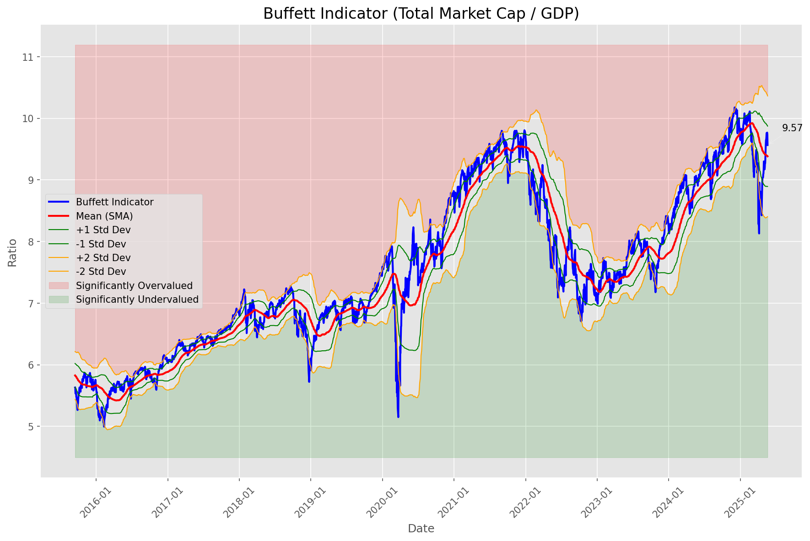
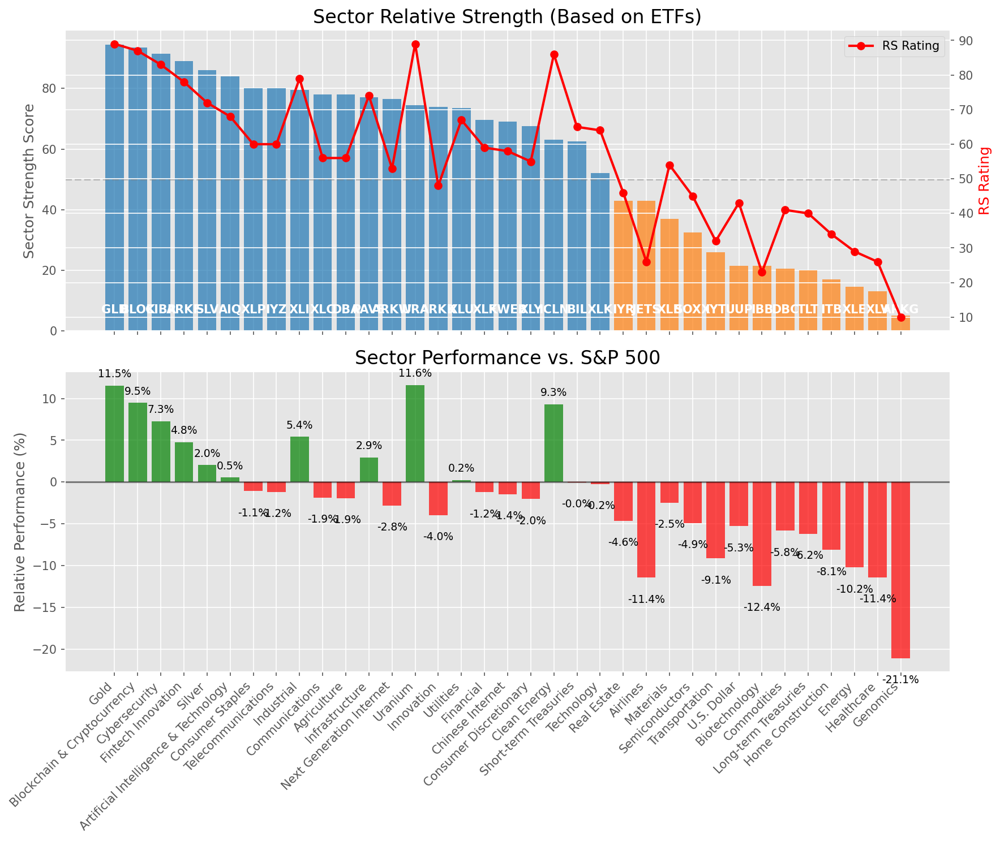

# **Daily Relative Strength Report**

**Date:** 2025-05-22

## **Market Valuation (Buffett Indicator)**

| Metric | Value |
|--------|-------|
| **Market Valuation** | **Fair Valued** |
| **Current Ratio** | 9.57 |
| **Historical Mean** | 9.39 |
| **Standard Deviation** | 0.49 |
| **Z-Score (StdDev from Mean)** | 0.71 |
| **Total Market Cap** | $286.77 trillion |
| **GDP** | $29.98 trillion |

## **Market Insights**

### **Market is Fairly Valued**

The market appears to be trading within a reasonable range of historical valuations. This suggests a balanced approach to equity investing is appropriate. Investors should:

- Focus on individual stock selection based on fundamentals and technicals
- Maintain normal equity allocations aligned with long-term goals
- Pay attention to sector rotation and relative strength
- Watch for changes in market leadership

Fair valuation typically suggests normal market returns can be expected, with stock selection becoming increasingly important.

### **Buffett Indicator Overview**

The Buffett Indicator (Total Market Cap / GDP) is a measure of the stock market's valuation relative to the size of the economy. It is named after Warren Buffett, who described it as "probably the best single measure of where valuations stand at any given moment."

- **Values above +2 standard deviations:** Market significantly overvalued
- **Values above +1 standard deviation:** Market overvalued
- **Values between -1 and +1 standard deviations:** Market fairly valued
- **Values below -1 standard deviation:** Market undervalued
- **Values below -2 standard deviations:** Market significantly undervalued

---

## **Sector Relative Strength**

Based on William O'Neil's Relative Strength Methodology

| ETF | Strength | RS Rating | Performance | Above Key MAs | Trend | Sector |
|-----|----------|-----------|-------------|--------------|-------|--------|
| [GLD](https://www.tradingview.com/chart/?symbol=GLD) | 96.0 | 92.0 | 12.85% | 10d ✓, 50d ✓, 200d ✓ | ↗️ | Gold |
| [BLOK](https://www.tradingview.com/chart/?symbol=BLOK) | 93.5 | 87.0 | 9.01% | 10d ✓, 50d ✓, 200d ✓ | ↗️ | Blockchain & Cryptocurrency |
| [XLI](https://www.tradingview.com/chart/?symbol=XLI) | 88.0 | 76.0 | 2.51% | 10d ✓, 50d ✓, 200d ✓ | ↗️ | Industrial |
| [SLV](https://www.tradingview.com/chart/?symbol=SLV) | 87.5 | 75.0 | 1.87% | 10d ✓, 50d ✓, 200d ✓ | ↗️ | Silver |
| [XLU](https://www.tradingview.com/chart/?symbol=XLU) | 86.5 | 73.0 | 1.26% | 10d ✓, 50d ✓, 200d ✓ | ↗️ | Utilities |
| [CIBR](https://www.tradingview.com/chart/?symbol=CIBR) | 86.0 | 72.0 | 0.63% | 10d ✓, 50d ✓, 200d ✓ | ↗️ | Cybersecurity |
| [XLP](https://www.tradingview.com/chart/?symbol=XLP) | 85.5 | 71.0 | 0.50% | 10d ✓, 50d ✓, 200d ✓ | ↗️ | Consumer Staples |
| [IYZ](https://www.tradingview.com/chart/?symbol=IYZ) | 81.5 | 63.0 | -1.19% | 10d ✓, 50d ✓, 200d ✓ | ↗️ | Telecommunications |
| [DBA](https://www.tradingview.com/chart/?symbol=DBA) | 80.5 | 61.0 | -1.91% | 10d ✓, 50d ✓, 200d ✓ | ↗️ | Agriculture |
| [ARKW](https://www.tradingview.com/chart/?symbol=ARKW) | 79.0 | 58.0 | -2.79% | 10d ✓, 50d ✓, 200d ✓ | ↗️ | Next Generation Internet |
| [XLC](https://www.tradingview.com/chart/?symbol=XLC) | 78.0 | 56.0 | -3.43% | 10d ✓, 50d ✓, 200d ✓ | ↗️ | Communications |
| [ARKF](https://www.tradingview.com/chart/?symbol=ARKF) | 76.5 | 53.0 | -4.44% | 10d ✓, 50d ✓, 200d ✓ | ↗️ | Fintech Innovation |
| [AIQ](https://www.tradingview.com/chart/?symbol=AIQ) | 75.5 | 51.0 | -4.76% | 10d ✓, 50d ✓, 200d ✓ | ↗️ | Artificial Intelligence & Technology |
| [ICLN](https://www.tradingview.com/chart/?symbol=ICLN) | 75.0 | 90.0 | 10.94% | 10d ✓, 50d ✓, 200d ✓ | ↘️ | Clean Energy |
| [PAVE](https://www.tradingview.com/chart/?symbol=PAVE) | 72.6 | 65.0 | -0.84% | 10d ✗, 50d ✓, 200d ✓ | ↗️ | Infrastructure |
| [XLF](https://www.tradingview.com/chart/?symbol=XLF) | 70.1 | 60.0 | -2.14% | 10d ✗, 50d ✓, 200d ✓ | ↗️ | Financial |
| [URA](https://www.tradingview.com/chart/?symbol=URA) | 69.0 | 78.0 | 3.60% | 10d ✓, 50d ✓, 200d ✓ | ↘️ | Uranium |
| [KWEB](https://www.tradingview.com/chart/?symbol=KWEB) | 65.1 | 50.0 | -4.78% | 10d ✗, 50d ✓, 200d ✓ | ↗️ | Chinese Internet |
| [BIL](https://www.tradingview.com/chart/?symbol=BIL) | 64.5 | 69.0 | 0.00% | 10d ✓, 50d ✓, 200d ✓ | ↘️ | Short-term Treasuries |
| [XLY](https://www.tradingview.com/chart/?symbol=XLY) | 63.6 | 47.0 | -5.64% | 10d ✗, 50d ✓, 200d ✓ | ↗️ | Consumer Discretionary |
| [ARKK](https://www.tradingview.com/chart/?symbol=ARKK) | 53.1 | 26.0 | -12.97% | 10d ✗, 50d ✓, 200d ✓ | ↗️ | Innovation |
| [IYR](https://www.tradingview.com/chart/?symbol=IYR) | 46.0 | 52.0 | -4.60% | 10d ✗, 50d ✗, 200d ✗ | ↗️ | Real Estate |
| [XLK](https://www.tradingview.com/chart/?symbol=XLK) | 44.6 | 49.0 | -5.02% | 10d ✗, 50d ✓, 200d ✓ | ↘️ | Technology |
| [JETS](https://www.tradingview.com/chart/?symbol=JETS) | 40.9 | 22.0 | -14.76% | 10d ✗, 50d ✓, 200d ✗ | ↗️ | Airlines |
| [XLB](https://www.tradingview.com/chart/?symbol=XLB) | 36.9 | 54.0 | -4.18% | 10d ✗, 50d ✓, 200d ✗ | ↘️ | Materials |
| [DBC](https://www.tradingview.com/chart/?symbol=DBC) | 31.4 | 43.0 | -6.88% | 10d ✓, 50d ✗, 200d ✗ | ↘️ | Commodities |
| [IYT](https://www.tradingview.com/chart/?symbol=IYT) | 27.9 | 36.0 | -9.13% | 10d ✗, 50d ✓, 200d ✗ | ↘️ | Transportation |
| [SOXX](https://www.tradingview.com/chart/?symbol=SOXX) | 26.4 | 33.0 | -10.13% | 10d ✗, 50d ✓, 200d ✗ | ↘️ | Semiconductors |
| [TLT](https://www.tradingview.com/chart/?symbol=TLT) | 24.5 | 49.0 | -5.16% | 10d ✗, 50d ✗, 200d ✗ | ↘️ | Long-term Treasuries |
| [UUP](https://www.tradingview.com/chart/?symbol=UUP) | 24.5 | 49.0 | -5.14% | 10d ✗, 50d ✗, 200d ✗ | ↘️ | U.S. Dollar |
| [IBB](https://www.tradingview.com/chart/?symbol=IBB) | 23.4 | 27.0 | -12.72% | 10d ✓, 50d ✗, 200d ✗ | ↘️ | Biotechnology |
| [ITB](https://www.tradingview.com/chart/?symbol=ITB) | 16.5 | 33.0 | -10.16% | 10d ✗, 50d ✗, 200d ✗ | ↘️ | Home Construction |
| [XLV](https://www.tradingview.com/chart/?symbol=XLV) | 16.0 | 32.0 | -10.62% | 10d ✗, 50d ✗, 200d ✗ | ↘️ | Healthcare |
| [XLE](https://www.tradingview.com/chart/?symbol=XLE) | 14.5 | 29.0 | -11.64% | 10d ✗, 50d ✗, 200d ✗ | ↘️ | Energy |
| [ARKG](https://www.tradingview.com/chart/?symbol=ARKG) | 3.5 | 7.0 | -27.49% | 10d ✗, 50d ✗, 200d ✗ | ↘️ | Genomics |

### **Sector ETF Performance Interpretation**

This table shows the relative strength metrics for different market sectors based on their representative ETFs:

- **ETF**: The ETF used to measure sector performance (click for chart)
- **Strength**: Overall sector strength score (0-100) combining multiple factors
- **RS Rating**: O'Neil RS rating of the sector ETF
- **Performance**: Performance of the sector ETF relative to SPY
- **Above Key MAs**: Whether the ETF is trading above its 10, 50, and 200-day moving averages
- **Trend**: Whether the sector is in an uptrend (↗️) or downtrend (↘️)

### **Current Sector Leadership**

The current market leadership is coming from the following sectors: **Gold, Blockchain & Cryptocurrency, Industrial**.

The **Gold** sector (represented by **GLD**) is showing particularly strong relative strength with an RS rating of 92.0 and performance of 12.85% vs. the S&P 500. This sector is trading above its 10-day, 50-day, 200-day moving average(s). Investors should consider focusing on high RS stocks within these leading sectors for potential outperformance.

---

## **Buy Recommendations**

The following 97 stocks show exceptional relative strength:

| RS Rating | Buy Score | Current Price | Chart | Name | Ticker |
|-----------|-----------|---------------|-------|------|--------|
| 100 | 100 | $193.70 | [Chart](https://www.tradingview.com/chart/?symbol=DAVE) | Dave Inc. Class A Common Stock | DAVE |
| 100 | 100 | $28.45 | [Chart](https://www.tradingview.com/chart/?symbol=DB) | Deutsche Bank Aktiengesellschaft | DB |
| 100 | 100 | $99.11 | [Chart](https://www.tradingview.com/chart/?symbol=SEZL) | Sezzle Inc. Common Stock | SEZL |
| 100 | 100 | $193.13 | [Chart](https://www.tradingview.com/chart/?symbol=AGX) | Argan, Inc | AGX |
| 100 | 100 | $155.47 | [Chart](https://www.tradingview.com/chart/?symbol=NRG) | NRG Energy, Inc. | NRG |
| 100 | 100 | $24.38 | [Chart](https://www.tradingview.com/chart/?symbol=GRND) | Grindr Inc. | GRND |
| 100 | 100 | $23.16 | [Chart](https://www.tradingview.com/chart/?symbol=PRA) | ProAssurance Corporation | PRA |
| 100 | 100 | $735.38 | [Chart](https://www.tradingview.com/chart/?symbol=AXON) | Axon Enterprise, Inc. Common Stock | AXON |
| 99 | 100 | $29.80 | [Chart](https://www.tradingview.com/chart/?symbol=FMS) | Fresenius Medical Care AG | FMS |
| 99 | 100 | $161.54 | [Chart](https://www.tradingview.com/chart/?symbol=PLMR) | Palomar Holdings, Inc. Common stock | PLMR |
| 99 | 100 | $26.54 | [Chart](https://www.tradingview.com/chart/?symbol=UVE) | UNIVERSAL INSURANCE HLDG, INC. | UVE |
| 99 | 100 | $71.54 | [Chart](https://www.tradingview.com/chart/?symbol=ULS) | UL Solutions Inc. | ULS |
| 99 | 100 | $38.66 | [Chart](https://www.tradingview.com/chart/?symbol=PAY) | Paymentus Holdings, Inc. | PAY |
| 99 | 100 | $24.98 | [Chart](https://www.tradingview.com/chart/?symbol=OR) | OR Royalties Inc. | OR |
| 99 | 100 | $81.16 | [Chart](https://www.tradingview.com/chart/?symbol=RBLX) | Roblox Corporation | RBLX |
| 99 | 100 | $54.94 | [Chart](https://www.tradingview.com/chart/?symbol=SHLD) | Global X Defense Tech ETF | SHLD |
| 98 | 100 | $130.70 | [Chart](https://www.tradingview.com/chart/?symbol=ATGE) | Adtalem Global Education Inc. Common Shares | ATGE |
| 98 | 100 | $43.72 | [Chart](https://www.tradingview.com/chart/?symbol=EXEL) | Exelixis Inc | EXEL |
| 98 | 100 | $37.00 | [Chart](https://www.tradingview.com/chart/?symbol=AS) | Amer Sports, Inc. | AS |
| 98 | 100 | $21.32 | [Chart](https://www.tradingview.com/chart/?symbol=TFPM) | Triple Flag Precious Metals Corp. | TFPM |
| 97 | 100 | $98.34 | [Chart](https://www.tradingview.com/chart/?symbol=LBRDK) | Liberty Broadband Corporation Class C | LBRDK |
| 97 | 100 | $43.16 | [Chart](https://www.tradingview.com/chart/?symbol=EWP) | iShares MSCI Spain ETF | EWP |
| 97 | 100 | $141.11 | [Chart](https://www.tradingview.com/chart/?symbol=UGL) | ProShares Ultra Gold | UGL |
| 97 | 100 | $73.20 | [Chart](https://www.tradingview.com/chart/?symbol=WRB) | W.R. Berkley Corporation | WRB |
| 97 | 100 | $35.32 | [Chart](https://www.tradingview.com/chart/?symbol=UTI) | Universal Technical Institute, Inc. | UTI |
| 97 | 100 | $87.75 | [Chart](https://www.tradingview.com/chart/?symbol=RBRK) | Rubrik, Inc. | RBRK |
| 97 | 100 | $85.27 | [Chart](https://www.tradingview.com/chart/?symbol=WPM) | Wheaton Precious Metals Corp. Common Stock | WPM |
| 97 | 100 | $163.26 | [Chart](https://www.tradingview.com/chart/?symbol=SE) | Sea Limited American Depositary Shares, each representing one Class A Ordinary Share | SE |
| 96 | 100 | $119.85 | [Chart](https://www.tradingview.com/chart/?symbol=EHC) | Encompass Health Corporation Common Stock | EHC |
| 96 | 100 | $281.08 | [Chart](https://www.tradingview.com/chart/?symbol=VRSN) | VeriSign Inc | VRSN |
| 96 | 100 | $153.31 | [Chart](https://www.tradingview.com/chart/?symbol=CAH) | Cardinal Health, Inc. | CAH |
| 95 | 100 | $165.67 | [Chart](https://www.tradingview.com/chart/?symbol=FNV) | Franco-Nevada Corporation | FNV |
| 95 | 100 | $1194.63 | [Chart](https://www.tradingview.com/chart/?symbol=NFLX) | NetFlix Inc | NFLX |
| 95 | 100 | $31.69 | [Chart](https://www.tradingview.com/chart/?symbol=EUFN) | iShares MSCI Europe Financials ETF | EUFN |
| 95 | 100 | $115.63 | [Chart](https://www.tradingview.com/chart/?symbol=AEM) | Agnico Eagle Mines Ltd. | AEM |
| 95 | 100 | $179.70 | [Chart](https://www.tradingview.com/chart/?symbol=RGLD) | Royal Gold Inc | RGLD |
| 95 | 100 | $31.27 | [Chart](https://www.tradingview.com/chart/?symbol=BCH) | Banco de ChileAmerican Depositary Shares (Each representing 200 shares of Common Stock) | BCH |
| 95 | 100 | $162.76 | [Chart](https://www.tradingview.com/chart/?symbol=HWM) | Howmet Aerospace Inc. | HWM |
| 95 | 100 | $47.65 | [Chart](https://www.tradingview.com/chart/?symbol=EWI) | iShares MSCI Italy ETF | EWI |
| 94 | 100 | $129.62 | [Chart](https://www.tradingview.com/chart/?symbol=HIG) | The Hartford Insurance Group, Inc. | HIG |
| 94 | 100 | $17.57 | [Chart](https://www.tradingview.com/chart/?symbol=BCS) | Barclays PLC | BCS |
| 94 | 100 | $23.74 | [Chart](https://www.tradingview.com/chart/?symbol=BTSG) | BrightSpring Health Services, Inc. Common Stock | BTSG |
| 94 | 100 | $74.09 | [Chart](https://www.tradingview.com/chart/?symbol=VRNA) | Verona Pharma plc | VRNA |
| 94 | 100 | $174.64 | [Chart](https://www.tradingview.com/chart/?symbol=PM) | Philip Morris International Inc. | PM |
| 94 | 100 | $41.68 | [Chart](https://www.tradingview.com/chart/?symbol=EWG) | iShares MSCI Germany ETF | EWG |
| 94 | 100 | $44.46 | [Chart](https://www.tradingview.com/chart/?symbol=BTI) | British American Tobacco p.l.c. American Depositary Shares, American Depositary Shares, each representing one Ordinary Share | BTI |
| 93 | 100 | $281.74 | [Chart](https://www.tradingview.com/chart/?symbol=CME) | CME Group Inc. | CME |
| 93 | 100 | $117.50 | [Chart](https://www.tradingview.com/chart/?symbol=BJ) | BJs Wholesale Club Holdings, Inc. Common Stock | BJ |
| 93 | 100 | $63.86 | [Chart](https://www.tradingview.com/chart/?symbol=HOOD) | Robinhood Markets, Inc. Class A Common Stock | HOOD |
| 93 | 100 | $63.11 | [Chart](https://www.tradingview.com/chart/?symbol=SLF) | Sun Life Financial Inc. | SLF |
| 92 | 100 | $31.98 | [Chart](https://www.tradingview.com/chart/?symbol=OUNZ) | VanEck Merk Gold ETF | OUNZ |
| 92 | 100 | $324.50 | [Chart](https://www.tradingview.com/chart/?symbol=PODD) | Insulet Corporation | PODD |
| 92 | 100 | $305.82 | [Chart](https://www.tradingview.com/chart/?symbol=GLD) | SPDR Gold Trust, SPDR Gold Shares | GLD |
| 92 | 100 | $65.72 | [Chart](https://www.tradingview.com/chart/?symbol=GLDM) | SPDR Gold MiniShares | GLDM |
| 92 | 100 | $62.59 | [Chart](https://www.tradingview.com/chart/?symbol=IAU) | iShares Gold Trust | IAU |
| 92 | 100 | $32.78 | [Chart](https://www.tradingview.com/chart/?symbol=AAAU) | Goldman Sachs Physical Gold ETF Shares | AAAU |
| 92 | 100 | $31.66 | [Chart](https://www.tradingview.com/chart/?symbol=SGOL) | abrdn Physical Gold Shares ETF | SGOL |
| 92 | 100 | $33.09 | [Chart](https://www.tradingview.com/chart/?symbol=IAUM) | iShares Gold Trust Micro | IAUM |
| 92 | 100 | $30.70 | [Chart](https://www.tradingview.com/chart/?symbol=TGS) | Transportadora de Gas del Sur S.A. ADS | TGS |
| 92 | 100 | $25.20 | [Chart](https://www.tradingview.com/chart/?symbol=BSAC) | Banco Santander-Chile | BSAC |
| 91 | 100 | $25.35 | [Chart](https://www.tradingview.com/chart/?symbol=PHYS) | Sprott Physical Gold Trust | PHYS |
| 91 | 100 | $170.79 | [Chart](https://www.tradingview.com/chart/?symbol=ITA) | iShares U.S. Aerospace & Defense ETF | ITA |
| 91 | 100 | $233.54 | [Chart](https://www.tradingview.com/chart/?symbol=GE) | GE Aerospace | GE |
| 91 | 100 | $145.37 | [Chart](https://www.tradingview.com/chart/?symbol=TW) | Tradeweb Markets Inc. Class A Common Stock | TW |
| 91 | 100 | $81.32 | [Chart](https://www.tradingview.com/chart/?symbol=NFG) | National Fuel Gas Co. | NFG |
| 90 | 100 | $230.29 | [Chart](https://www.tradingview.com/chart/?symbol=CRS) | Carpenter Technology Corp | CRS |
| 90 | 100 | $29.97 | [Chart](https://www.tradingview.com/chart/?symbol=NTGR) | NETGEAR, Inc. | NTGR |
| 90 | 100 | $80.55 | [Chart](https://www.tradingview.com/chart/?symbol=LB) | LandBridge Company LLC | LB |
| 89 | 100 | $19.39 | [Chart](https://www.tradingview.com/chart/?symbol=KT) | KT Corp. | KT |
| 88 | 100 | $59.45 | [Chart](https://www.tradingview.com/chart/?symbol=MO) | Altria Group, Inc. | MO |
| 87 | 100 | $252.19 | [Chart](https://www.tradingview.com/chart/?symbol=RSG) | Republic Services Inc. | RSG |
| 89 | 99 | $61.79 | [Chart](https://www.tradingview.com/chart/?symbol=IBIT) | iShares Bitcoin Trust ETF | IBIT |
| 89 | 99 | $33.71 | [Chart](https://www.tradingview.com/chart/?symbol=FDP) | Fresh Del Monte Produce Inc. | FDP |
| 89 | 99 | $58.18 | [Chart](https://www.tradingview.com/chart/?symbol=UVV) | Universal Corporation | UVV |
| 87 | 99 | $46.90 | [Chart](https://www.tradingview.com/chart/?symbol=MRCY) | Mercury Systems Inc. | MRCY |
| 86 | 99 | $29.35 | [Chart](https://www.tradingview.com/chart/?symbol=CEF) | Sprott Physical Gold and Silver Trust | CEF |
| 88 | 98 | $48.15 | [Chart](https://www.tradingview.com/chart/?symbol=FTS) | Fortis Inc. Common Shares | FTS |
| 88 | 98 | $49.84 | [Chart](https://www.tradingview.com/chart/?symbol=TRP) | TC Energy Corporation | TRP |
| 88 | 98 | $97.21 | [Chart](https://www.tradingview.com/chart/?symbol=JCI) | Johnson Controls International plc | JCI |
| 87 | 98 | $55.10 | [Chart](https://www.tradingview.com/chart/?symbol=RELX) | RELX PLC | RELX |
| 87 | 97 | $228.23 | [Chart](https://www.tradingview.com/chart/?symbol=CBOE) | Cboe Global Markets, Inc. | CBOE |
| 86 | 97 | $205.31 | [Chart](https://www.tradingview.com/chart/?symbol=ALL) | The Allstate Corporation | ALL |
| 86 | 96 | $18.04 | [Chart](https://www.tradingview.com/chart/?symbol=MIR) | Mirion Technologies, Inc. | MIR |
| 85 | 96 | $96.77 | [Chart](https://www.tradingview.com/chart/?symbol=CALM) | Cal-Maine Foods Inc | CALM |
| 85 | 96 | $58.53 | [Chart](https://www.tradingview.com/chart/?symbol=IGF) | iShares Global Infrastructure ETF | IGF |
| 85 | 96 | $134.95 | [Chart](https://www.tradingview.com/chart/?symbol=RTX) | RTX Corporation | RTX |
| 81 | 96 | $27.47 | [Chart](https://www.tradingview.com/chart/?symbol=T) | AT&T Inc. | T |
| 85 | 95 | $62.41 | [Chart](https://www.tradingview.com/chart/?symbol=RYTM) | Rhythm Pharmaceuticals, Inc. Common Stock | RYTM |
| 84 | 95 | $312.33 | [Chart](https://www.tradingview.com/chart/?symbol=VRSK) | Verisk Analytics, Inc. Common Stock | VRSK |
| 83 | 95 | $59.34 | [Chart](https://www.tradingview.com/chart/?symbol=HSBC) | HSBC Holdings PLC | HSBC |
| 83 | 95 | $43.14 | [Chart](https://www.tradingview.com/chart/?symbol=HMN) | Horace Mann Educators Corporation | HMN |
| 83 | 94 | $13.81 | [Chart](https://www.tradingview.com/chart/?symbol=MUFG) | Mitsubishi UFJ Financial Group, Inc. | MUFG |
| 82 | 94 | $55.71 | [Chart](https://www.tradingview.com/chart/?symbol=EQT) | EQT CORP | EQT |
| 81 | 93 | $32.59 | [Chart](https://www.tradingview.com/chart/?symbol=ZLAB) | Zai Lab Limited American Depositary Shares | ZLAB |
| 80 | 93 | $107.95 | [Chart](https://www.tradingview.com/chart/?symbol=RBA) | RB Global, Inc. | RBA |
| 82 | 92 | $5293.31 | [Chart](https://www.tradingview.com/chart/?symbol=BKNG) | Booking Holdings Inc. Common Stock | BKNG |
| 80 | 90 | $195.93 | [Chart](https://www.tradingview.com/chart/?symbol=WCN) | Waste Connections, Inc. | WCN |

---

## **Sell Recommendations**

The following 91 stocks show deteriorating relative strength:

| RS Rating | Sell Score | Current Price | Chart | Name | Ticker |
|-----------|------------|---------------|-------|------|--------|
| 1 | 100 | $16.51 | [Chart](https://www.tradingview.com/chart/?symbol=FWRD) | Forward Air Corp | FWRD |
| 2 | 100 | $25.51 | [Chart](https://www.tradingview.com/chart/?symbol=FIVN) | FIVE9, INC. | FIVN |
| 2 | 100 | $12.69 | [Chart](https://www.tradingview.com/chart/?symbol=IART) | Integra LifeSciences Holdings | IART |
| 2 | 100 | $31.31 | [Chart](https://www.tradingview.com/chart/?symbol=CYTK) | Cytokinetics Inc. | CYTK |
| 3 | 100 | $28.47 | [Chart](https://www.tradingview.com/chart/?symbol=TWST) | Twist Bioscience Corporation Common Stock | TWST |
| 3 | 100 | $13.69 | [Chart](https://www.tradingview.com/chart/?symbol=DNLI) | Denali Therapeutics Inc. Common Stock | DNLI |
| 3 | 100 | $13.90 | [Chart](https://www.tradingview.com/chart/?symbol=DQ) | Daqo New Energy Corp. American Depositary Shares (each representing 5 Ordinary Shares) | DQ |
| 4 | 100 | $16.55 | [Chart](https://www.tradingview.com/chart/?symbol=VRNT) | Verint Systems Inc | VRNT |
| 4 | 100 | $14.78 | [Chart](https://www.tradingview.com/chart/?symbol=SYRE) | Spyre Therapeutics, Inc. Common Stock | SYRE |
| 4 | 100 | $11.12 | [Chart](https://www.tradingview.com/chart/?symbol=CLB) | Core Laboratories Inc. | CLB |
| 4 | 100 | $14.20 | [Chart](https://www.tradingview.com/chart/?symbol=PENN) | PENN Entertainment, Inc. Common Stock | PENN |
| 5 | 100 | $41.07 | [Chart](https://www.tradingview.com/chart/?symbol=WHD) | Cactus, Inc. | WHD |
| 5 | 100 | $22.91 | [Chart](https://www.tradingview.com/chart/?symbol=RPD) | Rapid7, Inc. Common Stock | RPD |
| 5 | 100 | $126.68 | [Chart](https://www.tradingview.com/chart/?symbol=KRYS) | Krystal Biotech, Inc. Common Stock | KRYS |
| 5 | 100 | $121.97 | [Chart](https://www.tradingview.com/chart/?symbol=TFX) | Teleflex Incorporated | TFX |
| 6 | 100 | $63.00 | [Chart](https://www.tradingview.com/chart/?symbol=ARCB) | ArcBest Corporation | ARCB |
| 6 | 100 | $14.41 | [Chart](https://www.tradingview.com/chart/?symbol=IMVT) | Immunovant, Inc. Common Stock | IMVT |
| 7 | 100 | $14.76 | [Chart](https://www.tradingview.com/chart/?symbol=DXC) | DXC Technology Company | DXC |
| 8 | 100 | $20.32 | [Chart](https://www.tradingview.com/chart/?symbol=AMRK) | A-Mark Precious Metals, Inc. | AMRK |
| 8 | 100 | $32.02 | [Chart](https://www.tradingview.com/chart/?symbol=MBIN) | Merchants Bancorp Common Stock | MBIN |
| 9 | 100 | $29.68 | [Chart](https://www.tradingview.com/chart/?symbol=SRDX) | Surmodics, Inc. Common Stock | SRDX |
| 9 | 100 | $12.15 | [Chart](https://www.tradingview.com/chart/?symbol=ARCT) | Arcturus Therapeutics Holdings Inc. Common Stock | ARCT |
| 12 | 100 | $90.54 | [Chart](https://www.tradingview.com/chart/?symbol=CHRD) | Chord Energy Corporation Common Stock | CHRD |
| 12 | 100 | $19.67 | [Chart](https://www.tradingview.com/chart/?symbol=VECO) | Veeco Instruments Inc | VECO |
| 19 | 100 | $45.47 | [Chart](https://www.tradingview.com/chart/?symbol=LINE) | Lineage, Inc. Common Stock | LINE |
| 4 | 99 | $10.22 | [Chart](https://www.tradingview.com/chart/?symbol=HPK) | HighPeak Energy, Inc. Common Stock | HPK |
| 10 | 99 | $60.12 | [Chart](https://www.tradingview.com/chart/?symbol=SPB) | Spectrum Brands Holdings, Inc. | SPB |
| 17 | 99 | $12.10 | [Chart](https://www.tradingview.com/chart/?symbol=ZUMZ) | Zumiez Inc. | ZUMZ |
| 19 | 99 | $11.05 | [Chart](https://www.tradingview.com/chart/?symbol=GES) | Guess?, Inc. | GES |
| 5 | 98 | $20.39 | [Chart](https://www.tradingview.com/chart/?symbol=VERA) | Vera Therapeutics, Inc. Class A Common Stock | VERA |
| 10 | 98 | $45.58 | [Chart](https://www.tradingview.com/chart/?symbol=RHI) | Robert Half Inc. | RHI |
| 21 | 98 | $14.71 | [Chart](https://www.tradingview.com/chart/?symbol=FXN) | First Trust Energy AlphaDEX Fund | FXN |
| 4 | 97 | $184.20 | [Chart](https://www.tradingview.com/chart/?symbol=NVMI) | Nova Ltd. Ordinary Shares | NVMI |
| 5 | 97 | $10.77 | [Chart](https://www.tradingview.com/chart/?symbol=LSPD) | Lightspeed Commerce Inc. | LSPD |
| 6 | 97 | $10.31 | [Chart](https://www.tradingview.com/chart/?symbol=VREX) | Varex Imaging Corporation Common Stock | VREX |
| 19 | 97 | $10.34 | [Chart](https://www.tradingview.com/chart/?symbol=CMRE) | Costamare Inc. | CMRE |
| 9 | 96 | $14.21 | [Chart](https://www.tradingview.com/chart/?symbol=INMD) | InMode Ltd. Ordinary Shares | INMD |
| 17 | 96 | $15.58 | [Chart](https://www.tradingview.com/chart/?symbol=AMZY) | YieldMax AMZN Option Income Strategy ETF | AMZY |
| 11 | 95 | $21.45 | [Chart](https://www.tradingview.com/chart/?symbol=HZO) | MarineMax, Inc. | HZO |
| 17 | 95 | $51.38 | [Chart](https://www.tradingview.com/chart/?symbol=KBH) | KB Home | KBH |
| 10 | 94 | $11.62 | [Chart](https://www.tradingview.com/chart/?symbol=WEN) | The Wendy's Company | WEN |
| 11 | 94 | $43.55 | [Chart](https://www.tradingview.com/chart/?symbol=MTDR) | MATADOR RESOURCES COMPANY | MTDR |
| 14 | 94 | $18.91 | [Chart](https://www.tradingview.com/chart/?symbol=FOR) | Forestar Group Inc. | FOR |
| 10 | 93 | $11.59 | [Chart](https://www.tradingview.com/chart/?symbol=APLE) | Apple Hospitality REIT, Inc. | APLE |
| 14 | 92 | $11.91 | [Chart](https://www.tradingview.com/chart/?symbol=PBR) | PETROLEO BRASILEIRO S.A.-PETROBRAS ADS (REP 1 COMMON SHARE) | PBR |
| 18 | 92 | $10.99 | [Chart](https://www.tradingview.com/chart/?symbol=GSBD) | Goldman Sachs BDC, Inc. | GSBD |
| 12 | 91 | $18.90 | [Chart](https://www.tradingview.com/chart/?symbol=OII) | Oceaneering International Inc. | OII |
| 18 | 90 | $115.94 | [Chart](https://www.tradingview.com/chart/?symbol=SITE) | SiteOne Landscape Supply, Inc. | SITE |
| 25 | 90 | $64.07 | [Chart](https://www.tradingview.com/chart/?symbol=MTH) | Meritage Homes Corporation | MTH |
| 15 | 89 | $81.48 | [Chart](https://www.tradingview.com/chart/?symbol=EMN) | Eastman Chemical Company | EMN |
| 15 | 89 | $16.07 | [Chart](https://www.tradingview.com/chart/?symbol=CHCT) | Community Healthcare Trust Incorporated Common Stock, $0.01 par value per share | CHCT |
| 19 | 89 | $11.22 | [Chart](https://www.tradingview.com/chart/?symbol=PBR.A) | Petroleo Brasileiro S.A.-Petrobras | PBR.A |
| 19 | 89 | $10.11 | [Chart](https://www.tradingview.com/chart/?symbol=HOPE) | Hope Bancorp, Inc. | HOPE |
| 25 | 89 | $10.05 | [Chart](https://www.tradingview.com/chart/?symbol=LBTYK) | Liberty Global Ltd. Class C Common Shares | LBTYK |
| 31 | 89 | $19.15 | [Chart](https://www.tradingview.com/chart/?symbol=NVDS) | Investment Managers Series Trust II Tradr 1.5X Short NVDA Daily ETF | NVDS |
| 14 | 88 | $108.91 | [Chart](https://www.tradingview.com/chart/?symbol=A) | Agilent Technologies Inc. | A |
| 19 | 86 | $28.88 | [Chart](https://www.tradingview.com/chart/?symbol=BP) | BP p.l.c. | BP |
| 22 | 86 | $58.48 | [Chart](https://www.tradingview.com/chart/?symbol=BMRN) | BioMarin Pharmaceuticals Inc | BMRN |
| 18 | 85 | $11.33 | [Chart](https://www.tradingview.com/chart/?symbol=TWO) | Two Harbors Investment Corp. | TWO |
| 20 | 85 | $25.18 | [Chart](https://www.tradingview.com/chart/?symbol=WY) | Weyerhaeuser Company | WY |
| 21 | 85 | $22.81 | [Chart](https://www.tradingview.com/chart/?symbol=GPK) | Graphic Packaging Holding Company | GPK |
| 26 | 85 | $16.13 | [Chart](https://www.tradingview.com/chart/?symbol=MLNK) | MeridianLink, Inc. | MLNK |
| 26 | 85 | $279.85 | [Chart](https://www.tradingview.com/chart/?symbol=BLD) | TopBuild Corp. Common Stock | BLD |
| 24 | 84 | $17.18 | [Chart](https://www.tradingview.com/chart/?symbol=STR) | Sitio Royalties Corp. | STR |
| 25 | 84 | $104.67 | [Chart](https://www.tradingview.com/chart/?symbol=PLD) | PROLOGIS, INC. | PLD |
| 26 | 84 | $34.23 | [Chart](https://www.tradingview.com/chart/?symbol=CPB) | The Campbell's Company Common Stock | CPB |
| 28 | 83 | $14.12 | [Chart](https://www.tradingview.com/chart/?symbol=OCSL) | Oaktree Specialty Lending Corporation | OCSL |
| 25 | 82 | $19.50 | [Chart](https://www.tradingview.com/chart/?symbol=BITI) | ProShares Short Bitcoin ETF | BITI |
| 25 | 82 | $10.01 | [Chart](https://www.tradingview.com/chart/?symbol=SCS) | Steelcase, Inc. | SCS |
| 27 | 82 | $35.14 | [Chart](https://www.tradingview.com/chart/?symbol=SU) | Suncor Energy, Inc. | SU |
| 25 | 81 | $14.36 | [Chart](https://www.tradingview.com/chart/?symbol=HR) | Healthcare Realty Trust Incorporated | HR |
| 21 | 80 | $31.29 | [Chart](https://www.tradingview.com/chart/?symbol=AXTA) | Axalta Coating Systems Ltd. | AXTA |
| 21 | 80 | $33.50 | [Chart](https://www.tradingview.com/chart/?symbol=SQM) | Sociedad Quimica y Minera de Chile SA | SQM |
| 23 | 80 | $10.78 | [Chart](https://www.tradingview.com/chart/?symbol=NEWT) | NewtekOne, Inc. Common Stock | NEWT |
| 37 | 80 | $145.00 | [Chart](https://www.tradingview.com/chart/?symbol=MTN) | Vail Resorts, Inc. | MTN |
| 26 | 79 | $102.48 | [Chart](https://www.tradingview.com/chart/?symbol=MHK) | Mohawk Industries, Inc. | MHK |
| 28 | 79 | $14.75 | [Chart](https://www.tradingview.com/chart/?symbol=SAFE) | Safehold Inc. | SAFE |
| 24 | 78 | $36.39 | [Chart](https://www.tradingview.com/chart/?symbol=BHE) | Benchmark Electronics | BHE |
| 24 | 78 | $25.98 | [Chart](https://www.tradingview.com/chart/?symbol=NATL) | NCR Atleos Corporation | NATL |
| 38 | 77 | $10.60 | [Chart](https://www.tradingview.com/chart/?symbol=NMFC) | NEW MOUNTAIN FINANCE CORPORATION | NMFC |
| 30 | 76 | $12.40 | [Chart](https://www.tradingview.com/chart/?symbol=PMT) | PennyMac Mortgage Investment Trust | PMT |
| 36 | 76 | $30.43 | [Chart](https://www.tradingview.com/chart/?symbol=BAX) | Baxter International Inc. | BAX |
| 25 | 75 | $130.16 | [Chart](https://www.tradingview.com/chart/?symbol=HES) | Hess Corporation | HES |
| 25 | 75 | $36.92 | [Chart](https://www.tradingview.com/chart/?symbol=NBHC) | NATIONAL BANK HOLDINGS CORP. | NBHC |
| 33 | 75 | $153.99 | [Chart](https://www.tradingview.com/chart/?symbol=IBP) | INSTALLED BUILDING PRODUCTS, INC. | IBP |
| 33 | 75 | $10.44 | [Chart](https://www.tradingview.com/chart/?symbol=AVO) | Mission Produce, Inc. Common Stock | AVO |
| 33 | 74 | $73.17 | [Chart](https://www.tradingview.com/chart/?symbol=GMS) | GMS Inc. | GMS |
| 39 | 72 | $37.87 | [Chart](https://www.tradingview.com/chart/?symbol=LIT) | Global X Lithium & Battery Tech ETF | LIT |
| 32 | 70 | $77.36 | [Chart](https://www.tradingview.com/chart/?symbol=PFG) | Principal Financial Group, Inc. | PFG |
| 39 | 67 | $10.92 | [Chart](https://www.tradingview.com/chart/?symbol=MQY) | Blackrock Muni Yield Quality Fund, Inc | MQY |
| 38 | 63 | $38.54 | [Chart](https://www.tradingview.com/chart/?symbol=MLTX) | MoonLake Immunotherapeutics Class A Ordinary Shares | MLTX |

## **Methodology**

This report uses William O'Neil's relative strength methodology from Investors Business Daily:

* **RS Rating**: Percentile rank of stock's performance vs. S&P 500 over the past 63 trading days (1-99 scale)
* **Buy Criteria**: RS Rating >= 80, price above 50-day MA, strong uptrend, increasing volume
* **Sell Criteria**: RS Rating < 40, price below 50-day MA, downtrend, decreasing volume

### **O'Neil's Key Principles**

1. **Focus on relative performance** - stocks outperforming the market
2. **Price trend confirmation** - stock must be in an uptrend
3. **Volume confirmation** - strong volume supports price moves
4. **Moving average validation** - price above key moving averages
5. **Market leaders only** - concentrate on top-performing stocks

*Report generated automatically after market close*