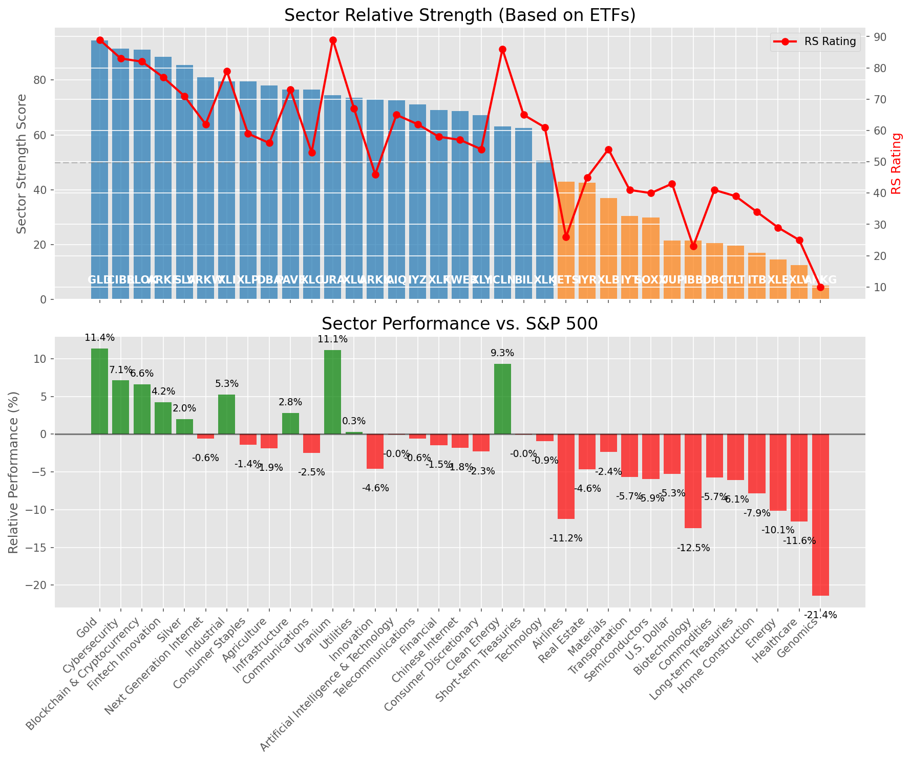

# **Daily Relative Strength Report**

**Date:** 2025-05-22

## **Market Valuation (Buffett Indicator)**

| Metric | Value |
|--------|-------|
| **Market Valuation** | **Fair Valued** |
| **Current Ratio** | 9.62 |
| **Historical Mean** | 9.38 |
| **Standard Deviation** | 0.49 |
| **Z-Score (StdDev from Mean)** | 0.37 |
| **Total Market Cap** | $288.24 trillion |
| **GDP** | $29.98 trillion |

## **Market Insights**

### **Market is Fairly Valued**

The market appears to be trading within a reasonable range of historical valuations. This suggests a balanced approach to equity investing is appropriate. Investors should:

- Focus on individual stock selection based on fundamentals and technicals
- Maintain normal equity allocations aligned with long-term goals
- Pay attention to sector rotation and relative strength
- Watch for changes in market leadership

Fair valuation typically suggests normal market returns can be expected, with stock selection becoming increasingly important.

### **Buffett Indicator Overview**

The Buffett Indicator (Total Market Cap / GDP) is a measure of the stock market's valuation relative to the size of the economy. It is named after Warren Buffett, who described it as "probably the best single measure of where valuations stand at any given moment."

- **Values above +2 standard deviations:** Market significantly overvalued
- **Values above +1 standard deviation:** Market overvalued
- **Values between -1 and +1 standard deviations:** Market fairly valued
- **Values below -1 standard deviation:** Market undervalued
- **Values below -2 standard deviations:** Market significantly undervalued

---

## **Sector Relative Strength**

Based on William O'Neil's Relative Strength Methodology

| ETF | Strength | RS Rating | Performance | Above Key MAs | Trend | Sector |
|-----|----------|-----------|-------------|--------------|-------|--------|
| [GLD](https://www.tradingview.com/chart/?symbol=GLD) | 94.5 | 89.0 | 11.55% | 10d ✓, 50d ✓, 200d ✓ | ↗️ | Gold |
| [BLOK](https://www.tradingview.com/chart/?symbol=BLOK) | 91.5 | 83.0 | 7.78% | 10d ✓, 50d ✓, 200d ✓ | ↗️ | Blockchain & Cryptocurrency |
| [CIBR](https://www.tradingview.com/chart/?symbol=CIBR) | 91.5 | 83.0 | 7.64% | 10d ✓, 50d ✓, 200d ✓ | ↗️ | Cybersecurity |
| [XLI](https://www.tradingview.com/chart/?symbol=XLI) | 90.0 | 80.0 | 5.75% | 10d ✓, 50d ✓, 200d ✓ | ↗️ | Industrial |
| [ARKF](https://www.tradingview.com/chart/?symbol=ARKF) | 89.0 | 78.0 | 5.17% | 10d ✓, 50d ✓, 200d ✓ | ↗️ | Fintech Innovation |
| [SLV](https://www.tradingview.com/chart/?symbol=SLV) | 85.5 | 71.0 | 2.21% | 10d ✓, 50d ✓, 200d ✓ | ↗️ | Silver |
| [AIQ](https://www.tradingview.com/chart/?symbol=AIQ) | 83.5 | 67.0 | 0.52% | 10d ✓, 50d ✓, 200d ✓ | ↗️ | Artificial Intelligence & Technology |
| [ARKW](https://www.tradingview.com/chart/?symbol=ARKW) | 83.0 | 66.0 | 0.39% | 10d ✓, 50d ✓, 200d ✓ | ↗️ | Next Generation Internet |
| [IYZ](https://www.tradingview.com/chart/?symbol=IYZ) | 82.0 | 64.0 | 0.00% | 10d ✓, 50d ✓, 200d ✓ | ↗️ | Telecommunications |
| [XLP](https://www.tradingview.com/chart/?symbol=XLP) | 79.5 | 59.0 | -1.05% | 10d ✓, 50d ✓, 200d ✓ | ↗️ | Consumer Staples |
| [XLY](https://www.tradingview.com/chart/?symbol=XLY) | 78.0 | 56.0 | -1.68% | 10d ✓, 50d ✓, 200d ✓ | ↗️ | Consumer Discretionary |
| [DBA](https://www.tradingview.com/chart/?symbol=DBA) | 77.5 | 55.0 | -1.77% | 10d ✓, 50d ✓, 200d ✓ | ↗️ | Agriculture |
| [XLC](https://www.tradingview.com/chart/?symbol=XLC) | 77.5 | 55.0 | -1.87% | 10d ✓, 50d ✓, 200d ✓ | ↗️ | Communications |
| [PAVE](https://www.tradingview.com/chart/?symbol=PAVE) | 77.1 | 74.0 | 3.32% | 10d ✗, 50d ✓, 200d ✓ | ↗️ | Infrastructure |
| [URA](https://www.tradingview.com/chart/?symbol=URA) | 74.0 | 88.0 | 10.95% | 10d ✓, 50d ✓, 200d ✓ | ↘️ | Uranium |
| [ARKK](https://www.tradingview.com/chart/?symbol=ARKK) | 74.0 | 48.0 | -3.51% | 10d ✓, 50d ✓, 200d ✓ | ↗️ | Innovation |
| [XLU](https://www.tradingview.com/chart/?symbol=XLU) | 73.6 | 67.0 | 0.56% | 10d ✗, 50d ✓, 200d ✓ | ↗️ | Utilities |
| [XLF](https://www.tradingview.com/chart/?symbol=XLF) | 69.6 | 59.0 | -1.06% | 10d ✗, 50d ✓, 200d ✓ | ↗️ | Financial |
| [KWEB](https://www.tradingview.com/chart/?symbol=KWEB) | 68.1 | 56.0 | -1.66% | 10d ✗, 50d ✓, 200d ✓ | ↗️ | Chinese Internet |
| [ICLN](https://www.tradingview.com/chart/?symbol=ICLN) | 63.1 | 86.0 | 9.30% | 10d ✗, 50d ✓, 200d ✓ | ↘️ | Clean Energy |
| [BIL](https://www.tradingview.com/chart/?symbol=BIL) | 62.0 | 64.0 | -0.03% | 10d ✓, 50d ✓, 200d ✓ | ↘️ | Short-term Treasuries |
| [XLK](https://www.tradingview.com/chart/?symbol=XLK) | 51.1 | 62.0 | -0.27% | 10d ✗, 50d ✓, 200d ✓ | ↘️ | Technology |
| [JETS](https://www.tradingview.com/chart/?symbol=JETS) | 42.9 | 26.0 | -10.97% | 10d ✗, 50d ✓, 200d ✗ | ↗️ | Airlines |
| [IYR](https://www.tradingview.com/chart/?symbol=IYR) | 42.5 | 45.0 | -4.33% | 10d ✗, 50d ✗, 200d ✗ | ↗️ | Real Estate |
| [XLB](https://www.tradingview.com/chart/?symbol=XLB) | 36.9 | 54.0 | -2.11% | 10d ✗, 50d ✓, 200d ✗ | ↘️ | Materials |
| [SOXX](https://www.tradingview.com/chart/?symbol=SOXX) | 30.9 | 42.0 | -5.13% | 10d ✗, 50d ✓, 200d ✗ | ↘️ | Semiconductors |
| [IYT](https://www.tradingview.com/chart/?symbol=IYT) | 30.4 | 41.0 | -5.31% | 10d ✗, 50d ✓, 200d ✗ | ↘️ | Transportation |
| [IBB](https://www.tradingview.com/chart/?symbol=IBB) | 21.4 | 23.0 | -12.38% | 10d ✓, 50d ✗, 200d ✗ | ↘️ | Biotechnology |
| [UUP](https://www.tradingview.com/chart/?symbol=UUP) | 21.0 | 42.0 | -5.24% | 10d ✗, 50d ✗, 200d ✗ | ↘️ | U.S. Dollar |
| [DBC](https://www.tradingview.com/chart/?symbol=DBC) | 20.0 | 40.0 | -5.58% | 10d ✗, 50d ✗, 200d ✗ | ↘️ | Commodities |
| [TLT](https://www.tradingview.com/chart/?symbol=TLT) | 19.0 | 38.0 | -6.15% | 10d ✗, 50d ✗, 200d ✗ | ↘️ | Long-term Treasuries |
| [ITB](https://www.tradingview.com/chart/?symbol=ITB) | 16.5 | 33.0 | -7.89% | 10d ✗, 50d ✗, 200d ✗ | ↘️ | Home Construction |
| [XLE](https://www.tradingview.com/chart/?symbol=XLE) | 14.5 | 29.0 | -9.78% | 10d ✗, 50d ✗, 200d ✗ | ↘️ | Energy |
| [XLV](https://www.tradingview.com/chart/?symbol=XLV) | 12.5 | 25.0 | -11.33% | 10d ✗, 50d ✗, 200d ✗ | ↘️ | Healthcare |
| [ARKG](https://www.tradingview.com/chart/?symbol=ARKG) | 5.0 | 10.0 | -20.88% | 10d ✗, 50d ✗, 200d ✗ | ↘️ | Genomics |

### **Sector ETF Performance Interpretation**

This table shows the relative strength metrics for different market sectors based on their representative ETFs:

- **ETF**: The ETF used to measure sector performance (click for chart)
- **Strength**: Overall sector strength score (0-100) combining multiple factors
- **RS Rating**: O'Neil RS rating of the sector ETF
- **Performance**: Performance of the sector ETF relative to SPY
- **Above Key MAs**: Whether the ETF is trading above its 10, 50, and 200-day moving averages
- **Trend**: Whether the sector is in an uptrend (↗️) or downtrend (↘️)

### **Current Sector Leadership**

The current market leadership is coming from the following sectors: **Gold, Blockchain & Cryptocurrency, Cybersecurity**.

The **Gold** sector (represented by **GLD**) is showing particularly strong relative strength with an RS rating of 89.0 and performance of 11.55% vs. the S&P 500. This sector is trading above its 10-day, 50-day, 200-day moving average(s). Investors should consider focusing on high RS stocks within these leading sectors for potential outperformance.

---

## **Buy Recommendations**

The following 91 stocks show exceptional relative strength:

| RS Rating | Buy Score | Current Price | Chart | Name | Ticker |
|-----------|-----------|---------------|-------|------|--------|
| 100 | 100 | $198.74 | [Chart](https://www.tradingview.com/chart/?symbol=DAVE) | Dave Inc. Class A Common Stock | DAVE |
| 100 | 100 | $35.34 | [Chart](https://www.tradingview.com/chart/?symbol=KTOS) | Kratos Defense & Security Solutions, Inc. | KTOS |
| 100 | 100 | $198.77 | [Chart](https://www.tradingview.com/chart/?symbol=AGX) | Argan, Inc | AGX |
| 100 | 100 | $728.74 | [Chart](https://www.tradingview.com/chart/?symbol=AXON) | Axon Enterprise, Inc. Common Stock | AXON |
| 100 | 100 | $103.82 | [Chart](https://www.tradingview.com/chart/?symbol=SEZL) | Sezzle Inc. Common Stock | SEZL |
| 100 | 100 | $23.16 | [Chart](https://www.tradingview.com/chart/?symbol=PRA) | ProAssurance Corporation | PRA |
| 100 | 100 | $302.51 | [Chart](https://www.tradingview.com/chart/?symbol=CVNA) | Carvana Co. | CVNA |
| 99 | 100 | $24.95 | [Chart](https://www.tradingview.com/chart/?symbol=OR) | OR Royalties Inc. | OR |
| 99 | 100 | $91.84 | [Chart](https://www.tradingview.com/chart/?symbol=RBRK) | Rubrik, Inc. | RBRK |
| 99 | 100 | $28.61 | [Chart](https://www.tradingview.com/chart/?symbol=DB) | Deutsche Bank Aktiengesellschaft | DB |
| 99 | 100 | $525.31 | [Chart](https://www.tradingview.com/chart/?symbol=DUOL) | Duolingo, Inc. Class A Common Stock | DUOL |
| 99 | 100 | $82.22 | [Chart](https://www.tradingview.com/chart/?symbol=RBLX) | Roblox Corporation | RBLX |
| 98 | 100 | $65.65 | [Chart](https://www.tradingview.com/chart/?symbol=HOOD) | Robinhood Markets, Inc. Class A Common Stock | HOOD |
| 98 | 100 | $160.28 | [Chart](https://www.tradingview.com/chart/?symbol=PLMR) | Palomar Holdings, Inc. Common stock | PLMR |
| 98 | 100 | $26.54 | [Chart](https://www.tradingview.com/chart/?symbol=UVE) | UNIVERSAL INSURANCE HLDG, INC. | UVE |
| 98 | 100 | $34.40 | [Chart](https://www.tradingview.com/chart/?symbol=UTI) | Universal Technical Institute, Inc. | UTI |
| 98 | 100 | $37.44 | [Chart](https://www.tradingview.com/chart/?symbol=AS) | Amer Sports, Inc. | AS |
| 98 | 100 | $55.29 | [Chart](https://www.tradingview.com/chart/?symbol=SHLD) | Global X Defense Tech ETF | SHLD |
| 97 | 100 | $163.97 | [Chart](https://www.tradingview.com/chart/?symbol=HWM) | Howmet Aerospace Inc. | HWM |
| 97 | 100 | $29.41 | [Chart](https://www.tradingview.com/chart/?symbol=FMS) | Fresenius Medical Care AG | FMS |
| 97 | 100 | $160.90 | [Chart](https://www.tradingview.com/chart/?symbol=SE) | Sea Limited American Depositary Shares, each representing one Class A Ordinary Share | SE |
| 96 | 100 | $84.82 | [Chart](https://www.tradingview.com/chart/?symbol=WPM) | Wheaton Precious Metals Corp. Common Stock | WPM |
| 96 | 100 | $1197.97 | [Chart](https://www.tradingview.com/chart/?symbol=NFLX) | NetFlix Inc | NFLX |
| 96 | 100 | $21.19 | [Chart](https://www.tradingview.com/chart/?symbol=TFPM) | Triple Flag Precious Metals Corp. | TFPM |
| 96 | 100 | $281.86 | [Chart](https://www.tradingview.com/chart/?symbol=VRSN) | VeriSign Inc | VRSN |
| 95 | 100 | $153.26 | [Chart](https://www.tradingview.com/chart/?symbol=CAH) | Cardinal Health, Inc. | CAH |
| 95 | 100 | $139.04 | [Chart](https://www.tradingview.com/chart/?symbol=UGL) | ProShares Ultra Gold | UGL |
| 94 | 100 | $115.34 | [Chart](https://www.tradingview.com/chart/?symbol=AEM) | Agnico Eagle Mines Ltd. | AEM |
| 94 | 100 | $63.57 | [Chart](https://www.tradingview.com/chart/?symbol=IBIT) | iShares Bitcoin Trust ETF | IBIT |
| 94 | 100 | $97.83 | [Chart](https://www.tradingview.com/chart/?symbol=LBRDK) | Liberty Broadband Corporation Class C | LBRDK |
| 94 | 100 | $31.64 | [Chart](https://www.tradingview.com/chart/?symbol=HODL) | VanEck Bitcoin ETF | HODL |
| 94 | 100 | $49.56 | [Chart](https://www.tradingview.com/chart/?symbol=BTC) | Grayscale Bitcoin Mini Trust ETF | BTC |
| 93 | 100 | $47.66 | [Chart](https://www.tradingview.com/chart/?symbol=EWI) | iShares MSCI Italy ETF | EWI |
| 93 | 100 | $176.75 | [Chart](https://www.tradingview.com/chart/?symbol=RGLD) | Royal Gold Inc | RGLD |
| 93 | 100 | $44.59 | [Chart](https://www.tradingview.com/chart/?symbol=BTI) | British American Tobacco p.l.c. American Depositary Shares, American Depositary Shares, each representing one Ordinary Share | BTI |
| 93 | 100 | $164.35 | [Chart](https://www.tradingview.com/chart/?symbol=FNV) | Franco-Nevada Corporation | FNV |
| 93 | 100 | $17.73 | [Chart](https://www.tradingview.com/chart/?symbol=BCS) | Barclays PLC | BCS |
| 93 | 100 | $231.28 | [Chart](https://www.tradingview.com/chart/?symbol=GE) | GE Aerospace | GE |
| 93 | 100 | $17.86 | [Chart](https://www.tradingview.com/chart/?symbol=MIR) | Mirion Technologies, Inc. | MIR |
| 93 | 100 | $98.35 | [Chart](https://www.tradingview.com/chart/?symbol=JCI) | Johnson Controls International plc | JCI |
| 93 | 100 | $30.17 | [Chart](https://www.tradingview.com/chart/?symbol=NTGR) | NETGEAR, Inc. | NTGR |
| 92 | 100 | $63.34 | [Chart](https://www.tradingview.com/chart/?symbol=SLF) | Sun Life Financial Inc. | SLF |
| 92 | 100 | $41.73 | [Chart](https://www.tradingview.com/chart/?symbol=EWG) | iShares MSCI Germany ETF | EWG |
| 92 | 100 | $126.96 | [Chart](https://www.tradingview.com/chart/?symbol=COOP) | Mr. Cooper Group Inc. Common Stock | COOP |
| 92 | 100 | $43.02 | [Chart](https://www.tradingview.com/chart/?symbol=EXEL) | Exelixis Inc | EXEL |
| 91 | 100 | $228.55 | [Chart](https://www.tradingview.com/chart/?symbol=CRS) | Carpenter Technology Corp | CRS |
| 91 | 100 | $171.07 | [Chart](https://www.tradingview.com/chart/?symbol=ITA) | iShares U.S. Aerospace & Defense ETF | ITA |
| 91 | 100 | $282.43 | [Chart](https://www.tradingview.com/chart/?symbol=CME) | CME Group Inc. | CME |
| 91 | 100 | $62.42 | [Chart](https://www.tradingview.com/chart/?symbol=RYTM) | Rhythm Pharmaceuticals, Inc. Common Stock | RYTM |
| 91 | 100 | $25.01 | [Chart](https://www.tradingview.com/chart/?symbol=BSAC) | Banco Santander-Chile | BSAC |
| 91 | 100 | $129.58 | [Chart](https://www.tradingview.com/chart/?symbol=HIG) | The Hartford Insurance Group, Inc. | HIG |
| 91 | 100 | $322.63 | [Chart](https://www.tradingview.com/chart/?symbol=PODD) | Insulet Corporation | PODD |
| 90 | 100 | $115.80 | [Chart](https://www.tradingview.com/chart/?symbol=BJ) | BJs Wholesale Club Holdings, Inc. Common Stock | BJ |
| 90 | 100 | $49.64 | [Chart](https://www.tradingview.com/chart/?symbol=TRP) | TC Energy Corporation | TRP |
| 90 | 100 | $33.67 | [Chart](https://www.tradingview.com/chart/?symbol=FDP) | Fresh Del Monte Produce Inc. | FDP |
| 90 | 100 | $176.10 | [Chart](https://www.tradingview.com/chart/?symbol=PM) | Philip Morris International Inc. | PM |
| 89 | 100 | $32.86 | [Chart](https://www.tradingview.com/chart/?symbol=IAUM) | iShares Gold Trust Micro | IAUM |
| 89 | 100 | $73.45 | [Chart](https://www.tradingview.com/chart/?symbol=VRNA) | Verona Pharma plc | VRNA |
| 89 | 100 | $33.20 | [Chart](https://www.tradingview.com/chart/?symbol=ATAT) | Atour Lifestyle Holdings Limited American Depositary Shares | ATAT |
| 89 | 100 | $32.55 | [Chart](https://www.tradingview.com/chart/?symbol=AAAU) | Goldman Sachs Physical Gold ETF Shares | AAAU |
| 89 | 100 | $65.26 | [Chart](https://www.tradingview.com/chart/?symbol=GLDM) | SPDR Gold MiniShares | GLDM |
| 89 | 100 | $62.13 | [Chart](https://www.tradingview.com/chart/?symbol=IAU) | iShares Gold Trust | IAU |
| 89 | 100 | $31.42 | [Chart](https://www.tradingview.com/chart/?symbol=SGOL) | abrdn Physical Gold Shares ETF | SGOL |
| 89 | 100 | $303.65 | [Chart](https://www.tradingview.com/chart/?symbol=GLD) | SPDR Gold Trust, SPDR Gold Shares | GLD |
| 89 | 100 | $31.75 | [Chart](https://www.tradingview.com/chart/?symbol=OUNZ) | VanEck Merk Gold ETF | OUNZ |
| 89 | 100 | $55.03 | [Chart](https://www.tradingview.com/chart/?symbol=RELX) | RELX PLC | RELX |
| 89 | 100 | $47.29 | [Chart](https://www.tradingview.com/chart/?symbol=MRCY) | Mercury Systems Inc. | MRCY |
| 88 | 100 | $80.91 | [Chart](https://www.tradingview.com/chart/?symbol=NFG) | National Fuel Gas Co. | NFG |
| 87 | 100 | $25.18 | [Chart](https://www.tradingview.com/chart/?symbol=PHYS) | Sprott Physical Gold Trust | PHYS |
| 87 | 100 | $23.52 | [Chart](https://www.tradingview.com/chart/?symbol=SRAD) | Sportradar Group AG Class A Ordinary Shares | SRAD |
| 88 | 99 | $204.35 | [Chart](https://www.tradingview.com/chart/?symbol=BAP) | Credicorp LTD | BAP |
| 85 | 97 | $37.33 | [Chart](https://www.tradingview.com/chart/?symbol=CNP) | CenterPoint Energy, Inc. | CNP |
| 84 | 97 | $251.32 | [Chart](https://www.tradingview.com/chart/?symbol=RSG) | Republic Services Inc. | RSG |
| 87 | 96 | $30.81 | [Chart](https://www.tradingview.com/chart/?symbol=TGS) | Transportadora de Gas del Sur S.A. ADS | TGS |
| 86 | 96 | $58.68 | [Chart](https://www.tradingview.com/chart/?symbol=UVV) | Universal Corporation | UVV |
| 85 | 96 | $58.33 | [Chart](https://www.tradingview.com/chart/?symbol=IGF) | iShares Global Infrastructure ETF | IGF |
| 85 | 96 | $13.70 | [Chart](https://www.tradingview.com/chart/?symbol=MUFG) | Mitsubishi UFJ Financial Group, Inc. | MUFG |
| 83 | 96 | $29.11 | [Chart](https://www.tradingview.com/chart/?symbol=CEF) | Sprott Physical Gold and Silver Trust | CEF |
| 83 | 95 | $59.48 | [Chart](https://www.tradingview.com/chart/?symbol=MO) | Altria Group, Inc. | MO |
| 82 | 95 | $518.12 | [Chart](https://www.tradingview.com/chart/?symbol=DE) | Deere & Company | DE |
| 84 | 94 | $228.44 | [Chart](https://www.tradingview.com/chart/?symbol=CBOE) | Cboe Global Markets, Inc. | CBOE |
| 83 | 94 | $134.72 | [Chart](https://www.tradingview.com/chart/?symbol=RTX) | RTX Corporation | RTX |
| 83 | 94 | $159.50 | [Chart](https://www.tradingview.com/chart/?symbol=NET) | Cloudflare, Inc. Class A common stock, par value $0.001 per share | NET |
| 82 | 94 | $59.62 | [Chart](https://www.tradingview.com/chart/?symbol=HSBC) | HSBC Holdings PLC | HSBC |
| 82 | 94 | $43.28 | [Chart](https://www.tradingview.com/chart/?symbol=HMN) | Horace Mann Educators Corporation | HMN |
| 83 | 93 | $119.42 | [Chart](https://www.tradingview.com/chart/?symbol=CLS) | Celestica, Inc. | CLS |
| 83 | 93 | $62.48 | [Chart](https://www.tradingview.com/chart/?symbol=GGAL) | Grupo Financiero Galicia SA | GGAL |
| 82 | 93 | $95.54 | [Chart](https://www.tradingview.com/chart/?symbol=CALM) | Cal-Maine Foods Inc | CALM |
| 80 | 93 | $301.36 | [Chart](https://www.tradingview.com/chart/?symbol=SAP) | SAP SE | SAP |
| 80 | 91 | $102.84 | [Chart](https://www.tradingview.com/chart/?symbol=DTM) | DT Midstream, Inc. | DTM |
| 80 | 90 | $84.69 | [Chart](https://www.tradingview.com/chart/?symbol=SEIC) | SEI Investments Co | SEIC |

---

## **Sell Recommendations**

The following 121 stocks show deteriorating relative strength:

| RS Rating | Sell Score | Current Price | Chart | Name | Ticker |
|-----------|------------|---------------|-------|------|--------|
| 1 | 100 | $12.64 | [Chart](https://www.tradingview.com/chart/?symbol=IART) | Integra LifeSciences Holdings | IART |
| 2 | 100 | $17.18 | [Chart](https://www.tradingview.com/chart/?symbol=FWRD) | Forward Air Corp | FWRD |
| 2 | 100 | $267.37 | [Chart](https://www.tradingview.com/chart/?symbol=SAIA) | Saia, Inc. | SAIA |
| 3 | 100 | $10.22 | [Chart](https://www.tradingview.com/chart/?symbol=HPK) | HighPeak Energy, Inc. Common Stock | HPK |
| 3 | 100 | $30.73 | [Chart](https://www.tradingview.com/chart/?symbol=CYTK) | Cytokinetics Inc. | CYTK |
| 3 | 100 | $13.74 | [Chart](https://www.tradingview.com/chart/?symbol=DNLI) | Denali Therapeutics Inc. Common Stock | DNLI |
| 3 | 100 | $13.42 | [Chart](https://www.tradingview.com/chart/?symbol=DQ) | Daqo New Energy Corp. American Depositary Shares (each representing 5 Ordinary Shares) | DQ |
| 4 | 100 | $126.39 | [Chart](https://www.tradingview.com/chart/?symbol=KRYS) | Krystal Biotech, Inc. Common Stock | KRYS |
| 4 | 100 | $28.42 | [Chart](https://www.tradingview.com/chart/?symbol=TWST) | Twist Bioscience Corporation Common Stock | TWST |
| 4 | 100 | $14.79 | [Chart](https://www.tradingview.com/chart/?symbol=PENN) | PENN Entertainment, Inc. Common Stock | PENN |
| 4 | 100 | $17.08 | [Chart](https://www.tradingview.com/chart/?symbol=VRNT) | Verint Systems Inc | VRNT |
| 4 | 100 | $11.04 | [Chart](https://www.tradingview.com/chart/?symbol=CLB) | Core Laboratories Inc. | CLB |
| 4 | 100 | $121.19 | [Chart](https://www.tradingview.com/chart/?symbol=TFX) | Teleflex Incorporated | TFX |
| 5 | 100 | $62.30 | [Chart](https://www.tradingview.com/chart/?symbol=ARCB) | ArcBest Corporation | ARCB |
| 5 | 100 | $41.50 | [Chart](https://www.tradingview.com/chart/?symbol=WHD) | Cactus, Inc. | WHD |
| 5 | 100 | $14.61 | [Chart](https://www.tradingview.com/chart/?symbol=IMVT) | Immunovant, Inc. Common Stock | IMVT |
| 6 | 100 | $23.26 | [Chart](https://www.tradingview.com/chart/?symbol=RPD) | Rapid7, Inc. Common Stock | RPD |
| 6 | 100 | $32.02 | [Chart](https://www.tradingview.com/chart/?symbol=MBIN) | Merchants Bancorp Common Stock | MBIN |
| 7 | 100 | $29.68 | [Chart](https://www.tradingview.com/chart/?symbol=SRDX) | Surmodics, Inc. Common Stock | SRDX |
| 7 | 100 | $19.84 | [Chart](https://www.tradingview.com/chart/?symbol=AMRK) | A-Mark Precious Metals, Inc. | AMRK |
| 7 | 100 | $58.88 | [Chart](https://www.tradingview.com/chart/?symbol=SPB) | Spectrum Brands Holdings, Inc. | SPB |
| 7 | 100 | $10.24 | [Chart](https://www.tradingview.com/chart/?symbol=PK) | Park Hotels & Resorts Inc. Common Stock | PK |
| 8 | 100 | $16.62 | [Chart](https://www.tradingview.com/chart/?symbol=MLKN) | MillerKnoll, Inc. Common Stock | MLKN |
| 8 | 100 | $45.99 | [Chart](https://www.tradingview.com/chart/?symbol=RHI) | Robert Half Inc. | RHI |
| 9 | 100 | $18.64 | [Chart](https://www.tradingview.com/chart/?symbol=NVDS) | Investment Managers Series Trust II Tradr 1.5X Short NVDA Daily ETF | NVDS |
| 10 | 100 | $15.26 | [Chart](https://www.tradingview.com/chart/?symbol=DXC) | DXC Technology Company | DXC |
| 11 | 100 | $19.52 | [Chart](https://www.tradingview.com/chart/?symbol=VECO) | Veeco Instruments Inc | VECO |
| 12 | 100 | $90.38 | [Chart](https://www.tradingview.com/chart/?symbol=CHRD) | Chord Energy Corporation Common Stock | CHRD |
| 14 | 100 | $12.10 | [Chart](https://www.tradingview.com/chart/?symbol=ZUMZ) | Zumiez Inc. | ZUMZ |
| 15 | 100 | $10.34 | [Chart](https://www.tradingview.com/chart/?symbol=CMRE) | Costamare Inc. | CMRE |
| 17 | 100 | $45.81 | [Chart](https://www.tradingview.com/chart/?symbol=LINE) | Lineage, Inc. Common Stock | LINE |
| 5 | 99 | $19.67 | [Chart](https://www.tradingview.com/chart/?symbol=VERA) | Vera Therapeutics, Inc. Class A Common Stock | VERA |
| 5 | 99 | $11.50 | [Chart](https://www.tradingview.com/chart/?symbol=WEN) | The Wendy's Company | WEN |
| 7 | 99 | $14.41 | [Chart](https://www.tradingview.com/chart/?symbol=INMD) | InMode Ltd. Ordinary Shares | INMD |
| 8 | 99 | $20.95 | [Chart](https://www.tradingview.com/chart/?symbol=UCO) | ProShares Ultra Bloomberg Crude Oil | UCO |
| 21 | 99 | $14.62 | [Chart](https://www.tradingview.com/chart/?symbol=FXN) | First Trust Energy AlphaDEX Fund | FXN |
| 5 | 98 | $10.31 | [Chart](https://www.tradingview.com/chart/?symbol=VREX) | Varex Imaging Corporation Common Stock | VREX |
| 7 | 98 | $24.24 | [Chart](https://www.tradingview.com/chart/?symbol=AMPH) | Amphastar Pharmaceuticals, Inc. | AMPH |
| 21 | 98 | $11.21 | [Chart](https://www.tradingview.com/chart/?symbol=GES) | Guess?, Inc. | GES |
| 5 | 97 | $186.66 | [Chart](https://www.tradingview.com/chart/?symbol=NVMI) | Nova Ltd. Ordinary Shares | NVMI |
| 11 | 97 | $18.91 | [Chart](https://www.tradingview.com/chart/?symbol=FOR) | Forestar Group Inc. | FOR |
| 15 | 97 | $34.26 | [Chart](https://www.tradingview.com/chart/?symbol=CPB) | The Campbell's Company Common Stock | CPB |
| 9 | 96 | $21.78 | [Chart](https://www.tradingview.com/chart/?symbol=SPT) | Sprout Social, Inc Class A Common Stock | SPT |
| 11 | 96 | $216.60 | [Chart](https://www.tradingview.com/chart/?symbol=OIH) | VanEck Oil Services ETF | OIH |
| 16 | 96 | $51.15 | [Chart](https://www.tradingview.com/chart/?symbol=KBH) | KB Home | KBH |
| 16 | 96 | $11.05 | [Chart](https://www.tradingview.com/chart/?symbol=GSBD) | Goldman Sachs BDC, Inc. | GSBD |
| 10 | 95 | $148.19 | [Chart](https://www.tradingview.com/chart/?symbol=INSP) | Inspire Medical Systems, Inc. | INSP |
| 13 | 95 | $202.57 | [Chart](https://www.tradingview.com/chart/?symbol=AAPL) | Apple Inc. | AAPL |
| 14 | 95 | $10.11 | [Chart](https://www.tradingview.com/chart/?symbol=HOPE) | Hope Bancorp, Inc. | HOPE |
| 17 | 94 | $58.22 | [Chart](https://www.tradingview.com/chart/?symbol=BMRN) | BioMarin Pharmaceuticals Inc | BMRN |
| 20 | 94 | $10.05 | [Chart](https://www.tradingview.com/chart/?symbol=LBTYK) | Liberty Global Ltd. Class C Common Shares | LBTYK |
| 13 | 93 | $43.66 | [Chart](https://www.tradingview.com/chart/?symbol=MTDR) | MATADOR RESOURCES COMPANY | MTDR |
| 13 | 93 | $33.84 | [Chart](https://www.tradingview.com/chart/?symbol=SLB) | Schlumberger Limited | SLB |
| 20 | 93 | $30.38 | [Chart](https://www.tradingview.com/chart/?symbol=BAX) | Baxter International Inc. | BAX |
| 10 | 92 | $11.59 | [Chart](https://www.tradingview.com/chart/?symbol=APLE) | Apple Hospitality REIT, Inc. | APLE |
| 12 | 92 | $109.86 | [Chart](https://www.tradingview.com/chart/?symbol=A) | Agilent Technologies Inc. | A |
| 12 | 92 | $16.07 | [Chart](https://www.tradingview.com/chart/?symbol=CHCT) | Community Healthcare Trust Incorporated Common Stock, $0.01 par value per share | CHCT |
| 13 | 92 | $11.82 | [Chart](https://www.tradingview.com/chart/?symbol=PBR) | PETROLEO BRASILEIRO S.A.-PETROBRAS ADS (REP 1 COMMON SHARE) | PBR |
| 15 | 92 | $81.73 | [Chart](https://www.tradingview.com/chart/?symbol=EMN) | Eastman Chemical Company | EMN |
| 16 | 92 | $14.58 | [Chart](https://www.tradingview.com/chart/?symbol=SAFE) | Safehold Inc. | SAFE |
| 17 | 92 | $22.80 | [Chart](https://www.tradingview.com/chart/?symbol=GPK) | Graphic Packaging Holding Company | GPK |
| 16 | 90 | $11.09 | [Chart](https://www.tradingview.com/chart/?symbol=PBR.A) | Petroleo Brasileiro S.A.-Petrobras | PBR.A |
| 21 | 90 | $17.10 | [Chart](https://www.tradingview.com/chart/?symbol=STR) | Sitio Royalties Corp. | STR |
| 21 | 90 | $16.13 | [Chart](https://www.tradingview.com/chart/?symbol=MLNK) | MeridianLink, Inc. | MLNK |
| 16 | 89 | $32.24 | [Chart](https://www.tradingview.com/chart/?symbol=TENB) | Tenable Holdings, Inc. | TENB |
| 19 | 89 | $17.53 | [Chart](https://www.tradingview.com/chart/?symbol=NX) | Quanex Building Products Corporation | NX |
| 19 | 89 | $14.40 | [Chart](https://www.tradingview.com/chart/?symbol=HR) | Healthcare Realty Trust Incorporated | HR |
| 26 | 89 | $64.54 | [Chart](https://www.tradingview.com/chart/?symbol=MTH) | Meritage Homes Corporation | MTH |
| 14 | 88 | $11.36 | [Chart](https://www.tradingview.com/chart/?symbol=TWO) | Two Harbors Investment Corp. | TWO |
| 17 | 88 | $25.34 | [Chart](https://www.tradingview.com/chart/?symbol=WY) | Weyerhaeuser Company | WY |
| 21 | 88 | $35.63 | [Chart](https://www.tradingview.com/chart/?symbol=TECK) | Teck Resources Limited | TECK |
| 22 | 88 | $10.16 | [Chart](https://www.tradingview.com/chart/?symbol=SCS) | Steelcase, Inc. | SCS |
| 25 | 88 | $14.11 | [Chart](https://www.tradingview.com/chart/?symbol=OCSL) | Oaktree Specialty Lending Corporation | OCSL |
| 30 | 88 | $20.48 | [Chart](https://www.tradingview.com/chart/?symbol=LPG) | DORIAN LPG LTD | LPG |
| 19 | 87 | $29.02 | [Chart](https://www.tradingview.com/chart/?symbol=BP) | BP p.l.c. | BP |
| 24 | 87 | $116.08 | [Chart](https://www.tradingview.com/chart/?symbol=SITE) | SiteOne Landscape Supply, Inc. | SITE |
| 15 | 85 | $55.60 | [Chart](https://www.tradingview.com/chart/?symbol=TRNO) | Terreno Realty Corporation | TRNO |
| 18 | 85 | $10.78 | [Chart](https://www.tradingview.com/chart/?symbol=NEWT) | NewtekOne, Inc. Common Stock | NEWT |
| 20 | 85 | $19.04 | [Chart](https://www.tradingview.com/chart/?symbol=OII) | Oceaneering International Inc. | OII |
| 18 | 84 | $12.55 | [Chart](https://www.tradingview.com/chart/?symbol=ERII) | Energy Recovery, Inc. | ERII |
| 33 | 83 | $10.60 | [Chart](https://www.tradingview.com/chart/?symbol=NMFC) | NEW MOUNTAIN FINANCE CORPORATION | NMFC |
| 20 | 82 | $36.39 | [Chart](https://www.tradingview.com/chart/?symbol=BHE) | Benchmark Electronics | BHE |
| 23 | 82 | $12.41 | [Chart](https://www.tradingview.com/chart/?symbol=PMT) | PennyMac Mortgage Investment Trust | PMT |
| 25 | 82 | $102.16 | [Chart](https://www.tradingview.com/chart/?symbol=MHK) | Mohawk Industries, Inc. | MHK |
| 20 | 80 | $36.92 | [Chart](https://www.tradingview.com/chart/?symbol=NBHC) | NATIONAL BANK HOLDINGS CORP. | NBHC |
| 22 | 80 | $31.71 | [Chart](https://www.tradingview.com/chart/?symbol=AXTA) | Axalta Coating Systems Ltd. | AXTA |
| 28 | 80 | $10.44 | [Chart](https://www.tradingview.com/chart/?symbol=AVO) | Mission Produce, Inc. Common Stock | AVO |
| 38 | 80 | $28.40 | [Chart](https://www.tradingview.com/chart/?symbol=TX) | Ternium S.A. American Depositary Shares | TX |
| 23 | 79 | $130.39 | [Chart](https://www.tradingview.com/chart/?symbol=HES) | Hess Corporation | HES |
| 29 | 79 | $10.13 | [Chart](https://www.tradingview.com/chart/?symbol=MTAL) | MAC Copper Limited | MTAL |
| 30 | 79 | $35.55 | [Chart](https://www.tradingview.com/chart/?symbol=SU) | Suncor Energy, Inc. | SU |
| 27 | 78 | $26.09 | [Chart](https://www.tradingview.com/chart/?symbol=NATL) | NCR Atleos Corporation | NATL |
| 32 | 78 | $13.51 | [Chart](https://www.tradingview.com/chart/?symbol=MANU) | MANCHESTER UNITED PLC | MANU |
| 33 | 78 | $37.67 | [Chart](https://www.tradingview.com/chart/?symbol=LIT) | Global X Lithium & Battery Tech ETF | LIT |
| 27 | 77 | $16.14 | [Chart](https://www.tradingview.com/chart/?symbol=PD) | PagerDuty, Inc. | PD |
| 31 | 76 | $28.96 | [Chart](https://www.tradingview.com/chart/?symbol=QID) | ProShares UltraShort QQQ | QID |
| 39 | 76 | $10.88 | [Chart](https://www.tradingview.com/chart/?symbol=LBTYA) | Liberty Global Ltd. Class A Common Shares | LBTYA |
| 35 | 75 | $280.18 | [Chart](https://www.tradingview.com/chart/?symbol=BLD) | TopBuild Corp. Common Stock | BLD |
| 36 | 75 | $30.83 | [Chart](https://www.tradingview.com/chart/?symbol=ZSL) | ProShares UltraShort Silver | ZSL |
| 31 | 73 | $77.70 | [Chart](https://www.tradingview.com/chart/?symbol=PFG) | Principal Financial Group, Inc. | PFG |
| 35 | 73 | $10.60 | [Chart](https://www.tradingview.com/chart/?symbol=CELC) | Celcuity Inc. Common Stock | CELC |
| 36 | 73 | $11.85 | [Chart](https://www.tradingview.com/chart/?symbol=NVG) | Nuveen AMT-Free Municipal Credit Income Fund | NVG |
| 33 | 72 | $166.39 | [Chart](https://www.tradingview.com/chart/?symbol=EGP) | EastGroup Properties Inc. | EGP |
| 34 | 72 | $39.23 | [Chart](https://www.tradingview.com/chart/?symbol=KSA) | iShares MSCI Saudi Arabia ETF | KSA |
| 34 | 72 | $11.01 | [Chart](https://www.tradingview.com/chart/?symbol=MQY) | Blackrock Muni Yield Quality Fund, Inc | MQY |
| 35 | 72 | $15.71 | [Chart](https://www.tradingview.com/chart/?symbol=ELME) | Elme Communities | ELME |
| 34 | 71 | $10.37 | [Chart](https://www.tradingview.com/chart/?symbol=MYI) | BLACKROCK MUNIYIELD QUALITY FUND III, INC. | MYI |
| 36 | 71 | $11.77 | [Chart](https://www.tradingview.com/chart/?symbol=NZF) | Nuveen Municipal Credit Income Fund | NZF |
| 39 | 71 | $155.44 | [Chart](https://www.tradingview.com/chart/?symbol=IBP) | INSTALLED BUILDING PRODUCTS, INC. | IBP |
| 39 | 71 | $19.37 | [Chart](https://www.tradingview.com/chart/?symbol=MSDL) | Morgan Stanley Direct Lending Fund | MSDL |
| 38 | 70 | $15.47 | [Chart](https://www.tradingview.com/chart/?symbol=ECAT) | BlackRock ESG Capital Allocation Term Trust | ECAT |
| 38 | 69 | $62.12 | [Chart](https://www.tradingview.com/chart/?symbol=BLKB) | Blackbaud, Inc. | BLKB |
| 34 | 68 | $10.86 | [Chart](https://www.tradingview.com/chart/?symbol=SEMR) | SEMrush Holdings, Inc. | SEMR |
| 35 | 68 | $38.01 | [Chart](https://www.tradingview.com/chart/?symbol=MLTX) | MoonLake Immunotherapeutics Class A Ordinary Shares | MLTX |
| 38 | 68 | $18.57 | [Chart](https://www.tradingview.com/chart/?symbol=PFFD) | Global X U.S. Preferred ETF | PFFD |
| 35 | 67 | $103.28 | [Chart](https://www.tradingview.com/chart/?symbol=XOM) | Exxon Mobil Corporation | XOM |
| 38 | 67 | $11.81 | [Chart](https://www.tradingview.com/chart/?symbol=BGB) | Blackstone Strategic Credit 2027 Term Fund | BGB |
| 34 | 66 | $62.11 | [Chart](https://www.tradingview.com/chart/?symbol=STC) | Stewart Information Services Corporation | STC |
| 34 | 66 | $223.77 | [Chart](https://www.tradingview.com/chart/?symbol=UNP) | Union Pacific Corp. | UNP |
| 35 | 66 | $12.10 | [Chart](https://www.tradingview.com/chart/?symbol=RQI) | COHEN & STEERS QUALITY INCOME REALTY FUND, INC. COMMON SHARES | RQI |
| 39 | 64 | $11.18 | [Chart](https://www.tradingview.com/chart/?symbol=NAD) | Nuveen Quality Municipal Income Fund | NAD |

## **Methodology**

This report uses William O'Neil's relative strength methodology from Investors Business Daily:

* **RS Rating**: Percentile rank of stock's performance vs. S&P 500 over the past 63 trading days (1-99 scale)
* **Buy Criteria**: RS Rating >= 80, price above 50-day MA, strong uptrend, increasing volume
* **Sell Criteria**: RS Rating < 40, price below 50-day MA, downtrend, decreasing volume

### **O'Neil's Key Principles**

1. **Focus on relative performance** - stocks outperforming the market
2. **Price trend confirmation** - stock must be in an uptrend
3. **Volume confirmation** - strong volume supports price moves
4. **Moving average validation** - price above key moving averages
5. **Market leaders only** - concentrate on top-performing stocks

*Report generated automatically after market close*