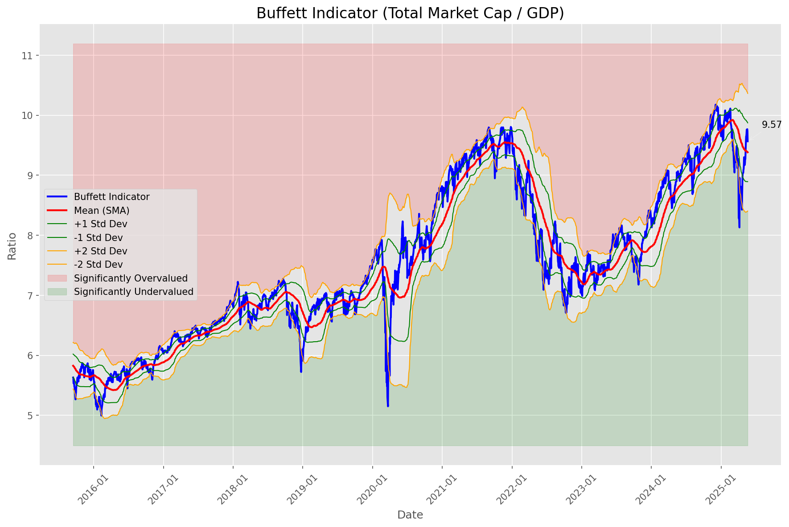
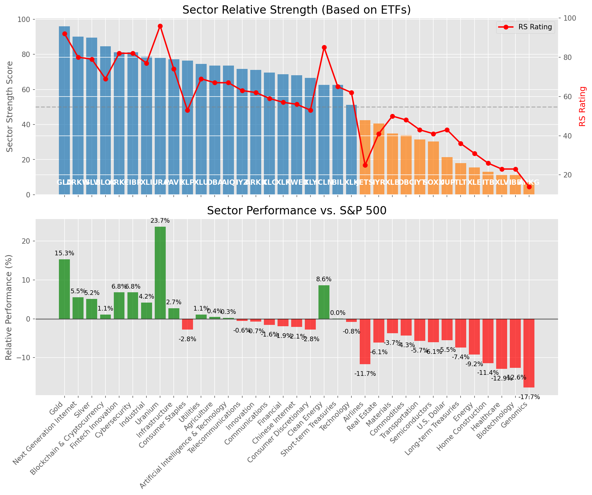

# **Daily Relative Strength Report**

**Date:** 2025-05-23

## **Market Valuation (Buffett Indicator)**

| Metric | Value |
|--------|-------|
| **Market Valuation** | **Fair Valued** |
| **Current Ratio** | 9.51 |
| **Historical Mean** | 9.38 |
| **Standard Deviation** | 0.49 |
| **Z-Score (StdDev from Mean)** | 0.38 |
| **Total Market Cap** | $285.04 trillion |
| **GDP** | $29.98 trillion |

## **Market Insights**

### **Market is Fairly Valued**

The market appears to be trading within a reasonable range of historical valuations. This suggests a balanced approach to equity investing is appropriate. Investors should:

- Focus on individual stock selection based on fundamentals and technicals
- Maintain normal equity allocations aligned with long-term goals
- Pay attention to sector rotation and relative strength
- Watch for changes in market leadership

Fair valuation typically suggests normal market returns can be expected, with stock selection becoming increasingly important.

### **Buffett Indicator Overview**

The Buffett Indicator (Total Market Cap / GDP) is a measure of the stock market's valuation relative to the size of the economy. It is named after Warren Buffett, who described it as "probably the best single measure of where valuations stand at any given moment."

- **Values above +2 standard deviations:** Market significantly overvalued
- **Values above +1 standard deviation:** Market overvalued
- **Values between -1 and +1 standard deviations:** Market fairly valued
- **Values below -1 standard deviation:** Market undervalued
- **Values below -2 standard deviations:** Market significantly undervalued

---

## **Sector Relative Strength**

Based on William O'Neil's Relative Strength Methodology

| ETF | Strength | RS Rating | Performance | Above Key MAs | Trend | Sector |
|-----|----------|-----------|-------------|--------------|-------|--------|
| [GLD](https://www.tradingview.com/chart/?symbol=GLD) | 95.0 | 90.0 | 13.79% | 10d ✓, 50d ✓, 200d ✓ | ↗️ | Gold |
| [CIBR](https://www.tradingview.com/chart/?symbol=CIBR) | 90.5 | 81.0 | 6.41% | 10d ✓, 50d ✓, 200d ✓ | ↗️ | Cybersecurity |
| [SLV](https://www.tradingview.com/chart/?symbol=SLV) | 87.5 | 75.0 | 3.43% | 10d ✓, 50d ✓, 200d ✓ | ↗️ | Silver |
| [BLOK](https://www.tradingview.com/chart/?symbol=BLOK) | 86.0 | 72.0 | 2.39% | 10d ✓, 50d ✓, 200d ✓ | ↗️ | Blockchain & Cryptocurrency |
| [XLU](https://www.tradingview.com/chart/?symbol=XLU) | 85.0 | 70.0 | 1.49% | 10d ✓, 50d ✓, 200d ✓ | ↗️ | Utilities |
| [XLP](https://www.tradingview.com/chart/?symbol=XLP) | 80.5 | 61.0 | -1.01% | 10d ✓, 50d ✓, 200d ✓ | ↗️ | Consumer Staples |
| [ARKW](https://www.tradingview.com/chart/?symbol=ARKW) | 79.5 | 59.0 | -1.48% | 10d ✓, 50d ✓, 200d ✓ | ↗️ | Next Generation Internet |
| [XLI](https://www.tradingview.com/chart/?symbol=XLI) | 79.1 | 78.0 | 4.92% | 10d ✗, 50d ✓, 200d ✓ | ↗️ | Industrial |
| [URA](https://www.tradingview.com/chart/?symbol=URA) | 78.0 | 96.0 | 24.05% | 10d ✓, 50d ✓, 200d ✓ | ↘️ | Uranium |
| [ARKF](https://www.tradingview.com/chart/?symbol=ARKF) | 77.6 | 75.0 | 3.28% | 10d ✗, 50d ✓, 200d ✓ | ↗️ | Fintech Innovation |
| [PAVE](https://www.tradingview.com/chart/?symbol=PAVE) | 77.1 | 74.0 | 2.90% | 10d ✗, 50d ✓, 200d ✓ | ↗️ | Infrastructure |
| [AIQ](https://www.tradingview.com/chart/?symbol=AIQ) | 71.1 | 62.0 | -0.89% | 10d ✗, 50d ✓, 200d ✓ | ↗️ | Artificial Intelligence & Technology |
| [IYZ](https://www.tradingview.com/chart/?symbol=IYZ) | 71.1 | 62.0 | -0.64% | 10d ✗, 50d ✓, 200d ✓ | ↗️ | Telecommunications |
| [KWEB](https://www.tradingview.com/chart/?symbol=KWEB) | 69.6 | 59.0 | -1.43% | 10d ✗, 50d ✓, 200d ✓ | ↗️ | Chinese Internet |
| [XLF](https://www.tradingview.com/chart/?symbol=XLF) | 69.1 | 58.0 | -1.80% | 10d ✗, 50d ✓, 200d ✓ | ↗️ | Financial |
| [DBA](https://www.tradingview.com/chart/?symbol=DBA) | 67.1 | 54.0 | -2.79% | 10d ✗, 50d ✓, 200d ✓ | ↗️ | Agriculture |
| [XLC](https://www.tradingview.com/chart/?symbol=XLC) | 66.6 | 53.0 | -2.94% | 10d ✗, 50d ✓, 200d ✓ | ↗️ | Communications |
| [XLY](https://www.tradingview.com/chart/?symbol=XLY) | 66.1 | 52.0 | -3.18% | 10d ✗, 50d ✓, 200d ✓ | ↗️ | Consumer Discretionary |
| [ICLN](https://www.tradingview.com/chart/?symbol=ICLN) | 63.6 | 87.0 | 10.09% | 10d ✗, 50d ✓, 200d ✓ | ↘️ | Clean Energy |
| [BIL](https://www.tradingview.com/chart/?symbol=BIL) | 62.5 | 65.0 | 0.02% | 10d ✓, 50d ✓, 200d ✓ | ↘️ | Short-term Treasuries |
| [ARKK](https://www.tradingview.com/chart/?symbol=ARKK) | 62.1 | 44.0 | -5.09% | 10d ✗, 50d ✓, 200d ✓ | ↗️ | Innovation |
| [XLK](https://www.tradingview.com/chart/?symbol=XLK) | 48.6 | 57.0 | -2.03% | 10d ✗, 50d ✓, 200d ✓ | ↘️ | Technology |
| [IYR](https://www.tradingview.com/chart/?symbol=IYR) | 43.0 | 46.0 | -4.55% | 10d ✗, 50d ✗, 200d ✗ | ↗️ | Real Estate |
| [JETS](https://www.tradingview.com/chart/?symbol=JETS) | 42.4 | 25.0 | -11.93% | 10d ✗, 50d ✓, 200d ✗ | ↗️ | Airlines |
| [DBC](https://www.tradingview.com/chart/?symbol=DBC) | 41.8 | 44.0 | -5.18% | 10d ✓, 50d ✓, 200d ✗ | ↘️ | Commodities |
| [XLB](https://www.tradingview.com/chart/?symbol=XLB) | 37.4 | 55.0 | -2.58% | 10d ✗, 50d ✓, 200d ✗ | ↘️ | Materials |
| [IYT](https://www.tradingview.com/chart/?symbol=IYT) | 29.9 | 40.0 | -6.28% | 10d ✗, 50d ✓, 200d ✗ | ↘️ | Transportation |
| [SOXX](https://www.tradingview.com/chart/?symbol=SOXX) | 28.4 | 37.0 | -7.39% | 10d ✗, 50d ✓, 200d ✗ | ↘️ | Semiconductors |
| [IBB](https://www.tradingview.com/chart/?symbol=IBB) | 21.4 | 23.0 | -12.61% | 10d ✓, 50d ✗, 200d ✗ | ↘️ | Biotechnology |
| [TLT](https://www.tradingview.com/chart/?symbol=TLT) | 20.5 | 41.0 | -5.92% | 10d ✗, 50d ✗, 200d ✗ | ↘️ | Long-term Treasuries |
| [UUP](https://www.tradingview.com/chart/?symbol=UUP) | 20.5 | 41.0 | -5.95% | 10d ✗, 50d ✗, 200d ✗ | ↘️ | U.S. Dollar |
| [ITB](https://www.tradingview.com/chart/?symbol=ITB) | 17.0 | 34.0 | -8.29% | 10d ✗, 50d ✗, 200d ✗ | ↘️ | Home Construction |
| [XLE](https://www.tradingview.com/chart/?symbol=XLE) | 15.0 | 30.0 | -9.85% | 10d ✗, 50d ✗, 200d ✗ | ↘️ | Energy |
| [XLV](https://www.tradingview.com/chart/?symbol=XLV) | 13.0 | 26.0 | -11.71% | 10d ✗, 50d ✗, 200d ✗ | ↘️ | Healthcare |
| [ARKG](https://www.tradingview.com/chart/?symbol=ARKG) | 5.5 | 11.0 | -21.03% | 10d ✗, 50d ✗, 200d ✗ | ↘️ | Genomics |

### **Sector ETF Performance Interpretation**

This table shows the relative strength metrics for different market sectors based on their representative ETFs:

- **ETF**: The ETF used to measure sector performance (click for chart)
- **Strength**: Overall sector strength score (0-100) combining multiple factors
- **RS Rating**: O'Neil RS rating of the sector ETF
- **Performance**: Performance of the sector ETF relative to SPY
- **Above Key MAs**: Whether the ETF is trading above its 10, 50, and 200-day moving averages
- **Trend**: Whether the sector is in an uptrend (↗️) or downtrend (↘️)

### **Current Sector Leadership**

The current market leadership is coming from the following sectors: **Gold, Cybersecurity, Silver**.

The **Gold** sector (represented by **GLD**) is showing particularly strong relative strength with an RS rating of 90.0 and performance of 13.79% vs. the S&P 500. This sector is trading above its 10-day, 50-day, 200-day moving average(s). Investors should consider focusing on high RS stocks within these leading sectors for potential outperformance.

---

## **Buy Recommendations**

The following 82 stocks show exceptional relative strength:

| RS Rating | Buy Score | Current Price | Chart | Name | Ticker |
|-----------|-----------|---------------|-------|------|--------|
| 100 | 100 | $304.11 | [Chart](https://www.tradingview.com/chart/?symbol=CVNA) | Carvana Co. | CVNA |
| 100 | 100 | $203.26 | [Chart](https://www.tradingview.com/chart/?symbol=AGX) | Argan, Inc | AGX |
| 100 | 100 | $731.37 | [Chart](https://www.tradingview.com/chart/?symbol=AXON) | Axon Enterprise, Inc. Common Stock | AXON |
| 100 | 100 | $105.31 | [Chart](https://www.tradingview.com/chart/?symbol=SEZL) | Sezzle Inc. Common Stock | SEZL |
| 100 | 100 | $197.32 | [Chart](https://www.tradingview.com/chart/?symbol=DAVE) | Dave Inc. Class A Common Stock | DAVE |
| 100 | 100 | $23.15 | [Chart](https://www.tradingview.com/chart/?symbol=PRA) | ProAssurance Corporation | PRA |
| 100 | 100 | $36.01 | [Chart](https://www.tradingview.com/chart/?symbol=KTOS) | Kratos Defense & Security Solutions, Inc. | KTOS |
| 100 | 100 | $464.39 | [Chart](https://www.tradingview.com/chart/?symbol=GEV) | GE Vernova Inc. | GEV |
| 99 | 100 | $92.35 | [Chart](https://www.tradingview.com/chart/?symbol=RBRK) | Rubrik, Inc. | RBRK |
| 99 | 100 | $71.79 | [Chart](https://www.tradingview.com/chart/?symbol=ULS) | UL Solutions Inc. | ULS |
| 99 | 100 | $82.26 | [Chart](https://www.tradingview.com/chart/?symbol=RBLX) | Roblox Corporation | RBLX |
| 98 | 100 | $34.99 | [Chart](https://www.tradingview.com/chart/?symbol=UTI) | Universal Technical Institute, Inc. | UTI |
| 98 | 100 | $37.04 | [Chart](https://www.tradingview.com/chart/?symbol=AS) | Amer Sports, Inc. | AS |
| 98 | 100 | $162.56 | [Chart](https://www.tradingview.com/chart/?symbol=PLMR) | Palomar Holdings, Inc. Common stock | PLMR |
| 98 | 100 | $55.28 | [Chart](https://www.tradingview.com/chart/?symbol=SHLD) | Global X Defense Tech ETF | SHLD |
| 97 | 100 | $144.55 | [Chart](https://www.tradingview.com/chart/?symbol=UGL) | ProShares Ultra Gold | UGL |
| 97 | 100 | $63.17 | [Chart](https://www.tradingview.com/chart/?symbol=HOOD) | Robinhood Markets, Inc. Class A Common Stock | HOOD |
| 97 | 100 | $29.02 | [Chart](https://www.tradingview.com/chart/?symbol=FMS) | Fresenius Medical Care AG | FMS |
| 97 | 100 | $165.09 | [Chart](https://www.tradingview.com/chart/?symbol=HWM) | Howmet Aerospace Inc. | HWM |
| 97 | 100 | $164.06 | [Chart](https://www.tradingview.com/chart/?symbol=SE) | Sea Limited American Depositary Shares, each representing one Class A Ordinary Share | SE |
| 97 | 100 | $26.30 | [Chart](https://www.tradingview.com/chart/?symbol=UVE) | UNIVERSAL INSURANCE HLDG, INC. | UVE |
| 97 | 100 | $86.62 | [Chart](https://www.tradingview.com/chart/?symbol=WPM) | Wheaton Precious Metals Corp. Common Stock | WPM |
| 97 | 100 | $21.78 | [Chart](https://www.tradingview.com/chart/?symbol=TFPM) | Triple Flag Precious Metals Corp. | TFPM |
| 97 | 100 | $24.00 | [Chart](https://www.tradingview.com/chart/?symbol=GRND) | Grindr Inc. | GRND |
| 96 | 100 | $43.31 | [Chart](https://www.tradingview.com/chart/?symbol=EWP) | iShares MSCI Spain ETF | EWP |
| 96 | 100 | $18.84 | [Chart](https://www.tradingview.com/chart/?symbol=MIR) | Mirion Technologies, Inc. | MIR |
| 95 | 100 | $117.62 | [Chart](https://www.tradingview.com/chart/?symbol=AEM) | Agnico Eagle Mines Ltd. | AEM |
| 95 | 100 | $152.75 | [Chart](https://www.tradingview.com/chart/?symbol=CAH) | Cardinal Health, Inc. | CAH |
| 95 | 100 | $1185.39 | [Chart](https://www.tradingview.com/chart/?symbol=NFLX) | NetFlix Inc | NFLX |
| 94 | 100 | $129.50 | [Chart](https://www.tradingview.com/chart/?symbol=COOP) | Mr. Cooper Group Inc. Common Stock | COOP |
| 94 | 100 | $45.22 | [Chart](https://www.tradingview.com/chart/?symbol=BTI) | British American Tobacco p.l.c. American Depositary Shares, American Depositary Shares, each representing one Ordinary Share | BTI |
| 94 | 100 | $180.59 | [Chart](https://www.tradingview.com/chart/?symbol=RGLD) | Royal Gold Inc | RGLD |
| 93 | 100 | $73.08 | [Chart](https://www.tradingview.com/chart/?symbol=WRB) | W.R. Berkley Corporation | WRB |
| 93 | 100 | $17.65 | [Chart](https://www.tradingview.com/chart/?symbol=BCS) | Barclays PLC | BCS |
| 93 | 100 | $232.79 | [Chart](https://www.tradingview.com/chart/?symbol=GE) | GE Aerospace | GE |
| 93 | 100 | $97.99 | [Chart](https://www.tradingview.com/chart/?symbol=JCI) | Johnson Controls International plc | JCI |
| 92 | 100 | $46.96 | [Chart](https://www.tradingview.com/chart/?symbol=EWI) | iShares MSCI Italy ETF | EWI |
| 92 | 100 | $230.16 | [Chart](https://www.tradingview.com/chart/?symbol=CRS) | Carpenter Technology Corp | CRS |
| 92 | 100 | $63.63 | [Chart](https://www.tradingview.com/chart/?symbol=SLF) | Sun Life Financial Inc. | SLF |
| 92 | 100 | $61.83 | [Chart](https://www.tradingview.com/chart/?symbol=IBIT) | iShares Bitcoin Trust ETF | IBIT |
| 92 | 100 | $30.77 | [Chart](https://www.tradingview.com/chart/?symbol=HODL) | VanEck Bitcoin ETF | HODL |
| 92 | 100 | $34.43 | [Chart](https://www.tradingview.com/chart/?symbol=FDP) | Fresh Del Monte Produce Inc. | FDP |
| 92 | 100 | $48.18 | [Chart](https://www.tradingview.com/chart/?symbol=BTC) | Grayscale Bitcoin Mini Trust ETF | BTC |
| 91 | 100 | $178.19 | [Chart](https://www.tradingview.com/chart/?symbol=PM) | Philip Morris International Inc. | PM |
| 91 | 100 | $32.07 | [Chart](https://www.tradingview.com/chart/?symbol=SGOL) | abrdn Physical Gold Shares ETF | SGOL |
| 91 | 100 | $41.26 | [Chart](https://www.tradingview.com/chart/?symbol=EWG) | iShares MSCI Germany ETF | EWG |
| 91 | 100 | $171.05 | [Chart](https://www.tradingview.com/chart/?symbol=ITA) | iShares U.S. Aerospace & Defense ETF | ITA |
| 91 | 100 | $66.57 | [Chart](https://www.tradingview.com/chart/?symbol=GLDM) | SPDR Gold MiniShares | GLDM |
| 91 | 100 | $284.07 | [Chart](https://www.tradingview.com/chart/?symbol=CME) | CME Group Inc. | CME |
| 91 | 100 | $75.06 | [Chart](https://www.tradingview.com/chart/?symbol=VRNA) | Verona Pharma plc | VRNA |
| 91 | 100 | $50.45 | [Chart](https://www.tradingview.com/chart/?symbol=TRP) | TC Energy Corporation | TRP |
| 90 | 100 | $63.38 | [Chart](https://www.tradingview.com/chart/?symbol=IAU) | iShares Gold Trust | IAU |
| 90 | 100 | $309.75 | [Chart](https://www.tradingview.com/chart/?symbol=GLD) | SPDR Gold Trust, SPDR Gold Shares | GLD |
| 90 | 100 | $116.48 | [Chart](https://www.tradingview.com/chart/?symbol=BJ) | BJs Wholesale Club Holdings, Inc. Common Stock | BJ |
| 90 | 100 | $33.20 | [Chart](https://www.tradingview.com/chart/?symbol=AAAU) | Goldman Sachs Physical Gold ETF Shares | AAAU |
| 90 | 100 | $55.44 | [Chart](https://www.tradingview.com/chart/?symbol=RELX) | RELX PLC | RELX |
| 90 | 100 | $32.40 | [Chart](https://www.tradingview.com/chart/?symbol=OUNZ) | VanEck Merk Gold ETF | OUNZ |
| 90 | 100 | $33.51 | [Chart](https://www.tradingview.com/chart/?symbol=IAUM) | iShares Gold Trust Micro | IAUM |
| 90 | 100 | $243.08 | [Chart](https://www.tradingview.com/chart/?symbol=TLN) | Talen Energy Corporation Common Stock | TLN |
| 89 | 100 | $25.65 | [Chart](https://www.tradingview.com/chart/?symbol=PHYS) | Sprott Physical Gold Trust | PHYS |
| 89 | 100 | $23.89 | [Chart](https://www.tradingview.com/chart/?symbol=SRAD) | Sportradar Group AG Class A Ordinary Shares | SRAD |
| 89 | 100 | $82.42 | [Chart](https://www.tradingview.com/chart/?symbol=NFG) | National Fuel Gas Co. | NFG |
| 88 | 100 | $47.20 | [Chart](https://www.tradingview.com/chart/?symbol=MRCY) | Mercury Systems Inc. | MRCY |
| 86 | 99 | $29.60 | [Chart](https://www.tradingview.com/chart/?symbol=CEF) | Sprott Physical Gold and Silver Trust | CEF |
| 85 | 99 | $653.82 | [Chart](https://www.tradingview.com/chart/?symbol=SPOT) | Spotify Technology S.A. | SPOT |
| 88 | 98 | $31.00 | [Chart](https://www.tradingview.com/chart/?symbol=TGS) | Transportadora de Gas del Sur S.A. ADS | TGS |
| 87 | 98 | $204.24 | [Chart](https://www.tradingview.com/chart/?symbol=BAP) | Credicorp LTD | BAP |
| 85 | 98 | $252.86 | [Chart](https://www.tradingview.com/chart/?symbol=RSG) | Republic Services Inc. | RSG |
| 87 | 97 | $59.31 | [Chart](https://www.tradingview.com/chart/?symbol=UVV) | Universal Corporation | UVV |
| 87 | 97 | $48.36 | [Chart](https://www.tradingview.com/chart/?symbol=FTS) | Fortis Inc. Common Shares | FTS |
| 86 | 97 | $58.74 | [Chart](https://www.tradingview.com/chart/?symbol=IGF) | iShares Global Infrastructure ETF | IGF |
| 86 | 96 | $231.58 | [Chart](https://www.tradingview.com/chart/?symbol=CBOE) | Cboe Global Markets, Inc. | CBOE |
| 85 | 96 | $32.47 | [Chart](https://www.tradingview.com/chart/?symbol=ATAT) | Atour Lifestyle Holdings Limited American Depositary Shares | ATAT |
| 84 | 94 | $62.86 | [Chart](https://www.tradingview.com/chart/?symbol=GGAL) | Grupo Financiero Galicia SA | GGAL |
| 83 | 94 | $104.07 | [Chart](https://www.tradingview.com/chart/?symbol=DTM) | DT Midstream, Inc. | DTM |
| 83 | 94 | $13.54 | [Chart](https://www.tradingview.com/chart/?symbol=MUFG) | Mitsubishi UFJ Financial Group, Inc. | MUFG |
| 83 | 93 | $119.47 | [Chart](https://www.tradingview.com/chart/?symbol=CLS) | Celestica, Inc. | CLS |
| 81 | 93 | $59.24 | [Chart](https://www.tradingview.com/chart/?symbol=HSBC) | HSBC Holdings PLC | HSBC |
| 81 | 93 | $227.86 | [Chart](https://www.tradingview.com/chart/?symbol=CHKP) | Check Point Software Technologies Ltd | CHKP |
| 81 | 93 | $42.92 | [Chart](https://www.tradingview.com/chart/?symbol=HMN) | Horace Mann Educators Corporation | HMN |
| 80 | 91 | $313.77 | [Chart](https://www.tradingview.com/chart/?symbol=VRSK) | Verisk Analytics, Inc. Common Stock | VRSK |
| 80 | 91 | $5332.80 | [Chart](https://www.tradingview.com/chart/?symbol=BKNG) | Booking Holdings Inc. Common Stock | BKNG |

---

## **Sell Recommendations**

The following 132 stocks show deteriorating relative strength:

| RS Rating | Sell Score | Current Price | Chart | Name | Ticker |
|-----------|------------|---------------|-------|------|--------|
| 1 | 100 | $12.30 | [Chart](https://www.tradingview.com/chart/?symbol=IART) | Integra LifeSciences Holdings | IART |
| 1 | 100 | $16.83 | [Chart](https://www.tradingview.com/chart/?symbol=BEAM) | Beam Therapeutics Inc. Common Stock | BEAM |
| 2 | 100 | $13.13 | [Chart](https://www.tradingview.com/chart/?symbol=DV) | DoubleVerify Holdings, Inc. | DV |
| 2 | 100 | $50.47 | [Chart](https://www.tradingview.com/chart/?symbol=LABU) | Direxion Daily S&P Biotech Bull 3X Shares | LABU |
| 2 | 100 | $30.54 | [Chart](https://www.tradingview.com/chart/?symbol=CYTK) | Cytokinetics Inc. | CYTK |
| 2 | 100 | $16.79 | [Chart](https://www.tradingview.com/chart/?symbol=FWRD) | Forward Air Corp | FWRD |
| 3 | 100 | $13.42 | [Chart](https://www.tradingview.com/chart/?symbol=DNLI) | Denali Therapeutics Inc. Common Stock | DNLI |
| 4 | 100 | $16.80 | [Chart](https://www.tradingview.com/chart/?symbol=VRNT) | Verint Systems Inc | VRNT |
| 4 | 100 | $28.26 | [Chart](https://www.tradingview.com/chart/?symbol=TWST) | Twist Bioscience Corporation Common Stock | TWST |
| 4 | 100 | $13.73 | [Chart](https://www.tradingview.com/chart/?symbol=DQ) | Daqo New Energy Corp. American Depositary Shares (each representing 5 Ordinary Shares) | DQ |
| 4 | 100 | $10.85 | [Chart](https://www.tradingview.com/chart/?symbol=CLB) | Core Laboratories Inc. | CLB |
| 4 | 100 | $120.78 | [Chart](https://www.tradingview.com/chart/?symbol=TFX) | Teleflex Incorporated | TFX |
| 4 | 100 | $60.77 | [Chart](https://www.tradingview.com/chart/?symbol=ARCB) | ArcBest Corporation | ARCB |
| 4 | 100 | $125.05 | [Chart](https://www.tradingview.com/chart/?symbol=KRYS) | Krystal Biotech, Inc. Common Stock | KRYS |
| 5 | 100 | $15.08 | [Chart](https://www.tradingview.com/chart/?symbol=PENN) | PENN Entertainment, Inc. Common Stock | PENN |
| 5 | 100 | $41.47 | [Chart](https://www.tradingview.com/chart/?symbol=WHD) | Cactus, Inc. | WHD |
| 5 | 100 | $14.46 | [Chart](https://www.tradingview.com/chart/?symbol=IMVT) | Immunovant, Inc. Common Stock | IMVT |
| 6 | 100 | $29.16 | [Chart](https://www.tradingview.com/chart/?symbol=SRDX) | Surmodics, Inc. Common Stock | SRDX |
| 6 | 100 | $31.46 | [Chart](https://www.tradingview.com/chart/?symbol=MBIN) | Merchants Bancorp Common Stock | MBIN |
| 6 | 100 | $22.96 | [Chart](https://www.tradingview.com/chart/?symbol=RPD) | Rapid7, Inc. Common Stock | RPD |
| 7 | 100 | $52.83 | [Chart](https://www.tradingview.com/chart/?symbol=OXM) | Oxford Industries, Inc. | OXM |
| 7 | 100 | $45.31 | [Chart](https://www.tradingview.com/chart/?symbol=RHI) | Robert Half Inc. | RHI |
| 7 | 100 | $16.29 | [Chart](https://www.tradingview.com/chart/?symbol=MLKN) | MillerKnoll, Inc. Common Stock | MLKN |
| 8 | 100 | $16.82 | [Chart](https://www.tradingview.com/chart/?symbol=COLD) | Americold Realty Trust, Inc. | COLD |
| 8 | 100 | $12.20 | [Chart](https://www.tradingview.com/chart/?symbol=ARCT) | Arcturus Therapeutics Holdings Inc. Common Stock | ARCT |
| 8 | 100 | $20.14 | [Chart](https://www.tradingview.com/chart/?symbol=AMRK) | A-Mark Precious Metals, Inc. | AMRK |
| 9 | 100 | $14.75 | [Chart](https://www.tradingview.com/chart/?symbol=DXC) | DXC Technology Company | DXC |
| 11 | 100 | $19.20 | [Chart](https://www.tradingview.com/chart/?symbol=VECO) | Veeco Instruments Inc | VECO |
| 12 | 100 | $40.65 | [Chart](https://www.tradingview.com/chart/?symbol=ASO) | Academy Sports and Outdoors, Inc. | ASO |
| 13 | 100 | $89.65 | [Chart](https://www.tradingview.com/chart/?symbol=CHRD) | Chord Energy Corporation Common Stock | CHRD |
| 13 | 100 | $19.23 | [Chart](https://www.tradingview.com/chart/?symbol=NVDS) | Investment Managers Series Trust II Tradr 1.5X Short NVDA Daily ETF | NVDS |
| 16 | 100 | $11.91 | [Chart](https://www.tradingview.com/chart/?symbol=ZUMZ) | Zumiez Inc. | ZUMZ |
| 17 | 100 | $45.21 | [Chart](https://www.tradingview.com/chart/?symbol=LINE) | Lineage, Inc. Common Stock | LINE |
| 20 | 100 | $11.04 | [Chart](https://www.tradingview.com/chart/?symbol=GES) | Guess?, Inc. | GES |
| 4 | 99 | $10.22 | [Chart](https://www.tradingview.com/chart/?symbol=HPK) | HighPeak Energy, Inc. Common Stock | HPK |
| 6 | 99 | $11.44 | [Chart](https://www.tradingview.com/chart/?symbol=WEN) | The Wendy's Company | WEN |
| 7 | 99 | $10.17 | [Chart](https://www.tradingview.com/chart/?symbol=PK) | Park Hotels & Resorts Inc. Common Stock | PK |
| 7 | 99 | $14.23 | [Chart](https://www.tradingview.com/chart/?symbol=INMD) | InMode Ltd. Ordinary Shares | INMD |
| 9 | 99 | $20.77 | [Chart](https://www.tradingview.com/chart/?symbol=AMN) | AMN Healthcare Services | AMN |
| 11 | 99 | $195.27 | [Chart](https://www.tradingview.com/chart/?symbol=AAPL) | Apple Inc. | AAPL |
| 16 | 99 | $10.34 | [Chart](https://www.tradingview.com/chart/?symbol=CMRE) | Costamare Inc. | CMRE |
| 7 | 98 | $57.18 | [Chart](https://www.tradingview.com/chart/?symbol=AMWD) | American Woodmark Corp | AMWD |
| 11 | 98 | $33.58 | [Chart](https://www.tradingview.com/chart/?symbol=WGO) | Winnebago Industries, Inc. | WGO |
| 15 | 98 | $15.58 | [Chart](https://www.tradingview.com/chart/?symbol=AMZY) | YieldMax AMZN Option Income Strategy ETF | AMZY |
| 6 | 97 | $19.64 | [Chart](https://www.tradingview.com/chart/?symbol=VERA) | Vera Therapeutics, Inc. Class A Common Stock | VERA |
| 9 | 97 | $21.19 | [Chart](https://www.tradingview.com/chart/?symbol=UCO) | ProShares Ultra Bloomberg Crude Oil | UCO |
| 22 | 97 | $14.60 | [Chart](https://www.tradingview.com/chart/?symbol=FXN) | First Trust Energy AlphaDEX Fund | FXN |
| 4 | 96 | $10.31 | [Chart](https://www.tradingview.com/chart/?symbol=VREX) | Varex Imaging Corporation Common Stock | VREX |
| 5 | 96 | $10.48 | [Chart](https://www.tradingview.com/chart/?symbol=SONO) | Sonos, Inc. Common Stock | SONO |
| 9 | 96 | $77.28 | [Chart](https://www.tradingview.com/chart/?symbol=WHR) | Whirlpool Corp. | WHR |
| 10 | 96 | $25.76 | [Chart](https://www.tradingview.com/chart/?symbol=WERN) | Werner Enterprises Inc | WERN |
| 12 | 96 | $216.26 | [Chart](https://www.tradingview.com/chart/?symbol=OIH) | VanEck Oil Services ETF | OIH |
| 16 | 96 | $57.55 | [Chart](https://www.tradingview.com/chart/?symbol=BMRN) | BioMarin Pharmaceuticals Inc | BMRN |
| 5 | 95 | $183.00 | [Chart](https://www.tradingview.com/chart/?symbol=NVMI) | Nova Ltd. Ordinary Shares | NVMI |
| 9 | 95 | $143.21 | [Chart](https://www.tradingview.com/chart/?symbol=INSP) | Inspire Medical Systems, Inc. | INSP |
| 10 | 94 | $11.47 | [Chart](https://www.tradingview.com/chart/?symbol=APLE) | Apple Hospitality REIT, Inc. | APLE |
| 12 | 94 | $21.23 | [Chart](https://www.tradingview.com/chart/?symbol=HZO) | MarineMax, Inc. | HZO |
| 14 | 94 | $43.40 | [Chart](https://www.tradingview.com/chart/?symbol=MTDR) | MATADOR RESOURCES COMPANY | MTDR |
| 16 | 94 | $11.00 | [Chart](https://www.tradingview.com/chart/?symbol=GSBD) | Goldman Sachs BDC, Inc. | GSBD |
| 11 | 93 | $20.92 | [Chart](https://www.tradingview.com/chart/?symbol=ARKG) | ARK Genomic Revolution ETF | ARKG |
| 14 | 93 | $10.02 | [Chart](https://www.tradingview.com/chart/?symbol=HOPE) | Hope Bancorp, Inc. | HOPE |
| 14 | 93 | $21.40 | [Chart](https://www.tradingview.com/chart/?symbol=ESI) | Element Solutions Inc. | ESI |
| 14 | 93 | $11.84 | [Chart](https://www.tradingview.com/chart/?symbol=PBR) | PETROLEO BRASILEIRO S.A.-PETROBRAS ADS (REP 1 COMMON SHARE) | PBR |
| 21 | 93 | $10.05 | [Chart](https://www.tradingview.com/chart/?symbol=LBTYK) | Liberty Global Ltd. Class C Common Shares | LBTYK |
| 25 | 93 | $27.66 | [Chart](https://www.tradingview.com/chart/?symbol=TX) | Ternium S.A. American Depositary Shares | TX |
| 14 | 92 | $80.54 | [Chart](https://www.tradingview.com/chart/?symbol=EMN) | Eastman Chemical Company | EMN |
| 20 | 92 | $30.12 | [Chart](https://www.tradingview.com/chart/?symbol=BAX) | Baxter International Inc. | BAX |
| 16 | 91 | $14.50 | [Chart](https://www.tradingview.com/chart/?symbol=SAFE) | Safehold Inc. | SAFE |
| 17 | 91 | $11.08 | [Chart](https://www.tradingview.com/chart/?symbol=PBR.A) | Petroleo Brasileiro S.A.-Petrobras | PBR.A |
| 17 | 91 | $51.24 | [Chart](https://www.tradingview.com/chart/?symbol=KBH) | KB Home | KBH |
| 19 | 91 | $14.35 | [Chart](https://www.tradingview.com/chart/?symbol=HR) | Healthcare Realty Trust Incorporated | HR |
| 17 | 90 | $10.76 | [Chart](https://www.tradingview.com/chart/?symbol=NEWT) | NewtekOne, Inc. Common Stock | NEWT |
| 21 | 89 | $104.04 | [Chart](https://www.tradingview.com/chart/?symbol=PLD) | PROLOGIS, INC. | PLD |
| 12 | 88 | $25.22 | [Chart](https://www.tradingview.com/chart/?symbol=IRDM) | Iridium Communications Inc. | IRDM |
| 14 | 88 | $14.38 | [Chart](https://www.tradingview.com/chart/?symbol=IVZ) | Invesco LTD | IVZ |
| 18 | 88 | $22.59 | [Chart](https://www.tradingview.com/chart/?symbol=GPK) | Graphic Packaging Holding Company | GPK |
| 20 | 88 | $17.38 | [Chart](https://www.tradingview.com/chart/?symbol=NX) | Quanex Building Products Corporation | NX |
| 23 | 88 | $15.93 | [Chart](https://www.tradingview.com/chart/?symbol=MLNK) | MeridianLink, Inc. | MLNK |
| 24 | 88 | $17.18 | [Chart](https://www.tradingview.com/chart/?symbol=STR) | Sitio Royalties Corp. | STR |
| 19 | 87 | $35.66 | [Chart](https://www.tradingview.com/chart/?symbol=RARE) | Ultragenyx Pharmaceutical Inc. | RARE |
| 26 | 87 | $14.10 | [Chart](https://www.tradingview.com/chart/?symbol=OCSL) | Oaktree Specialty Lending Corporation | OCSL |
| 27 | 87 | $64.22 | [Chart](https://www.tradingview.com/chart/?symbol=MTH) | Meritage Homes Corporation | MTH |
| 18 | 86 | $25.23 | [Chart](https://www.tradingview.com/chart/?symbol=WY) | Weyerhaeuser Company | WY |
| 20 | 86 | $15.85 | [Chart](https://www.tradingview.com/chart/?symbol=CHCT) | Community Healthcare Trust Incorporated Common Stock, $0.01 par value per share | CHCT |
| 15 | 85 | $55.15 | [Chart](https://www.tradingview.com/chart/?symbol=TRNO) | Terreno Realty Corporation | TRNO |
| 21 | 85 | $29.09 | [Chart](https://www.tradingview.com/chart/?symbol=BP) | BP p.l.c. | BP |
| 19 | 84 | $12.56 | [Chart](https://www.tradingview.com/chart/?symbol=ERII) | Energy Recovery, Inc. | ERII |
| 21 | 84 | $18.99 | [Chart](https://www.tradingview.com/chart/?symbol=OII) | Oceaneering International Inc. | OII |
| 21 | 84 | $18.44 | [Chart](https://www.tradingview.com/chart/?symbol=LOVE) | The Lovesac Company Common Stock | LOVE |
| 22 | 84 | $10.09 | [Chart](https://www.tradingview.com/chart/?symbol=SCS) | Steelcase, Inc. | SCS |
| 24 | 84 | $101.10 | [Chart](https://www.tradingview.com/chart/?symbol=MHK) | Mohawk Industries, Inc. | MHK |
| 25 | 83 | $115.79 | [Chart](https://www.tradingview.com/chart/?symbol=SITE) | SiteOne Landscape Supply, Inc. | SITE |
| 29 | 83 | $170.80 | [Chart](https://www.tradingview.com/chart/?symbol=ALGN) | Align Technology Inc | ALGN |
| 20 | 82 | $48.16 | [Chart](https://www.tradingview.com/chart/?symbol=FR) | First Industrial Realty Trust, Inc. | FR |
| 22 | 82 | $12.22 | [Chart](https://www.tradingview.com/chart/?symbol=PMT) | PennyMac Mortgage Investment Trust | PMT |
| 26 | 82 | $61.12 | [Chart](https://www.tradingview.com/chart/?symbol=BLKB) | Blackbaud, Inc. | BLKB |
| 24 | 81 | $25.57 | [Chart](https://www.tradingview.com/chart/?symbol=NATL) | NCR Atleos Corporation | NATL |
| 26 | 81 | $15.92 | [Chart](https://www.tradingview.com/chart/?symbol=PD) | PagerDuty, Inc. | PD |
| 28 | 81 | $10.16 | [Chart](https://www.tradingview.com/chart/?symbol=AVO) | Mission Produce, Inc. Common Stock | AVO |
| 22 | 80 | $17.64 | [Chart](https://www.tradingview.com/chart/?symbol=UE) | UBRAN EDGE PROPERTIES | UE |
| 32 | 80 | $30.10 | [Chart](https://www.tradingview.com/chart/?symbol=ZSL) | ProShares UltraShort Silver | ZSL |
| 35 | 80 | $10.60 | [Chart](https://www.tradingview.com/chart/?symbol=NMFC) | NEW MOUNTAIN FINANCE CORPORATION | NMFC |
| 37 | 80 | $147.71 | [Chart](https://www.tradingview.com/chart/?symbol=MTN) | Vail Resorts, Inc. | MTN |
| 24 | 79 | $93.24 | [Chart](https://www.tradingview.com/chart/?symbol=PCAR) | Paccar Inc | PCAR |
| 28 | 79 | $55.40 | [Chart](https://www.tradingview.com/chart/?symbol=CNMD) | CONMED Corporation | CNMD |
| 24 | 78 | $75.75 | [Chart](https://www.tradingview.com/chart/?symbol=CNS) | Cohen & Steers Inc. | CNS |
| 25 | 78 | $36.54 | [Chart](https://www.tradingview.com/chart/?symbol=NBHC) | NATIONAL BANK HOLDINGS CORP. | NBHC |
| 33 | 78 | $37.52 | [Chart](https://www.tradingview.com/chart/?symbol=LIT) | Global X Lithium & Battery Tech ETF | LIT |
| 27 | 77 | $35.83 | [Chart](https://www.tradingview.com/chart/?symbol=BHE) | Benchmark Electronics | BHE |
| 28 | 77 | $119.93 | [Chart](https://www.tradingview.com/chart/?symbol=SUI) | Sun Communities, Inc | SUI |
| 31 | 77 | $12.06 | [Chart](https://www.tradingview.com/chart/?symbol=WSR) | Whitestone REIT | WSR |
| 33 | 77 | $10.44 | [Chart](https://www.tradingview.com/chart/?symbol=CELC) | Celcuity Inc. Common Stock | CELC |
| 36 | 77 | $10.88 | [Chart](https://www.tradingview.com/chart/?symbol=LBTYA) | Liberty Global Ltd. Class A Common Shares | LBTYA |
| 32 | 76 | $14.58 | [Chart](https://www.tradingview.com/chart/?symbol=VRE) | Veris Residential, Inc. | VRE |
| 33 | 75 | $21.14 | [Chart](https://www.tradingview.com/chart/?symbol=CON) | Concentra Group Holdings Parent, Inc. | CON |
| 26 | 74 | $131.36 | [Chart](https://www.tradingview.com/chart/?symbol=HES) | Hess Corporation | HES |
| 28 | 74 | $14.23 | [Chart](https://www.tradingview.com/chart/?symbol=BMEZ) | BlackRock Health Sciences Term Trust | BMEZ |
| 37 | 74 | $279.65 | [Chart](https://www.tradingview.com/chart/?symbol=BLD) | TopBuild Corp. Common Stock | BLD |
| 31 | 73 | $77.01 | [Chart](https://www.tradingview.com/chart/?symbol=PFG) | Principal Financial Group, Inc. | PFG |
| 33 | 73 | $35.71 | [Chart](https://www.tradingview.com/chart/?symbol=SU) | Suncor Energy, Inc. | SU |
| 34 | 73 | $154.40 | [Chart](https://www.tradingview.com/chart/?symbol=SSD) | Simpson Manufacturing Co., Inc. | SSD |
| 33 | 72 | $13.46 | [Chart](https://www.tradingview.com/chart/?symbol=MANU) | MANCHESTER UNITED PLC | MANU |
| 36 | 72 | $11.79 | [Chart](https://www.tradingview.com/chart/?symbol=NVG) | Nuveen AMT-Free Municipal Credit Income Fund | NVG |
| 33 | 70 | $164.82 | [Chart](https://www.tradingview.com/chart/?symbol=EGP) | EastGroup Properties Inc. | EGP |
| 35 | 70 | $15.60 | [Chart](https://www.tradingview.com/chart/?symbol=ELME) | Elme Communities | ELME |
| 37 | 70 | $11.72 | [Chart](https://www.tradingview.com/chart/?symbol=NZF) | Nuveen Municipal Credit Income Fund | NZF |
| 36 | 69 | $39.17 | [Chart](https://www.tradingview.com/chart/?symbol=KSA) | iShares MSCI Saudi Arabia ETF | KSA |
| 37 | 69 | $10.86 | [Chart](https://www.tradingview.com/chart/?symbol=SEMR) | SEMrush Holdings, Inc. | SEMR |
| 37 | 69 | $10.38 | [Chart](https://www.tradingview.com/chart/?symbol=MYI) | BLACKROCK MUNIYIELD QUALITY FUND III, INC. | MYI |
| 38 | 67 | $205.59 | [Chart](https://www.tradingview.com/chart/?symbol=WST) | West Pharmaceutical Services, Inc. | WST |
| 36 | 65 | $12.04 | [Chart](https://www.tradingview.com/chart/?symbol=RQI) | COHEN & STEERS QUALITY INCOME REALTY FUND, INC. COMMON SHARES | RQI |
| 39 | 64 | $76.13 | [Chart](https://www.tradingview.com/chart/?symbol=OTTR) | Otter Tail Corp | OTTR |

## **Methodology**

This report uses William O'Neil's relative strength methodology from Investors Business Daily:

* **RS Rating**: Percentile rank of stock's performance vs. S&P 500 over the past 63 trading days (1-99 scale)
* **Buy Criteria**: RS Rating >= 80, price above 50-day MA, strong uptrend, increasing volume
* **Sell Criteria**: RS Rating < 40, price below 50-day MA, downtrend, decreasing volume

### **O'Neil's Key Principles**

1. **Focus on relative performance** - stocks outperforming the market
2. **Price trend confirmation** - stock must be in an uptrend
3. **Volume confirmation** - strong volume supports price moves
4. **Moving average validation** - price above key moving averages
5. **Market leaders only** - concentrate on top-performing stocks

*Report generated automatically after market close*