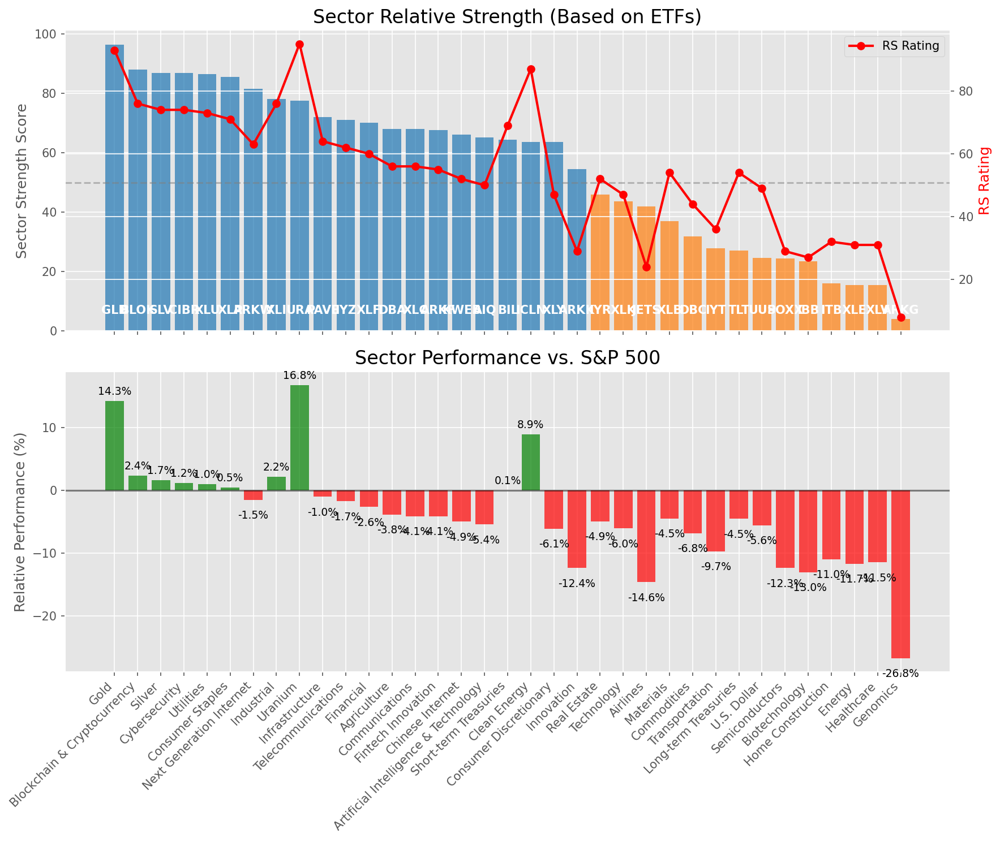

# **Daily Relative Strength Report**

**Date:** 2025-05-23

## **Market Valuation (Buffett Indicator)**

| Metric | Value |
|--------|-------|
| **Market Valuation** | **Fair Valued** |
| **Current Ratio** | 9.49 |
| **Historical Mean** | 9.38 |
| **Standard Deviation** | 0.49 |
| **Z-Score (StdDev from Mean)** | 0.38 |
| **Total Market Cap** | $284.39 trillion |
| **GDP** | $29.98 trillion |

## **Market Insights**

### **Market is Fairly Valued**

The market appears to be trading within a reasonable range of historical valuations. This suggests a balanced approach to equity investing is appropriate. Investors should:

- Focus on individual stock selection based on fundamentals and technicals
- Maintain normal equity allocations aligned with long-term goals
- Pay attention to sector rotation and relative strength
- Watch for changes in market leadership

Fair valuation typically suggests normal market returns can be expected, with stock selection becoming increasingly important.

### **Buffett Indicator Overview**

The Buffett Indicator (Total Market Cap / GDP) is a measure of the stock market's valuation relative to the size of the economy. It is named after Warren Buffett, who described it as "probably the best single measure of where valuations stand at any given moment."

- **Values above +2 standard deviations:** Market significantly overvalued
- **Values above +1 standard deviation:** Market overvalued
- **Values between -1 and +1 standard deviations:** Market fairly valued
- **Values below -1 standard deviation:** Market undervalued
- **Values below -2 standard deviations:** Market significantly undervalued

---

## **Sector Relative Strength**

Based on William O'Neil's Relative Strength Methodology

| ETF | Strength | RS Rating | Performance | Above Key MAs | Trend | Sector |
|-----|----------|-----------|-------------|--------------|-------|--------|
| [GLD](https://www.tradingview.com/chart/?symbol=GLD) | 96.0 | 92.0 | 15.31% | 10d ✓, 50d ✓, 200d ✓ | ↗️ | Gold |
| [ARKW](https://www.tradingview.com/chart/?symbol=ARKW) | 90.0 | 80.0 | 5.54% | 10d ✓, 50d ✓, 200d ✓ | ↗️ | Next Generation Internet |
| [SLV](https://www.tradingview.com/chart/?symbol=SLV) | 89.5 | 79.0 | 5.15% | 10d ✓, 50d ✓, 200d ✓ | ↗️ | Silver |
| [BLOK](https://www.tradingview.com/chart/?symbol=BLOK) | 84.5 | 69.0 | 1.08% | 10d ✓, 50d ✓, 200d ✓ | ↗️ | Blockchain & Cryptocurrency |
| [ARKF](https://www.tradingview.com/chart/?symbol=ARKF) | 81.1 | 82.0 | 6.79% | 10d ✗, 50d ✓, 200d ✓ | ↗️ | Fintech Innovation |
| [CIBR](https://www.tradingview.com/chart/?symbol=CIBR) | 81.1 | 82.0 | 6.80% | 10d ✗, 50d ✓, 200d ✓ | ↗️ | Cybersecurity |
| [XLI](https://www.tradingview.com/chart/?symbol=XLI) | 78.6 | 77.0 | 4.17% | 10d ✗, 50d ✓, 200d ✓ | ↗️ | Industrial |
| [URA](https://www.tradingview.com/chart/?symbol=URA) | 78.0 | 96.0 | 23.73% | 10d ✓, 50d ✓, 200d ✓ | ↘️ | Uranium |
| [PAVE](https://www.tradingview.com/chart/?symbol=PAVE) | 77.1 | 74.0 | 2.74% | 10d ✗, 50d ✓, 200d ✓ | ↗️ | Infrastructure |
| [XLP](https://www.tradingview.com/chart/?symbol=XLP) | 76.5 | 53.0 | -2.75% | 10d ✓, 50d ✓, 200d ✓ | ↗️ | Consumer Staples |
| [XLU](https://www.tradingview.com/chart/?symbol=XLU) | 74.6 | 69.0 | 1.10% | 10d ✗, 50d ✓, 200d ✓ | ↗️ | Utilities |
| [DBA](https://www.tradingview.com/chart/?symbol=DBA) | 73.6 | 67.0 | 0.44% | 10d ✗, 50d ✓, 200d ✓ | ↗️ | Agriculture |
| [AIQ](https://www.tradingview.com/chart/?symbol=AIQ) | 73.6 | 67.0 | 0.25% | 10d ✗, 50d ✓, 200d ✓ | ↗️ | Artificial Intelligence & Technology |
| [IYZ](https://www.tradingview.com/chart/?symbol=IYZ) | 71.6 | 63.0 | -0.57% | 10d ✗, 50d ✓, 200d ✓ | ↗️ | Telecommunications |
| [ARKK](https://www.tradingview.com/chart/?symbol=ARKK) | 71.1 | 62.0 | -0.73% | 10d ✗, 50d ✓, 200d ✓ | ↗️ | Innovation |
| [XLC](https://www.tradingview.com/chart/?symbol=XLC) | 69.6 | 59.0 | -1.56% | 10d ✗, 50d ✓, 200d ✓ | ↗️ | Communications |
| [XLF](https://www.tradingview.com/chart/?symbol=XLF) | 68.6 | 57.0 | -1.90% | 10d ✗, 50d ✓, 200d ✓ | ↗️ | Financial |
| [KWEB](https://www.tradingview.com/chart/?symbol=KWEB) | 68.1 | 56.0 | -2.11% | 10d ✗, 50d ✓, 200d ✓ | ↗️ | Chinese Internet |
| [XLY](https://www.tradingview.com/chart/?symbol=XLY) | 66.6 | 53.0 | -2.81% | 10d ✗, 50d ✓, 200d ✓ | ↗️ | Consumer Discretionary |
| [ICLN](https://www.tradingview.com/chart/?symbol=ICLN) | 62.6 | 85.0 | 8.64% | 10d ✗, 50d ✓, 200d ✓ | ↘️ | Clean Energy |
| [BIL](https://www.tradingview.com/chart/?symbol=BIL) | 62.5 | 65.0 | 0.02% | 10d ✓, 50d ✓, 200d ✓ | ↘️ | Short-term Treasuries |
| [XLK](https://www.tradingview.com/chart/?symbol=XLK) | 51.1 | 62.0 | -0.82% | 10d ✗, 50d ✓, 200d ✓ | ↘️ | Technology |
| [JETS](https://www.tradingview.com/chart/?symbol=JETS) | 42.4 | 25.0 | -11.73% | 10d ✗, 50d ✓, 200d ✗ | ↗️ | Airlines |
| [IYR](https://www.tradingview.com/chart/?symbol=IYR) | 40.5 | 41.0 | -6.09% | 10d ✗, 50d ✗, 200d ✗ | ↗️ | Real Estate |
| [XLB](https://www.tradingview.com/chart/?symbol=XLB) | 34.9 | 50.0 | -3.71% | 10d ✗, 50d ✓, 200d ✗ | ↘️ | Materials |
| [DBC](https://www.tradingview.com/chart/?symbol=DBC) | 33.9 | 48.0 | -4.30% | 10d ✓, 50d ✗, 200d ✗ | ↘️ | Commodities |
| [IYT](https://www.tradingview.com/chart/?symbol=IYT) | 31.4 | 43.0 | -5.67% | 10d ✗, 50d ✓, 200d ✗ | ↘️ | Transportation |
| [SOXX](https://www.tradingview.com/chart/?symbol=SOXX) | 30.4 | 41.0 | -6.05% | 10d ✗, 50d ✓, 200d ✗ | ↘️ | Semiconductors |
| [UUP](https://www.tradingview.com/chart/?symbol=UUP) | 21.5 | 43.0 | -5.54% | 10d ✗, 50d ✗, 200d ✗ | ↘️ | U.S. Dollar |
| [TLT](https://www.tradingview.com/chart/?symbol=TLT) | 18.0 | 36.0 | -7.38% | 10d ✗, 50d ✗, 200d ✗ | ↘️ | Long-term Treasuries |
| [XLE](https://www.tradingview.com/chart/?symbol=XLE) | 15.5 | 31.0 | -9.21% | 10d ✗, 50d ✗, 200d ✗ | ↘️ | Energy |
| [ITB](https://www.tradingview.com/chart/?symbol=ITB) | 13.0 | 26.0 | -11.45% | 10d ✗, 50d ✗, 200d ✗ | ↘️ | Home Construction |
| [XLV](https://www.tradingview.com/chart/?symbol=XLV) | 11.5 | 23.0 | -12.92% | 10d ✗, 50d ✗, 200d ✗ | ↘️ | Healthcare |
| [IBB](https://www.tradingview.com/chart/?symbol=IBB) | 11.5 | 23.0 | -12.61% | 10d ✗, 50d ✗, 200d ✗ | ↘️ | Biotechnology |
| [ARKG](https://www.tradingview.com/chart/?symbol=ARKG) | 7.0 | 14.0 | -17.70% | 10d ✗, 50d ✗, 200d ✗ | ↘️ | Genomics |

### **Sector ETF Performance Interpretation**

This table shows the relative strength metrics for different market sectors based on their representative ETFs:

- **ETF**: The ETF used to measure sector performance (click for chart)
- **Strength**: Overall sector strength score (0-100) combining multiple factors
- **RS Rating**: O'Neil RS rating of the sector ETF
- **Performance**: Performance of the sector ETF relative to SPY
- **Above Key MAs**: Whether the ETF is trading above its 10, 50, and 200-day moving averages
- **Trend**: Whether the sector is in an uptrend (↗️) or downtrend (↘️)

### **Current Sector Leadership**

The current market leadership is coming from the following sectors: **Gold, Next Generation Internet, Silver**.

The **Gold** sector (represented by **GLD**) is showing particularly strong relative strength with an RS rating of 92.0 and performance of 15.31% vs. the S&P 500. This sector is trading above its 10-day, 50-day, 200-day moving average(s). Investors should consider focusing on high RS stocks within these leading sectors for potential outperformance.

---

## **Buy Recommendations**

The following 74 stocks show exceptional relative strength:

| RS Rating | Buy Score | Current Price | Chart | Name | Ticker |
|-----------|-----------|---------------|-------|------|--------|
| 100 | 100 | $104.80 | [Chart](https://www.tradingview.com/chart/?symbol=SEZL) | Sezzle Inc. Common Stock | SEZL |
| 100 | 100 | $198.10 | [Chart](https://www.tradingview.com/chart/?symbol=DAVE) | Dave Inc. Class A Common Stock | DAVE |
| 100 | 100 | $92.20 | [Chart](https://www.tradingview.com/chart/?symbol=RBRK) | Rubrik, Inc. | RBRK |
| 100 | 100 | $36.32 | [Chart](https://www.tradingview.com/chart/?symbol=KTOS) | Kratos Defense & Security Solutions, Inc. | KTOS |
| 100 | 100 | $23.16 | [Chart](https://www.tradingview.com/chart/?symbol=PRA) | ProAssurance Corporation | PRA |
| 100 | 100 | $463.12 | [Chart](https://www.tradingview.com/chart/?symbol=GEV) | GE Vernova Inc. | GEV |
| 99 | 100 | $41.57 | [Chart](https://www.tradingview.com/chart/?symbol=DRS) | Leonardo DRS, Inc. Common Stock | DRS |
| 99 | 100 | $62.77 | [Chart](https://www.tradingview.com/chart/?symbol=HOOD) | Robinhood Markets, Inc. Class A Common Stock | HOOD |
| 99 | 100 | $303.71 | [Chart](https://www.tradingview.com/chart/?symbol=CVNA) | Carvana Co. | CVNA |
| 99 | 100 | $82.55 | [Chart](https://www.tradingview.com/chart/?symbol=RBLX) | Roblox Corporation | RBLX |
| 98 | 100 | $71.56 | [Chart](https://www.tradingview.com/chart/?symbol=ULS) | UL Solutions Inc. | ULS |
| 98 | 100 | $164.84 | [Chart](https://www.tradingview.com/chart/?symbol=SE) | Sea Limited American Depositary Shares, each representing one Class A Ordinary Share | SE |
| 98 | 100 | $23.98 | [Chart](https://www.tradingview.com/chart/?symbol=GRND) | Grindr Inc. | GRND |
| 98 | 100 | $55.11 | [Chart](https://www.tradingview.com/chart/?symbol=SHLD) | Global X Defense Tech ETF | SHLD |
| 97 | 100 | $21.65 | [Chart](https://www.tradingview.com/chart/?symbol=TFPM) | Triple Flag Precious Metals Corp. | TFPM |
| 97 | 100 | $160.82 | [Chart](https://www.tradingview.com/chart/?symbol=PLMR) | Palomar Holdings, Inc. Common stock | PLMR |
| 97 | 100 | $34.98 | [Chart](https://www.tradingview.com/chart/?symbol=UTI) | Universal Technical Institute, Inc. | UTI |
| 97 | 100 | $164.85 | [Chart](https://www.tradingview.com/chart/?symbol=HWM) | Howmet Aerospace Inc. | HWM |
| 97 | 100 | $144.43 | [Chart](https://www.tradingview.com/chart/?symbol=UGL) | ProShares Ultra Gold | UGL |
| 97 | 100 | $26.37 | [Chart](https://www.tradingview.com/chart/?symbol=UVE) | UNIVERSAL INSURANCE HLDG, INC. | UVE |
| 97 | 100 | $86.58 | [Chart](https://www.tradingview.com/chart/?symbol=WPM) | Wheaton Precious Metals Corp. Common Stock | WPM |
| 97 | 100 | $37.03 | [Chart](https://www.tradingview.com/chart/?symbol=AS) | Amer Sports, Inc. | AS |
| 96 | 100 | $28.89 | [Chart](https://www.tradingview.com/chart/?symbol=FMS) | Fresenius Medical Care AG | FMS |
| 96 | 100 | $61.66 | [Chart](https://www.tradingview.com/chart/?symbol=IBIT) | iShares Bitcoin Trust ETF | IBIT |
| 96 | 100 | $30.68 | [Chart](https://www.tradingview.com/chart/?symbol=HODL) | VanEck Bitcoin ETF | HODL |
| 96 | 100 | $18.86 | [Chart](https://www.tradingview.com/chart/?symbol=MIR) | Mirion Technologies, Inc. | MIR |
| 96 | 100 | $48.05 | [Chart](https://www.tradingview.com/chart/?symbol=BTC) | Grayscale Bitcoin Mini Trust ETF | BTC |
| 95 | 100 | $1186.90 | [Chart](https://www.tradingview.com/chart/?symbol=NFLX) | NetFlix Inc | NFLX |
| 95 | 100 | $117.57 | [Chart](https://www.tradingview.com/chart/?symbol=AEM) | Agnico Eagle Mines Ltd. | AEM |
| 94 | 100 | $152.39 | [Chart](https://www.tradingview.com/chart/?symbol=CAH) | Cardinal Health, Inc. | CAH |
| 94 | 100 | $74.49 | [Chart](https://www.tradingview.com/chart/?symbol=VRNA) | Verona Pharma plc | VRNA |
| 94 | 100 | $180.59 | [Chart](https://www.tradingview.com/chart/?symbol=RGLD) | Royal Gold Inc | RGLD |
| 93 | 100 | $280.83 | [Chart](https://www.tradingview.com/chart/?symbol=VRSN) | VeriSign Inc | VRSN |
| 93 | 100 | $23.98 | [Chart](https://www.tradingview.com/chart/?symbol=SRAD) | Sportradar Group AG Class A Ordinary Shares | SRAD |
| 93 | 100 | $45.09 | [Chart](https://www.tradingview.com/chart/?symbol=BTI) | British American Tobacco p.l.c. American Depositary Shares, American Depositary Shares, each representing one Ordinary Share | BTI |
| 92 | 100 | $128.51 | [Chart](https://www.tradingview.com/chart/?symbol=COOP) | Mr. Cooper Group Inc. Common Stock | COOP |
| 92 | 100 | $231.96 | [Chart](https://www.tradingview.com/chart/?symbol=GE) | GE Aerospace | GE |
| 92 | 100 | $63.37 | [Chart](https://www.tradingview.com/chart/?symbol=IAU) | iShares Gold Trust | IAU |
| 92 | 100 | $32.06 | [Chart](https://www.tradingview.com/chart/?symbol=SGOL) | abrdn Physical Gold Shares ETF | SGOL |
| 92 | 100 | $309.75 | [Chart](https://www.tradingview.com/chart/?symbol=GLD) | SPDR Gold Trust, SPDR Gold Shares | GLD |
| 92 | 100 | $33.20 | [Chart](https://www.tradingview.com/chart/?symbol=AAAU) | Goldman Sachs Physical Gold ETF Shares | AAAU |
| 92 | 100 | $66.56 | [Chart](https://www.tradingview.com/chart/?symbol=GLDM) | SPDR Gold MiniShares | GLDM |
| 92 | 100 | $72.89 | [Chart](https://www.tradingview.com/chart/?symbol=WRB) | W.R. Berkley Corporation | WRB |
| 92 | 100 | $33.52 | [Chart](https://www.tradingview.com/chart/?symbol=IAUM) | iShares Gold Trust Micro | IAUM |
| 91 | 100 | $229.78 | [Chart](https://www.tradingview.com/chart/?symbol=CRS) | Carpenter Technology Corp | CRS |
| 91 | 100 | $32.39 | [Chart](https://www.tradingview.com/chart/?symbol=OUNZ) | VanEck Merk Gold ETF | OUNZ |
| 91 | 100 | $63.55 | [Chart](https://www.tradingview.com/chart/?symbol=SLF) | Sun Life Financial Inc. | SLF |
| 91 | 100 | $17.64 | [Chart](https://www.tradingview.com/chart/?symbol=BCS) | Barclays PLC | BCS |
| 91 | 100 | $31.23 | [Chart](https://www.tradingview.com/chart/?symbol=TGS) | Transportadora de Gas del Sur S.A. ADS | TGS |
| 90 | 100 | $25.71 | [Chart](https://www.tradingview.com/chart/?symbol=PHYS) | Sprott Physical Gold Trust | PHYS |
| 90 | 100 | $170.37 | [Chart](https://www.tradingview.com/chart/?symbol=ITA) | iShares U.S. Aerospace & Defense ETF | ITA |
| 90 | 100 | $283.93 | [Chart](https://www.tradingview.com/chart/?symbol=CME) | CME Group Inc. | CME |
| 90 | 100 | $33.82 | [Chart](https://www.tradingview.com/chart/?symbol=FDP) | Fresh Del Monte Produce Inc. | FDP |
| 90 | 100 | $46.91 | [Chart](https://www.tradingview.com/chart/?symbol=EWI) | iShares MSCI Italy ETF | EWI |
| 89 | 100 | $177.54 | [Chart](https://www.tradingview.com/chart/?symbol=PM) | Philip Morris International Inc. | PM |
| 89 | 100 | $41.22 | [Chart](https://www.tradingview.com/chart/?symbol=EWG) | iShares MSCI Germany ETF | EWG |
| 88 | 100 | $29.60 | [Chart](https://www.tradingview.com/chart/?symbol=CEF) | Sprott Physical Gold and Silver Trust | CEF |
| 88 | 100 | $651.18 | [Chart](https://www.tradingview.com/chart/?symbol=SPOT) | Spotify Technology S.A. | SPOT |
| 88 | 100 | $46.91 | [Chart](https://www.tradingview.com/chart/?symbol=MRCY) | Mercury Systems Inc. | MRCY |
| 90 | 99 | $62.01 | [Chart](https://www.tradingview.com/chart/?symbol=RYTM) | Rhythm Pharmaceuticals, Inc. Common Stock | RYTM |
| 89 | 99 | $49.94 | [Chart](https://www.tradingview.com/chart/?symbol=TRP) | TC Energy Corporation | TRP |
| 89 | 99 | $119.53 | [Chart](https://www.tradingview.com/chart/?symbol=CLS) | Celestica, Inc. | CLS |
| 88 | 99 | $55.40 | [Chart](https://www.tradingview.com/chart/?symbol=RELX) | RELX PLC | RELX |
| 88 | 99 | $204.42 | [Chart](https://www.tradingview.com/chart/?symbol=BAP) | Credicorp LTD | BAP |
| 87 | 99 | $115.85 | [Chart](https://www.tradingview.com/chart/?symbol=BJ) | BJs Wholesale Club Holdings, Inc. Common Stock | BJ |
| 87 | 98 | $32.51 | [Chart](https://www.tradingview.com/chart/?symbol=ATAT) | Atour Lifestyle Holdings Limited American Depositary Shares | ATAT |
| 86 | 97 | $58.36 | [Chart](https://www.tradingview.com/chart/?symbol=IGF) | iShares Global Infrastructure ETF | IGF |
| 84 | 97 | $252.28 | [Chart](https://www.tradingview.com/chart/?symbol=RSG) | Republic Services Inc. | RSG |
| 86 | 96 | $58.60 | [Chart](https://www.tradingview.com/chart/?symbol=UVV) | Universal Corporation | UVV |
| 83 | 96 | $205.11 | [Chart](https://www.tradingview.com/chart/?symbol=DASH) | DoorDash, Inc. Class A Common Stock | DASH |
| 85 | 95 | $62.48 | [Chart](https://www.tradingview.com/chart/?symbol=GGAL) | Grupo Financiero Galicia SA | GGAL |
| 84 | 95 | $102.98 | [Chart](https://www.tradingview.com/chart/?symbol=DTM) | DT Midstream, Inc. | DTM |
| 82 | 94 | $43.04 | [Chart](https://www.tradingview.com/chart/?symbol=HMN) | Horace Mann Educators Corporation | HMN |
| 81 | 91 | $5341.91 | [Chart](https://www.tradingview.com/chart/?symbol=BKNG) | Booking Holdings Inc. Common Stock | BKNG |

---

## **Sell Recommendations**

The following 172 stocks show deteriorating relative strength:

| RS Rating | Sell Score | Current Price | Chart | Name | Ticker |
|-----------|------------|---------------|-------|------|--------|
| 1 | 100 | $12.17 | [Chart](https://www.tradingview.com/chart/?symbol=IART) | Integra LifeSciences Holdings | IART |
| 1 | 100 | $16.86 | [Chart](https://www.tradingview.com/chart/?symbol=BEAM) | Beam Therapeutics Inc. Common Stock | BEAM |
| 2 | 100 | $49.26 | [Chart](https://www.tradingview.com/chart/?symbol=LABU) | Direxion Daily S&P Biotech Bull 3X Shares | LABU |
| 2 | 100 | $16.67 | [Chart](https://www.tradingview.com/chart/?symbol=FWRD) | Forward Air Corp | FWRD |
| 2 | 100 | $13.28 | [Chart](https://www.tradingview.com/chart/?symbol=DV) | DoubleVerify Holdings, Inc. | DV |
| 3 | 100 | $30.21 | [Chart](https://www.tradingview.com/chart/?symbol=CYTK) | Cytokinetics Inc. | CYTK |
| 3 | 100 | $12.40 | [Chart](https://www.tradingview.com/chart/?symbol=AESI) | Atlas Energy Solutions Inc. | AESI |
| 3 | 100 | $10.22 | [Chart](https://www.tradingview.com/chart/?symbol=HPK) | HighPeak Energy, Inc. Common Stock | HPK |
| 3 | 100 | $125.29 | [Chart](https://www.tradingview.com/chart/?symbol=KRYS) | Krystal Biotech, Inc. Common Stock | KRYS |
| 4 | 100 | $10.92 | [Chart](https://www.tradingview.com/chart/?symbol=CLB) | Core Laboratories Inc. | CLB |
| 4 | 100 | $27.82 | [Chart](https://www.tradingview.com/chart/?symbol=TWST) | Twist Bioscience Corporation Common Stock | TWST |
| 4 | 100 | $13.52 | [Chart](https://www.tradingview.com/chart/?symbol=DNLI) | Denali Therapeutics Inc. Common Stock | DNLI |
| 4 | 100 | $13.90 | [Chart](https://www.tradingview.com/chart/?symbol=DQ) | Daqo New Energy Corp. American Depositary Shares (each representing 5 Ordinary Shares) | DQ |
| 4 | 100 | $22.95 | [Chart](https://www.tradingview.com/chart/?symbol=SM) | SM Energy Company | SM |
| 4 | 100 | $120.59 | [Chart](https://www.tradingview.com/chart/?symbol=TFX) | Teleflex Incorporated | TFX |
| 5 | 100 | $62.05 | [Chart](https://www.tradingview.com/chart/?symbol=ARCB) | ArcBest Corporation | ARCB |
| 5 | 100 | $16.89 | [Chart](https://www.tradingview.com/chart/?symbol=VRNT) | Verint Systems Inc | VRNT |
| 5 | 100 | $57.41 | [Chart](https://www.tradingview.com/chart/?symbol=SPB) | Spectrum Brands Holdings, Inc. | SPB |
| 5 | 100 | $11.32 | [Chart](https://www.tradingview.com/chart/?symbol=WEN) | The Wendy's Company | WEN |
| 5 | 100 | $40.93 | [Chart](https://www.tradingview.com/chart/?symbol=WHD) | Cactus, Inc. | WHD |
| 5 | 100 | $19.49 | [Chart](https://www.tradingview.com/chart/?symbol=VERA) | Vera Therapeutics, Inc. Class A Common Stock | VERA |
| 6 | 100 | $29.16 | [Chart](https://www.tradingview.com/chart/?symbol=SRDX) | Surmodics, Inc. Common Stock | SRDX |
| 6 | 100 | $14.27 | [Chart](https://www.tradingview.com/chart/?symbol=IMVT) | Immunovant, Inc. Common Stock | IMVT |
| 7 | 100 | $14.10 | [Chart](https://www.tradingview.com/chart/?symbol=INMD) | InMode Ltd. Ordinary Shares | INMD |
| 7 | 100 | $15.04 | [Chart](https://www.tradingview.com/chart/?symbol=PENN) | PENN Entertainment, Inc. Common Stock | PENN |
| 7 | 100 | $22.93 | [Chart](https://www.tradingview.com/chart/?symbol=RPD) | Rapid7, Inc. Common Stock | RPD |
| 7 | 100 | $31.66 | [Chart](https://www.tradingview.com/chart/?symbol=MBIN) | Merchants Bancorp Common Stock | MBIN |
| 7 | 100 | $11.97 | [Chart](https://www.tradingview.com/chart/?symbol=ARCT) | Arcturus Therapeutics Holdings Inc. Common Stock | ARCT |
| 7 | 100 | $19.82 | [Chart](https://www.tradingview.com/chart/?symbol=AMRK) | A-Mark Precious Metals, Inc. | AMRK |
| 8 | 100 | $10.12 | [Chart](https://www.tradingview.com/chart/?symbol=PK) | Park Hotels & Resorts Inc. Common Stock | PK |
| 8 | 100 | $16.75 | [Chart](https://www.tradingview.com/chart/?symbol=COLD) | Americold Realty Trust, Inc. | COLD |
| 8 | 100 | $53.33 | [Chart](https://www.tradingview.com/chart/?symbol=ASGN) | ASGN Incorporated | ASGN |
| 8 | 100 | $45.05 | [Chart](https://www.tradingview.com/chart/?symbol=RHI) | Robert Half Inc. | RHI |
| 9 | 100 | $33.62 | [Chart](https://www.tradingview.com/chart/?symbol=WGO) | Winnebago Industries, Inc. | WGO |
| 9 | 100 | $19.29 | [Chart](https://www.tradingview.com/chart/?symbol=NVDS) | Investment Managers Series Trust II Tradr 1.5X Short NVDA Daily ETF | NVDS |
| 11 | 100 | $196.00 | [Chart](https://www.tradingview.com/chart/?symbol=AAPL) | Apple Inc. | AAPL |
| 11 | 100 | $40.90 | [Chart](https://www.tradingview.com/chart/?symbol=ASO) | Academy Sports and Outdoors, Inc. | ASO |
| 11 | 100 | $14.87 | [Chart](https://www.tradingview.com/chart/?symbol=DXC) | DXC Technology Company | DXC |
| 12 | 100 | $57.38 | [Chart](https://www.tradingview.com/chart/?symbol=BMRN) | BioMarin Pharmaceuticals Inc | BMRN |
| 12 | 100 | $51.00 | [Chart](https://www.tradingview.com/chart/?symbol=KBH) | KB Home | KBH |
| 12 | 100 | $45.03 | [Chart](https://www.tradingview.com/chart/?symbol=LINE) | Lineage, Inc. Common Stock | LINE |
| 13 | 100 | $19.04 | [Chart](https://www.tradingview.com/chart/?symbol=VECO) | Veeco Instruments Inc | VECO |
| 14 | 100 | $89.31 | [Chart](https://www.tradingview.com/chart/?symbol=CHRD) | Chord Energy Corporation Common Stock | CHRD |
| 3 | 99 | $10.36 | [Chart](https://www.tradingview.com/chart/?symbol=LSPD) | Lightspeed Commerce Inc. | LSPD |
| 7 | 99 | $76.58 | [Chart](https://www.tradingview.com/chart/?symbol=WHR) | Whirlpool Corp. | WHR |
| 12 | 99 | $21.04 | [Chart](https://www.tradingview.com/chart/?symbol=AMN) | AMN Healthcare Services | AMN |
| 16 | 99 | $10.34 | [Chart](https://www.tradingview.com/chart/?symbol=CMRE) | Costamare Inc. | CMRE |
| 17 | 99 | $63.82 | [Chart](https://www.tradingview.com/chart/?symbol=MTH) | Meritage Homes Corporation | MTH |
| 3 | 98 | $262.16 | [Chart](https://www.tradingview.com/chart/?symbol=SAIA) | Saia, Inc. | SAIA |
| 5 | 98 | $10.31 | [Chart](https://www.tradingview.com/chart/?symbol=VREX) | Varex Imaging Corporation Common Stock | VREX |
| 7 | 98 | $57.18 | [Chart](https://www.tradingview.com/chart/?symbol=AMWD) | American Woodmark Corp | AMWD |
| 10 | 98 | $25.81 | [Chart](https://www.tradingview.com/chart/?symbol=WERN) | Werner Enterprises Inc | WERN |
| 16 | 98 | $15.62 | [Chart](https://www.tradingview.com/chart/?symbol=AMZY) | YieldMax AMZN Option Income Strategy ETF | AMZY |
| 8 | 97 | $24.15 | [Chart](https://www.tradingview.com/chart/?symbol=AMPH) | Amphastar Pharmaceuticals, Inc. | AMPH |
| 11 | 97 | $12.02 | [Chart](https://www.tradingview.com/chart/?symbol=NOV) | NOV Inc. | NOV |
| 12 | 97 | $214.46 | [Chart](https://www.tradingview.com/chart/?symbol=OIH) | VanEck Oil Services ETF | OIH |
| 16 | 97 | $29.98 | [Chart](https://www.tradingview.com/chart/?symbol=BAX) | Baxter International Inc. | BAX |
| 16 | 97 | $10.96 | [Chart](https://www.tradingview.com/chart/?symbol=GSBD) | Goldman Sachs BDC, Inc. | GSBD |
| 5 | 96 | $74.22 | [Chart](https://www.tradingview.com/chart/?symbol=GPN) | Global Payments, Inc. | GPN |
| 6 | 96 | $117.89 | [Chart](https://www.tradingview.com/chart/?symbol=RGEN) | Repligen Corp | RGEN |
| 10 | 96 | $21.39 | [Chart](https://www.tradingview.com/chart/?symbol=SPT) | Sprout Social, Inc Class A Common Stock | SPT |
| 10 | 96 | $11.38 | [Chart](https://www.tradingview.com/chart/?symbol=APLE) | Apple Hospitality REIT, Inc. | APLE |
| 12 | 96 | $21.06 | [Chart](https://www.tradingview.com/chart/?symbol=UCO) | ProShares Ultra Bloomberg Crude Oil | UCO |
| 12 | 96 | $109.37 | [Chart](https://www.tradingview.com/chart/?symbol=NUE) | Nucor Corporation | NUE |
| 12 | 96 | $80.02 | [Chart](https://www.tradingview.com/chart/?symbol=EMN) | Eastman Chemical Company | EMN |
| 12 | 96 | $21.27 | [Chart](https://www.tradingview.com/chart/?symbol=ESI) | Element Solutions Inc. | ESI |
| 13 | 96 | $11.73 | [Chart](https://www.tradingview.com/chart/?symbol=PBR) | PETROLEO BRASILEIRO S.A.-PETROBRAS ADS (REP 1 COMMON SHARE) | PBR |
| 6 | 95 | $10.48 | [Chart](https://www.tradingview.com/chart/?symbol=SONO) | Sonos, Inc. Common Stock | SONO |
| 11 | 95 | $33.23 | [Chart](https://www.tradingview.com/chart/?symbol=CPB) | The Campbell's Company Common Stock | CPB |
| 14 | 95 | $43.05 | [Chart](https://www.tradingview.com/chart/?symbol=MTDR) | MATADOR RESOURCES COMPANY | MTDR |
| 21 | 95 | $12.35 | [Chart](https://www.tradingview.com/chart/?symbol=ZUMZ) | Zumiez Inc. | ZUMZ |
| 12 | 94 | $11.20 | [Chart](https://www.tradingview.com/chart/?symbol=TWO) | Two Harbors Investment Corp. | TWO |
| 13 | 94 | $33.41 | [Chart](https://www.tradingview.com/chart/?symbol=SLB) | Schlumberger Limited | SLB |
| 14 | 94 | $36.48 | [Chart](https://www.tradingview.com/chart/?symbol=CRSP) | CRISPR Therapeutics AG | CRSP |
| 18 | 94 | $14.27 | [Chart](https://www.tradingview.com/chart/?symbol=HR) | Healthcare Realty Trust Incorporated | HR |
| 26 | 94 | $14.52 | [Chart](https://www.tradingview.com/chart/?symbol=FXN) | First Trust Energy AlphaDEX Fund | FXN |
| 27 | 94 | $10.96 | [Chart](https://www.tradingview.com/chart/?symbol=GES) | Guess?, Inc. | GES |
| 8 | 93 | $68.61 | [Chart](https://www.tradingview.com/chart/?symbol=GEHC) | GE HealthCare Technologies Inc. Common Stock | GEHC |
| 10 | 93 | $145.95 | [Chart](https://www.tradingview.com/chart/?symbol=INSP) | Inspire Medical Systems, Inc. | INSP |
| 11 | 93 | $107.55 | [Chart](https://www.tradingview.com/chart/?symbol=A) | Agilent Technologies Inc. | A |
| 14 | 93 | $10.08 | [Chart](https://www.tradingview.com/chart/?symbol=HOPE) | Hope Bancorp, Inc. | HOPE |
| 16 | 93 | $22.68 | [Chart](https://www.tradingview.com/chart/?symbol=GPK) | Graphic Packaging Holding Company | GPK |
| 17 | 93 | $11.01 | [Chart](https://www.tradingview.com/chart/?symbol=PBR.A) | Petroleo Brasileiro S.A.-Petrobras | PBR.A |
| 18 | 93 | $103.46 | [Chart](https://www.tradingview.com/chart/?symbol=PLD) | PROLOGIS, INC. | PLD |
| 18 | 92 | $100.53 | [Chart](https://www.tradingview.com/chart/?symbol=MHK) | Mohawk Industries, Inc. | MHK |
| 22 | 92 | $10.05 | [Chart](https://www.tradingview.com/chart/?symbol=LBTYK) | Liberty Global Ltd. Class C Common Shares | LBTYK |
| 26 | 92 | $27.75 | [Chart](https://www.tradingview.com/chart/?symbol=TX) | Ternium S.A. American Depositary Shares | TX |
| 11 | 91 | $24.98 | [Chart](https://www.tradingview.com/chart/?symbol=IRDM) | Iridium Communications Inc. | IRDM |
| 13 | 91 | $50.85 | [Chart](https://www.tradingview.com/chart/?symbol=HXL) | Hexcel Corporation | HXL |
| 14 | 91 | $20.69 | [Chart](https://www.tradingview.com/chart/?symbol=ARKG) | ARK Genomic Revolution ETF | ARKG |
| 15 | 91 | $25.03 | [Chart](https://www.tradingview.com/chart/?symbol=WY) | Weyerhaeuser Company | WY |
| 11 | 90 | $10.72 | [Chart](https://www.tradingview.com/chart/?symbol=VYX) | NCR Voyix Corporation | VYX |
| 13 | 90 | $54.76 | [Chart](https://www.tradingview.com/chart/?symbol=TRNO) | Terreno Realty Corporation | TRNO |
| 15 | 90 | $32.01 | [Chart](https://www.tradingview.com/chart/?symbol=TENB) | Tenable Holdings, Inc. | TENB |
| 16 | 90 | $10.72 | [Chart](https://www.tradingview.com/chart/?symbol=NEWT) | NewtekOne, Inc. Common Stock | NEWT |
| 16 | 90 | $14.52 | [Chart](https://www.tradingview.com/chart/?symbol=SAFE) | Safehold Inc. | SAFE |
| 18 | 90 | $18.79 | [Chart](https://www.tradingview.com/chart/?symbol=OII) | Oceaneering International Inc. | OII |
| 24 | 90 | $17.05 | [Chart](https://www.tradingview.com/chart/?symbol=STR) | Sitio Royalties Corp. | STR |
| 16 | 89 | $45.47 | [Chart](https://www.tradingview.com/chart/?symbol=PRKS) | United Parks & Resorts Inc. | PRKS |
| 25 | 89 | $14.01 | [Chart](https://www.tradingview.com/chart/?symbol=OCSL) | Oaktree Specialty Lending Corporation | OCSL |
| 12 | 88 | $61.52 | [Chart](https://www.tradingview.com/chart/?symbol=MAS) | Masco Corporation | MAS |
| 16 | 88 | $14.37 | [Chart](https://www.tradingview.com/chart/?symbol=IVZ) | Invesco LTD | IVZ |
| 17 | 88 | $104.54 | [Chart](https://www.tradingview.com/chart/?symbol=LEN) | Lennar Corporation Class A | LEN |
| 22 | 88 | $115.01 | [Chart](https://www.tradingview.com/chart/?symbol=SITE) | SiteOne Landscape Supply, Inc. | SITE |
| 25 | 88 | $16.07 | [Chart](https://www.tradingview.com/chart/?symbol=MLNK) | MeridianLink, Inc. | MLNK |
| 15 | 87 | $38.06 | [Chart](https://www.tradingview.com/chart/?symbol=PCH) | PotlatchDeltic Corporation Common Stock | PCH |
| 16 | 87 | $33.04 | [Chart](https://www.tradingview.com/chart/?symbol=SQM) | Sociedad Quimica y Minera de Chile SA | SQM |
| 18 | 87 | $47.84 | [Chart](https://www.tradingview.com/chart/?symbol=FR) | First Industrial Realty Trust, Inc. | FR |
| 20 | 87 | $54.95 | [Chart](https://www.tradingview.com/chart/?symbol=SLG) | SL Green Realty Corp. | SLG |
| 21 | 87 | $37.10 | [Chart](https://www.tradingview.com/chart/?symbol=FITB) | Fifth Third Bancorp | FITB |
| 15 | 86 | $25.38 | [Chart](https://www.tradingview.com/chart/?symbol=TRN) | Trinity Industries, Inc. | TRN |
| 17 | 86 | $29.20 | [Chart](https://www.tradingview.com/chart/?symbol=KYMR) | Kymera Therapeutics, Inc. Common Stock | KYMR |
| 18 | 86 | $87.33 | [Chart](https://www.tradingview.com/chart/?symbol=BCC) | Boise Cascade Company | BCC |
| 21 | 86 | $17.56 | [Chart](https://www.tradingview.com/chart/?symbol=NX) | Quanex Building Products Corporation | NX |
| 22 | 86 | $35.51 | [Chart](https://www.tradingview.com/chart/?symbol=RARE) | Ultragenyx Pharmaceutical Inc. | RARE |
| 22 | 86 | $28.88 | [Chart](https://www.tradingview.com/chart/?symbol=BP) | BP p.l.c. | BP |
| 17 | 85 | $30.82 | [Chart](https://www.tradingview.com/chart/?symbol=AXTA) | Axalta Coating Systems Ltd. | AXTA |
| 19 | 85 | $17.58 | [Chart](https://www.tradingview.com/chart/?symbol=UE) | UBRAN EDGE PROPERTIES | UE |
| 20 | 85 | $12.56 | [Chart](https://www.tradingview.com/chart/?symbol=ERII) | Energy Recovery, Inc. | ERII |
| 21 | 85 | $16.01 | [Chart](https://www.tradingview.com/chart/?symbol=CHCT) | Community Healthcare Trust Incorporated Common Stock, $0.01 par value per share | CHCT |
| 23 | 85 | $10.15 | [Chart](https://www.tradingview.com/chart/?symbol=SCS) | Steelcase, Inc. | SCS |
| 27 | 85 | $36.10 | [Chart](https://www.tradingview.com/chart/?symbol=TECK) | Teck Resources Limited | TECK |
| 32 | 85 | $10.58 | [Chart](https://www.tradingview.com/chart/?symbol=NMFC) | NEW MOUNTAIN FINANCE CORPORATION | NMFC |
| 23 | 84 | $183.75 | [Chart](https://www.tradingview.com/chart/?symbol=DHR) | Danaher Corporation | DHR |
| 24 | 84 | $118.09 | [Chart](https://www.tradingview.com/chart/?symbol=SUI) | Sun Communities, Inc | SUI |
| 25 | 84 | $12.91 | [Chart](https://www.tradingview.com/chart/?symbol=MRTN) | Marten Transport Ltd | MRTN |
| 31 | 84 | $25.87 | [Chart](https://www.tradingview.com/chart/?symbol=RCI) | Rogers Communications, Inc. | RCI |
| 26 | 83 | $15.91 | [Chart](https://www.tradingview.com/chart/?symbol=PD) | PagerDuty, Inc. | PD |
| 23 | 82 | $93.13 | [Chart](https://www.tradingview.com/chart/?symbol=PCAR) | Paccar Inc | PCAR |
| 26 | 82 | $16.76 | [Chart](https://www.tradingview.com/chart/?symbol=TRMD) | TORM plc Class A Common Stock | TRMD |
| 32 | 82 | $170.08 | [Chart](https://www.tradingview.com/chart/?symbol=ALGN) | Align Technology Inc | ALGN |
| 23 | 80 | $12.31 | [Chart](https://www.tradingview.com/chart/?symbol=PMT) | PennyMac Mortgage Investment Trust | PMT |
| 28 | 80 | $15.61 | [Chart](https://www.tradingview.com/chart/?symbol=ELME) | Elme Communities | ELME |
| 29 | 80 | $10.22 | [Chart](https://www.tradingview.com/chart/?symbol=AVO) | Mission Produce, Inc. Common Stock | AVO |
| 31 | 79 | $155.08 | [Chart](https://www.tradingview.com/chart/?symbol=IBP) | INSTALLED BUILDING PRODUCTS, INC. | IBP |
| 25 | 78 | $129.83 | [Chart](https://www.tradingview.com/chart/?symbol=HES) | Hess Corporation | HES |
| 28 | 78 | $61.68 | [Chart](https://www.tradingview.com/chart/?symbol=BLKB) | Blackbaud, Inc. | BLKB |
| 29 | 78 | $144.71 | [Chart](https://www.tradingview.com/chart/?symbol=QCOM) | Qualcomm Inc | QCOM |
| 30 | 78 | $56.06 | [Chart](https://www.tradingview.com/chart/?symbol=CNMD) | CONMED Corporation | CNMD |
| 25 | 77 | $36.59 | [Chart](https://www.tradingview.com/chart/?symbol=NBHC) | NATIONAL BANK HOLDINGS CORP. | NBHC |
| 25 | 77 | $76.07 | [Chart](https://www.tradingview.com/chart/?symbol=CNS) | Cohen & Steers Inc. | CNS |
| 27 | 77 | $25.94 | [Chart](https://www.tradingview.com/chart/?symbol=NATL) | NCR Atleos Corporation | NATL |
| 31 | 77 | $12.12 | [Chart](https://www.tradingview.com/chart/?symbol=WSR) | Whitestone REIT | WSR |
| 33 | 77 | $37.61 | [Chart](https://www.tradingview.com/chart/?symbol=LIT) | Global X Lithium & Battery Tech ETF | LIT |
| 26 | 76 | $14.23 | [Chart](https://www.tradingview.com/chart/?symbol=BMEZ) | BlackRock Health Sciences Term Trust | BMEZ |
| 30 | 76 | $77.10 | [Chart](https://www.tradingview.com/chart/?symbol=PFG) | Principal Financial Group, Inc. | PFG |
| 33 | 76 | $35.41 | [Chart](https://www.tradingview.com/chart/?symbol=SU) | Suncor Energy, Inc. | SU |
| 34 | 75 | $11.79 | [Chart](https://www.tradingview.com/chart/?symbol=NVG) | Nuveen AMT-Free Municipal Credit Income Fund | NVG |
| 29 | 74 | $36.27 | [Chart](https://www.tradingview.com/chart/?symbol=BHE) | Benchmark Electronics | BHE |
| 32 | 73 | $29.67 | [Chart](https://www.tradingview.com/chart/?symbol=TPH) | Tri Pointe Homes, Inc. | TPH |
| 34 | 73 | $13.56 | [Chart](https://www.tradingview.com/chart/?symbol=MANU) | MANCHESTER UNITED PLC | MANU |
| 37 | 73 | $19.43 | [Chart](https://www.tradingview.com/chart/?symbol=MSDL) | Morgan Stanley Direct Lending Fund | MSDL |
| 33 | 72 | $33.38 | [Chart](https://www.tradingview.com/chart/?symbol=ALLY) | Ally Financial Inc. | ALLY |
| 33 | 72 | $31.20 | [Chart](https://www.tradingview.com/chart/?symbol=KRC) | Kilroy Realty Corp. | KRC |
| 35 | 72 | $29.98 | [Chart](https://www.tradingview.com/chart/?symbol=QID) | ProShares UltraShort QQQ | QID |
| 35 | 72 | $11.70 | [Chart](https://www.tradingview.com/chart/?symbol=NZF) | Nuveen Municipal Credit Income Fund | NZF |
| 37 | 72 | $10.60 | [Chart](https://www.tradingview.com/chart/?symbol=CELC) | Celcuity Inc. Common Stock | CELC |
| 31 | 71 | $81.39 | [Chart](https://www.tradingview.com/chart/?symbol=XLE) | Energy Select Sector SPDR Fund | XLE |
| 36 | 71 | $64.62 | [Chart](https://www.tradingview.com/chart/?symbol=BXP) | BXP, Inc. | BXP |
| 38 | 71 | $205.11 | [Chart](https://www.tradingview.com/chart/?symbol=WST) | West Pharmaceutical Services, Inc. | WST |
| 38 | 71 | $280.75 | [Chart](https://www.tradingview.com/chart/?symbol=BLD) | TopBuild Corp. Common Stock | BLD |
| 36 | 70 | $10.86 | [Chart](https://www.tradingview.com/chart/?symbol=SEMR) | SEMrush Holdings, Inc. | SEMR |
| 39 | 70 | $18.52 | [Chart](https://www.tradingview.com/chart/?symbol=PFFD) | Global X U.S. Preferred ETF | PFFD |
| 34 | 69 | $165.99 | [Chart](https://www.tradingview.com/chart/?symbol=EGP) | EastGroup Properties Inc. | EGP |
| 34 | 69 | $97.76 | [Chart](https://www.tradingview.com/chart/?symbol=PHM) | Pultegroup, Inc. | PHM |
| 36 | 69 | $12.66 | [Chart](https://www.tradingview.com/chart/?symbol=PR) | Permian Resources Corporation | PR |
| 37 | 67 | $10.40 | [Chart](https://www.tradingview.com/chart/?symbol=MYI) | BLACKROCK MUNIYIELD QUALITY FUND III, INC. | MYI |
| 39 | 67 | $39.13 | [Chart](https://www.tradingview.com/chart/?symbol=KSA) | iShares MSCI Saudi Arabia ETF | KSA |
| 35 | 66 | $63.22 | [Chart](https://www.tradingview.com/chart/?symbol=ELS) | Equity Lifestyle Properties, Inc. | ELS |
| 35 | 66 | $67.41 | [Chart](https://www.tradingview.com/chart/?symbol=EQR) | Equity Residential | EQR |
| 37 | 64 | $12.06 | [Chart](https://www.tradingview.com/chart/?symbol=RQI) | COHEN & STEERS QUALITY INCOME REALTY FUND, INC. COMMON SHARES | RQI |
| 39 | 64 | $102.48 | [Chart](https://www.tradingview.com/chart/?symbol=XOM) | Exxon Mobil Corporation | XOM |

## **Methodology**

This report uses William O'Neil's relative strength methodology from Investors Business Daily:

* **RS Rating**: Percentile rank of stock's performance vs. S&P 500 over the past 63 trading days (1-99 scale)
* **Buy Criteria**: RS Rating >= 80, price above 50-day MA, strong uptrend, increasing volume
* **Sell Criteria**: RS Rating < 40, price below 50-day MA, downtrend, decreasing volume

### **O'Neil's Key Principles**

1. **Focus on relative performance** - stocks outperforming the market
2. **Price trend confirmation** - stock must be in an uptrend
3. **Volume confirmation** - strong volume supports price moves
4. **Moving average validation** - price above key moving averages
5. **Market leaders only** - concentrate on top-performing stocks

*Report generated automatically after market close*