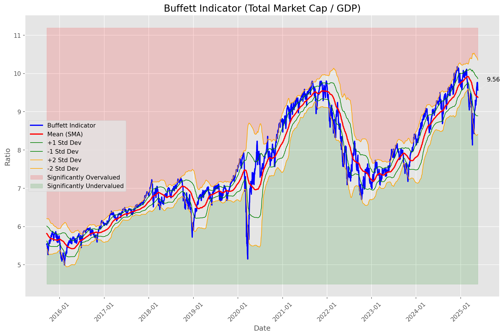
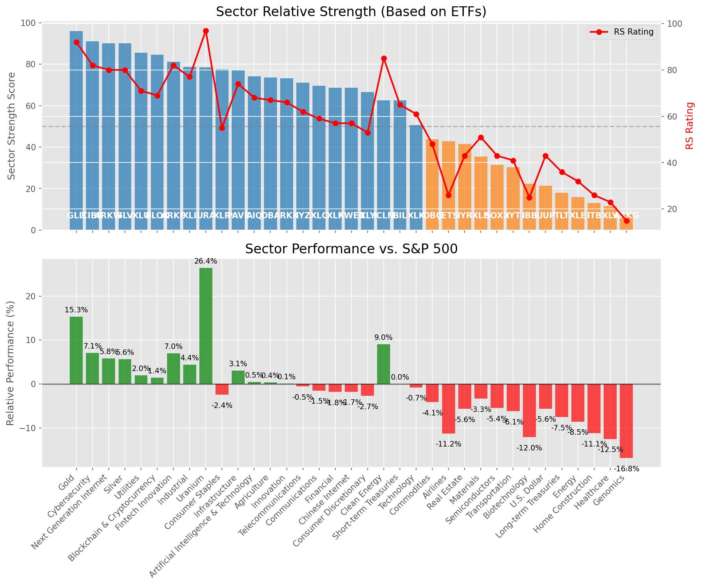

# **Daily Relative Strength Report**

**Date:** 2025-05-25

## **Market Valuation (Buffett Indicator)**

| Metric | Value |
|--------|-------|
| **Market Valuation** | **Fair Valued** |
| **Current Ratio** | 9.51 |
| **Historical Mean** | 9.38 |
| **Standard Deviation** | 0.49 |
| **Z-Score (StdDev from Mean)** | 0.38 |
| **Total Market Cap** | $285.04 trillion |
| **GDP** | $29.98 trillion |

## **Market Insights**

### **Market is Fairly Valued**

The market appears to be trading within a reasonable range of historical valuations. This suggests a balanced approach to equity investing is appropriate. Investors should:

- Focus on individual stock selection based on fundamentals and technicals
- Maintain normal equity allocations aligned with long-term goals
- Pay attention to sector rotation and relative strength
- Watch for changes in market leadership

Fair valuation typically suggests normal market returns can be expected, with stock selection becoming increasingly important.

### **Buffett Indicator Overview**

The Buffett Indicator (Total Market Cap / GDP) is a measure of the stock market's valuation relative to the size of the economy. It is named after Warren Buffett, who described it as "probably the best single measure of where valuations stand at any given moment."

- **Values above +2 standard deviations:** Market significantly overvalued
- **Values above +1 standard deviation:** Market overvalued
- **Values between -1 and +1 standard deviations:** Market fairly valued
- **Values below -1 standard deviation:** Market undervalued
- **Values below -2 standard deviations:** Market significantly undervalued

---

## **Sector Relative Strength**

Based on William O'Neil's Relative Strength Methodology

| ETF | Strength | RS Rating | Performance | Above Key MAs | Trend | Sector |
|-----|----------|-----------|-------------|--------------|-------|--------|
| [GLD](https://www.tradingview.com/chart/?symbol=GLD) | 96.0 | 92.0 | 15.31% | 10d ✓, 50d ✓, 200d ✓ | ↗️ | Gold |
| [CIBR](https://www.tradingview.com/chart/?symbol=CIBR) | 91.0 | 82.0 | 7.07% | 10d ✓, 50d ✓, 200d ✓ | ↗️ | Cybersecurity |
| [ARKW](https://www.tradingview.com/chart/?symbol=ARKW) | 90.0 | 80.0 | 5.81% | 10d ✓, 50d ✓, 200d ✓ | ↗️ | Next Generation Internet |
| [SLV](https://www.tradingview.com/chart/?symbol=SLV) | 90.0 | 80.0 | 5.62% | 10d ✓, 50d ✓, 200d ✓ | ↗️ | Silver |
| [XLU](https://www.tradingview.com/chart/?symbol=XLU) | 85.5 | 71.0 | 2.00% | 10d ✓, 50d ✓, 200d ✓ | ↗️ | Utilities |
| [BLOK](https://www.tradingview.com/chart/?symbol=BLOK) | 84.5 | 69.0 | 1.41% | 10d ✓, 50d ✓, 200d ✓ | ↗️ | Blockchain & Cryptocurrency |
| [ARKF](https://www.tradingview.com/chart/?symbol=ARKF) | 81.1 | 82.0 | 6.96% | 10d ✗, 50d ✓, 200d ✓ | ↗️ | Fintech Innovation |
| [XLI](https://www.tradingview.com/chart/?symbol=XLI) | 78.6 | 77.0 | 4.38% | 10d ✗, 50d ✓, 200d ✓ | ↗️ | Industrial |
| [URA](https://www.tradingview.com/chart/?symbol=URA) | 78.5 | 97.0 | 26.41% | 10d ✓, 50d ✓, 200d ✓ | ↘️ | Uranium |
| [XLP](https://www.tradingview.com/chart/?symbol=XLP) | 77.5 | 55.0 | -2.39% | 10d ✓, 50d ✓, 200d ✓ | ↗️ | Consumer Staples |
| [PAVE](https://www.tradingview.com/chart/?symbol=PAVE) | 77.1 | 74.0 | 3.08% | 10d ✗, 50d ✓, 200d ✓ | ↗️ | Infrastructure |
| [AIQ](https://www.tradingview.com/chart/?symbol=AIQ) | 74.1 | 68.0 | 0.48% | 10d ✗, 50d ✓, 200d ✓ | ↗️ | Artificial Intelligence & Technology |
| [DBA](https://www.tradingview.com/chart/?symbol=DBA) | 73.6 | 67.0 | 0.41% | 10d ✗, 50d ✓, 200d ✓ | ↗️ | Agriculture |
| [ARKK](https://www.tradingview.com/chart/?symbol=ARKK) | 73.1 | 66.0 | 0.12% | 10d ✗, 50d ✓, 200d ✓ | ↗️ | Innovation |
| [IYZ](https://www.tradingview.com/chart/?symbol=IYZ) | 71.1 | 62.0 | -0.53% | 10d ✗, 50d ✓, 200d ✓ | ↗️ | Telecommunications |
| [XLC](https://www.tradingview.com/chart/?symbol=XLC) | 69.6 | 59.0 | -1.48% | 10d ✗, 50d ✓, 200d ✓ | ↗️ | Communications |
| [XLF](https://www.tradingview.com/chart/?symbol=XLF) | 68.6 | 57.0 | -1.79% | 10d ✗, 50d ✓, 200d ✓ | ↗️ | Financial |
| [KWEB](https://www.tradingview.com/chart/?symbol=KWEB) | 68.6 | 57.0 | -1.74% | 10d ✗, 50d ✓, 200d ✓ | ↗️ | Chinese Internet |
| [XLY](https://www.tradingview.com/chart/?symbol=XLY) | 66.6 | 53.0 | -2.67% | 10d ✗, 50d ✓, 200d ✓ | ↗️ | Consumer Discretionary |
| [ICLN](https://www.tradingview.com/chart/?symbol=ICLN) | 62.6 | 85.0 | 9.04% | 10d ✗, 50d ✓, 200d ✓ | ↘️ | Clean Energy |
| [BIL](https://www.tradingview.com/chart/?symbol=BIL) | 62.5 | 65.0 | 0.02% | 10d ✓, 50d ✓, 200d ✓ | ↘️ | Short-term Treasuries |
| [XLK](https://www.tradingview.com/chart/?symbol=XLK) | 50.6 | 61.0 | -0.74% | 10d ✗, 50d ✓, 200d ✓ | ↘️ | Technology |
| [DBC](https://www.tradingview.com/chart/?symbol=DBC) | 43.8 | 48.0 | -4.12% | 10d ✓, 50d ✓, 200d ✗ | ↘️ | Commodities |
| [JETS](https://www.tradingview.com/chart/?symbol=JETS) | 42.9 | 26.0 | -11.22% | 10d ✗, 50d ✓, 200d ✗ | ↗️ | Airlines |
| [IYR](https://www.tradingview.com/chart/?symbol=IYR) | 41.5 | 43.0 | -5.63% | 10d ✗, 50d ✗, 200d ✗ | ↗️ | Real Estate |
| [XLB](https://www.tradingview.com/chart/?symbol=XLB) | 35.4 | 51.0 | -3.33% | 10d ✗, 50d ✓, 200d ✗ | ↘️ | Materials |
| [SOXX](https://www.tradingview.com/chart/?symbol=SOXX) | 31.4 | 43.0 | -5.44% | 10d ✗, 50d ✓, 200d ✗ | ↘️ | Semiconductors |
| [IYT](https://www.tradingview.com/chart/?symbol=IYT) | 30.4 | 41.0 | -6.14% | 10d ✗, 50d ✓, 200d ✗ | ↘️ | Transportation |
| [IBB](https://www.tradingview.com/chart/?symbol=IBB) | 22.4 | 25.0 | -12.05% | 10d ✓, 50d ✗, 200d ✗ | ↘️ | Biotechnology |
| [UUP](https://www.tradingview.com/chart/?symbol=UUP) | 21.5 | 43.0 | -5.59% | 10d ✗, 50d ✗, 200d ✗ | ↘️ | U.S. Dollar |
| [TLT](https://www.tradingview.com/chart/?symbol=TLT) | 18.0 | 36.0 | -7.51% | 10d ✗, 50d ✗, 200d ✗ | ↘️ | Long-term Treasuries |
| [XLE](https://www.tradingview.com/chart/?symbol=XLE) | 16.0 | 32.0 | -8.53% | 10d ✗, 50d ✗, 200d ✗ | ↘️ | Energy |
| [ITB](https://www.tradingview.com/chart/?symbol=ITB) | 13.0 | 26.0 | -11.15% | 10d ✗, 50d ✗, 200d ✗ | ↘️ | Home Construction |
| [XLV](https://www.tradingview.com/chart/?symbol=XLV) | 11.5 | 23.0 | -12.46% | 10d ✗, 50d ✗, 200d ✗ | ↘️ | Healthcare |
| [ARKG](https://www.tradingview.com/chart/?symbol=ARKG) | 7.5 | 15.0 | -16.79% | 10d ✗, 50d ✗, 200d ✗ | ↘️ | Genomics |

### **Sector ETF Performance Interpretation**

This table shows the relative strength metrics for different market sectors based on their representative ETFs:

- **ETF**: The ETF used to measure sector performance (click for chart)
- **Strength**: Overall sector strength score (0-100) combining multiple factors
- **RS Rating**: O'Neil RS rating of the sector ETF
- **Performance**: Performance of the sector ETF relative to SPY
- **Above Key MAs**: Whether the ETF is trading above its 10, 50, and 200-day moving averages
- **Trend**: Whether the sector is in an uptrend (↗️) or downtrend (↘️)

### **Current Sector Leadership**

The current market leadership is coming from the following sectors: **Gold, Cybersecurity, Next Generation Internet**.

The **Gold** sector (represented by **GLD**) is showing particularly strong relative strength with an RS rating of 92.0 and performance of 15.31% vs. the S&P 500. This sector is trading above its 10-day, 50-day, 200-day moving average(s). Investors should consider focusing on high RS stocks within these leading sectors for potential outperformance.

---

## **Buy Recommendations**

The following 82 stocks show exceptional relative strength:

| RS Rating | Buy Score | Current Price | Chart | Name | Ticker |
|-----------|-----------|---------------|-------|------|--------|
| 100 | 100 | $197.32 | [Chart](https://www.tradingview.com/chart/?symbol=DAVE) | Dave Inc. Class A Common Stock | DAVE |
| 100 | 100 | $105.31 | [Chart](https://www.tradingview.com/chart/?symbol=SEZL) | Sezzle Inc. Common Stock | SEZL |
| 100 | 100 | $92.35 | [Chart](https://www.tradingview.com/chart/?symbol=RBRK) | Rubrik, Inc. | RBRK |
| 100 | 100 | $731.37 | [Chart](https://www.tradingview.com/chart/?symbol=AXON) | Axon Enterprise, Inc. Common Stock | AXON |
| 100 | 100 | $464.39 | [Chart](https://www.tradingview.com/chart/?symbol=GEV) | GE Vernova Inc. | GEV |
| 100 | 100 | $203.26 | [Chart](https://www.tradingview.com/chart/?symbol=AGX) | Argan, Inc | AGX |
| 100 | 100 | $23.15 | [Chart](https://www.tradingview.com/chart/?symbol=PRA) | ProAssurance Corporation | PRA |
| 99 | 100 | $63.17 | [Chart](https://www.tradingview.com/chart/?symbol=HOOD) | Robinhood Markets, Inc. Class A Common Stock | HOOD |
| 99 | 100 | $304.11 | [Chart](https://www.tradingview.com/chart/?symbol=CVNA) | Carvana Co. | CVNA |
| 99 | 100 | $44.04 | [Chart](https://www.tradingview.com/chart/?symbol=AU) | AngloGold Ashanti plc | AU |
| 99 | 100 | $82.26 | [Chart](https://www.tradingview.com/chart/?symbol=RBLX) | Roblox Corporation | RBLX |
| 99 | 100 | $36.01 | [Chart](https://www.tradingview.com/chart/?symbol=KTOS) | Kratos Defense & Security Solutions, Inc. | KTOS |
| 98 | 100 | $162.56 | [Chart](https://www.tradingview.com/chart/?symbol=PLMR) | Palomar Holdings, Inc. Common stock | PLMR |
| 98 | 100 | $71.79 | [Chart](https://www.tradingview.com/chart/?symbol=ULS) | UL Solutions Inc. | ULS |
| 98 | 100 | $164.06 | [Chart](https://www.tradingview.com/chart/?symbol=SE) | Sea Limited American Depositary Shares, each representing one Class A Ordinary Share | SE |
| 98 | 100 | $24.00 | [Chart](https://www.tradingview.com/chart/?symbol=GRND) | Grindr Inc. | GRND |
| 98 | 100 | $55.28 | [Chart](https://www.tradingview.com/chart/?symbol=SHLD) | Global X Defense Tech ETF | SHLD |
| 97 | 100 | $144.55 | [Chart](https://www.tradingview.com/chart/?symbol=UGL) | ProShares Ultra Gold | UGL |
| 97 | 100 | $26.30 | [Chart](https://www.tradingview.com/chart/?symbol=UVE) | UNIVERSAL INSURANCE HLDG, INC. | UVE |
| 97 | 100 | $34.99 | [Chart](https://www.tradingview.com/chart/?symbol=UTI) | Universal Technical Institute, Inc. | UTI |
| 97 | 100 | $165.09 | [Chart](https://www.tradingview.com/chart/?symbol=HWM) | Howmet Aerospace Inc. | HWM |
| 97 | 100 | $21.78 | [Chart](https://www.tradingview.com/chart/?symbol=TFPM) | Triple Flag Precious Metals Corp. | TFPM |
| 97 | 100 | $37.04 | [Chart](https://www.tradingview.com/chart/?symbol=AS) | Amer Sports, Inc. | AS |
| 96 | 100 | $61.83 | [Chart](https://www.tradingview.com/chart/?symbol=IBIT) | iShares Bitcoin Trust ETF | IBIT |
| 96 | 100 | $30.77 | [Chart](https://www.tradingview.com/chart/?symbol=HODL) | VanEck Bitcoin ETF | HODL |
| 96 | 100 | $29.02 | [Chart](https://www.tradingview.com/chart/?symbol=FMS) | Fresenius Medical Care AG | FMS |
| 96 | 100 | $86.62 | [Chart](https://www.tradingview.com/chart/?symbol=WPM) | Wheaton Precious Metals Corp. Common Stock | WPM |
| 96 | 100 | $18.84 | [Chart](https://www.tradingview.com/chart/?symbol=MIR) | Mirion Technologies, Inc. | MIR |
| 96 | 100 | $48.18 | [Chart](https://www.tradingview.com/chart/?symbol=BTC) | Grayscale Bitcoin Mini Trust ETF | BTC |
| 95 | 100 | $117.62 | [Chart](https://www.tradingview.com/chart/?symbol=AEM) | Agnico Eagle Mines Ltd. | AEM |
| 95 | 100 | $62.36 | [Chart](https://www.tradingview.com/chart/?symbol=RYTM) | Rhythm Pharmaceuticals, Inc. Common Stock | RYTM |
| 95 | 100 | $1185.39 | [Chart](https://www.tradingview.com/chart/?symbol=NFLX) | NetFlix Inc | NFLX |
| 94 | 100 | $43.31 | [Chart](https://www.tradingview.com/chart/?symbol=EWP) | iShares MSCI Spain ETF | EWP |
| 94 | 100 | $75.06 | [Chart](https://www.tradingview.com/chart/?symbol=VRNA) | Verona Pharma plc | VRNA |
| 94 | 100 | $152.75 | [Chart](https://www.tradingview.com/chart/?symbol=CAH) | Cardinal Health, Inc. | CAH |
| 94 | 100 | $180.59 | [Chart](https://www.tradingview.com/chart/?symbol=RGLD) | Royal Gold Inc | RGLD |
| 93 | 100 | $232.79 | [Chart](https://www.tradingview.com/chart/?symbol=GE) | GE Aerospace | GE |
| 93 | 100 | $45.22 | [Chart](https://www.tradingview.com/chart/?symbol=BTI) | British American Tobacco p.l.c. American Depositary Shares, American Depositary Shares, each representing one Ordinary Share | BTI |
| 93 | 100 | $97.99 | [Chart](https://www.tradingview.com/chart/?symbol=JCI) | Johnson Controls International plc | JCI |
| 92 | 100 | $23.89 | [Chart](https://www.tradingview.com/chart/?symbol=SRAD) | Sportradar Group AG Class A Ordinary Shares | SRAD |
| 92 | 100 | $32.07 | [Chart](https://www.tradingview.com/chart/?symbol=SGOL) | abrdn Physical Gold Shares ETF | SGOL |
| 92 | 100 | $33.20 | [Chart](https://www.tradingview.com/chart/?symbol=AAAU) | Goldman Sachs Physical Gold ETF Shares | AAAU |
| 92 | 100 | $309.75 | [Chart](https://www.tradingview.com/chart/?symbol=GLD) | SPDR Gold Trust, SPDR Gold Shares | GLD |
| 92 | 100 | $33.51 | [Chart](https://www.tradingview.com/chart/?symbol=IAUM) | iShares Gold Trust Micro | IAUM |
| 92 | 100 | $32.40 | [Chart](https://www.tradingview.com/chart/?symbol=OUNZ) | VanEck Merk Gold ETF | OUNZ |
| 92 | 100 | $66.57 | [Chart](https://www.tradingview.com/chart/?symbol=GLDM) | SPDR Gold MiniShares | GLDM |
| 92 | 100 | $129.50 | [Chart](https://www.tradingview.com/chart/?symbol=COOP) | Mr. Cooper Group Inc. Common Stock | COOP |
| 92 | 100 | $73.08 | [Chart](https://www.tradingview.com/chart/?symbol=WRB) | W.R. Berkley Corporation | WRB |
| 91 | 100 | $63.38 | [Chart](https://www.tradingview.com/chart/?symbol=IAU) | iShares Gold Trust | IAU |
| 91 | 100 | $63.63 | [Chart](https://www.tradingview.com/chart/?symbol=SLF) | Sun Life Financial Inc. | SLF |
| 91 | 100 | $230.16 | [Chart](https://www.tradingview.com/chart/?symbol=CRS) | Carpenter Technology Corp | CRS |
| 91 | 100 | $17.65 | [Chart](https://www.tradingview.com/chart/?symbol=BCS) | Barclays PLC | BCS |
| 91 | 100 | $34.43 | [Chart](https://www.tradingview.com/chart/?symbol=FDP) | Fresh Del Monte Produce Inc. | FDP |
| 91 | 100 | $243.08 | [Chart](https://www.tradingview.com/chart/?symbol=TLN) | Talen Energy Corporation Common Stock | TLN |
| 90 | 100 | $171.05 | [Chart](https://www.tradingview.com/chart/?symbol=ITA) | iShares U.S. Aerospace & Defense ETF | ITA |
| 90 | 100 | $46.96 | [Chart](https://www.tradingview.com/chart/?symbol=EWI) | iShares MSCI Italy ETF | EWI |
| 90 | 100 | $25.65 | [Chart](https://www.tradingview.com/chart/?symbol=PHYS) | Sprott Physical Gold Trust | PHYS |
| 90 | 100 | $50.45 | [Chart](https://www.tradingview.com/chart/?symbol=TRP) | TC Energy Corporation | TRP |
| 90 | 100 | $284.07 | [Chart](https://www.tradingview.com/chart/?symbol=CME) | CME Group Inc. | CME |
| 89 | 100 | $178.19 | [Chart](https://www.tradingview.com/chart/?symbol=PM) | Philip Morris International Inc. | PM |
| 89 | 100 | $41.26 | [Chart](https://www.tradingview.com/chart/?symbol=EWG) | iShares MSCI Germany ETF | EWG |
| 89 | 100 | $204.24 | [Chart](https://www.tradingview.com/chart/?symbol=BAP) | Credicorp LTD | BAP |
| 88 | 100 | $29.60 | [Chart](https://www.tradingview.com/chart/?symbol=CEF) | Sprott Physical Gold and Silver Trust | CEF |
| 88 | 100 | $82.42 | [Chart](https://www.tradingview.com/chart/?symbol=NFG) | National Fuel Gas Co. | NFG |
| 88 | 100 | $653.82 | [Chart](https://www.tradingview.com/chart/?symbol=SPOT) | Spotify Technology S.A. | SPOT |
| 90 | 99 | $31.00 | [Chart](https://www.tradingview.com/chart/?symbol=TGS) | Transportadora de Gas del Sur S.A. ADS | TGS |
| 89 | 99 | $119.47 | [Chart](https://www.tradingview.com/chart/?symbol=CLS) | Celestica, Inc. | CLS |
| 88 | 99 | $55.44 | [Chart](https://www.tradingview.com/chart/?symbol=RELX) | RELX PLC | RELX |
| 87 | 99 | $116.48 | [Chart](https://www.tradingview.com/chart/?symbol=BJ) | BJs Wholesale Club Holdings, Inc. Common Stock | BJ |
| 88 | 98 | $231.58 | [Chart](https://www.tradingview.com/chart/?symbol=CBOE) | Cboe Global Markets, Inc. | CBOE |
| 87 | 98 | $32.47 | [Chart](https://www.tradingview.com/chart/?symbol=ATAT) | Atour Lifestyle Holdings Limited American Depositary Shares | ATAT |
| 87 | 97 | $59.31 | [Chart](https://www.tradingview.com/chart/?symbol=UVV) | Universal Corporation | UVV |
| 86 | 97 | $58.74 | [Chart](https://www.tradingview.com/chart/?symbol=IGF) | iShares Global Infrastructure ETF | IGF |
| 84 | 97 | $206.15 | [Chart](https://www.tradingview.com/chart/?symbol=DASH) | DoorDash, Inc. Class A Common Stock | DASH |
| 84 | 97 | $252.86 | [Chart](https://www.tradingview.com/chart/?symbol=RSG) | Republic Services Inc. | RSG |
| 86 | 96 | $48.36 | [Chart](https://www.tradingview.com/chart/?symbol=FTS) | Fortis Inc. Common Shares | FTS |
| 85 | 96 | $104.07 | [Chart](https://www.tradingview.com/chart/?symbol=DTM) | DT Midstream, Inc. | DTM |
| 84 | 96 | $47.20 | [Chart](https://www.tradingview.com/chart/?symbol=MRCY) | Mercury Systems Inc. | MRCY |
| 85 | 95 | $62.86 | [Chart](https://www.tradingview.com/chart/?symbol=GGAL) | Grupo Financiero Galicia SA | GGAL |
| 83 | 93 | $77.85 | [Chart](https://www.tradingview.com/chart/?symbol=BBCA) | JPMorgan BetaBuilders Canada ETF | BBCA |
| 80 | 93 | $107.18 | [Chart](https://www.tradingview.com/chart/?symbol=RBA) | RB Global, Inc. | RBA |
| 80 | 90 | $5332.80 | [Chart](https://www.tradingview.com/chart/?symbol=BKNG) | Booking Holdings Inc. Common Stock | BKNG |

---

## **Sell Recommendations**

The following 136 stocks show deteriorating relative strength:

| RS Rating | Sell Score | Current Price | Chart | Name | Ticker |
|-----------|------------|---------------|-------|------|--------|
| 1 | 100 | $16.83 | [Chart](https://www.tradingview.com/chart/?symbol=BEAM) | Beam Therapeutics Inc. Common Stock | BEAM |
| 1 | 100 | $12.30 | [Chart](https://www.tradingview.com/chart/?symbol=IART) | Integra LifeSciences Holdings | IART |
| 2 | 100 | $50.47 | [Chart](https://www.tradingview.com/chart/?symbol=LABU) | Direxion Daily S&P Biotech Bull 3X Shares | LABU |
| 2 | 100 | $13.13 | [Chart](https://www.tradingview.com/chart/?symbol=DV) | DoubleVerify Holdings, Inc. | DV |
| 2 | 100 | $16.79 | [Chart](https://www.tradingview.com/chart/?symbol=FWRD) | Forward Air Corp | FWRD |
| 3 | 100 | $10.22 | [Chart](https://www.tradingview.com/chart/?symbol=HPK) | HighPeak Energy, Inc. Common Stock | HPK |
| 3 | 100 | $13.73 | [Chart](https://www.tradingview.com/chart/?symbol=DQ) | Daqo New Energy Corp. American Depositary Shares (each representing 5 Ordinary Shares) | DQ |
| 3 | 100 | $30.54 | [Chart](https://www.tradingview.com/chart/?symbol=CYTK) | Cytokinetics Inc. | CYTK |
| 4 | 100 | $16.80 | [Chart](https://www.tradingview.com/chart/?symbol=VRNT) | Verint Systems Inc | VRNT |
| 4 | 100 | $28.26 | [Chart](https://www.tradingview.com/chart/?symbol=TWST) | Twist Bioscience Corporation Common Stock | TWST |
| 4 | 100 | $13.42 | [Chart](https://www.tradingview.com/chart/?symbol=DNLI) | Denali Therapeutics Inc. Common Stock | DNLI |
| 4 | 100 | $125.05 | [Chart](https://www.tradingview.com/chart/?symbol=KRYS) | Krystal Biotech, Inc. Common Stock | KRYS |
| 4 | 100 | $120.78 | [Chart](https://www.tradingview.com/chart/?symbol=TFX) | Teleflex Incorporated | TFX |
| 4 | 100 | $10.85 | [Chart](https://www.tradingview.com/chart/?symbol=CLB) | Core Laboratories Inc. | CLB |
| 5 | 100 | $11.44 | [Chart](https://www.tradingview.com/chart/?symbol=WEN) | The Wendy's Company | WEN |
| 5 | 100 | $41.47 | [Chart](https://www.tradingview.com/chart/?symbol=WHD) | Cactus, Inc. | WHD |
| 6 | 100 | $60.77 | [Chart](https://www.tradingview.com/chart/?symbol=ARCB) | ArcBest Corporation | ARCB |
| 6 | 100 | $29.16 | [Chart](https://www.tradingview.com/chart/?symbol=SRDX) | Surmodics, Inc. Common Stock | SRDX |
| 6 | 100 | $16.29 | [Chart](https://www.tradingview.com/chart/?symbol=MLKN) | MillerKnoll, Inc. Common Stock | MLKN |
| 6 | 100 | $14.46 | [Chart](https://www.tradingview.com/chart/?symbol=IMVT) | Immunovant, Inc. Common Stock | IMVT |
| 7 | 100 | $31.46 | [Chart](https://www.tradingview.com/chart/?symbol=MBIN) | Merchants Bancorp Common Stock | MBIN |
| 7 | 100 | $22.96 | [Chart](https://www.tradingview.com/chart/?symbol=RPD) | Rapid7, Inc. Common Stock | RPD |
| 7 | 100 | $15.08 | [Chart](https://www.tradingview.com/chart/?symbol=PENN) | PENN Entertainment, Inc. Common Stock | PENN |
| 7 | 100 | $20.14 | [Chart](https://www.tradingview.com/chart/?symbol=AMRK) | A-Mark Precious Metals, Inc. | AMRK |
| 8 | 100 | $12.20 | [Chart](https://www.tradingview.com/chart/?symbol=ARCT) | Arcturus Therapeutics Holdings Inc. Common Stock | ARCT |
| 8 | 100 | $16.82 | [Chart](https://www.tradingview.com/chart/?symbol=COLD) | Americold Realty Trust, Inc. | COLD |
| 8 | 100 | $33.58 | [Chart](https://www.tradingview.com/chart/?symbol=WGO) | Winnebago Industries, Inc. | WGO |
| 8 | 100 | $45.31 | [Chart](https://www.tradingview.com/chart/?symbol=RHI) | Robert Half Inc. | RHI |
| 9 | 100 | $19.23 | [Chart](https://www.tradingview.com/chart/?symbol=NVDS) | Investment Managers Series Trust II Tradr 1.5X Short NVDA Daily ETF | NVDS |
| 9 | 100 | $52.83 | [Chart](https://www.tradingview.com/chart/?symbol=OXM) | Oxford Industries, Inc. | OXM |
| 10 | 100 | $195.27 | [Chart](https://www.tradingview.com/chart/?symbol=AAPL) | Apple Inc. | AAPL |
| 11 | 100 | $40.65 | [Chart](https://www.tradingview.com/chart/?symbol=ASO) | Academy Sports and Outdoors, Inc. | ASO |
| 11 | 100 | $14.75 | [Chart](https://www.tradingview.com/chart/?symbol=DXC) | DXC Technology Company | DXC |
| 12 | 100 | $57.55 | [Chart](https://www.tradingview.com/chart/?symbol=BMRN) | BioMarin Pharmaceuticals Inc | BMRN |
| 12 | 100 | $45.21 | [Chart](https://www.tradingview.com/chart/?symbol=LINE) | Lineage, Inc. Common Stock | LINE |
| 15 | 100 | $89.65 | [Chart](https://www.tradingview.com/chart/?symbol=CHRD) | Chord Energy Corporation Common Stock | CHRD |
| 6 | 99 | $57.18 | [Chart](https://www.tradingview.com/chart/?symbol=AMWD) | American Woodmark Corp | AMWD |
| 16 | 99 | $10.34 | [Chart](https://www.tradingview.com/chart/?symbol=CMRE) | Costamare Inc. | CMRE |
| 17 | 99 | $11.91 | [Chart](https://www.tradingview.com/chart/?symbol=ZUMZ) | Zumiez Inc. | ZUMZ |
| 5 | 98 | $10.31 | [Chart](https://www.tradingview.com/chart/?symbol=VREX) | Varex Imaging Corporation Common Stock | VREX |
| 7 | 98 | $77.28 | [Chart](https://www.tradingview.com/chart/?symbol=WHR) | Whirlpool Corp. | WHR |
| 8 | 98 | $14.23 | [Chart](https://www.tradingview.com/chart/?symbol=INMD) | InMode Ltd. Ordinary Shares | INMD |
| 8 | 98 | $10.17 | [Chart](https://www.tradingview.com/chart/?symbol=PK) | Park Hotels & Resorts Inc. Common Stock | PK |
| 6 | 97 | $19.64 | [Chart](https://www.tradingview.com/chart/?symbol=VERA) | Vera Therapeutics, Inc. Class A Common Stock | VERA |
| 11 | 97 | $20.77 | [Chart](https://www.tradingview.com/chart/?symbol=AMN) | AMN Healthcare Services | AMN |
| 14 | 97 | $19.20 | [Chart](https://www.tradingview.com/chart/?symbol=VECO) | Veeco Instruments Inc | VECO |
| 15 | 97 | $15.58 | [Chart](https://www.tradingview.com/chart/?symbol=AMZY) | YieldMax AMZN Option Income Strategy ETF | AMZY |
| 5 | 96 | $10.48 | [Chart](https://www.tradingview.com/chart/?symbol=SONO) | Sonos, Inc. Common Stock | SONO |
| 10 | 96 | $25.76 | [Chart](https://www.tradingview.com/chart/?symbol=WERN) | Werner Enterprises Inc | WERN |
| 12 | 96 | $216.26 | [Chart](https://www.tradingview.com/chart/?symbol=OIH) | VanEck Oil Services ETF | OIH |
| 12 | 96 | $51.24 | [Chart](https://www.tradingview.com/chart/?symbol=KBH) | KB Home | KBH |
| 18 | 96 | $64.22 | [Chart](https://www.tradingview.com/chart/?symbol=MTH) | Meritage Homes Corporation | MTH |
| 9 | 95 | $143.21 | [Chart](https://www.tradingview.com/chart/?symbol=INSP) | Inspire Medical Systems, Inc. | INSP |
| 11 | 95 | $21.23 | [Chart](https://www.tradingview.com/chart/?symbol=HZO) | MarineMax, Inc. | HZO |
| 12 | 95 | $14.50 | [Chart](https://www.tradingview.com/chart/?symbol=SAFE) | Safehold Inc. | SAFE |
| 17 | 95 | $30.12 | [Chart](https://www.tradingview.com/chart/?symbol=BAX) | Baxter International Inc. | BAX |
| 6 | 94 | $183.00 | [Chart](https://www.tradingview.com/chart/?symbol=NVMI) | Nova Ltd. Ordinary Shares | NVMI |
| 12 | 94 | $21.19 | [Chart](https://www.tradingview.com/chart/?symbol=UCO) | ProShares Ultra Bloomberg Crude Oil | UCO |
| 13 | 94 | $21.40 | [Chart](https://www.tradingview.com/chart/?symbol=ESI) | Element Solutions Inc. | ESI |
| 16 | 94 | $11.00 | [Chart](https://www.tradingview.com/chart/?symbol=GSBD) | Goldman Sachs BDC, Inc. | GSBD |
| 11 | 93 | $11.47 | [Chart](https://www.tradingview.com/chart/?symbol=APLE) | Apple Hospitality REIT, Inc. | APLE |
| 13 | 93 | $80.54 | [Chart](https://www.tradingview.com/chart/?symbol=EMN) | Eastman Chemical Company | EMN |
| 14 | 93 | $11.84 | [Chart](https://www.tradingview.com/chart/?symbol=PBR) | PETROLEO BRASILEIRO S.A.-PETROBRAS ADS (REP 1 COMMON SHARE) | PBR |
| 15 | 93 | $43.40 | [Chart](https://www.tradingview.com/chart/?symbol=MTDR) | MATADOR RESOURCES COMPANY | MTDR |
| 21 | 93 | $10.05 | [Chart](https://www.tradingview.com/chart/?symbol=LBTYK) | Liberty Global Ltd. Class C Common Shares | LBTYK |
| 18 | 92 | $104.04 | [Chart](https://www.tradingview.com/chart/?symbol=PLD) | PROLOGIS, INC. | PLD |
| 27 | 92 | $14.60 | [Chart](https://www.tradingview.com/chart/?symbol=FXN) | First Trust Energy AlphaDEX Fund | FXN |
| 15 | 91 | $22.59 | [Chart](https://www.tradingview.com/chart/?symbol=GPK) | Graphic Packaging Holding Company | GPK |
| 17 | 91 | $11.08 | [Chart](https://www.tradingview.com/chart/?symbol=PBR.A) | Petroleo Brasileiro S.A.-Petrobras | PBR.A |
| 19 | 91 | $14.35 | [Chart](https://www.tradingview.com/chart/?symbol=HR) | Healthcare Realty Trust Incorporated | HR |
| 29 | 91 | $11.04 | [Chart](https://www.tradingview.com/chart/?symbol=GES) | Guess?, Inc. | GES |
| 16 | 90 | $15.85 | [Chart](https://www.tradingview.com/chart/?symbol=CHCT) | Community Healthcare Trust Incorporated Common Stock, $0.01 par value per share | CHCT |
| 18 | 90 | $17.38 | [Chart](https://www.tradingview.com/chart/?symbol=NX) | Quanex Building Products Corporation | NX |
| 22 | 90 | $30.10 | [Chart](https://www.tradingview.com/chart/?symbol=ZSL) | ProShares UltraShort Silver | ZSL |
| 11 | 89 | $25.22 | [Chart](https://www.tradingview.com/chart/?symbol=IRDM) | Iridium Communications Inc. | IRDM |
| 15 | 89 | $20.92 | [Chart](https://www.tradingview.com/chart/?symbol=ARKG) | ARK Genomic Revolution ETF | ARKG |
| 19 | 89 | $101.10 | [Chart](https://www.tradingview.com/chart/?symbol=MHK) | Mohawk Industries, Inc. | MHK |
| 22 | 89 | $15.93 | [Chart](https://www.tradingview.com/chart/?symbol=MLNK) | MeridianLink, Inc. | MLNK |
| 16 | 88 | $25.23 | [Chart](https://www.tradingview.com/chart/?symbol=WY) | Weyerhaeuser Company | WY |
| 13 | 87 | $55.15 | [Chart](https://www.tradingview.com/chart/?symbol=TRNO) | Terreno Realty Corporation | TRNO |
| 15 | 87 | $14.38 | [Chart](https://www.tradingview.com/chart/?symbol=IVZ) | Invesco LTD | IVZ |
| 17 | 87 | $12.22 | [Chart](https://www.tradingview.com/chart/?symbol=PMT) | PennyMac Mortgage Investment Trust | PMT |
| 20 | 87 | $10.02 | [Chart](https://www.tradingview.com/chart/?symbol=HOPE) | Hope Bancorp, Inc. | HOPE |
| 25 | 87 | $17.18 | [Chart](https://www.tradingview.com/chart/?symbol=STR) | Sitio Royalties Corp. | STR |
| 26 | 87 | $14.10 | [Chart](https://www.tradingview.com/chart/?symbol=OCSL) | Oaktree Specialty Lending Corporation | OCSL |
| 18 | 86 | $20.98 | [Chart](https://www.tradingview.com/chart/?symbol=DFH) | Dream Finders Homes, Inc. | DFH |
| 19 | 86 | $18.44 | [Chart](https://www.tradingview.com/chart/?symbol=LOVE) | The Lovesac Company Common Stock | LOVE |
| 21 | 86 | $10.76 | [Chart](https://www.tradingview.com/chart/?symbol=NEWT) | NewtekOne, Inc. Common Stock | NEWT |
| 20 | 85 | $18.99 | [Chart](https://www.tradingview.com/chart/?symbol=OII) | Oceaneering International Inc. | OII |
| 23 | 85 | $115.79 | [Chart](https://www.tradingview.com/chart/?symbol=SITE) | SiteOne Landscape Supply, Inc. | SITE |
| 34 | 84 | $27.66 | [Chart](https://www.tradingview.com/chart/?symbol=TX) | Ternium S.A. American Depositary Shares | TX |
| 19 | 83 | $48.16 | [Chart](https://www.tradingview.com/chart/?symbol=FR) | First Industrial Realty Trust, Inc. | FR |
| 20 | 83 | $12.56 | [Chart](https://www.tradingview.com/chart/?symbol=ERII) | Energy Recovery, Inc. | ERII |
| 23 | 83 | $29.09 | [Chart](https://www.tradingview.com/chart/?symbol=BP) | BP p.l.c. | BP |
| 23 | 83 | $35.66 | [Chart](https://www.tradingview.com/chart/?symbol=RARE) | Ultragenyx Pharmaceutical Inc. | RARE |
| 20 | 82 | $17.64 | [Chart](https://www.tradingview.com/chart/?symbol=UE) | UBRAN EDGE PROPERTIES | UE |
| 24 | 82 | $10.09 | [Chart](https://www.tradingview.com/chart/?symbol=SCS) | Steelcase, Inc. | SCS |
| 25 | 82 | $55.40 | [Chart](https://www.tradingview.com/chart/?symbol=CNMD) | CONMED Corporation | CNMD |
| 29 | 82 | $279.65 | [Chart](https://www.tradingview.com/chart/?symbol=BLD) | TopBuild Corp. Common Stock | BLD |
| 33 | 82 | $10.60 | [Chart](https://www.tradingview.com/chart/?symbol=NMFC) | NEW MOUNTAIN FINANCE CORPORATION | NMFC |
| 26 | 81 | $15.92 | [Chart](https://www.tradingview.com/chart/?symbol=PD) | PagerDuty, Inc. | PD |
| 28 | 81 | $10.16 | [Chart](https://www.tradingview.com/chart/?symbol=AVO) | Mission Produce, Inc. Common Stock | AVO |
| 23 | 80 | $93.24 | [Chart](https://www.tradingview.com/chart/?symbol=PCAR) | Paccar Inc | PCAR |
| 25 | 80 | $25.57 | [Chart](https://www.tradingview.com/chart/?symbol=NATL) | NCR Atleos Corporation | NATL |
| 23 | 79 | $75.75 | [Chart](https://www.tradingview.com/chart/?symbol=CNS) | Cohen & Steers Inc. | CNS |
| 26 | 79 | $119.93 | [Chart](https://www.tradingview.com/chart/?symbol=SUI) | Sun Communities, Inc | SUI |
| 29 | 79 | $12.06 | [Chart](https://www.tradingview.com/chart/?symbol=WSR) | Whitestone REIT | WSR |
| 29 | 79 | $14.58 | [Chart](https://www.tradingview.com/chart/?symbol=VRE) | Veris Residential, Inc. | VRE |
| 33 | 79 | $170.80 | [Chart](https://www.tradingview.com/chart/?symbol=ALGN) | Align Technology Inc | ALGN |
| 23 | 78 | $36.54 | [Chart](https://www.tradingview.com/chart/?symbol=NBHC) | NATIONAL BANK HOLDINGS CORP. | NBHC |
| 28 | 77 | $15.60 | [Chart](https://www.tradingview.com/chart/?symbol=ELME) | Elme Communities | ELME |
| 30 | 77 | $154.40 | [Chart](https://www.tradingview.com/chart/?symbol=SSD) | Simpson Manufacturing Co., Inc. | SSD |
| 31 | 77 | $21.14 | [Chart](https://www.tradingview.com/chart/?symbol=CON) | Concentra Group Holdings Parent, Inc. | CON |
| 26 | 76 | $14.23 | [Chart](https://www.tradingview.com/chart/?symbol=BMEZ) | BlackRock Health Sciences Term Trust | BMEZ |
| 28 | 76 | $35.83 | [Chart](https://www.tradingview.com/chart/?symbol=BHE) | Benchmark Electronics | BHE |
| 32 | 76 | $61.12 | [Chart](https://www.tradingview.com/chart/?symbol=BLKB) | Blackbaud, Inc. | BLKB |
| 34 | 76 | $10.44 | [Chart](https://www.tradingview.com/chart/?symbol=CELC) | Celcuity Inc. Common Stock | CELC |
| 30 | 74 | $77.01 | [Chart](https://www.tradingview.com/chart/?symbol=PFG) | Principal Financial Group, Inc. | PFG |
| 33 | 74 | $156.54 | [Chart](https://www.tradingview.com/chart/?symbol=IBP) | INSTALLED BUILDING PRODUCTS, INC. | IBP |
| 34 | 74 | $11.79 | [Chart](https://www.tradingview.com/chart/?symbol=NVG) | Nuveen AMT-Free Municipal Credit Income Fund | NVG |
| 32 | 73 | $13.46 | [Chart](https://www.tradingview.com/chart/?symbol=MANU) | MANCHESTER UNITED PLC | MANU |
| 38 | 73 | $37.52 | [Chart](https://www.tradingview.com/chart/?symbol=LIT) | Global X Lithium & Battery Tech ETF | LIT |
| 28 | 72 | $131.36 | [Chart](https://www.tradingview.com/chart/?symbol=HES) | Hess Corporation | HES |
| 31 | 72 | $164.82 | [Chart](https://www.tradingview.com/chart/?symbol=EGP) | EastGroup Properties Inc. | EGP |
| 34 | 72 | $29.90 | [Chart](https://www.tradingview.com/chart/?symbol=QID) | ProShares UltraShort QQQ | QID |
| 35 | 72 | $11.72 | [Chart](https://www.tradingview.com/chart/?symbol=NZF) | Nuveen Municipal Credit Income Fund | NZF |
| 37 | 72 | $19.48 | [Chart](https://www.tradingview.com/chart/?symbol=MSDL) | Morgan Stanley Direct Lending Fund | MSDL |
| 36 | 70 | $10.86 | [Chart](https://www.tradingview.com/chart/?symbol=SEMR) | SEMrush Holdings, Inc. | SEMR |
| 32 | 69 | $12.04 | [Chart](https://www.tradingview.com/chart/?symbol=RQI) | COHEN & STEERS QUALITY INCOME REALTY FUND, INC. COMMON SHARES | RQI |
| 33 | 69 | $31.27 | [Chart](https://www.tradingview.com/chart/?symbol=KRC) | Kilroy Realty Corp. | KRC |
| 36 | 69 | $35.71 | [Chart](https://www.tradingview.com/chart/?symbol=SU) | Suncor Energy, Inc. | SU |
| 37 | 69 | $10.38 | [Chart](https://www.tradingview.com/chart/?symbol=MYI) | BLACKROCK MUNIYIELD QUALITY FUND III, INC. | MYI |
| 36 | 68 | $64.61 | [Chart](https://www.tradingview.com/chart/?symbol=BXP) | BXP, Inc. | BXP |
| 39 | 66 | $39.17 | [Chart](https://www.tradingview.com/chart/?symbol=KSA) | iShares MSCI Saudi Arabia ETF | KSA |
| 39 | 66 | $205.59 | [Chart](https://www.tradingview.com/chart/?symbol=WST) | West Pharmaceutical Services, Inc. | WST |
| 39 | 64 | $76.13 | [Chart](https://www.tradingview.com/chart/?symbol=OTTR) | Otter Tail Corp | OTTR |

## **Methodology**

This report uses William O'Neil's relative strength methodology from Investors Business Daily:

* **RS Rating**: Percentile rank of stock's performance vs. S&P 500 over the past 63 trading days (1-99 scale)
* **Buy Criteria**: RS Rating >= 80, price above 50-day MA, strong uptrend, increasing volume
* **Sell Criteria**: RS Rating < 40, price below 50-day MA, downtrend, decreasing volume

### **O'Neil's Key Principles**

1. **Focus on relative performance** - stocks outperforming the market
2. **Price trend confirmation** - stock must be in an uptrend
3. **Volume confirmation** - strong volume supports price moves
4. **Moving average validation** - price above key moving averages
5. **Market leaders only** - concentrate on top-performing stocks

*Report generated automatically after market close*