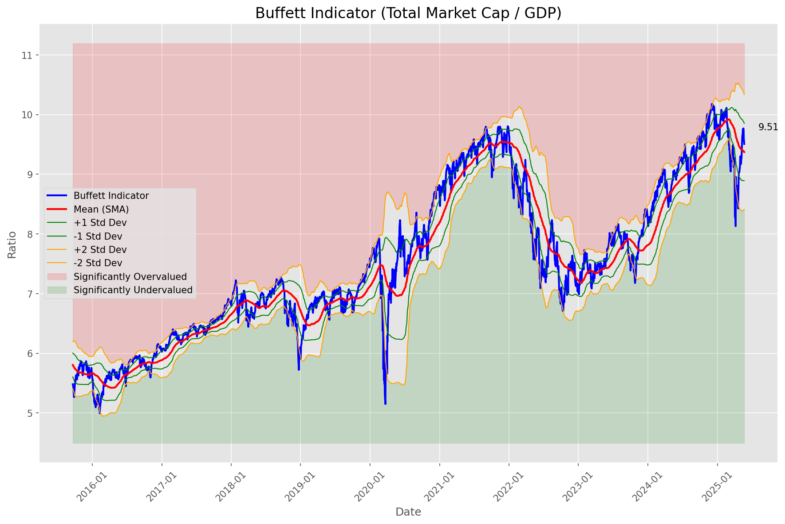
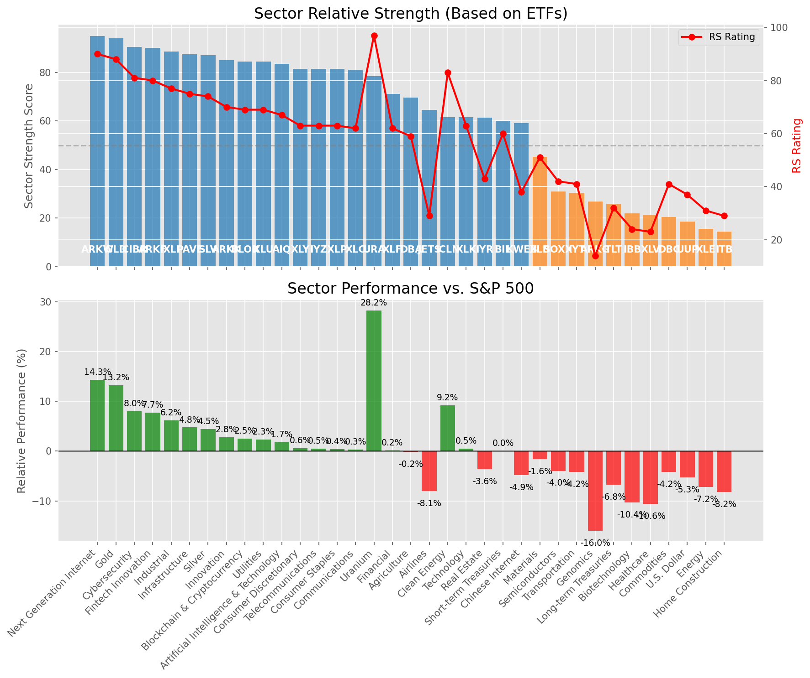

# **Daily Relative Strength Report**

**Date:** 2025-05-27

## **Market Valuation (Buffett Indicator)**

| Metric | Value |
|--------|-------|
| **Market Valuation** | **Fair Valued** |
| **Current Ratio** | 9.69 |
| **Historical Mean** | 9.37 |
| **Standard Deviation** | 0.48 |
| **Z-Score (StdDev from Mean)** | 0.28 |
| **Total Market Cap** | $290.55 trillion |
| **GDP** | $29.98 trillion |

## **Market Insights**

### **Market is Fairly Valued**

The market appears to be trading within a reasonable range of historical valuations. This suggests a balanced approach to equity investing is appropriate. Investors should:

- Focus on individual stock selection based on fundamentals and technicals
- Maintain normal equity allocations aligned with long-term goals
- Pay attention to sector rotation and relative strength
- Watch for changes in market leadership

Fair valuation typically suggests normal market returns can be expected, with stock selection becoming increasingly important.

### **Buffett Indicator Overview**

The Buffett Indicator (Total Market Cap / GDP) is a measure of the stock market's valuation relative to the size of the economy. It is named after Warren Buffett, who described it as "probably the best single measure of where valuations stand at any given moment."

- **Values above +2 standard deviations:** Market significantly overvalued
- **Values above +1 standard deviation:** Market overvalued
- **Values between -1 and +1 standard deviations:** Market fairly valued
- **Values below -1 standard deviation:** Market undervalued
- **Values below -2 standard deviations:** Market significantly undervalued

---

## **Sector Relative Strength**

Based on William O'Neil's Relative Strength Methodology

| ETF | Strength | RS Rating | Performance | Above Key MAs | Trend | Sector |
|-----|----------|-----------|-------------|--------------|-------|--------|
| [ARKW](https://www.tradingview.com/chart/?symbol=ARKW) | 94.5 | 89.0 | 13.90% | 10d ✓, 50d ✓, 200d ✓ | ↗️ | Next Generation Internet |
| [GLD](https://www.tradingview.com/chart/?symbol=GLD) | 94.0 | 88.0 | 13.19% | 10d ✓, 50d ✓, 200d ✓ | ↗️ | Gold |
| [CIBR](https://www.tradingview.com/chart/?symbol=CIBR) | 90.5 | 81.0 | 7.86% | 10d ✓, 50d ✓, 200d ✓ | ↗️ | Cybersecurity |
| [ARKF](https://www.tradingview.com/chart/?symbol=ARKF) | 90.0 | 80.0 | 7.53% | 10d ✓, 50d ✓, 200d ✓ | ↗️ | Fintech Innovation |
| [XLI](https://www.tradingview.com/chart/?symbol=XLI) | 88.5 | 77.0 | 6.13% | 10d ✓, 50d ✓, 200d ✓ | ↗️ | Industrial |
| [PAVE](https://www.tradingview.com/chart/?symbol=PAVE) | 87.5 | 75.0 | 4.70% | 10d ✓, 50d ✓, 200d ✓ | ↗️ | Infrastructure |
| [SLV](https://www.tradingview.com/chart/?symbol=SLV) | 87.0 | 74.0 | 4.35% | 10d ✓, 50d ✓, 200d ✓ | ↗️ | Silver |
| [XLU](https://www.tradingview.com/chart/?symbol=XLU) | 84.5 | 69.0 | 2.56% | 10d ✓, 50d ✓, 200d ✓ | ↗️ | Utilities |
| [BLOK](https://www.tradingview.com/chart/?symbol=BLOK) | 84.5 | 69.0 | 2.38% | 10d ✓, 50d ✓, 200d ✓ | ↗️ | Blockchain & Cryptocurrency |
| [ARKK](https://www.tradingview.com/chart/?symbol=ARKK) | 84.0 | 68.0 | 2.23% | 10d ✓, 50d ✓, 200d ✓ | ↗️ | Innovation |
| [AIQ](https://www.tradingview.com/chart/?symbol=AIQ) | 83.0 | 66.0 | 1.55% | 10d ✓, 50d ✓, 200d ✓ | ↗️ | Artificial Intelligence & Technology |
| [IYZ](https://www.tradingview.com/chart/?symbol=IYZ) | 82.0 | 64.0 | 0.55% | 10d ✓, 50d ✓, 200d ✓ | ↗️ | Telecommunications |
| [XLP](https://www.tradingview.com/chart/?symbol=XLP) | 81.5 | 63.0 | 0.36% | 10d ✓, 50d ✓, 200d ✓ | ↗️ | Consumer Staples |
| [XLY](https://www.tradingview.com/chart/?symbol=XLY) | 81.5 | 63.0 | 0.27% | 10d ✓, 50d ✓, 200d ✓ | ↗️ | Consumer Discretionary |
| [XLC](https://www.tradingview.com/chart/?symbol=XLC) | 81.0 | 62.0 | 0.23% | 10d ✓, 50d ✓, 200d ✓ | ↗️ | Communications |
| [URA](https://www.tradingview.com/chart/?symbol=URA) | 78.5 | 97.0 | 27.73% | 10d ✓, 50d ✓, 200d ✓ | ↘️ | Uranium |
| [XLF](https://www.tradingview.com/chart/?symbol=XLF) | 70.6 | 61.0 | 0.08% | 10d ✗, 50d ✓, 200d ✓ | ↗️ | Financial |
| [DBA](https://www.tradingview.com/chart/?symbol=DBA) | 69.6 | 59.0 | -0.13% | 10d ✗, 50d ✓, 200d ✓ | ↗️ | Agriculture |
| [JETS](https://www.tradingview.com/chart/?symbol=JETS) | 64.5 | 29.0 | -8.31% | 10d ✓, 50d ✓, 200d ✓ | ↗️ | Airlines |
| [IYR](https://www.tradingview.com/chart/?symbol=IYR) | 61.8 | 44.0 | -3.42% | 10d ✓, 50d ✓, 200d ✗ | ↗️ | Real Estate |
| [ICLN](https://www.tradingview.com/chart/?symbol=ICLN) | 61.6 | 83.0 | 9.22% | 10d ✗, 50d ✓, 200d ✓ | ↘️ | Clean Energy |
| [BIL](https://www.tradingview.com/chart/?symbol=BIL) | 60.5 | 61.0 | 0.00% | 10d ✓, 50d ✓, 200d ✓ | ↘️ | Short-term Treasuries |
| [KWEB](https://www.tradingview.com/chart/?symbol=KWEB) | 59.6 | 39.0 | -4.90% | 10d ✗, 50d ✓, 200d ✓ | ↗️ | Chinese Internet |
| [XLK](https://www.tradingview.com/chart/?symbol=XLK) | 51.6 | 63.0 | 0.41% | 10d ✗, 50d ✓, 200d ✓ | ↘️ | Technology |
| [XLB](https://www.tradingview.com/chart/?symbol=XLB) | 45.3 | 51.0 | -1.72% | 10d ✓, 50d ✓, 200d ✗ | ↘️ | Materials |
| [IYT](https://www.tradingview.com/chart/?symbol=IYT) | 30.9 | 42.0 | -4.17% | 10d ✗, 50d ✓, 200d ✗ | ↘️ | Transportation |
| [SOXX](https://www.tradingview.com/chart/?symbol=SOXX) | 30.9 | 42.0 | -3.97% | 10d ✗, 50d ✓, 200d ✗ | ↘️ | Semiconductors |
| [TLT](https://www.tradingview.com/chart/?symbol=TLT) | 26.9 | 34.0 | -6.51% | 10d ✓, 50d ✗, 200d ✗ | ↘️ | Long-term Treasuries |
| [XLV](https://www.tradingview.com/chart/?symbol=XLV) | 21.9 | 24.0 | -10.49% | 10d ✓, 50d ✗, 200d ✗ | ↘️ | Healthcare |
| [IBB](https://www.tradingview.com/chart/?symbol=IBB) | 21.9 | 24.0 | -10.41% | 10d ✓, 50d ✗, 200d ✗ | ↘️ | Biotechnology |
| [DBC](https://www.tradingview.com/chart/?symbol=DBC) | 21.0 | 42.0 | -4.13% | 10d ✗, 50d ✗, 200d ✗ | ↘️ | Commodities |
| [UUP](https://www.tradingview.com/chart/?symbol=UUP) | 18.5 | 37.0 | -5.39% | 10d ✗, 50d ✗, 200d ✗ | ↘️ | U.S. Dollar |
| [ARKG](https://www.tradingview.com/chart/?symbol=ARKG) | 16.9 | 14.0 | -16.39% | 10d ✓, 50d ✗, 200d ✗ | ↘️ | Genomics |
| [XLE](https://www.tradingview.com/chart/?symbol=XLE) | 16.0 | 32.0 | -7.17% | 10d ✗, 50d ✗, 200d ✗ | ↘️ | Energy |
| [ITB](https://www.tradingview.com/chart/?symbol=ITB) | 14.5 | 29.0 | -8.31% | 10d ✗, 50d ✗, 200d ✗ | ↘️ | Home Construction |

### **Sector ETF Performance Interpretation**

This table shows the relative strength metrics for different market sectors based on their representative ETFs:

- **ETF**: The ETF used to measure sector performance (click for chart)
- **Strength**: Overall sector strength score (0-100) combining multiple factors
- **RS Rating**: O'Neil RS rating of the sector ETF
- **Performance**: Performance of the sector ETF relative to SPY
- **Above Key MAs**: Whether the ETF is trading above its 10, 50, and 200-day moving averages
- **Trend**: Whether the sector is in an uptrend (↗️) or downtrend (↘️)

### **Current Sector Leadership**

The current market leadership is coming from the following sectors: **Next Generation Internet, Gold, Cybersecurity**.

The **Next Generation Internet** sector (represented by **ARKW**) is showing particularly strong relative strength with an RS rating of 89.0 and performance of 13.90% vs. the S&P 500. This sector is trading above its 10-day, 50-day, 200-day moving average(s). Investors should consider focusing on high RS stocks within these leading sectors for potential outperformance.

---

## **Buy Recommendations**

The following 98 stocks show exceptional relative strength:

| RS Rating | Buy Score | Current Price | Chart | Name | Ticker |
|-----------|-----------|---------------|-------|------|--------|
| 100 | 100 | $109.09 | [Chart](https://www.tradingview.com/chart/?symbol=SEZL) | Sezzle Inc. Common Stock | SEZL |
| 100 | 100 | $210.00 | [Chart](https://www.tradingview.com/chart/?symbol=AGX) | Argan, Inc | AGX |
| 100 | 100 | $23.20 | [Chart](https://www.tradingview.com/chart/?symbol=PRA) | ProAssurance Corporation | PRA |
| 100 | 100 | $37.95 | [Chart](https://www.tradingview.com/chart/?symbol=KTOS) | Kratos Defense & Security Solutions, Inc. | KTOS |
| 100 | 100 | $208.17 | [Chart](https://www.tradingview.com/chart/?symbol=DAVE) | Dave Inc. Class A Common Stock | DAVE |
| 100 | 100 | $94.58 | [Chart](https://www.tradingview.com/chart/?symbol=RBRK) | Rubrik, Inc. | RBRK |
| 99 | 100 | $43.17 | [Chart](https://www.tradingview.com/chart/?symbol=AU) | AngloGold Ashanti plc | AU |
| 99 | 100 | $85.03 | [Chart](https://www.tradingview.com/chart/?symbol=RBLX) | Roblox Corporation | RBLX |
| 99 | 100 | $469.16 | [Chart](https://www.tradingview.com/chart/?symbol=GEV) | GE Vernova Inc. | GEV |
| 99 | 100 | $42.25 | [Chart](https://www.tradingview.com/chart/?symbol=DRS) | Leonardo DRS, Inc. Common Stock | DRS |
| 98 | 100 | $65.53 | [Chart](https://www.tradingview.com/chart/?symbol=HOOD) | Robinhood Markets, Inc. Class A Common Stock | HOOD |
| 98 | 100 | $19.78 | [Chart](https://www.tradingview.com/chart/?symbol=SPNT) | SiriusPoint Ltd. | SPNT |
| 98 | 100 | $31.06 | [Chart](https://www.tradingview.com/chart/?symbol=HODL) | VanEck Bitcoin ETF | HODL |
| 98 | 100 | $72.47 | [Chart](https://www.tradingview.com/chart/?symbol=ULS) | UL Solutions Inc. | ULS |
| 98 | 100 | $24.97 | [Chart](https://www.tradingview.com/chart/?symbol=OR) | OR Royalties Inc. | OR |
| 98 | 100 | $311.16 | [Chart](https://www.tradingview.com/chart/?symbol=CVNA) | Carvana Co. | CVNA |
| 98 | 100 | $163.24 | [Chart](https://www.tradingview.com/chart/?symbol=PLMR) | Palomar Holdings, Inc. Common stock | PLMR |
| 98 | 100 | $56.81 | [Chart](https://www.tradingview.com/chart/?symbol=SHLD) | Global X Defense Tech ETF | SHLD |
| 98 | 100 | $48.64 | [Chart](https://www.tradingview.com/chart/?symbol=BTC) | Grayscale Bitcoin Mini Trust ETF | BTC |
| 97 | 100 | $62.39 | [Chart](https://www.tradingview.com/chart/?symbol=IBIT) | iShares Bitcoin Trust ETF | IBIT |
| 97 | 100 | $169.56 | [Chart](https://www.tradingview.com/chart/?symbol=HWM) | Howmet Aerospace Inc. | HWM |
| 97 | 100 | $19.48 | [Chart](https://www.tradingview.com/chart/?symbol=MIR) | Mirion Technologies, Inc. | MIR |
| 97 | 100 | $26.30 | [Chart](https://www.tradingview.com/chart/?symbol=UVE) | UNIVERSAL INSURANCE HLDG, INC. | UVE |
| 97 | 100 | $742.71 | [Chart](https://www.tradingview.com/chart/?symbol=AXON) | Axon Enterprise, Inc. Common Stock | AXON |
| 97 | 100 | $165.55 | [Chart](https://www.tradingview.com/chart/?symbol=SE) | Sea Limited American Depositary Shares, each representing one Class A Ordinary Share | SE |
| 96 | 100 | $63.89 | [Chart](https://www.tradingview.com/chart/?symbol=GDXJ) | VanEck Junior Gold Miners ETF | GDXJ |
| 96 | 100 | $46.20 | [Chart](https://www.tradingview.com/chart/?symbol=MRX) | Marex Group plc Ordinary Shares | MRX |
| 96 | 100 | $21.70 | [Chart](https://www.tradingview.com/chart/?symbol=TFPM) | Triple Flag Precious Metals Corp. | TFPM |
| 96 | 100 | $35.83 | [Chart](https://www.tradingview.com/chart/?symbol=UTI) | Universal Technical Institute, Inc. | UTI |
| 96 | 100 | $38.26 | [Chart](https://www.tradingview.com/chart/?symbol=AS) | Amer Sports, Inc. | AS |
| 96 | 100 | $29.52 | [Chart](https://www.tradingview.com/chart/?symbol=FMS) | Fresenius Medical Care AG | FMS |
| 95 | 100 | $31.85 | [Chart](https://www.tradingview.com/chart/?symbol=PRDO) | Perdoceo Education Corporation | PRDO |
| 95 | 100 | $1207.42 | [Chart](https://www.tradingview.com/chart/?symbol=NFLX) | NetFlix Inc | NFLX |
| 95 | 100 | $49.85 | [Chart](https://www.tradingview.com/chart/?symbol=GDX) | VanEck Gold Miners ETF | GDX |
| 95 | 100 | $139.50 | [Chart](https://www.tradingview.com/chart/?symbol=UGL) | ProShares Ultra Gold | UGL |
| 95 | 100 | $85.83 | [Chart](https://www.tradingview.com/chart/?symbol=WPM) | Wheaton Precious Metals Corp. Common Stock | WPM |
| 94 | 100 | $43.51 | [Chart](https://www.tradingview.com/chart/?symbol=EWP) | iShares MSCI Spain ETF | EWP |
| 94 | 100 | $241.82 | [Chart](https://www.tradingview.com/chart/?symbol=GE) | GE Aerospace | GE |
| 94 | 100 | $154.31 | [Chart](https://www.tradingview.com/chart/?symbol=CAH) | Cardinal Health, Inc. | CAH |
| 94 | 100 | $74.05 | [Chart](https://www.tradingview.com/chart/?symbol=WRB) | W.R. Berkley Corporation | WRB |
| 93 | 100 | $64.37 | [Chart](https://www.tradingview.com/chart/?symbol=SLF) | Sun Life Financial Inc. | SLF |
| 93 | 100 | $237.07 | [Chart](https://www.tradingview.com/chart/?symbol=CRS) | Carpenter Technology Corp | CRS |
| 93 | 100 | $116.84 | [Chart](https://www.tradingview.com/chart/?symbol=AEM) | Agnico Eagle Mines Ltd. | AEM |
| 93 | 100 | $178.92 | [Chart](https://www.tradingview.com/chart/?symbol=RGLD) | Royal Gold Inc | RGLD |
| 93 | 100 | $131.53 | [Chart](https://www.tradingview.com/chart/?symbol=COOP) | Mr. Cooper Group Inc. Common Stock | COOP |
| 93 | 100 | $100.69 | [Chart](https://www.tradingview.com/chart/?symbol=JCI) | Johnson Controls International plc | JCI |
| 92 | 100 | $45.37 | [Chart](https://www.tradingview.com/chart/?symbol=BTI) | British American Tobacco p.l.c. American Depositary Shares, American Depositary Shares, each representing one Ordinary Share | BTI |
| 92 | 100 | $34.83 | [Chart](https://www.tradingview.com/chart/?symbol=FDP) | Fresh Del Monte Produce Inc. | FDP |
| 92 | 100 | $35.06 | [Chart](https://www.tradingview.com/chart/?symbol=AHR) | American Healthcare REIT, Inc. | AHR |
| 91 | 100 | $179.71 | [Chart](https://www.tradingview.com/chart/?symbol=PM) | Philip Morris International Inc. | PM |
| 91 | 100 | $174.88 | [Chart](https://www.tradingview.com/chart/?symbol=ITA) | iShares U.S. Aerospace & Defense ETF | ITA |
| 91 | 100 | $381.04 | [Chart](https://www.tradingview.com/chart/?symbol=APP) | Applovin Corporation Class A Common Stock | APP |
| 91 | 100 | $55.67 | [Chart](https://www.tradingview.com/chart/?symbol=RELX) | RELX PLC | RELX |
| 91 | 100 | $42.27 | [Chart](https://www.tradingview.com/chart/?symbol=EWG) | iShares MSCI Germany ETF | EWG |
| 91 | 100 | $31.82 | [Chart](https://www.tradingview.com/chart/?symbol=EUFN) | iShares MSCI Europe Financials ETF | EUFN |
| 90 | 100 | $114.70 | [Chart](https://www.tradingview.com/chart/?symbol=BJ) | BJs Wholesale Club Holdings, Inc. Common Stock | BJ |
| 90 | 100 | $284.22 | [Chart](https://www.tradingview.com/chart/?symbol=CME) | CME Group Inc. | CME |
| 90 | 100 | $206.87 | [Chart](https://www.tradingview.com/chart/?symbol=BAP) | Credicorp LTD | BAP |
| 89 | 100 | $31.52 | [Chart](https://www.tradingview.com/chart/?symbol=SGOL) | abrdn Physical Gold Shares ETF | SGOL |
| 89 | 100 | $65.44 | [Chart](https://www.tradingview.com/chart/?symbol=GLDM) | SPDR Gold MiniShares | GLDM |
| 89 | 100 | $49.03 | [Chart](https://www.tradingview.com/chart/?symbol=MRCY) | Mercury Systems Inc. | MRCY |
| 89 | 100 | $17.91 | [Chart](https://www.tradingview.com/chart/?symbol=BCS) | Barclays PLC | BCS |
| 89 | 100 | $32.95 | [Chart](https://www.tradingview.com/chart/?symbol=IAUM) | iShares Gold Trust Micro | IAUM |
| 89 | 100 | $29.93 | [Chart](https://www.tradingview.com/chart/?symbol=NTGR) | NETGEAR, Inc. | NTGR |
| 88 | 100 | $62.30 | [Chart](https://www.tradingview.com/chart/?symbol=IAU) | iShares Gold Trust | IAU |
| 88 | 100 | $304.51 | [Chart](https://www.tradingview.com/chart/?symbol=GLD) | SPDR Gold Trust, SPDR Gold Shares | GLD |
| 88 | 100 | $32.64 | [Chart](https://www.tradingview.com/chart/?symbol=AAAU) | Goldman Sachs Physical Gold ETF Shares | AAAU |
| 88 | 100 | $31.85 | [Chart](https://www.tradingview.com/chart/?symbol=OUNZ) | VanEck Merk Gold ETF | OUNZ |
| 88 | 100 | $83.24 | [Chart](https://www.tradingview.com/chart/?symbol=NFG) | National Fuel Gas Co. | NFG |
| 87 | 100 | $49.64 | [Chart](https://www.tradingview.com/chart/?symbol=GFL) | GFL Environmental Inc. Subordinate Voting Shares | GFL |
| 86 | 100 | $23.95 | [Chart](https://www.tradingview.com/chart/?symbol=SRAD) | Sportradar Group AG Class A Ordinary Shares | SRAD |
| 89 | 99 | $50.38 | [Chart](https://www.tradingview.com/chart/?symbol=TRP) | TC Energy Corporation | TRP |
| 87 | 99 | $146.29 | [Chart](https://www.tradingview.com/chart/?symbol=TW) | Tradeweb Markets Inc. Class A Common Stock | TW |
| 86 | 99 | $25.25 | [Chart](https://www.tradingview.com/chart/?symbol=PHYS) | Sprott Physical Gold Trust | PHYS |
| 85 | 99 | $57.00 | [Chart](https://www.tradingview.com/chart/?symbol=TXNM) | TXNM Energy, Inc. | TXNM |
| 88 | 98 | $130.85 | [Chart](https://www.tradingview.com/chart/?symbol=HIG) | The Hartford Insurance Group, Inc. | HIG |
| 87 | 98 | $244.19 | [Chart](https://www.tradingview.com/chart/?symbol=TLN) | Talen Energy Corporation Common Stock | TLN |
| 86 | 97 | $105.66 | [Chart](https://www.tradingview.com/chart/?symbol=DTM) | DT Midstream, Inc. | DTM |
| 84 | 97 | $213.61 | [Chart](https://www.tradingview.com/chart/?symbol=DRI) | Darden Restaurants, Inc. | DRI |
| 84 | 97 | $255.21 | [Chart](https://www.tradingview.com/chart/?symbol=RSG) | Republic Services Inc. | RSG |
| 83 | 97 | $88.06 | [Chart](https://www.tradingview.com/chart/?symbol=SNEX) | StoneX Group Inc. Common Stock | SNEX |
| 86 | 96 | $48.85 | [Chart](https://www.tradingview.com/chart/?symbol=FTS) | Fortis Inc. Common Shares | FTS |
| 85 | 96 | $14.15 | [Chart](https://www.tradingview.com/chart/?symbol=MUFG) | Mitsubishi UFJ Financial Group, Inc. | MUFG |
| 83 | 96 | $29.15 | [Chart](https://www.tradingview.com/chart/?symbol=CEF) | Sprott Physical Gold and Silver Trust | CEF |
| 82 | 96 | $654.47 | [Chart](https://www.tradingview.com/chart/?symbol=SPOT) | Spotify Technology S.A. | SPOT |
| 84 | 95 | $58.95 | [Chart](https://www.tradingview.com/chart/?symbol=IGF) | iShares Global Infrastructure ETF | IGF |
| 84 | 95 | $316.92 | [Chart](https://www.tradingview.com/chart/?symbol=VRSK) | Verisk Analytics, Inc. Common Stock | VRSK |
| 82 | 94 | $27.97 | [Chart](https://www.tradingview.com/chart/?symbol=IMAX) | Imax Corp | IMAX |
| 81 | 93 | $72.33 | [Chart](https://www.tradingview.com/chart/?symbol=CIBR) | First Trust Exchange-Traded Fund II First Trust NASDAQ Cybersecurity ETF | CIBR |
| 81 | 93 | $43.88 | [Chart](https://www.tradingview.com/chart/?symbol=HMN) | Horace Mann Educators Corporation | HMN |
| 81 | 93 | $28.21 | [Chart](https://www.tradingview.com/chart/?symbol=KMI) | Kinder Morgan, Inc. | KMI |
| 83 | 92 | $30.89 | [Chart](https://www.tradingview.com/chart/?symbol=TGS) | Transportadora de Gas del Sur S.A. ADS | TGS |
| 81 | 92 | $117.79 | [Chart](https://www.tradingview.com/chart/?symbol=CWST) | Casella Waste Systems Inc | CWST |
| 81 | 91 | $85.75 | [Chart](https://www.tradingview.com/chart/?symbol=SEIC) | SEI Investments Co | SEIC |
| 81 | 91 | $78.59 | [Chart](https://www.tradingview.com/chart/?symbol=BBCA) | JPMorgan BetaBuilders Canada ETF | BBCA |
| 81 | 91 | $5443.22 | [Chart](https://www.tradingview.com/chart/?symbol=BKNG) | Booking Holdings Inc. Common Stock | BKNG |
| 80 | 90 | $41.39 | [Chart](https://www.tradingview.com/chart/?symbol=ARKF) | ARK Fintech Innovation ETF | ARKF |
| 80 | 89 | $31.20 | [Chart](https://www.tradingview.com/chart/?symbol=MT) | ArcelorMittal | MT |

---

## **Sell Recommendations**

The following 137 stocks show deteriorating relative strength:

| RS Rating | Sell Score | Current Price | Chart | Name | Ticker |
|-----------|------------|---------------|-------|------|--------|
| 1 | 100 | $13.17 | [Chart](https://www.tradingview.com/chart/?symbol=IART) | Integra LifeSciences Holdings | IART |
| 1 | 100 | $10.14 | [Chart](https://www.tradingview.com/chart/?symbol=NRIX) | Nurix Therapeutics, Inc. Common stock | NRIX |
| 2 | 100 | $13.96 | [Chart](https://www.tradingview.com/chart/?symbol=DQ) | Daqo New Energy Corp. American Depositary Shares (each representing 5 Ordinary Shares) | DQ |
| 2 | 100 | $17.02 | [Chart](https://www.tradingview.com/chart/?symbol=BEAM) | Beam Therapeutics Inc. Common Stock | BEAM |
| 2 | 100 | $13.39 | [Chart](https://www.tradingview.com/chart/?symbol=DV) | DoubleVerify Holdings, Inc. | DV |
| 2 | 100 | $12.51 | [Chart](https://www.tradingview.com/chart/?symbol=AESI) | Atlas Energy Solutions Inc. | AESI |
| 3 | 100 | $17.15 | [Chart](https://www.tradingview.com/chart/?symbol=FWRD) | Forward Air Corp | FWRD |
| 3 | 100 | $11.83 | [Chart](https://www.tradingview.com/chart/?symbol=LBRT) | Liberty Energy Inc. | LBRT |
| 4 | 100 | $13.25 | [Chart](https://www.tradingview.com/chart/?symbol=DNLI) | Denali Therapeutics Inc. Common Stock | DNLI |
| 4 | 100 | $14.06 | [Chart](https://www.tradingview.com/chart/?symbol=IMVT) | Immunovant, Inc. Common Stock | IMVT |
| 4 | 100 | $29.34 | [Chart](https://www.tradingview.com/chart/?symbol=TWST) | Twist Bioscience Corporation Common Stock | TWST |
| 4 | 100 | $10.31 | [Chart](https://www.tradingview.com/chart/?symbol=VREX) | Varex Imaging Corporation Common Stock | VREX |
| 4 | 100 | $126.42 | [Chart](https://www.tradingview.com/chart/?symbol=KRYS) | Krystal Biotech, Inc. Common Stock | KRYS |
| 5 | 100 | $29.16 | [Chart](https://www.tradingview.com/chart/?symbol=SRDX) | Surmodics, Inc. Common Stock | SRDX |
| 5 | 100 | $17.09 | [Chart](https://www.tradingview.com/chart/?symbol=VRNT) | Verint Systems Inc | VRNT |
| 5 | 100 | $11.25 | [Chart](https://www.tradingview.com/chart/?symbol=WEN) | The Wendy's Company | WEN |
| 5 | 100 | $23.80 | [Chart](https://www.tradingview.com/chart/?symbol=SM) | SM Energy Company | SM |
| 6 | 100 | $122.52 | [Chart](https://www.tradingview.com/chart/?symbol=RGEN) | Repligen Corp | RGEN |
| 6 | 100 | $11.22 | [Chart](https://www.tradingview.com/chart/?symbol=CLB) | Core Laboratories Inc. | CLB |
| 6 | 100 | $15.37 | [Chart](https://www.tradingview.com/chart/?symbol=PENN) | PENN Entertainment, Inc. Common Stock | PENN |
| 6 | 100 | $31.46 | [Chart](https://www.tradingview.com/chart/?symbol=MBIN) | Merchants Bancorp Common Stock | MBIN |
| 6 | 100 | $58.37 | [Chart](https://www.tradingview.com/chart/?symbol=ALB) | Albemarle Corporation | ALB |
| 7 | 100 | $16.95 | [Chart](https://www.tradingview.com/chart/?symbol=MLKN) | MillerKnoll, Inc. Common Stock | MLKN |
| 7 | 100 | $12.15 | [Chart](https://www.tradingview.com/chart/?symbol=ARCT) | Arcturus Therapeutics Holdings Inc. Common Stock | ARCT |
| 7 | 100 | $79.69 | [Chart](https://www.tradingview.com/chart/?symbol=WHR) | Whirlpool Corp. | WHR |
| 7 | 100 | $10.05 | [Chart](https://www.tradingview.com/chart/?symbol=CWK) | Cushman & Wakefield plc Ordinary Shares | CWK |
| 8 | 100 | $17.25 | [Chart](https://www.tradingview.com/chart/?symbol=APA) | APA Corporation Common Stock | APA |
| 8 | 100 | $23.26 | [Chart](https://www.tradingview.com/chart/?symbol=RPD) | Rapid7, Inc. Common Stock | RPD |
| 8 | 100 | $21.19 | [Chart](https://www.tradingview.com/chart/?symbol=AMRK) | A-Mark Precious Metals, Inc. | AMRK |
| 8 | 100 | $46.35 | [Chart](https://www.tradingview.com/chart/?symbol=RHI) | Robert Half Inc. | RHI |
| 9 | 100 | $40.31 | [Chart](https://www.tradingview.com/chart/?symbol=ASO) | Academy Sports and Outdoors, Inc. | ASO |
| 9 | 100 | $18.39 | [Chart](https://www.tradingview.com/chart/?symbol=NVDS) | Investment Managers Series Trust II Tradr 1.5X Short NVDA Daily ETF | NVDS |
| 9 | 100 | $45.41 | [Chart](https://www.tradingview.com/chart/?symbol=LINE) | Lineage, Inc. Common Stock | LINE |
| 10 | 100 | $55.25 | [Chart](https://www.tradingview.com/chart/?symbol=ASGN) | ASGN Incorporated | ASGN |
| 10 | 100 | $90.51 | [Chart](https://www.tradingview.com/chart/?symbol=CHRD) | Chord Energy Corporation Common Stock | CHRD |
| 12 | 100 | $15.28 | [Chart](https://www.tradingview.com/chart/?symbol=DXC) | DXC Technology Company | DXC |
| 13 | 100 | $10.34 | [Chart](https://www.tradingview.com/chart/?symbol=CMRE) | Costamare Inc. | CMRE |
| 14 | 100 | $18.35 | [Chart](https://www.tradingview.com/chart/?symbol=PDFS) | PDF Solutions Inc | PDFS |
| 22 | 100 | $11.13 | [Chart](https://www.tradingview.com/chart/?symbol=GES) | Guess?, Inc. | GES |
| 2 | 99 | $15.83 | [Chart](https://www.tradingview.com/chart/?symbol=CSTL) | Castle Biosciences, Inc. Common Stock | CSTL |
| 7 | 99 | $13.21 | [Chart](https://www.tradingview.com/chart/?symbol=AVTR) | Avantor, Inc. | AVTR |
| 9 | 99 | $63.40 | [Chart](https://www.tradingview.com/chart/?symbol=ARCB) | ArcBest Corporation | ARCB |
| 10 | 99 | $82.28 | [Chart](https://www.tradingview.com/chart/?symbol=KSPI) | Joint Stock Company Kaspi.kz American Depository Shares | KSPI |
| 11 | 99 | $50.74 | [Chart](https://www.tradingview.com/chart/?symbol=ASH) | Ashland Inc. | ASH |
| 15 | 99 | $58.00 | [Chart](https://www.tradingview.com/chart/?symbol=BMRN) | BioMarin Pharmaceuticals Inc | BMRN |
| 16 | 99 | $35.36 | [Chart](https://www.tradingview.com/chart/?symbol=RARE) | Ultragenyx Pharmaceutical Inc. | RARE |
| 4 | 98 | $10.27 | [Chart](https://www.tradingview.com/chart/?symbol=SONO) | Sonos, Inc. Common Stock | SONO |
| 5 | 98 | $143.53 | [Chart](https://www.tradingview.com/chart/?symbol=INSP) | Inspire Medical Systems, Inc. | INSP |
| 12 | 98 | $12.29 | [Chart](https://www.tradingview.com/chart/?symbol=NOV) | NOV Inc. | NOV |
| 14 | 98 | $220.31 | [Chart](https://www.tradingview.com/chart/?symbol=OIH) | VanEck Oil Services ETF | OIH |
| 3 | 97 | $28.84 | [Chart](https://www.tradingview.com/chart/?symbol=DOCN) | DigitalOcean Holdings, Inc. | DOCN |
| 6 | 97 | $14.51 | [Chart](https://www.tradingview.com/chart/?symbol=INMD) | InMode Ltd. Ordinary Shares | INMD |
| 8 | 97 | $10.52 | [Chart](https://www.tradingview.com/chart/?symbol=PK) | Park Hotels & Resorts Inc. Common Stock | PK |
| 10 | 97 | $20.79 | [Chart](https://www.tradingview.com/chart/?symbol=UCO) | ProShares Ultra Bloomberg Crude Oil | UCO |
| 11 | 97 | $26.41 | [Chart](https://www.tradingview.com/chart/?symbol=WERN) | Werner Enterprises Inc | WERN |
| 14 | 97 | $200.37 | [Chart](https://www.tradingview.com/chart/?symbol=AAPL) | Apple Inc. | AAPL |
| 10 | 94 | $28.35 | [Chart](https://www.tradingview.com/chart/?symbol=KYMR) | Kymera Therapeutics, Inc. Common Stock | KYMR |
| 14 | 94 | $11.94 | [Chart](https://www.tradingview.com/chart/?symbol=PBR) | PETROLEO BRASILEIRO S.A.-PETROBRAS ADS (REP 1 COMMON SHARE) | PBR |
| 26 | 94 | $14.78 | [Chart](https://www.tradingview.com/chart/?symbol=FXN) | First Trust Energy AlphaDEX Fund | FXN |
| 10 | 93 | $42.06 | [Chart](https://www.tradingview.com/chart/?symbol=VCEL) | Vericel Corporation | VCEL |
| 10 | 93 | $92.46 | [Chart](https://www.tradingview.com/chart/?symbol=RVTY) | Revvity, Inc. | RVTY |
| 16 | 93 | $32.51 | [Chart](https://www.tradingview.com/chart/?symbol=TENB) | Tenable Holdings, Inc. | TENB |
| 16 | 93 | $11.13 | [Chart](https://www.tradingview.com/chart/?symbol=PBR.A) | Petroleo Brasileiro S.A.-Petrobras | PBR.A |
| 18 | 93 | $19.45 | [Chart](https://www.tradingview.com/chart/?symbol=FOR) | Forestar Group Inc. | FOR |
| 20 | 93 | $30.84 | [Chart](https://www.tradingview.com/chart/?symbol=BAX) | Baxter International Inc. | BAX |
| 11 | 92 | $11.79 | [Chart](https://www.tradingview.com/chart/?symbol=APLE) | Apple Hospitality REIT, Inc. | APLE |
| 12 | 92 | $48.91 | [Chart](https://www.tradingview.com/chart/?symbol=ERX) | Direxion Daily Energy Bull 2X Shares | ERX |
| 15 | 92 | $15.21 | [Chart](https://www.tradingview.com/chart/?symbol=SAFE) | Safehold Inc. | SAFE |
| 19 | 92 | $14.57 | [Chart](https://www.tradingview.com/chart/?symbol=HR) | Healthcare Realty Trust Incorporated | HR |
| 13 | 91 | $32.84 | [Chart](https://www.tradingview.com/chart/?symbol=SQM) | Sociedad Quimica y Minera de Chile SA | SQM |
| 17 | 91 | $41.62 | [Chart](https://www.tradingview.com/chart/?symbol=OXY) | Occidental Petroleum Corporation | OXY |
| 21 | 91 | $10.07 | [Chart](https://www.tradingview.com/chart/?symbol=LBTYK) | Liberty Global Ltd. Class C Common Shares | LBTYK |
| 12 | 90 | $11.16 | [Chart](https://www.tradingview.com/chart/?symbol=VYX) | NCR Voyix Corporation | VYX |
| 14 | 90 | $26.01 | [Chart](https://www.tradingview.com/chart/?symbol=TRN) | Trinity Industries, Inc. | TRN |
| 17 | 90 | $89.43 | [Chart](https://www.tradingview.com/chart/?symbol=BCC) | Boise Cascade Company | BCC |
| 19 | 90 | $19.20 | [Chart](https://www.tradingview.com/chart/?symbol=OII) | Oceaneering International Inc. | OII |
| 16 | 89 | $17.55 | [Chart](https://www.tradingview.com/chart/?symbol=DNTH) | Dianthus Therapeutics, Inc. Common Stock | DNTH |
| 17 | 89 | $53.20 | [Chart](https://www.tradingview.com/chart/?symbol=KBH) | KB Home | KBH |
| 21 | 89 | $104.32 | [Chart](https://www.tradingview.com/chart/?symbol=MHK) | Mohawk Industries, Inc. | MHK |
| 24 | 89 | $17.44 | [Chart](https://www.tradingview.com/chart/?symbol=STR) | Sitio Royalties Corp. | STR |
| 25 | 89 | $37.23 | [Chart](https://www.tradingview.com/chart/?symbol=LIT) | Global X Lithium & Battery Tech ETF | LIT |
| 14 | 88 | $21.43 | [Chart](https://www.tradingview.com/chart/?symbol=ARKG) | ARK Genomic Revolution ETF | ARKG |
| 15 | 88 | $56.41 | [Chart](https://www.tradingview.com/chart/?symbol=TRNO) | Terreno Realty Corporation | TRNO |
| 16 | 88 | $22.95 | [Chart](https://www.tradingview.com/chart/?symbol=GPK) | Graphic Packaging Holding Company | GPK |
| 18 | 88 | $12.44 | [Chart](https://www.tradingview.com/chart/?symbol=PMT) | PennyMac Mortgage Investment Trust | PMT |
| 20 | 88 | $84.26 | [Chart](https://www.tradingview.com/chart/?symbol=BCO) | The Brink's Company | BCO |
| 21 | 88 | $18.14 | [Chart](https://www.tradingview.com/chart/?symbol=UE) | UBRAN EDGE PROPERTIES | UE |
| 21 | 88 | $65.78 | [Chart](https://www.tradingview.com/chart/?symbol=MTH) | Meritage Homes Corporation | MTH |
| 25 | 88 | $16.10 | [Chart](https://www.tradingview.com/chart/?symbol=PD) | PagerDuty, Inc. | PD |
| 26 | 88 | $14.35 | [Chart](https://www.tradingview.com/chart/?symbol=OCSL) | Oaktree Specialty Lending Corporation | OCSL |
| 18 | 87 | $49.01 | [Chart](https://www.tradingview.com/chart/?symbol=FR) | First Industrial Realty Trust, Inc. | FR |
| 22 | 87 | $107.78 | [Chart](https://www.tradingview.com/chart/?symbol=LEN) | Lennar Corporation Class A | LEN |
| 23 | 87 | $12.74 | [Chart](https://www.tradingview.com/chart/?symbol=ZUMZ) | Zumiez Inc. | ZUMZ |
| 30 | 87 | $10.77 | [Chart](https://www.tradingview.com/chart/?symbol=NMFC) | NEW MOUNTAIN FINANCE CORPORATION | NMFC |
| 18 | 86 | $25.84 | [Chart](https://www.tradingview.com/chart/?symbol=WY) | Weyerhaeuser Company | WY |
| 30 | 86 | $27.66 | [Chart](https://www.tradingview.com/chart/?symbol=TX) | Ternium S.A. American Depositary Shares | TX |
| 17 | 85 | $10.76 | [Chart](https://www.tradingview.com/chart/?symbol=NEWT) | NewtekOne, Inc. Common Stock | NEWT |
| 21 | 85 | $28.61 | [Chart](https://www.tradingview.com/chart/?symbol=QID) | ProShares UltraShort QQQ | QID |
| 23 | 85 | $10.47 | [Chart](https://www.tradingview.com/chart/?symbol=AVO) | Mission Produce, Inc. Common Stock | AVO |
| 18 | 84 | $39.34 | [Chart](https://www.tradingview.com/chart/?symbol=PCH) | PotlatchDeltic Corporation Common Stock | PCH |
| 20 | 84 | $75.75 | [Chart](https://www.tradingview.com/chart/?symbol=CNS) | Cohen & Steers Inc. | CNS |
| 26 | 83 | $16.50 | [Chart](https://www.tradingview.com/chart/?symbol=MLNK) | MeridianLink, Inc. | MLNK |
| 20 | 82 | $36.54 | [Chart](https://www.tradingview.com/chart/?symbol=NBHC) | NATIONAL BANK HOLDINGS CORP. | NBHC |
| 24 | 82 | $13.58 | [Chart](https://www.tradingview.com/chart/?symbol=BSM) | Black Stone Minerals, L.P. | BSM |
| 25 | 82 | $36.49 | [Chart](https://www.tradingview.com/chart/?symbol=STBA) | S&T Bancorp Inc | STBA |
| 26 | 82 | $189.64 | [Chart](https://www.tradingview.com/chart/?symbol=DHR) | Danaher Corporation | DHR |
| 24 | 81 | $29.24 | [Chart](https://www.tradingview.com/chart/?symbol=BP) | BP p.l.c. | BP |
| 30 | 81 | $13.27 | [Chart](https://www.tradingview.com/chart/?symbol=MRTN) | Marten Transport Ltd | MRTN |
| 30 | 81 | $10.44 | [Chart](https://www.tradingview.com/chart/?symbol=CELC) | Celcuity Inc. Common Stock | CELC |
| 21 | 79 | $10.28 | [Chart](https://www.tradingview.com/chart/?symbol=HOPE) | Hope Bancorp, Inc. | HOPE |
| 33 | 79 | $15.01 | [Chart](https://www.tradingview.com/chart/?symbol=VRE) | Veris Residential, Inc. | VRE |
| 27 | 78 | $38.20 | [Chart](https://www.tradingview.com/chart/?symbol=KSA) | iShares MSCI Saudi Arabia ETF | KSA |
| 33 | 78 | $35.70 | [Chart](https://www.tradingview.com/chart/?symbol=SU) | Suncor Energy, Inc. | SU |
| 26 | 77 | $14.33 | [Chart](https://www.tradingview.com/chart/?symbol=BMEZ) | BlackRock Health Sciences Term Trust | BMEZ |
| 27 | 77 | $132.36 | [Chart](https://www.tradingview.com/chart/?symbol=HES) | Hess Corporation | HES |
| 28 | 77 | $73.32 | [Chart](https://www.tradingview.com/chart/?symbol=WFG) | West Fraser Timber Co. Ltd | WFG |
| 29 | 77 | $122.64 | [Chart](https://www.tradingview.com/chart/?symbol=SUI) | Sun Communities, Inc | SUI |
| 30 | 77 | $16.00 | [Chart](https://www.tradingview.com/chart/?symbol=ELME) | Elme Communities | ELME |
| 31 | 77 | $10.86 | [Chart](https://www.tradingview.com/chart/?symbol=SEMR) | SEMrush Holdings, Inc. | SEMR |
| 26 | 76 | $14.56 | [Chart](https://www.tradingview.com/chart/?symbol=RYLD) | Global X Russell 2000 Covered Call ETF | RYLD |
| 32 | 76 | $12.37 | [Chart](https://www.tradingview.com/chart/?symbol=WSR) | Whitestone REIT | WSR |
| 35 | 74 | $10.45 | [Chart](https://www.tradingview.com/chart/?symbol=MYI) | BLACKROCK MUNIYIELD QUALITY FUND III, INC. | MYI |
| 36 | 74 | $10.88 | [Chart](https://www.tradingview.com/chart/?symbol=LBTYA) | Liberty Global Ltd. Class A Common Shares | LBTYA |
| 36 | 74 | $286.83 | [Chart](https://www.tradingview.com/chart/?symbol=BLD) | TopBuild Corp. Common Stock | BLD |
| 28 | 73 | $50.42 | [Chart](https://www.tradingview.com/chart/?symbol=TSCO) | Tractor Supply Co | TSCO |
| 32 | 73 | $11.07 | [Chart](https://www.tradingview.com/chart/?symbol=MQY) | Blackrock Muni Yield Quality Fund, Inc | MQY |
| 32 | 71 | $82.74 | [Chart](https://www.tradingview.com/chart/?symbol=XLE) | Energy Select Sector SPDR Fund | XLE |
| 36 | 71 | $62.09 | [Chart](https://www.tradingview.com/chart/?symbol=BLKB) | Blackbaud, Inc. | BLKB |
| 36 | 71 | $12.05 | [Chart](https://www.tradingview.com/chart/?symbol=DSL) | DOUBLELINE INCOME SOLUTIONS FUND | DSL |
| 34 | 70 | $11.85 | [Chart](https://www.tradingview.com/chart/?symbol=NZF) | Nuveen Municipal Credit Income Fund | NZF |
| 38 | 70 | $10.49 | [Chart](https://www.tradingview.com/chart/?symbol=SCS) | Steelcase, Inc. | SCS |
| 36 | 69 | $22.07 | [Chart](https://www.tradingview.com/chart/?symbol=MGY) | Magnolia Oil & Gas Corporation Class A Common Stock | MGY |
| 36 | 69 | $18.71 | [Chart](https://www.tradingview.com/chart/?symbol=PFFD) | Global X U.S. Preferred ETF | PFFD |
| 34 | 66 | $71.95 | [Chart](https://www.tradingview.com/chart/?symbol=NUVL) | Nuvalent, Inc. Class A Common Stock | NUVL |
| 37 | 66 | $27.48 | [Chart](https://www.tradingview.com/chart/?symbol=UUP) | Invesco DB US Dollar Index Bullish Fund | UUP |
| 37 | 66 | $103.56 | [Chart](https://www.tradingview.com/chart/?symbol=XOM) | Exxon Mobil Corporation | XOM |
| 39 | 64 | $15.51 | [Chart](https://www.tradingview.com/chart/?symbol=BBN) | BlackRock Taxable Municipal Bond Trust | BBN |

## **Methodology**

This report uses William O'Neil's relative strength methodology from Investors Business Daily:

* **RS Rating**: Percentile rank of stock's performance vs. S&P 500 over the past 63 trading days (1-99 scale)
* **Buy Criteria**: RS Rating >= 80, price above 50-day MA, strong uptrend, increasing volume
* **Sell Criteria**: RS Rating < 40, price below 50-day MA, downtrend, decreasing volume

### **O'Neil's Key Principles**

1. **Focus on relative performance** - stocks outperforming the market
2. **Price trend confirmation** - stock must be in an uptrend
3. **Volume confirmation** - strong volume supports price moves
4. **Moving average validation** - price above key moving averages
5. **Market leaders only** - concentrate on top-performing stocks

*Report generated automatically after market close*