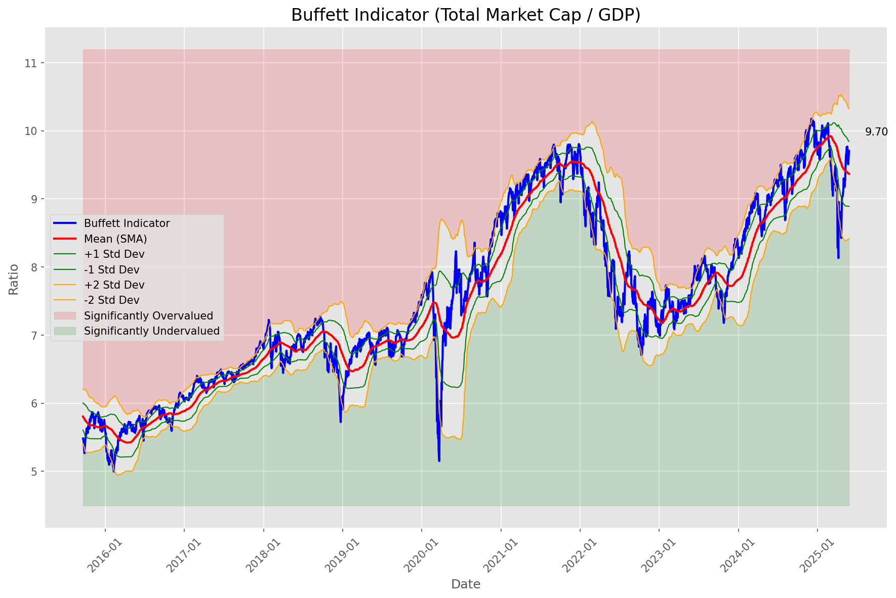
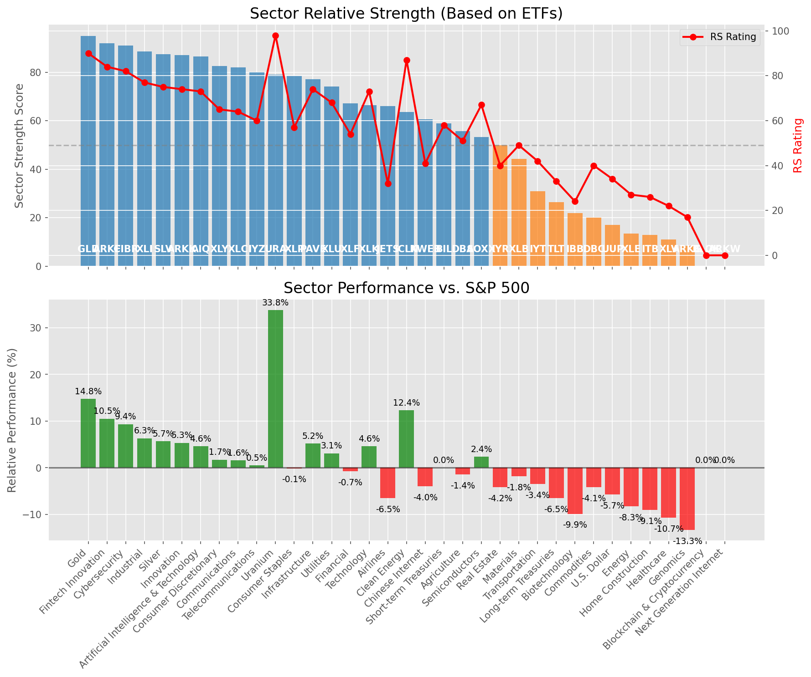

# **Daily Relative Strength Report**

**Date:** 2025-05-28

## **Market Valuation (Buffett Indicator)**

| Metric | Value |
|--------|-------|
| **Market Valuation** | **Fair Valued** |
| **Current Ratio** | 9.70 |
| **Historical Mean** | 9.37 |
| **Standard Deviation** | 0.48 |
| **Z-Score (StdDev from Mean)** | 0.28 |
| **Total Market Cap** | $290.90 trillion |
| **GDP** | $29.98 trillion |

## **Market Insights**

### **Market is Fairly Valued**

The market appears to be trading within a reasonable range of historical valuations. This suggests a balanced approach to equity investing is appropriate. Investors should:

- Focus on individual stock selection based on fundamentals and technicals
- Maintain normal equity allocations aligned with long-term goals
- Pay attention to sector rotation and relative strength
- Watch for changes in market leadership

Fair valuation typically suggests normal market returns can be expected, with stock selection becoming increasingly important.

### **Buffett Indicator Overview**

The Buffett Indicator (Total Market Cap / GDP) is a measure of the stock market's valuation relative to the size of the economy. It is named after Warren Buffett, who described it as "probably the best single measure of where valuations stand at any given moment."

- **Values above +2 standard deviations:** Market significantly overvalued
- **Values above +1 standard deviation:** Market overvalued
- **Values between -1 and +1 standard deviations:** Market fairly valued
- **Values below -1 standard deviation:** Market undervalued
- **Values below -2 standard deviations:** Market significantly undervalued

---

## **Sector Relative Strength**

Based on William O'Neil's Relative Strength Methodology

| ETF | Strength | RS Rating | Performance | Above Key MAs | Trend | Sector |
|-----|----------|-----------|-------------|--------------|-------|--------|
| [ARKW](https://www.tradingview.com/chart/?symbol=ARKW) | 95.0 | 90.0 | 14.28% | 10d ✓, 50d ✓, 200d ✓ | ↗️ | Next Generation Internet |
| [GLD](https://www.tradingview.com/chart/?symbol=GLD) | 94.0 | 88.0 | 13.18% | 10d ✓, 50d ✓, 200d ✓ | ↗️ | Gold |
| [CIBR](https://www.tradingview.com/chart/?symbol=CIBR) | 90.5 | 81.0 | 8.02% | 10d ✓, 50d ✓, 200d ✓ | ↗️ | Cybersecurity |
| [ARKF](https://www.tradingview.com/chart/?symbol=ARKF) | 90.0 | 80.0 | 7.72% | 10d ✓, 50d ✓, 200d ✓ | ↗️ | Fintech Innovation |
| [XLI](https://www.tradingview.com/chart/?symbol=XLI) | 88.5 | 77.0 | 6.16% | 10d ✓, 50d ✓, 200d ✓ | ↗️ | Industrial |
| [PAVE](https://www.tradingview.com/chart/?symbol=PAVE) | 87.5 | 75.0 | 4.75% | 10d ✓, 50d ✓, 200d ✓ | ↗️ | Infrastructure |
| [SLV](https://www.tradingview.com/chart/?symbol=SLV) | 87.0 | 74.0 | 4.46% | 10d ✓, 50d ✓, 200d ✓ | ↗️ | Silver |
| [ARKK](https://www.tradingview.com/chart/?symbol=ARKK) | 85.0 | 70.0 | 2.82% | 10d ✓, 50d ✓, 200d ✓ | ↗️ | Innovation |
| [BLOK](https://www.tradingview.com/chart/?symbol=BLOK) | 84.5 | 69.0 | 2.54% | 10d ✓, 50d ✓, 200d ✓ | ↗️ | Blockchain & Cryptocurrency |
| [XLU](https://www.tradingview.com/chart/?symbol=XLU) | 84.5 | 69.0 | 2.34% | 10d ✓, 50d ✓, 200d ✓ | ↗️ | Utilities |
| [AIQ](https://www.tradingview.com/chart/?symbol=AIQ) | 83.5 | 67.0 | 1.75% | 10d ✓, 50d ✓, 200d ✓ | ↗️ | Artificial Intelligence & Technology |
| [XLY](https://www.tradingview.com/chart/?symbol=XLY) | 81.5 | 63.0 | 0.62% | 10d ✓, 50d ✓, 200d ✓ | ↗️ | Consumer Discretionary |
| [XLP](https://www.tradingview.com/chart/?symbol=XLP) | 81.5 | 63.0 | 0.41% | 10d ✓, 50d ✓, 200d ✓ | ↗️ | Consumer Staples |
| [IYZ](https://www.tradingview.com/chart/?symbol=IYZ) | 81.5 | 63.0 | 0.50% | 10d ✓, 50d ✓, 200d ✓ | ↗️ | Telecommunications |
| [XLC](https://www.tradingview.com/chart/?symbol=XLC) | 81.0 | 62.0 | 0.31% | 10d ✓, 50d ✓, 200d ✓ | ↗️ | Communications |
| [URA](https://www.tradingview.com/chart/?symbol=URA) | 78.5 | 97.0 | 28.24% | 10d ✓, 50d ✓, 200d ✓ | ↘️ | Uranium |
| [XLF](https://www.tradingview.com/chart/?symbol=XLF) | 71.1 | 62.0 | 0.16% | 10d ✗, 50d ✓, 200d ✓ | ↗️ | Financial |
| [DBA](https://www.tradingview.com/chart/?symbol=DBA) | 69.6 | 59.0 | -0.18% | 10d ✗, 50d ✓, 200d ✓ | ↗️ | Agriculture |
| [JETS](https://www.tradingview.com/chart/?symbol=JETS) | 64.5 | 29.0 | -8.07% | 10d ✓, 50d ✓, 200d ✓ | ↗️ | Airlines |
| [ICLN](https://www.tradingview.com/chart/?symbol=ICLN) | 61.6 | 83.0 | 9.18% | 10d ✗, 50d ✓, 200d ✓ | ↘️ | Clean Energy |
| [XLK](https://www.tradingview.com/chart/?symbol=XLK) | 61.5 | 63.0 | 0.52% | 10d ✓, 50d ✓, 200d ✓ | ↘️ | Technology |
| [IYR](https://www.tradingview.com/chart/?symbol=IYR) | 61.3 | 43.0 | -3.61% | 10d ✓, 50d ✓, 200d ✗ | ↗️ | Real Estate |
| [BIL](https://www.tradingview.com/chart/?symbol=BIL) | 60.0 | 60.0 | 0.00% | 10d ✓, 50d ✓, 200d ✓ | ↘️ | Short-term Treasuries |
| [KWEB](https://www.tradingview.com/chart/?symbol=KWEB) | 59.6 | 39.0 | -4.85% | 10d ✗, 50d ✓, 200d ✓ | ↗️ | Chinese Internet |
| [XLB](https://www.tradingview.com/chart/?symbol=XLB) | 45.8 | 52.0 | -1.59% | 10d ✓, 50d ✓, 200d ✗ | ↘️ | Materials |
| [SOXX](https://www.tradingview.com/chart/?symbol=SOXX) | 30.9 | 42.0 | -3.97% | 10d ✗, 50d ✓, 200d ✗ | ↘️ | Semiconductors |
| [IYT](https://www.tradingview.com/chart/?symbol=IYT) | 30.4 | 41.0 | -4.20% | 10d ✗, 50d ✓, 200d ✗ | ↘️ | Transportation |
| [ARKG](https://www.tradingview.com/chart/?symbol=ARKG) | 26.8 | 14.0 | -16.00% | 10d ✓, 50d ✓, 200d ✗ | ↘️ | Genomics |
| [TLT](https://www.tradingview.com/chart/?symbol=TLT) | 25.9 | 32.0 | -6.77% | 10d ✓, 50d ✗, 200d ✗ | ↘️ | Long-term Treasuries |
| [IBB](https://www.tradingview.com/chart/?symbol=IBB) | 21.9 | 24.0 | -10.35% | 10d ✓, 50d ✗, 200d ✗ | ↘️ | Biotechnology |
| [XLV](https://www.tradingview.com/chart/?symbol=XLV) | 21.4 | 23.0 | -10.59% | 10d ✓, 50d ✗, 200d ✗ | ↘️ | Healthcare |
| [DBC](https://www.tradingview.com/chart/?symbol=DBC) | 20.5 | 41.0 | -4.16% | 10d ✗, 50d ✗, 200d ✗ | ↘️ | Commodities |
| [UUP](https://www.tradingview.com/chart/?symbol=UUP) | 18.5 | 37.0 | -5.27% | 10d ✗, 50d ✗, 200d ✗ | ↘️ | U.S. Dollar |
| [XLE](https://www.tradingview.com/chart/?symbol=XLE) | 15.5 | 31.0 | -7.21% | 10d ✗, 50d ✗, 200d ✗ | ↘️ | Energy |
| [ITB](https://www.tradingview.com/chart/?symbol=ITB) | 14.5 | 29.0 | -8.23% | 10d ✗, 50d ✗, 200d ✗ | ↘️ | Home Construction |

### **Sector ETF Performance Interpretation**

This table shows the relative strength metrics for different market sectors based on their representative ETFs:

- **ETF**: The ETF used to measure sector performance (click for chart)
- **Strength**: Overall sector strength score (0-100) combining multiple factors
- **RS Rating**: O'Neil RS rating of the sector ETF
- **Performance**: Performance of the sector ETF relative to SPY
- **Above Key MAs**: Whether the ETF is trading above its 10, 50, and 200-day moving averages
- **Trend**: Whether the sector is in an uptrend (↗️) or downtrend (↘️)

### **Current Sector Leadership**

The current market leadership is coming from the following sectors: **Next Generation Internet, Gold, Cybersecurity**.

The **Next Generation Internet** sector (represented by **ARKW**) is showing particularly strong relative strength with an RS rating of 90.0 and performance of 14.28% vs. the S&P 500. This sector is trading above its 10-day, 50-day, 200-day moving average(s). Investors should consider focusing on high RS stocks within these leading sectors for potential outperformance.

---

## **Buy Recommendations**

The following 105 stocks show exceptional relative strength:

| RS Rating | Buy Score | Current Price | Chart | Name | Ticker |
|-----------|-----------|---------------|-------|------|--------|
| 100 | 100 | $38.12 | [Chart](https://www.tradingview.com/chart/?symbol=KTOS) | Kratos Defense & Security Solutions, Inc. | KTOS |
| 100 | 100 | $94.85 | [Chart](https://www.tradingview.com/chart/?symbol=RBRK) | Rubrik, Inc. | RBRK |
| 100 | 100 | $110.36 | [Chart](https://www.tradingview.com/chart/?symbol=SEZL) | Sezzle Inc. Common Stock | SEZL |
| 100 | 100 | $210.52 | [Chart](https://www.tradingview.com/chart/?symbol=AGX) | Argan, Inc | AGX |
| 100 | 100 | $209.00 | [Chart](https://www.tradingview.com/chart/?symbol=DAVE) | Dave Inc. Class A Common Stock | DAVE |
| 100 | 100 | $23.15 | [Chart](https://www.tradingview.com/chart/?symbol=PRA) | ProAssurance Corporation | PRA |
| 99 | 100 | $43.10 | [Chart](https://www.tradingview.com/chart/?symbol=AU) | AngloGold Ashanti plc | AU |
| 99 | 100 | $85.43 | [Chart](https://www.tradingview.com/chart/?symbol=RBLX) | Roblox Corporation | RBLX |
| 99 | 100 | $471.51 | [Chart](https://www.tradingview.com/chart/?symbol=GEV) | GE Vernova Inc. | GEV |
| 99 | 100 | $42.50 | [Chart](https://www.tradingview.com/chart/?symbol=DRS) | Leonardo DRS, Inc. Common Stock | DRS |
| 98 | 100 | $66.02 | [Chart](https://www.tradingview.com/chart/?symbol=HOOD) | Robinhood Markets, Inc. Class A Common Stock | HOOD |
| 98 | 100 | $19.78 | [Chart](https://www.tradingview.com/chart/?symbol=SPNT) | SiriusPoint Ltd. | SPNT |
| 98 | 100 | $312.91 | [Chart](https://www.tradingview.com/chart/?symbol=CVNA) | Carvana Co. | CVNA |
| 98 | 100 | $26.86 | [Chart](https://www.tradingview.com/chart/?symbol=UVE) | UNIVERSAL INSURANCE HLDG, INC. | UVE |
| 98 | 100 | $24.86 | [Chart](https://www.tradingview.com/chart/?symbol=OR) | OR Royalties Inc. | OR |
| 98 | 100 | $72.40 | [Chart](https://www.tradingview.com/chart/?symbol=ULS) | UL Solutions Inc. | ULS |
| 98 | 100 | $56.91 | [Chart](https://www.tradingview.com/chart/?symbol=SHLD) | Global X Defense Tech ETF | SHLD |
| 98 | 100 | $163.90 | [Chart](https://www.tradingview.com/chart/?symbol=PLMR) | Palomar Holdings, Inc. Common stock | PLMR |
| 97 | 100 | $169.69 | [Chart](https://www.tradingview.com/chart/?symbol=HWM) | Howmet Aerospace Inc. | HWM |
| 97 | 100 | $746.08 | [Chart](https://www.tradingview.com/chart/?symbol=AXON) | Axon Enterprise, Inc. Common Stock | AXON |
| 97 | 100 | $31.14 | [Chart](https://www.tradingview.com/chart/?symbol=HODL) | VanEck Bitcoin ETF | HODL |
| 97 | 100 | $59.90 | [Chart](https://www.tradingview.com/chart/?symbol=BITB) | Bitwise Bitcoin ETF | BITB |
| 97 | 100 | $62.50 | [Chart](https://www.tradingview.com/chart/?symbol=IBIT) | iShares Bitcoin Trust ETF | IBIT |
| 97 | 100 | $19.44 | [Chart](https://www.tradingview.com/chart/?symbol=MIR) | Mirion Technologies, Inc. | MIR |
| 97 | 100 | $48.73 | [Chart](https://www.tradingview.com/chart/?symbol=BTC) | Grayscale Bitcoin Mini Trust ETF | BTC |
| 96 | 100 | $35.76 | [Chart](https://www.tradingview.com/chart/?symbol=UTI) | Universal Technical Institute, Inc. | UTI |
| 96 | 100 | $29.49 | [Chart](https://www.tradingview.com/chart/?symbol=FMS) | Fresenius Medical Care AG | FMS |
| 96 | 100 | $63.72 | [Chart](https://www.tradingview.com/chart/?symbol=GDXJ) | VanEck Junior Gold Miners ETF | GDXJ |
| 96 | 100 | $21.56 | [Chart](https://www.tradingview.com/chart/?symbol=TFPM) | Triple Flag Precious Metals Corp. | TFPM |
| 96 | 100 | $38.50 | [Chart](https://www.tradingview.com/chart/?symbol=AS) | Amer Sports, Inc. | AS |
| 95 | 100 | $32.03 | [Chart](https://www.tradingview.com/chart/?symbol=PRDO) | Perdoceo Education Corporation | PRDO |
| 95 | 100 | $1211.57 | [Chart](https://www.tradingview.com/chart/?symbol=NFLX) | NetFlix Inc | NFLX |
| 95 | 100 | $139.42 | [Chart](https://www.tradingview.com/chart/?symbol=UGL) | ProShares Ultra Gold | UGL |
| 95 | 100 | $154.68 | [Chart](https://www.tradingview.com/chart/?symbol=CAH) | Cardinal Health, Inc. | CAH |
| 95 | 100 | $49.77 | [Chart](https://www.tradingview.com/chart/?symbol=GDX) | VanEck Gold Miners ETF | GDX |
| 95 | 100 | $85.52 | [Chart](https://www.tradingview.com/chart/?symbol=WPM) | Wheaton Precious Metals Corp. Common Stock | WPM |
| 95 | 100 | $46.11 | [Chart](https://www.tradingview.com/chart/?symbol=MRX) | Marex Group plc Ordinary Shares | MRX |
| 94 | 100 | $133.19 | [Chart](https://www.tradingview.com/chart/?symbol=COOP) | Mr. Cooper Group Inc. Common Stock | COOP |
| 94 | 100 | $241.78 | [Chart](https://www.tradingview.com/chart/?symbol=GE) | GE Aerospace | GE |
| 94 | 100 | $43.53 | [Chart](https://www.tradingview.com/chart/?symbol=EWP) | iShares MSCI Spain ETF | EWP |
| 94 | 100 | $326.64 | [Chart](https://www.tradingview.com/chart/?symbol=PODD) | Insulet Corporation | PODD |
| 94 | 100 | $74.20 | [Chart](https://www.tradingview.com/chart/?symbol=WRB) | W.R. Berkley Corporation | WRB |
| 93 | 100 | $116.30 | [Chart](https://www.tradingview.com/chart/?symbol=AEM) | Agnico Eagle Mines Ltd. | AEM |
| 93 | 100 | $238.37 | [Chart](https://www.tradingview.com/chart/?symbol=CRS) | Carpenter Technology Corp | CRS |
| 93 | 100 | $101.02 | [Chart](https://www.tradingview.com/chart/?symbol=JCI) | Johnson Controls International plc | JCI |
| 93 | 100 | $178.68 | [Chart](https://www.tradingview.com/chart/?symbol=RGLD) | Royal Gold Inc | RGLD |
| 92 | 100 | $18.98 | [Chart](https://www.tradingview.com/chart/?symbol=AM) | Antero Midstream Corporation Common Stock | AM |
| 92 | 100 | $64.29 | [Chart](https://www.tradingview.com/chart/?symbol=SLF) | Sun Life Financial Inc. | SLF |
| 92 | 100 | $34.97 | [Chart](https://www.tradingview.com/chart/?symbol=AHR) | American Healthcare REIT, Inc. | AHR |
| 92 | 100 | $45.26 | [Chart](https://www.tradingview.com/chart/?symbol=BTI) | British American Tobacco p.l.c. American Depositary Shares, American Depositary Shares, each representing one Ordinary Share | BTI |
| 92 | 100 | $293.39 | [Chart](https://www.tradingview.com/chart/?symbol=COR) | Cencora, Inc. | COR |
| 91 | 100 | $55.66 | [Chart](https://www.tradingview.com/chart/?symbol=RELX) | RELX PLC | RELX |
| 91 | 100 | $179.23 | [Chart](https://www.tradingview.com/chart/?symbol=PM) | Philip Morris International Inc. | PM |
| 91 | 100 | $30.47 | [Chart](https://www.tradingview.com/chart/?symbol=NTGR) | NETGEAR, Inc. | NTGR |
| 91 | 100 | $175.28 | [Chart](https://www.tradingview.com/chart/?symbol=ITA) | iShares U.S. Aerospace & Defense ETF | ITA |
| 91 | 100 | $34.69 | [Chart](https://www.tradingview.com/chart/?symbol=FDP) | Fresh Del Monte Produce Inc. | FDP |
| 91 | 100 | $31.82 | [Chart](https://www.tradingview.com/chart/?symbol=EUFN) | iShares MSCI Europe Financials ETF | EUFN |
| 90 | 100 | $284.36 | [Chart](https://www.tradingview.com/chart/?symbol=CME) | CME Group Inc. | CME |
| 90 | 100 | $380.91 | [Chart](https://www.tradingview.com/chart/?symbol=APP) | Applovin Corporation Class A Common Stock | APP |
| 90 | 100 | $207.68 | [Chart](https://www.tradingview.com/chart/?symbol=BAP) | Credicorp LTD | BAP |
| 90 | 100 | $114.95 | [Chart](https://www.tradingview.com/chart/?symbol=BJ) | BJs Wholesale Club Holdings, Inc. Common Stock | BJ |
| 90 | 100 | $42.31 | [Chart](https://www.tradingview.com/chart/?symbol=EWG) | iShares MSCI Germany ETF | EWG |
| 89 | 100 | $32.95 | [Chart](https://www.tradingview.com/chart/?symbol=IAUM) | iShares Gold Trust Micro | IAUM |
| 89 | 100 | $17.91 | [Chart](https://www.tradingview.com/chart/?symbol=BCS) | Barclays PLC | BCS |
| 89 | 100 | $65.45 | [Chart](https://www.tradingview.com/chart/?symbol=GLDM) | SPDR Gold MiniShares | GLDM |
| 89 | 100 | $49.10 | [Chart](https://www.tradingview.com/chart/?symbol=MRCY) | Mercury Systems Inc. | MRCY |
| 88 | 100 | $31.86 | [Chart](https://www.tradingview.com/chart/?symbol=OUNZ) | VanEck Merk Gold ETF | OUNZ |
| 88 | 100 | $31.53 | [Chart](https://www.tradingview.com/chart/?symbol=SGOL) | abrdn Physical Gold Shares ETF | SGOL |
| 88 | 100 | $62.31 | [Chart](https://www.tradingview.com/chart/?symbol=IAU) | iShares Gold Trust | IAU |
| 88 | 100 | $83.17 | [Chart](https://www.tradingview.com/chart/?symbol=NFG) | National Fuel Gas Co. | NFG |
| 88 | 100 | $32.65 | [Chart](https://www.tradingview.com/chart/?symbol=AAAU) | Goldman Sachs Physical Gold ETF Shares | AAAU |
| 88 | 100 | $304.50 | [Chart](https://www.tradingview.com/chart/?symbol=GLD) | SPDR Gold Trust, SPDR Gold Shares | GLD |
| 87 | 100 | $49.62 | [Chart](https://www.tradingview.com/chart/?symbol=GFL) | GFL Environmental Inc. Subordinate Voting Shares | GFL |
| 89 | 99 | $130.98 | [Chart](https://www.tradingview.com/chart/?symbol=HIG) | The Hartford Insurance Group, Inc. | HIG |
| 88 | 99 | $102.52 | [Chart](https://www.tradingview.com/chart/?symbol=PLNT) | Planet Fitness, Inc. | PLNT |
| 88 | 99 | $245.22 | [Chart](https://www.tradingview.com/chart/?symbol=TLN) | Talen Energy Corporation Common Stock | TLN |
| 86 | 99 | $25.24 | [Chart](https://www.tradingview.com/chart/?symbol=PHYS) | Sprott Physical Gold Trust | PHYS |
| 85 | 99 | $23.83 | [Chart](https://www.tradingview.com/chart/?symbol=SRAD) | Sportradar Group AG Class A Ordinary Shares | SRAD |
| 88 | 98 | $231.26 | [Chart](https://www.tradingview.com/chart/?symbol=CBOE) | Cboe Global Markets, Inc. | CBOE |
| 88 | 98 | $50.09 | [Chart](https://www.tradingview.com/chart/?symbol=TRP) | TC Energy Corporation | TRP |
| 84 | 98 | $56.90 | [Chart](https://www.tradingview.com/chart/?symbol=TXNM) | TXNM Energy, Inc. | TXNM |
| 87 | 97 | $59.78 | [Chart](https://www.tradingview.com/chart/?symbol=UVV) | Universal Corporation | UVV |
| 86 | 97 | $105.63 | [Chart](https://www.tradingview.com/chart/?symbol=DTM) | DT Midstream, Inc. | DTM |
| 84 | 97 | $214.05 | [Chart](https://www.tradingview.com/chart/?symbol=DRI) | Darden Restaurants, Inc. | DRI |
| 84 | 97 | $46.04 | [Chart](https://www.tradingview.com/chart/?symbol=ENB) | Enbridge, Inc | ENB |
| 84 | 97 | $254.91 | [Chart](https://www.tradingview.com/chart/?symbol=RSG) | Republic Services Inc. | RSG |
| 83 | 97 | $102.66 | [Chart](https://www.tradingview.com/chart/?symbol=AXS) | Axis Capital Holders Limited | AXS |
| 84 | 96 | $196.84 | [Chart](https://www.tradingview.com/chart/?symbol=LOPE) | Grand Canyon Education, Inc | LOPE |
| 83 | 96 | $29.18 | [Chart](https://www.tradingview.com/chart/?symbol=CEF) | Sprott Physical Gold and Silver Trust | CEF |
| 82 | 96 | $87.72 | [Chart](https://www.tradingview.com/chart/?symbol=SNEX) | StoneX Group Inc. Common Stock | SNEX |
| 85 | 95 | $48.53 | [Chart](https://www.tradingview.com/chart/?symbol=FTS) | Fortis Inc. Common Shares | FTS |
| 84 | 95 | $316.16 | [Chart](https://www.tradingview.com/chart/?symbol=VRSK) | Verisk Analytics, Inc. Common Stock | VRSK |
| 84 | 95 | $58.97 | [Chart](https://www.tradingview.com/chart/?symbol=IGF) | iShares Global Infrastructure ETF | IGF |
| 84 | 95 | $14.14 | [Chart](https://www.tradingview.com/chart/?symbol=MUFG) | Mitsubishi UFJ Financial Group, Inc. | MUFG |
| 83 | 95 | $28.09 | [Chart](https://www.tradingview.com/chart/?symbol=IMAX) | Imax Corp | IMAX |
| 81 | 95 | $653.40 | [Chart](https://www.tradingview.com/chart/?symbol=SPOT) | Spotify Technology S.A. | SPOT |
| 81 | 93 | $72.44 | [Chart](https://www.tradingview.com/chart/?symbol=CIBR) | First Trust Exchange-Traded Fund II First Trust NASDAQ Cybersecurity ETF | CIBR |
| 81 | 93 | $43.89 | [Chart](https://www.tradingview.com/chart/?symbol=HMN) | Horace Mann Educators Corporation | HMN |
| 80 | 92 | $28.19 | [Chart](https://www.tradingview.com/chart/?symbol=KMI) | Kinder Morgan, Inc. | KMI |
| 81 | 91 | $5451.74 | [Chart](https://www.tradingview.com/chart/?symbol=BKNG) | Booking Holdings Inc. Common Stock | BKNG |
| 81 | 91 | $85.97 | [Chart](https://www.tradingview.com/chart/?symbol=SEIC) | SEI Investments Co | SEIC |
| 81 | 91 | $78.40 | [Chart](https://www.tradingview.com/chart/?symbol=BBCA) | JPMorgan BetaBuilders Canada ETF | BBCA |
| 80 | 91 | $117.61 | [Chart](https://www.tradingview.com/chart/?symbol=CWST) | Casella Waste Systems Inc | CWST |
| 80 | 90 | $41.46 | [Chart](https://www.tradingview.com/chart/?symbol=ARKF) | ARK Fintech Innovation ETF | ARKF |
| 80 | 89 | $31.27 | [Chart](https://www.tradingview.com/chart/?symbol=MT) | ArcelorMittal | MT |

---

## **Sell Recommendations**

The following 104 stocks show deteriorating relative strength:

| RS Rating | Sell Score | Current Price | Chart | Name | Ticker |
|-----------|------------|---------------|-------|------|--------|
| 1 | 100 | $10.14 | [Chart](https://www.tradingview.com/chart/?symbol=NRIX) | Nurix Therapeutics, Inc. Common stock | NRIX |
| 1 | 100 | $13.12 | [Chart](https://www.tradingview.com/chart/?symbol=IART) | Integra LifeSciences Holdings | IART |
| 2 | 100 | $13.99 | [Chart](https://www.tradingview.com/chart/?symbol=DQ) | Daqo New Energy Corp. American Depositary Shares (each representing 5 Ordinary Shares) | DQ |
| 2 | 100 | $17.03 | [Chart](https://www.tradingview.com/chart/?symbol=BEAM) | Beam Therapeutics Inc. Common Stock | BEAM |
| 3 | 100 | $17.12 | [Chart](https://www.tradingview.com/chart/?symbol=FWRD) | Forward Air Corp | FWRD |
| 3 | 100 | $11.83 | [Chart](https://www.tradingview.com/chart/?symbol=LBRT) | Liberty Energy Inc. | LBRT |
| 4 | 100 | $14.29 | [Chart](https://www.tradingview.com/chart/?symbol=IMVT) | Immunovant, Inc. Common Stock | IMVT |
| 4 | 100 | $29.41 | [Chart](https://www.tradingview.com/chart/?symbol=TWST) | Twist Bioscience Corporation Common Stock | TWST |
| 4 | 100 | $10.31 | [Chart](https://www.tradingview.com/chart/?symbol=VREX) | Varex Imaging Corporation Common Stock | VREX |
| 4 | 100 | $126.45 | [Chart](https://www.tradingview.com/chart/?symbol=KRYS) | Krystal Biotech, Inc. Common Stock | KRYS |
| 4 | 100 | $13.21 | [Chart](https://www.tradingview.com/chart/?symbol=DNLI) | Denali Therapeutics Inc. Common Stock | DNLI |
| 5 | 100 | $17.14 | [Chart](https://www.tradingview.com/chart/?symbol=VRNT) | Verint Systems Inc | VRNT |
| 5 | 100 | $29.16 | [Chart](https://www.tradingview.com/chart/?symbol=SRDX) | Surmodics, Inc. Common Stock | SRDX |
| 5 | 100 | $23.83 | [Chart](https://www.tradingview.com/chart/?symbol=SM) | SM Energy Company | SM |
| 6 | 100 | $15.38 | [Chart](https://www.tradingview.com/chart/?symbol=PENN) | PENN Entertainment, Inc. Common Stock | PENN |
| 6 | 100 | $11.23 | [Chart](https://www.tradingview.com/chart/?symbol=CLB) | Core Laboratories Inc. | CLB |
| 7 | 100 | $58.79 | [Chart](https://www.tradingview.com/chart/?symbol=ALB) | Albemarle Corporation | ALB |
| 7 | 100 | $21.06 | [Chart](https://www.tradingview.com/chart/?symbol=AMRK) | A-Mark Precious Metals, Inc. | AMRK |
| 7 | 100 | $12.03 | [Chart](https://www.tradingview.com/chart/?symbol=ARCT) | Arcturus Therapeutics Holdings Inc. Common Stock | ARCT |
| 7 | 100 | $33.06 | [Chart](https://www.tradingview.com/chart/?symbol=MBIN) | Merchants Bancorp Common Stock | MBIN |
| 7 | 100 | $79.67 | [Chart](https://www.tradingview.com/chart/?symbol=WHR) | Whirlpool Corp. | WHR |
| 8 | 100 | $23.22 | [Chart](https://www.tradingview.com/chart/?symbol=RPD) | Rapid7, Inc. Common Stock | RPD |
| 8 | 100 | $18.33 | [Chart](https://www.tradingview.com/chart/?symbol=NVDS) | Investment Managers Series Trust II Tradr 1.5X Short NVDA Daily ETF | NVDS |
| 8 | 100 | $46.52 | [Chart](https://www.tradingview.com/chart/?symbol=RHI) | Robert Half Inc. | RHI |
| 9 | 100 | $17.31 | [Chart](https://www.tradingview.com/chart/?symbol=APA) | APA Corporation Common Stock | APA |
| 9 | 100 | $45.20 | [Chart](https://www.tradingview.com/chart/?symbol=LINE) | Lineage, Inc. Common Stock | LINE |
| 10 | 100 | $18.87 | [Chart](https://www.tradingview.com/chart/?symbol=PDFS) | PDF Solutions Inc | PDFS |
| 10 | 100 | $40.92 | [Chart](https://www.tradingview.com/chart/?symbol=ASO) | Academy Sports and Outdoors, Inc. | ASO |
| 10 | 100 | $91.15 | [Chart](https://www.tradingview.com/chart/?symbol=CHRD) | Chord Energy Corporation Common Stock | CHRD |
| 13 | 100 | $10.34 | [Chart](https://www.tradingview.com/chart/?symbol=CMRE) | Costamare Inc. | CMRE |
| 21 | 100 | $11.12 | [Chart](https://www.tradingview.com/chart/?symbol=GES) | Guess?, Inc. | GES |
| 13 | 99 | $15.36 | [Chart](https://www.tradingview.com/chart/?symbol=DXC) | DXC Technology Company | DXC |
| 7 | 98 | $10.04 | [Chart](https://www.tradingview.com/chart/?symbol=CWK) | Cushman & Wakefield plc Ordinary Shares | CWK |
| 10 | 98 | $55.29 | [Chart](https://www.tradingview.com/chart/?symbol=ASGN) | ASGN Incorporated | ASGN |
| 11 | 98 | $50.77 | [Chart](https://www.tradingview.com/chart/?symbol=ASH) | Ashland Inc. | ASH |
| 12 | 98 | $12.30 | [Chart](https://www.tradingview.com/chart/?symbol=NOV) | NOV Inc. | NOV |
| 13 | 98 | $200.21 | [Chart](https://www.tradingview.com/chart/?symbol=AAPL) | Apple Inc. | AAPL |
| 15 | 98 | $35.08 | [Chart](https://www.tradingview.com/chart/?symbol=RARE) | Ultragenyx Pharmaceutical Inc. | RARE |
| 13 | 97 | $219.99 | [Chart](https://www.tradingview.com/chart/?symbol=OIH) | VanEck Oil Services ETF | OIH |
| 5 | 95 | $143.15 | [Chart](https://www.tradingview.com/chart/?symbol=INSP) | Inspire Medical Systems, Inc. | INSP |
| 11 | 95 | $26.36 | [Chart](https://www.tradingview.com/chart/?symbol=WERN) | Werner Enterprises Inc | WERN |
| 15 | 95 | $44.16 | [Chart](https://www.tradingview.com/chart/?symbol=MTDR) | MATADOR RESOURCES COMPANY | MTDR |
| 6 | 94 | $14.54 | [Chart](https://www.tradingview.com/chart/?symbol=INMD) | InMode Ltd. Ordinary Shares | INMD |
| 12 | 94 | $48.86 | [Chart](https://www.tradingview.com/chart/?symbol=ERX) | Direxion Daily Energy Bull 2X Shares | ERX |
| 13 | 94 | $11.92 | [Chart](https://www.tradingview.com/chart/?symbol=PBR) | PETROLEO BRASILEIRO S.A.-PETROBRAS ADS (REP 1 COMMON SHARE) | PBR |
| 15 | 94 | $11.13 | [Chart](https://www.tradingview.com/chart/?symbol=PBR.A) | Petroleo Brasileiro S.A.-Petrobras | PBR.A |
| 15 | 94 | $58.11 | [Chart](https://www.tradingview.com/chart/?symbol=BMRN) | BioMarin Pharmaceuticals Inc | BMRN |
| 26 | 94 | $14.78 | [Chart](https://www.tradingview.com/chart/?symbol=FXN) | First Trust Energy AlphaDEX Fund | FXN |
| 19 | 93 | $14.56 | [Chart](https://www.tradingview.com/chart/?symbol=HR) | Healthcare Realty Trust Incorporated | HR |
| 14 | 92 | $25.99 | [Chart](https://www.tradingview.com/chart/?symbol=TRN) | Trinity Industries, Inc. | TRN |
| 12 | 91 | $11.18 | [Chart](https://www.tradingview.com/chart/?symbol=VYX) | NCR Voyix Corporation | VYX |
| 12 | 91 | $32.71 | [Chart](https://www.tradingview.com/chart/?symbol=SQM) | Sociedad Quimica y Minera de Chile SA | SQM |
| 16 | 91 | $32.57 | [Chart](https://www.tradingview.com/chart/?symbol=TENB) | Tenable Holdings, Inc. | TENB |
| 20 | 91 | $30.87 | [Chart](https://www.tradingview.com/chart/?symbol=BAX) | Baxter International Inc. | BAX |
| 10 | 90 | $42.07 | [Chart](https://www.tradingview.com/chart/?symbol=VCEL) | Vericel Corporation | VCEL |
| 16 | 90 | $10.06 | [Chart](https://www.tradingview.com/chart/?symbol=SEMR) | SEMrush Holdings, Inc. | SEMR |
| 20 | 90 | $10.02 | [Chart](https://www.tradingview.com/chart/?symbol=LBTYK) | Liberty Global Ltd. Class C Common Shares | LBTYK |
| 22 | 89 | $108.09 | [Chart](https://www.tradingview.com/chart/?symbol=LEN) | Lennar Corporation Class A | LEN |
| 26 | 89 | $14.39 | [Chart](https://www.tradingview.com/chart/?symbol=OCSL) | Oaktree Specialty Lending Corporation | OCSL |
| 14 | 88 | $56.26 | [Chart](https://www.tradingview.com/chart/?symbol=TRNO) | Terreno Realty Corporation | TRNO |
| 15 | 88 | $22.94 | [Chart](https://www.tradingview.com/chart/?symbol=GPK) | Graphic Packaging Holding Company | GPK |
| 17 | 88 | $53.29 | [Chart](https://www.tradingview.com/chart/?symbol=KBH) | KB Home | KBH |
| 19 | 88 | $11.11 | [Chart](https://www.tradingview.com/chart/?symbol=NEWT) | NewtekOne, Inc. Common Stock | NEWT |
| 25 | 88 | $37.36 | [Chart](https://www.tradingview.com/chart/?symbol=LIT) | Global X Lithium & Battery Tech ETF | LIT |
| 17 | 87 | $89.54 | [Chart](https://www.tradingview.com/chart/?symbol=BCC) | Boise Cascade Company | BCC |
| 21 | 87 | $65.81 | [Chart](https://www.tradingview.com/chart/?symbol=MTH) | Meritage Homes Corporation | MTH |
| 21 | 87 | $12.62 | [Chart](https://www.tradingview.com/chart/?symbol=DBO) | Invesco DB Oil Fund | DBO |
| 17 | 86 | $12.41 | [Chart](https://www.tradingview.com/chart/?symbol=PMT) | PennyMac Mortgage Investment Trust | PMT |
| 19 | 86 | $36.53 | [Chart](https://www.tradingview.com/chart/?symbol=OVV) | Ovintiv Inc. | OVV |
| 20 | 86 | $84.39 | [Chart](https://www.tradingview.com/chart/?symbol=BCO) | The Brink's Company | BCO |
| 21 | 86 | $18.13 | [Chart](https://www.tradingview.com/chart/?symbol=UE) | UBRAN EDGE PROPERTIES | UE |
| 24 | 86 | $17.48 | [Chart](https://www.tradingview.com/chart/?symbol=STR) | Sitio Royalties Corp. | STR |
| 26 | 86 | $16.20 | [Chart](https://www.tradingview.com/chart/?symbol=PD) | PagerDuty, Inc. | PD |
| 30 | 86 | $10.79 | [Chart](https://www.tradingview.com/chart/?symbol=NMFC) | NEW MOUNTAIN FINANCE CORPORATION | NMFC |
| 21 | 85 | $104.59 | [Chart](https://www.tradingview.com/chart/?symbol=MHK) | Mohawk Industries, Inc. | MHK |
| 29 | 85 | $27.66 | [Chart](https://www.tradingview.com/chart/?symbol=TX) | Ternium S.A. American Depositary Shares | TX |
| 21 | 84 | $28.52 | [Chart](https://www.tradingview.com/chart/?symbol=QID) | ProShares UltraShort QQQ | QID |
| 18 | 83 | $49.03 | [Chart](https://www.tradingview.com/chart/?symbol=FR) | First Industrial Realty Trust, Inc. | FR |
| 21 | 83 | $10.29 | [Chart](https://www.tradingview.com/chart/?symbol=HOPE) | Hope Bancorp, Inc. | HOPE |
| 24 | 83 | $36.49 | [Chart](https://www.tradingview.com/chart/?symbol=STBA) | S&T Bancorp Inc | STBA |
| 23 | 81 | $13.56 | [Chart](https://www.tradingview.com/chart/?symbol=BSM) | Black Stone Minerals, L.P. | BSM |
| 23 | 81 | $10.47 | [Chart](https://www.tradingview.com/chart/?symbol=AVO) | Mission Produce, Inc. Common Stock | AVO |
| 25 | 81 | $16.47 | [Chart](https://www.tradingview.com/chart/?symbol=MLNK) | MeridianLink, Inc. | MLNK |
| 26 | 81 | $189.18 | [Chart](https://www.tradingview.com/chart/?symbol=DHR) | Danaher Corporation | DHR |
| 33 | 81 | $35.72 | [Chart](https://www.tradingview.com/chart/?symbol=SU) | Suncor Energy, Inc. | SU |
| 29 | 80 | $13.27 | [Chart](https://www.tradingview.com/chart/?symbol=MRTN) | Marten Transport Ltd | MRTN |
| 27 | 79 | $38.58 | [Chart](https://www.tradingview.com/chart/?symbol=MLTX) | MoonLake Immunotherapeutics Class A Ordinary Shares | MLTX |
| 25 | 78 | $14.25 | [Chart](https://www.tradingview.com/chart/?symbol=BMEZ) | BlackRock Health Sciences Term Trust | BMEZ |
| 32 | 78 | $14.97 | [Chart](https://www.tradingview.com/chart/?symbol=VRE) | Veris Residential, Inc. | VRE |
| 33 | 78 | $10.54 | [Chart](https://www.tradingview.com/chart/?symbol=CELC) | Celcuity Inc. Common Stock | CELC |
| 31 | 76 | $12.31 | [Chart](https://www.tradingview.com/chart/?symbol=WSR) | Whitestone REIT | WSR |
| 27 | 75 | $38.21 | [Chart](https://www.tradingview.com/chart/?symbol=KSA) | iShares MSCI Saudi Arabia ETF | KSA |
| 32 | 75 | $11.96 | [Chart](https://www.tradingview.com/chart/?symbol=NVG) | Nuveen AMT-Free Municipal Credit Income Fund | NVG |
| 27 | 74 | $122.24 | [Chart](https://www.tradingview.com/chart/?symbol=SUI) | Sun Communities, Inc | SUI |
| 29 | 74 | $15.92 | [Chart](https://www.tradingview.com/chart/?symbol=ELME) | Elme Communities | ELME |
| 27 | 73 | $132.58 | [Chart](https://www.tradingview.com/chart/?symbol=HES) | Hess Corporation | HES |
| 31 | 73 | $82.70 | [Chart](https://www.tradingview.com/chart/?symbol=XLE) | Energy Select Sector SPDR Fund | XLE |
| 35 | 73 | $10.48 | [Chart](https://www.tradingview.com/chart/?symbol=MYI) | BLACKROCK MUNIYIELD QUALITY FUND III, INC. | MYI |
| 35 | 73 | $10.88 | [Chart](https://www.tradingview.com/chart/?symbol=LBTYA) | Liberty Global Ltd. Class A Common Shares | LBTYA |
| 37 | 71 | $288.25 | [Chart](https://www.tradingview.com/chart/?symbol=BLD) | TopBuild Corp. Common Stock | BLD |
| 34 | 70 | $11.87 | [Chart](https://www.tradingview.com/chart/?symbol=NZF) | Nuveen Municipal Credit Income Fund | NZF |
| 36 | 70 | $22.12 | [Chart](https://www.tradingview.com/chart/?symbol=MGY) | Magnolia Oil & Gas Corporation Class A Common Stock | MGY |
| 36 | 69 | $12.07 | [Chart](https://www.tradingview.com/chart/?symbol=DSL) | DOUBLELINE INCOME SOLUTIONS FUND | DSL |
| 37 | 66 | $103.52 | [Chart](https://www.tradingview.com/chart/?symbol=XOM) | Exxon Mobil Corporation | XOM |

## **Methodology**

This report uses William O'Neil's relative strength methodology from Investors Business Daily:

* **RS Rating**: Percentile rank of stock's performance vs. S&P 500 over the past 63 trading days (1-99 scale)
* **Buy Criteria**: RS Rating >= 80, price above 50-day MA, strong uptrend, increasing volume
* **Sell Criteria**: RS Rating < 40, price below 50-day MA, downtrend, decreasing volume

### **O'Neil's Key Principles**

1. **Focus on relative performance** - stocks outperforming the market
2. **Price trend confirmation** - stock must be in an uptrend
3. **Volume confirmation** - strong volume supports price moves
4. **Moving average validation** - price above key moving averages
5. **Market leaders only** - concentrate on top-performing stocks

*Report generated automatically after market close*