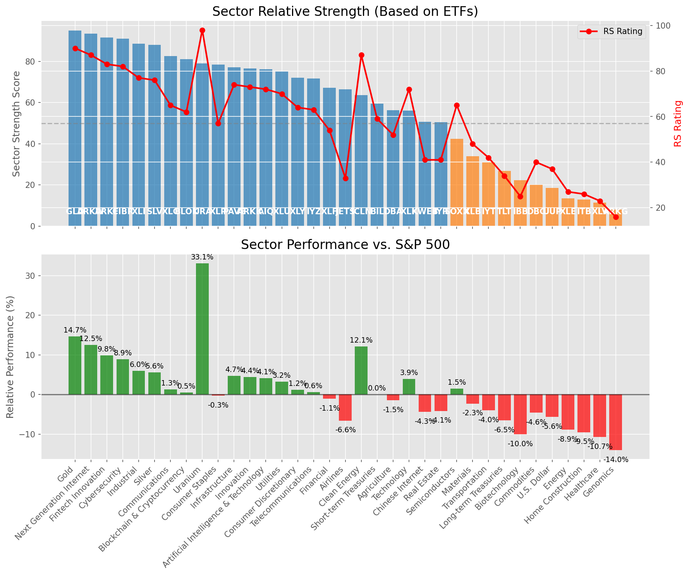

# **Daily Relative Strength Report**

**Date:** 2025-05-28

## **Market Valuation (Buffett Indicator)**

| Metric | Value |
|--------|-------|
| **Market Valuation** | **Fair Valued** |
| **Current Ratio** | 9.67 |
| **Historical Mean** | 9.37 |
| **Standard Deviation** | 0.48 |
| **Z-Score (StdDev from Mean)** | 0.70 |
| **Total Market Cap** | $290.02 trillion |
| **GDP** | $29.98 trillion |

## **Market Insights**

### **Market is Fairly Valued**

The market appears to be trading within a reasonable range of historical valuations. This suggests a balanced approach to equity investing is appropriate. Investors should:

- Focus on individual stock selection based on fundamentals and technicals
- Maintain normal equity allocations aligned with long-term goals
- Pay attention to sector rotation and relative strength
- Watch for changes in market leadership

Fair valuation typically suggests normal market returns can be expected, with stock selection becoming increasingly important.

### **Buffett Indicator Overview**

The Buffett Indicator (Total Market Cap / GDP) is a measure of the stock market's valuation relative to the size of the economy. It is named after Warren Buffett, who described it as "probably the best single measure of where valuations stand at any given moment."

- **Values above +2 standard deviations:** Market significantly overvalued
- **Values above +1 standard deviation:** Market overvalued
- **Values between -1 and +1 standard deviations:** Market fairly valued
- **Values below -1 standard deviation:** Market undervalued
- **Values below -2 standard deviations:** Market significantly undervalued

---

## **Sector Relative Strength**

Based on William O'Neil's Relative Strength Methodology

| ETF | Strength | RS Rating | Performance | Above Key MAs | Trend | Sector |
|-----|----------|-----------|-------------|--------------|-------|--------|
| [GLD](https://www.tradingview.com/chart/?symbol=GLD) | 95.0 | 90.0 | 14.75% | 10d ✓, 50d ✓, 200d ✓ | ↗️ | Gold |
| [ARKW](https://www.tradingview.com/chart/?symbol=ARKW) | 94.5 | 89.0 | 14.28% | 10d ✓, 50d ✓, 200d ✓ | ↗️ | Next Generation Internet |
| [ARKF](https://www.tradingview.com/chart/?symbol=ARKF) | 91.5 | 83.0 | 9.81% | 10d ✓, 50d ✓, 200d ✓ | ↗️ | Fintech Innovation |
| [CIBR](https://www.tradingview.com/chart/?symbol=CIBR) | 91.0 | 82.0 | 9.08% | 10d ✓, 50d ✓, 200d ✓ | ↗️ | Cybersecurity |
| [XLI](https://www.tradingview.com/chart/?symbol=XLI) | 88.0 | 76.0 | 6.19% | 10d ✓, 50d ✓, 200d ✓ | ↗️ | Industrial |
| [SLV](https://www.tradingview.com/chart/?symbol=SLV) | 87.5 | 75.0 | 5.77% | 10d ✓, 50d ✓, 200d ✓ | ↗️ | Silver |
| [ARKK](https://www.tradingview.com/chart/?symbol=ARKK) | 86.5 | 73.0 | 4.63% | 10d ✓, 50d ✓, 200d ✓ | ↗️ | Innovation |
| [XLY](https://www.tradingview.com/chart/?symbol=XLY) | 82.5 | 65.0 | 1.65% | 10d ✓, 50d ✓, 200d ✓ | ↗️ | Consumer Discretionary |
| [XLC](https://www.tradingview.com/chart/?symbol=XLC) | 82.0 | 64.0 | 1.41% | 10d ✓, 50d ✓, 200d ✓ | ↗️ | Communications |
| [IYZ](https://www.tradingview.com/chart/?symbol=IYZ) | 80.5 | 61.0 | 0.50% | 10d ✓, 50d ✓, 200d ✓ | ↗️ | Telecommunications |
| [XLP](https://www.tradingview.com/chart/?symbol=XLP) | 79.5 | 59.0 | 0.04% | 10d ✓, 50d ✓, 200d ✓ | ↗️ | Consumer Staples |
| [URA](https://www.tradingview.com/chart/?symbol=URA) | 79.0 | 98.0 | 34.34% | 10d ✓, 50d ✓, 200d ✓ | ↘️ | Uranium |
| [PAVE](https://www.tradingview.com/chart/?symbol=PAVE) | 77.1 | 74.0 | 5.16% | 10d ✗, 50d ✓, 200d ✓ | ↗️ | Infrastructure |
| [AIQ](https://www.tradingview.com/chart/?symbol=AIQ) | 76.1 | 72.0 | 4.32% | 10d ✗, 50d ✓, 200d ✓ | ↗️ | Artificial Intelligence & Technology |
| [XLU](https://www.tradingview.com/chart/?symbol=XLU) | 75.1 | 70.0 | 3.52% | 10d ✗, 50d ✓, 200d ✓ | ↗️ | Utilities |
| [BLOK](https://www.tradingview.com/chart/?symbol=BLOK) | 69.6 | 59.0 | -0.06% | 10d ✗, 50d ✓, 200d ✓ | ↗️ | Blockchain & Cryptocurrency |
| [XLF](https://www.tradingview.com/chart/?symbol=XLF) | 67.1 | 54.0 | -0.96% | 10d ✗, 50d ✓, 200d ✓ | ↗️ | Financial |
| [JETS](https://www.tradingview.com/chart/?symbol=JETS) | 66.0 | 32.0 | -6.79% | 10d ✓, 50d ✓, 200d ✓ | ↗️ | Airlines |
| [ICLN](https://www.tradingview.com/chart/?symbol=ICLN) | 63.6 | 87.0 | 12.23% | 10d ✗, 50d ✓, 200d ✓ | ↘️ | Clean Energy |
| [KWEB](https://www.tradingview.com/chart/?symbol=KWEB) | 60.6 | 41.0 | -3.93% | 10d ✗, 50d ✓, 200d ✓ | ↗️ | Chinese Internet |
| [BIL](https://www.tradingview.com/chart/?symbol=BIL) | 59.5 | 59.0 | 0.01% | 10d ✓, 50d ✓, 200d ✓ | ↘️ | Short-term Treasuries |
| [DBA](https://www.tradingview.com/chart/?symbol=DBA) | 56.7 | 53.0 | -1.18% | 10d ✗, 50d ✗, 200d ✓ | ↗️ | Agriculture |
| [XLK](https://www.tradingview.com/chart/?symbol=XLK) | 56.1 | 72.0 | 4.23% | 10d ✗, 50d ✓, 200d ✓ | ↘️ | Technology |
| [IYR](https://www.tradingview.com/chart/?symbol=IYR) | 49.4 | 39.0 | -4.49% | 10d ✗, 50d ✓, 200d ✗ | ↗️ | Real Estate |
| [XLB](https://www.tradingview.com/chart/?symbol=XLB) | 44.8 | 50.0 | -1.65% | 10d ✓, 50d ✓, 200d ✗ | ↘️ | Materials |
| [SOXX](https://www.tradingview.com/chart/?symbol=SOXX) | 42.9 | 66.0 | 1.78% | 10d ✗, 50d ✓, 200d ✗ | ↘️ | Semiconductors |
| [IYT](https://www.tradingview.com/chart/?symbol=IYT) | 29.9 | 40.0 | -4.20% | 10d ✗, 50d ✓, 200d ✗ | ↘️ | Transportation |
| [IBB](https://www.tradingview.com/chart/?symbol=IBB) | 22.4 | 25.0 | -9.59% | 10d ✓, 50d ✗, 200d ✗ | ↘️ | Biotechnology |
| [XLV](https://www.tradingview.com/chart/?symbol=XLV) | 21.4 | 23.0 | -10.37% | 10d ✓, 50d ✗, 200d ✗ | ↘️ | Healthcare |
| [DBC](https://www.tradingview.com/chart/?symbol=DBC) | 20.0 | 40.0 | -4.15% | 10d ✗, 50d ✗, 200d ✗ | ↘️ | Commodities |
| [UUP](https://www.tradingview.com/chart/?symbol=UUP) | 17.5 | 35.0 | -5.74% | 10d ✗, 50d ✗, 200d ✗ | ↘️ | U.S. Dollar |
| [TLT](https://www.tradingview.com/chart/?symbol=TLT) | 16.0 | 32.0 | -6.75% | 10d ✗, 50d ✗, 200d ✗ | ↘️ | Long-term Treasuries |
| [XLE](https://www.tradingview.com/chart/?symbol=XLE) | 14.0 | 28.0 | -8.46% | 10d ✗, 50d ✗, 200d ✗ | ↘️ | Energy |
| [ITB](https://www.tradingview.com/chart/?symbol=ITB) | 13.0 | 26.0 | -8.92% | 10d ✗, 50d ✗, 200d ✗ | ↘️ | Home Construction |
| [ARKG](https://www.tradingview.com/chart/?symbol=ARKG) | 8.5 | 17.0 | -13.69% | 10d ✗, 50d ✗, 200d ✗ | ↘️ | Genomics |

### **Sector ETF Performance Interpretation**

This table shows the relative strength metrics for different market sectors based on their representative ETFs:

- **ETF**: The ETF used to measure sector performance (click for chart)
- **Strength**: Overall sector strength score (0-100) combining multiple factors
- **RS Rating**: O'Neil RS rating of the sector ETF
- **Performance**: Performance of the sector ETF relative to SPY
- **Above Key MAs**: Whether the ETF is trading above its 10, 50, and 200-day moving averages
- **Trend**: Whether the sector is in an uptrend (↗️) or downtrend (↘️)

### **Current Sector Leadership**

The current market leadership is coming from the following sectors: **Gold, Next Generation Internet, Fintech Innovation**.

The **Gold** sector (represented by **GLD**) is showing particularly strong relative strength with an RS rating of 90.0 and performance of 14.75% vs. the S&P 500. This sector is trading above its 10-day, 50-day, 200-day moving average(s). Investors should consider focusing on high RS stocks within these leading sectors for potential outperformance.

---

## **Buy Recommendations**

The following 86 stocks show exceptional relative strength:

| RS Rating | Buy Score | Current Price | Chart | Name | Ticker |
|-----------|-----------|---------------|-------|------|--------|
| 100 | 100 | $208.91 | [Chart](https://www.tradingview.com/chart/?symbol=AGX) | Argan, Inc | AGX |
| 100 | 100 | $43.90 | [Chart](https://www.tradingview.com/chart/?symbol=AU) | AngloGold Ashanti plc | AU |
| 100 | 100 | $23.16 | [Chart](https://www.tradingview.com/chart/?symbol=PRA) | ProAssurance Corporation | PRA |
| 100 | 100 | $209.00 | [Chart](https://www.tradingview.com/chart/?symbol=DAVE) | Dave Inc. Class A Common Stock | DAVE |
| 100 | 100 | $109.64 | [Chart](https://www.tradingview.com/chart/?symbol=SEZL) | Sezzle Inc. Common Stock | SEZL |
| 99 | 100 | $42.40 | [Chart](https://www.tradingview.com/chart/?symbol=DRS) | Leonardo DRS, Inc. Common Stock | DRS |
| 99 | 100 | $37.59 | [Chart](https://www.tradingview.com/chart/?symbol=KTOS) | Kratos Defense & Security Solutions, Inc. | KTOS |
| 99 | 100 | $478.02 | [Chart](https://www.tradingview.com/chart/?symbol=GEV) | GE Vernova Inc. | GEV |
| 99 | 100 | $85.05 | [Chart](https://www.tradingview.com/chart/?symbol=RBLX) | Roblox Corporation | RBLX |
| 99 | 100 | $319.12 | [Chart](https://www.tradingview.com/chart/?symbol=CVNA) | Carvana Co. | CVNA |
| 98 | 100 | $65.19 | [Chart](https://www.tradingview.com/chart/?symbol=HOOD) | Robinhood Markets, Inc. Class A Common Stock | HOOD |
| 98 | 100 | $24.86 | [Chart](https://www.tradingview.com/chart/?symbol=OR) | OR Royalties Inc. | OR |
| 98 | 100 | $163.90 | [Chart](https://www.tradingview.com/chart/?symbol=PLMR) | Palomar Holdings, Inc. Common stock | PLMR |
| 98 | 100 | $26.86 | [Chart](https://www.tradingview.com/chart/?symbol=UVE) | UNIVERSAL INSURANCE HLDG, INC. | UVE |
| 98 | 100 | $71.74 | [Chart](https://www.tradingview.com/chart/?symbol=ULS) | UL Solutions Inc. | ULS |
| 98 | 100 | $37.83 | [Chart](https://www.tradingview.com/chart/?symbol=AS) | Amer Sports, Inc. | AS |
| 98 | 100 | $56.87 | [Chart](https://www.tradingview.com/chart/?symbol=SHLD) | Global X Defense Tech ETF | SHLD |
| 97 | 100 | $60.91 | [Chart](https://www.tradingview.com/chart/?symbol=IBIT) | iShares Bitcoin Trust ETF | IBIT |
| 97 | 100 | $30.31 | [Chart](https://www.tradingview.com/chart/?symbol=HODL) | VanEck Bitcoin ETF | HODL |
| 97 | 100 | $19.59 | [Chart](https://www.tradingview.com/chart/?symbol=SPNT) | SiriusPoint Ltd. | SPNT |
| 97 | 100 | $42.18 | [Chart](https://www.tradingview.com/chart/?symbol=FARO) | Faro Technologies Inc | FARO |
| 97 | 100 | $47.49 | [Chart](https://www.tradingview.com/chart/?symbol=BTC) | Grayscale Bitcoin Mini Trust ETF | BTC |
| 96 | 100 | $170.48 | [Chart](https://www.tradingview.com/chart/?symbol=HWM) | Howmet Aerospace Inc. | HWM |
| 96 | 100 | $139.01 | [Chart](https://www.tradingview.com/chart/?symbol=UGL) | ProShares Ultra Gold | UGL |
| 96 | 100 | $19.13 | [Chart](https://www.tradingview.com/chart/?symbol=MIR) | Mirion Technologies, Inc. | MIR |
| 96 | 100 | $32.42 | [Chart](https://www.tradingview.com/chart/?symbol=PRDO) | Perdoceo Education Corporation | PRDO |
| 96 | 100 | $1210.13 | [Chart](https://www.tradingview.com/chart/?symbol=NFLX) | NetFlix Inc | NFLX |
| 96 | 100 | $35.56 | [Chart](https://www.tradingview.com/chart/?symbol=UTI) | Universal Technical Institute, Inc. | UTI |
| 95 | 100 | $116.63 | [Chart](https://www.tradingview.com/chart/?symbol=AEM) | Agnico Eagle Mines Ltd. | AEM |
| 95 | 100 | $85.12 | [Chart](https://www.tradingview.com/chart/?symbol=WPM) | Wheaton Precious Metals Corp. Common Stock | WPM |
| 95 | 100 | $21.56 | [Chart](https://www.tradingview.com/chart/?symbol=TFPM) | Triple Flag Precious Metals Corp. | TFPM |
| 94 | 100 | $154.15 | [Chart](https://www.tradingview.com/chart/?symbol=CAH) | Cardinal Health, Inc. | CAH |
| 94 | 100 | $244.05 | [Chart](https://www.tradingview.com/chart/?symbol=GE) | GE Aerospace | GE |
| 93 | 100 | $42.96 | [Chart](https://www.tradingview.com/chart/?symbol=EWP) | iShares MSCI Spain ETF | EWP |
| 93 | 100 | $238.37 | [Chart](https://www.tradingview.com/chart/?symbol=CRS) | Carpenter Technology Corp | CRS |
| 93 | 100 | $381.49 | [Chart](https://www.tradingview.com/chart/?symbol=APP) | Applovin Corporation Class A Common Stock | APP |
| 93 | 100 | $30.95 | [Chart](https://www.tradingview.com/chart/?symbol=NTGR) | NETGEAR, Inc. | NTGR |
| 93 | 100 | $100.93 | [Chart](https://www.tradingview.com/chart/?symbol=JCI) | Johnson Controls International plc | JCI |
| 92 | 100 | $64.29 | [Chart](https://www.tradingview.com/chart/?symbol=SLF) | Sun Life Financial Inc. | SLF |
| 92 | 100 | $178.68 | [Chart](https://www.tradingview.com/chart/?symbol=RGLD) | Royal Gold Inc | RGLD |
| 92 | 100 | $132.15 | [Chart](https://www.tradingview.com/chart/?symbol=COOP) | Mr. Cooper Group Inc. Common Stock | COOP |
| 92 | 100 | $73.51 | [Chart](https://www.tradingview.com/chart/?symbol=WRB) | W.R. Berkley Corporation | WRB |
| 91 | 100 | $178.74 | [Chart](https://www.tradingview.com/chart/?symbol=PM) | Philip Morris International Inc. | PM |
| 91 | 100 | $41.81 | [Chart](https://www.tradingview.com/chart/?symbol=EWG) | iShares MSCI Germany ETF | EWG |
| 91 | 100 | $44.95 | [Chart](https://www.tradingview.com/chart/?symbol=BTI) | British American Tobacco p.l.c. American Depositary Shares, American Depositary Shares, each representing one Ordinary Share | BTI |
| 91 | 100 | $34.69 | [Chart](https://www.tradingview.com/chart/?symbol=FDP) | Fresh Del Monte Produce Inc. | FDP |
| 90 | 100 | $31.46 | [Chart](https://www.tradingview.com/chart/?symbol=SGOL) | abrdn Physical Gold Shares ETF | SGOL |
| 90 | 100 | $304.00 | [Chart](https://www.tradingview.com/chart/?symbol=GLD) | SPDR Gold Trust, SPDR Gold Shares | GLD |
| 90 | 100 | $62.20 | [Chart](https://www.tradingview.com/chart/?symbol=IAU) | iShares Gold Trust | IAU |
| 90 | 100 | $175.50 | [Chart](https://www.tradingview.com/chart/?symbol=ITA) | iShares U.S. Aerospace & Defense ETF | ITA |
| 90 | 100 | $65.33 | [Chart](https://www.tradingview.com/chart/?symbol=GLDM) | SPDR Gold MiniShares | GLDM |
| 90 | 100 | $54.91 | [Chart](https://www.tradingview.com/chart/?symbol=RELX) | RELX PLC | RELX |
| 89 | 100 | $31.80 | [Chart](https://www.tradingview.com/chart/?symbol=OUNZ) | VanEck Merk Gold ETF | OUNZ |
| 89 | 100 | $32.59 | [Chart](https://www.tradingview.com/chart/?symbol=AAAU) | Goldman Sachs Physical Gold ETF Shares | AAAU |
| 89 | 100 | $207.68 | [Chart](https://www.tradingview.com/chart/?symbol=BAP) | Credicorp LTD | BAP |
| 89 | 100 | $285.80 | [Chart](https://www.tradingview.com/chart/?symbol=CME) | CME Group Inc. | CME |
| 89 | 100 | $32.89 | [Chart](https://www.tradingview.com/chart/?symbol=IAUM) | iShares Gold Trust Micro | IAUM |
| 88 | 100 | $25.16 | [Chart](https://www.tradingview.com/chart/?symbol=PHYS) | Sprott Physical Gold Trust | PHYS |
| 88 | 100 | $49.10 | [Chart](https://www.tradingview.com/chart/?symbol=MRCY) | Mercury Systems Inc. | MRCY |
| 88 | 100 | $72.26 | [Chart](https://www.tradingview.com/chart/?symbol=EBAY) | eBay Inc | EBAY |
| 87 | 100 | $662.19 | [Chart](https://www.tradingview.com/chart/?symbol=SPOT) | Spotify Technology S.A. | SPOT |
| 87 | 100 | $23.71 | [Chart](https://www.tradingview.com/chart/?symbol=SRAD) | Sportradar Group AG Class A Ordinary Shares | SRAD |
| 87 | 100 | $83.17 | [Chart](https://www.tradingview.com/chart/?symbol=NFG) | National Fuel Gas Co. | NFG |
| 87 | 100 | $17.62 | [Chart](https://www.tradingview.com/chart/?symbol=BCS) | Barclays PLC | BCS |
| 88 | 99 | $105.07 | [Chart](https://www.tradingview.com/chart/?symbol=DTM) | DT Midstream, Inc. | DTM |
| 86 | 99 | $49.62 | [Chart](https://www.tradingview.com/chart/?symbol=GFL) | GFL Environmental Inc. Subordinate Voting Shares | GFL |
| 85 | 98 | $29.09 | [Chart](https://www.tradingview.com/chart/?symbol=CEF) | Sprott Physical Gold and Silver Trust | CEF |
| 85 | 98 | $56.58 | [Chart](https://www.tradingview.com/chart/?symbol=TXNM) | TXNM Energy, Inc. | TXNM |
| 87 | 97 | $231.26 | [Chart](https://www.tradingview.com/chart/?symbol=CBOE) | Cboe Global Markets, Inc. | CBOE |
| 87 | 97 | $59.78 | [Chart](https://www.tradingview.com/chart/?symbol=UVV) | Universal Corporation | UVV |
| 87 | 97 | $49.92 | [Chart](https://www.tradingview.com/chart/?symbol=TRP) | TC Energy Corporation | TRP |
| 82 | 96 | $102.66 | [Chart](https://www.tradingview.com/chart/?symbol=AXS) | Axis Capital Holders Limited | AXS |
| 84 | 95 | $58.97 | [Chart](https://www.tradingview.com/chart/?symbol=IGF) | iShares Global Infrastructure ETF | IGF |
| 83 | 95 | $196.84 | [Chart](https://www.tradingview.com/chart/?symbol=LOPE) | Grand Canyon Education, Inc | LOPE |
| 82 | 95 | $213.46 | [Chart](https://www.tradingview.com/chart/?symbol=DRI) | Darden Restaurants, Inc. | DRI |
| 81 | 95 | $87.72 | [Chart](https://www.tradingview.com/chart/?symbol=SNEX) | StoneX Group Inc. Common Stock | SNEX |
| 84 | 94 | $48.53 | [Chart](https://www.tradingview.com/chart/?symbol=FTS) | Fortis Inc. Common Shares | FTS |
| 82 | 94 | $71.51 | [Chart](https://www.tradingview.com/chart/?symbol=CIBR) | First Trust Exchange-Traded Fund II First Trust NASDAQ Cybersecurity ETF | CIBR |
| 81 | 94 | $253.31 | [Chart](https://www.tradingview.com/chart/?symbol=RSG) | Republic Services Inc. | RSG |
| 83 | 93 | $41.08 | [Chart](https://www.tradingview.com/chart/?symbol=ARKF) | ARK Fintech Innovation ETF | ARKF |
| 81 | 92 | $315.77 | [Chart](https://www.tradingview.com/chart/?symbol=VRSK) | Verisk Analytics, Inc. Common Stock | VRSK |
| 80 | 92 | $43.89 | [Chart](https://www.tradingview.com/chart/?symbol=HMN) | Horace Mann Educators Corporation | HMN |
| 81 | 91 | $85.99 | [Chart](https://www.tradingview.com/chart/?symbol=SEIC) | SEI Investments Co | SEIC |
| 80 | 90 | $117.00 | [Chart](https://www.tradingview.com/chart/?symbol=CLS) | Celestica, Inc. | CLS |
| 80 | 90 | $5451.74 | [Chart](https://www.tradingview.com/chart/?symbol=BKNG) | Booking Holdings Inc. Common Stock | BKNG |
| 80 | 90 | $78.40 | [Chart](https://www.tradingview.com/chart/?symbol=BBCA) | JPMorgan BetaBuilders Canada ETF | BBCA |

---

## **Sell Recommendations**

The following 128 stocks show deteriorating relative strength:

| RS Rating | Sell Score | Current Price | Chart | Name | Ticker |
|-----------|------------|---------------|-------|------|--------|
| 1 | 100 | $10.14 | [Chart](https://www.tradingview.com/chart/?symbol=NRIX) | Nurix Therapeutics, Inc. Common stock | NRIX |
| 1 | 100 | $15.48 | [Chart](https://www.tradingview.com/chart/?symbol=VTLE) | Vital Energy, Inc. | VTLE |
| 1 | 100 | $13.12 | [Chart](https://www.tradingview.com/chart/?symbol=IART) | Integra LifeSciences Holdings | IART |
| 2 | 100 | $17.03 | [Chart](https://www.tradingview.com/chart/?symbol=BEAM) | Beam Therapeutics Inc. Common Stock | BEAM |
| 2 | 100 | $13.99 | [Chart](https://www.tradingview.com/chart/?symbol=DQ) | Daqo New Energy Corp. American Depositary Shares (each representing 5 Ordinary Shares) | DQ |
| 3 | 100 | $11.68 | [Chart](https://www.tradingview.com/chart/?symbol=LBRT) | Liberty Energy Inc. | LBRT |
| 3 | 100 | $17.12 | [Chart](https://www.tradingview.com/chart/?symbol=FWRD) | Forward Air Corp | FWRD |
| 4 | 100 | $10.31 | [Chart](https://www.tradingview.com/chart/?symbol=VREX) | Varex Imaging Corporation Common Stock | VREX |
| 4 | 100 | $23.73 | [Chart](https://www.tradingview.com/chart/?symbol=SM) | SM Energy Company | SM |
| 4 | 100 | $18.38 | [Chart](https://www.tradingview.com/chart/?symbol=NVDS) | Investment Managers Series Trust II Tradr 1.5X Short NVDA Daily ETF | NVDS |
| 4 | 100 | $126.45 | [Chart](https://www.tradingview.com/chart/?symbol=KRYS) | Krystal Biotech, Inc. Common Stock | KRYS |
| 4 | 100 | $13.19 | [Chart](https://www.tradingview.com/chart/?symbol=DNLI) | Denali Therapeutics Inc. Common Stock | DNLI |
| 4 | 100 | $14.49 | [Chart](https://www.tradingview.com/chart/?symbol=IMVT) | Immunovant, Inc. Common Stock | IMVT |
| 5 | 100 | $29.16 | [Chart](https://www.tradingview.com/chart/?symbol=SRDX) | Surmodics, Inc. Common Stock | SRDX |
| 5 | 100 | $58.37 | [Chart](https://www.tradingview.com/chart/?symbol=ALB) | Albemarle Corporation | ALB |
| 5 | 100 | $28.67 | [Chart](https://www.tradingview.com/chart/?symbol=TWST) | Twist Bioscience Corporation Common Stock | TWST |
| 6 | 100 | $11.23 | [Chart](https://www.tradingview.com/chart/?symbol=CLB) | Core Laboratories Inc. | CLB |
| 6 | 100 | $15.30 | [Chart](https://www.tradingview.com/chart/?symbol=PENN) | PENN Entertainment, Inc. Common Stock | PENN |
| 6 | 100 | $12.03 | [Chart](https://www.tradingview.com/chart/?symbol=ARCT) | Arcturus Therapeutics Holdings Inc. Common Stock | ARCT |
| 6 | 100 | $33.06 | [Chart](https://www.tradingview.com/chart/?symbol=MBIN) | Merchants Bancorp Common Stock | MBIN |
| 6 | 100 | $44.63 | [Chart](https://www.tradingview.com/chart/?symbol=LINE) | Lineage, Inc. Common Stock | LINE |
| 7 | 100 | $17.32 | [Chart](https://www.tradingview.com/chart/?symbol=VRNT) | Verint Systems Inc | VRNT |
| 7 | 100 | $120.55 | [Chart](https://www.tradingview.com/chart/?symbol=RGEN) | Repligen Corp | RGEN |
| 7 | 100 | $23.22 | [Chart](https://www.tradingview.com/chart/?symbol=RPD) | Rapid7, Inc. Common Stock | RPD |
| 7 | 100 | $21.06 | [Chart](https://www.tradingview.com/chart/?symbol=AMRK) | A-Mark Precious Metals, Inc. | AMRK |
| 7 | 100 | $79.54 | [Chart](https://www.tradingview.com/chart/?symbol=WHR) | Whirlpool Corp. | WHR |
| 8 | 100 | $46.03 | [Chart](https://www.tradingview.com/chart/?symbol=RHI) | Robert Half Inc. | RHI |
| 9 | 100 | $13.04 | [Chart](https://www.tradingview.com/chart/?symbol=AVTR) | Avantor, Inc. | AVTR |
| 9 | 100 | $18.87 | [Chart](https://www.tradingview.com/chart/?symbol=PDFS) | PDF Solutions Inc | PDFS |
| 10 | 100 | $91.15 | [Chart](https://www.tradingview.com/chart/?symbol=CHRD) | Chord Energy Corporation Common Stock | CHRD |
| 11 | 100 | $50.17 | [Chart](https://www.tradingview.com/chart/?symbol=ASH) | Ashland Inc. | ASH |
| 11 | 100 | $12.27 | [Chart](https://www.tradingview.com/chart/?symbol=NOV) | NOV Inc. | NOV |
| 11 | 100 | $41.06 | [Chart](https://www.tradingview.com/chart/?symbol=ASO) | Academy Sports and Outdoors, Inc. | ASO |
| 12 | 100 | $10.34 | [Chart](https://www.tradingview.com/chart/?symbol=CMRE) | Costamare Inc. | CMRE |
| 12 | 100 | $15.17 | [Chart](https://www.tradingview.com/chart/?symbol=DXC) | DXC Technology Company | DXC |
| 14 | 100 | $35.29 | [Chart](https://www.tradingview.com/chart/?symbol=RARE) | Ultragenyx Pharmaceutical Inc. | RARE |
| 9 | 99 | $55.29 | [Chart](https://www.tradingview.com/chart/?symbol=ASGN) | ASGN Incorporated | ASGN |
| 12 | 99 | $219.61 | [Chart](https://www.tradingview.com/chart/?symbol=OIH) | VanEck Oil Services ETF | OIH |
| 13 | 99 | $52.36 | [Chart](https://www.tradingview.com/chart/?symbol=HXL) | Hexcel Corporation | HXL |
| 3 | 98 | $28.38 | [Chart](https://www.tradingview.com/chart/?symbol=DOCN) | DigitalOcean Holdings, Inc. | DOCN |
| 5 | 98 | $10.50 | [Chart](https://www.tradingview.com/chart/?symbol=SONO) | Sonos, Inc. Common Stock | SONO |
| 7 | 98 | $10.04 | [Chart](https://www.tradingview.com/chart/?symbol=CWK) | Cushman & Wakefield plc Ordinary Shares | CWK |
| 9 | 98 | $48.00 | [Chart](https://www.tradingview.com/chart/?symbol=ERX) | Direxion Daily Energy Bull 2X Shares | ERX |
| 12 | 98 | $26.51 | [Chart](https://www.tradingview.com/chart/?symbol=WERN) | Werner Enterprises Inc | WERN |
| 14 | 98 | $58.37 | [Chart](https://www.tradingview.com/chart/?symbol=BMRN) | BioMarin Pharmaceuticals Inc | BMRN |
| 16 | 98 | $14.37 | [Chart](https://www.tradingview.com/chart/?symbol=HR) | Healthcare Realty Trust Incorporated | HR |
| 4 | 97 | $75.46 | [Chart](https://www.tradingview.com/chart/?symbol=GPN) | Global Payments, Inc. | GPN |
| 9 | 97 | $21.32 | [Chart](https://www.tradingview.com/chart/?symbol=UCO) | ProShares Ultra Bloomberg Crude Oil | UCO |
| 14 | 97 | $201.13 | [Chart](https://www.tradingview.com/chart/?symbol=AAPL) | Apple Inc. | AAPL |
| 15 | 97 | $17.39 | [Chart](https://www.tradingview.com/chart/?symbol=APA) | APA Corporation Common Stock | APA |
| 4 | 96 | $143.15 | [Chart](https://www.tradingview.com/chart/?symbol=INSP) | Inspire Medical Systems, Inc. | INSP |
| 9 | 96 | $11.12 | [Chart](https://www.tradingview.com/chart/?symbol=VYX) | NCR Voyix Corporation | VYX |
| 8 | 95 | $14.51 | [Chart](https://www.tradingview.com/chart/?symbol=INMD) | InMode Ltd. Ordinary Shares | INMD |
| 25 | 95 | $14.78 | [Chart](https://www.tradingview.com/chart/?symbol=FXN) | First Trust Energy AlphaDEX Fund | FXN |
| 9 | 94 | $31.95 | [Chart](https://www.tradingview.com/chart/?symbol=SQM) | Sociedad Quimica y Minera de Chile SA | SQM |
| 10 | 94 | $11.77 | [Chart](https://www.tradingview.com/chart/?symbol=APLE) | Apple Hospitality REIT, Inc. | APLE |
| 13 | 94 | $28.59 | [Chart](https://www.tradingview.com/chart/?symbol=QID) | ProShares UltraShort QQQ | QID |
| 16 | 94 | $32.30 | [Chart](https://www.tradingview.com/chart/?symbol=TENB) | Tenable Holdings, Inc. | TENB |
| 19 | 94 | $30.68 | [Chart](https://www.tradingview.com/chart/?symbol=BAX) | Baxter International Inc. | BAX |
| 19 | 94 | $105.35 | [Chart](https://www.tradingview.com/chart/?symbol=LEN) | Lennar Corporation Class A | LEN |
| 9 | 93 | $70.83 | [Chart](https://www.tradingview.com/chart/?symbol=GEHC) | GE HealthCare Technologies Inc. Common Stock | GEHC |
| 13 | 93 | $25.99 | [Chart](https://www.tradingview.com/chart/?symbol=TRN) | Trinity Industries, Inc. | TRN |
| 15 | 93 | $41.36 | [Chart](https://www.tradingview.com/chart/?symbol=OXY) | Occidental Petroleum Corporation | OXY |
| 12 | 92 | $56.30 | [Chart](https://www.tradingview.com/chart/?symbol=TRNO) | Terreno Realty Corporation | TRNO |
| 15 | 92 | $51.83 | [Chart](https://www.tradingview.com/chart/?symbol=KBH) | KB Home | KBH |
| 9 | 91 | $42.07 | [Chart](https://www.tradingview.com/chart/?symbol=VCEL) | Vericel Corporation | VCEL |
| 12 | 91 | $91.49 | [Chart](https://www.tradingview.com/chart/?symbol=RVTY) | Revvity, Inc. | RVTY |
| 15 | 91 | $10.06 | [Chart](https://www.tradingview.com/chart/?symbol=SEMR) | SEMrush Holdings, Inc. | SEMR |
| 18 | 91 | $11.76 | [Chart](https://www.tradingview.com/chart/?symbol=PBR) | PETROLEO BRASILEIRO S.A.-PETROBRAS ADS (REP 1 COMMON SHARE) | PBR |
| 19 | 91 | $10.02 | [Chart](https://www.tradingview.com/chart/?symbol=LBTYK) | Liberty Global Ltd. Class C Common Shares | LBTYK |
| 21 | 90 | $11.05 | [Chart](https://www.tradingview.com/chart/?symbol=PBR.A) | Petroleo Brasileiro S.A.-Petrobras | PBR.A |
| 25 | 90 | $14.39 | [Chart](https://www.tradingview.com/chart/?symbol=OCSL) | Oaktree Specialty Lending Corporation | OCSL |
| 17 | 89 | $21.18 | [Chart](https://www.tradingview.com/chart/?symbol=ARKG) | ARK Genomic Revolution ETF | ARKG |
| 18 | 89 | $11.11 | [Chart](https://www.tradingview.com/chart/?symbol=NEWT) | NewtekOne, Inc. Common Stock | NEWT |
| 18 | 89 | $30.91 | [Chart](https://www.tradingview.com/chart/?symbol=ZSL) | ProShares UltraShort Silver | ZSL |
| 18 | 89 | $10.21 | [Chart](https://www.tradingview.com/chart/?symbol=HOPE) | Hope Bancorp, Inc. | HOPE |
| 24 | 89 | $37.36 | [Chart](https://www.tradingview.com/chart/?symbol=LIT) | Global X Lithium & Battery Tech ETF | LIT |
| 14 | 88 | $110.77 | [Chart](https://www.tradingview.com/chart/?symbol=EOG) | EOG Resources, Inc. | EOG |
| 16 | 88 | $89.54 | [Chart](https://www.tradingview.com/chart/?symbol=BCC) | Boise Cascade Company | BCC |
| 17 | 88 | $22.70 | [Chart](https://www.tradingview.com/chart/?symbol=GPK) | Graphic Packaging Holding Company | GPK |
| 20 | 88 | $65.81 | [Chart](https://www.tradingview.com/chart/?symbol=MTH) | Meritage Homes Corporation | MTH |
| 21 | 88 | $18.02 | [Chart](https://www.tradingview.com/chart/?symbol=UE) | UBRAN EDGE PROPERTIES | UE |
| 16 | 87 | $25.79 | [Chart](https://www.tradingview.com/chart/?symbol=WY) | Weyerhaeuser Company | WY |
| 16 | 87 | $48.76 | [Chart](https://www.tradingview.com/chart/?symbol=FR) | First Industrial Realty Trust, Inc. | FR |
| 19 | 87 | $84.39 | [Chart](https://www.tradingview.com/chart/?symbol=BCO) | The Brink's Company | BCO |
| 21 | 87 | $12.62 | [Chart](https://www.tradingview.com/chart/?symbol=DBO) | Invesco DB Oil Fund | DBO |
| 27 | 87 | $16.04 | [Chart](https://www.tradingview.com/chart/?symbol=PD) | PagerDuty, Inc. | PD |
| 29 | 87 | $10.79 | [Chart](https://www.tradingview.com/chart/?symbol=NMFC) | NEW MOUNTAIN FINANCE CORPORATION | NMFC |
| 17 | 86 | $12.41 | [Chart](https://www.tradingview.com/chart/?symbol=PMT) | PennyMac Mortgage Investment Trust | PMT |
| 20 | 86 | $104.59 | [Chart](https://www.tradingview.com/chart/?symbol=MHK) | Mohawk Industries, Inc. | MHK |
| 24 | 86 | $17.48 | [Chart](https://www.tradingview.com/chart/?symbol=STR) | Sitio Royalties Corp. | STR |
| 28 | 86 | $27.66 | [Chart](https://www.tradingview.com/chart/?symbol=TX) | Ternium S.A. American Depositary Shares | TX |
| 19 | 84 | $28.93 | [Chart](https://www.tradingview.com/chart/?symbol=BP) | BP p.l.c. | BP |
| 24 | 83 | $36.49 | [Chart](https://www.tradingview.com/chart/?symbol=STBA) | S&T Bancorp Inc | STBA |
| 32 | 83 | $35.59 | [Chart](https://www.tradingview.com/chart/?symbol=SU) | Suncor Energy, Inc. | SU |
| 22 | 82 | $10.47 | [Chart](https://www.tradingview.com/chart/?symbol=AVO) | Mission Produce, Inc. Common Stock | AVO |
| 23 | 81 | $13.56 | [Chart](https://www.tradingview.com/chart/?symbol=BSM) | Black Stone Minerals, L.P. | BSM |
| 25 | 81 | $16.47 | [Chart](https://www.tradingview.com/chart/?symbol=MLNK) | MeridianLink, Inc. | MLNK |
| 28 | 81 | $13.27 | [Chart](https://www.tradingview.com/chart/?symbol=MRTN) | Marten Transport Ltd | MRTN |
| 29 | 81 | $189.69 | [Chart](https://www.tradingview.com/chart/?symbol=DHR) | Danaher Corporation | DHR |
| 23 | 80 | $20.52 | [Chart](https://www.tradingview.com/chart/?symbol=PGNY) | Progyny, Inc. Common Stock | PGNY |
| 25 | 80 | $15.79 | [Chart](https://www.tradingview.com/chart/?symbol=ELME) | Elme Communities | ELME |
| 26 | 80 | $38.58 | [Chart](https://www.tradingview.com/chart/?symbol=MLTX) | MoonLake Immunotherapeutics Class A Ordinary Shares | MLTX |
| 30 | 80 | $11.88 | [Chart](https://www.tradingview.com/chart/?symbol=NVG) | Nuveen AMT-Free Municipal Credit Income Fund | NVG |
| 23 | 79 | $131.81 | [Chart](https://www.tradingview.com/chart/?symbol=HES) | Hess Corporation | HES |
| 24 | 79 | $14.25 | [Chart](https://www.tradingview.com/chart/?symbol=BMEZ) | BlackRock Health Sciences Term Trust | BMEZ |
| 28 | 79 | $82.03 | [Chart](https://www.tradingview.com/chart/?symbol=XLE) | Energy Select Sector SPDR Fund | XLE |
| 32 | 79 | $10.54 | [Chart](https://www.tradingview.com/chart/?symbol=CELC) | Celcuity Inc. Common Stock | CELC |
| 26 | 78 | $121.19 | [Chart](https://www.tradingview.com/chart/?symbol=SUI) | Sun Communities, Inc | SUI |
| 31 | 78 | $281.87 | [Chart](https://www.tradingview.com/chart/?symbol=BLD) | TopBuild Corp. Common Stock | BLD |
| 32 | 78 | $14.97 | [Chart](https://www.tradingview.com/chart/?symbol=VRE) | Veris Residential, Inc. | VRE |
| 25 | 77 | $49.58 | [Chart](https://www.tradingview.com/chart/?symbol=TSCO) | Tractor Supply Co | TSCO |
| 30 | 77 | $12.31 | [Chart](https://www.tradingview.com/chart/?symbol=WSR) | Whitestone REIT | WSR |
| 33 | 76 | $22.02 | [Chart](https://www.tradingview.com/chart/?symbol=MGY) | Magnolia Oil & Gas Corporation Class A Common Stock | MGY |
| 31 | 75 | $102.29 | [Chart](https://www.tradingview.com/chart/?symbol=XOM) | Exxon Mobil Corporation | XOM |
| 27 | 74 | $223.46 | [Chart](https://www.tradingview.com/chart/?symbol=UNP) | Union Pacific Corp. | UNP |
| 34 | 74 | $10.48 | [Chart](https://www.tradingview.com/chart/?symbol=MYI) | BLACKROCK MUNIYIELD QUALITY FUND III, INC. | MYI |
| 27 | 73 | $55.67 | [Chart](https://www.tradingview.com/chart/?symbol=TSN) | Tyson Foods, Inc. | TSN |
| 35 | 73 | $10.88 | [Chart](https://www.tradingview.com/chart/?symbol=LBTYA) | Liberty Global Ltd. Class A Common Shares | LBTYA |
| 31 | 72 | $38.62 | [Chart](https://www.tradingview.com/chart/?symbol=KSA) | iShares MSCI Saudi Arabia ETF | KSA |
| 31 | 72 | $63.53 | [Chart](https://www.tradingview.com/chart/?symbol=ELS) | Equity Lifestyle Properties, Inc. | ELS |
| 33 | 71 | $11.87 | [Chart](https://www.tradingview.com/chart/?symbol=NZF) | Nuveen Municipal Credit Income Fund | NZF |
| 35 | 70 | $25.69 | [Chart](https://www.tradingview.com/chart/?symbol=SPTL) | SPDR Portfolio Long Term Treasury ETF | SPTL |
| 32 | 68 | $18.43 | [Chart](https://www.tradingview.com/chart/?symbol=PDI) | PIMCO Dynamic Income Fund | PDI |
| 38 | 68 | $29.72 | [Chart](https://www.tradingview.com/chart/?symbol=TPH) | Tri Pointe Homes, Inc. | TPH |
| 33 | 67 | $14.55 | [Chart](https://www.tradingview.com/chart/?symbol=GOF) | Guggenheim Strategic Opportunities Fund | GOF |
| 35 | 67 | $94.94 | [Chart](https://www.tradingview.com/chart/?symbol=XHB) | SPDR S&P Homebuilders ETF | XHB |
| 35 | 65 | $27.58 | [Chart](https://www.tradingview.com/chart/?symbol=UUP) | Invesco DB US Dollar Index Bullish Fund | UUP |

## **Methodology**

This report uses William O'Neil's relative strength methodology from Investors Business Daily:

* **RS Rating**: Percentile rank of stock's performance vs. S&P 500 over the past 63 trading days (1-99 scale)
* **Buy Criteria**: RS Rating >= 80, price above 50-day MA, strong uptrend, increasing volume
* **Sell Criteria**: RS Rating < 40, price below 50-day MA, downtrend, decreasing volume

### **O'Neil's Key Principles**

1. **Focus on relative performance** - stocks outperforming the market
2. **Price trend confirmation** - stock must be in an uptrend
3. **Volume confirmation** - strong volume supports price moves
4. **Moving average validation** - price above key moving averages
5. **Market leaders only** - concentrate on top-performing stocks

*Report generated automatically after market close*