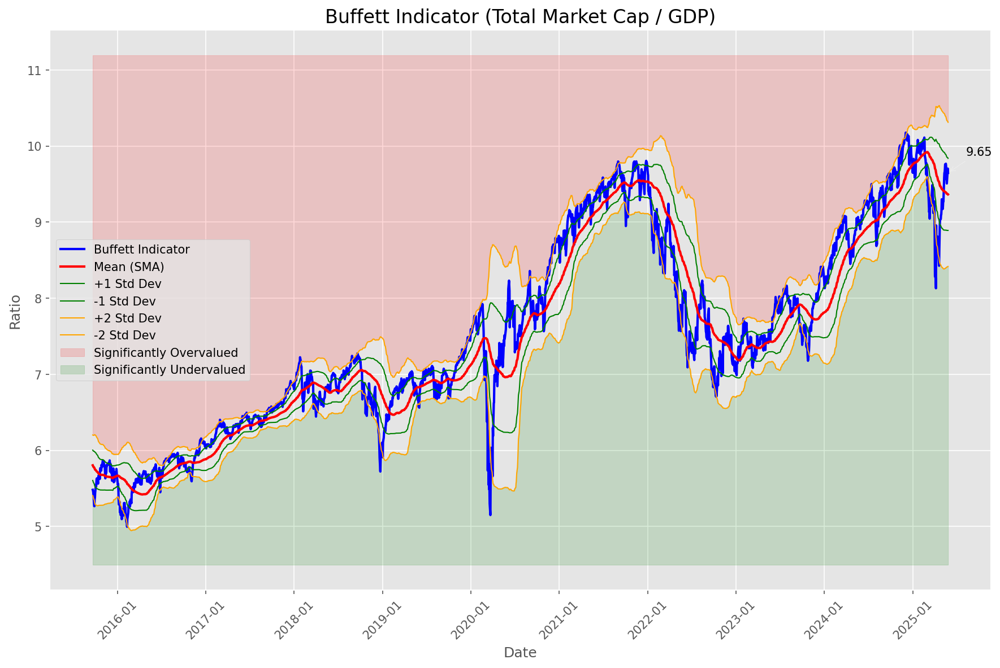
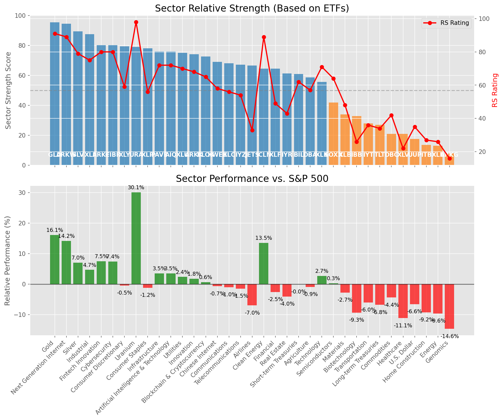

# **Daily Relative Strength Report**

**Date:** 2025-05-29

## **Market Valuation (Buffett Indicator)**

| Metric | Value |
|--------|-------|
| **Market Valuation** | **Fair Valued** |
| **Current Ratio** | 9.66 |
| **Historical Mean** | 9.37 |
| **Standard Deviation** | 0.47 |
| **Z-Score (StdDev from Mean)** | 0.60 |
| **Total Market Cap** | $289.62 trillion |
| **GDP** | $29.98 trillion |

## **Market Insights**

### **Market is Fairly Valued**

The market appears to be trading within a reasonable range of historical valuations. This suggests a balanced approach to equity investing is appropriate. Investors should:

- Focus on individual stock selection based on fundamentals and technicals
- Maintain normal equity allocations aligned with long-term goals
- Pay attention to sector rotation and relative strength
- Watch for changes in market leadership

Fair valuation typically suggests normal market returns can be expected, with stock selection becoming increasingly important.

### **Buffett Indicator Overview**

The Buffett Indicator (Total Market Cap / GDP) is a measure of the stock market's valuation relative to the size of the economy. It is named after Warren Buffett, who described it as "probably the best single measure of where valuations stand at any given moment."

- **Values above +2 standard deviations:** Market significantly overvalued
- **Values above +1 standard deviation:** Market overvalued
- **Values between -1 and +1 standard deviations:** Market fairly valued
- **Values below -1 standard deviation:** Market undervalued
- **Values below -2 standard deviations:** Market significantly undervalued

---

## **Sector Relative Strength**

Based on William O'Neil's Relative Strength Methodology

| ETF | Strength | RS Rating | Performance | Above Key MAs | Trend | Sector |
|-----|----------|-----------|-------------|--------------|-------|--------|
| [GLD](https://www.tradingview.com/chart/?symbol=GLD) | 96.0 | 92.0 | 16.55% | 10d ✓, 50d ✓, 200d ✓ | ↗️ | Gold |
| [ARKW](https://www.tradingview.com/chart/?symbol=ARKW) | 94.0 | 88.0 | 12.49% | 10d ✓, 50d ✓, 200d ✓ | ↗️ | Next Generation Internet |
| [ARKF](https://www.tradingview.com/chart/?symbol=ARKF) | 90.0 | 80.0 | 7.80% | 10d ✓, 50d ✓, 200d ✓ | ↗️ | Fintech Innovation |
| [SLV](https://www.tradingview.com/chart/?symbol=SLV) | 89.5 | 79.0 | 7.06% | 10d ✓, 50d ✓, 200d ✓ | ↗️ | Silver |
| [CIBR](https://www.tradingview.com/chart/?symbol=CIBR) | 80.1 | 80.0 | 7.31% | 10d ✗, 50d ✓, 200d ✓ | ↗️ | Cybersecurity |
| [XLY](https://www.tradingview.com/chart/?symbol=XLY) | 80.0 | 60.0 | -0.42% | 10d ✓, 50d ✓, 200d ✓ | ↗️ | Consumer Discretionary |
| [URA](https://www.tradingview.com/chart/?symbol=URA) | 78.5 | 97.0 | 30.04% | 10d ✓, 50d ✓, 200d ✓ | ↘️ | Uranium |
| [XLI](https://www.tradingview.com/chart/?symbol=XLI) | 77.1 | 74.0 | 4.39% | 10d ✗, 50d ✓, 200d ✓ | ↗️ | Industrial |
| [AIQ](https://www.tradingview.com/chart/?symbol=AIQ) | 76.6 | 73.0 | 3.51% | 10d ✗, 50d ✓, 200d ✓ | ↗️ | Artificial Intelligence & Technology |
| [PAVE](https://www.tradingview.com/chart/?symbol=PAVE) | 76.1 | 72.0 | 3.13% | 10d ✗, 50d ✓, 200d ✓ | ↗️ | Infrastructure |
| [ARKK](https://www.tradingview.com/chart/?symbol=ARKK) | 74.6 | 69.0 | 2.07% | 10d ✗, 50d ✓, 200d ✓ | ↗️ | Innovation |
| [XLU](https://www.tradingview.com/chart/?symbol=XLU) | 74.6 | 69.0 | 2.04% | 10d ✗, 50d ✓, 200d ✓ | ↗️ | Utilities |
| [BLOK](https://www.tradingview.com/chart/?symbol=BLOK) | 73.1 | 66.0 | 1.11% | 10d ✗, 50d ✓, 200d ✓ | ↗️ | Blockchain & Cryptocurrency |
| [KWEB](https://www.tradingview.com/chart/?symbol=KWEB) | 69.6 | 59.0 | -0.68% | 10d ✗, 50d ✓, 200d ✓ | ↗️ | Chinese Internet |
| [XLC](https://www.tradingview.com/chart/?symbol=XLC) | 67.6 | 55.0 | -1.29% | 10d ✗, 50d ✓, 200d ✓ | ↗️ | Communications |
| [IYZ](https://www.tradingview.com/chart/?symbol=IYZ) | 67.1 | 54.0 | -1.51% | 10d ✗, 50d ✓, 200d ✓ | ↗️ | Telecommunications |
| [XLP](https://www.tradingview.com/chart/?symbol=XLP) | 67.1 | 54.0 | -1.67% | 10d ✗, 50d ✓, 200d ✓ | ↗️ | Consumer Staples |
| [JETS](https://www.tradingview.com/chart/?symbol=JETS) | 67.0 | 34.0 | -6.81% | 10d ✓, 50d ✓, 200d ✓ | ↗️ | Airlines |
| [ICLN](https://www.tradingview.com/chart/?symbol=ICLN) | 64.6 | 89.0 | 13.68% | 10d ✗, 50d ✓, 200d ✓ | ↘️ | Clean Energy |
| [XLF](https://www.tradingview.com/chart/?symbol=XLF) | 64.1 | 48.0 | -3.14% | 10d ✗, 50d ✓, 200d ✓ | ↗️ | Financial |
| [IYR](https://www.tradingview.com/chart/?symbol=IYR) | 61.8 | 44.0 | -4.27% | 10d ✓, 50d ✓, 200d ✗ | ↗️ | Real Estate |
| [BIL](https://www.tradingview.com/chart/?symbol=BIL) | 61.0 | 62.0 | 0.00% | 10d ✓, 50d ✓, 200d ✓ | ↘️ | Short-term Treasuries |
| [DBA](https://www.tradingview.com/chart/?symbol=DBA) | 58.2 | 56.0 | -1.23% | 10d ✗, 50d ✗, 200d ✓ | ↗️ | Agriculture |
| [XLK](https://www.tradingview.com/chart/?symbol=XLK) | 55.6 | 71.0 | 2.69% | 10d ✗, 50d ✓, 200d ✓ | ↘️ | Technology |
| [SOXX](https://www.tradingview.com/chart/?symbol=SOXX) | 51.8 | 64.0 | 0.40% | 10d ✓, 50d ✓, 200d ✗ | ↘️ | Semiconductors |
| [XLB](https://www.tradingview.com/chart/?symbol=XLB) | 33.9 | 48.0 | -3.26% | 10d ✗, 50d ✓, 200d ✗ | ↘️ | Materials |
| [IBB](https://www.tradingview.com/chart/?symbol=IBB) | 32.8 | 26.0 | -9.76% | 10d ✓, 50d ✓, 200d ✗ | ↘️ | Biotechnology |
| [IYT](https://www.tradingview.com/chart/?symbol=IYT) | 27.9 | 36.0 | -6.21% | 10d ✗, 50d ✓, 200d ✗ | ↘️ | Transportation |
| [TLT](https://www.tradingview.com/chart/?symbol=TLT) | 26.9 | 34.0 | -6.90% | 10d ✓, 50d ✗, 200d ✗ | ↘️ | Long-term Treasuries |
| [DBC](https://www.tradingview.com/chart/?symbol=DBC) | 21.5 | 43.0 | -4.36% | 10d ✗, 50d ✗, 200d ✗ | ↘️ | Commodities |
| [UUP](https://www.tradingview.com/chart/?symbol=UUP) | 17.5 | 35.0 | -6.69% | 10d ✗, 50d ✗, 200d ✗ | ↘️ | U.S. Dollar |
| [ITB](https://www.tradingview.com/chart/?symbol=ITB) | 13.0 | 26.0 | -9.81% | 10d ✗, 50d ✗, 200d ✗ | ↘️ | Home Construction |
| [XLE](https://www.tradingview.com/chart/?symbol=XLE) | 12.5 | 25.0 | -10.43% | 10d ✗, 50d ✗, 200d ✗ | ↘️ | Energy |
| [XLV](https://www.tradingview.com/chart/?symbol=XLV) | 11.0 | 22.0 | -11.44% | 10d ✗, 50d ✗, 200d ✗ | ↘️ | Healthcare |
| [ARKG](https://www.tradingview.com/chart/?symbol=ARKG) | 8.5 | 17.0 | -14.72% | 10d ✗, 50d ✗, 200d ✗ | ↘️ | Genomics |

### **Sector ETF Performance Interpretation**

This table shows the relative strength metrics for different market sectors based on their representative ETFs:

- **ETF**: The ETF used to measure sector performance (click for chart)
- **Strength**: Overall sector strength score (0-100) combining multiple factors
- **RS Rating**: O'Neil RS rating of the sector ETF
- **Performance**: Performance of the sector ETF relative to SPY
- **Above Key MAs**: Whether the ETF is trading above its 10, 50, and 200-day moving averages
- **Trend**: Whether the sector is in an uptrend (↗️) or downtrend (↘️)

### **Current Sector Leadership**

The current market leadership is coming from the following sectors: **Gold, Next Generation Internet, Fintech Innovation**.

The **Gold** sector (represented by **GLD**) is showing particularly strong relative strength with an RS rating of 92.0 and performance of 16.55% vs. the S&P 500. This sector is trading above its 10-day, 50-day, 200-day moving average(s). Investors should consider focusing on high RS stocks within these leading sectors for potential outperformance.

---

## **Buy Recommendations**

The following 72 stocks show exceptional relative strength:

| RS Rating | Buy Score | Current Price | Chart | Name | Ticker |
|-----------|-----------|---------------|-------|------|--------|
| 100 | 100 | $43.99 | [Chart](https://www.tradingview.com/chart/?symbol=AU) | AngloGold Ashanti plc | AU |
| 100 | 100 | $111.69 | [Chart](https://www.tradingview.com/chart/?symbol=SEZL) | Sezzle Inc. Common Stock | SEZL |
| 100 | 100 | $208.53 | [Chart](https://www.tradingview.com/chart/?symbol=AGX) | Argan, Inc | AGX |
| 100 | 100 | $207.95 | [Chart](https://www.tradingview.com/chart/?symbol=DAVE) | Dave Inc. Class A Common Stock | DAVE |
| 100 | 100 | $96.45 | [Chart](https://www.tradingview.com/chart/?symbol=RBRK) | Rubrik, Inc. | RBRK |
| 99 | 100 | $41.91 | [Chart](https://www.tradingview.com/chart/?symbol=DRS) | Leonardo DRS, Inc. Common Stock | DRS |
| 99 | 100 | $36.33 | [Chart](https://www.tradingview.com/chart/?symbol=KTOS) | Kratos Defense & Security Solutions, Inc. | KTOS |
| 99 | 100 | $475.52 | [Chart](https://www.tradingview.com/chart/?symbol=GEV) | GE Vernova Inc. | GEV |
| 99 | 100 | $42.39 | [Chart](https://www.tradingview.com/chart/?symbol=FARO) | Faro Technologies Inc | FARO |
| 99 | 100 | $317.96 | [Chart](https://www.tradingview.com/chart/?symbol=CVNA) | Carvana Co. | CVNA |
| 98 | 100 | $162.45 | [Chart](https://www.tradingview.com/chart/?symbol=PLMR) | Palomar Holdings, Inc. Common stock | PLMR |
| 98 | 100 | $21.88 | [Chart](https://www.tradingview.com/chart/?symbol=TFPM) | Triple Flag Precious Metals Corp. | TFPM |
| 98 | 100 | $141.56 | [Chart](https://www.tradingview.com/chart/?symbol=UGL) | ProShares Ultra Gold | UGL |
| 98 | 100 | $24.73 | [Chart](https://www.tradingview.com/chart/?symbol=GRND) | Grindr Inc. | GRND |
| 98 | 100 | $26.51 | [Chart](https://www.tradingview.com/chart/?symbol=UVE) | UNIVERSAL INSURANCE HLDG, INC. | UVE |
| 98 | 100 | $84.58 | [Chart](https://www.tradingview.com/chart/?symbol=RBLX) | Roblox Corporation | RBLX |
| 98 | 100 | $56.44 | [Chart](https://www.tradingview.com/chart/?symbol=SHLD) | Global X Defense Tech ETF | SHLD |
| 97 | 100 | $19.52 | [Chart](https://www.tradingview.com/chart/?symbol=SPNT) | SiriusPoint Ltd. | SPNT |
| 97 | 100 | $32.88 | [Chart](https://www.tradingview.com/chart/?symbol=PRDO) | Perdoceo Education Corporation | PRDO |
| 97 | 100 | $64.87 | [Chart](https://www.tradingview.com/chart/?symbol=HOOD) | Robinhood Markets, Inc. Class A Common Stock | HOOD |
| 96 | 100 | $169.75 | [Chart](https://www.tradingview.com/chart/?symbol=HWM) | Howmet Aerospace Inc. | HWM |
| 96 | 100 | $19.50 | [Chart](https://www.tradingview.com/chart/?symbol=MIR) | Mirion Technologies, Inc. | MIR |
| 96 | 100 | $35.55 | [Chart](https://www.tradingview.com/chart/?symbol=UTI) | Universal Technical Institute, Inc. | UTI |
| 96 | 100 | $86.48 | [Chart](https://www.tradingview.com/chart/?symbol=WPM) | Wheaton Precious Metals Corp. Common Stock | WPM |
| 95 | 100 | $118.26 | [Chart](https://www.tradingview.com/chart/?symbol=AEM) | Agnico Eagle Mines Ltd. | AEM |
| 95 | 100 | $50.48 | [Chart](https://www.tradingview.com/chart/?symbol=BBW) | Build-A-Bear Workshop, Inc. | BBW |
| 95 | 100 | $276.82 | [Chart](https://www.tradingview.com/chart/?symbol=VEEV) | Veeva Systems Inc. | VEEV |
| 95 | 100 | $179.79 | [Chart](https://www.tradingview.com/chart/?symbol=RGLD) | Royal Gold Inc | RGLD |
| 95 | 100 | $36.77 | [Chart](https://www.tradingview.com/chart/?symbol=AS) | Amer Sports, Inc. | AS |
| 94 | 100 | $43.10 | [Chart](https://www.tradingview.com/chart/?symbol=EWP) | iShares MSCI Spain ETF | EWP |
| 93 | 100 | $385.62 | [Chart](https://www.tradingview.com/chart/?symbol=APP) | Applovin Corporation Class A Common Stock | APP |
| 93 | 100 | $153.54 | [Chart](https://www.tradingview.com/chart/?symbol=CAH) | Cardinal Health, Inc. | CAH |
| 93 | 100 | $244.49 | [Chart](https://www.tradingview.com/chart/?symbol=GE) | GE Aerospace | GE |
| 92 | 100 | $306.83 | [Chart](https://www.tradingview.com/chart/?symbol=GLD) | SPDR Gold Trust, SPDR Gold Shares | GLD |
| 92 | 100 | $47.57 | [Chart](https://www.tradingview.com/chart/?symbol=EWI) | iShares MSCI Italy ETF | EWI |
| 92 | 100 | $65.94 | [Chart](https://www.tradingview.com/chart/?symbol=GLDM) | SPDR Gold MiniShares | GLDM |
| 92 | 100 | $33.20 | [Chart](https://www.tradingview.com/chart/?symbol=IAUM) | iShares Gold Trust Micro | IAUM |
| 92 | 100 | $62.79 | [Chart](https://www.tradingview.com/chart/?symbol=IAU) | iShares Gold Trust | IAU |
| 92 | 100 | $131.15 | [Chart](https://www.tradingview.com/chart/?symbol=COOP) | Mr. Cooper Group Inc. Common Stock | COOP |
| 91 | 100 | $32.08 | [Chart](https://www.tradingview.com/chart/?symbol=OUNZ) | VanEck Merk Gold ETF | OUNZ |
| 91 | 100 | $31.76 | [Chart](https://www.tradingview.com/chart/?symbol=SGOL) | abrdn Physical Gold Shares ETF | SGOL |
| 91 | 100 | $41.80 | [Chart](https://www.tradingview.com/chart/?symbol=EWG) | iShares MSCI Germany ETF | EWG |
| 91 | 100 | $32.89 | [Chart](https://www.tradingview.com/chart/?symbol=AAAU) | Goldman Sachs Physical Gold ETF Shares | AAAU |
| 91 | 100 | $30.09 | [Chart](https://www.tradingview.com/chart/?symbol=NTGR) | NETGEAR, Inc. | NTGR |
| 91 | 100 | $64.14 | [Chart](https://www.tradingview.com/chart/?symbol=SLF) | Sun Life Financial Inc. | SLF |
| 91 | 100 | $73.42 | [Chart](https://www.tradingview.com/chart/?symbol=WRB) | W.R. Berkley Corporation | WRB |
| 90 | 100 | $25.43 | [Chart](https://www.tradingview.com/chart/?symbol=PHYS) | Sprott Physical Gold Trust | PHYS |
| 90 | 100 | $44.74 | [Chart](https://www.tradingview.com/chart/?symbol=BTI) | British American Tobacco p.l.c. American Depositary Shares, American Depositary Shares, each representing one Ordinary Share | BTI |
| 90 | 100 | $34.48 | [Chart](https://www.tradingview.com/chart/?symbol=FDP) | Fresh Del Monte Produce Inc. | FDP |
| 90 | 100 | $208.49 | [Chart](https://www.tradingview.com/chart/?symbol=BAP) | Credicorp LTD | BAP |
| 89 | 100 | $176.22 | [Chart](https://www.tradingview.com/chart/?symbol=PM) | Philip Morris International Inc. | PM |
| 88 | 100 | $29.36 | [Chart](https://www.tradingview.com/chart/?symbol=CEF) | Sprott Physical Gold and Silver Trust | CEF |
| 87 | 100 | $17.73 | [Chart](https://www.tradingview.com/chart/?symbol=BCS) | Barclays PLC | BCS |
| 87 | 100 | $166.47 | [Chart](https://www.tradingview.com/chart/?symbol=SFM) | Sprouts Farmers Market, Inc. | SFM |
| 87 | 100 | $285.17 | [Chart](https://www.tradingview.com/chart/?symbol=CME) | CME Group Inc. | CME |
| 89 | 99 | $175.93 | [Chart](https://www.tradingview.com/chart/?symbol=ITA) | iShares U.S. Aerospace & Defense ETF | ITA |
| 87 | 99 | $72.55 | [Chart](https://www.tradingview.com/chart/?symbol=EBAY) | eBay Inc | EBAY |
| 86 | 99 | $25.87 | [Chart](https://www.tradingview.com/chart/?symbol=EWS) | iShares MSCI Singapore ETF | EWS |
| 85 | 99 | $23.84 | [Chart](https://www.tradingview.com/chart/?symbol=SRAD) | Sportradar Group AG Class A Ordinary Shares | SRAD |
| 87 | 97 | $50.01 | [Chart](https://www.tradingview.com/chart/?symbol=TRP) | TC Energy Corporation | TRP |
| 87 | 97 | $59.35 | [Chart](https://www.tradingview.com/chart/?symbol=UVV) | Universal Corporation | UVV |
| 85 | 97 | $27.83 | [Chart](https://www.tradingview.com/chart/?symbol=IMAX) | Imax Corp | IMAX |
| 85 | 95 | $47.88 | [Chart](https://www.tradingview.com/chart/?symbol=FTS) | Fortis Inc. Common Shares | FTS |
| 84 | 95 | $58.59 | [Chart](https://www.tradingview.com/chart/?symbol=IGF) | iShares Global Infrastructure ETF | IGF |
| 82 | 95 | $81.63 | [Chart](https://www.tradingview.com/chart/?symbol=NFG) | National Fuel Gas Co. | NFG |
| 81 | 95 | $56.57 | [Chart](https://www.tradingview.com/chart/?symbol=TXNM) | TXNM Energy, Inc. | TXNM |
| 85 | 94 | $30.24 | [Chart](https://www.tradingview.com/chart/?symbol=BRRR) | Coinshares Valkyrie Bitcoin Fund Common Shares of Beneficial Interest | BRRR |
| 83 | 93 | $116.75 | [Chart](https://www.tradingview.com/chart/?symbol=CLS) | Celestica, Inc. | CLS |
| 82 | 92 | $5451.41 | [Chart](https://www.tradingview.com/chart/?symbol=BKNG) | Booking Holdings Inc. Common Stock | BKNG |
| 81 | 92 | $13.73 | [Chart](https://www.tradingview.com/chart/?symbol=MUFG) | Mitsubishi UFJ Financial Group, Inc. | MUFG |
| 80 | 90 | $78.35 | [Chart](https://www.tradingview.com/chart/?symbol=BBCA) | JPMorgan BetaBuilders Canada ETF | BBCA |
| 80 | 90 | $41.04 | [Chart](https://www.tradingview.com/chart/?symbol=ARKF) | ARK Fintech Innovation ETF | ARKF |

---

## **Sell Recommendations**

The following 159 stocks show deteriorating relative strength:

| RS Rating | Sell Score | Current Price | Chart | Name | Ticker |
|-----------|------------|---------------|-------|------|--------|
| 1 | 100 | $10.70 | [Chart](https://www.tradingview.com/chart/?symbol=NRIX) | Nurix Therapeutics, Inc. Common stock | NRIX |
| 1 | 100 | $12.49 | [Chart](https://www.tradingview.com/chart/?symbol=IART) | Integra LifeSciences Holdings | IART |
| 1 | 100 | $15.03 | [Chart](https://www.tradingview.com/chart/?symbol=VTLE) | Vital Energy, Inc. | VTLE |
| 2 | 100 | $28.04 | [Chart](https://www.tradingview.com/chart/?symbol=DOCN) | DigitalOcean Holdings, Inc. | DOCN |
| 2 | 100 | $16.30 | [Chart](https://www.tradingview.com/chart/?symbol=BEAM) | Beam Therapeutics Inc. Common Stock | BEAM |
| 3 | 100 | $13.85 | [Chart](https://www.tradingview.com/chart/?symbol=DQ) | Daqo New Energy Corp. American Depositary Shares (each representing 5 Ordinary Shares) | DQ |
| 3 | 100 | $11.82 | [Chart](https://www.tradingview.com/chart/?symbol=LBRT) | Liberty Energy Inc. | LBRT |
| 3 | 100 | $17.36 | [Chart](https://www.tradingview.com/chart/?symbol=NVDS) | Investment Managers Series Trust II Tradr 1.5X Short NVDA Daily ETF | NVDS |
| 3 | 100 | $15.04 | [Chart](https://www.tradingview.com/chart/?symbol=PENN) | PENN Entertainment, Inc. Common Stock | PENN |
| 4 | 100 | $10.81 | [Chart](https://www.tradingview.com/chart/?symbol=CLB) | Core Laboratories Inc. | CLB |
| 4 | 100 | $28.16 | [Chart](https://www.tradingview.com/chart/?symbol=TWST) | Twist Bioscience Corporation Common Stock | TWST |
| 4 | 100 | $14.68 | [Chart](https://www.tradingview.com/chart/?symbol=IMVT) | Immunovant, Inc. Common Stock | IMVT |
| 4 | 100 | $10.31 | [Chart](https://www.tradingview.com/chart/?symbol=VREX) | Varex Imaging Corporation Common Stock | VREX |
| 4 | 100 | $123.36 | [Chart](https://www.tradingview.com/chart/?symbol=KRYS) | Krystal Biotech, Inc. Common Stock | KRYS |
| 4 | 100 | $23.30 | [Chart](https://www.tradingview.com/chart/?symbol=SM) | SM Energy Company | SM |
| 5 | 100 | $29.16 | [Chart](https://www.tradingview.com/chart/?symbol=SRDX) | Surmodics, Inc. Common Stock | SRDX |
| 5 | 100 | $45.76 | [Chart](https://www.tradingview.com/chart/?symbol=LSCC) | Lattice Semiconductor Corp | LSCC |
| 5 | 100 | $10.04 | [Chart](https://www.tradingview.com/chart/?symbol=CWK) | Cushman & Wakefield plc Ordinary Shares | CWK |
| 5 | 100 | $56.97 | [Chart](https://www.tradingview.com/chart/?symbol=ALB) | Albemarle Corporation | ALB |
| 5 | 100 | $44.28 | [Chart](https://www.tradingview.com/chart/?symbol=LINE) | Lineage, Inc. Common Stock | LINE |
| 6 | 100 | $16.68 | [Chart](https://www.tradingview.com/chart/?symbol=FWRD) | Forward Air Corp | FWRD |
| 7 | 100 | $47.42 | [Chart](https://www.tradingview.com/chart/?symbol=ERX) | Direxion Daily Energy Bull 2X Shares | ERX |
| 7 | 100 | $121.99 | [Chart](https://www.tradingview.com/chart/?symbol=RGEN) | Repligen Corp | RGEN |
| 7 | 100 | $56.64 | [Chart](https://www.tradingview.com/chart/?symbol=AMWD) | American Woodmark Corp | AMWD |
| 7 | 100 | $32.55 | [Chart](https://www.tradingview.com/chart/?symbol=MBIN) | Merchants Bancorp Common Stock | MBIN |
| 7 | 100 | $77.81 | [Chart](https://www.tradingview.com/chart/?symbol=WHR) | Whirlpool Corp. | WHR |
| 8 | 100 | $52.69 | [Chart](https://www.tradingview.com/chart/?symbol=ASGN) | ASGN Incorporated | ASGN |
| 8 | 100 | $46.02 | [Chart](https://www.tradingview.com/chart/?symbol=RHI) | Robert Half Inc. | RHI |
| 8 | 100 | $22.54 | [Chart](https://www.tradingview.com/chart/?symbol=RPD) | Rapid7, Inc. Common Stock | RPD |
| 9 | 100 | $16.90 | [Chart](https://www.tradingview.com/chart/?symbol=MLKN) | MillerKnoll, Inc. Common Stock | MLKN |
| 9 | 100 | $89.73 | [Chart](https://www.tradingview.com/chart/?symbol=CHRD) | Chord Energy Corporation Common Stock | CHRD |
| 9 | 100 | $81.76 | [Chart](https://www.tradingview.com/chart/?symbol=KSPI) | Joint Stock Company Kaspi.kz American Depository Shares | KSPI |
| 10 | 100 | $21.15 | [Chart](https://www.tradingview.com/chart/?symbol=AMN) | AMN Healthcare Services | AMN |
| 10 | 100 | $25.95 | [Chart](https://www.tradingview.com/chart/?symbol=WERN) | Werner Enterprises Inc | WERN |
| 10 | 100 | $67.99 | [Chart](https://www.tradingview.com/chart/?symbol=WD) | Walker & Dunlop, Inc. | WD |
| 11 | 100 | $18.13 | [Chart](https://www.tradingview.com/chart/?symbol=PDFS) | PDF Solutions Inc | PDFS |
| 11 | 100 | $12.12 | [Chart](https://www.tradingview.com/chart/?symbol=NOV) | NOV Inc. | NOV |
| 12 | 100 | $33.37 | [Chart](https://www.tradingview.com/chart/?symbol=WGO) | Winnebago Industries, Inc. | WGO |
| 12 | 100 | $17.07 | [Chart](https://www.tradingview.com/chart/?symbol=APA) | APA Corporation Common Stock | APA |
| 3 | 99 | $35.22 | [Chart](https://www.tradingview.com/chart/?symbol=TECS) | Direxion Daily Technology Bear 3x Shares | TECS |
| 4 | 99 | $21.53 | [Chart](https://www.tradingview.com/chart/?symbol=AOSL) | Alpha and Omega Semiconductor Limited | AOSL |
| 6 | 99 | $58.31 | [Chart](https://www.tradingview.com/chart/?symbol=SPB) | Spectrum Brands Holdings, Inc. | SPB |
| 11 | 99 | $19.34 | [Chart](https://www.tradingview.com/chart/?symbol=FOR) | Forestar Group Inc. | FOR |
| 12 | 99 | $50.09 | [Chart](https://www.tradingview.com/chart/?symbol=ASH) | Ashland Inc. | ASH |
| 12 | 99 | $58.46 | [Chart](https://www.tradingview.com/chart/?symbol=BMRN) | BioMarin Pharmaceuticals Inc | BMRN |
| 12 | 99 | $35.18 | [Chart](https://www.tradingview.com/chart/?symbol=RARE) | Ultragenyx Pharmaceutical Inc. | RARE |
| 12 | 99 | $40.62 | [Chart](https://www.tradingview.com/chart/?symbol=ASO) | Academy Sports and Outdoors, Inc. | ASO |
| 14 | 99 | $43.58 | [Chart](https://www.tradingview.com/chart/?symbol=MTDR) | MATADOR RESOURCES COMPANY | MTDR |
| 16 | 99 | $14.49 | [Chart](https://www.tradingview.com/chart/?symbol=HR) | Healthcare Realty Trust Incorporated | HR |
| 4 | 98 | $10.63 | [Chart](https://www.tradingview.com/chart/?symbol=LSPD) | Lightspeed Commerce Inc. | LSPD |
| 4 | 98 | $75.06 | [Chart](https://www.tradingview.com/chart/?symbol=GPN) | Global Payments, Inc. | GPN |
| 8 | 98 | $14.54 | [Chart](https://www.tradingview.com/chart/?symbol=INMD) | InMode Ltd. Ordinary Shares | INMD |
| 9 | 98 | $13.09 | [Chart](https://www.tradingview.com/chart/?symbol=AVTR) | Avantor, Inc. | AVTR |
| 11 | 98 | $13.46 | [Chart](https://www.tradingview.com/chart/?symbol=DNLI) | Denali Therapeutics Inc. Common Stock | DNLI |
| 12 | 98 | $218.84 | [Chart](https://www.tradingview.com/chart/?symbol=OIH) | VanEck Oil Services ETF | OIH |
| 12 | 98 | $199.62 | [Chart](https://www.tradingview.com/chart/?symbol=AAPL) | Apple Inc. | AAPL |
| 15 | 98 | $40.98 | [Chart](https://www.tradingview.com/chart/?symbol=OXY) | Occidental Petroleum Corporation | OXY |
| 22 | 98 | $14.56 | [Chart](https://www.tradingview.com/chart/?symbol=FXN) | First Trust Energy AlphaDEX Fund | FXN |
| 10 | 97 | $33.43 | [Chart](https://www.tradingview.com/chart/?symbol=SLB) | Schlumberger Limited | SLB |
| 14 | 97 | $18.09 | [Chart](https://www.tradingview.com/chart/?symbol=DNTH) | Dianthus Therapeutics, Inc. Common Stock | DNTH |
| 14 | 97 | $36.20 | [Chart](https://www.tradingview.com/chart/?symbol=OVV) | Ovintiv Inc. | OVV |
| 15 | 97 | $51.36 | [Chart](https://www.tradingview.com/chart/?symbol=KBH) | KB Home | KBH |
| 5 | 96 | $10.54 | [Chart](https://www.tradingview.com/chart/?symbol=SONO) | Sonos, Inc. Common Stock | SONO |
| 11 | 96 | $38.58 | [Chart](https://www.tradingview.com/chart/?symbol=APOG) | Apogee Enterprises Inc | APOG |
| 11 | 96 | $97.18 | [Chart](https://www.tradingview.com/chart/?symbol=UPS) | United Parcel Service, Inc. Class B | UPS |
| 12 | 96 | $25.57 | [Chart](https://www.tradingview.com/chart/?symbol=TRN) | Trinity Industries, Inc. | TRN |
| 14 | 96 | $15.37 | [Chart](https://www.tradingview.com/chart/?symbol=DXC) | DXC Technology Company | DXC |
| 17 | 96 | $30.86 | [Chart](https://www.tradingview.com/chart/?symbol=DAR) | DARLING INGREDIENTS INC. | DAR |
| 11 | 95 | $11.23 | [Chart](https://www.tradingview.com/chart/?symbol=VYX) | NCR Voyix Corporation | VYX |
| 13 | 95 | $31.73 | [Chart](https://www.tradingview.com/chart/?symbol=TENB) | Tenable Holdings, Inc. | TENB |
| 21 | 95 | $105.28 | [Chart](https://www.tradingview.com/chart/?symbol=LEN) | Lennar Corporation Class A | LEN |
| 27 | 95 | $10.99 | [Chart](https://www.tradingview.com/chart/?symbol=GES) | Guess?, Inc. | GES |
| 12 | 94 | $24.39 | [Chart](https://www.tradingview.com/chart/?symbol=CHX) | ChampionX Corporation | CHX |
| 9 | 93 | $40.65 | [Chart](https://www.tradingview.com/chart/?symbol=VCEL) | Vericel Corporation | VCEL |
| 9 | 93 | $11.76 | [Chart](https://www.tradingview.com/chart/?symbol=APLE) | Apple Hospitality REIT, Inc. | APLE |
| 15 | 93 | $10.86 | [Chart](https://www.tradingview.com/chart/?symbol=NEWT) | NewtekOne, Inc. Common Stock | NEWT |
| 19 | 93 | $36.91 | [Chart](https://www.tradingview.com/chart/?symbol=LIT) | Global X Lithium & Battery Tech ETF | LIT |
| 20 | 93 | $10.02 | [Chart](https://www.tradingview.com/chart/?symbol=LBTYK) | Liberty Global Ltd. Class C Common Shares | LBTYK |
| 10 | 92 | $25.17 | [Chart](https://www.tradingview.com/chart/?symbol=IRDM) | Iridium Communications Inc. | IRDM |
| 13 | 92 | $218.04 | [Chart](https://www.tradingview.com/chart/?symbol=FDX) | FedEx Corporation | FDX |
| 15 | 92 | $36.95 | [Chart](https://www.tradingview.com/chart/?symbol=CRSP) | CRISPR Therapeutics AG | CRSP |
| 16 | 92 | $84.50 | [Chart](https://www.tradingview.com/chart/?symbol=COP) | ConocoPhillips | COP |
| 12 | 91 | $91.84 | [Chart](https://www.tradingview.com/chart/?symbol=RVTY) | Revvity, Inc. | RVTY |
| 16 | 91 | $10.06 | [Chart](https://www.tradingview.com/chart/?symbol=SEMR) | SEMrush Holdings, Inc. | SEMR |
| 16 | 91 | $12.54 | [Chart](https://www.tradingview.com/chart/?symbol=DBO) | Invesco DB Oil Fund | DBO |
| 18 | 91 | $19.16 | [Chart](https://www.tradingview.com/chart/?symbol=OII) | Oceaneering International Inc. | OII |
| 21 | 91 | $30.34 | [Chart](https://www.tradingview.com/chart/?symbol=BAX) | Baxter International Inc. | BAX |
| 22 | 91 | $14.94 | [Chart](https://www.tradingview.com/chart/?symbol=VRE) | Veris Residential, Inc. | VRE |
| 16 | 90 | $30.42 | [Chart](https://www.tradingview.com/chart/?symbol=ZSL) | ProShares UltraShort Silver | ZSL |
| 23 | 90 | $64.48 | [Chart](https://www.tradingview.com/chart/?symbol=ZROZ) | PIMCO 25+ Year Zero Coupon U.S. Treasury Index Exchange-Traded Fund | ZROZ |
| 15 | 89 | $12.36 | [Chart](https://www.tradingview.com/chart/?symbol=PMT) | PennyMac Mortgage Investment Trust | PMT |
| 16 | 89 | $86.73 | [Chart](https://www.tradingview.com/chart/?symbol=BCC) | Boise Cascade Company | BCC |
| 17 | 89 | $10.04 | [Chart](https://www.tradingview.com/chart/?symbol=HOPE) | Hope Bancorp, Inc. | HOPE |
| 18 | 89 | $28.68 | [Chart](https://www.tradingview.com/chart/?symbol=QID) | ProShares UltraShort QQQ | QID |
| 20 | 89 | $12.93 | [Chart](https://www.tradingview.com/chart/?symbol=MRTN) | Marten Transport Ltd | MRTN |
| 20 | 89 | $63.53 | [Chart](https://www.tradingview.com/chart/?symbol=MTH) | Meritage Homes Corporation | MTH |
| 25 | 89 | $15.90 | [Chart](https://www.tradingview.com/chart/?symbol=PD) | PagerDuty, Inc. | PD |
| 13 | 88 | $93.39 | [Chart](https://www.tradingview.com/chart/?symbol=BOKF) | BOK Financial Corp | BOKF |
| 16 | 88 | $20.35 | [Chart](https://www.tradingview.com/chart/?symbol=DFH) | Dream Finders Homes, Inc. | DFH |
| 17 | 88 | $101.23 | [Chart](https://www.tradingview.com/chart/?symbol=MHK) | Mohawk Industries, Inc. | MHK |
| 20 | 88 | $11.71 | [Chart](https://www.tradingview.com/chart/?symbol=PBR) | PETROLEO BRASILEIRO S.A.-PETROBRAS ADS (REP 1 COMMON SHARE) | PBR |
| 16 | 87 | $57.38 | [Chart](https://www.tradingview.com/chart/?symbol=TRNO) | Terreno Realty Corporation | TRNO |
| 22 | 87 | $18.20 | [Chart](https://www.tradingview.com/chart/?symbol=UE) | UBRAN EDGE PROPERTIES | UE |
| 17 | 86 | $21.00 | [Chart](https://www.tradingview.com/chart/?symbol=ARKG) | ARK Genomic Revolution ETF | ARKG |
| 21 | 86 | $23.30 | [Chart](https://www.tradingview.com/chart/?symbol=PFE) | Pfizer Inc. | PFE |
| 23 | 86 | $17.32 | [Chart](https://www.tradingview.com/chart/?symbol=STR) | Sitio Royalties Corp. | STR |
| 26 | 86 | $11.03 | [Chart](https://www.tradingview.com/chart/?symbol=PBR.A) | Petroleo Brasileiro S.A.-Petrobras | PBR.A |
| 31 | 86 | $10.69 | [Chart](https://www.tradingview.com/chart/?symbol=NMFC) | NEW MOUNTAIN FINANCE CORPORATION | NMFC |
| 18 | 84 | $109.57 | [Chart](https://www.tradingview.com/chart/?symbol=EOG) | EOG Resources, Inc. | EOG |
| 18 | 84 | $26.00 | [Chart](https://www.tradingview.com/chart/?symbol=WY) | Weyerhaeuser Company | WY |
| 19 | 84 | $28.94 | [Chart](https://www.tradingview.com/chart/?symbol=BP) | BP p.l.c. | BP |
| 19 | 84 | $36.40 | [Chart](https://www.tradingview.com/chart/?symbol=NBHC) | NATIONAL BANK HOLDINGS CORP. | NBHC |
| 21 | 84 | $53.49 | [Chart](https://www.tradingview.com/chart/?symbol=GIS) | General Mills, Inc. | GIS |
| 27 | 84 | $210.66 | [Chart](https://www.tradingview.com/chart/?symbol=WST) | West Pharmaceutical Services, Inc. | WST |
| 17 | 83 | $136.56 | [Chart](https://www.tradingview.com/chart/?symbol=CVX) | Chevron Corporation | CVX |
| 29 | 83 | $189.76 | [Chart](https://www.tradingview.com/chart/?symbol=DHR) | Danaher Corporation | DHR |
| 25 | 82 | $81.51 | [Chart](https://www.tradingview.com/chart/?symbol=XLE) | Energy Select Sector SPDR Fund | XLE |
| 33 | 82 | $49.99 | [Chart](https://www.tradingview.com/chart/?symbol=CMG) | Chipotle Mexican Grill, Inc. | CMG |
| 35 | 82 | $10.54 | [Chart](https://www.tradingview.com/chart/?symbol=CELC) | Celcuity Inc. Common Stock | CELC |
| 21 | 81 | $48.81 | [Chart](https://www.tradingview.com/chart/?symbol=TSCO) | Tractor Supply Co | TSCO |
| 25 | 81 | $14.17 | [Chart](https://www.tradingview.com/chart/?symbol=BMEZ) | BlackRock Health Sciences Term Trust | BMEZ |
| 24 | 80 | $121.65 | [Chart](https://www.tradingview.com/chart/?symbol=SUI) | Sun Communities, Inc | SUI |
| 25 | 80 | $16.37 | [Chart](https://www.tradingview.com/chart/?symbol=MLNK) | MeridianLink, Inc. | MLNK |
| 34 | 80 | $35.64 | [Chart](https://www.tradingview.com/chart/?symbol=SU) | Suncor Energy, Inc. | SU |
| 22 | 79 | $131.94 | [Chart](https://www.tradingview.com/chart/?symbol=HES) | Hess Corporation | HES |
| 27 | 79 | $83.38 | [Chart](https://www.tradingview.com/chart/?symbol=BCO) | The Brink's Company | BCO |
| 28 | 79 | $12.15 | [Chart](https://www.tradingview.com/chart/?symbol=WSR) | Whitestone REIT | WSR |
| 31 | 79 | $11.89 | [Chart](https://www.tradingview.com/chart/?symbol=NVG) | Nuveen AMT-Free Municipal Credit Income Fund | NVG |
| 33 | 79 | $21.72 | [Chart](https://www.tradingview.com/chart/?symbol=MGY) | Magnolia Oil & Gas Corporation Class A Common Stock | MGY |
| 39 | 79 | $28.13 | [Chart](https://www.tradingview.com/chart/?symbol=TX) | Ternium S.A. American Depositary Shares | TX |
| 28 | 78 | $10.29 | [Chart](https://www.tradingview.com/chart/?symbol=SCS) | Steelcase, Inc. | SCS |
| 29 | 78 | $38.17 | [Chart](https://www.tradingview.com/chart/?symbol=MLTX) | MoonLake Immunotherapeutics Class A Ordinary Shares | MLTX |
| 30 | 78 | $101.96 | [Chart](https://www.tradingview.com/chart/?symbol=XOM) | Exxon Mobil Corporation | XOM |
| 31 | 78 | $36.47 | [Chart](https://www.tradingview.com/chart/?symbol=BHE) | Benchmark Electronics | BHE |
| 32 | 78 | $10.40 | [Chart](https://www.tradingview.com/chart/?symbol=MYI) | BLACKROCK MUNIYIELD QUALITY FUND III, INC. | MYI |
| 32 | 77 | $75.56 | [Chart](https://www.tradingview.com/chart/?symbol=IFF) | International Flavors & Fragrances Inc. | IFF |
| 28 | 76 | $13.60 | [Chart](https://www.tradingview.com/chart/?symbol=BSM) | Black Stone Minerals, L.P. | BSM |
| 29 | 76 | $36.57 | [Chart](https://www.tradingview.com/chart/?symbol=STBA) | S&T Bancorp Inc | STBA |
| 33 | 76 | $72.71 | [Chart](https://www.tradingview.com/chart/?symbol=WFG) | West Fraser Timber Co. Ltd | WFG |
| 27 | 74 | $55.50 | [Chart](https://www.tradingview.com/chart/?symbol=TSN) | Tyson Foods, Inc. | TSN |
| 34 | 74 | $38.34 | [Chart](https://www.tradingview.com/chart/?symbol=KSA) | iShares MSCI Saudi Arabia ETF | KSA |
| 32 | 73 | $37.52 | [Chart](https://www.tradingview.com/chart/?symbol=WES) | Western Midstream Partners, LP | WES |
| 33 | 73 | $29.69 | [Chart](https://www.tradingview.com/chart/?symbol=HTH) | HILLTOP HOLDINGS INC. | HTH |
| 34 | 73 | $11.82 | [Chart](https://www.tradingview.com/chart/?symbol=NZF) | Nuveen Municipal Credit Income Fund | NZF |
| 30 | 72 | $62.91 | [Chart](https://www.tradingview.com/chart/?symbol=ELS) | Equity Lifestyle Properties, Inc. | ELS |
| 33 | 72 | $10.40 | [Chart](https://www.tradingview.com/chart/?symbol=NMZ) | Nuveen Municipal High Income Opportunity Fund | NMZ |
| 34 | 72 | $29.51 | [Chart](https://www.tradingview.com/chart/?symbol=TPH) | Tri Pointe Homes, Inc. | TPH |
| 32 | 71 | $14.55 | [Chart](https://www.tradingview.com/chart/?symbol=GOF) | Guggenheim Strategic Opportunities Fund | GOF |
| 33 | 71 | $18.48 | [Chart](https://www.tradingview.com/chart/?symbol=PDI) | PIMCO Dynamic Income Fund | PDI |
| 34 | 71 | $94.26 | [Chart](https://www.tradingview.com/chart/?symbol=XHB) | SPDR S&P Homebuilders ETF | XHB |
| 34 | 71 | $10.80 | [Chart](https://www.tradingview.com/chart/?symbol=NEA) | Nuveen AMT-Free Quality Municipal Income Fund | NEA |
| 35 | 71 | $152.89 | [Chart](https://www.tradingview.com/chart/?symbol=SSD) | Simpson Manufacturing Co., Inc. | SSD |
| 37 | 71 | $25.58 | [Chart](https://www.tradingview.com/chart/?symbol=WS) | Worthington Steel, Inc. | WS |
| 37 | 70 | $18.67 | [Chart](https://www.tradingview.com/chart/?symbol=PFFD) | Global X U.S. Preferred ETF | PFFD |
| 38 | 70 | $10.88 | [Chart](https://www.tradingview.com/chart/?symbol=LBTYA) | Liberty Global Ltd. Class A Common Shares | LBTYA |
| 39 | 70 | $26.57 | [Chart](https://www.tradingview.com/chart/?symbol=NATL) | NCR Atleos Corporation | NATL |
| 31 | 69 | $16.00 | [Chart](https://www.tradingview.com/chart/?symbol=ELME) | Elme Communities | ELME |
| 39 | 68 | $33.98 | [Chart](https://www.tradingview.com/chart/?symbol=CMCSA) | Comcast Corp | CMCSA |
| 39 | 65 | $48.69 | [Chart](https://www.tradingview.com/chart/?symbol=KNG) | FT Vest S&P 500 Dividend Aristocrats Target Income ETF | KNG |

## **Methodology**

This report uses William O'Neil's relative strength methodology from Investors Business Daily:

* **RS Rating**: Percentile rank of stock's performance vs. S&P 500 over the past 63 trading days (1-99 scale)
* **Buy Criteria**: RS Rating >= 80, price above 50-day MA, strong uptrend, increasing volume
* **Sell Criteria**: RS Rating < 40, price below 50-day MA, downtrend, decreasing volume

### **O'Neil's Key Principles**

1. **Focus on relative performance** - stocks outperforming the market
2. **Price trend confirmation** - stock must be in an uptrend
3. **Volume confirmation** - strong volume supports price moves
4. **Moving average validation** - price above key moving averages
5. **Market leaders only** - concentrate on top-performing stocks

*Report generated automatically after market close*