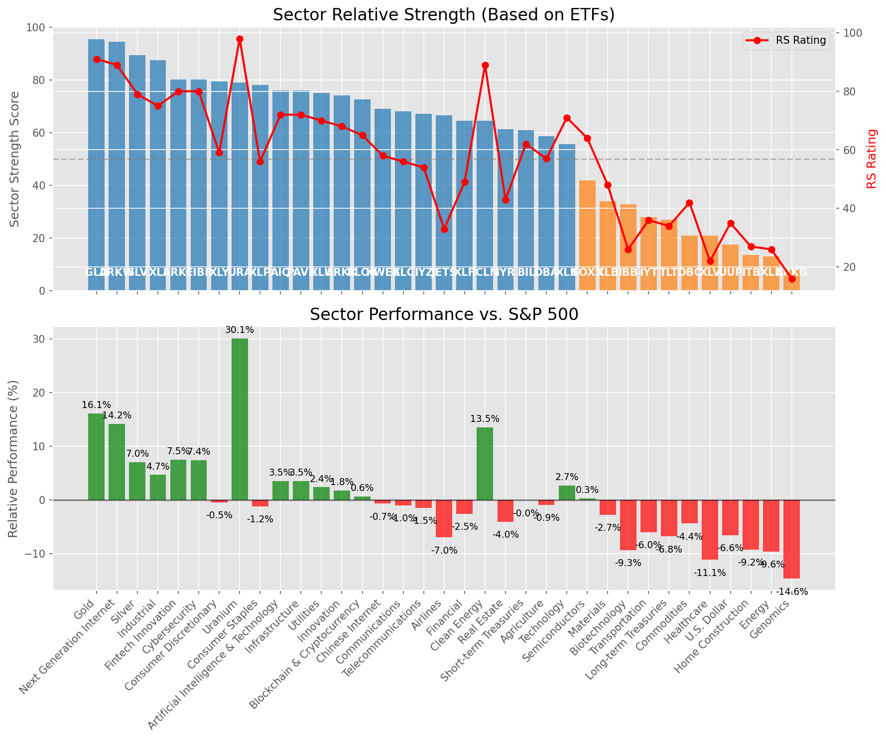

# **Daily Relative Strength Report**

**Date:** 2025-05-29

## **Market Valuation (Buffett Indicator)**

| Metric | Value |
|--------|-------|
| **Market Valuation** | **Fair Valued** |
| **Current Ratio** | 9.66 |
| **Historical Mean** | 9.37 |
| **Standard Deviation** | 0.47 |
| **Z-Score (StdDev from Mean)** | 0.60 |
| **Total Market Cap** | $289.55 trillion |
| **GDP** | $29.98 trillion |

## **Market Insights**

### **Market is Fairly Valued**

The market appears to be trading within a reasonable range of historical valuations. This suggests a balanced approach to equity investing is appropriate. Investors should:

- Focus on individual stock selection based on fundamentals and technicals
- Maintain normal equity allocations aligned with long-term goals
- Pay attention to sector rotation and relative strength
- Watch for changes in market leadership

Fair valuation typically suggests normal market returns can be expected, with stock selection becoming increasingly important.

### **Buffett Indicator Overview**

The Buffett Indicator (Total Market Cap / GDP) is a measure of the stock market's valuation relative to the size of the economy. It is named after Warren Buffett, who described it as "probably the best single measure of where valuations stand at any given moment."

- **Values above +2 standard deviations:** Market significantly overvalued
- **Values above +1 standard deviation:** Market overvalued
- **Values between -1 and +1 standard deviations:** Market fairly valued
- **Values below -1 standard deviation:** Market undervalued
- **Values below -2 standard deviations:** Market significantly undervalued

---

## **Sector Relative Strength**

Based on William O'Neil's Relative Strength Methodology

| ETF | Strength | RS Rating | Performance | Above Key MAs | Trend | Sector |
|-----|----------|-----------|-------------|--------------|-------|--------|
| [GLD](https://www.tradingview.com/chart/?symbol=GLD) | 95.5 | 91.0 | 16.23% | 10d ✓, 50d ✓, 200d ✓ | ↗️ | Gold |
| [ARKW](https://www.tradingview.com/chart/?symbol=ARKW) | 94.0 | 88.0 | 12.49% | 10d ✓, 50d ✓, 200d ✓ | ↗️ | Next Generation Internet |
| [SLV](https://www.tradingview.com/chart/?symbol=SLV) | 89.5 | 79.0 | 6.92% | 10d ✓, 50d ✓, 200d ✓ | ↗️ | Silver |
| [ARKF](https://www.tradingview.com/chart/?symbol=ARKF) | 80.1 | 80.0 | 7.62% | 10d ✗, 50d ✓, 200d ✓ | ↗️ | Fintech Innovation |
| [CIBR](https://www.tradingview.com/chart/?symbol=CIBR) | 79.6 | 79.0 | 7.37% | 10d ✗, 50d ✓, 200d ✓ | ↗️ | Cybersecurity |
| [URA](https://www.tradingview.com/chart/?symbol=URA) | 79.0 | 98.0 | 30.44% | 10d ✓, 50d ✓, 200d ✓ | ↘️ | Uranium |
| [XLP](https://www.tradingview.com/chart/?symbol=XLP) | 78.0 | 56.0 | -1.26% | 10d ✓, 50d ✓, 200d ✓ | ↗️ | Consumer Staples |
| [XLI](https://www.tradingview.com/chart/?symbol=XLI) | 77.1 | 74.0 | 4.58% | 10d ✗, 50d ✓, 200d ✓ | ↗️ | Industrial |
| [AIQ](https://www.tradingview.com/chart/?symbol=AIQ) | 76.1 | 72.0 | 3.48% | 10d ✗, 50d ✓, 200d ✓ | ↗️ | Artificial Intelligence & Technology |
| [PAVE](https://www.tradingview.com/chart/?symbol=PAVE) | 76.1 | 72.0 | 3.48% | 10d ✗, 50d ✓, 200d ✓ | ↗️ | Infrastructure |
| [XLU](https://www.tradingview.com/chart/?symbol=XLU) | 74.6 | 69.0 | 2.25% | 10d ✗, 50d ✓, 200d ✓ | ↗️ | Utilities |
| [ARKK](https://www.tradingview.com/chart/?symbol=ARKK) | 74.1 | 68.0 | 1.83% | 10d ✗, 50d ✓, 200d ✓ | ↗️ | Innovation |
| [BLOK](https://www.tradingview.com/chart/?symbol=BLOK) | 72.6 | 65.0 | 0.72% | 10d ✗, 50d ✓, 200d ✓ | ↗️ | Blockchain & Cryptocurrency |
| [KWEB](https://www.tradingview.com/chart/?symbol=KWEB) | 69.6 | 59.0 | -0.56% | 10d ✗, 50d ✓, 200d ✓ | ↗️ | Chinese Internet |
| [XLY](https://www.tradingview.com/chart/?symbol=XLY) | 69.1 | 58.0 | -0.65% | 10d ✗, 50d ✓, 200d ✓ | ↗️ | Consumer Discretionary |
| [XLC](https://www.tradingview.com/chart/?symbol=XLC) | 67.6 | 55.0 | -1.35% | 10d ✗, 50d ✓, 200d ✓ | ↗️ | Communications |
| [IYZ](https://www.tradingview.com/chart/?symbol=IYZ) | 67.1 | 54.0 | -1.55% | 10d ✗, 50d ✓, 200d ✓ | ↗️ | Telecommunications |
| [JETS](https://www.tradingview.com/chart/?symbol=JETS) | 66.5 | 33.0 | -7.04% | 10d ✓, 50d ✓, 200d ✓ | ↗️ | Airlines |
| [ICLN](https://www.tradingview.com/chart/?symbol=ICLN) | 64.6 | 89.0 | 13.59% | 10d ✗, 50d ✓, 200d ✓ | ↘️ | Clean Energy |
| [XLF](https://www.tradingview.com/chart/?symbol=XLF) | 64.1 | 48.0 | -2.83% | 10d ✗, 50d ✓, 200d ✓ | ↗️ | Financial |
| [BIL](https://www.tradingview.com/chart/?symbol=BIL) | 61.5 | 63.0 | -0.01% | 10d ✓, 50d ✓, 200d ✓ | ↘️ | Short-term Treasuries |
| [IYR](https://www.tradingview.com/chart/?symbol=IYR) | 61.3 | 43.0 | -4.29% | 10d ✓, 50d ✓, 200d ✗ | ↗️ | Real Estate |
| [DBA](https://www.tradingview.com/chart/?symbol=DBA) | 58.7 | 57.0 | -0.82% | 10d ✗, 50d ✗, 200d ✓ | ↗️ | Agriculture |
| [XLK](https://www.tradingview.com/chart/?symbol=XLK) | 55.1 | 70.0 | 2.60% | 10d ✗, 50d ✓, 200d ✓ | ↘️ | Technology |
| [SOXX](https://www.tradingview.com/chart/?symbol=SOXX) | 41.9 | 64.0 | 0.20% | 10d ✗, 50d ✓, 200d ✗ | ↘️ | Semiconductors |
| [XLB](https://www.tradingview.com/chart/?symbol=XLB) | 33.9 | 48.0 | -2.95% | 10d ✗, 50d ✓, 200d ✗ | ↘️ | Materials |
| [IBB](https://www.tradingview.com/chart/?symbol=IBB) | 32.8 | 26.0 | -9.61% | 10d ✓, 50d ✓, 200d ✗ | ↘️ | Biotechnology |
| [IYT](https://www.tradingview.com/chart/?symbol=IYT) | 27.9 | 36.0 | -6.18% | 10d ✗, 50d ✓, 200d ✗ | ↘️ | Transportation |
| [TLT](https://www.tradingview.com/chart/?symbol=TLT) | 26.9 | 34.0 | -6.86% | 10d ✓, 50d ✗, 200d ✗ | ↘️ | Long-term Treasuries |
| [DBC](https://www.tradingview.com/chart/?symbol=DBC) | 21.5 | 43.0 | -4.39% | 10d ✗, 50d ✗, 200d ✗ | ↘️ | Commodities |
| [UUP](https://www.tradingview.com/chart/?symbol=UUP) | 17.5 | 35.0 | -6.70% | 10d ✗, 50d ✗, 200d ✗ | ↘️ | U.S. Dollar |
| [ITB](https://www.tradingview.com/chart/?symbol=ITB) | 13.0 | 26.0 | -9.67% | 10d ✗, 50d ✗, 200d ✗ | ↘️ | Home Construction |
| [XLE](https://www.tradingview.com/chart/?symbol=XLE) | 12.5 | 25.0 | -9.88% | 10d ✗, 50d ✗, 200d ✗ | ↘️ | Energy |
| [XLV](https://www.tradingview.com/chart/?symbol=XLV) | 11.0 | 22.0 | -11.39% | 10d ✗, 50d ✗, 200d ✗ | ↘️ | Healthcare |
| [ARKG](https://www.tradingview.com/chart/?symbol=ARKG) | 8.0 | 16.0 | -14.56% | 10d ✗, 50d ✗, 200d ✗ | ↘️ | Genomics |

### **Sector ETF Performance Interpretation**

This table shows the relative strength metrics for different market sectors based on their representative ETFs:

- **ETF**: The ETF used to measure sector performance (click for chart)
- **Strength**: Overall sector strength score (0-100) combining multiple factors
- **RS Rating**: O'Neil RS rating of the sector ETF
- **Performance**: Performance of the sector ETF relative to SPY
- **Above Key MAs**: Whether the ETF is trading above its 10, 50, and 200-day moving averages
- **Trend**: Whether the sector is in an uptrend (↗️) or downtrend (↘️)

### **Current Sector Leadership**

The current market leadership is coming from the following sectors: **Gold, Next Generation Internet, Silver**.

The **Gold** sector (represented by **GLD**) is showing particularly strong relative strength with an RS rating of 91.0 and performance of 16.23% vs. the S&P 500. This sector is trading above its 10-day, 50-day, 200-day moving average(s). Investors should consider focusing on high RS stocks within these leading sectors for potential outperformance.

---

## **Buy Recommendations**

The following 71 stocks show exceptional relative strength:

| RS Rating | Buy Score | Current Price | Chart | Name | Ticker |
|-----------|-----------|---------------|-------|------|--------|
| 100 | 100 | $111.15 | [Chart](https://www.tradingview.com/chart/?symbol=SEZL) | Sezzle Inc. Common Stock | SEZL |
| 100 | 100 | $209.42 | [Chart](https://www.tradingview.com/chart/?symbol=DAVE) | Dave Inc. Class A Common Stock | DAVE |
| 100 | 100 | $208.71 | [Chart](https://www.tradingview.com/chart/?symbol=AGX) | Argan, Inc | AGX |
| 100 | 100 | $95.74 | [Chart](https://www.tradingview.com/chart/?symbol=RBRK) | Rubrik, Inc. | RBRK |
| 100 | 100 | $43.87 | [Chart](https://www.tradingview.com/chart/?symbol=AU) | AngloGold Ashanti plc | AU |
| 99 | 100 | $41.93 | [Chart](https://www.tradingview.com/chart/?symbol=DRS) | Leonardo DRS, Inc. Common Stock | DRS |
| 99 | 100 | $42.34 | [Chart](https://www.tradingview.com/chart/?symbol=FARO) | Faro Technologies Inc | FARO |
| 99 | 100 | $743.37 | [Chart](https://www.tradingview.com/chart/?symbol=AXON) | Axon Enterprise, Inc. Common Stock | AXON |
| 99 | 100 | $36.26 | [Chart](https://www.tradingview.com/chart/?symbol=KTOS) | Kratos Defense & Security Solutions, Inc. | KTOS |
| 99 | 100 | $38.40 | [Chart](https://www.tradingview.com/chart/?symbol=PAY) | Paymentus Holdings, Inc. | PAY |
| 99 | 100 | $475.10 | [Chart](https://www.tradingview.com/chart/?symbol=GEV) | GE Vernova Inc. | GEV |
| 99 | 100 | $318.98 | [Chart](https://www.tradingview.com/chart/?symbol=CVNA) | Carvana Co. | CVNA |
| 98 | 100 | $21.75 | [Chart](https://www.tradingview.com/chart/?symbol=TFPM) | Triple Flag Precious Metals Corp. | TFPM |
| 98 | 100 | $162.45 | [Chart](https://www.tradingview.com/chart/?symbol=PLMR) | Palomar Holdings, Inc. Common stock | PLMR |
| 98 | 100 | $140.83 | [Chart](https://www.tradingview.com/chart/?symbol=UGL) | ProShares Ultra Gold | UGL |
| 98 | 100 | $26.51 | [Chart](https://www.tradingview.com/chart/?symbol=UVE) | UNIVERSAL INSURANCE HLDG, INC. | UVE |
| 98 | 100 | $85.04 | [Chart](https://www.tradingview.com/chart/?symbol=RBLX) | Roblox Corporation | RBLX |
| 98 | 100 | $24.59 | [Chart](https://www.tradingview.com/chart/?symbol=GRND) | Grindr Inc. | GRND |
| 98 | 100 | $56.61 | [Chart](https://www.tradingview.com/chart/?symbol=SHLD) | Global X Defense Tech ETF | SHLD |
| 97 | 100 | $64.28 | [Chart](https://www.tradingview.com/chart/?symbol=HOOD) | Robinhood Markets, Inc. Class A Common Stock | HOOD |
| 97 | 100 | $33.14 | [Chart](https://www.tradingview.com/chart/?symbol=PRDO) | Perdoceo Education Corporation | PRDO |
| 96 | 100 | $35.65 | [Chart](https://www.tradingview.com/chart/?symbol=UTI) | Universal Technical Institute, Inc. | UTI |
| 96 | 100 | $170.25 | [Chart](https://www.tradingview.com/chart/?symbol=HWM) | Howmet Aerospace Inc. | HWM |
| 96 | 100 | $19.34 | [Chart](https://www.tradingview.com/chart/?symbol=MIR) | Mirion Technologies, Inc. | MIR |
| 96 | 100 | $86.39 | [Chart](https://www.tradingview.com/chart/?symbol=WPM) | Wheaton Precious Metals Corp. Common Stock | WPM |
| 96 | 100 | $280.96 | [Chart](https://www.tradingview.com/chart/?symbol=VEEV) | Veeva Systems Inc. | VEEV |
| 95 | 100 | $50.73 | [Chart](https://www.tradingview.com/chart/?symbol=BBW) | Build-A-Bear Workshop, Inc. | BBW |
| 95 | 100 | $118.42 | [Chart](https://www.tradingview.com/chart/?symbol=AEM) | Agnico Eagle Mines Ltd. | AEM |
| 95 | 100 | $180.16 | [Chart](https://www.tradingview.com/chart/?symbol=RGLD) | Royal Gold Inc | RGLD |
| 95 | 100 | $36.80 | [Chart](https://www.tradingview.com/chart/?symbol=AS) | Amer Sports, Inc. | AS |
| 94 | 100 | $43.14 | [Chart](https://www.tradingview.com/chart/?symbol=EWP) | iShares MSCI Spain ETF | EWP |
| 93 | 100 | $153.60 | [Chart](https://www.tradingview.com/chart/?symbol=CAH) | Cardinal Health, Inc. | CAH |
| 93 | 100 | $385.05 | [Chart](https://www.tradingview.com/chart/?symbol=APP) | Applovin Corporation Class A Common Stock | APP |
| 92 | 100 | $131.74 | [Chart](https://www.tradingview.com/chart/?symbol=COOP) | Mr. Cooper Group Inc. Common Stock | COOP |
| 92 | 100 | $243.95 | [Chart](https://www.tradingview.com/chart/?symbol=GE) | GE Aerospace | GE |
| 92 | 100 | $73.73 | [Chart](https://www.tradingview.com/chart/?symbol=WRB) | W.R. Berkley Corporation | WRB |
| 91 | 100 | $32.00 | [Chart](https://www.tradingview.com/chart/?symbol=OUNZ) | VanEck Merk Gold ETF | OUNZ |
| 91 | 100 | $62.62 | [Chart](https://www.tradingview.com/chart/?symbol=IAU) | iShares Gold Trust | IAU |
| 91 | 100 | $31.67 | [Chart](https://www.tradingview.com/chart/?symbol=SGOL) | abrdn Physical Gold Shares ETF | SGOL |
| 91 | 100 | $41.84 | [Chart](https://www.tradingview.com/chart/?symbol=EWG) | iShares MSCI Germany ETF | EWG |
| 91 | 100 | $306.00 | [Chart](https://www.tradingview.com/chart/?symbol=GLD) | SPDR Gold Trust, SPDR Gold Shares | GLD |
| 91 | 100 | $64.26 | [Chart](https://www.tradingview.com/chart/?symbol=SLF) | Sun Life Financial Inc. | SLF |
| 91 | 100 | $32.80 | [Chart](https://www.tradingview.com/chart/?symbol=AAAU) | Goldman Sachs Physical Gold ETF Shares | AAAU |
| 91 | 100 | $65.77 | [Chart](https://www.tradingview.com/chart/?symbol=GLDM) | SPDR Gold MiniShares | GLDM |
| 91 | 100 | $33.11 | [Chart](https://www.tradingview.com/chart/?symbol=IAUM) | iShares Gold Trust Micro | IAUM |
| 91 | 100 | $47.65 | [Chart](https://www.tradingview.com/chart/?symbol=EWI) | iShares MSCI Italy ETF | EWI |
| 90 | 100 | $25.38 | [Chart](https://www.tradingview.com/chart/?symbol=PHYS) | Sprott Physical Gold Trust | PHYS |
| 90 | 100 | $209.65 | [Chart](https://www.tradingview.com/chart/?symbol=BAP) | Credicorp LTD | BAP |
| 90 | 100 | $44.86 | [Chart](https://www.tradingview.com/chart/?symbol=BTI) | British American Tobacco p.l.c. American Depositary Shares, American Depositary Shares, each representing one Ordinary Share | BTI |
| 89 | 100 | $177.48 | [Chart](https://www.tradingview.com/chart/?symbol=PM) | Philip Morris International Inc. | PM |
| 88 | 100 | $167.82 | [Chart](https://www.tradingview.com/chart/?symbol=SFM) | Sprouts Farmers Market, Inc. | SFM |
| 88 | 100 | $29.29 | [Chart](https://www.tradingview.com/chart/?symbol=CEF) | Sprott Physical Gold and Silver Trust | CEF |
| 88 | 100 | $286.03 | [Chart](https://www.tradingview.com/chart/?symbol=CME) | CME Group Inc. | CME |
| 88 | 100 | $17.81 | [Chart](https://www.tradingview.com/chart/?symbol=BCS) | Barclays PLC | BCS |
| 86 | 100 | $24.06 | [Chart](https://www.tradingview.com/chart/?symbol=SRAD) | Sportradar Group AG Class A Ordinary Shares | SRAD |
| 89 | 99 | $176.00 | [Chart](https://www.tradingview.com/chart/?symbol=ITA) | iShares U.S. Aerospace & Defense ETF | ITA |
| 87 | 99 | $72.54 | [Chart](https://www.tradingview.com/chart/?symbol=EBAY) | eBay Inc | EBAY |
| 86 | 99 | $25.89 | [Chart](https://www.tradingview.com/chart/?symbol=EWS) | iShares MSCI Singapore ETF | EWS |
| 87 | 97 | $49.97 | [Chart](https://www.tradingview.com/chart/?symbol=TRP) | TC Energy Corporation | TRP |
| 87 | 97 | $59.35 | [Chart](https://www.tradingview.com/chart/?symbol=UVV) | Universal Corporation | UVV |
| 82 | 96 | $56.77 | [Chart](https://www.tradingview.com/chart/?symbol=TXNM) | TXNM Energy, Inc. | TXNM |
| 85 | 95 | $48.20 | [Chart](https://www.tradingview.com/chart/?symbol=FTS) | Fortis Inc. Common Shares | FTS |
| 84 | 95 | $58.68 | [Chart](https://www.tradingview.com/chart/?symbol=IGF) | iShares Global Infrastructure ETF | IGF |
| 82 | 95 | $81.72 | [Chart](https://www.tradingview.com/chart/?symbol=NFG) | National Fuel Gas Co. | NFG |
| 82 | 94 | $27.75 | [Chart](https://www.tradingview.com/chart/?symbol=IMAX) | Imax Corp | IMAX |
| 83 | 93 | $5476.33 | [Chart](https://www.tradingview.com/chart/?symbol=BKNG) | Booking Holdings Inc. Common Stock | BKNG |
| 83 | 93 | $116.49 | [Chart](https://www.tradingview.com/chart/?symbol=CLS) | Celestica, Inc. | CLS |
| 83 | 93 | $78.38 | [Chart](https://www.tradingview.com/chart/?symbol=BBCA) | JPMorgan BetaBuilders Canada ETF | BBCA |
| 83 | 92 | $30.09 | [Chart](https://www.tradingview.com/chart/?symbol=BRRR) | Coinshares Valkyrie Bitcoin Fund Common Shares of Beneficial Interest | BRRR |
| 81 | 92 | $104.16 | [Chart](https://www.tradingview.com/chart/?symbol=DTM) | DT Midstream, Inc. | DTM |
| 80 | 91 | $13.72 | [Chart](https://www.tradingview.com/chart/?symbol=MUFG) | Mitsubishi UFJ Financial Group, Inc. | MUFG |

---

## **Sell Recommendations**

The following 140 stocks show deteriorating relative strength:

| RS Rating | Sell Score | Current Price | Chart | Name | Ticker |
|-----------|------------|---------------|-------|------|--------|
| 1 | 100 | $10.59 | [Chart](https://www.tradingview.com/chart/?symbol=NRIX) | Nurix Therapeutics, Inc. Common stock | NRIX |
| 1 | 100 | $15.14 | [Chart](https://www.tradingview.com/chart/?symbol=VTLE) | Vital Energy, Inc. | VTLE |
| 1 | 100 | $12.57 | [Chart](https://www.tradingview.com/chart/?symbol=IART) | Integra LifeSciences Holdings | IART |
| 2 | 100 | $16.41 | [Chart](https://www.tradingview.com/chart/?symbol=BEAM) | Beam Therapeutics Inc. Common Stock | BEAM |
| 3 | 100 | $21.35 | [Chart](https://www.tradingview.com/chart/?symbol=AOSL) | Alpha and Omega Semiconductor Limited | AOSL |
| 3 | 100 | $14.04 | [Chart](https://www.tradingview.com/chart/?symbol=DQ) | Daqo New Energy Corp. American Depositary Shares (each representing 5 Ordinary Shares) | DQ |
| 3 | 100 | $15.19 | [Chart](https://www.tradingview.com/chart/?symbol=PENN) | PENN Entertainment, Inc. Common Stock | PENN |
| 3 | 100 | $11.88 | [Chart](https://www.tradingview.com/chart/?symbol=LBRT) | Liberty Energy Inc. | LBRT |
| 3 | 100 | $17.54 | [Chart](https://www.tradingview.com/chart/?symbol=NVDS) | Investment Managers Series Trust II Tradr 1.5X Short NVDA Daily ETF | NVDS |
| 3 | 100 | $125.52 | [Chart](https://www.tradingview.com/chart/?symbol=KRYS) | Krystal Biotech, Inc. Common Stock | KRYS |
| 4 | 100 | $10.31 | [Chart](https://www.tradingview.com/chart/?symbol=VREX) | Varex Imaging Corporation Common Stock | VREX |
| 4 | 100 | $23.56 | [Chart](https://www.tradingview.com/chart/?symbol=SM) | SM Energy Company | SM |
| 5 | 100 | $29.16 | [Chart](https://www.tradingview.com/chart/?symbol=SRDX) | Surmodics, Inc. Common Stock | SRDX |
| 5 | 100 | $28.62 | [Chart](https://www.tradingview.com/chart/?symbol=TWST) | Twist Bioscience Corporation Common Stock | TWST |
| 5 | 100 | $10.06 | [Chart](https://www.tradingview.com/chart/?symbol=CWK) | Cushman & Wakefield plc Ordinary Shares | CWK |
| 5 | 100 | $57.24 | [Chart](https://www.tradingview.com/chart/?symbol=ALB) | Albemarle Corporation | ALB |
| 5 | 100 | $43.98 | [Chart](https://www.tradingview.com/chart/?symbol=LINE) | Lineage, Inc. Common Stock | LINE |
| 6 | 100 | $11.07 | [Chart](https://www.tradingview.com/chart/?symbol=CLB) | Core Laboratories Inc. | CLB |
| 6 | 100 | $16.88 | [Chart](https://www.tradingview.com/chart/?symbol=FWRD) | Forward Air Corp | FWRD |
| 7 | 100 | $122.04 | [Chart](https://www.tradingview.com/chart/?symbol=RGEN) | Repligen Corp | RGEN |
| 7 | 100 | $52.69 | [Chart](https://www.tradingview.com/chart/?symbol=ASGN) | ASGN Incorporated | ASGN |
| 7 | 100 | $32.55 | [Chart](https://www.tradingview.com/chart/?symbol=MBIN) | Merchants Bancorp Common Stock | MBIN |
| 7 | 100 | $78.23 | [Chart](https://www.tradingview.com/chart/?symbol=WHR) | Whirlpool Corp. | WHR |
| 8 | 100 | $57.52 | [Chart](https://www.tradingview.com/chart/?symbol=AMWD) | American Woodmark Corp | AMWD |
| 8 | 100 | $22.73 | [Chart](https://www.tradingview.com/chart/?symbol=RPD) | Rapid7, Inc. Common Stock | RPD |
| 8 | 100 | $81.28 | [Chart](https://www.tradingview.com/chart/?symbol=KSPI) | Joint Stock Company Kaspi.kz American Depository Shares | KSPI |
| 8 | 100 | $48.03 | [Chart](https://www.tradingview.com/chart/?symbol=ERX) | Direxion Daily Energy Bull 2X Shares | ERX |
| 8 | 100 | $46.17 | [Chart](https://www.tradingview.com/chart/?symbol=RHI) | Robert Half Inc. | RHI |
| 9 | 100 | $90.44 | [Chart](https://www.tradingview.com/chart/?symbol=CHRD) | Chord Energy Corporation Common Stock | CHRD |
| 10 | 100 | $67.99 | [Chart](https://www.tradingview.com/chart/?symbol=WD) | Walker & Dunlop, Inc. | WD |
| 10 | 100 | $18.27 | [Chart](https://www.tradingview.com/chart/?symbol=PDFS) | PDF Solutions Inc | PDFS |
| 10 | 100 | $26.14 | [Chart](https://www.tradingview.com/chart/?symbol=WERN) | Werner Enterprises Inc | WERN |
| 10 | 100 | $34.58 | [Chart](https://www.tradingview.com/chart/?symbol=ESTA) | Establishment Labs Holdings Inc. | ESTA |
| 11 | 100 | $35.10 | [Chart](https://www.tradingview.com/chart/?symbol=RARE) | Ultragenyx Pharmaceutical Inc. | RARE |
| 11 | 100 | $58.28 | [Chart](https://www.tradingview.com/chart/?symbol=BMRN) | BioMarin Pharmaceuticals Inc | BMRN |
| 13 | 100 | $21.09 | [Chart](https://www.tradingview.com/chart/?symbol=AMN) | AMN Healthcare Services | AMN |
| 15 | 100 | $14.49 | [Chart](https://www.tradingview.com/chart/?symbol=HR) | Healthcare Realty Trust Incorporated | HR |
| 2 | 99 | $27.98 | [Chart](https://www.tradingview.com/chart/?symbol=DOCN) | DigitalOcean Holdings, Inc. | DOCN |
| 3 | 99 | $35.23 | [Chart](https://www.tradingview.com/chart/?symbol=TECS) | Direxion Daily Technology Bear 3x Shares | TECS |
| 5 | 99 | $45.82 | [Chart](https://www.tradingview.com/chart/?symbol=LSCC) | Lattice Semiconductor Corp | LSCC |
| 9 | 99 | $17.06 | [Chart](https://www.tradingview.com/chart/?symbol=MLKN) | MillerKnoll, Inc. Common Stock | MLKN |
| 11 | 99 | $19.34 | [Chart](https://www.tradingview.com/chart/?symbol=FOR) | Forestar Group Inc. | FOR |
| 11 | 99 | $12.22 | [Chart](https://www.tradingview.com/chart/?symbol=NOV) | NOV Inc. | NOV |
| 12 | 99 | $40.80 | [Chart](https://www.tradingview.com/chart/?symbol=ASO) | Academy Sports and Outdoors, Inc. | ASO |
| 14 | 99 | $43.88 | [Chart](https://www.tradingview.com/chart/?symbol=MTDR) | MATADOR RESOURCES COMPANY | MTDR |
| 14 | 99 | $17.29 | [Chart](https://www.tradingview.com/chart/?symbol=APA) | APA Corporation Common Stock | APA |
| 4 | 98 | $10.63 | [Chart](https://www.tradingview.com/chart/?symbol=LSPD) | Lightspeed Commerce Inc. | LSPD |
| 8 | 98 | $13.06 | [Chart](https://www.tradingview.com/chart/?symbol=AVTR) | Avantor, Inc. | AVTR |
| 12 | 98 | $199.63 | [Chart](https://www.tradingview.com/chart/?symbol=AAPL) | Apple Inc. | AAPL |
| 4 | 97 | $75.36 | [Chart](https://www.tradingview.com/chart/?symbol=GPN) | Global Payments, Inc. | GPN |
| 8 | 97 | $14.61 | [Chart](https://www.tradingview.com/chart/?symbol=INMD) | InMode Ltd. Ordinary Shares | INMD |
| 12 | 97 | $25.66 | [Chart](https://www.tradingview.com/chart/?symbol=TRN) | Trinity Industries, Inc. | TRN |
| 13 | 97 | $220.64 | [Chart](https://www.tradingview.com/chart/?symbol=OIH) | VanEck Oil Services ETF | OIH |
| 13 | 97 | $17.91 | [Chart](https://www.tradingview.com/chart/?symbol=DNTH) | Dianthus Therapeutics, Inc. Common Stock | DNTH |
| 15 | 97 | $41.33 | [Chart](https://www.tradingview.com/chart/?symbol=OXY) | Occidental Petroleum Corporation | OXY |
| 15 | 97 | $51.44 | [Chart](https://www.tradingview.com/chart/?symbol=KBH) | KB Home | KBH |
| 23 | 97 | $14.63 | [Chart](https://www.tradingview.com/chart/?symbol=FXN) | First Trust Energy AlphaDEX Fund | FXN |
| 5 | 96 | $10.54 | [Chart](https://www.tradingview.com/chart/?symbol=SONO) | Sonos, Inc. Common Stock | SONO |
| 10 | 96 | $33.67 | [Chart](https://www.tradingview.com/chart/?symbol=SLB) | Schlumberger Limited | SLB |
| 11 | 96 | $38.58 | [Chart](https://www.tradingview.com/chart/?symbol=APOG) | Apogee Enterprises Inc | APOG |
| 12 | 96 | $13.59 | [Chart](https://www.tradingview.com/chart/?symbol=DNLI) | Denali Therapeutics Inc. Common Stock | DNLI |
| 14 | 96 | $36.35 | [Chart](https://www.tradingview.com/chart/?symbol=OVV) | Ovintiv Inc. | OVV |
| 14 | 96 | $50.75 | [Chart](https://www.tradingview.com/chart/?symbol=ASH) | Ashland Inc. | ASH |
| 17 | 96 | $31.13 | [Chart](https://www.tradingview.com/chart/?symbol=DAR) | DARLING INGREDIENTS INC. | DAR |
| 14 | 95 | $15.41 | [Chart](https://www.tradingview.com/chart/?symbol=DXC) | DXC Technology Company | DXC |
| 16 | 95 | $17.08 | [Chart](https://www.tradingview.com/chart/?symbol=STR) | Sitio Royalties Corp. | STR |
| 21 | 95 | $105.23 | [Chart](https://www.tradingview.com/chart/?symbol=LEN) | Lennar Corporation Class A | LEN |
| 8 | 94 | $55.57 | [Chart](https://www.tradingview.com/chart/?symbol=SLVM) | Sylvamo Corporation | SLVM |
| 12 | 94 | $24.54 | [Chart](https://www.tradingview.com/chart/?symbol=CHX) | ChampionX Corporation | CHX |
| 28 | 94 | $11.05 | [Chart](https://www.tradingview.com/chart/?symbol=GES) | Guess?, Inc. | GES |
| 14 | 93 | $31.97 | [Chart](https://www.tradingview.com/chart/?symbol=TENB) | Tenable Holdings, Inc. | TENB |
| 15 | 93 | $10.86 | [Chart](https://www.tradingview.com/chart/?symbol=NEWT) | NewtekOne, Inc. Common Stock | NEWT |
| 19 | 93 | $36.91 | [Chart](https://www.tradingview.com/chart/?symbol=LIT) | Global X Lithium & Battery Tech ETF | LIT |
| 20 | 93 | $10.02 | [Chart](https://www.tradingview.com/chart/?symbol=LBTYK) | Liberty Global Ltd. Class C Common Shares | LBTYK |
| 10 | 92 | $25.30 | [Chart](https://www.tradingview.com/chart/?symbol=IRDM) | Iridium Communications Inc. | IRDM |
| 9 | 91 | $40.80 | [Chart](https://www.tradingview.com/chart/?symbol=VCEL) | Vericel Corporation | VCEL |
| 11 | 91 | $91.72 | [Chart](https://www.tradingview.com/chart/?symbol=RVTY) | Revvity, Inc. | RVTY |
| 16 | 91 | $10.06 | [Chart](https://www.tradingview.com/chart/?symbol=SEMR) | SEMrush Holdings, Inc. | SEMR |
| 21 | 91 | $30.44 | [Chart](https://www.tradingview.com/chart/?symbol=BAX) | Baxter International Inc. | BAX |
| 22 | 91 | $14.98 | [Chart](https://www.tradingview.com/chart/?symbol=VRE) | Veris Residential, Inc. | VRE |
| 15 | 90 | $86.73 | [Chart](https://www.tradingview.com/chart/?symbol=BCC) | Boise Cascade Company | BCC |
| 16 | 90 | $30.40 | [Chart](https://www.tradingview.com/chart/?symbol=ZSL) | ProShares UltraShort Silver | ZSL |
| 17 | 90 | $85.25 | [Chart](https://www.tradingview.com/chart/?symbol=COP) | ConocoPhillips | COP |
| 12 | 89 | $93.39 | [Chart](https://www.tradingview.com/chart/?symbol=BOKF) | BOK Financial Corp | BOKF |
| 15 | 89 | $12.32 | [Chart](https://www.tradingview.com/chart/?symbol=PMT) | PennyMac Mortgage Investment Trust | PMT |
| 16 | 89 | $12.52 | [Chart](https://www.tradingview.com/chart/?symbol=DBO) | Invesco DB Oil Fund | DBO |
| 18 | 89 | $28.72 | [Chart](https://www.tradingview.com/chart/?symbol=QID) | ProShares UltraShort QQQ | QID |
| 23 | 89 | $64.53 | [Chart](https://www.tradingview.com/chart/?symbol=ZROZ) | PIMCO 25+ Year Zero Coupon U.S. Treasury Index Exchange-Traded Fund | ZROZ |
| 14 | 88 | $56.66 | [Chart](https://www.tradingview.com/chart/?symbol=TRNO) | Terreno Realty Corporation | TRNO |
| 20 | 88 | $63.59 | [Chart](https://www.tradingview.com/chart/?symbol=MTH) | Meritage Homes Corporation | MTH |
| 20 | 88 | $11.71 | [Chart](https://www.tradingview.com/chart/?symbol=PBR) | PETROLEO BRASILEIRO S.A.-PETROBRAS ADS (REP 1 COMMON SHARE) | PBR |
| 25 | 88 | $15.98 | [Chart](https://www.tradingview.com/chart/?symbol=PD) | PagerDuty, Inc. | PD |
| 16 | 87 | $21.04 | [Chart](https://www.tradingview.com/chart/?symbol=ARKG) | ARK Genomic Revolution ETF | ARKG |
| 18 | 87 | $101.62 | [Chart](https://www.tradingview.com/chart/?symbol=MHK) | Mohawk Industries, Inc. | MHK |
| 18 | 87 | $10.09 | [Chart](https://www.tradingview.com/chart/?symbol=HOPE) | Hope Bancorp, Inc. | HOPE |
| 21 | 87 | $82.75 | [Chart](https://www.tradingview.com/chart/?symbol=BCO) | The Brink's Company | BCO |
| 22 | 87 | $18.26 | [Chart](https://www.tradingview.com/chart/?symbol=UE) | UBRAN EDGE PROPERTIES | UE |
| 17 | 86 | $20.55 | [Chart](https://www.tradingview.com/chart/?symbol=DFH) | Dream Finders Homes, Inc. | DFH |
| 26 | 85 | $210.36 | [Chart](https://www.tradingview.com/chart/?symbol=WST) | West Pharmaceutical Services, Inc. | WST |
| 26 | 85 | $11.03 | [Chart](https://www.tradingview.com/chart/?symbol=PBR.A) | Petroleo Brasileiro S.A.-Petrobras | PBR.A |
| 32 | 85 | $10.74 | [Chart](https://www.tradingview.com/chart/?symbol=NMFC) | NEW MOUNTAIN FINANCE CORPORATION | NMFC |
| 18 | 84 | $25.97 | [Chart](https://www.tradingview.com/chart/?symbol=WY) | Weyerhaeuser Company | WY |
| 18 | 84 | $110.11 | [Chart](https://www.tradingview.com/chart/?symbol=EOG) | EOG Resources, Inc. | EOG |
| 19 | 84 | $36.40 | [Chart](https://www.tradingview.com/chart/?symbol=NBHC) | NATIONAL BANK HOLDINGS CORP. | NBHC |
| 24 | 84 | $10.35 | [Chart](https://www.tradingview.com/chart/?symbol=SCS) | Steelcase, Inc. | SCS |
| 29 | 83 | $190.12 | [Chart](https://www.tradingview.com/chart/?symbol=DHR) | Danaher Corporation | DHR |
| 26 | 82 | $12.32 | [Chart](https://www.tradingview.com/chart/?symbol=WSR) | Whitestone REIT | WSR |
| 32 | 82 | $49.84 | [Chart](https://www.tradingview.com/chart/?symbol=CMG) | Chipotle Mexican Grill, Inc. | CMG |
| 35 | 82 | $10.54 | [Chart](https://www.tradingview.com/chart/?symbol=CELC) | Celcuity Inc. Common Stock | CELC |
| 25 | 81 | $82.01 | [Chart](https://www.tradingview.com/chart/?symbol=XLE) | Energy Select Sector SPDR Fund | XLE |
| 21 | 80 | $48.84 | [Chart](https://www.tradingview.com/chart/?symbol=TSCO) | Tractor Supply Co | TSCO |
| 23 | 80 | $121.36 | [Chart](https://www.tradingview.com/chart/?symbol=SUI) | Sun Communities, Inc | SUI |
| 28 | 80 | $14.32 | [Chart](https://www.tradingview.com/chart/?symbol=BMEZ) | BlackRock Health Sciences Term Trust | BMEZ |
| 28 | 80 | $16.62 | [Chart](https://www.tradingview.com/chart/?symbol=MLNK) | MeridianLink, Inc. | MLNK |
| 34 | 80 | $35.65 | [Chart](https://www.tradingview.com/chart/?symbol=SU) | Suncor Energy, Inc. | SU |
| 38 | 80 | $28.13 | [Chart](https://www.tradingview.com/chart/?symbol=TX) | Ternium S.A. American Depositary Shares | TX |
| 29 | 78 | $121.51 | [Chart](https://www.tradingview.com/chart/?symbol=TFX) | Teleflex Incorporated | TFX |
| 29 | 78 | $38.17 | [Chart](https://www.tradingview.com/chart/?symbol=MLTX) | MoonLake Immunotherapeutics Class A Ordinary Shares | MLTX |
| 31 | 78 | $36.47 | [Chart](https://www.tradingview.com/chart/?symbol=BHE) | Benchmark Electronics | BHE |
| 31 | 78 | $11.90 | [Chart](https://www.tradingview.com/chart/?symbol=NVG) | Nuveen AMT-Free Municipal Credit Income Fund | NVG |
| 23 | 77 | $132.87 | [Chart](https://www.tradingview.com/chart/?symbol=HES) | Hess Corporation | HES |
| 28 | 77 | $36.57 | [Chart](https://www.tradingview.com/chart/?symbol=STBA) | S&T Bancorp Inc | STBA |
| 32 | 77 | $10.40 | [Chart](https://www.tradingview.com/chart/?symbol=MYI) | BLACKROCK MUNIYIELD QUALITY FUND III, INC. | MYI |
| 27 | 76 | $13.58 | [Chart](https://www.tradingview.com/chart/?symbol=BSM) | Black Stone Minerals, L.P. | BSM |
| 31 | 76 | $102.50 | [Chart](https://www.tradingview.com/chart/?symbol=XOM) | Exxon Mobil Corporation | XOM |
| 33 | 76 | $72.71 | [Chart](https://www.tradingview.com/chart/?symbol=WFG) | West Fraser Timber Co. Ltd | WFG |
| 35 | 76 | $21.90 | [Chart](https://www.tradingview.com/chart/?symbol=MGY) | Magnolia Oil & Gas Corporation Class A Common Stock | MGY |
| 34 | 74 | $38.40 | [Chart](https://www.tradingview.com/chart/?symbol=KSA) | iShares MSCI Saudi Arabia ETF | KSA |
| 31 | 73 | $37.43 | [Chart](https://www.tradingview.com/chart/?symbol=WES) | Western Midstream Partners, LP | WES |
| 32 | 72 | $10.39 | [Chart](https://www.tradingview.com/chart/?symbol=NMZ) | Nuveen Municipal High Income Opportunity Fund | NMZ |
| 34 | 72 | $11.79 | [Chart](https://www.tradingview.com/chart/?symbol=NZF) | Nuveen Municipal Credit Income Fund | NZF |
| 29 | 71 | $62.59 | [Chart](https://www.tradingview.com/chart/?symbol=ELS) | Equity Lifestyle Properties, Inc. | ELS |
| 33 | 71 | $18.49 | [Chart](https://www.tradingview.com/chart/?symbol=PDI) | PIMCO Dynamic Income Fund | PDI |
| 35 | 71 | $29.57 | [Chart](https://www.tradingview.com/chart/?symbol=TPH) | Tri Pointe Homes, Inc. | TPH |
| 37 | 71 | $10.88 | [Chart](https://www.tradingview.com/chart/?symbol=LBTYA) | Liberty Global Ltd. Class A Common Shares | LBTYA |
| 32 | 70 | $14.55 | [Chart](https://www.tradingview.com/chart/?symbol=GOF) | Guggenheim Strategic Opportunities Fund | GOF |
| 34 | 70 | $94.52 | [Chart](https://www.tradingview.com/chart/?symbol=XHB) | SPDR S&P Homebuilders ETF | XHB |
| 34 | 70 | $10.81 | [Chart](https://www.tradingview.com/chart/?symbol=NEA) | Nuveen AMT-Free Quality Municipal Income Fund | NEA |
| 39 | 70 | $26.57 | [Chart](https://www.tradingview.com/chart/?symbol=NATL) | NCR Atleos Corporation | NATL |
| 37 | 69 | $18.66 | [Chart](https://www.tradingview.com/chart/?symbol=PFFD) | Global X U.S. Preferred ETF | PFFD |

## **Methodology**

This report uses William O'Neil's relative strength methodology from Investors Business Daily:

* **RS Rating**: Percentile rank of stock's performance vs. S&P 500 over the past 63 trading days (1-99 scale)
* **Buy Criteria**: RS Rating >= 80, price above 50-day MA, strong uptrend, increasing volume
* **Sell Criteria**: RS Rating < 40, price below 50-day MA, downtrend, decreasing volume

### **O'Neil's Key Principles**

1. **Focus on relative performance** - stocks outperforming the market
2. **Price trend confirmation** - stock must be in an uptrend
3. **Volume confirmation** - strong volume supports price moves
4. **Moving average validation** - price above key moving averages
5. **Market leaders only** - concentrate on top-performing stocks

*Report generated automatically after market close*