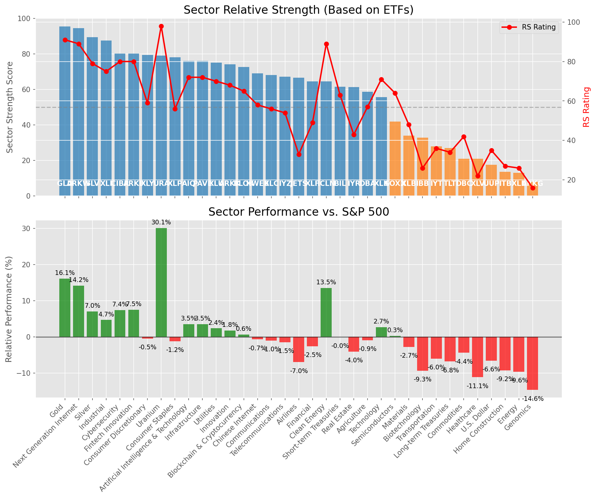

# **Daily Relative Strength Report**

**Date:** 2025-06-01

## **Market Valuation (Buffett Indicator)**

| Metric | Value |
|--------|-------|
| **Market Valuation** | **Fair Valued** |
| **Current Ratio** | 9.67 |
| **Historical Mean** | 9.36 |
| **Standard Deviation** | 0.47 |
| **Z-Score (StdDev from Mean)** | 0.67 |
| **Total Market Cap** | $289.88 trillion |
| **GDP** | $29.98 trillion |

## **Market Insights**

### **Market is Fairly Valued**

The market appears to be trading within a reasonable range of historical valuations. This suggests a balanced approach to equity investing is appropriate. Investors should:

- Focus on individual stock selection based on fundamentals and technicals
- Maintain normal equity allocations aligned with long-term goals
- Pay attention to sector rotation and relative strength
- Watch for changes in market leadership

Fair valuation typically suggests normal market returns can be expected, with stock selection becoming increasingly important.

### **Buffett Indicator Overview**

The Buffett Indicator (Total Market Cap / GDP) is a measure of the stock market's valuation relative to the size of the economy. It is named after Warren Buffett, who described it as "probably the best single measure of where valuations stand at any given moment."

- **Values above +2 standard deviations:** Market significantly overvalued
- **Values above +1 standard deviation:** Market overvalued
- **Values between -1 and +1 standard deviations:** Market fairly valued
- **Values below -1 standard deviation:** Market undervalued
- **Values below -2 standard deviations:** Market significantly undervalued

---

## **Sector Relative Strength**

Based on William O'Neil's Relative Strength Methodology

| ETF | Strength | RS Rating | Performance | Above Key MAs | Trend | Sector |
|-----|----------|-----------|-------------|--------------|-------|--------|
| [GLD](https://www.tradingview.com/chart/?symbol=GLD) | 95.5 | 91.0 | 16.08% | 10d ✓, 50d ✓, 200d ✓ | ↗️ | Gold |
| [ARKW](https://www.tradingview.com/chart/?symbol=ARKW) | 94.5 | 89.0 | 14.17% | 10d ✓, 50d ✓, 200d ✓ | ↗️ | Next Generation Internet |
| [SLV](https://www.tradingview.com/chart/?symbol=SLV) | 89.5 | 79.0 | 7.03% | 10d ✓, 50d ✓, 200d ✓ | ↗️ | Silver |
| [XLI](https://www.tradingview.com/chart/?symbol=XLI) | 87.5 | 75.0 | 4.69% | 10d ✓, 50d ✓, 200d ✓ | ↗️ | Industrial |
| [ARKF](https://www.tradingview.com/chart/?symbol=ARKF) | 80.1 | 80.0 | 7.51% | 10d ✗, 50d ✓, 200d ✓ | ↗️ | Fintech Innovation |
| [CIBR](https://www.tradingview.com/chart/?symbol=CIBR) | 80.1 | 80.0 | 7.44% | 10d ✗, 50d ✓, 200d ✓ | ↗️ | Cybersecurity |
| [XLY](https://www.tradingview.com/chart/?symbol=XLY) | 79.5 | 59.0 | -0.46% | 10d ✓, 50d ✓, 200d ✓ | ↗️ | Consumer Discretionary |
| [URA](https://www.tradingview.com/chart/?symbol=URA) | 79.0 | 98.0 | 30.08% | 10d ✓, 50d ✓, 200d ✓ | ↘️ | Uranium |
| [XLP](https://www.tradingview.com/chart/?symbol=XLP) | 78.0 | 56.0 | -1.17% | 10d ✓, 50d ✓, 200d ✓ | ↗️ | Consumer Staples |
| [AIQ](https://www.tradingview.com/chart/?symbol=AIQ) | 76.1 | 72.0 | 3.53% | 10d ✗, 50d ✓, 200d ✓ | ↗️ | Artificial Intelligence & Technology |
| [PAVE](https://www.tradingview.com/chart/?symbol=PAVE) | 76.1 | 72.0 | 3.53% | 10d ✗, 50d ✓, 200d ✓ | ↗️ | Infrastructure |
| [XLU](https://www.tradingview.com/chart/?symbol=XLU) | 75.1 | 70.0 | 2.36% | 10d ✗, 50d ✓, 200d ✓ | ↗️ | Utilities |
| [ARKK](https://www.tradingview.com/chart/?symbol=ARKK) | 74.1 | 68.0 | 1.76% | 10d ✗, 50d ✓, 200d ✓ | ↗️ | Innovation |
| [BLOK](https://www.tradingview.com/chart/?symbol=BLOK) | 72.6 | 65.0 | 0.64% | 10d ✗, 50d ✓, 200d ✓ | ↗️ | Blockchain & Cryptocurrency |
| [KWEB](https://www.tradingview.com/chart/?symbol=KWEB) | 69.1 | 58.0 | -0.68% | 10d ✗, 50d ✓, 200d ✓ | ↗️ | Chinese Internet |
| [XLC](https://www.tradingview.com/chart/?symbol=XLC) | 68.1 | 56.0 | -1.00% | 10d ✗, 50d ✓, 200d ✓ | ↗️ | Communications |
| [IYZ](https://www.tradingview.com/chart/?symbol=IYZ) | 67.1 | 54.0 | -1.48% | 10d ✗, 50d ✓, 200d ✓ | ↗️ | Telecommunications |
| [JETS](https://www.tradingview.com/chart/?symbol=JETS) | 66.5 | 33.0 | -6.96% | 10d ✓, 50d ✓, 200d ✓ | ↗️ | Airlines |
| [XLF](https://www.tradingview.com/chart/?symbol=XLF) | 64.6 | 49.0 | -2.55% | 10d ✗, 50d ✓, 200d ✓ | ↗️ | Financial |
| [ICLN](https://www.tradingview.com/chart/?symbol=ICLN) | 64.6 | 89.0 | 13.50% | 10d ✗, 50d ✓, 200d ✓ | ↘️ | Clean Energy |
| [BIL](https://www.tradingview.com/chart/?symbol=BIL) | 61.5 | 63.0 | -0.01% | 10d ✓, 50d ✓, 200d ✓ | ↘️ | Short-term Treasuries |
| [IYR](https://www.tradingview.com/chart/?symbol=IYR) | 61.3 | 43.0 | -4.03% | 10d ✓, 50d ✓, 200d ✗ | ↗️ | Real Estate |
| [DBA](https://www.tradingview.com/chart/?symbol=DBA) | 58.7 | 57.0 | -0.90% | 10d ✗, 50d ✗, 200d ✓ | ↗️ | Agriculture |
| [XLK](https://www.tradingview.com/chart/?symbol=XLK) | 55.6 | 71.0 | 2.70% | 10d ✗, 50d ✓, 200d ✓ | ↘️ | Technology |
| [SOXX](https://www.tradingview.com/chart/?symbol=SOXX) | 41.9 | 64.0 | 0.27% | 10d ✗, 50d ✓, 200d ✗ | ↘️ | Semiconductors |
| [XLB](https://www.tradingview.com/chart/?symbol=XLB) | 33.9 | 48.0 | -2.74% | 10d ✗, 50d ✓, 200d ✗ | ↘️ | Materials |
| [IBB](https://www.tradingview.com/chart/?symbol=IBB) | 32.8 | 26.0 | -9.33% | 10d ✓, 50d ✓, 200d ✗ | ↘️ | Biotechnology |
| [IYT](https://www.tradingview.com/chart/?symbol=IYT) | 27.9 | 36.0 | -5.99% | 10d ✗, 50d ✓, 200d ✗ | ↘️ | Transportation |
| [TLT](https://www.tradingview.com/chart/?symbol=TLT) | 26.9 | 34.0 | -6.79% | 10d ✓, 50d ✗, 200d ✗ | ↘️ | Long-term Treasuries |
| [DBC](https://www.tradingview.com/chart/?symbol=DBC) | 21.0 | 42.0 | -4.36% | 10d ✗, 50d ✗, 200d ✗ | ↘️ | Commodities |
| [XLV](https://www.tradingview.com/chart/?symbol=XLV) | 20.9 | 22.0 | -11.13% | 10d ✓, 50d ✗, 200d ✗ | ↘️ | Healthcare |
| [UUP](https://www.tradingview.com/chart/?symbol=UUP) | 17.5 | 35.0 | -6.57% | 10d ✗, 50d ✗, 200d ✗ | ↘️ | U.S. Dollar |
| [ITB](https://www.tradingview.com/chart/?symbol=ITB) | 13.5 | 27.0 | -9.24% | 10d ✗, 50d ✗, 200d ✗ | ↘️ | Home Construction |
| [XLE](https://www.tradingview.com/chart/?symbol=XLE) | 13.0 | 26.0 | -9.60% | 10d ✗, 50d ✗, 200d ✗ | ↘️ | Energy |
| [ARKG](https://www.tradingview.com/chart/?symbol=ARKG) | 8.0 | 16.0 | -14.62% | 10d ✗, 50d ✗, 200d ✗ | ↘️ | Genomics |

### **Sector ETF Performance Interpretation**

This table shows the relative strength metrics for different market sectors based on their representative ETFs:

- **ETF**: The ETF used to measure sector performance (click for chart)
- **Strength**: Overall sector strength score (0-100) combining multiple factors
- **RS Rating**: O'Neil RS rating of the sector ETF
- **Performance**: Performance of the sector ETF relative to SPY
- **Above Key MAs**: Whether the ETF is trading above its 10, 50, and 200-day moving averages
- **Trend**: Whether the sector is in an uptrend (↗️) or downtrend (↘️)

### **Current Sector Leadership**

The current market leadership is coming from the following sectors: **Gold, Next Generation Internet, Silver**.

The **Gold** sector (represented by **GLD**) is showing particularly strong relative strength with an RS rating of 91.0 and performance of 16.08% vs. the S&P 500. This sector is trading above its 10-day, 50-day, 200-day moving average(s). Investors should consider focusing on high RS stocks within these leading sectors for potential outperformance.

---

## **Buy Recommendations**

The following 77 stocks show exceptional relative strength:

| RS Rating | Buy Score | Current Price | Chart | Name | Ticker |
|-----------|-----------|---------------|-------|------|--------|
| 100 | 100 | $44.05 | [Chart](https://www.tradingview.com/chart/?symbol=AU) | AngloGold Ashanti plc | AU |
| 100 | 100 | $109.15 | [Chart](https://www.tradingview.com/chart/?symbol=SEZL) | Sezzle Inc. Common Stock | SEZL |
| 100 | 100 | $208.32 | [Chart](https://www.tradingview.com/chart/?symbol=DAVE) | Dave Inc. Class A Common Stock | DAVE |
| 100 | 100 | $207.01 | [Chart](https://www.tradingview.com/chart/?symbol=AGX) | Argan, Inc | AGX |
| 100 | 100 | $95.38 | [Chart](https://www.tradingview.com/chart/?symbol=RBRK) | Rubrik, Inc. | RBRK |
| 99 | 100 | $41.75 | [Chart](https://www.tradingview.com/chart/?symbol=DRS) | Leonardo DRS, Inc. Common Stock | DRS |
| 99 | 100 | $36.43 | [Chart](https://www.tradingview.com/chart/?symbol=KTOS) | Kratos Defense & Security Solutions, Inc. | KTOS |
| 99 | 100 | $42.30 | [Chart](https://www.tradingview.com/chart/?symbol=FARO) | Faro Technologies Inc | FARO |
| 99 | 100 | $471.17 | [Chart](https://www.tradingview.com/chart/?symbol=GEV) | GE Vernova Inc. | GEV |
| 99 | 100 | $319.65 | [Chart](https://www.tradingview.com/chart/?symbol=CVNA) | Carvana Co. | CVNA |
| 98 | 100 | $64.58 | [Chart](https://www.tradingview.com/chart/?symbol=GDXJ) | VanEck Junior Gold Miners ETF | GDXJ |
| 98 | 100 | $84.79 | [Chart](https://www.tradingview.com/chart/?symbol=RBLX) | Roblox Corporation | RBLX |
| 98 | 100 | $24.53 | [Chart](https://www.tradingview.com/chart/?symbol=GRND) | Grindr Inc. | GRND |
| 98 | 100 | $21.74 | [Chart](https://www.tradingview.com/chart/?symbol=TFPM) | Triple Flag Precious Metals Corp. | TFPM |
| 98 | 100 | $56.60 | [Chart](https://www.tradingview.com/chart/?symbol=SHLD) | Global X Defense Tech ETF | SHLD |
| 98 | 100 | $140.35 | [Chart](https://www.tradingview.com/chart/?symbol=UGL) | ProShares Ultra Gold | UGL |
| 98 | 100 | $26.92 | [Chart](https://www.tradingview.com/chart/?symbol=UVE) | UNIVERSAL INSURANCE HLDG, INC. | UVE |
| 97 | 100 | $19.65 | [Chart](https://www.tradingview.com/chart/?symbol=SPNT) | SiriusPoint Ltd. | SPNT |
| 97 | 100 | $163.93 | [Chart](https://www.tradingview.com/chart/?symbol=PLMR) | Palomar Holdings, Inc. Common stock | PLMR |
| 97 | 100 | $52.03 | [Chart](https://www.tradingview.com/chart/?symbol=BBW) | Build-A-Bear Workshop, Inc. | BBW |
| 97 | 100 | $63.95 | [Chart](https://www.tradingview.com/chart/?symbol=HOOD) | Robinhood Markets, Inc. Class A Common Stock | HOOD |
| 97 | 100 | $32.95 | [Chart](https://www.tradingview.com/chart/?symbol=PRDO) | Perdoceo Education Corporation | PRDO |
| 96 | 100 | $170.09 | [Chart](https://www.tradingview.com/chart/?symbol=HWM) | Howmet Aerospace Inc. | HWM |
| 96 | 100 | $19.25 | [Chart](https://www.tradingview.com/chart/?symbol=MIR) | Mirion Technologies, Inc. | MIR |
| 96 | 100 | $279.04 | [Chart](https://www.tradingview.com/chart/?symbol=VEEV) | Veeva Systems Inc. | VEEV |
| 96 | 100 | $86.06 | [Chart](https://www.tradingview.com/chart/?symbol=WPM) | Wheaton Precious Metals Corp. Common Stock | WPM |
| 96 | 100 | $35.30 | [Chart](https://www.tradingview.com/chart/?symbol=UTI) | Universal Technical Institute, Inc. | UTI |
| 95 | 100 | $118.17 | [Chart](https://www.tradingview.com/chart/?symbol=AEM) | Agnico Eagle Mines Ltd. | AEM |
| 95 | 100 | $36.85 | [Chart](https://www.tradingview.com/chart/?symbol=AS) | Amer Sports, Inc. | AS |
| 95 | 100 | $179.40 | [Chart](https://www.tradingview.com/chart/?symbol=RGLD) | Royal Gold Inc | RGLD |
| 94 | 100 | $43.08 | [Chart](https://www.tradingview.com/chart/?symbol=EWP) | iShares MSCI Spain ETF | EWP |
| 93 | 100 | $384.23 | [Chart](https://www.tradingview.com/chart/?symbol=APP) | Applovin Corporation Class A Common Stock | APP |
| 93 | 100 | $153.99 | [Chart](https://www.tradingview.com/chart/?symbol=CAH) | Cardinal Health, Inc. | CAH |
| 93 | 100 | $244.16 | [Chart](https://www.tradingview.com/chart/?symbol=GE) | GE Aerospace | GE |
| 93 | 100 | $132.73 | [Chart](https://www.tradingview.com/chart/?symbol=COOP) | Mr. Cooper Group Inc. Common Stock | COOP |
| 93 | 100 | $102.14 | [Chart](https://www.tradingview.com/chart/?symbol=JCI) | Johnson Controls International plc | JCI |
| 92 | 100 | $73.96 | [Chart](https://www.tradingview.com/chart/?symbol=WRB) | W.R. Berkley Corporation | WRB |
| 92 | 100 | $34.84 | [Chart](https://www.tradingview.com/chart/?symbol=AHR) | American Healthcare REIT, Inc. | AHR |
| 91 | 100 | $31.97 | [Chart](https://www.tradingview.com/chart/?symbol=OUNZ) | VanEck Merk Gold ETF | OUNZ |
| 91 | 100 | $47.58 | [Chart](https://www.tradingview.com/chart/?symbol=EWI) | iShares MSCI Italy ETF | EWI |
| 91 | 100 | $65.67 | [Chart](https://www.tradingview.com/chart/?symbol=GLDM) | SPDR Gold MiniShares | GLDM |
| 91 | 100 | $41.85 | [Chart](https://www.tradingview.com/chart/?symbol=EWG) | iShares MSCI Germany ETF | EWG |
| 91 | 100 | $62.54 | [Chart](https://www.tradingview.com/chart/?symbol=IAU) | iShares Gold Trust | IAU |
| 91 | 100 | $305.61 | [Chart](https://www.tradingview.com/chart/?symbol=GLD) | SPDR Gold Trust, SPDR Gold Shares | GLD |
| 91 | 100 | $31.64 | [Chart](https://www.tradingview.com/chart/?symbol=SGOL) | abrdn Physical Gold Shares ETF | SGOL |
| 91 | 100 | $33.06 | [Chart](https://www.tradingview.com/chart/?symbol=IAUM) | iShares Gold Trust Micro | IAUM |
| 91 | 100 | $32.76 | [Chart](https://www.tradingview.com/chart/?symbol=AAAU) | Goldman Sachs Physical Gold ETF Shares | AAAU |
| 90 | 100 | $177.87 | [Chart](https://www.tradingview.com/chart/?symbol=PM) | Philip Morris International Inc. | PM |
| 90 | 100 | $64.11 | [Chart](https://www.tradingview.com/chart/?symbol=SLF) | Sun Life Financial Inc. | SLF |
| 90 | 100 | $209.79 | [Chart](https://www.tradingview.com/chart/?symbol=BAP) | Credicorp LTD | BAP |
| 90 | 100 | $25.33 | [Chart](https://www.tradingview.com/chart/?symbol=PHYS) | Sprott Physical Gold Trust | PHYS |
| 90 | 100 | $44.97 | [Chart](https://www.tradingview.com/chart/?symbol=BTI) | British American Tobacco p.l.c. American Depositary Shares, American Depositary Shares, each representing one Ordinary Share | BTI |
| 88 | 100 | $72.74 | [Chart](https://www.tradingview.com/chart/?symbol=EBAY) | eBay Inc | EBAY |
| 88 | 100 | $233.39 | [Chart](https://www.tradingview.com/chart/?symbol=CRS) | Carpenter Technology Corp | CRS |
| 88 | 100 | $167.43 | [Chart](https://www.tradingview.com/chart/?symbol=SFM) | Sprouts Farmers Market, Inc. | SFM |
| 88 | 100 | $17.80 | [Chart](https://www.tradingview.com/chart/?symbol=BCS) | Barclays PLC | BCS |
| 88 | 100 | $29.26 | [Chart](https://www.tradingview.com/chart/?symbol=CEF) | Sprott Physical Gold and Silver Trust | CEF |
| 88 | 100 | $285.87 | [Chart](https://www.tradingview.com/chart/?symbol=CME) | CME Group Inc. | CME |
| 86 | 100 | $24.00 | [Chart](https://www.tradingview.com/chart/?symbol=SRAD) | Sportradar Group AG Class A Ordinary Shares | SRAD |
| 89 | 99 | $176.31 | [Chart](https://www.tradingview.com/chart/?symbol=ITA) | iShares U.S. Aerospace & Defense ETF | ITA |
| 89 | 99 | $34.78 | [Chart](https://www.tradingview.com/chart/?symbol=FDP) | Fresh Del Monte Produce Inc. | FDP |
| 86 | 99 | $25.88 | [Chart](https://www.tradingview.com/chart/?symbol=EWS) | iShares MSCI Singapore ETF | EWS |
| 86 | 98 | $18.86 | [Chart](https://www.tradingview.com/chart/?symbol=AM) | Antero Midstream Corporation Common Stock | AM |
| 87 | 97 | $59.38 | [Chart](https://www.tradingview.com/chart/?symbol=UVV) | Universal Corporation | UVV |
| 85 | 96 | $69.71 | [Chart](https://www.tradingview.com/chart/?symbol=CTVA) | Corteva, Inc. Common Stock | CTVA |
| 83 | 96 | $82.00 | [Chart](https://www.tradingview.com/chart/?symbol=NFG) | National Fuel Gas Co. | NFG |
| 82 | 96 | $56.74 | [Chart](https://www.tradingview.com/chart/?symbol=TXNM) | TXNM Energy, Inc. | TXNM |
| 85 | 95 | $130.25 | [Chart](https://www.tradingview.com/chart/?symbol=HIG) | The Hartford Insurance Group, Inc. | HIG |
| 84 | 95 | $58.71 | [Chart](https://www.tradingview.com/chart/?symbol=IGF) | iShares Global Infrastructure ETF | IGF |
| 84 | 94 | $48.22 | [Chart](https://www.tradingview.com/chart/?symbol=FTS) | Fortis Inc. Common Shares | FTS |
| 84 | 94 | $5502.00 | [Chart](https://www.tradingview.com/chart/?symbol=BKNG) | Booking Holdings Inc. Common Stock | BKNG |
| 83 | 93 | $78.36 | [Chart](https://www.tradingview.com/chart/?symbol=BBCA) | JPMorgan BetaBuilders Canada ETF | BBCA |
| 81 | 93 | $27.72 | [Chart](https://www.tradingview.com/chart/?symbol=IMAX) | Imax Corp | IMAX |
| 82 | 92 | $116.37 | [Chart](https://www.tradingview.com/chart/?symbol=CLS) | Celestica, Inc. | CLS |
| 81 | 92 | $103.92 | [Chart](https://www.tradingview.com/chart/?symbol=DTM) | DT Midstream, Inc. | DTM |
| 82 | 91 | $29.86 | [Chart](https://www.tradingview.com/chart/?symbol=BRRR) | Coinshares Valkyrie Bitcoin Fund Common Shares of Beneficial Interest | BRRR |
| 80 | 91 | $13.72 | [Chart](https://www.tradingview.com/chart/?symbol=MUFG) | Mitsubishi UFJ Financial Group, Inc. | MUFG |

---

## **Sell Recommendations**

The following 107 stocks show deteriorating relative strength:

| RS Rating | Sell Score | Current Price | Chart | Name | Ticker |
|-----------|------------|---------------|-------|------|--------|
| 1 | 100 | $10.64 | [Chart](https://www.tradingview.com/chart/?symbol=NRIX) | Nurix Therapeutics, Inc. Common stock | NRIX |
| 1 | 100 | $15.28 | [Chart](https://www.tradingview.com/chart/?symbol=VTLE) | Vital Energy, Inc. | VTLE |
| 1 | 100 | $12.68 | [Chart](https://www.tradingview.com/chart/?symbol=IART) | Integra LifeSciences Holdings | IART |
| 2 | 100 | $16.32 | [Chart](https://www.tradingview.com/chart/?symbol=BEAM) | Beam Therapeutics Inc. Common Stock | BEAM |
| 3 | 100 | $125.61 | [Chart](https://www.tradingview.com/chart/?symbol=KRYS) | Krystal Biotech, Inc. Common Stock | KRYS |
| 3 | 100 | $15.11 | [Chart](https://www.tradingview.com/chart/?symbol=PENN) | PENN Entertainment, Inc. Common Stock | PENN |
| 3 | 100 | $17.57 | [Chart](https://www.tradingview.com/chart/?symbol=NVDS) | Investment Managers Series Trust II Tradr 1.5X Short NVDA Daily ETF | NVDS |
| 3 | 100 | $13.82 | [Chart](https://www.tradingview.com/chart/?symbol=DQ) | Daqo New Energy Corp. American Depositary Shares (each representing 5 Ordinary Shares) | DQ |
| 4 | 100 | $10.31 | [Chart](https://www.tradingview.com/chart/?symbol=VREX) | Varex Imaging Corporation Common Stock | VREX |
| 4 | 100 | $19.76 | [Chart](https://www.tradingview.com/chart/?symbol=AMRK) | A-Mark Precious Metals, Inc. | AMRK |
| 4 | 100 | $23.80 | [Chart](https://www.tradingview.com/chart/?symbol=SM) | SM Energy Company | SM |
| 4 | 100 | $43.93 | [Chart](https://www.tradingview.com/chart/?symbol=LINE) | Lineage, Inc. Common Stock | LINE |
| 5 | 100 | $29.16 | [Chart](https://www.tradingview.com/chart/?symbol=SRDX) | Surmodics, Inc. Common Stock | SRDX |
| 5 | 100 | $10.13 | [Chart](https://www.tradingview.com/chart/?symbol=CWK) | Cushman & Wakefield plc Ordinary Shares | CWK |
| 5 | 100 | $57.49 | [Chart](https://www.tradingview.com/chart/?symbol=ALB) | Albemarle Corporation | ALB |
| 6 | 100 | $11.03 | [Chart](https://www.tradingview.com/chart/?symbol=CLB) | Core Laboratories Inc. | CLB |
| 7 | 100 | $122.32 | [Chart](https://www.tradingview.com/chart/?symbol=RGEN) | Repligen Corp | RGEN |
| 7 | 100 | $32.76 | [Chart](https://www.tradingview.com/chart/?symbol=MBIN) | Merchants Bancorp Common Stock | MBIN |
| 7 | 100 | $78.62 | [Chart](https://www.tradingview.com/chart/?symbol=WHR) | Whirlpool Corp. | WHR |
| 7 | 100 | $81.19 | [Chart](https://www.tradingview.com/chart/?symbol=KSPI) | Joint Stock Company Kaspi.kz American Depository Shares | KSPI |
| 8 | 100 | $22.84 | [Chart](https://www.tradingview.com/chart/?symbol=RPD) | Rapid7, Inc. Common Stock | RPD |
| 8 | 100 | $48.18 | [Chart](https://www.tradingview.com/chart/?symbol=ERX) | Direxion Daily Energy Bull 2X Shares | ERX |
| 8 | 100 | $52.86 | [Chart](https://www.tradingview.com/chart/?symbol=ASGN) | ASGN Incorporated | ASGN |
| 8 | 100 | $46.42 | [Chart](https://www.tradingview.com/chart/?symbol=RHI) | Robert Half Inc. | RHI |
| 9 | 100 | $91.00 | [Chart](https://www.tradingview.com/chart/?symbol=CHRD) | Chord Energy Corporation Common Stock | CHRD |
| 10 | 100 | $69.00 | [Chart](https://www.tradingview.com/chart/?symbol=WD) | Walker & Dunlop, Inc. | WD |
| 10 | 100 | $18.31 | [Chart](https://www.tradingview.com/chart/?symbol=PDFS) | PDF Solutions Inc | PDFS |
| 13 | 100 | $21.09 | [Chart](https://www.tradingview.com/chart/?symbol=AMN) | AMN Healthcare Services | AMN |
| 5 | 99 | $28.89 | [Chart](https://www.tradingview.com/chart/?symbol=TWST) | Twist Bioscience Corporation Common Stock | TWST |
| 11 | 99 | $35.03 | [Chart](https://www.tradingview.com/chart/?symbol=RARE) | Ultragenyx Pharmaceutical Inc. | RARE |
| 15 | 99 | $14.54 | [Chart](https://www.tradingview.com/chart/?symbol=HR) | Healthcare Realty Trust Incorporated | HR |
| 3 | 98 | $35.13 | [Chart](https://www.tradingview.com/chart/?symbol=TECS) | Direxion Daily Technology Bear 3x Shares | TECS |
| 5 | 98 | $46.01 | [Chart](https://www.tradingview.com/chart/?symbol=LSCC) | Lattice Semiconductor Corp | LSCC |
| 9 | 98 | $58.31 | [Chart](https://www.tradingview.com/chart/?symbol=AMWD) | American Woodmark Corp | AMWD |
| 10 | 98 | $26.25 | [Chart](https://www.tradingview.com/chart/?symbol=WERN) | Werner Enterprises Inc | WERN |
| 12 | 98 | $41.20 | [Chart](https://www.tradingview.com/chart/?symbol=ASO) | Academy Sports and Outdoors, Inc. | ASO |
| 4 | 97 | $10.68 | [Chart](https://www.tradingview.com/chart/?symbol=LSPD) | Lightspeed Commerce Inc. | LSPD |
| 10 | 97 | $38.85 | [Chart](https://www.tradingview.com/chart/?symbol=APOG) | Apogee Enterprises Inc | APOG |
| 11 | 97 | $12.28 | [Chart](https://www.tradingview.com/chart/?symbol=NOV) | NOV Inc. | NOV |
| 12 | 97 | $199.95 | [Chart](https://www.tradingview.com/chart/?symbol=AAPL) | Apple Inc. | AAPL |
| 12 | 97 | $17.85 | [Chart](https://www.tradingview.com/chart/?symbol=DNTH) | Dianthus Therapeutics, Inc. Common Stock | DNTH |
| 8 | 96 | $14.59 | [Chart](https://www.tradingview.com/chart/?symbol=INMD) | InMode Ltd. Ordinary Shares | INMD |
| 11 | 96 | $58.55 | [Chart](https://www.tradingview.com/chart/?symbol=BMRN) | BioMarin Pharmaceuticals Inc | BMRN |
| 12 | 96 | $25.74 | [Chart](https://www.tradingview.com/chart/?symbol=TRN) | Trinity Industries, Inc. | TRN |
| 12 | 96 | $221.26 | [Chart](https://www.tradingview.com/chart/?symbol=OIH) | VanEck Oil Services ETF | OIH |
| 15 | 96 | $41.46 | [Chart](https://www.tradingview.com/chart/?symbol=OXY) | Occidental Petroleum Corporation | OXY |
| 23 | 96 | $14.68 | [Chart](https://www.tradingview.com/chart/?symbol=FXN) | First Trust Energy AlphaDEX Fund | FXN |
| 14 | 95 | $36.53 | [Chart](https://www.tradingview.com/chart/?symbol=OVV) | Ovintiv Inc. | OVV |
| 15 | 95 | $19.35 | [Chart](https://www.tradingview.com/chart/?symbol=FOR) | Forestar Group Inc. | FOR |
| 15 | 95 | $51.78 | [Chart](https://www.tradingview.com/chart/?symbol=KBH) | KB Home | KBH |
| 14 | 94 | $15.46 | [Chart](https://www.tradingview.com/chart/?symbol=DXC) | DXC Technology Company | DXC |
| 17 | 94 | $31.13 | [Chart](https://www.tradingview.com/chart/?symbol=DAR) | DARLING INGREDIENTS INC. | DAR |
| 19 | 94 | $10.02 | [Chart](https://www.tradingview.com/chart/?symbol=LBTYK) | Liberty Global Ltd. Class C Common Shares | LBTYK |
| 8 | 93 | $55.25 | [Chart](https://www.tradingview.com/chart/?symbol=SLVM) | Sylvamo Corporation | SLVM |
| 10 | 93 | $11.21 | [Chart](https://www.tradingview.com/chart/?symbol=VYX) | NCR Voyix Corporation | VYX |
| 19 | 93 | $37.03 | [Chart](https://www.tradingview.com/chart/?symbol=LIT) | Global X Lithium & Battery Tech ETF | LIT |
| 22 | 93 | $106.07 | [Chart](https://www.tradingview.com/chart/?symbol=LEN) | Lennar Corporation Class A | LEN |
| 15 | 92 | $87.85 | [Chart](https://www.tradingview.com/chart/?symbol=BCC) | Boise Cascade Company | BCC |
| 29 | 92 | $11.13 | [Chart](https://www.tradingview.com/chart/?symbol=GES) | Guess?, Inc. | GES |
| 16 | 91 | $10.06 | [Chart](https://www.tradingview.com/chart/?symbol=SEMR) | SEMrush Holdings, Inc. | SEMR |
| 17 | 91 | $11.12 | [Chart](https://www.tradingview.com/chart/?symbol=NEWT) | NewtekOne, Inc. Common Stock | NEWT |
| 16 | 90 | $30.41 | [Chart](https://www.tradingview.com/chart/?symbol=ZSL) | ProShares UltraShort Silver | ZSL |
| 17 | 90 | $17.16 | [Chart](https://www.tradingview.com/chart/?symbol=STR) | Sitio Royalties Corp. | STR |
| 23 | 89 | $15.13 | [Chart](https://www.tradingview.com/chart/?symbol=VRE) | Veris Residential, Inc. | VRE |
| 14 | 88 | $12.34 | [Chart](https://www.tradingview.com/chart/?symbol=PMT) | PennyMac Mortgage Investment Trust | PMT |
| 18 | 88 | $28.67 | [Chart](https://www.tradingview.com/chart/?symbol=QID) | ProShares UltraShort QQQ | QID |
| 23 | 88 | $64.72 | [Chart](https://www.tradingview.com/chart/?symbol=ZROZ) | PIMCO 25+ Year Zero Coupon U.S. Treasury Index Exchange-Traded Fund | ZROZ |
| 19 | 87 | $11.72 | [Chart](https://www.tradingview.com/chart/?symbol=PBR) | PETROLEO BRASILEIRO S.A.-PETROBRAS ADS (REP 1 COMMON SHARE) | PBR |
| 23 | 87 | $30.70 | [Chart](https://www.tradingview.com/chart/?symbol=BAX) | Baxter International Inc. | BAX |
| 18 | 86 | $10.16 | [Chart](https://www.tradingview.com/chart/?symbol=HOPE) | Hope Bancorp, Inc. | HOPE |
| 17 | 85 | $227.61 | [Chart](https://www.tradingview.com/chart/?symbol=BIO) | Bio-Rad Laboratories, Inc.Class A | BIO |
| 16 | 84 | $94.61 | [Chart](https://www.tradingview.com/chart/?symbol=BOKF) | BOK Financial Corp | BOKF |
| 21 | 84 | $63.99 | [Chart](https://www.tradingview.com/chart/?symbol=MTH) | Meritage Homes Corporation | MTH |
| 26 | 84 | $11.05 | [Chart](https://www.tradingview.com/chart/?symbol=PBR.A) | Petroleo Brasileiro S.A.-Petrobras | PBR.A |
| 30 | 84 | $49.73 | [Chart](https://www.tradingview.com/chart/?symbol=CMG) | Chipotle Mexican Grill, Inc. | CMG |
| 23 | 83 | $77.46 | [Chart](https://www.tradingview.com/chart/?symbol=CNS) | Cohen & Steers Inc. | CNS |
| 32 | 83 | $10.77 | [Chart](https://www.tradingview.com/chart/?symbol=NMFC) | NEW MOUNTAIN FINANCE CORPORATION | NMFC |
| 34 | 83 | $10.54 | [Chart](https://www.tradingview.com/chart/?symbol=CELC) | Celcuity Inc. Common Stock | CELC |
| 24 | 82 | $10.36 | [Chart](https://www.tradingview.com/chart/?symbol=SCS) | Steelcase, Inc. | SCS |
| 26 | 82 | $210.46 | [Chart](https://www.tradingview.com/chart/?symbol=WST) | West Pharmaceutical Services, Inc. | WST |
| 27 | 81 | $16.10 | [Chart](https://www.tradingview.com/chart/?symbol=PD) | PagerDuty, Inc. | PD |
| 28 | 81 | $36.58 | [Chart](https://www.tradingview.com/chart/?symbol=BHE) | Benchmark Electronics | BHE |
| 29 | 81 | $190.47 | [Chart](https://www.tradingview.com/chart/?symbol=DHR) | Danaher Corporation | DHR |
| 26 | 80 | $12.35 | [Chart](https://www.tradingview.com/chart/?symbol=WSR) | Whitestone REIT | WSR |
| 27 | 80 | $14.34 | [Chart](https://www.tradingview.com/chart/?symbol=BMEZ) | BlackRock Health Sciences Term Trust | BMEZ |
| 38 | 80 | $28.13 | [Chart](https://www.tradingview.com/chart/?symbol=TX) | Ternium S.A. American Depositary Shares | TX |
| 26 | 79 | $82.26 | [Chart](https://www.tradingview.com/chart/?symbol=XLE) | Energy Select Sector SPDR Fund | XLE |
| 27 | 79 | $16.64 | [Chart](https://www.tradingview.com/chart/?symbol=MLNK) | MeridianLink, Inc. | MLNK |
| 28 | 79 | $38.17 | [Chart](https://www.tradingview.com/chart/?symbol=MLTX) | MoonLake Immunotherapeutics Class A Ordinary Shares | MLTX |
| 31 | 78 | $11.91 | [Chart](https://www.tradingview.com/chart/?symbol=NVG) | Nuveen AMT-Free Municipal Credit Income Fund | NVG |
| 32 | 77 | $72.71 | [Chart](https://www.tradingview.com/chart/?symbol=WFG) | West Fraser Timber Co. Ltd | WFG |
| 32 | 77 | $10.43 | [Chart](https://www.tradingview.com/chart/?symbol=MYI) | BLACKROCK MUNIYIELD QUALITY FUND III, INC. | MYI |
| 35 | 76 | $26.60 | [Chart](https://www.tradingview.com/chart/?symbol=NATL) | NCR Atleos Corporation | NATL |
| 25 | 75 | $122.41 | [Chart](https://www.tradingview.com/chart/?symbol=SUI) | Sun Communities, Inc | SUI |
| 31 | 75 | $102.69 | [Chart](https://www.tradingview.com/chart/?symbol=XOM) | Exxon Mobil Corporation | XOM |
| 35 | 74 | $21.89 | [Chart](https://www.tradingview.com/chart/?symbol=MGY) | Magnolia Oil & Gas Corporation Class A Common Stock | MGY |
| 33 | 72 | $11.81 | [Chart](https://www.tradingview.com/chart/?symbol=NZF) | Nuveen Municipal Credit Income Fund | NZF |
| 34 | 72 | $38.39 | [Chart](https://www.tradingview.com/chart/?symbol=KSA) | iShares MSCI Saudi Arabia ETF | KSA |
| 30 | 71 | $37.31 | [Chart](https://www.tradingview.com/chart/?symbol=WES) | Western Midstream Partners, LP | WES |
| 32 | 71 | $18.52 | [Chart](https://www.tradingview.com/chart/?symbol=PDI) | PIMCO Dynamic Income Fund | PDI |
| 32 | 71 | $10.40 | [Chart](https://www.tradingview.com/chart/?symbol=NMZ) | Nuveen Municipal High Income Opportunity Fund | NMZ |
| 37 | 71 | $10.88 | [Chart](https://www.tradingview.com/chart/?symbol=LBTYA) | Liberty Global Ltd. Class A Common Shares | LBTYA |
| 36 | 70 | $18.64 | [Chart](https://www.tradingview.com/chart/?symbol=PFFD) | Global X U.S. Preferred ETF | PFFD |
| 34 | 69 | $10.81 | [Chart](https://www.tradingview.com/chart/?symbol=NEA) | Nuveen AMT-Free Quality Municipal Income Fund | NEA |
| 33 | 68 | $14.63 | [Chart](https://www.tradingview.com/chart/?symbol=GOF) | Guggenheim Strategic Opportunities Fund | GOF |
| 35 | 68 | $94.93 | [Chart](https://www.tradingview.com/chart/?symbol=XHB) | SPDR S&P Homebuilders ETF | XHB |
| 39 | 62 | $21.34 | [Chart](https://www.tradingview.com/chart/?symbol=PGNY) | Progyny, Inc. Common Stock | PGNY |

## **Methodology**

This report uses William O'Neil's relative strength methodology from Investors Business Daily:

* **RS Rating**: Percentile rank of stock's performance vs. S&P 500 over the past 63 trading days (1-99 scale)
* **Buy Criteria**: RS Rating >= 80, price above 50-day MA, strong uptrend, increasing volume
* **Sell Criteria**: RS Rating < 40, price below 50-day MA, downtrend, decreasing volume

### **O'Neil's Key Principles**

1. **Focus on relative performance** - stocks outperforming the market
2. **Price trend confirmation** - stock must be in an uptrend
3. **Volume confirmation** - strong volume supports price moves
4. **Moving average validation** - price above key moving averages
5. **Market leaders only** - concentrate on top-performing stocks

*Report generated automatically after market close*