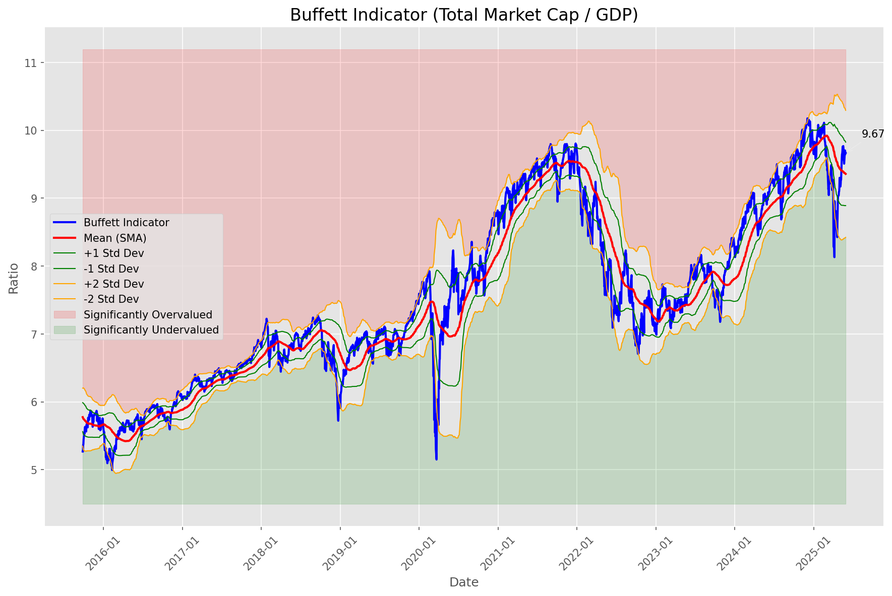
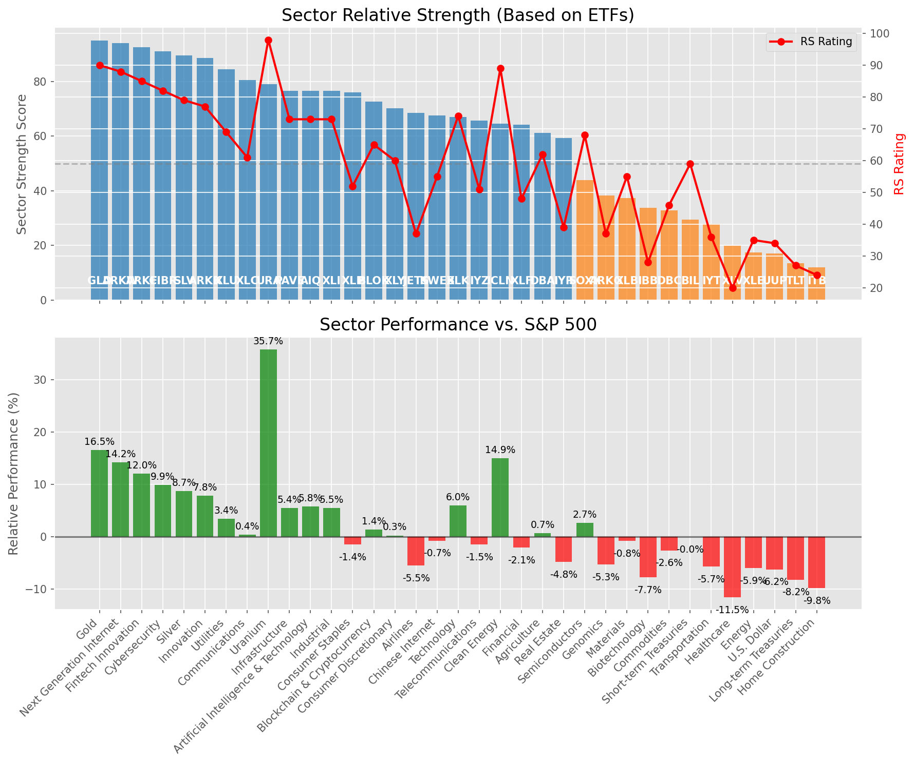

# **Daily Relative Strength Report**

**Date:** 2025-06-02

## **Market Valuation (Buffett Indicator)**

| Metric | Value |
|--------|-------|
| **Market Valuation** | **Fair Valued** |
| **Current Ratio** | 9.71 |
| **Historical Mean** | 9.36 |
| **Standard Deviation** | 0.47 |
| **Z-Score (StdDev from Mean)** | 0.67 |
| **Total Market Cap** | $291.03 trillion |
| **GDP** | $29.98 trillion |

## **Market Insights**

### **Market is Fairly Valued**

The market appears to be trading within a reasonable range of historical valuations. This suggests a balanced approach to equity investing is appropriate. Investors should:

- Focus on individual stock selection based on fundamentals and technicals
- Maintain normal equity allocations aligned with long-term goals
- Pay attention to sector rotation and relative strength
- Watch for changes in market leadership

Fair valuation typically suggests normal market returns can be expected, with stock selection becoming increasingly important.

### **Buffett Indicator Overview**

The Buffett Indicator (Total Market Cap / GDP) is a measure of the stock market's valuation relative to the size of the economy. It is named after Warren Buffett, who described it as "probably the best single measure of where valuations stand at any given moment."

- **Values above +2 standard deviations:** Market significantly overvalued
- **Values above +1 standard deviation:** Market overvalued
- **Values between -1 and +1 standard deviations:** Market fairly valued
- **Values below -1 standard deviation:** Market undervalued
- **Values below -2 standard deviations:** Market significantly undervalued

---

## **Sector Relative Strength**

Based on William O'Neil's Relative Strength Methodology

| ETF | Strength | RS Rating | Performance | Above Key MAs | Trend | Sector |
|-----|----------|-----------|-------------|--------------|-------|--------|
| [GLD](https://www.tradingview.com/chart/?symbol=GLD) | 95.0 | 90.0 | 16.76% | 10d ✓, 50d ✓, 200d ✓ | ↗️ | Gold |
| [ARKW](https://www.tradingview.com/chart/?symbol=ARKW) | 93.5 | 87.0 | 13.43% | 10d ✓, 50d ✓, 200d ✓ | ↗️ | Next Generation Internet |
| [ARKF](https://www.tradingview.com/chart/?symbol=ARKF) | 92.5 | 85.0 | 12.42% | 10d ✓, 50d ✓, 200d ✓ | ↗️ | Fintech Innovation |
| [CIBR](https://www.tradingview.com/chart/?symbol=CIBR) | 91.0 | 82.0 | 10.70% | 10d ✓, 50d ✓, 200d ✓ | ↗️ | Cybersecurity |
| [SLV](https://www.tradingview.com/chart/?symbol=SLV) | 90.5 | 81.0 | 9.72% | 10d ✓, 50d ✓, 200d ✓ | ↗️ | Silver |
| [ARKK](https://www.tradingview.com/chart/?symbol=ARKK) | 88.0 | 76.0 | 7.68% | 10d ✓, 50d ✓, 200d ✓ | ↗️ | Innovation |
| [AIQ](https://www.tradingview.com/chart/?symbol=AIQ) | 87.0 | 74.0 | 6.30% | 10d ✓, 50d ✓, 200d ✓ | ↗️ | Artificial Intelligence & Technology |
| [XLU](https://www.tradingview.com/chart/?symbol=XLU) | 84.0 | 68.0 | 3.39% | 10d ✓, 50d ✓, 200d ✓ | ↗️ | Utilities |
| [XLC](https://www.tradingview.com/chart/?symbol=XLC) | 80.5 | 61.0 | 0.88% | 10d ✓, 50d ✓, 200d ✓ | ↗️ | Communications |
| [URA](https://www.tradingview.com/chart/?symbol=URA) | 78.5 | 97.0 | 35.75% | 10d ✓, 50d ✓, 200d ✓ | ↘️ | Uranium |
| [XLI](https://www.tradingview.com/chart/?symbol=XLI) | 76.6 | 73.0 | 6.02% | 10d ✗, 50d ✓, 200d ✓ | ↗️ | Industrial |
| [PAVE](https://www.tradingview.com/chart/?symbol=PAVE) | 76.6 | 73.0 | 6.01% | 10d ✗, 50d ✓, 200d ✓ | ↗️ | Infrastructure |
| [XLP](https://www.tradingview.com/chart/?symbol=XLP) | 76.5 | 53.0 | -0.91% | 10d ✓, 50d ✓, 200d ✓ | ↗️ | Consumer Staples |
| [XLF](https://www.tradingview.com/chart/?symbol=XLF) | 75.0 | 50.0 | -1.58% | 10d ✓, 50d ✓, 200d ✓ | ↗️ | Financial |
| [BLOK](https://www.tradingview.com/chart/?symbol=BLOK) | 72.1 | 64.0 | 1.52% | 10d ✗, 50d ✓, 200d ✓ | ↗️ | Blockchain & Cryptocurrency |
| [XLY](https://www.tradingview.com/chart/?symbol=XLY) | 70.6 | 61.0 | 0.91% | 10d ✗, 50d ✓, 200d ✓ | ↗️ | Consumer Discretionary |
| [IYZ](https://www.tradingview.com/chart/?symbol=IYZ) | 69.6 | 59.0 | 0.11% | 10d ✗, 50d ✓, 200d ✓ | ↗️ | Telecommunications |
| [JETS](https://www.tradingview.com/chart/?symbol=JETS) | 68.5 | 37.0 | -5.12% | 10d ✓, 50d ✓, 200d ✓ | ↗️ | Airlines |
| [KWEB](https://www.tradingview.com/chart/?symbol=KWEB) | 67.6 | 55.0 | -0.43% | 10d ✗, 50d ✓, 200d ✓ | ↗️ | Chinese Internet |
| [XLK](https://www.tradingview.com/chart/?symbol=XLK) | 67.0 | 74.0 | 6.46% | 10d ✓, 50d ✓, 200d ✓ | ↘️ | Technology |
| [ICLN](https://www.tradingview.com/chart/?symbol=ICLN) | 64.6 | 89.0 | 15.13% | 10d ✗, 50d ✓, 200d ✓ | ↘️ | Clean Energy |
| [DBA](https://www.tradingview.com/chart/?symbol=DBA) | 60.2 | 60.0 | 0.59% | 10d ✗, 50d ✗, 200d ✓ | ↗️ | Agriculture |
| [IYR](https://www.tradingview.com/chart/?symbol=IYR) | 59.3 | 39.0 | -4.50% | 10d ✓, 50d ✓, 200d ✗ | ↗️ | Real Estate |
| [XLB](https://www.tradingview.com/chart/?symbol=XLB) | 47.8 | 56.0 | -0.28% | 10d ✓, 50d ✓, 200d ✗ | ↘️ | Materials |
| [SOXX](https://www.tradingview.com/chart/?symbol=SOXX) | 44.4 | 69.0 | 3.66% | 10d ✗, 50d ✓, 200d ✗ | ↘️ | Semiconductors |
| [ARKG](https://www.tradingview.com/chart/?symbol=ARKG) | 35.8 | 32.0 | -6.38% | 10d ✓, 50d ✓, 200d ✗ | ↘️ | Genomics |
| [IBB](https://www.tradingview.com/chart/?symbol=IBB) | 33.3 | 27.0 | -7.89% | 10d ✓, 50d ✓, 200d ✗ | ↘️ | Biotechnology |
| [DBC](https://www.tradingview.com/chart/?symbol=DBC) | 32.4 | 45.0 | -2.54% | 10d ✓, 50d ✗, 200d ✗ | ↘️ | Commodities |
| [BIL](https://www.tradingview.com/chart/?symbol=BIL) | 29.0 | 58.0 | -0.01% | 10d ✗, 50d ✗, 200d ✗ | ↘️ | Short-term Treasuries |
| [IYT](https://www.tradingview.com/chart/?symbol=IYT) | 27.9 | 36.0 | -5.28% | 10d ✗, 50d ✓, 200d ✗ | ↘️ | Transportation |
| [XLV](https://www.tradingview.com/chart/?symbol=XLV) | 19.9 | 20.0 | -11.48% | 10d ✓, 50d ✗, 200d ✗ | ↘️ | Healthcare |
| [XLE](https://www.tradingview.com/chart/?symbol=XLE) | 17.0 | 34.0 | -6.06% | 10d ✗, 50d ✗, 200d ✗ | ↘️ | Energy |
| [UUP](https://www.tradingview.com/chart/?symbol=UUP) | 16.5 | 33.0 | -6.29% | 10d ✗, 50d ✗, 200d ✗ | ↘️ | U.S. Dollar |
| [TLT](https://www.tradingview.com/chart/?symbol=TLT) | 13.0 | 26.0 | -8.31% | 10d ✗, 50d ✗, 200d ✗ | ↘️ | Long-term Treasuries |
| [ITB](https://www.tradingview.com/chart/?symbol=ITB) | 12.0 | 24.0 | -8.97% | 10d ✗, 50d ✗, 200d ✗ | ↘️ | Home Construction |

### **Sector ETF Performance Interpretation**

This table shows the relative strength metrics for different market sectors based on their representative ETFs:

- **ETF**: The ETF used to measure sector performance (click for chart)
- **Strength**: Overall sector strength score (0-100) combining multiple factors
- **RS Rating**: O'Neil RS rating of the sector ETF
- **Performance**: Performance of the sector ETF relative to SPY
- **Above Key MAs**: Whether the ETF is trading above its 10, 50, and 200-day moving averages
- **Trend**: Whether the sector is in an uptrend (↗️) or downtrend (↘️)

### **Current Sector Leadership**

The current market leadership is coming from the following sectors: **Gold, Next Generation Internet, Fintech Innovation**.

The **Gold** sector (represented by **GLD**) is showing particularly strong relative strength with an RS rating of 90.0 and performance of 16.76% vs. the S&P 500. This sector is trading above its 10-day, 50-day, 200-day moving average(s). Investors should consider focusing on high RS stocks within these leading sectors for potential outperformance.

---

## **Buy Recommendations**

The following 96 stocks show exceptional relative strength:

| RS Rating | Buy Score | Current Price | Chart | Name | Ticker |
|-----------|-----------|---------------|-------|------|--------|
| 100 | 100 | $208.11 | [Chart](https://www.tradingview.com/chart/?symbol=AGX) | Argan, Inc | AGX |
| 100 | 100 | $111.52 | [Chart](https://www.tradingview.com/chart/?symbol=SEZL) | Sezzle Inc. Common Stock | SEZL |
| 100 | 100 | $47.61 | [Chart](https://www.tradingview.com/chart/?symbol=AU) | AngloGold Ashanti plc | AU |
| 100 | 100 | $99.36 | [Chart](https://www.tradingview.com/chart/?symbol=RBRK) | Rubrik, Inc. | RBRK |
| 100 | 100 | $209.35 | [Chart](https://www.tradingview.com/chart/?symbol=DAVE) | Dave Inc. Class A Common Stock | DAVE |
| 100 | 100 | $131.35 | [Chart](https://www.tradingview.com/chart/?symbol=PLTR) | Palantir Technologies Inc. Class A Common Stock | PLTR |
| 100 | 100 | $484.75 | [Chart](https://www.tradingview.com/chart/?symbol=GEV) | GE Vernova Inc. | GEV |
| 99 | 100 | $69.34 | [Chart](https://www.tradingview.com/chart/?symbol=GDXJ) | VanEck Junior Gold Miners ETF | GDXJ |
| 99 | 100 | $43.69 | [Chart](https://www.tradingview.com/chart/?symbol=DRS) | Leonardo DRS, Inc. Common Stock | DRS |
| 99 | 100 | $329.35 | [Chart](https://www.tradingview.com/chart/?symbol=CVNA) | Carvana Co. | CVNA |
| 99 | 100 | $37.86 | [Chart](https://www.tradingview.com/chart/?symbol=KTOS) | Kratos Defense & Security Solutions, Inc. | KTOS |
| 99 | 100 | $67.69 | [Chart](https://www.tradingview.com/chart/?symbol=HOOD) | Robinhood Markets, Inc. Class A Common Stock | HOOD |
| 99 | 100 | $23.20 | [Chart](https://www.tradingview.com/chart/?symbol=PRA) | ProAssurance Corporation | PRA |
| 99 | 100 | $89.82 | [Chart](https://www.tradingview.com/chart/?symbol=RBLX) | Roblox Corporation | RBLX |
| 99 | 100 | $39.72 | [Chart](https://www.tradingview.com/chart/?symbol=PAY) | Paymentus Holdings, Inc. | PAY |
| 99 | 100 | $758.39 | [Chart](https://www.tradingview.com/chart/?symbol=AXON) | Axon Enterprise, Inc. Common Stock | AXON |
| 98 | 100 | $174.68 | [Chart](https://www.tradingview.com/chart/?symbol=PLMR) | Palomar Holdings, Inc. Common stock | PLMR |
| 98 | 100 | $22.90 | [Chart](https://www.tradingview.com/chart/?symbol=TFPM) | Triple Flag Precious Metals Corp. | TFPM |
| 97 | 100 | $133.12 | [Chart](https://www.tradingview.com/chart/?symbol=ATGE) | Adtalem Global Education Inc. Common Shares | ATGE |
| 97 | 100 | $53.69 | [Chart](https://www.tradingview.com/chart/?symbol=GDX) | VanEck Gold Miners ETF | GDX |
| 97 | 100 | $33.95 | [Chart](https://www.tradingview.com/chart/?symbol=PRDO) | Perdoceo Education Corporation | PRDO |
| 97 | 100 | $145.73 | [Chart](https://www.tradingview.com/chart/?symbol=UGL) | ProShares Ultra Gold | UGL |
| 97 | 100 | $24.80 | [Chart](https://www.tradingview.com/chart/?symbol=GRND) | Grindr Inc. | GRND |
| 97 | 100 | $164.07 | [Chart](https://www.tradingview.com/chart/?symbol=SE) | Sea Limited American Depositary Shares, each representing one Class A Ordinary Share | SE |
| 97 | 100 | $91.48 | [Chart](https://www.tradingview.com/chart/?symbol=WPM) | Wheaton Precious Metals Corp. Common Stock | WPM |
| 97 | 100 | $42.40 | [Chart](https://www.tradingview.com/chart/?symbol=FARO) | Faro Technologies Inc | FARO |
| 96 | 100 | $124.33 | [Chart](https://www.tradingview.com/chart/?symbol=AEM) | Agnico Eagle Mines Ltd. | AEM |
| 96 | 100 | $172.21 | [Chart](https://www.tradingview.com/chart/?symbol=HWM) | Howmet Aerospace Inc. | HWM |
| 96 | 100 | $35.64 | [Chart](https://www.tradingview.com/chart/?symbol=UTI) | Universal Technical Institute, Inc. | UTI |
| 96 | 100 | $23.86 | [Chart](https://www.tradingview.com/chart/?symbol=BTSG) | BrightSpring Health Services, Inc. Common Stock | BTSG |
| 96 | 100 | $19.17 | [Chart](https://www.tradingview.com/chart/?symbol=MIR) | Mirion Technologies, Inc. | MIR |
| 96 | 100 | $57.23 | [Chart](https://www.tradingview.com/chart/?symbol=SHLD) | Global X Defense Tech ETF | SHLD |
| 95 | 100 | $1216.77 | [Chart](https://www.tradingview.com/chart/?symbol=NFLX) | NetFlix Inc | NFLX |
| 95 | 100 | $279.29 | [Chart](https://www.tradingview.com/chart/?symbol=VEEV) | Veeva Systems Inc. | VEEV |
| 95 | 100 | $28.16 | [Chart](https://www.tradingview.com/chart/?symbol=UVE) | UNIVERSAL INSURANCE HLDG, INC. | UVE |
| 95 | 100 | $116.49 | [Chart](https://www.tradingview.com/chart/?symbol=CLS) | Celestica, Inc. | CLS |
| 95 | 100 | $186.22 | [Chart](https://www.tradingview.com/chart/?symbol=RGLD) | Royal Gold Inc | RGLD |
| 94 | 100 | $36.78 | [Chart](https://www.tradingview.com/chart/?symbol=AS) | Amer Sports, Inc. | AS |
| 93 | 100 | $177.69 | [Chart](https://www.tradingview.com/chart/?symbol=SFM) | Sprouts Farmers Market, Inc. | SFM |
| 93 | 100 | $100.23 | [Chart](https://www.tradingview.com/chart/?symbol=JCI) | Johnson Controls International plc | JCI |
| 93 | 100 | $247.21 | [Chart](https://www.tradingview.com/chart/?symbol=GE) | GE Aerospace | GE |
| 93 | 100 | $65.33 | [Chart](https://www.tradingview.com/chart/?symbol=UVV) | Universal Corporation | UVV |
| 92 | 100 | $155.25 | [Chart](https://www.tradingview.com/chart/?symbol=CAH) | Cardinal Health, Inc. | CAH |
| 92 | 100 | $43.83 | [Chart](https://www.tradingview.com/chart/?symbol=EWP) | iShares MSCI Spain ETF | EWP |
| 91 | 100 | $75.01 | [Chart](https://www.tradingview.com/chart/?symbol=WRB) | W.R. Berkley Corporation | WRB |
| 91 | 100 | $215.17 | [Chart](https://www.tradingview.com/chart/?symbol=BAP) | Credicorp LTD | BAP |
| 91 | 100 | $397.80 | [Chart](https://www.tradingview.com/chart/?symbol=APP) | Applovin Corporation Class A Common Stock | APP |
| 91 | 100 | $27.25 | [Chart](https://www.tradingview.com/chart/?symbol=AGI) | Alamos Gold Inc. Class A Common Shares | AGI |
| 90 | 100 | $48.20 | [Chart](https://www.tradingview.com/chart/?symbol=EWI) | iShares MSCI Italy ETF | EWI |
| 90 | 100 | $65.22 | [Chart](https://www.tradingview.com/chart/?symbol=SLF) | Sun Life Financial Inc. | SLF |
| 90 | 100 | $33.70 | [Chart](https://www.tradingview.com/chart/?symbol=IAUM) | iShares Gold Trust Micro | IAUM |
| 90 | 100 | $32.58 | [Chart](https://www.tradingview.com/chart/?symbol=OUNZ) | VanEck Merk Gold ETF | OUNZ |
| 90 | 100 | $311.45 | [Chart](https://www.tradingview.com/chart/?symbol=GLD) | SPDR Gold Trust, SPDR Gold Shares | GLD |
| 90 | 100 | $177.99 | [Chart](https://www.tradingview.com/chart/?symbol=ITA) | iShares U.S. Aerospace & Defense ETF | ITA |
| 90 | 100 | $66.94 | [Chart](https://www.tradingview.com/chart/?symbol=GLDM) | SPDR Gold MiniShares | GLDM |
| 90 | 100 | $70.89 | [Chart](https://www.tradingview.com/chart/?symbol=CTVA) | Corteva, Inc. Common Stock | CTVA |
| 90 | 100 | $63.73 | [Chart](https://www.tradingview.com/chart/?symbol=IAU) | iShares Gold Trust | IAU |
| 90 | 100 | $33.38 | [Chart](https://www.tradingview.com/chart/?symbol=AAAU) | Goldman Sachs Physical Gold ETF Shares | AAAU |
| 90 | 100 | $32.24 | [Chart](https://www.tradingview.com/chart/?symbol=SGOL) | abrdn Physical Gold Shares ETF | SGOL |
| 88 | 100 | $182.24 | [Chart](https://www.tradingview.com/chart/?symbol=PM) | Philip Morris International Inc. | PM |
| 88 | 100 | $25.73 | [Chart](https://www.tradingview.com/chart/?symbol=PHYS) | Sprott Physical Gold Trust | PHYS |
| 88 | 100 | $74.83 | [Chart](https://www.tradingview.com/chart/?symbol=EBAY) | eBay Inc | EBAY |
| 88 | 100 | $45.48 | [Chart](https://www.tradingview.com/chart/?symbol=BTI) | British American Tobacco p.l.c. American Depositary Shares, American Depositary Shares, each representing one Ordinary Share | BTI |
| 88 | 100 | $34.92 | [Chart](https://www.tradingview.com/chart/?symbol=AHR) | American Healthcare REIT, Inc. | AHR |
| 87 | 100 | $30.05 | [Chart](https://www.tradingview.com/chart/?symbol=CEF) | Sprott Physical Gold and Silver Trust | CEF |
| 86 | 100 | $157.69 | [Chart](https://www.tradingview.com/chart/?symbol=LRN) | Stride, Inc. | LRN |
| 86 | 100 | $290.28 | [Chart](https://www.tradingview.com/chart/?symbol=CME) | CME Group Inc. | CME |
| 89 | 99 | $47.52 | [Chart](https://www.tradingview.com/chart/?symbol=BBW) | Build-A-Bear Workshop, Inc. | BBW |
| 87 | 99 | $26.87 | [Chart](https://www.tradingview.com/chart/?symbol=CAE) | CAE INC | CAE |
| 87 | 99 | $42.30 | [Chart](https://www.tradingview.com/chart/?symbol=EWG) | iShares MSCI Germany ETF | EWG |
| 86 | 99 | $17.91 | [Chart](https://www.tradingview.com/chart/?symbol=BCS) | Barclays PLC | BCS |
| 85 | 99 | $24.04 | [Chart](https://www.tradingview.com/chart/?symbol=SRAD) | Sportradar Group AG Class A Ordinary Shares | SRAD |
| 88 | 98 | $51.34 | [Chart](https://www.tradingview.com/chart/?symbol=TRP) | TC Energy Corporation | TRP |
| 86 | 98 | $19.02 | [Chart](https://www.tradingview.com/chart/?symbol=AM) | Antero Midstream Corporation Common Stock | AM |
| 84 | 98 | $669.88 | [Chart](https://www.tradingview.com/chart/?symbol=SPOT) | Spotify Technology S.A. | SPOT |
| 87 | 97 | $187.02 | [Chart](https://www.tradingview.com/chart/?symbol=CVLT) | Commault Systems, Inc. | CVLT |
| 84 | 97 | $25.97 | [Chart](https://www.tradingview.com/chart/?symbol=EWS) | iShares MSCI Singapore ETF | EWS |
| 85 | 96 | $106.48 | [Chart](https://www.tradingview.com/chart/?symbol=DTM) | DT Midstream, Inc. | DTM |
| 84 | 96 | $394.16 | [Chart](https://www.tradingview.com/chart/?symbol=CYBR) | CyberArk Software Ltd. | CYBR |
| 83 | 96 | $175.18 | [Chart](https://www.tradingview.com/chart/?symbol=EAT) | Brinker International, Inc. | EAT |
| 85 | 95 | $29.10 | [Chart](https://www.tradingview.com/chart/?symbol=DBX) | Dropbox, Inc. Class A | DBX |
| 85 | 95 | $160.30 | [Chart](https://www.tradingview.com/chart/?symbol=NTRA) | Natera, Inc. Common Stock | NTRA |
| 85 | 95 | $41.36 | [Chart](https://www.tradingview.com/chart/?symbol=ARKF) | ARK Fintech Innovation ETF | ARKF |
| 85 | 95 | $85.95 | [Chart](https://www.tradingview.com/chart/?symbol=SANM) | Sanmina  Corp | SANM |
| 84 | 95 | $59.56 | [Chart](https://www.tradingview.com/chart/?symbol=IGF) | iShares Global Infrastructure ETF | IGF |
| 83 | 95 | $27.74 | [Chart](https://www.tradingview.com/chart/?symbol=IMAX) | Imax Corp | IMAX |
| 82 | 95 | $83.17 | [Chart](https://www.tradingview.com/chart/?symbol=NFG) | National Fuel Gas Co. | NFG |
| 82 | 94 | $72.42 | [Chart](https://www.tradingview.com/chart/?symbol=CIBR) | First Trust Exchange-Traded Fund II First Trust NASDAQ Cybersecurity ETF | CIBR |
| 82 | 94 | $200.24 | [Chart](https://www.tradingview.com/chart/?symbol=LOPE) | Grand Canyon Education, Inc | LOPE |
| 81 | 94 | $242.38 | [Chart](https://www.tradingview.com/chart/?symbol=LNG) | Cheniere Energy Inc | LNG |
| 83 | 93 | $50.45 | [Chart](https://www.tradingview.com/chart/?symbol=AKRO) | Akero Therapeutics, Inc. Common Stock | AKRO |
| 80 | 93 | $26.88 | [Chart](https://www.tradingview.com/chart/?symbol=SONY) | Sony Group Corporation American Depositary Shares (Each Representing One Share of Dollar Validated Common Stock) | SONY |
| 81 | 91 | $5502.00 | [Chart](https://www.tradingview.com/chart/?symbol=BKNG) | Booking Holdings Inc. Common Stock | BKNG |
| 81 | 91 | $48.62 | [Chart](https://www.tradingview.com/chart/?symbol=FTS) | Fortis Inc. Common Shares | FTS |
| 80 | 91 | $14.04 | [Chart](https://www.tradingview.com/chart/?symbol=MUFG) | Mitsubishi UFJ Financial Group, Inc. | MUFG |
| 80 | 91 | $215.22 | [Chart](https://www.tradingview.com/chart/?symbol=GWRE) | GUIDEWIRE SOFTWARE, INC. | GWRE |

---

## **Sell Recommendations**

The following 146 stocks show deteriorating relative strength:

| RS Rating | Sell Score | Current Price | Chart | Name | Ticker |
|-----------|------------|---------------|-------|------|--------|
| 1 | 100 | $11.97 | [Chart](https://www.tradingview.com/chart/?symbol=NRIX) | Nurix Therapeutics, Inc. Common stock | NRIX |
| 1 | 100 | $12.20 | [Chart](https://www.tradingview.com/chart/?symbol=IART) | Integra LifeSciences Holdings | IART |
| 2 | 100 | $34.64 | [Chart](https://www.tradingview.com/chart/?symbol=TECS) | Direxion Daily Technology Bear 3x Shares | TECS |
| 2 | 100 | $16.24 | [Chart](https://www.tradingview.com/chart/?symbol=BEAM) | Beam Therapeutics Inc. Common Stock | BEAM |
| 2 | 100 | $17.82 | [Chart](https://www.tradingview.com/chart/?symbol=NVDS) | Investment Managers Series Trust II Tradr 1.5X Short NVDA Daily ETF | NVDS |
| 2 | 100 | $15.28 | [Chart](https://www.tradingview.com/chart/?symbol=VTLE) | Vital Energy, Inc. | VTLE |
| 3 | 100 | $10.61 | [Chart](https://www.tradingview.com/chart/?symbol=LSPD) | Lightspeed Commerce Inc. | LSPD |
| 3 | 100 | $14.79 | [Chart](https://www.tradingview.com/chart/?symbol=PENN) | PENN Entertainment, Inc. Common Stock | PENN |
| 3 | 100 | $10.31 | [Chart](https://www.tradingview.com/chart/?symbol=VREX) | Varex Imaging Corporation Common Stock | VREX |
| 3 | 100 | $13.08 | [Chart](https://www.tradingview.com/chart/?symbol=DQ) | Daqo New Energy Corp. American Depositary Shares (each representing 5 Ordinary Shares) | DQ |
| 3 | 100 | $43.00 | [Chart](https://www.tradingview.com/chart/?symbol=LINE) | Lineage, Inc. Common Stock | LINE |
| 4 | 100 | $55.03 | [Chart](https://www.tradingview.com/chart/?symbol=SPB) | Spectrum Brands Holdings, Inc. | SPB |
| 4 | 100 | $29.16 | [Chart](https://www.tradingview.com/chart/?symbol=SRDX) | Surmodics, Inc. Common Stock | SRDX |
| 4 | 100 | $16.61 | [Chart](https://www.tradingview.com/chart/?symbol=FWRD) | Forward Air Corp | FWRD |
| 4 | 100 | $124.16 | [Chart](https://www.tradingview.com/chart/?symbol=KRYS) | Krystal Biotech, Inc. Common Stock | KRYS |
| 5 | 100 | $45.11 | [Chart](https://www.tradingview.com/chart/?symbol=LSCC) | Lattice Semiconductor Corp | LSCC |
| 6 | 100 | $32.76 | [Chart](https://www.tradingview.com/chart/?symbol=MBIN) | Merchants Bancorp Common Stock | MBIN |
| 6 | 100 | $10.70 | [Chart](https://www.tradingview.com/chart/?symbol=CLB) | Core Laboratories Inc. | CLB |
| 6 | 100 | $21.32 | [Chart](https://www.tradingview.com/chart/?symbol=AOSL) | Alpha and Omega Semiconductor Limited | AOSL |
| 6 | 100 | $10.54 | [Chart](https://www.tradingview.com/chart/?symbol=VYX) | NCR Voyix Corporation | VYX |
| 6 | 100 | $119.25 | [Chart](https://www.tradingview.com/chart/?symbol=RGEN) | Repligen Corp | RGEN |
| 7 | 100 | $54.48 | [Chart](https://www.tradingview.com/chart/?symbol=ALB) | Albemarle Corporation | ALB |
| 8 | 100 | $51.44 | [Chart](https://www.tradingview.com/chart/?symbol=ASGN) | ASGN Incorporated | ASGN |
| 8 | 100 | $44.73 | [Chart](https://www.tradingview.com/chart/?symbol=RHI) | Robert Half Inc. | RHI |
| 8 | 100 | $33.97 | [Chart](https://www.tradingview.com/chart/?symbol=ESTA) | Establishment Labs Holdings Inc. | ESTA |
| 8 | 100 | $20.68 | [Chart](https://www.tradingview.com/chart/?symbol=AMRK) | A-Mark Precious Metals, Inc. | AMRK |
| 8 | 100 | $17.05 | [Chart](https://www.tradingview.com/chart/?symbol=SCHL) | Scholastic Corp | SCHL |
| 9 | 100 | $57.28 | [Chart](https://www.tradingview.com/chart/?symbol=BMRN) | BioMarin Pharmaceuticals Inc | BMRN |
| 9 | 100 | $66.97 | [Chart](https://www.tradingview.com/chart/?symbol=WD) | Walker & Dunlop, Inc. | WD |
| 9 | 100 | $82.52 | [Chart](https://www.tradingview.com/chart/?symbol=KSPI) | Joint Stock Company Kaspi.kz American Depository Shares | KSPI |
| 10 | 100 | $23.35 | [Chart](https://www.tradingview.com/chart/?symbol=RPD) | Rapid7, Inc. Common Stock | RPD |
| 11 | 100 | $17.84 | [Chart](https://www.tradingview.com/chart/?symbol=PDFS) | PDF Solutions Inc | PDFS |
| 12 | 100 | $20.54 | [Chart](https://www.tradingview.com/chart/?symbol=AMN) | AMN Healthcare Services | AMN |
| 12 | 100 | $32.78 | [Chart](https://www.tradingview.com/chart/?symbol=WGO) | Winnebago Industries, Inc. | WGO |
| 12 | 100 | $17.62 | [Chart](https://www.tradingview.com/chart/?symbol=JKS) | JINKOSOLAR HOLDINGS CO | JKS |
| 13 | 100 | $26.71 | [Chart](https://www.tradingview.com/chart/?symbol=WSC) | WillScot Holdings Corporation Class A Common Stock | WSC |
| 14 | 100 | $50.93 | [Chart](https://www.tradingview.com/chart/?symbol=KBH) | KB Home | KBH |
| 15 | 100 | $14.37 | [Chart](https://www.tradingview.com/chart/?symbol=HR) | Healthcare Realty Trust Incorporated | HR |
| 16 | 100 | $10.68 | [Chart](https://www.tradingview.com/chart/?symbol=GES) | Guess?, Inc. | GES |
| 17 | 100 | $92.11 | [Chart](https://www.tradingview.com/chart/?symbol=CHRD) | Chord Energy Corporation Common Stock | CHRD |
| 17 | 100 | $52.54 | [Chart](https://www.tradingview.com/chart/?symbol=OXM) | Oxford Industries, Inc. | OXM |
| 5 | 99 | $10.13 | [Chart](https://www.tradingview.com/chart/?symbol=CWK) | Cushman & Wakefield plc Ordinary Shares | CWK |
| 6 | 99 | $14.36 | [Chart](https://www.tradingview.com/chart/?symbol=INMD) | InMode Ltd. Ordinary Shares | INMD |
| 8 | 99 | $23.75 | [Chart](https://www.tradingview.com/chart/?symbol=SM) | SM Energy Company | SM |
| 8 | 99 | $58.31 | [Chart](https://www.tradingview.com/chart/?symbol=AMWD) | American Woodmark Corp | AMWD |
| 13 | 99 | $35.73 | [Chart](https://www.tradingview.com/chart/?symbol=LIT) | Global X Lithium & Battery Tech ETF | LIT |
| 14 | 99 | $42.62 | [Chart](https://www.tradingview.com/chart/?symbol=SW) | Smurfit Westrock plc | SW |
| 4 | 98 | $74.81 | [Chart](https://www.tradingview.com/chart/?symbol=GPN) | Global Payments, Inc. | GPN |
| 10 | 98 | $37.86 | [Chart](https://www.tradingview.com/chart/?symbol=APOG) | Apogee Enterprises Inc | APOG |
| 13 | 98 | $25.44 | [Chart](https://www.tradingview.com/chart/?symbol=TRN) | Trinity Industries, Inc. | TRN |
| 3 | 97 | $28.45 | [Chart](https://www.tradingview.com/chart/?symbol=DOCN) | DigitalOcean Holdings, Inc. | DOCN |
| 8 | 97 | $78.09 | [Chart](https://www.tradingview.com/chart/?symbol=WHR) | Whirlpool Corp. | WHR |
| 10 | 97 | $97.46 | [Chart](https://www.tradingview.com/chart/?symbol=UPS) | United Parcel Service, Inc. Class B | UPS |
| 10 | 97 | $26.00 | [Chart](https://www.tradingview.com/chart/?symbol=WERN) | Werner Enterprises Inc | WERN |
| 10 | 97 | $14.91 | [Chart](https://www.tradingview.com/chart/?symbol=SAFE) | Safehold Inc. | SAFE |
| 11 | 97 | $84.80 | [Chart](https://www.tradingview.com/chart/?symbol=BCC) | Boise Cascade Company | BCC |
| 13 | 97 | $29.48 | [Chart](https://www.tradingview.com/chart/?symbol=BAX) | Baxter International Inc. | BAX |
| 13 | 97 | $11.96 | [Chart](https://www.tradingview.com/chart/?symbol=NOV) | NOV Inc. | NOV |
| 13 | 97 | $19.35 | [Chart](https://www.tradingview.com/chart/?symbol=FOR) | Forestar Group Inc. | FOR |
| 15 | 97 | $63.29 | [Chart](https://www.tradingview.com/chart/?symbol=ZROZ) | PIMCO 25+ Year Zero Coupon U.S. Treasury Index Exchange-Traded Fund | ZROZ |
| 5 | 96 | $29.61 | [Chart](https://www.tradingview.com/chart/?symbol=QDEL) | QuidelOrtho Corporation Common Stock | QDEL |
| 6 | 96 | $52.73 | [Chart](https://www.tradingview.com/chart/?symbol=SLVM) | Sylvamo Corporation | SLVM |
| 10 | 96 | $14.81 | [Chart](https://www.tradingview.com/chart/?symbol=DXC) | DXC Technology Company | DXC |
| 12 | 96 | $40.62 | [Chart](https://www.tradingview.com/chart/?symbol=ASO) | Academy Sports and Outdoors, Inc. | ASO |
| 14 | 96 | $20.79 | [Chart](https://www.tradingview.com/chart/?symbol=HZO) | MarineMax, Inc. | HZO |
| 11 | 95 | $12.15 | [Chart](https://www.tradingview.com/chart/?symbol=PMT) | PennyMac Mortgage Investment Trust | PMT |
| 11 | 95 | $14.41 | [Chart](https://www.tradingview.com/chart/?symbol=PD) | PagerDuty, Inc. | PD |
| 12 | 95 | $33.34 | [Chart](https://www.tradingview.com/chart/?symbol=SLB) | Schlumberger Limited | SLB |
| 13 | 95 | $201.26 | [Chart](https://www.tradingview.com/chart/?symbol=AAPL) | Apple Inc. | AAPL |
| 18 | 95 | $10.02 | [Chart](https://www.tradingview.com/chart/?symbol=LBTYK) | Liberty Global Ltd. Class C Common Shares | LBTYK |
| 20 | 95 | $21.28 | [Chart](https://www.tradingview.com/chart/?symbol=SIRI) | Sirius XM Holdings,  Inc | SIRI |
| 20 | 95 | $15.10 | [Chart](https://www.tradingview.com/chart/?symbol=VRE) | Veris Residential, Inc. | VRE |
| 10 | 94 | $28.41 | [Chart](https://www.tradingview.com/chart/?symbol=QID) | ProShares UltraShort QQQ | QID |
| 13 | 94 | $48.50 | [Chart](https://www.tradingview.com/chart/?symbol=ERX) | Direxion Daily Energy Bull 2X Shares | ERX |
| 21 | 94 | $104.78 | [Chart](https://www.tradingview.com/chart/?symbol=LEN) | Lennar Corporation Class A | LEN |
| 7 | 93 | $63.79 | [Chart](https://www.tradingview.com/chart/?symbol=KMX) | CarMax Inc. | KMX |
| 10 | 93 | $25.62 | [Chart](https://www.tradingview.com/chart/?symbol=WY) | Weyerhaeuser Company | WY |
| 14 | 93 | $217.97 | [Chart](https://www.tradingview.com/chart/?symbol=BIO) | Bio-Rad Laboratories, Inc.Class A | BIO |
| 19 | 93 | $10.18 | [Chart](https://www.tradingview.com/chart/?symbol=SCS) | Steelcase, Inc. | SCS |
| 21 | 93 | $41.44 | [Chart](https://www.tradingview.com/chart/?symbol=OXY) | Occidental Petroleum Corporation | OXY |
| 11 | 92 | $17.25 | [Chart](https://www.tradingview.com/chart/?symbol=CODI) | Compass Diversified | CODI |
| 14 | 92 | $24.25 | [Chart](https://www.tradingview.com/chart/?symbol=CHX) | ChampionX Corporation | CHX |
| 14 | 92 | $10.06 | [Chart](https://www.tradingview.com/chart/?symbol=SEMR) | SEMrush Holdings, Inc. | SEMR |
| 17 | 92 | $36.03 | [Chart](https://www.tradingview.com/chart/?symbol=RARE) | Ultragenyx Pharmaceutical Inc. | RARE |
| 10 | 91 | $70.20 | [Chart](https://www.tradingview.com/chart/?symbol=GEHC) | GE HealthCare Technologies Inc. Common Stock | GEHC |
| 11 | 91 | $10.73 | [Chart](https://www.tradingview.com/chart/?symbol=NEWT) | NewtekOne, Inc. Common Stock | NEWT |
| 14 | 91 | $131.99 | [Chart](https://www.tradingview.com/chart/?symbol=WEX) | WEX Inc. | WEX |
| 19 | 91 | $17.32 | [Chart](https://www.tradingview.com/chart/?symbol=DNTH) | Dianthus Therapeutics, Inc. Common Stock | DNTH |
| 15 | 90 | $43.54 | [Chart](https://www.tradingview.com/chart/?symbol=PRKS) | United Parks & Resorts Inc. | PRKS |
| 15 | 90 | $32.25 | [Chart](https://www.tradingview.com/chart/?symbol=TENB) | Tenable Holdings, Inc. | TENB |
| 22 | 90 | $30.88 | [Chart](https://www.tradingview.com/chart/?symbol=DAR) | DARLING INGREDIENTS INC. | DAR |
| 26 | 90 | $49.66 | [Chart](https://www.tradingview.com/chart/?symbol=CMG) | Chipotle Mexican Grill, Inc. | CMG |
| 16 | 89 | $63.60 | [Chart](https://www.tradingview.com/chart/?symbol=EDV) | Vanguard World Funds Extended Duration ETF | EDV |
| 17 | 89 | $54.07 | [Chart](https://www.tradingview.com/chart/?symbol=GIS) | General Mills, Inc. | GIS |
| 25 | 89 | $19.39 | [Chart](https://www.tradingview.com/chart/?symbol=VECO) | Veeco Instruments Inc | VECO |
| 13 | 88 | $56.66 | [Chart](https://www.tradingview.com/chart/?symbol=TRNO) | Terreno Realty Corporation | TRNO |
| 20 | 88 | $11.63 | [Chart](https://www.tradingview.com/chart/?symbol=PBR) | PETROLEO BRASILEIRO S.A.-PETROBRAS ADS (REP 1 COMMON SHARE) | PBR |
| 27 | 88 | $10.74 | [Chart](https://www.tradingview.com/chart/?symbol=NMFC) | NEW MOUNTAIN FINANCE CORPORATION | NMFC |
| 13 | 87 | $94.05 | [Chart](https://www.tradingview.com/chart/?symbol=BOKF) | BOK Financial Corp | BOKF |
| 17 | 87 | $10.16 | [Chart](https://www.tradingview.com/chart/?symbol=HOPE) | Hope Bancorp, Inc. | HOPE |
| 20 | 87 | $18.20 | [Chart](https://www.tradingview.com/chart/?symbol=UE) | UBRAN EDGE PROPERTIES | UE |
| 21 | 87 | $120.08 | [Chart](https://www.tradingview.com/chart/?symbol=TFX) | Teleflex Incorporated | TFX |
| 27 | 87 | $189.15 | [Chart](https://www.tradingview.com/chart/?symbol=DHR) | Danaher Corporation | DHR |
| 32 | 87 | $14.65 | [Chart](https://www.tradingview.com/chart/?symbol=FXN) | First Trust Energy AlphaDEX Fund | FXN |
| 16 | 86 | $76.89 | [Chart](https://www.tradingview.com/chart/?symbol=PFG) | Principal Financial Group, Inc. | PFG |
| 17 | 86 | $47.76 | [Chart](https://www.tradingview.com/chart/?symbol=TSCO) | Tractor Supply Co | TSCO |
| 21 | 86 | $23.41 | [Chart](https://www.tradingview.com/chart/?symbol=PFE) | Pfizer Inc. | PFE |
| 25 | 86 | $10.94 | [Chart](https://www.tradingview.com/chart/?symbol=PBR.A) | Petroleo Brasileiro S.A.-Petrobras | PBR.A |
| 26 | 86 | $36.58 | [Chart](https://www.tradingview.com/chart/?symbol=BHE) | Benchmark Electronics | BHE |
| 25 | 85 | $43.60 | [Chart](https://www.tradingview.com/chart/?symbol=MTDR) | MATADOR RESOURCES COMPANY | MTDR |
| 19 | 84 | $16.42 | [Chart](https://www.tradingview.com/chart/?symbol=CHCT) | Community Healthcare Trust Incorporated Common Stock, $0.01 par value per share | CHCT |
| 22 | 84 | $77.46 | [Chart](https://www.tradingview.com/chart/?symbol=CNS) | Cohen & Steers Inc. | CNS |
| 22 | 84 | $63.23 | [Chart](https://www.tradingview.com/chart/?symbol=MTH) | Meritage Homes Corporation | MTH |
| 27 | 84 | $209.90 | [Chart](https://www.tradingview.com/chart/?symbol=WST) | West Pharmaceutical Services, Inc. | WST |
| 18 | 82 | $59.85 | [Chart](https://www.tradingview.com/chart/?symbol=STC) | Stewart Information Services Corporation | STC |
| 24 | 82 | $12.31 | [Chart](https://www.tradingview.com/chart/?symbol=WSR) | Whitestone REIT | WSR |
| 27 | 82 | $36.55 | [Chart](https://www.tradingview.com/chart/?symbol=OVV) | Ovintiv Inc. | OVV |
| 20 | 81 | $16.68 | [Chart](https://www.tradingview.com/chart/?symbol=UMH) | UMH Properties, Inc. | UMH |
| 25 | 81 | $11.00 | [Chart](https://www.tradingview.com/chart/?symbol=MQY) | Blackrock Muni Yield Quality Fund, Inc | MQY |
| 28 | 81 | $11.84 | [Chart](https://www.tradingview.com/chart/?symbol=NVG) | Nuveen AMT-Free Municipal Credit Income Fund | NVG |
| 29 | 80 | $24.51 | [Chart](https://www.tradingview.com/chart/?symbol=ASTH) | Astrana Health Inc. Common Stock | ASTH |
| 24 | 78 | $29.46 | [Chart](https://www.tradingview.com/chart/?symbol=HTH) | HILLTOP HOLDINGS INC. | HTH |
| 30 | 78 | $10.43 | [Chart](https://www.tradingview.com/chart/?symbol=MYI) | BLACKROCK MUNIYIELD QUALITY FUND III, INC. | MYI |
| 24 | 77 | $123.62 | [Chart](https://www.tradingview.com/chart/?symbol=SUI) | Sun Communities, Inc | SUI |
| 31 | 77 | $10.31 | [Chart](https://www.tradingview.com/chart/?symbol=MUC) | BLACKROCK MUNIHOLDINGS CALIFORNIA QUALITY FUND, INC | MUC |
| 29 | 76 | $13.53 | [Chart](https://www.tradingview.com/chart/?symbol=BSM) | Black Stone Minerals, L.P. | BSM |
| 34 | 76 | $73.81 | [Chart](https://www.tradingview.com/chart/?symbol=WFG) | West Fraser Timber Co. Ltd | WFG |
| 37 | 76 | $61.99 | [Chart](https://www.tradingview.com/chart/?symbol=BLKB) | Blackbaud, Inc. | BLKB |
| 28 | 75 | $55.88 | [Chart](https://www.tradingview.com/chart/?symbol=TMHC) | Taylor Morrison Home Corporation Common Stock | TMHC |
| 28 | 75 | $10.38 | [Chart](https://www.tradingview.com/chart/?symbol=NMZ) | Nuveen Municipal High Income Opportunity Fund | NMZ |
| 29 | 75 | $38.16 | [Chart](https://www.tradingview.com/chart/?symbol=KSA) | iShares MSCI Saudi Arabia ETF | KSA |
| 31 | 75 | $10.81 | [Chart](https://www.tradingview.com/chart/?symbol=NEA) | Nuveen AMT-Free Quality Municipal Income Fund | NEA |
| 33 | 75 | $67.02 | [Chart](https://www.tradingview.com/chart/?symbol=BLV) | Vanguard Long-Term Bond ETF | BLV |
| 35 | 75 | $279.38 | [Chart](https://www.tradingview.com/chart/?symbol=BLD) | TopBuild Corp. Common Stock | BLD |
| 38 | 74 | $55.61 | [Chart](https://www.tradingview.com/chart/?symbol=CNMD) | CONMED Corporation | CNMD |
| 27 | 73 | $80.83 | [Chart](https://www.tradingview.com/chart/?symbol=CAVA) | CAVA Group, Inc. | CAVA |
| 39 | 73 | $19.51 | [Chart](https://www.tradingview.com/chart/?symbol=MSDL) | Morgan Stanley Direct Lending Fund | MSDL |
| 34 | 72 | $10.88 | [Chart](https://www.tradingview.com/chart/?symbol=LBTYA) | Liberty Global Ltd. Class A Common Shares | LBTYA |
| 36 | 72 | $23.59 | [Chart](https://www.tradingview.com/chart/?symbol=HOG) | Harley-Davidson, Inc. | HOG |
| 34 | 71 | $82.50 | [Chart](https://www.tradingview.com/chart/?symbol=XLE) | Energy Select Sector SPDR Fund | XLE |
| 35 | 70 | $17.64 | [Chart](https://www.tradingview.com/chart/?symbol=JPMpM) | JPMorgan Chase & Co. Depositary Shares, each representing a 1/400th interest in a share of 4.20% Non-Cumulative Preferred Stock, Series MM | JPMpM |
| 39 | 68 | $102.89 | [Chart](https://www.tradingview.com/chart/?symbol=XOM) | Exxon Mobil Corporation | XOM |
| 38 | 65 | $97.36 | [Chart](https://www.tradingview.com/chart/?symbol=PHM) | Pultegroup, Inc. | PHM |
| 39 | 65 | $40.10 | [Chart](https://www.tradingview.com/chart/?symbol=LKQ) | LKQ Corporation | LKQ |
| 39 | 65 | $34.36 | [Chart](https://www.tradingview.com/chart/?symbol=CMCSA) | Comcast Corp | CMCSA |
| 39 | 63 | $37.73 | [Chart](https://www.tradingview.com/chart/?symbol=WES) | Western Midstream Partners, LP | WES |

## **Methodology**

This report uses William O'Neil's relative strength methodology from Investors Business Daily:

* **RS Rating**: Percentile rank of stock's performance vs. S&P 500 over the past 63 trading days (1-99 scale)
* **Buy Criteria**: RS Rating >= 80, price above 50-day MA, strong uptrend, increasing volume
* **Sell Criteria**: RS Rating < 40, price below 50-day MA, downtrend, decreasing volume

### **O'Neil's Key Principles**

1. **Focus on relative performance** - stocks outperforming the market
2. **Price trend confirmation** - stock must be in an uptrend
3. **Volume confirmation** - strong volume supports price moves
4. **Moving average validation** - price above key moving averages
5. **Market leaders only** - concentrate on top-performing stocks

*Report generated automatically after market close*