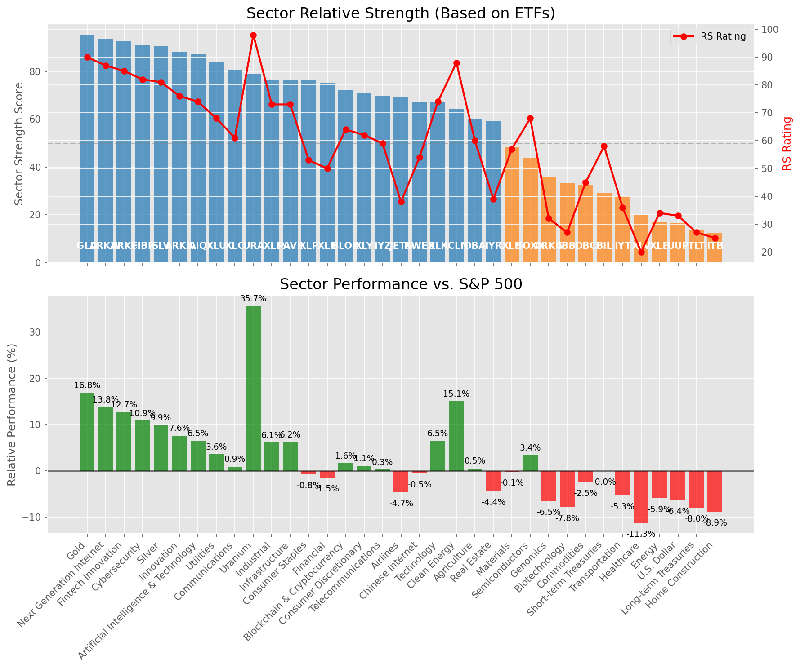

# **Daily Relative Strength Report**

**Date:** 2025-06-02

## **Market Valuation (Buffett Indicator)**

| Metric | Value |
|--------|-------|
| **Market Valuation** | **Fair Valued** |
| **Current Ratio** | 9.72 |
| **Historical Mean** | 9.36 |
| **Standard Deviation** | 0.47 |
| **Z-Score (StdDev from Mean)** | 0.67 |
| **Total Market Cap** | $291.36 trillion |
| **GDP** | $29.98 trillion |

## **Market Insights**

### **Market is Fairly Valued**

The market appears to be trading within a reasonable range of historical valuations. This suggests a balanced approach to equity investing is appropriate. Investors should:

- Focus on individual stock selection based on fundamentals and technicals
- Maintain normal equity allocations aligned with long-term goals
- Pay attention to sector rotation and relative strength
- Watch for changes in market leadership

Fair valuation typically suggests normal market returns can be expected, with stock selection becoming increasingly important.

### **Buffett Indicator Overview**

The Buffett Indicator (Total Market Cap / GDP) is a measure of the stock market's valuation relative to the size of the economy. It is named after Warren Buffett, who described it as "probably the best single measure of where valuations stand at any given moment."

- **Values above +2 standard deviations:** Market significantly overvalued
- **Values above +1 standard deviation:** Market overvalued
- **Values between -1 and +1 standard deviations:** Market fairly valued
- **Values below -1 standard deviation:** Market undervalued
- **Values below -2 standard deviations:** Market significantly undervalued

---

## **Sector Relative Strength**

Based on William O'Neil's Relative Strength Methodology

| ETF | Strength | RS Rating | Performance | Above Key MAs | Trend | Sector |
|-----|----------|-----------|-------------|--------------|-------|--------|
| [GLD](https://www.tradingview.com/chart/?symbol=GLD) | 95.0 | 90.0 | 16.84% | 10d ✓, 50d ✓, 200d ✓ | ↗️ | Gold |
| [ARKW](https://www.tradingview.com/chart/?symbol=ARKW) | 93.5 | 87.0 | 13.76% | 10d ✓, 50d ✓, 200d ✓ | ↗️ | Next Generation Internet |
| [ARKF](https://www.tradingview.com/chart/?symbol=ARKF) | 92.5 | 85.0 | 12.67% | 10d ✓, 50d ✓, 200d ✓ | ↗️ | Fintech Innovation |
| [CIBR](https://www.tradingview.com/chart/?symbol=CIBR) | 91.0 | 82.0 | 10.90% | 10d ✓, 50d ✓, 200d ✓ | ↗️ | Cybersecurity |
| [SLV](https://www.tradingview.com/chart/?symbol=SLV) | 90.5 | 81.0 | 9.88% | 10d ✓, 50d ✓, 200d ✓ | ↗️ | Silver |
| [ARKK](https://www.tradingview.com/chart/?symbol=ARKK) | 88.0 | 76.0 | 7.61% | 10d ✓, 50d ✓, 200d ✓ | ↗️ | Innovation |
| [AIQ](https://www.tradingview.com/chart/?symbol=AIQ) | 87.0 | 74.0 | 6.46% | 10d ✓, 50d ✓, 200d ✓ | ↗️ | Artificial Intelligence & Technology |
| [XLU](https://www.tradingview.com/chart/?symbol=XLU) | 84.0 | 68.0 | 3.59% | 10d ✓, 50d ✓, 200d ✓ | ↗️ | Utilities |
| [XLC](https://www.tradingview.com/chart/?symbol=XLC) | 80.5 | 61.0 | 0.91% | 10d ✓, 50d ✓, 200d ✓ | ↗️ | Communications |
| [URA](https://www.tradingview.com/chart/?symbol=URA) | 79.0 | 98.0 | 35.67% | 10d ✓, 50d ✓, 200d ✓ | ↘️ | Uranium |
| [XLI](https://www.tradingview.com/chart/?symbol=XLI) | 76.6 | 73.0 | 6.14% | 10d ✗, 50d ✓, 200d ✓ | ↗️ | Industrial |
| [PAVE](https://www.tradingview.com/chart/?symbol=PAVE) | 76.6 | 73.0 | 6.21% | 10d ✗, 50d ✓, 200d ✓ | ↗️ | Infrastructure |
| [XLP](https://www.tradingview.com/chart/?symbol=XLP) | 76.5 | 53.0 | -0.77% | 10d ✓, 50d ✓, 200d ✓ | ↗️ | Consumer Staples |
| [XLF](https://www.tradingview.com/chart/?symbol=XLF) | 75.0 | 50.0 | -1.47% | 10d ✓, 50d ✓, 200d ✓ | ↗️ | Financial |
| [BLOK](https://www.tradingview.com/chart/?symbol=BLOK) | 72.1 | 64.0 | 1.61% | 10d ✗, 50d ✓, 200d ✓ | ↗️ | Blockchain & Cryptocurrency |
| [XLY](https://www.tradingview.com/chart/?symbol=XLY) | 71.1 | 62.0 | 1.09% | 10d ✗, 50d ✓, 200d ✓ | ↗️ | Consumer Discretionary |
| [IYZ](https://www.tradingview.com/chart/?symbol=IYZ) | 69.6 | 59.0 | 0.32% | 10d ✗, 50d ✓, 200d ✓ | ↗️ | Telecommunications |
| [JETS](https://www.tradingview.com/chart/?symbol=JETS) | 69.0 | 38.0 | -4.68% | 10d ✓, 50d ✓, 200d ✓ | ↗️ | Airlines |
| [KWEB](https://www.tradingview.com/chart/?symbol=KWEB) | 67.1 | 54.0 | -0.54% | 10d ✗, 50d ✓, 200d ✓ | ↗️ | Chinese Internet |
| [XLK](https://www.tradingview.com/chart/?symbol=XLK) | 67.0 | 74.0 | 6.53% | 10d ✓, 50d ✓, 200d ✓ | ↘️ | Technology |
| [ICLN](https://www.tradingview.com/chart/?symbol=ICLN) | 64.1 | 88.0 | 15.08% | 10d ✗, 50d ✓, 200d ✓ | ↘️ | Clean Energy |
| [DBA](https://www.tradingview.com/chart/?symbol=DBA) | 60.2 | 60.0 | 0.53% | 10d ✗, 50d ✗, 200d ✓ | ↗️ | Agriculture |
| [IYR](https://www.tradingview.com/chart/?symbol=IYR) | 59.3 | 39.0 | -4.36% | 10d ✓, 50d ✓, 200d ✗ | ↗️ | Real Estate |
| [XLB](https://www.tradingview.com/chart/?symbol=XLB) | 48.3 | 57.0 | -0.15% | 10d ✓, 50d ✓, 200d ✗ | ↘️ | Materials |
| [SOXX](https://www.tradingview.com/chart/?symbol=SOXX) | 43.9 | 68.0 | 3.42% | 10d ✗, 50d ✓, 200d ✗ | ↘️ | Semiconductors |
| [ARKG](https://www.tradingview.com/chart/?symbol=ARKG) | 35.8 | 32.0 | -6.48% | 10d ✓, 50d ✓, 200d ✗ | ↘️ | Genomics |
| [IBB](https://www.tradingview.com/chart/?symbol=IBB) | 33.3 | 27.0 | -7.84% | 10d ✓, 50d ✓, 200d ✗ | ↘️ | Biotechnology |
| [DBC](https://www.tradingview.com/chart/?symbol=DBC) | 32.4 | 45.0 | -2.47% | 10d ✓, 50d ✗, 200d ✗ | ↘️ | Commodities |
| [BIL](https://www.tradingview.com/chart/?symbol=BIL) | 29.0 | 58.0 | -0.01% | 10d ✗, 50d ✗, 200d ✗ | ↘️ | Short-term Treasuries |
| [IYT](https://www.tradingview.com/chart/?symbol=IYT) | 27.9 | 36.0 | -5.31% | 10d ✗, 50d ✓, 200d ✗ | ↘️ | Transportation |
| [XLV](https://www.tradingview.com/chart/?symbol=XLV) | 19.9 | 20.0 | -11.27% | 10d ✓, 50d ✗, 200d ✗ | ↘️ | Healthcare |
| [XLE](https://www.tradingview.com/chart/?symbol=XLE) | 17.0 | 34.0 | -5.94% | 10d ✗, 50d ✗, 200d ✗ | ↘️ | Energy |
| [UUP](https://www.tradingview.com/chart/?symbol=UUP) | 16.5 | 33.0 | -6.36% | 10d ✗, 50d ✗, 200d ✗ | ↘️ | U.S. Dollar |
| [TLT](https://www.tradingview.com/chart/?symbol=TLT) | 13.5 | 27.0 | -8.00% | 10d ✗, 50d ✗, 200d ✗ | ↘️ | Long-term Treasuries |
| [ITB](https://www.tradingview.com/chart/?symbol=ITB) | 12.5 | 25.0 | -8.88% | 10d ✗, 50d ✗, 200d ✗ | ↘️ | Home Construction |

### **Sector ETF Performance Interpretation**

This table shows the relative strength metrics for different market sectors based on their representative ETFs:

- **ETF**: The ETF used to measure sector performance (click for chart)
- **Strength**: Overall sector strength score (0-100) combining multiple factors
- **RS Rating**: O'Neil RS rating of the sector ETF
- **Performance**: Performance of the sector ETF relative to SPY
- **Above Key MAs**: Whether the ETF is trading above its 10, 50, and 200-day moving averages
- **Trend**: Whether the sector is in an uptrend (↗️) or downtrend (↘️)

### **Current Sector Leadership**

The current market leadership is coming from the following sectors: **Gold, Next Generation Internet, Fintech Innovation**.

The **Gold** sector (represented by **GLD**) is showing particularly strong relative strength with an RS rating of 90.0 and performance of 16.84% vs. the S&P 500. This sector is trading above its 10-day, 50-day, 200-day moving average(s). Investors should consider focusing on high RS stocks within these leading sectors for potential outperformance.

---

## **Buy Recommendations**

The following 102 stocks show exceptional relative strength:

| RS Rating | Buy Score | Current Price | Chart | Name | Ticker |
|-----------|-----------|---------------|-------|------|--------|
| 100 | 100 | $47.42 | [Chart](https://www.tradingview.com/chart/?symbol=AU) | AngloGold Ashanti plc | AU |
| 100 | 100 | $112.52 | [Chart](https://www.tradingview.com/chart/?symbol=SEZL) | Sezzle Inc. Common Stock | SEZL |
| 100 | 100 | $209.96 | [Chart](https://www.tradingview.com/chart/?symbol=AGX) | Argan, Inc | AGX |
| 100 | 100 | $132.04 | [Chart](https://www.tradingview.com/chart/?symbol=PLTR) | Palantir Technologies Inc. Class A Common Stock | PLTR |
| 100 | 100 | $158.49 | [Chart](https://www.tradingview.com/chart/?symbol=NRG) | NRG Energy, Inc. | NRG |
| 100 | 100 | $485.16 | [Chart](https://www.tradingview.com/chart/?symbol=GEV) | GE Vernova Inc. | GEV |
| 100 | 100 | $209.08 | [Chart](https://www.tradingview.com/chart/?symbol=DAVE) | Dave Inc. Class A Common Stock | DAVE |
| 100 | 100 | $99.74 | [Chart](https://www.tradingview.com/chart/?symbol=RBRK) | Rubrik, Inc. | RBRK |
| 99 | 100 | $67.98 | [Chart](https://www.tradingview.com/chart/?symbol=HOOD) | Robinhood Markets, Inc. Class A Common Stock | HOOD |
| 99 | 100 | $69.44 | [Chart](https://www.tradingview.com/chart/?symbol=GDXJ) | VanEck Junior Gold Miners ETF | GDXJ |
| 99 | 100 | $89.95 | [Chart](https://www.tradingview.com/chart/?symbol=RBLX) | Roblox Corporation | RBLX |
| 99 | 100 | $23.19 | [Chart](https://www.tradingview.com/chart/?symbol=PRA) | ProAssurance Corporation | PRA |
| 99 | 100 | $38.04 | [Chart](https://www.tradingview.com/chart/?symbol=KTOS) | Kratos Defense & Security Solutions, Inc. | KTOS |
| 99 | 100 | $39.72 | [Chart](https://www.tradingview.com/chart/?symbol=PAY) | Paymentus Holdings, Inc. | PAY |
| 99 | 100 | $758.57 | [Chart](https://www.tradingview.com/chart/?symbol=AXON) | Axon Enterprise, Inc. Common Stock | AXON |
| 99 | 100 | $43.92 | [Chart](https://www.tradingview.com/chart/?symbol=DRS) | Leonardo DRS, Inc. Common Stock | DRS |
| 99 | 100 | $331.44 | [Chart](https://www.tradingview.com/chart/?symbol=CVNA) | Carvana Co. | CVNA |
| 98 | 100 | $23.04 | [Chart](https://www.tradingview.com/chart/?symbol=TFPM) | Triple Flag Precious Metals Corp. | TFPM |
| 98 | 100 | $175.67 | [Chart](https://www.tradingview.com/chart/?symbol=PLMR) | Palomar Holdings, Inc. Common stock | PLMR |
| 97 | 100 | $34.10 | [Chart](https://www.tradingview.com/chart/?symbol=PRDO) | Perdoceo Education Corporation | PRDO |
| 97 | 100 | $133.27 | [Chart](https://www.tradingview.com/chart/?symbol=ATGE) | Adtalem Global Education Inc. Common Shares | ATGE |
| 97 | 100 | $42.41 | [Chart](https://www.tradingview.com/chart/?symbol=FARO) | Faro Technologies Inc | FARO |
| 97 | 100 | $53.77 | [Chart](https://www.tradingview.com/chart/?symbol=GDX) | VanEck Gold Miners ETF | GDX |
| 97 | 100 | $145.80 | [Chart](https://www.tradingview.com/chart/?symbol=UGL) | ProShares Ultra Gold | UGL |
| 97 | 100 | $91.83 | [Chart](https://www.tradingview.com/chart/?symbol=WPM) | Wheaton Precious Metals Corp. Common Stock | WPM |
| 97 | 100 | $35.90 | [Chart](https://www.tradingview.com/chart/?symbol=UTI) | Universal Technical Institute, Inc. | UTI |
| 97 | 100 | $24.73 | [Chart](https://www.tradingview.com/chart/?symbol=GRND) | Grindr Inc. | GRND |
| 97 | 100 | $165.10 | [Chart](https://www.tradingview.com/chart/?symbol=SE) | Sea Limited American Depositary Shares, each representing one Class A Ordinary Share | SE |
| 96 | 100 | $124.28 | [Chart](https://www.tradingview.com/chart/?symbol=AEM) | Agnico Eagle Mines Ltd. | AEM |
| 96 | 100 | $172.65 | [Chart](https://www.tradingview.com/chart/?symbol=HWM) | Howmet Aerospace Inc. | HWM |
| 96 | 100 | $19.27 | [Chart](https://www.tradingview.com/chart/?symbol=MIR) | Mirion Technologies, Inc. | MIR |
| 96 | 100 | $23.93 | [Chart](https://www.tradingview.com/chart/?symbol=BTSG) | BrightSpring Health Services, Inc. Common Stock | BTSG |
| 96 | 100 | $57.38 | [Chart](https://www.tradingview.com/chart/?symbol=SHLD) | Global X Defense Tech ETF | SHLD |
| 95 | 100 | $116.64 | [Chart](https://www.tradingview.com/chart/?symbol=CLS) | Celestica, Inc. | CLS |
| 95 | 100 | $1218.98 | [Chart](https://www.tradingview.com/chart/?symbol=NFLX) | NetFlix Inc | NFLX |
| 95 | 100 | $278.63 | [Chart](https://www.tradingview.com/chart/?symbol=VEEV) | Veeva Systems Inc. | VEEV |
| 95 | 100 | $28.29 | [Chart](https://www.tradingview.com/chart/?symbol=UVE) | UNIVERSAL INSURANCE HLDG, INC. | UVE |
| 95 | 100 | $186.71 | [Chart](https://www.tradingview.com/chart/?symbol=RGLD) | Royal Gold Inc | RGLD |
| 94 | 100 | $36.81 | [Chart](https://www.tradingview.com/chart/?symbol=AS) | Amer Sports, Inc. | AS |
| 93 | 100 | $120.85 | [Chart](https://www.tradingview.com/chart/?symbol=EHC) | Encompass Health Corporation Common Stock | EHC |
| 93 | 100 | $247.48 | [Chart](https://www.tradingview.com/chart/?symbol=GE) | GE Aerospace | GE |
| 93 | 100 | $100.39 | [Chart](https://www.tradingview.com/chart/?symbol=JCI) | Johnson Controls International plc | JCI |
| 93 | 100 | $179.53 | [Chart](https://www.tradingview.com/chart/?symbol=SFM) | Sprouts Farmers Market, Inc. | SFM |
| 93 | 100 | $65.30 | [Chart](https://www.tradingview.com/chart/?symbol=UVV) | Universal Corporation | UVV |
| 92 | 100 | $43.89 | [Chart](https://www.tradingview.com/chart/?symbol=EWP) | iShares MSCI Spain ETF | EWP |
| 92 | 100 | $325.00 | [Chart](https://www.tradingview.com/chart/?symbol=PODD) | Insulet Corporation | PODD |
| 92 | 100 | $401.91 | [Chart](https://www.tradingview.com/chart/?symbol=APP) | Applovin Corporation Class A Common Stock | APP |
| 92 | 100 | $155.25 | [Chart](https://www.tradingview.com/chart/?symbol=CAH) | Cardinal Health, Inc. | CAH |
| 91 | 100 | $27.35 | [Chart](https://www.tradingview.com/chart/?symbol=AGI) | Alamos Gold Inc. Class A Common Shares | AGI |
| 91 | 100 | $75.17 | [Chart](https://www.tradingview.com/chart/?symbol=WRB) | W.R. Berkley Corporation | WRB |
| 90 | 100 | $63.77 | [Chart](https://www.tradingview.com/chart/?symbol=IAU) | iShares Gold Trust | IAU |
| 90 | 100 | $32.26 | [Chart](https://www.tradingview.com/chart/?symbol=SGOL) | abrdn Physical Gold Shares ETF | SGOL |
| 90 | 100 | $214.45 | [Chart](https://www.tradingview.com/chart/?symbol=BAP) | Credicorp LTD | BAP |
| 90 | 100 | $66.98 | [Chart](https://www.tradingview.com/chart/?symbol=GLDM) | SPDR Gold MiniShares | GLDM |
| 90 | 100 | $65.17 | [Chart](https://www.tradingview.com/chart/?symbol=SLF) | Sun Life Financial Inc. | SLF |
| 90 | 100 | $311.67 | [Chart](https://www.tradingview.com/chart/?symbol=GLD) | SPDR Gold Trust, SPDR Gold Shares | GLD |
| 90 | 100 | $33.41 | [Chart](https://www.tradingview.com/chart/?symbol=AAAU) | Goldman Sachs Physical Gold ETF Shares | AAAU |
| 90 | 100 | $32.59 | [Chart](https://www.tradingview.com/chart/?symbol=OUNZ) | VanEck Merk Gold ETF | OUNZ |
| 90 | 100 | $33.73 | [Chart](https://www.tradingview.com/chart/?symbol=IAUM) | iShares Gold Trust Micro | IAUM |
| 90 | 100 | $35.29 | [Chart](https://www.tradingview.com/chart/?symbol=FDP) | Fresh Del Monte Produce Inc. | FDP |
| 90 | 100 | $48.32 | [Chart](https://www.tradingview.com/chart/?symbol=EWI) | iShares MSCI Italy ETF | EWI |
| 90 | 100 | $70.95 | [Chart](https://www.tradingview.com/chart/?symbol=CTVA) | Corteva, Inc. Common Stock | CTVA |
| 89 | 100 | $239.93 | [Chart](https://www.tradingview.com/chart/?symbol=CRS) | Carpenter Technology Corp | CRS |
| 88 | 100 | $182.75 | [Chart](https://www.tradingview.com/chart/?symbol=PM) | Philip Morris International Inc. | PM |
| 88 | 100 | $25.76 | [Chart](https://www.tradingview.com/chart/?symbol=PHYS) | Sprott Physical Gold Trust | PHYS |
| 88 | 100 | $35.05 | [Chart](https://www.tradingview.com/chart/?symbol=AHR) | American Healthcare REIT, Inc. | AHR |
| 87 | 100 | $158.33 | [Chart](https://www.tradingview.com/chart/?symbol=LRN) | Stride, Inc. | LRN |
| 87 | 100 | $30.09 | [Chart](https://www.tradingview.com/chart/?symbol=CEF) | Sprott Physical Gold and Silver Trust | CEF |
| 86 | 100 | $290.71 | [Chart](https://www.tradingview.com/chart/?symbol=CME) | CME Group Inc. | CME |
| 89 | 99 | $47.63 | [Chart](https://www.tradingview.com/chart/?symbol=BBW) | Build-A-Bear Workshop, Inc. | BBW |
| 89 | 99 | $178.24 | [Chart](https://www.tradingview.com/chart/?symbol=ITA) | iShares U.S. Aerospace & Defense ETF | ITA |
| 87 | 99 | $45.39 | [Chart](https://www.tradingview.com/chart/?symbol=BTI) | British American Tobacco p.l.c. American Depositary Shares, American Depositary Shares, each representing one Ordinary Share | BTI |
| 87 | 99 | $42.34 | [Chart](https://www.tradingview.com/chart/?symbol=EWG) | iShares MSCI Germany ETF | EWG |
| 87 | 99 | $74.53 | [Chart](https://www.tradingview.com/chart/?symbol=EBAY) | eBay Inc | EBAY |
| 87 | 99 | $26.87 | [Chart](https://www.tradingview.com/chart/?symbol=CAE) | CAE INC | CAE |
| 86 | 99 | $17.93 | [Chart](https://www.tradingview.com/chart/?symbol=BCS) | Barclays PLC | BCS |
| 88 | 98 | $292.07 | [Chart](https://www.tradingview.com/chart/?symbol=COR) | Cencora, Inc. | COR |
| 88 | 98 | $51.40 | [Chart](https://www.tradingview.com/chart/?symbol=TRP) | TC Energy Corporation | TRP |
| 86 | 98 | $18.99 | [Chart](https://www.tradingview.com/chart/?symbol=AM) | Antero Midstream Corporation Common Stock | AM |
| 84 | 98 | $24.01 | [Chart](https://www.tradingview.com/chart/?symbol=SRAD) | Sportradar Group AG Class A Ordinary Shares | SRAD |
| 84 | 98 | $672.00 | [Chart](https://www.tradingview.com/chart/?symbol=SPOT) | Spotify Technology S.A. | SPOT |
| 87 | 97 | $186.98 | [Chart](https://www.tradingview.com/chart/?symbol=CVLT) | Commault Systems, Inc. | CVLT |
| 84 | 97 | $26.03 | [Chart](https://www.tradingview.com/chart/?symbol=EWS) | iShares MSCI Singapore ETF | EWS |
| 85 | 96 | $106.70 | [Chart](https://www.tradingview.com/chart/?symbol=DTM) | DT Midstream, Inc. | DTM |
| 83 | 96 | $175.92 | [Chart](https://www.tradingview.com/chart/?symbol=EAT) | Brinker International, Inc. | EAT |
| 85 | 95 | $160.69 | [Chart](https://www.tradingview.com/chart/?symbol=NTRA) | Natera, Inc. Common Stock | NTRA |
| 85 | 95 | $85.98 | [Chart](https://www.tradingview.com/chart/?symbol=SANM) | Sanmina  Corp | SANM |
| 85 | 95 | $41.45 | [Chart](https://www.tradingview.com/chart/?symbol=ARKF) | ARK Fintech Innovation ETF | ARKF |
| 85 | 95 | $29.12 | [Chart](https://www.tradingview.com/chart/?symbol=DBX) | Dropbox, Inc. Class A | DBX |
| 84 | 95 | $59.64 | [Chart](https://www.tradingview.com/chart/?symbol=IGF) | iShares Global Infrastructure ETF | IGF |
| 84 | 95 | $5538.91 | [Chart](https://www.tradingview.com/chart/?symbol=BKNG) | Booking Holdings Inc. Common Stock | BKNG |
| 83 | 95 | $393.83 | [Chart](https://www.tradingview.com/chart/?symbol=CYBR) | CyberArk Software Ltd. | CYBR |
| 82 | 95 | $83.27 | [Chart](https://www.tradingview.com/chart/?symbol=NFG) | National Fuel Gas Co. | NFG |
| 82 | 94 | $200.76 | [Chart](https://www.tradingview.com/chart/?symbol=LOPE) | Grand Canyon Education, Inc | LOPE |
| 82 | 94 | $72.55 | [Chart](https://www.tradingview.com/chart/?symbol=CIBR) | First Trust Exchange-Traded Fund II First Trust NASDAQ Cybersecurity ETF | CIBR |
| 82 | 94 | $27.70 | [Chart](https://www.tradingview.com/chart/?symbol=IMAX) | Imax Corp | IMAX |
| 81 | 94 | $243.23 | [Chart](https://www.tradingview.com/chart/?symbol=LNG) | Cheniere Energy Inc | LNG |
| 83 | 93 | $50.73 | [Chart](https://www.tradingview.com/chart/?symbol=AKRO) | Akero Therapeutics, Inc. Common Stock | AKRO |
| 81 | 91 | $48.73 | [Chart](https://www.tradingview.com/chart/?symbol=FTS) | Fortis Inc. Common Shares | FTS |
| 80 | 91 | $215.24 | [Chart](https://www.tradingview.com/chart/?symbol=GWRE) | GUIDEWIRE SOFTWARE, INC. | GWRE |
| 80 | 91 | $14.06 | [Chart](https://www.tradingview.com/chart/?symbol=MUFG) | Mitsubishi UFJ Financial Group, Inc. | MUFG |
| 80 | 90 | $79.44 | [Chart](https://www.tradingview.com/chart/?symbol=BBCA) | JPMorgan BetaBuilders Canada ETF | BBCA |

---

## **Sell Recommendations**

The following 125 stocks show deteriorating relative strength:

| RS Rating | Sell Score | Current Price | Chart | Name | Ticker |
|-----------|------------|---------------|-------|------|--------|
| 1 | 100 | $12.32 | [Chart](https://www.tradingview.com/chart/?symbol=IART) | Integra LifeSciences Holdings | IART |
| 1 | 100 | $12.14 | [Chart](https://www.tradingview.com/chart/?symbol=NRIX) | Nurix Therapeutics, Inc. Common stock | NRIX |
| 2 | 100 | $16.19 | [Chart](https://www.tradingview.com/chart/?symbol=BEAM) | Beam Therapeutics Inc. Common Stock | BEAM |
| 2 | 100 | $17.90 | [Chart](https://www.tradingview.com/chart/?symbol=NVDS) | Investment Managers Series Trust II Tradr 1.5X Short NVDA Daily ETF | NVDS |
| 2 | 100 | $15.28 | [Chart](https://www.tradingview.com/chart/?symbol=VTLE) | Vital Energy, Inc. | VTLE |
| 2 | 100 | $34.64 | [Chart](https://www.tradingview.com/chart/?symbol=TECS) | Direxion Daily Technology Bear 3x Shares | TECS |
| 3 | 100 | $13.05 | [Chart](https://www.tradingview.com/chart/?symbol=DQ) | Daqo New Energy Corp. American Depositary Shares (each representing 5 Ordinary Shares) | DQ |
| 3 | 100 | $14.78 | [Chart](https://www.tradingview.com/chart/?symbol=PENN) | PENN Entertainment, Inc. Common Stock | PENN |
| 3 | 100 | $10.31 | [Chart](https://www.tradingview.com/chart/?symbol=VREX) | Varex Imaging Corporation Common Stock | VREX |
| 3 | 100 | $10.69 | [Chart](https://www.tradingview.com/chart/?symbol=LSPD) | Lightspeed Commerce Inc. | LSPD |
| 3 | 100 | $43.02 | [Chart](https://www.tradingview.com/chart/?symbol=LINE) | Lineage, Inc. Common Stock | LINE |
| 4 | 100 | $29.16 | [Chart](https://www.tradingview.com/chart/?symbol=SRDX) | Surmodics, Inc. Common Stock | SRDX |
| 4 | 100 | $10.13 | [Chart](https://www.tradingview.com/chart/?symbol=CWK) | Cushman & Wakefield plc Ordinary Shares | CWK |
| 4 | 100 | $125.36 | [Chart](https://www.tradingview.com/chart/?symbol=KRYS) | Krystal Biotech, Inc. Common Stock | KRYS |
| 5 | 100 | $16.76 | [Chart](https://www.tradingview.com/chart/?symbol=FWRD) | Forward Air Corp | FWRD |
| 5 | 100 | $53.04 | [Chart](https://www.tradingview.com/chart/?symbol=AMWD) | American Woodmark Corp | AMWD |
| 6 | 100 | $118.57 | [Chart](https://www.tradingview.com/chart/?symbol=RGEN) | Repligen Corp | RGEN |
| 6 | 100 | $10.65 | [Chart](https://www.tradingview.com/chart/?symbol=CLB) | Core Laboratories Inc. | CLB |
| 6 | 100 | $21.35 | [Chart](https://www.tradingview.com/chart/?symbol=AOSL) | Alpha and Omega Semiconductor Limited | AOSL |
| 6 | 100 | $32.76 | [Chart](https://www.tradingview.com/chart/?symbol=MBIN) | Merchants Bancorp Common Stock | MBIN |
| 8 | 100 | $33.97 | [Chart](https://www.tradingview.com/chart/?symbol=ESTA) | Establishment Labs Holdings Inc. | ESTA |
| 8 | 100 | $17.02 | [Chart](https://www.tradingview.com/chart/?symbol=SCHL) | Scholastic Corp | SCHL |
| 8 | 100 | $66.98 | [Chart](https://www.tradingview.com/chart/?symbol=WD) | Walker & Dunlop, Inc. | WD |
| 8 | 100 | $44.81 | [Chart](https://www.tradingview.com/chart/?symbol=RHI) | Robert Half Inc. | RHI |
| 8 | 100 | $55.09 | [Chart](https://www.tradingview.com/chart/?symbol=ALB) | Albemarle Corporation | ALB |
| 9 | 100 | $82.80 | [Chart](https://www.tradingview.com/chart/?symbol=KSPI) | Joint Stock Company Kaspi.kz American Depository Shares | KSPI |
| 10 | 100 | $23.26 | [Chart](https://www.tradingview.com/chart/?symbol=RPD) | Rapid7, Inc. Common Stock | RPD |
| 11 | 100 | $20.30 | [Chart](https://www.tradingview.com/chart/?symbol=AMN) | AMN Healthcare Services | AMN |
| 11 | 100 | $32.56 | [Chart](https://www.tradingview.com/chart/?symbol=WGO) | Winnebago Industries, Inc. | WGO |
| 11 | 100 | $17.82 | [Chart](https://www.tradingview.com/chart/?symbol=PDFS) | PDF Solutions Inc | PDFS |
| 14 | 100 | $10.53 | [Chart](https://www.tradingview.com/chart/?symbol=GES) | Guess?, Inc. | GES |
| 14 | 100 | $50.99 | [Chart](https://www.tradingview.com/chart/?symbol=KBH) | KB Home | KBH |
| 16 | 100 | $91.91 | [Chart](https://www.tradingview.com/chart/?symbol=CHRD) | Chord Energy Corporation Common Stock | CHRD |
| 17 | 100 | $52.49 | [Chart](https://www.tradingview.com/chart/?symbol=OXM) | Oxford Industries, Inc. | OXM |
| 5 | 99 | $44.86 | [Chart](https://www.tradingview.com/chart/?symbol=LSCC) | Lattice Semiconductor Corp | LSCC |
| 6 | 99 | $10.56 | [Chart](https://www.tradingview.com/chart/?symbol=VYX) | NCR Voyix Corporation | VYX |
| 9 | 99 | $57.05 | [Chart](https://www.tradingview.com/chart/?symbol=BMRN) | BioMarin Pharmaceuticals Inc | BMRN |
| 12 | 99 | $17.63 | [Chart](https://www.tradingview.com/chart/?symbol=JKS) | JINKOSOLAR HOLDINGS CO | JKS |
| 12 | 99 | $21.16 | [Chart](https://www.tradingview.com/chart/?symbol=ESI) | Element Solutions Inc. | ESI |
| 15 | 99 | $14.36 | [Chart](https://www.tradingview.com/chart/?symbol=HR) | Healthcare Realty Trust Incorporated | HR |
| 5 | 98 | $14.35 | [Chart](https://www.tradingview.com/chart/?symbol=INMD) | InMode Ltd. Ordinary Shares | INMD |
| 8 | 98 | $51.72 | [Chart](https://www.tradingview.com/chart/?symbol=ASGN) | ASGN Incorporated | ASGN |
| 8 | 98 | $20.82 | [Chart](https://www.tradingview.com/chart/?symbol=AMRK) | A-Mark Precious Metals, Inc. | AMRK |
| 13 | 98 | $26.72 | [Chart](https://www.tradingview.com/chart/?symbol=WSC) | WillScot Holdings Corporation Class A Common Stock | WSC |
| 14 | 98 | $35.92 | [Chart](https://www.tradingview.com/chart/?symbol=LIT) | Global X Lithium & Battery Tech ETF | LIT |
| 14 | 98 | $42.62 | [Chart](https://www.tradingview.com/chart/?symbol=SW) | Smurfit Westrock plc | SW |
| 4 | 97 | $74.91 | [Chart](https://www.tradingview.com/chart/?symbol=GPN) | Global Payments, Inc. | GPN |
| 13 | 97 | $25.41 | [Chart](https://www.tradingview.com/chart/?symbol=TRN) | Trinity Industries, Inc. | TRN |
| 15 | 97 | $63.45 | [Chart](https://www.tradingview.com/chart/?symbol=ZROZ) | PIMCO 25+ Year Zero Coupon U.S. Treasury Index Exchange-Traded Fund | ZROZ |
| 8 | 96 | $78.55 | [Chart](https://www.tradingview.com/chart/?symbol=WHR) | Whirlpool Corp. | WHR |
| 10 | 96 | $37.94 | [Chart](https://www.tradingview.com/chart/?symbol=APOG) | Apogee Enterprises Inc | APOG |
| 10 | 95 | $25.97 | [Chart](https://www.tradingview.com/chart/?symbol=WERN) | Werner Enterprises Inc | WERN |
| 10 | 95 | $14.82 | [Chart](https://www.tradingview.com/chart/?symbol=DXC) | DXC Technology Company | DXC |
| 12 | 95 | $40.45 | [Chart](https://www.tradingview.com/chart/?symbol=ASO) | Academy Sports and Outdoors, Inc. | ASO |
| 14 | 95 | $29.55 | [Chart](https://www.tradingview.com/chart/?symbol=BAX) | Baxter International Inc. | BAX |
| 14 | 95 | $20.78 | [Chart](https://www.tradingview.com/chart/?symbol=HZO) | MarineMax, Inc. | HZO |
| 18 | 95 | $10.02 | [Chart](https://www.tradingview.com/chart/?symbol=LBTYK) | Liberty Global Ltd. Class C Common Shares | LBTYK |
| 19 | 95 | $15.07 | [Chart](https://www.tradingview.com/chart/?symbol=VRE) | Veris Residential, Inc. | VRE |
| 10 | 94 | $28.36 | [Chart](https://www.tradingview.com/chart/?symbol=QID) | ProShares UltraShort QQQ | QID |
| 10 | 94 | $14.89 | [Chart](https://www.tradingview.com/chart/?symbol=SAFE) | Safehold Inc. | SAFE |
| 11 | 94 | $12.12 | [Chart](https://www.tradingview.com/chart/?symbol=PMT) | PennyMac Mortgage Investment Trust | PMT |
| 12 | 94 | $85.12 | [Chart](https://www.tradingview.com/chart/?symbol=BCC) | Boise Cascade Company | BCC |
| 12 | 94 | $33.34 | [Chart](https://www.tradingview.com/chart/?symbol=SLB) | Schlumberger Limited | SLB |
| 13 | 94 | $48.65 | [Chart](https://www.tradingview.com/chart/?symbol=ERX) | Direxion Daily Energy Bull 2X Shares | ERX |
| 15 | 94 | $19.10 | [Chart](https://www.tradingview.com/chart/?symbol=FOR) | Forestar Group Inc. | FOR |
| 20 | 94 | $21.26 | [Chart](https://www.tradingview.com/chart/?symbol=SIRI) | Sirius XM Holdings,  Inc | SIRI |
| 13 | 93 | $29.40 | [Chart](https://www.tradingview.com/chart/?symbol=MBUU) | Malibu Boats, Inc. Class A | MBUU |
| 14 | 93 | $201.70 | [Chart](https://www.tradingview.com/chart/?symbol=AAPL) | Apple Inc. | AAPL |
| 21 | 93 | $105.02 | [Chart](https://www.tradingview.com/chart/?symbol=LEN) | Lennar Corporation Class A | LEN |
| 10 | 92 | $25.67 | [Chart](https://www.tradingview.com/chart/?symbol=WY) | Weyerhaeuser Company | WY |
| 11 | 92 | $17.25 | [Chart](https://www.tradingview.com/chart/?symbol=CODI) | Compass Diversified | CODI |
| 13 | 92 | $216.56 | [Chart](https://www.tradingview.com/chart/?symbol=BIO) | Bio-Rad Laboratories, Inc.Class A | BIO |
| 14 | 92 | $10.06 | [Chart](https://www.tradingview.com/chart/?symbol=SEMR) | SEMrush Holdings, Inc. | SEMR |
| 19 | 92 | $10.18 | [Chart](https://www.tradingview.com/chart/?symbol=SCS) | Steelcase, Inc. | SCS |
| 22 | 91 | $41.44 | [Chart](https://www.tradingview.com/chart/?symbol=OXY) | Occidental Petroleum Corporation | OXY |
| 14 | 89 | $43.05 | [Chart](https://www.tradingview.com/chart/?symbol=PRKS) | United Parks & Resorts Inc. | PRKS |
| 22 | 89 | $30.79 | [Chart](https://www.tradingview.com/chart/?symbol=DAR) | DARLING INGREDIENTS INC. | DAR |
| 17 | 88 | $54.13 | [Chart](https://www.tradingview.com/chart/?symbol=GIS) | General Mills, Inc. | GIS |
| 18 | 88 | $75.54 | [Chart](https://www.tradingview.com/chart/?symbol=CNS) | Cohen & Steers Inc. | CNS |
| 27 | 88 | $49.84 | [Chart](https://www.tradingview.com/chart/?symbol=CMG) | Chipotle Mexican Grill, Inc. | CMG |
| 17 | 87 | $10.16 | [Chart](https://www.tradingview.com/chart/?symbol=HOPE) | Hope Bancorp, Inc. | HOPE |
| 19 | 87 | $11.61 | [Chart](https://www.tradingview.com/chart/?symbol=PBR) | PETROLEO BRASILEIRO S.A.-PETROBRAS ADS (REP 1 COMMON SHARE) | PBR |
| 22 | 87 | $17.53 | [Chart](https://www.tradingview.com/chart/?symbol=DNTH) | Dianthus Therapeutics, Inc. Common Stock | DNTH |
| 25 | 87 | $19.34 | [Chart](https://www.tradingview.com/chart/?symbol=VECO) | Veeco Instruments Inc | VECO |
| 27 | 87 | $10.70 | [Chart](https://www.tradingview.com/chart/?symbol=NMFC) | NEW MOUNTAIN FINANCE CORPORATION | NMFC |
| 32 | 87 | $14.64 | [Chart](https://www.tradingview.com/chart/?symbol=FXN) | First Trust Energy AlphaDEX Fund | FXN |
| 20 | 86 | $18.19 | [Chart](https://www.tradingview.com/chart/?symbol=UE) | UBRAN EDGE PROPERTIES | UE |
| 27 | 85 | $189.23 | [Chart](https://www.tradingview.com/chart/?symbol=DHR) | Danaher Corporation | DHR |
| 17 | 84 | $35.96 | [Chart](https://www.tradingview.com/chart/?symbol=NBHC) | NATIONAL BANK HOLDINGS CORP. | NBHC |
| 17 | 84 | $47.86 | [Chart](https://www.tradingview.com/chart/?symbol=TSCO) | Tractor Supply Co | TSCO |
| 26 | 84 | $10.96 | [Chart](https://www.tradingview.com/chart/?symbol=PBR.A) | Petroleo Brasileiro S.A.-Petrobras | PBR.A |
| 17 | 83 | $76.97 | [Chart](https://www.tradingview.com/chart/?symbol=PFG) | Principal Financial Group, Inc. | PFG |
| 25 | 83 | $43.51 | [Chart](https://www.tradingview.com/chart/?symbol=MTDR) | MATADOR RESOURCES COMPANY | MTDR |
| 27 | 83 | $209.39 | [Chart](https://www.tradingview.com/chart/?symbol=WST) | West Pharmaceutical Services, Inc. | WST |
| 25 | 80 | $12.38 | [Chart](https://www.tradingview.com/chart/?symbol=WSR) | Whitestone REIT | WSR |
| 28 | 80 | $36.58 | [Chart](https://www.tradingview.com/chart/?symbol=OVV) | Ovintiv Inc. | OVV |
| 28 | 80 | $11.85 | [Chart](https://www.tradingview.com/chart/?symbol=NVG) | Nuveen AMT-Free Municipal Credit Income Fund | NVG |
| 21 | 79 | $16.71 | [Chart](https://www.tradingview.com/chart/?symbol=UMH) | UMH Properties, Inc. | UMH |
| 26 | 79 | $36.31 | [Chart](https://www.tradingview.com/chart/?symbol=STBA) | S&T Bancorp Inc | STBA |
| 29 | 79 | $24.50 | [Chart](https://www.tradingview.com/chart/?symbol=ASTH) | Astrana Health Inc. Common Stock | ASTH |
| 24 | 76 | $123.82 | [Chart](https://www.tradingview.com/chart/?symbol=SUI) | Sun Communities, Inc | SUI |
| 33 | 76 | $73.78 | [Chart](https://www.tradingview.com/chart/?symbol=WFG) | West Fraser Timber Co. Ltd | WFG |
| 28 | 75 | $10.40 | [Chart](https://www.tradingview.com/chart/?symbol=NMZ) | Nuveen Municipal High Income Opportunity Fund | NMZ |
| 29 | 75 | $38.16 | [Chart](https://www.tradingview.com/chart/?symbol=KSA) | iShares MSCI Saudi Arabia ETF | KSA |
| 29 | 75 | $13.53 | [Chart](https://www.tradingview.com/chart/?symbol=BSM) | Black Stone Minerals, L.P. | BSM |
| 32 | 75 | $10.46 | [Chart](https://www.tradingview.com/chart/?symbol=MYI) | BLACKROCK MUNIYIELD QUALITY FUND III, INC. | MYI |
| 32 | 75 | $10.34 | [Chart](https://www.tradingview.com/chart/?symbol=MUC) | BLACKROCK MUNIHOLDINGS CALIFORNIA QUALITY FUND, INC | MUC |
| 33 | 75 | $67.20 | [Chart](https://www.tradingview.com/chart/?symbol=BLV) | Vanguard Long-Term Bond ETF | BLV |
| 30 | 74 | $160.00 | [Chart](https://www.tradingview.com/chart/?symbol=ODFL) | Old Dominion Freight Line | ODFL |
| 31 | 74 | $10.81 | [Chart](https://www.tradingview.com/chart/?symbol=NEA) | Nuveen AMT-Free Quality Municipal Income Fund | NEA |
| 37 | 74 | $55.38 | [Chart](https://www.tradingview.com/chart/?symbol=CNMD) | CONMED Corporation | CNMD |
| 38 | 74 | $62.23 | [Chart](https://www.tradingview.com/chart/?symbol=BLKB) | Blackbaud, Inc. | BLKB |
| 28 | 73 | $55.85 | [Chart](https://www.tradingview.com/chart/?symbol=TMHC) | Taylor Morrison Home Corporation Common Stock | TMHC |
| 33 | 72 | $11.86 | [Chart](https://www.tradingview.com/chart/?symbol=NZF) | Nuveen Municipal Credit Income Fund | NZF |
| 34 | 72 | $10.88 | [Chart](https://www.tradingview.com/chart/?symbol=LBTYA) | Liberty Global Ltd. Class A Common Shares | LBTYA |
| 36 | 72 | $280.72 | [Chart](https://www.tradingview.com/chart/?symbol=BLD) | TopBuild Corp. Common Stock | BLD |
| 39 | 72 | $19.51 | [Chart](https://www.tradingview.com/chart/?symbol=MSDL) | Morgan Stanley Direct Lending Fund | MSDL |
| 34 | 70 | $82.60 | [Chart](https://www.tradingview.com/chart/?symbol=XLE) | Energy Select Sector SPDR Fund | XLE |
| 37 | 70 | $76.83 | [Chart](https://www.tradingview.com/chart/?symbol=OTTR) | Otter Tail Corp | OTTR |
| 37 | 70 | $23.67 | [Chart](https://www.tradingview.com/chart/?symbol=HOG) | Harley-Davidson, Inc. | HOG |
| 39 | 67 | $103.05 | [Chart](https://www.tradingview.com/chart/?symbol=XOM) | Exxon Mobil Corporation | XOM |
| 38 | 65 | $34.33 | [Chart](https://www.tradingview.com/chart/?symbol=CMCSA) | Comcast Corp | CMCSA |
| 39 | 65 | $19.01 | [Chart](https://www.tradingview.com/chart/?symbol=BTAL) | AGF U.S. Market Neutral Anti-Beta Fund | BTAL |
| 39 | 63 | $40.11 | [Chart](https://www.tradingview.com/chart/?symbol=LKQ) | LKQ Corporation | LKQ |
| 39 | 62 | $37.70 | [Chart](https://www.tradingview.com/chart/?symbol=WES) | Western Midstream Partners, LP | WES |

## **Methodology**

This report uses William O'Neil's relative strength methodology from Investors Business Daily:

* **RS Rating**: Percentile rank of stock's performance vs. S&P 500 over the past 63 trading days (1-99 scale)
* **Buy Criteria**: RS Rating >= 80, price above 50-day MA, strong uptrend, increasing volume
* **Sell Criteria**: RS Rating < 40, price below 50-day MA, downtrend, decreasing volume

### **O'Neil's Key Principles**

1. **Focus on relative performance** - stocks outperforming the market
2. **Price trend confirmation** - stock must be in an uptrend
3. **Volume confirmation** - strong volume supports price moves
4. **Moving average validation** - price above key moving averages
5. **Market leaders only** - concentrate on top-performing stocks

*Report generated automatically after market close*