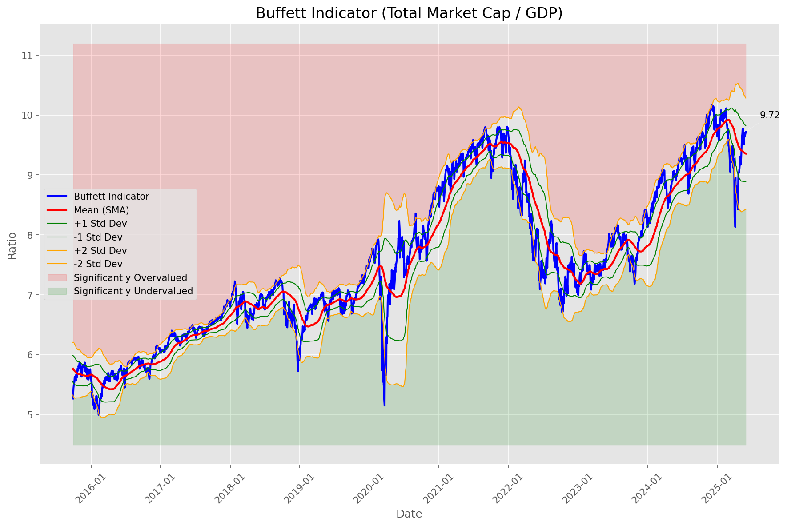
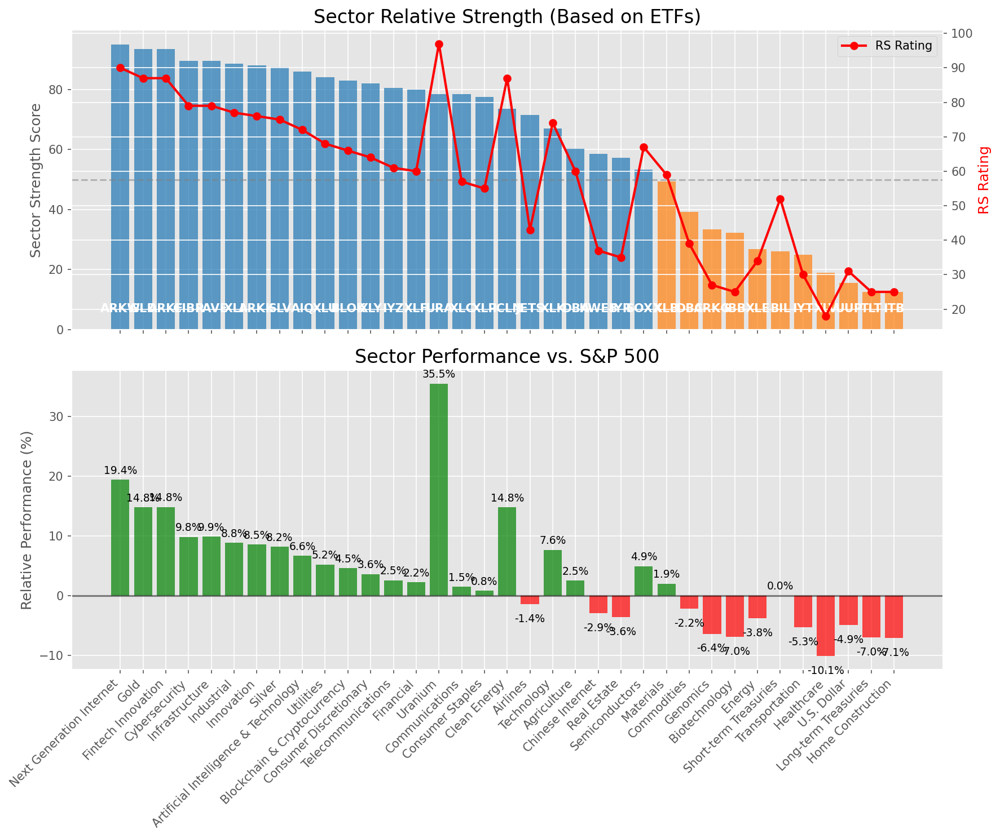

# **Daily Relative Strength Report**

**Date:** 2025-06-03

## **Market Valuation (Buffett Indicator)**

| Metric | Value |
|--------|-------|
| **Market Valuation** | **Fair Valued** |
| **Current Ratio** | 9.73 |
| **Historical Mean** | 9.36 |
| **Standard Deviation** | 0.46 |
| **Z-Score (StdDev from Mean)** | 0.79 |
| **Total Market Cap** | $291.81 trillion |
| **GDP** | $29.98 trillion |

## **Market Insights**

### **Market is Fairly Valued**

The market appears to be trading within a reasonable range of historical valuations. This suggests a balanced approach to equity investing is appropriate. Investors should:

- Focus on individual stock selection based on fundamentals and technicals
- Maintain normal equity allocations aligned with long-term goals
- Pay attention to sector rotation and relative strength
- Watch for changes in market leadership

Fair valuation typically suggests normal market returns can be expected, with stock selection becoming increasingly important.

### **Buffett Indicator Overview**

The Buffett Indicator (Total Market Cap / GDP) is a measure of the stock market's valuation relative to the size of the economy. It is named after Warren Buffett, who described it as "probably the best single measure of where valuations stand at any given moment."

- **Values above +2 standard deviations:** Market significantly overvalued
- **Values above +1 standard deviation:** Market overvalued
- **Values between -1 and +1 standard deviations:** Market fairly valued
- **Values below -1 standard deviation:** Market undervalued
- **Values below -2 standard deviations:** Market significantly undervalued

---

## **Sector Relative Strength**

Based on William O'Neil's Relative Strength Methodology

| ETF | Strength | RS Rating | Performance | Above Key MAs | Trend | Sector |
|-----|----------|-----------|-------------|--------------|-------|--------|
| [GLD](https://www.tradingview.com/chart/?symbol=GLD) | 93.5 | 87.0 | 14.29% | 10d ✓, 50d ✓, 200d ✓ | ↗️ | Gold |
| [ARKW](https://www.tradingview.com/chart/?symbol=ARKW) | 93.5 | 87.0 | 13.76% | 10d ✓, 50d ✓, 200d ✓ | ↗️ | Next Generation Internet |
| [ARKF](https://www.tradingview.com/chart/?symbol=ARKF) | 92.5 | 85.0 | 12.67% | 10d ✓, 50d ✓, 200d ✓ | ↗️ | Fintech Innovation |
| [CIBR](https://www.tradingview.com/chart/?symbol=CIBR) | 90.0 | 80.0 | 9.45% | 10d ✓, 50d ✓, 200d ✓ | ↗️ | Cybersecurity |
| [PAVE](https://www.tradingview.com/chart/?symbol=PAVE) | 89.5 | 79.0 | 8.93% | 10d ✓, 50d ✓, 200d ✓ | ↗️ | Infrastructure |
| [XLI](https://www.tradingview.com/chart/?symbol=XLI) | 89.0 | 78.0 | 8.46% | 10d ✓, 50d ✓, 200d ✓ | ↗️ | Industrial |
| [ARKK](https://www.tradingview.com/chart/?symbol=ARKK) | 88.5 | 77.0 | 8.14% | 10d ✓, 50d ✓, 200d ✓ | ↗️ | Innovation |
| [SLV](https://www.tradingview.com/chart/?symbol=SLV) | 88.0 | 76.0 | 7.71% | 10d ✓, 50d ✓, 200d ✓ | ↗️ | Silver |
| [AIQ](https://www.tradingview.com/chart/?symbol=AIQ) | 86.5 | 73.0 | 6.46% | 10d ✓, 50d ✓, 200d ✓ | ↗️ | Artificial Intelligence & Technology |
| [XLU](https://www.tradingview.com/chart/?symbol=XLU) | 85.5 | 71.0 | 5.46% | 10d ✓, 50d ✓, 200d ✓ | ↗️ | Utilities |
| [XLY](https://www.tradingview.com/chart/?symbol=XLY) | 83.0 | 66.0 | 3.28% | 10d ✓, 50d ✓, 200d ✓ | ↗️ | Consumer Discretionary |
| [XLC](https://www.tradingview.com/chart/?symbol=XLC) | 80.0 | 60.0 | 1.17% | 10d ✓, 50d ✓, 200d ✓ | ↗️ | Communications |
| [XLP](https://www.tradingview.com/chart/?symbol=XLP) | 79.0 | 58.0 | 0.33% | 10d ✓, 50d ✓, 200d ✓ | ↗️ | Consumer Staples |
| [URA](https://www.tradingview.com/chart/?symbol=URA) | 78.5 | 97.0 | 35.86% | 10d ✓, 50d ✓, 200d ✓ | ↘️ | Uranium |
| [JETS](https://www.tradingview.com/chart/?symbol=JETS) | 73.5 | 47.0 | -1.71% | 10d ✓, 50d ✓, 200d ✓ | ↗️ | Airlines |
| [BLOK](https://www.tradingview.com/chart/?symbol=BLOK) | 71.1 | 62.0 | 1.61% | 10d ✗, 50d ✓, 200d ✓ | ↗️ | Blockchain & Cryptocurrency |
| [XLF](https://www.tradingview.com/chart/?symbol=XLF) | 70.6 | 61.0 | 1.54% | 10d ✗, 50d ✓, 200d ✓ | ↗️ | Financial |
| [IYZ](https://www.tradingview.com/chart/?symbol=IYZ) | 69.1 | 58.0 | 0.32% | 10d ✗, 50d ✓, 200d ✓ | ↗️ | Telecommunications |
| [XLK](https://www.tradingview.com/chart/?symbol=XLK) | 67.5 | 75.0 | 7.38% | 10d ✓, 50d ✓, 200d ✓ | ↘️ | Technology |
| [ICLN](https://www.tradingview.com/chart/?symbol=ICLN) | 63.1 | 86.0 | 13.21% | 10d ✗, 50d ✓, 200d ✓ | ↘️ | Clean Energy |
| [KWEB](https://www.tradingview.com/chart/?symbol=KWEB) | 60.1 | 40.0 | -3.53% | 10d ✗, 50d ✓, 200d ✓ | ↗️ | Chinese Internet |
| [DBA](https://www.tradingview.com/chart/?symbol=DBA) | 59.2 | 58.0 | 0.53% | 10d ✗, 50d ✗, 200d ✓ | ↗️ | Agriculture |
| [IYR](https://www.tradingview.com/chart/?symbol=IYR) | 58.8 | 38.0 | -4.02% | 10d ✓, 50d ✓, 200d ✗ | ↗️ | Real Estate |
| [SOXX](https://www.tradingview.com/chart/?symbol=SOXX) | 53.8 | 68.0 | 4.06% | 10d ✓, 50d ✓, 200d ✗ | ↘️ | Semiconductors |
| [XLB](https://www.tradingview.com/chart/?symbol=XLB) | 39.4 | 59.0 | 0.64% | 10d ✗, 50d ✓, 200d ✗ | ↘️ | Materials |
| [IBB](https://www.tradingview.com/chart/?symbol=IBB) | 32.8 | 26.0 | -8.08% | 10d ✓, 50d ✓, 200d ✗ | ↘️ | Biotechnology |
| [ARKG](https://www.tradingview.com/chart/?symbol=ARKG) | 32.8 | 26.0 | -7.90% | 10d ✓, 50d ✓, 200d ✗ | ↘️ | Genomics |
| [DBC](https://www.tradingview.com/chart/?symbol=DBC) | 31.9 | 44.0 | -2.47% | 10d ✓, 50d ✗, 200d ✗ | ↘️ | Commodities |
| [BIL](https://www.tradingview.com/chart/?symbol=BIL) | 28.5 | 57.0 | 0.00% | 10d ✗, 50d ✗, 200d ✗ | ↘️ | Short-term Treasuries |
| [XLE](https://www.tradingview.com/chart/?symbol=XLE) | 27.9 | 36.0 | -4.81% | 10d ✓, 50d ✗, 200d ✗ | ↘️ | Energy |
| [IYT](https://www.tradingview.com/chart/?symbol=IYT) | 26.9 | 34.0 | -5.31% | 10d ✗, 50d ✓, 200d ✗ | ↘️ | Transportation |
| [TLT](https://www.tradingview.com/chart/?symbol=TLT) | 24.9 | 30.0 | -6.55% | 10d ✓, 50d ✗, 200d ✗ | ↘️ | Long-term Treasuries |
| [UUP](https://www.tradingview.com/chart/?symbol=UUP) | 17.5 | 35.0 | -4.89% | 10d ✗, 50d ✗, 200d ✗ | ↘️ | U.S. Dollar |
| [ITB](https://www.tradingview.com/chart/?symbol=ITB) | 12.5 | 25.0 | -8.34% | 10d ✗, 50d ✗, 200d ✗ | ↘️ | Home Construction |
| [XLV](https://www.tradingview.com/chart/?symbol=XLV) | 10.0 | 20.0 | -10.86% | 10d ✗, 50d ✗, 200d ✗ | ↘️ | Healthcare |

### **Sector ETF Performance Interpretation**

This table shows the relative strength metrics for different market sectors based on their representative ETFs:

- **ETF**: The ETF used to measure sector performance (click for chart)
- **Strength**: Overall sector strength score (0-100) combining multiple factors
- **RS Rating**: O'Neil RS rating of the sector ETF
- **Performance**: Performance of the sector ETF relative to SPY
- **Above Key MAs**: Whether the ETF is trading above its 10, 50, and 200-day moving averages
- **Trend**: Whether the sector is in an uptrend (↗️) or downtrend (↘️)

### **Current Sector Leadership**

The current market leadership is coming from the following sectors: **Gold, Next Generation Internet, Fintech Innovation**.

The **Gold** sector (represented by **GLD**) is showing particularly strong relative strength with an RS rating of 87.0 and performance of 14.29% vs. the S&P 500. This sector is trading above its 10-day, 50-day, 200-day moving average(s). Investors should consider focusing on high RS stocks within these leading sectors for potential outperformance.

---

## **Buy Recommendations**

The following 84 stocks show exceptional relative strength:

| RS Rating | Buy Score | Current Price | Chart | Name | Ticker |
|-----------|-----------|---------------|-------|------|--------|
| 100 | 100 | $209.96 | [Chart](https://www.tradingview.com/chart/?symbol=AGX) | Argan, Inc | AGX |
| 100 | 100 | $204.28 | [Chart](https://www.tradingview.com/chart/?symbol=DAVE) | Dave Inc. Class A Common Stock | DAVE |
| 100 | 100 | $99.52 | [Chart](https://www.tradingview.com/chart/?symbol=RBRK) | Rubrik, Inc. | RBRK |
| 100 | 100 | $339.98 | [Chart](https://www.tradingview.com/chart/?symbol=CVNA) | Carvana Co. | CVNA |
| 100 | 100 | $131.78 | [Chart](https://www.tradingview.com/chart/?symbol=PLTR) | Palantir Technologies Inc. Class A Common Stock | PLTR |
| 100 | 100 | $495.17 | [Chart](https://www.tradingview.com/chart/?symbol=GEV) | GE Vernova Inc. | GEV |
| 100 | 100 | $113.56 | [Chart](https://www.tradingview.com/chart/?symbol=SEZL) | Sezzle Inc. Common Stock | SEZL |
| 99 | 100 | $70.32 | [Chart](https://www.tradingview.com/chart/?symbol=HOOD) | Robinhood Markets, Inc. Class A Common Stock | HOOD |
| 99 | 100 | $89.78 | [Chart](https://www.tradingview.com/chart/?symbol=RBLX) | Roblox Corporation | RBLX |
| 99 | 100 | $38.80 | [Chart](https://www.tradingview.com/chart/?symbol=KTOS) | Kratos Defense & Security Solutions, Inc. | KTOS |
| 99 | 100 | $758.57 | [Chart](https://www.tradingview.com/chart/?symbol=AXON) | Axon Enterprise, Inc. Common Stock | AXON |
| 99 | 100 | $58.07 | [Chart](https://www.tradingview.com/chart/?symbol=HIMS) | Hims & Hers Health, Inc. | HIMS |
| 99 | 100 | $38.78 | [Chart](https://www.tradingview.com/chart/?symbol=PAY) | Paymentus Holdings, Inc. | PAY |
| 99 | 100 | $23.19 | [Chart](https://www.tradingview.com/chart/?symbol=PRA) | ProAssurance Corporation | PRA |
| 98 | 100 | $67.78 | [Chart](https://www.tradingview.com/chart/?symbol=GDXJ) | VanEck Junior Gold Miners ETF | GDXJ |
| 98 | 100 | $42.44 | [Chart](https://www.tradingview.com/chart/?symbol=FARO) | Faro Technologies Inc | FARO |
| 97 | 100 | $118.96 | [Chart](https://www.tradingview.com/chart/?symbol=CLS) | Celestica, Inc. | CLS |
| 97 | 100 | $35.72 | [Chart](https://www.tradingview.com/chart/?symbol=UTI) | Universal Technical Institute, Inc. | UTI |
| 97 | 100 | $172.91 | [Chart](https://www.tradingview.com/chart/?symbol=HWM) | Howmet Aerospace Inc. | HWM |
| 97 | 100 | $19.49 | [Chart](https://www.tradingview.com/chart/?symbol=MAG) | MAG Silver Corp. | MAG |
| 97 | 100 | $175.67 | [Chart](https://www.tradingview.com/chart/?symbol=PLMR) | Palomar Holdings, Inc. Common stock | PLMR |
| 97 | 100 | $23.27 | [Chart](https://www.tradingview.com/chart/?symbol=TFPM) | Triple Flag Precious Metals Corp. | TFPM |
| 97 | 100 | $19.46 | [Chart](https://www.tradingview.com/chart/?symbol=MIR) | Mirion Technologies, Inc. | MIR |
| 97 | 100 | $24.50 | [Chart](https://www.tradingview.com/chart/?symbol=GRND) | Grindr Inc. | GRND |
| 96 | 100 | $23.54 | [Chart](https://www.tradingview.com/chart/?symbol=BTSG) | BrightSpring Health Services, Inc. Common Stock | BTSG |
| 96 | 100 | $90.61 | [Chart](https://www.tradingview.com/chart/?symbol=WPM) | Wheaton Precious Metals Corp. Common Stock | WPM |
| 95 | 100 | $121.68 | [Chart](https://www.tradingview.com/chart/?symbol=AEM) | Agnico Eagle Mines Ltd. | AEM |
| 95 | 100 | $57.55 | [Chart](https://www.tradingview.com/chart/?symbol=SHLD) | Global X Defense Tech ETF | SHLD |
| 95 | 100 | $277.80 | [Chart](https://www.tradingview.com/chart/?symbol=VEEV) | Veeva Systems Inc. | VEEV |
| 95 | 100 | $37.16 | [Chart](https://www.tradingview.com/chart/?symbol=AS) | Amer Sports, Inc. | AS |
| 94 | 100 | $248.72 | [Chart](https://www.tradingview.com/chart/?symbol=GE) | GE Aerospace | GE |
| 94 | 100 | $142.10 | [Chart](https://www.tradingview.com/chart/?symbol=UGL) | ProShares Ultra Gold | UGL |
| 94 | 100 | $28.29 | [Chart](https://www.tradingview.com/chart/?symbol=UVE) | UNIVERSAL INSURANCE HLDG, INC. | UVE |
| 94 | 100 | $1214.42 | [Chart](https://www.tradingview.com/chart/?symbol=NFLX) | NetFlix Inc | NFLX |
| 93 | 100 | $400.28 | [Chart](https://www.tradingview.com/chart/?symbol=APP) | Applovin Corporation Class A Common Stock | APP |
| 93 | 100 | $155.26 | [Chart](https://www.tradingview.com/chart/?symbol=CAH) | Cardinal Health, Inc. | CAH |
| 92 | 100 | $43.89 | [Chart](https://www.tradingview.com/chart/?symbol=EWP) | iShares MSCI Spain ETF | EWP |
| 92 | 100 | $174.90 | [Chart](https://www.tradingview.com/chart/?symbol=SFM) | Sprouts Farmers Market, Inc. | SFM |
| 91 | 100 | $178.75 | [Chart](https://www.tradingview.com/chart/?symbol=ITA) | iShares U.S. Aerospace & Defense ETF | ITA |
| 91 | 100 | $325.00 | [Chart](https://www.tradingview.com/chart/?symbol=PODD) | Insulet Corporation | PODD |
| 91 | 100 | $73.86 | [Chart](https://www.tradingview.com/chart/?symbol=WRB) | W.R. Berkley Corporation | WRB |
| 90 | 100 | $48.32 | [Chart](https://www.tradingview.com/chart/?symbol=EWI) | iShares MSCI Italy ETF | EWI |
| 90 | 100 | $181.10 | [Chart](https://www.tradingview.com/chart/?symbol=PM) | Philip Morris International Inc. | PM |
| 90 | 100 | $214.45 | [Chart](https://www.tradingview.com/chart/?symbol=BAP) | Credicorp LTD | BAP |
| 89 | 100 | $45.99 | [Chart](https://www.tradingview.com/chart/?symbol=BTI) | British American Tobacco p.l.c. American Depositary Shares, American Depositary Shares, each representing one Ordinary Share | BTI |
| 89 | 100 | $26.81 | [Chart](https://www.tradingview.com/chart/?symbol=AGI) | Alamos Gold Inc. Class A Common Shares | AGI |
| 88 | 100 | $33.29 | [Chart](https://www.tradingview.com/chart/?symbol=IAUM) | iShares Gold Trust Micro | IAUM |
| 88 | 100 | $66.10 | [Chart](https://www.tradingview.com/chart/?symbol=GLDM) | SPDR Gold MiniShares | GLDM |
| 88 | 100 | $62.94 | [Chart](https://www.tradingview.com/chart/?symbol=IAU) | iShares Gold Trust | IAU |
| 88 | 100 | $175.25 | [Chart](https://www.tradingview.com/chart/?symbol=EAT) | Brinker International, Inc. | EAT |
| 87 | 100 | $307.52 | [Chart](https://www.tradingview.com/chart/?symbol=GLD) | SPDR Gold Trust, SPDR Gold Shares | GLD |
| 87 | 100 | $31.84 | [Chart](https://www.tradingview.com/chart/?symbol=SGOL) | abrdn Physical Gold Shares ETF | SGOL |
| 87 | 100 | $32.97 | [Chart](https://www.tradingview.com/chart/?symbol=AAAU) | Goldman Sachs Physical Gold ETF Shares | AAAU |
| 89 | 99 | $65.17 | [Chart](https://www.tradingview.com/chart/?symbol=SLF) | Sun Life Financial Inc. | SLF |
| 89 | 99 | $47.63 | [Chart](https://www.tradingview.com/chart/?symbol=BBW) | Build-A-Bear Workshop, Inc. | BBW |
| 87 | 99 | $26.87 | [Chart](https://www.tradingview.com/chart/?symbol=CAE) | CAE INC | CAE |
| 86 | 99 | $17.86 | [Chart](https://www.tradingview.com/chart/?symbol=BCS) | Barclays PLC | BCS |
| 85 | 99 | $283.86 | [Chart](https://www.tradingview.com/chart/?symbol=CME) | CME Group Inc. | CME |
| 88 | 98 | $50.98 | [Chart](https://www.tradingview.com/chart/?symbol=AKRO) | Akero Therapeutics, Inc. Common Stock | AKRO |
| 86 | 98 | $41.93 | [Chart](https://www.tradingview.com/chart/?symbol=EWG) | iShares MSCI Germany ETF | EWG |
| 85 | 98 | $25.43 | [Chart](https://www.tradingview.com/chart/?symbol=PHYS) | Sprott Physical Gold Trust | PHYS |
| 84 | 98 | $24.01 | [Chart](https://www.tradingview.com/chart/?symbol=SRAD) | Sportradar Group AG Class A Ordinary Shares | SRAD |
| 87 | 97 | $51.26 | [Chart](https://www.tradingview.com/chart/?symbol=TRP) | TC Energy Corporation | TRP |
| 84 | 97 | $26.03 | [Chart](https://www.tradingview.com/chart/?symbol=EWS) | iShares MSCI Singapore ETF | EWS |
| 85 | 96 | $106.70 | [Chart](https://www.tradingview.com/chart/?symbol=DTM) | DT Midstream, Inc. | DTM |
| 84 | 96 | $74.74 | [Chart](https://www.tradingview.com/chart/?symbol=EBAY) | eBay Inc | EBAY |
| 85 | 95 | $85.98 | [Chart](https://www.tradingview.com/chart/?symbol=SANM) | Sanmina  Corp | SANM |
| 85 | 95 | $41.45 | [Chart](https://www.tradingview.com/chart/?symbol=ARKF) | ARK Fintech Innovation ETF | ARKF |
| 84 | 95 | $59.64 | [Chart](https://www.tradingview.com/chart/?symbol=IGF) | iShares Global Infrastructure ETF | IGF |
| 83 | 95 | $200.76 | [Chart](https://www.tradingview.com/chart/?symbol=LOPE) | Grand Canyon Education, Inc | LOPE |
| 82 | 95 | $83.27 | [Chart](https://www.tradingview.com/chart/?symbol=NFG) | National Fuel Gas Co. | NFG |
| 82 | 95 | $243.72 | [Chart](https://www.tradingview.com/chart/?symbol=LNG) | Cheniere Energy Inc | LNG |
| 81 | 95 | $154.60 | [Chart](https://www.tradingview.com/chart/?symbol=LRN) | Stride, Inc. | LRN |
| 84 | 94 | $5538.91 | [Chart](https://www.tradingview.com/chart/?symbol=BKNG) | Booking Holdings Inc. Common Stock | BKNG |
| 84 | 94 | $160.69 | [Chart](https://www.tradingview.com/chart/?symbol=NTRA) | Natera, Inc. Common Stock | NTRA |
| 82 | 94 | $55.55 | [Chart](https://www.tradingview.com/chart/?symbol=CAKE) | Cheesecake Factory (The) | CAKE |
| 82 | 94 | $27.70 | [Chart](https://www.tradingview.com/chart/?symbol=IMAX) | Imax Corp | IMAX |
| 81 | 94 | $213.07 | [Chart](https://www.tradingview.com/chart/?symbol=DASH) | DoorDash, Inc. Class A Common Stock | DASH |
| 82 | 93 | $215.50 | [Chart](https://www.tradingview.com/chart/?symbol=GWRE) | GUIDEWIRE SOFTWARE, INC. | GWRE |
| 80 | 93 | $36.15 | [Chart](https://www.tradingview.com/chart/?symbol=UGI) | UGI Corporation | UGI |
| 82 | 92 | $48.73 | [Chart](https://www.tradingview.com/chart/?symbol=FTS) | Fortis Inc. Common Shares | FTS |
| 80 | 92 | $72.72 | [Chart](https://www.tradingview.com/chart/?symbol=CIBR) | First Trust Exchange-Traded Fund II First Trust NASDAQ Cybersecurity ETF | CIBR |
| 81 | 91 | $28.97 | [Chart](https://www.tradingview.com/chart/?symbol=DBX) | Dropbox, Inc. Class A | DBX |
| 80 | 90 | $79.44 | [Chart](https://www.tradingview.com/chart/?symbol=BBCA) | JPMorgan BetaBuilders Canada ETF | BBCA |

---

## **Sell Recommendations**

The following 241 stocks show deteriorating relative strength:

| RS Rating | Sell Score | Current Price | Chart | Name | Ticker |
|-----------|------------|---------------|-------|------|--------|
| 1 | 100 | $33.88 | [Chart](https://www.tradingview.com/chart/?symbol=TECS) | Direxion Daily Technology Bear 3x Shares | TECS |
| 1 | 100 | $37.98 | [Chart](https://www.tradingview.com/chart/?symbol=SRPT) | Sarepta Therapeutics,, Inc. Common Stock | SRPT |
| 1 | 100 | $10.05 | [Chart](https://www.tradingview.com/chart/?symbol=WNC) | Wabash National Corp. | WNC |
| 1 | 100 | $12.06 | [Chart](https://www.tradingview.com/chart/?symbol=NRIX) | Nurix Therapeutics, Inc. Common stock | NRIX |
| 1 | 100 | $12.32 | [Chart](https://www.tradingview.com/chart/?symbol=IART) | Integra LifeSciences Holdings | IART |
| 1 | 100 | $10.72 | [Chart](https://www.tradingview.com/chart/?symbol=XNCR) | Xencor, Inc. | XNCR |
| 2 | 100 | $17.10 | [Chart](https://www.tradingview.com/chart/?symbol=NVDS) | Investment Managers Series Trust II Tradr 1.5X Short NVDA Daily ETF | NVDS |
| 2 | 100 | $16.31 | [Chart](https://www.tradingview.com/chart/?symbol=BEAM) | Beam Therapeutics Inc. Common Stock | BEAM |
| 3 | 100 | $10.27 | [Chart](https://www.tradingview.com/chart/?symbol=MBC) | MasterBrand, Inc. | MBC |
| 3 | 100 | $13.05 | [Chart](https://www.tradingview.com/chart/?symbol=DQ) | Daqo New Energy Corp. American Depositary Shares (each representing 5 Ordinary Shares) | DQ |
| 3 | 100 | $10.14 | [Chart](https://www.tradingview.com/chart/?symbol=SONO) | Sonos, Inc. Common Stock | SONO |
| 3 | 100 | $10.31 | [Chart](https://www.tradingview.com/chart/?symbol=VREX) | Varex Imaging Corporation Common Stock | VREX |
| 3 | 100 | $15.88 | [Chart](https://www.tradingview.com/chart/?symbol=VTLE) | Vital Energy, Inc. | VTLE |
| 3 | 100 | $12.43 | [Chart](https://www.tradingview.com/chart/?symbol=AESI) | Atlas Energy Solutions Inc. | AESI |
| 3 | 100 | $28.57 | [Chart](https://www.tradingview.com/chart/?symbol=DOCN) | DigitalOcean Holdings, Inc. | DOCN |
| 3 | 100 | $48.55 | [Chart](https://www.tradingview.com/chart/?symbol=LGIH) | LGI Homes, Inc. | LGIH |
| 3 | 100 | $21.99 | [Chart](https://www.tradingview.com/chart/?symbol=THS) | Treehouse Foods, Inc. | THS |
| 3 | 100 | $42.72 | [Chart](https://www.tradingview.com/chart/?symbol=LINE) | Lineage, Inc. Common Stock | LINE |
| 4 | 100 | $10.13 | [Chart](https://www.tradingview.com/chart/?symbol=CWK) | Cushman & Wakefield plc Ordinary Shares | CWK |
| 4 | 100 | $10.82 | [Chart](https://www.tradingview.com/chart/?symbol=LSPD) | Lightspeed Commerce Inc. | LSPD |
| 4 | 100 | $54.97 | [Chart](https://www.tradingview.com/chart/?symbol=SPB) | Spectrum Brands Holdings, Inc. | SPB |
| 4 | 100 | $31.68 | [Chart](https://www.tradingview.com/chart/?symbol=CYTK) | Cytokinetics Inc. | CYTK |
| 4 | 100 | $125.36 | [Chart](https://www.tradingview.com/chart/?symbol=KRYS) | Krystal Biotech, Inc. Common Stock | KRYS |
| 4 | 100 | $16.76 | [Chart](https://www.tradingview.com/chart/?symbol=FWRD) | Forward Air Corp | FWRD |
| 4 | 100 | $14.65 | [Chart](https://www.tradingview.com/chart/?symbol=PENN) | PENN Entertainment, Inc. Common Stock | PENN |
| 4 | 100 | $10.22 | [Chart](https://www.tradingview.com/chart/?symbol=PRTA) | Prothena Corporation plc Ordinary Shares | PRTA |
| 4 | 100 | $10.22 | [Chart](https://www.tradingview.com/chart/?symbol=PACS) | PACS Group, Inc. | PACS |
| 5 | 100 | $74.61 | [Chart](https://www.tradingview.com/chart/?symbol=GPN) | Global Payments, Inc. | GPN |
| 5 | 100 | $53.04 | [Chart](https://www.tradingview.com/chart/?symbol=AMWD) | American Woodmark Corp | AMWD |
| 5 | 100 | $118.57 | [Chart](https://www.tradingview.com/chart/?symbol=RGEN) | Repligen Corp | RGEN |
| 5 | 100 | $45.40 | [Chart](https://www.tradingview.com/chart/?symbol=LSCC) | Lattice Semiconductor Corp | LSCC |
| 5 | 100 | $52.76 | [Chart](https://www.tradingview.com/chart/?symbol=SLVM) | Sylvamo Corporation | SLVM |
| 6 | 100 | $32.76 | [Chart](https://www.tradingview.com/chart/?symbol=MBIN) | Merchants Bancorp Common Stock | MBIN |
| 6 | 100 | $10.65 | [Chart](https://www.tradingview.com/chart/?symbol=CLB) | Core Laboratories Inc. | CLB |
| 6 | 100 | $55.31 | [Chart](https://www.tradingview.com/chart/?symbol=ALB) | Albemarle Corporation | ALB |
| 6 | 100 | $11.94 | [Chart](https://www.tradingview.com/chart/?symbol=LBRT) | Liberty Energy Inc. | LBRT |
| 6 | 100 | $21.35 | [Chart](https://www.tradingview.com/chart/?symbol=AOSL) | Alpha and Omega Semiconductor Limited | AOSL |
| 7 | 100 | $51.72 | [Chart](https://www.tradingview.com/chart/?symbol=ASGN) | ASGN Incorporated | ASGN |
| 7 | 100 | $17.02 | [Chart](https://www.tradingview.com/chart/?symbol=SCHL) | Scholastic Corp | SCHL |
| 7 | 100 | $16.44 | [Chart](https://www.tradingview.com/chart/?symbol=MLKN) | MillerKnoll, Inc. Common Stock | MLKN |
| 7 | 100 | $36.50 | [Chart](https://www.tradingview.com/chart/?symbol=BRKR) | Bruker Corporation | BRKR |
| 7 | 100 | $33.97 | [Chart](https://www.tradingview.com/chart/?symbol=ESTA) | Establishment Labs Holdings Inc. | ESTA |
| 8 | 100 | $82.80 | [Chart](https://www.tradingview.com/chart/?symbol=KSPI) | Joint Stock Company Kaspi.kz American Depository Shares | KSPI |
| 8 | 100 | $66.98 | [Chart](https://www.tradingview.com/chart/?symbol=WD) | Walker & Dunlop, Inc. | WD |
| 8 | 100 | $20.82 | [Chart](https://www.tradingview.com/chart/?symbol=AMRK) | A-Mark Precious Metals, Inc. | AMRK |
| 8 | 100 | $56.41 | [Chart](https://www.tradingview.com/chart/?symbol=BMRN) | BioMarin Pharmaceuticals Inc | BMRN |
| 8 | 100 | $13.14 | [Chart](https://www.tradingview.com/chart/?symbol=THRY) | Thryv Holdings, Inc. Common Stock | THRY |
| 9 | 100 | $25.97 | [Chart](https://www.tradingview.com/chart/?symbol=WERN) | Werner Enterprises Inc | WERN |
| 9 | 100 | $10.61 | [Chart](https://www.tradingview.com/chart/?symbol=VYX) | NCR Voyix Corporation | VYX |
| 9 | 100 | $44.46 | [Chart](https://www.tradingview.com/chart/?symbol=RHI) | Robert Half Inc. | RHI |
| 10 | 100 | $20.30 | [Chart](https://www.tradingview.com/chart/?symbol=AMN) | AMN Healthcare Services | AMN |
| 10 | 100 | $48.35 | [Chart](https://www.tradingview.com/chart/?symbol=ASH) | Ashland Inc. | ASH |
| 10 | 100 | $23.26 | [Chart](https://www.tradingview.com/chart/?symbol=RPD) | Rapid7, Inc. Common Stock | RPD |
| 10 | 100 | $14.85 | [Chart](https://www.tradingview.com/chart/?symbol=DXC) | DXC Technology Company | DXC |
| 10 | 100 | $19.26 | [Chart](https://www.tradingview.com/chart/?symbol=OLN) | Olin Corp. | OLN |
| 10 | 100 | $25.96 | [Chart](https://www.tradingview.com/chart/?symbol=THRM) | Gentherm Inc | THRM |
| 10 | 100 | $32.56 | [Chart](https://www.tradingview.com/chart/?symbol=WGO) | Winnebago Industries, Inc. | WGO |
| 10 | 100 | $10.19 | [Chart](https://www.tradingview.com/chart/?symbol=SD) | SandRidge Energy, Inc. | SD |
| 11 | 100 | $85.12 | [Chart](https://www.tradingview.com/chart/?symbol=BCC) | Boise Cascade Company | BCC |
| 11 | 100 | $17.63 | [Chart](https://www.tradingview.com/chart/?symbol=JKS) | JINKOSOLAR HOLDINGS CO | JKS |
| 11 | 100 | $17.82 | [Chart](https://www.tradingview.com/chart/?symbol=PDFS) | PDF Solutions Inc | PDFS |
| 11 | 100 | $97.64 | [Chart](https://www.tradingview.com/chart/?symbol=UPS) | United Parcel Service, Inc. Class B | UPS |
| 12 | 100 | $25.41 | [Chart](https://www.tradingview.com/chart/?symbol=TRN) | Trinity Industries, Inc. | TRN |
| 12 | 100 | $24.18 | [Chart](https://www.tradingview.com/chart/?symbol=SM) | SM Energy Company | SM |
| 13 | 100 | $20.78 | [Chart](https://www.tradingview.com/chart/?symbol=HZO) | MarineMax, Inc. | HZO |
| 14 | 100 | $10.53 | [Chart](https://www.tradingview.com/chart/?symbol=GES) | Guess?, Inc. | GES |
| 14 | 100 | $14.17 | [Chart](https://www.tradingview.com/chart/?symbol=HR) | Healthcare Realty Trust Incorporated | HR |
| 14 | 100 | $50.99 | [Chart](https://www.tradingview.com/chart/?symbol=KBH) | KB Home | KBH |
| 15 | 100 | $91.91 | [Chart](https://www.tradingview.com/chart/?symbol=CHRD) | Chord Energy Corporation Common Stock | CHRD |
| 16 | 100 | $52.49 | [Chart](https://www.tradingview.com/chart/?symbol=OXM) | Oxford Industries, Inc. | OXM |
| 5 | 99 | $14.35 | [Chart](https://www.tradingview.com/chart/?symbol=INMD) | InMode Ltd. Ordinary Shares | INMD |
| 6 | 99 | $394.49 | [Chart](https://www.tradingview.com/chart/?symbol=TMO) | Thermo Fisher Scientific, Inc. | TMO |
| 7 | 99 | $31.04 | [Chart](https://www.tradingview.com/chart/?symbol=TWST) | Twist Bioscience Corporation Common Stock | TWST |
| 8 | 99 | $65.46 | [Chart](https://www.tradingview.com/chart/?symbol=KMX) | CarMax Inc. | KMX |
| 9 | 99 | $28.15 | [Chart](https://www.tradingview.com/chart/?symbol=QID) | ProShares UltraShort QQQ | QID |
| 10 | 99 | $75.97 | [Chart](https://www.tradingview.com/chart/?symbol=MRK) | Merck & Co., Inc. | MRK |
| 10 | 99 | $14.89 | [Chart](https://www.tradingview.com/chart/?symbol=SAFE) | Safehold Inc. | SAFE |
| 11 | 99 | $21.16 | [Chart](https://www.tradingview.com/chart/?symbol=ESI) | Element Solutions Inc. | ESI |
| 11 | 99 | $20.07 | [Chart](https://www.tradingview.com/chart/?symbol=HAL) | Halliburton Company | HAL |
| 12 | 99 | $216.56 | [Chart](https://www.tradingview.com/chart/?symbol=BIO) | Bio-Rad Laboratories, Inc.Class A | BIO |
| 14 | 99 | $202.39 | [Chart](https://www.tradingview.com/chart/?symbol=AAPL) | Apple Inc. | AAPL |
| 18 | 99 | $104.55 | [Chart](https://www.tradingview.com/chart/?symbol=LEN) | Lennar Corporation Class A | LEN |
| 21 | 99 | $21.24 | [Chart](https://www.tradingview.com/chart/?symbol=SIRI) | Sirius XM Holdings,  Inc | SIRI |
| 8 | 98 | $21.70 | [Chart](https://www.tradingview.com/chart/?symbol=SPT) | Sprout Social, Inc Class A Common Stock | SPT |
| 9 | 98 | $10.84 | [Chart](https://www.tradingview.com/chart/?symbol=FBRT) | Franklin BSP Realty Trust, Inc. | FBRT |
| 9 | 98 | $37.94 | [Chart](https://www.tradingview.com/chart/?symbol=APOG) | Apogee Enterprises Inc | APOG |
| 10 | 98 | $107.13 | [Chart](https://www.tradingview.com/chart/?symbol=BLDR) | Builders FirstSource, Inc. | BLDR |
| 13 | 98 | $29.46 | [Chart](https://www.tradingview.com/chart/?symbol=BAX) | Baxter International Inc. | BAX |
| 14 | 98 | $32.55 | [Chart](https://www.tradingview.com/chart/?symbol=TENB) | Tenable Holdings, Inc. | TENB |
| 14 | 98 | $33.44 | [Chart](https://www.tradingview.com/chart/?symbol=SLB) | Schlumberger Limited | SLB |
| 17 | 98 | $10.02 | [Chart](https://www.tradingview.com/chart/?symbol=LBTYK) | Liberty Global Ltd. Class C Common Shares | LBTYK |
| 11 | 97 | $33.11 | [Chart](https://www.tradingview.com/chart/?symbol=HUBG) | HUB Group Inc | HUBG |
| 11 | 97 | $25.61 | [Chart](https://www.tradingview.com/chart/?symbol=WY) | Weyerhaeuser Company | WY |
| 12 | 97 | $12.06 | [Chart](https://www.tradingview.com/chart/?symbol=PMT) | PennyMac Mortgage Investment Trust | PMT |
| 14 | 97 | $12.09 | [Chart](https://www.tradingview.com/chart/?symbol=NOV) | NOV Inc. | NOV |
| 18 | 97 | $15.07 | [Chart](https://www.tradingview.com/chart/?symbol=VRE) | Veris Residential, Inc. | VRE |
| 8 | 96 | $30.20 | [Chart](https://www.tradingview.com/chart/?symbol=OMCL) | Omnicell Inc | OMCL |
| 9 | 96 | $17.08 | [Chart](https://www.tradingview.com/chart/?symbol=CDNA) | CareDx, Inc. | CDNA |
| 13 | 96 | $35.92 | [Chart](https://www.tradingview.com/chart/?symbol=LIT) | Global X Lithium & Battery Tech ETF | LIT |
| 14 | 96 | $35.59 | [Chart](https://www.tradingview.com/chart/?symbol=ANDE) | Andersons Inc/The | ANDE |
| 16 | 96 | $24.32 | [Chart](https://www.tradingview.com/chart/?symbol=CHX) | ChampionX Corporation | CHX |
| 18 | 96 | $10.18 | [Chart](https://www.tradingview.com/chart/?symbol=SCS) | Steelcase, Inc. | SCS |
| 21 | 96 | $41.81 | [Chart](https://www.tradingview.com/chart/?symbol=OXY) | Occidental Petroleum Corporation | OXY |
| 10 | 95 | $14.37 | [Chart](https://www.tradingview.com/chart/?symbol=PD) | PagerDuty, Inc. | PD |
| 12 | 95 | $29.40 | [Chart](https://www.tradingview.com/chart/?symbol=MBUU) | Malibu Boats, Inc. Class A | MBUU |
| 13 | 95 | $49.71 | [Chart](https://www.tradingview.com/chart/?symbol=POWI) | Power Integrations Inc | POWI |
| 13 | 95 | $10.42 | [Chart](https://www.tradingview.com/chart/?symbol=AEO) | American Eagle Outfitters | AEO |
| 13 | 95 | $131.63 | [Chart](https://www.tradingview.com/chart/?symbol=WEX) | WEX Inc. | WEX |
| 13 | 95 | $10.06 | [Chart](https://www.tradingview.com/chart/?symbol=SEMR) | SEMrush Holdings, Inc. | SEMR |
| 13 | 95 | $10.01 | [Chart](https://www.tradingview.com/chart/?symbol=XPRO) | Expro Group Holdings N.V. | XPRO |
| 14 | 95 | $19.10 | [Chart](https://www.tradingview.com/chart/?symbol=FOR) | Forestar Group Inc. | FOR |
| 23 | 95 | $11.71 | [Chart](https://www.tradingview.com/chart/?symbol=KELYA) | Kelly Services Inc | KELYA |
| 7 | 94 | $10.95 | [Chart](https://www.tradingview.com/chart/?symbol=NMRK) | Newmark Group, Inc. Class A Common Stock | NMRK |
| 7 | 94 | $10.96 | [Chart](https://www.tradingview.com/chart/?symbol=CERT) | Certara, Inc. Common Stock | CERT |
| 8 | 94 | $11.65 | [Chart](https://www.tradingview.com/chart/?symbol=APLE) | Apple Hospitality REIT, Inc. | APLE |
| 10 | 94 | $17.25 | [Chart](https://www.tradingview.com/chart/?symbol=CODI) | Compass Diversified | CODI |
| 14 | 94 | $128.66 | [Chart](https://www.tradingview.com/chart/?symbol=NSIT) | Insight Enterprises Inc | NSIT |
| 15 | 94 | $48.82 | [Chart](https://www.tradingview.com/chart/?symbol=ERX) | Direxion Daily Energy Bull 2X Shares | ERX |
| 19 | 94 | $21.27 | [Chart](https://www.tradingview.com/chart/?symbol=GNTX) | Gentex Corp | GNTX |
| 20 | 94 | $17.53 | [Chart](https://www.tradingview.com/chart/?symbol=DNTH) | Dianthus Therapeutics, Inc. Common Stock | DNTH |
| 10 | 93 | $40.46 | [Chart](https://www.tradingview.com/chart/?symbol=VCEL) | Vericel Corporation | VCEL |
| 10 | 93 | $744.86 | [Chart](https://www.tradingview.com/chart/?symbol=LLY) | Eli Lilly & Co. | LLY |
| 14 | 93 | $22.84 | [Chart](https://www.tradingview.com/chart/?symbol=IPG) | The Interpublic Group of Companies, Inc. | IPG |
| 14 | 92 | $26.64 | [Chart](https://www.tradingview.com/chart/?symbol=KHC) | The Kraft Heinz Company Common Stock | KHC |
| 15 | 92 | $63.45 | [Chart](https://www.tradingview.com/chart/?symbol=ZROZ) | PIMCO 25+ Year Zero Coupon U.S. Treasury Index Exchange-Traded Fund | ZROZ |
| 15 | 92 | $130.31 | [Chart](https://www.tradingview.com/chart/?symbol=CLX) | Clorox Company | CLX |
| 18 | 92 | $119.66 | [Chart](https://www.tradingview.com/chart/?symbol=TFX) | Teleflex Incorporated | TFX |
| 18 | 92 | $53.84 | [Chart](https://www.tradingview.com/chart/?symbol=GIS) | General Mills, Inc. | GIS |
| 18 | 92 | $217.69 | [Chart](https://www.tradingview.com/chart/?symbol=FDX) | FedEx Corporation | FDX |
| 9 | 91 | $38.40 | [Chart](https://www.tradingview.com/chart/?symbol=PCH) | PotlatchDeltic Corporation Common Stock | PCH |
| 13 | 91 | $11.91 | [Chart](https://www.tradingview.com/chart/?symbol=FFIC) | Flushing Financial Corp | FFIC |
| 14 | 91 | $66.31 | [Chart](https://www.tradingview.com/chart/?symbol=DD) | DuPont de Nemours, Inc. Common Stock | DD |
| 16 | 91 | $78.96 | [Chart](https://www.tradingview.com/chart/?symbol=WHR) | Whirlpool Corp. | WHR |
| 22 | 91 | $42.18 | [Chart](https://www.tradingview.com/chart/?symbol=SW) | Smurfit Westrock plc | SW |
| 13 | 90 | $43.05 | [Chart](https://www.tradingview.com/chart/?symbol=PRKS) | United Parks & Resorts Inc. | PRKS |
| 15 | 90 | $136.65 | [Chart](https://www.tradingview.com/chart/?symbol=JBHT) | JB Hunt Transport Services Inc | JBHT |
| 17 | 90 | $75.54 | [Chart](https://www.tradingview.com/chart/?symbol=CNS) | Cohen & Steers Inc. | CNS |
| 20 | 90 | $63.20 | [Chart](https://www.tradingview.com/chart/?symbol=MTH) | Meritage Homes Corporation | MTH |
| 24 | 90 | $19.34 | [Chart](https://www.tradingview.com/chart/?symbol=VECO) | Veeco Instruments Inc | VECO |
| 26 | 90 | $189.28 | [Chart](https://www.tradingview.com/chart/?symbol=DHR) | Danaher Corporation | DHR |
| 30 | 90 | $14.64 | [Chart](https://www.tradingview.com/chart/?symbol=FXN) | First Trust Energy AlphaDEX Fund | FXN |
| 12 | 89 | $56.56 | [Chart](https://www.tradingview.com/chart/?symbol=TRNO) | Terreno Realty Corporation | TRNO |
| 16 | 89 | $35.96 | [Chart](https://www.tradingview.com/chart/?symbol=NBHC) | NATIONAL BANK HOLDINGS CORP. | NBHC |
| 18 | 89 | $11.41 | [Chart](https://www.tradingview.com/chart/?symbol=PBR) | PETROLEO BRASILEIRO S.A.-PETROBRAS ADS (REP 1 COMMON SHARE) | PBR |
| 18 | 89 | $18.19 | [Chart](https://www.tradingview.com/chart/?symbol=UE) | UBRAN EDGE PROPERTIES | UE |
| 19 | 89 | $32.22 | [Chart](https://www.tradingview.com/chart/?symbol=KLIC) | Kulicke & Soffa Industries Inc | KLIC |
| 19 | 89 | $12.11 | [Chart](https://www.tradingview.com/chart/?symbol=ZUMZ) | Zumiez Inc. | ZUMZ |
| 22 | 89 | $23.33 | [Chart](https://www.tradingview.com/chart/?symbol=PFE) | Pfizer Inc. | PFE |
| 27 | 89 | $49.20 | [Chart](https://www.tradingview.com/chart/?symbol=CMG) | Chipotle Mexican Grill, Inc. | CMG |
| 13 | 88 | $61.64 | [Chart](https://www.tradingview.com/chart/?symbol=MAS) | Masco Corporation | MAS |
| 16 | 88 | $90.62 | [Chart](https://www.tradingview.com/chart/?symbol=ZBH) | Zimmer Biomet Holdings, Inc. | ZBH |
| 16 | 88 | $76.97 | [Chart](https://www.tradingview.com/chart/?symbol=PFG) | Principal Financial Group, Inc. | PFG |
| 17 | 88 | $24.72 | [Chart](https://www.tradingview.com/chart/?symbol=HASI) | HA Sustainable Infrastructure Capital, Inc. | HASI |
| 17 | 88 | $48.10 | [Chart](https://www.tradingview.com/chart/?symbol=TSCO) | Tractor Supply Co | TSCO |
| 19 | 88 | $16.11 | [Chart](https://www.tradingview.com/chart/?symbol=MLNK) | MeridianLink, Inc. | MLNK |
| 22 | 88 | $10.70 | [Chart](https://www.tradingview.com/chart/?symbol=PBR.A) | Petroleo Brasileiro S.A.-Petrobras | PBR.A |
| 25 | 88 | $105.05 | [Chart](https://www.tradingview.com/chart/?symbol=MHO) | M/I Homes, Inc. | MHO |
| 16 | 87 | $10.16 | [Chart](https://www.tradingview.com/chart/?symbol=HOPE) | Hope Bancorp, Inc. | HOPE |
| 20 | 87 | $64.30 | [Chart](https://www.tradingview.com/chart/?symbol=EDV) | Vanguard World Funds Extended Duration ETF | EDV |
| 26 | 87 | $30.63 | [Chart](https://www.tradingview.com/chart/?symbol=DAR) | DARLING INGREDIENTS INC. | DAR |
| 26 | 87 | $10.70 | [Chart](https://www.tradingview.com/chart/?symbol=NMFC) | NEW MOUNTAIN FINANCE CORPORATION | NMFC |
| 15 | 86 | $13.74 | [Chart](https://www.tradingview.com/chart/?symbol=TZA) | Direxion Daily Small Cap Bear 3x Shares | TZA |
| 24 | 86 | $43.51 | [Chart](https://www.tradingview.com/chart/?symbol=MTDR) | MATADOR RESOURCES COMPANY | MTDR |
| 25 | 86 | $209.39 | [Chart](https://www.tradingview.com/chart/?symbol=WST) | West Pharmaceutical Services, Inc. | WST |
| 22 | 85 | $20.66 | [Chart](https://www.tradingview.com/chart/?symbol=DFH) | Dream Finders Homes, Inc. | DFH |
| 24 | 85 | $161.31 | [Chart](https://www.tradingview.com/chart/?symbol=HSY) | The Hershey Company | HSY |
| 28 | 85 | $47.28 | [Chart](https://www.tradingview.com/chart/?symbol=SDOW) | ProShares UltraPro Short Dow 30 | SDOW |
| 21 | 84 | $34.65 | [Chart](https://www.tradingview.com/chart/?symbol=NSA) | National Storage Affiliates Trust | NSA |
| 26 | 84 | $75.73 | [Chart](https://www.tradingview.com/chart/?symbol=AKAM) | Akamai Technologies Inc | AKAM |
| 34 | 84 | $44.71 | [Chart](https://www.tradingview.com/chart/?symbol=SON) | Sonoco Products Company | SON |
| 19 | 83 | $16.71 | [Chart](https://www.tradingview.com/chart/?symbol=UMH) | UMH Properties, Inc. | UMH |
| 22 | 83 | $92.01 | [Chart](https://www.tradingview.com/chart/?symbol=PCAR) | Paccar Inc | PCAR |
| 22 | 83 | $74.03 | [Chart](https://www.tradingview.com/chart/?symbol=CBT) | Cabot Corporation | CBT |
| 24 | 83 | $12.38 | [Chart](https://www.tradingview.com/chart/?symbol=WSR) | Whitestone REIT | WSR |
| 25 | 83 | $31.39 | [Chart](https://www.tradingview.com/chart/?symbol=DVN) | Devon Energy Corporation | DVN |
| 23 | 82 | $29.46 | [Chart](https://www.tradingview.com/chart/?symbol=HTH) | HILLTOP HOLDINGS INC. | HTH |
| 23 | 82 | $441.63 | [Chart](https://www.tradingview.com/chart/?symbol=VRTX) | Vertex Pharmaceuticals Inc | VRTX |
| 24 | 82 | $138.71 | [Chart](https://www.tradingview.com/chart/?symbol=CVX) | Chevron Corporation | CVX |
| 24 | 82 | $111.64 | [Chart](https://www.tradingview.com/chart/?symbol=EOG) | EOG Resources, Inc. | EOG |
| 34 | 82 | $75.49 | [Chart](https://www.tradingview.com/chart/?symbol=IFF) | International Flavors & Fragrances Inc. | IFF |
| 24 | 81 | $36.31 | [Chart](https://www.tradingview.com/chart/?symbol=STBA) | S&T Bancorp Inc | STBA |
| 27 | 81 | $24.50 | [Chart](https://www.tradingview.com/chart/?symbol=ASTH) | Astrana Health Inc. Common Stock | ASTH |
| 20 | 80 | $14.31 | [Chart](https://www.tradingview.com/chart/?symbol=IVZ) | Invesco LTD | IVZ |
| 27 | 80 | $55.85 | [Chart](https://www.tradingview.com/chart/?symbol=TMHC) | Taylor Morrison Home Corporation Common Stock | TMHC |
| 27 | 80 | $11.85 | [Chart](https://www.tradingview.com/chart/?symbol=NVG) | Nuveen AMT-Free Municipal Credit Income Fund | NVG |
| 28 | 80 | $82.14 | [Chart](https://www.tradingview.com/chart/?symbol=BCO) | The Brink's Company | BCO |
| 31 | 80 | $111.21 | [Chart](https://www.tradingview.com/chart/?symbol=EXPD) | Expeditors International of Washington, Inc. | EXPD |
| 25 | 79 | $10.12 | [Chart](https://www.tradingview.com/chart/?symbol=PFLT) | PennantPark Floating Rate Capital Ltd. | PFLT |
| 26 | 79 | $13.96 | [Chart](https://www.tradingview.com/chart/?symbol=DNLI) | Denali Therapeutics Inc. Common Stock | DNLI |
| 28 | 79 | $13.53 | [Chart](https://www.tradingview.com/chart/?symbol=BSM) | Black Stone Minerals, L.P. | BSM |
| 32 | 79 | $45.10 | [Chart](https://www.tradingview.com/chart/?symbol=HCC) | Warrior Met Coal, Inc. | HCC |
| 23 | 78 | $123.82 | [Chart](https://www.tradingview.com/chart/?symbol=SUI) | Sun Communities, Inc | SUI |
| 25 | 78 | $55.47 | [Chart](https://www.tradingview.com/chart/?symbol=TSN) | Tyson Foods, Inc. | TSN |
| 27 | 78 | $25.73 | [Chart](https://www.tradingview.com/chart/?symbol=ETD) | Ethan Allen Interiors Inc | ETD |
| 36 | 78 | $86.49 | [Chart](https://www.tradingview.com/chart/?symbol=COP) | ConocoPhillips | COP |
| 23 | 77 | $202.46 | [Chart](https://www.tradingview.com/chart/?symbol=AVB) | AvalonBay Communities, Inc. | AVB |
| 28 | 77 | $53.92 | [Chart](https://www.tradingview.com/chart/?symbol=TREX) | Trex Company, Inc. | TREX |
| 30 | 77 | $10.79 | [Chart](https://www.tradingview.com/chart/?symbol=NEA) | Nuveen AMT-Free Quality Municipal Income Fund | NEA |
| 30 | 77 | $10.34 | [Chart](https://www.tradingview.com/chart/?symbol=MUC) | BLACKROCK MUNIHOLDINGS CALIFORNIA QUALITY FUND, INC | MUC |
| 32 | 77 | $73.78 | [Chart](https://www.tradingview.com/chart/?symbol=WFG) | West Fraser Timber Co. Ltd | WFG |
| 34 | 77 | $280.72 | [Chart](https://www.tradingview.com/chart/?symbol=BLD) | TopBuild Corp. Common Stock | BLD |
| 35 | 77 | $55.38 | [Chart](https://www.tradingview.com/chart/?symbol=CNMD) | CONMED Corporation | CNMD |
| 30 | 76 | $10.46 | [Chart](https://www.tradingview.com/chart/?symbol=MYI) | BLACKROCK MUNIYIELD QUALITY FUND III, INC. | MYI |
| 33 | 76 | $97.12 | [Chart](https://www.tradingview.com/chart/?symbol=PHM) | Pultegroup, Inc. | PHM |
| 27 | 75 | $133.32 | [Chart](https://www.tradingview.com/chart/?symbol=OC) | Owens Corning | OC |
| 27 | 75 | $10.40 | [Chart](https://www.tradingview.com/chart/?symbol=NMZ) | Nuveen Municipal High Income Opportunity Fund | NMZ |
| 28 | 75 | $20.19 | [Chart](https://www.tradingview.com/chart/?symbol=PEY) | Invesco High Yield Equity Dividend Achievers ETF | PEY |
| 28 | 75 | $38.16 | [Chart](https://www.tradingview.com/chart/?symbol=KSA) | iShares MSCI Saudi Arabia ETF | KSA |
| 30 | 75 | $154.46 | [Chart](https://www.tradingview.com/chart/?symbol=JNJ) | Johnson & Johnson | JNJ |
| 31 | 75 | $54.24 | [Chart](https://www.tradingview.com/chart/?symbol=CNC) | Centene Corporation | CNC |
| 34 | 75 | $39.90 | [Chart](https://www.tradingview.com/chart/?symbol=LKQ) | LKQ Corporation | LKQ |
| 35 | 75 | $67.42 | [Chart](https://www.tradingview.com/chart/?symbol=BLV) | Vanguard Long-Term Bond ETF | BLV |
| 36 | 75 | $62.23 | [Chart](https://www.tradingview.com/chart/?symbol=BLKB) | Blackbaud, Inc. | BLKB |
| 28 | 74 | $79.88 | [Chart](https://www.tradingview.com/chart/?symbol=CAVA) | CAVA Group, Inc. | CAVA |
| 31 | 74 | $11.86 | [Chart](https://www.tradingview.com/chart/?symbol=NZF) | Nuveen Municipal Credit Income Fund | NZF |
| 31 | 74 | $21.89 | [Chart](https://www.tradingview.com/chart/?symbol=TDC) | TERADATA CORPORATION | TDC |
| 32 | 74 | $10.88 | [Chart](https://www.tradingview.com/chart/?symbol=LBTYA) | Liberty Global Ltd. Class A Common Shares | LBTYA |
| 35 | 74 | $29.40 | [Chart](https://www.tradingview.com/chart/?symbol=TPH) | Tri Pointe Homes, Inc. | TPH |
| 35 | 74 | $76.83 | [Chart](https://www.tradingview.com/chart/?symbol=OTTR) | Otter Tail Corp | OTTR |
| 36 | 74 | $31.04 | [Chart](https://www.tradingview.com/chart/?symbol=MGM) | MGM RESORTS INTERNATIONAL | MGM |
| 37 | 74 | $19.51 | [Chart](https://www.tradingview.com/chart/?symbol=MSDL) | Morgan Stanley Direct Lending Fund | MSDL |
| 31 | 73 | $29.43 | [Chart](https://www.tradingview.com/chart/?symbol=BP) | BP p.l.c. | BP |
| 33 | 73 | $25.78 | [Chart](https://www.tradingview.com/chart/?symbol=SPTL) | SPDR Portfolio Long Term Treasury ETF | SPTL |
| 33 | 73 | $17.66 | [Chart](https://www.tradingview.com/chart/?symbol=JPMpM) | JPMorgan Chase & Co. Depositary Shares, each representing a 1/400th interest in a share of 4.20% Non-Cumulative Preferred Stock, Series MM | JPMpM |
| 36 | 73 | $37.70 | [Chart](https://www.tradingview.com/chart/?symbol=WES) | Western Midstream Partners, LP | WES |
| 39 | 73 | $103.25 | [Chart](https://www.tradingview.com/chart/?symbol=XOM) | Exxon Mobil Corporation | XOM |
| 30 | 72 | $68.57 | [Chart](https://www.tradingview.com/chart/?symbol=EQR) | Equity Residential | EQR |
| 32 | 72 | $11.15 | [Chart](https://www.tradingview.com/chart/?symbol=NAD) | Nuveen Quality Municipal Income Fund | NAD |
| 36 | 72 | $82.79 | [Chart](https://www.tradingview.com/chart/?symbol=XLE) | Energy Select Sector SPDR Fund | XLE |
| 37 | 72 | $138.65 | [Chart](https://www.tradingview.com/chart/?symbol=FANG) | Diamondback Energy, Inc. | FANG |
| 32 | 71 | $42.58 | [Chart](https://www.tradingview.com/chart/?symbol=POR) | Portland General Electric Company | POR |
| 33 | 71 | $134.44 | [Chart](https://www.tradingview.com/chart/?symbol=HES) | Hess Corporation | HES |
| 35 | 71 | $93.28 | [Chart](https://www.tradingview.com/chart/?symbol=XHB) | SPDR S&P Homebuilders ETF | XHB |
| 35 | 71 | $24.50 | [Chart](https://www.tradingview.com/chart/?symbol=HYMB) | SPDR Nuveen Bloomberg High Yield Municipal Bond ETF | HYMB |
| 34 | 70 | $103.56 | [Chart](https://www.tradingview.com/chart/?symbol=PRU) | Prudential Financial, Inc. | PRU |
| 38 | 69 | $15.76 | [Chart](https://www.tradingview.com/chart/?symbol=BBN) | BlackRock Taxable Municipal Bond Trust | BBN |
| 37 | 68 | $83.32 | [Chart](https://www.tradingview.com/chart/?symbol=BIDU) | Baidu, Inc. | BIDU |
| 37 | 67 | $19.01 | [Chart](https://www.tradingview.com/chart/?symbol=BTAL) | AGF U.S. Market Neutral Anti-Beta Fund | BTAL |
| 38 | 66 | $18.73 | [Chart](https://www.tradingview.com/chart/?symbol=LOVE) | The Lovesac Company Common Stock | LOVE |
| 38 | 65 | $41.67 | [Chart](https://www.tradingview.com/chart/?symbol=SH) | ProShares Short S&P500 | SH |
| 39 | 63 | $14.13 | [Chart](https://www.tradingview.com/chart/?symbol=DOLE) | Dole plc | DOLE |

## **Methodology**

This report uses William O'Neil's relative strength methodology from Investors Business Daily:

* **RS Rating**: Percentile rank of stock's performance vs. S&P 500 over the past 63 trading days (1-99 scale)
* **Buy Criteria**: RS Rating >= 80, price above 50-day MA, strong uptrend, increasing volume
* **Sell Criteria**: RS Rating < 40, price below 50-day MA, downtrend, decreasing volume

### **O'Neil's Key Principles**

1. **Focus on relative performance** - stocks outperforming the market
2. **Price trend confirmation** - stock must be in an uptrend
3. **Volume confirmation** - strong volume supports price moves
4. **Moving average validation** - price above key moving averages
5. **Market leaders only** - concentrate on top-performing stocks

*Report generated automatically after market close*