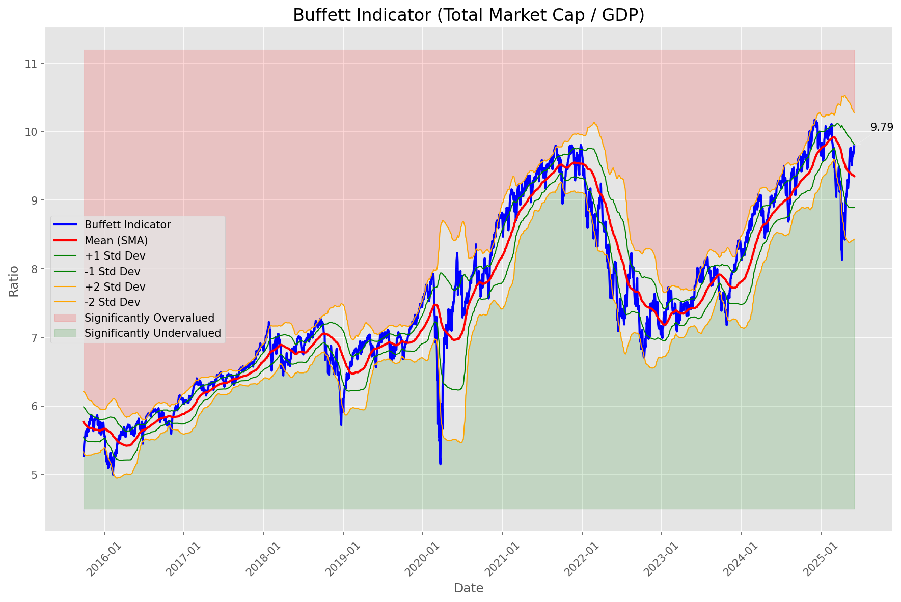
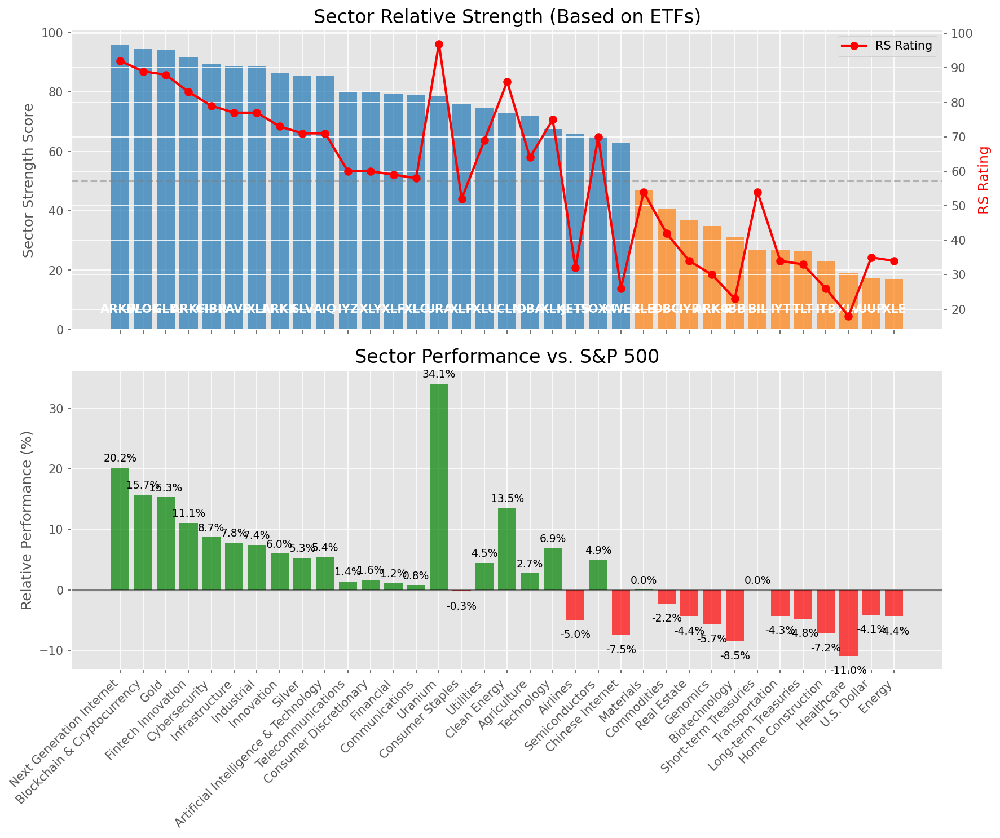

# **Daily Relative Strength Report**

**Date:** 2025-06-04

## **Market Valuation (Buffett Indicator)**

| Metric | Value |
|--------|-------|
| **Market Valuation** | **Fair Valued** |
| **Current Ratio** | 9.79 |
| **Historical Mean** | 9.36 |
| **Standard Deviation** | 0.46 |
| **Z-Score (StdDev from Mean)** | 0.79 |
| **Total Market Cap** | $293.37 trillion |
| **GDP** | $29.98 trillion |

## **Market Insights**

### **Market is Fairly Valued**

The market appears to be trading within a reasonable range of historical valuations. This suggests a balanced approach to equity investing is appropriate. Investors should:

- Focus on individual stock selection based on fundamentals and technicals
- Maintain normal equity allocations aligned with long-term goals
- Pay attention to sector rotation and relative strength
- Watch for changes in market leadership

Fair valuation typically suggests normal market returns can be expected, with stock selection becoming increasingly important.

### **Buffett Indicator Overview**

The Buffett Indicator (Total Market Cap / GDP) is a measure of the stock market's valuation relative to the size of the economy. It is named after Warren Buffett, who described it as "probably the best single measure of where valuations stand at any given moment."

- **Values above +2 standard deviations:** Market significantly overvalued
- **Values above +1 standard deviation:** Market overvalued
- **Values between -1 and +1 standard deviations:** Market fairly valued
- **Values below -1 standard deviation:** Market undervalued
- **Values below -2 standard deviations:** Market significantly undervalued

---

## **Sector Relative Strength**

Based on William O'Neil's Relative Strength Methodology

| ETF | Strength | RS Rating | Performance | Above Key MAs | Trend | Sector |
|-----|----------|-----------|-------------|--------------|-------|--------|
| [ARKW](https://www.tradingview.com/chart/?symbol=ARKW) | 95.0 | 90.0 | 19.86% | 10d ✓, 50d ✓, 200d ✓ | ↗️ | Next Generation Internet |
| [ARKF](https://www.tradingview.com/chart/?symbol=ARKF) | 93.5 | 87.0 | 14.96% | 10d ✓, 50d ✓, 200d ✓ | ↗️ | Fintech Innovation |
| [GLD](https://www.tradingview.com/chart/?symbol=GLD) | 93.0 | 86.0 | 14.81% | 10d ✓, 50d ✓, 200d ✓ | ↗️ | Gold |
| [CIBR](https://www.tradingview.com/chart/?symbol=CIBR) | 89.5 | 79.0 | 10.33% | 10d ✓, 50d ✓, 200d ✓ | ↗️ | Cybersecurity |
| [PAVE](https://www.tradingview.com/chart/?symbol=PAVE) | 89.5 | 79.0 | 10.14% | 10d ✓, 50d ✓, 200d ✓ | ↗️ | Infrastructure |
| [ARKK](https://www.tradingview.com/chart/?symbol=ARKK) | 88.0 | 76.0 | 8.97% | 10d ✓, 50d ✓, 200d ✓ | ↗️ | Innovation |
| [XLI](https://www.tradingview.com/chart/?symbol=XLI) | 88.0 | 76.0 | 9.08% | 10d ✓, 50d ✓, 200d ✓ | ↗️ | Industrial |
| [SLV](https://www.tradingview.com/chart/?symbol=SLV) | 87.5 | 75.0 | 8.41% | 10d ✓, 50d ✓, 200d ✓ | ↗️ | Silver |
| [AIQ](https://www.tradingview.com/chart/?symbol=AIQ) | 86.0 | 72.0 | 6.97% | 10d ✓, 50d ✓, 200d ✓ | ↗️ | Artificial Intelligence & Technology |
| [XLU](https://www.tradingview.com/chart/?symbol=XLU) | 84.0 | 68.0 | 5.59% | 10d ✓, 50d ✓, 200d ✓ | ↗️ | Utilities |
| [BLOK](https://www.tradingview.com/chart/?symbol=BLOK) | 83.0 | 66.0 | 5.10% | 10d ✓, 50d ✓, 200d ✓ | ↗️ | Blockchain & Cryptocurrency |
| [XLY](https://www.tradingview.com/chart/?symbol=XLY) | 81.5 | 63.0 | 3.46% | 10d ✓, 50d ✓, 200d ✓ | ↗️ | Consumer Discretionary |
| [IYZ](https://www.tradingview.com/chart/?symbol=IYZ) | 80.5 | 61.0 | 2.78% | 10d ✓, 50d ✓, 200d ✓ | ↗️ | Telecommunications |
| [XLF](https://www.tradingview.com/chart/?symbol=XLF) | 79.5 | 59.0 | 2.32% | 10d ✓, 50d ✓, 200d ✓ | ↗️ | Financial |
| [XLC](https://www.tradingview.com/chart/?symbol=XLC) | 78.5 | 57.0 | 1.43% | 10d ✓, 50d ✓, 200d ✓ | ↗️ | Communications |
| [URA](https://www.tradingview.com/chart/?symbol=URA) | 78.5 | 97.0 | 36.13% | 10d ✓, 50d ✓, 200d ✓ | ↘️ | Uranium |
| [XLP](https://www.tradingview.com/chart/?symbol=XLP) | 77.0 | 54.0 | 0.85% | 10d ✓, 50d ✓, 200d ✓ | ↗️ | Consumer Staples |
| [ICLN](https://www.tradingview.com/chart/?symbol=ICLN) | 73.5 | 87.0 | 15.00% | 10d ✓, 50d ✓, 200d ✓ | ↘️ | Clean Energy |
| [JETS](https://www.tradingview.com/chart/?symbol=JETS) | 71.5 | 43.0 | -1.21% | 10d ✓, 50d ✓, 200d ✓ | ↗️ | Airlines |
| [XLK](https://www.tradingview.com/chart/?symbol=XLK) | 67.5 | 75.0 | 8.22% | 10d ✓, 50d ✓, 200d ✓ | ↘️ | Technology |
| [SOXX](https://www.tradingview.com/chart/?symbol=SOXX) | 64.0 | 68.0 | 5.61% | 10d ✓, 50d ✓, 200d ✓ | ↘️ | Semiconductors |
| [DBA](https://www.tradingview.com/chart/?symbol=DBA) | 60.2 | 60.0 | 2.50% | 10d ✗, 50d ✗, 200d ✓ | ↗️ | Agriculture |
| [KWEB](https://www.tradingview.com/chart/?symbol=KWEB) | 57.6 | 35.0 | -3.30% | 10d ✗, 50d ✓, 200d ✓ | ↗️ | Chinese Internet |
| [XLB](https://www.tradingview.com/chart/?symbol=XLB) | 49.3 | 59.0 | 2.26% | 10d ✓, 50d ✓, 200d ✗ | ↘️ | Materials |
| [DBC](https://www.tradingview.com/chart/?symbol=DBC) | 39.3 | 39.0 | -2.14% | 10d ✓, 50d ✓, 200d ✗ | ↘️ | Commodities |
| [IYR](https://www.tradingview.com/chart/?symbol=IYR) | 36.8 | 34.0 | -3.48% | 10d ✓, 50d ✓, 200d ✗ | ↘️ | Real Estate |
| [ARKG](https://www.tradingview.com/chart/?symbol=ARKG) | 33.3 | 27.0 | -5.99% | 10d ✓, 50d ✓, 200d ✗ | ↘️ | Genomics |
| [IBB](https://www.tradingview.com/chart/?symbol=IBB) | 31.8 | 24.0 | -7.09% | 10d ✓, 50d ✓, 200d ✗ | ↘️ | Biotechnology |
| [IYT](https://www.tradingview.com/chart/?symbol=IYT) | 27.9 | 36.0 | -3.06% | 10d ✗, 50d ✓, 200d ✗ | ↘️ | Transportation |
| [XLE](https://www.tradingview.com/chart/?symbol=XLE) | 26.4 | 33.0 | -3.90% | 10d ✓, 50d ✗, 200d ✗ | ↘️ | Energy |
| [BIL](https://www.tradingview.com/chart/?symbol=BIL) | 25.5 | 51.0 | 0.01% | 10d ✗, 50d ✗, 200d ✗ | ↘️ | Short-term Treasuries |
| [XLV](https://www.tradingview.com/chart/?symbol=XLV) | 18.9 | 18.0 | -10.23% | 10d ✓, 50d ✗, 200d ✗ | ↘️ | Healthcare |
| [UUP](https://www.tradingview.com/chart/?symbol=UUP) | 15.5 | 31.0 | -4.89% | 10d ✗, 50d ✗, 200d ✗ | ↘️ | U.S. Dollar |
| [ITB](https://www.tradingview.com/chart/?symbol=ITB) | 12.5 | 25.0 | -6.87% | 10d ✗, 50d ✗, 200d ✗ | ↘️ | Home Construction |
| [TLT](https://www.tradingview.com/chart/?symbol=TLT) | 12.5 | 25.0 | -7.02% | 10d ✗, 50d ✗, 200d ✗ | ↘️ | Long-term Treasuries |

### **Sector ETF Performance Interpretation**

This table shows the relative strength metrics for different market sectors based on their representative ETFs:

- **ETF**: The ETF used to measure sector performance (click for chart)
- **Strength**: Overall sector strength score (0-100) combining multiple factors
- **RS Rating**: O'Neil RS rating of the sector ETF
- **Performance**: Performance of the sector ETF relative to SPY
- **Above Key MAs**: Whether the ETF is trading above its 10, 50, and 200-day moving averages
- **Trend**: Whether the sector is in an uptrend (↗️) or downtrend (↘️)

### **Current Sector Leadership**

The current market leadership is coming from the following sectors: **Next Generation Internet, Fintech Innovation, Gold**.

The **Next Generation Internet** sector (represented by **ARKW**) is showing particularly strong relative strength with an RS rating of 90.0 and performance of 19.86% vs. the S&P 500. This sector is trading above its 10-day, 50-day, 200-day moving average(s). Investors should consider focusing on high RS stocks within these leading sectors for potential outperformance.

---

## **Buy Recommendations**

The following 90 stocks show exceptional relative strength:

| RS Rating | Buy Score | Current Price | Chart | Name | Ticker |
|-----------|-----------|---------------|-------|------|--------|
| 100 | 100 | $210.32 | [Chart](https://www.tradingview.com/chart/?symbol=DAVE) | Dave Inc. Class A Common Stock | DAVE |
| 100 | 100 | $71.72 | [Chart](https://www.tradingview.com/chart/?symbol=HOOD) | Robinhood Markets, Inc. Class A Common Stock | HOOD |
| 100 | 100 | $218.72 | [Chart](https://www.tradingview.com/chart/?symbol=AGX) | Argan, Inc | AGX |
| 100 | 100 | $98.07 | [Chart](https://www.tradingview.com/chart/?symbol=RBRK) | Rubrik, Inc. | RBRK |
| 100 | 100 | $114.06 | [Chart](https://www.tradingview.com/chart/?symbol=SEZL) | Sezzle Inc. Common Stock | SEZL |
| 100 | 100 | $492.97 | [Chart](https://www.tradingview.com/chart/?symbol=GEV) | GE Vernova Inc. | GEV |
| 100 | 100 | $133.17 | [Chart](https://www.tradingview.com/chart/?symbol=PLTR) | Palantir Technologies Inc. Class A Common Stock | PLTR |
| 100 | 100 | $340.12 | [Chart](https://www.tradingview.com/chart/?symbol=CVNA) | Carvana Co. | CVNA |
| 99 | 100 | $39.09 | [Chart](https://www.tradingview.com/chart/?symbol=KTOS) | Kratos Defense & Security Solutions, Inc. | KTOS |
| 99 | 100 | $46.44 | [Chart](https://www.tradingview.com/chart/?symbol=AU) | AngloGold Ashanti plc | AU |
| 99 | 100 | $23.18 | [Chart](https://www.tradingview.com/chart/?symbol=PRA) | ProAssurance Corporation | PRA |
| 99 | 100 | $38.72 | [Chart](https://www.tradingview.com/chart/?symbol=PAY) | Paymentus Holdings, Inc. | PAY |
| 98 | 100 | $175.10 | [Chart](https://www.tradingview.com/chart/?symbol=PLMR) | Palomar Holdings, Inc. Common stock | PLMR |
| 98 | 100 | $68.70 | [Chart](https://www.tradingview.com/chart/?symbol=GDXJ) | VanEck Junior Gold Miners ETF | GDXJ |
| 98 | 100 | $23.89 | [Chart](https://www.tradingview.com/chart/?symbol=TFPM) | Triple Flag Precious Metals Corp. | TFPM |
| 98 | 100 | $89.95 | [Chart](https://www.tradingview.com/chart/?symbol=RBLX) | Roblox Corporation | RBLX |
| 98 | 100 | $42.46 | [Chart](https://www.tradingview.com/chart/?symbol=FARO) | Faro Technologies Inc | FARO |
| 97 | 100 | $172.61 | [Chart](https://www.tradingview.com/chart/?symbol=HWM) | Howmet Aerospace Inc. | HWM |
| 97 | 100 | $121.26 | [Chart](https://www.tradingview.com/chart/?symbol=CLS) | Celestica, Inc. | CLS |
| 96 | 100 | $284.75 | [Chart](https://www.tradingview.com/chart/?symbol=VEEV) | Veeva Systems Inc. | VEEV |
| 96 | 100 | $53.09 | [Chart](https://www.tradingview.com/chart/?symbol=GDX) | VanEck Gold Miners ETF | GDX |
| 96 | 100 | $91.71 | [Chart](https://www.tradingview.com/chart/?symbol=WPM) | Wheaton Precious Metals Corp. Common Stock | WPM |
| 96 | 100 | $23.65 | [Chart](https://www.tradingview.com/chart/?symbol=BTSG) | BrightSpring Health Services, Inc. Common Stock | BTSG |
| 96 | 100 | $35.40 | [Chart](https://www.tradingview.com/chart/?symbol=UTI) | Universal Technical Institute, Inc. | UTI |
| 96 | 100 | $19.41 | [Chart](https://www.tradingview.com/chart/?symbol=MIR) | Mirion Technologies, Inc. | MIR |
| 96 | 100 | $255.48 | [Chart](https://www.tradingview.com/chart/?symbol=TLN) | Talen Energy Corporation Common Stock | TLN |
| 95 | 100 | $122.51 | [Chart](https://www.tradingview.com/chart/?symbol=AEM) | Agnico Eagle Mines Ltd. | AEM |
| 95 | 100 | $37.46 | [Chart](https://www.tradingview.com/chart/?symbol=AS) | Amer Sports, Inc. | AS |
| 95 | 100 | $58.03 | [Chart](https://www.tradingview.com/chart/?symbol=SHLD) | Global X Defense Tech ETF | SHLD |
| 94 | 100 | $84.81 | [Chart](https://www.tradingview.com/chart/?symbol=VRNA) | Verona Pharma plc | VRNA |
| 94 | 100 | $143.26 | [Chart](https://www.tradingview.com/chart/?symbol=UGL) | ProShares Ultra Gold | UGL |
| 94 | 100 | $27.74 | [Chart](https://www.tradingview.com/chart/?symbol=UVE) | UNIVERSAL INSURANCE HLDG, INC. | UVE |
| 94 | 100 | $248.87 | [Chart](https://www.tradingview.com/chart/?symbol=GE) | GE Aerospace | GE |
| 94 | 100 | $1217.94 | [Chart](https://www.tradingview.com/chart/?symbol=NFLX) | NetFlix Inc | NFLX |
| 94 | 100 | $165.77 | [Chart](https://www.tradingview.com/chart/?symbol=SE) | Sea Limited American Depositary Shares, each representing one Class A Ordinary Share | SE |
| 93 | 100 | $155.48 | [Chart](https://www.tradingview.com/chart/?symbol=CAH) | Cardinal Health, Inc. | CAH |
| 92 | 100 | $398.51 | [Chart](https://www.tradingview.com/chart/?symbol=APP) | Applovin Corporation Class A Common Stock | APP |
| 92 | 100 | $30.15 | [Chart](https://www.tradingview.com/chart/?symbol=NTGR) | NETGEAR, Inc. | NTGR |
| 91 | 100 | $175.21 | [Chart](https://www.tradingview.com/chart/?symbol=SFM) | Sprouts Farmers Market, Inc. | SFM |
| 91 | 100 | $131.59 | [Chart](https://www.tradingview.com/chart/?symbol=COOP) | Mr. Cooper Group Inc. Common Stock | COOP |
| 90 | 100 | $74.76 | [Chart](https://www.tradingview.com/chart/?symbol=WRB) | W.R. Berkley Corporation | WRB |
| 90 | 100 | $179.35 | [Chart](https://www.tradingview.com/chart/?symbol=ITA) | iShares U.S. Aerospace & Defense ETF | ITA |
| 89 | 100 | $216.90 | [Chart](https://www.tradingview.com/chart/?symbol=BAP) | Credicorp LTD | BAP |
| 89 | 100 | $43.28 | [Chart](https://www.tradingview.com/chart/?symbol=EWP) | iShares MSCI Spain ETF | EWP |
| 89 | 100 | $182.37 | [Chart](https://www.tradingview.com/chart/?symbol=PM) | Philip Morris International Inc. | PM |
| 88 | 100 | $46.34 | [Chart](https://www.tradingview.com/chart/?symbol=BTI) | British American Tobacco p.l.c. American Depositary Shares, American Depositary Shares, each representing one Ordinary Share | BTI |
| 87 | 100 | $66.40 | [Chart](https://www.tradingview.com/chart/?symbol=GLDM) | SPDR Gold MiniShares | GLDM |
| 87 | 100 | $671.07 | [Chart](https://www.tradingview.com/chart/?symbol=SPOT) | Spotify Technology S.A. | SPOT |
| 89 | 99 | $64.91 | [Chart](https://www.tradingview.com/chart/?symbol=SLF) | Sun Life Financial Inc. | SLF |
| 89 | 99 | $88.16 | [Chart](https://www.tradingview.com/chart/?symbol=SANM) | Sanmina  Corp | SANM |
| 89 | 99 | $47.90 | [Chart](https://www.tradingview.com/chart/?symbol=BBW) | Build-A-Bear Workshop, Inc. | BBW |
| 89 | 99 | $266.76 | [Chart](https://www.tradingview.com/chart/?symbol=RCL) | Royal Caribbean Group | RCL |
| 88 | 99 | $26.91 | [Chart](https://www.tradingview.com/chart/?symbol=AGI) | Alamos Gold Inc. Class A Common Shares | AGI |
| 86 | 99 | $33.44 | [Chart](https://www.tradingview.com/chart/?symbol=IAUM) | iShares Gold Trust Micro | IAUM |
| 86 | 99 | $33.11 | [Chart](https://www.tradingview.com/chart/?symbol=AAAU) | Goldman Sachs Physical Gold ETF Shares | AAAU |
| 86 | 99 | $63.23 | [Chart](https://www.tradingview.com/chart/?symbol=IAU) | iShares Gold Trust | IAU |
| 86 | 99 | $31.98 | [Chart](https://www.tradingview.com/chart/?symbol=SGOL) | abrdn Physical Gold Shares ETF | SGOL |
| 86 | 99 | $308.91 | [Chart](https://www.tradingview.com/chart/?symbol=GLD) | SPDR Gold Trust, SPDR Gold Shares | GLD |
| 86 | 99 | $17.99 | [Chart](https://www.tradingview.com/chart/?symbol=BCS) | Barclays PLC | BCS |
| 88 | 98 | $47.87 | [Chart](https://www.tradingview.com/chart/?symbol=EWI) | iShares MSCI Italy ETF | EWI |
| 88 | 98 | $51.61 | [Chart](https://www.tradingview.com/chart/?symbol=AKRO) | Akero Therapeutics, Inc. Common Stock | AKRO |
| 87 | 98 | $107.21 | [Chart](https://www.tradingview.com/chart/?symbol=DTM) | DT Midstream, Inc. | DTM |
| 86 | 98 | $31.86 | [Chart](https://www.tradingview.com/chart/?symbol=EUFN) | iShares MSCI Europe Financials ETF | EUFN |
| 85 | 98 | $173.36 | [Chart](https://www.tradingview.com/chart/?symbol=EAT) | Brinker International, Inc. | EAT |
| 88 | 97 | $62.29 | [Chart](https://www.tradingview.com/chart/?symbol=UVV) | Universal Corporation | UVV |
| 87 | 97 | $41.95 | [Chart](https://www.tradingview.com/chart/?symbol=ARKF) | ARK Fintech Innovation ETF | ARKF |
| 86 | 97 | $386.01 | [Chart](https://www.tradingview.com/chart/?symbol=LPLA) | LPL Financial Holdings Inc. | LPLA |
| 85 | 97 | $75.95 | [Chart](https://www.tradingview.com/chart/?symbol=EBAY) | eBay Inc | EBAY |
| 85 | 97 | $42.12 | [Chart](https://www.tradingview.com/chart/?symbol=EWG) | iShares MSCI Germany ETF | EWG |
| 84 | 97 | $25.59 | [Chart](https://www.tradingview.com/chart/?symbol=PHYS) | Sprott Physical Gold Trust | PHYS |
| 83 | 96 | $29.91 | [Chart](https://www.tradingview.com/chart/?symbol=CEF) | Sprott Physical Gold and Silver Trust | CEF |
| 85 | 95 | $51.31 | [Chart](https://www.tradingview.com/chart/?symbol=TRP) | TC Energy Corporation | TRP |
| 83 | 95 | $56.42 | [Chart](https://www.tradingview.com/chart/?symbol=CAKE) | Cheesecake Factory (The) | CAKE |
| 82 | 95 | $83.66 | [Chart](https://www.tradingview.com/chart/?symbol=NFG) | National Fuel Gas Co. | NFG |
| 82 | 94 | $27.93 | [Chart](https://www.tradingview.com/chart/?symbol=IMAX) | Imax Corp | IMAX |
| 81 | 94 | $244.33 | [Chart](https://www.tradingview.com/chart/?symbol=LNG) | Cheniere Energy Inc | LNG |
| 83 | 93 | $160.15 | [Chart](https://www.tradingview.com/chart/?symbol=NTRA) | Natera, Inc. Common Stock | NTRA |
| 83 | 93 | $29.53 | [Chart](https://www.tradingview.com/chart/?symbol=DBX) | Dropbox, Inc. Class A | DBX |
| 83 | 93 | $42.49 | [Chart](https://www.tradingview.com/chart/?symbol=FHI) | Federated Hermes, Inc. | FHI |
| 82 | 93 | $218.18 | [Chart](https://www.tradingview.com/chart/?symbol=GWRE) | GUIDEWIRE SOFTWARE, INC. | GWRE |
| 82 | 93 | $5475.07 | [Chart](https://www.tradingview.com/chart/?symbol=BKNG) | Booking Holdings Inc. Common Stock | BKNG |
| 82 | 93 | $59.42 | [Chart](https://www.tradingview.com/chart/?symbol=IGF) | iShares Global Infrastructure ETF | IGF |
| 81 | 93 | $37.44 | [Chart](https://www.tradingview.com/chart/?symbol=CNP) | CenterPoint Energy, Inc. | CNP |
| 81 | 93 | $394.07 | [Chart](https://www.tradingview.com/chart/?symbol=CYBR) | CyberArk Software Ltd. | CYBR |
| 80 | 93 | $26.01 | [Chart](https://www.tradingview.com/chart/?symbol=EWS) | iShares MSCI Singapore ETF | EWS |
| 80 | 93 | $26.77 | [Chart](https://www.tradingview.com/chart/?symbol=SONY) | Sony Group Corporation American Depositary Shares (Each Representing One Share of Dollar Validated Common Stock) | SONY |
| 81 | 91 | $84.97 | [Chart](https://www.tradingview.com/chart/?symbol=SEIC) | SEI Investments Co | SEIC |
| 81 | 91 | $79.30 | [Chart](https://www.tradingview.com/chart/?symbol=BBCA) | JPMorgan BetaBuilders Canada ETF | BBCA |
| 81 | 91 | $183.24 | [Chart](https://www.tradingview.com/chart/?symbol=CVLT) | Commault Systems, Inc. | CVLT |
| 80 | 89 | $22.02 | [Chart](https://www.tradingview.com/chart/?symbol=HG) | Hamilton Insurance Group, Ltd. Class B Common Shares | HG |

---

## **Sell Recommendations**

The following 171 stocks show deteriorating relative strength:

| RS Rating | Sell Score | Current Price | Chart | Name | Ticker |
|-----------|------------|---------------|-------|------|--------|
| 1 | 100 | $10.05 | [Chart](https://www.tradingview.com/chart/?symbol=WNC) | Wabash National Corp. | WNC |
| 1 | 100 | $38.87 | [Chart](https://www.tradingview.com/chart/?symbol=SRPT) | Sarepta Therapeutics,, Inc. Common Stock | SRPT |
| 1 | 100 | $12.08 | [Chart](https://www.tradingview.com/chart/?symbol=NRIX) | Nurix Therapeutics, Inc. Common stock | NRIX |
| 1 | 100 | $10.72 | [Chart](https://www.tradingview.com/chart/?symbol=XNCR) | Xencor, Inc. | XNCR |
| 1 | 100 | $33.20 | [Chart](https://www.tradingview.com/chart/?symbol=TECS) | Direxion Daily Technology Bear 3x Shares | TECS |
| 1 | 100 | $13.04 | [Chart](https://www.tradingview.com/chart/?symbol=IART) | Integra LifeSciences Holdings | IART |
| 2 | 100 | $16.88 | [Chart](https://www.tradingview.com/chart/?symbol=BEAM) | Beam Therapeutics Inc. Common Stock | BEAM |
| 2 | 100 | $17.15 | [Chart](https://www.tradingview.com/chart/?symbol=NVDS) | Investment Managers Series Trust II Tradr 1.5X Short NVDA Daily ETF | NVDS |
| 2 | 100 | $49.77 | [Chart](https://www.tradingview.com/chart/?symbol=LGIH) | LGI Homes, Inc. | LGIH |
| 2 | 100 | $13.56 | [Chart](https://www.tradingview.com/chart/?symbol=DQ) | Daqo New Energy Corp. American Depositary Shares (each representing 5 Ordinary Shares) | DQ |
| 3 | 100 | $10.22 | [Chart](https://www.tradingview.com/chart/?symbol=PRTA) | Prothena Corporation plc Ordinary Shares | PRTA |
| 3 | 100 | $10.31 | [Chart](https://www.tradingview.com/chart/?symbol=VREX) | Varex Imaging Corporation Common Stock | VREX |
| 3 | 100 | $32.00 | [Chart](https://www.tradingview.com/chart/?symbol=CYTK) | Cytokinetics Inc. | CYTK |
| 3 | 100 | $10.20 | [Chart](https://www.tradingview.com/chart/?symbol=MBC) | MasterBrand, Inc. | MBC |
| 3 | 100 | $22.01 | [Chart](https://www.tradingview.com/chart/?symbol=THS) | Treehouse Foods, Inc. | THS |
| 3 | 100 | $10.20 | [Chart](https://www.tradingview.com/chart/?symbol=PACS) | PACS Group, Inc. | PACS |
| 3 | 100 | $43.00 | [Chart](https://www.tradingview.com/chart/?symbol=LINE) | Lineage, Inc. Common Stock | LINE |
| 4 | 100 | $130.91 | [Chart](https://www.tradingview.com/chart/?symbol=KRYS) | Krystal Biotech, Inc. Common Stock | KRYS |
| 4 | 100 | $55.78 | [Chart](https://www.tradingview.com/chart/?symbol=SPB) | Spectrum Brands Holdings, Inc. | SPB |
| 4 | 100 | $10.06 | [Chart](https://www.tradingview.com/chart/?symbol=CWK) | Cushman & Wakefield plc Ordinary Shares | CWK |
| 4 | 100 | $31.84 | [Chart](https://www.tradingview.com/chart/?symbol=MBIN) | Merchants Bancorp Common Stock | MBIN |
| 5 | 100 | $54.95 | [Chart](https://www.tradingview.com/chart/?symbol=AMWD) | American Woodmark Corp | AMWD |
| 5 | 100 | $138.36 | [Chart](https://www.tradingview.com/chart/?symbol=INSP) | Inspire Medical Systems, Inc. | INSP |
| 5 | 100 | $20.29 | [Chart](https://www.tradingview.com/chart/?symbol=AMRK) | A-Mark Precious Metals, Inc. | AMRK |
| 5 | 100 | $46.53 | [Chart](https://www.tradingview.com/chart/?symbol=LSCC) | Lattice Semiconductor Corp | LSCC |
| 6 | 100 | $25.91 | [Chart](https://www.tradingview.com/chart/?symbol=WMG) | Warner Music Group Corp. Class A Common Stock | WMG |
| 6 | 100 | $15.39 | [Chart](https://www.tradingview.com/chart/?symbol=PENN) | PENN Entertainment, Inc. Common Stock | PENN |
| 6 | 100 | $19.93 | [Chart](https://www.tradingview.com/chart/?symbol=BITI) | ProShares Short Bitcoin ETF | BITI |
| 6 | 100 | $53.23 | [Chart](https://www.tradingview.com/chart/?symbol=SLVM) | Sylvamo Corporation | SLVM |
| 6 | 100 | $57.01 | [Chart](https://www.tradingview.com/chart/?symbol=ALB) | Albemarle Corporation | ALB |
| 7 | 100 | $52.78 | [Chart](https://www.tradingview.com/chart/?symbol=ASGN) | ASGN Incorporated | ASGN |
| 7 | 100 | $56.79 | [Chart](https://www.tradingview.com/chart/?symbol=BMRN) | BioMarin Pharmaceuticals Inc | BMRN |
| 7 | 100 | $27.90 | [Chart](https://www.tradingview.com/chart/?symbol=QID) | ProShares UltraShort QQQ | QID |
| 7 | 100 | $82.56 | [Chart](https://www.tradingview.com/chart/?symbol=KSPI) | Joint Stock Company Kaspi.kz American Depository Shares | KSPI |
| 7 | 100 | $14.91 | [Chart](https://www.tradingview.com/chart/?symbol=SAFE) | Safehold Inc. | SAFE |
| 8 | 100 | $20.44 | [Chart](https://www.tradingview.com/chart/?symbol=AMN) | AMN Healthcare Services | AMN |
| 8 | 100 | $44.85 | [Chart](https://www.tradingview.com/chart/?symbol=RHI) | Robert Half Inc. | RHI |
| 9 | 100 | $68.08 | [Chart](https://www.tradingview.com/chart/?symbol=WD) | Walker & Dunlop, Inc. | WD |
| 9 | 100 | $11.47 | [Chart](https://www.tradingview.com/chart/?symbol=CLB) | Core Laboratories Inc. | CLB |
| 9 | 100 | $17.10 | [Chart](https://www.tradingview.com/chart/?symbol=MLKN) | MillerKnoll, Inc. Common Stock | MLKN |
| 10 | 100 | $23.99 | [Chart](https://www.tradingview.com/chart/?symbol=RPD) | Rapid7, Inc. Common Stock | RPD |
| 10 | 100 | $17.67 | [Chart](https://www.tradingview.com/chart/?symbol=SCHL) | Scholastic Corp | SCHL |
| 10 | 100 | $15.07 | [Chart](https://www.tradingview.com/chart/?symbol=DXC) | DXC Technology Company | DXC |
| 10 | 100 | $35.31 | [Chart](https://www.tradingview.com/chart/?symbol=ANDE) | Andersons Inc/The | ANDE |
| 10 | 100 | $10.39 | [Chart](https://www.tradingview.com/chart/?symbol=SD) | SandRidge Energy, Inc. | SD |
| 10 | 100 | $38.74 | [Chart](https://www.tradingview.com/chart/?symbol=APOG) | Apogee Enterprises Inc | APOG |
| 11 | 100 | $14.26 | [Chart](https://www.tradingview.com/chart/?symbol=HR) | Healthcare Realty Trust Incorporated | HR |
| 11 | 100 | $51.79 | [Chart](https://www.tradingview.com/chart/?symbol=KBH) | KB Home | KBH |
| 12 | 100 | $18.54 | [Chart](https://www.tradingview.com/chart/?symbol=PDFS) | PDF Solutions Inc | PDFS |
| 12 | 100 | $26.83 | [Chart](https://www.tradingview.com/chart/?symbol=WERN) | Werner Enterprises Inc | WERN |
| 14 | 100 | $10.02 | [Chart](https://www.tradingview.com/chart/?symbol=LBTYK) | Liberty Global Ltd. Class C Common Shares | LBTYK |
| 16 | 100 | $10.77 | [Chart](https://www.tradingview.com/chart/?symbol=GES) | Guess?, Inc. | GES |
| 5 | 99 | $75.78 | [Chart](https://www.tradingview.com/chart/?symbol=GPN) | Global Payments, Inc. | GPN |
| 6 | 99 | $14.71 | [Chart](https://www.tradingview.com/chart/?symbol=INMD) | InMode Ltd. Ordinary Shares | INMD |
| 7 | 99 | $124.40 | [Chart](https://www.tradingview.com/chart/?symbol=RGEN) | Repligen Corp | RGEN |
| 9 | 99 | $10.93 | [Chart](https://www.tradingview.com/chart/?symbol=FBRT) | Franklin BSP Realty Trust, Inc. | FBRT |
| 12 | 99 | $203.27 | [Chart](https://www.tradingview.com/chart/?symbol=AAPL) | Apple Inc. | AAPL |
| 14 | 99 | $25.85 | [Chart](https://www.tradingview.com/chart/?symbol=TRN) | Trinity Industries, Inc. | TRN |
| 15 | 99 | $17.59 | [Chart](https://www.tradingview.com/chart/?symbol=DNTH) | Dianthus Therapeutics, Inc. Common Stock | DNTH |
| 19 | 99 | $11.72 | [Chart](https://www.tradingview.com/chart/?symbol=KELYA) | Kelly Services Inc | KELYA |
| 9 | 98 | $10.82 | [Chart](https://www.tradingview.com/chart/?symbol=VYX) | NCR Voyix Corporation | VYX |
| 10 | 98 | $98.08 | [Chart](https://www.tradingview.com/chart/?symbol=UPS) | United Parcel Service, Inc. Class B | UPS |
| 11 | 98 | $63.44 | [Chart](https://www.tradingview.com/chart/?symbol=ZROZ) | PIMCO 25+ Year Zero Coupon U.S. Treasury Index Exchange-Traded Fund | ZROZ |
| 3 | 97 | $10.22 | [Chart](https://www.tradingview.com/chart/?symbol=SONO) | Sonos, Inc. Common Stock | SONO |
| 4 | 97 | $11.05 | [Chart](https://www.tradingview.com/chart/?symbol=LSPD) | Lightspeed Commerce Inc. | LSPD |
| 8 | 97 | $66.25 | [Chart](https://www.tradingview.com/chart/?symbol=KMX) | CarMax Inc. | KMX |
| 11 | 97 | $20.43 | [Chart](https://www.tradingview.com/chart/?symbol=HAL) | Halliburton Company | HAL |
| 14 | 97 | $49.75 | [Chart](https://www.tradingview.com/chart/?symbol=ASH) | Ashland Inc. | ASH |
| 18 | 97 | $106.65 | [Chart](https://www.tradingview.com/chart/?symbol=LEN) | Lennar Corporation Class A | LEN |
| 12 | 96 | $30.09 | [Chart](https://www.tradingview.com/chart/?symbol=BAX) | Baxter International Inc. | BAX |
| 12 | 96 | $36.30 | [Chart](https://www.tradingview.com/chart/?symbol=LIT) | Global X Lithium & Battery Tech ETF | LIT |
| 14 | 96 | $34.11 | [Chart](https://www.tradingview.com/chart/?symbol=SLB) | Schlumberger Limited | SLB |
| 15 | 96 | $220.57 | [Chart](https://www.tradingview.com/chart/?symbol=BIO) | Bio-Rad Laboratories, Inc.Class A | BIO |
| 17 | 96 | $87.60 | [Chart](https://www.tradingview.com/chart/?symbol=BCC) | Boise Cascade Company | BCC |
| 19 | 96 | $15.17 | [Chart](https://www.tradingview.com/chart/?symbol=VRE) | Veris Residential, Inc. | VRE |
| 21 | 96 | $95.73 | [Chart](https://www.tradingview.com/chart/?symbol=CHRD) | Chord Energy Corporation Common Stock | CHRD |
| 8 | 95 | $41.57 | [Chart](https://www.tradingview.com/chart/?symbol=VCEL) | Vericel Corporation | VCEL |
| 9 | 95 | $17.25 | [Chart](https://www.tradingview.com/chart/?symbol=CODI) | Compass Diversified | CODI |
| 12 | 95 | $32.74 | [Chart](https://www.tradingview.com/chart/?symbol=TENB) | Tenable Holdings, Inc. | TENB |
| 12 | 95 | $131.31 | [Chart](https://www.tradingview.com/chart/?symbol=NSIT) | Insight Enterprises Inc | NSIT |
| 10 | 94 | $25.86 | [Chart](https://www.tradingview.com/chart/?symbol=WY) | Weyerhaeuser Company | WY |
| 11 | 94 | $12.24 | [Chart](https://www.tradingview.com/chart/?symbol=PMT) | PennyMac Mortgage Investment Trust | PMT |
| 12 | 94 | $23.06 | [Chart](https://www.tradingview.com/chart/?symbol=IPG) | The Interpublic Group of Companies, Inc. | IPG |
| 13 | 94 | $76.00 | [Chart](https://www.tradingview.com/chart/?symbol=CNS) | Cohen & Steers Inc. | CNS |
| 14 | 94 | $34.10 | [Chart](https://www.tradingview.com/chart/?symbol=HUBG) | HUB Group Inc | HUBG |
| 16 | 94 | $54.31 | [Chart](https://www.tradingview.com/chart/?symbol=GIS) | General Mills, Inc. | GIS |
| 17 | 94 | $64.27 | [Chart](https://www.tradingview.com/chart/?symbol=MTH) | Meritage Homes Corporation | MTH |
| 20 | 94 | $106.35 | [Chart](https://www.tradingview.com/chart/?symbol=MHO) | M/I Homes, Inc. | MHO |
| 11 | 93 | $110.20 | [Chart](https://www.tradingview.com/chart/?symbol=BLDR) | Builders FirstSource, Inc. | BLDR |
| 12 | 93 | $130.09 | [Chart](https://www.tradingview.com/chart/?symbol=CLX) | Clorox Company | CLX |
| 14 | 93 | $12.29 | [Chart](https://www.tradingview.com/chart/?symbol=WSR) | Whitestone REIT | WSR |
| 15 | 93 | $49.86 | [Chart](https://www.tradingview.com/chart/?symbol=ERX) | Direxion Daily Energy Bull 2X Shares | ERX |
| 17 | 93 | $19.79 | [Chart](https://www.tradingview.com/chart/?symbol=FOR) | Forestar Group Inc. | FOR |
| 20 | 93 | $46.63 | [Chart](https://www.tradingview.com/chart/?symbol=TWM) | ProShares UltraShort Russell2000 | TWM |
| 10 | 92 | $56.97 | [Chart](https://www.tradingview.com/chart/?symbol=TRNO) | Terreno Realty Corporation | TRNO |
| 17 | 92 | $21.41 | [Chart](https://www.tradingview.com/chart/?symbol=GNTX) | Gentex Corp | GNTX |
| 23 | 92 | $10.52 | [Chart](https://www.tradingview.com/chart/?symbol=SCS) | Steelcase, Inc. | SCS |
| 9 | 91 | $38.80 | [Chart](https://www.tradingview.com/chart/?symbol=PCH) | PotlatchDeltic Corporation Common Stock | PCH |
| 16 | 91 | $219.78 | [Chart](https://www.tradingview.com/chart/?symbol=FDX) | FedEx Corporation | FDX |
| 17 | 91 | $21.18 | [Chart](https://www.tradingview.com/chart/?symbol=DFH) | Dream Finders Homes, Inc. | DFH |
| 20 | 91 | $46.36 | [Chart](https://www.tradingview.com/chart/?symbol=SDOW) | ProShares UltraPro Short Dow 30 | SDOW |
| 21 | 91 | $42.81 | [Chart](https://www.tradingview.com/chart/?symbol=SW) | Smurfit Westrock plc | SW |
| 25 | 91 | $73.49 | [Chart](https://www.tradingview.com/chart/?symbol=WFG) | West Fraser Timber Co. Ltd | WFG |
| 15 | 90 | $12.14 | [Chart](https://www.tradingview.com/chart/?symbol=FFIC) | Flushing Financial Corp | FFIC |
| 16 | 90 | $24.84 | [Chart](https://www.tradingview.com/chart/?symbol=CHX) | ChampionX Corporation | CHX |
| 22 | 90 | $30.73 | [Chart](https://www.tradingview.com/chart/?symbol=DAR) | DARLING INGREDIENTS INC. | DAR |
| 12 | 89 | $62.58 | [Chart](https://www.tradingview.com/chart/?symbol=MAS) | Masco Corporation | MAS |
| 15 | 89 | $10.51 | [Chart](https://www.tradingview.com/chart/?symbol=LADR) | LADDER CAPITAL CORP | LADR |
| 15 | 89 | $10.09 | [Chart](https://www.tradingview.com/chart/?symbol=HOPE) | Hope Bancorp, Inc. | HOPE |
| 19 | 89 | $23.35 | [Chart](https://www.tradingview.com/chart/?symbol=PFE) | Pfizer Inc. | PFE |
| 17 | 88 | $33.92 | [Chart](https://www.tradingview.com/chart/?symbol=NSA) | National Storage Affiliates Trust | NSA |
| 17 | 88 | $81.37 | [Chart](https://www.tradingview.com/chart/?symbol=WHR) | Whirlpool Corp. | WHR |
| 25 | 88 | $192.06 | [Chart](https://www.tradingview.com/chart/?symbol=DHR) | Danaher Corporation | DHR |
| 15 | 87 | $91.85 | [Chart](https://www.tradingview.com/chart/?symbol=ZBH) | Zimmer Biomet Holdings, Inc. | ZBH |
| 24 | 87 | $10.75 | [Chart](https://www.tradingview.com/chart/?symbol=NMFC) | NEW MOUNTAIN FINANCE CORPORATION | NMFC |
| 16 | 86 | $49.05 | [Chart](https://www.tradingview.com/chart/?symbol=TSCO) | Tractor Supply Co | TSCO |
| 17 | 86 | $16.71 | [Chart](https://www.tradingview.com/chart/?symbol=UMH) | UMH Properties, Inc. | UMH |
| 18 | 86 | $25.44 | [Chart](https://www.tradingview.com/chart/?symbol=HASI) | HA Sustainable Infrastructure Capital, Inc. | HASI |
| 18 | 86 | $18.16 | [Chart](https://www.tradingview.com/chart/?symbol=UE) | UBRAN EDGE PROPERTIES | UE |
| 24 | 86 | $121.44 | [Chart](https://www.tradingview.com/chart/?symbol=TFX) | Teleflex Incorporated | TFX |
| 26 | 86 | $210.64 | [Chart](https://www.tradingview.com/chart/?symbol=WST) | West Pharmaceutical Services, Inc. | WST |
| 19 | 85 | $77.34 | [Chart](https://www.tradingview.com/chart/?symbol=PFG) | Principal Financial Group, Inc. | PFG |
| 20 | 85 | $36.65 | [Chart](https://www.tradingview.com/chart/?symbol=NBHC) | NATIONAL BANK HOLDINGS CORP. | NBHC |
| 21 | 85 | $11.00 | [Chart](https://www.tradingview.com/chart/?symbol=MQY) | Blackrock Muni Yield Quality Fund, Inc | MQY |
| 23 | 85 | $163.08 | [Chart](https://www.tradingview.com/chart/?symbol=HSY) | The Hershey Company | HSY |
| 17 | 84 | $43.29 | [Chart](https://www.tradingview.com/chart/?symbol=PRKS) | United Parks & Resorts Inc. | PRKS |
| 24 | 84 | $12.69 | [Chart](https://www.tradingview.com/chart/?symbol=ZUMZ) | Zumiez Inc. | ZUMZ |
| 28 | 84 | $46.06 | [Chart](https://www.tradingview.com/chart/?symbol=HCC) | Warrior Met Coal, Inc. | HCC |
| 27 | 83 | $10.34 | [Chart](https://www.tradingview.com/chart/?symbol=MUC) | BLACKROCK MUNIHOLDINGS CALIFORNIA QUALITY FUND, INC | MUC |
| 29 | 83 | $111.76 | [Chart](https://www.tradingview.com/chart/?symbol=EXPD) | Expeditors International of Washington, Inc. | EXPD |
| 21 | 82 | $139.55 | [Chart](https://www.tradingview.com/chart/?symbol=CVX) | Chevron Corporation | CVX |
| 22 | 82 | $10.41 | [Chart](https://www.tradingview.com/chart/?symbol=MYI) | BLACKROCK MUNIYIELD QUALITY FUND III, INC. | MYI |
| 22 | 82 | $10.33 | [Chart](https://www.tradingview.com/chart/?symbol=NMZ) | Nuveen Municipal High Income Opportunity Fund | NMZ |
| 23 | 82 | $10.21 | [Chart](https://www.tradingview.com/chart/?symbol=PFLT) | PennantPark Floating Rate Capital Ltd. | PFLT |
| 34 | 82 | $10.14 | [Chart](https://www.tradingview.com/chart/?symbol=URGN) | UroGen Pharma Ltd. Ordinary Shares | URGN |
| 21 | 81 | $446.48 | [Chart](https://www.tradingview.com/chart/?symbol=VRTX) | Vertex Pharmaceuticals Inc | VRTX |
| 24 | 81 | $75.28 | [Chart](https://www.tradingview.com/chart/?symbol=CBT) | Cabot Corporation | CBT |
| 24 | 81 | $11.82 | [Chart](https://www.tradingview.com/chart/?symbol=NVG) | Nuveen AMT-Free Municipal Credit Income Fund | NVG |
| 27 | 81 | $56.58 | [Chart](https://www.tradingview.com/chart/?symbol=TMHC) | Taylor Morrison Home Corporation Common Stock | TMHC |
| 27 | 81 | $77.09 | [Chart](https://www.tradingview.com/chart/?symbol=AKAM) | Akamai Technologies Inc | AKAM |
| 28 | 81 | $25.19 | [Chart](https://www.tradingview.com/chart/?symbol=ASTH) | Astrana Health Inc. Common Stock | ASTH |
| 23 | 80 | $112.82 | [Chart](https://www.tradingview.com/chart/?symbol=EOG) | EOG Resources, Inc. | EOG |
| 24 | 80 | $15.94 | [Chart](https://www.tradingview.com/chart/?symbol=ELME) | Elme Communities | ELME |
| 24 | 80 | $123.01 | [Chart](https://www.tradingview.com/chart/?symbol=SUI) | Sun Communities, Inc | SUI |
| 26 | 80 | $17.65 | [Chart](https://www.tradingview.com/chart/?symbol=JPMpM) | JPMorgan Chase & Co. Depositary Shares, each representing a 1/400th interest in a share of 4.20% Non-Cumulative Preferred Stock, Series MM | JPMpM |
| 23 | 79 | $38.00 | [Chart](https://www.tradingview.com/chart/?symbol=KSA) | iShares MSCI Saudi Arabia ETF | KSA |
| 26 | 78 | $11.80 | [Chart](https://www.tradingview.com/chart/?symbol=NZF) | Nuveen Municipal Credit Income Fund | NZF |
| 28 | 78 | $10.88 | [Chart](https://www.tradingview.com/chart/?symbol=LBTYA) | Liberty Global Ltd. Class A Common Shares | LBTYA |
| 25 | 77 | $154.42 | [Chart](https://www.tradingview.com/chart/?symbol=JNJ) | Johnson & Johnson | JNJ |
| 32 | 77 | $29.84 | [Chart](https://www.tradingview.com/chart/?symbol=TPH) | Tri Pointe Homes, Inc. | TPH |
| 36 | 77 | $87.91 | [Chart](https://www.tradingview.com/chart/?symbol=COP) | ConocoPhillips | COP |
| 30 | 76 | $67.22 | [Chart](https://www.tradingview.com/chart/?symbol=BLV) | Vanguard Long-Term Bond ETF | BLV |
| 30 | 76 | $13.76 | [Chart](https://www.tradingview.com/chart/?symbol=BSM) | Black Stone Minerals, L.P. | BSM |
| 33 | 76 | $82.96 | [Chart](https://www.tradingview.com/chart/?symbol=BCO) | The Brink's Company | BCO |
| 34 | 76 | $103.80 | [Chart](https://www.tradingview.com/chart/?symbol=XOM) | Exxon Mobil Corporation | XOM |
| 26 | 75 | $18.83 | [Chart](https://www.tradingview.com/chart/?symbol=BTAL) | AGF U.S. Market Neutral Anti-Beta Fund | BTAL |
| 32 | 74 | $15.76 | [Chart](https://www.tradingview.com/chart/?symbol=BBN) | BlackRock Taxable Municipal Bond Trust | BBN |
| 31 | 73 | $24.53 | [Chart](https://www.tradingview.com/chart/?symbol=HYMB) | SPDR Nuveen ICE High Yield Municipal Bond ETF | HYMB |
| 31 | 73 | $55.48 | [Chart](https://www.tradingview.com/chart/?symbol=TREX) | Trex Company, Inc. | TREX |
| 33 | 73 | $40.37 | [Chart](https://www.tradingview.com/chart/?symbol=LKQ) | LKQ Corporation | LKQ |
| 33 | 73 | $98.67 | [Chart](https://www.tradingview.com/chart/?symbol=PHM) | Pultegroup, Inc. | PHM |
| 36 | 73 | $286.52 | [Chart](https://www.tradingview.com/chart/?symbol=BLD) | TopBuild Corp. Common Stock | BLD |
| 30 | 72 | $42.07 | [Chart](https://www.tradingview.com/chart/?symbol=POR) | Portland General Electric Company | POR |
| 33 | 72 | $83.58 | [Chart](https://www.tradingview.com/chart/?symbol=XLE) | Energy Select Sector SPDR Fund | XLE |
| 33 | 72 | $26.51 | [Chart](https://www.tradingview.com/chart/?symbol=ETD) | Ethan Allen Interiors Inc | ETD |
| 31 | 70 | $135.96 | [Chart](https://www.tradingview.com/chart/?symbol=HES) | Hess Corporation | HES |
| 36 | 70 | $56.01 | [Chart](https://www.tradingview.com/chart/?symbol=O) | Realty Income Corporation | O |
| 38 | 69 | $34.66 | [Chart](https://www.tradingview.com/chart/?symbol=CMCSA) | Comcast Corp | CMCSA |
| 33 | 67 | $83.75 | [Chart](https://www.tradingview.com/chart/?symbol=BIDU) | Baidu, Inc. | BIDU |
| 36 | 64 | $14.12 | [Chart](https://www.tradingview.com/chart/?symbol=DOLE) | Dole plc | DOLE |
| 39 | 64 | $33.31 | [Chart](https://www.tradingview.com/chart/?symbol=HTRB) | Hartford Total Return Bond ETF | HTRB |

## **Methodology**

This report uses William O'Neil's relative strength methodology from Investors Business Daily:

* **RS Rating**: Percentile rank of stock's performance vs. S&P 500 over the past 63 trading days (1-99 scale)
* **Buy Criteria**: RS Rating >= 80, price above 50-day MA, strong uptrend, increasing volume
* **Sell Criteria**: RS Rating < 40, price below 50-day MA, downtrend, decreasing volume

### **O'Neil's Key Principles**

1. **Focus on relative performance** - stocks outperforming the market
2. **Price trend confirmation** - stock must be in an uptrend
3. **Volume confirmation** - strong volume supports price moves
4. **Moving average validation** - price above key moving averages
5. **Market leaders only** - concentrate on top-performing stocks

*Report generated automatically after market close*