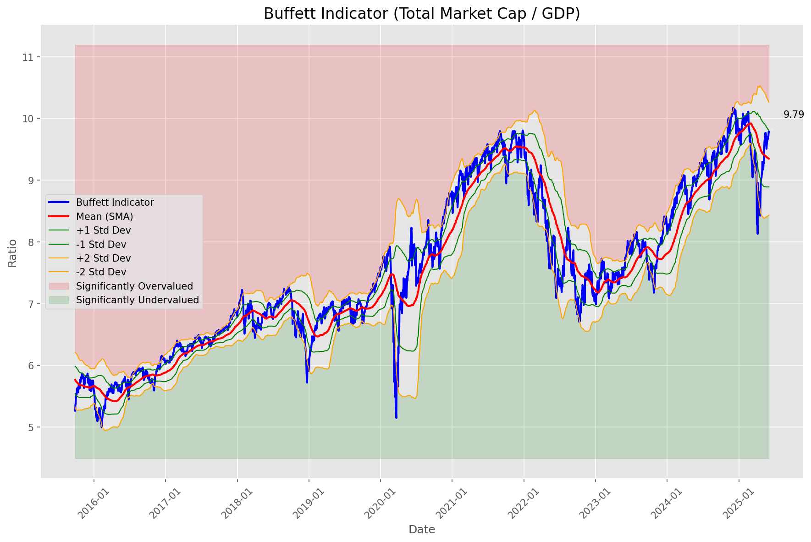
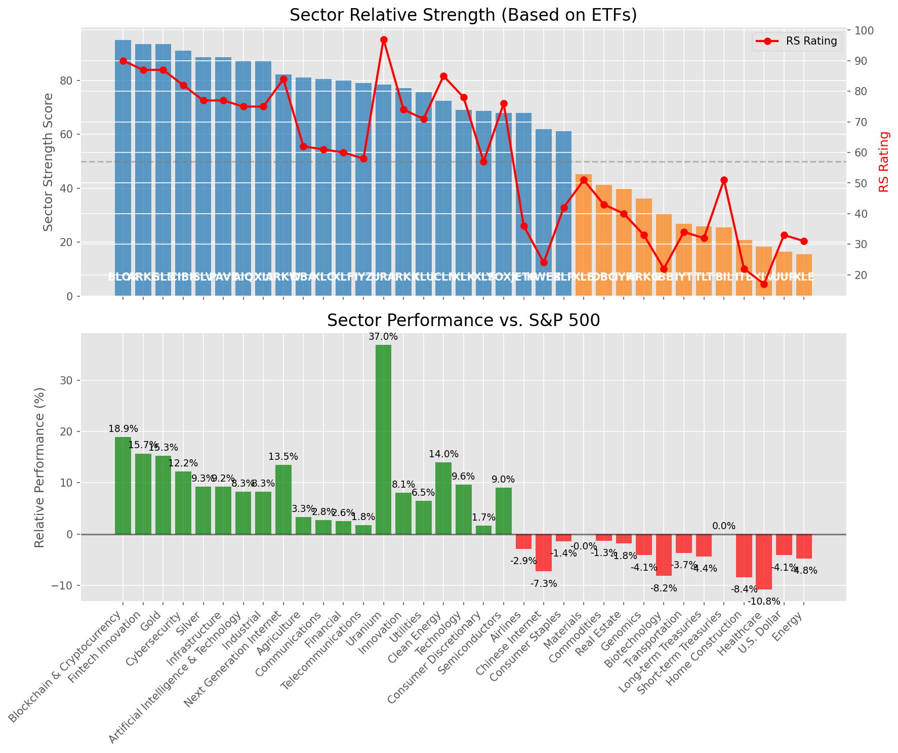

# **Daily Relative Strength Report**

**Date:** 2025-06-05

## **Market Valuation (Buffett Indicator)**

| Metric | Value |
|--------|-------|
| **Market Valuation** | **Fair Valued** |
| **Current Ratio** | 9.73 |
| **Historical Mean** | 9.35 |
| **Standard Deviation** | 0.46 |
| **Z-Score (StdDev from Mean)** | 0.95 |
| **Total Market Cap** | $291.72 trillion |
| **GDP** | $29.98 trillion |

## **Market Insights**

### **Market is Fairly Valued**

The market appears to be trading within a reasonable range of historical valuations. This suggests a balanced approach to equity investing is appropriate. Investors should:

- Focus on individual stock selection based on fundamentals and technicals
- Maintain normal equity allocations aligned with long-term goals
- Pay attention to sector rotation and relative strength
- Watch for changes in market leadership

Fair valuation typically suggests normal market returns can be expected, with stock selection becoming increasingly important.

### **Buffett Indicator Overview**

The Buffett Indicator (Total Market Cap / GDP) is a measure of the stock market's valuation relative to the size of the economy. It is named after Warren Buffett, who described it as "probably the best single measure of where valuations stand at any given moment."

- **Values above +2 standard deviations:** Market significantly overvalued
- **Values above +1 standard deviation:** Market overvalued
- **Values between -1 and +1 standard deviations:** Market fairly valued
- **Values below -1 standard deviation:** Market undervalued
- **Values below -2 standard deviations:** Market significantly undervalued

---

## **Sector Relative Strength**

Based on William O'Neil's Relative Strength Methodology

| ETF | Strength | RS Rating | Performance | Above Key MAs | Trend | Sector |
|-----|----------|-----------|-------------|--------------|-------|--------|
| [BLOK](https://www.tradingview.com/chart/?symbol=BLOK) | 95.0 | 90.0 | 18.90% | 10d ✓, 50d ✓, 200d ✓ | ↗️ | Blockchain & Cryptocurrency |
| [GLD](https://www.tradingview.com/chart/?symbol=GLD) | 93.5 | 87.0 | 15.31% | 10d ✓, 50d ✓, 200d ✓ | ↗️ | Gold |
| [ARKF](https://www.tradingview.com/chart/?symbol=ARKF) | 93.5 | 87.0 | 15.73% | 10d ✓, 50d ✓, 200d ✓ | ↗️ | Fintech Innovation |
| [CIBR](https://www.tradingview.com/chart/?symbol=CIBR) | 91.0 | 82.0 | 12.24% | 10d ✓, 50d ✓, 200d ✓ | ↗️ | Cybersecurity |
| [SLV](https://www.tradingview.com/chart/?symbol=SLV) | 88.5 | 77.0 | 9.30% | 10d ✓, 50d ✓, 200d ✓ | ↗️ | Silver |
| [PAVE](https://www.tradingview.com/chart/?symbol=PAVE) | 88.5 | 77.0 | 9.24% | 10d ✓, 50d ✓, 200d ✓ | ↗️ | Infrastructure |
| [AIQ](https://www.tradingview.com/chart/?symbol=AIQ) | 87.5 | 75.0 | 8.28% | 10d ✓, 50d ✓, 200d ✓ | ↗️ | Artificial Intelligence & Technology |
| [XLI](https://www.tradingview.com/chart/?symbol=XLI) | 87.5 | 75.0 | 8.30% | 10d ✓, 50d ✓, 200d ✓ | ↗️ | Industrial |
| [ARKW](https://www.tradingview.com/chart/?symbol=ARKW) | 82.1 | 84.0 | 13.51% | 10d ✗, 50d ✓, 200d ✓ | ↗️ | Next Generation Internet |
| [DBA](https://www.tradingview.com/chart/?symbol=DBA) | 81.0 | 62.0 | 3.30% | 10d ✓, 50d ✓, 200d ✓ | ↗️ | Agriculture |
| [XLC](https://www.tradingview.com/chart/?symbol=XLC) | 80.5 | 61.0 | 2.76% | 10d ✓, 50d ✓, 200d ✓ | ↗️ | Communications |
| [XLF](https://www.tradingview.com/chart/?symbol=XLF) | 80.0 | 60.0 | 2.57% | 10d ✓, 50d ✓, 200d ✓ | ↗️ | Financial |
| [IYZ](https://www.tradingview.com/chart/?symbol=IYZ) | 79.0 | 58.0 | 1.76% | 10d ✓, 50d ✓, 200d ✓ | ↗️ | Telecommunications |
| [URA](https://www.tradingview.com/chart/?symbol=URA) | 78.5 | 97.0 | 36.95% | 10d ✓, 50d ✓, 200d ✓ | ↘️ | Uranium |
| [ARKK](https://www.tradingview.com/chart/?symbol=ARKK) | 77.1 | 74.0 | 8.09% | 10d ✗, 50d ✓, 200d ✓ | ↗️ | Innovation |
| [XLU](https://www.tradingview.com/chart/?symbol=XLU) | 75.6 | 71.0 | 6.52% | 10d ✗, 50d ✓, 200d ✓ | ↗️ | Utilities |
| [ICLN](https://www.tradingview.com/chart/?symbol=ICLN) | 72.5 | 85.0 | 14.02% | 10d ✓, 50d ✓, 200d ✓ | ↘️ | Clean Energy |
| [XLK](https://www.tradingview.com/chart/?symbol=XLK) | 69.0 | 78.0 | 9.61% | 10d ✓, 50d ✓, 200d ✓ | ↘️ | Technology |
| [XLY](https://www.tradingview.com/chart/?symbol=XLY) | 68.6 | 57.0 | 1.65% | 10d ✗, 50d ✓, 200d ✓ | ↗️ | Consumer Discretionary |
| [SOXX](https://www.tradingview.com/chart/?symbol=SOXX) | 68.0 | 76.0 | 9.01% | 10d ✓, 50d ✓, 200d ✓ | ↘️ | Semiconductors |
| [JETS](https://www.tradingview.com/chart/?symbol=JETS) | 68.0 | 36.0 | -2.88% | 10d ✓, 50d ✓, 200d ✓ | ↗️ | Airlines |
| [KWEB](https://www.tradingview.com/chart/?symbol=KWEB) | 62.0 | 24.0 | -7.31% | 10d ✓, 50d ✓, 200d ✓ | ↗️ | Chinese Internet |
| [XLP](https://www.tradingview.com/chart/?symbol=XLP) | 61.1 | 42.0 | -1.40% | 10d ✗, 50d ✓, 200d ✓ | ↗️ | Consumer Staples |
| [XLB](https://www.tradingview.com/chart/?symbol=XLB) | 45.3 | 51.0 | -0.03% | 10d ✓, 50d ✓, 200d ✗ | ↘️ | Materials |
| [DBC](https://www.tradingview.com/chart/?symbol=DBC) | 41.3 | 43.0 | -1.29% | 10d ✓, 50d ✓, 200d ✗ | ↘️ | Commodities |
| [IYR](https://www.tradingview.com/chart/?symbol=IYR) | 39.8 | 40.0 | -1.84% | 10d ✓, 50d ✓, 200d ✗ | ↘️ | Real Estate |
| [ARKG](https://www.tradingview.com/chart/?symbol=ARKG) | 36.3 | 33.0 | -4.13% | 10d ✓, 50d ✓, 200d ✗ | ↘️ | Genomics |
| [IBB](https://www.tradingview.com/chart/?symbol=IBB) | 30.8 | 22.0 | -8.19% | 10d ✓, 50d ✓, 200d ✗ | ↘️ | Biotechnology |
| [IYT](https://www.tradingview.com/chart/?symbol=IYT) | 26.9 | 34.0 | -3.71% | 10d ✗, 50d ✓, 200d ✗ | ↘️ | Transportation |
| [TLT](https://www.tradingview.com/chart/?symbol=TLT) | 25.9 | 32.0 | -4.37% | 10d ✓, 50d ✗, 200d ✗ | ↘️ | Long-term Treasuries |
| [BIL](https://www.tradingview.com/chart/?symbol=BIL) | 25.5 | 51.0 | 0.00% | 10d ✗, 50d ✗, 200d ✗ | ↘️ | Short-term Treasuries |
| [ITB](https://www.tradingview.com/chart/?symbol=ITB) | 20.9 | 22.0 | -8.44% | 10d ✓, 50d ✗, 200d ✗ | ↘️ | Home Construction |
| [XLV](https://www.tradingview.com/chart/?symbol=XLV) | 18.4 | 17.0 | -10.83% | 10d ✓, 50d ✗, 200d ✗ | ↘️ | Healthcare |
| [UUP](https://www.tradingview.com/chart/?symbol=UUP) | 16.5 | 33.0 | -4.14% | 10d ✗, 50d ✗, 200d ✗ | ↘️ | U.S. Dollar |
| [XLE](https://www.tradingview.com/chart/?symbol=XLE) | 15.5 | 31.0 | -4.76% | 10d ✗, 50d ✗, 200d ✗ | ↘️ | Energy |

### **Sector ETF Performance Interpretation**

This table shows the relative strength metrics for different market sectors based on their representative ETFs:

- **ETF**: The ETF used to measure sector performance (click for chart)
- **Strength**: Overall sector strength score (0-100) combining multiple factors
- **RS Rating**: O'Neil RS rating of the sector ETF
- **Performance**: Performance of the sector ETF relative to SPY
- **Above Key MAs**: Whether the ETF is trading above its 10, 50, and 200-day moving averages
- **Trend**: Whether the sector is in an uptrend (↗️) or downtrend (↘️)

### **Current Sector Leadership**

The current market leadership is coming from the following sectors: **Blockchain & Cryptocurrency, Gold, Fintech Innovation**.

The **Blockchain & Cryptocurrency** sector (represented by **BLOK**) is showing particularly strong relative strength with an RS rating of 90.0 and performance of 18.90% vs. the S&P 500. This sector is trading above its 10-day, 50-day, 200-day moving average(s). Investors should consider focusing on high RS stocks within these leading sectors for potential outperformance.

---

## **Buy Recommendations**

The following 91 stocks show exceptional relative strength:

| RS Rating | Buy Score | Current Price | Chart | Name | Ticker |
|-----------|-----------|---------------|-------|------|--------|
| 100 | 100 | $98.57 | [Chart](https://www.tradingview.com/chart/?symbol=RBRK) | Rubrik, Inc. | RBRK |
| 100 | 100 | $72.51 | [Chart](https://www.tradingview.com/chart/?symbol=HOOD) | Robinhood Markets, Inc. Class A Common Stock | HOOD |
| 100 | 100 | $209.17 | [Chart](https://www.tradingview.com/chart/?symbol=DAVE) | Dave Inc. Class A Common Stock | DAVE |
| 100 | 100 | $484.31 | [Chart](https://www.tradingview.com/chart/?symbol=GEV) | GE Vernova Inc. | GEV |
| 100 | 100 | $123.73 | [Chart](https://www.tradingview.com/chart/?symbol=SEZL) | Sezzle Inc. Common Stock | SEZL |
| 100 | 100 | $343.30 | [Chart](https://www.tradingview.com/chart/?symbol=CVNA) | Carvana Co. | CVNA |
| 100 | 100 | $522.99 | [Chart](https://www.tradingview.com/chart/?symbol=DUOL) | Duolingo, Inc. Class A Common Stock | DUOL |
| 100 | 100 | $235.25 | [Chart](https://www.tradingview.com/chart/?symbol=AGX) | Argan, Inc | AGX |
| 99 | 100 | $47.09 | [Chart](https://www.tradingview.com/chart/?symbol=AU) | AngloGold Ashanti plc | AU |
| 99 | 100 | $40.36 | [Chart](https://www.tradingview.com/chart/?symbol=KTOS) | Kratos Defense & Security Solutions, Inc. | KTOS |
| 99 | 100 | $414.14 | [Chart](https://www.tradingview.com/chart/?symbol=APP) | Applovin Corporation Class A Common Stock | APP |
| 99 | 100 | $94.20 | [Chart](https://www.tradingview.com/chart/?symbol=RBLX) | Roblox Corporation | RBLX |
| 98 | 100 | $119.31 | [Chart](https://www.tradingview.com/chart/?symbol=CLS) | Celestica, Inc. | CLS |
| 98 | 100 | $42.92 | [Chart](https://www.tradingview.com/chart/?symbol=REVG) | REV Group, Inc. | REVG |
| 98 | 100 | $24.73 | [Chart](https://www.tradingview.com/chart/?symbol=TFPM) | Triple Flag Precious Metals Corp. | TFPM |
| 98 | 100 | $21.19 | [Chart](https://www.tradingview.com/chart/?symbol=MAG) | MAG Silver Corp. | MAG |
| 98 | 100 | $255.94 | [Chart](https://www.tradingview.com/chart/?symbol=TLN) | Talen Energy Corporation Common Stock | TLN |
| 97 | 100 | $175.01 | [Chart](https://www.tradingview.com/chart/?symbol=HWM) | Howmet Aerospace Inc. | HWM |
| 97 | 100 | $19.79 | [Chart](https://www.tradingview.com/chart/?symbol=MIR) | Mirion Technologies, Inc. | MIR |
| 97 | 100 | $256.15 | [Chart](https://www.tradingview.com/chart/?symbol=GWRE) | GUIDEWIRE SOFTWARE, INC. | GWRE |
| 97 | 100 | $70.72 | [Chart](https://www.tradingview.com/chart/?symbol=GDXJ) | VanEck Junior Gold Miners ETF | GDXJ |
| 97 | 100 | $1250.52 | [Chart](https://www.tradingview.com/chart/?symbol=NFLX) | NetFlix Inc | NFLX |
| 97 | 100 | $23.50 | [Chart](https://www.tradingview.com/chart/?symbol=BTSG) | BrightSpring Health Services, Inc. Common Stock | BTSG |
| 97 | 100 | $42.42 | [Chart](https://www.tradingview.com/chart/?symbol=FARO) | Faro Technologies Inc | FARO |
| 96 | 100 | $247.06 | [Chart](https://www.tradingview.com/chart/?symbol=CRS) | Carpenter Technology Corp | CRS |
| 96 | 100 | $168.37 | [Chart](https://www.tradingview.com/chart/?symbol=PLMR) | Palomar Holdings, Inc. Common stock | PLMR |
| 95 | 100 | $91.59 | [Chart](https://www.tradingview.com/chart/?symbol=WPM) | Wheaton Precious Metals Corp. Common Stock | WPM |
| 95 | 100 | $712.82 | [Chart](https://www.tradingview.com/chart/?symbol=SPOT) | Spotify Technology S.A. | SPOT |
| 95 | 100 | $85.54 | [Chart](https://www.tradingview.com/chart/?symbol=VRNA) | Verona Pharma plc | VRNA |
| 95 | 100 | $37.38 | [Chart](https://www.tradingview.com/chart/?symbol=AS) | Amer Sports, Inc. | AS |
| 94 | 100 | $58.40 | [Chart](https://www.tradingview.com/chart/?symbol=SHLD) | Global X Defense Tech ETF | SHLD |
| 94 | 100 | $143.57 | [Chart](https://www.tradingview.com/chart/?symbol=UGL) | ProShares Ultra Gold | UGL |
| 94 | 100 | $53.15 | [Chart](https://www.tradingview.com/chart/?symbol=GDX) | VanEck Gold Miners ETF | GDX |
| 94 | 100 | $251.92 | [Chart](https://www.tradingview.com/chart/?symbol=GE) | GE Aerospace | GE |
| 94 | 100 | $30.16 | [Chart](https://www.tradingview.com/chart/?symbol=NTGR) | NETGEAR, Inc. | NTGR |
| 93 | 100 | $122.06 | [Chart](https://www.tradingview.com/chart/?symbol=AEM) | Agnico Eagle Mines Ltd. | AEM |
| 93 | 100 | $53.94 | [Chart](https://www.tradingview.com/chart/?symbol=AKRO) | Akero Therapeutics, Inc. Common Stock | AKRO |
| 93 | 100 | $27.43 | [Chart](https://www.tradingview.com/chart/?symbol=UVE) | UNIVERSAL INSURANCE HLDG, INC. | UVE |
| 92 | 100 | $169.33 | [Chart](https://www.tradingview.com/chart/?symbol=EAT) | Brinker International, Inc. | EAT |
| 92 | 100 | $289.94 | [Chart](https://www.tradingview.com/chart/?symbol=VEEV) | Veeva Systems Inc. | VEEV |
| 92 | 100 | $132.06 | [Chart](https://www.tradingview.com/chart/?symbol=COOP) | Mr. Cooper Group Inc. Common Stock | COOP |
| 91 | 100 | $180.24 | [Chart](https://www.tradingview.com/chart/?symbol=ITA) | iShares U.S. Aerospace & Defense ETF | ITA |
| 91 | 100 | $108.16 | [Chart](https://www.tradingview.com/chart/?symbol=DTM) | DT Midstream, Inc. | DTM |
| 91 | 100 | $154.12 | [Chart](https://www.tradingview.com/chart/?symbol=CAH) | Cardinal Health, Inc. | CAH |
| 91 | 100 | $48.41 | [Chart](https://www.tradingview.com/chart/?symbol=GH) | Guardant Health, Inc. Common Stock | GH |
| 91 | 100 | $34.97 | [Chart](https://www.tradingview.com/chart/?symbol=AHR) | American Healthcare REIT, Inc. | AHR |
| 90 | 100 | $65.23 | [Chart](https://www.tradingview.com/chart/?symbol=SLF) | Sun Life Financial Inc. | SLF |
| 90 | 100 | $181.96 | [Chart](https://www.tradingview.com/chart/?symbol=PM) | Philip Morris International Inc. | PM |
| 90 | 100 | $47.44 | [Chart](https://www.tradingview.com/chart/?symbol=BTI) | British American Tobacco p.l.c. American Depositary Shares, American Depositary Shares, each representing one Ordinary Share | BTI |
| 90 | 100 | $73.87 | [Chart](https://www.tradingview.com/chart/?symbol=WRB) | W.R. Berkley Corporation | WRB |
| 90 | 100 | $187.17 | [Chart](https://www.tradingview.com/chart/?symbol=CVLT) | Commault Systems, Inc. | CVLT |
| 90 | 100 | $5570.52 | [Chart](https://www.tradingview.com/chart/?symbol=BKNG) | Booking Holdings Inc. Common Stock | BKNG |
| 89 | 100 | $43.60 | [Chart](https://www.tradingview.com/chart/?symbol=EWP) | iShares MSCI Spain ETF | EWP |
| 89 | 100 | $56.70 | [Chart](https://www.tradingview.com/chart/?symbol=CAKE) | Cheesecake Factory (The) | CAKE |
| 88 | 100 | $277.89 | [Chart](https://www.tradingview.com/chart/?symbol=VRSN) | VeriSign Inc | VRSN |
| 88 | 100 | $28.03 | [Chart](https://www.tradingview.com/chart/?symbol=DB) | Deutsche Bank Aktiengesellschaft | DB |
| 88 | 100 | $392.18 | [Chart](https://www.tradingview.com/chart/?symbol=CYBR) | CyberArk Software Ltd. | CYBR |
| 87 | 100 | $309.33 | [Chart](https://www.tradingview.com/chart/?symbol=GLD) | SPDR Gold Trust, SPDR Gold Shares | GLD |
| 87 | 100 | $32.02 | [Chart](https://www.tradingview.com/chart/?symbol=SGOL) | abrdn Physical Gold Shares ETF | SGOL |
| 87 | 100 | $63.29 | [Chart](https://www.tradingview.com/chart/?symbol=IAU) | iShares Gold Trust | IAU |
| 87 | 100 | $66.48 | [Chart](https://www.tradingview.com/chart/?symbol=GLDM) | SPDR Gold MiniShares | GLDM |
| 87 | 100 | $33.15 | [Chart](https://www.tradingview.com/chart/?symbol=AAAU) | Goldman Sachs Physical Gold ETF Shares | AAAU |
| 89 | 99 | $165.51 | [Chart](https://www.tradingview.com/chart/?symbol=NTRA) | Natera, Inc. Common Stock | NTRA |
| 89 | 99 | $46.36 | [Chart](https://www.tradingview.com/chart/?symbol=BBW) | Build-A-Bear Workshop, Inc. | BBW |
| 88 | 99 | $214.66 | [Chart](https://www.tradingview.com/chart/?symbol=BAP) | Credicorp LTD | BAP |
| 88 | 99 | $92.90 | [Chart](https://www.tradingview.com/chart/?symbol=DOCU) | DocuSign, Inc. Common Stock | DOCU |
| 87 | 99 | $33.45 | [Chart](https://www.tradingview.com/chart/?symbol=IAUM) | iShares Gold Trust Micro | IAUM |
| 88 | 98 | $95.67 | [Chart](https://www.tradingview.com/chart/?symbol=CALM) | Cal-Maine Foods Inc | CALM |
| 86 | 98 | $77.74 | [Chart](https://www.tradingview.com/chart/?symbol=EBAY) | eBay Inc | EBAY |
| 84 | 98 | $105.00 | [Chart](https://www.tradingview.com/chart/?symbol=AXS) | Axis Capital Holders Limited | AXS |
| 87 | 97 | $29.51 | [Chart](https://www.tradingview.com/chart/?symbol=DBX) | Dropbox, Inc. Class A | DBX |
| 87 | 97 | $41.80 | [Chart](https://www.tradingview.com/chart/?symbol=ARKF) | ARK Fintech Innovation ETF | ARKF |
| 84 | 97 | $25.62 | [Chart](https://www.tradingview.com/chart/?symbol=PHYS) | Sprott Physical Gold Trust | PHYS |
| 84 | 97 | $243.89 | [Chart](https://www.tradingview.com/chart/?symbol=LNG) | Cheniere Energy Inc | LNG |
| 85 | 96 | $59.38 | [Chart](https://www.tradingview.com/chart/?symbol=IGF) | iShares Global Infrastructure ETF | IGF |
| 83 | 96 | $30.19 | [Chart](https://www.tradingview.com/chart/?symbol=CEF) | Sprott Physical Gold and Silver Trust | CEF |
| 85 | 95 | $86.03 | [Chart](https://www.tradingview.com/chart/?symbol=SANM) | Sanmina  Corp | SANM |
| 85 | 95 | $23.69 | [Chart](https://www.tradingview.com/chart/?symbol=KAR) | OPENLANE, Inc | KAR |
| 84 | 95 | $27.00 | [Chart](https://www.tradingview.com/chart/?symbol=AGI) | Alamos Gold Inc. Class A Common Shares | AGI |
| 84 | 95 | $47.98 | [Chart](https://www.tradingview.com/chart/?symbol=EWI) | iShares MSCI Italy ETF | EWI |
| 83 | 95 | $77.32 | [Chart](https://www.tradingview.com/chart/?symbol=LLYVK) | Liberty Media Corporation Series C Liberty Live Common Stock | LLYVK |
| 82 | 94 | $73.29 | [Chart](https://www.tradingview.com/chart/?symbol=CIBR) | First Trust Exchange-Traded Fund II First Trust NASDAQ Cybersecurity ETF | CIBR |
| 81 | 94 | $17.87 | [Chart](https://www.tradingview.com/chart/?symbol=BCS) | Barclays PLC | BCS |
| 81 | 94 | $39.30 | [Chart](https://www.tradingview.com/chart/?symbol=TGTX) | TG Therapeutics, Inc. | TGTX |
| 83 | 93 | $51.37 | [Chart](https://www.tradingview.com/chart/?symbol=TRP) | TC Energy Corporation | TRP |
| 80 | 93 | $60.56 | [Chart](https://www.tradingview.com/chart/?symbol=WMB) | Williams Companies Inc. | WMB |
| 80 | 93 | $231.03 | [Chart](https://www.tradingview.com/chart/?symbol=TTWO) | Take-Two Interactive Software Inc | TTWO |
| 83 | 92 | $60.54 | [Chart](https://www.tradingview.com/chart/?symbol=UVV) | Universal Corporation | UVV |
| 82 | 92 | $85.21 | [Chart](https://www.tradingview.com/chart/?symbol=SEIC) | SEI Investments Co | SEIC |
| 80 | 90 | $79.27 | [Chart](https://www.tradingview.com/chart/?symbol=BBCA) | JPMorgan BetaBuilders Canada ETF | BBCA |
| 80 | 90 | $24.82 | [Chart](https://www.tradingview.com/chart/?symbol=BSAC) | Banco Santander-Chile | BSAC |

---

## **Sell Recommendations**

The following 176 stocks show deteriorating relative strength:

| RS Rating | Sell Score | Current Price | Chart | Name | Ticker |
|-----------|------------|---------------|-------|------|--------|
| 1 | 100 | $39.21 | [Chart](https://www.tradingview.com/chart/?symbol=SRPT) | Sarepta Therapeutics,, Inc. Common Stock | SRPT |
| 1 | 100 | $10.05 | [Chart](https://www.tradingview.com/chart/?symbol=WNC) | Wabash National Corp. | WNC |
| 1 | 100 | $33.30 | [Chart](https://www.tradingview.com/chart/?symbol=TECS) | Direxion Daily Technology Bear 3x Shares | TECS |
| 1 | 100 | $10.72 | [Chart](https://www.tradingview.com/chart/?symbol=XNCR) | Xencor, Inc. | XNCR |
| 1 | 100 | $17.38 | [Chart](https://www.tradingview.com/chart/?symbol=NVDS) | Investment Managers Series Trust II Tradr 1.5X Short NVDA Daily ETF | NVDS |
| 1 | 100 | $12.59 | [Chart](https://www.tradingview.com/chart/?symbol=VFC) | V.F. Corporation | VFC |
| 1 | 100 | $13.29 | [Chart](https://www.tradingview.com/chart/?symbol=IART) | Integra LifeSciences Holdings | IART |
| 2 | 100 | $12.50 | [Chart](https://www.tradingview.com/chart/?symbol=NRIX) | Nurix Therapeutics, Inc. Common stock | NRIX |
| 3 | 100 | $10.31 | [Chart](https://www.tradingview.com/chart/?symbol=VREX) | Varex Imaging Corporation Common Stock | VREX |
| 3 | 100 | $10.22 | [Chart](https://www.tradingview.com/chart/?symbol=PRTA) | Prothena Corporation plc Ordinary Shares | PRTA |
| 3 | 100 | $11.91 | [Chart](https://www.tradingview.com/chart/?symbol=ARCT) | Arcturus Therapeutics Holdings Inc. Common Stock | ARCT |
| 3 | 100 | $21.84 | [Chart](https://www.tradingview.com/chart/?symbol=THS) | Treehouse Foods, Inc. | THS |
| 3 | 100 | $19.88 | [Chart](https://www.tradingview.com/chart/?symbol=HI) | Hillenbrand, Inc. | HI |
| 3 | 100 | $10.36 | [Chart](https://www.tradingview.com/chart/?symbol=PACS) | PACS Group, Inc. | PACS |
| 3 | 100 | $10.06 | [Chart](https://www.tradingview.com/chart/?symbol=SONO) | Sonos, Inc. Common Stock | SONO |
| 3 | 100 | $13.62 | [Chart](https://www.tradingview.com/chart/?symbol=DQ) | Daqo New Energy Corp. American Depositary Shares (each representing 5 Ordinary Shares) | DQ |
| 3 | 100 | $43.94 | [Chart](https://www.tradingview.com/chart/?symbol=LINE) | Lineage, Inc. Common Stock | LINE |
| 4 | 100 | $55.96 | [Chart](https://www.tradingview.com/chart/?symbol=SPB) | Spectrum Brands Holdings, Inc. | SPB |
| 4 | 100 | $10.18 | [Chart](https://www.tradingview.com/chart/?symbol=CWK) | Cushman & Wakefield plc Ordinary Shares | CWK |
| 4 | 100 | $132.62 | [Chart](https://www.tradingview.com/chart/?symbol=KRYS) | Krystal Biotech, Inc. Common Stock | KRYS |
| 4 | 100 | $32.08 | [Chart](https://www.tradingview.com/chart/?symbol=CYTK) | Cytokinetics Inc. | CYTK |
| 4 | 100 | $14.34 | [Chart](https://www.tradingview.com/chart/?symbol=INMD) | InMode Ltd. Ordinary Shares | INMD |
| 4 | 100 | $10.33 | [Chart](https://www.tradingview.com/chart/?symbol=MBC) | MasterBrand, Inc. | MBC |
| 4 | 100 | $17.00 | [Chart](https://www.tradingview.com/chart/?symbol=AMTB) | Amerant Bancorp Inc. | AMTB |
| 5 | 100 | $52.58 | [Chart](https://www.tradingview.com/chart/?symbol=ASGN) | ASGN Incorporated | ASGN |
| 5 | 100 | $58.64 | [Chart](https://www.tradingview.com/chart/?symbol=ALB) | Albemarle Corporation | ALB |
| 5 | 100 | $26.21 | [Chart](https://www.tradingview.com/chart/?symbol=WMG) | Warner Music Group Corp. Class A Common Stock | WMG |
| 5 | 100 | $76.02 | [Chart](https://www.tradingview.com/chart/?symbol=GPN) | Global Payments, Inc. | GPN |
| 5 | 100 | $16.80 | [Chart](https://www.tradingview.com/chart/?symbol=EGBN) | Eagle Bancorp Inc | EGBN |
| 5 | 100 | $20.64 | [Chart](https://www.tradingview.com/chart/?symbol=AMRK) | A-Mark Precious Metals, Inc. | AMRK |
| 5 | 100 | $31.56 | [Chart](https://www.tradingview.com/chart/?symbol=MBIN) | Merchants Bancorp Common Stock | MBIN |
| 6 | 100 | $55.27 | [Chart](https://www.tradingview.com/chart/?symbol=BMRN) | BioMarin Pharmaceuticals Inc | BMRN |
| 6 | 100 | $135.87 | [Chart](https://www.tradingview.com/chart/?symbol=INSP) | Inspire Medical Systems, Inc. | INSP |
| 6 | 100 | $53.23 | [Chart](https://www.tradingview.com/chart/?symbol=SLVM) | Sylvamo Corporation | SLVM |
| 6 | 100 | $11.92 | [Chart](https://www.tradingview.com/chart/?symbol=LBRT) | Liberty Energy Inc. | LBRT |
| 6 | 100 | $20.08 | [Chart](https://www.tradingview.com/chart/?symbol=AMN) | AMN Healthcare Services | AMN |
| 6 | 100 | $18.57 | [Chart](https://www.tradingview.com/chart/?symbol=DNTH) | Dianthus Therapeutics, Inc. Common Stock | DNTH |
| 6 | 100 | $10.97 | [Chart](https://www.tradingview.com/chart/?symbol=CLB) | Core Laboratories Inc. | CLB |
| 6 | 100 | $43.57 | [Chart](https://www.tradingview.com/chart/?symbol=RHI) | Robert Half Inc. | RHI |
| 6 | 100 | $67.38 | [Chart](https://www.tradingview.com/chart/?symbol=WD) | Walker & Dunlop, Inc. | WD |
| 7 | 100 | $96.87 | [Chart](https://www.tradingview.com/chart/?symbol=UPS) | United Parcel Service, Inc. Class B | UPS |
| 7 | 100 | $34.20 | [Chart](https://www.tradingview.com/chart/?symbol=ANDE) | Andersons Inc/The | ANDE |
| 8 | 100 | $23.17 | [Chart](https://www.tradingview.com/chart/?symbol=RPD) | Rapid7, Inc. Common Stock | RPD |
| 8 | 100 | $10.38 | [Chart](https://www.tradingview.com/chart/?symbol=SD) | SandRidge Energy, Inc. | SD |
| 8 | 100 | $52.95 | [Chart](https://www.tradingview.com/chart/?symbol=KBH) | KB Home | KBH |
| 8 | 100 | $19.95 | [Chart](https://www.tradingview.com/chart/?symbol=HAL) | Halliburton Company | HAL |
| 8 | 100 | $38.88 | [Chart](https://www.tradingview.com/chart/?symbol=APOG) | Apogee Enterprises Inc | APOG |
| 9 | 100 | $49.56 | [Chart](https://www.tradingview.com/chart/?symbol=ASH) | Ashland Inc. | ASH |
| 9 | 100 | $22.66 | [Chart](https://www.tradingview.com/chart/?symbol=IPG) | The Interpublic Group of Companies, Inc. | IPG |
| 9 | 100 | $10.92 | [Chart](https://www.tradingview.com/chart/?symbol=FBRT) | Franklin BSP Realty Trust, Inc. | FBRT |
| 10 | 100 | $33.08 | [Chart](https://www.tradingview.com/chart/?symbol=SLB) | Schlumberger Limited | SLB |
| 10 | 100 | $26.99 | [Chart](https://www.tradingview.com/chart/?symbol=WERN) | Werner Enterprises Inc | WERN |
| 10 | 100 | $84.79 | [Chart](https://www.tradingview.com/chart/?symbol=KSPI) | Joint Stock Company Kaspi.kz American Depository Shares | KSPI |
| 11 | 100 | $65.24 | [Chart](https://www.tradingview.com/chart/?symbol=MTH) | Meritage Homes Corporation | MTH |
| 11 | 100 | $219.31 | [Chart](https://www.tradingview.com/chart/?symbol=BIO) | Bio-Rad Laboratories, Inc.Class A | BIO |
| 13 | 100 | $14.18 | [Chart](https://www.tradingview.com/chart/?symbol=HR) | Healthcare Realty Trust Incorporated | HR |
| 13 | 100 | $10.37 | [Chart](https://www.tradingview.com/chart/?symbol=SCS) | Steelcase, Inc. | SCS |
| 14 | 100 | $87.47 | [Chart](https://www.tradingview.com/chart/?symbol=BCC) | Boise Cascade Company | BCC |
| 14 | 100 | $11.67 | [Chart](https://www.tradingview.com/chart/?symbol=KELYA) | Kelly Services Inc | KELYA |
| 15 | 100 | $10.00 | [Chart](https://www.tradingview.com/chart/?symbol=LBTYK) | Liberty Global Ltd. Class C Common Shares | LBTYK |
| 16 | 100 | $24.01 | [Chart](https://www.tradingview.com/chart/?symbol=SM) | SM Energy Company | SM |
| 20 | 100 | $10.99 | [Chart](https://www.tradingview.com/chart/?symbol=GES) | Guess?, Inc. | GES |
| 20 | 100 | $12.47 | [Chart](https://www.tradingview.com/chart/?symbol=MED) | Medifast, Inc. | MED |
| 5 | 99 | $46.93 | [Chart](https://www.tradingview.com/chart/?symbol=LSCC) | Lattice Semiconductor Corp | LSCC |
| 6 | 99 | $28.21 | [Chart](https://www.tradingview.com/chart/?symbol=QID) | ProShares UltraShort QQQ | QID |
| 8 | 99 | $51.09 | [Chart](https://www.tradingview.com/chart/?symbol=FBIN) | Fortune Brands Innovations, Inc. | FBIN |
| 10 | 99 | $20.80 | [Chart](https://www.tradingview.com/chart/?symbol=BITI) | ProShares Short Bitcoin ETF | BITI |
| 11 | 99 | $33.38 | [Chart](https://www.tradingview.com/chart/?symbol=HUBG) | HUB Group Inc | HUBG |
| 12 | 99 | $200.63 | [Chart](https://www.tradingview.com/chart/?symbol=AAPL) | Apple Inc. | AAPL |
| 13 | 99 | $25.64 | [Chart](https://www.tradingview.com/chart/?symbol=TRN) | Trinity Industries, Inc. | TRN |
| 14 | 99 | $216.73 | [Chart](https://www.tradingview.com/chart/?symbol=FDX) | FedEx Corporation | FDX |
| 18 | 99 | $92.00 | [Chart](https://www.tradingview.com/chart/?symbol=CHRD) | Chord Energy Corporation Common Stock | CHRD |
| 6 | 98 | $126.70 | [Chart](https://www.tradingview.com/chart/?symbol=RGEN) | Repligen Corp | RGEN |
| 10 | 98 | $65.40 | [Chart](https://www.tradingview.com/chart/?symbol=KMX) | CarMax Inc. | KMX |
| 10 | 98 | $15.24 | [Chart](https://www.tradingview.com/chart/?symbol=SAFE) | Safehold Inc. | SAFE |
| 11 | 98 | $21.32 | [Chart](https://www.tradingview.com/chart/?symbol=GNTX) | Gentex Corp | GNTX |
| 13 | 98 | $33.47 | [Chart](https://www.tradingview.com/chart/?symbol=NSA) | National Storage Affiliates Trust | NSA |
| 13 | 98 | $15.49 | [Chart](https://www.tradingview.com/chart/?symbol=DXC) | DXC Technology Company | DXC |
| 15 | 98 | $54.55 | [Chart](https://www.tradingview.com/chart/?symbol=GIS) | General Mills, Inc. | GIS |
| 11 | 97 | $20.86 | [Chart](https://www.tradingview.com/chart/?symbol=KIDS) | OrthoPediatrics Corp. Common Stock | KIDS |
| 13 | 97 | $132.23 | [Chart](https://www.tradingview.com/chart/?symbol=NSIT) | Insight Enterprises Inc | NSIT |
| 25 | 97 | $19.58 | [Chart](https://www.tradingview.com/chart/?symbol=HVT) | Haverty Furniture Companies, Inc. | HVT |
| 11 | 96 | $30.15 | [Chart](https://www.tradingview.com/chart/?symbol=BAX) | Baxter International Inc. | BAX |
| 17 | 96 | $192.15 | [Chart](https://www.tradingview.com/chart/?symbol=DHR) | Danaher Corporation | DHR |
| 9 | 95 | $11.16 | [Chart](https://www.tradingview.com/chart/?symbol=NMRK) | Newmark Group, Inc. Class A Common Stock | NMRK |
| 9 | 95 | $17.25 | [Chart](https://www.tradingview.com/chart/?symbol=CODI) | Compass Diversified | CODI |
| 11 | 95 | $113.36 | [Chart](https://www.tradingview.com/chart/?symbol=BLDR) | Builders FirstSource, Inc. | BLDR |
| 11 | 95 | $11.06 | [Chart](https://www.tradingview.com/chart/?symbol=VYX) | NCR Voyix Corporation | VYX |
| 20 | 95 | $14.97 | [Chart](https://www.tradingview.com/chart/?symbol=VRE) | Veris Residential, Inc. | VRE |
| 14 | 94 | $91.92 | [Chart](https://www.tradingview.com/chart/?symbol=ZBH) | Zimmer Biomet Holdings, Inc. | ZBH |
| 15 | 94 | $37.16 | [Chart](https://www.tradingview.com/chart/?symbol=LIT) | Global X Lithium & Battery Tech ETF | LIT |
| 15 | 94 | $23.12 | [Chart](https://www.tradingview.com/chart/?symbol=PFE) | Pfizer Inc. | PFE |
| 17 | 94 | $32.83 | [Chart](https://www.tradingview.com/chart/?symbol=WGO) | Winnebago Industries, Inc. | WGO |
| 12 | 93 | $127.30 | [Chart](https://www.tradingview.com/chart/?symbol=CLX) | Clorox Company | CLX |
| 13 | 93 | $92.45 | [Chart](https://www.tradingview.com/chart/?symbol=PCAR) | Paccar Inc | PCAR |
| 16 | 93 | $54.69 | [Chart](https://www.tradingview.com/chart/?symbol=AMWD) | American Woodmark Corp | AMWD |
| 19 | 93 | $162.78 | [Chart](https://www.tradingview.com/chart/?symbol=HSY) | The Hershey Company | HSY |
| 10 | 92 | $38.97 | [Chart](https://www.tradingview.com/chart/?symbol=PCH) | PotlatchDeltic Corporation Common Stock | PCH |
| 12 | 92 | $63.32 | [Chart](https://www.tradingview.com/chart/?symbol=MAS) | Masco Corporation | MAS |
| 13 | 92 | $24.89 | [Chart](https://www.tradingview.com/chart/?symbol=HASI) | HA Sustainable Infrastructure Capital, Inc. | HASI |
| 14 | 92 | $47.75 | [Chart](https://www.tradingview.com/chart/?symbol=ERX) | Direxion Daily Energy Bull 2X Shares | ERX |
| 14 | 92 | $32.56 | [Chart](https://www.tradingview.com/chart/?symbol=TENB) | Tenable Holdings, Inc. | TENB |
| 14 | 92 | $26.79 | [Chart](https://www.tradingview.com/chart/?symbol=GDEN) | Golden Entertainment, Inc. Common Stock | GDEN |
| 17 | 92 | $74.95 | [Chart](https://www.tradingview.com/chart/?symbol=CBT) | Cabot Corporation | CBT |
| 20 | 92 | $46.90 | [Chart](https://www.tradingview.com/chart/?symbol=TWM) | ProShares UltraShort Russell2000 | TWM |
| 22 | 92 | $111.15 | [Chart](https://www.tradingview.com/chart/?symbol=EXPD) | Expeditors International of Washington, Inc. | EXPD |
| 9 | 91 | $13.32 | [Chart](https://www.tradingview.com/chart/?symbol=TZA) | Direxion Daily Small Cap Bear 3x Shares | TZA |
| 13 | 91 | $12.36 | [Chart](https://www.tradingview.com/chart/?symbol=PMT) | PennyMac Mortgage Investment Trust | PMT |
| 14 | 91 | $38.11 | [Chart](https://www.tradingview.com/chart/?symbol=WLY) | John Wiley & Sons, Inc. Class A | WLY |
| 14 | 91 | $43.08 | [Chart](https://www.tradingview.com/chart/?symbol=PRKS) | United Parks & Resorts Inc. | PRKS |
| 17 | 91 | $12.26 | [Chart](https://www.tradingview.com/chart/?symbol=WSR) | Whitestone REIT | WSR |
| 21 | 91 | $24.80 | [Chart](https://www.tradingview.com/chart/?symbol=ASTH) | Astrana Health Inc. Common Stock | ASTH |
| 13 | 90 | $11.77 | [Chart](https://www.tradingview.com/chart/?symbol=FFIC) | Flushing Financial Corp | FFIC |
| 18 | 90 | $122.46 | [Chart](https://www.tradingview.com/chart/?symbol=TFX) | Teleflex Incorporated | TFX |
| 21 | 90 | $21.47 | [Chart](https://www.tradingview.com/chart/?symbol=GPCR) | Structure Therapeutics Inc. American Depositary Shares | GPCR |
| 22 | 90 | $41.82 | [Chart](https://www.tradingview.com/chart/?symbol=OXY) | Occidental Petroleum Corporation | OXY |
| 24 | 89 | $19.72 | [Chart](https://www.tradingview.com/chart/?symbol=FOR) | Forestar Group Inc. | FOR |
| 15 | 88 | $75.94 | [Chart](https://www.tradingview.com/chart/?symbol=PFG) | Principal Financial Group, Inc. | PFG |
| 16 | 88 | $10.09 | [Chart](https://www.tradingview.com/chart/?symbol=HOPE) | Hope Bancorp, Inc. | HOPE |
| 19 | 88 | $36.32 | [Chart](https://www.tradingview.com/chart/?symbol=STBA) | S&T Bancorp Inc | STBA |
| 21 | 88 | $10.68 | [Chart](https://www.tradingview.com/chart/?symbol=NMFC) | NEW MOUNTAIN FINANCE CORPORATION | NMFC |
| 24 | 88 | $30.42 | [Chart](https://www.tradingview.com/chart/?symbol=DAR) | DARLING INGREDIENTS INC. | DAR |
| 18 | 87 | $159.68 | [Chart](https://www.tradingview.com/chart/?symbol=ODFL) | Old Dominion Freight Line | ODFL |
| 20 | 87 | $65.36 | [Chart](https://www.tradingview.com/chart/?symbol=ZROZ) | PIMCO 25+ Year Zero Coupon U.S. Treasury Index Exchange-Traded Fund | ZROZ |
| 21 | 87 | $75.10 | [Chart](https://www.tradingview.com/chart/?symbol=CNS) | Cohen & Steers Inc. | CNS |
| 17 | 86 | $136.90 | [Chart](https://www.tradingview.com/chart/?symbol=CVX) | Chevron Corporation | CVX |
| 20 | 86 | $25.97 | [Chart](https://www.tradingview.com/chart/?symbol=PRGO) | PERRIGO COMPANY PLC | PRGO |
| 20 | 86 | $36.33 | [Chart](https://www.tradingview.com/chart/?symbol=NBHC) | NATIONAL BANK HOLDINGS CORP. | NBHC |
| 23 | 86 | $13.55 | [Chart](https://www.tradingview.com/chart/?symbol=BSM) | Black Stone Minerals, L.P. | BSM |
| 24 | 86 | $30.40 | [Chart](https://www.tradingview.com/chart/?symbol=TPH) | Tri Pointe Homes, Inc. | TPH |
| 24 | 86 | $47.06 | [Chart](https://www.tradingview.com/chart/?symbol=SDOW) | ProShares UltraPro Short Dow 30 | SDOW |
| 25 | 86 | $10.32 | [Chart](https://www.tradingview.com/chart/?symbol=MUC) | BLACKROCK MUNIHOLDINGS CALIFORNIA QUALITY FUND, INC | MUC |
| 15 | 85 | $60.85 | [Chart](https://www.tradingview.com/chart/?symbol=STC) | Stewart Information Services Corporation | STC |
| 21 | 85 | $12.86 | [Chart](https://www.tradingview.com/chart/?symbol=ZUMZ) | Zumiez Inc. | ZUMZ |
| 23 | 85 | $105.20 | [Chart](https://www.tradingview.com/chart/?symbol=DEO) | Diageo plc | DEO |
| 31 | 85 | $76.40 | [Chart](https://www.tradingview.com/chart/?symbol=OTTR) | Otter Tail Corp | OTTR |
| 20 | 84 | $10.52 | [Chart](https://www.tradingview.com/chart/?symbol=LADR) | LADDER CAPITAL CORP | LADR |
| 22 | 84 | $20.12 | [Chart](https://www.tradingview.com/chart/?symbol=DJT) | Trump Media & Technology Group Corp. Common Stock | DJT |
| 22 | 84 | $76.14 | [Chart](https://www.tradingview.com/chart/?symbol=AKAM) | Akamai Technologies Inc | AKAM |
| 30 | 84 | $25.32 | [Chart](https://www.tradingview.com/chart/?symbol=WS) | Worthington Steel, Inc. | WS |
| 20 | 83 | $442.37 | [Chart](https://www.tradingview.com/chart/?symbol=WSO) | Watsco, Inc. | WSO |
| 21 | 83 | $443.82 | [Chart](https://www.tradingview.com/chart/?symbol=VRTX) | Vertex Pharmaceuticals Inc | VRTX |
| 34 | 82 | $10.14 | [Chart](https://www.tradingview.com/chart/?symbol=URGN) | UroGen Pharma Ltd. Ordinary Shares | URGN |
| 20 | 81 | $111.03 | [Chart](https://www.tradingview.com/chart/?symbol=EOG) | EOG Resources, Inc. | EOG |
| 22 | 81 | $16.75 | [Chart](https://www.tradingview.com/chart/?symbol=UMH) | UMH Properties, Inc. | UMH |
| 25 | 81 | $10.40 | [Chart](https://www.tradingview.com/chart/?symbol=MYI) | BLACKROCK MUNIYIELD QUALITY FUND III, INC. | MYI |
| 39 | 81 | $46.98 | [Chart](https://www.tradingview.com/chart/?symbol=ADM) | Archer Daniels Midland Company | ADM |
| 22 | 80 | $10.37 | [Chart](https://www.tradingview.com/chart/?symbol=NMZ) | Nuveen Municipal High Income Opportunity Fund | NMZ |
| 24 | 80 | $153.66 | [Chart](https://www.tradingview.com/chart/?symbol=JNJ) | Johnson & Johnson | JNJ |
| 29 | 80 | $101.83 | [Chart](https://www.tradingview.com/chart/?symbol=XOM) | Exxon Mobil Corporation | XOM |
| 34 | 80 | $85.35 | [Chart](https://www.tradingview.com/chart/?symbol=COP) | ConocoPhillips | COP |
| 25 | 79 | $162.80 | [Chart](https://www.tradingview.com/chart/?symbol=PG) | Procter & Gamble Company | PG |
| 28 | 79 | $34.22 | [Chart](https://www.tradingview.com/chart/?symbol=CMCSA) | Comcast Corp | CMCSA |
| 24 | 78 | $133.05 | [Chart](https://www.tradingview.com/chart/?symbol=HES) | Hess Corporation | HES |
| 27 | 78 | $11.85 | [Chart](https://www.tradingview.com/chart/?symbol=NVG) | Nuveen AMT-Free Municipal Credit Income Fund | NVG |
| 28 | 78 | $10.88 | [Chart](https://www.tradingview.com/chart/?symbol=LBTYA) | Liberty Global Ltd. Class A Common Shares | LBTYA |
| 24 | 77 | $29.28 | [Chart](https://www.tradingview.com/chart/?symbol=HTH) | HILLTOP HOLDINGS INC. | HTH |
| 27 | 77 | $26.02 | [Chart](https://www.tradingview.com/chart/?symbol=ETD) | Ethan Allen Interiors Inc | ETD |
| 28 | 77 | $38.48 | [Chart](https://www.tradingview.com/chart/?symbol=KSA) | iShares MSCI Saudi Arabia ETF | KSA |
| 28 | 77 | $103.73 | [Chart](https://www.tradingview.com/chart/?symbol=PRU) | Prudential Financial, Inc. | PRU |
| 33 | 77 | $83.38 | [Chart](https://www.tradingview.com/chart/?symbol=BCO) | The Brink's Company | BCO |
| 35 | 77 | $46.59 | [Chart](https://www.tradingview.com/chart/?symbol=HCC) | Warrior Met Coal, Inc. | HCC |
| 25 | 76 | $13.75 | [Chart](https://www.tradingview.com/chart/?symbol=DOLE) | Dole plc | DOLE |
| 26 | 76 | $20.07 | [Chart](https://www.tradingview.com/chart/?symbol=PEY) | Invesco High Yield Equity Dividend Achievers ETF | PEY |
| 27 | 76 | $41.22 | [Chart](https://www.tradingview.com/chart/?symbol=POR) | Portland General Electric Company | POR |
| 32 | 76 | $15.81 | [Chart](https://www.tradingview.com/chart/?symbol=BBN) | BlackRock Taxable Municipal Bond Trust | BBN |
| 32 | 75 | $31.02 | [Chart](https://www.tradingview.com/chart/?symbol=CENTA) | Central Garden & Pet Company | CENTA |
| 31 | 74 | $24.54 | [Chart](https://www.tradingview.com/chart/?symbol=HYMB) | SPDR Nuveen ICE High Yield Municipal Bond ETF | HYMB |
| 37 | 73 | $19.43 | [Chart](https://www.tradingview.com/chart/?symbol=MSDL) | Morgan Stanley Direct Lending Fund | MSDL |
| 31 | 71 | $81.87 | [Chart](https://www.tradingview.com/chart/?symbol=XLE) | Energy Select Sector SPDR Fund | XLE |
| 35 | 71 | $90.15 | [Chart](https://www.tradingview.com/chart/?symbol=CL) | Colgate-Palmolive Company | CL |
| 31 | 70 | $68.46 | [Chart](https://www.tradingview.com/chart/?symbol=EQR) | Equity Residential | EQR |
| 37 | 68 | $55.83 | [Chart](https://www.tradingview.com/chart/?symbol=O) | Realty Income Corporation | O |
| 37 | 67 | $10.56 | [Chart](https://www.tradingview.com/chart/?symbol=NMCO) | Nuveen Municipal Credit Opportunities Fund | NMCO |
| 38 | 67 | $32.94 | [Chart](https://www.tradingview.com/chart/?symbol=INVH) | Invitation Homes Inc. Common Stock | INVH |
| 38 | 63 | $34.84 | [Chart](https://www.tradingview.com/chart/?symbol=LTC) | LTC Properties, Inc. | LTC |

## **Methodology**

This report uses William O'Neil's relative strength methodology from Investors Business Daily:

* **RS Rating**: Percentile rank of stock's performance vs. S&P 500 over the past 63 trading days (1-99 scale)
* **Buy Criteria**: RS Rating >= 80, price above 50-day MA, strong uptrend, increasing volume
* **Sell Criteria**: RS Rating < 40, price below 50-day MA, downtrend, decreasing volume

### **O'Neil's Key Principles**

1. **Focus on relative performance** - stocks outperforming the market
2. **Price trend confirmation** - stock must be in an uptrend
3. **Volume confirmation** - strong volume supports price moves
4. **Moving average validation** - price above key moving averages
5. **Market leaders only** - concentrate on top-performing stocks

*Report generated automatically after market close*