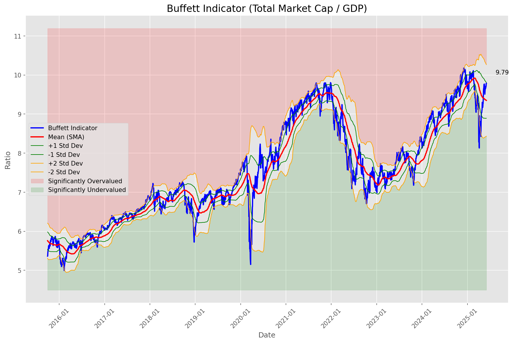
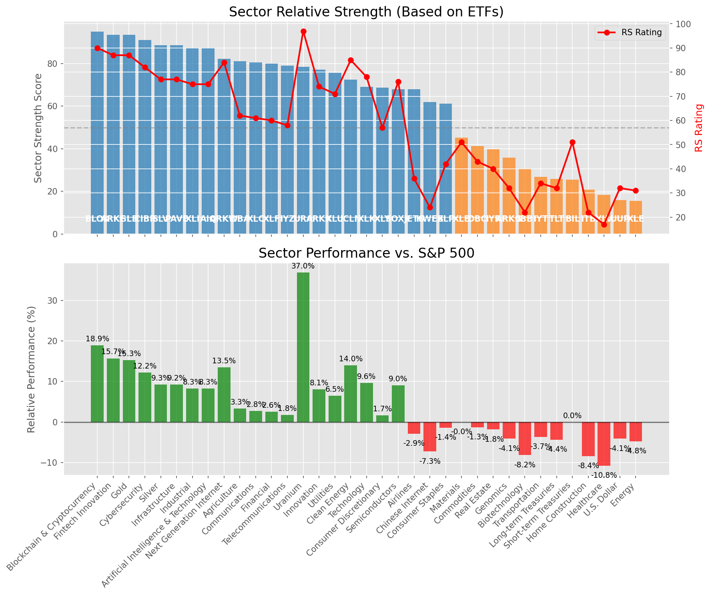

# **Daily Relative Strength Report**

**Date:** 2025-06-06

## **Market Valuation (Buffett Indicator)**

| Metric | Value |
|--------|-------|
| **Market Valuation** | **Fair Valued** |
| **Current Ratio** | 9.82 |
| **Historical Mean** | 9.35 |
| **Standard Deviation** | 0.45 |
| **Z-Score (StdDev from Mean)** | 0.85 |
| **Total Market Cap** | $294.34 trillion |
| **GDP** | $29.98 trillion |

## **Market Insights**

### **Market is Fairly Valued**

The market appears to be trading within a reasonable range of historical valuations. This suggests a balanced approach to equity investing is appropriate. Investors should:

- Focus on individual stock selection based on fundamentals and technicals
- Maintain normal equity allocations aligned with long-term goals
- Pay attention to sector rotation and relative strength
- Watch for changes in market leadership

Fair valuation typically suggests normal market returns can be expected, with stock selection becoming increasingly important.

### **Buffett Indicator Overview**

The Buffett Indicator (Total Market Cap / GDP) is a measure of the stock market's valuation relative to the size of the economy. It is named after Warren Buffett, who described it as "probably the best single measure of where valuations stand at any given moment."

- **Values above +2 standard deviations:** Market significantly overvalued
- **Values above +1 standard deviation:** Market overvalued
- **Values between -1 and +1 standard deviations:** Market fairly valued
- **Values below -1 standard deviation:** Market undervalued
- **Values below -2 standard deviations:** Market significantly undervalued

---

## **Sector Relative Strength**

Based on William O'Neil's Relative Strength Methodology

| ETF | Strength | RS Rating | Performance | Above Key MAs | Trend | Sector |
|-----|----------|-----------|-------------|--------------|-------|--------|
| [ARKW](https://www.tradingview.com/chart/?symbol=ARKW) | 97.0 | 94.0 | 28.17% | 10d ✓, 50d ✓, 200d ✓ | ↗️ | Next Generation Internet |
| [ARKF](https://www.tradingview.com/chart/?symbol=ARKF) | 96.5 | 93.0 | 24.42% | 10d ✓, 50d ✓, 200d ✓ | ↗️ | Fintech Innovation |
| [BLOK](https://www.tradingview.com/chart/?symbol=BLOK) | 96.5 | 93.0 | 24.95% | 10d ✓, 50d ✓, 200d ✓ | ↗️ | Blockchain & Cryptocurrency |
| [ARKK](https://www.tradingview.com/chart/?symbol=ARKK) | 94.0 | 88.0 | 16.99% | 10d ✓, 50d ✓, 200d ✓ | ↗️ | Innovation |
| [CIBR](https://www.tradingview.com/chart/?symbol=CIBR) | 90.5 | 81.0 | 11.36% | 10d ✓, 50d ✓, 200d ✓ | ↗️ | Cybersecurity |
| [SLV](https://www.tradingview.com/chart/?symbol=SLV) | 89.5 | 79.0 | 10.53% | 10d ✓, 50d ✓, 200d ✓ | ↗️ | Silver |
| [PAVE](https://www.tradingview.com/chart/?symbol=PAVE) | 88.5 | 77.0 | 9.47% | 10d ✓, 50d ✓, 200d ✓ | ↗️ | Infrastructure |
| [AIQ](https://www.tradingview.com/chart/?symbol=AIQ) | 87.0 | 74.0 | 7.96% | 10d ✓, 50d ✓, 200d ✓ | ↗️ | Artificial Intelligence & Technology |
| [XLI](https://www.tradingview.com/chart/?symbol=XLI) | 87.0 | 74.0 | 7.64% | 10d ✓, 50d ✓, 200d ✓ | ↗️ | Industrial |
| [DBA](https://www.tradingview.com/chart/?symbol=DBA) | 82.5 | 65.0 | 4.11% | 10d ✓, 50d ✓, 200d ✓ | ↗️ | Agriculture |
| [GLD](https://www.tradingview.com/chart/?symbol=GLD) | 82.1 | 84.0 | 14.18% | 10d ✗, 50d ✓, 200d ✓ | ↗️ | Gold |
| [XLF](https://www.tradingview.com/chart/?symbol=XLF) | 82.0 | 64.0 | 3.94% | 10d ✓, 50d ✓, 200d ✓ | ↗️ | Financial |
| [XLC](https://www.tradingview.com/chart/?symbol=XLC) | 80.5 | 61.0 | 2.93% | 10d ✓, 50d ✓, 200d ✓ | ↗️ | Communications |
| [URA](https://www.tradingview.com/chart/?symbol=URA) | 78.5 | 97.0 | 38.47% | 10d ✓, 50d ✓, 200d ✓ | ↘️ | Uranium |
| [IYZ](https://www.tradingview.com/chart/?symbol=IYZ) | 78.5 | 57.0 | 1.56% | 10d ✓, 50d ✓, 200d ✓ | ↗️ | Telecommunications |
| [JETS](https://www.tradingview.com/chart/?symbol=JETS) | 74.0 | 48.0 | -0.33% | 10d ✓, 50d ✓, 200d ✓ | ↗️ | Airlines |
| [XLU](https://www.tradingview.com/chart/?symbol=XLU) | 73.1 | 66.0 | 4.57% | 10d ✗, 50d ✓, 200d ✓ | ↗️ | Utilities |
| [ICLN](https://www.tradingview.com/chart/?symbol=ICLN) | 71.0 | 82.0 | 11.98% | 10d ✓, 50d ✓, 200d ✓ | ↘️ | Clean Energy |
| [XLY](https://www.tradingview.com/chart/?symbol=XLY) | 70.6 | 61.0 | 3.05% | 10d ✗, 50d ✓, 200d ✓ | ↗️ | Consumer Discretionary |
| [XLK](https://www.tradingview.com/chart/?symbol=XLK) | 68.0 | 76.0 | 8.95% | 10d ✓, 50d ✓, 200d ✓ | ↘️ | Technology |
| [SOXX](https://www.tradingview.com/chart/?symbol=SOXX) | 66.0 | 72.0 | 6.96% | 10d ✓, 50d ✓, 200d ✓ | ↘️ | Semiconductors |
| [KWEB](https://www.tradingview.com/chart/?symbol=KWEB) | 61.0 | 22.0 | -8.35% | 10d ✓, 50d ✓, 200d ✓ | ↗️ | Chinese Internet |
| [XLP](https://www.tradingview.com/chart/?symbol=XLP) | 60.6 | 41.0 | -1.66% | 10d ✗, 50d ✓, 200d ✓ | ↗️ | Consumer Staples |
| [ARKG](https://www.tradingview.com/chart/?symbol=ARKG) | 46.3 | 53.0 | 0.21% | 10d ✓, 50d ✓, 200d ✗ | ↘️ | Genomics |
| [XLB](https://www.tradingview.com/chart/?symbol=XLB) | 43.8 | 48.0 | -0.24% | 10d ✓, 50d ✓, 200d ✗ | ↘️ | Materials |
| [DBC](https://www.tradingview.com/chart/?symbol=DBC) | 40.8 | 42.0 | -1.39% | 10d ✓, 50d ✓, 200d ✗ | ↘️ | Commodities |
| [IYR](https://www.tradingview.com/chart/?symbol=IYR) | 38.8 | 38.0 | -2.50% | 10d ✓, 50d ✓, 200d ✗ | ↘️ | Real Estate |
| [XLE](https://www.tradingview.com/chart/?symbol=XLE) | 35.3 | 31.0 | -4.75% | 10d ✓, 50d ✓, 200d ✗ | ↘️ | Energy |
| [IBB](https://www.tradingview.com/chart/?symbol=IBB) | 31.8 | 24.0 | -7.34% | 10d ✓, 50d ✓, 200d ✗ | ↘️ | Biotechnology |
| [UUP](https://www.tradingview.com/chart/?symbol=UUP) | 27.4 | 35.0 | -3.31% | 10d ✓, 50d ✗, 200d ✗ | ↘️ | U.S. Dollar |
| [IYT](https://www.tradingview.com/chart/?symbol=IYT) | 26.9 | 34.0 | -3.71% | 10d ✗, 50d ✓, 200d ✗ | ↘️ | Transportation |
| [BIL](https://www.tradingview.com/chart/?symbol=BIL) | 25.5 | 51.0 | -0.01% | 10d ✗, 50d ✗, 200d ✗ | ↘️ | Short-term Treasuries |
| [TLT](https://www.tradingview.com/chart/?symbol=TLT) | 24.9 | 30.0 | -5.09% | 10d ✓, 50d ✗, 200d ✗ | ↘️ | Long-term Treasuries |
| [ITB](https://www.tradingview.com/chart/?symbol=ITB) | 19.9 | 20.0 | -9.18% | 10d ✓, 50d ✗, 200d ✗ | ↘️ | Home Construction |
| [XLV](https://www.tradingview.com/chart/?symbol=XLV) | 18.9 | 18.0 | -10.30% | 10d ✓, 50d ✗, 200d ✗ | ↘️ | Healthcare |

### **Sector ETF Performance Interpretation**

This table shows the relative strength metrics for different market sectors based on their representative ETFs:

- **ETF**: The ETF used to measure sector performance (click for chart)
- **Strength**: Overall sector strength score (0-100) combining multiple factors
- **RS Rating**: O'Neil RS rating of the sector ETF
- **Performance**: Performance of the sector ETF relative to SPY
- **Above Key MAs**: Whether the ETF is trading above its 10, 50, and 200-day moving averages
- **Trend**: Whether the sector is in an uptrend (↗️) or downtrend (↘️)

### **Current Sector Leadership**

The current market leadership is coming from the following sectors: **Next Generation Internet, Fintech Innovation, Blockchain & Cryptocurrency**.

The **Next Generation Internet** sector (represented by **ARKW**) is showing particularly strong relative strength with an RS rating of 94.0 and performance of 28.17% vs. the S&P 500. This sector is trading above its 10-day, 50-day, 200-day moving average(s). Investors should consider focusing on high RS stocks within these leading sectors for potential outperformance.

---

## **Buy Recommendations**

The following 81 stocks show exceptional relative strength:

| RS Rating | Buy Score | Current Price | Chart | Name | Ticker |
|-----------|-----------|---------------|-------|------|--------|
| 100 | 100 | $141.26 | [Chart](https://www.tradingview.com/chart/?symbol=LEU) | Centrus Energy Corp. | LEU |
| 100 | 100 | $130.94 | [Chart](https://www.tradingview.com/chart/?symbol=SEZL) | Sezzle Inc. Common Stock | SEZL |
| 100 | 100 | $243.18 | [Chart](https://www.tradingview.com/chart/?symbol=AGX) | Argan, Inc | AGX |
| 100 | 100 | $340.41 | [Chart](https://www.tradingview.com/chart/?symbol=CVNA) | Carvana Co. | CVNA |
| 100 | 100 | $218.40 | [Chart](https://www.tradingview.com/chart/?symbol=DAVE) | Dave Inc. Class A Common Stock | DAVE |
| 100 | 100 | $75.66 | [Chart](https://www.tradingview.com/chart/?symbol=HOOD) | Robinhood Markets, Inc. Class A Common Stock | HOOD |
| 100 | 100 | $95.83 | [Chart](https://www.tradingview.com/chart/?symbol=RBLX) | Roblox Corporation | RBLX |
| 100 | 100 | $97.69 | [Chart](https://www.tradingview.com/chart/?symbol=RBRK) | Rubrik, Inc. | RBRK |
| 99 | 100 | $55.81 | [Chart](https://www.tradingview.com/chart/?symbol=HIMS) | Hims & Hers Health, Inc. | HIMS |
| 99 | 100 | $40.77 | [Chart](https://www.tradingview.com/chart/?symbol=KTOS) | Kratos Defense & Security Solutions, Inc. | KTOS |
| 99 | 100 | $255.33 | [Chart](https://www.tradingview.com/chart/?symbol=GWRE) | GUIDEWIRE SOFTWARE, INC. | GWRE |
| 99 | 100 | $125.76 | [Chart](https://www.tradingview.com/chart/?symbol=PLTR) | Palantir Technologies Inc. Class A Common Stock | PLTR |
| 99 | 100 | $422.18 | [Chart](https://www.tradingview.com/chart/?symbol=APP) | Applovin Corporation Class A Common Stock | APP |
| 98 | 100 | $45.79 | [Chart](https://www.tradingview.com/chart/?symbol=AU) | AngloGold Ashanti plc | AU |
| 98 | 100 | $45.03 | [Chart](https://www.tradingview.com/chart/?symbol=REVG) | REV Group, Inc. | REVG |
| 98 | 100 | $20.01 | [Chart](https://www.tradingview.com/chart/?symbol=MIR) | Mirion Technologies, Inc. | MIR |
| 98 | 100 | $42.42 | [Chart](https://www.tradingview.com/chart/?symbol=FARO) | Faro Technologies Inc | FARO |
| 98 | 100 | $255.60 | [Chart](https://www.tradingview.com/chart/?symbol=TLN) | Talen Energy Corporation Common Stock | TLN |
| 97 | 100 | $21.06 | [Chart](https://www.tradingview.com/chart/?symbol=MAG) | MAG Silver Corp. | MAG |
| 97 | 100 | $174.92 | [Chart](https://www.tradingview.com/chart/?symbol=HWM) | Howmet Aerospace Inc. | HWM |
| 97 | 100 | $120.38 | [Chart](https://www.tradingview.com/chart/?symbol=CLS) | Celestica, Inc. | CLS |
| 97 | 100 | $1238.59 | [Chart](https://www.tradingview.com/chart/?symbol=NFLX) | NetFlix Inc | NFLX |
| 97 | 100 | $24.04 | [Chart](https://www.tradingview.com/chart/?symbol=TFPM) | Triple Flag Precious Metals Corp. | TFPM |
| 97 | 100 | $37.42 | [Chart](https://www.tradingview.com/chart/?symbol=AS) | Amer Sports, Inc. | AS |
| 96 | 100 | $71.59 | [Chart](https://www.tradingview.com/chart/?symbol=ULS) | UL Solutions Inc. | ULS |
| 96 | 100 | $23.54 | [Chart](https://www.tradingview.com/chart/?symbol=BTSG) | BrightSpring Health Services, Inc. Common Stock | BTSG |
| 96 | 100 | $710.50 | [Chart](https://www.tradingview.com/chart/?symbol=SPOT) | Spotify Technology S.A. | SPOT |
| 95 | 100 | $48.11 | [Chart](https://www.tradingview.com/chart/?symbol=SIL) | Global X Silver Miners ETF (NEW) | SIL |
| 95 | 100 | $55.63 | [Chart](https://www.tradingview.com/chart/?symbol=AKRO) | Akero Therapeutics, Inc. Common Stock | AKRO |
| 95 | 100 | $68.93 | [Chart](https://www.tradingview.com/chart/?symbol=GDXJ) | VanEck Junior Gold Miners ETF | GDXJ |
| 95 | 100 | $255.60 | [Chart](https://www.tradingview.com/chart/?symbol=GE) | GE Aerospace | GE |
| 94 | 100 | $43.73 | [Chart](https://www.tradingview.com/chart/?symbol=TOST) | Toast, Inc. | TOST |
| 94 | 100 | $30.16 | [Chart](https://www.tradingview.com/chart/?symbol=NTGR) | NETGEAR, Inc. | NTGR |
| 94 | 100 | $58.02 | [Chart](https://www.tradingview.com/chart/?symbol=SHLD) | Global X Defense Tech ETF | SHLD |
| 93 | 100 | $88.65 | [Chart](https://www.tradingview.com/chart/?symbol=WPM) | Wheaton Precious Metals Corp. Common Stock | WPM |
| 93 | 100 | $44.68 | [Chart](https://www.tradingview.com/chart/?symbol=ARKF) | ARK Fintech Innovation ETF | ARKF |
| 92 | 100 | $51.59 | [Chart](https://www.tradingview.com/chart/?symbol=GDX) | VanEck Gold Miners ETF | GDX |
| 92 | 100 | $27.43 | [Chart](https://www.tradingview.com/chart/?symbol=UVE) | UNIVERSAL INSURANCE HLDG, INC. | UVE |
| 92 | 100 | $18.30 | [Chart](https://www.tradingview.com/chart/?symbol=LQDA) | Liquidia Corporation Common Stock | LQDA |
| 92 | 100 | $188.06 | [Chart](https://www.tradingview.com/chart/?symbol=CVLT) | Commault Systems, Inc. | CVLT |
| 91 | 100 | $405.26 | [Chart](https://www.tradingview.com/chart/?symbol=CYBR) | CyberArk Software Ltd. | CYBR |
| 91 | 100 | $170.81 | [Chart](https://www.tradingview.com/chart/?symbol=EAT) | Brinker International, Inc. | EAT |
| 91 | 100 | $181.37 | [Chart](https://www.tradingview.com/chart/?symbol=ITA) | iShares U.S. Aerospace & Defense ETF | ITA |
| 91 | 100 | $47.85 | [Chart](https://www.tradingview.com/chart/?symbol=GH) | Guardant Health, Inc. Common Stock | GH |
| 91 | 100 | $35.23 | [Chart](https://www.tradingview.com/chart/?symbol=AHR) | American Healthcare REIT, Inc. | AHR |
| 90 | 100 | $181.93 | [Chart](https://www.tradingview.com/chart/?symbol=PM) | Philip Morris International Inc. | PM |
| 89 | 100 | $5570.52 | [Chart](https://www.tradingview.com/chart/?symbol=BKNG) | Booking Holdings Inc. Common Stock | BKNG |
| 89 | 100 | $56.69 | [Chart](https://www.tradingview.com/chart/?symbol=TXNM) | TXNM Energy, Inc. | TXNM |
| 88 | 100 | $283.16 | [Chart](https://www.tradingview.com/chart/?symbol=VRSN) | VeriSign Inc | VRSN |
| 88 | 100 | $23.93 | [Chart](https://www.tradingview.com/chart/?symbol=SRAD) | Sportradar Group AG Class A Ordinary Shares | SRAD |
| 88 | 100 | $57.54 | [Chart](https://www.tradingview.com/chart/?symbol=CAKE) | Cheesecake Factory (The) | CAKE |
| 86 | 100 | $106.25 | [Chart](https://www.tradingview.com/chart/?symbol=AXS) | Axis Capital Holders Limited | AXS |
| 89 | 99 | $166.31 | [Chart](https://www.tradingview.com/chart/?symbol=NTRA) | Natera, Inc. Common Stock | NTRA |
| 88 | 99 | $288.53 | [Chart](https://www.tradingview.com/chart/?symbol=VEEV) | Veeva Systems Inc. | VEEV |
| 87 | 99 | $28.14 | [Chart](https://www.tradingview.com/chart/?symbol=DB) | Deutsche Bank Aktiengesellschaft | DB |
| 87 | 99 | $47.70 | [Chart](https://www.tradingview.com/chart/?symbol=BTI) | British American Tobacco p.l.c. American Depositary Shares, American Depositary Shares, each representing one Ordinary Share | BTI |
| 88 | 98 | $46.36 | [Chart](https://www.tradingview.com/chart/?symbol=BBW) | Build-A-Bear Workshop, Inc. | BBW |
| 88 | 98 | $57.26 | [Chart](https://www.tradingview.com/chart/?symbol=BAM) | Brookfield Asset Management Ltd. | BAM |
| 88 | 98 | $65.08 | [Chart](https://www.tradingview.com/chart/?symbol=SLF) | Sun Life Financial Inc. | SLF |
| 87 | 98 | $214.66 | [Chart](https://www.tradingview.com/chart/?symbol=BAP) | Credicorp LTD | BAP |
| 86 | 98 | $77.01 | [Chart](https://www.tradingview.com/chart/?symbol=LLYVK) | Liberty Media Corporation Series C Liberty Live Common Stock | LLYVK |
| 86 | 97 | $43.55 | [Chart](https://www.tradingview.com/chart/?symbol=EWP) | iShares MSCI Spain ETF | EWP |
| 84 | 97 | $18.15 | [Chart](https://www.tradingview.com/chart/?symbol=BCS) | Barclays PLC | BCS |
| 86 | 96 | $119.05 | [Chart](https://www.tradingview.com/chart/?symbol=OLLI) | Ollie's Bargain Outlet Holdings, Inc. Common Stock | OLLI |
| 83 | 96 | $230.80 | [Chart](https://www.tradingview.com/chart/?symbol=TTWO) | Take-Two Interactive Software Inc | TTWO |
| 84 | 95 | $47.98 | [Chart](https://www.tradingview.com/chart/?symbol=EWI) | iShares MSCI Italy ETF | EWI |
| 82 | 95 | $30.05 | [Chart](https://www.tradingview.com/chart/?symbol=CEF) | Sprott Physical Gold and Silver Trust | CEF |
| 84 | 94 | $196.62 | [Chart](https://www.tradingview.com/chart/?symbol=COF) | Capital One Financial | COF |
| 84 | 94 | $84.96 | [Chart](https://www.tradingview.com/chart/?symbol=NDAQ) | Nasdaq, Inc. Common Stock | NDAQ |
| 82 | 94 | $143.12 | [Chart](https://www.tradingview.com/chart/?symbol=LYV) | Live Nation Entertainment Inc. | LYV |
| 82 | 94 | $78.97 | [Chart](https://www.tradingview.com/chart/?symbol=EBAY) | eBay Inc | EBAY |
| 84 | 93 | $86.03 | [Chart](https://www.tradingview.com/chart/?symbol=SANM) | Sanmina  Corp | SANM |
| 83 | 93 | $85.50 | [Chart](https://www.tradingview.com/chart/?symbol=SEIC) | SEI Investments Co | SEIC |
| 82 | 93 | $59.35 | [Chart](https://www.tradingview.com/chart/?symbol=IGF) | iShares Global Infrastructure ETF | IGF |
| 81 | 93 | $73.42 | [Chart](https://www.tradingview.com/chart/?symbol=CIBR) | First Trust Exchange-Traded Fund II First Trust NASDAQ Cybersecurity ETF | CIBR |
| 80 | 93 | $60.47 | [Chart](https://www.tradingview.com/chart/?symbol=WMB) | Williams Companies Inc. | WMB |
| 83 | 92 | $60.54 | [Chart](https://www.tradingview.com/chart/?symbol=UVV) | Universal Corporation | UVV |
| 80 | 92 | $32.23 | [Chart](https://www.tradingview.com/chart/?symbol=EUFN) | iShares MSCI Europe Financials ETF | EUFN |
| 81 | 91 | $29.48 | [Chart](https://www.tradingview.com/chart/?symbol=DBX) | Dropbox, Inc. Class A | DBX |
| 81 | 91 | $97.14 | [Chart](https://www.tradingview.com/chart/?symbol=CALM) | Cal-Maine Foods Inc | CALM |
| 80 | 91 | $148.72 | [Chart](https://www.tradingview.com/chart/?symbol=ROOT) | Root, Inc. Class A Common Stock | ROOT |

---

## **Sell Recommendations**

The following 202 stocks show deteriorating relative strength:

| RS Rating | Sell Score | Current Price | Chart | Name | Ticker |
|-----------|------------|---------------|-------|------|--------|
| 1 | 100 | $13.55 | [Chart](https://www.tradingview.com/chart/?symbol=IART) | Integra LifeSciences Holdings | IART |
| 1 | 100 | $42.72 | [Chart](https://www.tradingview.com/chart/?symbol=SRPT) | Sarepta Therapeutics,, Inc. Common Stock | SRPT |
| 1 | 100 | $10.05 | [Chart](https://www.tradingview.com/chart/?symbol=WNC) | Wabash National Corp. | WNC |
| 1 | 100 | $17.01 | [Chart](https://www.tradingview.com/chart/?symbol=NVDS) | Investment Managers Series Trust II Tradr 1.5X Short NVDA Daily ETF | NVDS |
| 1 | 100 | $32.46 | [Chart](https://www.tradingview.com/chart/?symbol=TECS) | Direxion Daily Technology Bear 3x Shares | TECS |
| 1 | 100 | $12.71 | [Chart](https://www.tradingview.com/chart/?symbol=VFC) | V.F. Corporation | VFC |
| 1 | 100 | $17.03 | [Chart](https://www.tradingview.com/chart/?symbol=BHVN) | Biohaven Ltd. | BHVN |
| 2 | 100 | $41.28 | [Chart](https://www.tradingview.com/chart/?symbol=ENPH) | Enphase Energy, Inc. | ENPH |
| 2 | 100 | $22.10 | [Chart](https://www.tradingview.com/chart/?symbol=THS) | Treehouse Foods, Inc. | THS |
| 3 | 100 | $10.22 | [Chart](https://www.tradingview.com/chart/?symbol=PRTA) | Prothena Corporation plc Ordinary Shares | PRTA |
| 3 | 100 | $10.14 | [Chart](https://www.tradingview.com/chart/?symbol=CWK) | Cushman & Wakefield plc Ordinary Shares | CWK |
| 3 | 100 | $100.85 | [Chart](https://www.tradingview.com/chart/?symbol=GLOB) | GLOBANT S.A. | GLOB |
| 3 | 100 | $19.88 | [Chart](https://www.tradingview.com/chart/?symbol=HI) | Hillenbrand, Inc. | HI |
| 3 | 100 | $29.45 | [Chart](https://www.tradingview.com/chart/?symbol=QDEL) | QuidelOrtho Corporation Common Stock | QDEL |
| 3 | 100 | $10.31 | [Chart](https://www.tradingview.com/chart/?symbol=VREX) | Varex Imaging Corporation Common Stock | VREX |
| 3 | 100 | $26.17 | [Chart](https://www.tradingview.com/chart/?symbol=CRTO) | Criteo S.A. | CRTO |
| 3 | 100 | $10.36 | [Chart](https://www.tradingview.com/chart/?symbol=PACS) | PACS Group, Inc. | PACS |
| 3 | 100 | $10.04 | [Chart](https://www.tradingview.com/chart/?symbol=SONO) | Sonos, Inc. Common Stock | SONO |
| 3 | 100 | $44.53 | [Chart](https://www.tradingview.com/chart/?symbol=LINE) | Lineage, Inc. Common Stock | LINE |
| 4 | 100 | $55.61 | [Chart](https://www.tradingview.com/chart/?symbol=SPB) | Spectrum Brands Holdings, Inc. | SPB |
| 4 | 100 | $32.70 | [Chart](https://www.tradingview.com/chart/?symbol=CYTK) | Cytokinetics Inc. | CYTK |
| 4 | 100 | $76.15 | [Chart](https://www.tradingview.com/chart/?symbol=GPN) | Global Payments, Inc. | GPN |
| 4 | 100 | $14.22 | [Chart](https://www.tradingview.com/chart/?symbol=DQ) | Daqo New Energy Corp. American Depositary Shares (each representing 5 Ordinary Shares) | DQ |
| 4 | 100 | $135.90 | [Chart](https://www.tradingview.com/chart/?symbol=INSP) | Inspire Medical Systems, Inc. | INSP |
| 4 | 100 | $132.62 | [Chart](https://www.tradingview.com/chart/?symbol=KRYS) | Krystal Biotech, Inc. Common Stock | KRYS |
| 4 | 100 | $14.10 | [Chart](https://www.tradingview.com/chart/?symbol=INMD) | InMode Ltd. Ordinary Shares | INMD |
| 4 | 100 | $17.00 | [Chart](https://www.tradingview.com/chart/?symbol=AMTB) | Amerant Bancorp Inc. | AMTB |
| 5 | 100 | $52.58 | [Chart](https://www.tradingview.com/chart/?symbol=ASGN) | ASGN Incorporated | ASGN |
| 5 | 100 | $13.38 | [Chart](https://www.tradingview.com/chart/?symbol=CAL) | Caleres Inc | CAL |
| 5 | 100 | $31.56 | [Chart](https://www.tradingview.com/chart/?symbol=MBIN) | Merchants Bancorp Common Stock | MBIN |
| 5 | 100 | $26.41 | [Chart](https://www.tradingview.com/chart/?symbol=WMG) | Warner Music Group Corp. Class A Common Stock | WMG |
| 5 | 100 | $16.80 | [Chart](https://www.tradingview.com/chart/?symbol=EGBN) | Eagle Bancorp Inc | EGBN |
| 5 | 100 | $20.64 | [Chart](https://www.tradingview.com/chart/?symbol=AMRK) | A-Mark Precious Metals, Inc. | AMRK |
| 6 | 100 | $27.76 | [Chart](https://www.tradingview.com/chart/?symbol=QID) | ProShares UltraShort QQQ | QID |
| 6 | 100 | $67.38 | [Chart](https://www.tradingview.com/chart/?symbol=WD) | Walker & Dunlop, Inc. | WD |
| 6 | 100 | $10.97 | [Chart](https://www.tradingview.com/chart/?symbol=CLB) | Core Laboratories Inc. | CLB |
| 6 | 100 | $56.62 | [Chart](https://www.tradingview.com/chart/?symbol=BMRN) | BioMarin Pharmaceuticals Inc | BMRN |
| 6 | 100 | $59.46 | [Chart](https://www.tradingview.com/chart/?symbol=ALB) | Albemarle Corporation | ALB |
| 6 | 100 | $53.23 | [Chart](https://www.tradingview.com/chart/?symbol=SLVM) | Sylvamo Corporation | SLVM |
| 6 | 100 | $71.34 | [Chart](https://www.tradingview.com/chart/?symbol=FND) | Floor & Decor Holdings, Inc. | FND |
| 6 | 100 | $18.83 | [Chart](https://www.tradingview.com/chart/?symbol=DNTH) | Dianthus Therapeutics, Inc. Common Stock | DNTH |
| 6 | 100 | $10.34 | [Chart](https://www.tradingview.com/chart/?symbol=MBC) | MasterBrand, Inc. | MBC |
| 7 | 100 | $51.09 | [Chart](https://www.tradingview.com/chart/?symbol=FBIN) | Fortune Brands Innovations, Inc. | FBIN |
| 7 | 100 | $20.23 | [Chart](https://www.tradingview.com/chart/?symbol=BITI) | ProShares Short Bitcoin ETF | BITI |
| 7 | 100 | $43.81 | [Chart](https://www.tradingview.com/chart/?symbol=ABM) | ABM Industries, Inc. | ABM |
| 7 | 100 | $34.20 | [Chart](https://www.tradingview.com/chart/?symbol=ANDE) | Andersons Inc/The | ANDE |
| 7 | 100 | $51.67 | [Chart](https://www.tradingview.com/chart/?symbol=KBH) | KB Home | KBH |
| 7 | 100 | $98.12 | [Chart](https://www.tradingview.com/chart/?symbol=UPS) | United Parcel Service, Inc. Class B | UPS |
| 7 | 100 | $43.54 | [Chart](https://www.tradingview.com/chart/?symbol=RHI) | Robert Half Inc. | RHI |
| 8 | 100 | $30.04 | [Chart](https://www.tradingview.com/chart/?symbol=BAX) | Baxter International Inc. | BAX |
| 8 | 100 | $297.55 | [Chart](https://www.tradingview.com/chart/?symbol=POOL) | Pool Corporation | POOL |
| 8 | 100 | $22.25 | [Chart](https://www.tradingview.com/chart/?symbol=CAG) | Conagra Brands, Inc. | CAG |
| 8 | 100 | $10.11 | [Chart](https://www.tradingview.com/chart/?symbol=AEO) | American Eagle Outfitters | AEO |
| 8 | 100 | $23.81 | [Chart](https://www.tradingview.com/chart/?symbol=RPD) | Rapid7, Inc. Common Stock | RPD |
| 8 | 100 | $33.70 | [Chart](https://www.tradingview.com/chart/?symbol=SLB) | Schlumberger Limited | SLB |
| 8 | 100 | $20.45 | [Chart](https://www.tradingview.com/chart/?symbol=HAL) | Halliburton Company | HAL |
| 8 | 100 | $20.02 | [Chart](https://www.tradingview.com/chart/?symbol=OLN) | Olin Corp. | OLN |
| 8 | 100 | $22.86 | [Chart](https://www.tradingview.com/chart/?symbol=IPG) | The Interpublic Group of Companies, Inc. | IPG |
| 8 | 100 | $38.88 | [Chart](https://www.tradingview.com/chart/?symbol=APOG) | Apogee Enterprises Inc | APOG |
| 9 | 100 | $26.64 | [Chart](https://www.tradingview.com/chart/?symbol=WERN) | Werner Enterprises Inc | WERN |
| 9 | 100 | $64.17 | [Chart](https://www.tradingview.com/chart/?symbol=MTH) | Meritage Homes Corporation | MTH |
| 9 | 100 | $111.47 | [Chart](https://www.tradingview.com/chart/?symbol=BLDR) | Builders FirstSource, Inc. | BLDR |
| 10 | 100 | $10.57 | [Chart](https://www.tradingview.com/chart/?symbol=SD) | SandRidge Energy, Inc. | SD |
| 10 | 100 | $85.35 | [Chart](https://www.tradingview.com/chart/?symbol=KSPI) | Joint Stock Company Kaspi.kz American Depository Shares | KSPI |
| 11 | 100 | $33.35 | [Chart](https://www.tradingview.com/chart/?symbol=NSA) | National Storage Affiliates Trust | NSA |
| 11 | 100 | $203.25 | [Chart](https://www.tradingview.com/chart/?symbol=AAPL) | Apple Inc. | AAPL |
| 11 | 100 | $219.31 | [Chart](https://www.tradingview.com/chart/?symbol=BIO) | Bio-Rad Laboratories, Inc.Class A | BIO |
| 11 | 100 | $54.59 | [Chart](https://www.tradingview.com/chart/?symbol=GIS) | General Mills, Inc. | GIS |
| 12 | 100 | $33.54 | [Chart](https://www.tradingview.com/chart/?symbol=HUBG) | HUB Group Inc | HUBG |
| 13 | 100 | $12.51 | [Chart](https://www.tradingview.com/chart/?symbol=MED) | Medifast, Inc. | MED |
| 13 | 100 | $14.48 | [Chart](https://www.tradingview.com/chart/?symbol=HR) | Healthcare Realty Trust Incorporated | HR |
| 14 | 100 | $87.47 | [Chart](https://www.tradingview.com/chart/?symbol=BCC) | Boise Cascade Company | BCC |
| 14 | 100 | $11.67 | [Chart](https://www.tradingview.com/chart/?symbol=KELYA) | Kelly Services Inc | KELYA |
| 14 | 100 | $10.35 | [Chart](https://www.tradingview.com/chart/?symbol=SCS) | Steelcase, Inc. | SCS |
| 14 | 100 | $161.22 | [Chart](https://www.tradingview.com/chart/?symbol=HSY) | The Hershey Company | HSY |
| 16 | 100 | $111.49 | [Chart](https://www.tradingview.com/chart/?symbol=EXPD) | Expeditors International of Washington, Inc. | EXPD |
| 5 | 99 | $32.69 | [Chart](https://www.tradingview.com/chart/?symbol=SQM) | Sociedad Quimica y Minera de Chile SA | SQM |
| 6 | 99 | $11.96 | [Chart](https://www.tradingview.com/chart/?symbol=PUBM) | PubMatic, Inc. Class A Common Stock | PUBM |
| 9 | 99 | $110.44 | [Chart](https://www.tradingview.com/chart/?symbol=AMR) | Alpha Metallurgical Resources, Inc. | AMR |
| 10 | 99 | $17.14 | [Chart](https://www.tradingview.com/chart/?symbol=DOC) | Healthpeak Properties, Inc. | DOC |
| 10 | 99 | $21.38 | [Chart](https://www.tradingview.com/chart/?symbol=GNTX) | Gentex Corp | GNTX |
| 10 | 99 | $15.24 | [Chart](https://www.tradingview.com/chart/?symbol=SAFE) | Safehold Inc. | SAFE |
| 11 | 99 | $65.05 | [Chart](https://www.tradingview.com/chart/?symbol=KMX) | CarMax Inc. | KMX |
| 12 | 99 | $49.95 | [Chart](https://www.tradingview.com/chart/?symbol=ASH) | Ashland Inc. | ASH |
| 15 | 99 | $10.00 | [Chart](https://www.tradingview.com/chart/?symbol=LBTYK) | Liberty Global Ltd. Class C Common Shares | LBTYK |
| 9 | 98 | $10.92 | [Chart](https://www.tradingview.com/chart/?symbol=FBRT) | Franklin BSP Realty Trust, Inc. | FBRT |
| 10 | 98 | $62.98 | [Chart](https://www.tradingview.com/chart/?symbol=MAS) | Masco Corporation | MAS |
| 12 | 98 | $92.03 | [Chart](https://www.tradingview.com/chart/?symbol=ZBH) | Zimmer Biomet Holdings, Inc. | ZBH |
| 13 | 98 | $32.64 | [Chart](https://www.tradingview.com/chart/?symbol=WGO) | Winnebago Industries, Inc. | WGO |
| 14 | 98 | $108.66 | [Chart](https://www.tradingview.com/chart/?symbol=LEN) | Lennar Corporation Class A | LEN |
| 9 | 97 | $99.97 | [Chart](https://www.tradingview.com/chart/?symbol=PDD) | PDD Holdings Inc. American Depositary Shares | PDD |
| 11 | 97 | $25.20 | [Chart](https://www.tradingview.com/chart/?symbol=HASI) | HA Sustainable Infrastructure Capital, Inc. | HASI |
| 12 | 97 | $26.22 | [Chart](https://www.tradingview.com/chart/?symbol=JANX) | Janux Therapeutics, Inc. Common Stock | JANX |
| 13 | 97 | $132.23 | [Chart](https://www.tradingview.com/chart/?symbol=NSIT) | Insight Enterprises Inc | NSIT |
| 24 | 97 | $19.58 | [Chart](https://www.tradingview.com/chart/?symbol=HVT) | Haverty Furniture Companies, Inc. | HVT |
| 10 | 96 | $38.95 | [Chart](https://www.tradingview.com/chart/?symbol=PCH) | PotlatchDeltic Corporation Common Stock | PCH |
| 11 | 96 | $127.17 | [Chart](https://www.tradingview.com/chart/?symbol=CLX) | Clorox Company | CLX |
| 15 | 96 | $122.10 | [Chart](https://www.tradingview.com/chart/?symbol=TFX) | Teleflex Incorporated | TFX |
| 17 | 96 | $45.88 | [Chart](https://www.tradingview.com/chart/?symbol=TWM) | ProShares UltraShort Russell2000 | TWM |
| 5 | 95 | $12.53 | [Chart](https://www.tradingview.com/chart/?symbol=ERII) | Energy Recovery, Inc. | ERII |
| 5 | 95 | $81.31 | [Chart](https://www.tradingview.com/chart/?symbol=LNTH) | Lantheus Holdings, Inc | LNTH |
| 6 | 95 | $10.03 | [Chart](https://www.tradingview.com/chart/?symbol=EMBC) | Embecta Corp. Common Stock | EMBC |
| 9 | 95 | $17.25 | [Chart](https://www.tradingview.com/chart/?symbol=CODI) | Compass Diversified | CODI |
| 10 | 95 | $12.36 | [Chart](https://www.tradingview.com/chart/?symbol=PMT) | PennyMac Mortgage Investment Trust | PMT |
| 16 | 95 | $16.24 | [Chart](https://www.tradingview.com/chart/?symbol=CHCT) | Community Healthcare Trust Incorporated Common Stock, $0.01 par value per share | CHCT |
| 7 | 94 | $12.88 | [Chart](https://www.tradingview.com/chart/?symbol=TZA) | Direxion Daily Small Cap Bear 3x Shares | TZA |
| 13 | 94 | $19.47 | [Chart](https://www.tradingview.com/chart/?symbol=AKR) | Acadia Realty Trust | AKR |
| 13 | 94 | $100.92 | [Chart](https://www.tradingview.com/chart/?symbol=MHK) | Mohawk Industries, Inc. | MHK |
| 14 | 94 | $42.83 | [Chart](https://www.tradingview.com/chart/?symbol=PRKS) | United Parks & Resorts Inc. | PRKS |
| 15 | 94 | $37.16 | [Chart](https://www.tradingview.com/chart/?symbol=LIT) | Global X Lithium & Battery Tech ETF | LIT |
| 20 | 94 | $14.97 | [Chart](https://www.tradingview.com/chart/?symbol=VRE) | Veris Residential, Inc. | VRE |
| 12 | 93 | $23.38 | [Chart](https://www.tradingview.com/chart/?symbol=RYN) | Rayonier Inc. | RYN |
| 13 | 93 | $10.12 | [Chart](https://www.tradingview.com/chart/?symbol=HOPE) | Hope Bancorp, Inc. | HOPE |
| 15 | 93 | $21.11 | [Chart](https://www.tradingview.com/chart/?symbol=KIDS) | OrthoPediatrics Corp. Common Stock | KIDS |
| 16 | 93 | $23.50 | [Chart](https://www.tradingview.com/chart/?symbol=GIII) | G-Iii Apparel Group Ltd | GIII |
| 10 | 92 | $179.03 | [Chart](https://www.tradingview.com/chart/?symbol=DKS) | Dick's Sporting Goods, Inc. | DKS |
| 13 | 92 | $11.77 | [Chart](https://www.tradingview.com/chart/?symbol=FFIC) | Flushing Financial Corp | FFIC |
| 14 | 92 | $38.11 | [Chart](https://www.tradingview.com/chart/?symbol=WLY) | John Wiley & Sons, Inc. Class A | WLY |
| 14 | 92 | $49.41 | [Chart](https://www.tradingview.com/chart/?symbol=ERX) | Direxion Daily Energy Bull 2X Shares | ERX |
| 15 | 92 | $76.70 | [Chart](https://www.tradingview.com/chart/?symbol=AKAM) | Akamai Technologies Inc | AKAM |
| 17 | 92 | $74.95 | [Chart](https://www.tradingview.com/chart/?symbol=CBT) | Cabot Corporation | CBT |
| 17 | 92 | $32.58 | [Chart](https://www.tradingview.com/chart/?symbol=TENB) | Tenable Holdings, Inc. | TENB |
| 14 | 91 | $26.79 | [Chart](https://www.tradingview.com/chart/?symbol=GDEN) | Golden Entertainment, Inc. Common Stock | GDEN |
| 18 | 91 | $12.92 | [Chart](https://www.tradingview.com/chart/?symbol=MRTN) | Marten Transport Ltd | MRTN |
| 20 | 91 | $10.72 | [Chart](https://www.tradingview.com/chart/?symbol=NMFC) | NEW MOUNTAIN FINANCE CORPORATION | NMFC |
| 16 | 90 | $11.74 | [Chart](https://www.tradingview.com/chart/?symbol=SITC) | SITE Centers Corp. Common Shares | SITC |
| 17 | 90 | $12.26 | [Chart](https://www.tradingview.com/chart/?symbol=WSR) | Whitestone REIT | WSR |
| 21 | 90 | $24.80 | [Chart](https://www.tradingview.com/chart/?symbol=ASTH) | Astrana Health Inc. Common Stock | ASTH |
| 15 | 89 | $765.68 | [Chart](https://www.tradingview.com/chart/?symbol=LLY) | Eli Lilly & Co. | LLY |
| 17 | 89 | $76.42 | [Chart](https://www.tradingview.com/chart/?symbol=PFG) | Principal Financial Group, Inc. | PFG |
| 17 | 89 | $139.73 | [Chart](https://www.tradingview.com/chart/?symbol=CVX) | Chevron Corporation | CVX |
| 18 | 89 | $64.39 | [Chart](https://www.tradingview.com/chart/?symbol=ZROZ) | PIMCO 25+ Year Zero Coupon U.S. Treasury Index Exchange-Traded Fund | ZROZ |
| 19 | 89 | $36.32 | [Chart](https://www.tradingview.com/chart/?symbol=STBA) | S&T Bancorp Inc | STBA |
| 32 | 89 | $47.33 | [Chart](https://www.tradingview.com/chart/?symbol=ADM) | Archer Daniels Midland Company | ADM |
| 17 | 88 | $50.66 | [Chart](https://www.tradingview.com/chart/?symbol=TSCO) | Tractor Supply Co | TSCO |
| 20 | 88 | $75.10 | [Chart](https://www.tradingview.com/chart/?symbol=CNS) | Cohen & Steers Inc. | CNS |
| 22 | 88 | $29.98 | [Chart](https://www.tradingview.com/chart/?symbol=TPH) | Tri Pointe Homes, Inc. | TPH |
| 22 | 88 | $34.55 | [Chart](https://www.tradingview.com/chart/?symbol=CMCSA) | Comcast Corp | CMCSA |
| 24 | 88 | $19.72 | [Chart](https://www.tradingview.com/chart/?symbol=FOR) | Forestar Group Inc. | FOR |
| 24 | 88 | $13.68 | [Chart](https://www.tradingview.com/chart/?symbol=BSM) | Black Stone Minerals, L.P. | BSM |
| 20 | 87 | $36.33 | [Chart](https://www.tradingview.com/chart/?symbol=NBHC) | NATIONAL BANK HOLDINGS CORP. | NBHC |
| 23 | 87 | $46.23 | [Chart](https://www.tradingview.com/chart/?symbol=SDOW) | ProShares UltraPro Short Dow 30 | SDOW |
| 19 | 86 | $37.67 | [Chart](https://www.tradingview.com/chart/?symbol=WPP) | WPP PLC | WPP |
| 19 | 86 | $62.00 | [Chart](https://www.tradingview.com/chart/?symbol=ELS) | Equity Lifestyle Properties, Inc. | ELS |
| 20 | 86 | $10.56 | [Chart](https://www.tradingview.com/chart/?symbol=LADR) | LADDER CAPITAL CORP | LADR |
| 29 | 86 | $21.37 | [Chart](https://www.tradingview.com/chart/?symbol=GPCR) | Structure Therapeutics Inc. American Depositary Shares | GPCR |
| 20 | 85 | $97.37 | [Chart](https://www.tradingview.com/chart/?symbol=UFPI) | UFP Industries, Inc. Common Stock | UFPI |
| 23 | 85 | $20.76 | [Chart](https://www.tradingview.com/chart/?symbol=DJT) | Trump Media & Technology Group Corp. Common Stock | DJT |
| 23 | 85 | $41.04 | [Chart](https://www.tradingview.com/chart/?symbol=NBTB) | NBT Bancorp Inc | NBTB |
| 18 | 84 | $39.00 | [Chart](https://www.tradingview.com/chart/?symbol=LKQ) | LKQ Corporation | LKQ |
| 21 | 84 | $54.76 | [Chart](https://www.tradingview.com/chart/?symbol=CNC) | Centene Corporation | CNC |
| 22 | 84 | $10.33 | [Chart](https://www.tradingview.com/chart/?symbol=PFLT) | PennantPark Floating Rate Capital Ltd. | PFLT |
| 22 | 84 | $448.44 | [Chart](https://www.tradingview.com/chart/?symbol=VRTX) | Vertex Pharmaceuticals Inc | VRTX |
| 24 | 84 | $57.30 | [Chart](https://www.tradingview.com/chart/?symbol=TMHC) | Taylor Morrison Home Corporation Common Stock | TMHC |
| 32 | 84 | $76.40 | [Chart](https://www.tradingview.com/chart/?symbol=OTTR) | Otter Tail Corp | OTTR |
| 19 | 83 | $85.47 | [Chart](https://www.tradingview.com/chart/?symbol=BIDU) | Baidu, Inc. | BIDU |
| 19 | 83 | $442.37 | [Chart](https://www.tradingview.com/chart/?symbol=WSO) | Watsco, Inc. | WSO |
| 26 | 83 | $90.31 | [Chart](https://www.tradingview.com/chart/?symbol=CL) | Colgate-Palmolive Company | CL |
| 27 | 83 | $10.31 | [Chart](https://www.tradingview.com/chart/?symbol=MUC) | BLACKROCK MUNIHOLDINGS CALIFORNIA QUALITY FUND, INC | MUC |
| 31 | 83 | $25.32 | [Chart](https://www.tradingview.com/chart/?symbol=WS) | Worthington Steel, Inc. | WS |
| 21 | 82 | $16.75 | [Chart](https://www.tradingview.com/chart/?symbol=UMH) | UMH Properties, Inc. | UMH |
| 23 | 82 | $41.08 | [Chart](https://www.tradingview.com/chart/?symbol=POR) | Portland General Electric Company | POR |
| 24 | 82 | $154.45 | [Chart](https://www.tradingview.com/chart/?symbol=JNJ) | Johnson & Johnson | JNJ |
| 24 | 82 | $104.42 | [Chart](https://www.tradingview.com/chart/?symbol=DEO) | Diageo plc | DEO |
| 27 | 82 | $110.39 | [Chart](https://www.tradingview.com/chart/?symbol=SJM) | The J.M. Smucker Company | SJM |
| 33 | 82 | $87.15 | [Chart](https://www.tradingview.com/chart/?symbol=COP) | ConocoPhillips | COP |
| 24 | 81 | $224.82 | [Chart](https://www.tradingview.com/chart/?symbol=LOW) | Lowe's Companies Inc. | LOW |
| 25 | 81 | $10.40 | [Chart](https://www.tradingview.com/chart/?symbol=MYI) | BLACKROCK MUNIYIELD QUALITY FUND III, INC. | MYI |
| 26 | 81 | $11.82 | [Chart](https://www.tradingview.com/chart/?symbol=NVG) | Nuveen AMT-Free Municipal Credit Income Fund | NVG |
| 32 | 81 | $30.77 | [Chart](https://www.tradingview.com/chart/?symbol=DAR) | DARLING INGREDIENTS INC. | DAR |
| 21 | 80 | $46.13 | [Chart](https://www.tradingview.com/chart/?symbol=GLPI) | Gaming and Leisure Properties, Inc. | GLPI |
| 25 | 80 | $163.54 | [Chart](https://www.tradingview.com/chart/?symbol=PG) | Procter & Gamble Company | PG |
| 26 | 80 | $25.97 | [Chart](https://www.tradingview.com/chart/?symbol=PRGO) | PERRIGO COMPANY PLC | PRGO |
| 23 | 79 | $122.99 | [Chart](https://www.tradingview.com/chart/?symbol=SUI) | Sun Communities, Inc | SUI |
| 23 | 79 | $13.70 | [Chart](https://www.tradingview.com/chart/?symbol=DOLE) | Dole plc | DOLE |
| 31 | 79 | $103.97 | [Chart](https://www.tradingview.com/chart/?symbol=XOM) | Exxon Mobil Corporation | XOM |
| 24 | 78 | $202.47 | [Chart](https://www.tradingview.com/chart/?symbol=AVB) | AvalonBay Communities, Inc. | AVB |
| 26 | 78 | $20.07 | [Chart](https://www.tradingview.com/chart/?symbol=PEY) | Invesco High Yield Equity Dividend Achievers ETF | PEY |
| 28 | 78 | $10.88 | [Chart](https://www.tradingview.com/chart/?symbol=LBTYA) | Liberty Global Ltd. Class A Common Shares | LBTYA |
| 25 | 77 | $29.46 | [Chart](https://www.tradingview.com/chart/?symbol=HTH) | HILLTOP HOLDINGS INC. | HTH |
| 25 | 77 | $198.65 | [Chart](https://www.tradingview.com/chart/?symbol=EXP) | Eagle Materials, Inc. | EXP |
| 33 | 77 | $83.38 | [Chart](https://www.tradingview.com/chart/?symbol=BCO) | The Brink's Company | BCO |
| 27 | 76 | $26.02 | [Chart](https://www.tradingview.com/chart/?symbol=ETD) | Ethan Allen Interiors Inc | ETD |
| 31 | 76 | $31.09 | [Chart](https://www.tradingview.com/chart/?symbol=CENTA) | Central Garden & Pet Company | CENTA |
| 31 | 76 | $55.66 | [Chart](https://www.tradingview.com/chart/?symbol=O) | Realty Income Corporation | O |
| 34 | 76 | $10.14 | [Chart](https://www.tradingview.com/chart/?symbol=URGN) | UroGen Pharma Ltd. Ordinary Shares | URGN |
| 31 | 75 | $24.48 | [Chart](https://www.tradingview.com/chart/?symbol=HYMB) | SPDR Nuveen ICE High Yield Municipal Bond ETF | HYMB |
| 36 | 75 | $48.76 | [Chart](https://www.tradingview.com/chart/?symbol=IGLB) | iShares 10+ Year Investment Grade Corporate Bond ETF | IGLB |
| 30 | 74 | $68.30 | [Chart](https://www.tradingview.com/chart/?symbol=EQR) | Equity Residential | EQR |
| 32 | 74 | $15.78 | [Chart](https://www.tradingview.com/chart/?symbol=BBN) | BlackRock Taxable Municipal Bond Trust | BBN |
| 33 | 74 | $32.87 | [Chart](https://www.tradingview.com/chart/?symbol=INVH) | Invitation Homes Inc. Common Stock | INVH |
| 35 | 74 | $310.00 | [Chart](https://www.tradingview.com/chart/?symbol=CI) | The Cigna Group | CI |
| 31 | 73 | $11.83 | [Chart](https://www.tradingview.com/chart/?symbol=NZF) | Nuveen Municipal Credit Income Fund | NZF |
| 34 | 73 | $67.47 | [Chart](https://www.tradingview.com/chart/?symbol=BLV) | Vanguard Long-Term Bond ETF | BLV |
| 32 | 72 | $38.49 | [Chart](https://www.tradingview.com/chart/?symbol=KSA) | iShares MSCI Saudi Arabia ETF | KSA |
| 39 | 72 | $38.09 | [Chart](https://www.tradingview.com/chart/?symbol=WES) | Western Midstream Partners, LP | WES |
| 38 | 70 | $66.06 | [Chart](https://www.tradingview.com/chart/?symbol=MDLZ) | Mondelez International, Inc. Class A | MDLZ |
| 39 | 70 | $28.52 | [Chart](https://www.tradingview.com/chart/?symbol=TX) | Ternium S.A. American Depositary Shares | TX |
| 38 | 67 | $38.29 | [Chart](https://www.tradingview.com/chart/?symbol=BWIN) | The Baldwin Insurance Group, Inc. Class A Common Stock | BWIN |
| 39 | 65 | $215.80 | [Chart](https://www.tradingview.com/chart/?symbol=APPF) | AppFolio, Inc. Class A | APPF |
| 38 | 64 | $34.84 | [Chart](https://www.tradingview.com/chart/?symbol=LTC) | LTC Properties, Inc. | LTC |
| 39 | 64 | $44.02 | [Chart](https://www.tradingview.com/chart/?symbol=JMBS) | Janus Henderson Mortgage-Backed Securities ETF | JMBS |

## **Methodology**

This report uses William O'Neil's relative strength methodology from Investors Business Daily:

* **RS Rating**: Percentile rank of stock's performance vs. S&P 500 over the past 63 trading days (1-99 scale)
* **Buy Criteria**: RS Rating >= 80, price above 50-day MA, strong uptrend, increasing volume
* **Sell Criteria**: RS Rating < 40, price below 50-day MA, downtrend, decreasing volume

### **O'Neil's Key Principles**

1. **Focus on relative performance** - stocks outperforming the market
2. **Price trend confirmation** - stock must be in an uptrend
3. **Volume confirmation** - strong volume supports price moves
4. **Moving average validation** - price above key moving averages
5. **Market leaders only** - concentrate on top-performing stocks

*Report generated automatically after market close*