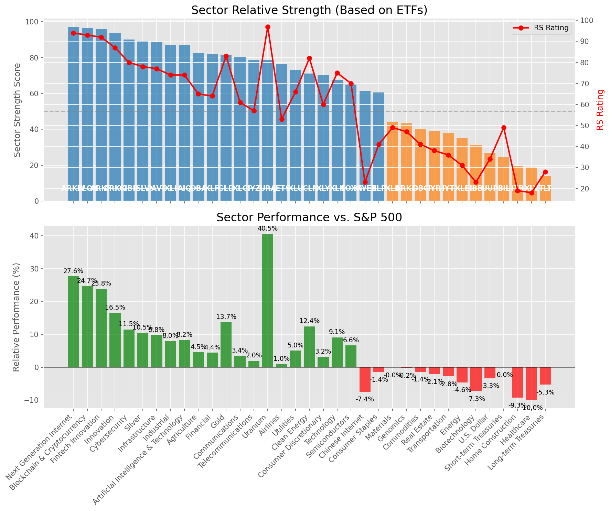

# **Daily Relative Strength Report**

**Date:** 2025-06-06

## **Market Valuation (Buffett Indicator)**

| Metric | Value |
|--------|-------|
| **Market Valuation** | **Fair Valued** |
| **Current Ratio** | 9.84 |
| **Historical Mean** | 9.35 |
| **Standard Deviation** | 0.45 |
| **Z-Score (StdDev from Mean)** | 0.85 |
| **Total Market Cap** | $295.12 trillion |
| **GDP** | $29.98 trillion |

## **Market Insights**

### **Market is Fairly Valued**

The market appears to be trading within a reasonable range of historical valuations. This suggests a balanced approach to equity investing is appropriate. Investors should:

- Focus on individual stock selection based on fundamentals and technicals
- Maintain normal equity allocations aligned with long-term goals
- Pay attention to sector rotation and relative strength
- Watch for changes in market leadership

Fair valuation typically suggests normal market returns can be expected, with stock selection becoming increasingly important.

### **Buffett Indicator Overview**

The Buffett Indicator (Total Market Cap / GDP) is a measure of the stock market's valuation relative to the size of the economy. It is named after Warren Buffett, who described it as "probably the best single measure of where valuations stand at any given moment."

- **Values above +2 standard deviations:** Market significantly overvalued
- **Values above +1 standard deviation:** Market overvalued
- **Values between -1 and +1 standard deviations:** Market fairly valued
- **Values below -1 standard deviation:** Market undervalued
- **Values below -2 standard deviations:** Market significantly undervalued

---

## **Sector Relative Strength**

Based on William O'Neil's Relative Strength Methodology

| ETF | Strength | RS Rating | Performance | Above Key MAs | Trend | Sector |
|-----|----------|-----------|-------------|--------------|-------|--------|
| [ARKW](https://www.tradingview.com/chart/?symbol=ARKW) | 97.0 | 94.0 | 27.63% | 10d ✓, 50d ✓, 200d ✓ | ↗️ | Next Generation Internet |
| [BLOK](https://www.tradingview.com/chart/?symbol=BLOK) | 96.5 | 93.0 | 24.68% | 10d ✓, 50d ✓, 200d ✓ | ↗️ | Blockchain & Cryptocurrency |
| [ARKF](https://www.tradingview.com/chart/?symbol=ARKF) | 96.0 | 92.0 | 23.78% | 10d ✓, 50d ✓, 200d ✓ | ↗️ | Fintech Innovation |
| [ARKK](https://www.tradingview.com/chart/?symbol=ARKK) | 93.5 | 87.0 | 16.55% | 10d ✓, 50d ✓, 200d ✓ | ↗️ | Innovation |
| [CIBR](https://www.tradingview.com/chart/?symbol=CIBR) | 90.0 | 80.0 | 11.45% | 10d ✓, 50d ✓, 200d ✓ | ↗️ | Cybersecurity |
| [SLV](https://www.tradingview.com/chart/?symbol=SLV) | 89.0 | 78.0 | 10.48% | 10d ✓, 50d ✓, 200d ✓ | ↗️ | Silver |
| [PAVE](https://www.tradingview.com/chart/?symbol=PAVE) | 88.5 | 77.0 | 9.76% | 10d ✓, 50d ✓, 200d ✓ | ↗️ | Infrastructure |
| [XLI](https://www.tradingview.com/chart/?symbol=XLI) | 87.0 | 74.0 | 7.96% | 10d ✓, 50d ✓, 200d ✓ | ↗️ | Industrial |
| [AIQ](https://www.tradingview.com/chart/?symbol=AIQ) | 87.0 | 74.0 | 8.24% | 10d ✓, 50d ✓, 200d ✓ | ↗️ | Artificial Intelligence & Technology |
| [DBA](https://www.tradingview.com/chart/?symbol=DBA) | 82.5 | 65.0 | 4.53% | 10d ✓, 50d ✓, 200d ✓ | ↗️ | Agriculture |
| [XLF](https://www.tradingview.com/chart/?symbol=XLF) | 82.0 | 64.0 | 4.40% | 10d ✓, 50d ✓, 200d ✓ | ↗️ | Financial |
| [GLD](https://www.tradingview.com/chart/?symbol=GLD) | 81.6 | 83.0 | 13.71% | 10d ✗, 50d ✓, 200d ✓ | ↗️ | Gold |
| [XLC](https://www.tradingview.com/chart/?symbol=XLC) | 80.5 | 61.0 | 3.41% | 10d ✓, 50d ✓, 200d ✓ | ↗️ | Communications |
| [IYZ](https://www.tradingview.com/chart/?symbol=IYZ) | 78.5 | 57.0 | 1.95% | 10d ✓, 50d ✓, 200d ✓ | ↗️ | Telecommunications |
| [URA](https://www.tradingview.com/chart/?symbol=URA) | 78.5 | 97.0 | 40.52% | 10d ✓, 50d ✓, 200d ✓ | ↘️ | Uranium |
| [JETS](https://www.tradingview.com/chart/?symbol=JETS) | 76.5 | 53.0 | 0.96% | 10d ✓, 50d ✓, 200d ✓ | ↗️ | Airlines |
| [XLU](https://www.tradingview.com/chart/?symbol=XLU) | 73.1 | 66.0 | 5.05% | 10d ✗, 50d ✓, 200d ✓ | ↗️ | Utilities |
| [ICLN](https://www.tradingview.com/chart/?symbol=ICLN) | 71.0 | 82.0 | 12.41% | 10d ✓, 50d ✓, 200d ✓ | ↘️ | Clean Energy |
| [XLY](https://www.tradingview.com/chart/?symbol=XLY) | 70.1 | 60.0 | 3.16% | 10d ✗, 50d ✓, 200d ✓ | ↗️ | Consumer Discretionary |
| [XLK](https://www.tradingview.com/chart/?symbol=XLK) | 67.5 | 75.0 | 9.07% | 10d ✓, 50d ✓, 200d ✓ | ↘️ | Technology |
| [SOXX](https://www.tradingview.com/chart/?symbol=SOXX) | 65.0 | 70.0 | 6.62% | 10d ✓, 50d ✓, 200d ✓ | ↘️ | Semiconductors |
| [KWEB](https://www.tradingview.com/chart/?symbol=KWEB) | 61.5 | 23.0 | -7.43% | 10d ✓, 50d ✓, 200d ✓ | ↗️ | Chinese Internet |
| [XLP](https://www.tradingview.com/chart/?symbol=XLP) | 60.6 | 41.0 | -1.41% | 10d ✗, 50d ✓, 200d ✓ | ↗️ | Consumer Staples |
| [XLB](https://www.tradingview.com/chart/?symbol=XLB) | 44.3 | 49.0 | -0.05% | 10d ✓, 50d ✓, 200d ✗ | ↘️ | Materials |
| [ARKG](https://www.tradingview.com/chart/?symbol=ARKG) | 43.3 | 47.0 | -0.21% | 10d ✓, 50d ✓, 200d ✗ | ↘️ | Genomics |
| [DBC](https://www.tradingview.com/chart/?symbol=DBC) | 40.3 | 41.0 | -1.37% | 10d ✓, 50d ✓, 200d ✗ | ↘️ | Commodities |
| [IYR](https://www.tradingview.com/chart/?symbol=IYR) | 38.8 | 38.0 | -2.07% | 10d ✓, 50d ✓, 200d ✗ | ↘️ | Real Estate |
| [IYT](https://www.tradingview.com/chart/?symbol=IYT) | 37.8 | 36.0 | -2.79% | 10d ✓, 50d ✓, 200d ✗ | ↘️ | Transportation |
| [XLE](https://www.tradingview.com/chart/?symbol=XLE) | 35.3 | 31.0 | -4.60% | 10d ✓, 50d ✓, 200d ✗ | ↘️ | Energy |
| [IBB](https://www.tradingview.com/chart/?symbol=IBB) | 31.3 | 23.0 | -7.29% | 10d ✓, 50d ✓, 200d ✗ | ↘️ | Biotechnology |
| [UUP](https://www.tradingview.com/chart/?symbol=UUP) | 26.9 | 34.0 | -3.35% | 10d ✓, 50d ✗, 200d ✗ | ↘️ | U.S. Dollar |
| [BIL](https://www.tradingview.com/chart/?symbol=BIL) | 24.5 | 49.0 | -0.01% | 10d ✗, 50d ✗, 200d ✗ | ↘️ | Short-term Treasuries |
| [ITB](https://www.tradingview.com/chart/?symbol=ITB) | 19.4 | 19.0 | -9.28% | 10d ✓, 50d ✗, 200d ✗ | ↘️ | Home Construction |
| [XLV](https://www.tradingview.com/chart/?symbol=XLV) | 18.9 | 18.0 | -9.98% | 10d ✓, 50d ✗, 200d ✗ | ↘️ | Healthcare |
| [TLT](https://www.tradingview.com/chart/?symbol=TLT) | 14.0 | 28.0 | -5.28% | 10d ✗, 50d ✗, 200d ✗ | ↘️ | Long-term Treasuries |

### **Sector ETF Performance Interpretation**

This table shows the relative strength metrics for different market sectors based on their representative ETFs:

- **ETF**: The ETF used to measure sector performance (click for chart)
- **Strength**: Overall sector strength score (0-100) combining multiple factors
- **RS Rating**: O'Neil RS rating of the sector ETF
- **Performance**: Performance of the sector ETF relative to SPY
- **Above Key MAs**: Whether the ETF is trading above its 10, 50, and 200-day moving averages
- **Trend**: Whether the sector is in an uptrend (↗️) or downtrend (↘️)

### **Current Sector Leadership**

The current market leadership is coming from the following sectors: **Next Generation Internet, Blockchain & Cryptocurrency, Fintech Innovation**.

The **Next Generation Internet** sector (represented by **ARKW**) is showing particularly strong relative strength with an RS rating of 94.0 and performance of 27.63% vs. the S&P 500. This sector is trading above its 10-day, 50-day, 200-day moving average(s). Investors should consider focusing on high RS stocks within these leading sectors for potential outperformance.

---

## **Buy Recommendations**

The following 90 stocks show exceptional relative strength:

| RS Rating | Buy Score | Current Price | Chart | Name | Ticker |
|-----------|-----------|---------------|-------|------|--------|
| 100 | 100 | $221.55 | [Chart](https://www.tradingview.com/chart/?symbol=DAVE) | Dave Inc. Class A Common Stock | DAVE |
| 100 | 100 | $74.88 | [Chart](https://www.tradingview.com/chart/?symbol=HOOD) | Robinhood Markets, Inc. Class A Common Stock | HOOD |
| 100 | 100 | $243.11 | [Chart](https://www.tradingview.com/chart/?symbol=AGX) | Argan, Inc | AGX |
| 100 | 100 | $97.91 | [Chart](https://www.tradingview.com/chart/?symbol=RBRK) | Rubrik, Inc. | RBRK |
| 100 | 100 | $132.09 | [Chart](https://www.tradingview.com/chart/?symbol=SEZL) | Sezzle Inc. Common Stock | SEZL |
| 100 | 100 | $143.11 | [Chart](https://www.tradingview.com/chart/?symbol=LEU) | Centrus Energy Corp. | LEU |
| 100 | 100 | $95.80 | [Chart](https://www.tradingview.com/chart/?symbol=RBLX) | Roblox Corporation | RBLX |
| 100 | 100 | $341.46 | [Chart](https://www.tradingview.com/chart/?symbol=CVNA) | Carvana Co. | CVNA |
| 99 | 100 | $40.47 | [Chart](https://www.tradingview.com/chart/?symbol=KTOS) | Kratos Defense & Security Solutions, Inc. | KTOS |
| 99 | 100 | $255.77 | [Chart](https://www.tradingview.com/chart/?symbol=GWRE) | GUIDEWIRE SOFTWARE, INC. | GWRE |
| 99 | 100 | $56.33 | [Chart](https://www.tradingview.com/chart/?symbol=HIMS) | Hims & Hers Health, Inc. | HIMS |
| 99 | 100 | $417.89 | [Chart](https://www.tradingview.com/chart/?symbol=APP) | Applovin Corporation Class A Common Stock | APP |
| 99 | 100 | $127.72 | [Chart](https://www.tradingview.com/chart/?symbol=PLTR) | Palantir Technologies Inc. Class A Common Stock | PLTR |
| 98 | 100 | $44.82 | [Chart](https://www.tradingview.com/chart/?symbol=REVG) | REV Group, Inc. | REVG |
| 98 | 100 | $45.96 | [Chart](https://www.tradingview.com/chart/?symbol=AU) | AngloGold Ashanti plc | AU |
| 98 | 100 | $42.42 | [Chart](https://www.tradingview.com/chart/?symbol=FARO) | Faro Technologies Inc | FARO |
| 98 | 100 | $258.54 | [Chart](https://www.tradingview.com/chart/?symbol=TLN) | Talen Energy Corporation Common Stock | TLN |
| 97 | 100 | $21.18 | [Chart](https://www.tradingview.com/chart/?symbol=MAG) | MAG Silver Corp. | MAG |
| 97 | 100 | $175.37 | [Chart](https://www.tradingview.com/chart/?symbol=HWM) | Howmet Aerospace Inc. | HWM |
| 97 | 100 | $120.73 | [Chart](https://www.tradingview.com/chart/?symbol=CLS) | Celestica, Inc. | CLS |
| 97 | 100 | $1241.47 | [Chart](https://www.tradingview.com/chart/?symbol=NFLX) | NetFlix Inc | NFLX |
| 97 | 100 | $24.11 | [Chart](https://www.tradingview.com/chart/?symbol=BTSG) | BrightSpring Health Services, Inc. Common Stock | BTSG |
| 97 | 100 | $19.89 | [Chart](https://www.tradingview.com/chart/?symbol=MIR) | Mirion Technologies, Inc. | MIR |
| 97 | 100 | $37.52 | [Chart](https://www.tradingview.com/chart/?symbol=AS) | Amer Sports, Inc. | AS |
| 96 | 100 | $35.36 | [Chart](https://www.tradingview.com/chart/?symbol=UTI) | Universal Technical Institute, Inc. | UTI |
| 96 | 100 | $23.93 | [Chart](https://www.tradingview.com/chart/?symbol=TFPM) | Triple Flag Precious Metals Corp. | TFPM |
| 95 | 100 | $48.36 | [Chart](https://www.tradingview.com/chart/?symbol=SIL) | Global X Silver Miners ETF (NEW) | SIL |
| 95 | 100 | $69.00 | [Chart](https://www.tradingview.com/chart/?symbol=GDXJ) | VanEck Junior Gold Miners ETF | GDXJ |
| 95 | 100 | $255.63 | [Chart](https://www.tradingview.com/chart/?symbol=GE) | GE Aerospace | GE |
| 95 | 100 | $30.21 | [Chart](https://www.tradingview.com/chart/?symbol=NTGR) | NETGEAR, Inc. | NTGR |
| 95 | 100 | $712.26 | [Chart](https://www.tradingview.com/chart/?symbol=SPOT) | Spotify Technology S.A. | SPOT |
| 94 | 100 | $44.01 | [Chart](https://www.tradingview.com/chart/?symbol=TOST) | Toast, Inc. | TOST |
| 94 | 100 | $54.28 | [Chart](https://www.tradingview.com/chart/?symbol=AKRO) | Akero Therapeutics, Inc. Common Stock | AKRO |
| 94 | 100 | $27.46 | [Chart](https://www.tradingview.com/chart/?symbol=UVE) | UNIVERSAL INSURANCE HLDG, INC. | UVE |
| 94 | 100 | $58.20 | [Chart](https://www.tradingview.com/chart/?symbol=SHLD) | Global X Defense Tech ETF | SHLD |
| 93 | 100 | $51.62 | [Chart](https://www.tradingview.com/chart/?symbol=GDX) | VanEck Gold Miners ETF | GDX |
| 93 | 100 | $88.70 | [Chart](https://www.tradingview.com/chart/?symbol=WPM) | Wheaton Precious Metals Corp. Common Stock | WPM |
| 92 | 100 | $169.17 | [Chart](https://www.tradingview.com/chart/?symbol=SFM) | Sprouts Farmers Market, Inc. | SFM |
| 92 | 100 | $35.48 | [Chart](https://www.tradingview.com/chart/?symbol=AHR) | American Healthcare REIT, Inc. | AHR |
| 92 | 100 | $18.14 | [Chart](https://www.tradingview.com/chart/?symbol=LQDA) | Liquidia Corporation Common Stock | LQDA |
| 92 | 100 | $44.45 | [Chart](https://www.tradingview.com/chart/?symbol=ARKF) | ARK Fintech Innovation ETF | ARKF |
| 92 | 100 | $131.28 | [Chart](https://www.tradingview.com/chart/?symbol=COOP) | Mr. Cooper Group Inc. Common Stock | COOP |
| 91 | 100 | $181.96 | [Chart](https://www.tradingview.com/chart/?symbol=ITA) | iShares U.S. Aerospace & Defense ETF | ITA |
| 91 | 100 | $154.71 | [Chart](https://www.tradingview.com/chart/?symbol=CAH) | Cardinal Health, Inc. | CAH |
| 91 | 100 | $171.65 | [Chart](https://www.tradingview.com/chart/?symbol=EAT) | Brinker International, Inc. | EAT |
| 91 | 100 | $48.06 | [Chart](https://www.tradingview.com/chart/?symbol=GH) | Guardant Health, Inc. Common Stock | GH |
| 91 | 100 | $188.57 | [Chart](https://www.tradingview.com/chart/?symbol=CVLT) | Commault Systems, Inc. | CVLT |
| 90 | 100 | $403.76 | [Chart](https://www.tradingview.com/chart/?symbol=CYBR) | CyberArk Software Ltd. | CYBR |
| 90 | 100 | $47.85 | [Chart](https://www.tradingview.com/chart/?symbol=BBW) | Build-A-Bear Workshop, Inc. | BBW |
| 90 | 100 | $5614.61 | [Chart](https://www.tradingview.com/chart/?symbol=BKNG) | Booking Holdings Inc. Common Stock | BKNG |
| 90 | 100 | $181.73 | [Chart](https://www.tradingview.com/chart/?symbol=PM) | Philip Morris International Inc. | PM |
| 89 | 100 | $74.22 | [Chart](https://www.tradingview.com/chart/?symbol=WRB) | W.R. Berkley Corporation | WRB |
| 89 | 100 | $217.55 | [Chart](https://www.tradingview.com/chart/?symbol=BAP) | Credicorp LTD | BAP |
| 89 | 100 | $24.10 | [Chart](https://www.tradingview.com/chart/?symbol=SRAD) | Sportradar Group AG Class A Ordinary Shares | SRAD |
| 89 | 100 | $285.02 | [Chart](https://www.tradingview.com/chart/?symbol=VRSN) | VeriSign Inc | VRSN |
| 89 | 100 | $56.75 | [Chart](https://www.tradingview.com/chart/?symbol=TXNM) | TXNM Energy, Inc. | TXNM |
| 88 | 100 | $57.81 | [Chart](https://www.tradingview.com/chart/?symbol=CAKE) | Cheesecake Factory (The) | CAKE |
| 87 | 100 | $106.93 | [Chart](https://www.tradingview.com/chart/?symbol=AXS) | Axis Capital Holders Limited | AXS |
| 89 | 99 | $57.53 | [Chart](https://www.tradingview.com/chart/?symbol=BAM) | Brookfield Asset Management Ltd. | BAM |
| 87 | 99 | $47.79 | [Chart](https://www.tradingview.com/chart/?symbol=BTI) | British American Tobacco p.l.c. American Depositary Shares, American Depositary Shares, each representing one Ordinary Share | BTI |
| 87 | 99 | $28.13 | [Chart](https://www.tradingview.com/chart/?symbol=DB) | Deutsche Bank Aktiengesellschaft | DB |
| 88 | 98 | $65.29 | [Chart](https://www.tradingview.com/chart/?symbol=SLF) | Sun Life Financial Inc. | SLF |
| 86 | 98 | $77.65 | [Chart](https://www.tradingview.com/chart/?symbol=LLYVK) | Liberty Media Corporation Series C Liberty Live Common Stock | LLYVK |
| 87 | 97 | $163.76 | [Chart](https://www.tradingview.com/chart/?symbol=NTRA) | Natera, Inc. Common Stock | NTRA |
| 86 | 97 | $285.36 | [Chart](https://www.tradingview.com/chart/?symbol=VEEV) | Veeva Systems Inc. | VEEV |
| 84 | 97 | $18.21 | [Chart](https://www.tradingview.com/chart/?symbol=BCS) | Barclays PLC | BCS |
| 84 | 97 | $232.72 | [Chart](https://www.tradingview.com/chart/?symbol=TTWO) | Take-Two Interactive Software Inc | TTWO |
| 86 | 96 | $119.37 | [Chart](https://www.tradingview.com/chart/?symbol=OLLI) | Ollie's Bargain Outlet Holdings, Inc. Common Stock | OLLI |
| 85 | 96 | $43.64 | [Chart](https://www.tradingview.com/chart/?symbol=EWP) | iShares MSCI Spain ETF | EWP |
| 85 | 95 | $85.61 | [Chart](https://www.tradingview.com/chart/?symbol=NDAQ) | Nasdaq, Inc. Common Stock | NDAQ |
| 83 | 95 | $93.31 | [Chart](https://www.tradingview.com/chart/?symbol=CCEP) | Coca-Cola Europacific Partners plc Ordinary Shares | CCEP |
| 84 | 94 | $198.14 | [Chart](https://www.tradingview.com/chart/?symbol=COF) | Capital One Financial | COF |
| 83 | 94 | $151.73 | [Chart](https://www.tradingview.com/chart/?symbol=ROOT) | Root, Inc. Class A Common Stock | ROOT |
| 83 | 94 | $47.98 | [Chart](https://www.tradingview.com/chart/?symbol=EWI) | iShares MSCI Italy ETF | EWI |
| 82 | 94 | $144.15 | [Chart](https://www.tradingview.com/chart/?symbol=LYV) | Live Nation Entertainment Inc. | LYV |
| 81 | 94 | $29.94 | [Chart](https://www.tradingview.com/chart/?symbol=CEF) | Sprott Physical Gold and Silver Trust | CEF |
| 84 | 93 | $87.16 | [Chart](https://www.tradingview.com/chart/?symbol=SANM) | Sanmina  Corp | SANM |
| 82 | 93 | $59.61 | [Chart](https://www.tradingview.com/chart/?symbol=IGF) | iShares Global Infrastructure ETF | IGF |
| 80 | 93 | $60.56 | [Chart](https://www.tradingview.com/chart/?symbol=WMB) | Williams Companies Inc. | WMB |
| 80 | 93 | $43.03 | [Chart](https://www.tradingview.com/chart/?symbol=EXEL) | Exelixis Inc | EXEL |
| 80 | 93 | $82.53 | [Chart](https://www.tradingview.com/chart/?symbol=NFG) | National Fuel Gas Co. | NFG |
| 82 | 92 | $85.64 | [Chart](https://www.tradingview.com/chart/?symbol=SEIC) | SEI Investments Co | SEIC |
| 82 | 92 | $98.13 | [Chart](https://www.tradingview.com/chart/?symbol=CALM) | Cal-Maine Foods Inc | CALM |
| 80 | 92 | $73.48 | [Chart](https://www.tradingview.com/chart/?symbol=CIBR) | First Trust Exchange-Traded Fund II First Trust NASDAQ Cybersecurity ETF | CIBR |
| 80 | 92 | $78.61 | [Chart](https://www.tradingview.com/chart/?symbol=EBAY) | eBay Inc | EBAY |
| 80 | 92 | $63.15 | [Chart](https://www.tradingview.com/chart/?symbol=CHEF) | The Chef's Warehouse Inc | CHEF |
| 81 | 91 | $79.37 | [Chart](https://www.tradingview.com/chart/?symbol=BBCA) | JPMorgan BetaBuilders Canada ETF | BBCA |
| 81 | 90 | $60.60 | [Chart](https://www.tradingview.com/chart/?symbol=UVV) | Universal Corporation | UVV |
| 80 | 90 | $111.41 | [Chart](https://www.tradingview.com/chart/?symbol=SHOP) | Shopify Inc. Class A subordinate voting shares | SHOP |
| 80 | 90 | $29.47 | [Chart](https://www.tradingview.com/chart/?symbol=DBX) | Dropbox, Inc. Class A | DBX |

---

## **Sell Recommendations**

The following 170 stocks show deteriorating relative strength:

| RS Rating | Sell Score | Current Price | Chart | Name | Ticker |
|-----------|------------|---------------|-------|------|--------|
| 1 | 100 | $10.05 | [Chart](https://www.tradingview.com/chart/?symbol=WNC) | Wabash National Corp. | WNC |
| 1 | 100 | $43.01 | [Chart](https://www.tradingview.com/chart/?symbol=SRPT) | Sarepta Therapeutics,, Inc. Common Stock | SRPT |
| 1 | 100 | $17.08 | [Chart](https://www.tradingview.com/chart/?symbol=NVDS) | Investment Managers Series Trust II Tradr 1.5X Short NVDA Daily ETF | NVDS |
| 1 | 100 | $32.37 | [Chart](https://www.tradingview.com/chart/?symbol=TECS) | Direxion Daily Technology Bear 3x Shares | TECS |
| 1 | 100 | $13.56 | [Chart](https://www.tradingview.com/chart/?symbol=IART) | Integra LifeSciences Holdings | IART |
| 1 | 100 | $12.71 | [Chart](https://www.tradingview.com/chart/?symbol=VFC) | V.F. Corporation | VFC |
| 2 | 100 | $22.34 | [Chart](https://www.tradingview.com/chart/?symbol=THS) | Treehouse Foods, Inc. | THS |
| 3 | 100 | $10.04 | [Chart](https://www.tradingview.com/chart/?symbol=SONO) | Sonos, Inc. Common Stock | SONO |
| 3 | 100 | $10.22 | [Chart](https://www.tradingview.com/chart/?symbol=PRTA) | Prothena Corporation plc Ordinary Shares | PRTA |
| 3 | 100 | $10.31 | [Chart](https://www.tradingview.com/chart/?symbol=VREX) | Varex Imaging Corporation Common Stock | VREX |
| 3 | 100 | $52.31 | [Chart](https://www.tradingview.com/chart/?symbol=CCS) | CENTURY COMMUNITIES, INC. | CCS |
| 3 | 100 | $26.10 | [Chart](https://www.tradingview.com/chart/?symbol=CRTO) | Criteo S.A. | CRTO |
| 3 | 100 | $100.87 | [Chart](https://www.tradingview.com/chart/?symbol=GLOB) | GLOBANT S.A. | GLOB |
| 3 | 100 | $20.36 | [Chart](https://www.tradingview.com/chart/?symbol=HI) | Hillenbrand, Inc. | HI |
| 3 | 100 | $10.25 | [Chart](https://www.tradingview.com/chart/?symbol=CWK) | Cushman & Wakefield plc Ordinary Shares | CWK |
| 3 | 100 | $10.44 | [Chart](https://www.tradingview.com/chart/?symbol=PACS) | PACS Group, Inc. | PACS |
| 3 | 100 | $44.79 | [Chart](https://www.tradingview.com/chart/?symbol=LINE) | Lineage, Inc. Common Stock | LINE |
| 4 | 100 | $136.02 | [Chart](https://www.tradingview.com/chart/?symbol=INSP) | Inspire Medical Systems, Inc. | INSP |
| 4 | 100 | $53.26 | [Chart](https://www.tradingview.com/chart/?symbol=ASGN) | ASGN Incorporated | ASGN |
| 4 | 100 | $136.94 | [Chart](https://www.tradingview.com/chart/?symbol=KRYS) | Krystal Biotech, Inc. Common Stock | KRYS |
| 4 | 100 | $20.92 | [Chart](https://www.tradingview.com/chart/?symbol=AMRK) | A-Mark Precious Metals, Inc. | AMRK |
| 4 | 100 | $11.18 | [Chart](https://www.tradingview.com/chart/?symbol=CLB) | Core Laboratories Inc. | CLB |
| 4 | 100 | $32.30 | [Chart](https://www.tradingview.com/chart/?symbol=CYTK) | Cytokinetics Inc. | CYTK |
| 4 | 100 | $14.37 | [Chart](https://www.tradingview.com/chart/?symbol=DQ) | Daqo New Energy Corp. American Depositary Shares (each representing 5 Ordinary Shares) | DQ |
| 5 | 100 | $26.37 | [Chart](https://www.tradingview.com/chart/?symbol=WMG) | Warner Music Group Corp. Class A Common Stock | WMG |
| 5 | 100 | $68.33 | [Chart](https://www.tradingview.com/chart/?symbol=WD) | Walker & Dunlop, Inc. | WD |
| 5 | 100 | $13.57 | [Chart](https://www.tradingview.com/chart/?symbol=CAL) | Caleres Inc | CAL |
| 5 | 100 | $76.87 | [Chart](https://www.tradingview.com/chart/?symbol=GPN) | Global Payments, Inc. | GPN |
| 5 | 100 | $31.56 | [Chart](https://www.tradingview.com/chart/?symbol=MBIN) | Merchants Bancorp Common Stock | MBIN |
| 6 | 100 | $56.65 | [Chart](https://www.tradingview.com/chart/?symbol=BMRN) | BioMarin Pharmaceuticals Inc | BMRN |
| 6 | 100 | $71.45 | [Chart](https://www.tradingview.com/chart/?symbol=FND) | Floor & Decor Holdings, Inc. | FND |
| 6 | 100 | $27.68 | [Chart](https://www.tradingview.com/chart/?symbol=QID) | ProShares UltraShort QQQ | QID |
| 6 | 100 | $18.85 | [Chart](https://www.tradingview.com/chart/?symbol=DNTH) | Dianthus Therapeutics, Inc. Common Stock | DNTH |
| 6 | 100 | $10.40 | [Chart](https://www.tradingview.com/chart/?symbol=MBC) | MasterBrand, Inc. | MBC |
| 6 | 100 | $17.38 | [Chart](https://www.tradingview.com/chart/?symbol=AMTB) | Amerant Bancorp Inc. | AMTB |
| 7 | 100 | $23.72 | [Chart](https://www.tradingview.com/chart/?symbol=RPD) | Rapid7, Inc. Common Stock | RPD |
| 7 | 100 | $17.33 | [Chart](https://www.tradingview.com/chart/?symbol=EGBN) | Eagle Bancorp Inc | EGBN |
| 7 | 100 | $297.08 | [Chart](https://www.tradingview.com/chart/?symbol=POOL) | Pool Corporation | POOL |
| 7 | 100 | $51.19 | [Chart](https://www.tradingview.com/chart/?symbol=FBIN) | Fortune Brands Innovations, Inc. | FBIN |
| 7 | 100 | $34.67 | [Chart](https://www.tradingview.com/chart/?symbol=ANDE) | Andersons Inc/The | ANDE |
| 7 | 100 | $20.33 | [Chart](https://www.tradingview.com/chart/?symbol=BITI) | ProShares Short Bitcoin ETF | BITI |
| 7 | 100 | $98.25 | [Chart](https://www.tradingview.com/chart/?symbol=UPS) | United Parcel Service, Inc. Class B | UPS |
| 7 | 100 | $51.62 | [Chart](https://www.tradingview.com/chart/?symbol=KBH) | KB Home | KBH |
| 7 | 100 | $53.82 | [Chart](https://www.tradingview.com/chart/?symbol=SLVM) | Sylvamo Corporation | SLVM |
| 7 | 100 | $44.38 | [Chart](https://www.tradingview.com/chart/?symbol=RHI) | Robert Half Inc. | RHI |
| 8 | 100 | $64.00 | [Chart](https://www.tradingview.com/chart/?symbol=MTH) | Meritage Homes Corporation | MTH |
| 8 | 100 | $10.16 | [Chart](https://www.tradingview.com/chart/?symbol=AEO) | American Eagle Outfitters | AEO |
| 8 | 100 | $23.06 | [Chart](https://www.tradingview.com/chart/?symbol=IPG) | The Interpublic Group of Companies, Inc. | IPG |
| 8 | 100 | $39.31 | [Chart](https://www.tradingview.com/chart/?symbol=APOG) | Apogee Enterprises Inc | APOG |
| 8 | 100 | $20.52 | [Chart](https://www.tradingview.com/chart/?symbol=HAL) | Halliburton Company | HAL |
| 8 | 100 | $33.87 | [Chart](https://www.tradingview.com/chart/?symbol=SLB) | Schlumberger Limited | SLB |
| 8 | 100 | $15.36 | [Chart](https://www.tradingview.com/chart/?symbol=SAFE) | Safehold Inc. | SAFE |
| 9 | 100 | $26.85 | [Chart](https://www.tradingview.com/chart/?symbol=WERN) | Werner Enterprises Inc | WERN |
| 10 | 100 | $10.64 | [Chart](https://www.tradingview.com/chart/?symbol=SD) | SandRidge Energy, Inc. | SD |
| 10 | 100 | $219.42 | [Chart](https://www.tradingview.com/chart/?symbol=BIO) | Bio-Rad Laboratories, Inc.Class A | BIO |
| 11 | 100 | $33.54 | [Chart](https://www.tradingview.com/chart/?symbol=NSA) | National Storage Affiliates Trust | NSA |
| 11 | 100 | $85.93 | [Chart](https://www.tradingview.com/chart/?symbol=KSPI) | Joint Stock Company Kaspi.kz American Depository Shares | KSPI |
| 11 | 100 | $54.77 | [Chart](https://www.tradingview.com/chart/?symbol=GIS) | General Mills, Inc. | GIS |
| 12 | 100 | $86.80 | [Chart](https://www.tradingview.com/chart/?symbol=BCC) | Boise Cascade Company | BCC |
| 12 | 100 | $33.69 | [Chart](https://www.tradingview.com/chart/?symbol=HUBG) | HUB Group Inc | HUBG |
| 12 | 100 | $133.82 | [Chart](https://www.tradingview.com/chart/?symbol=NSIT) | Insight Enterprises Inc | NSIT |
| 12 | 100 | $25.26 | [Chart](https://www.tradingview.com/chart/?symbol=ASTH) | Astrana Health Inc. Common Stock | ASTH |
| 13 | 100 | $10.35 | [Chart](https://www.tradingview.com/chart/?symbol=SCS) | Steelcase, Inc. | SCS |
| 15 | 100 | $12.70 | [Chart](https://www.tradingview.com/chart/?symbol=MED) | Medifast, Inc. | MED |
| 16 | 100 | $11.91 | [Chart](https://www.tradingview.com/chart/?symbol=KELYA) | Kelly Services Inc | KELYA |
| 4 | 99 | $14.16 | [Chart](https://www.tradingview.com/chart/?symbol=INMD) | InMode Ltd. Ordinary Shares | INMD |
| 8 | 99 | $22.39 | [Chart](https://www.tradingview.com/chart/?symbol=CAG) | Conagra Brands, Inc. | CAG |
| 9 | 99 | $30.26 | [Chart](https://www.tradingview.com/chart/?symbol=BAX) | Baxter International Inc. | BAX |
| 9 | 99 | $111.63 | [Chart](https://www.tradingview.com/chart/?symbol=BLDR) | Builders FirstSource, Inc. | BLDR |
| 12 | 99 | $203.92 | [Chart](https://www.tradingview.com/chart/?symbol=AAPL) | Apple Inc. | AAPL |
| 13 | 99 | $14.45 | [Chart](https://www.tradingview.com/chart/?symbol=HR) | Healthcare Realty Trust Incorporated | HR |
| 14 | 99 | $161.75 | [Chart](https://www.tradingview.com/chart/?symbol=HSY) | The Hershey Company | HSY |
| 15 | 99 | $10.00 | [Chart](https://www.tradingview.com/chart/?symbol=LBTYK) | Liberty Global Ltd. Class C Common Shares | LBTYK |
| 15 | 99 | $107.05 | [Chart](https://www.tradingview.com/chart/?symbol=MHO) | M/I Homes, Inc. | MHO |
| 3 | 98 | $29.53 | [Chart](https://www.tradingview.com/chart/?symbol=QDEL) | QuidelOrtho Corporation Common Stock | QDEL |
| 5 | 98 | $32.76 | [Chart](https://www.tradingview.com/chart/?symbol=SQM) | Sociedad Quimica y Minera de Chile SA | SQM |
| 8 | 98 | $128.30 | [Chart](https://www.tradingview.com/chart/?symbol=RGEN) | Repligen Corp | RGEN |
| 9 | 98 | $11.10 | [Chart](https://www.tradingview.com/chart/?symbol=FBRT) | Franklin BSP Realty Trust, Inc. | FBRT |
| 10 | 98 | $17.26 | [Chart](https://www.tradingview.com/chart/?symbol=DOC) | Healthpeak Properties, Inc. | DOC |
| 10 | 98 | $21.41 | [Chart](https://www.tradingview.com/chart/?symbol=GNTX) | Gentex Corp | GNTX |
| 12 | 98 | $46.61 | [Chart](https://www.tradingview.com/chart/?symbol=ABM) | ABM Industries, Inc. | ABM |
| 23 | 98 | $19.58 | [Chart](https://www.tradingview.com/chart/?symbol=HVT) | Haverty Furniture Companies, Inc. | HVT |
| 9 | 97 | $38.26 | [Chart](https://www.tradingview.com/chart/?symbol=WLY) | John Wiley & Sons, Inc. Class A | WLY |
| 12 | 97 | $65.71 | [Chart](https://www.tradingview.com/chart/?symbol=KMX) | CarMax Inc. | KMX |
| 12 | 97 | $92.38 | [Chart](https://www.tradingview.com/chart/?symbol=ZBH) | Zimmer Biomet Holdings, Inc. | ZBH |
| 13 | 97 | $108.53 | [Chart](https://www.tradingview.com/chart/?symbol=LEN) | Lennar Corporation Class A | LEN |
| 16 | 97 | $45.49 | [Chart](https://www.tradingview.com/chart/?symbol=TWM) | ProShares UltraShort Russell2000 | TWM |
| 18 | 97 | $15.06 | [Chart](https://www.tradingview.com/chart/?symbol=VRE) | Veris Residential, Inc. | VRE |
| 10 | 96 | $127.69 | [Chart](https://www.tradingview.com/chart/?symbol=CLX) | Clorox Company | CLX |
| 10 | 96 | $63.19 | [Chart](https://www.tradingview.com/chart/?symbol=MAS) | Masco Corporation | MAS |
| 11 | 96 | $25.40 | [Chart](https://www.tradingview.com/chart/?symbol=HASI) | HA Sustainable Infrastructure Capital, Inc. | HASI |
| 12 | 96 | $26.21 | [Chart](https://www.tradingview.com/chart/?symbol=JANX) | Janux Therapeutics, Inc. Common Stock | JANX |
| 9 | 95 | $38.65 | [Chart](https://www.tradingview.com/chart/?symbol=PCH) | PotlatchDeltic Corporation Common Stock | PCH |
| 9 | 95 | $17.25 | [Chart](https://www.tradingview.com/chart/?symbol=CODI) | Compass Diversified | CODI |
| 10 | 95 | $100.60 | [Chart](https://www.tradingview.com/chart/?symbol=PDD) | PDD Holdings Inc. American Depositary Shares | PDD |
| 13 | 95 | $12.31 | [Chart](https://www.tradingview.com/chart/?symbol=WSR) | Whitestone REIT | WSR |
| 14 | 95 | $32.94 | [Chart](https://www.tradingview.com/chart/?symbol=WGO) | Winnebago Industries, Inc. | WGO |
| 18 | 95 | $19.53 | [Chart](https://www.tradingview.com/chart/?symbol=FOR) | Forestar Group Inc. | FOR |
| 6 | 94 | $12.70 | [Chart](https://www.tradingview.com/chart/?symbol=TZA) | Direxion Daily Small Cap Bear 3x Shares | TZA |
| 11 | 94 | $22.51 | [Chart](https://www.tradingview.com/chart/?symbol=GIII) | G-Iii Apparel Group Ltd | GIII |
| 13 | 94 | $42.85 | [Chart](https://www.tradingview.com/chart/?symbol=PRKS) | United Parks & Resorts Inc. | PRKS |
| 15 | 94 | $122.80 | [Chart](https://www.tradingview.com/chart/?symbol=TFX) | Teleflex Incorporated | TFX |
| 10 | 93 | $12.43 | [Chart](https://www.tradingview.com/chart/?symbol=PMT) | PennyMac Mortgage Investment Trust | PMT |
| 13 | 93 | $445.44 | [Chart](https://www.tradingview.com/chart/?symbol=WSO) | Watsco, Inc. | WSO |
| 13 | 92 | $101.52 | [Chart](https://www.tradingview.com/chart/?symbol=MHK) | Mohawk Industries, Inc. | MHK |
| 16 | 92 | $75.06 | [Chart](https://www.tradingview.com/chart/?symbol=CBT) | Cabot Corporation | CBT |
| 17 | 92 | $37.22 | [Chart](https://www.tradingview.com/chart/?symbol=LIT) | Global X Lithium & Battery Tech ETF | LIT |
| 14 | 91 | $19.55 | [Chart](https://www.tradingview.com/chart/?symbol=AKR) | Acadia Realty Trust | AKR |
| 14 | 91 | $49.43 | [Chart](https://www.tradingview.com/chart/?symbol=ERX) | Direxion Daily Energy Bull 2X Shares | ERX |
| 15 | 91 | $21.19 | [Chart](https://www.tradingview.com/chart/?symbol=KIDS) | OrthoPediatrics Corp. Common Stock | KIDS |
| 14 | 90 | $10.23 | [Chart](https://www.tradingview.com/chart/?symbol=HOPE) | Hope Bancorp, Inc. | HOPE |
| 15 | 90 | $77.03 | [Chart](https://www.tradingview.com/chart/?symbol=AKAM) | Akamai Technologies Inc | AKAM |
| 20 | 90 | $10.77 | [Chart](https://www.tradingview.com/chart/?symbol=NMFC) | NEW MOUNTAIN FINANCE CORPORATION | NMFC |
| 16 | 89 | $96.58 | [Chart](https://www.tradingview.com/chart/?symbol=UFPI) | UFP Industries, Inc. Common Stock | UFPI |
| 20 | 89 | $45.68 | [Chart](https://www.tradingview.com/chart/?symbol=SDOW) | ProShares UltraPro Short Dow 30 | SDOW |
| 17 | 88 | $12.10 | [Chart](https://www.tradingview.com/chart/?symbol=FFIC) | Flushing Financial Corp | FFIC |
| 25 | 88 | $21.13 | [Chart](https://www.tradingview.com/chart/?symbol=GPCR) | Structure Therapeutics Inc. American Depositary Shares | GPCR |
| 32 | 88 | $47.42 | [Chart](https://www.tradingview.com/chart/?symbol=ADM) | Archer Daniels Midland Company | ADM |
| 17 | 87 | $140.21 | [Chart](https://www.tradingview.com/chart/?symbol=CVX) | Chevron Corporation | CVX |
| 19 | 87 | $77.41 | [Chart](https://www.tradingview.com/chart/?symbol=EXPO) | Exponent Inc | EXPO |
| 21 | 87 | $30.02 | [Chart](https://www.tradingview.com/chart/?symbol=TPH) | Tri Pointe Homes, Inc. | TPH |
| 23 | 87 | $13.67 | [Chart](https://www.tradingview.com/chart/?symbol=BSM) | Black Stone Minerals, L.P. | BSM |
| 29 | 87 | $77.15 | [Chart](https://www.tradingview.com/chart/?symbol=OTTR) | Otter Tail Corp | OTTR |
| 17 | 86 | $50.94 | [Chart](https://www.tradingview.com/chart/?symbol=TSCO) | Tractor Supply Co | TSCO |
| 18 | 86 | $76.97 | [Chart](https://www.tradingview.com/chart/?symbol=PFG) | Principal Financial Group, Inc. | PFG |
| 21 | 86 | $76.33 | [Chart](https://www.tradingview.com/chart/?symbol=CNS) | Cohen & Steers Inc. | CNS |
| 19 | 85 | $37.78 | [Chart](https://www.tradingview.com/chart/?symbol=WPP) | WPP PLC | WPP |
| 26 | 85 | $83.90 | [Chart](https://www.tradingview.com/chart/?symbol=BCO) | The Brink's Company | BCO |
| 19 | 84 | $62.24 | [Chart](https://www.tradingview.com/chart/?symbol=ELS) | Equity Lifestyle Properties, Inc. | ELS |
| 23 | 84 | $57.19 | [Chart](https://www.tradingview.com/chart/?symbol=TMHC) | Taylor Morrison Home Corporation Common Stock | TMHC |
| 24 | 84 | $20.90 | [Chart](https://www.tradingview.com/chart/?symbol=DJT) | Trump Media & Technology Group Corp. Common Stock | DJT |
| 24 | 84 | $100.23 | [Chart](https://www.tradingview.com/chart/?symbol=PHM) | Pultegroup, Inc. | PHM |
| 26 | 84 | $133.07 | [Chart](https://www.tradingview.com/chart/?symbol=ICUI) | ICU Medical Inc | ICUI |
| 24 | 83 | $165.07 | [Chart](https://www.tradingview.com/chart/?symbol=IBP) | INSTALLED BUILDING PRODUCTS, INC. | IBP |
| 18 | 82 | $39.09 | [Chart](https://www.tradingview.com/chart/?symbol=LKQ) | LKQ Corporation | LKQ |
| 19 | 82 | $85.81 | [Chart](https://www.tradingview.com/chart/?symbol=BIDU) | Baidu, Inc. | BIDU |
| 21 | 82 | $16.74 | [Chart](https://www.tradingview.com/chart/?symbol=UMH) | UMH Properties, Inc. | UMH |
| 22 | 82 | $10.35 | [Chart](https://www.tradingview.com/chart/?symbol=PFLT) | PennantPark Floating Rate Capital Ltd. | PFLT |
| 22 | 82 | $450.50 | [Chart](https://www.tradingview.com/chart/?symbol=VRTX) | Vertex Pharmaceuticals Inc | VRTX |
| 24 | 82 | $90.24 | [Chart](https://www.tradingview.com/chart/?symbol=CL) | Colgate-Palmolive Company | CL |
| 24 | 82 | $10.40 | [Chart](https://www.tradingview.com/chart/?symbol=MYI) | BLACKROCK MUNIYIELD QUALITY FUND III, INC. | MYI |
| 26 | 82 | $10.30 | [Chart](https://www.tradingview.com/chart/?symbol=MUC) | BLACKROCK MUNIHOLDINGS CALIFORNIA QUALITY FUND, INC | MUC |
| 25 | 81 | $11.82 | [Chart](https://www.tradingview.com/chart/?symbol=NVG) | Nuveen AMT-Free Municipal Credit Income Fund | NVG |
| 31 | 81 | $30.75 | [Chart](https://www.tradingview.com/chart/?symbol=DAR) | DARLING INGREDIENTS INC. | DAR |
| 33 | 81 | $87.22 | [Chart](https://www.tradingview.com/chart/?symbol=COP) | ConocoPhillips | COP |
| 24 | 80 | $164.02 | [Chart](https://www.tradingview.com/chart/?symbol=PG) | Procter & Gamble Company | PG |
| 27 | 79 | $41.80 | [Chart](https://www.tradingview.com/chart/?symbol=NBTB) | NBT Bancorp Inc | NBTB |
| 27 | 79 | $10.88 | [Chart](https://www.tradingview.com/chart/?symbol=LBTYA) | Liberty Global Ltd. Class A Common Shares | LBTYA |
| 26 | 78 | $26.18 | [Chart](https://www.tradingview.com/chart/?symbol=ETD) | Ethan Allen Interiors Inc | ETD |
| 28 | 78 | $110.88 | [Chart](https://www.tradingview.com/chart/?symbol=SJM) | The J.M. Smucker Company | SJM |
| 31 | 78 | $104.27 | [Chart](https://www.tradingview.com/chart/?symbol=XOM) | Exxon Mobil Corporation | XOM |
| 24 | 77 | $203.15 | [Chart](https://www.tradingview.com/chart/?symbol=AVB) | AvalonBay Communities, Inc. | AVB |
| 30 | 77 | $45.62 | [Chart](https://www.tradingview.com/chart/?symbol=CWT) | California Water Service | CWT |
| 33 | 77 | $10.14 | [Chart](https://www.tradingview.com/chart/?symbol=URGN) | UroGen Pharma Ltd. Ordinary Shares | URGN |
| 24 | 76 | $13.82 | [Chart](https://www.tradingview.com/chart/?symbol=DOLE) | Dole plc | DOLE |
| 33 | 76 | $76.67 | [Chart](https://www.tradingview.com/chart/?symbol=AWR) | American States Water Company | AWR |
| 30 | 75 | $24.47 | [Chart](https://www.tradingview.com/chart/?symbol=HYMB) | SPDR Nuveen ICE High Yield Municipal Bond ETF | HYMB |
| 30 | 75 | $15.70 | [Chart](https://www.tradingview.com/chart/?symbol=BBN) | BlackRock Taxable Municipal Bond Trust | BBN |
| 35 | 75 | $48.65 | [Chart](https://www.tradingview.com/chart/?symbol=IGLB) | iShares 10+ Year Investment Grade Corporate Bond ETF | IGLB |
| 32 | 74 | $67.34 | [Chart](https://www.tradingview.com/chart/?symbol=BLV) | Vanguard Long-Term Bond ETF | BLV |
| 32 | 74 | $56.00 | [Chart](https://www.tradingview.com/chart/?symbol=O) | Realty Income Corporation | O |
| 30 | 73 | $11.83 | [Chart](https://www.tradingview.com/chart/?symbol=NZF) | Nuveen Municipal Credit Income Fund | NZF |
| 30 | 72 | $68.50 | [Chart](https://www.tradingview.com/chart/?symbol=EQR) | Equity Residential | EQR |
| 31 | 72 | $38.51 | [Chart](https://www.tradingview.com/chart/?symbol=KSA) | iShares MSCI Saudi Arabia ETF | KSA |
| 36 | 71 | $312.18 | [Chart](https://www.tradingview.com/chart/?symbol=CI) | The Cigna Group | CI |
| 39 | 71 | $38.18 | [Chart](https://www.tradingview.com/chart/?symbol=WES) | Western Midstream Partners, LP | WES |
| 35 | 69 | $33.19 | [Chart](https://www.tradingview.com/chart/?symbol=INVH) | Invitation Homes Inc. Common Stock | INVH |
| 37 | 69 | $66.15 | [Chart](https://www.tradingview.com/chart/?symbol=MDLZ) | Mondelez International, Inc. Class A | MDLZ |
| 35 | 68 | $34.93 | [Chart](https://www.tradingview.com/chart/?symbol=LTC) | LTC Properties, Inc. | LTC |
| 38 | 66 | $20.95 | [Chart](https://www.tradingview.com/chart/?symbol=LGOV) | First Trust Long Duration Opportunities ETF | LGOV |

## **Methodology**

This report uses William O'Neil's relative strength methodology from Investors Business Daily:

* **RS Rating**: Percentile rank of stock's performance vs. S&P 500 over the past 63 trading days (1-99 scale)
* **Buy Criteria**: RS Rating >= 80, price above 50-day MA, strong uptrend, increasing volume
* **Sell Criteria**: RS Rating < 40, price below 50-day MA, downtrend, decreasing volume

### **O'Neil's Key Principles**

1. **Focus on relative performance** - stocks outperforming the market
2. **Price trend confirmation** - stock must be in an uptrend
3. **Volume confirmation** - strong volume supports price moves
4. **Moving average validation** - price above key moving averages
5. **Market leaders only** - concentrate on top-performing stocks

*Report generated automatically after market close*