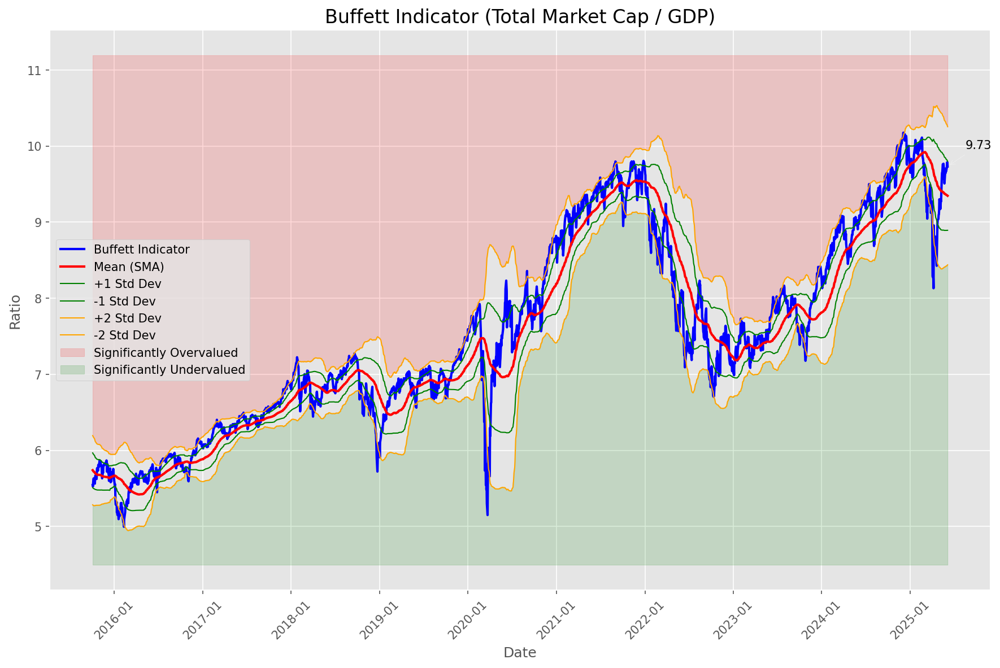
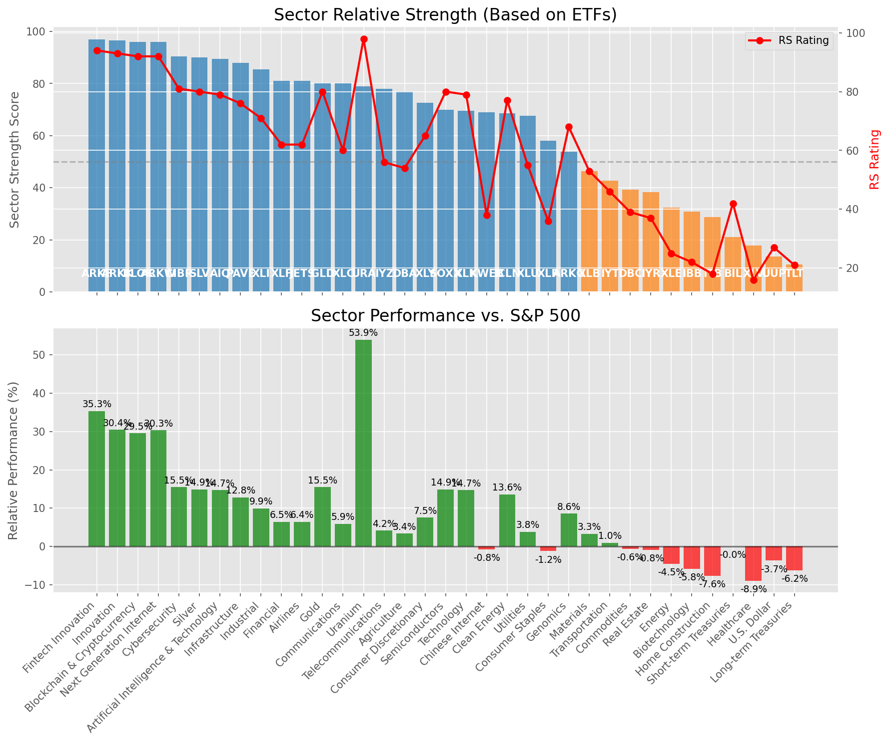

# **Daily Relative Strength Report**

**Date:** 2025-06-09

## **Market Valuation (Buffett Indicator)**

| Metric | Value |
|--------|-------|
| **Market Valuation** | **Overvalued** |
| **Current Ratio** | 9.87 |
| **Historical Mean** | 9.34 |
| **Standard Deviation** | 0.45 |
| **Z-Score (StdDev from Mean)** | 1.11 |
| **Total Market Cap** | $296.01 trillion |
| **GDP** | $29.98 trillion |

## **Market Insights**

### **Market is Overvalued**

The market appears to be trading above historical average valuations. While not at extreme levels, this suggests more modest future returns may be expected. Investors should:

- Focus on companies with reasonable valuations relative to their growth
- Be more selective with new positions
- Look for stocks showing relative strength within their sectors
- Consider trimming positions in extremely overvalued names

Historically, periods of mild overvaluation can persist for extended periods, but returns tend to be below average.

### **Buffett Indicator Overview**

The Buffett Indicator (Total Market Cap / GDP) is a measure of the stock market's valuation relative to the size of the economy. It is named after Warren Buffett, who described it as "probably the best single measure of where valuations stand at any given moment."

- **Values above +2 standard deviations:** Market significantly overvalued
- **Values above +1 standard deviation:** Market overvalued
- **Values between -1 and +1 standard deviations:** Market fairly valued
- **Values below -1 standard deviation:** Market undervalued
- **Values below -2 standard deviations:** Market significantly undervalued

---

## **Sector Relative Strength**

Based on William O'Neil's Relative Strength Methodology

| ETF | Strength | RS Rating | Performance | Above Key MAs | Trend | Sector |
|-----|----------|-----------|-------------|--------------|-------|--------|
| [ARKF](https://www.tradingview.com/chart/?symbol=ARKF) | 97.0 | 94.0 | 35.32% | 10d ✓, 50d ✓, 200d ✓ | ↗️ | Fintech Innovation |
| [ARKK](https://www.tradingview.com/chart/?symbol=ARKK) | 96.5 | 93.0 | 30.42% | 10d ✓, 50d ✓, 200d ✓ | ↗️ | Innovation |
| [BLOK](https://www.tradingview.com/chart/?symbol=BLOK) | 96.0 | 92.0 | 29.52% | 10d ✓, 50d ✓, 200d ✓ | ↗️ | Blockchain & Cryptocurrency |
| [ARKW](https://www.tradingview.com/chart/?symbol=ARKW) | 96.0 | 92.0 | 30.33% | 10d ✓, 50d ✓, 200d ✓ | ↗️ | Next Generation Internet |
| [CIBR](https://www.tradingview.com/chart/?symbol=CIBR) | 90.5 | 81.0 | 15.48% | 10d ✓, 50d ✓, 200d ✓ | ↗️ | Cybersecurity |
| [SLV](https://www.tradingview.com/chart/?symbol=SLV) | 90.0 | 80.0 | 14.89% | 10d ✓, 50d ✓, 200d ✓ | ↗️ | Silver |
| [AIQ](https://www.tradingview.com/chart/?symbol=AIQ) | 89.5 | 79.0 | 14.71% | 10d ✓, 50d ✓, 200d ✓ | ↗️ | Artificial Intelligence & Technology |
| [PAVE](https://www.tradingview.com/chart/?symbol=PAVE) | 88.0 | 76.0 | 12.81% | 10d ✓, 50d ✓, 200d ✓ | ↗️ | Infrastructure |
| [XLI](https://www.tradingview.com/chart/?symbol=XLI) | 85.5 | 71.0 | 9.94% | 10d ✓, 50d ✓, 200d ✓ | ↗️ | Industrial |
| [XLF](https://www.tradingview.com/chart/?symbol=XLF) | 81.0 | 62.0 | 6.47% | 10d ✓, 50d ✓, 200d ✓ | ↗️ | Financial |
| [JETS](https://www.tradingview.com/chart/?symbol=JETS) | 81.0 | 62.0 | 6.45% | 10d ✓, 50d ✓, 200d ✓ | ↗️ | Airlines |
| [GLD](https://www.tradingview.com/chart/?symbol=GLD) | 80.1 | 80.0 | 15.48% | 10d ✗, 50d ✓, 200d ✓ | ↗️ | Gold |
| [XLC](https://www.tradingview.com/chart/?symbol=XLC) | 80.0 | 60.0 | 5.89% | 10d ✓, 50d ✓, 200d ✓ | ↗️ | Communications |
| [URA](https://www.tradingview.com/chart/?symbol=URA) | 79.0 | 98.0 | 53.92% | 10d ✓, 50d ✓, 200d ✓ | ↘️ | Uranium |
| [IYZ](https://www.tradingview.com/chart/?symbol=IYZ) | 78.0 | 56.0 | 4.16% | 10d ✓, 50d ✓, 200d ✓ | ↗️ | Telecommunications |
| [DBA](https://www.tradingview.com/chart/?symbol=DBA) | 77.0 | 54.0 | 3.38% | 10d ✓, 50d ✓, 200d ✓ | ↗️ | Agriculture |
| [XLY](https://www.tradingview.com/chart/?symbol=XLY) | 72.6 | 65.0 | 7.54% | 10d ✗, 50d ✓, 200d ✓ | ↗️ | Consumer Discretionary |
| [SOXX](https://www.tradingview.com/chart/?symbol=SOXX) | 70.0 | 80.0 | 14.88% | 10d ✓, 50d ✓, 200d ✓ | ↘️ | Semiconductors |
| [XLK](https://www.tradingview.com/chart/?symbol=XLK) | 69.5 | 79.0 | 14.69% | 10d ✓, 50d ✓, 200d ✓ | ↘️ | Technology |
| [KWEB](https://www.tradingview.com/chart/?symbol=KWEB) | 69.0 | 38.0 | -0.76% | 10d ✓, 50d ✓, 200d ✓ | ↗️ | Chinese Internet |
| [ICLN](https://www.tradingview.com/chart/?symbol=ICLN) | 68.5 | 77.0 | 13.63% | 10d ✓, 50d ✓, 200d ✓ | ↘️ | Clean Energy |
| [XLU](https://www.tradingview.com/chart/?symbol=XLU) | 67.6 | 55.0 | 3.85% | 10d ✗, 50d ✓, 200d ✓ | ↗️ | Utilities |
| [XLP](https://www.tradingview.com/chart/?symbol=XLP) | 58.1 | 36.0 | -1.20% | 10d ✗, 50d ✓, 200d ✓ | ↗️ | Consumer Staples |
| [ARKG](https://www.tradingview.com/chart/?symbol=ARKG) | 53.8 | 68.0 | 8.57% | 10d ✓, 50d ✓, 200d ✗ | ↘️ | Genomics |
| [XLB](https://www.tradingview.com/chart/?symbol=XLB) | 46.3 | 53.0 | 3.33% | 10d ✓, 50d ✓, 200d ✗ | ↘️ | Materials |
| [IYT](https://www.tradingview.com/chart/?symbol=IYT) | 42.8 | 46.0 | 0.99% | 10d ✓, 50d ✓, 200d ✗ | ↘️ | Transportation |
| [DBC](https://www.tradingview.com/chart/?symbol=DBC) | 39.3 | 39.0 | -0.56% | 10d ✓, 50d ✓, 200d ✗ | ↘️ | Commodities |
| [IYR](https://www.tradingview.com/chart/?symbol=IYR) | 38.3 | 37.0 | -0.83% | 10d ✓, 50d ✓, 200d ✗ | ↘️ | Real Estate |
| [XLE](https://www.tradingview.com/chart/?symbol=XLE) | 32.3 | 25.0 | -4.48% | 10d ✓, 50d ✓, 200d ✗ | ↘️ | Energy |
| [IBB](https://www.tradingview.com/chart/?symbol=IBB) | 30.8 | 22.0 | -5.84% | 10d ✓, 50d ✓, 200d ✗ | ↘️ | Biotechnology |
| [ITB](https://www.tradingview.com/chart/?symbol=ITB) | 28.8 | 18.0 | -7.60% | 10d ✓, 50d ✓, 200d ✗ | ↘️ | Home Construction |
| [BIL](https://www.tradingview.com/chart/?symbol=BIL) | 21.0 | 42.0 | -0.01% | 10d ✗, 50d ✗, 200d ✗ | ↘️ | Short-term Treasuries |
| [XLV](https://www.tradingview.com/chart/?symbol=XLV) | 17.9 | 16.0 | -8.95% | 10d ✓, 50d ✗, 200d ✗ | ↘️ | Healthcare |
| [UUP](https://www.tradingview.com/chart/?symbol=UUP) | 13.5 | 27.0 | -3.66% | 10d ✗, 50d ✗, 200d ✗ | ↘️ | U.S. Dollar |
| [TLT](https://www.tradingview.com/chart/?symbol=TLT) | 10.5 | 21.0 | -6.16% | 10d ✗, 50d ✗, 200d ✗ | ↘️ | Long-term Treasuries |

### **Sector ETF Performance Interpretation**

This table shows the relative strength metrics for different market sectors based on their representative ETFs:

- **ETF**: The ETF used to measure sector performance (click for chart)
- **Strength**: Overall sector strength score (0-100) combining multiple factors
- **RS Rating**: O'Neil RS rating of the sector ETF
- **Performance**: Performance of the sector ETF relative to SPY
- **Above Key MAs**: Whether the ETF is trading above its 10, 50, and 200-day moving averages
- **Trend**: Whether the sector is in an uptrend (↗️) or downtrend (↘️)

### **Current Sector Leadership**

The current market leadership is coming from the following sectors: **Fintech Innovation, Innovation, Blockchain & Cryptocurrency**.

The **Fintech Innovation** sector (represented by **ARKF**) is showing particularly strong relative strength with an RS rating of 94.0 and performance of 35.32% vs. the S&P 500. This sector is trading above its 10-day, 50-day, 200-day moving average(s). Investors should consider focusing on high RS stocks within these leading sectors for potential outperformance.

---

## **Buy Recommendations**

The following 71 stocks show exceptional relative strength:

| RS Rating | Buy Score | Current Price | Chart | Name | Ticker |
|-----------|-----------|---------------|-------|------|--------|
| 100 | 100 | $147.80 | [Chart](https://www.tradingview.com/chart/?symbol=LEU) | Centrus Energy Corp. | LEU |
| 100 | 100 | $71.81 | [Chart](https://www.tradingview.com/chart/?symbol=HOOD) | Robinhood Markets, Inc. Class A Common Stock | HOOD |
| 100 | 100 | $132.25 | [Chart](https://www.tradingview.com/chart/?symbol=SEZL) | Sezzle Inc. Common Stock | SEZL |
| 100 | 100 | $223.03 | [Chart](https://www.tradingview.com/chart/?symbol=DAVE) | Dave Inc. Class A Common Stock | DAVE |
| 100 | 100 | $218.57 | [Chart](https://www.tradingview.com/chart/?symbol=AGX) | Argan, Inc | AGX |
| 100 | 100 | $131.94 | [Chart](https://www.tradingview.com/chart/?symbol=PLTR) | Palantir Technologies Inc. Class A Common Stock | PLTR |
| 100 | 100 | $340.48 | [Chart](https://www.tradingview.com/chart/?symbol=CVNA) | Carvana Co. | CVNA |
| 100 | 100 | $93.73 | [Chart](https://www.tradingview.com/chart/?symbol=RBLX) | Roblox Corporation | RBLX |
| 99 | 100 | $56.64 | [Chart](https://www.tradingview.com/chart/?symbol=HIMS) | Hims & Hers Health, Inc. | HIMS |
| 99 | 100 | $259.05 | [Chart](https://www.tradingview.com/chart/?symbol=TLN) | Talen Energy Corporation Common Stock | TLN |
| 98 | 100 | $123.01 | [Chart](https://www.tradingview.com/chart/?symbol=CLS) | Celestica, Inc. | CLS |
| 98 | 100 | $21.64 | [Chart](https://www.tradingview.com/chart/?symbol=MAG) | MAG Silver Corp. | MAG |
| 98 | 100 | $257.62 | [Chart](https://www.tradingview.com/chart/?symbol=GWRE) | GUIDEWIRE SOFTWARE, INC. | GWRE |
| 98 | 100 | $20.58 | [Chart](https://www.tradingview.com/chart/?symbol=MIR) | Mirion Technologies, Inc. | MIR |
| 98 | 100 | $46.35 | [Chart](https://www.tradingview.com/chart/?symbol=AU) | AngloGold Ashanti plc | AU |
| 97 | 100 | $42.44 | [Chart](https://www.tradingview.com/chart/?symbol=FARO) | Faro Technologies Inc | FARO |
| 97 | 100 | $45.78 | [Chart](https://www.tradingview.com/chart/?symbol=REVG) | REV Group, Inc. | REVG |
| 97 | 100 | $23.86 | [Chart](https://www.tradingview.com/chart/?symbol=BTSG) | BrightSpring Health Services, Inc. Common Stock | BTSG |
| 97 | 100 | $37.90 | [Chart](https://www.tradingview.com/chart/?symbol=AS) | Amer Sports, Inc. | AS |
| 96 | 100 | $1225.95 | [Chart](https://www.tradingview.com/chart/?symbol=NFLX) | NetFlix Inc | NFLX |
| 96 | 100 | $24.26 | [Chart](https://www.tradingview.com/chart/?symbol=TFPM) | Triple Flag Precious Metals Corp. | TFPM |
| 96 | 100 | $49.80 | [Chart](https://www.tradingview.com/chart/?symbol=GH) | Guardant Health, Inc. Common Stock | GH |
| 96 | 100 | $69.92 | [Chart](https://www.tradingview.com/chart/?symbol=GDXJ) | VanEck Junior Gold Miners ETF | GDXJ |
| 96 | 100 | $700.54 | [Chart](https://www.tradingview.com/chart/?symbol=SPOT) | Spotify Technology S.A. | SPOT |
| 96 | 100 | $173.22 | [Chart](https://www.tradingview.com/chart/?symbol=HWM) | Howmet Aerospace Inc. | HWM |
| 96 | 100 | $40.77 | [Chart](https://www.tradingview.com/chart/?symbol=KTOS) | Kratos Defense & Security Solutions, Inc. | KTOS |
| 95 | 100 | $61.76 | [Chart](https://www.tradingview.com/chart/?symbol=IBIT) | iShares Bitcoin Trust ETF | IBIT |
| 95 | 100 | $48.98 | [Chart](https://www.tradingview.com/chart/?symbol=SIL) | Global X Silver Miners ETF (NEW) | SIL |
| 94 | 100 | $44.75 | [Chart](https://www.tradingview.com/chart/?symbol=ARKF) | ARK Fintech Innovation ETF | ARKF |
| 94 | 100 | $30.15 | [Chart](https://www.tradingview.com/chart/?symbol=NTGR) | NETGEAR, Inc. | NTGR |
| 93 | 100 | $133.59 | [Chart](https://www.tradingview.com/chart/?symbol=COOP) | Mr. Cooper Group Inc. Common Stock | COOP |
| 93 | 100 | $252.47 | [Chart](https://www.tradingview.com/chart/?symbol=GE) | GE Aerospace | GE |
| 93 | 100 | $18.23 | [Chart](https://www.tradingview.com/chart/?symbol=LQDA) | Liquidia Corporation Common Stock | LQDA |
| 92 | 100 | $54.32 | [Chart](https://www.tradingview.com/chart/?symbol=AKRO) | Akero Therapeutics, Inc. Common Stock | AKRO |
| 92 | 100 | $52.24 | [Chart](https://www.tradingview.com/chart/?symbol=GDX) | VanEck Gold Miners ETF | GDX |
| 92 | 100 | $43.65 | [Chart](https://www.tradingview.com/chart/?symbol=TOST) | Toast, Inc. | TOST |
| 91 | 100 | $48.21 | [Chart](https://www.tradingview.com/chart/?symbol=BBW) | Build-A-Bear Workshop, Inc. | BBW |
| 91 | 100 | $399.01 | [Chart](https://www.tradingview.com/chart/?symbol=CYBR) | CyberArk Software Ltd. | CYBR |
| 91 | 100 | $89.04 | [Chart](https://www.tradingview.com/chart/?symbol=WPM) | Wheaton Precious Metals Corp. Common Stock | WPM |
| 91 | 100 | $57.96 | [Chart](https://www.tradingview.com/chart/?symbol=SHLD) | Global X Defense Tech ETF | SHLD |
| 90 | 100 | $35.24 | [Chart](https://www.tradingview.com/chart/?symbol=AHR) | American Healthcare REIT, Inc. | AHR |
| 89 | 100 | $5550.20 | [Chart](https://www.tradingview.com/chart/?symbol=BKNG) | Booking Holdings Inc. Common Stock | BKNG |
| 89 | 100 | $183.13 | [Chart](https://www.tradingview.com/chart/?symbol=ITA) | iShares U.S. Aerospace & Defense ETF | ITA |
| 89 | 100 | $175.06 | [Chart](https://www.tradingview.com/chart/?symbol=EAT) | Brinker International, Inc. | EAT |
| 88 | 100 | $24.00 | [Chart](https://www.tradingview.com/chart/?symbol=SRAD) | Sportradar Group AG Class A Ordinary Shares | SRAD |
| 88 | 100 | $18.18 | [Chart](https://www.tradingview.com/chart/?symbol=BCS) | Barclays PLC | BCS |
| 86 | 100 | $180.87 | [Chart](https://www.tradingview.com/chart/?symbol=PM) | Philip Morris International Inc. | PM |
| 89 | 99 | $164.63 | [Chart](https://www.tradingview.com/chart/?symbol=NTRA) | Natera, Inc. Common Stock | NTRA |
| 87 | 99 | $28.21 | [Chart](https://www.tradingview.com/chart/?symbol=DB) | Deutsche Bank Aktiengesellschaft | DB |
| 87 | 98 | $199.25 | [Chart](https://www.tradingview.com/chart/?symbol=COF) | Capital One Financial | COF |
| 86 | 98 | $59.07 | [Chart](https://www.tradingview.com/chart/?symbol=CAKE) | Cheesecake Factory (The) | CAKE |
| 84 | 98 | $56.70 | [Chart](https://www.tradingview.com/chart/?symbol=TXNM) | TXNM Energy, Inc. | TXNM |
| 85 | 97 | $63.35 | [Chart](https://www.tradingview.com/chart/?symbol=CHEF) | The Chef's Warehouse Inc | CHEF |
| 86 | 96 | $65.18 | [Chart](https://www.tradingview.com/chart/?symbol=SLF) | Sun Life Financial Inc. | SLF |
| 85 | 96 | $152.39 | [Chart](https://www.tradingview.com/chart/?symbol=ROOT) | Root, Inc. Class A Common Stock | ROOT |
| 84 | 96 | $47.88 | [Chart](https://www.tradingview.com/chart/?symbol=BTI) | British American Tobacco p.l.c. American Depositary Shares, American Depositary Shares, each representing one Ordinary Share | BTI |
| 83 | 96 | $280.66 | [Chart](https://www.tradingview.com/chart/?symbol=VRSN) | VeriSign Inc | VRSN |
| 84 | 95 | $43.67 | [Chart](https://www.tradingview.com/chart/?symbol=EWP) | iShares MSCI Spain ETF | EWP |
| 84 | 95 | $284.11 | [Chart](https://www.tradingview.com/chart/?symbol=VEEV) | Veeva Systems Inc. | VEEV |
| 82 | 95 | $305.54 | [Chart](https://www.tradingview.com/chart/?symbol=SAP) | SAP SE | SAP |
| 83 | 94 | $27.11 | [Chart](https://www.tradingview.com/chart/?symbol=AGI) | Alamos Gold Inc. Class A Common Shares | AGI |
| 83 | 94 | $214.34 | [Chart](https://www.tradingview.com/chart/?symbol=BAP) | Credicorp LTD | BAP |
| 83 | 94 | $48.35 | [Chart](https://www.tradingview.com/chart/?symbol=INOD) | Innodata Inc. | INOD |
| 82 | 94 | $143.21 | [Chart](https://www.tradingview.com/chart/?symbol=LYV) | Live Nation Entertainment Inc. | LYV |
| 81 | 94 | $233.98 | [Chart](https://www.tradingview.com/chart/?symbol=TTWO) | Take-Two Interactive Software Inc | TTWO |
| 83 | 93 | $85.59 | [Chart](https://www.tradingview.com/chart/?symbol=NDAQ) | Nasdaq, Inc. Common Stock | NDAQ |
| 83 | 93 | $116.16 | [Chart](https://www.tradingview.com/chart/?symbol=OLLI) | Ollie's Bargain Outlet Holdings, Inc. Common Stock | OLLI |
| 81 | 93 | $79.33 | [Chart](https://www.tradingview.com/chart/?symbol=EBAY) | eBay Inc | EBAY |
| 81 | 93 | $76.07 | [Chart](https://www.tradingview.com/chart/?symbol=LLYVK) | Liberty Media Corporation Series C Liberty Live Common Stock | LLYVK |
| 81 | 93 | $73.08 | [Chart](https://www.tradingview.com/chart/?symbol=CIBR) | First Trust Exchange-Traded Fund II First Trust NASDAQ Cybersecurity ETF | CIBR |
| 80 | 90 | $29.46 | [Chart](https://www.tradingview.com/chart/?symbol=DBX) | Dropbox, Inc. Class A | DBX |

---

## **Sell Recommendations**

The following 156 stocks show deteriorating relative strength:

| RS Rating | Sell Score | Current Price | Chart | Name | Ticker |
|-----------|------------|---------------|-------|------|--------|
| 1 | 100 | $31.69 | [Chart](https://www.tradingview.com/chart/?symbol=TECS) | Direxion Daily Technology Bear 3x Shares | TECS |
| 1 | 100 | $10.05 | [Chart](https://www.tradingview.com/chart/?symbol=WNC) | Wabash National Corp. | WNC |
| 1 | 100 | $39.75 | [Chart](https://www.tradingview.com/chart/?symbol=SRPT) | Sarepta Therapeutics,, Inc. Common Stock | SRPT |
| 1 | 100 | $13.82 | [Chart](https://www.tradingview.com/chart/?symbol=IART) | Integra LifeSciences Holdings | IART |
| 1 | 100 | $17.19 | [Chart](https://www.tradingview.com/chart/?symbol=BHVN) | Biohaven Ltd. | BHVN |
| 1 | 100 | $16.84 | [Chart](https://www.tradingview.com/chart/?symbol=NVDS) | Investment Managers Series Trust II Tradr 1.5X Short NVDA Daily ETF | NVDS |
| 1 | 100 | $10.25 | [Chart](https://www.tradingview.com/chart/?symbol=ZVZZT) | SUPER Montage TEST SYMBOL | ZVZZT |
| 2 | 100 | $19.48 | [Chart](https://www.tradingview.com/chart/?symbol=BITI) | ProShares Short Bitcoin ETF | BITI |
| 3 | 100 | $10.47 | [Chart](https://www.tradingview.com/chart/?symbol=SONO) | Sonos, Inc. Common Stock | SONO |
| 3 | 100 | $54.03 | [Chart](https://www.tradingview.com/chart/?symbol=CCS) | CENTURY COMMUNITIES, INC. | CCS |
| 3 | 100 | $14.59 | [Chart](https://www.tradingview.com/chart/?symbol=INMD) | InMode Ltd. Ordinary Shares | INMD |
| 3 | 100 | $10.22 | [Chart](https://www.tradingview.com/chart/?symbol=PRTA) | Prothena Corporation plc Ordinary Shares | PRTA |
| 3 | 100 | $27.51 | [Chart](https://www.tradingview.com/chart/?symbol=QID) | ProShares UltraShort QQQ | QID |
| 3 | 100 | $18.18 | [Chart](https://www.tradingview.com/chart/?symbol=DNTH) | Dianthus Therapeutics, Inc. Common Stock | DNTH |
| 3 | 100 | $25.82 | [Chart](https://www.tradingview.com/chart/?symbol=CRTO) | Criteo S.A. | CRTO |
| 3 | 100 | $11.11 | [Chart](https://www.tradingview.com/chart/?symbol=SNDX) | Syndax Pharmaceuticals, Inc. | SNDX |
| 3 | 100 | $22.73 | [Chart](https://www.tradingview.com/chart/?symbol=THS) | Treehouse Foods, Inc. | THS |
| 3 | 100 | $136.62 | [Chart](https://www.tradingview.com/chart/?symbol=KRYS) | Krystal Biotech, Inc. Common Stock | KRYS |
| 3 | 100 | $10.35 | [Chart](https://www.tradingview.com/chart/?symbol=PACS) | PACS Group, Inc. | PACS |
| 3 | 100 | $45.32 | [Chart](https://www.tradingview.com/chart/?symbol=LINE) | Lineage, Inc. Common Stock | LINE |
| 4 | 100 | $68.33 | [Chart](https://www.tradingview.com/chart/?symbol=WD) | Walker & Dunlop, Inc. | WD |
| 4 | 100 | $10.45 | [Chart](https://www.tradingview.com/chart/?symbol=CWK) | Cushman & Wakefield plc Ordinary Shares | CWK |
| 4 | 100 | $12.70 | [Chart](https://www.tradingview.com/chart/?symbol=ERII) | Energy Recovery, Inc. | ERII |
| 4 | 100 | $56.65 | [Chart](https://www.tradingview.com/chart/?symbol=SPB) | Spectrum Brands Holdings, Inc. | SPB |
| 4 | 100 | $136.91 | [Chart](https://www.tradingview.com/chart/?symbol=INSP) | Inspire Medical Systems, Inc. | INSP |
| 4 | 100 | $54.48 | [Chart](https://www.tradingview.com/chart/?symbol=ASGN) | ASGN Incorporated | ASGN |
| 4 | 100 | $31.56 | [Chart](https://www.tradingview.com/chart/?symbol=MBIN) | Merchants Bancorp Common Stock | MBIN |
| 4 | 100 | $26.32 | [Chart](https://www.tradingview.com/chart/?symbol=WMG) | Warner Music Group Corp. Class A Common Stock | WMG |
| 4 | 100 | $33.18 | [Chart](https://www.tradingview.com/chart/?symbol=CYTK) | Cytokinetics Inc. | CYTK |
| 4 | 100 | $21.39 | [Chart](https://www.tradingview.com/chart/?symbol=AMRK) | A-Mark Precious Metals, Inc. | AMRK |
| 4 | 100 | $99.71 | [Chart](https://www.tradingview.com/chart/?symbol=GLOB) | GLOBANT S.A. | GLOB |
| 5 | 100 | $11.74 | [Chart](https://www.tradingview.com/chart/?symbol=CLB) | Core Laboratories Inc. | CLB |
| 5 | 100 | $74.45 | [Chart](https://www.tradingview.com/chart/?symbol=FND) | Floor & Decor Holdings, Inc. | FND |
| 5 | 100 | $34.72 | [Chart](https://www.tradingview.com/chart/?symbol=ANDE) | Andersons Inc/The | ANDE |
| 5 | 100 | $57.19 | [Chart](https://www.tradingview.com/chart/?symbol=BMRN) | BioMarin Pharmaceuticals Inc | BMRN |
| 6 | 100 | $10.40 | [Chart](https://www.tradingview.com/chart/?symbol=AEO) | American Eagle Outfitters | AEO |
| 6 | 100 | $52.19 | [Chart](https://www.tradingview.com/chart/?symbol=FBIN) | Fortune Brands Innovations, Inc. | FBIN |
| 6 | 100 | $10.62 | [Chart](https://www.tradingview.com/chart/?symbol=MBC) | MasterBrand, Inc. | MBC |
| 6 | 100 | $78.78 | [Chart](https://www.tradingview.com/chart/?symbol=GPN) | Global Payments, Inc. | GPN |
| 6 | 100 | $22.40 | [Chart](https://www.tradingview.com/chart/?symbol=GPK) | Graphic Packaging Holding Company | GPK |
| 6 | 100 | $17.80 | [Chart](https://www.tradingview.com/chart/?symbol=AMTB) | Amerant Bancorp Inc. | AMTB |
| 6 | 100 | $22.48 | [Chart](https://www.tradingview.com/chart/?symbol=CAG) | Conagra Brands, Inc. | CAG |
| 6 | 100 | $44.58 | [Chart](https://www.tradingview.com/chart/?symbol=RHI) | Robert Half Inc. | RHI |
| 6 | 100 | $15.61 | [Chart](https://www.tradingview.com/chart/?symbol=SAFE) | Safehold Inc. | SAFE |
| 7 | 100 | $23.09 | [Chart](https://www.tradingview.com/chart/?symbol=IPG) | The Interpublic Group of Companies, Inc. | IPG |
| 7 | 100 | $299.66 | [Chart](https://www.tradingview.com/chart/?symbol=POOL) | Pool Corporation | POOL |
| 7 | 100 | $14.23 | [Chart](https://www.tradingview.com/chart/?symbol=CAL) | Caleres Inc | CAL |
| 7 | 100 | $17.25 | [Chart](https://www.tradingview.com/chart/?symbol=CODI) | Compass Diversified | CODI |
| 7 | 100 | $44.51 | [Chart](https://www.tradingview.com/chart/?symbol=TWM) | ProShares UltraShort Russell2000 | TWM |
| 7 | 100 | $39.31 | [Chart](https://www.tradingview.com/chart/?symbol=APOG) | Apogee Enterprises Inc | APOG |
| 7 | 100 | $38.21 | [Chart](https://www.tradingview.com/chart/?symbol=WLY) | John Wiley & Sons, Inc. Class A | WLY |
| 7 | 100 | $53.65 | [Chart](https://www.tradingview.com/chart/?symbol=SLVM) | Sylvamo Corporation | SLVM |
| 8 | 100 | $21.69 | [Chart](https://www.tradingview.com/chart/?symbol=GNTX) | Gentex Corp | GNTX |
| 8 | 100 | $17.32 | [Chart](https://www.tradingview.com/chart/?symbol=DOC) | Healthpeak Properties, Inc. | DOC |
| 8 | 100 | $34.34 | [Chart](https://www.tradingview.com/chart/?symbol=SLB) | Schlumberger Limited | SLB |
| 8 | 100 | $134.76 | [Chart](https://www.tradingview.com/chart/?symbol=NSIT) | Insight Enterprises Inc | NSIT |
| 8 | 100 | $113.70 | [Chart](https://www.tradingview.com/chart/?symbol=AMR) | Alpha Metallurgical Resources, Inc. | AMR |
| 8 | 100 | $12.59 | [Chart](https://www.tradingview.com/chart/?symbol=AVNS) | Avanos Medical, Inc. | AVNS |
| 8 | 100 | $93.08 | [Chart](https://www.tradingview.com/chart/?symbol=ZBH) | Zimmer Biomet Holdings, Inc. | ZBH |
| 8 | 100 | $113.38 | [Chart](https://www.tradingview.com/chart/?symbol=BLDR) | Builders FirstSource, Inc. | BLDR |
| 8 | 100 | $55.01 | [Chart](https://www.tradingview.com/chart/?symbol=GIS) | General Mills, Inc. | GIS |
| 8 | 100 | $53.23 | [Chart](https://www.tradingview.com/chart/?symbol=KBH) | KB Home | KBH |
| 9 | 100 | $33.74 | [Chart](https://www.tradingview.com/chart/?symbol=NSA) | National Storage Affiliates Trust | NSA |
| 9 | 100 | $17.68 | [Chart](https://www.tradingview.com/chart/?symbol=EGBN) | Eagle Bancorp Inc | EGBN |
| 9 | 100 | $23.87 | [Chart](https://www.tradingview.com/chart/?symbol=RPD) | Rapid7, Inc. Common Stock | RPD |
| 9 | 100 | $45.42 | [Chart](https://www.tradingview.com/chart/?symbol=SDOW) | ProShares UltraPro Short Dow 30 | SDOW |
| 9 | 100 | $10.53 | [Chart](https://www.tradingview.com/chart/?symbol=SCS) | Steelcase, Inc. | SCS |
| 10 | 100 | $25.26 | [Chart](https://www.tradingview.com/chart/?symbol=ASTH) | Astrana Health Inc. Common Stock | ASTH |
| 10 | 100 | $14.51 | [Chart](https://www.tradingview.com/chart/?symbol=HR) | Healthcare Realty Trust Incorporated | HR |
| 10 | 100 | $25.95 | [Chart](https://www.tradingview.com/chart/?symbol=JANX) | Janux Therapeutics, Inc. Common Stock | JANX |
| 11 | 100 | $65.56 | [Chart](https://www.tradingview.com/chart/?symbol=MTH) | Meritage Homes Corporation | MTH |
| 11 | 100 | $10.00 | [Chart](https://www.tradingview.com/chart/?symbol=LBTYK) | Liberty Global Ltd. Class C Common Shares | LBTYK |
| 11 | 100 | $10.81 | [Chart](https://www.tradingview.com/chart/?symbol=SD) | SandRidge Energy, Inc. | SD |
| 12 | 100 | $107.05 | [Chart](https://www.tradingview.com/chart/?symbol=MHO) | M/I Homes, Inc. | MHO |
| 14 | 100 | $19.53 | [Chart](https://www.tradingview.com/chart/?symbol=FOR) | Forestar Group Inc. | FOR |
| 14 | 100 | $89.12 | [Chart](https://www.tradingview.com/chart/?symbol=BCC) | Boise Cascade Company | BCC |
| 19 | 100 | $19.58 | [Chart](https://www.tradingview.com/chart/?symbol=HVT) | Haverty Furniture Companies, Inc. | HVT |
| 10 | 99 | $12.31 | [Chart](https://www.tradingview.com/chart/?symbol=WSR) | Whitestone REIT | WSR |
| 2 | 98 | $12.31 | [Chart](https://www.tradingview.com/chart/?symbol=TZA) | Direxion Daily Small Cap Bear 3x Shares | TZA |
| 6 | 98 | $33.84 | [Chart](https://www.tradingview.com/chart/?symbol=SQM) | Sociedad Quimica y Minera de Chile SA | SQM |
| 8 | 98 | $11.17 | [Chart](https://www.tradingview.com/chart/?symbol=FBRT) | Franklin BSP Realty Trust, Inc. | FBRT |
| 9 | 98 | $39.04 | [Chart](https://www.tradingview.com/chart/?symbol=PCH) | PotlatchDeltic Corporation Common Stock | PCH |
| 10 | 98 | $446.41 | [Chart](https://www.tradingview.com/chart/?symbol=WSO) | Watsco, Inc. | WSO |
| 11 | 98 | $43.08 | [Chart](https://www.tradingview.com/chart/?symbol=PRKS) | United Parks & Resorts Inc. | PRKS |
| 12 | 98 | $201.11 | [Chart](https://www.tradingview.com/chart/?symbol=AAPL) | Apple Inc. | AAPL |
| 13 | 98 | $77.26 | [Chart](https://www.tradingview.com/chart/?symbol=CBT) | Cabot Corporation | CBT |
| 13 | 98 | $123.63 | [Chart](https://www.tradingview.com/chart/?symbol=TFX) | Teleflex Incorporated | TFX |
| 10 | 96 | $127.73 | [Chart](https://www.tradingview.com/chart/?symbol=CLX) | Clorox Company | CLX |
| 11 | 96 | $21.19 | [Chart](https://www.tradingview.com/chart/?symbol=KIDS) | OrthoPediatrics Corp. Common Stock | KIDS |
| 11 | 96 | $23.79 | [Chart](https://www.tradingview.com/chart/?symbol=RYN) | Rayonier Inc. | RYN |
| 8 | 95 | $10.99 | [Chart](https://www.tradingview.com/chart/?symbol=NEWT) | NewtekOne, Inc. Common Stock | NEWT |
| 8 | 95 | $21.79 | [Chart](https://www.tradingview.com/chart/?symbol=GIII) | G-Iii Apparel Group Ltd | GIII |
| 13 | 95 | $103.34 | [Chart](https://www.tradingview.com/chart/?symbol=MHK) | Mohawk Industries, Inc. | MHK |
| 19 | 95 | $15.20 | [Chart](https://www.tradingview.com/chart/?symbol=VRE) | Veris Residential, Inc. | VRE |
| 12 | 94 | $50.51 | [Chart](https://www.tradingview.com/chart/?symbol=TSCO) | Tractor Supply Co | TSCO |
| 12 | 94 | $102.45 | [Chart](https://www.tradingview.com/chart/?symbol=PDD) | PDD Holdings Inc. American Depositary Shares | PDD |
| 13 | 94 | $15.51 | [Chart](https://www.tradingview.com/chart/?symbol=SEM) | SELECT MEDICAL HOLDINGS CORP | SEM |
| 17 | 94 | $226.85 | [Chart](https://www.tradingview.com/chart/?symbol=BIO) | Bio-Rad Laboratories, Inc.Class A | BIO |
| 15 | 93 | $66.86 | [Chart](https://www.tradingview.com/chart/?symbol=KMX) | CarMax Inc. | KMX |
| 16 | 93 | $98.20 | [Chart](https://www.tradingview.com/chart/?symbol=UFPI) | UFP Industries, Inc. Common Stock | UFPI |
| 10 | 92 | $12.54 | [Chart](https://www.tradingview.com/chart/?symbol=PMT) | PennyMac Mortgage Investment Trust | PMT |
| 10 | 92 | $182.39 | [Chart](https://www.tradingview.com/chart/?symbol=DKS) | Dick's Sporting Goods, Inc. | DKS |
| 15 | 92 | $77.41 | [Chart](https://www.tradingview.com/chart/?symbol=EXPO) | Exponent Inc | EXPO |
| 24 | 92 | $77.15 | [Chart](https://www.tradingview.com/chart/?symbol=OTTR) | Otter Tail Corp | OTTR |
| 11 | 91 | $60.85 | [Chart](https://www.tradingview.com/chart/?symbol=STC) | Stewart Information Services Corporation | STC |
| 13 | 91 | $36.83 | [Chart](https://www.tradingview.com/chart/?symbol=WPP) | WPP PLC | WPP |
| 13 | 91 | $12.10 | [Chart](https://www.tradingview.com/chart/?symbol=FFIC) | Flushing Financial Corp | FFIC |
| 14 | 91 | $447.55 | [Chart](https://www.tradingview.com/chart/?symbol=VRTX) | Vertex Pharmaceuticals Inc | VRTX |
| 16 | 91 | $62.64 | [Chart](https://www.tradingview.com/chart/?symbol=ELS) | Equity Lifestyle Properties, Inc. | ELS |
| 17 | 91 | $76.33 | [Chart](https://www.tradingview.com/chart/?symbol=CNS) | Cohen & Steers Inc. | CNS |
| 19 | 90 | $10.41 | [Chart](https://www.tradingview.com/chart/?symbol=MYI) | BLACKROCK MUNIYIELD QUALITY FUND III, INC. | MYI |
| 20 | 90 | $37.66 | [Chart](https://www.tradingview.com/chart/?symbol=WES) | Western Midstream Partners, LP | WES |
| 25 | 90 | $88.56 | [Chart](https://www.tradingview.com/chart/?symbol=COP) | ConocoPhillips | COP |
| 14 | 89 | $39.38 | [Chart](https://www.tradingview.com/chart/?symbol=LKQ) | LKQ Corporation | LKQ |
| 21 | 89 | $133.07 | [Chart](https://www.tradingview.com/chart/?symbol=ICUI) | ICU Medical Inc | ICUI |
| 21 | 89 | $13.72 | [Chart](https://www.tradingview.com/chart/?symbol=BSM) | Black Stone Minerals, L.P. | BSM |
| 19 | 88 | $224.46 | [Chart](https://www.tradingview.com/chart/?symbol=LOW) | Lowe's Companies Inc. | LOW |
| 20 | 88 | $11.80 | [Chart](https://www.tradingview.com/chart/?symbol=NVG) | Nuveen AMT-Free Municipal Credit Income Fund | NVG |
| 22 | 88 | $105.47 | [Chart](https://www.tradingview.com/chart/?symbol=XOM) | Exxon Mobil Corporation | XOM |
| 14 | 87 | $297.95 | [Chart](https://www.tradingview.com/chart/?symbol=MOH) | Molina Healthcare, Inc. | MOH |
| 18 | 87 | $17.05 | [Chart](https://www.tradingview.com/chart/?symbol=UMH) | UMH Properties, Inc. | UMH |
| 18 | 86 | $162.38 | [Chart](https://www.tradingview.com/chart/?symbol=PG) | Procter & Gamble Company | PG |
| 23 | 86 | $48.61 | [Chart](https://www.tradingview.com/chart/?symbol=ABM) | ABM Industries, Inc. | ABM |
| 16 | 85 | $18.62 | [Chart](https://www.tradingview.com/chart/?symbol=SPTN) | SpartanNash Company | SPTN |
| 20 | 85 | $91.08 | [Chart](https://www.tradingview.com/chart/?symbol=CL) | Colgate-Palmolive Company | CL |
| 20 | 85 | $10.47 | [Chart](https://www.tradingview.com/chart/?symbol=PFLT) | PennantPark Floating Rate Capital Ltd. | PFLT |
| 28 | 85 | $84.79 | [Chart](https://www.tradingview.com/chart/?symbol=BCO) | The Brink's Company | BCO |
| 22 | 84 | $41.80 | [Chart](https://www.tradingview.com/chart/?symbol=NBTB) | NBT Bancorp Inc | NBTB |
| 22 | 84 | $10.88 | [Chart](https://www.tradingview.com/chart/?symbol=LBTYA) | Liberty Global Ltd. Class A Common Shares | LBTYA |
| 26 | 84 | $46.25 | [Chart](https://www.tradingview.com/chart/?symbol=CWT) | California Water Service | CWT |
| 20 | 83 | $773.03 | [Chart](https://www.tradingview.com/chart/?symbol=LLY) | Eli Lilly & Co. | LLY |
| 25 | 83 | $77.48 | [Chart](https://www.tradingview.com/chart/?symbol=AWR) | American States Water Company | AWR |
| 25 | 83 | $15.70 | [Chart](https://www.tradingview.com/chart/?symbol=BBN) | BlackRock Taxable Municipal Bond Trust | BBN |
| 19 | 82 | $46.87 | [Chart](https://www.tradingview.com/chart/?symbol=GLPI) | Gaming and Leisure Properties, Inc. | GLPI |
| 19 | 82 | $31.09 | [Chart](https://www.tradingview.com/chart/?symbol=AXTA) | Axalta Coating Systems Ltd. | AXTA |
| 21 | 82 | $13.82 | [Chart](https://www.tradingview.com/chart/?symbol=DOLE) | Dole plc | DOLE |
| 36 | 82 | $46.72 | [Chart](https://www.tradingview.com/chart/?symbol=EAGG) | iShares ESG Aware U.S. Aggregate Bond ETF | EAGG |
| 30 | 81 | $37.44 | [Chart](https://www.tradingview.com/chart/?symbol=PBA) | PEMBINA PIPELINE CORPORATION | PBA |
| 25 | 80 | $111.79 | [Chart](https://www.tradingview.com/chart/?symbol=SJM) | The J.M. Smucker Company | SJM |
| 25 | 80 | $24.57 | [Chart](https://www.tradingview.com/chart/?symbol=HYMB) | SPDR Nuveen ICE High Yield Municipal Bond ETF | HYMB |
| 33 | 79 | $74.87 | [Chart](https://www.tradingview.com/chart/?symbol=BG) | Bunge Global SA | BG |
| 26 | 78 | $313.71 | [Chart](https://www.tradingview.com/chart/?symbol=CI) | The Cigna Group | CI |
| 29 | 78 | $34.98 | [Chart](https://www.tradingview.com/chart/?symbol=LTC) | LTC Properties, Inc. | LTC |
| 34 | 78 | $43.20 | [Chart](https://www.tradingview.com/chart/?symbol=FIXD) | First Trust Exchange-Traded Fund VIII First Trust Smith Opportunistic Fixed Income ETF | FIXD |
| 26 | 77 | $38.66 | [Chart](https://www.tradingview.com/chart/?symbol=KSA) | iShares MSCI Saudi Arabia ETF | KSA |
| 28 | 77 | $26.76 | [Chart](https://www.tradingview.com/chart/?symbol=ETD) | Ethan Allen Interiors Inc | ETD |
| 39 | 76 | $13.41 | [Chart](https://www.tradingview.com/chart/?symbol=GO) | Grocery Outlet Holding Corp. Common Stock | GO |
| 32 | 73 | $20.95 | [Chart](https://www.tradingview.com/chart/?symbol=LGOV) | First Trust Long Duration Opportunities ETF | LGOV |
| 33 | 73 | $26.73 | [Chart](https://www.tradingview.com/chart/?symbol=CZR) | Caesars Entertainment, Inc. Common Stock | CZR |
| 34 | 73 | $22.16 | [Chart](https://www.tradingview.com/chart/?symbol=CGCP) | Capital Group Core Plus Income ETF | CGCP |
| 30 | 72 | $33.27 | [Chart](https://www.tradingview.com/chart/?symbol=INVH) | Invitation Homes Inc. Common Stock | INVH |
| 31 | 72 | $31.26 | [Chart](https://www.tradingview.com/chart/?symbol=VITL) | Vital Farms, Inc. Common Stock | VITL |
| 36 | 69 | $72.33 | [Chart](https://www.tradingview.com/chart/?symbol=BND) | Vanguard Total Bond Market | BND |
| 34 | 68 | $21.14 | [Chart](https://www.tradingview.com/chart/?symbol=FLCB) | Franklin U.S. Core Bond ETF | FLCB |
| 35 | 68 | $25.14 | [Chart](https://www.tradingview.com/chart/?symbol=SPAB) | SPDR Portfolio Aggregate Bond ETF | SPAB |
| 36 | 66 | $45.44 | [Chart](https://www.tradingview.com/chart/?symbol=IUSB) | iShares Core Total USD Bond Market ETF | IUSB |

## **Methodology**

This report uses William O'Neil's relative strength methodology from Investors Business Daily:

* **RS Rating**: Percentile rank of stock's performance vs. S&P 500 over the past 63 trading days (1-99 scale)
* **Buy Criteria**: RS Rating >= 80, price above 50-day MA, strong uptrend, increasing volume
* **Sell Criteria**: RS Rating < 40, price below 50-day MA, downtrend, decreasing volume

### **O'Neil's Key Principles**

1. **Focus on relative performance** - stocks outperforming the market
2. **Price trend confirmation** - stock must be in an uptrend
3. **Volume confirmation** - strong volume supports price moves
4. **Moving average validation** - price above key moving averages
5. **Market leaders only** - concentrate on top-performing stocks

*Report generated automatically after market close*