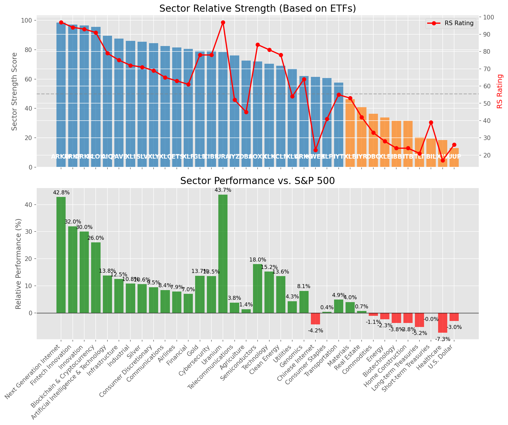

# **Daily Relative Strength Report**

**Date:** 2025-06-10

## **Market Valuation (Buffett Indicator)**

| Metric | Value |
|--------|-------|
| **Market Valuation** | **Overvalued** |
| **Current Ratio** | 9.89 |
| **Historical Mean** | 9.34 |
| **Standard Deviation** | 0.45 |
| **Z-Score (StdDev from Mean)** | 1.13 |
| **Total Market Cap** | $296.36 trillion |
| **GDP** | $29.98 trillion |

## **Market Insights**

### **Market is Overvalued**

The market appears to be trading above historical average valuations. While not at extreme levels, this suggests more modest future returns may be expected. Investors should:

- Focus on companies with reasonable valuations relative to their growth
- Be more selective with new positions
- Look for stocks showing relative strength within their sectors
- Consider trimming positions in extremely overvalued names

Historically, periods of mild overvaluation can persist for extended periods, but returns tend to be below average.

### **Buffett Indicator Overview**

The Buffett Indicator (Total Market Cap / GDP) is a measure of the stock market's valuation relative to the size of the economy. It is named after Warren Buffett, who described it as "probably the best single measure of where valuations stand at any given moment."

- **Values above +2 standard deviations:** Market significantly overvalued
- **Values above +1 standard deviation:** Market overvalued
- **Values between -1 and +1 standard deviations:** Market fairly valued
- **Values below -1 standard deviation:** Market undervalued
- **Values below -2 standard deviations:** Market significantly undervalued

---

## **Sector Relative Strength**

Based on William O'Neil's Relative Strength Methodology

| ETF | Strength | RS Rating | Performance | Above Key MAs | Trend | Sector |
|-----|----------|-----------|-------------|--------------|-------|--------|
| [ARKW](https://www.tradingview.com/chart/?symbol=ARKW) | 98.5 | 97.0 | 42.76% | 10d ✓, 50d ✓, 200d ✓ | ↗️ | Next Generation Internet |
| [ARKF](https://www.tradingview.com/chart/?symbol=ARKF) | 97.0 | 94.0 | 31.98% | 10d ✓, 50d ✓, 200d ✓ | ↗️ | Fintech Innovation |
| [ARKK](https://www.tradingview.com/chart/?symbol=ARKK) | 96.5 | 93.0 | 29.99% | 10d ✓, 50d ✓, 200d ✓ | ↗️ | Innovation |
| [BLOK](https://www.tradingview.com/chart/?symbol=BLOK) | 95.5 | 91.0 | 26.03% | 10d ✓, 50d ✓, 200d ✓ | ↗️ | Blockchain & Cryptocurrency |
| [AIQ](https://www.tradingview.com/chart/?symbol=AIQ) | 89.5 | 79.0 | 13.82% | 10d ✓, 50d ✓, 200d ✓ | ↗️ | Artificial Intelligence & Technology |
| [PAVE](https://www.tradingview.com/chart/?symbol=PAVE) | 87.5 | 75.0 | 12.50% | 10d ✓, 50d ✓, 200d ✓ | ↗️ | Infrastructure |
| [XLI](https://www.tradingview.com/chart/?symbol=XLI) | 86.0 | 72.0 | 10.78% | 10d ✓, 50d ✓, 200d ✓ | ↗️ | Industrial |
| [SLV](https://www.tradingview.com/chart/?symbol=SLV) | 85.5 | 71.0 | 10.58% | 10d ✓, 50d ✓, 200d ✓ | ↗️ | Silver |
| [XLY](https://www.tradingview.com/chart/?symbol=XLY) | 84.5 | 69.0 | 9.48% | 10d ✓, 50d ✓, 200d ✓ | ↗️ | Consumer Discretionary |
| [XLC](https://www.tradingview.com/chart/?symbol=XLC) | 82.5 | 65.0 | 8.43% | 10d ✓, 50d ✓, 200d ✓ | ↗️ | Communications |
| [JETS](https://www.tradingview.com/chart/?symbol=JETS) | 81.5 | 63.0 | 7.85% | 10d ✓, 50d ✓, 200d ✓ | ↗️ | Airlines |
| [XLF](https://www.tradingview.com/chart/?symbol=XLF) | 80.5 | 61.0 | 7.00% | 10d ✓, 50d ✓, 200d ✓ | ↗️ | Financial |
| [GLD](https://www.tradingview.com/chart/?symbol=GLD) | 79.1 | 78.0 | 13.72% | 10d ✗, 50d ✓, 200d ✓ | ↗️ | Gold |
| [CIBR](https://www.tradingview.com/chart/?symbol=CIBR) | 79.1 | 78.0 | 13.53% | 10d ✗, 50d ✓, 200d ✓ | ↗️ | Cybersecurity |
| [URA](https://www.tradingview.com/chart/?symbol=URA) | 78.5 | 97.0 | 43.66% | 10d ✓, 50d ✓, 200d ✓ | ↘️ | Uranium |
| [IYZ](https://www.tradingview.com/chart/?symbol=IYZ) | 76.0 | 52.0 | 3.80% | 10d ✓, 50d ✓, 200d ✓ | ↗️ | Telecommunications |
| [DBA](https://www.tradingview.com/chart/?symbol=DBA) | 72.5 | 45.0 | 1.35% | 10d ✓, 50d ✓, 200d ✓ | ↗️ | Agriculture |
| [SOXX](https://www.tradingview.com/chart/?symbol=SOXX) | 72.0 | 84.0 | 17.98% | 10d ✓, 50d ✓, 200d ✓ | ↘️ | Semiconductors |
| [XLK](https://www.tradingview.com/chart/?symbol=XLK) | 70.5 | 81.0 | 15.22% | 10d ✓, 50d ✓, 200d ✓ | ↘️ | Technology |
| [ICLN](https://www.tradingview.com/chart/?symbol=ICLN) | 69.0 | 78.0 | 13.56% | 10d ✓, 50d ✓, 200d ✓ | ↘️ | Clean Energy |
| [XLU](https://www.tradingview.com/chart/?symbol=XLU) | 67.1 | 54.0 | 4.33% | 10d ✗, 50d ✓, 200d ✓ | ↗️ | Utilities |
| [ARKG](https://www.tradingview.com/chart/?symbol=ARKG) | 62.0 | 64.0 | 8.11% | 10d ✓, 50d ✓, 200d ✓ | ↘️ | Genomics |
| [KWEB](https://www.tradingview.com/chart/?symbol=KWEB) | 61.5 | 23.0 | -4.23% | 10d ✓, 50d ✓, 200d ✓ | ↗️ | Chinese Internet |
| [XLP](https://www.tradingview.com/chart/?symbol=XLP) | 60.6 | 41.0 | 0.39% | 10d ✗, 50d ✓, 200d ✓ | ↗️ | Consumer Staples |
| [IYT](https://www.tradingview.com/chart/?symbol=IYT) | 57.5 | 55.0 | 4.89% | 10d ✓, 50d ✓, 200d ✓ | ↘️ | Transportation |
| [XLB](https://www.tradingview.com/chart/?symbol=XLB) | 46.3 | 53.0 | 4.01% | 10d ✓, 50d ✓, 200d ✗ | ↘️ | Materials |
| [IYR](https://www.tradingview.com/chart/?symbol=IYR) | 40.8 | 42.0 | 0.68% | 10d ✓, 50d ✓, 200d ✗ | ↘️ | Real Estate |
| [DBC](https://www.tradingview.com/chart/?symbol=DBC) | 36.3 | 33.0 | -1.07% | 10d ✓, 50d ✓, 200d ✗ | ↘️ | Commodities |
| [XLE](https://www.tradingview.com/chart/?symbol=XLE) | 33.8 | 28.0 | -2.33% | 10d ✓, 50d ✓, 200d ✗ | ↘️ | Energy |
| [IBB](https://www.tradingview.com/chart/?symbol=IBB) | 31.8 | 24.0 | -3.75% | 10d ✓, 50d ✓, 200d ✗ | ↘️ | Biotechnology |
| [ITB](https://www.tradingview.com/chart/?symbol=ITB) | 31.8 | 24.0 | -3.76% | 10d ✓, 50d ✓, 200d ✗ | ↘️ | Home Construction |
| [TLT](https://www.tradingview.com/chart/?symbol=TLT) | 20.4 | 21.0 | -5.18% | 10d ✓, 50d ✗, 200d ✗ | ↘️ | Long-term Treasuries |
| [BIL](https://www.tradingview.com/chart/?symbol=BIL) | 19.5 | 39.0 | -0.00% | 10d ✗, 50d ✗, 200d ✗ | ↘️ | Short-term Treasuries |
| [XLV](https://www.tradingview.com/chart/?symbol=XLV) | 18.4 | 17.0 | -7.32% | 10d ✓, 50d ✗, 200d ✗ | ↘️ | Healthcare |
| [UUP](https://www.tradingview.com/chart/?symbol=UUP) | 13.0 | 26.0 | -2.97% | 10d ✗, 50d ✗, 200d ✗ | ↘️ | U.S. Dollar |

### **Sector ETF Performance Interpretation**

This table shows the relative strength metrics for different market sectors based on their representative ETFs:

- **ETF**: The ETF used to measure sector performance (click for chart)
- **Strength**: Overall sector strength score (0-100) combining multiple factors
- **RS Rating**: O'Neil RS rating of the sector ETF
- **Performance**: Performance of the sector ETF relative to SPY
- **Above Key MAs**: Whether the ETF is trading above its 10, 50, and 200-day moving averages
- **Trend**: Whether the sector is in an uptrend (↗️) or downtrend (↘️)

### **Current Sector Leadership**

The current market leadership is coming from the following sectors: **Next Generation Internet, Fintech Innovation, Innovation**.

The **Next Generation Internet** sector (represented by **ARKW**) is showing particularly strong relative strength with an RS rating of 97.0 and performance of 42.76% vs. the S&P 500. This sector is trading above its 10-day, 50-day, 200-day moving average(s). Investors should consider focusing on high RS stocks within these leading sectors for potential outperformance.

---

## **Buy Recommendations**

The following 50 stocks show exceptional relative strength:

| RS Rating | Buy Score | Current Price | Chart | Name | Ticker |
|-----------|-----------|---------------|-------|------|--------|
| 100 | 100 | $143.44 | [Chart](https://www.tradingview.com/chart/?symbol=LEU) | Centrus Energy Corp. | LEU |
| 100 | 100 | $118.84 | [Chart](https://www.tradingview.com/chart/?symbol=SEZL) | Sezzle Inc. Common Stock | SEZL |
| 100 | 100 | $218.75 | [Chart](https://www.tradingview.com/chart/?symbol=DAVE) | Dave Inc. Class A Common Stock | DAVE |
| 100 | 100 | $72.06 | [Chart](https://www.tradingview.com/chart/?symbol=HOOD) | Robinhood Markets, Inc. Class A Common Stock | HOOD |
| 100 | 100 | $132.04 | [Chart](https://www.tradingview.com/chart/?symbol=PLTR) | Palantir Technologies Inc. Class A Common Stock | PLTR |
| 100 | 100 | $93.04 | [Chart](https://www.tradingview.com/chart/?symbol=RBLX) | Roblox Corporation | RBLX |
| 99 | 100 | $42.66 | [Chart](https://www.tradingview.com/chart/?symbol=FARO) | Faro Technologies Inc | FARO |
| 99 | 100 | $55.86 | [Chart](https://www.tradingview.com/chart/?symbol=HIMS) | Hims & Hers Health, Inc. | HIMS |
| 98 | 100 | $44.88 | [Chart](https://www.tradingview.com/chart/?symbol=REVG) | REV Group, Inc. | REVG |
| 98 | 100 | $251.85 | [Chart](https://www.tradingview.com/chart/?symbol=GWRE) | GUIDEWIRE SOFTWARE, INC. | GWRE |
| 97 | 100 | $20.00 | [Chart](https://www.tradingview.com/chart/?symbol=MIR) | Mirion Technologies, Inc. | MIR |
| 97 | 100 | $37.78 | [Chart](https://www.tradingview.com/chart/?symbol=AS) | Amer Sports, Inc. | AS |
| 96 | 100 | $21.10 | [Chart](https://www.tradingview.com/chart/?symbol=MAG) | MAG Silver Corp. | MAG |
| 95 | 100 | $39.32 | [Chart](https://www.tradingview.com/chart/?symbol=KTOS) | Kratos Defense & Security Solutions, Inc. | KTOS |
| 95 | 100 | $30.17 | [Chart](https://www.tradingview.com/chart/?symbol=NTGR) | NETGEAR, Inc. | NTGR |
| 95 | 100 | $134.55 | [Chart](https://www.tradingview.com/chart/?symbol=COOP) | Mr. Cooper Group Inc. Common Stock | COOP |
| 94 | 100 | $62.04 | [Chart](https://www.tradingview.com/chart/?symbol=IBIT) | iShares Bitcoin Trust ETF | IBIT |
| 94 | 100 | $499.00 | [Chart](https://www.tradingview.com/chart/?symbol=CASY) | Casey's General Stores Inc | CASY |
| 94 | 100 | $44.28 | [Chart](https://www.tradingview.com/chart/?symbol=ARKF) | ARK Fintech Innovation ETF | ARKF |
| 94 | 100 | $68.34 | [Chart](https://www.tradingview.com/chart/?symbol=GDXJ) | VanEck Junior Gold Miners ETF | GDXJ |
| 94 | 100 | $73.09 | [Chart](https://www.tradingview.com/chart/?symbol=CORT) | Corcept Therapeutics Inc. | CORT |
| 94 | 100 | $23.82 | [Chart](https://www.tradingview.com/chart/?symbol=TFPM) | Triple Flag Precious Metals Corp. | TFPM |
| 92 | 100 | $47.60 | [Chart](https://www.tradingview.com/chart/?symbol=SIL) | Global X Silver Miners ETF (NEW) | SIL |
| 92 | 100 | $48.61 | [Chart](https://www.tradingview.com/chart/?symbol=BBW) | Build-A-Bear Workshop, Inc. | BBW |
| 90 | 100 | $26.13 | [Chart](https://www.tradingview.com/chart/?symbol=CPRX) | Catalyst Pharmaceutical  Inc. | CPRX |
| 90 | 100 | $57.95 | [Chart](https://www.tradingview.com/chart/?symbol=CAKE) | Cheesecake Factory (The) | CAKE |
| 90 | 100 | $5539.41 | [Chart](https://www.tradingview.com/chart/?symbol=BKNG) | Booking Holdings Inc. Common Stock | BKNG |
| 89 | 100 | $283.88 | [Chart](https://www.tradingview.com/chart/?symbol=VEEV) | Veeva Systems Inc. | VEEV |
| 88 | 100 | $79.69 | [Chart](https://www.tradingview.com/chart/?symbol=EBAY) | eBay Inc | EBAY |
| 88 | 100 | $35.09 | [Chart](https://www.tradingview.com/chart/?symbol=AHR) | American Healthcare REIT, Inc. | AHR |
| 89 | 99 | $53.86 | [Chart](https://www.tradingview.com/chart/?symbol=AKRO) | Akero Therapeutics, Inc. Common Stock | AKRO |
| 87 | 99 | $27.95 | [Chart](https://www.tradingview.com/chart/?symbol=DB) | Deutsche Bank Aktiengesellschaft | DB |
| 87 | 98 | $179.52 | [Chart](https://www.tradingview.com/chart/?symbol=ITA) | iShares U.S. Aerospace & Defense ETF | ITA |
| 86 | 98 | $394.04 | [Chart](https://www.tradingview.com/chart/?symbol=CYBR) | CyberArk Software Ltd. | CYBR |
| 86 | 98 | $63.42 | [Chart](https://www.tradingview.com/chart/?symbol=CHEF) | The Chef's Warehouse Inc | CHEF |
| 83 | 96 | $276.25 | [Chart](https://www.tradingview.com/chart/?symbol=VRSN) | VeriSign Inc | VRSN |
| 86 | 95 | $87.91 | [Chart](https://www.tradingview.com/chart/?symbol=SANM) | Sanmina  Corp | SANM |
| 85 | 95 | $85.61 | [Chart](https://www.tradingview.com/chart/?symbol=NDAQ) | Nasdaq, Inc. Common Stock | NDAQ |
| 83 | 95 | $142.66 | [Chart](https://www.tradingview.com/chart/?symbol=LYV) | Live Nation Entertainment Inc. | LYV |
| 82 | 95 | $42.94 | [Chart](https://www.tradingview.com/chart/?symbol=EXEL) | Exelixis Inc | EXEL |
| 83 | 94 | $43.55 | [Chart](https://www.tradingview.com/chart/?symbol=EWP) | iShares MSCI Spain ETF | EWP |
| 83 | 94 | $213.40 | [Chart](https://www.tradingview.com/chart/?symbol=BAP) | Credicorp LTD | BAP |
| 82 | 94 | $47.56 | [Chart](https://www.tradingview.com/chart/?symbol=BTI) | British American Tobacco p.l.c. American Depositary Shares, American Depositary Shares, each representing one Ordinary Share | BTI |
| 82 | 94 | $75.89 | [Chart](https://www.tradingview.com/chart/?symbol=LLYVK) | Liberty Media Corporation Series C Liberty Live Common Stock | LLYVK |
| 84 | 93 | $24.24 | [Chart](https://www.tradingview.com/chart/?symbol=GFI) | Gold Fields Ltd ADR | GFI |
| 83 | 93 | $163.85 | [Chart](https://www.tradingview.com/chart/?symbol=NTRA) | Natera, Inc. Common Stock | NTRA |
| 80 | 93 | $233.37 | [Chart](https://www.tradingview.com/chart/?symbol=TTWO) | Take-Two Interactive Software Inc | TTWO |
| 83 | 92 | $49.95 | [Chart](https://www.tradingview.com/chart/?symbol=GH) | Guardant Health, Inc. Common Stock | GH |
| 81 | 92 | $97.65 | [Chart](https://www.tradingview.com/chart/?symbol=FWONK) | Liberty Media Corporation Series C Liberty Formula One Common Stock | FWONK |
| 81 | 91 | $29.25 | [Chart](https://www.tradingview.com/chart/?symbol=DBX) | Dropbox, Inc. Class A | DBX |

---

## **Sell Recommendations**

The following 144 stocks show deteriorating relative strength:

| RS Rating | Sell Score | Current Price | Chart | Name | Ticker |
|-----------|------------|---------------|-------|------|--------|
| 1 | 100 | $13.91 | [Chart](https://www.tradingview.com/chart/?symbol=IART) | Integra LifeSciences Holdings | IART |
| 1 | 100 | $31.64 | [Chart](https://www.tradingview.com/chart/?symbol=TECS) | Direxion Daily Technology Bear 3x Shares | TECS |
| 1 | 100 | $16.85 | [Chart](https://www.tradingview.com/chart/?symbol=NVDS) | Investment Managers Series Trust II Tradr 1.5X Short NVDA Daily ETF | NVDS |
| 1 | 100 | $17.08 | [Chart](https://www.tradingview.com/chart/?symbol=BHVN) | Biohaven Ltd. | BHVN |
| 1 | 100 | $10.25 | [Chart](https://www.tradingview.com/chart/?symbol=ZVZZT) | SUPER Montage TEST SYMBOL | ZVZZT |
| 2 | 100 | $27.41 | [Chart](https://www.tradingview.com/chart/?symbol=QID) | ProShares UltraShort QQQ | QID |
| 2 | 100 | $12.23 | [Chart](https://www.tradingview.com/chart/?symbol=TZA) | Direxion Daily Small Cap Bear 3x Shares | TZA |
| 2 | 100 | $10.28 | [Chart](https://www.tradingview.com/chart/?symbol=WNC) | Wabash National Corp. | WNC |
| 2 | 100 | $48.44 | [Chart](https://www.tradingview.com/chart/?symbol=CCOI) | Cogent Communications Holdings, Inc. | CCOI |
| 2 | 100 | $11.33 | [Chart](https://www.tradingview.com/chart/?symbol=SNDX) | Syndax Pharmaceuticals, Inc. | SNDX |
| 3 | 100 | $10.60 | [Chart](https://www.tradingview.com/chart/?symbol=SONO) | Sonos, Inc. Common Stock | SONO |
| 3 | 100 | $11.13 | [Chart](https://www.tradingview.com/chart/?symbol=HPK) | HighPeak Energy, Inc. Common Stock | HPK |
| 3 | 100 | $19.39 | [Chart](https://www.tradingview.com/chart/?symbol=BITI) | ProShares Short Bitcoin ETF | BITI |
| 3 | 100 | $54.27 | [Chart](https://www.tradingview.com/chart/?symbol=ASGN) | ASGN Incorporated | ASGN |
| 3 | 100 | $22.61 | [Chart](https://www.tradingview.com/chart/?symbol=THS) | Treehouse Foods, Inc. | THS |
| 3 | 100 | $136.08 | [Chart](https://www.tradingview.com/chart/?symbol=KRYS) | Krystal Biotech, Inc. Common Stock | KRYS |
| 3 | 100 | $55.84 | [Chart](https://www.tradingview.com/chart/?symbol=SPB) | Spectrum Brands Holdings, Inc. | SPB |
| 3 | 100 | $26.14 | [Chart](https://www.tradingview.com/chart/?symbol=CRTO) | Criteo S.A. | CRTO |
| 3 | 100 | $103.81 | [Chart](https://www.tradingview.com/chart/?symbol=GLOB) | GLOBANT S.A. | GLOB |
| 3 | 100 | $33.79 | [Chart](https://www.tradingview.com/chart/?symbol=CYTK) | Cytokinetics Inc. | CYTK |
| 4 | 100 | $135.99 | [Chart](https://www.tradingview.com/chart/?symbol=INSP) | Inspire Medical Systems, Inc. | INSP |
| 4 | 100 | $10.67 | [Chart](https://www.tradingview.com/chart/?symbol=CWK) | Cushman & Wakefield plc Ordinary Shares | CWK |
| 4 | 100 | $14.62 | [Chart](https://www.tradingview.com/chart/?symbol=INMD) | InMode Ltd. Ordinary Shares | INMD |
| 4 | 100 | $11.67 | [Chart](https://www.tradingview.com/chart/?symbol=CLB) | Core Laboratories Inc. | CLB |
| 4 | 100 | $55.77 | [Chart](https://www.tradingview.com/chart/?symbol=CCS) | CENTURY COMMUNITIES, INC. | CCS |
| 4 | 100 | $12.81 | [Chart](https://www.tradingview.com/chart/?symbol=ERII) | Energy Recovery, Inc. | ERII |
| 4 | 100 | $21.29 | [Chart](https://www.tradingview.com/chart/?symbol=AMRK) | A-Mark Precious Metals, Inc. | AMRK |
| 4 | 100 | $34.03 | [Chart](https://www.tradingview.com/chart/?symbol=SQM) | Sociedad Quimica y Minera de Chile SA | SQM |
| 4 | 100 | $10.90 | [Chart](https://www.tradingview.com/chart/?symbol=PACS) | PACS Group, Inc. | PACS |
| 4 | 100 | $26.77 | [Chart](https://www.tradingview.com/chart/?symbol=WMG) | Warner Music Group Corp. Class A Common Stock | WMG |
| 4 | 100 | $46.40 | [Chart](https://www.tradingview.com/chart/?symbol=LINE) | Lineage, Inc. Common Stock | LINE |
| 5 | 100 | $101.14 | [Chart](https://www.tradingview.com/chart/?symbol=ONTO) | Onto Innovation Inc. | ONTO |
| 5 | 100 | $10.68 | [Chart](https://www.tradingview.com/chart/?symbol=JAMF) | Jamf Holding Corp. Common Stock | JAMF |
| 5 | 100 | $18.90 | [Chart](https://www.tradingview.com/chart/?symbol=DNTH) | Dianthus Therapeutics, Inc. Common Stock | DNTH |
| 5 | 100 | $57.79 | [Chart](https://www.tradingview.com/chart/?symbol=BMRN) | BioMarin Pharmaceuticals Inc | BMRN |
| 5 | 100 | $416.19 | [Chart](https://www.tradingview.com/chart/?symbol=TMO) | Thermo Fisher Scientific, Inc. | TMO |
| 5 | 100 | $11.86 | [Chart](https://www.tradingview.com/chart/?symbol=PUBM) | PubMatic, Inc. Class A Common Stock | PUBM |
| 5 | 100 | $10.92 | [Chart](https://www.tradingview.com/chart/?symbol=MBC) | MasterBrand, Inc. | MBC |
| 5 | 100 | $15.62 | [Chart](https://www.tradingview.com/chart/?symbol=SAFE) | Safehold Inc. | SAFE |
| 5 | 100 | $69.78 | [Chart](https://www.tradingview.com/chart/?symbol=WD) | Walker & Dunlop, Inc. | WD |
| 6 | 100 | $53.87 | [Chart](https://www.tradingview.com/chart/?symbol=SLVM) | Sylvamo Corporation | SLVM |
| 6 | 100 | $17.25 | [Chart](https://www.tradingview.com/chart/?symbol=CODI) | Compass Diversified | CODI |
| 6 | 100 | $22.57 | [Chart](https://www.tradingview.com/chart/?symbol=GPK) | Graphic Packaging Holding Company | GPK |
| 6 | 100 | $39.86 | [Chart](https://www.tradingview.com/chart/?symbol=APOG) | Apogee Enterprises Inc | APOG |
| 6 | 100 | $45.57 | [Chart](https://www.tradingview.com/chart/?symbol=SDOW) | ProShares UltraPro Short Dow 30 | SDOW |
| 6 | 100 | $44.91 | [Chart](https://www.tradingview.com/chart/?symbol=TWM) | ProShares UltraShort Russell2000 | TWM |
| 6 | 100 | $17.95 | [Chart](https://www.tradingview.com/chart/?symbol=AMTB) | Amerant Bancorp Inc. | AMTB |
| 7 | 100 | $39.17 | [Chart](https://www.tradingview.com/chart/?symbol=WLY) | John Wiley & Sons, Inc. Class A | WLY |
| 7 | 100 | $134.20 | [Chart](https://www.tradingview.com/chart/?symbol=NSIT) | Insight Enterprises Inc | NSIT |
| 7 | 100 | $11.59 | [Chart](https://www.tradingview.com/chart/?symbol=IMXI) | International Money Express, Inc. | IMXI |
| 8 | 100 | $21.54 | [Chart](https://www.tradingview.com/chart/?symbol=KIDS) | OrthoPediatrics Corp. Common Stock | KIDS |
| 8 | 100 | $17.49 | [Chart](https://www.tradingview.com/chart/?symbol=DOC) | Healthpeak Properties, Inc. | DOC |
| 9 | 100 | $23.70 | [Chart](https://www.tradingview.com/chart/?symbol=IPG) | The Interpublic Group of Companies, Inc. | IPG |
| 9 | 100 | $94.58 | [Chart](https://www.tradingview.com/chart/?symbol=ZBH) | Zimmer Biomet Holdings, Inc. | ZBH |
| 9 | 100 | $25.28 | [Chart](https://www.tradingview.com/chart/?symbol=ASTH) | Astrana Health Inc. Common Stock | ASTH |
| 9 | 100 | $12.46 | [Chart](https://www.tradingview.com/chart/?symbol=WSR) | Whitestone REIT | WSR |
| 10 | 100 | $54.94 | [Chart](https://www.tradingview.com/chart/?symbol=GIS) | General Mills, Inc. | GIS |
| 10 | 100 | $10.06 | [Chart](https://www.tradingview.com/chart/?symbol=LBTYK) | Liberty Global Ltd. Class C Common Shares | LBTYK |
| 11 | 100 | $88.65 | [Chart](https://www.tradingview.com/chart/?symbol=BCC) | Boise Cascade Company | BCC |
| 11 | 100 | $15.16 | [Chart](https://www.tradingview.com/chart/?symbol=IGT) | International Game Technology PLC | IGT |
| 11 | 100 | $116.06 | [Chart](https://www.tradingview.com/chart/?symbol=BLDR) | Builders FirstSource, Inc. | BLDR |
| 12 | 100 | $125.03 | [Chart](https://www.tradingview.com/chart/?symbol=TFX) | Teleflex Incorporated | TFX |
| 14 | 100 | $15.48 | [Chart](https://www.tradingview.com/chart/?symbol=SEM) | SELECT MEDICAL HOLDINGS CORP | SEM |
| 14 | 100 | $10.79 | [Chart](https://www.tradingview.com/chart/?symbol=CARS) | Cars.com Inc. Common Stock | CARS |
| 7 | 99 | $10.91 | [Chart](https://www.tradingview.com/chart/?symbol=NEWT) | NewtekOne, Inc. Common Stock | NEWT |
| 7 | 99 | $444.48 | [Chart](https://www.tradingview.com/chart/?symbol=WSO) | Watsco, Inc. | WSO |
| 8 | 99 | $101.32 | [Chart](https://www.tradingview.com/chart/?symbol=PDD) | PDD Holdings Inc. American Depositary Shares | PDD |
| 10 | 99 | $76.62 | [Chart](https://www.tradingview.com/chart/?symbol=CBT) | Cabot Corporation | CBT |
| 10 | 99 | $24.24 | [Chart](https://www.tradingview.com/chart/?symbol=RYN) | Rayonier Inc. | RYN |
| 11 | 99 | $18.52 | [Chart](https://www.tradingview.com/chart/?symbol=PLAB) | Photronics Inc | PLAB |
| 11 | 98 | $76.98 | [Chart](https://www.tradingview.com/chart/?symbol=CNS) | Cohen & Steers Inc. | CNS |
| 15 | 98 | $26.84 | [Chart](https://www.tradingview.com/chart/?symbol=JANX) | Janux Therapeutics, Inc. Common Stock | JANX |
| 19 | 98 | $10.88 | [Chart](https://www.tradingview.com/chart/?symbol=LBTYA) | Liberty Global Ltd. Class A Common Shares | LBTYA |
| 10 | 97 | $98.98 | [Chart](https://www.tradingview.com/chart/?symbol=CHD) | Church & Dwight Co., Inc. | CHD |
| 10 | 97 | $34.53 | [Chart](https://www.tradingview.com/chart/?symbol=TWST) | Twist Bioscience Corporation Common Stock | TWST |
| 12 | 97 | $14.83 | [Chart](https://www.tradingview.com/chart/?symbol=HR) | Healthcare Realty Trust Incorporated | HR |
| 12 | 97 | $64.12 | [Chart](https://www.tradingview.com/chart/?symbol=ZROZ) | PIMCO 25+ Year Zero Coupon U.S. Treasury Index Exchange-Traded Fund | ZROZ |
| 8 | 96 | $79.94 | [Chart](https://www.tradingview.com/chart/?symbol=GPN) | Global Payments, Inc. | GPN |
| 15 | 96 | $17.04 | [Chart](https://www.tradingview.com/chart/?symbol=UMH) | UMH Properties, Inc. | UMH |
| 16 | 96 | $43.49 | [Chart](https://www.tradingview.com/chart/?symbol=PRKS) | United Parks & Resorts Inc. | PRKS |
| 17 | 96 | $19.58 | [Chart](https://www.tradingview.com/chart/?symbol=HVT) | Haverty Furniture Companies, Inc. | HVT |
| 17 | 96 | $15.19 | [Chart](https://www.tradingview.com/chart/?symbol=VRE) | Veris Residential, Inc. | VRE |
| 7 | 95 | $12.51 | [Chart](https://www.tradingview.com/chart/?symbol=PMT) | PennyMac Mortgage Investment Trust | PMT |
| 13 | 95 | $11.06 | [Chart](https://www.tradingview.com/chart/?symbol=SD) | SandRidge Energy, Inc. | SD |
| 15 | 95 | $77.39 | [Chart](https://www.tradingview.com/chart/?symbol=EXPO) | Exponent Inc | EXPO |
| 17 | 94 | $10.40 | [Chart](https://www.tradingview.com/chart/?symbol=MYI) | BLACKROCK MUNIYIELD QUALITY FUND III, INC. | MYI |
| 15 | 93 | $447.92 | [Chart](https://www.tradingview.com/chart/?symbol=VRTX) | Vertex Pharmaceuticals Inc | VRTX |
| 17 | 93 | $13.84 | [Chart](https://www.tradingview.com/chart/?symbol=BSM) | Black Stone Minerals, L.P. | BSM |
| 18 | 93 | $11.83 | [Chart](https://www.tradingview.com/chart/?symbol=NVG) | Nuveen AMT-Free Municipal Credit Income Fund | NVG |
| 8 | 92 | $127.42 | [Chart](https://www.tradingview.com/chart/?symbol=CLX) | Clorox Company | CLX |
| 13 | 92 | $294.38 | [Chart](https://www.tradingview.com/chart/?symbol=MOH) | Molina Healthcare, Inc. | MOH |
| 15 | 92 | $18.65 | [Chart](https://www.tradingview.com/chart/?symbol=EGBN) | Eagle Bancorp Inc | EGBN |
| 18 | 92 | $63.28 | [Chart](https://www.tradingview.com/chart/?symbol=ELS) | Equity Lifestyle Properties, Inc. | ELS |
| 18 | 92 | $13.30 | [Chart](https://www.tradingview.com/chart/?symbol=ARDT) | Ardent Health, Inc. | ARDT |
| 21 | 92 | $100.22 | [Chart](https://www.tradingview.com/chart/?symbol=UFPI) | UFP Industries, Inc. Common Stock | UFPI |
| 9 | 91 | $61.61 | [Chart](https://www.tradingview.com/chart/?symbol=STC) | Stewart Information Services Corporation | STC |
| 11 | 91 | $17.52 | [Chart](https://www.tradingview.com/chart/?symbol=ZTO) | ZTO Express (Cayman) Inc. American Depositary Shares, each representing one Class A ordinary share | ZTO |
| 21 | 91 | $55.52 | [Chart](https://www.tradingview.com/chart/?symbol=CNC) | Centene Corporation | CNC |
| 15 | 90 | $202.51 | [Chart](https://www.tradingview.com/chart/?symbol=AAPL) | Apple Inc. | AAPL |
| 18 | 90 | $41.30 | [Chart](https://www.tradingview.com/chart/?symbol=POR) | Portland General Electric Company | POR |
| 18 | 90 | $233.28 | [Chart](https://www.tradingview.com/chart/?symbol=HUM) | Humana Inc. | HUM |
| 15 | 89 | $31.12 | [Chart](https://www.tradingview.com/chart/?symbol=AXTA) | Axalta Coating Systems Ltd. | AXTA |
| 16 | 88 | $16.00 | [Chart](https://www.tradingview.com/chart/?symbol=QNST) | QuinStreet, Inc. | QNST |
| 20 | 88 | $10.83 | [Chart](https://www.tradingview.com/chart/?symbol=NEA) | Nuveen AMT-Free Quality Municipal Income Fund | NEA |
| 23 | 88 | $13.81 | [Chart](https://www.tradingview.com/chart/?symbol=DOLE) | Dole plc | DOLE |
| 23 | 88 | $77.50 | [Chart](https://www.tradingview.com/chart/?symbol=AWR) | American States Water Company | AWR |
| 15 | 87 | $278.39 | [Chart](https://www.tradingview.com/chart/?symbol=UTHR) | United Therapeutics Corp | UTHR |
| 23 | 87 | $84.07 | [Chart](https://www.tradingview.com/chart/?symbol=BCO) | The Brink's Company | BCO |
| 19 | 86 | $10.47 | [Chart](https://www.tradingview.com/chart/?symbol=PFLT) | PennantPark Floating Rate Capital Ltd. | PFLT |
| 21 | 86 | $85.72 | [Chart](https://www.tradingview.com/chart/?symbol=TLT) | iShares 20+ Year Treasury Bond ETF | TLT |
| 21 | 86 | $11.21 | [Chart](https://www.tradingview.com/chart/?symbol=NAD) | Nuveen Quality Municipal Income Fund | NAD |
| 16 | 85 | $133.01 | [Chart](https://www.tradingview.com/chart/?symbol=KMB) | Kimberly-Clark Corp. | KMB |
| 16 | 85 | $183.37 | [Chart](https://www.tradingview.com/chart/?symbol=DKS) | Dick's Sporting Goods, Inc. | DKS |
| 22 | 85 | $15.70 | [Chart](https://www.tradingview.com/chart/?symbol=BBN) | BlackRock Taxable Municipal Bond Trust | BBN |
| 23 | 85 | $46.14 | [Chart](https://www.tradingview.com/chart/?symbol=CWT) | California Water Service | CWT |
| 25 | 85 | $10.14 | [Chart](https://www.tradingview.com/chart/?symbol=URGN) | UroGen Pharma Ltd. Ordinary Shares | URGN |
| 16 | 84 | $39.78 | [Chart](https://www.tradingview.com/chart/?symbol=LKQ) | LKQ Corporation | LKQ |
| 19 | 84 | $162.79 | [Chart](https://www.tradingview.com/chart/?symbol=PG) | Procter & Gamble Company | PG |
| 21 | 84 | $139.26 | [Chart](https://www.tradingview.com/chart/?symbol=DVA) | DaVita Inc. | DVA |
| 34 | 84 | $46.75 | [Chart](https://www.tradingview.com/chart/?symbol=EAGG) | iShares ESG Aware U.S. Aggregate Bond ETF | EAGG |
| 20 | 83 | $38.17 | [Chart](https://www.tradingview.com/chart/?symbol=BWIN) | The Baldwin Insurance Group, Inc. Class A Common Stock | BWIN |
| 19 | 82 | $47.54 | [Chart](https://www.tradingview.com/chart/?symbol=GLPI) | Gaming and Leisure Properties, Inc. | GLPI |
| 19 | 81 | $38.01 | [Chart](https://www.tradingview.com/chart/?symbol=WES) | Western Midstream Partners, LP | WES |
| 21 | 81 | $18.98 | [Chart](https://www.tradingview.com/chart/?symbol=SFNC) | Simmons First National Corp | SFNC |
| 26 | 80 | $34.99 | [Chart](https://www.tradingview.com/chart/?symbol=LTC) | LTC Properties, Inc. | LTC |
| 28 | 80 | $20.98 | [Chart](https://www.tradingview.com/chart/?symbol=LGOV) | First Trust Long Duration Opportunities ETF | LGOV |
| 23 | 78 | $26.39 | [Chart](https://www.tradingview.com/chart/?symbol=DOG) | ProShares Short Dow30 | DOG |
| 26 | 77 | $204.97 | [Chart](https://www.tradingview.com/chart/?symbol=EXP) | Eagle Materials, Inc. | EXP |
| 31 | 77 | $37.66 | [Chart](https://www.tradingview.com/chart/?symbol=PBA) | PEMBINA PIPELINE CORPORATION | PBA |
| 31 | 77 | $49.48 | [Chart](https://www.tradingview.com/chart/?symbol=MTBA) | Simplify MBS ETF | MTBA |
| 36 | 76 | $89.72 | [Chart](https://www.tradingview.com/chart/?symbol=ACGL) | Arch Capital Group Ltd | ACGL |
| 26 | 75 | $27.41 | [Chart](https://www.tradingview.com/chart/?symbol=UUP) | Invesco DB US Dollar Index Bullish Fund | UUP |
| 29 | 74 | $71.27 | [Chart](https://www.tradingview.com/chart/?symbol=SWX) | Southwest Gas Holdings, Inc. | SWX |
| 30 | 73 | $44.21 | [Chart](https://www.tradingview.com/chart/?symbol=JMBS) | Janus Henderson Mortgage-Backed Securities ETF | JMBS |
| 31 | 73 | $21.14 | [Chart](https://www.tradingview.com/chart/?symbol=FLCB) | Franklin U.S. Core Bond ETF | FLCB |
| 33 | 71 | $33.45 | [Chart](https://www.tradingview.com/chart/?symbol=INVH) | Invitation Homes Inc. Common Stock | INVH |
| 32 | 69 | $313.59 | [Chart](https://www.tradingview.com/chart/?symbol=CI) | The Cigna Group | CI |
| 33 | 69 | $43.34 | [Chart](https://www.tradingview.com/chart/?symbol=FIXD) | First Trust Exchange-Traded Fund VIII First Trust Smith Opportunistic Fixed Income ETF | FIXD |
| 34 | 69 | $25.16 | [Chart](https://www.tradingview.com/chart/?symbol=SPAB) | SPDR Portfolio Aggregate Bond ETF | SPAB |
| 35 | 69 | $45.49 | [Chart](https://www.tradingview.com/chart/?symbol=IUSB) | iShares Core Total USD Bond Market ETF | IUSB |
| 35 | 69 | $72.44 | [Chart](https://www.tradingview.com/chart/?symbol=BND) | Vanguard Total Bond Market | BND |
| 35 | 65 | $33.03 | [Chart](https://www.tradingview.com/chart/?symbol=KDP) | Keurig Dr Pepper Inc. | KDP |
| 38 | 64 | $100.28 | [Chart](https://www.tradingview.com/chart/?symbol=MINT) | PIMCO Enhanced Short Maturity Active Exchange-Traded Fund | MINT |
| 39 | 62 | $110.16 | [Chart](https://www.tradingview.com/chart/?symbol=SHV) | iShares Short Treasury Bond ETF | SHV |

## **Methodology**

This report uses William O'Neil's relative strength methodology from Investors Business Daily:

* **RS Rating**: Percentile rank of stock's performance vs. S&P 500 over the past 63 trading days (1-99 scale)
* **Buy Criteria**: RS Rating >= 80, price above 50-day MA, strong uptrend, increasing volume
* **Sell Criteria**: RS Rating < 40, price below 50-day MA, downtrend, decreasing volume

### **O'Neil's Key Principles**

1. **Focus on relative performance** - stocks outperforming the market
2. **Price trend confirmation** - stock must be in an uptrend
3. **Volume confirmation** - strong volume supports price moves
4. **Moving average validation** - price above key moving averages
5. **Market leaders only** - concentrate on top-performing stocks

*Report generated automatically after market close*