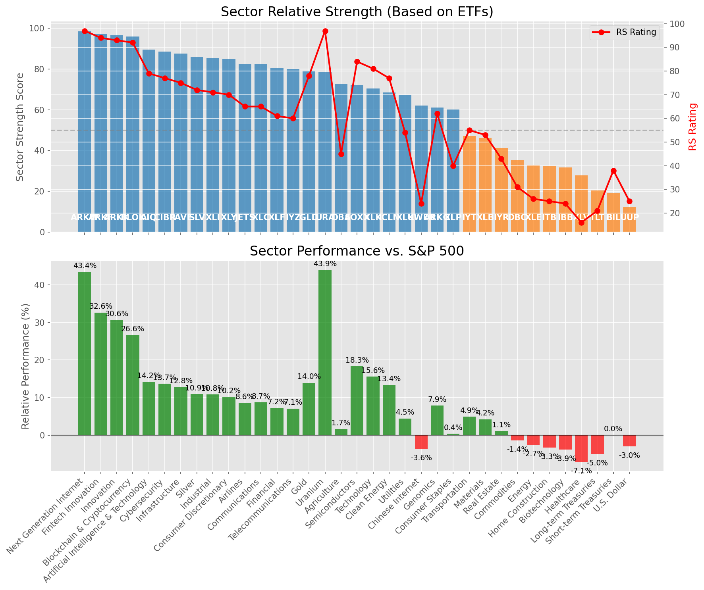

# **Daily Relative Strength Report**

**Date:** 2025-06-10

## **Market Valuation (Buffett Indicator)**

| Metric | Value |
|--------|-------|
| **Market Valuation** | **Overvalued** |
| **Current Ratio** | 9.87 |
| **Historical Mean** | 9.34 |
| **Standard Deviation** | 0.45 |
| **Z-Score (StdDev from Mean)** | 1.13 |
| **Total Market Cap** | $295.95 trillion |
| **GDP** | $29.98 trillion |

## **Market Insights**

### **Market is Overvalued**

The market appears to be trading above historical average valuations. While not at extreme levels, this suggests more modest future returns may be expected. Investors should:

- Focus on companies with reasonable valuations relative to their growth
- Be more selective with new positions
- Look for stocks showing relative strength within their sectors
- Consider trimming positions in extremely overvalued names

Historically, periods of mild overvaluation can persist for extended periods, but returns tend to be below average.

### **Buffett Indicator Overview**

The Buffett Indicator (Total Market Cap / GDP) is a measure of the stock market's valuation relative to the size of the economy. It is named after Warren Buffett, who described it as "probably the best single measure of where valuations stand at any given moment."

- **Values above +2 standard deviations:** Market significantly overvalued
- **Values above +1 standard deviation:** Market overvalued
- **Values between -1 and +1 standard deviations:** Market fairly valued
- **Values below -1 standard deviation:** Market undervalued
- **Values below -2 standard deviations:** Market significantly undervalued

---

## **Sector Relative Strength**

Based on William O'Neil's Relative Strength Methodology

| ETF | Strength | RS Rating | Performance | Above Key MAs | Trend | Sector |
|-----|----------|-----------|-------------|--------------|-------|--------|
| [ARKW](https://www.tradingview.com/chart/?symbol=ARKW) | 98.5 | 97.0 | 42.78% | 10d ✓, 50d ✓, 200d ✓ | ↗️ | Next Generation Internet |
| [ARKF](https://www.tradingview.com/chart/?symbol=ARKF) | 97.0 | 94.0 | 32.10% | 10d ✓, 50d ✓, 200d ✓ | ↗️ | Fintech Innovation |
| [ARKK](https://www.tradingview.com/chart/?symbol=ARKK) | 96.5 | 93.0 | 30.05% | 10d ✓, 50d ✓, 200d ✓ | ↗️ | Innovation |
| [BLOK](https://www.tradingview.com/chart/?symbol=BLOK) | 96.0 | 92.0 | 25.90% | 10d ✓, 50d ✓, 200d ✓ | ↗️ | Blockchain & Cryptocurrency |
| [AIQ](https://www.tradingview.com/chart/?symbol=AIQ) | 89.0 | 78.0 | 13.79% | 10d ✓, 50d ✓, 200d ✓ | ↗️ | Artificial Intelligence & Technology |
| [PAVE](https://www.tradingview.com/chart/?symbol=PAVE) | 87.5 | 75.0 | 12.45% | 10d ✓, 50d ✓, 200d ✓ | ↗️ | Infrastructure |
| [SLV](https://www.tradingview.com/chart/?symbol=SLV) | 86.0 | 72.0 | 10.75% | 10d ✓, 50d ✓, 200d ✓ | ↗️ | Silver |
| [XLI](https://www.tradingview.com/chart/?symbol=XLI) | 85.5 | 71.0 | 10.58% | 10d ✓, 50d ✓, 200d ✓ | ↗️ | Industrial |
| [XLY](https://www.tradingview.com/chart/?symbol=XLY) | 84.5 | 69.0 | 9.55% | 10d ✓, 50d ✓, 200d ✓ | ↗️ | Consumer Discretionary |
| [XLC](https://www.tradingview.com/chart/?symbol=XLC) | 82.5 | 65.0 | 8.29% | 10d ✓, 50d ✓, 200d ✓ | ↗️ | Communications |
| [JETS](https://www.tradingview.com/chart/?symbol=JETS) | 81.5 | 63.0 | 7.90% | 10d ✓, 50d ✓, 200d ✓ | ↗️ | Airlines |
| [XLF](https://www.tradingview.com/chart/?symbol=XLF) | 80.5 | 61.0 | 6.97% | 10d ✓, 50d ✓, 200d ✓ | ↗️ | Financial |
| [CIBR](https://www.tradingview.com/chart/?symbol=CIBR) | 79.1 | 78.0 | 13.47% | 10d ✗, 50d ✓, 200d ✓ | ↗️ | Cybersecurity |
| [GLD](https://www.tradingview.com/chart/?symbol=GLD) | 79.1 | 78.0 | 13.73% | 10d ✗, 50d ✓, 200d ✓ | ↗️ | Gold |
| [URA](https://www.tradingview.com/chart/?symbol=URA) | 78.5 | 97.0 | 43.09% | 10d ✓, 50d ✓, 200d ✓ | ↘️ | Uranium |
| [IYZ](https://www.tradingview.com/chart/?symbol=IYZ) | 76.0 | 52.0 | 3.80% | 10d ✓, 50d ✓, 200d ✓ | ↗️ | Telecommunications |
| [DBA](https://www.tradingview.com/chart/?symbol=DBA) | 72.5 | 45.0 | 1.63% | 10d ✓, 50d ✓, 200d ✓ | ↗️ | Agriculture |
| [SOXX](https://www.tradingview.com/chart/?symbol=SOXX) | 72.0 | 84.0 | 17.81% | 10d ✓, 50d ✓, 200d ✓ | ↘️ | Semiconductors |
| [XLK](https://www.tradingview.com/chart/?symbol=XLK) | 70.5 | 81.0 | 15.03% | 10d ✓, 50d ✓, 200d ✓ | ↘️ | Technology |
| [ICLN](https://www.tradingview.com/chart/?symbol=ICLN) | 68.0 | 76.0 | 13.04% | 10d ✓, 50d ✓, 200d ✓ | ↘️ | Clean Energy |
| [XLU](https://www.tradingview.com/chart/?symbol=XLU) | 66.6 | 53.0 | 4.04% | 10d ✗, 50d ✓, 200d ✓ | ↗️ | Utilities |
| [KWEB](https://www.tradingview.com/chart/?symbol=KWEB) | 62.0 | 24.0 | -3.83% | 10d ✓, 50d ✓, 200d ✓ | ↗️ | Chinese Internet |
| [ARKG](https://www.tradingview.com/chart/?symbol=ARKG) | 61.5 | 63.0 | 7.80% | 10d ✓, 50d ✓, 200d ✓ | ↘️ | Genomics |
| [XLP](https://www.tradingview.com/chart/?symbol=XLP) | 60.6 | 41.0 | 0.31% | 10d ✗, 50d ✓, 200d ✓ | ↗️ | Consumer Staples |
| [IYT](https://www.tradingview.com/chart/?symbol=IYT) | 47.3 | 55.0 | 4.64% | 10d ✓, 50d ✓, 200d ✗ | ↘️ | Transportation |
| [XLB](https://www.tradingview.com/chart/?symbol=XLB) | 45.8 | 52.0 | 3.86% | 10d ✓, 50d ✓, 200d ✗ | ↘️ | Materials |
| [IYR](https://www.tradingview.com/chart/?symbol=IYR) | 40.8 | 42.0 | 0.75% | 10d ✓, 50d ✓, 200d ✗ | ↘️ | Real Estate |
| [DBC](https://www.tradingview.com/chart/?symbol=DBC) | 35.8 | 32.0 | -1.30% | 10d ✓, 50d ✓, 200d ✗ | ↘️ | Commodities |
| [XLE](https://www.tradingview.com/chart/?symbol=XLE) | 33.3 | 27.0 | -2.63% | 10d ✓, 50d ✓, 200d ✗ | ↘️ | Energy |
| [ITB](https://www.tradingview.com/chart/?symbol=ITB) | 31.8 | 24.0 | -3.80% | 10d ✓, 50d ✓, 200d ✗ | ↘️ | Home Construction |
| [IBB](https://www.tradingview.com/chart/?symbol=IBB) | 31.8 | 24.0 | -3.79% | 10d ✓, 50d ✓, 200d ✗ | ↘️ | Biotechnology |
| [UUP](https://www.tradingview.com/chart/?symbol=UUP) | 22.9 | 26.0 | -2.92% | 10d ✓, 50d ✗, 200d ✗ | ↘️ | U.S. Dollar |
| [BIL](https://www.tradingview.com/chart/?symbol=BIL) | 19.5 | 39.0 | -0.01% | 10d ✗, 50d ✗, 200d ✗ | ↘️ | Short-term Treasuries |
| [XLV](https://www.tradingview.com/chart/?symbol=XLV) | 18.4 | 17.0 | -7.15% | 10d ✓, 50d ✗, 200d ✗ | ↘️ | Healthcare |
| [TLT](https://www.tradingview.com/chart/?symbol=TLT) | 10.5 | 21.0 | -5.23% | 10d ✗, 50d ✗, 200d ✗ | ↘️ | Long-term Treasuries |

### **Sector ETF Performance Interpretation**

This table shows the relative strength metrics for different market sectors based on their representative ETFs:

- **ETF**: The ETF used to measure sector performance (click for chart)
- **Strength**: Overall sector strength score (0-100) combining multiple factors
- **RS Rating**: O'Neil RS rating of the sector ETF
- **Performance**: Performance of the sector ETF relative to SPY
- **Above Key MAs**: Whether the ETF is trading above its 10, 50, and 200-day moving averages
- **Trend**: Whether the sector is in an uptrend (↗️) or downtrend (↘️)

### **Current Sector Leadership**

The current market leadership is coming from the following sectors: **Next Generation Internet, Fintech Innovation, Innovation**.

The **Next Generation Internet** sector (represented by **ARKW**) is showing particularly strong relative strength with an RS rating of 97.0 and performance of 42.78% vs. the S&P 500. This sector is trading above its 10-day, 50-day, 200-day moving average(s). Investors should consider focusing on high RS stocks within these leading sectors for potential outperformance.

---

## **Buy Recommendations**

The following 47 stocks show exceptional relative strength:

| RS Rating | Buy Score | Current Price | Chart | Name | Ticker |
|-----------|-----------|---------------|-------|------|--------|
| 100 | 100 | $143.50 | [Chart](https://www.tradingview.com/chart/?symbol=LEU) | Centrus Energy Corp. | LEU |
| 100 | 100 | $132.10 | [Chart](https://www.tradingview.com/chart/?symbol=PLTR) | Palantir Technologies Inc. Class A Common Stock | PLTR |
| 100 | 100 | $124.95 | [Chart](https://www.tradingview.com/chart/?symbol=SEZL) | Sezzle Inc. Common Stock | SEZL |
| 100 | 100 | $93.45 | [Chart](https://www.tradingview.com/chart/?symbol=RBLX) | Roblox Corporation | RBLX |
| 100 | 100 | $72.42 | [Chart](https://www.tradingview.com/chart/?symbol=HOOD) | Robinhood Markets, Inc. Class A Common Stock | HOOD |
| 100 | 100 | $219.01 | [Chart](https://www.tradingview.com/chart/?symbol=DAVE) | Dave Inc. Class A Common Stock | DAVE |
| 100 | 100 | $337.25 | [Chart](https://www.tradingview.com/chart/?symbol=CVNA) | Carvana Co. | CVNA |
| 99 | 100 | $42.59 | [Chart](https://www.tradingview.com/chart/?symbol=FARO) | Faro Technologies Inc | FARO |
| 98 | 100 | $250.98 | [Chart](https://www.tradingview.com/chart/?symbol=GWRE) | GUIDEWIRE SOFTWARE, INC. | GWRE |
| 98 | 100 | $44.63 | [Chart](https://www.tradingview.com/chart/?symbol=REVG) | REV Group, Inc. | REVG |
| 97 | 100 | $19.95 | [Chart](https://www.tradingview.com/chart/?symbol=MIR) | Mirion Technologies, Inc. | MIR |
| 96 | 100 | $21.09 | [Chart](https://www.tradingview.com/chart/?symbol=MAG) | MAG Silver Corp. | MAG |
| 95 | 100 | $39.36 | [Chart](https://www.tradingview.com/chart/?symbol=KTOS) | Kratos Defense & Security Solutions, Inc. | KTOS |
| 95 | 100 | $134.66 | [Chart](https://www.tradingview.com/chart/?symbol=COOP) | Mr. Cooper Group Inc. Common Stock | COOP |
| 94 | 100 | $68.40 | [Chart](https://www.tradingview.com/chart/?symbol=GDXJ) | VanEck Junior Gold Miners ETF | GDXJ |
| 94 | 100 | $44.32 | [Chart](https://www.tradingview.com/chart/?symbol=ARKF) | ARK Fintech Innovation ETF | ARKF |
| 94 | 100 | $61.79 | [Chart](https://www.tradingview.com/chart/?symbol=IBIT) | iShares Bitcoin Trust ETF | IBIT |
| 94 | 100 | $23.91 | [Chart](https://www.tradingview.com/chart/?symbol=TFPM) | Triple Flag Precious Metals Corp. | TFPM |
| 93 | 100 | $491.02 | [Chart](https://www.tradingview.com/chart/?symbol=CASY) | Casey's General Stores Inc | CASY |
| 93 | 100 | $47.71 | [Chart](https://www.tradingview.com/chart/?symbol=SIL) | Global X Silver Miners ETF (NEW) | SIL |
| 93 | 100 | $30.25 | [Chart](https://www.tradingview.com/chart/?symbol=NTGR) | NETGEAR, Inc. | NTGR |
| 91 | 100 | $26.34 | [Chart](https://www.tradingview.com/chart/?symbol=CPRX) | Catalyst Pharmaceutical  Inc. | CPRX |
| 90 | 100 | $54.28 | [Chart](https://www.tradingview.com/chart/?symbol=AKRO) | Akero Therapeutics, Inc. Common Stock | AKRO |
| 89 | 100 | $284.52 | [Chart](https://www.tradingview.com/chart/?symbol=VEEV) | Veeva Systems Inc. | VEEV |
| 88 | 100 | $79.08 | [Chart](https://www.tradingview.com/chart/?symbol=EBAY) | eBay Inc | EBAY |
| 88 | 100 | $57.09 | [Chart](https://www.tradingview.com/chart/?symbol=CAKE) | Cheesecake Factory (The) | CAKE |
| 88 | 100 | $35.12 | [Chart](https://www.tradingview.com/chart/?symbol=AHR) | American Healthcare REIT, Inc. | AHR |
| 86 | 100 | $23.99 | [Chart](https://www.tradingview.com/chart/?symbol=SRAD) | Sportradar Group AG Class A Ordinary Shares | SRAD |
| 87 | 99 | $27.92 | [Chart](https://www.tradingview.com/chart/?symbol=DB) | Deutsche Bank Aktiengesellschaft | DB |
| 86 | 97 | $215.97 | [Chart](https://www.tradingview.com/chart/?symbol=BAP) | Credicorp LTD | BAP |
| 85 | 97 | $393.45 | [Chart](https://www.tradingview.com/chart/?symbol=CYBR) | CyberArk Software Ltd. | CYBR |
| 86 | 96 | $64.83 | [Chart](https://www.tradingview.com/chart/?symbol=SLF) | Sun Life Financial Inc. | SLF |
| 84 | 96 | $142.76 | [Chart](https://www.tradingview.com/chart/?symbol=LYV) | Live Nation Entertainment Inc. | LYV |
| 83 | 96 | $276.05 | [Chart](https://www.tradingview.com/chart/?symbol=VRSN) | VeriSign Inc | VRSN |
| 86 | 95 | $87.91 | [Chart](https://www.tradingview.com/chart/?symbol=SANM) | Sanmina  Corp | SANM |
| 85 | 95 | $85.68 | [Chart](https://www.tradingview.com/chart/?symbol=NDAQ) | Nasdaq, Inc. Common Stock | NDAQ |
| 82 | 95 | $42.76 | [Chart](https://www.tradingview.com/chart/?symbol=EXEL) | Exelixis Inc | EXEL |
| 85 | 94 | $28.68 | [Chart](https://www.tradingview.com/chart/?symbol=TGS) | Transportadora de Gas del Sur S.A. ADS | TGS |
| 84 | 94 | $164.10 | [Chart](https://www.tradingview.com/chart/?symbol=NTRA) | Natera, Inc. Common Stock | NTRA |
| 84 | 94 | $108.94 | [Chart](https://www.tradingview.com/chart/?symbol=SHOP) | Shopify Inc. Class A subordinate voting shares | SHOP |
| 83 | 94 | $43.49 | [Chart](https://www.tradingview.com/chart/?symbol=EWP) | iShares MSCI Spain ETF | EWP |
| 82 | 94 | $47.49 | [Chart](https://www.tradingview.com/chart/?symbol=BTI) | British American Tobacco p.l.c. American Depositary Shares, American Depositary Shares, each representing one Ordinary Share | BTI |
| 81 | 94 | $234.32 | [Chart](https://www.tradingview.com/chart/?symbol=TTWO) | Take-Two Interactive Software Inc | TTWO |
| 84 | 93 | $50.27 | [Chart](https://www.tradingview.com/chart/?symbol=GH) | Guardant Health, Inc. Common Stock | GH |
| 84 | 93 | $24.20 | [Chart](https://www.tradingview.com/chart/?symbol=GFI) | Gold Fields Ltd ADR | GFI |
| 81 | 92 | $98.02 | [Chart](https://www.tradingview.com/chart/?symbol=FWONK) | Liberty Media Corporation Series C Liberty Formula One Common Stock | FWONK |
| 80 | 92 | $75.80 | [Chart](https://www.tradingview.com/chart/?symbol=LLYVK) | Liberty Media Corporation Series C Liberty Live Common Stock | LLYVK |

---

## **Sell Recommendations**

The following 132 stocks show deteriorating relative strength:

| RS Rating | Sell Score | Current Price | Chart | Name | Ticker |
|-----------|------------|---------------|-------|------|--------|
| 1 | 100 | $31.82 | [Chart](https://www.tradingview.com/chart/?symbol=TECS) | Direxion Daily Technology Bear 3x Shares | TECS |
| 1 | 100 | $16.88 | [Chart](https://www.tradingview.com/chart/?symbol=NVDS) | Investment Managers Series Trust II Tradr 1.5X Short NVDA Daily ETF | NVDS |
| 1 | 100 | $13.98 | [Chart](https://www.tradingview.com/chart/?symbol=IART) | Integra LifeSciences Holdings | IART |
| 1 | 100 | $16.86 | [Chart](https://www.tradingview.com/chart/?symbol=BHVN) | Biohaven Ltd. | BHVN |
| 1 | 100 | $10.25 | [Chart](https://www.tradingview.com/chart/?symbol=ZVZZT) | SUPER Montage TEST SYMBOL | ZVZZT |
| 2 | 100 | $12.32 | [Chart](https://www.tradingview.com/chart/?symbol=TZA) | Direxion Daily Small Cap Bear 3x Shares | TZA |
| 2 | 100 | $48.59 | [Chart](https://www.tradingview.com/chart/?symbol=CCOI) | Cogent Communications Holdings, Inc. | CCOI |
| 2 | 100 | $10.28 | [Chart](https://www.tradingview.com/chart/?symbol=WNC) | Wabash National Corp. | WNC |
| 2 | 100 | $27.52 | [Chart](https://www.tradingview.com/chart/?symbol=QID) | ProShares UltraShort QQQ | QID |
| 2 | 100 | $11.25 | [Chart](https://www.tradingview.com/chart/?symbol=SNDX) | Syndax Pharmaceuticals, Inc. | SNDX |
| 3 | 100 | $19.48 | [Chart](https://www.tradingview.com/chart/?symbol=BITI) | ProShares Short Bitcoin ETF | BITI |
| 3 | 100 | $102.73 | [Chart](https://www.tradingview.com/chart/?symbol=GLOB) | GLOBANT S.A. | GLOB |
| 3 | 100 | $34.22 | [Chart](https://www.tradingview.com/chart/?symbol=CYTK) | Cytokinetics Inc. | CYTK |
| 3 | 100 | $22.45 | [Chart](https://www.tradingview.com/chart/?symbol=THS) | Treehouse Foods, Inc. | THS |
| 3 | 100 | $10.47 | [Chart](https://www.tradingview.com/chart/?symbol=SONO) | Sonos, Inc. Common Stock | SONO |
| 3 | 100 | $54.94 | [Chart](https://www.tradingview.com/chart/?symbol=ASGN) | ASGN Incorporated | ASGN |
| 3 | 100 | $136.08 | [Chart](https://www.tradingview.com/chart/?symbol=KRYS) | Krystal Biotech, Inc. Common Stock | KRYS |
| 3 | 100 | $55.34 | [Chart](https://www.tradingview.com/chart/?symbol=SPB) | Spectrum Brands Holdings, Inc. | SPB |
| 3 | 100 | $11.38 | [Chart](https://www.tradingview.com/chart/?symbol=HPK) | HighPeak Energy, Inc. Common Stock | HPK |
| 3 | 100 | $26.02 | [Chart](https://www.tradingview.com/chart/?symbol=CRTO) | Criteo S.A. | CRTO |
| 3 | 100 | $14.50 | [Chart](https://www.tradingview.com/chart/?symbol=INMD) | InMode Ltd. Ordinary Shares | INMD |
| 4 | 100 | $12.88 | [Chart](https://www.tradingview.com/chart/?symbol=ERII) | Energy Recovery, Inc. | ERII |
| 4 | 100 | $21.29 | [Chart](https://www.tradingview.com/chart/?symbol=AMRK) | A-Mark Precious Metals, Inc. | AMRK |
| 4 | 100 | $11.64 | [Chart](https://www.tradingview.com/chart/?symbol=PUBM) | PubMatic, Inc. Class A Common Stock | PUBM |
| 4 | 100 | $111.33 | [Chart](https://www.tradingview.com/chart/?symbol=AMR) | Alpha Metallurgical Resources, Inc. | AMR |
| 4 | 100 | $55.59 | [Chart](https://www.tradingview.com/chart/?symbol=CCS) | CENTURY COMMUNITIES, INC. | CCS |
| 4 | 100 | $136.25 | [Chart](https://www.tradingview.com/chart/?symbol=INSP) | Inspire Medical Systems, Inc. | INSP |
| 4 | 100 | $10.70 | [Chart](https://www.tradingview.com/chart/?symbol=CWK) | Cushman & Wakefield plc Ordinary Shares | CWK |
| 4 | 100 | $26.74 | [Chart](https://www.tradingview.com/chart/?symbol=WMG) | Warner Music Group Corp. Class A Common Stock | WMG |
| 4 | 100 | $33.84 | [Chart](https://www.tradingview.com/chart/?symbol=SQM) | Sociedad Quimica y Minera de Chile SA | SQM |
| 4 | 100 | $18.70 | [Chart](https://www.tradingview.com/chart/?symbol=DNTH) | Dianthus Therapeutics, Inc. Common Stock | DNTH |
| 4 | 100 | $10.73 | [Chart](https://www.tradingview.com/chart/?symbol=PACS) | PACS Group, Inc. | PACS |
| 4 | 100 | $45.68 | [Chart](https://www.tradingview.com/chart/?symbol=LINE) | Lineage, Inc. Common Stock | LINE |
| 5 | 100 | $69.78 | [Chart](https://www.tradingview.com/chart/?symbol=WD) | Walker & Dunlop, Inc. | WD |
| 5 | 100 | $10.62 | [Chart](https://www.tradingview.com/chart/?symbol=JAMF) | Jamf Holding Corp. Common Stock | JAMF |
| 5 | 100 | $100.59 | [Chart](https://www.tradingview.com/chart/?symbol=ONTO) | Onto Innovation Inc. | ONTO |
| 5 | 100 | $22.49 | [Chart](https://www.tradingview.com/chart/?symbol=GPK) | Graphic Packaging Holding Company | GPK |
| 5 | 100 | $10.91 | [Chart](https://www.tradingview.com/chart/?symbol=MBC) | MasterBrand, Inc. | MBC |
| 5 | 100 | $414.11 | [Chart](https://www.tradingview.com/chart/?symbol=TMO) | Thermo Fisher Scientific, Inc. | TMO |
| 5 | 100 | $57.81 | [Chart](https://www.tradingview.com/chart/?symbol=BMRN) | BioMarin Pharmaceuticals Inc | BMRN |
| 6 | 100 | $45.70 | [Chart](https://www.tradingview.com/chart/?symbol=SDOW) | ProShares UltraPro Short Dow 30 | SDOW |
| 6 | 100 | $17.25 | [Chart](https://www.tradingview.com/chart/?symbol=CODI) | Compass Diversified | CODI |
| 6 | 100 | $44.58 | [Chart](https://www.tradingview.com/chart/?symbol=TWM) | ProShares UltraShort Russell2000 | TWM |
| 6 | 100 | $53.87 | [Chart](https://www.tradingview.com/chart/?symbol=SLVM) | Sylvamo Corporation | SLVM |
| 6 | 100 | $39.86 | [Chart](https://www.tradingview.com/chart/?symbol=APOG) | Apogee Enterprises Inc | APOG |
| 7 | 100 | $39.19 | [Chart](https://www.tradingview.com/chart/?symbol=WLY) | John Wiley & Sons, Inc. Class A | WLY |
| 7 | 100 | $134.20 | [Chart](https://www.tradingview.com/chart/?symbol=NSIT) | Insight Enterprises Inc | NSIT |
| 7 | 100 | $11.27 | [Chart](https://www.tradingview.com/chart/?symbol=IMXI) | International Money Express, Inc. | IMXI |
| 8 | 100 | $23.67 | [Chart](https://www.tradingview.com/chart/?symbol=IPG) | The Interpublic Group of Companies, Inc. | IPG |
| 8 | 100 | $17.50 | [Chart](https://www.tradingview.com/chart/?symbol=DOC) | Healthpeak Properties, Inc. | DOC |
| 8 | 100 | $21.54 | [Chart](https://www.tradingview.com/chart/?symbol=KIDS) | OrthoPediatrics Corp. Common Stock | KIDS |
| 9 | 100 | $12.46 | [Chart](https://www.tradingview.com/chart/?symbol=WSR) | Whitestone REIT | WSR |
| 9 | 100 | $25.28 | [Chart](https://www.tradingview.com/chart/?symbol=ASTH) | Astrana Health Inc. Common Stock | ASTH |
| 9 | 100 | $54.71 | [Chart](https://www.tradingview.com/chart/?symbol=GIS) | General Mills, Inc. | GIS |
| 10 | 100 | $15.11 | [Chart](https://www.tradingview.com/chart/?symbol=IGT) | International Game Technology PLC | IGT |
| 11 | 100 | $88.65 | [Chart](https://www.tradingview.com/chart/?symbol=BCC) | Boise Cascade Company | BCC |
| 11 | 100 | $10.13 | [Chart](https://www.tradingview.com/chart/?symbol=LBTYK) | Liberty Global Ltd. Class C Common Shares | LBTYK |
| 12 | 100 | $10.62 | [Chart](https://www.tradingview.com/chart/?symbol=CARS) | Cars.com Inc. Common Stock | CARS |
| 12 | 100 | $125.06 | [Chart](https://www.tradingview.com/chart/?symbol=TFX) | Teleflex Incorporated | TFX |
| 13 | 100 | $15.41 | [Chart](https://www.tradingview.com/chart/?symbol=SEM) | SELECT MEDICAL HOLDINGS CORP | SEM |
| 13 | 100 | $26.50 | [Chart](https://www.tradingview.com/chart/?symbol=JANX) | Janux Therapeutics, Inc. Common Stock | JANX |
| 7 | 99 | $10.91 | [Chart](https://www.tradingview.com/chart/?symbol=NEWT) | NewtekOne, Inc. Common Stock | NEWT |
| 9 | 99 | $23.99 | [Chart](https://www.tradingview.com/chart/?symbol=RYN) | Rayonier Inc. | RYN |
| 10 | 99 | $94.55 | [Chart](https://www.tradingview.com/chart/?symbol=ZBH) | Zimmer Biomet Holdings, Inc. | ZBH |
| 11 | 99 | $18.56 | [Chart](https://www.tradingview.com/chart/?symbol=PLAB) | Photronics Inc | PLAB |
| 8 | 98 | $101.81 | [Chart](https://www.tradingview.com/chart/?symbol=PDD) | PDD Holdings Inc. American Depositary Shares | PDD |
| 9 | 98 | $34.15 | [Chart](https://www.tradingview.com/chart/?symbol=TWST) | Twist Bioscience Corporation Common Stock | TWST |
| 10 | 98 | $449.32 | [Chart](https://www.tradingview.com/chart/?symbol=WSO) | Watsco, Inc. | WSO |
| 11 | 98 | $76.98 | [Chart](https://www.tradingview.com/chart/?symbol=CNS) | Cohen & Steers Inc. | CNS |
| 13 | 98 | $42.63 | [Chart](https://www.tradingview.com/chart/?symbol=PRKS) | United Parks & Resorts Inc. | PRKS |
| 19 | 98 | $10.88 | [Chart](https://www.tradingview.com/chart/?symbol=LBTYA) | Liberty Global Ltd. Class A Common Shares | LBTYA |
| 10 | 97 | $99.36 | [Chart](https://www.tradingview.com/chart/?symbol=CHD) | Church & Dwight Co., Inc. | CHD |
| 10 | 97 | $304.88 | [Chart](https://www.tradingview.com/chart/?symbol=POOL) | Pool Corporation | POOL |
| 12 | 97 | $64.12 | [Chart](https://www.tradingview.com/chart/?symbol=ZROZ) | PIMCO 25+ Year Zero Coupon U.S. Treasury Index Exchange-Traded Fund | ZROZ |
| 11 | 96 | $10.96 | [Chart](https://www.tradingview.com/chart/?symbol=SD) | SandRidge Energy, Inc. | SD |
| 12 | 96 | $14.78 | [Chart](https://www.tradingview.com/chart/?symbol=HR) | Healthcare Realty Trust Incorporated | HR |
| 17 | 96 | $19.58 | [Chart](https://www.tradingview.com/chart/?symbol=HVT) | Haverty Furniture Companies, Inc. | HVT |
| 8 | 95 | $87.28 | [Chart](https://www.tradingview.com/chart/?symbol=FELE) | Franklin Electric Co Inc | FELE |
| 10 | 95 | $12.67 | [Chart](https://www.tradingview.com/chart/?symbol=PMT) | PennyMac Mortgage Investment Trust | PMT |
| 18 | 95 | $10.41 | [Chart](https://www.tradingview.com/chart/?symbol=MYI) | BLACKROCK MUNIYIELD QUALITY FUND III, INC. | MYI |
| 19 | 95 | $15.27 | [Chart](https://www.tradingview.com/chart/?symbol=VRE) | Veris Residential, Inc. | VRE |
| 16 | 94 | $77.39 | [Chart](https://www.tradingview.com/chart/?symbol=EXPO) | Exponent Inc | EXPO |
| 14 | 93 | $18.55 | [Chart](https://www.tradingview.com/chart/?symbol=EGBN) | Eagle Bancorp Inc | EGBN |
| 16 | 93 | $13.79 | [Chart](https://www.tradingview.com/chart/?symbol=BSM) | Black Stone Minerals, L.P. | BSM |
| 8 | 92 | $127.32 | [Chart](https://www.tradingview.com/chart/?symbol=CLX) | Clorox Company | CLX |
| 8 | 92 | $61.61 | [Chart](https://www.tradingview.com/chart/?symbol=STC) | Stewart Information Services Corporation | STC |
| 17 | 92 | $63.16 | [Chart](https://www.tradingview.com/chart/?symbol=ELS) | Equity Lifestyle Properties, Inc. | ELS |
| 18 | 92 | $11.85 | [Chart](https://www.tradingview.com/chart/?symbol=NVG) | Nuveen AMT-Free Municipal Credit Income Fund | NVG |
| 21 | 92 | $100.60 | [Chart](https://www.tradingview.com/chart/?symbol=UFPI) | UFP Industries, Inc. Common Stock | UFPI |
| 11 | 91 | $17.61 | [Chart](https://www.tradingview.com/chart/?symbol=ZTO) | ZTO Express (Cayman) Inc. American Depositary Shares, each representing one Class A ordinary share | ZTO |
| 13 | 91 | $227.40 | [Chart](https://www.tradingview.com/chart/?symbol=BIO) | Bio-Rad Laboratories, Inc.Class A | BIO |
| 14 | 91 | $201.51 | [Chart](https://www.tradingview.com/chart/?symbol=AAPL) | Apple Inc. | AAPL |
| 16 | 91 | $452.37 | [Chart](https://www.tradingview.com/chart/?symbol=VRTX) | Vertex Pharmaceuticals Inc | VRTX |
| 21 | 91 | $55.64 | [Chart](https://www.tradingview.com/chart/?symbol=CNC) | Centene Corporation | CNC |
| 14 | 90 | $295.54 | [Chart](https://www.tradingview.com/chart/?symbol=MOH) | Molina Healthcare, Inc. | MOH |
| 17 | 90 | $232.99 | [Chart](https://www.tradingview.com/chart/?symbol=HUM) | Humana Inc. | HUM |
| 14 | 89 | $30.98 | [Chart](https://www.tradingview.com/chart/?symbol=AXTA) | Axalta Coating Systems Ltd. | AXTA |
| 16 | 89 | $76.73 | [Chart](https://www.tradingview.com/chart/?symbol=PFG) | Principal Financial Group, Inc. | PFG |
| 18 | 89 | $41.30 | [Chart](https://www.tradingview.com/chart/?symbol=POR) | Portland General Electric Company | POR |
| 20 | 89 | $13.41 | [Chart](https://www.tradingview.com/chart/?symbol=ARDT) | Ardent Health, Inc. | ARDT |
| 22 | 89 | $13.76 | [Chart](https://www.tradingview.com/chart/?symbol=DOLE) | Dole plc | DOLE |
| 15 | 88 | $15.96 | [Chart](https://www.tradingview.com/chart/?symbol=QNST) | QuinStreet, Inc. | QNST |
| 20 | 87 | $50.91 | [Chart](https://www.tradingview.com/chart/?symbol=TSCO) | Tractor Supply Co | TSCO |
| 20 | 87 | $10.84 | [Chart](https://www.tradingview.com/chart/?symbol=NEA) | Nuveen AMT-Free Quality Municipal Income Fund | NEA |
| 18 | 86 | $10.45 | [Chart](https://www.tradingview.com/chart/?symbol=PFLT) | PennantPark Floating Rate Capital Ltd. | PFLT |
| 15 | 85 | $39.62 | [Chart](https://www.tradingview.com/chart/?symbol=LKQ) | LKQ Corporation | LKQ |
| 21 | 85 | $85.67 | [Chart](https://www.tradingview.com/chart/?symbol=TLT) | iShares 20+ Year Treasury Bond ETF | TLT |
| 22 | 85 | $15.70 | [Chart](https://www.tradingview.com/chart/?symbol=BBN) | BlackRock Taxable Municipal Bond Trust | BBN |
| 25 | 85 | $10.14 | [Chart](https://www.tradingview.com/chart/?symbol=URGN) | UroGen Pharma Ltd. Ordinary Shares | URGN |
| 26 | 85 | $84.78 | [Chart](https://www.tradingview.com/chart/?symbol=BCO) | The Brink's Company | BCO |
| 21 | 84 | $139.07 | [Chart](https://www.tradingview.com/chart/?symbol=DVA) | DaVita Inc. | DVA |
| 22 | 84 | $11.22 | [Chart](https://www.tradingview.com/chart/?symbol=NAD) | Nuveen Quality Municipal Income Fund | NAD |
| 33 | 84 | $46.76 | [Chart](https://www.tradingview.com/chart/?symbol=EAGG) | iShares ESG Aware U.S. Aggregate Bond ETF | EAGG |
| 19 | 83 | $162.78 | [Chart](https://www.tradingview.com/chart/?symbol=PG) | Procter & Gamble Company | PG |
| 20 | 82 | $38.21 | [Chart](https://www.tradingview.com/chart/?symbol=BWIN) | The Baldwin Insurance Group, Inc. Class A Common Stock | BWIN |
| 29 | 82 | $78.45 | [Chart](https://www.tradingview.com/chart/?symbol=AWR) | American States Water Company | AWR |
| 28 | 80 | $20.98 | [Chart](https://www.tradingview.com/chart/?symbol=LGOV) | First Trust Long Duration Opportunities ETF | LGOV |
| 28 | 80 | $37.45 | [Chart](https://www.tradingview.com/chart/?symbol=PBA) | PEMBINA PIPELINE CORPORATION | PBA |
| 24 | 78 | $203.51 | [Chart](https://www.tradingview.com/chart/?symbol=EXP) | Eagle Materials, Inc. | EXP |
| 30 | 78 | $35.12 | [Chart](https://www.tradingview.com/chart/?symbol=LTC) | LTC Properties, Inc. | LTC |
| 31 | 77 | $49.48 | [Chart](https://www.tradingview.com/chart/?symbol=MTBA) | Simplify MBS ETF | MTBA |
| 36 | 76 | $89.81 | [Chart](https://www.tradingview.com/chart/?symbol=ACGL) | Arch Capital Group Ltd | ACGL |
| 26 | 75 | $27.43 | [Chart](https://www.tradingview.com/chart/?symbol=UUP) | Invesco DB US Dollar Index Bullish Fund | UUP |
| 26 | 75 | $10.83 | [Chart](https://www.tradingview.com/chart/?symbol=LOCO) | El Pollo Loco Holdings, Inc. | LOCO |
| 34 | 75 | $47.01 | [Chart](https://www.tradingview.com/chart/?symbol=CWT) | California Water Service | CWT |
| 33 | 74 | $21.17 | [Chart](https://www.tradingview.com/chart/?symbol=FLCB) | Franklin U.S. Core Bond ETF | FLCB |
| 32 | 71 | $33.46 | [Chart](https://www.tradingview.com/chart/?symbol=INVH) | Invitation Homes Inc. Common Stock | INVH |
| 34 | 70 | $72.44 | [Chart](https://www.tradingview.com/chart/?symbol=BND) | Vanguard Total Bond Market | BND |
| 34 | 69 | $45.48 | [Chart](https://www.tradingview.com/chart/?symbol=IUSB) | iShares Core Total USD Bond Market ETF | IUSB |
| 34 | 67 | $25.18 | [Chart](https://www.tradingview.com/chart/?symbol=SPAB) | SPDR Portfolio Aggregate Bond ETF | SPAB |
| 37 | 64 | $100.28 | [Chart](https://www.tradingview.com/chart/?symbol=MINT) | PIMCO Enhanced Short Maturity Active Exchange-Traded Fund | MINT |
| 38 | 62 | $110.16 | [Chart](https://www.tradingview.com/chart/?symbol=SHV) | iShares Short Treasury Bond ETF | SHV |

## **Methodology**

This report uses William O'Neil's relative strength methodology from Investors Business Daily:

* **RS Rating**: Percentile rank of stock's performance vs. S&P 500 over the past 63 trading days (1-99 scale)
* **Buy Criteria**: RS Rating >= 80, price above 50-day MA, strong uptrend, increasing volume
* **Sell Criteria**: RS Rating < 40, price below 50-day MA, downtrend, decreasing volume

### **O'Neil's Key Principles**

1. **Focus on relative performance** - stocks outperforming the market
2. **Price trend confirmation** - stock must be in an uptrend
3. **Volume confirmation** - strong volume supports price moves
4. **Moving average validation** - price above key moving averages
5. **Market leaders only** - concentrate on top-performing stocks

*Report generated automatically after market close*