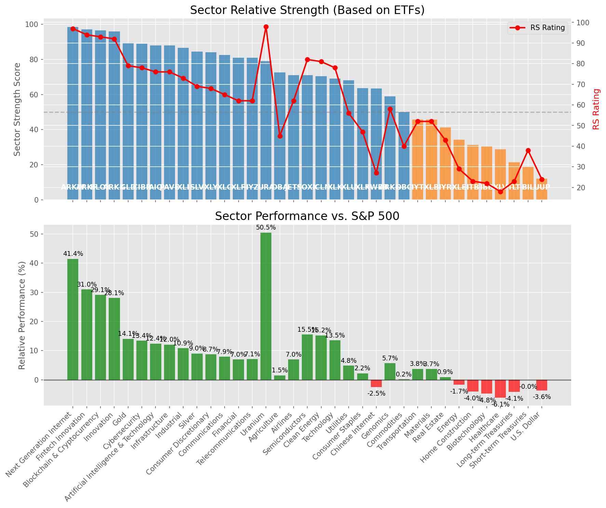

# **Daily Relative Strength Report**

**Date:** 2025-06-11

## **Market Valuation (Buffett Indicator)**

| Metric | Value |
|--------|-------|
| **Market Valuation** | **Overvalued** |
| **Current Ratio** | 9.93 |
| **Historical Mean** | 9.34 |
| **Standard Deviation** | 0.45 |
| **Z-Score (StdDev from Mean)** | 1.26 |
| **Total Market Cap** | $297.65 trillion |
| **GDP** | $29.98 trillion |

## **Market Insights**

### **Market is Overvalued**

The market appears to be trading above historical average valuations. While not at extreme levels, this suggests more modest future returns may be expected. Investors should:

- Focus on companies with reasonable valuations relative to their growth
- Be more selective with new positions
- Look for stocks showing relative strength within their sectors
- Consider trimming positions in extremely overvalued names

Historically, periods of mild overvaluation can persist for extended periods, but returns tend to be below average.

### **Buffett Indicator Overview**

The Buffett Indicator (Total Market Cap / GDP) is a measure of the stock market's valuation relative to the size of the economy. It is named after Warren Buffett, who described it as "probably the best single measure of where valuations stand at any given moment."

- **Values above +2 standard deviations:** Market significantly overvalued
- **Values above +1 standard deviation:** Market overvalued
- **Values between -1 and +1 standard deviations:** Market fairly valued
- **Values below -1 standard deviation:** Market undervalued
- **Values below -2 standard deviations:** Market significantly undervalued

---

## **Sector Relative Strength**

Based on William O'Neil's Relative Strength Methodology

| ETF | Strength | RS Rating | Performance | Above Key MAs | Trend | Sector |
|-----|----------|-----------|-------------|--------------|-------|--------|
| [ARKW](https://www.tradingview.com/chart/?symbol=ARKW) | 98.5 | 97.0 | 43.41% | 10d ✓, 50d ✓, 200d ✓ | ↗️ | Next Generation Internet |
| [ARKF](https://www.tradingview.com/chart/?symbol=ARKF) | 97.0 | 94.0 | 32.64% | 10d ✓, 50d ✓, 200d ✓ | ↗️ | Fintech Innovation |
| [ARKK](https://www.tradingview.com/chart/?symbol=ARKK) | 96.5 | 93.0 | 28.32% | 10d ✓, 50d ✓, 200d ✓ | ↗️ | Innovation |
| [BLOK](https://www.tradingview.com/chart/?symbol=BLOK) | 96.0 | 92.0 | 26.63% | 10d ✓, 50d ✓, 200d ✓ | ↗️ | Blockchain & Cryptocurrency |
| [AIQ](https://www.tradingview.com/chart/?symbol=AIQ) | 89.5 | 79.0 | 14.22% | 10d ✓, 50d ✓, 200d ✓ | ↗️ | Artificial Intelligence & Technology |
| [CIBR](https://www.tradingview.com/chart/?symbol=CIBR) | 89.0 | 78.0 | 13.67% | 10d ✓, 50d ✓, 200d ✓ | ↗️ | Cybersecurity |
| [PAVE](https://www.tradingview.com/chart/?symbol=PAVE) | 87.0 | 74.0 | 12.23% | 10d ✓, 50d ✓, 200d ✓ | ↗️ | Infrastructure |
| [XLI](https://www.tradingview.com/chart/?symbol=XLI) | 86.0 | 72.0 | 10.67% | 10d ✓, 50d ✓, 200d ✓ | ↗️ | Industrial |
| [JETS](https://www.tradingview.com/chart/?symbol=JETS) | 85.5 | 71.0 | 10.12% | 10d ✓, 50d ✓, 200d ✓ | ↗️ | Airlines |
| [XLY](https://www.tradingview.com/chart/?symbol=XLY) | 85.0 | 70.0 | 9.79% | 10d ✓, 50d ✓, 200d ✓ | ↗️ | Consumer Discretionary |
| [SLV](https://www.tradingview.com/chart/?symbol=SLV) | 83.5 | 67.0 | 8.97% | 10d ✓, 50d ✓, 200d ✓ | ↗️ | Silver |
| [XLC](https://www.tradingview.com/chart/?symbol=XLC) | 82.5 | 65.0 | 8.38% | 10d ✓, 50d ✓, 200d ✓ | ↗️ | Communications |
| [XLF](https://www.tradingview.com/chart/?symbol=XLF) | 80.5 | 61.0 | 7.31% | 10d ✓, 50d ✓, 200d ✓ | ↗️ | Financial |
| [IYZ](https://www.tradingview.com/chart/?symbol=IYZ) | 80.5 | 61.0 | 7.06% | 10d ✓, 50d ✓, 200d ✓ | ↗️ | Telecommunications |
| [URA](https://www.tradingview.com/chart/?symbol=URA) | 79.0 | 98.0 | 49.87% | 10d ✓, 50d ✓, 200d ✓ | ↘️ | Uranium |
| [GLD](https://www.tradingview.com/chart/?symbol=GLD) | 78.6 | 77.0 | 13.59% | 10d ✗, 50d ✓, 200d ✓ | ↗️ | Gold |
| [DBA](https://www.tradingview.com/chart/?symbol=DBA) | 72.0 | 44.0 | 1.65% | 10d ✓, 50d ✓, 200d ✓ | ↗️ | Agriculture |
| [SOXX](https://www.tradingview.com/chart/?symbol=SOXX) | 71.5 | 83.0 | 16.47% | 10d ✓, 50d ✓, 200d ✓ | ↘️ | Semiconductors |
| [ICLN](https://www.tradingview.com/chart/?symbol=ICLN) | 70.5 | 81.0 | 15.36% | 10d ✓, 50d ✓, 200d ✓ | ↘️ | Clean Energy |
| [XLK](https://www.tradingview.com/chart/?symbol=XLK) | 69.5 | 79.0 | 14.11% | 10d ✓, 50d ✓, 200d ✓ | ↘️ | Technology |
| [XLU](https://www.tradingview.com/chart/?symbol=XLU) | 67.6 | 55.0 | 4.92% | 10d ✗, 50d ✓, 200d ✓ | ↗️ | Utilities |
| [KWEB](https://www.tradingview.com/chart/?symbol=KWEB) | 64.5 | 29.0 | -1.92% | 10d ✓, 50d ✓, 200d ✓ | ↗️ | Chinese Internet |
| [XLP](https://www.tradingview.com/chart/?symbol=XLP) | 63.1 | 46.0 | 2.32% | 10d ✗, 50d ✓, 200d ✓ | ↗️ | Consumer Staples |
| [ARKG](https://www.tradingview.com/chart/?symbol=ARKG) | 59.0 | 58.0 | 6.09% | 10d ✓, 50d ✓, 200d ✓ | ↘️ | Genomics |
| [IYT](https://www.tradingview.com/chart/?symbol=IYT) | 46.8 | 54.0 | 4.88% | 10d ✓, 50d ✓, 200d ✗ | ↘️ | Transportation |
| [XLB](https://www.tradingview.com/chart/?symbol=XLB) | 45.3 | 51.0 | 3.92% | 10d ✓, 50d ✓, 200d ✗ | ↘️ | Materials |
| [IYR](https://www.tradingview.com/chart/?symbol=IYR) | 41.8 | 44.0 | 1.71% | 10d ✓, 50d ✓, 200d ✗ | ↘️ | Real Estate |
| [DBC](https://www.tradingview.com/chart/?symbol=DBC) | 35.3 | 31.0 | -1.41% | 10d ✓, 50d ✓, 200d ✗ | ↘️ | Commodities |
| [ITB](https://www.tradingview.com/chart/?symbol=ITB) | 33.3 | 27.0 | -2.50% | 10d ✓, 50d ✓, 200d ✗ | ↘️ | Home Construction |
| [XLE](https://www.tradingview.com/chart/?symbol=XLE) | 32.3 | 25.0 | -3.16% | 10d ✓, 50d ✓, 200d ✗ | ↘️ | Energy |
| [IBB](https://www.tradingview.com/chart/?symbol=IBB) | 31.8 | 24.0 | -3.72% | 10d ✓, 50d ✓, 200d ✗ | ↘️ | Biotechnology |
| [XLV](https://www.tradingview.com/chart/?symbol=XLV) | 28.8 | 18.0 | -5.78% | 10d ✓, 50d ✓, 200d ✗ | ↘️ | Healthcare |
| [BIL](https://www.tradingview.com/chart/?symbol=BIL) | 28.4 | 37.0 | -0.01% | 10d ✓, 50d ✗, 200d ✗ | ↘️ | Short-term Treasuries |
| [TLT](https://www.tradingview.com/chart/?symbol=TLT) | 20.9 | 22.0 | -4.57% | 10d ✓, 50d ✗, 200d ✗ | ↘️ | Long-term Treasuries |
| [UUP](https://www.tradingview.com/chart/?symbol=UUP) | 12.0 | 24.0 | -3.48% | 10d ✗, 50d ✗, 200d ✗ | ↘️ | U.S. Dollar |

### **Sector ETF Performance Interpretation**

This table shows the relative strength metrics for different market sectors based on their representative ETFs:

- **ETF**: The ETF used to measure sector performance (click for chart)
- **Strength**: Overall sector strength score (0-100) combining multiple factors
- **RS Rating**: O'Neil RS rating of the sector ETF
- **Performance**: Performance of the sector ETF relative to SPY
- **Above Key MAs**: Whether the ETF is trading above its 10, 50, and 200-day moving averages
- **Trend**: Whether the sector is in an uptrend (↗️) or downtrend (↘️)

### **Current Sector Leadership**

The current market leadership is coming from the following sectors: **Next Generation Internet, Fintech Innovation, Innovation**.

The **Next Generation Internet** sector (represented by **ARKW**) is showing particularly strong relative strength with an RS rating of 97.0 and performance of 43.41% vs. the S&P 500. This sector is trading above its 10-day, 50-day, 200-day moving average(s). Investors should consider focusing on high RS stocks within these leading sectors for potential outperformance.

---

## **Buy Recommendations**

The following 51 stocks show exceptional relative strength:

| RS Rating | Buy Score | Current Price | Chart | Name | Ticker |
|-----------|-----------|---------------|-------|------|--------|
| 100 | 100 | $224.58 | [Chart](https://www.tradingview.com/chart/?symbol=DAVE) | Dave Inc. Class A Common Stock | DAVE |
| 100 | 100 | $73.16 | [Chart](https://www.tradingview.com/chart/?symbol=HOOD) | Robinhood Markets, Inc. Class A Common Stock | HOOD |
| 100 | 100 | $129.10 | [Chart](https://www.tradingview.com/chart/?symbol=SEZL) | Sezzle Inc. Common Stock | SEZL |
| 100 | 100 | $161.31 | [Chart](https://www.tradingview.com/chart/?symbol=LEU) | Centrus Energy Corp. | LEU |
| 100 | 100 | $55.16 | [Chart](https://www.tradingview.com/chart/?symbol=HIMS) | Hims & Hers Health, Inc. | HIMS |
| 100 | 100 | $95.86 | [Chart](https://www.tradingview.com/chart/?symbol=RBLX) | Roblox Corporation | RBLX |
| 100 | 100 | $335.76 | [Chart](https://www.tradingview.com/chart/?symbol=CVNA) | Carvana Co. | CVNA |
| 99 | 100 | $135.04 | [Chart](https://www.tradingview.com/chart/?symbol=PLTR) | Palantir Technologies Inc. Class A Common Stock | PLTR |
| 98 | 100 | $44.90 | [Chart](https://www.tradingview.com/chart/?symbol=REVG) | REV Group, Inc. | REVG |
| 98 | 100 | $251.74 | [Chart](https://www.tradingview.com/chart/?symbol=GWRE) | GUIDEWIRE SOFTWARE, INC. | GWRE |
| 98 | 100 | $42.59 | [Chart](https://www.tradingview.com/chart/?symbol=FARO) | Faro Technologies Inc | FARO |
| 97 | 100 | $126.00 | [Chart](https://www.tradingview.com/chart/?symbol=CLS) | Celestica, Inc. | CLS |
| 97 | 100 | $38.27 | [Chart](https://www.tradingview.com/chart/?symbol=AS) | Amer Sports, Inc. | AS |
| 96 | 100 | $138.72 | [Chart](https://www.tradingview.com/chart/?symbol=COOP) | Mr. Cooper Group Inc. Common Stock | COOP |
| 96 | 100 | $20.00 | [Chart](https://www.tradingview.com/chart/?symbol=MIR) | Mirion Technologies, Inc. | MIR |
| 96 | 100 | $274.63 | [Chart](https://www.tradingview.com/chart/?symbol=TLN) | Talen Energy Corporation Common Stock | TLN |
| 95 | 100 | $21.19 | [Chart](https://www.tradingview.com/chart/?symbol=MAG) | MAG Silver Corp. | MAG |
| 95 | 100 | $67.37 | [Chart](https://www.tradingview.com/chart/?symbol=RYTM) | Rhythm Pharmaceuticals, Inc. Common Stock | RYTM |
| 95 | 100 | $48.26 | [Chart](https://www.tradingview.com/chart/?symbol=BBW) | Build-A-Bear Workshop, Inc. | BBW |
| 94 | 100 | $62.55 | [Chart](https://www.tradingview.com/chart/?symbol=IBIT) | iShares Bitcoin Trust ETF | IBIT |
| 94 | 100 | $44.50 | [Chart](https://www.tradingview.com/chart/?symbol=ARKF) | ARK Fintech Innovation ETF | ARKF |
| 94 | 100 | $31.13 | [Chart](https://www.tradingview.com/chart/?symbol=HODL) | VanEck Bitcoin ETF | HODL |
| 94 | 100 | $23.83 | [Chart](https://www.tradingview.com/chart/?symbol=TFPM) | Triple Flag Precious Metals Corp. | TFPM |
| 93 | 100 | $68.86 | [Chart](https://www.tradingview.com/chart/?symbol=GDXJ) | VanEck Junior Gold Miners ETF | GDXJ |
| 93 | 100 | $490.20 | [Chart](https://www.tradingview.com/chart/?symbol=CASY) | Casey's General Stores Inc | CASY |
| 92 | 100 | $132.55 | [Chart](https://www.tradingview.com/chart/?symbol=NTES) | NetEase, inc. | NTES |
| 92 | 100 | $30.80 | [Chart](https://www.tradingview.com/chart/?symbol=NTGR) | NETGEAR, Inc. | NTGR |
| 91 | 100 | $35.85 | [Chart](https://www.tradingview.com/chart/?symbol=AHR) | American Healthcare REIT, Inc. | AHR |
| 90 | 100 | $26.11 | [Chart](https://www.tradingview.com/chart/?symbol=CPRX) | Catalyst Pharmaceutical  Inc. | CPRX |
| 90 | 100 | $187.16 | [Chart](https://www.tradingview.com/chart/?symbol=CVLT) | Commault Systems, Inc. | CVLT |
| 89 | 100 | $284.52 | [Chart](https://www.tradingview.com/chart/?symbol=VEEV) | Veeva Systems Inc. | VEEV |
| 88 | 100 | $57.89 | [Chart](https://www.tradingview.com/chart/?symbol=CAKE) | Cheesecake Factory (The) | CAKE |
| 88 | 100 | $24.74 | [Chart](https://www.tradingview.com/chart/?symbol=SRAD) | Sportradar Group AG Class A Ordinary Shares | SRAD |
| 88 | 100 | $28.36 | [Chart](https://www.tradingview.com/chart/?symbol=DB) | Deutsche Bank Aktiengesellschaft | DB |
| 86 | 100 | $180.91 | [Chart](https://www.tradingview.com/chart/?symbol=PM) | Philip Morris International Inc. | PM |
| 90 | 99 | $47.79 | [Chart](https://www.tradingview.com/chart/?symbol=SIL) | Global X Silver Miners ETF (NEW) | SIL |
| 87 | 99 | $78.23 | [Chart](https://www.tradingview.com/chart/?symbol=EBAY) | eBay Inc | EBAY |
| 86 | 99 | $174.35 | [Chart](https://www.tradingview.com/chart/?symbol=EAT) | Brinker International, Inc. | EAT |
| 87 | 98 | $216.90 | [Chart](https://www.tradingview.com/chart/?symbol=BAP) | Credicorp LTD | BAP |
| 86 | 98 | $396.07 | [Chart](https://www.tradingview.com/chart/?symbol=CYBR) | CyberArk Software Ltd. | CYBR |
| 85 | 97 | $143.71 | [Chart](https://www.tradingview.com/chart/?symbol=LYV) | Live Nation Entertainment Inc. | LYV |
| 85 | 95 | $114.42 | [Chart](https://www.tradingview.com/chart/?symbol=SHOP) | Shopify Inc. Class A subordinate voting shares | SHOP |
| 85 | 95 | $86.68 | [Chart](https://www.tradingview.com/chart/?symbol=NDAQ) | Nasdaq, Inc. Common Stock | NDAQ |
| 84 | 95 | $43.50 | [Chart](https://www.tradingview.com/chart/?symbol=EWP) | iShares MSCI Spain ETF | EWP |
| 83 | 95 | $48.35 | [Chart](https://www.tradingview.com/chart/?symbol=BTI) | British American Tobacco p.l.c. American Depositary Shares, American Depositary Shares, each representing one Ordinary Share | BTI |
| 80 | 94 | $235.27 | [Chart](https://www.tradingview.com/chart/?symbol=TTWO) | Take-Two Interactive Software Inc | TTWO |
| 80 | 92 | $40.79 | [Chart](https://www.tradingview.com/chart/?symbol=ZLAB) | Zai Lab Limited American Depositary Shares | ZLAB |
| 80 | 92 | $75.98 | [Chart](https://www.tradingview.com/chart/?symbol=LLYVK) | Liberty Media Corporation Series C Liberty Live Common Stock | LLYVK |
| 80 | 90 | $23.77 | [Chart](https://www.tradingview.com/chart/?symbol=KAR) | OPENLANE, Inc | KAR |
| 80 | 90 | $165.68 | [Chart](https://www.tradingview.com/chart/?symbol=NTRA) | Natera, Inc. Common Stock | NTRA |
| 80 | 89 | $49.55 | [Chart](https://www.tradingview.com/chart/?symbol=GH) | Guardant Health, Inc. Common Stock | GH |

---

## **Sell Recommendations**

The following 123 stocks show deteriorating relative strength:

| RS Rating | Sell Score | Current Price | Chart | Name | Ticker |
|-----------|------------|---------------|-------|------|--------|
| 1 | 100 | $10.34 | [Chart](https://www.tradingview.com/chart/?symbol=WNC) | Wabash National Corp. | WNC |
| 1 | 100 | $16.64 | [Chart](https://www.tradingview.com/chart/?symbol=NVDS) | Investment Managers Series Trust II Tradr 1.5X Short NVDA Daily ETF | NVDS |
| 1 | 100 | $31.11 | [Chart](https://www.tradingview.com/chart/?symbol=TECS) | Direxion Daily Technology Bear 3x Shares | TECS |
| 1 | 100 | $13.84 | [Chart](https://www.tradingview.com/chart/?symbol=IART) | Integra LifeSciences Holdings | IART |
| 1 | 100 | $15.69 | [Chart](https://www.tradingview.com/chart/?symbol=RXST) | RxSight, Inc. Common Stock | RXST |
| 1 | 100 | $16.79 | [Chart](https://www.tradingview.com/chart/?symbol=BHVN) | Biohaven Ltd. | BHVN |
| 1 | 100 | $12.19 | [Chart](https://www.tradingview.com/chart/?symbol=ZVZZT) | SUPER Montage TEST SYMBOL | ZVZZT |
| 2 | 100 | $27.13 | [Chart](https://www.tradingview.com/chart/?symbol=QID) | ProShares UltraShort QQQ | QID |
| 2 | 100 | $12.09 | [Chart](https://www.tradingview.com/chart/?symbol=TZA) | Direxion Daily Small Cap Bear 3x Shares | TZA |
| 2 | 100 | $22.28 | [Chart](https://www.tradingview.com/chart/?symbol=THS) | Treehouse Foods, Inc. | THS |
| 2 | 100 | $11.24 | [Chart](https://www.tradingview.com/chart/?symbol=SNDX) | Syndax Pharmaceuticals, Inc. | SNDX |
| 3 | 100 | $54.96 | [Chart](https://www.tradingview.com/chart/?symbol=ASGN) | ASGN Incorporated | ASGN |
| 3 | 100 | $138.21 | [Chart](https://www.tradingview.com/chart/?symbol=KRYS) | Krystal Biotech, Inc. Common Stock | KRYS |
| 3 | 100 | $10.48 | [Chart](https://www.tradingview.com/chart/?symbol=SONO) | Sonos, Inc. Common Stock | SONO |
| 3 | 100 | $25.96 | [Chart](https://www.tradingview.com/chart/?symbol=CRTO) | Criteo S.A. | CRTO |
| 3 | 100 | $11.26 | [Chart](https://www.tradingview.com/chart/?symbol=HPK) | HighPeak Energy, Inc. Common Stock | HPK |
| 3 | 100 | $102.80 | [Chart](https://www.tradingview.com/chart/?symbol=GLOB) | GLOBANT S.A. | GLOB |
| 3 | 100 | $33.94 | [Chart](https://www.tradingview.com/chart/?symbol=CYTK) | Cytokinetics Inc. | CYTK |
| 3 | 100 | $11.37 | [Chart](https://www.tradingview.com/chart/?symbol=WEN) | The Wendy's Company | WEN |
| 3 | 100 | $12.82 | [Chart](https://www.tradingview.com/chart/?symbol=ERII) | Energy Recovery, Inc. | ERII |
| 4 | 100 | $136.73 | [Chart](https://www.tradingview.com/chart/?symbol=INSP) | Inspire Medical Systems, Inc. | INSP |
| 4 | 100 | $55.85 | [Chart](https://www.tradingview.com/chart/?symbol=CCS) | CENTURY COMMUNITIES, INC. | CCS |
| 4 | 100 | $21.51 | [Chart](https://www.tradingview.com/chart/?symbol=AMRK) | A-Mark Precious Metals, Inc. | AMRK |
| 4 | 100 | $11.62 | [Chart](https://www.tradingview.com/chart/?symbol=PUBM) | PubMatic, Inc. Class A Common Stock | PUBM |
| 4 | 100 | $111.78 | [Chart](https://www.tradingview.com/chart/?symbol=AMR) | Alpha Metallurgical Resources, Inc. | AMR |
| 4 | 100 | $53.03 | [Chart](https://www.tradingview.com/chart/?symbol=SLVM) | Sylvamo Corporation | SLVM |
| 4 | 100 | $10.69 | [Chart](https://www.tradingview.com/chart/?symbol=PACS) | PACS Group, Inc. | PACS |
| 4 | 100 | $45.42 | [Chart](https://www.tradingview.com/chart/?symbol=LINE) | Lineage, Inc. Common Stock | LINE |
| 5 | 100 | $101.34 | [Chart](https://www.tradingview.com/chart/?symbol=ONTO) | Onto Innovation Inc. | ONTO |
| 5 | 100 | $44.35 | [Chart](https://www.tradingview.com/chart/?symbol=TWM) | ProShares UltraShort Russell2000 | TWM |
| 5 | 100 | $14.63 | [Chart](https://www.tradingview.com/chart/?symbol=INMD) | InMode Ltd. Ordinary Shares | INMD |
| 5 | 100 | $18.75 | [Chart](https://www.tradingview.com/chart/?symbol=DNTH) | Dianthus Therapeutics, Inc. Common Stock | DNTH |
| 5 | 100 | $45.18 | [Chart](https://www.tradingview.com/chart/?symbol=SDOW) | ProShares UltraPro Short Dow 30 | SDOW |
| 5 | 100 | $417.76 | [Chart](https://www.tradingview.com/chart/?symbol=TMO) | Thermo Fisher Scientific, Inc. | TMO |
| 5 | 100 | $32.95 | [Chart](https://www.tradingview.com/chart/?symbol=MBIN) | Merchants Bancorp Common Stock | MBIN |
| 6 | 100 | $71.42 | [Chart](https://www.tradingview.com/chart/?symbol=WD) | Walker & Dunlop, Inc. | WD |
| 6 | 100 | $17.25 | [Chart](https://www.tradingview.com/chart/?symbol=CODI) | Compass Diversified | CODI |
| 6 | 100 | $39.35 | [Chart](https://www.tradingview.com/chart/?symbol=WLY) | John Wiley & Sons, Inc. Class A | WLY |
| 6 | 100 | $34.43 | [Chart](https://www.tradingview.com/chart/?symbol=SQM) | Sociedad Quimica y Minera de Chile SA | SQM |
| 7 | 100 | $22.26 | [Chart](https://www.tradingview.com/chart/?symbol=GPK) | Graphic Packaging Holding Company | GPK |
| 7 | 100 | $36.63 | [Chart](https://www.tradingview.com/chart/?symbol=TMF) | Direxion Daily 20+ Year Treasury Bull 3X Shares (based on the NYSE 20 Year Plus Treasury Bond Index; symbol AXTWEN) | TMF |
| 8 | 100 | $103.08 | [Chart](https://www.tradingview.com/chart/?symbol=PDD) | PDD Holdings Inc. American Depositary Shares | PDD |
| 8 | 100 | $17.63 | [Chart](https://www.tradingview.com/chart/?symbol=DOC) | Healthpeak Properties, Inc. | DOC |
| 8 | 100 | $41.02 | [Chart](https://www.tradingview.com/chart/?symbol=APOG) | Apogee Enterprises Inc | APOG |
| 8 | 100 | $10.01 | [Chart](https://www.tradingview.com/chart/?symbol=LBTYA) | Liberty Global Ltd. Class A Common Shares | LBTYA |
| 10 | 100 | $64.65 | [Chart](https://www.tradingview.com/chart/?symbol=ZROZ) | PIMCO 25+ Year Zero Coupon U.S. Treasury Index Exchange-Traded Fund | ZROZ |
| 10 | 100 | $12.56 | [Chart](https://www.tradingview.com/chart/?symbol=WSR) | Whitestone REIT | WSR |
| 10 | 100 | $22.17 | [Chart](https://www.tradingview.com/chart/?symbol=KIDS) | OrthoPediatrics Corp. Common Stock | KIDS |
| 11 | 100 | $15.08 | [Chart](https://www.tradingview.com/chart/?symbol=IGT) | International Game Technology PLC | IGT |
| 11 | 100 | $26.24 | [Chart](https://www.tradingview.com/chart/?symbol=JANX) | Janux Therapeutics, Inc. Common Stock | JANX |
| 11 | 100 | $10.22 | [Chart](https://www.tradingview.com/chart/?symbol=LBTYK) | Liberty Global Ltd. Class C Common Shares | LBTYK |
| 12 | 100 | $10.70 | [Chart](https://www.tradingview.com/chart/?symbol=CARS) | Cars.com Inc. Common Stock | CARS |
| 12 | 100 | $125.44 | [Chart](https://www.tradingview.com/chart/?symbol=TFX) | Teleflex Incorporated | TFX |
| 13 | 100 | $54.57 | [Chart](https://www.tradingview.com/chart/?symbol=GIS) | General Mills, Inc. | GIS |
| 15 | 100 | $90.23 | [Chart](https://www.tradingview.com/chart/?symbol=BCC) | Boise Cascade Company | BCC |
| 16 | 100 | $15.52 | [Chart](https://www.tradingview.com/chart/?symbol=SEM) | SELECT MEDICAL HOLDINGS CORP | SEM |
| 2 | 99 | $48.63 | [Chart](https://www.tradingview.com/chart/?symbol=CCOI) | Cogent Communications Holdings, Inc. | CCOI |
| 4 | 99 | $26.70 | [Chart](https://www.tradingview.com/chart/?symbol=WMG) | Warner Music Group Corp. Class A Common Stock | WMG |
| 5 | 99 | $10.93 | [Chart](https://www.tradingview.com/chart/?symbol=MBC) | MasterBrand, Inc. | MBC |
| 12 | 99 | $42.74 | [Chart](https://www.tradingview.com/chart/?symbol=PRKS) | United Parks & Resorts Inc. | PRKS |
| 13 | 99 | $23.91 | [Chart](https://www.tradingview.com/chart/?symbol=IPG) | The Interpublic Group of Companies, Inc. | IPG |
| 13 | 99 | $94.83 | [Chart](https://www.tradingview.com/chart/?symbol=ZBH) | Zimmer Biomet Holdings, Inc. | ZBH |
| 9 | 97 | $34.45 | [Chart](https://www.tradingview.com/chart/?symbol=TWST) | Twist Bioscience Corporation Common Stock | TWST |
| 9 | 97 | $24.13 | [Chart](https://www.tradingview.com/chart/?symbol=RYN) | Rayonier Inc. | RYN |
| 10 | 96 | $449.85 | [Chart](https://www.tradingview.com/chart/?symbol=WSO) | Watsco, Inc. | WSO |
| 12 | 95 | $31.99 | [Chart](https://www.tradingview.com/chart/?symbol=XENE) | Xenon Pharmaceuticals Inc | XENE |
| 13 | 95 | $99.31 | [Chart](https://www.tradingview.com/chart/?symbol=CHD) | Church & Dwight Co., Inc. | CHD |
| 16 | 95 | $77.47 | [Chart](https://www.tradingview.com/chart/?symbol=EXPO) | Exponent Inc | EXPO |
| 17 | 95 | $10.42 | [Chart](https://www.tradingview.com/chart/?symbol=MYI) | BLACKROCK MUNIYIELD QUALITY FUND III, INC. | MYI |
| 10 | 94 | $12.73 | [Chart](https://www.tradingview.com/chart/?symbol=PMT) | PennyMac Mortgage Investment Trust | PMT |
| 13 | 94 | $14.87 | [Chart](https://www.tradingview.com/chart/?symbol=HR) | Healthcare Realty Trust Incorporated | HR |
| 14 | 94 | $13.73 | [Chart](https://www.tradingview.com/chart/?symbol=BSM) | Black Stone Minerals, L.P. | BSM |
| 14 | 93 | $454.90 | [Chart](https://www.tradingview.com/chart/?symbol=VRTX) | Vertex Pharmaceuticals Inc | VRTX |
| 17 | 93 | $11.85 | [Chart](https://www.tradingview.com/chart/?symbol=NVG) | Nuveen AMT-Free Municipal Credit Income Fund | NVG |
| 20 | 93 | $15.33 | [Chart](https://www.tradingview.com/chart/?symbol=VRE) | Veris Residential, Inc. | VRE |
| 21 | 93 | $55.55 | [Chart](https://www.tradingview.com/chart/?symbol=CNC) | Centene Corporation | CNC |
| 8 | 92 | $61.61 | [Chart](https://www.tradingview.com/chart/?symbol=STC) | Stewart Information Services Corporation | STC |
| 13 | 92 | $30.82 | [Chart](https://www.tradingview.com/chart/?symbol=AXTA) | Axalta Coating Systems Ltd. | AXTA |
| 20 | 92 | $100.25 | [Chart](https://www.tradingview.com/chart/?symbol=UFPI) | UFP Industries, Inc. Common Stock | UFPI |
| 16 | 91 | $63.13 | [Chart](https://www.tradingview.com/chart/?symbol=ELS) | Equity Lifestyle Properties, Inc. | ELS |
| 18 | 91 | $26.53 | [Chart](https://www.tradingview.com/chart/?symbol=ASTH) | Astrana Health Inc. Common Stock | ASTH |
| 17 | 90 | $41.45 | [Chart](https://www.tradingview.com/chart/?symbol=POR) | Portland General Electric Company | POR |
| 13 | 89 | $295.69 | [Chart](https://www.tradingview.com/chart/?symbol=MOH) | Molina Healthcare, Inc. | MOH |
| 15 | 89 | $18.76 | [Chart](https://www.tradingview.com/chart/?symbol=EGBN) | Eagle Bancorp Inc | EGBN |
| 21 | 89 | $15.70 | [Chart](https://www.tradingview.com/chart/?symbol=BBN) | BlackRock Taxable Municipal Bond Trust | BBN |
| 14 | 88 | $10.27 | [Chart](https://www.tradingview.com/chart/?symbol=NMZ) | Nuveen Municipal High Income Opportunity Fund | NMZ |
| 19 | 88 | $235.54 | [Chart](https://www.tradingview.com/chart/?symbol=HUM) | Humana Inc. | HUM |
| 21 | 88 | $13.72 | [Chart](https://www.tradingview.com/chart/?symbol=DOLE) | Dole plc | DOLE |
| 22 | 88 | $85.75 | [Chart](https://www.tradingview.com/chart/?symbol=TLT) | iShares 20+ Year Treasury Bond ETF | TLT |
| 14 | 87 | $15.87 | [Chart](https://www.tradingview.com/chart/?symbol=QNST) | QuinStreet, Inc. | QNST |
| 17 | 87 | $202.76 | [Chart](https://www.tradingview.com/chart/?symbol=AAPL) | Apple Inc. | AAPL |
| 19 | 87 | $13.42 | [Chart](https://www.tradingview.com/chart/?symbol=ARDT) | Ardent Health, Inc. | ARDT |
| 23 | 87 | $54.62 | [Chart](https://www.tradingview.com/chart/?symbol=VGLT) | Vanguard Long-Term Treasury ETF | VGLT |
| 16 | 86 | $17.77 | [Chart](https://www.tradingview.com/chart/?symbol=ZTO) | ZTO Express (Cayman) Inc. American Depositary Shares, each representing one Class A ordinary share | ZTO |
| 17 | 86 | $76.63 | [Chart](https://www.tradingview.com/chart/?symbol=PFG) | Principal Financial Group, Inc. | PFG |
| 31 | 86 | $49.65 | [Chart](https://www.tradingview.com/chart/?symbol=MTBA) | Simplify MBS ETF | MTBA |
| 22 | 85 | $57.89 | [Chart](https://www.tradingview.com/chart/?symbol=AMWD) | American Woodmark Corp | AMWD |
| 30 | 85 | $136.79 | [Chart](https://www.tradingview.com/chart/?symbol=ICUI) | ICU Medical Inc | ICUI |
| 21 | 84 | $186.04 | [Chart](https://www.tradingview.com/chart/?symbol=DKS) | Dick's Sporting Goods, Inc. | DKS |
| 28 | 84 | $223.43 | [Chart](https://www.tradingview.com/chart/?symbol=LOW) | Lowe's Companies Inc. | LOW |
| 21 | 82 | $133.22 | [Chart](https://www.tradingview.com/chart/?symbol=KMB) | Kimberly-Clark Corp. | KMB |
| 22 | 82 | $26.32 | [Chart](https://www.tradingview.com/chart/?symbol=DOG) | ProShares Short Dow30 | DOG |
| 27 | 82 | $20.98 | [Chart](https://www.tradingview.com/chart/?symbol=LGOV) | First Trust Long Duration Opportunities ETF | LGOV |
| 20 | 81 | $139.11 | [Chart](https://www.tradingview.com/chart/?symbol=DVA) | DaVita Inc. | DVA |
| 20 | 80 | $78.15 | [Chart](https://www.tradingview.com/chart/?symbol=CAVA) | CAVA Group, Inc. | CAVA |
| 26 | 80 | $449.82 | [Chart](https://www.tradingview.com/chart/?symbol=LMT) | Lockheed Martin Corp. | LMT |
| 21 | 79 | $38.44 | [Chart](https://www.tradingview.com/chart/?symbol=BWIN) | The Baldwin Insurance Group, Inc. Class A Common Stock | BWIN |
| 24 | 79 | $162.58 | [Chart](https://www.tradingview.com/chart/?symbol=PG) | Procter & Gamble Company | PG |
| 28 | 79 | $85.40 | [Chart](https://www.tradingview.com/chart/?symbol=BCO) | The Brink's Company | BCO |
| 32 | 76 | $26.18 | [Chart](https://www.tradingview.com/chart/?symbol=BAB) | Invesco Taxable Municipal Bond ETF | BAB |
| 32 | 74 | $21.16 | [Chart](https://www.tradingview.com/chart/?symbol=FLCB) | Franklin U.S. Core Bond ETF | FLCB |
| 34 | 74 | $47.14 | [Chart](https://www.tradingview.com/chart/?symbol=CWT) | California Water Service | CWT |
| 33 | 72 | $45.59 | [Chart](https://www.tradingview.com/chart/?symbol=VMBS) | Vanguard Mortgage-Backed Securities ETF | VMBS |
| 34 | 72 | $97.72 | [Chart](https://www.tradingview.com/chart/?symbol=AGG) | iShares Core U.S. Aggregate Bond ETF | AGG |
| 33 | 69 | $92.37 | [Chart](https://www.tradingview.com/chart/?symbol=MBB) | iShares MBS ETF | MBB |
| 34 | 69 | $93.95 | [Chart](https://www.tradingview.com/chart/?symbol=IEF) | iShares 7-10 Year Treasury Bond ETF | IEF |
| 34 | 69 | $22.88 | [Chart](https://www.tradingview.com/chart/?symbol=SCHZ) | Schwab US Aggregate Bond ETF | SCHZ |
| 34 | 69 | $25.20 | [Chart](https://www.tradingview.com/chart/?symbol=SPAB) | SPDR Portfolio Aggregate Bond ETF | SPAB |
| 34 | 67 | $32.65 | [Chart](https://www.tradingview.com/chart/?symbol=KDP) | Keurig Dr Pepper Inc. | KDP |
| 37 | 67 | $110.18 | [Chart](https://www.tradingview.com/chart/?symbol=SHV) | iShares Short Treasury Bond ETF | SHV |
| 36 | 64 | $100.28 | [Chart](https://www.tradingview.com/chart/?symbol=MINT) | PIMCO Enhanced Short Maturity Active Exchange-Traded Fund | MINT |
| 37 | 63 | $58.92 | [Chart](https://www.tradingview.com/chart/?symbol=VGIT) | Vanguard Intermediate-Term Treasury ETF | VGIT |
| 37 | 63 | $91.53 | [Chart](https://www.tradingview.com/chart/?symbol=BIL) | SPDR Bloomberg 1-3 Month T-Bill ETF | BIL |

## **Methodology**

This report uses William O'Neil's relative strength methodology from Investors Business Daily:

* **RS Rating**: Percentile rank of stock's performance vs. S&P 500 over the past 63 trading days (1-99 scale)
* **Buy Criteria**: RS Rating >= 80, price above 50-day MA, strong uptrend, increasing volume
* **Sell Criteria**: RS Rating < 40, price below 50-day MA, downtrend, decreasing volume

### **O'Neil's Key Principles**

1. **Focus on relative performance** - stocks outperforming the market
2. **Price trend confirmation** - stock must be in an uptrend
3. **Volume confirmation** - strong volume supports price moves
4. **Moving average validation** - price above key moving averages
5. **Market leaders only** - concentrate on top-performing stocks

*Report generated automatically after market close*