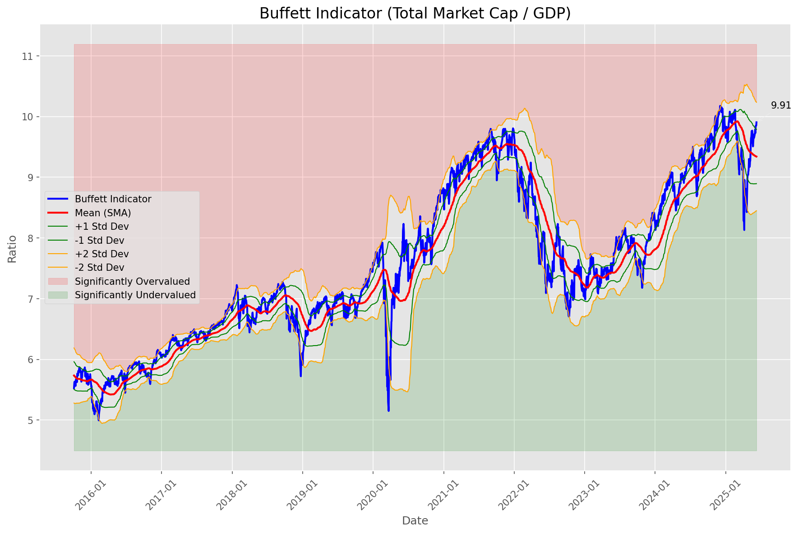

# **Daily Relative Strength Report**

**Date:** 2025-06-11

## **Market Valuation (Buffett Indicator)**

| Metric | Value |
|--------|-------|
| **Market Valuation** | **Overvalued** |
| **Current Ratio** | 9.90 |
| **Historical Mean** | 9.34 |
| **Standard Deviation** | 0.45 |
| **Z-Score (StdDev from Mean)** | 1.26 |
| **Total Market Cap** | $296.86 trillion |
| **GDP** | $29.98 trillion |

## **Market Insights**

### **Market is Overvalued**

The market appears to be trading above historical average valuations. While not at extreme levels, this suggests more modest future returns may be expected. Investors should:

- Focus on companies with reasonable valuations relative to their growth
- Be more selective with new positions
- Look for stocks showing relative strength within their sectors
- Consider trimming positions in extremely overvalued names

Historically, periods of mild overvaluation can persist for extended periods, but returns tend to be below average.

### **Buffett Indicator Overview**

The Buffett Indicator (Total Market Cap / GDP) is a measure of the stock market's valuation relative to the size of the economy. It is named after Warren Buffett, who described it as "probably the best single measure of where valuations stand at any given moment."

- **Values above +2 standard deviations:** Market significantly overvalued
- **Values above +1 standard deviation:** Market overvalued
- **Values between -1 and +1 standard deviations:** Market fairly valued
- **Values below -1 standard deviation:** Market undervalued
- **Values below -2 standard deviations:** Market significantly undervalued

---

## **Sector Relative Strength**

Based on William O'Neil's Relative Strength Methodology

| ETF | Strength | RS Rating | Performance | Above Key MAs | Trend | Sector |
|-----|----------|-----------|-------------|--------------|-------|--------|
| [ARKW](https://www.tradingview.com/chart/?symbol=ARKW) | 98.5 | 97.0 | 42.11% | 10d ✓, 50d ✓, 200d ✓ | ↗️ | Next Generation Internet |
| [ARKF](https://www.tradingview.com/chart/?symbol=ARKF) | 97.0 | 94.0 | 31.66% | 10d ✓, 50d ✓, 200d ✓ | ↗️ | Fintech Innovation |
| [ARKK](https://www.tradingview.com/chart/?symbol=ARKK) | 96.5 | 93.0 | 28.80% | 10d ✓, 50d ✓, 200d ✓ | ↗️ | Innovation |
| [BLOK](https://www.tradingview.com/chart/?symbol=BLOK) | 96.0 | 92.0 | 26.63% | 10d ✓, 50d ✓, 200d ✓ | ↗️ | Blockchain & Cryptocurrency |
| [CIBR](https://www.tradingview.com/chart/?symbol=CIBR) | 89.5 | 79.0 | 13.71% | 10d ✓, 50d ✓, 200d ✓ | ↗️ | Cybersecurity |
| [AIQ](https://www.tradingview.com/chart/?symbol=AIQ) | 88.5 | 77.0 | 12.87% | 10d ✓, 50d ✓, 200d ✓ | ↗️ | Artificial Intelligence & Technology |
| [PAVE](https://www.tradingview.com/chart/?symbol=PAVE) | 88.0 | 76.0 | 12.43% | 10d ✓, 50d ✓, 200d ✓ | ↗️ | Infrastructure |
| [XLI](https://www.tradingview.com/chart/?symbol=XLI) | 86.0 | 72.0 | 10.85% | 10d ✓, 50d ✓, 200d ✓ | ↗️ | Industrial |
| [XLY](https://www.tradingview.com/chart/?symbol=XLY) | 84.5 | 69.0 | 9.33% | 10d ✓, 50d ✓, 200d ✓ | ↗️ | Consumer Discretionary |
| [SLV](https://www.tradingview.com/chart/?symbol=SLV) | 83.5 | 67.0 | 8.88% | 10d ✓, 50d ✓, 200d ✓ | ↗️ | Silver |
| [XLC](https://www.tradingview.com/chart/?symbol=XLC) | 82.5 | 65.0 | 8.20% | 10d ✓, 50d ✓, 200d ✓ | ↗️ | Communications |
| [JETS](https://www.tradingview.com/chart/?symbol=JETS) | 82.5 | 65.0 | 8.42% | 10d ✓, 50d ✓, 200d ✓ | ↗️ | Airlines |
| [IYZ](https://www.tradingview.com/chart/?symbol=IYZ) | 81.0 | 62.0 | 7.06% | 10d ✓, 50d ✓, 200d ✓ | ↗️ | Telecommunications |
| [XLF](https://www.tradingview.com/chart/?symbol=XLF) | 81.0 | 62.0 | 7.24% | 10d ✓, 50d ✓, 200d ✓ | ↗️ | Financial |
| [GLD](https://www.tradingview.com/chart/?symbol=GLD) | 79.1 | 78.0 | 13.51% | 10d ✗, 50d ✓, 200d ✓ | ↗️ | Gold |
| [URA](https://www.tradingview.com/chart/?symbol=URA) | 79.0 | 98.0 | 49.33% | 10d ✓, 50d ✓, 200d ✓ | ↘️ | Uranium |
| [DBA](https://www.tradingview.com/chart/?symbol=DBA) | 72.0 | 44.0 | 1.71% | 10d ✓, 50d ✓, 200d ✓ | ↗️ | Agriculture |
| [SOXX](https://www.tradingview.com/chart/?symbol=SOXX) | 70.5 | 81.0 | 15.79% | 10d ✓, 50d ✓, 200d ✓ | ↘️ | Semiconductors |
| [ICLN](https://www.tradingview.com/chart/?symbol=ICLN) | 70.5 | 81.0 | 15.64% | 10d ✓, 50d ✓, 200d ✓ | ↘️ | Clean Energy |
| [XLK](https://www.tradingview.com/chart/?symbol=XLK) | 69.5 | 79.0 | 13.79% | 10d ✓, 50d ✓, 200d ✓ | ↘️ | Technology |
| [XLU](https://www.tradingview.com/chart/?symbol=XLU) | 67.1 | 54.0 | 4.68% | 10d ✗, 50d ✓, 200d ✓ | ↗️ | Utilities |
| [KWEB](https://www.tradingview.com/chart/?symbol=KWEB) | 64.0 | 28.0 | -2.08% | 10d ✓, 50d ✓, 200d ✓ | ↗️ | Chinese Internet |
| [XLP](https://www.tradingview.com/chart/?symbol=XLP) | 63.6 | 47.0 | 2.27% | 10d ✗, 50d ✓, 200d ✓ | ↗️ | Consumer Staples |
| [ARKG](https://www.tradingview.com/chart/?symbol=ARKG) | 60.0 | 60.0 | 6.36% | 10d ✓, 50d ✓, 200d ✓ | ↘️ | Genomics |
| [IYT](https://www.tradingview.com/chart/?symbol=IYT) | 46.3 | 53.0 | 4.27% | 10d ✓, 50d ✓, 200d ✗ | ↘️ | Transportation |
| [XLB](https://www.tradingview.com/chart/?symbol=XLB) | 45.3 | 51.0 | 3.94% | 10d ✓, 50d ✓, 200d ✗ | ↘️ | Materials |
| [IYR](https://www.tradingview.com/chart/?symbol=IYR) | 41.8 | 44.0 | 1.53% | 10d ✓, 50d ✓, 200d ✗ | ↘️ | Real Estate |
| [DBC](https://www.tradingview.com/chart/?symbol=DBC) | 36.3 | 33.0 | -0.55% | 10d ✓, 50d ✓, 200d ✗ | ↘️ | Commodities |
| [XLE](https://www.tradingview.com/chart/?symbol=XLE) | 32.8 | 26.0 | -2.97% | 10d ✓, 50d ✓, 200d ✗ | ↘️ | Energy |
| [ITB](https://www.tradingview.com/chart/?symbol=ITB) | 32.3 | 25.0 | -3.09% | 10d ✓, 50d ✓, 200d ✗ | ↘️ | Home Construction |
| [IBB](https://www.tradingview.com/chart/?symbol=IBB) | 31.3 | 23.0 | -3.87% | 10d ✓, 50d ✓, 200d ✗ | ↘️ | Biotechnology |
| [XLV](https://www.tradingview.com/chart/?symbol=XLV) | 28.8 | 18.0 | -5.89% | 10d ✓, 50d ✓, 200d ✗ | ↘️ | Healthcare |
| [BIL](https://www.tradingview.com/chart/?symbol=BIL) | 28.4 | 37.0 | -0.01% | 10d ✓, 50d ✗, 200d ✗ | ↘️ | Short-term Treasuries |
| [TLT](https://www.tradingview.com/chart/?symbol=TLT) | 20.9 | 22.0 | -4.28% | 10d ✓, 50d ✗, 200d ✗ | ↘️ | Long-term Treasuries |
| [UUP](https://www.tradingview.com/chart/?symbol=UUP) | 12.0 | 24.0 | -3.60% | 10d ✗, 50d ✗, 200d ✗ | ↘️ | U.S. Dollar |

### **Sector ETF Performance Interpretation**

This table shows the relative strength metrics for different market sectors based on their representative ETFs:

- **ETF**: The ETF used to measure sector performance (click for chart)
- **Strength**: Overall sector strength score (0-100) combining multiple factors
- **RS Rating**: O'Neil RS rating of the sector ETF
- **Performance**: Performance of the sector ETF relative to SPY
- **Above Key MAs**: Whether the ETF is trading above its 10, 50, and 200-day moving averages
- **Trend**: Whether the sector is in an uptrend (↗️) or downtrend (↘️)

### **Current Sector Leadership**

The current market leadership is coming from the following sectors: **Next Generation Internet, Fintech Innovation, Innovation**.

The **Next Generation Internet** sector (represented by **ARKW**) is showing particularly strong relative strength with an RS rating of 97.0 and performance of 42.11% vs. the S&P 500. This sector is trading above its 10-day, 50-day, 200-day moving average(s). Investors should consider focusing on high RS stocks within these leading sectors for potential outperformance.

---

## **Buy Recommendations**

The following 53 stocks show exceptional relative strength:

| RS Rating | Buy Score | Current Price | Chart | Name | Ticker |
|-----------|-----------|---------------|-------|------|--------|
| 100 | 100 | $228.75 | [Chart](https://www.tradingview.com/chart/?symbol=DAVE) | Dave Inc. Class A Common Stock | DAVE |
| 100 | 100 | $74.89 | [Chart](https://www.tradingview.com/chart/?symbol=HOOD) | Robinhood Markets, Inc. Class A Common Stock | HOOD |
| 100 | 100 | $219.09 | [Chart](https://www.tradingview.com/chart/?symbol=AGX) | Argan, Inc | AGX |
| 100 | 100 | $129.88 | [Chart](https://www.tradingview.com/chart/?symbol=SEZL) | Sezzle Inc. Common Stock | SEZL |
| 100 | 100 | $156.28 | [Chart](https://www.tradingview.com/chart/?symbol=LEU) | Centrus Energy Corp. | LEU |
| 100 | 100 | $95.50 | [Chart](https://www.tradingview.com/chart/?symbol=RBLX) | Roblox Corporation | RBLX |
| 100 | 100 | $341.00 | [Chart](https://www.tradingview.com/chart/?symbol=CVNA) | Carvana Co. | CVNA |
| 99 | 100 | $56.19 | [Chart](https://www.tradingview.com/chart/?symbol=HIMS) | Hims & Hers Health, Inc. | HIMS |
| 99 | 100 | $136.75 | [Chart](https://www.tradingview.com/chart/?symbol=PLTR) | Palantir Technologies Inc. Class A Common Stock | PLTR |
| 98 | 100 | $42.56 | [Chart](https://www.tradingview.com/chart/?symbol=FARO) | Faro Technologies Inc | FARO |
| 97 | 100 | $128.77 | [Chart](https://www.tradingview.com/chart/?symbol=CLS) | Celestica, Inc. | CLS |
| 97 | 100 | $141.04 | [Chart](https://www.tradingview.com/chart/?symbol=COOP) | Mr. Cooper Group Inc. Common Stock | COOP |
| 97 | 100 | $253.18 | [Chart](https://www.tradingview.com/chart/?symbol=GWRE) | GUIDEWIRE SOFTWARE, INC. | GWRE |
| 97 | 100 | $20.23 | [Chart](https://www.tradingview.com/chart/?symbol=MIR) | Mirion Technologies, Inc. | MIR |
| 97 | 100 | $37.84 | [Chart](https://www.tradingview.com/chart/?symbol=AS) | Amer Sports, Inc. | AS |
| 96 | 100 | $248.38 | [Chart](https://www.tradingview.com/chart/?symbol=CRS) | Carpenter Technology Corp | CRS |
| 96 | 100 | $271.82 | [Chart](https://www.tradingview.com/chart/?symbol=TLN) | Talen Energy Corporation Common Stock | TLN |
| 95 | 100 | $21.09 | [Chart](https://www.tradingview.com/chart/?symbol=MAG) | MAG Silver Corp. | MAG |
| 95 | 100 | $39.78 | [Chart](https://www.tradingview.com/chart/?symbol=KTOS) | Kratos Defense & Security Solutions, Inc. | KTOS |
| 95 | 100 | $48.26 | [Chart](https://www.tradingview.com/chart/?symbol=BBW) | Build-A-Bear Workshop, Inc. | BBW |
| 95 | 100 | $1223.77 | [Chart](https://www.tradingview.com/chart/?symbol=NFLX) | NetFlix Inc | NFLX |
| 94 | 100 | $62.24 | [Chart](https://www.tradingview.com/chart/?symbol=IBIT) | iShares Bitcoin Trust ETF | IBIT |
| 94 | 100 | $45.30 | [Chart](https://www.tradingview.com/chart/?symbol=ARKF) | ARK Fintech Innovation ETF | ARKF |
| 94 | 100 | $30.98 | [Chart](https://www.tradingview.com/chart/?symbol=HODL) | VanEck Bitcoin ETF | HODL |
| 94 | 100 | $23.83 | [Chart](https://www.tradingview.com/chart/?symbol=TFPM) | Triple Flag Precious Metals Corp. | TFPM |
| 93 | 100 | $68.73 | [Chart](https://www.tradingview.com/chart/?symbol=GDXJ) | VanEck Junior Gold Miners ETF | GDXJ |
| 92 | 100 | $132.87 | [Chart](https://www.tradingview.com/chart/?symbol=NTES) | NetEase, inc. | NTES |
| 91 | 100 | $35.97 | [Chart](https://www.tradingview.com/chart/?symbol=AHR) | American Healthcare REIT, Inc. | AHR |
| 91 | 100 | $500.01 | [Chart](https://www.tradingview.com/chart/?symbol=CASY) | Casey's General Stores Inc | CASY |
| 91 | 100 | $30.34 | [Chart](https://www.tradingview.com/chart/?symbol=NTGR) | NETGEAR, Inc. | NTGR |
| 89 | 100 | $284.56 | [Chart](https://www.tradingview.com/chart/?symbol=VEEV) | Veeva Systems Inc. | VEEV |
| 88 | 100 | $57.55 | [Chart](https://www.tradingview.com/chart/?symbol=CAKE) | Cheesecake Factory (The) | CAKE |
| 88 | 100 | $28.32 | [Chart](https://www.tradingview.com/chart/?symbol=DB) | Deutsche Bank Aktiengesellschaft | DB |
| 87 | 100 | $24.38 | [Chart](https://www.tradingview.com/chart/?symbol=SRAD) | Sportradar Group AG Class A Ordinary Shares | SRAD |
| 87 | 100 | $182.09 | [Chart](https://www.tradingview.com/chart/?symbol=PM) | Philip Morris International Inc. | PM |
| 90 | 99 | $47.79 | [Chart](https://www.tradingview.com/chart/?symbol=SIL) | Global X Silver Miners ETF (NEW) | SIL |
| 89 | 99 | $188.90 | [Chart](https://www.tradingview.com/chart/?symbol=CVLT) | Commault Systems, Inc. | CVLT |
| 88 | 99 | $180.04 | [Chart](https://www.tradingview.com/chart/?symbol=ITA) | iShares U.S. Aerospace & Defense ETF | ITA |
| 88 | 99 | $25.73 | [Chart](https://www.tradingview.com/chart/?symbol=CPRX) | Catalyst Pharmaceutical  Inc. | CPRX |
| 87 | 99 | $78.01 | [Chart](https://www.tradingview.com/chart/?symbol=EBAY) | eBay Inc | EBAY |
| 86 | 99 | $279.77 | [Chart](https://www.tradingview.com/chart/?symbol=VRSN) | VeriSign Inc | VRSN |
| 87 | 98 | $218.07 | [Chart](https://www.tradingview.com/chart/?symbol=BAP) | Credicorp LTD | BAP |
| 85 | 98 | $172.09 | [Chart](https://www.tradingview.com/chart/?symbol=EAT) | Brinker International, Inc. | EAT |
| 87 | 97 | $54.99 | [Chart](https://www.tradingview.com/chart/?symbol=AKRO) | Akero Therapeutics, Inc. Common Stock | AKRO |
| 86 | 96 | $87.19 | [Chart](https://www.tradingview.com/chart/?symbol=NDAQ) | Nasdaq, Inc. Common Stock | NDAQ |
| 84 | 96 | $48.54 | [Chart](https://www.tradingview.com/chart/?symbol=BTI) | British American Tobacco p.l.c. American Depositary Shares, American Depositary Shares, each representing one Ordinary Share | BTI |
| 84 | 96 | $398.11 | [Chart](https://www.tradingview.com/chart/?symbol=CYBR) | CyberArk Software Ltd. | CYBR |
| 85 | 95 | $114.27 | [Chart](https://www.tradingview.com/chart/?symbol=SHOP) | Shopify Inc. Class A subordinate voting shares | SHOP |
| 84 | 95 | $43.58 | [Chart](https://www.tradingview.com/chart/?symbol=EWP) | iShares MSCI Spain ETF | EWP |
| 80 | 92 | $40.61 | [Chart](https://www.tradingview.com/chart/?symbol=ZLAB) | Zai Lab Limited American Depositary Shares | ZLAB |
| 80 | 92 | $27.25 | [Chart](https://www.tradingview.com/chart/?symbol=CAE) | CAE INC | CAE |
| 80 | 92 | $75.98 | [Chart](https://www.tradingview.com/chart/?symbol=LLYVK) | Liberty Media Corporation Series C Liberty Live Common Stock | LLYVK |
| 80 | 90 | $165.39 | [Chart](https://www.tradingview.com/chart/?symbol=NTRA) | Natera, Inc. Common Stock | NTRA |

---

## **Sell Recommendations**

The following 127 stocks show deteriorating relative strength:

| RS Rating | Sell Score | Current Price | Chart | Name | Ticker |
|-----------|------------|---------------|-------|------|--------|
| 1 | 100 | $10.32 | [Chart](https://www.tradingview.com/chart/?symbol=WNC) | Wabash National Corp. | WNC |
| 1 | 100 | $16.78 | [Chart](https://www.tradingview.com/chart/?symbol=NVDS) | Investment Managers Series Trust II Tradr 1.5X Short NVDA Daily ETF | NVDS |
| 1 | 100 | $31.36 | [Chart](https://www.tradingview.com/chart/?symbol=TECS) | Direxion Daily Technology Bear 3x Shares | TECS |
| 1 | 100 | $13.35 | [Chart](https://www.tradingview.com/chart/?symbol=IART) | Integra LifeSciences Holdings | IART |
| 1 | 100 | $15.69 | [Chart](https://www.tradingview.com/chart/?symbol=RXST) | RxSight, Inc. Common Stock | RXST |
| 1 | 100 | $16.21 | [Chart](https://www.tradingview.com/chart/?symbol=BHVN) | Biohaven Ltd. | BHVN |
| 1 | 100 | $12.19 | [Chart](https://www.tradingview.com/chart/?symbol=ZVZZT) | SUPER Montage TEST SYMBOL | ZVZZT |
| 1 | 100 | $11.01 | [Chart](https://www.tradingview.com/chart/?symbol=HIBS) | Direxion Daily S&P 500 High Beta Bear 3X Shares | HIBS |
| 2 | 100 | $10.31 | [Chart](https://www.tradingview.com/chart/?symbol=SONO) | Sonos, Inc. Common Stock | SONO |
| 2 | 100 | $27.27 | [Chart](https://www.tradingview.com/chart/?symbol=QID) | ProShares UltraShort QQQ | QID |
| 2 | 100 | $48.63 | [Chart](https://www.tradingview.com/chart/?symbol=CCOI) | Cogent Communications Holdings, Inc. | CCOI |
| 2 | 100 | $12.21 | [Chart](https://www.tradingview.com/chart/?symbol=TZA) | Direxion Daily Small Cap Bear 3x Shares | TZA |
| 2 | 100 | $11.10 | [Chart](https://www.tradingview.com/chart/?symbol=SNDX) | Syndax Pharmaceuticals, Inc. | SNDX |
| 3 | 100 | $100.53 | [Chart](https://www.tradingview.com/chart/?symbol=ONTO) | Onto Innovation Inc. | ONTO |
| 3 | 100 | $54.96 | [Chart](https://www.tradingview.com/chart/?symbol=ASGN) | ASGN Incorporated | ASGN |
| 3 | 100 | $26.61 | [Chart](https://www.tradingview.com/chart/?symbol=CRTO) | Criteo S.A. | CRTO |
| 3 | 100 | $11.26 | [Chart](https://www.tradingview.com/chart/?symbol=HPK) | HighPeak Energy, Inc. Common Stock | HPK |
| 3 | 100 | $33.75 | [Chart](https://www.tradingview.com/chart/?symbol=CYTK) | Cytokinetics Inc. | CYTK |
| 3 | 100 | $11.28 | [Chart](https://www.tradingview.com/chart/?symbol=WEN) | The Wendy's Company | WEN |
| 3 | 100 | $22.10 | [Chart](https://www.tradingview.com/chart/?symbol=THS) | Treehouse Foods, Inc. | THS |
| 3 | 100 | $12.82 | [Chart](https://www.tradingview.com/chart/?symbol=ERII) | Energy Recovery, Inc. | ERII |
| 4 | 100 | $26.67 | [Chart](https://www.tradingview.com/chart/?symbol=WMG) | Warner Music Group Corp. Class A Common Stock | WMG |
| 4 | 100 | $141.83 | [Chart](https://www.tradingview.com/chart/?symbol=KRYS) | Krystal Biotech, Inc. Common Stock | KRYS |
| 4 | 100 | $10.56 | [Chart](https://www.tradingview.com/chart/?symbol=JAMF) | Jamf Holding Corp. Common Stock | JAMF |
| 4 | 100 | $21.51 | [Chart](https://www.tradingview.com/chart/?symbol=AMRK) | A-Mark Precious Metals, Inc. | AMRK |
| 4 | 100 | $14.54 | [Chart](https://www.tradingview.com/chart/?symbol=INMD) | InMode Ltd. Ordinary Shares | INMD |
| 4 | 100 | $10.82 | [Chart](https://www.tradingview.com/chart/?symbol=MBC) | MasterBrand, Inc. | MBC |
| 4 | 100 | $111.78 | [Chart](https://www.tradingview.com/chart/?symbol=AMR) | Alpha Metallurgical Resources, Inc. | AMR |
| 4 | 100 | $53.03 | [Chart](https://www.tradingview.com/chart/?symbol=SLVM) | Sylvamo Corporation | SLVM |
| 4 | 100 | $10.69 | [Chart](https://www.tradingview.com/chart/?symbol=PACS) | PACS Group, Inc. | PACS |
| 4 | 100 | $45.38 | [Chart](https://www.tradingview.com/chart/?symbol=LINE) | Lineage, Inc. Common Stock | LINE |
| 5 | 100 | $44.35 | [Chart](https://www.tradingview.com/chart/?symbol=TWM) | ProShares UltraShort Russell2000 | TWM |
| 5 | 100 | $54.99 | [Chart](https://www.tradingview.com/chart/?symbol=CCS) | CENTURY COMMUNITIES, INC. | CCS |
| 5 | 100 | $18.75 | [Chart](https://www.tradingview.com/chart/?symbol=DNTH) | Dianthus Therapeutics, Inc. Common Stock | DNTH |
| 5 | 100 | $45.05 | [Chart](https://www.tradingview.com/chart/?symbol=SDOW) | ProShares UltraPro Short Dow 30 | SDOW |
| 5 | 100 | $34.00 | [Chart](https://www.tradingview.com/chart/?symbol=SQM) | Sociedad Quimica y Minera de Chile SA | SQM |
| 5 | 100 | $417.63 | [Chart](https://www.tradingview.com/chart/?symbol=TMO) | Thermo Fisher Scientific, Inc. | TMO |
| 5 | 100 | $32.95 | [Chart](https://www.tradingview.com/chart/?symbol=MBIN) | Merchants Bancorp Common Stock | MBIN |
| 6 | 100 | $71.42 | [Chart](https://www.tradingview.com/chart/?symbol=WD) | Walker & Dunlop, Inc. | WD |
| 6 | 100 | $133.78 | [Chart](https://www.tradingview.com/chart/?symbol=INSP) | Inspire Medical Systems, Inc. | INSP |
| 6 | 100 | $26.19 | [Chart](https://www.tradingview.com/chart/?symbol=JANX) | Janux Therapeutics, Inc. Common Stock | JANX |
| 6 | 100 | $17.25 | [Chart](https://www.tradingview.com/chart/?symbol=CODI) | Compass Diversified | CODI |
| 6 | 100 | $11.66 | [Chart](https://www.tradingview.com/chart/?symbol=PUBM) | PubMatic, Inc. Class A Common Stock | PUBM |
| 6 | 100 | $39.35 | [Chart](https://www.tradingview.com/chart/?symbol=WLY) | John Wiley & Sons, Inc. Class A | WLY |
| 7 | 100 | $22.11 | [Chart](https://www.tradingview.com/chart/?symbol=GPK) | Graphic Packaging Holding Company | GPK |
| 7 | 100 | $52.43 | [Chart](https://www.tradingview.com/chart/?symbol=FBIN) | Fortune Brands Innovations, Inc. | FBIN |
| 7 | 100 | $36.95 | [Chart](https://www.tradingview.com/chart/?symbol=TMF) | Direxion Daily 20+ Year Treasury Bull 3X Shares (based on the NYSE 20 Year Plus Treasury Bond Index; symbol AXTWEN) | TMF |
| 8 | 100 | $41.02 | [Chart](https://www.tradingview.com/chart/?symbol=APOG) | Apogee Enterprises Inc | APOG |
| 10 | 100 | $12.56 | [Chart](https://www.tradingview.com/chart/?symbol=WSR) | Whitestone REIT | WSR |
| 10 | 100 | $22.17 | [Chart](https://www.tradingview.com/chart/?symbol=KIDS) | OrthoPediatrics Corp. Common Stock | KIDS |
| 11 | 100 | $15.19 | [Chart](https://www.tradingview.com/chart/?symbol=IGT) | International Game Technology PLC | IGT |
| 11 | 100 | $115.59 | [Chart](https://www.tradingview.com/chart/?symbol=BLDR) | Builders FirstSource, Inc. | BLDR |
| 12 | 100 | $64.75 | [Chart](https://www.tradingview.com/chart/?symbol=ZROZ) | PIMCO 25+ Year Zero Coupon U.S. Treasury Index Exchange-Traded Fund | ZROZ |
| 12 | 100 | $10.22 | [Chart](https://www.tradingview.com/chart/?symbol=LBTYK) | Liberty Global Ltd. Class C Common Shares | LBTYK |
| 12 | 100 | $125.44 | [Chart](https://www.tradingview.com/chart/?symbol=TFX) | Teleflex Incorporated | TFX |
| 12 | 100 | $54.24 | [Chart](https://www.tradingview.com/chart/?symbol=GIS) | General Mills, Inc. | GIS |
| 14 | 100 | $15.39 | [Chart](https://www.tradingview.com/chart/?symbol=SEM) | SELECT MEDICAL HOLDINGS CORP | SEM |
| 15 | 100 | $90.23 | [Chart](https://www.tradingview.com/chart/?symbol=BCC) | Boise Cascade Company | BCC |
| 7 | 99 | $60.71 | [Chart](https://www.tradingview.com/chart/?symbol=GMED) | GLOBUS MEDICAL INC | GMED |
| 9 | 99 | $103.80 | [Chart](https://www.tradingview.com/chart/?symbol=PDD) | PDD Holdings Inc. American Depositary Shares | PDD |
| 9 | 99 | $17.64 | [Chart](https://www.tradingview.com/chart/?symbol=DOC) | Healthpeak Properties, Inc. | DOC |
| 10 | 99 | $24.10 | [Chart](https://www.tradingview.com/chart/?symbol=RYN) | Rayonier Inc. | RYN |
| 13 | 99 | $42.55 | [Chart](https://www.tradingview.com/chart/?symbol=PRKS) | United Parks & Resorts Inc. | PRKS |
| 18 | 99 | $10.88 | [Chart](https://www.tradingview.com/chart/?symbol=LBTYA) | Liberty Global Ltd. Class A Common Shares | LBTYA |
| 13 | 98 | $23.95 | [Chart](https://www.tradingview.com/chart/?symbol=IPG) | The Interpublic Group of Companies, Inc. | IPG |
| 13 | 98 | $94.46 | [Chart](https://www.tradingview.com/chart/?symbol=ZBH) | Zimmer Biomet Holdings, Inc. | ZBH |
| 17 | 98 | $10.87 | [Chart](https://www.tradingview.com/chart/?symbol=CARS) | Cars.com Inc. Common Stock | CARS |
| 12 | 97 | $51.66 | [Chart](https://www.tradingview.com/chart/?symbol=OXM) | Oxford Industries, Inc. | OXM |
| 10 | 96 | $449.85 | [Chart](https://www.tradingview.com/chart/?symbol=WSO) | Watsco, Inc. | WSO |
| 11 | 96 | $12.82 | [Chart](https://www.tradingview.com/chart/?symbol=PMT) | PennyMac Mortgage Investment Trust | PMT |
| 12 | 95 | $14.78 | [Chart](https://www.tradingview.com/chart/?symbol=HR) | Healthcare Realty Trust Incorporated | HR |
| 13 | 95 | $98.99 | [Chart](https://www.tradingview.com/chart/?symbol=CHD) | Church & Dwight Co., Inc. | CHD |
| 17 | 95 | $10.42 | [Chart](https://www.tradingview.com/chart/?symbol=MYI) | BLACKROCK MUNIYIELD QUALITY FUND III, INC. | MYI |
| 11 | 94 | $18.62 | [Chart](https://www.tradingview.com/chart/?symbol=EGBN) | Eagle Bancorp Inc | EGBN |
| 13 | 94 | $303.57 | [Chart](https://www.tradingview.com/chart/?symbol=POOL) | Pool Corporation | POOL |
| 14 | 94 | $13.73 | [Chart](https://www.tradingview.com/chart/?symbol=BSM) | Black Stone Minerals, L.P. | BSM |
| 17 | 94 | $77.47 | [Chart](https://www.tradingview.com/chart/?symbol=EXPO) | Exponent Inc | EXPO |
| 15 | 93 | $66.43 | [Chart](https://www.tradingview.com/chart/?symbol=MTH) | Meritage Homes Corporation | MTH |
| 20 | 93 | $55.30 | [Chart](https://www.tradingview.com/chart/?symbol=CNC) | Centene Corporation | CNC |
| 20 | 93 | $15.33 | [Chart](https://www.tradingview.com/chart/?symbol=VRE) | Veris Residential, Inc. | VRE |
| 8 | 92 | $61.61 | [Chart](https://www.tradingview.com/chart/?symbol=STC) | Stewart Information Services Corporation | STC |
| 12 | 92 | $30.67 | [Chart](https://www.tradingview.com/chart/?symbol=AXTA) | Axalta Coating Systems Ltd. | AXTA |
| 15 | 92 | $457.57 | [Chart](https://www.tradingview.com/chart/?symbol=VRTX) | Vertex Pharmaceuticals Inc | VRTX |
| 20 | 92 | $100.25 | [Chart](https://www.tradingview.com/chart/?symbol=UFPI) | UFP Industries, Inc. Common Stock | UFPI |
| 18 | 91 | $26.53 | [Chart](https://www.tradingview.com/chart/?symbol=ASTH) | Astrana Health Inc. Common Stock | ASTH |
| 19 | 91 | $41.08 | [Chart](https://www.tradingview.com/chart/?symbol=POR) | Portland General Electric Company | POR |
| 15 | 90 | $32.73 | [Chart](https://www.tradingview.com/chart/?symbol=XENE) | Xenon Pharmaceuticals Inc | XENE |
| 20 | 90 | $13.75 | [Chart](https://www.tradingview.com/chart/?symbol=DOLE) | Dole plc | DOLE |
| 17 | 89 | $294.24 | [Chart](https://www.tradingview.com/chart/?symbol=MOH) | Molina Healthcare, Inc. | MOH |
| 18 | 89 | $233.73 | [Chart](https://www.tradingview.com/chart/?symbol=HUM) | Humana Inc. | HUM |
| 21 | 89 | $15.70 | [Chart](https://www.tradingview.com/chart/?symbol=BBN) | BlackRock Taxable Municipal Bond Trust | BBN |
| 14 | 88 | $10.27 | [Chart](https://www.tradingview.com/chart/?symbol=NMZ) | Nuveen Municipal High Income Opportunity Fund | NMZ |
| 15 | 88 | $200.12 | [Chart](https://www.tradingview.com/chart/?symbol=AAPL) | Apple Inc. | AAPL |
| 20 | 88 | $63.23 | [Chart](https://www.tradingview.com/chart/?symbol=ELS) | Equity Lifestyle Properties, Inc. | ELS |
| 14 | 87 | $15.87 | [Chart](https://www.tradingview.com/chart/?symbol=QNST) | QuinStreet, Inc. | QNST |
| 15 | 87 | $17.70 | [Chart](https://www.tradingview.com/chart/?symbol=ZTO) | ZTO Express (Cayman) Inc. American Depositary Shares, each representing one Class A ordinary share | ZTO |
| 16 | 87 | $39.55 | [Chart](https://www.tradingview.com/chart/?symbol=LKQ) | LKQ Corporation | LKQ |
| 19 | 87 | $13.42 | [Chart](https://www.tradingview.com/chart/?symbol=ARDT) | Ardent Health, Inc. | ARDT |
| 22 | 87 | $86.01 | [Chart](https://www.tradingview.com/chart/?symbol=TLT) | iShares 20+ Year Treasury Bond ETF | TLT |
| 30 | 87 | $49.65 | [Chart](https://www.tradingview.com/chart/?symbol=MTBA) | Simplify MBS ETF | MTBA |
| 22 | 85 | $57.89 | [Chart](https://www.tradingview.com/chart/?symbol=AMWD) | American Woodmark Corp | AMWD |
| 24 | 85 | $54.77 | [Chart](https://www.tradingview.com/chart/?symbol=VGLT) | Vanguard Long-Term Treasury ETF | VGLT |
| 30 | 85 | $136.79 | [Chart](https://www.tradingview.com/chart/?symbol=ICUI) | ICU Medical Inc | ICUI |
| 26 | 84 | $17.54 | [Chart](https://www.tradingview.com/chart/?symbol=STAA) | Staar Surgical Co | STAA |
| 28 | 84 | $223.50 | [Chart](https://www.tradingview.com/chart/?symbol=LOW) | Lowe's Companies Inc. | LOW |
| 21 | 82 | $26.29 | [Chart](https://www.tradingview.com/chart/?symbol=DOG) | ProShares Short Dow30 | DOG |
| 22 | 82 | $186.25 | [Chart](https://www.tradingview.com/chart/?symbol=DKS) | Dick's Sporting Goods, Inc. | DKS |
| 27 | 82 | $20.98 | [Chart](https://www.tradingview.com/chart/?symbol=LGOV) | First Trust Long Duration Opportunities ETF | LGOV |
| 21 | 81 | $133.09 | [Chart](https://www.tradingview.com/chart/?symbol=KMB) | Kimberly-Clark Corp. | KMB |
| 27 | 80 | $85.40 | [Chart](https://www.tradingview.com/chart/?symbol=BCO) | The Brink's Company | BCO |
| 23 | 79 | $200.72 | [Chart](https://www.tradingview.com/chart/?symbol=EXP) | Eagle Materials, Inc. | EXP |
| 25 | 79 | $137.97 | [Chart](https://www.tradingview.com/chart/?symbol=DVA) | DaVita Inc. | DVA |
| 24 | 78 | $162.41 | [Chart](https://www.tradingview.com/chart/?symbol=PG) | Procter & Gamble Company | PG |
| 31 | 77 | $26.16 | [Chart](https://www.tradingview.com/chart/?symbol=BAB) | Invesco Taxable Municipal Bond ETF | BAB |
| 30 | 76 | $106.90 | [Chart](https://www.tradingview.com/chart/?symbol=DEO) | Diageo plc | DEO |
| 31 | 75 | $21.16 | [Chart](https://www.tradingview.com/chart/?symbol=FLCB) | Franklin U.S. Core Bond ETF | FLCB |
| 33 | 75 | $47.14 | [Chart](https://www.tradingview.com/chart/?symbol=CWT) | California Water Service | CWT |
| 29 | 74 | $453.47 | [Chart](https://www.tradingview.com/chart/?symbol=LMT) | Lockheed Martin Corp. | LMT |
| 31 | 73 | $44.38 | [Chart](https://www.tradingview.com/chart/?symbol=JMBS) | Janus Henderson Mortgage-Backed Securities ETF | JMBS |
| 32 | 72 | $45.66 | [Chart](https://www.tradingview.com/chart/?symbol=VMBS) | Vanguard Mortgage-Backed Securities ETF | VMBS |
| 34 | 71 | $97.84 | [Chart](https://www.tradingview.com/chart/?symbol=AGG) | iShares Core U.S. Aggregate Bond ETF | AGG |
| 33 | 68 | $92.51 | [Chart](https://www.tradingview.com/chart/?symbol=MBB) | iShares MBS ETF | MBB |
| 34 | 68 | $94.09 | [Chart](https://www.tradingview.com/chart/?symbol=IEF) | iShares 7-10 Year Treasury Bond ETF | IEF |
| 34 | 68 | $22.90 | [Chart](https://www.tradingview.com/chart/?symbol=SCHZ) | Schwab US Aggregate Bond ETF | SCHZ |
| 34 | 68 | $25.25 | [Chart](https://www.tradingview.com/chart/?symbol=SPAB) | SPDR Portfolio Aggregate Bond ETF | SPAB |
| 36 | 67 | $110.17 | [Chart](https://www.tradingview.com/chart/?symbol=SHV) | iShares Short Treasury Bond ETF | SHV |
| 39 | 64 | $11.00 | [Chart](https://www.tradingview.com/chart/?symbol=LOCO) | El Pollo Loco Holdings, Inc. | LOCO |

## **Methodology**

This report uses William O'Neil's relative strength methodology from Investors Business Daily:

* **RS Rating**: Percentile rank of stock's performance vs. S&P 500 over the past 63 trading days (1-99 scale)
* **Buy Criteria**: RS Rating >= 80, price above 50-day MA, strong uptrend, increasing volume
* **Sell Criteria**: RS Rating < 40, price below 50-day MA, downtrend, decreasing volume

### **O'Neil's Key Principles**

1. **Focus on relative performance** - stocks outperforming the market
2. **Price trend confirmation** - stock must be in an uptrend
3. **Volume confirmation** - strong volume supports price moves
4. **Moving average validation** - price above key moving averages
5. **Market leaders only** - concentrate on top-performing stocks

*Report generated automatically after market close*