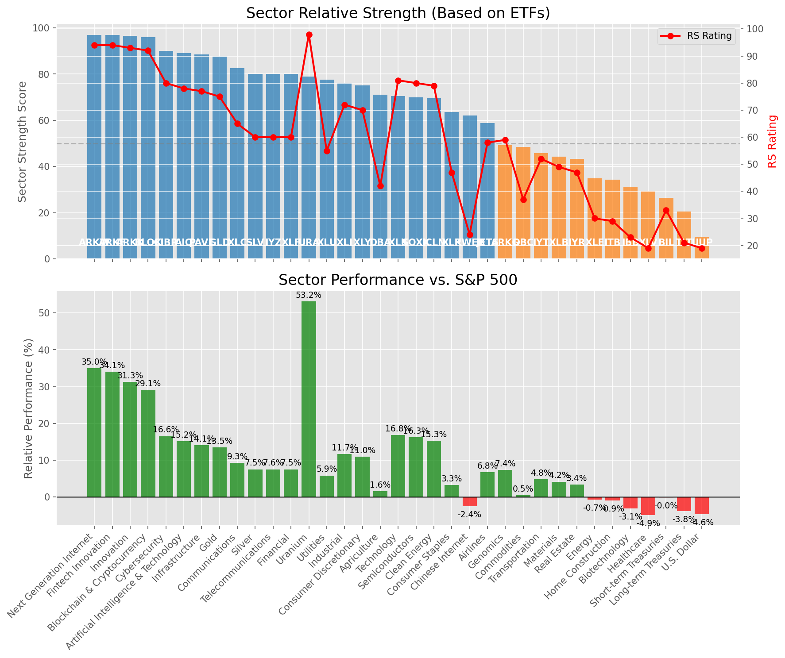

# **Daily Relative Strength Report**

**Date:** 2025-06-12

## **Market Valuation (Buffett Indicator)**

| Metric | Value |
|--------|-------|
| **Market Valuation** | **Overvalued** |
| **Current Ratio** | 9.90 |
| **Historical Mean** | 9.34 |
| **Standard Deviation** | 0.44 |
| **Z-Score (StdDev from Mean)** | 1.22 |
| **Total Market Cap** | $296.71 trillion |
| **GDP** | $29.98 trillion |

## **Market Insights**

### **Market is Overvalued**

The market appears to be trading above historical average valuations. While not at extreme levels, this suggests more modest future returns may be expected. Investors should:

- Focus on companies with reasonable valuations relative to their growth
- Be more selective with new positions
- Look for stocks showing relative strength within their sectors
- Consider trimming positions in extremely overvalued names

Historically, periods of mild overvaluation can persist for extended periods, but returns tend to be below average.

### **Buffett Indicator Overview**

The Buffett Indicator (Total Market Cap / GDP) is a measure of the stock market's valuation relative to the size of the economy. It is named after Warren Buffett, who described it as "probably the best single measure of where valuations stand at any given moment."

- **Values above +2 standard deviations:** Market significantly overvalued
- **Values above +1 standard deviation:** Market overvalued
- **Values between -1 and +1 standard deviations:** Market fairly valued
- **Values below -1 standard deviation:** Market undervalued
- **Values below -2 standard deviations:** Market significantly undervalued

---

## **Sector Relative Strength**

Based on William O'Neil's Relative Strength Methodology

| ETF | Strength | RS Rating | Performance | Above Key MAs | Trend | Sector |
|-----|----------|-----------|-------------|--------------|-------|--------|
| [ARKW](https://www.tradingview.com/chart/?symbol=ARKW) | 98.0 | 96.0 | 41.45% | 10d ✓, 50d ✓, 200d ✓ | ↗️ | Next Generation Internet |
| [ARKF](https://www.tradingview.com/chart/?symbol=ARKF) | 97.0 | 94.0 | 35.16% | 10d ✓, 50d ✓, 200d ✓ | ↗️ | Fintech Innovation |
| [ARKK](https://www.tradingview.com/chart/?symbol=ARKK) | 96.5 | 93.0 | 32.63% | 10d ✓, 50d ✓, 200d ✓ | ↗️ | Innovation |
| [BLOK](https://www.tradingview.com/chart/?symbol=BLOK) | 96.0 | 92.0 | 30.04% | 10d ✓, 50d ✓, 200d ✓ | ↗️ | Blockchain & Cryptocurrency |
| [CIBR](https://www.tradingview.com/chart/?symbol=CIBR) | 91.0 | 82.0 | 16.98% | 10d ✓, 50d ✓, 200d ✓ | ↗️ | Cybersecurity |
| [AIQ](https://www.tradingview.com/chart/?symbol=AIQ) | 89.5 | 79.0 | 15.38% | 10d ✓, 50d ✓, 200d ✓ | ↗️ | Artificial Intelligence & Technology |
| [PAVE](https://www.tradingview.com/chart/?symbol=PAVE) | 88.5 | 77.0 | 14.03% | 10d ✓, 50d ✓, 200d ✓ | ↗️ | Infrastructure |
| [GLD](https://www.tradingview.com/chart/?symbol=GLD) | 88.0 | 76.0 | 13.38% | 10d ✓, 50d ✓, 200d ✓ | ↗️ | Gold |
| [XLY](https://www.tradingview.com/chart/?symbol=XLY) | 86.0 | 72.0 | 11.45% | 10d ✓, 50d ✓, 200d ✓ | ↗️ | Consumer Discretionary |
| [XLC](https://www.tradingview.com/chart/?symbol=XLC) | 83.5 | 67.0 | 9.62% | 10d ✓, 50d ✓, 200d ✓ | ↗️ | Communications |
| [SLV](https://www.tradingview.com/chart/?symbol=SLV) | 80.0 | 60.0 | 7.22% | 10d ✓, 50d ✓, 200d ✓ | ↗️ | Silver |
| [IYZ](https://www.tradingview.com/chart/?symbol=IYZ) | 80.0 | 60.0 | 7.08% | 10d ✓, 50d ✓, 200d ✓ | ↗️ | Telecommunications |
| [URA](https://www.tradingview.com/chart/?symbol=URA) | 79.0 | 98.0 | 55.55% | 10d ✓, 50d ✓, 200d ✓ | ↘️ | Uranium |
| [XLU](https://www.tradingview.com/chart/?symbol=XLU) | 77.5 | 55.0 | 5.34% | 10d ✓, 50d ✓, 200d ✓ | ↗️ | Utilities |
| [XLI](https://www.tradingview.com/chart/?symbol=XLI) | 76.6 | 73.0 | 11.67% | 10d ✗, 50d ✓, 200d ✓ | ↗️ | Industrial |
| [DBA](https://www.tradingview.com/chart/?symbol=DBA) | 71.5 | 43.0 | 1.54% | 10d ✓, 50d ✓, 200d ✓ | ↗️ | Agriculture |
| [XLK](https://www.tradingview.com/chart/?symbol=XLK) | 71.0 | 82.0 | 16.87% | 10d ✓, 50d ✓, 200d ✓ | ↘️ | Technology |
| [SOXX](https://www.tradingview.com/chart/?symbol=SOXX) | 70.5 | 81.0 | 16.46% | 10d ✓, 50d ✓, 200d ✓ | ↘️ | Semiconductors |
| [XLF](https://www.tradingview.com/chart/?symbol=XLF) | 70.1 | 60.0 | 7.20% | 10d ✗, 50d ✓, 200d ✓ | ↗️ | Financial |
| [ICLN](https://www.tradingview.com/chart/?symbol=ICLN) | 69.5 | 79.0 | 15.36% | 10d ✓, 50d ✓, 200d ✓ | ↘️ | Clean Energy |
| [XLP](https://www.tradingview.com/chart/?symbol=XLP) | 63.1 | 46.0 | 2.71% | 10d ✗, 50d ✓, 200d ✓ | ↗️ | Consumer Staples |
| [KWEB](https://www.tradingview.com/chart/?symbol=KWEB) | 62.5 | 25.0 | -2.49% | 10d ✓, 50d ✓, 200d ✓ | ↗️ | Chinese Internet |
| [JETS](https://www.tradingview.com/chart/?symbol=JETS) | 58.9 | 58.0 | 6.40% | 10d ✗, 50d ✓, 200d ✗ | ↗️ | Airlines |
| [ARKG](https://www.tradingview.com/chart/?symbol=ARKG) | 50.3 | 61.0 | 7.67% | 10d ✓, 50d ✓, 200d ✗ | ↘️ | Genomics |
| [DBC](https://www.tradingview.com/chart/?symbol=DBC) | 49.5 | 39.0 | 0.59% | 10d ✓, 50d ✓, 200d ✓ | ↘️ | Commodities |
| [XLB](https://www.tradingview.com/chart/?symbol=XLB) | 44.8 | 50.0 | 3.98% | 10d ✓, 50d ✓, 200d ✗ | ↘️ | Materials |
| [IYR](https://www.tradingview.com/chart/?symbol=IYR) | 43.3 | 47.0 | 3.20% | 10d ✓, 50d ✓, 200d ✗ | ↘️ | Real Estate |
| [IYT](https://www.tradingview.com/chart/?symbol=IYT) | 35.4 | 51.0 | 4.20% | 10d ✗, 50d ✓, 200d ✗ | ↘️ | Transportation |
| [XLE](https://www.tradingview.com/chart/?symbol=XLE) | 35.3 | 31.0 | -0.67% | 10d ✓, 50d ✓, 200d ✗ | ↘️ | Energy |
| [ITB](https://www.tradingview.com/chart/?symbol=ITB) | 34.3 | 29.0 | -1.25% | 10d ✓, 50d ✓, 200d ✗ | ↘️ | Home Construction |
| [IBB](https://www.tradingview.com/chart/?symbol=IBB) | 30.8 | 22.0 | -3.76% | 10d ✓, 50d ✓, 200d ✗ | ↘️ | Biotechnology |
| [XLV](https://www.tradingview.com/chart/?symbol=XLV) | 29.3 | 19.0 | -5.18% | 10d ✓, 50d ✓, 200d ✗ | ↘️ | Healthcare |
| [BIL](https://www.tradingview.com/chart/?symbol=BIL) | 27.4 | 35.0 | -0.01% | 10d ✓, 50d ✗, 200d ✗ | ↘️ | Short-term Treasuries |
| [TLT](https://www.tradingview.com/chart/?symbol=TLT) | 20.4 | 21.0 | -4.07% | 10d ✓, 50d ✗, 200d ✗ | ↘️ | Long-term Treasuries |
| [UUP](https://www.tradingview.com/chart/?symbol=UUP) | 10.0 | 20.0 | -4.57% | 10d ✗, 50d ✗, 200d ✗ | ↘️ | U.S. Dollar |

### **Sector ETF Performance Interpretation**

This table shows the relative strength metrics for different market sectors based on their representative ETFs:

- **ETF**: The ETF used to measure sector performance (click for chart)
- **Strength**: Overall sector strength score (0-100) combining multiple factors
- **RS Rating**: O'Neil RS rating of the sector ETF
- **Performance**: Performance of the sector ETF relative to SPY
- **Above Key MAs**: Whether the ETF is trading above its 10, 50, and 200-day moving averages
- **Trend**: Whether the sector is in an uptrend (↗️) or downtrend (↘️)

### **Current Sector Leadership**

The current market leadership is coming from the following sectors: **Next Generation Internet, Fintech Innovation, Innovation**.

The **Next Generation Internet** sector (represented by **ARKW**) is showing particularly strong relative strength with an RS rating of 96.0 and performance of 41.45% vs. the S&P 500. This sector is trading above its 10-day, 50-day, 200-day moving average(s). Investors should consider focusing on high RS stocks within these leading sectors for potential outperformance.

---

## **Buy Recommendations**

The following 61 stocks show exceptional relative strength:

| RS Rating | Buy Score | Current Price | Chart | Name | Ticker |
|-----------|-----------|---------------|-------|------|--------|
| 100 | 100 | $57.21 | [Chart](https://www.tradingview.com/chart/?symbol=HIMS) | Hims & Hers Health, Inc. | HIMS |
| 100 | 100 | $158.63 | [Chart](https://www.tradingview.com/chart/?symbol=LEU) | Centrus Energy Corp. | LEU |
| 100 | 100 | $135.69 | [Chart](https://www.tradingview.com/chart/?symbol=PLTR) | Palantir Technologies Inc. Class A Common Stock | PLTR |
| 100 | 100 | $138.79 | [Chart](https://www.tradingview.com/chart/?symbol=SEZL) | Sezzle Inc. Common Stock | SEZL |
| 100 | 100 | $222.24 | [Chart](https://www.tradingview.com/chart/?symbol=AGX) | Argan, Inc | AGX |
| 100 | 100 | $240.16 | [Chart](https://www.tradingview.com/chart/?symbol=DAVE) | Dave Inc. Class A Common Stock | DAVE |
| 100 | 100 | $74.54 | [Chart](https://www.tradingview.com/chart/?symbol=HOOD) | Robinhood Markets, Inc. Class A Common Stock | HOOD |
| 100 | 100 | $96.20 | [Chart](https://www.tradingview.com/chart/?symbol=RBLX) | Roblox Corporation | RBLX |
| 99 | 100 | $487.31 | [Chart](https://www.tradingview.com/chart/?symbol=GEV) | GE Vernova Inc. | GEV |
| 98 | 100 | $48.72 | [Chart](https://www.tradingview.com/chart/?symbol=AU) | AngloGold Ashanti plc | AU |
| 98 | 100 | $130.24 | [Chart](https://www.tradingview.com/chart/?symbol=CLS) | Celestica, Inc. | CLS |
| 98 | 100 | $42.59 | [Chart](https://www.tradingview.com/chart/?symbol=FARO) | Faro Technologies Inc | FARO |
| 97 | 100 | $251.95 | [Chart](https://www.tradingview.com/chart/?symbol=GWRE) | GUIDEWIRE SOFTWARE, INC. | GWRE |
| 97 | 100 | $20.50 | [Chart](https://www.tradingview.com/chart/?symbol=MIR) | Mirion Technologies, Inc. | MIR |
| 97 | 100 | $143.47 | [Chart](https://www.tradingview.com/chart/?symbol=COOP) | Mr. Cooper Group Inc. Common Stock | COOP |
| 97 | 100 | $486.20 | [Chart](https://www.tradingview.com/chart/?symbol=CRWD) | CrowdStrike Holdings, Inc. Class A Common Stock | CRWD |
| 97 | 100 | $147.38 | [Chart](https://www.tradingview.com/chart/?symbol=IRTC) | iRhythm Technologies, Inc | IRTC |
| 96 | 100 | $41.16 | [Chart](https://www.tradingview.com/chart/?symbol=KTOS) | Kratos Defense & Security Solutions, Inc. | KTOS |
| 96 | 100 | $778.36 | [Chart](https://www.tradingview.com/chart/?symbol=AXON) | Axon Enterprise, Inc. Common Stock | AXON |
| 96 | 100 | $275.58 | [Chart](https://www.tradingview.com/chart/?symbol=TLN) | Talen Energy Corporation Common Stock | TLN |
| 95 | 100 | $26.56 | [Chart](https://www.tradingview.com/chart/?symbol=OR) | OR Royalties Inc. | OR |
| 94 | 100 | $48.49 | [Chart](https://www.tradingview.com/chart/?symbol=BBW) | Build-A-Bear Workshop, Inc. | BBW |
| 94 | 100 | $61.03 | [Chart](https://www.tradingview.com/chart/?symbol=IBIT) | iShares Bitcoin Trust ETF | IBIT |
| 94 | 100 | $21.57 | [Chart](https://www.tradingview.com/chart/?symbol=MAG) | MAG Silver Corp. | MAG |
| 94 | 100 | $30.39 | [Chart](https://www.tradingview.com/chart/?symbol=HODL) | VanEck Bitcoin ETF | HODL |
| 94 | 100 | $44.55 | [Chart](https://www.tradingview.com/chart/?symbol=ARKF) | ARK Fintech Innovation ETF | ARKF |
| 93 | 100 | $502.31 | [Chart](https://www.tradingview.com/chart/?symbol=CASY) | Casey's General Stores Inc | CASY |
| 93 | 100 | $24.08 | [Chart](https://www.tradingview.com/chart/?symbol=TFPM) | Triple Flag Precious Metals Corp. | TFPM |
| 92 | 100 | $70.78 | [Chart](https://www.tradingview.com/chart/?symbol=GDXJ) | VanEck Junior Gold Miners ETF | GDXJ |
| 92 | 100 | $132.35 | [Chart](https://www.tradingview.com/chart/?symbol=NTES) | NetEase, inc. | NTES |
| 92 | 100 | $57.78 | [Chart](https://www.tradingview.com/chart/?symbol=CAKE) | Cheesecake Factory (The) | CAKE |
| 91 | 100 | $159.78 | [Chart](https://www.tradingview.com/chart/?symbol=CAH) | Cardinal Health, Inc. | CAH |
| 91 | 100 | $25.06 | [Chart](https://www.tradingview.com/chart/?symbol=SRAD) | Sportradar Group AG Class A Ordinary Shares | SRAD |
| 91 | 100 | $289.69 | [Chart](https://www.tradingview.com/chart/?symbol=VEEV) | Veeva Systems Inc. | VEEV |
| 90 | 100 | $91.14 | [Chart](https://www.tradingview.com/chart/?symbol=WPM) | Wheaton Precious Metals Corp. Common Stock | WPM |
| 90 | 100 | $28.88 | [Chart](https://www.tradingview.com/chart/?symbol=FMS) | Fresenius Medical Care AG | FMS |
| 90 | 100 | $57.95 | [Chart](https://www.tradingview.com/chart/?symbol=SHLD) | Global X Defense Tech ETF | SHLD |
| 89 | 100 | $72.26 | [Chart](https://www.tradingview.com/chart/?symbol=CTVA) | Corteva, Inc. Common Stock | CTVA |
| 89 | 100 | $145.97 | [Chart](https://www.tradingview.com/chart/?symbol=UGL) | ProShares Ultra Gold | UGL |
| 89 | 100 | $35.88 | [Chart](https://www.tradingview.com/chart/?symbol=AHR) | American Healthcare REIT, Inc. | AHR |
| 88 | 100 | $395.36 | [Chart](https://www.tradingview.com/chart/?symbol=CYBR) | CyberArk Software Ltd. | CYBR |
| 88 | 100 | $28.25 | [Chart](https://www.tradingview.com/chart/?symbol=DB) | Deutsche Bank Aktiengesellschaft | DB |
| 87 | 100 | $182.34 | [Chart](https://www.tradingview.com/chart/?symbol=PM) | Philip Morris International Inc. | PM |
| 90 | 99 | $48.85 | [Chart](https://www.tradingview.com/chart/?symbol=SIL) | Global X Silver Miners ETF (NEW) | SIL |
| 89 | 99 | $53.58 | [Chart](https://www.tradingview.com/chart/?symbol=GDX) | VanEck Gold Miners ETF | GDX |
| 86 | 99 | $281.77 | [Chart](https://www.tradingview.com/chart/?symbol=VRSN) | VeriSign Inc | VRSN |
| 88 | 98 | $110.62 | [Chart](https://www.tradingview.com/chart/?symbol=SHOP) | Shopify Inc. Class A subordinate voting shares | SHOP |
| 86 | 98 | $77.37 | [Chart](https://www.tradingview.com/chart/?symbol=EBAY) | eBay Inc | EBAY |
| 85 | 98 | $122.35 | [Chart](https://www.tradingview.com/chart/?symbol=AEM) | Agnico Eagle Mines Ltd. | AEM |
| 86 | 97 | $218.23 | [Chart](https://www.tradingview.com/chart/?symbol=BAP) | Credicorp LTD | BAP |
| 86 | 97 | $180.00 | [Chart](https://www.tradingview.com/chart/?symbol=ITA) | iShares U.S. Aerospace & Defense ETF | ITA |
| 85 | 97 | $43.01 | [Chart](https://www.tradingview.com/chart/?symbol=ZLAB) | Zai Lab Limited American Depositary Shares | ZLAB |
| 87 | 96 | $25.16 | [Chart](https://www.tradingview.com/chart/?symbol=GFI) | Gold Fields Ltd ADR | GFI |
| 86 | 96 | $86.91 | [Chart](https://www.tradingview.com/chart/?symbol=NDAQ) | Nasdaq, Inc. Common Stock | NDAQ |
| 86 | 95 | $48.89 | [Chart](https://www.tradingview.com/chart/?symbol=GH) | Guardant Health, Inc. Common Stock | GH |
| 85 | 95 | $53.62 | [Chart](https://www.tradingview.com/chart/?symbol=AKRO) | Akero Therapeutics, Inc. Common Stock | AKRO |
| 85 | 95 | $198.13 | [Chart](https://www.tradingview.com/chart/?symbol=COF) | Capital One Financial | COF |
| 83 | 94 | $43.48 | [Chart](https://www.tradingview.com/chart/?symbol=EWP) | iShares MSCI Spain ETF | EWP |
| 82 | 94 | $73.37 | [Chart](https://www.tradingview.com/chart/?symbol=CIBR) | First Trust Exchange-Traded Fund II First Trust NASDAQ Cybersecurity ETF | CIBR |
| 82 | 94 | $48.34 | [Chart](https://www.tradingview.com/chart/?symbol=BTI) | British American Tobacco p.l.c. American Depositary Shares, American Depositary Shares, each representing one Ordinary Share | BTI |
| 80 | 94 | $236.09 | [Chart](https://www.tradingview.com/chart/?symbol=TTWO) | Take-Two Interactive Software Inc | TTWO |

---

## **Sell Recommendations**

The following 133 stocks show deteriorating relative strength:

| RS Rating | Sell Score | Current Price | Chart | Name | Ticker |
|-----------|------------|---------------|-------|------|--------|
| 1 | 100 | $12.98 | [Chart](https://www.tradingview.com/chart/?symbol=IART) | Integra LifeSciences Holdings | IART |
| 1 | 100 | $11.95 | [Chart](https://www.tradingview.com/chart/?symbol=NRIX) | Nurix Therapeutics, Inc. Common stock | NRIX |
| 1 | 100 | $16.62 | [Chart](https://www.tradingview.com/chart/?symbol=NVDS) | Investment Managers Series Trust II Tradr 1.5X Short NVDA Daily ETF | NVDS |
| 1 | 100 | $30.68 | [Chart](https://www.tradingview.com/chart/?symbol=TECS) | Direxion Daily Technology Bear 3x Shares | TECS |
| 1 | 100 | $14.53 | [Chart](https://www.tradingview.com/chart/?symbol=RXST) | RxSight, Inc. Common Stock | RXST |
| 1 | 100 | $15.27 | [Chart](https://www.tradingview.com/chart/?symbol=BHVN) | Biohaven Ltd. | BHVN |
| 2 | 100 | $10.41 | [Chart](https://www.tradingview.com/chart/?symbol=WNC) | Wabash National Corp. | WNC |
| 2 | 100 | $27.30 | [Chart](https://www.tradingview.com/chart/?symbol=QID) | ProShares UltraShort QQQ | QID |
| 2 | 100 | $12.58 | [Chart](https://www.tradingview.com/chart/?symbol=TZA) | Direxion Daily Small Cap Bear 3x Shares | TZA |
| 2 | 100 | $10.41 | [Chart](https://www.tradingview.com/chart/?symbol=SNDX) | Syndax Pharmaceuticals, Inc. | SNDX |
| 2 | 100 | $47.87 | [Chart](https://www.tradingview.com/chart/?symbol=CCOI) | Cogent Communications Holdings, Inc. | CCOI |
| 2 | 100 | $10.26 | [Chart](https://www.tradingview.com/chart/?symbol=SONO) | Sonos, Inc. Common Stock | SONO |
| 3 | 100 | $99.76 | [Chart](https://www.tradingview.com/chart/?symbol=ONTO) | Onto Innovation Inc. | ONTO |
| 3 | 100 | $33.39 | [Chart](https://www.tradingview.com/chart/?symbol=CYTK) | Cytokinetics Inc. | CYTK |
| 3 | 100 | $25.77 | [Chart](https://www.tradingview.com/chart/?symbol=CRTO) | Criteo S.A. | CRTO |
| 3 | 100 | $11.36 | [Chart](https://www.tradingview.com/chart/?symbol=HPK) | HighPeak Energy, Inc. Common Stock | HPK |
| 3 | 100 | $10.60 | [Chart](https://www.tradingview.com/chart/?symbol=PACS) | PACS Group, Inc. | PACS |
| 3 | 100 | $13.99 | [Chart](https://www.tradingview.com/chart/?symbol=INMD) | InMode Ltd. Ordinary Shares | INMD |
| 3 | 100 | $10.48 | [Chart](https://www.tradingview.com/chart/?symbol=MBC) | MasterBrand, Inc. | MBC |
| 3 | 100 | $21.76 | [Chart](https://www.tradingview.com/chart/?symbol=THS) | Treehouse Foods, Inc. | THS |
| 4 | 100 | $52.95 | [Chart](https://www.tradingview.com/chart/?symbol=ASGN) | ASGN Incorporated | ASGN |
| 4 | 100 | $25.05 | [Chart](https://www.tradingview.com/chart/?symbol=JANX) | Janux Therapeutics, Inc. Common Stock | JANX |
| 4 | 100 | $12.66 | [Chart](https://www.tradingview.com/chart/?symbol=ERII) | Energy Recovery, Inc. | ERII |
| 4 | 100 | $54.57 | [Chart](https://www.tradingview.com/chart/?symbol=CCS) | CENTURY COMMUNITIES, INC. | CCS |
| 4 | 100 | $45.33 | [Chart](https://www.tradingview.com/chart/?symbol=SDOW) | ProShares UltraPro Short Dow 30 | SDOW |
| 4 | 100 | $33.58 | [Chart](https://www.tradingview.com/chart/?symbol=SQM) | Sociedad Quimica y Minera de Chile SA | SQM |
| 4 | 100 | $10.18 | [Chart](https://www.tradingview.com/chart/?symbol=JAMF) | Jamf Holding Corp. Common Stock | JAMF |
| 4 | 100 | $139.62 | [Chart](https://www.tradingview.com/chart/?symbol=KRYS) | Krystal Biotech, Inc. Common Stock | KRYS |
| 4 | 100 | $45.15 | [Chart](https://www.tradingview.com/chart/?symbol=LINE) | Lineage, Inc. Common Stock | LINE |
| 5 | 100 | $32.69 | [Chart](https://www.tradingview.com/chart/?symbol=MBIN) | Merchants Bancorp Common Stock | MBIN |
| 5 | 100 | $10.98 | [Chart](https://www.tradingview.com/chart/?symbol=TWO) | Two Harbors Investment Corp. | TWO |
| 5 | 100 | $11.37 | [Chart](https://www.tradingview.com/chart/?symbol=PUBM) | PubMatic, Inc. Class A Common Stock | PUBM |
| 5 | 100 | $414.44 | [Chart](https://www.tradingview.com/chart/?symbol=TMO) | Thermo Fisher Scientific, Inc. | TMO |
| 5 | 100 | $52.80 | [Chart](https://www.tradingview.com/chart/?symbol=SLVM) | Sylvamo Corporation | SLVM |
| 5 | 100 | $21.60 | [Chart](https://www.tradingview.com/chart/?symbol=AMRK) | A-Mark Precious Metals, Inc. | AMRK |
| 6 | 100 | $17.25 | [Chart](https://www.tradingview.com/chart/?symbol=CODI) | Compass Diversified | CODI |
| 6 | 100 | $44.73 | [Chart](https://www.tradingview.com/chart/?symbol=TWM) | ProShares UltraShort Russell2000 | TWM |
| 6 | 100 | $21.64 | [Chart](https://www.tradingview.com/chart/?symbol=GPK) | Graphic Packaging Holding Company | GPK |
| 6 | 100 | $10.46 | [Chart](https://www.tradingview.com/chart/?symbol=SCS) | Steelcase, Inc. | SCS |
| 6 | 100 | $17.88 | [Chart](https://www.tradingview.com/chart/?symbol=AMTB) | Amerant Bancorp Inc. | AMTB |
| 7 | 100 | $111.32 | [Chart](https://www.tradingview.com/chart/?symbol=AMR) | Alpha Metallurgical Resources, Inc. | AMR |
| 7 | 100 | $18.06 | [Chart](https://www.tradingview.com/chart/?symbol=DNTH) | Dianthus Therapeutics, Inc. Common Stock | DNTH |
| 7 | 100 | $40.01 | [Chart](https://www.tradingview.com/chart/?symbol=APOG) | Apogee Enterprises Inc | APOG |
| 8 | 100 | $12.44 | [Chart](https://www.tradingview.com/chart/?symbol=WSR) | Whitestone REIT | WSR |
| 8 | 100 | $38.17 | [Chart](https://www.tradingview.com/chart/?symbol=TMF) | Direxion Daily 20+ Year Treasury Bull 3X Shares (based on the NYSE 20 Year Plus Treasury Bond Index; symbol AXTWEN) | TMF |
| 8 | 100 | $103.02 | [Chart](https://www.tradingview.com/chart/?symbol=PDD) | PDD Holdings Inc. American Depositary Shares | PDD |
| 8 | 100 | $93.22 | [Chart](https://www.tradingview.com/chart/?symbol=ZBH) | Zimmer Biomet Holdings, Inc. | ZBH |
| 8 | 100 | $33.93 | [Chart](https://www.tradingview.com/chart/?symbol=TWST) | Twist Bioscience Corporation Common Stock | TWST |
| 9 | 100 | $23.73 | [Chart](https://www.tradingview.com/chart/?symbol=RYN) | Rayonier Inc. | RYN |
| 9 | 100 | $10.02 | [Chart](https://www.tradingview.com/chart/?symbol=LBTYA) | Liberty Global Ltd. Class A Common Shares | LBTYA |
| 10 | 100 | $31.25 | [Chart](https://www.tradingview.com/chart/?symbol=FUN) | Six Flags Entertainment Corporation | FUN |
| 10 | 100 | $11.35 | [Chart](https://www.tradingview.com/chart/?symbol=OEC) | Orion S.A. | OEC |
| 10 | 100 | $22.17 | [Chart](https://www.tradingview.com/chart/?symbol=KIDS) | OrthoPediatrics Corp. Common Stock | KIDS |
| 11 | 100 | $88.39 | [Chart](https://www.tradingview.com/chart/?symbol=BCC) | Boise Cascade Company | BCC |
| 11 | 100 | $21.29 | [Chart](https://www.tradingview.com/chart/?symbol=SPT) | Sprout Social, Inc Class A Common Stock | SPT |
| 11 | 100 | $10.18 | [Chart](https://www.tradingview.com/chart/?symbol=LBTYK) | Liberty Global Ltd. Class C Common Shares | LBTYK |
| 12 | 100 | $122.47 | [Chart](https://www.tradingview.com/chart/?symbol=TFX) | Teleflex Incorporated | TFX |
| 12 | 100 | $54.30 | [Chart](https://www.tradingview.com/chart/?symbol=GIS) | General Mills, Inc. | GIS |
| 13 | 100 | $15.19 | [Chart](https://www.tradingview.com/chart/?symbol=SEM) | SELECT MEDICAL HOLDINGS CORP | SEM |
| 13 | 100 | $15.04 | [Chart](https://www.tradingview.com/chart/?symbol=IGT) | International Game Technology PLC | IGT |
| 5 | 99 | $129.19 | [Chart](https://www.tradingview.com/chart/?symbol=INSP) | Inspire Medical Systems, Inc. | INSP |
| 9 | 99 | $17.43 | [Chart](https://www.tradingview.com/chart/?symbol=DOC) | Healthpeak Properties, Inc. | DOC |
| 2 | 98 | $10.00 | [Chart](https://www.tradingview.com/chart/?symbol=EMBC) | Embecta Corp. Common Stock | EMBC |
| 4 | 98 | $17.70 | [Chart](https://www.tradingview.com/chart/?symbol=SDS) | ProShares UltraShort S&P500 | SDS |
| 16 | 98 | $65.80 | [Chart](https://www.tradingview.com/chart/?symbol=ZROZ) | PIMCO 25+ Year Zero Coupon U.S. Treasury Index Exchange-Traded Fund | ZROZ |
| 8 | 97 | $51.67 | [Chart](https://www.tradingview.com/chart/?symbol=FBIN) | Fortune Brands Innovations, Inc. | FBIN |
| 10 | 97 | $39.00 | [Chart](https://www.tradingview.com/chart/?symbol=WLY) | John Wiley & Sons, Inc. Class A | WLY |
| 11 | 97 | $23.50 | [Chart](https://www.tradingview.com/chart/?symbol=IPG) | The Interpublic Group of Companies, Inc. | IPG |
| 11 | 97 | $98.73 | [Chart](https://www.tradingview.com/chart/?symbol=CHD) | Church & Dwight Co., Inc. | CHD |
| 14 | 97 | $42.11 | [Chart](https://www.tradingview.com/chart/?symbol=PRKS) | United Parks & Resorts Inc. | PRKS |
| 15 | 97 | $41.02 | [Chart](https://www.tradingview.com/chart/?symbol=POR) | Portland General Electric Company | POR |
| 19 | 97 | $134.45 | [Chart](https://www.tradingview.com/chart/?symbol=ICUI) | ICU Medical Inc | ICUI |
| 10 | 96 | $445.81 | [Chart](https://www.tradingview.com/chart/?symbol=WSO) | Watsco, Inc. | WSO |
| 13 | 96 | $13.87 | [Chart](https://www.tradingview.com/chart/?symbol=BSM) | Black Stone Minerals, L.P. | BSM |
| 15 | 96 | $76.22 | [Chart](https://www.tradingview.com/chart/?symbol=EXPO) | Exponent Inc | EXPO |
| 16 | 96 | $97.99 | [Chart](https://www.tradingview.com/chart/?symbol=UFPI) | UFP Industries, Inc. Common Stock | UFPI |
| 18 | 96 | $54.80 | [Chart](https://www.tradingview.com/chart/?symbol=CNC) | Centene Corporation | CNC |
| 6 | 95 | $26.48 | [Chart](https://www.tradingview.com/chart/?symbol=WMG) | Warner Music Group Corp. Class A Common Stock | WMG |
| 9 | 95 | $60.50 | [Chart](https://www.tradingview.com/chart/?symbol=GMED) | GLOBUS MEDICAL INC | GMED |
| 19 | 95 | $15.21 | [Chart](https://www.tradingview.com/chart/?symbol=VRE) | Veris Residential, Inc. | VRE |
| 21 | 95 | $10.67 | [Chart](https://www.tradingview.com/chart/?symbol=CARS) | Cars.com Inc. Common Stock | CARS |
| 13 | 94 | $457.39 | [Chart](https://www.tradingview.com/chart/?symbol=VRTX) | Vertex Pharmaceuticals Inc | VRTX |
| 14 | 94 | $232.22 | [Chart](https://www.tradingview.com/chart/?symbol=HUM) | Humana Inc. | HUM |
| 16 | 94 | $114.35 | [Chart](https://www.tradingview.com/chart/?symbol=BLDR) | Builders FirstSource, Inc. | BLDR |
| 18 | 94 | $10.45 | [Chart](https://www.tradingview.com/chart/?symbol=MYI) | BLACKROCK MUNIYIELD QUALITY FUND III, INC. | MYI |
| 10 | 93 | $62.99 | [Chart](https://www.tradingview.com/chart/?symbol=STC) | Stewart Information Services Corporation | STC |
| 8 | 92 | $126.80 | [Chart](https://www.tradingview.com/chart/?symbol=CLX) | Clorox Company | CLX |
| 15 | 92 | $12.66 | [Chart](https://www.tradingview.com/chart/?symbol=ZETA) | Zeta Global Holdings Corp. | ZETA |
| 15 | 92 | $54.29 | [Chart](https://www.tradingview.com/chart/?symbol=CNMD) | CONMED Corporation | CNMD |
| 16 | 92 | $55.22 | [Chart](https://www.tradingview.com/chart/?symbol=AMWD) | American Woodmark Corp | AMWD |
| 10 | 91 | $18.24 | [Chart](https://www.tradingview.com/chart/?symbol=EGBN) | Eagle Bancorp Inc | EGBN |
| 13 | 91 | $17.72 | [Chart](https://www.tradingview.com/chart/?symbol=ZTO) | ZTO Express (Cayman) Inc. American Depositary Shares, each representing one Class A ordinary share | ZTO |
| 15 | 91 | $10.36 | [Chart](https://www.tradingview.com/chart/?symbol=NMZ) | Nuveen Municipal High Income Opportunity Fund | NMZ |
| 18 | 91 | $104.66 | [Chart](https://www.tradingview.com/chart/?symbol=MHK) | Mohawk Industries, Inc. | MHK |
| 19 | 91 | $62.78 | [Chart](https://www.tradingview.com/chart/?symbol=ELS) | Equity Lifestyle Properties, Inc. | ELS |
| 18 | 90 | $32.55 | [Chart](https://www.tradingview.com/chart/?symbol=WGO) | Winnebago Industries, Inc. | WGO |
| 12 | 89 | $30.22 | [Chart](https://www.tradingview.com/chart/?symbol=AXTA) | Axalta Coating Systems Ltd. | AXTA |
| 13 | 89 | $15.86 | [Chart](https://www.tradingview.com/chart/?symbol=QNST) | QuinStreet, Inc. | QNST |
| 19 | 89 | $22.75 | [Chart](https://www.tradingview.com/chart/?symbol=TLTW) | iShares 20+ Year Treasury Bond BuyWrite Strategy ETF | TLTW |
| 20 | 89 | $17.11 | [Chart](https://www.tradingview.com/chart/?symbol=UMH) | UMH Properties, Inc. | UMH |
| 21 | 89 | $86.96 | [Chart](https://www.tradingview.com/chart/?symbol=TLT) | iShares 20+ Year Treasury Bond ETF | TLT |
| 22 | 89 | $15.86 | [Chart](https://www.tradingview.com/chart/?symbol=BBN) | BlackRock Taxable Municipal Bond Trust | BBN |
| 25 | 89 | $25.25 | [Chart](https://www.tradingview.com/chart/?symbol=WS) | Worthington Steel, Inc. | WS |
| 29 | 89 | $49.76 | [Chart](https://www.tradingview.com/chart/?symbol=MTBA) | Simplify MBS ETF | MTBA |
| 18 | 88 | $26.34 | [Chart](https://www.tradingview.com/chart/?symbol=DOG) | ProShares Short Dow30 | DOG |
| 18 | 88 | $38.99 | [Chart](https://www.tradingview.com/chart/?symbol=LKQ) | LKQ Corporation | LKQ |
| 17 | 87 | $18.89 | [Chart](https://www.tradingview.com/chart/?symbol=SFNC) | Simmons First National Corp | SFNC |
| 17 | 87 | $292.31 | [Chart](https://www.tradingview.com/chart/?symbol=MOH) | Molina Healthcare, Inc. | MOH |
| 19 | 87 | $76.34 | [Chart](https://www.tradingview.com/chart/?symbol=PFG) | Principal Financial Group, Inc. | PFG |
| 23 | 87 | $55.36 | [Chart](https://www.tradingview.com/chart/?symbol=VGLT) | Vanguard Long-Term Treasury ETF | VGLT |
| 19 | 86 | $133.25 | [Chart](https://www.tradingview.com/chart/?symbol=KMB) | Kimberly-Clark Corp. | KMB |
| 20 | 86 | $76.56 | [Chart](https://www.tradingview.com/chart/?symbol=CNS) | Cohen & Steers Inc. | CNS |
| 21 | 86 | $61.94 | [Chart](https://www.tradingview.com/chart/?symbol=BLKB) | Blackbaud, Inc. | BLKB |
| 18 | 85 | $198.49 | [Chart](https://www.tradingview.com/chart/?symbol=AAPL) | Apple Inc. | AAPL |
| 24 | 85 | $69.79 | [Chart](https://www.tradingview.com/chart/?symbol=TTC) | Toro Company (The) | TTC |
| 24 | 84 | $75.82 | [Chart](https://www.tradingview.com/chart/?symbol=AAON) | Aaon Inc | AAON |
| 25 | 84 | $20.98 | [Chart](https://www.tradingview.com/chart/?symbol=LGOV) | First Trust Long Duration Opportunities ETF | LGOV |
| 22 | 81 | $162.55 | [Chart](https://www.tradingview.com/chart/?symbol=PG) | Procter & Gamble Company | PG |
| 25 | 81 | $137.62 | [Chart](https://www.tradingview.com/chart/?symbol=DVA) | DaVita Inc. | DVA |
| 36 | 81 | $17.43 | [Chart](https://www.tradingview.com/chart/?symbol=STAA) | Staar Surgical Co | STAA |
| 22 | 80 | $199.74 | [Chart](https://www.tradingview.com/chart/?symbol=EXP) | Eagle Materials, Inc. | EXP |
| 31 | 77 | $14.03 | [Chart](https://www.tradingview.com/chart/?symbol=DOLE) | Dole plc | DOLE |
| 34 | 77 | $222.44 | [Chart](https://www.tradingview.com/chart/?symbol=LOW) | Lowe's Companies Inc. | LOW |
| 28 | 76 | $183.82 | [Chart](https://www.tradingview.com/chart/?symbol=DKS) | Dick's Sporting Goods, Inc. | DKS |
| 32 | 76 | $21.23 | [Chart](https://www.tradingview.com/chart/?symbol=FLCB) | Franklin U.S. Core Bond ETF | FLCB |
| 31 | 75 | $107.26 | [Chart](https://www.tradingview.com/chart/?symbol=DEO) | Diageo plc | DEO |
| 29 | 71 | $32.77 | [Chart](https://www.tradingview.com/chart/?symbol=KDP) | Keurig Dr Pepper Inc. | KDP |
| 35 | 71 | $13.34 | [Chart](https://www.tradingview.com/chart/?symbol=ARDT) | Ardent Health, Inc. | ARDT |
| 37 | 70 | $90.68 | [Chart](https://www.tradingview.com/chart/?symbol=ACGL) | Arch Capital Group Ltd | ACGL |
| 35 | 69 | $110.20 | [Chart](https://www.tradingview.com/chart/?symbol=SHV) | iShares Short Treasury Bond ETF | SHV |
| 35 | 66 | $91.55 | [Chart](https://www.tradingview.com/chart/?symbol=BIL) | SPDR Bloomberg 1-3 Month T-Bill ETF | BIL |
| 38 | 65 | $25.01 | [Chart](https://www.tradingview.com/chart/?symbol=YOU) | Clear Secure, Inc. | YOU |
| 38 | 64 | $44.19 | [Chart](https://www.tradingview.com/chart/?symbol=BILL) | BILL Holdings, Inc. | BILL |

## **Methodology**

This report uses William O'Neil's relative strength methodology from Investors Business Daily:

* **RS Rating**: Percentile rank of stock's performance vs. S&P 500 over the past 63 trading days (1-99 scale)
* **Buy Criteria**: RS Rating >= 80, price above 50-day MA, strong uptrend, increasing volume
* **Sell Criteria**: RS Rating < 40, price below 50-day MA, downtrend, decreasing volume

### **O'Neil's Key Principles**

1. **Focus on relative performance** - stocks outperforming the market
2. **Price trend confirmation** - stock must be in an uptrend
3. **Volume confirmation** - strong volume supports price moves
4. **Moving average validation** - price above key moving averages
5. **Market leaders only** - concentrate on top-performing stocks

*Report generated automatically after market close*