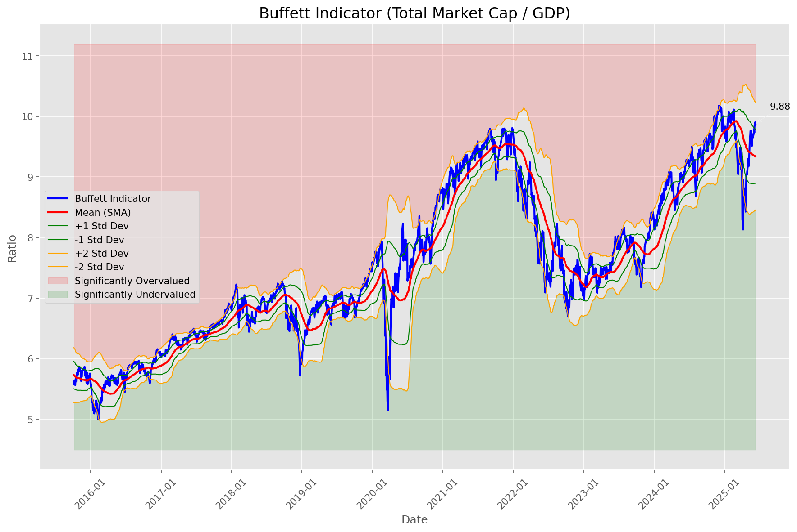

# **Daily Relative Strength Report**

**Date:** 2025-06-13

## **Market Valuation (Buffett Indicator)**

| Metric | Value |
|--------|-------|
| **Market Valuation** | **Overvalued** |
| **Current Ratio** | 9.91 |
| **Historical Mean** | 9.34 |
| **Standard Deviation** | 0.44 |
| **Z-Score (StdDev from Mean)** | 1.22 |
| **Total Market Cap** | $297.08 trillion |
| **GDP** | $29.98 trillion |

## **Market Insights**

### **Market is Overvalued**

The market appears to be trading above historical average valuations. While not at extreme levels, this suggests more modest future returns may be expected. Investors should:

- Focus on companies with reasonable valuations relative to their growth
- Be more selective with new positions
- Look for stocks showing relative strength within their sectors
- Consider trimming positions in extremely overvalued names

Historically, periods of mild overvaluation can persist for extended periods, but returns tend to be below average.

### **Buffett Indicator Overview**

The Buffett Indicator (Total Market Cap / GDP) is a measure of the stock market's valuation relative to the size of the economy. It is named after Warren Buffett, who described it as "probably the best single measure of where valuations stand at any given moment."

- **Values above +2 standard deviations:** Market significantly overvalued
- **Values above +1 standard deviation:** Market overvalued
- **Values between -1 and +1 standard deviations:** Market fairly valued
- **Values below -1 standard deviation:** Market undervalued
- **Values below -2 standard deviations:** Market significantly undervalued

---

## **Sector Relative Strength**

Based on William O'Neil's Relative Strength Methodology

| ETF | Strength | RS Rating | Performance | Above Key MAs | Trend | Sector |
|-----|----------|-----------|-------------|--------------|-------|--------|
| [ARKF](https://www.tradingview.com/chart/?symbol=ARKF) | 97.0 | 94.0 | 34.07% | 10d ✓, 50d ✓, 200d ✓ | ↗️ | Fintech Innovation |
| [ARKW](https://www.tradingview.com/chart/?symbol=ARKW) | 97.0 | 94.0 | 34.97% | 10d ✓, 50d ✓, 200d ✓ | ↗️ | Next Generation Internet |
| [ARKK](https://www.tradingview.com/chart/?symbol=ARKK) | 96.5 | 93.0 | 31.26% | 10d ✓, 50d ✓, 200d ✓ | ↗️ | Innovation |
| [BLOK](https://www.tradingview.com/chart/?symbol=BLOK) | 96.0 | 92.0 | 29.06% | 10d ✓, 50d ✓, 200d ✓ | ↗️ | Blockchain & Cryptocurrency |
| [CIBR](https://www.tradingview.com/chart/?symbol=CIBR) | 90.0 | 80.0 | 16.57% | 10d ✓, 50d ✓, 200d ✓ | ↗️ | Cybersecurity |
| [AIQ](https://www.tradingview.com/chart/?symbol=AIQ) | 89.0 | 78.0 | 15.18% | 10d ✓, 50d ✓, 200d ✓ | ↗️ | Artificial Intelligence & Technology |
| [PAVE](https://www.tradingview.com/chart/?symbol=PAVE) | 88.5 | 77.0 | 14.12% | 10d ✓, 50d ✓, 200d ✓ | ↗️ | Infrastructure |
| [GLD](https://www.tradingview.com/chart/?symbol=GLD) | 87.5 | 75.0 | 13.47% | 10d ✓, 50d ✓, 200d ✓ | ↗️ | Gold |
| [XLC](https://www.tradingview.com/chart/?symbol=XLC) | 82.0 | 64.0 | 9.27% | 10d ✓, 50d ✓, 200d ✓ | ↗️ | Communications |
| [IYZ](https://www.tradingview.com/chart/?symbol=IYZ) | 80.0 | 60.0 | 7.55% | 10d ✓, 50d ✓, 200d ✓ | ↗️ | Telecommunications |
| [XLF](https://www.tradingview.com/chart/?symbol=XLF) | 80.0 | 60.0 | 7.55% | 10d ✓, 50d ✓, 200d ✓ | ↗️ | Financial |
| [SLV](https://www.tradingview.com/chart/?symbol=SLV) | 80.0 | 60.0 | 7.55% | 10d ✓, 50d ✓, 200d ✓ | ↗️ | Silver |
| [URA](https://www.tradingview.com/chart/?symbol=URA) | 79.0 | 98.0 | 53.17% | 10d ✓, 50d ✓, 200d ✓ | ↘️ | Uranium |
| [XLU](https://www.tradingview.com/chart/?symbol=XLU) | 77.5 | 55.0 | 5.86% | 10d ✓, 50d ✓, 200d ✓ | ↗️ | Utilities |
| [XLI](https://www.tradingview.com/chart/?symbol=XLI) | 76.1 | 72.0 | 11.71% | 10d ✗, 50d ✓, 200d ✓ | ↗️ | Industrial |
| [XLY](https://www.tradingview.com/chart/?symbol=XLY) | 75.1 | 70.0 | 10.96% | 10d ✗, 50d ✓, 200d ✓ | ↗️ | Consumer Discretionary |
| [DBA](https://www.tradingview.com/chart/?symbol=DBA) | 71.0 | 42.0 | 1.62% | 10d ✓, 50d ✓, 200d ✓ | ↗️ | Agriculture |
| [XLK](https://www.tradingview.com/chart/?symbol=XLK) | 70.5 | 81.0 | 16.81% | 10d ✓, 50d ✓, 200d ✓ | ↘️ | Technology |
| [SOXX](https://www.tradingview.com/chart/?symbol=SOXX) | 70.0 | 80.0 | 16.28% | 10d ✓, 50d ✓, 200d ✓ | ↘️ | Semiconductors |
| [ICLN](https://www.tradingview.com/chart/?symbol=ICLN) | 69.5 | 79.0 | 15.32% | 10d ✓, 50d ✓, 200d ✓ | ↘️ | Clean Energy |
| [XLP](https://www.tradingview.com/chart/?symbol=XLP) | 63.6 | 47.0 | 3.32% | 10d ✗, 50d ✓, 200d ✓ | ↗️ | Consumer Staples |
| [KWEB](https://www.tradingview.com/chart/?symbol=KWEB) | 62.0 | 24.0 | -2.44% | 10d ✓, 50d ✓, 200d ✓ | ↗️ | Chinese Internet |
| [JETS](https://www.tradingview.com/chart/?symbol=JETS) | 58.4 | 57.0 | 6.76% | 10d ✗, 50d ✓, 200d ✗ | ↗️ | Airlines |
| [ARKG](https://www.tradingview.com/chart/?symbol=ARKG) | 49.3 | 59.0 | 7.35% | 10d ✓, 50d ✓, 200d ✗ | ↘️ | Genomics |
| [DBC](https://www.tradingview.com/chart/?symbol=DBC) | 48.5 | 37.0 | 0.55% | 10d ✓, 50d ✓, 200d ✓ | ↘️ | Commodities |
| [IYT](https://www.tradingview.com/chart/?symbol=IYT) | 45.8 | 52.0 | 4.84% | 10d ✓, 50d ✓, 200d ✗ | ↘️ | Transportation |
| [XLB](https://www.tradingview.com/chart/?symbol=XLB) | 44.3 | 49.0 | 4.17% | 10d ✓, 50d ✓, 200d ✗ | ↘️ | Materials |
| [IYR](https://www.tradingview.com/chart/?symbol=IYR) | 43.3 | 47.0 | 3.41% | 10d ✓, 50d ✓, 200d ✗ | ↘️ | Real Estate |
| [XLE](https://www.tradingview.com/chart/?symbol=XLE) | 34.8 | 30.0 | -0.68% | 10d ✓, 50d ✓, 200d ✗ | ↘️ | Energy |
| [ITB](https://www.tradingview.com/chart/?symbol=ITB) | 34.3 | 29.0 | -0.87% | 10d ✓, 50d ✓, 200d ✗ | ↘️ | Home Construction |
| [IBB](https://www.tradingview.com/chart/?symbol=IBB) | 31.3 | 23.0 | -3.11% | 10d ✓, 50d ✓, 200d ✗ | ↘️ | Biotechnology |
| [XLV](https://www.tradingview.com/chart/?symbol=XLV) | 29.3 | 19.0 | -4.88% | 10d ✓, 50d ✓, 200d ✗ | ↘️ | Healthcare |
| [BIL](https://www.tradingview.com/chart/?symbol=BIL) | 26.4 | 33.0 | -0.02% | 10d ✓, 50d ✗, 200d ✗ | ↘️ | Short-term Treasuries |
| [TLT](https://www.tradingview.com/chart/?symbol=TLT) | 20.4 | 21.0 | -3.84% | 10d ✓, 50d ✗, 200d ✗ | ↘️ | Long-term Treasuries |
| [UUP](https://www.tradingview.com/chart/?symbol=UUP) | 9.5 | 19.0 | -4.64% | 10d ✗, 50d ✗, 200d ✗ | ↘️ | U.S. Dollar |

### **Sector ETF Performance Interpretation**

This table shows the relative strength metrics for different market sectors based on their representative ETFs:

- **ETF**: The ETF used to measure sector performance (click for chart)
- **Strength**: Overall sector strength score (0-100) combining multiple factors
- **RS Rating**: O'Neil RS rating of the sector ETF
- **Performance**: Performance of the sector ETF relative to SPY
- **Above Key MAs**: Whether the ETF is trading above its 10, 50, and 200-day moving averages
- **Trend**: Whether the sector is in an uptrend (↗️) or downtrend (↘️)

### **Current Sector Leadership**

The current market leadership is coming from the following sectors: **Fintech Innovation, Next Generation Internet, Innovation**.

The **Fintech Innovation** sector (represented by **ARKF**) is showing particularly strong relative strength with an RS rating of 94.0 and performance of 34.07% vs. the S&P 500. This sector is trading above its 10-day, 50-day, 200-day moving average(s). Investors should consider focusing on high RS stocks within these leading sectors for potential outperformance.

---

## **Buy Recommendations**

The following 67 stocks show exceptional relative strength:

| RS Rating | Buy Score | Current Price | Chart | Name | Ticker |
|-----------|-----------|---------------|-------|------|--------|
| 100 | 100 | $73.84 | [Chart](https://www.tradingview.com/chart/?symbol=HOOD) | Robinhood Markets, Inc. Class A Common Stock | HOOD |
| 100 | 100 | $57.15 | [Chart](https://www.tradingview.com/chart/?symbol=HIMS) | Hims & Hers Health, Inc. | HIMS |
| 100 | 100 | $140.10 | [Chart](https://www.tradingview.com/chart/?symbol=SEZL) | Sezzle Inc. Common Stock | SEZL |
| 100 | 100 | $158.44 | [Chart](https://www.tradingview.com/chart/?symbol=LEU) | Centrus Energy Corp. | LEU |
| 100 | 100 | $95.11 | [Chart](https://www.tradingview.com/chart/?symbol=RBLX) | Roblox Corporation | RBLX |
| 100 | 100 | $222.12 | [Chart](https://www.tradingview.com/chart/?symbol=AGX) | Argan, Inc | AGX |
| 100 | 100 | $135.19 | [Chart](https://www.tradingview.com/chart/?symbol=PLTR) | Palantir Technologies Inc. Class A Common Stock | PLTR |
| 100 | 100 | $238.25 | [Chart](https://www.tradingview.com/chart/?symbol=DAVE) | Dave Inc. Class A Common Stock | DAVE |
| 99 | 100 | $487.67 | [Chart](https://www.tradingview.com/chart/?symbol=GEV) | GE Vernova Inc. | GEV |
| 98 | 100 | $130.73 | [Chart](https://www.tradingview.com/chart/?symbol=CLS) | Celestica, Inc. | CLS |
| 98 | 100 | $48.82 | [Chart](https://www.tradingview.com/chart/?symbol=AU) | AngloGold Ashanti plc | AU |
| 98 | 100 | $42.56 | [Chart](https://www.tradingview.com/chart/?symbol=FARO) | Faro Technologies Inc | FARO |
| 98 | 100 | $145.48 | [Chart](https://www.tradingview.com/chart/?symbol=IRTC) | iRhythm Technologies, Inc | IRTC |
| 97 | 100 | $25.62 | [Chart](https://www.tradingview.com/chart/?symbol=CRK) | Comstock Resources, Inc. | CRK |
| 97 | 100 | $481.73 | [Chart](https://www.tradingview.com/chart/?symbol=CRWD) | CrowdStrike Holdings, Inc. Class A Common Stock | CRWD |
| 97 | 100 | $20.42 | [Chart](https://www.tradingview.com/chart/?symbol=MIR) | Mirion Technologies, Inc. | MIR |
| 97 | 100 | $146.52 | [Chart](https://www.tradingview.com/chart/?symbol=COOP) | Mr. Cooper Group Inc. Common Stock | COOP |
| 97 | 100 | $775.20 | [Chart](https://www.tradingview.com/chart/?symbol=AXON) | Axon Enterprise, Inc. Common Stock | AXON |
| 96 | 100 | $250.64 | [Chart](https://www.tradingview.com/chart/?symbol=GWRE) | GUIDEWIRE SOFTWARE, INC. | GWRE |
| 96 | 100 | $37.41 | [Chart](https://www.tradingview.com/chart/?symbol=AS) | Amer Sports, Inc. | AS |
| 96 | 100 | $41.24 | [Chart](https://www.tradingview.com/chart/?symbol=KTOS) | Kratos Defense & Security Solutions, Inc. | KTOS |
| 96 | 100 | $274.99 | [Chart](https://www.tradingview.com/chart/?symbol=TLN) | Talen Energy Corporation Common Stock | TLN |
| 95 | 100 | $26.41 | [Chart](https://www.tradingview.com/chart/?symbol=OR) | OR Royalties Inc. | OR |
| 94 | 100 | $21.42 | [Chart](https://www.tradingview.com/chart/?symbol=MAG) | MAG Silver Corp. | MAG |
| 94 | 100 | $60.70 | [Chart](https://www.tradingview.com/chart/?symbol=IBIT) | iShares Bitcoin Trust ETF | IBIT |
| 94 | 100 | $44.19 | [Chart](https://www.tradingview.com/chart/?symbol=ARKF) | ARK Fintech Innovation ETF | ARKF |
| 94 | 100 | $30.23 | [Chart](https://www.tradingview.com/chart/?symbol=HODL) | VanEck Bitcoin ETF | HODL |
| 94 | 100 | $103.60 | [Chart](https://www.tradingview.com/chart/?symbol=JCI) | Johnson Controls International plc | JCI |
| 93 | 100 | $506.99 | [Chart](https://www.tradingview.com/chart/?symbol=CASY) | Casey's General Stores Inc | CASY |
| 93 | 100 | $58.79 | [Chart](https://www.tradingview.com/chart/?symbol=CAKE) | Cheesecake Factory (The) | CAKE |
| 93 | 100 | $24.49 | [Chart](https://www.tradingview.com/chart/?symbol=TFPM) | Triple Flag Precious Metals Corp. | TFPM |
| 93 | 100 | $176.29 | [Chart](https://www.tradingview.com/chart/?symbol=EAT) | Brinker International, Inc. | EAT |
| 92 | 100 | $25.33 | [Chart](https://www.tradingview.com/chart/?symbol=SRAD) | Sportradar Group AG Class A Ordinary Shares | SRAD |
| 92 | 100 | $70.61 | [Chart](https://www.tradingview.com/chart/?symbol=GDXJ) | VanEck Junior Gold Miners ETF | GDXJ |
| 91 | 100 | $160.52 | [Chart](https://www.tradingview.com/chart/?symbol=CAH) | Cardinal Health, Inc. | CAH |
| 91 | 100 | $132.76 | [Chart](https://www.tradingview.com/chart/?symbol=NTES) | NetEase, inc. | NTES |
| 90 | 100 | $186.09 | [Chart](https://www.tradingview.com/chart/?symbol=CVLT) | Commault Systems, Inc. | CVLT |
| 90 | 100 | $28.94 | [Chart](https://www.tradingview.com/chart/?symbol=FMS) | Fresenius Medical Care AG | FMS |
| 90 | 100 | $58.13 | [Chart](https://www.tradingview.com/chart/?symbol=SHLD) | Global X Defense Tech ETF | SHLD |
| 89 | 100 | $36.52 | [Chart](https://www.tradingview.com/chart/?symbol=UGL) | ProShares Ultra Gold | UGL |
| 89 | 100 | $90.41 | [Chart](https://www.tradingview.com/chart/?symbol=WPM) | Wheaton Precious Metals Corp. Common Stock | WPM |
| 89 | 100 | $35.70 | [Chart](https://www.tradingview.com/chart/?symbol=AHR) | American Healthcare REIT, Inc. | AHR |
| 89 | 100 | $72.52 | [Chart](https://www.tradingview.com/chart/?symbol=CTVA) | Corteva, Inc. Common Stock | CTVA |
| 88 | 100 | $28.22 | [Chart](https://www.tradingview.com/chart/?symbol=DB) | Deutsche Bank Aktiengesellschaft | DB |
| 87 | 100 | $184.10 | [Chart](https://www.tradingview.com/chart/?symbol=PM) | Philip Morris International Inc. | PM |
| 89 | 99 | $53.53 | [Chart](https://www.tradingview.com/chart/?symbol=GDX) | VanEck Gold Miners ETF | GDX |
| 86 | 99 | $281.81 | [Chart](https://www.tradingview.com/chart/?symbol=VRSN) | VeriSign Inc | VRSN |
| 89 | 98 | $48.48 | [Chart](https://www.tradingview.com/chart/?symbol=SIL) | Global X Silver Miners ETF (NEW) | SIL |
| 86 | 98 | $77.44 | [Chart](https://www.tradingview.com/chart/?symbol=EBAY) | eBay Inc | EBAY |
| 85 | 97 | $28.60 | [Chart](https://www.tradingview.com/chart/?symbol=IMAX) | Imax Corp | IMAX |
| 85 | 97 | $29.20 | [Chart](https://www.tradingview.com/chart/?symbol=MP) | MP Materials Corp. | MP |
| 84 | 97 | $122.09 | [Chart](https://www.tradingview.com/chart/?symbol=AEM) | Agnico Eagle Mines Ltd. | AEM |
| 87 | 96 | $25.24 | [Chart](https://www.tradingview.com/chart/?symbol=GFI) | Gold Fields Ltd ADR | GFI |
| 87 | 96 | $28.98 | [Chart](https://www.tradingview.com/chart/?symbol=TGS) | Transportadora de Gas del Sur S.A. ADS | TGS |
| 86 | 96 | $86.90 | [Chart](https://www.tradingview.com/chart/?symbol=NDAQ) | Nasdaq, Inc. Common Stock | NDAQ |
| 86 | 96 | $109.21 | [Chart](https://www.tradingview.com/chart/?symbol=SHOP) | Shopify Inc. Class A subordinate voting shares | SHOP |
| 84 | 96 | $43.03 | [Chart](https://www.tradingview.com/chart/?symbol=ZLAB) | Zai Lab Limited American Depositary Shares | ZLAB |
| 86 | 95 | $49.02 | [Chart](https://www.tradingview.com/chart/?symbol=GH) | Guardant Health, Inc. Common Stock | GH |
| 85 | 95 | $64.98 | [Chart](https://www.tradingview.com/chart/?symbol=SLF) | Sun Life Financial Inc. | SLF |
| 84 | 95 | $43.97 | [Chart](https://www.tradingview.com/chart/?symbol=EWP) | iShares MSCI Spain ETF | EWP |
| 84 | 95 | $218.47 | [Chart](https://www.tradingview.com/chart/?symbol=BAP) | Credicorp LTD | BAP |
| 83 | 95 | $82.20 | [Chart](https://www.tradingview.com/chart/?symbol=TPR) | Tapestry, Inc. Common Stock | TPR |
| 85 | 94 | $88.50 | [Chart](https://www.tradingview.com/chart/?symbol=SCHW) | The Charles Schwab Corporation | SCHW |
| 84 | 94 | $197.68 | [Chart](https://www.tradingview.com/chart/?symbol=COF) | Capital One Financial | COF |
| 84 | 94 | $53.56 | [Chart](https://www.tradingview.com/chart/?symbol=AKRO) | Akero Therapeutics, Inc. Common Stock | AKRO |
| 82 | 94 | $48.60 | [Chart](https://www.tradingview.com/chart/?symbol=BTI) | British American Tobacco p.l.c. American Depositary Shares, American Depositary Shares, each representing one Ordinary Share | BTI |
| 80 | 92 | $73.11 | [Chart](https://www.tradingview.com/chart/?symbol=CIBR) | First Trust Exchange-Traded Fund II First Trust NASDAQ Cybersecurity ETF | CIBR |

---

## **Sell Recommendations**

The following 100 stocks show deteriorating relative strength:

| RS Rating | Sell Score | Current Price | Chart | Name | Ticker |
|-----------|------------|---------------|-------|------|--------|
| 1 | 100 | $10.35 | [Chart](https://www.tradingview.com/chart/?symbol=WNC) | Wabash National Corp. | WNC |
| 1 | 100 | $12.69 | [Chart](https://www.tradingview.com/chart/?symbol=IART) | Integra LifeSciences Holdings | IART |
| 1 | 100 | $11.96 | [Chart](https://www.tradingview.com/chart/?symbol=NRIX) | Nurix Therapeutics, Inc. Common stock | NRIX |
| 1 | 100 | $16.50 | [Chart](https://www.tradingview.com/chart/?symbol=NVDS) | Investment Managers Series Trust II Tradr 1.5X Short NVDA Daily ETF | NVDS |
| 1 | 100 | $30.76 | [Chart](https://www.tradingview.com/chart/?symbol=TECS) | Direxion Daily Technology Bear 3x Shares | TECS |
| 2 | 100 | $27.32 | [Chart](https://www.tradingview.com/chart/?symbol=QID) | ProShares UltraShort QQQ | QID |
| 2 | 100 | $10.17 | [Chart](https://www.tradingview.com/chart/?symbol=SONO) | Sonos, Inc. Common Stock | SONO |
| 2 | 100 | $10.59 | [Chart](https://www.tradingview.com/chart/?symbol=PACS) | PACS Group, Inc. | PACS |
| 3 | 100 | $100.00 | [Chart](https://www.tradingview.com/chart/?symbol=ONTO) | Onto Innovation Inc. | ONTO |
| 3 | 100 | $33.20 | [Chart](https://www.tradingview.com/chart/?symbol=CYTK) | Cytokinetics Inc. | CYTK |
| 3 | 100 | $21.26 | [Chart](https://www.tradingview.com/chart/?symbol=AMRK) | A-Mark Precious Metals, Inc. | AMRK |
| 3 | 100 | $10.67 | [Chart](https://www.tradingview.com/chart/?symbol=SNDX) | Syndax Pharmaceuticals, Inc. | SNDX |
| 3 | 100 | $10.52 | [Chart](https://www.tradingview.com/chart/?symbol=MBC) | MasterBrand, Inc. | MBC |
| 3 | 100 | $14.05 | [Chart](https://www.tradingview.com/chart/?symbol=INMD) | InMode Ltd. Ordinary Shares | INMD |
| 4 | 100 | $11.33 | [Chart](https://www.tradingview.com/chart/?symbol=HPK) | HighPeak Energy, Inc. Common Stock | HPK |
| 4 | 100 | $45.08 | [Chart](https://www.tradingview.com/chart/?symbol=SDOW) | ProShares UltraPro Short Dow 30 | SDOW |
| 4 | 100 | $12.57 | [Chart](https://www.tradingview.com/chart/?symbol=ERII) | Energy Recovery, Inc. | ERII |
| 4 | 100 | $140.33 | [Chart](https://www.tradingview.com/chart/?symbol=KRYS) | Krystal Biotech, Inc. Common Stock | KRYS |
| 5 | 100 | $54.71 | [Chart](https://www.tradingview.com/chart/?symbol=CCS) | CENTURY COMMUNITIES, INC. | CCS |
| 5 | 100 | $10.98 | [Chart](https://www.tradingview.com/chart/?symbol=TWO) | Two Harbors Investment Corp. | TWO |
| 5 | 100 | $11.19 | [Chart](https://www.tradingview.com/chart/?symbol=PUBM) | PubMatic, Inc. Class A Common Stock | PUBM |
| 5 | 100 | $32.42 | [Chart](https://www.tradingview.com/chart/?symbol=MBIN) | Merchants Bancorp Common Stock | MBIN |
| 5 | 100 | $25.56 | [Chart](https://www.tradingview.com/chart/?symbol=JANX) | Janux Therapeutics, Inc. Common Stock | JANX |
| 5 | 100 | $45.44 | [Chart](https://www.tradingview.com/chart/?symbol=LINE) | Lineage, Inc. Common Stock | LINE |
| 6 | 100 | $17.25 | [Chart](https://www.tradingview.com/chart/?symbol=CODI) | Compass Diversified | CODI |
| 6 | 100 | $110.30 | [Chart](https://www.tradingview.com/chart/?symbol=AMR) | Alpha Metallurgical Resources, Inc. | AMR |
| 6 | 100 | $52.71 | [Chart](https://www.tradingview.com/chart/?symbol=SLVM) | Sylvamo Corporation | SLVM |
| 7 | 100 | $39.72 | [Chart](https://www.tradingview.com/chart/?symbol=APOG) | Apogee Enterprises Inc | APOG |
| 7 | 100 | $10.50 | [Chart](https://www.tradingview.com/chart/?symbol=SCS) | Steelcase, Inc. | SCS |
| 7 | 100 | $17.65 | [Chart](https://www.tradingview.com/chart/?symbol=AMTB) | Amerant Bancorp Inc. | AMTB |
| 8 | 100 | $38.42 | [Chart](https://www.tradingview.com/chart/?symbol=TMF) | Direxion Daily 20+ Year Treasury Bull 3X Shares (based on the NYSE 20 Year Plus Treasury Bond Index; symbol AXTWEN) | TMF |
| 8 | 100 | $12.42 | [Chart](https://www.tradingview.com/chart/?symbol=WSR) | Whitestone REIT | WSR |
| 8 | 100 | $93.26 | [Chart](https://www.tradingview.com/chart/?symbol=ZBH) | Zimmer Biomet Holdings, Inc. | ZBH |
| 8 | 100 | $10.02 | [Chart](https://www.tradingview.com/chart/?symbol=LBTYA) | Liberty Global Ltd. Class A Common Shares | LBTYA |
| 9 | 100 | $20.79 | [Chart](https://www.tradingview.com/chart/?symbol=SPT) | Sprout Social, Inc Class A Common Stock | SPT |
| 9 | 100 | $21.72 | [Chart](https://www.tradingview.com/chart/?symbol=KIDS) | OrthoPediatrics Corp. Common Stock | KIDS |
| 10 | 100 | $23.73 | [Chart](https://www.tradingview.com/chart/?symbol=RPD) | Rapid7, Inc. Common Stock | RPD |
| 10 | 100 | $10.14 | [Chart](https://www.tradingview.com/chart/?symbol=LBTYK) | Liberty Global Ltd. Class C Common Shares | LBTYK |
| 10 | 100 | $122.10 | [Chart](https://www.tradingview.com/chart/?symbol=TFX) | Teleflex Incorporated | TFX |
| 11 | 100 | $31.76 | [Chart](https://www.tradingview.com/chart/?symbol=FUN) | Six Flags Entertainment Corporation | FUN |
| 13 | 100 | $88.04 | [Chart](https://www.tradingview.com/chart/?symbol=BCC) | Boise Cascade Company | BCC |
| 13 | 100 | $55.24 | [Chart](https://www.tradingview.com/chart/?symbol=AMWD) | American Woodmark Corp | AMWD |
| 2 | 99 | $12.55 | [Chart](https://www.tradingview.com/chart/?symbol=TZA) | Direxion Daily Small Cap Bear 3x Shares | TZA |
| 2 | 99 | $48.00 | [Chart](https://www.tradingview.com/chart/?symbol=CCOI) | Cogent Communications Holdings, Inc. | CCOI |
| 8 | 98 | $10.95 | [Chart](https://www.tradingview.com/chart/?symbol=NEWT) | NewtekOne, Inc. Common Stock | NEWT |
| 9 | 98 | $38.54 | [Chart](https://www.tradingview.com/chart/?symbol=WLY) | John Wiley & Sons, Inc. Class A | WLY |
| 13 | 98 | $15.20 | [Chart](https://www.tradingview.com/chart/?symbol=SEM) | SELECT MEDICAL HOLDINGS CORP | SEM |
| 13 | 98 | $54.74 | [Chart](https://www.tradingview.com/chart/?symbol=GIS) | General Mills, Inc. | GIS |
| 13 | 98 | $15.07 | [Chart](https://www.tradingview.com/chart/?symbol=IGT) | International Game Technology PLC | IGT |
| 15 | 98 | $66.12 | [Chart](https://www.tradingview.com/chart/?symbol=ZROZ) | PIMCO 25+ Year Zero Coupon U.S. Treasury Index Exchange-Traded Fund | ZROZ |
| 18 | 98 | $132.38 | [Chart](https://www.tradingview.com/chart/?symbol=ICUI) | ICU Medical Inc | ICUI |
| 7 | 97 | $33.63 | [Chart](https://www.tradingview.com/chart/?symbol=TWST) | Twist Bioscience Corporation Common Stock | TWST |
| 8 | 97 | $103.43 | [Chart](https://www.tradingview.com/chart/?symbol=PDD) | PDD Holdings Inc. American Depositary Shares | PDD |
| 14 | 96 | $75.63 | [Chart](https://www.tradingview.com/chart/?symbol=EXPO) | Exponent Inc | EXPO |
| 15 | 96 | $97.60 | [Chart](https://www.tradingview.com/chart/?symbol=UFPI) | UFP Industries, Inc. Common Stock | UFPI |
| 15 | 96 | $76.23 | [Chart](https://www.tradingview.com/chart/?symbol=CBT) | Cabot Corporation | CBT |
| 11 | 95 | $443.13 | [Chart](https://www.tradingview.com/chart/?symbol=WSO) | Watsco, Inc. | WSO |
| 15 | 95 | $41.30 | [Chart](https://www.tradingview.com/chart/?symbol=POR) | Portland General Electric Company | POR |
| 11 | 94 | $99.08 | [Chart](https://www.tradingview.com/chart/?symbol=CHD) | Church & Dwight Co., Inc. | CHD |
| 15 | 94 | $42.44 | [Chart](https://www.tradingview.com/chart/?symbol=PRKS) | United Parks & Resorts Inc. | PRKS |
| 8 | 93 | $60.20 | [Chart](https://www.tradingview.com/chart/?symbol=GMED) | GLOBUS MEDICAL INC | GMED |
| 16 | 93 | $13.92 | [Chart](https://www.tradingview.com/chart/?symbol=BSM) | Black Stone Minerals, L.P. | BSM |
| 18 | 93 | $10.49 | [Chart](https://www.tradingview.com/chart/?symbol=MYI) | BLACKROCK MUNIYIELD QUALITY FUND III, INC. | MYI |
| 20 | 93 | $10.64 | [Chart](https://www.tradingview.com/chart/?symbol=CARS) | Cars.com Inc. Common Stock | CARS |
| 14 | 92 | $64.29 | [Chart](https://www.tradingview.com/chart/?symbol=STC) | Stewart Information Services Corporation | STC |
| 15 | 92 | $234.96 | [Chart](https://www.tradingview.com/chart/?symbol=HUM) | Humana Inc. | HUM |
| 19 | 92 | $15.28 | [Chart](https://www.tradingview.com/chart/?symbol=VRE) | Veris Residential, Inc. | VRE |
| 20 | 92 | $55.38 | [Chart](https://www.tradingview.com/chart/?symbol=CNC) | Centene Corporation | CNC |
| 13 | 91 | $460.06 | [Chart](https://www.tradingview.com/chart/?symbol=VRTX) | Vertex Pharmaceuticals Inc | VRTX |
| 14 | 90 | $29.94 | [Chart](https://www.tradingview.com/chart/?symbol=OMCL) | Omnicell Inc | OMCL |
| 15 | 90 | $10.37 | [Chart](https://www.tradingview.com/chart/?symbol=NMZ) | Nuveen Municipal High Income Opportunity Fund | NMZ |
| 16 | 90 | $115.05 | [Chart](https://www.tradingview.com/chart/?symbol=BLDR) | Builders FirstSource, Inc. | BLDR |
| 21 | 90 | $15.86 | [Chart](https://www.tradingview.com/chart/?symbol=BBN) | BlackRock Taxable Municipal Bond Trust | BBN |
| 13 | 89 | $17.78 | [Chart](https://www.tradingview.com/chart/?symbol=ZTO) | ZTO Express (Cayman) Inc. American Depositary Shares, each representing one Class A ordinary share | ZTO |
| 17 | 89 | $26.29 | [Chart](https://www.tradingview.com/chart/?symbol=DOG) | ProShares Short Dow30 | DOG |
| 17 | 89 | $17.70 | [Chart](https://www.tradingview.com/chart/?symbol=JPMpM) | JPMorgan Chase & Co. Depositary Shares, each representing a 1/400th interest in a share of 4.20% Non-Cumulative Preferred Stock, Series MM | JPMpM |
| 20 | 89 | $46.09 | [Chart](https://www.tradingview.com/chart/?symbol=CNA) | CNA Financial Corporation | CNA |
| 21 | 88 | $17.05 | [Chart](https://www.tradingview.com/chart/?symbol=UMH) | UMH Properties, Inc. | UMH |
| 18 | 87 | $74.15 | [Chart](https://www.tradingview.com/chart/?symbol=AAON) | Aaon Inc | AAON |
| 19 | 87 | $63.00 | [Chart](https://www.tradingview.com/chart/?symbol=ELS) | Equity Lifestyle Properties, Inc. | ELS |
| 21 | 86 | $87.17 | [Chart](https://www.tradingview.com/chart/?symbol=TLT) | iShares 20+ Year Treasury Bond ETF | TLT |
| 22 | 86 | $55.46 | [Chart](https://www.tradingview.com/chart/?symbol=VGLT) | Vanguard Long-Term Treasury ETF | VGLT |
| 27 | 86 | $25.51 | [Chart](https://www.tradingview.com/chart/?symbol=WS) | Worthington Steel, Inc. | WS |
| 18 | 85 | $39.04 | [Chart](https://www.tradingview.com/chart/?symbol=LKQ) | LKQ Corporation | LKQ |
| 17 | 84 | $293.48 | [Chart](https://www.tradingview.com/chart/?symbol=MOH) | Molina Healthcare, Inc. | MOH |
| 20 | 82 | $133.89 | [Chart](https://www.tradingview.com/chart/?symbol=KMB) | Kimberly-Clark Corp. | KMB |
| 23 | 82 | $339.82 | [Chart](https://www.tradingview.com/chart/?symbol=EG) | Everest Group, Ltd. | EG |
| 19 | 81 | $199.20 | [Chart](https://www.tradingview.com/chart/?symbol=AAPL) | Apple Inc. | AAPL |
| 20 | 80 | $47.41 | [Chart](https://www.tradingview.com/chart/?symbol=GLPI) | Gaming and Leisure Properties, Inc. | GLPI |
| 23 | 78 | $137.35 | [Chart](https://www.tradingview.com/chart/?symbol=DVA) | DaVita Inc. | DVA |
| 34 | 78 | $17.44 | [Chart](https://www.tradingview.com/chart/?symbol=STAA) | Staar Surgical Co | STAA |
| 24 | 76 | $71.61 | [Chart](https://www.tradingview.com/chart/?symbol=NHI) | National Health Investors | NHI |
| 29 | 75 | $46.68 | [Chart](https://www.tradingview.com/chart/?symbol=CWT) | California Water Service | CWT |
| 28 | 73 | $184.39 | [Chart](https://www.tradingview.com/chart/?symbol=DKS) | Dick's Sporting Goods, Inc. | DKS |
| 36 | 73 | $223.50 | [Chart](https://www.tradingview.com/chart/?symbol=LOW) | Lowe's Companies Inc. | LOW |
| 36 | 71 | $85.82 | [Chart](https://www.tradingview.com/chart/?symbol=SIGI) | Selective Insurance Group | SIGI |
| 38 | 71 | $78.58 | [Chart](https://www.tradingview.com/chart/?symbol=AWR) | American States Water Company | AWR |
| 33 | 69 | $110.20 | [Chart](https://www.tradingview.com/chart/?symbol=SHV) | iShares Short Treasury Bond ETF | SHV |
| 33 | 67 | $91.54 | [Chart](https://www.tradingview.com/chart/?symbol=BIL) | SPDR Bloomberg 1-3 Month T-Bill ETF | BIL |
| 35 | 66 | $118.75 | [Chart](https://www.tradingview.com/chart/?symbol=ITGR) | Integer Holdings Corporation | ITGR |

## **Methodology**

This report uses William O'Neil's relative strength methodology from Investors Business Daily:

* **RS Rating**: Percentile rank of stock's performance vs. S&P 500 over the past 63 trading days (1-99 scale)
* **Buy Criteria**: RS Rating >= 80, price above 50-day MA, strong uptrend, increasing volume
* **Sell Criteria**: RS Rating < 40, price below 50-day MA, downtrend, decreasing volume

### **O'Neil's Key Principles**

1. **Focus on relative performance** - stocks outperforming the market
2. **Price trend confirmation** - stock must be in an uptrend
3. **Volume confirmation** - strong volume supports price moves
4. **Moving average validation** - price above key moving averages
5. **Market leaders only** - concentrate on top-performing stocks

*Report generated automatically after market close*