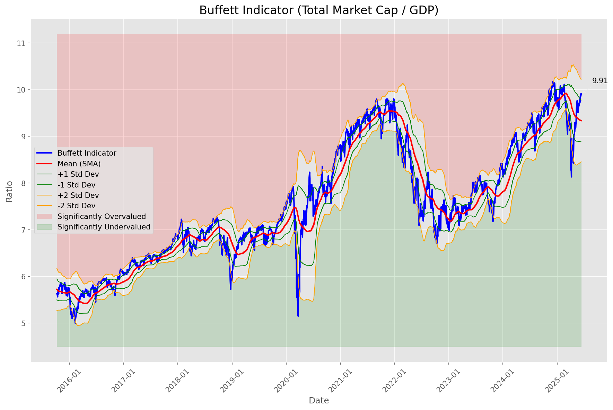
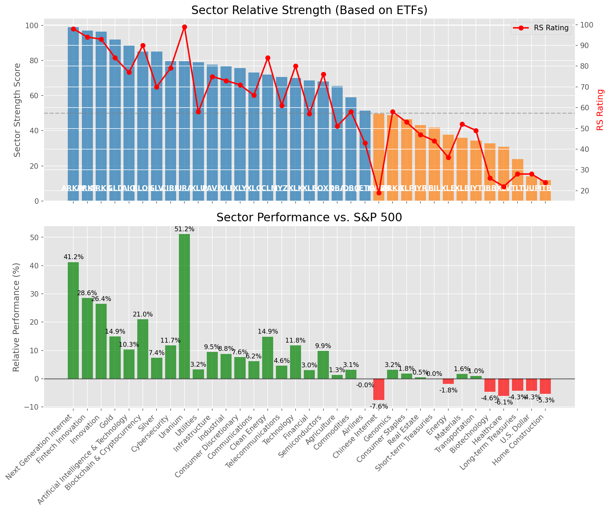

# **Daily Relative Strength Report**

**Date:** 2025-06-15

## **Market Valuation (Buffett Indicator)**

| Metric | Value |
|--------|-------|
| **Market Valuation** | **Overvalued** |
| **Current Ratio** | 9.79 |
| **Historical Mean** | 9.34 |
| **Standard Deviation** | 0.44 |
| **Z-Score (StdDev from Mean)** | 1.30 |
| **Total Market Cap** | $293.57 trillion |
| **GDP** | $29.98 trillion |

## **Market Insights**

### **Market is Overvalued**

The market appears to be trading above historical average valuations. While not at extreme levels, this suggests more modest future returns may be expected. Investors should:

- Focus on companies with reasonable valuations relative to their growth
- Be more selective with new positions
- Look for stocks showing relative strength within their sectors
- Consider trimming positions in extremely overvalued names

Historically, periods of mild overvaluation can persist for extended periods, but returns tend to be below average.

### **Buffett Indicator Overview**

The Buffett Indicator (Total Market Cap / GDP) is a measure of the stock market's valuation relative to the size of the economy. It is named after Warren Buffett, who described it as "probably the best single measure of where valuations stand at any given moment."

- **Values above +2 standard deviations:** Market significantly overvalued
- **Values above +1 standard deviation:** Market overvalued
- **Values between -1 and +1 standard deviations:** Market fairly valued
- **Values below -1 standard deviation:** Market undervalued
- **Values below -2 standard deviations:** Market significantly undervalued

---

## **Sector Relative Strength**

Based on William O'Neil's Relative Strength Methodology

| ETF | Strength | RS Rating | Performance | Above Key MAs | Trend | Sector |
|-----|----------|-----------|-------------|--------------|-------|--------|
| [ARKW](https://www.tradingview.com/chart/?symbol=ARKW) | 99.0 | 98.0 | 41.23% | 10d ✓, 50d ✓, 200d ✓ | ↗️ | Next Generation Internet |
| [ARKF](https://www.tradingview.com/chart/?symbol=ARKF) | 97.0 | 94.0 | 28.56% | 10d ✓, 50d ✓, 200d ✓ | ↗️ | Fintech Innovation |
| [ARKK](https://www.tradingview.com/chart/?symbol=ARKK) | 96.5 | 93.0 | 26.43% | 10d ✓, 50d ✓, 200d ✓ | ↗️ | Innovation |
| [GLD](https://www.tradingview.com/chart/?symbol=GLD) | 92.0 | 84.0 | 14.91% | 10d ✓, 50d ✓, 200d ✓ | ↗️ | Gold |
| [AIQ](https://www.tradingview.com/chart/?symbol=AIQ) | 88.5 | 77.0 | 10.34% | 10d ✓, 50d ✓, 200d ✓ | ↗️ | Artificial Intelligence & Technology |
| [BLOK](https://www.tradingview.com/chart/?symbol=BLOK) | 85.1 | 90.0 | 20.99% | 10d ✗, 50d ✓, 200d ✓ | ↗️ | Blockchain & Cryptocurrency |
| [SLV](https://www.tradingview.com/chart/?symbol=SLV) | 85.0 | 70.0 | 7.36% | 10d ✓, 50d ✓, 200d ✓ | ↗️ | Silver |
| [CIBR](https://www.tradingview.com/chart/?symbol=CIBR) | 79.6 | 79.0 | 11.71% | 10d ✗, 50d ✓, 200d ✓ | ↗️ | Cybersecurity |
| [URA](https://www.tradingview.com/chart/?symbol=URA) | 79.5 | 99.0 | 51.17% | 10d ✓, 50d ✓, 200d ✓ | ↘️ | Uranium |
| [XLU](https://www.tradingview.com/chart/?symbol=XLU) | 79.0 | 58.0 | 3.23% | 10d ✓, 50d ✓, 200d ✓ | ↗️ | Utilities |
| [PAVE](https://www.tradingview.com/chart/?symbol=PAVE) | 77.6 | 75.0 | 9.47% | 10d ✗, 50d ✓, 200d ✓ | ↗️ | Infrastructure |
| [XLI](https://www.tradingview.com/chart/?symbol=XLI) | 76.6 | 73.0 | 8.79% | 10d ✗, 50d ✓, 200d ✓ | ↗️ | Industrial |
| [XLY](https://www.tradingview.com/chart/?symbol=XLY) | 75.6 | 71.0 | 7.65% | 10d ✗, 50d ✓, 200d ✓ | ↗️ | Consumer Discretionary |
| [XLC](https://www.tradingview.com/chart/?symbol=XLC) | 73.1 | 66.0 | 6.21% | 10d ✗, 50d ✓, 200d ✓ | ↗️ | Communications |
| [ICLN](https://www.tradingview.com/chart/?symbol=ICLN) | 72.0 | 84.0 | 14.85% | 10d ✓, 50d ✓, 200d ✓ | ↘️ | Clean Energy |
| [IYZ](https://www.tradingview.com/chart/?symbol=IYZ) | 70.6 | 61.0 | 4.56% | 10d ✗, 50d ✓, 200d ✓ | ↗️ | Telecommunications |
| [XLK](https://www.tradingview.com/chart/?symbol=XLK) | 70.0 | 80.0 | 11.79% | 10d ✓, 50d ✓, 200d ✓ | ↘️ | Technology |
| [XLF](https://www.tradingview.com/chart/?symbol=XLF) | 68.6 | 57.0 | 2.97% | 10d ✗, 50d ✓, 200d ✓ | ↗️ | Financial |
| [SOXX](https://www.tradingview.com/chart/?symbol=SOXX) | 68.0 | 76.0 | 9.86% | 10d ✓, 50d ✓, 200d ✓ | ↘️ | Semiconductors |
| [DBA](https://www.tradingview.com/chart/?symbol=DBA) | 65.6 | 51.0 | 1.28% | 10d ✗, 50d ✓, 200d ✓ | ↗️ | Agriculture |
| [DBC](https://www.tradingview.com/chart/?symbol=DBC) | 59.0 | 58.0 | 3.10% | 10d ✓, 50d ✓, 200d ✓ | ↘️ | Commodities |
| [JETS](https://www.tradingview.com/chart/?symbol=JETS) | 51.4 | 43.0 | -0.05% | 10d ✗, 50d ✓, 200d ✗ | ↗️ | Airlines |
| [KWEB](https://www.tradingview.com/chart/?symbol=KWEB) | 49.6 | 19.0 | -7.56% | 10d ✗, 50d ✓, 200d ✓ | ↗️ | Chinese Internet |
| [ARKG](https://www.tradingview.com/chart/?symbol=ARKG) | 48.8 | 58.0 | 3.16% | 10d ✓, 50d ✓, 200d ✗ | ↘️ | Genomics |
| [XLP](https://www.tradingview.com/chart/?symbol=XLP) | 46.5 | 53.0 | 1.82% | 10d ✗, 50d ✗, 200d ✗ | ↗️ | Consumer Staples |
| [IYR](https://www.tradingview.com/chart/?symbol=IYR) | 43.3 | 47.0 | 0.45% | 10d ✓, 50d ✓, 200d ✗ | ↘️ | Real Estate |
| [BIL](https://www.tradingview.com/chart/?symbol=BIL) | 41.8 | 44.0 | 0.00% | 10d ✓, 50d ✓, 200d ✗ | ↘️ | Short-term Treasuries |
| [XLE](https://www.tradingview.com/chart/?symbol=XLE) | 37.8 | 36.0 | -1.85% | 10d ✓, 50d ✓, 200d ✗ | ↘️ | Energy |
| [XLB](https://www.tradingview.com/chart/?symbol=XLB) | 35.9 | 52.0 | 1.63% | 10d ✗, 50d ✓, 200d ✗ | ↘️ | Materials |
| [IYT](https://www.tradingview.com/chart/?symbol=IYT) | 34.4 | 49.0 | 0.99% | 10d ✗, 50d ✓, 200d ✗ | ↘️ | Transportation |
| [IBB](https://www.tradingview.com/chart/?symbol=IBB) | 32.8 | 26.0 | -4.61% | 10d ✓, 50d ✓, 200d ✗ | ↘️ | Biotechnology |
| [XLV](https://www.tradingview.com/chart/?symbol=XLV) | 30.8 | 22.0 | -6.07% | 10d ✓, 50d ✓, 200d ✗ | ↘️ | Healthcare |
| [TLT](https://www.tradingview.com/chart/?symbol=TLT) | 23.9 | 28.0 | -4.26% | 10d ✓, 50d ✗, 200d ✗ | ↘️ | Long-term Treasuries |
| [UUP](https://www.tradingview.com/chart/?symbol=UUP) | 14.0 | 28.0 | -4.30% | 10d ✗, 50d ✗, 200d ✗ | ↘️ | U.S. Dollar |
| [ITB](https://www.tradingview.com/chart/?symbol=ITB) | 12.0 | 24.0 | -5.35% | 10d ✗, 50d ✗, 200d ✗ | ↘️ | Home Construction |

### **Sector ETF Performance Interpretation**

This table shows the relative strength metrics for different market sectors based on their representative ETFs:

- **ETF**: The ETF used to measure sector performance (click for chart)
- **Strength**: Overall sector strength score (0-100) combining multiple factors
- **RS Rating**: O'Neil RS rating of the sector ETF
- **Performance**: Performance of the sector ETF relative to SPY
- **Above Key MAs**: Whether the ETF is trading above its 10, 50, and 200-day moving averages
- **Trend**: Whether the sector is in an uptrend (↗️) or downtrend (↘️)

### **Current Sector Leadership**

The current market leadership is coming from the following sectors: **Next Generation Internet, Fintech Innovation, Innovation**.

The **Next Generation Internet** sector (represented by **ARKW**) is showing particularly strong relative strength with an RS rating of 98.0 and performance of 41.23% vs. the S&P 500. This sector is trading above its 10-day, 50-day, 200-day moving average(s). Investors should consider focusing on high RS stocks within these leading sectors for potential outperformance.

---

## **Buy Recommendations**

The following 65 stocks show exceptional relative strength:

| RS Rating | Buy Score | Current Price | Chart | Name | Ticker |
|-----------|-----------|---------------|-------|------|--------|
| 100 | 100 | $162.24 | [Chart](https://www.tradingview.com/chart/?symbol=LEU) | Centrus Energy Corp. | LEU |
| 100 | 100 | $133.54 | [Chart](https://www.tradingview.com/chart/?symbol=SEZL) | Sezzle Inc. Common Stock | SEZL |
| 100 | 100 | $97.17 | [Chart](https://www.tradingview.com/chart/?symbol=RBLX) | Roblox Corporation | RBLX |
| 99 | 100 | $50.84 | [Chart](https://www.tradingview.com/chart/?symbol=AU) | AngloGold Ashanti plc | AU |
| 99 | 100 | $137.40 | [Chart](https://www.tradingview.com/chart/?symbol=PLTR) | Palantir Technologies Inc. Class A Common Stock | PLTR |
| 99 | 100 | $42.49 | [Chart](https://www.tradingview.com/chart/?symbol=FARO) | Faro Technologies Inc | FARO |
| 98 | 100 | $46.07 | [Chart](https://www.tradingview.com/chart/?symbol=DRS) | Leonardo DRS, Inc. Common Stock | DRS |
| 98 | 100 | $143.08 | [Chart](https://www.tradingview.com/chart/?symbol=COOP) | Mr. Cooper Group Inc. Common Stock | COOP |
| 97 | 100 | $19.90 | [Chart](https://www.tradingview.com/chart/?symbol=MIR) | Mirion Technologies, Inc. | MIR |
| 97 | 100 | $25.33 | [Chart](https://www.tradingview.com/chart/?symbol=CRK) | Comstock Resources, Inc. | CRK |
| 97 | 100 | $41.76 | [Chart](https://www.tradingview.com/chart/?symbol=KTOS) | Kratos Defense & Security Solutions, Inc. | KTOS |
| 96 | 100 | $125.33 | [Chart](https://www.tradingview.com/chart/?symbol=CLS) | Celestica, Inc. | CLS |
| 96 | 100 | $253.18 | [Chart](https://www.tradingview.com/chart/?symbol=GWRE) | GUIDEWIRE SOFTWARE, INC. | GWRE |
| 96 | 100 | $248.72 | [Chart](https://www.tradingview.com/chart/?symbol=CRS) | Carpenter Technology Corp | CRS |
| 96 | 100 | $26.80 | [Chart](https://www.tradingview.com/chart/?symbol=OR) | OR Royalties Inc. | OR |
| 96 | 100 | $21.42 | [Chart](https://www.tradingview.com/chart/?symbol=MAG) | MAG Silver Corp. | MAG |
| 96 | 100 | $480.62 | [Chart](https://www.tradingview.com/chart/?symbol=CRWD) | CrowdStrike Holdings, Inc. Class A Common Stock | CRWD |
| 96 | 100 | $277.16 | [Chart](https://www.tradingview.com/chart/?symbol=TLN) | Talen Energy Corporation Common Stock | TLN |
| 95 | 100 | $71.23 | [Chart](https://www.tradingview.com/chart/?symbol=GDXJ) | VanEck Junior Gold Miners ETF | GDXJ |
| 95 | 100 | $25.13 | [Chart](https://www.tradingview.com/chart/?symbol=TFPM) | Triple Flag Precious Metals Corp. | TFPM |
| 94 | 100 | $37.47 | [Chart](https://www.tradingview.com/chart/?symbol=UGL) | ProShares Ultra Gold | UGL |
| 94 | 100 | $44.07 | [Chart](https://www.tradingview.com/chart/?symbol=ARKF) | ARK Fintech Innovation ETF | ARKF |
| 94 | 100 | $25.71 | [Chart](https://www.tradingview.com/chart/?symbol=GFI) | Gold Fields Ltd ADR | GFI |
| 94 | 100 | $506.16 | [Chart](https://www.tradingview.com/chart/?symbol=CASY) | Casey's General Stores Inc | CASY |
| 93 | 100 | $161.41 | [Chart](https://www.tradingview.com/chart/?symbol=CAH) | Cardinal Health, Inc. | CAH |
| 93 | 100 | $174.57 | [Chart](https://www.tradingview.com/chart/?symbol=EAT) | Brinker International, Inc. | EAT |
| 93 | 100 | $129.38 | [Chart](https://www.tradingview.com/chart/?symbol=NTES) | NetEase, inc. | NTES |
| 93 | 100 | $55.62 | [Chart](https://www.tradingview.com/chart/?symbol=AKRO) | Akero Therapeutics, Inc. Common Stock | AKRO |
| 92 | 100 | $59.28 | [Chart](https://www.tradingview.com/chart/?symbol=SHLD) | Global X Defense Tech ETF | SHLD |
| 92 | 100 | $91.70 | [Chart](https://www.tradingview.com/chart/?symbol=WPM) | Wheaton Precious Metals Corp. Common Stock | WPM |
| 92 | 100 | $54.46 | [Chart](https://www.tradingview.com/chart/?symbol=GDX) | VanEck Gold Miners ETF | GDX |
| 91 | 100 | $48.81 | [Chart](https://www.tradingview.com/chart/?symbol=SIL) | Global X Silver Miners ETF (NEW) | SIL |
| 91 | 100 | $710.85 | [Chart](https://www.tradingview.com/chart/?symbol=SPOT) | Spotify Technology S.A. | SPOT |
| 90 | 100 | $184.33 | [Chart](https://www.tradingview.com/chart/?symbol=PM) | Philip Morris International Inc. | PM |
| 90 | 100 | $24.33 | [Chart](https://www.tradingview.com/chart/?symbol=SRAD) | Sportradar Group AG Class A Ordinary Shares | SRAD |
| 90 | 100 | $72.43 | [Chart](https://www.tradingview.com/chart/?symbol=CTVA) | Corteva, Inc. Common Stock | CTVA |
| 89 | 100 | $124.46 | [Chart](https://www.tradingview.com/chart/?symbol=AEM) | Agnico Eagle Mines Ltd. | AEM |
| 89 | 100 | $28.88 | [Chart](https://www.tradingview.com/chart/?symbol=IMAX) | Imax Corp | IMAX |
| 89 | 100 | $35.40 | [Chart](https://www.tradingview.com/chart/?symbol=AHR) | American Healthcare REIT, Inc. | AHR |
| 88 | 100 | $28.61 | [Chart](https://www.tradingview.com/chart/?symbol=FMS) | Fresenius Medical Care AG | FMS |
| 87 | 100 | $279.90 | [Chart](https://www.tradingview.com/chart/?symbol=VRSN) | VeriSign Inc | VRSN |
| 88 | 99 | $180.22 | [Chart](https://www.tradingview.com/chart/?symbol=ITA) | iShares U.S. Aerospace & Defense ETF | ITA |
| 88 | 99 | $182.29 | [Chart](https://www.tradingview.com/chart/?symbol=RGLD) | Royal Gold Inc | RGLD |
| 87 | 99 | $48.80 | [Chart](https://www.tradingview.com/chart/?symbol=BTI) | British American Tobacco p.l.c. American Depositary Shares, American Depositary Shares, each representing one Ordinary Share | BTI |
| 86 | 99 | $217.50 | [Chart](https://www.tradingview.com/chart/?symbol=DRI) | Darden Restaurants, Inc. | DRI |
| 88 | 98 | $136.67 | [Chart](https://www.tradingview.com/chart/?symbol=PPA) | Invesco Aerospace & Defense ETF | PPA |
| 87 | 98 | $217.30 | [Chart](https://www.tradingview.com/chart/?symbol=BAP) | Credicorp LTD | BAP |
| 85 | 98 | $41.12 | [Chart](https://www.tradingview.com/chart/?symbol=VIRT) | Virtu Financial, Inc. Class A | VIRT |
| 84 | 97 | $316.29 | [Chart](https://www.tradingview.com/chart/?symbol=GLD) | SPDR Gold Trust, SPDR Gold Shares | GLD |
| 84 | 97 | $32.75 | [Chart](https://www.tradingview.com/chart/?symbol=SGOL) | abrdn Physical Gold Shares ETF | SGOL |
| 84 | 97 | $33.09 | [Chart](https://www.tradingview.com/chart/?symbol=OUNZ) | VanEck Merk Gold ETF | OUNZ |
| 84 | 97 | $64.74 | [Chart](https://www.tradingview.com/chart/?symbol=IAU) | iShares Gold Trust | IAU |
| 84 | 97 | $67.97 | [Chart](https://www.tradingview.com/chart/?symbol=GLDM) | SPDR Gold MiniShares | GLDM |
| 84 | 97 | $33.91 | [Chart](https://www.tradingview.com/chart/?symbol=AAAU) | Goldman Sachs Physical Gold ETF Shares | AAAU |
| 86 | 96 | $85.59 | [Chart](https://www.tradingview.com/chart/?symbol=NDAQ) | Nasdaq, Inc. Common Stock | NDAQ |
| 84 | 96 | $34.24 | [Chart](https://www.tradingview.com/chart/?symbol=IAUM) | iShares Gold Trust Micro | IAUM |
| 83 | 96 | $26.29 | [Chart](https://www.tradingview.com/chart/?symbol=PHYS) | Sprott Physical Gold Trust | PHYS |
| 85 | 95 | $80.12 | [Chart](https://www.tradingview.com/chart/?symbol=BBCA) | JPMorgan BetaBuilders Canada ETF | BBCA |
| 83 | 95 | $30.55 | [Chart](https://www.tradingview.com/chart/?symbol=MP) | MP Materials Corp. | MP |
| 84 | 93 | $49.29 | [Chart](https://www.tradingview.com/chart/?symbol=GH) | Guardant Health, Inc. Common Stock | GH |
| 84 | 93 | $27.93 | [Chart](https://www.tradingview.com/chart/?symbol=TGS) | Transportadora de Gas del Sur S.A. ADS | TGS |
| 80 | 93 | $56.84 | [Chart](https://www.tradingview.com/chart/?symbol=EQT) | EQT CORP | EQT |
| 80 | 91 | $171.76 | [Chart](https://www.tradingview.com/chart/?symbol=FNV) | Franco-Nevada Corporation | FNV |
| 80 | 91 | $145.69 | [Chart](https://www.tradingview.com/chart/?symbol=RTX) | RTX Corporation | RTX |
| 81 | 90 | $29.01 | [Chart](https://www.tradingview.com/chart/?symbol=PAAS) | Pan American Silver Corp. | PAAS |

---

## **Sell Recommendations**

The following 156 stocks show deteriorating relative strength:

| RS Rating | Sell Score | Current Price | Chart | Name | Ticker |
|-----------|------------|---------------|-------|------|--------|
| 1 | 100 | $32.02 | [Chart](https://www.tradingview.com/chart/?symbol=TECS) | Direxion Daily Technology Bear 3x Shares | TECS |
| 1 | 100 | $12.16 | [Chart](https://www.tradingview.com/chart/?symbol=IART) | Integra LifeSciences Holdings | IART |
| 2 | 100 | $11.93 | [Chart](https://www.tradingview.com/chart/?symbol=NRIX) | Nurix Therapeutics, Inc. Common stock | NRIX |
| 2 | 100 | $10.36 | [Chart](https://www.tradingview.com/chart/?symbol=WNC) | Wabash National Corp. | WNC |
| 2 | 100 | $17.00 | [Chart](https://www.tradingview.com/chart/?symbol=NVDS) | Investment Managers Series Trust II Tradr 1.5X Short NVDA Daily ETF | NVDS |
| 2 | 100 | $94.70 | [Chart](https://www.tradingview.com/chart/?symbol=ONTO) | Onto Innovation Inc. | ONTO |
| 2 | 100 | $17.06 | [Chart](https://www.tradingview.com/chart/?symbol=BEAM) | Beam Therapeutics Inc. Common Stock | BEAM |
| 2 | 100 | $10.25 | [Chart](https://www.tradingview.com/chart/?symbol=SNDX) | Syndax Pharmaceuticals, Inc. | SNDX |
| 2 | 100 | $17.60 | [Chart](https://www.tradingview.com/chart/?symbol=ICHR) | Ichor Holdings | ICHR |
| 3 | 100 | $20.72 | [Chart](https://www.tradingview.com/chart/?symbol=THS) | Treehouse Foods, Inc. | THS |
| 3 | 100 | $10.32 | [Chart](https://www.tradingview.com/chart/?symbol=PACS) | PACS Group, Inc. | PACS |
| 3 | 100 | $13.36 | [Chart](https://www.tradingview.com/chart/?symbol=INMD) | InMode Ltd. Ordinary Shares | INMD |
| 3 | 100 | $10.07 | [Chart](https://www.tradingview.com/chart/?symbol=MBC) | MasterBrand, Inc. | MBC |
| 3 | 100 | $43.65 | [Chart](https://www.tradingview.com/chart/?symbol=LINE) | Lineage, Inc. Common Stock | LINE |
| 4 | 100 | $137.07 | [Chart](https://www.tradingview.com/chart/?symbol=KRYS) | Krystal Biotech, Inc. Common Stock | KRYS |
| 4 | 100 | $10.71 | [Chart](https://www.tradingview.com/chart/?symbol=PUBM) | PubMatic, Inc. Class A Common Stock | PUBM |
| 4 | 100 | $12.36 | [Chart](https://www.tradingview.com/chart/?symbol=ERII) | Energy Recovery, Inc. | ERII |
| 5 | 100 | $50.72 | [Chart](https://www.tradingview.com/chart/?symbol=SLVM) | Sylvamo Corporation | SLVM |
| 5 | 100 | $10.80 | [Chart](https://www.tradingview.com/chart/?symbol=TWO) | Two Harbors Investment Corp. | TWO |
| 5 | 100 | $29.87 | [Chart](https://www.tradingview.com/chart/?symbol=FUN) | Six Flags Entertainment Corporation | FUN |
| 5 | 100 | $52.88 | [Chart](https://www.tradingview.com/chart/?symbol=CCS) | CENTURY COMMUNITIES, INC. | CCS |
| 5 | 100 | $10.41 | [Chart](https://www.tradingview.com/chart/?symbol=CWK) | Cushman & Wakefield plc Ordinary Shares | CWK |
| 5 | 100 | $34.38 | [Chart](https://www.tradingview.com/chart/?symbol=CYTK) | Cytokinetics Inc. | CYTK |
| 5 | 100 | $82.14 | [Chart](https://www.tradingview.com/chart/?symbol=LNW) | Light & Wonder, Inc. Common Stock | LNW |
| 6 | 100 | $20.28 | [Chart](https://www.tradingview.com/chart/?symbol=HI) | Hillenbrand, Inc. | HI |
| 6 | 100 | $15.27 | [Chart](https://www.tradingview.com/chart/?symbol=SAFE) | Safehold Inc. | SAFE |
| 6 | 100 | $22.22 | [Chart](https://www.tradingview.com/chart/?symbol=AMRK) | A-Mark Precious Metals, Inc. | AMRK |
| 6 | 100 | $38.55 | [Chart](https://www.tradingview.com/chart/?symbol=APOG) | Apogee Enterprises Inc | APOG |
| 6 | 100 | $31.27 | [Chart](https://www.tradingview.com/chart/?symbol=MBIN) | Merchants Bancorp Common Stock | MBIN |
| 7 | 100 | $11.90 | [Chart](https://www.tradingview.com/chart/?symbol=HPK) | HighPeak Energy, Inc. Common Stock | HPK |
| 7 | 100 | $24.90 | [Chart](https://www.tradingview.com/chart/?symbol=JANX) | Janux Therapeutics, Inc. Common Stock | JANX |
| 7 | 100 | $10.16 | [Chart](https://www.tradingview.com/chart/?symbol=SCS) | Steelcase, Inc. | SCS |
| 7 | 100 | $17.01 | [Chart](https://www.tradingview.com/chart/?symbol=AMTB) | Amerant Bancorp Inc. | AMTB |
| 8 | 100 | $91.28 | [Chart](https://www.tradingview.com/chart/?symbol=ZBH) | Zimmer Biomet Holdings, Inc. | ZBH |
| 8 | 100 | $12.85 | [Chart](https://www.tradingview.com/chart/?symbol=THRY) | Thryv Holdings, Inc. Common Stock | THRY |
| 8 | 100 | $17.25 | [Chart](https://www.tradingview.com/chart/?symbol=CODI) | Compass Diversified | CODI |
| 9 | 100 | $20.30 | [Chart](https://www.tradingview.com/chart/?symbol=SPT) | Sprout Social, Inc Class A Common Stock | SPT |
| 9 | 100 | $23.52 | [Chart](https://www.tradingview.com/chart/?symbol=RPD) | Rapid7, Inc. Common Stock | RPD |
| 9 | 100 | $26.08 | [Chart](https://www.tradingview.com/chart/?symbol=VKTX) | Viking Therapeutics, Inc | VKTX |
| 9 | 100 | $19.40 | [Chart](https://www.tradingview.com/chart/?symbol=HVT) | Haverty Furniture Companies, Inc. | HVT |
| 10 | 100 | $112.62 | [Chart](https://www.tradingview.com/chart/?symbol=AMR) | Alpha Metallurgical Resources, Inc. | AMR |
| 10 | 100 | $18.31 | [Chart](https://www.tradingview.com/chart/?symbol=DNTH) | Dianthus Therapeutics, Inc. Common Stock | DNTH |
| 10 | 100 | $12.40 | [Chart](https://www.tradingview.com/chart/?symbol=WSR) | Whitestone REIT | WSR |
| 10 | 100 | $21.16 | [Chart](https://www.tradingview.com/chart/?symbol=KIDS) | OrthoPediatrics Corp. Common Stock | KIDS |
| 11 | 100 | $85.73 | [Chart](https://www.tradingview.com/chart/?symbol=BCC) | Boise Cascade Company | BCC |
| 11 | 100 | $52.91 | [Chart](https://www.tradingview.com/chart/?symbol=AMWD) | American Woodmark Corp | AMWD |
| 12 | 100 | $119.93 | [Chart](https://www.tradingview.com/chart/?symbol=TFX) | Teleflex Incorporated | TFX |
| 12 | 100 | $10.02 | [Chart](https://www.tradingview.com/chart/?symbol=LBTYA) | Liberty Global Ltd. Class A Common Shares | LBTYA |
| 14 | 100 | $10.14 | [Chart](https://www.tradingview.com/chart/?symbol=LBTYK) | Liberty Global Ltd. Class C Common Shares | LBTYK |
| 3 | 99 | $10.17 | [Chart](https://www.tradingview.com/chart/?symbol=SONO) | Sonos, Inc. Common Stock | SONO |
| 3 | 99 | $13.91 | [Chart](https://www.tradingview.com/chart/?symbol=DQ) | Daqo New Energy Corp. American Depositary Shares (each representing 5 Ordinary Shares) | DQ |
| 3 | 99 | $10.46 | [Chart](https://www.tradingview.com/chart/?symbol=LC) | LendingClub Corporation | LC |
| 8 | 99 | $33.52 | [Chart](https://www.tradingview.com/chart/?symbol=TWST) | Twist Bioscience Corporation Common Stock | TWST |
| 10 | 99 | $37.20 | [Chart](https://www.tradingview.com/chart/?symbol=TMF) | Direxion Daily 20+ Year Treasury Bull 3X Shares (based on the NYSE 20 Year Plus Treasury Bond Index; symbol AXTWEN) | TMF |
| 12 | 99 | $47.56 | [Chart](https://www.tradingview.com/chart/?symbol=SDOW) | ProShares UltraPro Short Dow 30 | SDOW |
| 16 | 99 | $64.98 | [Chart](https://www.tradingview.com/chart/?symbol=ZROZ) | PIMCO 25+ Year Zero Coupon U.S. Treasury Index Exchange-Traded Fund | ZROZ |
| 21 | 99 | $12.98 | [Chart](https://www.tradingview.com/chart/?symbol=MED) | Medifast, Inc. | MED |
| 10 | 98 | $73.63 | [Chart](https://www.tradingview.com/chart/?symbol=FND) | Floor & Decor Holdings, Inc. | FND |
| 10 | 98 | $18.04 | [Chart](https://www.tradingview.com/chart/?symbol=IRT) | Independence Realty Trust Inc. | IRT |
| 10 | 98 | $41.06 | [Chart](https://www.tradingview.com/chart/?symbol=PRKS) | United Parks & Resorts Inc. | PRKS |
| 11 | 98 | $18.36 | [Chart](https://www.tradingview.com/chart/?symbol=PLAB) | Photronics Inc | PLAB |
| 12 | 98 | $14.60 | [Chart](https://www.tradingview.com/chart/?symbol=IGT) | International Game Technology PLC | IGT |
| 13 | 98 | $10.58 | [Chart](https://www.tradingview.com/chart/?symbol=NMFC) | NEW MOUNTAIN FINANCE CORPORATION | NMFC |
| 14 | 98 | $74.72 | [Chart](https://www.tradingview.com/chart/?symbol=CBT) | Cabot Corporation | CBT |
| 17 | 98 | $46.51 | [Chart](https://www.tradingview.com/chart/?symbol=EDU) | New Oriental Education and Technology Group, Inc. American Depositary Shares (each representing ten (10) Common Shares) | EDU |
| 18 | 98 | $132.04 | [Chart](https://www.tradingview.com/chart/?symbol=ICUI) | ICU Medical Inc | ICUI |
| 7 | 97 | $100.58 | [Chart](https://www.tradingview.com/chart/?symbol=PDD) | PDD Holdings Inc. American Depositary Shares | PDD |
| 6 | 96 | $28.90 | [Chart](https://www.tradingview.com/chart/?symbol=QDEL) | QuidelOrtho Corporation Common Stock | QDEL |
| 7 | 96 | $10.41 | [Chart](https://www.tradingview.com/chart/?symbol=NEWT) | NewtekOne, Inc. Common Stock | NEWT |
| 9 | 96 | $431.99 | [Chart](https://www.tradingview.com/chart/?symbol=WSO) | Watsco, Inc. | WSO |
| 11 | 96 | $12.58 | [Chart](https://www.tradingview.com/chart/?symbol=PMT) | PennyMac Mortgage Investment Trust | PMT |
| 9 | 95 | $34.30 | [Chart](https://www.tradingview.com/chart/?symbol=AVNT) | Avient Corporation | AVNT |
| 10 | 95 | $37.73 | [Chart](https://www.tradingview.com/chart/?symbol=WLY) | John Wiley & Sons, Inc. Class A | WLY |
| 15 | 95 | $53.56 | [Chart](https://www.tradingview.com/chart/?symbol=GIS) | General Mills, Inc. | GIS |
| 15 | 95 | $95.67 | [Chart](https://www.tradingview.com/chart/?symbol=UFPI) | UFP Industries, Inc. Common Stock | UFPI |
| 16 | 95 | $10.30 | [Chart](https://www.tradingview.com/chart/?symbol=CARS) | Cars.com Inc. Common Stock | CARS |
| 19 | 95 | $24.60 | [Chart](https://www.tradingview.com/chart/?symbol=WS) | Worthington Steel, Inc. | WS |
| 9 | 94 | $127.52 | [Chart](https://www.tradingview.com/chart/?symbol=RGEN) | Repligen Corp | RGEN |
| 15 | 94 | $15.06 | [Chart](https://www.tradingview.com/chart/?symbol=SEM) | SELECT MEDICAL HOLDINGS CORP | SEM |
| 18 | 94 | $36.07 | [Chart](https://www.tradingview.com/chart/?symbol=NBHC) | NATIONAL BANK HOLDINGS CORP. | NBHC |
| 17 | 93 | $40.96 | [Chart](https://www.tradingview.com/chart/?symbol=POR) | Portland General Electric Company | POR |
| 8 | 92 | $58.90 | [Chart](https://www.tradingview.com/chart/?symbol=GMED) | GLOBUS MEDICAL INC | GMED |
| 13 | 92 | $111.29 | [Chart](https://www.tradingview.com/chart/?symbol=BLDR) | Builders FirstSource, Inc. | BLDR |
| 13 | 92 | $62.73 | [Chart](https://www.tradingview.com/chart/?symbol=STC) | Stewart Information Services Corporation | STC |
| 17 | 92 | $36.93 | [Chart](https://www.tradingview.com/chart/?symbol=LIT) | Global X Lithium & Battery Tech ETF | LIT |
| 17 | 92 | $137.62 | [Chart](https://www.tradingview.com/chart/?symbol=LSTR) | Landstar System Inc | LSTR |
| 18 | 92 | $67.35 | [Chart](https://www.tradingview.com/chart/?symbol=TTC) | Toro Company (The) | TTC |
| 19 | 92 | $91.88 | [Chart](https://www.tradingview.com/chart/?symbol=PCAR) | Paccar Inc | PCAR |
| 19 | 92 | $14.92 | [Chart](https://www.tradingview.com/chart/?symbol=VRE) | Veris Residential, Inc. | VRE |
| 9 | 91 | $15.10 | [Chart](https://www.tradingview.com/chart/?symbol=QNST) | QuinStreet, Inc. | QNST |
| 13 | 91 | $29.25 | [Chart](https://www.tradingview.com/chart/?symbol=OMCL) | Omnicell Inc | OMCL |
| 14 | 91 | $72.99 | [Chart](https://www.tradingview.com/chart/?symbol=AAON) | Aaon Inc | AAON |
| 22 | 91 | $21.29 | [Chart](https://www.tradingview.com/chart/?symbol=SIRI) | Sirius XM Holdings,  Inc | SIRI |
| 12 | 90 | $39.11 | [Chart](https://www.tradingview.com/chart/?symbol=PCH) | PotlatchDeltic Corporation Common Stock | PCH |
| 12 | 90 | $17.45 | [Chart](https://www.tradingview.com/chart/?symbol=ZTO) | ZTO Express (Cayman) Inc. American Depositary Shares, each representing one Class A ordinary share | ZTO |
| 13 | 90 | $61.88 | [Chart](https://www.tradingview.com/chart/?symbol=MAS) | Masco Corporation | MAS |
| 14 | 90 | $97.09 | [Chart](https://www.tradingview.com/chart/?symbol=CHD) | Church & Dwight Co., Inc. | CHD |
| 17 | 90 | $107.02 | [Chart](https://www.tradingview.com/chart/?symbol=MHO) | M/I Homes, Inc. | MHO |
| 18 | 90 | $10.27 | [Chart](https://www.tradingview.com/chart/?symbol=NMZ) | Nuveen Municipal High Income Opportunity Fund | NMZ |
| 21 | 90 | $235.26 | [Chart](https://www.tradingview.com/chart/?symbol=HUM) | Humana Inc. | HUM |
| 21 | 90 | $77.59 | [Chart](https://www.tradingview.com/chart/?symbol=OTTR) | Otter Tail Corp | OTTR |
| 15 | 89 | $455.45 | [Chart](https://www.tradingview.com/chart/?symbol=VRTX) | Vertex Pharmaceuticals Inc | VRTX |
| 18 | 89 | $74.01 | [Chart](https://www.tradingview.com/chart/?symbol=MKC) | McCormick & Company, Incorporated Non-VTG CS | MKC |
| 23 | 89 | $15.81 | [Chart](https://www.tradingview.com/chart/?symbol=BBN) | BlackRock Taxable Municipal Bond Trust | BBN |
| 24 | 89 | $41.98 | [Chart](https://www.tradingview.com/chart/?symbol=SW) | Smurfit Westrock plc | SW |
| 26 | 89 | $13.00 | [Chart](https://www.tradingview.com/chart/?symbol=MRTN) | Marten Transport Ltd | MRTN |
| 14 | 88 | $11.63 | [Chart](https://www.tradingview.com/chart/?symbol=FFIC) | Flushing Financial Corp | FFIC |
| 20 | 88 | $62.36 | [Chart](https://www.tradingview.com/chart/?symbol=ELS) | Equity Lifestyle Properties, Inc. | ELS |
| 20 | 88 | $16.77 | [Chart](https://www.tradingview.com/chart/?symbol=UMH) | UMH Properties, Inc. | UMH |
| 21 | 88 | $17.08 | [Chart](https://www.tradingview.com/chart/?symbol=SVOL) | Simplify Volatility Premium ETF | SVOL |
| 23 | 88 | $10.40 | [Chart](https://www.tradingview.com/chart/?symbol=MYI) | BLACKROCK MUNIYIELD QUALITY FUND III, INC. | MYI |
| 21 | 87 | $45.64 | [Chart](https://www.tradingview.com/chart/?symbol=CNA) | CNA Financial Corporation | CNA |
| 23 | 87 | $40.76 | [Chart](https://www.tradingview.com/chart/?symbol=NBTB) | NBT Bancorp Inc | NBTB |
| 25 | 87 | $55.22 | [Chart](https://www.tradingview.com/chart/?symbol=CNC) | Centene Corporation | CNC |
| 17 | 86 | $38.12 | [Chart](https://www.tradingview.com/chart/?symbol=LKQ) | LKQ Corporation | LKQ |
| 24 | 86 | $11.78 | [Chart](https://www.tradingview.com/chart/?symbol=NVG) | Nuveen AMT-Free Municipal Credit Income Fund | NVG |
| 25 | 86 | $46.79 | [Chart](https://www.tradingview.com/chart/?symbol=HCC) | Warrior Met Coal, Inc. | HCC |
| 17 | 85 | $75.90 | [Chart](https://www.tradingview.com/chart/?symbol=PFG) | Principal Financial Group, Inc. | PFG |
| 20 | 85 | $13.92 | [Chart](https://www.tradingview.com/chart/?symbol=BSM) | Black Stone Minerals, L.P. | BSM |
| 17 | 84 | $86.00 | [Chart](https://www.tradingview.com/chart/?symbol=BIDU) | Baidu, Inc. | BIDU |
| 18 | 83 | $196.45 | [Chart](https://www.tradingview.com/chart/?symbol=AAPL) | Apple Inc. | AAPL |
| 23 | 83 | $17.70 | [Chart](https://www.tradingview.com/chart/?symbol=JPMpM) | JPMorgan Chase & Co. Depositary Shares, each representing a 1/400th interest in a share of 4.20% Non-Cumulative Preferred Stock, Series MM | JPMpM |
| 24 | 83 | $22.68 | [Chart](https://www.tradingview.com/chart/?symbol=TLTW) | iShares 20+ Year Treasury Bond BuyWrite Strategy ETF | TLTW |
| 23 | 82 | $23.35 | [Chart](https://www.tradingview.com/chart/?symbol=FFBC) | First Financial Bancorp | FFBC |
| 22 | 81 | $130.84 | [Chart](https://www.tradingview.com/chart/?symbol=KMB) | Kimberly-Clark Corp. | KMB |
| 22 | 81 | $30.23 | [Chart](https://www.tradingview.com/chart/?symbol=CENTA) | Central Garden & Pet Company | CENTA |
| 27 | 81 | $71.62 | [Chart](https://www.tradingview.com/chart/?symbol=SWX) | Southwest Gas Holdings, Inc. | SWX |
| 28 | 81 | $55.10 | [Chart](https://www.tradingview.com/chart/?symbol=UHAL.B) | U-Haul Holding Company | UHAL.B |
| 29 | 81 | $30.37 | [Chart](https://www.tradingview.com/chart/?symbol=TPH) | Tri Pointe Homes, Inc. | TPH |
| 28 | 80 | $16.43 | [Chart](https://www.tradingview.com/chart/?symbol=PFS) | Provident Financial Services, Inc. | PFS |
| 30 | 80 | $19.52 | [Chart](https://www.tradingview.com/chart/?symbol=DJT) | Trump Media & Technology Group Corp. Common Stock | DJT |
| 24 | 79 | $93.40 | [Chart](https://www.tradingview.com/chart/?symbol=BOKF) | BOK Financial Corp | BOKF |
| 29 | 79 | $54.94 | [Chart](https://www.tradingview.com/chart/?symbol=VGLT) | Vanguard Long-Term Treasury ETF | VGLT |
| 28 | 78 | $86.33 | [Chart](https://www.tradingview.com/chart/?symbol=TLT) | iShares 20+ Year Treasury Bond ETF | TLT |
| 32 | 78 | $44.40 | [Chart](https://www.tradingview.com/chart/?symbol=SON) | Sonoco Products Company | SON |
| 26 | 77 | $98.39 | [Chart](https://www.tradingview.com/chart/?symbol=CCI) | Crown Castle Inc. | CCI |
| 26 | 77 | $41.23 | [Chart](https://www.tradingview.com/chart/?symbol=UDR) | UDR, Inc. | UDR |
| 31 | 77 | $217.27 | [Chart](https://www.tradingview.com/chart/?symbol=LOW) | Lowe's Companies Inc. | LOW |
| 26 | 76 | $43.21 | [Chart](https://www.tradingview.com/chart/?symbol=FBK) | FB Financial Corporation | FBK |
| 29 | 76 | $10.82 | [Chart](https://www.tradingview.com/chart/?symbol=NEA) | Nuveen AMT-Free Quality Municipal Income Fund | NEA |
| 31 | 76 | $85.12 | [Chart](https://www.tradingview.com/chart/?symbol=SIGI) | Selective Insurance Group | SIGI |
| 25 | 75 | $136.12 | [Chart](https://www.tradingview.com/chart/?symbol=DVA) | DaVita Inc. | DVA |
| 39 | 75 | $49.78 | [Chart](https://www.tradingview.com/chart/?symbol=MTBA) | Simplify MBS ETF | MTBA |
| 35 | 74 | $21.18 | [Chart](https://www.tradingview.com/chart/?symbol=LGOV) | First Trust Long Duration Opportunities ETF | LGOV |
| 28 | 73 | $188.56 | [Chart](https://www.tradingview.com/chart/?symbol=PKG) | Packaging Corp of America | PKG |
| 33 | 72 | $26.79 | [Chart](https://www.tradingview.com/chart/?symbol=DOG) | ProShares Short Dow30 | DOG |
| 30 | 71 | $88.30 | [Chart](https://www.tradingview.com/chart/?symbol=LPX) | Louisiana-Pacific Corp. | LPX |
| 37 | 71 | $78.14 | [Chart](https://www.tradingview.com/chart/?symbol=AWR) | American States Water Company | AWR |
| 33 | 70 | $46.33 | [Chart](https://www.tradingview.com/chart/?symbol=CWT) | California Water Service | CWT |
| 34 | 69 | $14.00 | [Chart](https://www.tradingview.com/chart/?symbol=DOLE) | Dole plc | DOLE |
| 36 | 68 | $75.67 | [Chart](https://www.tradingview.com/chart/?symbol=CNS) | Cohen & Steers Inc. | CNS |
| 34 | 67 | $35.10 | [Chart](https://www.tradingview.com/chart/?symbol=LTC) | LTC Properties, Inc. | LTC |
| 36 | 67 | $90.99 | [Chart](https://www.tradingview.com/chart/?symbol=ACGL) | Arch Capital Group Ltd | ACGL |
| 38 | 66 | $29.12 | [Chart](https://www.tradingview.com/chart/?symbol=HMC) | Honda Motor Co., Ltd. American Depositary Share, each representing three (3) shares of Common Stock | HMC |
| 38 | 66 | $294.95 | [Chart](https://www.tradingview.com/chart/?symbol=PSA) | Public Storage | PSA |
| 38 | 65 | $95.88 | [Chart](https://www.tradingview.com/chart/?symbol=PFSI) | PennyMac Financial Services, Inc. Common Stock | PFSI |

## **Methodology**

This report uses William O'Neil's relative strength methodology from Investors Business Daily:

* **RS Rating**: Percentile rank of stock's performance vs. S&P 500 over the past 63 trading days (1-99 scale)
* **Buy Criteria**: RS Rating >= 80, price above 50-day MA, strong uptrend, increasing volume
* **Sell Criteria**: RS Rating < 40, price below 50-day MA, downtrend, decreasing volume

### **O'Neil's Key Principles**

1. **Focus on relative performance** - stocks outperforming the market
2. **Price trend confirmation** - stock must be in an uptrend
3. **Volume confirmation** - strong volume supports price moves
4. **Moving average validation** - price above key moving averages
5. **Market leaders only** - concentrate on top-performing stocks

*Report generated automatically after market close*