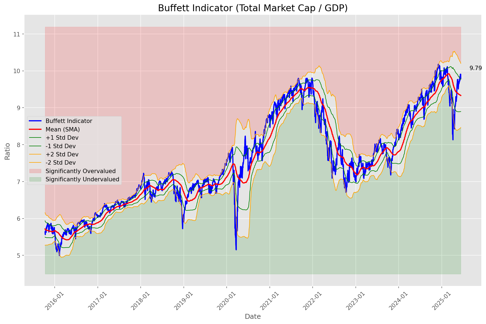
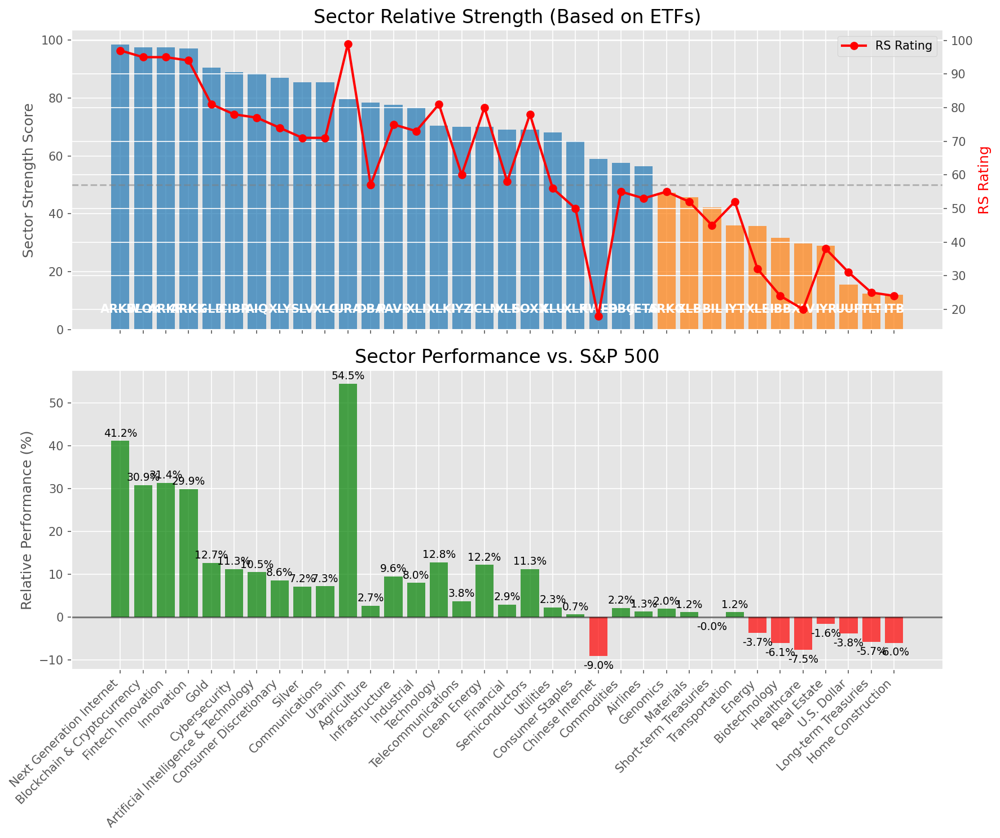

# **Daily Relative Strength Report**

**Date:** 2025-06-16

## **Market Valuation (Buffett Indicator)**

| Metric | Value |
|--------|-------|
| **Market Valuation** | **Overvalued** |
| **Current Ratio** | 9.88 |
| **Historical Mean** | 9.33 |
| **Standard Deviation** | 0.43 |
| **Z-Score (StdDev from Mean)** | 1.06 |
| **Total Market Cap** | $296.10 trillion |
| **GDP** | $29.98 trillion |

## **Market Insights**

### **Market is Overvalued**

The market appears to be trading above historical average valuations. While not at extreme levels, this suggests more modest future returns may be expected. Investors should:

- Focus on companies with reasonable valuations relative to their growth
- Be more selective with new positions
- Look for stocks showing relative strength within their sectors
- Consider trimming positions in extremely overvalued names

Historically, periods of mild overvaluation can persist for extended periods, but returns tend to be below average.

### **Buffett Indicator Overview**

The Buffett Indicator (Total Market Cap / GDP) is a measure of the stock market's valuation relative to the size of the economy. It is named after Warren Buffett, who described it as "probably the best single measure of where valuations stand at any given moment."

- **Values above +2 standard deviations:** Market significantly overvalued
- **Values above +1 standard deviation:** Market overvalued
- **Values between -1 and +1 standard deviations:** Market fairly valued
- **Values below -1 standard deviation:** Market undervalued
- **Values below -2 standard deviations:** Market significantly undervalued

---

## **Sector Relative Strength**

Based on William O'Neil's Relative Strength Methodology

| ETF | Strength | RS Rating | Performance | Above Key MAs | Trend | Sector |
|-----|----------|-----------|-------------|--------------|-------|--------|
| [ARKW](https://www.tradingview.com/chart/?symbol=ARKW) | 98.5 | 97.0 | 40.92% | 10d ✓, 50d ✓, 200d ✓ | ↗️ | Next Generation Internet |
| [BLOK](https://www.tradingview.com/chart/?symbol=BLOK) | 97.5 | 95.0 | 30.87% | 10d ✓, 50d ✓, 200d ✓ | ↗️ | Blockchain & Cryptocurrency |
| [ARKF](https://www.tradingview.com/chart/?symbol=ARKF) | 97.5 | 95.0 | 31.14% | 10d ✓, 50d ✓, 200d ✓ | ↗️ | Fintech Innovation |
| [ARKK](https://www.tradingview.com/chart/?symbol=ARKK) | 97.0 | 94.0 | 29.53% | 10d ✓, 50d ✓, 200d ✓ | ↗️ | Innovation |
| [GLD](https://www.tradingview.com/chart/?symbol=GLD) | 90.5 | 81.0 | 12.67% | 10d ✓, 50d ✓, 200d ✓ | ↗️ | Gold |
| [CIBR](https://www.tradingview.com/chart/?symbol=CIBR) | 89.0 | 78.0 | 11.14% | 10d ✓, 50d ✓, 200d ✓ | ↗️ | Cybersecurity |
| [AIQ](https://www.tradingview.com/chart/?symbol=AIQ) | 88.5 | 77.0 | 10.44% | 10d ✓, 50d ✓, 200d ✓ | ↗️ | Artificial Intelligence & Technology |
| [XLY](https://www.tradingview.com/chart/?symbol=XLY) | 87.0 | 74.0 | 8.65% | 10d ✓, 50d ✓, 200d ✓ | ↗️ | Consumer Discretionary |
| [XLC](https://www.tradingview.com/chart/?symbol=XLC) | 85.5 | 71.0 | 7.06% | 10d ✓, 50d ✓, 200d ✓ | ↗️ | Communications |
| [SLV](https://www.tradingview.com/chart/?symbol=SLV) | 85.5 | 71.0 | 7.09% | 10d ✓, 50d ✓, 200d ✓ | ↗️ | Silver |
| [URA](https://www.tradingview.com/chart/?symbol=URA) | 79.5 | 99.0 | 54.40% | 10d ✓, 50d ✓, 200d ✓ | ↘️ | Uranium |
| [DBA](https://www.tradingview.com/chart/?symbol=DBA) | 78.5 | 57.0 | 2.72% | 10d ✓, 50d ✓, 200d ✓ | ↗️ | Agriculture |
| [PAVE](https://www.tradingview.com/chart/?symbol=PAVE) | 77.6 | 75.0 | 9.43% | 10d ✗, 50d ✓, 200d ✓ | ↗️ | Infrastructure |
| [XLI](https://www.tradingview.com/chart/?symbol=XLI) | 76.6 | 73.0 | 7.98% | 10d ✗, 50d ✓, 200d ✓ | ↗️ | Industrial |
| [IYZ](https://www.tradingview.com/chart/?symbol=IYZ) | 70.6 | 61.0 | 3.71% | 10d ✗, 50d ✓, 200d ✓ | ↗️ | Telecommunications |
| [XLK](https://www.tradingview.com/chart/?symbol=XLK) | 70.5 | 81.0 | 12.71% | 10d ✓, 50d ✓, 200d ✓ | ↘️ | Technology |
| [ICLN](https://www.tradingview.com/chart/?symbol=ICLN) | 69.5 | 79.0 | 11.62% | 10d ✓, 50d ✓, 200d ✓ | ↘️ | Clean Energy |
| [XLF](https://www.tradingview.com/chart/?symbol=XLF) | 69.1 | 58.0 | 2.95% | 10d ✗, 50d ✓, 200d ✓ | ↗️ | Financial |
| [SOXX](https://www.tradingview.com/chart/?symbol=SOXX) | 69.0 | 78.0 | 11.28% | 10d ✓, 50d ✓, 200d ✓ | ↘️ | Semiconductors |
| [XLU](https://www.tradingview.com/chart/?symbol=XLU) | 67.6 | 55.0 | 1.97% | 10d ✗, 50d ✓, 200d ✓ | ↗️ | Utilities |
| [KWEB](https://www.tradingview.com/chart/?symbol=KWEB) | 59.0 | 18.0 | -9.00% | 10d ✓, 50d ✓, 200d ✓ | ↗️ | Chinese Internet |
| [DBC](https://www.tradingview.com/chart/?symbol=DBC) | 58.0 | 56.0 | 2.15% | 10d ✓, 50d ✓, 200d ✓ | ↘️ | Commodities |
| [JETS](https://www.tradingview.com/chart/?symbol=JETS) | 55.9 | 52.0 | 1.05% | 10d ✗, 50d ✓, 200d ✗ | ↗️ | Airlines |
| [XLP](https://www.tradingview.com/chart/?symbol=XLP) | 55.2 | 50.0 | 0.58% | 10d ✗, 50d ✗, 200d ✓ | ↗️ | Consumer Staples |
| [ARKG](https://www.tradingview.com/chart/?symbol=ARKG) | 46.8 | 54.0 | 1.62% | 10d ✓, 50d ✓, 200d ✗ | ↘️ | Genomics |
| [BIL](https://www.tradingview.com/chart/?symbol=BIL) | 42.8 | 46.0 | -0.01% | 10d ✓, 50d ✓, 200d ✗ | ↘️ | Short-term Treasuries |
| [IYT](https://www.tradingview.com/chart/?symbol=IYT) | 36.4 | 53.0 | 1.18% | 10d ✗, 50d ✓, 200d ✗ | ↘️ | Transportation |
| [XLB](https://www.tradingview.com/chart/?symbol=XLB) | 35.9 | 52.0 | 1.00% | 10d ✗, 50d ✓, 200d ✗ | ↘️ | Materials |
| [XLE](https://www.tradingview.com/chart/?symbol=XLE) | 35.3 | 31.0 | -4.09% | 10d ✓, 50d ✓, 200d ✗ | ↘️ | Energy |
| [IBB](https://www.tradingview.com/chart/?symbol=IBB) | 31.8 | 24.0 | -6.40% | 10d ✓, 50d ✓, 200d ✗ | ↘️ | Biotechnology |
| [XLV](https://www.tradingview.com/chart/?symbol=XLV) | 29.8 | 20.0 | -7.86% | 10d ✓, 50d ✓, 200d ✗ | ↘️ | Healthcare |
| [IYR](https://www.tradingview.com/chart/?symbol=IYR) | 28.9 | 38.0 | -1.72% | 10d ✗, 50d ✓, 200d ✗ | ↘️ | Real Estate |
| [UUP](https://www.tradingview.com/chart/?symbol=UUP) | 15.5 | 31.0 | -3.98% | 10d ✗, 50d ✗, 200d ✗ | ↘️ | U.S. Dollar |
| [TLT](https://www.tradingview.com/chart/?symbol=TLT) | 13.0 | 26.0 | -5.63% | 10d ✗, 50d ✗, 200d ✗ | ↘️ | Long-term Treasuries |
| [ITB](https://www.tradingview.com/chart/?symbol=ITB) | 12.5 | 25.0 | -5.98% | 10d ✗, 50d ✗, 200d ✗ | ↘️ | Home Construction |

### **Sector ETF Performance Interpretation**

This table shows the relative strength metrics for different market sectors based on their representative ETFs:

- **ETF**: The ETF used to measure sector performance (click for chart)
- **Strength**: Overall sector strength score (0-100) combining multiple factors
- **RS Rating**: O'Neil RS rating of the sector ETF
- **Performance**: Performance of the sector ETF relative to SPY
- **Above Key MAs**: Whether the ETF is trading above its 10, 50, and 200-day moving averages
- **Trend**: Whether the sector is in an uptrend (↗️) or downtrend (↘️)

### **Current Sector Leadership**

The current market leadership is coming from the following sectors: **Next Generation Internet, Blockchain & Cryptocurrency, Fintech Innovation**.

The **Next Generation Internet** sector (represented by **ARKW**) is showing particularly strong relative strength with an RS rating of 97.0 and performance of 40.92% vs. the S&P 500. This sector is trading above its 10-day, 50-day, 200-day moving average(s). Investors should consider focusing on high RS stocks within these leading sectors for potential outperformance.

---

## **Buy Recommendations**

The following 77 stocks show exceptional relative strength:

| RS Rating | Buy Score | Current Price | Chart | Name | Ticker |
|-----------|-----------|---------------|-------|------|--------|
| 100 | 100 | $76.50 | [Chart](https://www.tradingview.com/chart/?symbol=HOOD) | Robinhood Markets, Inc. Class A Common Stock | HOOD |
| 100 | 100 | $58.92 | [Chart](https://www.tradingview.com/chart/?symbol=HIMS) | Hims & Hers Health, Inc. | HIMS |
| 100 | 100 | $145.66 | [Chart](https://www.tradingview.com/chart/?symbol=SEZL) | Sezzle Inc. Common Stock | SEZL |
| 100 | 100 | $167.91 | [Chart](https://www.tradingview.com/chart/?symbol=LEU) | Centrus Energy Corp. | LEU |
| 100 | 100 | $100.21 | [Chart](https://www.tradingview.com/chart/?symbol=RBLX) | Roblox Corporation | RBLX |
| 100 | 100 | $142.18 | [Chart](https://www.tradingview.com/chart/?symbol=PLTR) | Palantir Technologies Inc. Class A Common Stock | PLTR |
| 99 | 100 | $49.52 | [Chart](https://www.tradingview.com/chart/?symbol=AU) | AngloGold Ashanti plc | AU |
| 99 | 100 | $43.80 | [Chart](https://www.tradingview.com/chart/?symbol=FARO) | Faro Technologies Inc | FARO |
| 99 | 100 | $178.41 | [Chart](https://www.tradingview.com/chart/?symbol=NET) | Cloudflare, Inc. Class A common stock, par value $0.001 per share | NET |
| 98 | 100 | $70.68 | [Chart](https://www.tradingview.com/chart/?symbol=URBN) | Urban Outfitters Inc | URBN |
| 98 | 100 | $487.25 | [Chart](https://www.tradingview.com/chart/?symbol=GEV) | GE Vernova Inc. | GEV |
| 97 | 100 | $128.94 | [Chart](https://www.tradingview.com/chart/?symbol=CLS) | Celestica, Inc. | CLS |
| 97 | 100 | $26.25 | [Chart](https://www.tradingview.com/chart/?symbol=CRK) | Comstock Resources, Inc. | CRK |
| 97 | 100 | $20.48 | [Chart](https://www.tradingview.com/chart/?symbol=MIR) | Mirion Technologies, Inc. | MIR |
| 97 | 100 | $144.52 | [Chart](https://www.tradingview.com/chart/?symbol=COOP) | Mr. Cooper Group Inc. Common Stock | COOP |
| 97 | 100 | $23.56 | [Chart](https://www.tradingview.com/chart/?symbol=GRND) | Grindr Inc. | GRND |
| 96 | 100 | $248.74 | [Chart](https://www.tradingview.com/chart/?symbol=CRS) | Carpenter Technology Corp | CRS |
| 96 | 100 | $71.72 | [Chart](https://www.tradingview.com/chart/?symbol=ULS) | UL Solutions Inc. | ULS |
| 96 | 100 | $281.57 | [Chart](https://www.tradingview.com/chart/?symbol=TLN) | Talen Energy Corporation Common Stock | TLN |
| 95 | 100 | $253.06 | [Chart](https://www.tradingview.com/chart/?symbol=GWRE) | GUIDEWIRE SOFTWARE, INC. | GWRE |
| 95 | 100 | $478.75 | [Chart](https://www.tradingview.com/chart/?symbol=CRWD) | CrowdStrike Holdings, Inc. Class A Common Stock | CRWD |
| 95 | 100 | $45.86 | [Chart](https://www.tradingview.com/chart/?symbol=ARKF) | ARK Fintech Innovation ETF | ARKF |
| 95 | 100 | $34.72 | [Chart](https://www.tradingview.com/chart/?symbol=MP) | MP Materials Corp. | MP |
| 95 | 100 | $26.43 | [Chart](https://www.tradingview.com/chart/?symbol=OR) | OR Royalties Inc. | OR |
| 94 | 100 | $131.53 | [Chart](https://www.tradingview.com/chart/?symbol=NTES) | NetEase, inc. | NTES |
| 94 | 100 | $24.50 | [Chart](https://www.tradingview.com/chart/?symbol=TFPM) | Triple Flag Precious Metals Corp. | TFPM |
| 94 | 100 | $183.36 | [Chart](https://www.tradingview.com/chart/?symbol=EAT) | Brinker International, Inc. | EAT |
| 94 | 100 | $41.25 | [Chart](https://www.tradingview.com/chart/?symbol=KTOS) | Kratos Defense & Security Solutions, Inc. | KTOS |
| 93 | 100 | $21.42 | [Chart](https://www.tradingview.com/chart/?symbol=MAG) | MAG Silver Corp. | MAG |
| 93 | 100 | $61.82 | [Chart](https://www.tradingview.com/chart/?symbol=IBIT) | iShares Bitcoin Trust ETF | IBIT |
| 93 | 100 | $505.78 | [Chart](https://www.tradingview.com/chart/?symbol=CASY) | Casey's General Stores Inc | CASY |
| 93 | 100 | $104.27 | [Chart](https://www.tradingview.com/chart/?symbol=JCI) | Johnson Controls International plc | JCI |
| 92 | 100 | $161.39 | [Chart](https://www.tradingview.com/chart/?symbol=CAH) | Cardinal Health, Inc. | CAH |
| 92 | 100 | $59.30 | [Chart](https://www.tradingview.com/chart/?symbol=CAKE) | Cheesecake Factory (The) | CAKE |
| 91 | 100 | $36.41 | [Chart](https://www.tradingview.com/chart/?symbol=UGL) | ProShares Ultra Gold | UGL |
| 91 | 100 | $58.88 | [Chart](https://www.tradingview.com/chart/?symbol=SHLD) | Global X Defense Tech ETF | SHLD |
| 90 | 100 | $24.61 | [Chart](https://www.tradingview.com/chart/?symbol=SRAD) | Sportradar Group AG Class A Ordinary Shares | SRAD |
| 90 | 100 | $53.54 | [Chart](https://www.tradingview.com/chart/?symbol=GDX) | VanEck Gold Miners ETF | GDX |
| 90 | 100 | $63.24 | [Chart](https://www.tradingview.com/chart/?symbol=CHEF) | The Chef's Warehouse Inc | CHEF |
| 90 | 100 | $54.34 | [Chart](https://www.tradingview.com/chart/?symbol=AKRO) | Akero Therapeutics, Inc. Common Stock | AKRO |
| 90 | 100 | $91.69 | [Chart](https://www.tradingview.com/chart/?symbol=WPM) | Wheaton Precious Metals Corp. Common Stock | WPM |
| 90 | 100 | $210.26 | [Chart](https://www.tradingview.com/chart/?symbol=IBKR) | Interactive Brokers Group, Inc. Class A Common Stock | IBKR |
| 90 | 100 | $73.97 | [Chart](https://www.tradingview.com/chart/?symbol=CTVA) | Corteva, Inc. Common Stock | CTVA |
| 89 | 100 | $715.85 | [Chart](https://www.tradingview.com/chart/?symbol=SPOT) | Spotify Technology S.A. | SPOT |
| 88 | 100 | $84.44 | [Chart](https://www.tradingview.com/chart/?symbol=TPR) | Tapestry, Inc. Common Stock | TPR |
| 88 | 100 | $28.20 | [Chart](https://www.tradingview.com/chart/?symbol=DB) | Deutsche Bank Aktiengesellschaft | DB |
| 88 | 100 | $123.99 | [Chart](https://www.tradingview.com/chart/?symbol=AEM) | Agnico Eagle Mines Ltd. | AEM |
| 88 | 100 | $280.23 | [Chart](https://www.tradingview.com/chart/?symbol=VRSN) | VeriSign Inc | VRSN |
| 88 | 100 | $28.57 | [Chart](https://www.tradingview.com/chart/?symbol=FMS) | Fresenius Medical Care AG | FMS |
| 87 | 100 | $182.39 | [Chart](https://www.tradingview.com/chart/?symbol=PM) | Philip Morris International Inc. | PM |
| 89 | 99 | $197.76 | [Chart](https://www.tradingview.com/chart/?symbol=COF) | Capital One Financial | COF |
| 87 | 99 | $29.02 | [Chart](https://www.tradingview.com/chart/?symbol=IMAX) | Imax Corp | IMAX |
| 87 | 99 | $49.01 | [Chart](https://www.tradingview.com/chart/?symbol=BTI) | British American Tobacco p.l.c. American Depositary Shares, American Depositary Shares, each representing one Ordinary Share | BTI |
| 86 | 99 | $41.99 | [Chart](https://www.tradingview.com/chart/?symbol=VIRT) | Virtu Financial, Inc. Class A | VIRT |
| 85 | 99 | $237.98 | [Chart](https://www.tradingview.com/chart/?symbol=TTWO) | Take-Two Interactive Software Inc | TTWO |
| 89 | 98 | $48.66 | [Chart](https://www.tradingview.com/chart/?symbol=SIL) | Global X Silver Miners ETF (NEW) | SIL |
| 87 | 97 | $195.91 | [Chart](https://www.tradingview.com/chart/?symbol=GPOR) | Gulfport Energy Corporation | GPOR |
| 86 | 97 | $179.68 | [Chart](https://www.tradingview.com/chart/?symbol=RGLD) | Royal Gold Inc | RGLD |
| 85 | 97 | $76.23 | [Chart](https://www.tradingview.com/chart/?symbol=LLYVK) | Liberty Media Corporation Series C Liberty Live Common Stock | LLYVK |
| 85 | 97 | $77.98 | [Chart](https://www.tradingview.com/chart/?symbol=EBAY) | eBay Inc | EBAY |
| 86 | 96 | $86.70 | [Chart](https://www.tradingview.com/chart/?symbol=NDAQ) | Nasdaq, Inc. Common Stock | NDAQ |
| 86 | 96 | $88.33 | [Chart](https://www.tradingview.com/chart/?symbol=SANM) | Sanmina  Corp | SANM |
| 86 | 96 | $135.68 | [Chart](https://www.tradingview.com/chart/?symbol=PPA) | Invesco Aerospace & Defense ETF | PPA |
| 85 | 96 | $219.31 | [Chart](https://www.tradingview.com/chart/?symbol=BAP) | Credicorp LTD | BAP |
| 83 | 96 | $17.80 | [Chart](https://www.tradingview.com/chart/?symbol=BCS) | Barclays PLC | BCS |
| 82 | 94 | $33.75 | [Chart](https://www.tradingview.com/chart/?symbol=IAUM) | iShares Gold Trust Micro | IAUM |
| 81 | 94 | $63.81 | [Chart](https://www.tradingview.com/chart/?symbol=IAU) | iShares Gold Trust | IAU |
| 81 | 94 | $32.28 | [Chart](https://www.tradingview.com/chart/?symbol=SGOL) | abrdn Physical Gold Shares ETF | SGOL |
| 81 | 94 | $67.02 | [Chart](https://www.tradingview.com/chart/?symbol=GLDM) | SPDR Gold MiniShares | GLDM |
| 81 | 94 | $311.79 | [Chart](https://www.tradingview.com/chart/?symbol=GLD) | SPDR Gold Trust, SPDR Gold Shares | GLD |
| 81 | 94 | $33.42 | [Chart](https://www.tradingview.com/chart/?symbol=AAAU) | Goldman Sachs Physical Gold ETF Shares | AAAU |
| 81 | 94 | $32.62 | [Chart](https://www.tradingview.com/chart/?symbol=OUNZ) | VanEck Merk Gold ETF | OUNZ |
| 81 | 94 | $58.04 | [Chart](https://www.tradingview.com/chart/?symbol=EQT) | EQT CORP | EQT |
| 84 | 93 | $89.14 | [Chart](https://www.tradingview.com/chart/?symbol=SCHW) | The Charles Schwab Corporation | SCHW |
| 84 | 93 | $49.03 | [Chart](https://www.tradingview.com/chart/?symbol=GH) | Guardant Health, Inc. Common Stock | GH |
| 83 | 93 | $80.52 | [Chart](https://www.tradingview.com/chart/?symbol=BBCA) | JPMorgan BetaBuilders Canada ETF | BBCA |
| 82 | 92 | $168.42 | [Chart](https://www.tradingview.com/chart/?symbol=NTRA) | Natera, Inc. Common Stock | NTRA |

---

## **Sell Recommendations**

The following 169 stocks show deteriorating relative strength:

| RS Rating | Sell Score | Current Price | Chart | Name | Ticker |
|-----------|------------|---------------|-------|------|--------|
| 1 | 100 | $12.33 | [Chart](https://www.tradingview.com/chart/?symbol=IART) | Integra LifeSciences Holdings | IART |
| 1 | 100 | $13.98 | [Chart](https://www.tradingview.com/chart/?symbol=RXST) | RxSight, Inc. Common Stock | RXST |
| 1 | 100 | $16.50 | [Chart](https://www.tradingview.com/chart/?symbol=NVDS) | Investment Managers Series Trust II Tradr 1.5X Short NVDA Daily ETF | NVDS |
| 1 | 100 | $30.59 | [Chart](https://www.tradingview.com/chart/?symbol=TECS) | Direxion Daily Technology Bear 3x Shares | TECS |
| 2 | 100 | $10.66 | [Chart](https://www.tradingview.com/chart/?symbol=WNC) | Wabash National Corp. | WNC |
| 2 | 100 | $17.90 | [Chart](https://www.tradingview.com/chart/?symbol=ICHR) | Ichor Holdings | ICHR |
| 2 | 100 | $11.74 | [Chart](https://www.tradingview.com/chart/?symbol=NRIX) | Nurix Therapeutics, Inc. Common stock | NRIX |
| 2 | 100 | $50.65 | [Chart](https://www.tradingview.com/chart/?symbol=LGIH) | LGI Homes, Inc. | LGIH |
| 2 | 100 | $16.50 | [Chart](https://www.tradingview.com/chart/?symbol=BEAM) | Beam Therapeutics Inc. Common Stock | BEAM |
| 2 | 100 | $10.25 | [Chart](https://www.tradingview.com/chart/?symbol=SNDX) | Syndax Pharmaceuticals, Inc. | SNDX |
| 2 | 100 | $24.04 | [Chart](https://www.tradingview.com/chart/?symbol=CRTO) | Criteo S.A. | CRTO |
| 3 | 100 | $98.84 | [Chart](https://www.tradingview.com/chart/?symbol=ONTO) | Onto Innovation Inc. | ONTO |
| 3 | 100 | $18.16 | [Chart](https://www.tradingview.com/chart/?symbol=APLS) | Apellis Pharmaceuticals, Inc. Common Stock | APLS |
| 3 | 100 | $10.15 | [Chart](https://www.tradingview.com/chart/?symbol=PACS) | PACS Group, Inc. | PACS |
| 3 | 100 | $20.62 | [Chart](https://www.tradingview.com/chart/?symbol=THS) | Treehouse Foods, Inc. | THS |
| 3 | 100 | $13.43 | [Chart](https://www.tradingview.com/chart/?symbol=INMD) | InMode Ltd. Ordinary Shares | INMD |
| 3 | 100 | $133.38 | [Chart](https://www.tradingview.com/chart/?symbol=KRYS) | Krystal Biotech, Inc. Common Stock | KRYS |
| 3 | 100 | $43.65 | [Chart](https://www.tradingview.com/chart/?symbol=LINE) | Lineage, Inc. Common Stock | LINE |
| 4 | 100 | $33.63 | [Chart](https://www.tradingview.com/chart/?symbol=CYTK) | Cytokinetics Inc. | CYTK |
| 4 | 100 | $19.46 | [Chart](https://www.tradingview.com/chart/?symbol=BITI) | ProShares Short Bitcoin ETF | BITI |
| 4 | 100 | $29.56 | [Chart](https://www.tradingview.com/chart/?symbol=FUN) | Six Flags Entertainment Corporation | FUN |
| 4 | 100 | $23.64 | [Chart](https://www.tradingview.com/chart/?symbol=JANX) | Janux Therapeutics, Inc. Common Stock | JANX |
| 4 | 100 | $10.12 | [Chart](https://www.tradingview.com/chart/?symbol=MBC) | MasterBrand, Inc. | MBC |
| 5 | 100 | $54.11 | [Chart](https://www.tradingview.com/chart/?symbol=CCS) | CENTURY COMMUNITIES, INC. | CCS |
| 5 | 100 | $10.90 | [Chart](https://www.tradingview.com/chart/?symbol=TWO) | Two Harbors Investment Corp. | TWO |
| 5 | 100 | $11.15 | [Chart](https://www.tradingview.com/chart/?symbol=PUBM) | PubMatic, Inc. Class A Common Stock | PUBM |
| 5 | 100 | $21.82 | [Chart](https://www.tradingview.com/chart/?symbol=AMRK) | A-Mark Precious Metals, Inc. | AMRK |
| 5 | 100 | $11.31 | [Chart](https://www.tradingview.com/chart/?symbol=HPK) | HighPeak Energy, Inc. Common Stock | HPK |
| 5 | 100 | $31.30 | [Chart](https://www.tradingview.com/chart/?symbol=MBIN) | Merchants Bancorp Common Stock | MBIN |
| 5 | 100 | $10.53 | [Chart](https://www.tradingview.com/chart/?symbol=CWK) | Cushman & Wakefield plc Ordinary Shares | CWK |
| 5 | 100 | $51.60 | [Chart](https://www.tradingview.com/chart/?symbol=SLVM) | Sylvamo Corporation | SLVM |
| 6 | 100 | $23.27 | [Chart](https://www.tradingview.com/chart/?symbol=RPD) | Rapid7, Inc. Common Stock | RPD |
| 6 | 100 | $20.44 | [Chart](https://www.tradingview.com/chart/?symbol=HI) | Hillenbrand, Inc. | HI |
| 6 | 100 | $84.17 | [Chart](https://www.tradingview.com/chart/?symbol=LNW) | Light & Wonder, Inc. Common Stock | LNW |
| 6 | 100 | $29.11 | [Chart](https://www.tradingview.com/chart/?symbol=QDEL) | QuidelOrtho Corporation Common Stock | QDEL |
| 6 | 100 | $15.24 | [Chart](https://www.tradingview.com/chart/?symbol=SAFE) | Safehold Inc. | SAFE |
| 7 | 100 | $38.41 | [Chart](https://www.tradingview.com/chart/?symbol=APOG) | Apogee Enterprises Inc | APOG |
| 8 | 100 | $17.25 | [Chart](https://www.tradingview.com/chart/?symbol=CODI) | Compass Diversified | CODI |
| 8 | 100 | $36.26 | [Chart](https://www.tradingview.com/chart/?symbol=TMF) | Direxion Daily 20+ Year Treasury Bull 3X Shares (based on the NYSE 20 Year Plus Treasury Bond Index; symbol AXTWEN) | TMF |
| 8 | 100 | $12.98 | [Chart](https://www.tradingview.com/chart/?symbol=THRY) | Thryv Holdings, Inc. Common Stock | THRY |
| 8 | 100 | $20.41 | [Chart](https://www.tradingview.com/chart/?symbol=SPT) | Sprout Social, Inc Class A Common Stock | SPT |
| 8 | 100 | $92.00 | [Chart](https://www.tradingview.com/chart/?symbol=ZBH) | Zimmer Biomet Holdings, Inc. | ZBH |
| 8 | 100 | $17.01 | [Chart](https://www.tradingview.com/chart/?symbol=AMTB) | Amerant Bancorp Inc. | AMTB |
| 9 | 100 | $41.49 | [Chart](https://www.tradingview.com/chart/?symbol=PRKS) | United Parks & Resorts Inc. | PRKS |
| 10 | 100 | $10.22 | [Chart](https://www.tradingview.com/chart/?symbol=NMFC) | NEW MOUNTAIN FINANCE CORPORATION | NMFC |
| 10 | 100 | $17.75 | [Chart](https://www.tradingview.com/chart/?symbol=ZTO) | ZTO Express (Cayman) Inc. American Depositary Shares, each representing one Class A ordinary share | ZTO |
| 10 | 100 | $19.40 | [Chart](https://www.tradingview.com/chart/?symbol=HVT) | Haverty Furniture Companies, Inc. | HVT |
| 10 | 100 | $51.95 | [Chart](https://www.tradingview.com/chart/?symbol=AMWD) | American Woodmark Corp | AMWD |
| 11 | 100 | $85.83 | [Chart](https://www.tradingview.com/chart/?symbol=BCC) | Boise Cascade Company | BCC |
| 11 | 100 | $26.45 | [Chart](https://www.tradingview.com/chart/?symbol=WSC) | WillScot Holdings Corporation Class A Common Stock | WSC |
| 11 | 100 | $120.95 | [Chart](https://www.tradingview.com/chart/?symbol=TFX) | Teleflex Incorporated | TFX |
| 11 | 100 | $18.31 | [Chart](https://www.tradingview.com/chart/?symbol=DNTH) | Dianthus Therapeutics, Inc. Common Stock | DNTH |
| 12 | 100 | $18.68 | [Chart](https://www.tradingview.com/chart/?symbol=PLAB) | Photronics Inc | PLAB |
| 12 | 100 | $10.02 | [Chart](https://www.tradingview.com/chart/?symbol=LBTYA) | Liberty Global Ltd. Class A Common Shares | LBTYA |
| 12 | 100 | $46.63 | [Chart](https://www.tradingview.com/chart/?symbol=SDOW) | ProShares UltraPro Short Dow 30 | SDOW |
| 14 | 100 | $132.25 | [Chart](https://www.tradingview.com/chart/?symbol=ICUI) | ICU Medical Inc | ICUI |
| 14 | 100 | $74.29 | [Chart](https://www.tradingview.com/chart/?symbol=CBT) | Cabot Corporation | CBT |
| 14 | 100 | $112.46 | [Chart](https://www.tradingview.com/chart/?symbol=AMR) | Alpha Metallurgical Resources, Inc. | AMR |
| 17 | 100 | $10.17 | [Chart](https://www.tradingview.com/chart/?symbol=LBTYK) | Liberty Global Ltd. Class C Common Shares | LBTYK |
| 4 | 99 | $10.28 | [Chart](https://www.tradingview.com/chart/?symbol=SONO) | Sonos, Inc. Common Stock | SONO |
| 5 | 99 | $12.43 | [Chart](https://www.tradingview.com/chart/?symbol=ERII) | Energy Recovery, Inc. | ERII |
| 6 | 99 | $50.81 | [Chart](https://www.tradingview.com/chart/?symbol=FBIN) | Fortune Brands Innovations, Inc. | FBIN |
| 10 | 99 | $17.96 | [Chart](https://www.tradingview.com/chart/?symbol=IRT) | Independence Realty Trust Inc. | IRT |
| 11 | 99 | $14.99 | [Chart](https://www.tradingview.com/chart/?symbol=IGT) | International Game Technology PLC | IGT |
| 3 | 98 | $33.27 | [Chart](https://www.tradingview.com/chart/?symbol=SQM) | Sociedad Quimica y Minera de Chile SA | SQM |
| 9 | 98 | $49.42 | [Chart](https://www.tradingview.com/chart/?symbol=SNY) | Sanofi American Depositary Shares (Each representing one-half of one ordinary share) | SNY |
| 9 | 98 | $10.32 | [Chart](https://www.tradingview.com/chart/?symbol=SCS) | Steelcase, Inc. | SCS |
| 10 | 98 | $12.46 | [Chart](https://www.tradingview.com/chart/?symbol=ZUMZ) | Zumiez Inc. | ZUMZ |
| 10 | 98 | $12.22 | [Chart](https://www.tradingview.com/chart/?symbol=WSR) | Whitestone REIT | WSR |
| 11 | 98 | $12.54 | [Chart](https://www.tradingview.com/chart/?symbol=PMT) | PennyMac Mortgage Investment Trust | PMT |
| 13 | 98 | $232.12 | [Chart](https://www.tradingview.com/chart/?symbol=HUM) | Humana Inc. | HUM |
| 16 | 98 | $63.93 | [Chart](https://www.tradingview.com/chart/?symbol=ZROZ) | PIMCO 25+ Year Zero Coupon U.S. Treasury Index Exchange-Traded Fund | ZROZ |
| 5 | 97 | $61.62 | [Chart](https://www.tradingview.com/chart/?symbol=COLM) | Columbia Sportswear Co | COLM |
| 6 | 97 | $102.49 | [Chart](https://www.tradingview.com/chart/?symbol=PDD) | PDD Holdings Inc. American Depositary Shares | PDD |
| 8 | 97 | $23.00 | [Chart](https://www.tradingview.com/chart/?symbol=RYN) | Rayonier Inc. | RYN |
| 9 | 97 | $24.43 | [Chart](https://www.tradingview.com/chart/?symbol=HPQ) | HP Inc. | HPQ |
| 10 | 97 | $21.16 | [Chart](https://www.tradingview.com/chart/?symbol=KIDS) | OrthoPediatrics Corp. Common Stock | KIDS |
| 11 | 97 | $60.77 | [Chart](https://www.tradingview.com/chart/?symbol=STC) | Stewart Information Services Corporation | STC |
| 8 | 96 | $36.98 | [Chart](https://www.tradingview.com/chart/?symbol=WLY) | John Wiley & Sons, Inc. Class A | WLY |
| 9 | 96 | $429.86 | [Chart](https://www.tradingview.com/chart/?symbol=WSO) | Watsco, Inc. | WSO |
| 12 | 96 | $10.43 | [Chart](https://www.tradingview.com/chart/?symbol=ABR) | Arbor Realty Trust, Inc. | ABR |
| 12 | 96 | $52.95 | [Chart](https://www.tradingview.com/chart/?symbol=KBH) | KB Home | KBH |
| 13 | 96 | $15.13 | [Chart](https://www.tradingview.com/chart/?symbol=SEM) | SELECT MEDICAL HOLDINGS CORP | SEM |
| 13 | 96 | $53.51 | [Chart](https://www.tradingview.com/chart/?symbol=GIS) | General Mills, Inc. | GIS |
| 15 | 95 | $40.13 | [Chart](https://www.tradingview.com/chart/?symbol=POR) | Portland General Electric Company | POR |
| 15 | 95 | $13.76 | [Chart](https://www.tradingview.com/chart/?symbol=OCSL) | Oaktree Specialty Lending Corporation | OCSL |
| 17 | 95 | $14.95 | [Chart](https://www.tradingview.com/chart/?symbol=VRE) | Veris Residential, Inc. | VRE |
| 17 | 95 | $10.47 | [Chart](https://www.tradingview.com/chart/?symbol=CARS) | Cars.com Inc. Common Stock | CARS |
| 7 | 94 | $124.63 | [Chart](https://www.tradingview.com/chart/?symbol=RGEN) | Repligen Corp | RGEN |
| 11 | 94 | $52.96 | [Chart](https://www.tradingview.com/chart/?symbol=CNMD) | CONMED Corporation | CNMD |
| 16 | 94 | $96.73 | [Chart](https://www.tradingview.com/chart/?symbol=UFPI) | UFP Industries, Inc. Common Stock | UFPI |
| 17 | 94 | $16.98 | [Chart](https://www.tradingview.com/chart/?symbol=SVOL) | Simplify Volatility Premium ETF | SVOL |
| 7 | 93 | $12.89 | [Chart](https://www.tradingview.com/chart/?symbol=TZA) | Direxion Daily Small Cap Bear 3x Shares | TZA |
| 8 | 93 | $15.12 | [Chart](https://www.tradingview.com/chart/?symbol=QNST) | QuinStreet, Inc. | QNST |
| 12 | 93 | $111.54 | [Chart](https://www.tradingview.com/chart/?symbol=BLDR) | Builders FirstSource, Inc. | BLDR |
| 13 | 93 | $62.33 | [Chart](https://www.tradingview.com/chart/?symbol=MAS) | Masco Corporation | MAS |
| 19 | 93 | $76.19 | [Chart](https://www.tradingview.com/chart/?symbol=OTTR) | Otter Tail Corp | OTTR |
| 19 | 93 | $36.07 | [Chart](https://www.tradingview.com/chart/?symbol=NBHC) | NATIONAL BANK HOLDINGS CORP. | NBHC |
| 19 | 93 | $54.41 | [Chart](https://www.tradingview.com/chart/?symbol=CNC) | Centene Corporation | CNC |
| 20 | 93 | $10.24 | [Chart](https://www.tradingview.com/chart/?symbol=NMZ) | Nuveen Municipal High Income Opportunity Fund | NMZ |
| 12 | 92 | $450.00 | [Chart](https://www.tradingview.com/chart/?symbol=VRTX) | Vertex Pharmaceuticals Inc | VRTX |
| 12 | 92 | $29.03 | [Chart](https://www.tradingview.com/chart/?symbol=OMCL) | Omnicell Inc | OMCL |
| 9 | 91 | $38.65 | [Chart](https://www.tradingview.com/chart/?symbol=PCH) | PotlatchDeltic Corporation Common Stock | PCH |
| 17 | 91 | $61.70 | [Chart](https://www.tradingview.com/chart/?symbol=ELS) | Equity Lifestyle Properties, Inc. | ELS |
| 17 | 91 | $64.31 | [Chart](https://www.tradingview.com/chart/?symbol=EDV) | Vanguard World Funds Extended Duration ETF | EDV |
| 18 | 91 | $107.02 | [Chart](https://www.tradingview.com/chart/?symbol=MHO) | M/I Homes, Inc. | MHO |
| 19 | 91 | $36.93 | [Chart](https://www.tradingview.com/chart/?symbol=LIT) | Global X Lithium & Battery Tech ETF | LIT |
| 14 | 90 | $73.50 | [Chart](https://www.tradingview.com/chart/?symbol=AAON) | Aaon Inc | AAON |
| 14 | 90 | $11.63 | [Chart](https://www.tradingview.com/chart/?symbol=FFIC) | Flushing Financial Corp | FFIC |
| 15 | 90 | $97.99 | [Chart](https://www.tradingview.com/chart/?symbol=CHD) | Church & Dwight Co., Inc. | CHD |
| 16 | 90 | $103.53 | [Chart](https://www.tradingview.com/chart/?symbol=MHK) | Mohawk Industries, Inc. | MHK |
| 16 | 90 | $38.07 | [Chart](https://www.tradingview.com/chart/?symbol=LKQ) | LKQ Corporation | LKQ |
| 24 | 90 | $68.74 | [Chart](https://www.tradingview.com/chart/?symbol=TTC) | Toro Company (The) | TTC |
| 17 | 89 | $10.53 | [Chart](https://www.tradingview.com/chart/?symbol=LOCO) | El Pollo Loco Holdings, Inc. | LOCO |
| 19 | 89 | $41.13 | [Chart](https://www.tradingview.com/chart/?symbol=GBCI) | Glacier Bancorp Inc | GBCI |
| 20 | 89 | $45.48 | [Chart](https://www.tradingview.com/chart/?symbol=CNA) | CNA Financial Corporation | CNA |
| 21 | 89 | $40.45 | [Chart](https://www.tradingview.com/chart/?symbol=NBTB) | NBT Bancorp Inc | NBTB |
| 22 | 89 | $15.70 | [Chart](https://www.tradingview.com/chart/?symbol=BBN) | BlackRock Taxable Municipal Bond Trust | BBN |
| 27 | 89 | $10.45 | [Chart](https://www.tradingview.com/chart/?symbol=NMCO) | Nuveen Municipal Credit Opportunities Fund | NMCO |
| 15 | 88 | $13.47 | [Chart](https://www.tradingview.com/chart/?symbol=BSM) | Black Stone Minerals, L.P. | BSM |
| 16 | 88 | $73.96 | [Chart](https://www.tradingview.com/chart/?symbol=MKC) | McCormick & Company, Incorporated Non-VTG CS | MKC |
| 18 | 88 | $18.73 | [Chart](https://www.tradingview.com/chart/?symbol=DJT) | Trump Media & Technology Group Corp. Common Stock | DJT |
| 19 | 88 | $17.49 | [Chart](https://www.tradingview.com/chart/?symbol=JPMpM) | JPMorgan Chase & Co. Depositary Shares, each representing a 1/400th interest in a share of 4.20% Non-Cumulative Preferred Stock, Series MM | JPMpM |
| 20 | 88 | $16.82 | [Chart](https://www.tradingview.com/chart/?symbol=UMH) | UMH Properties, Inc. | UMH |
| 20 | 88 | $12.96 | [Chart](https://www.tradingview.com/chart/?symbol=ARDT) | Ardent Health, Inc. | ARDT |
| 14 | 86 | $18.31 | [Chart](https://www.tradingview.com/chart/?symbol=SFNC) | Simmons First National Corp | SFNC |
| 22 | 86 | $339.49 | [Chart](https://www.tradingview.com/chart/?symbol=EG) | Everest Group, Ltd. | EG |
| 26 | 86 | $10.41 | [Chart](https://www.tradingview.com/chart/?symbol=MYI) | BLACKROCK MUNIYIELD QUALITY FUND III, INC. | MYI |
| 26 | 86 | $55.37 | [Chart](https://www.tradingview.com/chart/?symbol=UHAL.B) | U-Haul Holding Company | UHAL.B |
| 27 | 86 | $44.66 | [Chart](https://www.tradingview.com/chart/?symbol=SON) | Sonoco Products Company | SON |
| 23 | 85 | $19.20 | [Chart](https://www.tradingview.com/chart/?symbol=MSDL) | Morgan Stanley Direct Lending Fund | MSDL |
| 17 | 84 | $178.85 | [Chart](https://www.tradingview.com/chart/?symbol=DKS) | Dick's Sporting Goods, Inc. | DKS |
| 19 | 84 | $289.93 | [Chart](https://www.tradingview.com/chart/?symbol=MOH) | Molina Healthcare, Inc. | MOH |
| 24 | 84 | $22.55 | [Chart](https://www.tradingview.com/chart/?symbol=TLTW) | iShares 20+ Year Treasury Bond BuyWrite Strategy ETF | TLTW |
| 24 | 84 | $41.13 | [Chart](https://www.tradingview.com/chart/?symbol=UDR) | UDR, Inc. | UDR |
| 29 | 84 | $24.98 | [Chart](https://www.tradingview.com/chart/?symbol=WS) | Worthington Steel, Inc. | WS |
| 17 | 83 | $45.82 | [Chart](https://www.tradingview.com/chart/?symbol=GLPI) | Gaming and Leisure Properties, Inc. | GLPI |
| 21 | 83 | $198.05 | [Chart](https://www.tradingview.com/chart/?symbol=AAPL) | Apple Inc. | AAPL |
| 21 | 83 | $28.56 | [Chart](https://www.tradingview.com/chart/?symbol=GTY) | Getty Realty Corp. | GTY |
| 23 | 83 | $23.25 | [Chart](https://www.tradingview.com/chart/?symbol=FFBC) | First Financial Bancorp | FFBC |
| 27 | 83 | $11.75 | [Chart](https://www.tradingview.com/chart/?symbol=NVG) | Nuveen AMT-Free Municipal Credit Income Fund | NVG |
| 18 | 82 | $26.61 | [Chart](https://www.tradingview.com/chart/?symbol=FIBK) | First Interstate BancSystem, Inc. Common Stock (DE) | FIBK |
| 20 | 82 | $137.40 | [Chart](https://www.tradingview.com/chart/?symbol=DVA) | DaVita Inc. | DVA |
| 23 | 82 | $130.69 | [Chart](https://www.tradingview.com/chart/?symbol=KMB) | Kimberly-Clark Corp. | KMB |
| 33 | 82 | $17.04 | [Chart](https://www.tradingview.com/chart/?symbol=STAA) | Staar Surgical Co | STAA |
| 26 | 81 | $85.52 | [Chart](https://www.tradingview.com/chart/?symbol=TLT) | iShares 20+ Year Treasury Bond ETF | TLT |
| 29 | 81 | $16.32 | [Chart](https://www.tradingview.com/chart/?symbol=PFS) | Provident Financial Services, Inc. | PFS |
| 31 | 81 | $11.76 | [Chart](https://www.tradingview.com/chart/?symbol=NZF) | Nuveen Municipal Credit Income Fund | NZF |
| 23 | 80 | $30.36 | [Chart](https://www.tradingview.com/chart/?symbol=CENTA) | Central Garden & Pet Company | CENTA |
| 30 | 80 | $215.84 | [Chart](https://www.tradingview.com/chart/?symbol=LOW) | Lowe's Companies Inc. | LOW |
| 28 | 79 | $54.50 | [Chart](https://www.tradingview.com/chart/?symbol=VGLT) | Vanguard Long-Term Treasury ETF | VGLT |
| 30 | 78 | $85.31 | [Chart](https://www.tradingview.com/chart/?symbol=SIGI) | Selective Insurance Group | SIGI |
| 25 | 77 | $44.92 | [Chart](https://www.tradingview.com/chart/?symbol=ABM) | ABM Industries, Inc. | ABM |
| 26 | 76 | $93.40 | [Chart](https://www.tradingview.com/chart/?symbol=BOKF) | BOK Financial Corp | BOKF |
| 30 | 76 | $158.73 | [Chart](https://www.tradingview.com/chart/?symbol=ODFL) | Old Dominion Freight Line | ODFL |
| 32 | 76 | $11.15 | [Chart](https://www.tradingview.com/chart/?symbol=NAD) | Nuveen Quality Municipal Income Fund | NAD |
| 26 | 75 | $160.68 | [Chart](https://www.tradingview.com/chart/?symbol=PG) | Procter & Gamble Company | PG |
| 28 | 74 | $88.90 | [Chart](https://www.tradingview.com/chart/?symbol=LPX) | Louisiana-Pacific Corp. | LPX |
| 30 | 73 | $91.16 | [Chart](https://www.tradingview.com/chart/?symbol=ACGL) | Arch Capital Group Ltd | ACGL |
| 32 | 70 | $34.68 | [Chart](https://www.tradingview.com/chart/?symbol=LTC) | LTC Properties, Inc. | LTC |
| 33 | 70 | $45.85 | [Chart](https://www.tradingview.com/chart/?symbol=CWT) | California Water Service | CWT |
| 35 | 70 | $14.01 | [Chart](https://www.tradingview.com/chart/?symbol=DOLE) | Dole plc | DOLE |
| 32 | 69 | $99.02 | [Chart](https://www.tradingview.com/chart/?symbol=CCI) | Crown Castle Inc. | CCI |
| 36 | 69 | $26.61 | [Chart](https://www.tradingview.com/chart/?symbol=DOG) | ProShares Short Dow30 | DOG |
| 37 | 69 | $21.18 | [Chart](https://www.tradingview.com/chart/?symbol=LGOV) | First Trust Long Duration Opportunities ETF | LGOV |
| 36 | 68 | $95.70 | [Chart](https://www.tradingview.com/chart/?symbol=PFSI) | PennyMac Financial Services, Inc. Common Stock | PFSI |
| 36 | 67 | $293.43 | [Chart](https://www.tradingview.com/chart/?symbol=PSA) | Public Storage | PSA |
| 39 | 66 | $67.90 | [Chart](https://www.tradingview.com/chart/?symbol=BRC) | Brady Corporation | BRC |
| 38 | 65 | $75.67 | [Chart](https://www.tradingview.com/chart/?symbol=CNS) | Cohen & Steers Inc. | CNS |

## **Methodology**

This report uses William O'Neil's relative strength methodology from Investors Business Daily:

* **RS Rating**: Percentile rank of stock's performance vs. S&P 500 over the past 63 trading days (1-99 scale)
* **Buy Criteria**: RS Rating >= 80, price above 50-day MA, strong uptrend, increasing volume
* **Sell Criteria**: RS Rating < 40, price below 50-day MA, downtrend, decreasing volume

### **O'Neil's Key Principles**

1. **Focus on relative performance** - stocks outperforming the market
2. **Price trend confirmation** - stock must be in an uptrend
3. **Volume confirmation** - strong volume supports price moves
4. **Moving average validation** - price above key moving averages
5. **Market leaders only** - concentrate on top-performing stocks

*Report generated automatically after market close*