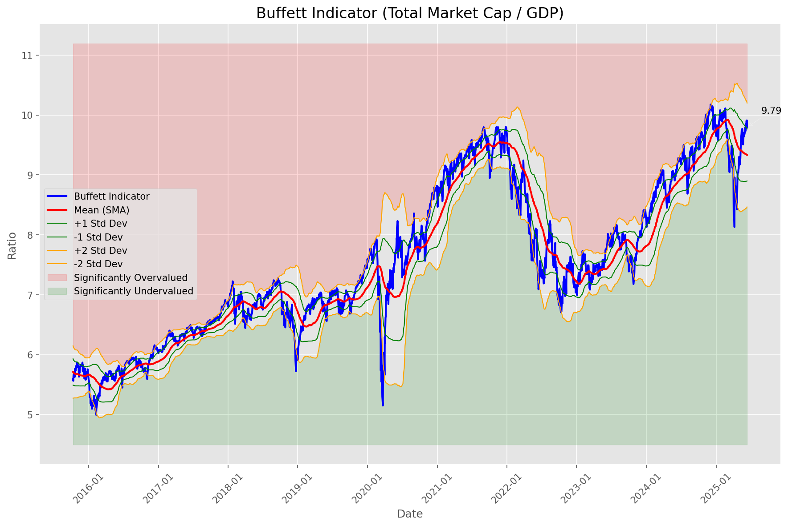
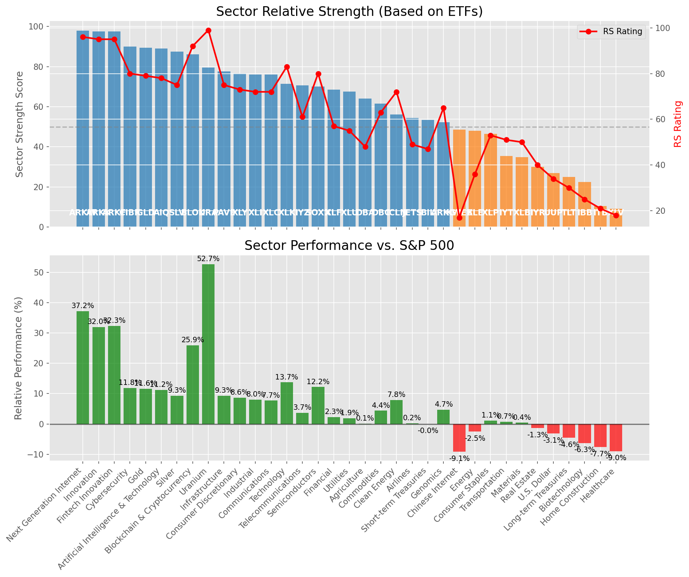

# **Daily Relative Strength Report**

**Date:** 2025-06-17

## **Market Valuation (Buffett Indicator)**

| Metric | Value |
|--------|-------|
| **Market Valuation** | **Overvalued** |
| **Current Ratio** | 9.87 |
| **Historical Mean** | 9.33 |
| **Standard Deviation** | 0.43 |
| **Z-Score (StdDev from Mean)** | 1.30 |
| **Total Market Cap** | $295.88 trillion |
| **GDP** | $29.98 trillion |

## **Market Insights**

### **Market is Overvalued**

The market appears to be trading above historical average valuations. While not at extreme levels, this suggests more modest future returns may be expected. Investors should:

- Focus on companies with reasonable valuations relative to their growth
- Be more selective with new positions
- Look for stocks showing relative strength within their sectors
- Consider trimming positions in extremely overvalued names

Historically, periods of mild overvaluation can persist for extended periods, but returns tend to be below average.

### **Buffett Indicator Overview**

The Buffett Indicator (Total Market Cap / GDP) is a measure of the stock market's valuation relative to the size of the economy. It is named after Warren Buffett, who described it as "probably the best single measure of where valuations stand at any given moment."

- **Values above +2 standard deviations:** Market significantly overvalued
- **Values above +1 standard deviation:** Market overvalued
- **Values between -1 and +1 standard deviations:** Market fairly valued
- **Values below -1 standard deviation:** Market undervalued
- **Values below -2 standard deviations:** Market significantly undervalued

---

## **Sector Relative Strength**

Based on William O'Neil's Relative Strength Methodology

| ETF | Strength | RS Rating | Performance | Above Key MAs | Trend | Sector |
|-----|----------|-----------|-------------|--------------|-------|--------|
| [ARKW](https://www.tradingview.com/chart/?symbol=ARKW) | 98.5 | 97.0 | 41.15% | 10d ✓, 50d ✓, 200d ✓ | ↗️ | Next Generation Internet |
| [ARKK](https://www.tradingview.com/chart/?symbol=ARKK) | 97.5 | 95.0 | 34.68% | 10d ✓, 50d ✓, 200d ✓ | ↗️ | Innovation |
| [BLOK](https://www.tradingview.com/chart/?symbol=BLOK) | 97.0 | 94.0 | 30.87% | 10d ✓, 50d ✓, 200d ✓ | ↗️ | Blockchain & Cryptocurrency |
| [ARKF](https://www.tradingview.com/chart/?symbol=ARKF) | 97.0 | 94.0 | 31.37% | 10d ✓, 50d ✓, 200d ✓ | ↗️ | Fintech Innovation |
| [CIBR](https://www.tradingview.com/chart/?symbol=CIBR) | 90.0 | 80.0 | 12.15% | 10d ✓, 50d ✓, 200d ✓ | ↗️ | Cybersecurity |
| [AIQ](https://www.tradingview.com/chart/?symbol=AIQ) | 90.0 | 80.0 | 12.47% | 10d ✓, 50d ✓, 200d ✓ | ↗️ | Artificial Intelligence & Technology |
| [GLD](https://www.tradingview.com/chart/?symbol=GLD) | 89.0 | 78.0 | 11.38% | 10d ✓, 50d ✓, 200d ✓ | ↗️ | Gold |
| [SLV](https://www.tradingview.com/chart/?symbol=SLV) | 87.0 | 74.0 | 9.17% | 10d ✓, 50d ✓, 200d ✓ | ↗️ | Silver |
| [URA](https://www.tradingview.com/chart/?symbol=URA) | 79.5 | 99.0 | 55.75% | 10d ✓, 50d ✓, 200d ✓ | ↘️ | Uranium |
| [DBA](https://www.tradingview.com/chart/?symbol=DBA) | 78.5 | 57.0 | 2.68% | 10d ✓, 50d ✓, 200d ✓ | ↗️ | Agriculture |
| [XLY](https://www.tradingview.com/chart/?symbol=XLY) | 78.1 | 76.0 | 10.16% | 10d ✗, 50d ✓, 200d ✓ | ↗️ | Consumer Discretionary |
| [PAVE](https://www.tradingview.com/chart/?symbol=PAVE) | 78.1 | 76.0 | 10.20% | 10d ✗, 50d ✓, 200d ✓ | ↗️ | Infrastructure |
| [XLI](https://www.tradingview.com/chart/?symbol=XLI) | 76.6 | 73.0 | 8.72% | 10d ✗, 50d ✓, 200d ✓ | ↗️ | Industrial |
| [XLC](https://www.tradingview.com/chart/?symbol=XLC) | 76.1 | 72.0 | 7.87% | 10d ✗, 50d ✓, 200d ✓ | ↗️ | Communications |
| [XLK](https://www.tradingview.com/chart/?symbol=XLK) | 72.0 | 84.0 | 14.86% | 10d ✓, 50d ✓, 200d ✓ | ↘️ | Technology |
| [IYZ](https://www.tradingview.com/chart/?symbol=IYZ) | 71.6 | 63.0 | 4.67% | 10d ✗, 50d ✓, 200d ✓ | ↗️ | Telecommunications |
| [SOXX](https://www.tradingview.com/chart/?symbol=SOXX) | 71.0 | 82.0 | 13.91% | 10d ✓, 50d ✓, 200d ✓ | ↘️ | Semiconductors |
| [XLU](https://www.tradingview.com/chart/?symbol=XLU) | 68.6 | 57.0 | 2.99% | 10d ✗, 50d ✓, 200d ✓ | ↗️ | Utilities |
| [XLF](https://www.tradingview.com/chart/?symbol=XLF) | 68.6 | 57.0 | 2.79% | 10d ✗, 50d ✓, 200d ✓ | ↗️ | Financial |
| [DBC](https://www.tradingview.com/chart/?symbol=DBC) | 60.0 | 60.0 | 3.76% | 10d ✓, 50d ✓, 200d ✓ | ↘️ | Commodities |
| [KWEB](https://www.tradingview.com/chart/?symbol=KWEB) | 59.5 | 19.0 | -8.23% | 10d ✓, 50d ✓, 200d ✓ | ↗️ | Chinese Internet |
| [JETS](https://www.tradingview.com/chart/?symbol=JETS) | 57.4 | 55.0 | 1.99% | 10d ✗, 50d ✓, 200d ✗ | ↗️ | Airlines |
| [ICLN](https://www.tradingview.com/chart/?symbol=ICLN) | 56.6 | 73.0 | 8.52% | 10d ✗, 50d ✓, 200d ✓ | ↘️ | Clean Energy |
| [BIL](https://www.tradingview.com/chart/?symbol=BIL) | 52.5 | 45.0 | -0.00% | 10d ✓, 50d ✓, 200d ✓ | ↘️ | Short-term Treasuries |
| [ARKG](https://www.tradingview.com/chart/?symbol=ARKG) | 51.8 | 64.0 | 5.25% | 10d ✓, 50d ✓, 200d ✗ | ↘️ | Genomics |
| [XLE](https://www.tradingview.com/chart/?symbol=XLE) | 47.0 | 34.0 | -2.57% | 10d ✓, 50d ✓, 200d ✓ | ↘️ | Energy |
| [XLP](https://www.tradingview.com/chart/?symbol=XLP) | 46.5 | 53.0 | 1.35% | 10d ✗, 50d ✗, 200d ✗ | ↗️ | Consumer Staples |
| [XLB](https://www.tradingview.com/chart/?symbol=XLB) | 35.9 | 52.0 | 1.08% | 10d ✗, 50d ✓, 200d ✗ | ↘️ | Materials |
| [IYT](https://www.tradingview.com/chart/?symbol=IYT) | 35.9 | 52.0 | 1.19% | 10d ✗, 50d ✓, 200d ✗ | ↘️ | Transportation |
| [IYR](https://www.tradingview.com/chart/?symbol=IYR) | 30.4 | 41.0 | -0.66% | 10d ✗, 50d ✓, 200d ✗ | ↘️ | Real Estate |
| [IBB](https://www.tradingview.com/chart/?symbol=IBB) | 22.9 | 26.0 | -5.54% | 10d ✗, 50d ✓, 200d ✗ | ↘️ | Biotechnology |
| [UUP](https://www.tradingview.com/chart/?symbol=UUP) | 15.5 | 31.0 | -3.67% | 10d ✗, 50d ✗, 200d ✗ | ↘️ | U.S. Dollar |
| [ITB](https://www.tradingview.com/chart/?symbol=ITB) | 14.0 | 28.0 | -4.80% | 10d ✗, 50d ✗, 200d ✗ | ↘️ | Home Construction |
| [TLT](https://www.tradingview.com/chart/?symbol=TLT) | 13.0 | 26.0 | -5.34% | 10d ✗, 50d ✗, 200d ✗ | ↘️ | Long-term Treasuries |
| [XLV](https://www.tradingview.com/chart/?symbol=XLV) | 9.5 | 19.0 | -8.31% | 10d ✗, 50d ✗, 200d ✗ | ↘️ | Healthcare |

### **Sector ETF Performance Interpretation**

This table shows the relative strength metrics for different market sectors based on their representative ETFs:

- **ETF**: The ETF used to measure sector performance (click for chart)
- **Strength**: Overall sector strength score (0-100) combining multiple factors
- **RS Rating**: O'Neil RS rating of the sector ETF
- **Performance**: Performance of the sector ETF relative to SPY
- **Above Key MAs**: Whether the ETF is trading above its 10, 50, and 200-day moving averages
- **Trend**: Whether the sector is in an uptrend (↗️) or downtrend (↘️)

### **Current Sector Leadership**

The current market leadership is coming from the following sectors: **Next Generation Internet, Innovation, Blockchain & Cryptocurrency**.

The **Next Generation Internet** sector (represented by **ARKW**) is showing particularly strong relative strength with an RS rating of 97.0 and performance of 41.15% vs. the S&P 500. This sector is trading above its 10-day, 50-day, 200-day moving average(s). Investors should consider focusing on high RS stocks within these leading sectors for potential outperformance.

---

## **Buy Recommendations**

The following 75 stocks show exceptional relative strength:

| RS Rating | Buy Score | Current Price | Chart | Name | Ticker |
|-----------|-----------|---------------|-------|------|--------|
| 100 | 100 | $174.00 | [Chart](https://www.tradingview.com/chart/?symbol=LEU) | Centrus Energy Corp. | LEU |
| 100 | 100 | $75.95 | [Chart](https://www.tradingview.com/chart/?symbol=HOOD) | Robinhood Markets, Inc. Class A Common Stock | HOOD |
| 100 | 100 | $141.36 | [Chart](https://www.tradingview.com/chart/?symbol=PLTR) | Palantir Technologies Inc. Class A Common Stock | PLTR |
| 100 | 100 | $100.62 | [Chart](https://www.tradingview.com/chart/?symbol=RBLX) | Roblox Corporation | RBLX |
| 100 | 100 | $58.88 | [Chart](https://www.tradingview.com/chart/?symbol=HIMS) | Hims & Hers Health, Inc. | HIMS |
| 100 | 100 | $151.33 | [Chart](https://www.tradingview.com/chart/?symbol=SEZL) | Sezzle Inc. Common Stock | SEZL |
| 99 | 100 | $133.96 | [Chart](https://www.tradingview.com/chart/?symbol=CLS) | Celestica, Inc. | CLS |
| 99 | 100 | $43.79 | [Chart](https://www.tradingview.com/chart/?symbol=FARO) | Faro Technologies Inc | FARO |
| 99 | 100 | $153.69 | [Chart](https://www.tradingview.com/chart/?symbol=NRG) | NRG Energy, Inc. | NRG |
| 99 | 100 | $78.15 | [Chart](https://www.tradingview.com/chart/?symbol=SLNO) | Soleno Therapeutics, Inc. Common Stock | SLNO |
| 99 | 100 | $489.43 | [Chart](https://www.tradingview.com/chart/?symbol=GEV) | GE Vernova Inc. | GEV |
| 99 | 100 | $180.07 | [Chart](https://www.tradingview.com/chart/?symbol=NET) | Cloudflare, Inc. Class A common stock, par value $0.001 per share | NET |
| 98 | 100 | $52.83 | [Chart](https://www.tradingview.com/chart/?symbol=BBW) | Build-A-Bear Workshop, Inc. | BBW |
| 98 | 100 | $70.79 | [Chart](https://www.tradingview.com/chart/?symbol=URBN) | Urban Outfitters Inc | URBN |
| 98 | 100 | $201.72 | [Chart](https://www.tradingview.com/chart/?symbol=JBL) | Jabil Inc. | JBL |
| 98 | 100 | $44.30 | [Chart](https://www.tradingview.com/chart/?symbol=REVG) | REV Group, Inc. | REVG |
| 97 | 100 | $780.61 | [Chart](https://www.tradingview.com/chart/?symbol=AXON) | Axon Enterprise, Inc. Common Stock | AXON |
| 97 | 100 | $48.64 | [Chart](https://www.tradingview.com/chart/?symbol=AU) | AngloGold Ashanti plc | AU |
| 97 | 100 | $20.59 | [Chart](https://www.tradingview.com/chart/?symbol=MIR) | Mirion Technologies, Inc. | MIR |
| 97 | 100 | $27.83 | [Chart](https://www.tradingview.com/chart/?symbol=CRK) | Comstock Resources, Inc. | CRK |
| 96 | 100 | $249.59 | [Chart](https://www.tradingview.com/chart/?symbol=CRS) | Carpenter Technology Corp | CRS |
| 96 | 100 | $140.25 | [Chart](https://www.tradingview.com/chart/?symbol=COOP) | Mr. Cooper Group Inc. Common Stock | COOP |
| 96 | 100 | $280.92 | [Chart](https://www.tradingview.com/chart/?symbol=TLN) | Talen Energy Corporation Common Stock | TLN |
| 96 | 100 | $182.35 | [Chart](https://www.tradingview.com/chart/?symbol=EAT) | Brinker International, Inc. | EAT |
| 96 | 100 | $42.60 | [Chart](https://www.tradingview.com/chart/?symbol=KTOS) | Kratos Defense & Security Solutions, Inc. | KTOS |
| 96 | 100 | $71.52 | [Chart](https://www.tradingview.com/chart/?symbol=ULS) | UL Solutions Inc. | ULS |
| 95 | 100 | $19.36 | [Chart](https://www.tradingview.com/chart/?symbol=AVPT) | AvePoint, Inc. Class A Common Stock | AVPT |
| 95 | 100 | $483.84 | [Chart](https://www.tradingview.com/chart/?symbol=CRWD) | CrowdStrike Holdings, Inc. Class A Common Stock | CRWD |
| 94 | 100 | $45.94 | [Chart](https://www.tradingview.com/chart/?symbol=ARKF) | ARK Fintech Innovation ETF | ARKF |
| 94 | 100 | $26.37 | [Chart](https://www.tradingview.com/chart/?symbol=OR) | OR Royalties Inc. | OR |
| 94 | 100 | $130.50 | [Chart](https://www.tradingview.com/chart/?symbol=NTES) | NetEase, inc. | NTES |
| 94 | 100 | $34.83 | [Chart](https://www.tradingview.com/chart/?symbol=MP) | MP Materials Corp. | MP |
| 93 | 100 | $19.56 | [Chart](https://www.tradingview.com/chart/?symbol=SPNT) | SiriusPoint Ltd. | SPNT |
| 93 | 100 | $21.52 | [Chart](https://www.tradingview.com/chart/?symbol=MAG) | MAG Silver Corp. | MAG |
| 93 | 100 | $24.53 | [Chart](https://www.tradingview.com/chart/?symbol=TFPM) | Triple Flag Precious Metals Corp. | TFPM |
| 93 | 100 | $104.47 | [Chart](https://www.tradingview.com/chart/?symbol=JCI) | Johnson Controls International plc | JCI |
| 92 | 100 | $59.58 | [Chart](https://www.tradingview.com/chart/?symbol=CAKE) | Cheesecake Factory (The) | CAKE |
| 92 | 100 | $718.73 | [Chart](https://www.tradingview.com/chart/?symbol=SPOT) | Spotify Technology S.A. | SPOT |
| 92 | 100 | $40.62 | [Chart](https://www.tradingview.com/chart/?symbol=BBIO) | BridgeBio Pharma, Inc. Common Stock | BBIO |
| 92 | 100 | $506.39 | [Chart](https://www.tradingview.com/chart/?symbol=CASY) | Casey's General Stores Inc | CASY |
| 91 | 100 | $163.44 | [Chart](https://www.tradingview.com/chart/?symbol=CAH) | Cardinal Health, Inc. | CAH |
| 91 | 100 | $55.75 | [Chart](https://www.tradingview.com/chart/?symbol=AKRO) | Akero Therapeutics, Inc. Common Stock | AKRO |
| 90 | 100 | $35.52 | [Chart](https://www.tradingview.com/chart/?symbol=AHR) | American Healthcare REIT, Inc. | AHR |
| 90 | 100 | $58.92 | [Chart](https://www.tradingview.com/chart/?symbol=SHLD) | Global X Defense Tech ETF | SHLD |
| 90 | 100 | $210.11 | [Chart](https://www.tradingview.com/chart/?symbol=IBKR) | Interactive Brokers Group, Inc. Class A Common Stock | IBKR |
| 90 | 100 | $91.48 | [Chart](https://www.tradingview.com/chart/?symbol=WPM) | Wheaton Precious Metals Corp. Common Stock | WPM |
| 90 | 100 | $63.20 | [Chart](https://www.tradingview.com/chart/?symbol=CHEF) | The Chef's Warehouse Inc | CHEF |
| 90 | 100 | $74.53 | [Chart](https://www.tradingview.com/chart/?symbol=CTVA) | Corteva, Inc. Common Stock | CTVA |
| 89 | 100 | $36.43 | [Chart](https://www.tradingview.com/chart/?symbol=UGL) | ProShares Ultra Gold | UGL |
| 89 | 100 | $226.42 | [Chart](https://www.tradingview.com/chart/?symbol=DRI) | Darden Restaurants, Inc. | DRI |
| 88 | 100 | $182.61 | [Chart](https://www.tradingview.com/chart/?symbol=PM) | Philip Morris International Inc. | PM |
| 87 | 100 | $281.08 | [Chart](https://www.tradingview.com/chart/?symbol=VRSN) | VeriSign Inc | VRSN |
| 87 | 99 | $83.58 | [Chart](https://www.tradingview.com/chart/?symbol=TPR) | Tapestry, Inc. Common Stock | TPR |
| 87 | 99 | $29.24 | [Chart](https://www.tradingview.com/chart/?symbol=IMAX) | Imax Corp | IMAX |
| 87 | 99 | $48.77 | [Chart](https://www.tradingview.com/chart/?symbol=BTI) | British American Tobacco p.l.c. American Depositary Shares, American Depositary Shares, each representing one Ordinary Share | BTI |
| 86 | 99 | $124.16 | [Chart](https://www.tradingview.com/chart/?symbol=AEM) | Agnico Eagle Mines Ltd. | AEM |
| 85 | 99 | $237.81 | [Chart](https://www.tradingview.com/chart/?symbol=TTWO) | Take-Two Interactive Software Inc | TTWO |
| 89 | 98 | $48.89 | [Chart](https://www.tradingview.com/chart/?symbol=SIL) | Global X Silver Miners ETF (NEW) | SIL |
| 88 | 98 | $53.57 | [Chart](https://www.tradingview.com/chart/?symbol=GDX) | VanEck Gold Miners ETF | GDX |
| 85 | 98 | $41.92 | [Chart](https://www.tradingview.com/chart/?symbol=VIRT) | Virtu Financial, Inc. Class A | VIRT |
| 85 | 98 | $22.40 | [Chart](https://www.tradingview.com/chart/?symbol=LAUR) | Laureate Education, Inc. Common Stock | LAUR |
| 86 | 96 | $187.54 | [Chart](https://www.tradingview.com/chart/?symbol=CVLT) | Commault Systems, Inc. | CVLT |
| 85 | 96 | $179.70 | [Chart](https://www.tradingview.com/chart/?symbol=RGLD) | Royal Gold Inc | RGLD |
| 84 | 96 | $76.17 | [Chart](https://www.tradingview.com/chart/?symbol=LLYVK) | Liberty Media Corporation Series C Liberty Live Common Stock | LLYVK |
| 83 | 96 | $283.38 | [Chart](https://www.tradingview.com/chart/?symbol=IBM) | International Business Machines Corporation | IBM |
| 82 | 96 | $85.55 | [Chart](https://www.tradingview.com/chart/?symbol=SNEX) | StoneX Group Inc. Common Stock | SNEX |
| 85 | 95 | $135.88 | [Chart](https://www.tradingview.com/chart/?symbol=PPA) | Invesco Aerospace & Defense ETF | PPA |
| 84 | 95 | $218.32 | [Chart](https://www.tradingview.com/chart/?symbol=BAP) | Credicorp LTD | BAP |
| 85 | 94 | $87.97 | [Chart](https://www.tradingview.com/chart/?symbol=SANM) | Sanmina  Corp | SANM |
| 83 | 93 | $86.40 | [Chart](https://www.tradingview.com/chart/?symbol=NDAQ) | Nasdaq, Inc. Common Stock | NDAQ |
| 83 | 93 | $198.10 | [Chart](https://www.tradingview.com/chart/?symbol=GPOR) | Gulfport Energy Corporation | GPOR |
| 83 | 93 | $88.88 | [Chart](https://www.tradingview.com/chart/?symbol=SCHW) | The Charles Schwab Corporation | SCHW |
| 82 | 92 | $80.44 | [Chart](https://www.tradingview.com/chart/?symbol=BBCA) | JPMorgan BetaBuilders Canada ETF | BBCA |
| 80 | 92 | $73.35 | [Chart](https://www.tradingview.com/chart/?symbol=CIBR) | First Trust Exchange-Traded Fund II First Trust NASDAQ Cybersecurity ETF | CIBR |
| 80 | 90 | $168.25 | [Chart](https://www.tradingview.com/chart/?symbol=NTRA) | Natera, Inc. Common Stock | NTRA |

---

## **Sell Recommendations**

The following 77 stocks show deteriorating relative strength:

| RS Rating | Sell Score | Current Price | Chart | Name | Ticker |
|-----------|------------|---------------|-------|------|--------|
| 1 | 100 | $30.30 | [Chart](https://www.tradingview.com/chart/?symbol=TECS) | Direxion Daily Technology Bear 3x Shares | TECS |
| 1 | 100 | $16.51 | [Chart](https://www.tradingview.com/chart/?symbol=NVDS) | Investment Managers Series Trust II Tradr 1.5X Short NVDA Daily ETF | NVDS |
| 1 | 100 | $15.14 | [Chart](https://www.tradingview.com/chart/?symbol=ZVZZT) | SUPER Montage TEST SYMBOL | ZVZZT |
| 3 | 100 | $43.69 | [Chart](https://www.tradingview.com/chart/?symbol=LINE) | Lineage, Inc. Common Stock | LINE |
| 4 | 100 | $20.02 | [Chart](https://www.tradingview.com/chart/?symbol=BITI) | ProShares Short Bitcoin ETF | BITI |
| 4 | 100 | $21.58 | [Chart](https://www.tradingview.com/chart/?symbol=AMRK) | A-Mark Precious Metals, Inc. | AMRK |
| 5 | 100 | $31.32 | [Chart](https://www.tradingview.com/chart/?symbol=MBIN) | Merchants Bancorp Common Stock | MBIN |
| 5 | 100 | $10.81 | [Chart](https://www.tradingview.com/chart/?symbol=TWO) | Two Harbors Investment Corp. | TWO |
| 5 | 100 | $11.34 | [Chart](https://www.tradingview.com/chart/?symbol=HPK) | HighPeak Energy, Inc. Common Stock | HPK |
| 5 | 100 | $51.48 | [Chart](https://www.tradingview.com/chart/?symbol=SLVM) | Sylvamo Corporation | SLVM |
| 6 | 100 | $91.13 | [Chart](https://www.tradingview.com/chart/?symbol=ZBH) | Zimmer Biomet Holdings, Inc. | ZBH |
| 7 | 100 | $38.49 | [Chart](https://www.tradingview.com/chart/?symbol=APOG) | Apogee Enterprises Inc | APOG |
| 7 | 100 | $17.34 | [Chart](https://www.tradingview.com/chart/?symbol=ZTO) | ZTO Express (Cayman) Inc. American Depositary Shares, each representing one Class A ordinary share | ZTO |
| 8 | 100 | $29.64 | [Chart](https://www.tradingview.com/chart/?symbol=FUN) | Six Flags Entertainment Corporation | FUN |
| 10 | 100 | $19.40 | [Chart](https://www.tradingview.com/chart/?symbol=HVT) | Haverty Furniture Companies, Inc. | HVT |
| 10 | 100 | $51.95 | [Chart](https://www.tradingview.com/chart/?symbol=AMWD) | American Woodmark Corp | AMWD |
| 10 | 100 | $21.16 | [Chart](https://www.tradingview.com/chart/?symbol=KIDS) | OrthoPediatrics Corp. Common Stock | KIDS |
| 5 | 99 | $61.67 | [Chart](https://www.tradingview.com/chart/?symbol=COLM) | Columbia Sportswear Co | COLM |
| 6 | 99 | $29.22 | [Chart](https://www.tradingview.com/chart/?symbol=QDEL) | QuidelOrtho Corporation Common Stock | QDEL |
| 8 | 99 | $48.91 | [Chart](https://www.tradingview.com/chart/?symbol=SNY) | Sanofi American Depositary Shares (Each representing one-half of one ordinary share) | SNY |
| 9 | 99 | $10.39 | [Chart](https://www.tradingview.com/chart/?symbol=ABR) | Arbor Realty Trust, Inc. | ABR |
| 11 | 99 | $46.63 | [Chart](https://www.tradingview.com/chart/?symbol=SDOW) | ProShares UltraPro Short Dow 30 | SDOW |
| 3 | 98 | $13.39 | [Chart](https://www.tradingview.com/chart/?symbol=INMD) | InMode Ltd. Ordinary Shares | INMD |
| 4 | 98 | $10.34 | [Chart](https://www.tradingview.com/chart/?symbol=SONO) | Sonos, Inc. Common Stock | SONO |
| 10 | 98 | $41.67 | [Chart](https://www.tradingview.com/chart/?symbol=PRKS) | United Parks & Resorts Inc. | PRKS |
| 12 | 98 | $13.71 | [Chart](https://www.tradingview.com/chart/?symbol=OCSL) | Oaktree Specialty Lending Corporation | OCSL |
| 15 | 98 | $63.80 | [Chart](https://www.tradingview.com/chart/?symbol=ZROZ) | PIMCO 25+ Year Zero Coupon U.S. Treasury Index Exchange-Traded Fund | ZROZ |
| 9 | 97 | $25.91 | [Chart](https://www.tradingview.com/chart/?symbol=ATHM) | Autohome Inc. American Depositary Shares, each representing four Class A Ordinary Shares | ATHM |
| 11 | 97 | $85.82 | [Chart](https://www.tradingview.com/chart/?symbol=BCC) | Boise Cascade Company | BCC |
| 14 | 97 | $74.46 | [Chart](https://www.tradingview.com/chart/?symbol=CBT) | Cabot Corporation | CBT |
| 15 | 97 | $113.09 | [Chart](https://www.tradingview.com/chart/?symbol=AMR) | Alpha Metallurgical Resources, Inc. | AMR |
| 5 | 96 | $10.56 | [Chart](https://www.tradingview.com/chart/?symbol=CWK) | Cushman & Wakefield plc Ordinary Shares | CWK |
| 7 | 96 | $16.94 | [Chart](https://www.tradingview.com/chart/?symbol=AMTB) | Amerant Bancorp Inc. | AMTB |
| 19 | 96 | $16.82 | [Chart](https://www.tradingview.com/chart/?symbol=STAA) | Staar Surgical Co | STAA |
| 5 | 95 | $12.90 | [Chart](https://www.tradingview.com/chart/?symbol=TZA) | Direxion Daily Small Cap Bear 3x Shares | TZA |
| 10 | 95 | $12.45 | [Chart](https://www.tradingview.com/chart/?symbol=PMT) | PennyMac Mortgage Investment Trust | PMT |
| 11 | 95 | $17.93 | [Chart](https://www.tradingview.com/chart/?symbol=IRT) | Independence Realty Trust Inc. | IRT |
| 12 | 95 | $52.76 | [Chart](https://www.tradingview.com/chart/?symbol=KBH) | KB Home | KBH |
| 17 | 95 | $10.20 | [Chart](https://www.tradingview.com/chart/?symbol=LBTYK) | Liberty Global Ltd. Class C Common Shares | LBTYK |
| 17 | 94 | $37.09 | [Chart](https://www.tradingview.com/chart/?symbol=LIT) | Global X Lithium & Battery Tech ETF | LIT |
| 17 | 93 | $16.98 | [Chart](https://www.tradingview.com/chart/?symbol=SVOL) | Simplify Volatility Premium ETF | SVOL |
| 20 | 93 | $10.28 | [Chart](https://www.tradingview.com/chart/?symbol=NMZ) | Nuveen Municipal High Income Opportunity Fund | NMZ |
| 13 | 92 | $62.31 | [Chart](https://www.tradingview.com/chart/?symbol=MAS) | Masco Corporation | MAS |
| 15 | 92 | $37.82 | [Chart](https://www.tradingview.com/chart/?symbol=LKQ) | LKQ Corporation | LKQ |
| 11 | 90 | $61.14 | [Chart](https://www.tradingview.com/chart/?symbol=STC) | Stewart Information Services Corporation | STC |
| 15 | 90 | $133.24 | [Chart](https://www.tradingview.com/chart/?symbol=ICUI) | ICU Medical Inc | ICUI |
| 17 | 90 | $14.98 | [Chart](https://www.tradingview.com/chart/?symbol=VRE) | Veris Residential, Inc. | VRE |
| 17 | 89 | $64.29 | [Chart](https://www.tradingview.com/chart/?symbol=EDV) | Vanguard World Funds Extended Duration ETF | EDV |
| 22 | 89 | $15.66 | [Chart](https://www.tradingview.com/chart/?symbol=BBN) | BlackRock Taxable Municipal Bond Trust | BBN |
| 19 | 88 | $17.58 | [Chart](https://www.tradingview.com/chart/?symbol=JPMpM) | JPMorgan Chase & Co. Depositary Shares, each representing a 1/400th interest in a share of 4.20% Non-Cumulative Preferred Stock, Series MM | JPMpM |
| 19 | 88 | $12.92 | [Chart](https://www.tradingview.com/chart/?symbol=ARDT) | Ardent Health, Inc. | ARDT |
| 17 | 86 | $73.61 | [Chart](https://www.tradingview.com/chart/?symbol=MKC) | McCormick & Company, Incorporated Non-VTG CS | MKC |
| 25 | 86 | $22.64 | [Chart](https://www.tradingview.com/chart/?symbol=TLTW) | iShares 20+ Year Treasury Bond BuyWrite Strategy ETF | TLTW |
| 25 | 86 | $44.51 | [Chart](https://www.tradingview.com/chart/?symbol=SON) | Sonoco Products Company | SON |
| 19 | 85 | $62.63 | [Chart](https://www.tradingview.com/chart/?symbol=ELS) | Equity Lifestyle Properties, Inc. | ELS |
| 21 | 84 | $197.62 | [Chart](https://www.tradingview.com/chart/?symbol=AAPL) | Apple Inc. | AAPL |
| 25 | 83 | $55.24 | [Chart](https://www.tradingview.com/chart/?symbol=UHAL.B) | U-Haul Holding Company | UHAL.B |
| 26 | 83 | $10.42 | [Chart](https://www.tradingview.com/chart/?symbol=MYI) | BLACKROCK MUNIYIELD QUALITY FUND III, INC. | MYI |
| 27 | 83 | $11.77 | [Chart](https://www.tradingview.com/chart/?symbol=NVG) | Nuveen AMT-Free Municipal Credit Income Fund | NVG |
| 24 | 81 | $19.26 | [Chart](https://www.tradingview.com/chart/?symbol=MSDL) | Morgan Stanley Direct Lending Fund | MSDL |
| 26 | 81 | $41.11 | [Chart](https://www.tradingview.com/chart/?symbol=UDR) | UDR, Inc. | UDR |
| 20 | 80 | $40.36 | [Chart](https://www.tradingview.com/chart/?symbol=NBTB) | NBT Bancorp Inc | NBTB |
| 22 | 80 | $43.17 | [Chart](https://www.tradingview.com/chart/?symbol=FBK) | FB Financial Corporation | FBK |
| 27 | 80 | $16.24 | [Chart](https://www.tradingview.com/chart/?symbol=PFS) | Provident Financial Services, Inc. | PFS |
| 31 | 80 | $11.78 | [Chart](https://www.tradingview.com/chart/?symbol=NZF) | Nuveen Municipal Credit Income Fund | NZF |
| 28 | 78 | $54.71 | [Chart](https://www.tradingview.com/chart/?symbol=VGLT) | Vanguard Long-Term Treasury ETF | VGLT |
| 33 | 74 | $26.61 | [Chart](https://www.tradingview.com/chart/?symbol=DOG) | ProShares Short Dow30 | DOG |
| 33 | 74 | $36.00 | [Chart](https://www.tradingview.com/chart/?symbol=STBA) | S&T Bancorp Inc | STBA |
| 34 | 74 | $11.19 | [Chart](https://www.tradingview.com/chart/?symbol=NAD) | Nuveen Quality Municipal Income Fund | NAD |
| 28 | 73 | $159.64 | [Chart](https://www.tradingview.com/chart/?symbol=PG) | Procter & Gamble Company | PG |
| 31 | 71 | $214.71 | [Chart](https://www.tradingview.com/chart/?symbol=LOW) | Lowe's Companies Inc. | LOW |
| 36 | 71 | $21.18 | [Chart](https://www.tradingview.com/chart/?symbol=LGOV) | First Trust Long Duration Opportunities ETF | LGOV |
| 33 | 69 | $12.85 | [Chart](https://www.tradingview.com/chart/?symbol=RA) | Brookfield Real Assets Income Fund Inc. | RA |
| 34 | 68 | $13.28 | [Chart](https://www.tradingview.com/chart/?symbol=PDO) | PIMCO Dynamic Income Opportunities Fund | PDO |
| 38 | 68 | $33.55 | [Chart](https://www.tradingview.com/chart/?symbol=INVH) | Invitation Homes Inc. Common Stock | INVH |
| 38 | 65 | $67.81 | [Chart](https://www.tradingview.com/chart/?symbol=BRC) | Brady Corporation | BRC |
| 37 | 63 | $33.05 | [Chart](https://www.tradingview.com/chart/?symbol=KDP) | Keurig Dr Pepper Inc. | KDP |

## **Methodology**

This report uses William O'Neil's relative strength methodology from Investors Business Daily:

* **RS Rating**: Percentile rank of stock's performance vs. S&P 500 over the past 63 trading days (1-99 scale)
* **Buy Criteria**: RS Rating >= 80, price above 50-day MA, strong uptrend, increasing volume
* **Sell Criteria**: RS Rating < 40, price below 50-day MA, downtrend, decreasing volume

### **O'Neil's Key Principles**

1. **Focus on relative performance** - stocks outperforming the market
2. **Price trend confirmation** - stock must be in an uptrend
3. **Volume confirmation** - strong volume supports price moves
4. **Moving average validation** - price above key moving averages
5. **Market leaders only** - concentrate on top-performing stocks

*Report generated automatically after market close*