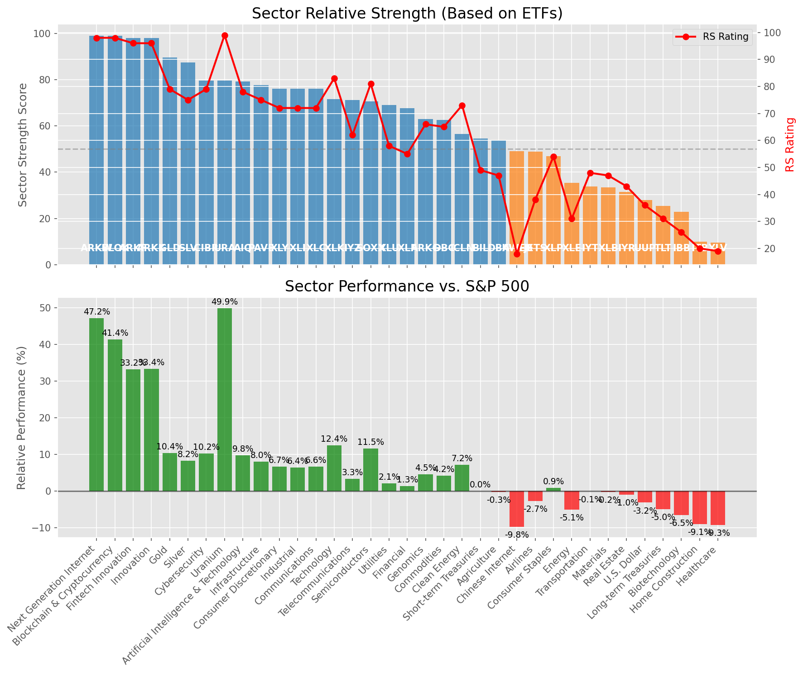

# **Daily Relative Strength Report**

**Date:** 2025-06-18

## **Market Valuation (Buffett Indicator)**

| Metric | Value |
|--------|-------|
| **Market Valuation** | **Overvalued** |
| **Current Ratio** | 9.82 |
| **Historical Mean** | 9.33 |
| **Standard Deviation** | 0.43 |
| **Z-Score (StdDev from Mean)** | 1.11 |
| **Total Market Cap** | $294.40 trillion |
| **GDP** | $29.98 trillion |

## **Market Insights**

### **Market is Overvalued**

The market appears to be trading above historical average valuations. While not at extreme levels, this suggests more modest future returns may be expected. Investors should:

- Focus on companies with reasonable valuations relative to their growth
- Be more selective with new positions
- Look for stocks showing relative strength within their sectors
- Consider trimming positions in extremely overvalued names

Historically, periods of mild overvaluation can persist for extended periods, but returns tend to be below average.

### **Buffett Indicator Overview**

The Buffett Indicator (Total Market Cap / GDP) is a measure of the stock market's valuation relative to the size of the economy. It is named after Warren Buffett, who described it as "probably the best single measure of where valuations stand at any given moment."

- **Values above +2 standard deviations:** Market significantly overvalued
- **Values above +1 standard deviation:** Market overvalued
- **Values between -1 and +1 standard deviations:** Market fairly valued
- **Values below -1 standard deviation:** Market undervalued
- **Values below -2 standard deviations:** Market significantly undervalued

---

## **Sector Relative Strength**

Based on William O'Neil's Relative Strength Methodology

| ETF | Strength | RS Rating | Performance | Above Key MAs | Trend | Sector |
|-----|----------|-----------|-------------|--------------|-------|--------|
| [ARKW](https://www.tradingview.com/chart/?symbol=ARKW) | 99.0 | 98.0 | 47.14% | 10d ✓, 50d ✓, 200d ✓ | ↗️ | Next Generation Internet |
| [BLOK](https://www.tradingview.com/chart/?symbol=BLOK) | 99.0 | 98.0 | 41.60% | 10d ✓, 50d ✓, 200d ✓ | ↗️ | Blockchain & Cryptocurrency |
| [ARKF](https://www.tradingview.com/chart/?symbol=ARKF) | 98.0 | 96.0 | 33.21% | 10d ✓, 50d ✓, 200d ✓ | ↗️ | Fintech Innovation |
| [ARKK](https://www.tradingview.com/chart/?symbol=ARKK) | 98.0 | 96.0 | 33.31% | 10d ✓, 50d ✓, 200d ✓ | ↗️ | Innovation |
| [GLD](https://www.tradingview.com/chart/?symbol=GLD) | 89.5 | 79.0 | 10.59% | 10d ✓, 50d ✓, 200d ✓ | ↗️ | Gold |
| [CIBR](https://www.tradingview.com/chart/?symbol=CIBR) | 89.5 | 79.0 | 10.49% | 10d ✓, 50d ✓, 200d ✓ | ↗️ | Cybersecurity |
| [AIQ](https://www.tradingview.com/chart/?symbol=AIQ) | 89.0 | 78.0 | 10.01% | 10d ✓, 50d ✓, 200d ✓ | ↗️ | Artificial Intelligence & Technology |
| [SLV](https://www.tradingview.com/chart/?symbol=SLV) | 87.5 | 75.0 | 8.57% | 10d ✓, 50d ✓, 200d ✓ | ↗️ | Silver |
| [XLC](https://www.tradingview.com/chart/?symbol=XLC) | 86.5 | 73.0 | 7.03% | 10d ✓, 50d ✓, 200d ✓ | ↗️ | Communications |
| [URA](https://www.tradingview.com/chart/?symbol=URA) | 79.5 | 99.0 | 49.15% | 10d ✓, 50d ✓, 200d ✓ | ↘️ | Uranium |
| [PAVE](https://www.tradingview.com/chart/?symbol=PAVE) | 77.6 | 75.0 | 8.42% | 10d ✗, 50d ✓, 200d ✓ | ↗️ | Infrastructure |
| [XLY](https://www.tradingview.com/chart/?symbol=XLY) | 76.6 | 73.0 | 7.09% | 10d ✗, 50d ✓, 200d ✓ | ↗️ | Consumer Discretionary |
| [XLI](https://www.tradingview.com/chart/?symbol=XLI) | 76.1 | 72.0 | 6.65% | 10d ✗, 50d ✓, 200d ✓ | ↗️ | Industrial |
| [IYZ](https://www.tradingview.com/chart/?symbol=IYZ) | 71.1 | 62.0 | 3.49% | 10d ✗, 50d ✓, 200d ✓ | ↗️ | Telecommunications |
| [XLK](https://www.tradingview.com/chart/?symbol=XLK) | 71.0 | 82.0 | 12.39% | 10d ✓, 50d ✓, 200d ✓ | ↘️ | Technology |
| [SOXX](https://www.tradingview.com/chart/?symbol=SOXX) | 70.5 | 81.0 | 11.60% | 10d ✓, 50d ✓, 200d ✓ | ↘️ | Semiconductors |
| [XLU](https://www.tradingview.com/chart/?symbol=XLU) | 68.6 | 57.0 | 2.02% | 10d ✗, 50d ✓, 200d ✓ | ↗️ | Utilities |
| [XLF](https://www.tradingview.com/chart/?symbol=XLF) | 67.6 | 55.0 | 1.35% | 10d ✗, 50d ✓, 200d ✓ | ↗️ | Financial |
| [ARKG](https://www.tradingview.com/chart/?symbol=ARKG) | 63.0 | 66.0 | 4.63% | 10d ✓, 50d ✓, 200d ✓ | ↘️ | Genomics |
| [DBC](https://www.tradingview.com/chart/?symbol=DBC) | 62.5 | 65.0 | 4.32% | 10d ✓, 50d ✓, 200d ✓ | ↘️ | Commodities |
| [ICLN](https://www.tradingview.com/chart/?symbol=ICLN) | 56.6 | 73.0 | 7.30% | 10d ✗, 50d ✓, 200d ✓ | ↘️ | Clean Energy |
| [BIL](https://www.tradingview.com/chart/?symbol=BIL) | 54.5 | 49.0 | 0.01% | 10d ✓, 50d ✓, 200d ✓ | ↘️ | Short-term Treasuries |
| [DBA](https://www.tradingview.com/chart/?symbol=DBA) | 53.2 | 46.0 | -0.28% | 10d ✗, 50d ✗, 200d ✓ | ↗️ | Agriculture |
| [KWEB](https://www.tradingview.com/chart/?symbol=KWEB) | 49.1 | 18.0 | -9.95% | 10d ✗, 50d ✓, 200d ✓ | ↗️ | Chinese Internet |
| [JETS](https://www.tradingview.com/chart/?symbol=JETS) | 48.9 | 38.0 | -2.52% | 10d ✗, 50d ✓, 200d ✗ | ↗️ | Airlines |
| [XLP](https://www.tradingview.com/chart/?symbol=XLP) | 47.0 | 54.0 | 1.02% | 10d ✗, 50d ✗, 200d ✗ | ↗️ | Consumer Staples |
| [XLE](https://www.tradingview.com/chart/?symbol=XLE) | 34.8 | 30.0 | -5.08% | 10d ✓, 50d ✓, 200d ✗ | ↘️ | Energy |
| [IYT](https://www.tradingview.com/chart/?symbol=IYT) | 34.4 | 49.0 | -0.02% | 10d ✗, 50d ✓, 200d ✗ | ↘️ | Transportation |
| [XLB](https://www.tradingview.com/chart/?symbol=XLB) | 33.9 | 48.0 | -0.06% | 10d ✗, 50d ✓, 200d ✗ | ↘️ | Materials |
| [IYR](https://www.tradingview.com/chart/?symbol=IYR) | 31.4 | 43.0 | -0.93% | 10d ✗, 50d ✓, 200d ✗ | ↘️ | Real Estate |
| [UUP](https://www.tradingview.com/chart/?symbol=UUP) | 27.9 | 36.0 | -3.25% | 10d ✓, 50d ✗, 200d ✗ | ↘️ | U.S. Dollar |
| [TLT](https://www.tradingview.com/chart/?symbol=TLT) | 24.9 | 30.0 | -5.11% | 10d ✓, 50d ✗, 200d ✗ | ↘️ | Long-term Treasuries |
| [IBB](https://www.tradingview.com/chart/?symbol=IBB) | 22.4 | 25.0 | -6.47% | 10d ✗, 50d ✓, 200d ✗ | ↘️ | Biotechnology |
| [XLV](https://www.tradingview.com/chart/?symbol=XLV) | 9.5 | 19.0 | -9.22% | 10d ✗, 50d ✗, 200d ✗ | ↘️ | Healthcare |
| [ITB](https://www.tradingview.com/chart/?symbol=ITB) | 9.5 | 19.0 | -9.08% | 10d ✗, 50d ✗, 200d ✗ | ↘️ | Home Construction |

### **Sector ETF Performance Interpretation**

This table shows the relative strength metrics for different market sectors based on their representative ETFs:

- **ETF**: The ETF used to measure sector performance (click for chart)
- **Strength**: Overall sector strength score (0-100) combining multiple factors
- **RS Rating**: O'Neil RS rating of the sector ETF
- **Performance**: Performance of the sector ETF relative to SPY
- **Above Key MAs**: Whether the ETF is trading above its 10, 50, and 200-day moving averages
- **Trend**: Whether the sector is in an uptrend (↗️) or downtrend (↘️)

### **Current Sector Leadership**

The current market leadership is coming from the following sectors: **Next Generation Internet, Blockchain & Cryptocurrency, Fintech Innovation**.

The **Next Generation Internet** sector (represented by **ARKW**) is showing particularly strong relative strength with an RS rating of 98.0 and performance of 47.14% vs. the S&P 500. This sector is trading above its 10-day, 50-day, 200-day moving average(s). Investors should consider focusing on high RS stocks within these leading sectors for potential outperformance.

---

## **Buy Recommendations**

The following 80 stocks show exceptional relative strength:

| RS Rating | Buy Score | Current Price | Chart | Name | Ticker |
|-----------|-----------|---------------|-------|------|--------|
| 100 | 100 | $179.78 | [Chart](https://www.tradingview.com/chart/?symbol=LEU) | Centrus Energy Corp. | LEU |
| 100 | 100 | $145.95 | [Chart](https://www.tradingview.com/chart/?symbol=SEZL) | Sezzle Inc. Common Stock | SEZL |
| 100 | 100 | $78.08 | [Chart](https://www.tradingview.com/chart/?symbol=HOOD) | Robinhood Markets, Inc. Class A Common Stock | HOOD |
| 100 | 100 | $61.23 | [Chart](https://www.tradingview.com/chart/?symbol=HIMS) | Hims & Hers Health, Inc. | HIMS |
| 100 | 100 | $102.41 | [Chart](https://www.tradingview.com/chart/?symbol=RBLX) | Roblox Corporation | RBLX |
| 99 | 100 | $153.11 | [Chart](https://www.tradingview.com/chart/?symbol=NRG) | NRG Energy, Inc. | NRG |
| 99 | 100 | $139.20 | [Chart](https://www.tradingview.com/chart/?symbol=PLTR) | Palantir Technologies Inc. Class A Common Stock | PLTR |
| 99 | 100 | $30.25 | [Chart](https://www.tradingview.com/chart/?symbol=CRK) | Comstock Resources, Inc. | CRK |
| 99 | 100 | $79.00 | [Chart](https://www.tradingview.com/chart/?symbol=SLNO) | Soleno Therapeutics, Inc. Common Stock | SLNO |
| 99 | 100 | $181.66 | [Chart](https://www.tradingview.com/chart/?symbol=NET) | Cloudflare, Inc. Class A common stock, par value $0.001 per share | NET |
| 99 | 100 | $43.80 | [Chart](https://www.tradingview.com/chart/?symbol=FARO) | Faro Technologies Inc | FARO |
| 98 | 100 | $52.70 | [Chart](https://www.tradingview.com/chart/?symbol=BBW) | Build-A-Bear Workshop, Inc. | BBW |
| 98 | 100 | $136.04 | [Chart](https://www.tradingview.com/chart/?symbol=CLS) | Celestica, Inc. | CLS |
| 98 | 100 | $490.24 | [Chart](https://www.tradingview.com/chart/?symbol=GEV) | GE Vernova Inc. | GEV |
| 98 | 100 | $205.49 | [Chart](https://www.tradingview.com/chart/?symbol=JBL) | Jabil Inc. | JBL |
| 97 | 100 | $292.25 | [Chart](https://www.tradingview.com/chart/?symbol=TLN) | Talen Energy Corporation Common Stock | TLN |
| 97 | 100 | $37.09 | [Chart](https://www.tradingview.com/chart/?symbol=MP) | MP Materials Corp. | MP |
| 97 | 100 | $145.47 | [Chart](https://www.tradingview.com/chart/?symbol=COOP) | Mr. Cooper Group Inc. Common Stock | COOP |
| 96 | 100 | $21.50 | [Chart](https://www.tradingview.com/chart/?symbol=MAG) | MAG Silver Corp. | MAG |
| 96 | 100 | $252.61 | [Chart](https://www.tradingview.com/chart/?symbol=CRS) | Carpenter Technology Corp | CRS |
| 96 | 100 | $46.93 | [Chart](https://www.tradingview.com/chart/?symbol=ARKF) | ARK Fintech Innovation ETF | ARKF |
| 96 | 100 | $47.95 | [Chart](https://www.tradingview.com/chart/?symbol=AU) | AngloGold Ashanti plc | AU |
| 95 | 100 | $71.04 | [Chart](https://www.tradingview.com/chart/?symbol=ULS) | UL Solutions Inc. | ULS |
| 95 | 100 | $484.63 | [Chart](https://www.tradingview.com/chart/?symbol=CRWD) | CrowdStrike Holdings, Inc. Class A Common Stock | CRWD |
| 94 | 100 | $508.72 | [Chart](https://www.tradingview.com/chart/?symbol=CASY) | Casey's General Stores Inc | CASY |
| 94 | 100 | $1224.21 | [Chart](https://www.tradingview.com/chart/?symbol=NFLX) | NetFlix Inc | NFLX |
| 94 | 100 | $179.45 | [Chart](https://www.tradingview.com/chart/?symbol=EAT) | Brinker International, Inc. | EAT |
| 94 | 100 | $42.00 | [Chart](https://www.tradingview.com/chart/?symbol=KTOS) | Kratos Defense & Security Solutions, Inc. | KTOS |
| 93 | 100 | $165.30 | [Chart](https://www.tradingview.com/chart/?symbol=CAH) | Cardinal Health, Inc. | CAH |
| 93 | 100 | $124.08 | [Chart](https://www.tradingview.com/chart/?symbol=ATGE) | Adtalem Global Education Inc. Common Shares | ATGE |
| 93 | 100 | $103.83 | [Chart](https://www.tradingview.com/chart/?symbol=JCI) | Johnson Controls International plc | JCI |
| 93 | 100 | $268.18 | [Chart](https://www.tradingview.com/chart/?symbol=RCL) | Royal Caribbean Group | RCL |
| 91 | 100 | $58.78 | [Chart](https://www.tradingview.com/chart/?symbol=CAKE) | Cheesecake Factory (The) | CAKE |
| 91 | 100 | $711.89 | [Chart](https://www.tradingview.com/chart/?symbol=SPOT) | Spotify Technology S.A. | SPOT |
| 91 | 100 | $120.51 | [Chart](https://www.tradingview.com/chart/?symbol=EHC) | Encompass Health Corporation Common Stock | EHC |
| 90 | 100 | $74.34 | [Chart](https://www.tradingview.com/chart/?symbol=CTVA) | Corteva, Inc. Common Stock | CTVA |
| 90 | 100 | $148.19 | [Chart](https://www.tradingview.com/chart/?symbol=LYV) | Live Nation Entertainment Inc. | LYV |
| 90 | 100 | $49.34 | [Chart](https://www.tradingview.com/chart/?symbol=BTI) | British American Tobacco p.l.c. American Depositary Shares, American Depositary Shares, each representing one Ordinary Share | BTI |
| 90 | 100 | $35.90 | [Chart](https://www.tradingview.com/chart/?symbol=AHR) | American Healthcare REIT, Inc. | AHR |
| 90 | 100 | $91.01 | [Chart](https://www.tradingview.com/chart/?symbol=WPM) | Wheaton Precious Metals Corp. Common Stock | WPM |
| 90 | 100 | $40.40 | [Chart](https://www.tradingview.com/chart/?symbol=BBIO) | BridgeBio Pharma, Inc. Common Stock | BBIO |
| 90 | 100 | $58.42 | [Chart](https://www.tradingview.com/chart/?symbol=SHLD) | Global X Defense Tech ETF | SHLD |
| 89 | 100 | $182.82 | [Chart](https://www.tradingview.com/chart/?symbol=PM) | Philip Morris International Inc. | PM |
| 89 | 100 | $79.70 | [Chart](https://www.tradingview.com/chart/?symbol=LLYVK) | Liberty Media Corporation Series C Liberty Live Common Stock | LLYVK |
| 89 | 100 | $222.00 | [Chart](https://www.tradingview.com/chart/?symbol=DRI) | Darden Restaurants, Inc. | DRI |
| 89 | 100 | $177.21 | [Chart](https://www.tradingview.com/chart/?symbol=TKO) | TKO Group Holdings, Inc. | TKO |
| 88 | 100 | $36.15 | [Chart](https://www.tradingview.com/chart/?symbol=UGL) | ProShares Ultra Gold | UGL |
| 87 | 100 | $220.75 | [Chart](https://www.tradingview.com/chart/?symbol=DASH) | DoorDash, Inc. Class A Common Stock | DASH |
| 87 | 100 | $282.06 | [Chart](https://www.tradingview.com/chart/?symbol=VRSN) | VeriSign Inc | VRSN |
| 87 | 100 | $122.86 | [Chart](https://www.tradingview.com/chart/?symbol=AEM) | Agnico Eagle Mines Ltd. | AEM |
| 90 | 99 | $48.65 | [Chart](https://www.tradingview.com/chart/?symbol=SIL) | Global X Silver Miners ETF (NEW) | SIL |
| 88 | 99 | $52.48 | [Chart](https://www.tradingview.com/chart/?symbol=IBKR) | Interactive Brokers Group, Inc. Class A Common Stock | IBKR |
| 86 | 99 | $22.50 | [Chart](https://www.tradingview.com/chart/?symbol=LAUR) | Laureate Education, Inc. Common Stock | LAUR |
| 85 | 99 | $238.85 | [Chart](https://www.tradingview.com/chart/?symbol=TTWO) | Take-Two Interactive Software Inc | TTWO |
| 88 | 98 | $53.08 | [Chart](https://www.tradingview.com/chart/?symbol=GDX) | VanEck Gold Miners ETF | GDX |
| 87 | 98 | $102.28 | [Chart](https://www.tradingview.com/chart/?symbol=FWONK) | Liberty Media Corporation Series C Liberty Formula One Common Stock | FWONK |
| 87 | 98 | $179.47 | [Chart](https://www.tradingview.com/chart/?symbol=RGLD) | Royal Gold Inc | RGLD |
| 86 | 98 | $84.51 | [Chart](https://www.tradingview.com/chart/?symbol=TPR) | Tapestry, Inc. Common Stock | TPR |
| 85 | 98 | $42.56 | [Chart](https://www.tradingview.com/chart/?symbol=VIRT) | Virtu Financial, Inc. Class A | VIRT |
| 87 | 97 | $90.39 | [Chart](https://www.tradingview.com/chart/?symbol=SANM) | Sanmina  Corp | SANM |
| 86 | 97 | $218.81 | [Chart](https://www.tradingview.com/chart/?symbol=BAP) | Credicorp LTD | BAP |
| 86 | 96 | $196.09 | [Chart](https://www.tradingview.com/chart/?symbol=TRI) | Thomson Reuters Corporation Common Shares | TRI |
| 83 | 96 | $284.52 | [Chart](https://www.tradingview.com/chart/?symbol=IBM) | International Business Machines Corporation | IBM |
| 85 | 95 | $172.19 | [Chart](https://www.tradingview.com/chart/?symbol=NTRA) | Natera, Inc. Common Stock | NTRA |
| 85 | 95 | $89.68 | [Chart](https://www.tradingview.com/chart/?symbol=SCHW) | The Charles Schwab Corporation | SCHW |
| 83 | 95 | $29.25 | [Chart](https://www.tradingview.com/chart/?symbol=IMAX) | Imax Corp | IMAX |
| 84 | 94 | $242.62 | [Chart](https://www.tradingview.com/chart/?symbol=WTS) | Watts Water Technologies, Inc. Class A | WTS |
| 84 | 94 | $203.71 | [Chart](https://www.tradingview.com/chart/?symbol=GPOR) | Gulfport Energy Corporation | GPOR |
| 80 | 94 | $25.30 | [Chart](https://www.tradingview.com/chart/?symbol=SRAD) | Sportradar Group AG Class A Ordinary Shares | SRAD |
| 83 | 93 | $86.50 | [Chart](https://www.tradingview.com/chart/?symbol=NDAQ) | Nasdaq, Inc. Common Stock | NDAQ |
| 82 | 93 | $297.61 | [Chart](https://www.tradingview.com/chart/?symbol=COR) | Cencora, Inc. | COR |
| 80 | 93 | $32.52 | [Chart](https://www.tradingview.com/chart/?symbol=OUNZ) | VanEck Merk Gold ETF | OUNZ |
| 80 | 93 | $63.62 | [Chart](https://www.tradingview.com/chart/?symbol=IAU) | iShares Gold Trust | IAU |
| 80 | 93 | $59.60 | [Chart](https://www.tradingview.com/chart/?symbol=EQT) | EQT CORP | EQT |
| 80 | 93 | $32.19 | [Chart](https://www.tradingview.com/chart/?symbol=SGOL) | abrdn Physical Gold Shares ETF | SGOL |
| 80 | 93 | $66.82 | [Chart](https://www.tradingview.com/chart/?symbol=GLDM) | SPDR Gold MiniShares | GLDM |
| 81 | 92 | $63.27 | [Chart](https://www.tradingview.com/chart/?symbol=MNST) | Monster Beverage Corporation | MNST |
| 80 | 92 | $188.72 | [Chart](https://www.tradingview.com/chart/?symbol=LOPE) | Grand Canyon Education, Inc | LOPE |
| 81 | 91 | $57.30 | [Chart](https://www.tradingview.com/chart/?symbol=EPR) | EPR Properties | EPR |
| 80 | 90 | $33.52 | [Chart](https://www.tradingview.com/chart/?symbol=FDP) | Fresh Del Monte Produce Inc. | FDP |

---

## **Sell Recommendations**

The following 80 stocks show deteriorating relative strength:

| RS Rating | Sell Score | Current Price | Chart | Name | Ticker |
|-----------|------------|---------------|-------|------|--------|
| 1 | 100 | $31.10 | [Chart](https://www.tradingview.com/chart/?symbol=TECS) | Direxion Daily Technology Bear 3x Shares | TECS |
| 1 | 100 | $16.53 | [Chart](https://www.tradingview.com/chart/?symbol=NVDS) | Investment Managers Series Trust II Tradr 1.5X Short NVDA Daily ETF | NVDS |
| 1 | 100 | $26.17 | [Chart](https://www.tradingview.com/chart/?symbol=HELE) | Helen Of Troy Ltd | HELE |
| 2 | 100 | $17.43 | [Chart](https://www.tradingview.com/chart/?symbol=ICHR) | Ichor Holdings | ICHR |
| 2 | 100 | $47.63 | [Chart](https://www.tradingview.com/chart/?symbol=LGIH) | LGI Homes, Inc. | LGIH |
| 2 | 100 | $11.52 | [Chart](https://www.tradingview.com/chart/?symbol=NRIX) | Nurix Therapeutics, Inc. Common stock | NRIX |
| 2 | 100 | $24.32 | [Chart](https://www.tradingview.com/chart/?symbol=CRTO) | Criteo S.A. | CRTO |
| 3 | 100 | $17.77 | [Chart](https://www.tradingview.com/chart/?symbol=APLS) | Apellis Pharmaceuticals, Inc. Common Stock | APLS |
| 4 | 100 | $21.41 | [Chart](https://www.tradingview.com/chart/?symbol=AMRK) | A-Mark Precious Metals, Inc. | AMRK |
| 4 | 100 | $44.68 | [Chart](https://www.tradingview.com/chart/?symbol=LINE) | Lineage, Inc. Common Stock | LINE |
| 5 | 100 | $10.78 | [Chart](https://www.tradingview.com/chart/?symbol=TWO) | Two Harbors Investment Corp. | TWO |
| 6 | 100 | $20.31 | [Chart](https://www.tradingview.com/chart/?symbol=BITI) | ProShares Short Bitcoin ETF | BITI |
| 6 | 100 | $17.09 | [Chart](https://www.tradingview.com/chart/?symbol=ZTO) | ZTO Express (Cayman) Inc. American Depositary Shares, each representing one Class A ordinary share | ZTO |
| 6 | 100 | $37.94 | [Chart](https://www.tradingview.com/chart/?symbol=APOG) | Apogee Enterprises Inc | APOG |
| 7 | 100 | $16.60 | [Chart](https://www.tradingview.com/chart/?symbol=AMTB) | Amerant Bancorp Inc. | AMTB |
| 7 | 100 | $11.11 | [Chart](https://www.tradingview.com/chart/?symbol=M) | Macy's Inc. | M |
| 8 | 100 | $12.38 | [Chart](https://www.tradingview.com/chart/?symbol=ZUMZ) | Zumiez Inc. | ZUMZ |
| 8 | 100 | $30.48 | [Chart](https://www.tradingview.com/chart/?symbol=FUN) | Six Flags Entertainment Corporation | FUN |
| 9 | 100 | $20.37 | [Chart](https://www.tradingview.com/chart/?symbol=KIDS) | OrthoPediatrics Corp. Common Stock | KIDS |
| 10 | 100 | $50.49 | [Chart](https://www.tradingview.com/chart/?symbol=AMWD) | American Woodmark Corp | AMWD |
| 11 | 100 | $84.49 | [Chart](https://www.tradingview.com/chart/?symbol=BIDU) | Baidu, Inc. | BIDU |
| 13 | 100 | $29.73 | [Chart](https://www.tradingview.com/chart/?symbol=BAX) | Baxter International Inc. | BAX |
| 13 | 100 | $10.05 | [Chart](https://www.tradingview.com/chart/?symbol=LBTYK) | Liberty Global Ltd. Class C Common Shares | LBTYK |
| 9 | 99 | $24.87 | [Chart](https://www.tradingview.com/chart/?symbol=ZSL) | ProShares UltraShort Silver | ZSL |
| 7 | 98 | $20.18 | [Chart](https://www.tradingview.com/chart/?symbol=SPT) | Sprout Social, Inc Class A Common Stock | SPT |
| 8 | 98 | $11.59 | [Chart](https://www.tradingview.com/chart/?symbol=HPK) | HighPeak Energy, Inc. Common Stock | HPK |
| 5 | 97 | $60.31 | [Chart](https://www.tradingview.com/chart/?symbol=COLM) | Columbia Sportswear Co | COLM |
| 7 | 97 | $47.69 | [Chart](https://www.tradingview.com/chart/?symbol=SNY) | Sanofi American Depositary Shares (Each representing one-half of one ordinary share) | SNY |
| 10 | 97 | $25.79 | [Chart](https://www.tradingview.com/chart/?symbol=ATHM) | Autohome Inc. American Depositary Shares, each representing four Class A Ordinary Shares | ATHM |
| 10 | 97 | $84.33 | [Chart](https://www.tradingview.com/chart/?symbol=BCC) | Boise Cascade Company | BCC |
| 10 | 97 | $26.08 | [Chart](https://www.tradingview.com/chart/?symbol=WSC) | WillScot Holdings Corporation Class A Common Stock | WSC |
| 13 | 97 | $42.72 | [Chart](https://www.tradingview.com/chart/?symbol=PRKS) | United Parks & Resorts Inc. | PRKS |
| 8 | 96 | $28.45 | [Chart](https://www.tradingview.com/chart/?symbol=QDEL) | QuidelOrtho Corporation Common Stock | QDEL |
| 9 | 96 | $10.29 | [Chart](https://www.tradingview.com/chart/?symbol=ABR) | Arbor Realty Trust, Inc. | ABR |
| 14 | 96 | $30.59 | [Chart](https://www.tradingview.com/chart/?symbol=CRNX) | Crinetics Pharmaceuticals, Inc. | CRNX |
| 18 | 96 | $43.53 | [Chart](https://www.tradingview.com/chart/?symbol=SON) | Sonoco Products Company | SON |
| 10 | 95 | $12.40 | [Chart](https://www.tradingview.com/chart/?symbol=PMT) | PennyMac Mortgage Investment Trust | PMT |
| 13 | 95 | $73.19 | [Chart](https://www.tradingview.com/chart/?symbol=CBT) | Cabot Corporation | CBT |
| 14 | 94 | $13.81 | [Chart](https://www.tradingview.com/chart/?symbol=OCSL) | Oaktree Specialty Lending Corporation | OCSL |
| 24 | 94 | $10.36 | [Chart](https://www.tradingview.com/chart/?symbol=NMCO) | Nuveen Municipal Credit Opportunities Fund | NMCO |
| 17 | 93 | $19.41 | [Chart](https://www.tradingview.com/chart/?symbol=FOR) | Forestar Group Inc. | FOR |
| 11 | 92 | $17.86 | [Chart](https://www.tradingview.com/chart/?symbol=IRT) | Independence Realty Trust Inc. | IRT |
| 16 | 92 | $36.62 | [Chart](https://www.tradingview.com/chart/?symbol=LIT) | Global X Lithium & Battery Tech ETF | LIT |
| 16 | 92 | $16.80 | [Chart](https://www.tradingview.com/chart/?symbol=SVOL) | Simplify Volatility Premium ETF | SVOL |
| 18 | 91 | $12.87 | [Chart](https://www.tradingview.com/chart/?symbol=ARDT) | Ardent Health, Inc. | ARDT |
| 22 | 90 | $42.51 | [Chart](https://www.tradingview.com/chart/?symbol=SW) | Smurfit Westrock plc | SW |
| 18 | 89 | $47.51 | [Chart](https://www.tradingview.com/chart/?symbol=SDOW) | ProShares UltraPro Short Dow 30 | SDOW |
| 19 | 89 | $65.23 | [Chart](https://www.tradingview.com/chart/?symbol=ZROZ) | PIMCO 25+ Year Zero Coupon U.S. Treasury Index Exchange-Traded Fund | ZROZ |
| 22 | 89 | $16.82 | [Chart](https://www.tradingview.com/chart/?symbol=STAA) | Staar Surgical Co | STAA |
| 24 | 89 | $10.25 | [Chart](https://www.tradingview.com/chart/?symbol=NMZ) | Nuveen Municipal High Income Opportunity Fund | NMZ |
| 14 | 88 | $129.97 | [Chart](https://www.tradingview.com/chart/?symbol=ICUI) | ICU Medical Inc | ICUI |
| 15 | 88 | $36.92 | [Chart](https://www.tradingview.com/chart/?symbol=LKQ) | LKQ Corporation | LKQ |
| 18 | 87 | $76.06 | [Chart](https://www.tradingview.com/chart/?symbol=PFG) | Principal Financial Group, Inc. | PFG |
| 22 | 87 | $17.66 | [Chart](https://www.tradingview.com/chart/?symbol=JPMpM) | JPMorgan Chase & Co. Depositary Shares, each representing a 1/400th interest in a share of 4.20% Non-Cumulative Preferred Stock, Series MM | JPMpM |
| 21 | 86 | $14.98 | [Chart](https://www.tradingview.com/chart/?symbol=VRE) | Veris Residential, Inc. | VRE |
| 20 | 85 | $195.87 | [Chart](https://www.tradingview.com/chart/?symbol=AAPL) | Apple Inc. | AAPL |
| 26 | 83 | $137.72 | [Chart](https://www.tradingview.com/chart/?symbol=LSTR) | Landstar System Inc | LSTR |
| 20 | 82 | $90.59 | [Chart](https://www.tradingview.com/chart/?symbol=PCAR) | Paccar Inc | PCAR |
| 24 | 82 | $14.23 | [Chart](https://www.tradingview.com/chart/?symbol=BMEZ) | BlackRock Health Sciences Term Trust | BMEZ |
| 27 | 82 | $12.88 | [Chart](https://www.tradingview.com/chart/?symbol=MRTN) | Marten Transport Ltd | MRTN |
| 28 | 82 | $15.79 | [Chart](https://www.tradingview.com/chart/?symbol=BBN) | BlackRock Taxable Municipal Bond Trust | BBN |
| 20 | 81 | $42.55 | [Chart](https://www.tradingview.com/chart/?symbol=FBK) | FB Financial Corporation | FBK |
| 25 | 80 | $54.95 | [Chart](https://www.tradingview.com/chart/?symbol=UHAL.B) | U-Haul Holding Company | UHAL.B |
| 29 | 80 | $16.15 | [Chart](https://www.tradingview.com/chart/?symbol=PFS) | Provident Financial Services, Inc. | PFS |
| 27 | 79 | $98.88 | [Chart](https://www.tradingview.com/chart/?symbol=PHM) | Pultegroup, Inc. | PHM |
| 33 | 79 | $10.41 | [Chart](https://www.tradingview.com/chart/?symbol=MYI) | BLACKROCK MUNIYIELD QUALITY FUND III, INC. | MYI |
| 22 | 78 | $39.98 | [Chart](https://www.tradingview.com/chart/?symbol=NBTB) | NBT Bancorp Inc | NBTB |
| 32 | 76 | $21.52 | [Chart](https://www.tradingview.com/chart/?symbol=GPCR) | Structure Therapeutics Inc. American Depositary Shares | GPCR |
| 33 | 76 | $35.76 | [Chart](https://www.tradingview.com/chart/?symbol=STBA) | S&T Bancorp Inc | STBA |
| 33 | 75 | $75.85 | [Chart](https://www.tradingview.com/chart/?symbol=TNET) | TRINET GROUP, INC. | TNET |
| 34 | 75 | $11.78 | [Chart](https://www.tradingview.com/chart/?symbol=NVG) | Nuveen AMT-Free Municipal Credit Income Fund | NVG |
| 37 | 75 | $11.76 | [Chart](https://www.tradingview.com/chart/?symbol=NZF) | Nuveen Municipal Credit Income Fund | NZF |
| 27 | 74 | $186.51 | [Chart](https://www.tradingview.com/chart/?symbol=PKG) | Packaging Corp of America | PKG |
| 29 | 74 | $41.20 | [Chart](https://www.tradingview.com/chart/?symbol=UDR) | UDR, Inc. | UDR |
| 32 | 74 | $10.29 | [Chart](https://www.tradingview.com/chart/?symbol=MUC) | BLACKROCK MUNIHOLDINGS CALIFORNIA QUALITY FUND, INC | MUC |
| 27 | 73 | $67.56 | [Chart](https://www.tradingview.com/chart/?symbol=BRC) | Brady Corporation | BRC |
| 34 | 71 | $156.22 | [Chart](https://www.tradingview.com/chart/?symbol=ODFL) | Old Dominion Freight Line | ODFL |
| 34 | 71 | $117.77 | [Chart](https://www.tradingview.com/chart/?symbol=SITE) | SiteOne Landscape Supply, Inc. | SITE |
| 38 | 71 | $174.57 | [Chart](https://www.tradingview.com/chart/?symbol=AVY) | Avery Dennison Corp. | AVY |
| 32 | 69 | $15.00 | [Chart](https://www.tradingview.com/chart/?symbol=PAXS) | PIMCO Access Income Fund | PAXS |

## **Methodology**

This report uses William O'Neil's relative strength methodology from Investors Business Daily:

* **RS Rating**: Percentile rank of stock's performance vs. S&P 500 over the past 63 trading days (1-99 scale)
* **Buy Criteria**: RS Rating >= 80, price above 50-day MA, strong uptrend, increasing volume
* **Sell Criteria**: RS Rating < 40, price below 50-day MA, downtrend, decreasing volume

### **O'Neil's Key Principles**

1. **Focus on relative performance** - stocks outperforming the market
2. **Price trend confirmation** - stock must be in an uptrend
3. **Volume confirmation** - strong volume supports price moves
4. **Moving average validation** - price above key moving averages
5. **Market leaders only** - concentrate on top-performing stocks

*Report generated automatically after market close*