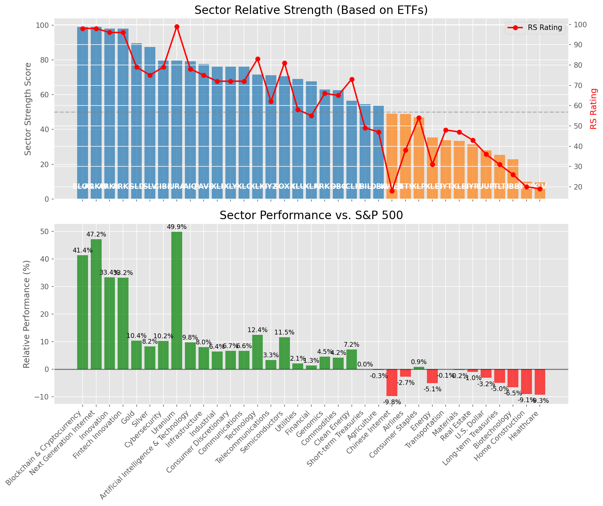

# **Daily Relative Strength Report**

**Date:** 2025-06-19

## **Market Valuation (Buffett Indicator)**

| Metric | Value |
|--------|-------|
| **Market Valuation** | **Overvalued** |
| **Current Ratio** | 9.81 |
| **Historical Mean** | 9.33 |
| **Standard Deviation** | 0.43 |
| **Z-Score (StdDev from Mean)** | 1.11 |
| **Total Market Cap** | $294.11 trillion |
| **GDP** | $29.98 trillion |

## **Market Insights**

### **Market is Overvalued**

The market appears to be trading above historical average valuations. While not at extreme levels, this suggests more modest future returns may be expected. Investors should:

- Focus on companies with reasonable valuations relative to their growth
- Be more selective with new positions
- Look for stocks showing relative strength within their sectors
- Consider trimming positions in extremely overvalued names

Historically, periods of mild overvaluation can persist for extended periods, but returns tend to be below average.

### **Buffett Indicator Overview**

The Buffett Indicator (Total Market Cap / GDP) is a measure of the stock market's valuation relative to the size of the economy. It is named after Warren Buffett, who described it as "probably the best single measure of where valuations stand at any given moment."

- **Values above +2 standard deviations:** Market significantly overvalued
- **Values above +1 standard deviation:** Market overvalued
- **Values between -1 and +1 standard deviations:** Market fairly valued
- **Values below -1 standard deviation:** Market undervalued
- **Values below -2 standard deviations:** Market significantly undervalued

---

## **Sector Relative Strength**

Based on William O'Neil's Relative Strength Methodology

| ETF | Strength | RS Rating | Performance | Above Key MAs | Trend | Sector |
|-----|----------|-----------|-------------|--------------|-------|--------|
| [BLOK](https://www.tradingview.com/chart/?symbol=BLOK) | 99.0 | 98.0 | 41.40% | 10d ✓, 50d ✓, 200d ✓ | ↗️ | Blockchain & Cryptocurrency |
| [ARKW](https://www.tradingview.com/chart/?symbol=ARKW) | 99.0 | 98.0 | 47.16% | 10d ✓, 50d ✓, 200d ✓ | ↗️ | Next Generation Internet |
| [ARKF](https://www.tradingview.com/chart/?symbol=ARKF) | 98.0 | 96.0 | 33.24% | 10d ✓, 50d ✓, 200d ✓ | ↗️ | Fintech Innovation |
| [ARKK](https://www.tradingview.com/chart/?symbol=ARKK) | 98.0 | 96.0 | 33.41% | 10d ✓, 50d ✓, 200d ✓ | ↗️ | Innovation |
| [GLD](https://www.tradingview.com/chart/?symbol=GLD) | 89.5 | 79.0 | 10.37% | 10d ✓, 50d ✓, 200d ✓ | ↗️ | Gold |
| [SLV](https://www.tradingview.com/chart/?symbol=SLV) | 87.5 | 75.0 | 8.20% | 10d ✓, 50d ✓, 200d ✓ | ↗️ | Silver |
| [CIBR](https://www.tradingview.com/chart/?symbol=CIBR) | 79.6 | 79.0 | 10.22% | 10d ✗, 50d ✓, 200d ✓ | ↗️ | Cybersecurity |
| [URA](https://www.tradingview.com/chart/?symbol=URA) | 79.5 | 99.0 | 49.94% | 10d ✓, 50d ✓, 200d ✓ | ↘️ | Uranium |
| [AIQ](https://www.tradingview.com/chart/?symbol=AIQ) | 79.1 | 78.0 | 9.78% | 10d ✗, 50d ✓, 200d ✓ | ↗️ | Artificial Intelligence & Technology |
| [PAVE](https://www.tradingview.com/chart/?symbol=PAVE) | 77.6 | 75.0 | 8.01% | 10d ✗, 50d ✓, 200d ✓ | ↗️ | Infrastructure |
| [XLI](https://www.tradingview.com/chart/?symbol=XLI) | 76.1 | 72.0 | 6.42% | 10d ✗, 50d ✓, 200d ✓ | ↗️ | Industrial |
| [XLC](https://www.tradingview.com/chart/?symbol=XLC) | 76.1 | 72.0 | 6.62% | 10d ✗, 50d ✓, 200d ✓ | ↗️ | Communications |
| [XLY](https://www.tradingview.com/chart/?symbol=XLY) | 76.1 | 72.0 | 6.70% | 10d ✗, 50d ✓, 200d ✓ | ↗️ | Consumer Discretionary |
| [XLK](https://www.tradingview.com/chart/?symbol=XLK) | 71.5 | 83.0 | 12.42% | 10d ✓, 50d ✓, 200d ✓ | ↘️ | Technology |
| [IYZ](https://www.tradingview.com/chart/?symbol=IYZ) | 71.1 | 62.0 | 3.31% | 10d ✗, 50d ✓, 200d ✓ | ↗️ | Telecommunications |
| [SOXX](https://www.tradingview.com/chart/?symbol=SOXX) | 70.5 | 81.0 | 11.55% | 10d ✓, 50d ✓, 200d ✓ | ↘️ | Semiconductors |
| [XLU](https://www.tradingview.com/chart/?symbol=XLU) | 69.1 | 58.0 | 2.05% | 10d ✗, 50d ✓, 200d ✓ | ↗️ | Utilities |
| [XLF](https://www.tradingview.com/chart/?symbol=XLF) | 67.6 | 55.0 | 1.31% | 10d ✗, 50d ✓, 200d ✓ | ↗️ | Financial |
| [ARKG](https://www.tradingview.com/chart/?symbol=ARKG) | 63.0 | 66.0 | 4.55% | 10d ✓, 50d ✓, 200d ✓ | ↘️ | Genomics |
| [DBC](https://www.tradingview.com/chart/?symbol=DBC) | 62.5 | 65.0 | 4.19% | 10d ✓, 50d ✓, 200d ✓ | ↘️ | Commodities |
| [ICLN](https://www.tradingview.com/chart/?symbol=ICLN) | 56.6 | 73.0 | 7.17% | 10d ✗, 50d ✓, 200d ✓ | ↘️ | Clean Energy |
| [BIL](https://www.tradingview.com/chart/?symbol=BIL) | 54.5 | 49.0 | 0.01% | 10d ✓, 50d ✓, 200d ✓ | ↘️ | Short-term Treasuries |
| [DBA](https://www.tradingview.com/chart/?symbol=DBA) | 53.7 | 47.0 | -0.30% | 10d ✗, 50d ✗, 200d ✓ | ↗️ | Agriculture |
| [KWEB](https://www.tradingview.com/chart/?symbol=KWEB) | 49.1 | 18.0 | -9.80% | 10d ✗, 50d ✓, 200d ✓ | ↗️ | Chinese Internet |
| [JETS](https://www.tradingview.com/chart/?symbol=JETS) | 48.9 | 38.0 | -2.74% | 10d ✗, 50d ✓, 200d ✗ | ↗️ | Airlines |
| [XLP](https://www.tradingview.com/chart/?symbol=XLP) | 47.0 | 54.0 | 0.85% | 10d ✗, 50d ✗, 200d ✗ | ↗️ | Consumer Staples |
| [XLE](https://www.tradingview.com/chart/?symbol=XLE) | 35.3 | 31.0 | -5.12% | 10d ✓, 50d ✓, 200d ✗ | ↘️ | Energy |
| [IYT](https://www.tradingview.com/chart/?symbol=IYT) | 33.9 | 48.0 | -0.09% | 10d ✗, 50d ✓, 200d ✗ | ↘️ | Transportation |
| [XLB](https://www.tradingview.com/chart/?symbol=XLB) | 33.4 | 47.0 | -0.22% | 10d ✗, 50d ✓, 200d ✗ | ↘️ | Materials |
| [IYR](https://www.tradingview.com/chart/?symbol=IYR) | 31.4 | 43.0 | -1.03% | 10d ✗, 50d ✓, 200d ✗ | ↘️ | Real Estate |
| [UUP](https://www.tradingview.com/chart/?symbol=UUP) | 27.9 | 36.0 | -3.18% | 10d ✓, 50d ✗, 200d ✗ | ↘️ | U.S. Dollar |
| [TLT](https://www.tradingview.com/chart/?symbol=TLT) | 25.4 | 31.0 | -4.97% | 10d ✓, 50d ✗, 200d ✗ | ↘️ | Long-term Treasuries |
| [IBB](https://www.tradingview.com/chart/?symbol=IBB) | 22.9 | 26.0 | -6.54% | 10d ✗, 50d ✓, 200d ✗ | ↘️ | Biotechnology |
| [ITB](https://www.tradingview.com/chart/?symbol=ITB) | 10.0 | 20.0 | -9.06% | 10d ✗, 50d ✗, 200d ✗ | ↘️ | Home Construction |
| [XLV](https://www.tradingview.com/chart/?symbol=XLV) | 9.5 | 19.0 | -9.31% | 10d ✗, 50d ✗, 200d ✗ | ↘️ | Healthcare |

### **Sector ETF Performance Interpretation**

This table shows the relative strength metrics for different market sectors based on their representative ETFs:

- **ETF**: The ETF used to measure sector performance (click for chart)
- **Strength**: Overall sector strength score (0-100) combining multiple factors
- **RS Rating**: O'Neil RS rating of the sector ETF
- **Performance**: Performance of the sector ETF relative to SPY
- **Above Key MAs**: Whether the ETF is trading above its 10, 50, and 200-day moving averages
- **Trend**: Whether the sector is in an uptrend (↗️) or downtrend (↘️)

### **Current Sector Leadership**

The current market leadership is coming from the following sectors: **Blockchain & Cryptocurrency, Next Generation Internet, Fintech Innovation**.

The **Blockchain & Cryptocurrency** sector (represented by **BLOK**) is showing particularly strong relative strength with an RS rating of 98.0 and performance of 41.40% vs. the S&P 500. This sector is trading above its 10-day, 50-day, 200-day moving average(s). Investors should consider focusing on high RS stocks within these leading sectors for potential outperformance.

---

## **Buy Recommendations**

The following 75 stocks show exceptional relative strength:

| RS Rating | Buy Score | Current Price | Chart | Name | Ticker |
|-----------|-----------|---------------|-------|------|--------|
| 100 | 100 | $180.96 | [Chart](https://www.tradingview.com/chart/?symbol=LEU) | Centrus Energy Corp. | LEU |
| 100 | 100 | $143.03 | [Chart](https://www.tradingview.com/chart/?symbol=SEZL) | Sezzle Inc. Common Stock | SEZL |
| 100 | 100 | $78.35 | [Chart](https://www.tradingview.com/chart/?symbol=HOOD) | Robinhood Markets, Inc. Class A Common Stock | HOOD |
| 100 | 100 | $102.65 | [Chart](https://www.tradingview.com/chart/?symbol=RBLX) | Roblox Corporation | RBLX |
| 100 | 100 | $61.07 | [Chart](https://www.tradingview.com/chart/?symbol=HIMS) | Hims & Hers Health, Inc. | HIMS |
| 99 | 100 | $79.38 | [Chart](https://www.tradingview.com/chart/?symbol=SLNO) | Soleno Therapeutics, Inc. Common Stock | SLNO |
| 99 | 100 | $30.74 | [Chart](https://www.tradingview.com/chart/?symbol=CRK) | Comstock Resources, Inc. | CRK |
| 99 | 100 | $181.40 | [Chart](https://www.tradingview.com/chart/?symbol=NET) | Cloudflare, Inc. Class A common stock, par value $0.001 per share | NET |
| 99 | 100 | $139.96 | [Chart](https://www.tradingview.com/chart/?symbol=PLTR) | Palantir Technologies Inc. Class A Common Stock | PLTR |
| 99 | 100 | $136.25 | [Chart](https://www.tradingview.com/chart/?symbol=CLS) | Celestica, Inc. | CLS |
| 99 | 100 | $43.78 | [Chart](https://www.tradingview.com/chart/?symbol=FARO) | Faro Technologies Inc | FARO |
| 98 | 100 | $52.50 | [Chart](https://www.tradingview.com/chart/?symbol=BBW) | Build-A-Bear Workshop, Inc. | BBW |
| 98 | 100 | $204.66 | [Chart](https://www.tradingview.com/chart/?symbol=JBL) | Jabil Inc. | JBL |
| 98 | 100 | $490.19 | [Chart](https://www.tradingview.com/chart/?symbol=GEV) | GE Vernova Inc. | GEV |
| 97 | 100 | $144.57 | [Chart](https://www.tradingview.com/chart/?symbol=COOP) | Mr. Cooper Group Inc. Common Stock | COOP |
| 97 | 100 | $37.22 | [Chart](https://www.tradingview.com/chart/?symbol=MP) | MP Materials Corp. | MP |
| 97 | 100 | $290.38 | [Chart](https://www.tradingview.com/chart/?symbol=TLN) | Talen Energy Corporation Common Stock | TLN |
| 96 | 100 | $48.12 | [Chart](https://www.tradingview.com/chart/?symbol=AU) | AngloGold Ashanti plc | AU |
| 96 | 100 | $46.94 | [Chart](https://www.tradingview.com/chart/?symbol=ARKF) | ARK Fintech Innovation ETF | ARKF |
| 96 | 100 | $21.41 | [Chart](https://www.tradingview.com/chart/?symbol=MAG) | MAG Silver Corp. | MAG |
| 96 | 100 | $70.88 | [Chart](https://www.tradingview.com/chart/?symbol=ULS) | UL Solutions Inc. | ULS |
| 95 | 100 | $250.97 | [Chart](https://www.tradingview.com/chart/?symbol=CRS) | Carpenter Technology Corp | CRS |
| 95 | 100 | $42.16 | [Chart](https://www.tradingview.com/chart/?symbol=KTOS) | Kratos Defense & Security Solutions, Inc. | KTOS |
| 95 | 100 | $32.30 | [Chart](https://www.tradingview.com/chart/?symbol=PRDO) | Perdoceo Education Corporation | PRDO |
| 95 | 100 | $485.16 | [Chart](https://www.tradingview.com/chart/?symbol=CRWD) | CrowdStrike Holdings, Inc. Class A Common Stock | CRWD |
| 94 | 100 | $24.56 | [Chart](https://www.tradingview.com/chart/?symbol=TFPM) | Triple Flag Precious Metals Corp. | TFPM |
| 94 | 100 | $506.31 | [Chart](https://www.tradingview.com/chart/?symbol=CASY) | Casey's General Stores Inc | CASY |
| 94 | 100 | $178.31 | [Chart](https://www.tradingview.com/chart/?symbol=EAT) | Brinker International, Inc. | EAT |
| 93 | 100 | $124.50 | [Chart](https://www.tradingview.com/chart/?symbol=ATGE) | Adtalem Global Education Inc. Common Shares | ATGE |
| 93 | 100 | $165.40 | [Chart](https://www.tradingview.com/chart/?symbol=CAH) | Cardinal Health, Inc. | CAH |
| 93 | 100 | $103.48 | [Chart](https://www.tradingview.com/chart/?symbol=JCI) | Johnson Controls International plc | JCI |
| 92 | 100 | $22.38 | [Chart](https://www.tradingview.com/chart/?symbol=BTSG) | BrightSpring Health Services, Inc. Common Stock | BTSG |
| 92 | 100 | $58.92 | [Chart](https://www.tradingview.com/chart/?symbol=CAKE) | Cheesecake Factory (The) | CAKE |
| 92 | 100 | $54.90 | [Chart](https://www.tradingview.com/chart/?symbol=AKRO) | Akero Therapeutics, Inc. Common Stock | AKRO |
| 91 | 100 | $710.19 | [Chart](https://www.tradingview.com/chart/?symbol=SPOT) | Spotify Technology S.A. | SPOT |
| 91 | 100 | $148.26 | [Chart](https://www.tradingview.com/chart/?symbol=LYV) | Live Nation Entertainment Inc. | LYV |
| 90 | 100 | $58.38 | [Chart](https://www.tradingview.com/chart/?symbol=SHLD) | Global X Defense Tech ETF | SHLD |
| 90 | 100 | $91.07 | [Chart](https://www.tradingview.com/chart/?symbol=WPM) | Wheaton Precious Metals Corp. Common Stock | WPM |
| 90 | 100 | $49.34 | [Chart](https://www.tradingview.com/chart/?symbol=BTI) | British American Tobacco p.l.c. American Depositary Shares, American Depositary Shares, each representing one Ordinary Share | BTI |
| 89 | 100 | $52.60 | [Chart](https://www.tradingview.com/chart/?symbol=IBKR) | Interactive Brokers Group, Inc. Class A Common Stock | IBKR |
| 89 | 100 | $182.61 | [Chart](https://www.tradingview.com/chart/?symbol=PM) | Philip Morris International Inc. | PM |
| 89 | 100 | $35.74 | [Chart](https://www.tradingview.com/chart/?symbol=AHR) | American Healthcare REIT, Inc. | AHR |
| 89 | 100 | $222.75 | [Chart](https://www.tradingview.com/chart/?symbol=DRI) | Darden Restaurants, Inc. | DRI |
| 89 | 100 | $40.00 | [Chart](https://www.tradingview.com/chart/?symbol=BBIO) | BridgeBio Pharma, Inc. Common Stock | BBIO |
| 89 | 100 | $74.12 | [Chart](https://www.tradingview.com/chart/?symbol=CTVA) | Corteva, Inc. Common Stock | CTVA |
| 88 | 100 | $175.95 | [Chart](https://www.tradingview.com/chart/?symbol=TKO) | TKO Group Holdings, Inc. | TKO |
| 88 | 100 | $36.02 | [Chart](https://www.tradingview.com/chart/?symbol=UGL) | ProShares Ultra Gold | UGL |
| 88 | 100 | $79.30 | [Chart](https://www.tradingview.com/chart/?symbol=LLYVK) | Liberty Media Corporation Series C Liberty Live Common Stock | LLYVK |
| 87 | 100 | $281.16 | [Chart](https://www.tradingview.com/chart/?symbol=VRSN) | VeriSign Inc | VRSN |
| 87 | 100 | $122.65 | [Chart](https://www.tradingview.com/chart/?symbol=AEM) | Agnico Eagle Mines Ltd. | AEM |
| 87 | 100 | $220.58 | [Chart](https://www.tradingview.com/chart/?symbol=DASH) | DoorDash, Inc. Class A Common Stock | DASH |
| 86 | 99 | $22.49 | [Chart](https://www.tradingview.com/chart/?symbol=LAUR) | Laureate Education, Inc. Common Stock | LAUR |
| 86 | 99 | $42.68 | [Chart](https://www.tradingview.com/chart/?symbol=VIRT) | Virtu Financial, Inc. Class A | VIRT |
| 85 | 99 | $238.50 | [Chart](https://www.tradingview.com/chart/?symbol=TTWO) | Take-Two Interactive Software Inc | TTWO |
| 88 | 98 | $53.00 | [Chart](https://www.tradingview.com/chart/?symbol=GDX) | VanEck Gold Miners ETF | GDX |
| 87 | 98 | $179.13 | [Chart](https://www.tradingview.com/chart/?symbol=RGLD) | Royal Gold Inc | RGLD |
| 87 | 98 | $101.97 | [Chart](https://www.tradingview.com/chart/?symbol=FWONK) | Liberty Media Corporation Series C Liberty Formula One Common Stock | FWONK |
| 86 | 98 | $84.24 | [Chart](https://www.tradingview.com/chart/?symbol=TPR) | Tapestry, Inc. Common Stock | TPR |
| 86 | 96 | $90.05 | [Chart](https://www.tradingview.com/chart/?symbol=SANM) | Sanmina  Corp | SANM |
| 86 | 96 | $195.96 | [Chart](https://www.tradingview.com/chart/?symbol=TRI) | Thomson Reuters Corporation Common Shares | TRI |
| 85 | 96 | $217.77 | [Chart](https://www.tradingview.com/chart/?symbol=BAP) | Credicorp LTD | BAP |
| 85 | 95 | $205.50 | [Chart](https://www.tradingview.com/chart/?symbol=GPOR) | Gulfport Energy Corporation | GPOR |
| 85 | 95 | $89.91 | [Chart](https://www.tradingview.com/chart/?symbol=SCHW) | The Charles Schwab Corporation | SCHW |
| 83 | 95 | $29.20 | [Chart](https://www.tradingview.com/chart/?symbol=IMAX) | Imax Corp | IMAX |
| 82 | 95 | $283.21 | [Chart](https://www.tradingview.com/chart/?symbol=IBM) | International Business Machines Corporation | IBM |
| 85 | 94 | $197.17 | [Chart](https://www.tradingview.com/chart/?symbol=COF) | Capital One Financial | COF |
| 84 | 94 | $170.98 | [Chart](https://www.tradingview.com/chart/?symbol=NTRA) | Natera, Inc. Common Stock | NTRA |
| 83 | 94 | $135.78 | [Chart](https://www.tradingview.com/chart/?symbol=VSEC) | VSE Corp | VSEC |
| 80 | 94 | $25.20 | [Chart](https://www.tradingview.com/chart/?symbol=SRAD) | Sportradar Group AG Class A Ordinary Shares | SRAD |
| 83 | 93 | $86.37 | [Chart](https://www.tradingview.com/chart/?symbol=NDAQ) | Nasdaq, Inc. Common Stock | NDAQ |
| 80 | 93 | $59.37 | [Chart](https://www.tradingview.com/chart/?symbol=EQT) | EQT CORP | EQT |
| 81 | 92 | $296.75 | [Chart](https://www.tradingview.com/chart/?symbol=COR) | Cencora, Inc. | COR |
| 81 | 92 | $63.19 | [Chart](https://www.tradingview.com/chart/?symbol=MNST) | Monster Beverage Corporation | MNST |
| 80 | 92 | $188.34 | [Chart](https://www.tradingview.com/chart/?symbol=LOPE) | Grand Canyon Education, Inc | LOPE |
| 81 | 91 | $57.17 | [Chart](https://www.tradingview.com/chart/?symbol=EPR) | EPR Properties | EPR |

---

## **Sell Recommendations**

The following 68 stocks show deteriorating relative strength:

| RS Rating | Sell Score | Current Price | Chart | Name | Ticker |
|-----------|------------|---------------|-------|------|--------|
| 1 | 100 | $31.05 | [Chart](https://www.tradingview.com/chart/?symbol=TECS) | Direxion Daily Technology Bear 3x Shares | TECS |
| 1 | 100 | $16.41 | [Chart](https://www.tradingview.com/chart/?symbol=NVDS) | Investment Managers Series Trust II Tradr 1.5X Short NVDA Daily ETF | NVDS |
| 1 | 100 | $25.98 | [Chart](https://www.tradingview.com/chart/?symbol=HELE) | Helen Of Troy Ltd | HELE |
| 2 | 100 | $11.62 | [Chart](https://www.tradingview.com/chart/?symbol=NRIX) | Nurix Therapeutics, Inc. Common stock | NRIX |
| 2 | 100 | $23.91 | [Chart](https://www.tradingview.com/chart/?symbol=CRTO) | Criteo S.A. | CRTO |
| 3 | 100 | $21.30 | [Chart](https://www.tradingview.com/chart/?symbol=AMRK) | A-Mark Precious Metals, Inc. | AMRK |
| 4 | 100 | $44.55 | [Chart](https://www.tradingview.com/chart/?symbol=LINE) | Lineage, Inc. Common Stock | LINE |
| 6 | 100 | $17.06 | [Chart](https://www.tradingview.com/chart/?symbol=ZTO) | ZTO Express (Cayman) Inc. American Depositary Shares, each representing one Class A ordinary share | ZTO |
| 6 | 100 | $37.58 | [Chart](https://www.tradingview.com/chart/?symbol=APOG) | Apogee Enterprises Inc | APOG |
| 6 | 100 | $16.58 | [Chart](https://www.tradingview.com/chart/?symbol=AMTB) | Amerant Bancorp Inc. | AMTB |
| 7 | 100 | $20.36 | [Chart](https://www.tradingview.com/chart/?symbol=BITI) | ProShares Short Bitcoin ETF | BITI |
| 7 | 100 | $11.07 | [Chart](https://www.tradingview.com/chart/?symbol=M) | Macy's Inc. | M |
| 7 | 100 | $30.34 | [Chart](https://www.tradingview.com/chart/?symbol=FUN) | Six Flags Entertainment Corporation | FUN |
| 9 | 100 | $20.37 | [Chart](https://www.tradingview.com/chart/?symbol=KIDS) | OrthoPediatrics Corp. Common Stock | KIDS |
| 11 | 100 | $50.27 | [Chart](https://www.tradingview.com/chart/?symbol=AMWD) | American Woodmark Corp | AMWD |
| 13 | 100 | $10.05 | [Chart](https://www.tradingview.com/chart/?symbol=LBTYK) | Liberty Global Ltd. Class C Common Shares | LBTYK |
| 5 | 99 | $10.74 | [Chart](https://www.tradingview.com/chart/?symbol=TWO) | Two Harbors Investment Corp. | TWO |
| 7 | 99 | $31.31 | [Chart](https://www.tradingview.com/chart/?symbol=MBIN) | Merchants Bancorp Common Stock | MBIN |
| 8 | 99 | $12.33 | [Chart](https://www.tradingview.com/chart/?symbol=ZUMZ) | Zumiez Inc. | ZUMZ |
| 12 | 99 | $84.54 | [Chart](https://www.tradingview.com/chart/?symbol=BIDU) | Baidu, Inc. | BIDU |
| 14 | 99 | $29.80 | [Chart](https://www.tradingview.com/chart/?symbol=BAX) | Baxter International Inc. | BAX |
| 8 | 97 | $11.64 | [Chart](https://www.tradingview.com/chart/?symbol=HPK) | HighPeak Energy, Inc. Common Stock | HPK |
| 9 | 97 | $25.02 | [Chart](https://www.tradingview.com/chart/?symbol=ZSL) | ProShares UltraShort Silver | ZSL |
| 10 | 97 | $25.65 | [Chart](https://www.tradingview.com/chart/?symbol=ATHM) | Autohome Inc. American Depositary Shares, each representing four Class A Ordinary Shares | ATHM |
| 15 | 97 | $19.37 | [Chart](https://www.tradingview.com/chart/?symbol=FOR) | Forestar Group Inc. | FOR |
| 13 | 96 | $42.57 | [Chart](https://www.tradingview.com/chart/?symbol=PRKS) | United Parks & Resorts Inc. | PRKS |
| 7 | 95 | $47.62 | [Chart](https://www.tradingview.com/chart/?symbol=SNY) | Sanofi American Depositary Shares (Each representing one-half of one ordinary share) | SNY |
| 7 | 95 | $28.33 | [Chart](https://www.tradingview.com/chart/?symbol=QDEL) | QuidelOrtho Corporation Common Stock | QDEL |
| 14 | 95 | $30.50 | [Chart](https://www.tradingview.com/chart/?symbol=CRNX) | Crinetics Pharmaceuticals, Inc. | CRNX |
| 18 | 95 | $43.46 | [Chart](https://www.tradingview.com/chart/?symbol=SON) | Sonoco Products Company | SON |
| 13 | 94 | $25.97 | [Chart](https://www.tradingview.com/chart/?symbol=WY) | Weyerhaeuser Company | WY |
| 16 | 94 | $73.80 | [Chart](https://www.tradingview.com/chart/?symbol=FND) | Floor & Decor Holdings, Inc. | FND |
| 10 | 93 | $12.36 | [Chart](https://www.tradingview.com/chart/?symbol=PMT) | PennyMac Mortgage Investment Trust | PMT |
| 13 | 93 | $73.09 | [Chart](https://www.tradingview.com/chart/?symbol=CBT) | Cabot Corporation | CBT |
| 14 | 93 | $13.79 | [Chart](https://www.tradingview.com/chart/?symbol=OCSL) | Oaktree Specialty Lending Corporation | OCSL |
| 11 | 92 | $128.58 | [Chart](https://www.tradingview.com/chart/?symbol=ICUI) | ICU Medical Inc | ICUI |
| 25 | 92 | $10.38 | [Chart](https://www.tradingview.com/chart/?symbol=NMCO) | Nuveen Municipal Credit Opportunities Fund | NMCO |
| 10 | 91 | $17.78 | [Chart](https://www.tradingview.com/chart/?symbol=IRT) | Independence Realty Trust Inc. | IRT |
| 18 | 91 | $36.71 | [Chart](https://www.tradingview.com/chart/?symbol=LIT) | Global X Lithium & Battery Tech ETF | LIT |
| 17 | 90 | $16.85 | [Chart](https://www.tradingview.com/chart/?symbol=SVOL) | Simplify Volatility Premium ETF | SVOL |
| 22 | 89 | $42.39 | [Chart](https://www.tradingview.com/chart/?symbol=SW) | Smurfit Westrock plc | SW |
| 18 | 88 | $47.64 | [Chart](https://www.tradingview.com/chart/?symbol=SDOW) | ProShares UltraPro Short Dow 30 | SDOW |
| 24 | 88 | $10.23 | [Chart](https://www.tradingview.com/chart/?symbol=NMZ) | Nuveen Municipal High Income Opportunity Fund | NMZ |
| 20 | 87 | $65.52 | [Chart](https://www.tradingview.com/chart/?symbol=ZROZ) | PIMCO 25+ Year Zero Coupon U.S. Treasury Index Exchange-Traded Fund | ZROZ |
| 22 | 87 | $17.66 | [Chart](https://www.tradingview.com/chart/?symbol=JPMpM) | JPMorgan Chase & Co. Depositary Shares, each representing a 1/400th interest in a share of 4.20% Non-Cumulative Preferred Stock, Series MM | JPMpM |
| 15 | 86 | $36.86 | [Chart](https://www.tradingview.com/chart/?symbol=LKQ) | LKQ Corporation | LKQ |
| 17 | 86 | $10.29 | [Chart](https://www.tradingview.com/chart/?symbol=LOCO) | El Pollo Loco Holdings, Inc. | LOCO |
| 20 | 86 | $12.96 | [Chart](https://www.tradingview.com/chart/?symbol=ARDT) | Ardent Health, Inc. | ARDT |
| 23 | 86 | $16.85 | [Chart](https://www.tradingview.com/chart/?symbol=STAA) | Staar Surgical Co | STAA |
| 18 | 85 | $75.97 | [Chart](https://www.tradingview.com/chart/?symbol=PFG) | Principal Financial Group, Inc. | PFG |
| 21 | 84 | $14.99 | [Chart](https://www.tradingview.com/chart/?symbol=VRE) | Veris Residential, Inc. | VRE |
| 22 | 84 | $67.76 | [Chart](https://www.tradingview.com/chart/?symbol=BBY) | Best Buy Company, Inc. | BBY |
| 21 | 83 | $196.58 | [Chart](https://www.tradingview.com/chart/?symbol=AAPL) | Apple Inc. | AAPL |
| 28 | 82 | $15.74 | [Chart](https://www.tradingview.com/chart/?symbol=BBN) | BlackRock Taxable Municipal Bond Trust | BBN |
| 24 | 81 | $14.21 | [Chart](https://www.tradingview.com/chart/?symbol=BMEZ) | BlackRock Health Sciences Term Trust | BMEZ |
| 20 | 80 | $90.72 | [Chart](https://www.tradingview.com/chart/?symbol=PCAR) | Paccar Inc | PCAR |
| 22 | 79 | $42.83 | [Chart](https://www.tradingview.com/chart/?symbol=FBK) | FB Financial Corporation | FBK |
| 34 | 78 | $10.44 | [Chart](https://www.tradingview.com/chart/?symbol=MYI) | BLACKROCK MUNIYIELD QUALITY FUND III, INC. | MYI |
| 29 | 77 | $16.14 | [Chart](https://www.tradingview.com/chart/?symbol=PFS) | Provident Financial Services, Inc. | PFS |
| 34 | 76 | $35.94 | [Chart](https://www.tradingview.com/chart/?symbol=STBA) | S&T Bancorp Inc | STBA |
| 29 | 75 | $99.14 | [Chart](https://www.tradingview.com/chart/?symbol=PHM) | Pultegroup, Inc. | PHM |
| 31 | 75 | $75.12 | [Chart](https://www.tradingview.com/chart/?symbol=TNET) | TRINET GROUP, INC. | TNET |
| 33 | 75 | $11.73 | [Chart](https://www.tradingview.com/chart/?symbol=NVG) | Nuveen AMT-Free Municipal Credit Income Fund | NVG |
| 37 | 75 | $11.75 | [Chart](https://www.tradingview.com/chart/?symbol=NZF) | Nuveen Municipal Credit Income Fund | NZF |
| 33 | 74 | $21.62 | [Chart](https://www.tradingview.com/chart/?symbol=GPCR) | Structure Therapeutics Inc. American Depositary Shares | GPCR |
| 33 | 73 | $10.29 | [Chart](https://www.tradingview.com/chart/?symbol=MUC) | BLACKROCK MUNIHOLDINGS CALIFORNIA QUALITY FUND, INC | MUC |
| 32 | 72 | $116.96 | [Chart](https://www.tradingview.com/chart/?symbol=SITE) | SiteOne Landscape Supply, Inc. | SITE |
| 31 | 70 | $14.95 | [Chart](https://www.tradingview.com/chart/?symbol=PAXS) | PIMCO Access Income Fund | PAXS |

## **Methodology**

This report uses William O'Neil's relative strength methodology from Investors Business Daily:

* **RS Rating**: Percentile rank of stock's performance vs. S&P 500 over the past 63 trading days (1-99 scale)
* **Buy Criteria**: RS Rating >= 80, price above 50-day MA, strong uptrend, increasing volume
* **Sell Criteria**: RS Rating < 40, price below 50-day MA, downtrend, decreasing volume

### **O'Neil's Key Principles**

1. **Focus on relative performance** - stocks outperforming the market
2. **Price trend confirmation** - stock must be in an uptrend
3. **Volume confirmation** - strong volume supports price moves
4. **Moving average validation** - price above key moving averages
5. **Market leaders only** - concentrate on top-performing stocks

*Report generated automatically after market close*