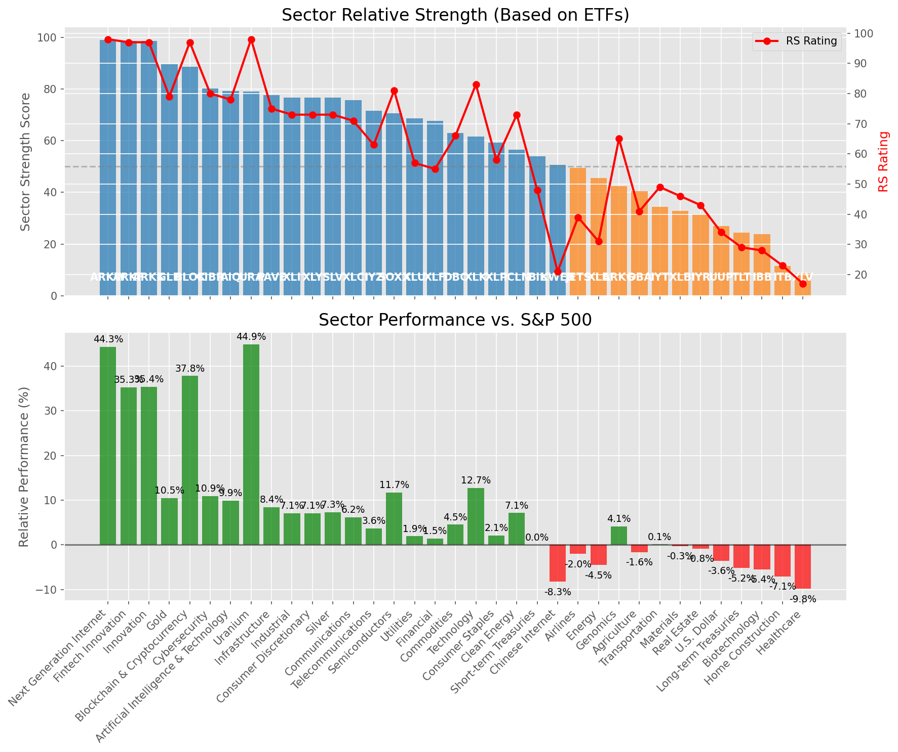

# **Daily Relative Strength Report**

**Date:** 2025-06-20

## **Market Valuation (Buffett Indicator)**

| Metric | Value |
|--------|-------|
| **Market Valuation** | **Overvalued** |
| **Current Ratio** | 9.81 |
| **Historical Mean** | 9.33 |
| **Standard Deviation** | 0.43 |
| **Z-Score (StdDev from Mean)** | 1.12 |
| **Total Market Cap** | $294.00 trillion |
| **GDP** | $29.98 trillion |

## **Market Insights**

### **Market is Overvalued**

The market appears to be trading above historical average valuations. While not at extreme levels, this suggests more modest future returns may be expected. Investors should:

- Focus on companies with reasonable valuations relative to their growth
- Be more selective with new positions
- Look for stocks showing relative strength within their sectors
- Consider trimming positions in extremely overvalued names

Historically, periods of mild overvaluation can persist for extended periods, but returns tend to be below average.

### **Buffett Indicator Overview**

The Buffett Indicator (Total Market Cap / GDP) is a measure of the stock market's valuation relative to the size of the economy. It is named after Warren Buffett, who described it as "probably the best single measure of where valuations stand at any given moment."

- **Values above +2 standard deviations:** Market significantly overvalued
- **Values above +1 standard deviation:** Market overvalued
- **Values between -1 and +1 standard deviations:** Market fairly valued
- **Values below -1 standard deviation:** Market undervalued
- **Values below -2 standard deviations:** Market significantly undervalued

---

## **Sector Relative Strength**

Based on William O'Neil's Relative Strength Methodology

| ETF | Strength | RS Rating | Performance | Above Key MAs | Trend | Sector |
|-----|----------|-----------|-------------|--------------|-------|--------|
| [ARKW](https://www.tradingview.com/chart/?symbol=ARKW) | 99.0 | 98.0 | 43.55% | 10d ✓, 50d ✓, 200d ✓ | ↗️ | Next Generation Internet |
| [BLOK](https://www.tradingview.com/chart/?symbol=BLOK) | 98.5 | 97.0 | 41.40% | 10d ✓, 50d ✓, 200d ✓ | ↗️ | Blockchain & Cryptocurrency |
| [ARKF](https://www.tradingview.com/chart/?symbol=ARKF) | 98.0 | 96.0 | 34.59% | 10d ✓, 50d ✓, 200d ✓ | ↗️ | Fintech Innovation |
| [ARKK](https://www.tradingview.com/chart/?symbol=ARKK) | 98.0 | 96.0 | 34.35% | 10d ✓, 50d ✓, 200d ✓ | ↗️ | Innovation |
| [GLD](https://www.tradingview.com/chart/?symbol=GLD) | 89.5 | 79.0 | 10.52% | 10d ✓, 50d ✓, 200d ✓ | ↗️ | Gold |
| [CIBR](https://www.tradingview.com/chart/?symbol=CIBR) | 80.1 | 80.0 | 11.28% | 10d ✗, 50d ✓, 200d ✓ | ↗️ | Cybersecurity |
| [XLU](https://www.tradingview.com/chart/?symbol=XLU) | 79.5 | 59.0 | 2.63% | 10d ✓, 50d ✓, 200d ✓ | ↗️ | Utilities |
| [AIQ](https://www.tradingview.com/chart/?symbol=AIQ) | 79.1 | 78.0 | 10.23% | 10d ✗, 50d ✓, 200d ✓ | ↗️ | Artificial Intelligence & Technology |
| [URA](https://www.tradingview.com/chart/?symbol=URA) | 79.0 | 98.0 | 46.45% | 10d ✓, 50d ✓, 200d ✓ | ↘️ | Uranium |
| [PAVE](https://www.tradingview.com/chart/?symbol=PAVE) | 78.1 | 76.0 | 8.73% | 10d ✗, 50d ✓, 200d ✓ | ↗️ | Infrastructure |
| [XLI](https://www.tradingview.com/chart/?symbol=XLI) | 76.6 | 73.0 | 7.44% | 10d ✗, 50d ✓, 200d ✓ | ↗️ | Industrial |
| [XLY](https://www.tradingview.com/chart/?symbol=XLY) | 76.1 | 72.0 | 6.96% | 10d ✗, 50d ✓, 200d ✓ | ↗️ | Consumer Discretionary |
| [XLC](https://www.tradingview.com/chart/?symbol=XLC) | 76.1 | 72.0 | 6.78% | 10d ✗, 50d ✓, 200d ✓ | ↗️ | Communications |
| [SLV](https://www.tradingview.com/chart/?symbol=SLV) | 76.1 | 72.0 | 7.08% | 10d ✗, 50d ✓, 200d ✓ | ↗️ | Silver |
| [IYZ](https://www.tradingview.com/chart/?symbol=IYZ) | 70.6 | 61.0 | 3.31% | 10d ✗, 50d ✓, 200d ✓ | ↗️ | Telecommunications |
| [XLF](https://www.tradingview.com/chart/?symbol=XLF) | 68.1 | 56.0 | 1.78% | 10d ✗, 50d ✓, 200d ✓ | ↗️ | Financial |
| [DBC](https://www.tradingview.com/chart/?symbol=DBC) | 62.5 | 65.0 | 4.54% | 10d ✓, 50d ✓, 200d ✓ | ↘️ | Commodities |
| [XLK](https://www.tradingview.com/chart/?symbol=XLK) | 61.6 | 83.0 | 12.67% | 10d ✗, 50d ✓, 200d ✓ | ↘️ | Technology |
| [SOXX](https://www.tradingview.com/chart/?symbol=SOXX) | 60.1 | 80.0 | 11.07% | 10d ✗, 50d ✓, 200d ✓ | ↘️ | Semiconductors |
| [XLP](https://www.tradingview.com/chart/?symbol=XLP) | 58.7 | 57.0 | 2.17% | 10d ✗, 50d ✗, 200d ✓ | ↗️ | Consumer Staples |
| [ICLN](https://www.tradingview.com/chart/?symbol=ICLN) | 57.1 | 74.0 | 7.76% | 10d ✗, 50d ✓, 200d ✓ | ↘️ | Clean Energy |
| [BIL](https://www.tradingview.com/chart/?symbol=BIL) | 54.0 | 48.0 | 0.01% | 10d ✓, 50d ✓, 200d ✓ | ↘️ | Short-term Treasuries |
| [DBA](https://www.tradingview.com/chart/?symbol=DBA) | 50.7 | 41.0 | -1.32% | 10d ✗, 50d ✗, 200d ✓ | ↗️ | Agriculture |
| [KWEB](https://www.tradingview.com/chart/?symbol=KWEB) | 50.6 | 21.0 | -8.02% | 10d ✗, 50d ✓, 200d ✓ | ↗️ | Chinese Internet |
| [JETS](https://www.tradingview.com/chart/?symbol=JETS) | 49.9 | 40.0 | -1.50% | 10d ✗, 50d ✓, 200d ✗ | ↗️ | Airlines |
| [XLE](https://www.tradingview.com/chart/?symbol=XLE) | 45.0 | 30.0 | -4.73% | 10d ✓, 50d ✓, 200d ✓ | ↘️ | Energy |
| [ARKG](https://www.tradingview.com/chart/?symbol=ARKG) | 41.4 | 63.0 | 3.83% | 10d ✗, 50d ✓, 200d ✗ | ↘️ | Genomics |
| [IYT](https://www.tradingview.com/chart/?symbol=IYT) | 35.4 | 51.0 | 0.38% | 10d ✗, 50d ✓, 200d ✗ | ↘️ | Transportation |
| [XLB](https://www.tradingview.com/chart/?symbol=XLB) | 34.9 | 50.0 | 0.28% | 10d ✗, 50d ✓, 200d ✗ | ↘️ | Materials |
| [IYR](https://www.tradingview.com/chart/?symbol=IYR) | 32.4 | 45.0 | -0.37% | 10d ✗, 50d ✓, 200d ✗ | ↘️ | Real Estate |
| [UUP](https://www.tradingview.com/chart/?symbol=UUP) | 26.4 | 33.0 | -3.66% | 10d ✓, 50d ✗, 200d ✗ | ↘️ | U.S. Dollar |
| [TLT](https://www.tradingview.com/chart/?symbol=TLT) | 23.9 | 28.0 | -5.43% | 10d ✓, 50d ✗, 200d ✗ | ↘️ | Long-term Treasuries |
| [IBB](https://www.tradingview.com/chart/?symbol=IBB) | 23.4 | 27.0 | -5.71% | 10d ✗, 50d ✓, 200d ✗ | ↘️ | Biotechnology |
| [ITB](https://www.tradingview.com/chart/?symbol=ITB) | 11.0 | 22.0 | -7.81% | 10d ✗, 50d ✗, 200d ✗ | ↘️ | Home Construction |
| [XLV](https://www.tradingview.com/chart/?symbol=XLV) | 9.0 | 18.0 | -9.69% | 10d ✗, 50d ✗, 200d ✗ | ↘️ | Healthcare |

### **Sector ETF Performance Interpretation**

This table shows the relative strength metrics for different market sectors based on their representative ETFs:

- **ETF**: The ETF used to measure sector performance (click for chart)
- **Strength**: Overall sector strength score (0-100) combining multiple factors
- **RS Rating**: O'Neil RS rating of the sector ETF
- **Performance**: Performance of the sector ETF relative to SPY
- **Above Key MAs**: Whether the ETF is trading above its 10, 50, and 200-day moving averages
- **Trend**: Whether the sector is in an uptrend (↗️) or downtrend (↘️)

### **Current Sector Leadership**

The current market leadership is coming from the following sectors: **Next Generation Internet, Blockchain & Cryptocurrency, Fintech Innovation**.

The **Next Generation Internet** sector (represented by **ARKW**) is showing particularly strong relative strength with an RS rating of 98.0 and performance of 43.55% vs. the S&P 500. This sector is trading above its 10-day, 50-day, 200-day moving average(s). Investors should consider focusing on high RS stocks within these leading sectors for potential outperformance.

---

## **Buy Recommendations**

The following 78 stocks show exceptional relative strength:

| RS Rating | Buy Score | Current Price | Chart | Name | Ticker |
|-----------|-----------|---------------|-------|------|--------|
| 100 | 100 | $62.47 | [Chart](https://www.tradingview.com/chart/?symbol=HIMS) | Hims & Hers Health, Inc. | HIMS |
| 100 | 100 | $142.97 | [Chart](https://www.tradingview.com/chart/?symbol=SEZL) | Sezzle Inc. Common Stock | SEZL |
| 100 | 100 | $204.61 | [Chart](https://www.tradingview.com/chart/?symbol=LEU) | Centrus Energy Corp. | LEU |
| 100 | 100 | $76.68 | [Chart](https://www.tradingview.com/chart/?symbol=HOOD) | Robinhood Markets, Inc. Class A Common Stock | HOOD |
| 100 | 100 | $101.61 | [Chart](https://www.tradingview.com/chart/?symbol=RBLX) | Roblox Corporation | RBLX |
| 99 | 100 | $79.11 | [Chart](https://www.tradingview.com/chart/?symbol=SLNO) | Soleno Therapeutics, Inc. Common Stock | SLNO |
| 99 | 100 | $30.61 | [Chart](https://www.tradingview.com/chart/?symbol=CRK) | Comstock Resources, Inc. | CRK |
| 99 | 100 | $152.44 | [Chart](https://www.tradingview.com/chart/?symbol=NRG) | NRG Energy, Inc. | NRG |
| 99 | 100 | $139.39 | [Chart](https://www.tradingview.com/chart/?symbol=PLTR) | Palantir Technologies Inc. Class A Common Stock | PLTR |
| 99 | 100 | $182.09 | [Chart](https://www.tradingview.com/chart/?symbol=NET) | Cloudflare, Inc. Class A common stock, par value $0.001 per share | NET |
| 98 | 100 | $206.79 | [Chart](https://www.tradingview.com/chart/?symbol=JBL) | Jabil Inc. | JBL |
| 98 | 100 | $135.69 | [Chart](https://www.tradingview.com/chart/?symbol=CLS) | Celestica, Inc. | CLS |
| 98 | 100 | $487.81 | [Chart](https://www.tradingview.com/chart/?symbol=GEV) | GE Vernova Inc. | GEV |
| 98 | 100 | $38.17 | [Chart](https://www.tradingview.com/chart/?symbol=MP) | MP Materials Corp. | MP |
| 98 | 100 | $43.79 | [Chart](https://www.tradingview.com/chart/?symbol=FARO) | Faro Technologies Inc | FARO |
| 97 | 100 | $52.50 | [Chart](https://www.tradingview.com/chart/?symbol=BBW) | Build-A-Bear Workshop, Inc. | BBW |
| 97 | 100 | $43.40 | [Chart](https://www.tradingview.com/chart/?symbol=KTOS) | Kratos Defense & Security Solutions, Inc. | KTOS |
| 97 | 100 | $292.11 | [Chart](https://www.tradingview.com/chart/?symbol=TLN) | Talen Energy Corporation Common Stock | TLN |
| 97 | 100 | $146.32 | [Chart](https://www.tradingview.com/chart/?symbol=COOP) | Mr. Cooper Group Inc. Common Stock | COOP |
| 97 | 100 | $779.26 | [Chart](https://www.tradingview.com/chart/?symbol=AXON) | Axon Enterprise, Inc. Common Stock | AXON |
| 96 | 100 | $252.18 | [Chart](https://www.tradingview.com/chart/?symbol=CRS) | Carpenter Technology Corp | CRS |
| 96 | 100 | $47.39 | [Chart](https://www.tradingview.com/chart/?symbol=ARKF) | ARK Fintech Innovation ETF | ARKF |
| 96 | 100 | $44.66 | [Chart](https://www.tradingview.com/chart/?symbol=DRS) | Leonardo DRS, Inc. Common Stock | DRS |
| 96 | 100 | $32.43 | [Chart](https://www.tradingview.com/chart/?symbol=PRDO) | Perdoceo Education Corporation | PRDO |
| 95 | 100 | $1229.13 | [Chart](https://www.tradingview.com/chart/?symbol=NFLX) | NetFlix Inc | NFLX |
| 95 | 100 | $47.95 | [Chart](https://www.tradingview.com/chart/?symbol=AU) | AngloGold Ashanti plc | AU |
| 95 | 100 | $482.83 | [Chart](https://www.tradingview.com/chart/?symbol=CRWD) | CrowdStrike Holdings, Inc. Class A Common Stock | CRWD |
| 95 | 100 | $172.70 | [Chart](https://www.tradingview.com/chart/?symbol=HWM) | Howmet Aerospace Inc. | HWM |
| 95 | 100 | $70.83 | [Chart](https://www.tradingview.com/chart/?symbol=ULS) | UL Solutions Inc. | ULS |
| 94 | 100 | $24.56 | [Chart](https://www.tradingview.com/chart/?symbol=TFPM) | Triple Flag Precious Metals Corp. | TFPM |
| 94 | 100 | $506.86 | [Chart](https://www.tradingview.com/chart/?symbol=CASY) | Casey's General Stores Inc | CASY |
| 94 | 100 | $125.00 | [Chart](https://www.tradingview.com/chart/?symbol=ATGE) | Adtalem Global Education Inc. Common Shares | ATGE |
| 93 | 100 | $58.59 | [Chart](https://www.tradingview.com/chart/?symbol=SHLD) | Global X Defense Tech ETF | SHLD |
| 93 | 100 | $165.71 | [Chart](https://www.tradingview.com/chart/?symbol=CAH) | Cardinal Health, Inc. | CAH |
| 93 | 100 | $180.97 | [Chart](https://www.tradingview.com/chart/?symbol=EAT) | Brinker International, Inc. | EAT |
| 92 | 100 | $19.40 | [Chart](https://www.tradingview.com/chart/?symbol=SPNT) | SiriusPoint Ltd. | SPNT |
| 92 | 100 | $150.18 | [Chart](https://www.tradingview.com/chart/?symbol=LYV) | Live Nation Entertainment Inc. | LYV |
| 92 | 100 | $59.52 | [Chart](https://www.tradingview.com/chart/?symbol=CAKE) | Cheesecake Factory (The) | CAKE |
| 91 | 100 | $40.94 | [Chart](https://www.tradingview.com/chart/?symbol=BBIO) | BridgeBio Pharma, Inc. Common Stock | BBIO |
| 91 | 100 | $36.02 | [Chart](https://www.tradingview.com/chart/?symbol=AHR) | American Healthcare REIT, Inc. | AHR |
| 90 | 100 | $182.90 | [Chart](https://www.tradingview.com/chart/?symbol=PM) | Philip Morris International Inc. | PM |
| 90 | 100 | $49.12 | [Chart](https://www.tradingview.com/chart/?symbol=BTI) | British American Tobacco p.l.c. American Depositary Shares, American Depositary Shares, each representing one Ordinary Share | BTI |
| 90 | 100 | $73.54 | [Chart](https://www.tradingview.com/chart/?symbol=CTVA) | Corteva, Inc. Common Stock | CTVA |
| 89 | 100 | $165.78 | [Chart](https://www.tradingview.com/chart/?symbol=SFM) | Sprouts Farmers Market, Inc. | SFM |
| 89 | 100 | $52.12 | [Chart](https://www.tradingview.com/chart/?symbol=IBKR) | Interactive Brokers Group, Inc. Class A Common Stock | IBKR |
| 89 | 100 | $102.91 | [Chart](https://www.tradingview.com/chart/?symbol=FWONK) | Liberty Media Corporation Series C Liberty Formula One Common Stock | FWONK |
| 88 | 100 | $36.01 | [Chart](https://www.tradingview.com/chart/?symbol=UGL) | ProShares Ultra Gold | UGL |
| 88 | 100 | $175.57 | [Chart](https://www.tradingview.com/chart/?symbol=TKO) | TKO Group Holdings, Inc. | TKO |
| 88 | 100 | $79.30 | [Chart](https://www.tradingview.com/chart/?symbol=LLYVK) | Liberty Media Corporation Series C Liberty Live Common Stock | LLYVK |
| 87 | 100 | $122.22 | [Chart](https://www.tradingview.com/chart/?symbol=AEM) | Agnico Eagle Mines Ltd. | AEM |
| 87 | 100 | $281.96 | [Chart](https://www.tradingview.com/chart/?symbol=VRSN) | VeriSign Inc | VRSN |
| 87 | 100 | $25.92 | [Chart](https://www.tradingview.com/chart/?symbol=SRAD) | Sportradar Group AG Class A Ordinary Shares | SRAD |
| 87 | 100 | $283.33 | [Chart](https://www.tradingview.com/chart/?symbol=IBM) | International Business Machines Corporation | IBM |
| 87 | 100 | $22.45 | [Chart](https://www.tradingview.com/chart/?symbol=LAUR) | Laureate Education, Inc. Common Stock | LAUR |
| 86 | 100 | $241.22 | [Chart](https://www.tradingview.com/chart/?symbol=TTWO) | Take-Two Interactive Software Inc | TTWO |
| 88 | 99 | $180.70 | [Chart](https://www.tradingview.com/chart/?symbol=ITA) | iShares U.S. Aerospace & Defense ETF | ITA |
| 87 | 99 | $84.52 | [Chart](https://www.tradingview.com/chart/?symbol=TPR) | Tapestry, Inc. Common Stock | TPR |
| 87 | 98 | $179.94 | [Chart](https://www.tradingview.com/chart/?symbol=RGLD) | Royal Gold Inc | RGLD |
| 85 | 98 | $42.68 | [Chart](https://www.tradingview.com/chart/?symbol=VIRT) | Virtu Financial, Inc. Class A | VIRT |
| 84 | 98 | $225.44 | [Chart](https://www.tradingview.com/chart/?symbol=DRI) | Darden Restaurants, Inc. | DRI |
| 86 | 96 | $172.05 | [Chart](https://www.tradingview.com/chart/?symbol=NTRA) | Natera, Inc. Common Stock | NTRA |
| 86 | 96 | $90.31 | [Chart](https://www.tradingview.com/chart/?symbol=SCHW) | The Charles Schwab Corporation | SCHW |
| 86 | 96 | $90.28 | [Chart](https://www.tradingview.com/chart/?symbol=SANM) | Sanmina  Corp | SANM |
| 85 | 95 | $195.01 | [Chart](https://www.tradingview.com/chart/?symbol=TRI) | Thomson Reuters Corporation Common Shares | TRI |
| 85 | 95 | $205.50 | [Chart](https://www.tradingview.com/chart/?symbol=GPOR) | Gulfport Energy Corporation | GPOR |
| 84 | 95 | $217.77 | [Chart](https://www.tradingview.com/chart/?symbol=BAP) | Credicorp LTD | BAP |
| 82 | 95 | $60.29 | [Chart](https://www.tradingview.com/chart/?symbol=EQT) | EQT CORP | EQT |
| 84 | 94 | $107.08 | [Chart](https://www.tradingview.com/chart/?symbol=SPMO) | Invesco S&P 500 Momentum ETF | SPMO |
| 84 | 94 | $58.47 | [Chart](https://www.tradingview.com/chart/?symbol=EPR) | EPR Properties | EPR |
| 83 | 94 | $135.78 | [Chart](https://www.tradingview.com/chart/?symbol=VSEC) | VSE Corp | VSEC |
| 84 | 93 | $198.32 | [Chart](https://www.tradingview.com/chart/?symbol=COF) | Capital One Financial | COF |
| 83 | 93 | $86.87 | [Chart](https://www.tradingview.com/chart/?symbol=NDAQ) | Nasdaq, Inc. Common Stock | NDAQ |
| 82 | 92 | $48.20 | [Chart](https://www.tradingview.com/chart/?symbol=INOD) | Innodata Inc. | INOD |
| 81 | 92 | $63.40 | [Chart](https://www.tradingview.com/chart/?symbol=MNST) | Monster Beverage Corporation | MNST |
| 81 | 91 | $49.83 | [Chart](https://www.tradingview.com/chart/?symbol=GH) | Guardant Health, Inc. Common Stock | GH |
| 81 | 91 | $33.43 | [Chart](https://www.tradingview.com/chart/?symbol=FDP) | Fresh Del Monte Produce Inc. | FDP |
| 81 | 91 | $262.57 | [Chart](https://www.tradingview.com/chart/?symbol=LH) | Labcorp Holdings Inc. | LH |
| 80 | 91 | $296.64 | [Chart](https://www.tradingview.com/chart/?symbol=COR) | Cencora, Inc. | COR |

---

## **Sell Recommendations**

The following 90 stocks show deteriorating relative strength:

| RS Rating | Sell Score | Current Price | Chart | Name | Ticker |
|-----------|------------|---------------|-------|------|--------|
| 1 | 100 | $31.57 | [Chart](https://www.tradingview.com/chart/?symbol=TECS) | Direxion Daily Technology Bear 3x Shares | TECS |
| 1 | 100 | $11.31 | [Chart](https://www.tradingview.com/chart/?symbol=NRIX) | Nurix Therapeutics, Inc. Common stock | NRIX |
| 1 | 100 | $14.18 | [Chart](https://www.tradingview.com/chart/?symbol=EWTX) | Edgewise Therapeutics, Inc. Common Stock | EWTX |
| 1 | 100 | $13.79 | [Chart](https://www.tradingview.com/chart/?symbol=RXST) | RxSight, Inc. Common Stock | RXST |
| 1 | 100 | $17.46 | [Chart](https://www.tradingview.com/chart/?symbol=ICHR) | Ichor Holdings | ICHR |
| 1 | 100 | $26.12 | [Chart](https://www.tradingview.com/chart/?symbol=HELE) | Helen Of Troy Ltd | HELE |
| 1 | 100 | $14.93 | [Chart](https://www.tradingview.com/chart/?symbol=ZVZZT) | SUPER Montage TEST SYMBOL | ZVZZT |
| 2 | 100 | $16.68 | [Chart](https://www.tradingview.com/chart/?symbol=NVDS) | Investment Managers Series Trust II Tradr 1.5X Short NVDA Daily ETF | NVDS |
| 2 | 100 | $23.91 | [Chart](https://www.tradingview.com/chart/?symbol=CRTO) | Criteo S.A. | CRTO |
| 3 | 100 | $56.90 | [Chart](https://www.tradingview.com/chart/?symbol=ALB) | Albemarle Corporation | ALB |
| 3 | 100 | $21.30 | [Chart](https://www.tradingview.com/chart/?symbol=AMRK) | A-Mark Precious Metals, Inc. | AMRK |
| 3 | 100 | $44.55 | [Chart](https://www.tradingview.com/chart/?symbol=LINE) | Lineage, Inc. Common Stock | LINE |
| 4 | 100 | $31.24 | [Chart](https://www.tradingview.com/chart/?symbol=ZD) | Ziff Davis, Inc. Common Stock | ZD |
| 5 | 100 | $19.67 | [Chart](https://www.tradingview.com/chart/?symbol=SPT) | Sprout Social, Inc Class A Common Stock | SPT |
| 5 | 100 | $24.06 | [Chart](https://www.tradingview.com/chart/?symbol=ASTH) | Astrana Health Inc. Common Stock | ASTH |
| 6 | 100 | $22.71 | [Chart](https://www.tradingview.com/chart/?symbol=RPD) | Rapid7, Inc. Common Stock | RPD |
| 6 | 100 | $16.58 | [Chart](https://www.tradingview.com/chart/?symbol=AMTB) | Amerant Bancorp Inc. | AMTB |
| 6 | 100 | $49.89 | [Chart](https://www.tradingview.com/chart/?symbol=FBIN) | Fortune Brands Innovations, Inc. | FBIN |
| 6 | 100 | $20.30 | [Chart](https://www.tradingview.com/chart/?symbol=BITI) | ProShares Short Bitcoin ETF | BITI |
| 6 | 100 | $78.73 | [Chart](https://www.tradingview.com/chart/?symbol=LNTH) | Lantheus Holdings, Inc | LNTH |
| 6 | 100 | $37.58 | [Chart](https://www.tradingview.com/chart/?symbol=APOG) | Apogee Enterprises Inc | APOG |
| 8 | 100 | $30.48 | [Chart](https://www.tradingview.com/chart/?symbol=FUN) | Six Flags Entertainment Corporation | FUN |
| 8 | 100 | $10.09 | [Chart](https://www.tradingview.com/chart/?symbol=ABR) | Arbor Realty Trust, Inc. | ABR |
| 8 | 100 | $59.34 | [Chart](https://www.tradingview.com/chart/?symbol=NKE) | Nike, Inc. | NKE |
| 9 | 100 | $11.19 | [Chart](https://www.tradingview.com/chart/?symbol=M) | Macy's Inc. | M |
| 9 | 100 | $20.37 | [Chart](https://www.tradingview.com/chart/?symbol=KIDS) | OrthoPediatrics Corp. Common Stock | KIDS |
| 10 | 100 | $10.06 | [Chart](https://www.tradingview.com/chart/?symbol=LBTYK) | Liberty Global Ltd. Class C Common Shares | LBTYK |
| 10 | 100 | $50.27 | [Chart](https://www.tradingview.com/chart/?symbol=AMWD) | American Woodmark Corp | AMWD |
| 11 | 100 | $17.21 | [Chart](https://www.tradingview.com/chart/?symbol=ZTO) | ZTO Express (Cayman) Inc. American Depositary Shares, each representing one Class A ordinary share | ZTO |
| 7 | 99 | $31.31 | [Chart](https://www.tradingview.com/chart/?symbol=MBIN) | Merchants Bancorp Common Stock | MBIN |
| 9 | 99 | $25.65 | [Chart](https://www.tradingview.com/chart/?symbol=ATHM) | Autohome Inc. American Depositary Shares, each representing four Class A Ordinary Shares | ATHM |
| 13 | 99 | $30.11 | [Chart](https://www.tradingview.com/chart/?symbol=CRNX) | Crinetics Pharmaceuticals, Inc. | CRNX |
| 14 | 99 | $19.37 | [Chart](https://www.tradingview.com/chart/?symbol=FOR) | Forestar Group Inc. | FOR |
| 15 | 99 | $83.92 | [Chart](https://www.tradingview.com/chart/?symbol=BIDU) | Baidu, Inc. | BIDU |
| 3 | 98 | $32.31 | [Chart](https://www.tradingview.com/chart/?symbol=SQM) | Sociedad Quimica y Minera de Chile SA | SQM |
| 9 | 98 | $12.43 | [Chart](https://www.tradingview.com/chart/?symbol=PMT) | PennyMac Mortgage Investment Trust | PMT |
| 4 | 97 | $12.15 | [Chart](https://www.tradingview.com/chart/?symbol=ERII) | Energy Recovery, Inc. | ERII |
| 10 | 97 | $25.95 | [Chart](https://www.tradingview.com/chart/?symbol=ZSL) | ProShares UltraShort Silver | ZSL |
| 11 | 97 | $86.21 | [Chart](https://www.tradingview.com/chart/?symbol=BCC) | Boise Cascade Company | BCC |
| 17 | 97 | $30.11 | [Chart](https://www.tradingview.com/chart/?symbol=BAX) | Baxter International Inc. | BAX |
| 8 | 96 | $47.74 | [Chart](https://www.tradingview.com/chart/?symbol=SNY) | Sanofi American Depositary Shares (Each representing one-half of one ordinary share) | SNY |
| 12 | 95 | $26.34 | [Chart](https://www.tradingview.com/chart/?symbol=WSC) | WillScot Holdings Corporation Class A Common Stock | WSC |
| 13 | 95 | $13.74 | [Chart](https://www.tradingview.com/chart/?symbol=OCSL) | Oaktree Specialty Lending Corporation | OCSL |
| 14 | 95 | $16.63 | [Chart](https://www.tradingview.com/chart/?symbol=SVOL) | Simplify Volatility Premium ETF | SVOL |
| 16 | 95 | $43.70 | [Chart](https://www.tradingview.com/chart/?symbol=PRKS) | United Parks & Resorts Inc. | PRKS |
| 19 | 95 | $43.53 | [Chart](https://www.tradingview.com/chart/?symbol=SON) | Sonoco Products Company | SON |
| 8 | 94 | $26.65 | [Chart](https://www.tradingview.com/chart/?symbol=WMG) | Warner Music Group Corp. Class A Common Stock | WMG |
| 10 | 93 | $17.82 | [Chart](https://www.tradingview.com/chart/?symbol=IRT) | Independence Realty Trust Inc. | IRT |
| 10 | 92 | $128.58 | [Chart](https://www.tradingview.com/chart/?symbol=ICUI) | ICU Medical Inc | ICUI |
| 16 | 92 | $47.43 | [Chart](https://www.tradingview.com/chart/?symbol=SDOW) | ProShares UltraPro Short Dow 30 | SDOW |
| 17 | 92 | $36.71 | [Chart](https://www.tradingview.com/chart/?symbol=LIT) | Global X Lithium & Battery Tech ETF | LIT |
| 15 | 91 | $73.23 | [Chart](https://www.tradingview.com/chart/?symbol=CBT) | Cabot Corporation | CBT |
| 23 | 91 | $10.23 | [Chart](https://www.tradingview.com/chart/?symbol=NMZ) | Nuveen Municipal High Income Opportunity Fund | NMZ |
| 17 | 90 | $64.92 | [Chart](https://www.tradingview.com/chart/?symbol=ZROZ) | PIMCO 25+ Year Zero Coupon U.S. Treasury Index Exchange-Traded Fund | ZROZ |
| 21 | 88 | $17.66 | [Chart](https://www.tradingview.com/chart/?symbol=JPMpM) | JPMorgan Chase & Co. Depositary Shares, each representing a 1/400th interest in a share of 4.20% Non-Cumulative Preferred Stock, Series MM | JPMpM |
| 19 | 87 | $12.96 | [Chart](https://www.tradingview.com/chart/?symbol=ARDT) | Ardent Health, Inc. | ARDT |
| 21 | 87 | $67.35 | [Chart](https://www.tradingview.com/chart/?symbol=BBY) | Best Buy Company, Inc. | BBY |
| 25 | 87 | $16.75 | [Chart](https://www.tradingview.com/chart/?symbol=STAA) | Staar Surgical Co | STAA |
| 24 | 86 | $137.14 | [Chart](https://www.tradingview.com/chart/?symbol=LSTR) | Landstar System Inc | LSTR |
| 18 | 85 | $764.29 | [Chart](https://www.tradingview.com/chart/?symbol=LLY) | Eli Lilly & Co. | LLY |
| 18 | 84 | $37.09 | [Chart](https://www.tradingview.com/chart/?symbol=LKQ) | LKQ Corporation | LKQ |
| 26 | 84 | $15.74 | [Chart](https://www.tradingview.com/chart/?symbol=BBN) | BlackRock Taxable Municipal Bond Trust | BBN |
| 29 | 84 | $11.77 | [Chart](https://www.tradingview.com/chart/?symbol=NVG) | Nuveen AMT-Free Municipal Credit Income Fund | NVG |
| 30 | 84 | $54.95 | [Chart](https://www.tradingview.com/chart/?symbol=VGLT) | Vanguard Long-Term Treasury ETF | VGLT |
| 21 | 83 | $15.00 | [Chart](https://www.tradingview.com/chart/?symbol=VRE) | Veris Residential, Inc. | VRE |
| 22 | 83 | $197.65 | [Chart](https://www.tradingview.com/chart/?symbol=AAPL) | Apple Inc. | AAPL |
| 23 | 83 | $28.63 | [Chart](https://www.tradingview.com/chart/?symbol=RNA) | Avidity Biosciences, Inc. Common Stock | RNA |
| 28 | 83 | $12.91 | [Chart](https://www.tradingview.com/chart/?symbol=MRTN) | Marten Transport Ltd | MRTN |
| 18 | 82 | $73.20 | [Chart](https://www.tradingview.com/chart/?symbol=MKC) | McCormick & Company, Incorporated Non-VTG CS | MKC |
| 19 | 82 | $22.43 | [Chart](https://www.tradingview.com/chart/?symbol=COLB) | Columbia Banking Systems Inc | COLB |
| 22 | 82 | $43.82 | [Chart](https://www.tradingview.com/chart/?symbol=ABM) | ABM Industries, Inc. | ABM |
| 23 | 82 | $14.21 | [Chart](https://www.tradingview.com/chart/?symbol=BMEZ) | BlackRock Health Sciences Term Trust | BMEZ |
| 25 | 81 | $54.25 | [Chart](https://www.tradingview.com/chart/?symbol=CBU) | Community Financial System, Inc. | CBU |
| 27 | 81 | $44.40 | [Chart](https://www.tradingview.com/chart/?symbol=HCC) | Warrior Met Coal, Inc. | HCC |
| 21 | 80 | $42.83 | [Chart](https://www.tradingview.com/chart/?symbol=FBK) | FB Financial Corporation | FBK |
| 34 | 80 | $11.74 | [Chart](https://www.tradingview.com/chart/?symbol=NZF) | Nuveen Municipal Credit Income Fund | NZF |
| 32 | 79 | $35.94 | [Chart](https://www.tradingview.com/chart/?symbol=STBA) | S&T Bancorp Inc | STBA |
| 22 | 78 | $39.83 | [Chart](https://www.tradingview.com/chart/?symbol=NBTB) | NBT Bancorp Inc | NBTB |
| 32 | 78 | $10.44 | [Chart](https://www.tradingview.com/chart/?symbol=MYI) | BLACKROCK MUNIYIELD QUALITY FUND III, INC. | MYI |
| 30 | 77 | $16.16 | [Chart](https://www.tradingview.com/chart/?symbol=PFS) | Provident Financial Services, Inc. | PFS |
| 31 | 77 | $116.96 | [Chart](https://www.tradingview.com/chart/?symbol=SITE) | SiteOne Landscape Supply, Inc. | SITE |
| 31 | 75 | $10.29 | [Chart](https://www.tradingview.com/chart/?symbol=MUC) | BLACKROCK MUNIHOLDINGS CALIFORNIA QUALITY FUND, INC | MUC |
| 37 | 75 | $21.36 | [Chart](https://www.tradingview.com/chart/?symbol=GPCR) | Structure Therapeutics Inc. American Depositary Shares | GPCR |
| 30 | 74 | $14.95 | [Chart](https://www.tradingview.com/chart/?symbol=PAXS) | PIMCO Access Income Fund | PAXS |
| 32 | 73 | $10.79 | [Chart](https://www.tradingview.com/chart/?symbol=NEA) | Nuveen AMT-Free Quality Municipal Income Fund | NEA |
| 35 | 73 | $11.20 | [Chart](https://www.tradingview.com/chart/?symbol=NAD) | Nuveen Quality Municipal Income Fund | NAD |
| 39 | 70 | $29.16 | [Chart](https://www.tradingview.com/chart/?symbol=APPN) | Appian Corporation Class A Common Stock | APPN |
| 38 | 67 | $314.30 | [Chart](https://www.tradingview.com/chart/?symbol=CI) | The Cigna Group | CI |
| 36 | 65 | $21.05 | [Chart](https://www.tradingview.com/chart/?symbol=PGNY) | Progyny, Inc. Common Stock | PGNY |
| 38 | 65 | $20.84 | [Chart](https://www.tradingview.com/chart/?symbol=CON) | Concentra Group Holdings Parent, Inc. | CON |

## **Methodology**

This report uses William O'Neil's relative strength methodology from Investors Business Daily:

* **RS Rating**: Percentile rank of stock's performance vs. S&P 500 over the past 63 trading days (1-99 scale)
* **Buy Criteria**: RS Rating >= 80, price above 50-day MA, strong uptrend, increasing volume
* **Sell Criteria**: RS Rating < 40, price below 50-day MA, downtrend, decreasing volume

### **O'Neil's Key Principles**

1. **Focus on relative performance** - stocks outperforming the market
2. **Price trend confirmation** - stock must be in an uptrend
3. **Volume confirmation** - strong volume supports price moves
4. **Moving average validation** - price above key moving averages
5. **Market leaders only** - concentrate on top-performing stocks

*Report generated automatically after market close*