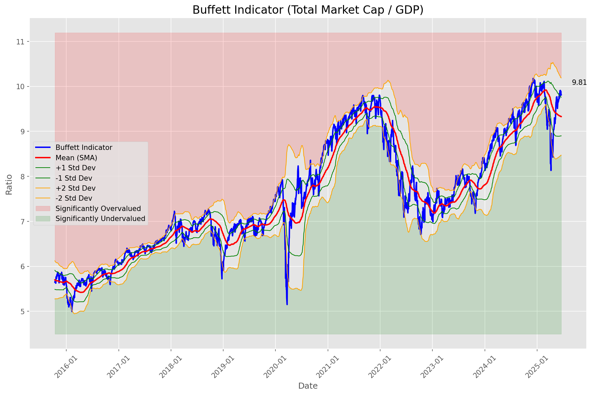
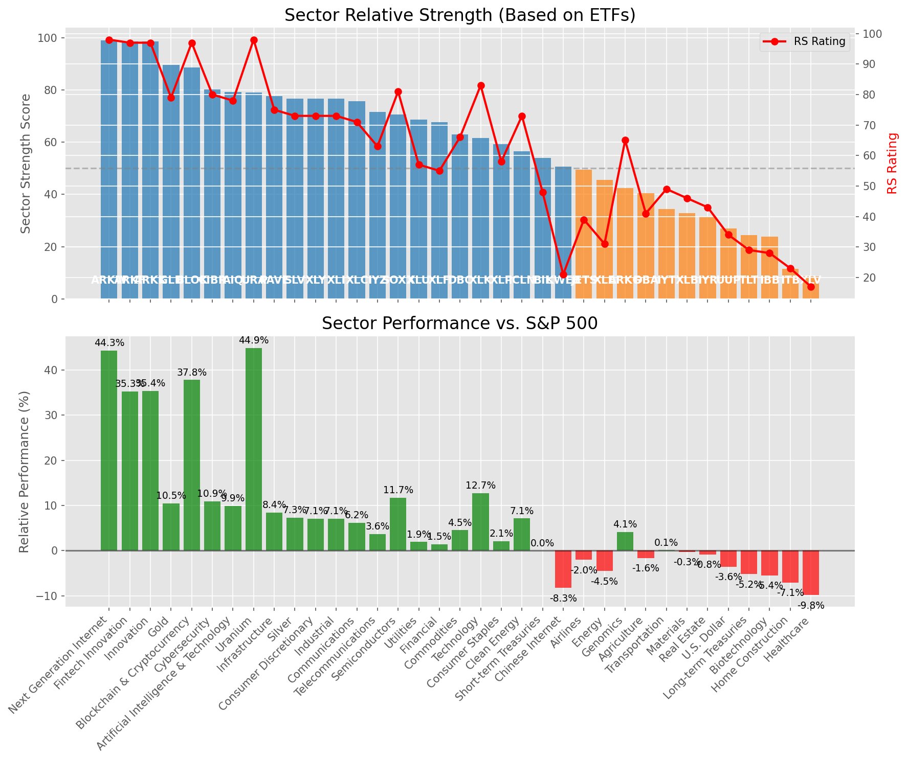

# **Daily Relative Strength Report**

**Date:** 2025-06-21

## **Market Valuation (Buffett Indicator)**

| Metric | Value |
|--------|-------|
| **Market Valuation** | **Overvalued** |
| **Current Ratio** | 9.79 |
| **Historical Mean** | 9.33 |
| **Standard Deviation** | 0.43 |
| **Z-Score (StdDev from Mean)** | 1.12 |
| **Total Market Cap** | $293.43 trillion |
| **GDP** | $29.98 trillion |

## **Market Insights**

### **Market is Overvalued**

The market appears to be trading above historical average valuations. While not at extreme levels, this suggests more modest future returns may be expected. Investors should:

- Focus on companies with reasonable valuations relative to their growth
- Be more selective with new positions
- Look for stocks showing relative strength within their sectors
- Consider trimming positions in extremely overvalued names

Historically, periods of mild overvaluation can persist for extended periods, but returns tend to be below average.

### **Buffett Indicator Overview**

The Buffett Indicator (Total Market Cap / GDP) is a measure of the stock market's valuation relative to the size of the economy. It is named after Warren Buffett, who described it as "probably the best single measure of where valuations stand at any given moment."

- **Values above +2 standard deviations:** Market significantly overvalued
- **Values above +1 standard deviation:** Market overvalued
- **Values between -1 and +1 standard deviations:** Market fairly valued
- **Values below -1 standard deviation:** Market undervalued
- **Values below -2 standard deviations:** Market significantly undervalued

---

## **Sector Relative Strength**

Based on William O'Neil's Relative Strength Methodology

| ETF | Strength | RS Rating | Performance | Above Key MAs | Trend | Sector |
|-----|----------|-----------|-------------|--------------|-------|--------|
| [ARKW](https://www.tradingview.com/chart/?symbol=ARKW) | 99.0 | 98.0 | 44.30% | 10d ✓, 50d ✓, 200d ✓ | ↗️ | Next Generation Internet |
| [ARKF](https://www.tradingview.com/chart/?symbol=ARKF) | 98.5 | 97.0 | 35.27% | 10d ✓, 50d ✓, 200d ✓ | ↗️ | Fintech Innovation |
| [ARKK](https://www.tradingview.com/chart/?symbol=ARKK) | 98.5 | 97.0 | 35.41% | 10d ✓, 50d ✓, 200d ✓ | ↗️ | Innovation |
| [GLD](https://www.tradingview.com/chart/?symbol=GLD) | 89.5 | 79.0 | 10.46% | 10d ✓, 50d ✓, 200d ✓ | ↗️ | Gold |
| [BLOK](https://www.tradingview.com/chart/?symbol=BLOK) | 88.6 | 97.0 | 37.81% | 10d ✗, 50d ✓, 200d ✓ | ↗️ | Blockchain & Cryptocurrency |
| [CIBR](https://www.tradingview.com/chart/?symbol=CIBR) | 80.1 | 80.0 | 10.89% | 10d ✗, 50d ✓, 200d ✓ | ↗️ | Cybersecurity |
| [AIQ](https://www.tradingview.com/chart/?symbol=AIQ) | 79.1 | 78.0 | 9.93% | 10d ✗, 50d ✓, 200d ✓ | ↗️ | Artificial Intelligence & Technology |
| [URA](https://www.tradingview.com/chart/?symbol=URA) | 79.0 | 98.0 | 44.88% | 10d ✓, 50d ✓, 200d ✓ | ↘️ | Uranium |
| [PAVE](https://www.tradingview.com/chart/?symbol=PAVE) | 77.6 | 75.0 | 8.42% | 10d ✗, 50d ✓, 200d ✓ | ↗️ | Infrastructure |
| [SLV](https://www.tradingview.com/chart/?symbol=SLV) | 76.6 | 73.0 | 7.28% | 10d ✗, 50d ✓, 200d ✓ | ↗️ | Silver |
| [XLY](https://www.tradingview.com/chart/?symbol=XLY) | 76.6 | 73.0 | 7.09% | 10d ✗, 50d ✓, 200d ✓ | ↗️ | Consumer Discretionary |
| [XLI](https://www.tradingview.com/chart/?symbol=XLI) | 76.6 | 73.0 | 7.08% | 10d ✗, 50d ✓, 200d ✓ | ↗️ | Industrial |
| [XLC](https://www.tradingview.com/chart/?symbol=XLC) | 75.6 | 71.0 | 6.20% | 10d ✗, 50d ✓, 200d ✓ | ↗️ | Communications |
| [IYZ](https://www.tradingview.com/chart/?symbol=IYZ) | 71.6 | 63.0 | 3.64% | 10d ✗, 50d ✓, 200d ✓ | ↗️ | Telecommunications |
| [SOXX](https://www.tradingview.com/chart/?symbol=SOXX) | 70.5 | 81.0 | 11.72% | 10d ✓, 50d ✓, 200d ✓ | ↘️ | Semiconductors |
| [XLU](https://www.tradingview.com/chart/?symbol=XLU) | 68.6 | 57.0 | 1.92% | 10d ✗, 50d ✓, 200d ✓ | ↗️ | Utilities |
| [XLF](https://www.tradingview.com/chart/?symbol=XLF) | 67.6 | 55.0 | 1.45% | 10d ✗, 50d ✓, 200d ✓ | ↗️ | Financial |
| [DBC](https://www.tradingview.com/chart/?symbol=DBC) | 63.0 | 66.0 | 4.54% | 10d ✓, 50d ✓, 200d ✓ | ↘️ | Commodities |
| [XLK](https://www.tradingview.com/chart/?symbol=XLK) | 61.6 | 83.0 | 12.73% | 10d ✗, 50d ✓, 200d ✓ | ↘️ | Technology |
| [XLP](https://www.tradingview.com/chart/?symbol=XLP) | 59.2 | 58.0 | 2.09% | 10d ✗, 50d ✗, 200d ✓ | ↗️ | Consumer Staples |
| [ICLN](https://www.tradingview.com/chart/?symbol=ICLN) | 56.6 | 73.0 | 7.12% | 10d ✗, 50d ✓, 200d ✓ | ↘️ | Clean Energy |
| [BIL](https://www.tradingview.com/chart/?symbol=BIL) | 54.0 | 48.0 | 0.01% | 10d ✓, 50d ✓, 200d ✓ | ↘️ | Short-term Treasuries |
| [KWEB](https://www.tradingview.com/chart/?symbol=KWEB) | 50.6 | 21.0 | -8.26% | 10d ✗, 50d ✓, 200d ✓ | ↗️ | Chinese Internet |
| [JETS](https://www.tradingview.com/chart/?symbol=JETS) | 49.4 | 39.0 | -2.00% | 10d ✗, 50d ✓, 200d ✗ | ↗️ | Airlines |
| [XLE](https://www.tradingview.com/chart/?symbol=XLE) | 45.5 | 31.0 | -4.50% | 10d ✓, 50d ✓, 200d ✓ | ↘️ | Energy |
| [ARKG](https://www.tradingview.com/chart/?symbol=ARKG) | 42.4 | 65.0 | 4.11% | 10d ✗, 50d ✓, 200d ✗ | ↘️ | Genomics |
| [DBA](https://www.tradingview.com/chart/?symbol=DBA) | 40.5 | 41.0 | -1.64% | 10d ✗, 50d ✗, 200d ✗ | ↗️ | Agriculture |
| [IYT](https://www.tradingview.com/chart/?symbol=IYT) | 34.4 | 49.0 | 0.12% | 10d ✗, 50d ✓, 200d ✗ | ↘️ | Transportation |
| [XLB](https://www.tradingview.com/chart/?symbol=XLB) | 32.9 | 46.0 | -0.27% | 10d ✗, 50d ✓, 200d ✗ | ↘️ | Materials |
| [IYR](https://www.tradingview.com/chart/?symbol=IYR) | 31.4 | 43.0 | -0.81% | 10d ✗, 50d ✓, 200d ✗ | ↘️ | Real Estate |
| [UUP](https://www.tradingview.com/chart/?symbol=UUP) | 26.9 | 34.0 | -3.56% | 10d ✓, 50d ✗, 200d ✗ | ↘️ | U.S. Dollar |
| [TLT](https://www.tradingview.com/chart/?symbol=TLT) | 24.4 | 29.0 | -5.21% | 10d ✓, 50d ✗, 200d ✗ | ↘️ | Long-term Treasuries |
| [IBB](https://www.tradingview.com/chart/?symbol=IBB) | 23.9 | 28.0 | -5.45% | 10d ✗, 50d ✓, 200d ✗ | ↘️ | Biotechnology |
| [ITB](https://www.tradingview.com/chart/?symbol=ITB) | 11.5 | 23.0 | -7.07% | 10d ✗, 50d ✗, 200d ✗ | ↘️ | Home Construction |
| [XLV](https://www.tradingview.com/chart/?symbol=XLV) | 8.5 | 17.0 | -9.80% | 10d ✗, 50d ✗, 200d ✗ | ↘️ | Healthcare |

### **Sector ETF Performance Interpretation**

This table shows the relative strength metrics for different market sectors based on their representative ETFs:

- **ETF**: The ETF used to measure sector performance (click for chart)
- **Strength**: Overall sector strength score (0-100) combining multiple factors
- **RS Rating**: O'Neil RS rating of the sector ETF
- **Performance**: Performance of the sector ETF relative to SPY
- **Above Key MAs**: Whether the ETF is trading above its 10, 50, and 200-day moving averages
- **Trend**: Whether the sector is in an uptrend (↗️) or downtrend (↘️)

### **Current Sector Leadership**

The current market leadership is coming from the following sectors: **Next Generation Internet, Fintech Innovation, Innovation**.

The **Next Generation Internet** sector (represented by **ARKW**) is showing particularly strong relative strength with an RS rating of 98.0 and performance of 44.30% vs. the S&P 500. This sector is trading above its 10-day, 50-day, 200-day moving average(s). Investors should consider focusing on high RS stocks within these leading sectors for potential outperformance.

---

## **Buy Recommendations**

The following 78 stocks show exceptional relative strength:

| RS Rating | Buy Score | Current Price | Chart | Name | Ticker |
|-----------|-----------|---------------|-------|------|--------|
| 100 | 100 | $190.04 | [Chart](https://www.tradingview.com/chart/?symbol=LEU) | Centrus Energy Corp. | LEU |
| 100 | 100 | $147.04 | [Chart](https://www.tradingview.com/chart/?symbol=SEZL) | Sezzle Inc. Common Stock | SEZL |
| 100 | 100 | $78.50 | [Chart](https://www.tradingview.com/chart/?symbol=HOOD) | Robinhood Markets, Inc. Class A Common Stock | HOOD |
| 100 | 100 | $79.98 | [Chart](https://www.tradingview.com/chart/?symbol=SLNO) | Soleno Therapeutics, Inc. Common Stock | SLNO |
| 100 | 100 | $102.09 | [Chart](https://www.tradingview.com/chart/?symbol=RBLX) | Roblox Corporation | RBLX |
| 100 | 100 | $319.89 | [Chart](https://www.tradingview.com/chart/?symbol=CVNA) | Carvana Co. | CVNA |
| 100 | 100 | $64.22 | [Chart](https://www.tradingview.com/chart/?symbol=HIMS) | Hims & Hers Health, Inc. | HIMS |
| 99 | 100 | $179.30 | [Chart](https://www.tradingview.com/chart/?symbol=NET) | Cloudflare, Inc. Class A common stock, par value $0.001 per share | NET |
| 99 | 100 | $30.50 | [Chart](https://www.tradingview.com/chart/?symbol=CRK) | Comstock Resources, Inc. | CRK |
| 99 | 100 | $137.30 | [Chart](https://www.tradingview.com/chart/?symbol=PLTR) | Palantir Technologies Inc. Class A Common Stock | PLTR |
| 99 | 100 | $43.72 | [Chart](https://www.tradingview.com/chart/?symbol=FARO) | Faro Technologies Inc | FARO |
| 98 | 100 | $52.85 | [Chart](https://www.tradingview.com/chart/?symbol=BBW) | Build-A-Bear Workshop, Inc. | BBW |
| 98 | 100 | $206.20 | [Chart](https://www.tradingview.com/chart/?symbol=JBL) | Jabil Inc. | JBL |
| 98 | 100 | $486.96 | [Chart](https://www.tradingview.com/chart/?symbol=GEV) | GE Vernova Inc. | GEV |
| 98 | 100 | $37.74 | [Chart](https://www.tradingview.com/chart/?symbol=MP) | MP Materials Corp. | MP |
| 97 | 100 | $149.12 | [Chart](https://www.tradingview.com/chart/?symbol=COOP) | Mr. Cooper Group Inc. Common Stock | COOP |
| 97 | 100 | $47.63 | [Chart](https://www.tradingview.com/chart/?symbol=ARKF) | ARK Fintech Innovation ETF | ARKF |
| 97 | 100 | $135.23 | [Chart](https://www.tradingview.com/chart/?symbol=CLS) | Celestica, Inc. | CLS |
| 97 | 100 | $253.72 | [Chart](https://www.tradingview.com/chart/?symbol=CRS) | Carpenter Technology Corp | CRS |
| 97 | 100 | $43.11 | [Chart](https://www.tradingview.com/chart/?symbol=KTOS) | Kratos Defense & Security Solutions, Inc. | KTOS |
| 97 | 100 | $288.66 | [Chart](https://www.tradingview.com/chart/?symbol=TLN) | Talen Energy Corporation Common Stock | TLN |
| 96 | 100 | $173.34 | [Chart](https://www.tradingview.com/chart/?symbol=HWM) | Howmet Aerospace Inc. | HWM |
| 96 | 100 | $47.98 | [Chart](https://www.tradingview.com/chart/?symbol=AU) | AngloGold Ashanti plc | AU |
| 96 | 100 | $32.18 | [Chart](https://www.tradingview.com/chart/?symbol=PRDO) | Perdoceo Education Corporation | PRDO |
| 95 | 100 | $1231.41 | [Chart](https://www.tradingview.com/chart/?symbol=NFLX) | NetFlix Inc | NFLX |
| 94 | 100 | $500.27 | [Chart](https://www.tradingview.com/chart/?symbol=CASY) | Casey's General Stores Inc | CASY |
| 94 | 100 | $125.08 | [Chart](https://www.tradingview.com/chart/?symbol=ATGE) | Adtalem Global Education Inc. Common Shares | ATGE |
| 94 | 100 | $24.70 | [Chart](https://www.tradingview.com/chart/?symbol=TFPM) | Triple Flag Precious Metals Corp. | TFPM |
| 94 | 100 | $272.39 | [Chart](https://www.tradingview.com/chart/?symbol=RCL) | Royal Caribbean Group | RCL |
| 93 | 100 | $71.38 | [Chart](https://www.tradingview.com/chart/?symbol=CORT) | Corcept Therapeutics Inc. | CORT |
| 93 | 100 | $178.65 | [Chart](https://www.tradingview.com/chart/?symbol=EAT) | Brinker International, Inc. | EAT |
| 93 | 100 | $58.41 | [Chart](https://www.tradingview.com/chart/?symbol=SHLD) | Global X Defense Tech ETF | SHLD |
| 93 | 100 | $41.73 | [Chart](https://www.tradingview.com/chart/?symbol=BBIO) | BridgeBio Pharma, Inc. Common Stock | BBIO |
| 93 | 100 | $59.99 | [Chart](https://www.tradingview.com/chart/?symbol=CAKE) | Cheesecake Factory (The) | CAKE |
| 93 | 100 | $22.27 | [Chart](https://www.tradingview.com/chart/?symbol=BTSG) | BrightSpring Health Services, Inc. Common Stock | BTSG |
| 92 | 100 | $148.87 | [Chart](https://www.tradingview.com/chart/?symbol=LYV) | Live Nation Entertainment Inc. | LYV |
| 92 | 100 | $163.40 | [Chart](https://www.tradingview.com/chart/?symbol=CAH) | Cardinal Health, Inc. | CAH |
| 91 | 100 | $35.87 | [Chart](https://www.tradingview.com/chart/?symbol=AHR) | American Healthcare REIT, Inc. | AHR |
| 91 | 100 | $76.39 | [Chart](https://www.tradingview.com/chart/?symbol=USFD) | US Foods Holding Corp. | USFD |
| 91 | 100 | $183.29 | [Chart](https://www.tradingview.com/chart/?symbol=PM) | Philip Morris International Inc. | PM |
| 90 | 100 | $79.82 | [Chart](https://www.tradingview.com/chart/?symbol=LLYVK) | Liberty Media Corporation Series C Liberty Live Common Stock | LLYVK |
| 90 | 100 | $49.00 | [Chart](https://www.tradingview.com/chart/?symbol=BTI) | British American Tobacco p.l.c. American Depositary Shares, American Depositary Shares, each representing one Ordinary Share | BTI |
| 90 | 100 | $73.72 | [Chart](https://www.tradingview.com/chart/?symbol=CTVA) | Corteva, Inc. Common Stock | CTVA |
| 89 | 100 | $103.46 | [Chart](https://www.tradingview.com/chart/?symbol=FWONK) | Liberty Media Corporation Series C Liberty Formula One Common Stock | FWONK |
| 89 | 100 | $165.96 | [Chart](https://www.tradingview.com/chart/?symbol=SFM) | Sprouts Farmers Market, Inc. | SFM |
| 88 | 100 | $174.96 | [Chart](https://www.tradingview.com/chart/?symbol=TKO) | TKO Group Holdings, Inc. | TKO |
| 87 | 100 | $73.75 | [Chart](https://www.tradingview.com/chart/?symbol=WRB) | W.R. Berkley Corporation | WRB |
| 87 | 100 | $280.97 | [Chart](https://www.tradingview.com/chart/?symbol=IBM) | International Business Machines Corporation | IBM |
| 87 | 100 | $22.48 | [Chart](https://www.tradingview.com/chart/?symbol=LAUR) | Laureate Education, Inc. Common Stock | LAUR |
| 88 | 99 | $180.44 | [Chart](https://www.tradingview.com/chart/?symbol=ITA) | iShares U.S. Aerospace & Defense ETF | ITA |
| 87 | 99 | $84.33 | [Chart](https://www.tradingview.com/chart/?symbol=TPR) | Tapestry, Inc. Common Stock | TPR |
| 85 | 99 | $238.37 | [Chart](https://www.tradingview.com/chart/?symbol=TTWO) | Take-Two Interactive Software Inc | TTWO |
| 85 | 99 | $25.40 | [Chart](https://www.tradingview.com/chart/?symbol=SRAD) | Sportradar Group AG Class A Ordinary Shares | SRAD |
| 87 | 98 | $179.35 | [Chart](https://www.tradingview.com/chart/?symbol=RGLD) | Royal Gold Inc | RGLD |
| 85 | 98 | $220.46 | [Chart](https://www.tradingview.com/chart/?symbol=DASH) | DoorDash, Inc. Class A Common Stock | DASH |
| 84 | 98 | $225.78 | [Chart](https://www.tradingview.com/chart/?symbol=DRI) | Darden Restaurants, Inc. | DRI |
| 87 | 97 | $121.82 | [Chart](https://www.tradingview.com/chart/?symbol=OLLI) | Ollie's Bargain Outlet Holdings, Inc. Common Stock | OLLI |
| 86 | 97 | $275.00 | [Chart](https://www.tradingview.com/chart/?symbol=JPM) | JPMorgan Chase & Co. | JPM |
| 86 | 96 | $171.86 | [Chart](https://www.tradingview.com/chart/?symbol=NTRA) | Natera, Inc. Common Stock | NTRA |
| 86 | 96 | $89.85 | [Chart](https://www.tradingview.com/chart/?symbol=SANM) | Sanmina  Corp | SANM |
| 83 | 96 | $42.52 | [Chart](https://www.tradingview.com/chart/?symbol=VIRT) | Virtu Financial, Inc. Class A | VIRT |
| 85 | 95 | $49.23 | [Chart](https://www.tradingview.com/chart/?symbol=INOD) | Innodata Inc. | INOD |
| 84 | 95 | $218.43 | [Chart](https://www.tradingview.com/chart/?symbol=BAP) | Credicorp LTD | BAP |
| 82 | 95 | $60.44 | [Chart](https://www.tradingview.com/chart/?symbol=EQT) | EQT CORP | EQT |
| 85 | 94 | $198.37 | [Chart](https://www.tradingview.com/chart/?symbol=COF) | Capital One Financial | COF |
| 84 | 94 | $89.21 | [Chart](https://www.tradingview.com/chart/?symbol=SCHW) | The Charles Schwab Corporation | SCHW |
| 82 | 94 | $96.12 | [Chart](https://www.tradingview.com/chart/?symbol=WMT) | Walmart Inc. | WMT |
| 81 | 94 | $71.97 | [Chart](https://www.tradingview.com/chart/?symbol=KR) | The Kroger Co. | KR |
| 83 | 93 | $76.41 | [Chart](https://www.tradingview.com/chart/?symbol=BYD) | Boyd Gaming Corporation | BYD |
| 83 | 93 | $58.30 | [Chart](https://www.tradingview.com/chart/?symbol=EPR) | EPR Properties | EPR |
| 80 | 93 | $32.44 | [Chart](https://www.tradingview.com/chart/?symbol=OUNZ) | VanEck Merk Gold ETF | OUNZ |
| 80 | 93 | $32.10 | [Chart](https://www.tradingview.com/chart/?symbol=SGOL) | abrdn Physical Gold Shares ETF | SGOL |
| 80 | 93 | $33.25 | [Chart](https://www.tradingview.com/chart/?symbol=AAAU) | Goldman Sachs Physical Gold ETF Shares | AAAU |
| 80 | 93 | $66.66 | [Chart](https://www.tradingview.com/chart/?symbol=GLDM) | SPDR Gold MiniShares | GLDM |
| 80 | 92 | $33.57 | [Chart](https://www.tradingview.com/chart/?symbol=IAUM) | iShares Gold Trust Micro | IAUM |
| 80 | 92 | $188.59 | [Chart](https://www.tradingview.com/chart/?symbol=LOPE) | Grand Canyon Education, Inc | LOPE |
| 81 | 91 | $261.88 | [Chart](https://www.tradingview.com/chart/?symbol=LH) | Labcorp Holdings Inc. | LH |
| 80 | 90 | $206.57 | [Chart](https://www.tradingview.com/chart/?symbol=GPOR) | Gulfport Energy Corporation | GPOR |

---

## **Sell Recommendations**

The following 54 stocks show deteriorating relative strength:

| RS Rating | Sell Score | Current Price | Chart | Name | Ticker |
|-----------|------------|---------------|-------|------|--------|
| 1 | 100 | $31.56 | [Chart](https://www.tradingview.com/chart/?symbol=TECS) | Direxion Daily Technology Bear 3x Shares | TECS |
| 1 | 100 | $26.73 | [Chart](https://www.tradingview.com/chart/?symbol=HELE) | Helen Of Troy Ltd | HELE |
| 1 | 100 | $14.30 | [Chart](https://www.tradingview.com/chart/?symbol=EWTX) | Edgewise Therapeutics, Inc. Common Stock | EWTX |
| 1 | 100 | $16.70 | [Chart](https://www.tradingview.com/chart/?symbol=NVDS) | Investment Managers Series Trust II Tradr 1.5X Short NVDA Daily ETF | NVDS |
| 1 | 100 | $14.93 | [Chart](https://www.tradingview.com/chart/?symbol=ZVZZT) | SUPER Montage TEST SYMBOL | ZVZZT |
| 2 | 100 | $13.89 | [Chart](https://www.tradingview.com/chart/?symbol=DQ) | Daqo New Energy Corp. American Depositary Shares (each representing 5 Ordinary Shares) | DQ |
| 3 | 100 | $56.66 | [Chart](https://www.tradingview.com/chart/?symbol=ALB) | Albemarle Corporation | ALB |
| 3 | 100 | $20.98 | [Chart](https://www.tradingview.com/chart/?symbol=AMRK) | A-Mark Precious Metals, Inc. | AMRK |
| 4 | 100 | $44.76 | [Chart](https://www.tradingview.com/chart/?symbol=LINE) | Lineage, Inc. Common Stock | LINE |
| 6 | 100 | $16.69 | [Chart](https://www.tradingview.com/chart/?symbol=AMTB) | Amerant Bancorp Inc. | AMTB |
| 6 | 100 | $19.73 | [Chart](https://www.tradingview.com/chart/?symbol=SPT) | Sprout Social, Inc Class A Common Stock | SPT |
| 6 | 100 | $79.19 | [Chart](https://www.tradingview.com/chart/?symbol=LNTH) | Lantheus Holdings, Inc | LNTH |
| 6 | 100 | $20.47 | [Chart](https://www.tradingview.com/chart/?symbol=BITI) | ProShares Short Bitcoin ETF | BITI |
| 7 | 100 | $30.35 | [Chart](https://www.tradingview.com/chart/?symbol=FUN) | Six Flags Entertainment Corporation | FUN |
| 9 | 100 | $20.29 | [Chart](https://www.tradingview.com/chart/?symbol=KIDS) | OrthoPediatrics Corp. Common Stock | KIDS |
| 11 | 100 | $17.21 | [Chart](https://www.tradingview.com/chart/?symbol=ZTO) | ZTO Express (Cayman) Inc. American Depositary Shares, each representing one Class A ordinary share | ZTO |
| 16 | 100 | $46.61 | [Chart](https://www.tradingview.com/chart/?symbol=EDU) | New Oriental Education and Technology Group, Inc. American Depositary Shares (each representing ten (10) Common Shares) | EDU |
| 11 | 98 | $10.14 | [Chart](https://www.tradingview.com/chart/?symbol=LBTYK) | Liberty Global Ltd. Class C Common Shares | LBTYK |
| 15 | 98 | $83.62 | [Chart](https://www.tradingview.com/chart/?symbol=BIDU) | Baidu, Inc. | BIDU |
| 11 | 96 | $31.39 | [Chart](https://www.tradingview.com/chart/?symbol=MBIN) | Merchants Bancorp Common Stock | MBIN |
| 15 | 96 | $19.49 | [Chart](https://www.tradingview.com/chart/?symbol=FOR) | Forestar Group Inc. | FOR |
| 11 | 95 | $25.44 | [Chart](https://www.tradingview.com/chart/?symbol=ATHM) | Autohome Inc. American Depositary Shares, each representing four Class A Ordinary Shares | ATHM |
| 12 | 95 | $50.84 | [Chart](https://www.tradingview.com/chart/?symbol=AMWD) | American Woodmark Corp | AMWD |
| 13 | 95 | $30.16 | [Chart](https://www.tradingview.com/chart/?symbol=CRNX) | Crinetics Pharmaceuticals, Inc. | CRNX |
| 16 | 94 | $29.99 | [Chart](https://www.tradingview.com/chart/?symbol=BAX) | Baxter International Inc. | BAX |
| 24 | 94 | $10.40 | [Chart](https://www.tradingview.com/chart/?symbol=NMCO) | Nuveen Municipal Credit Opportunities Fund | NMCO |
| 14 | 93 | $16.65 | [Chart](https://www.tradingview.com/chart/?symbol=SVOL) | Simplify Volatility Premium ETF | SVOL |
| 17 | 93 | $43.05 | [Chart](https://www.tradingview.com/chart/?symbol=SON) | Sonoco Products Company | SON |
| 23 | 91 | $10.20 | [Chart](https://www.tradingview.com/chart/?symbol=NMZ) | Nuveen Municipal High Income Opportunity Fund | NMZ |
| 17 | 90 | $47.65 | [Chart](https://www.tradingview.com/chart/?symbol=SDOW) | ProShares UltraPro Short Dow 30 | SDOW |
| 19 | 90 | $36.24 | [Chart](https://www.tradingview.com/chart/?symbol=LIT) | Global X Lithium & Battery Tech ETF | LIT |
| 19 | 89 | $16.34 | [Chart](https://www.tradingview.com/chart/?symbol=STAA) | Staar Surgical Co | STAA |
| 12 | 88 | $127.74 | [Chart](https://www.tradingview.com/chart/?symbol=ICUI) | ICU Medical Inc | ICUI |
| 17 | 88 | $44.05 | [Chart](https://www.tradingview.com/chart/?symbol=PRKS) | United Parks & Resorts Inc. | PRKS |
| 22 | 87 | $17.66 | [Chart](https://www.tradingview.com/chart/?symbol=JPMpM) | JPMorgan Chase & Co. Depositary Shares, each representing a 1/400th interest in a share of 4.20% Non-Cumulative Preferred Stock, Series MM | JPMpM |
| 28 | 84 | $11.73 | [Chart](https://www.tradingview.com/chart/?symbol=NVG) | Nuveen AMT-Free Municipal Credit Income Fund | NVG |
| 23 | 83 | $42.35 | [Chart](https://www.tradingview.com/chart/?symbol=SW) | Smurfit Westrock plc | SW |
| 26 | 82 | $36.00 | [Chart](https://www.tradingview.com/chart/?symbol=STBA) | S&T Bancorp Inc | STBA |
| 31 | 82 | $55.08 | [Chart](https://www.tradingview.com/chart/?symbol=VGLT) | Vanguard Long-Term Treasury ETF | VGLT |
| 29 | 81 | $15.68 | [Chart](https://www.tradingview.com/chart/?symbol=BBN) | BlackRock Taxable Municipal Bond Trust | BBN |
| 30 | 81 | $10.38 | [Chart](https://www.tradingview.com/chart/?symbol=MYI) | BLACKROCK MUNIYIELD QUALITY FUND III, INC. | MYI |
| 26 | 78 | $14.15 | [Chart](https://www.tradingview.com/chart/?symbol=BMEZ) | BlackRock Health Sciences Term Trust | BMEZ |
| 35 | 78 | $11.76 | [Chart](https://www.tradingview.com/chart/?symbol=NZF) | Nuveen Municipal Credit Income Fund | NZF |
| 24 | 77 | $92.63 | [Chart](https://www.tradingview.com/chart/?symbol=CHRW) | C.H. Robinson Worldwide, Inc. | CHRW |
| 31 | 77 | $116.58 | [Chart](https://www.tradingview.com/chart/?symbol=SITE) | SiteOne Landscape Supply, Inc. | SITE |
| 25 | 75 | $14.60 | [Chart](https://www.tradingview.com/chart/?symbol=HBNC) | Horizon Bancorp, Inc. Common Stock | HBNC |
| 29 | 75 | $28.20 | [Chart](https://www.tradingview.com/chart/?symbol=APPN) | Appian Corporation Class A Common Stock | APPN |
| 30 | 73 | $16.19 | [Chart](https://www.tradingview.com/chart/?symbol=PFS) | Provident Financial Services, Inc. | PFS |
| 31 | 73 | $11.26 | [Chart](https://www.tradingview.com/chart/?symbol=NFBK) | Northfield Bancorp, Inc. | NFBK |
| 28 | 72 | $54.06 | [Chart](https://www.tradingview.com/chart/?symbol=CBU) | Community Financial System, Inc. | CBU |
| 35 | 72 | $25.55 | [Chart](https://www.tradingview.com/chart/?symbol=DRV) | Direxion Daily Real Estate Bear 3X Shares | DRV |
| 29 | 71 | $240.62 | [Chart](https://www.tradingview.com/chart/?symbol=ITW) | Illinois Tool Works Inc. | ITW |
| 35 | 70 | $11.16 | [Chart](https://www.tradingview.com/chart/?symbol=NAD) | Nuveen Quality Municipal Income Fund | NAD |
| 35 | 69 | $13.30 | [Chart](https://www.tradingview.com/chart/?symbol=PDO) | PIMCO Dynamic Income Opportunities Fund | PDO |

## **Methodology**

This report uses William O'Neil's relative strength methodology from Investors Business Daily:

* **RS Rating**: Percentile rank of stock's performance vs. S&P 500 over the past 63 trading days (1-99 scale)
* **Buy Criteria**: RS Rating >= 80, price above 50-day MA, strong uptrend, increasing volume
* **Sell Criteria**: RS Rating < 40, price below 50-day MA, downtrend, decreasing volume

### **O'Neil's Key Principles**

1. **Focus on relative performance** - stocks outperforming the market
2. **Price trend confirmation** - stock must be in an uptrend
3. **Volume confirmation** - strong volume supports price moves
4. **Moving average validation** - price above key moving averages
5. **Market leaders only** - concentrate on top-performing stocks

*Report generated automatically after market close*