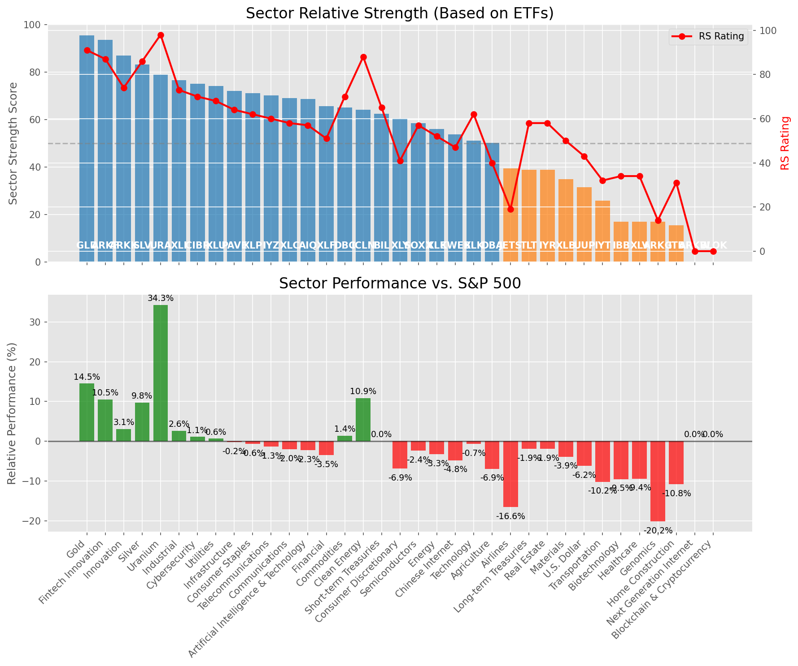

# **Daily Relative Strength Report**

**Date:** 2025-06-22

## **Market Valuation (Buffett Indicator)**

| Metric | Value |
|--------|-------|
| **Market Valuation** | **Overvalued** |
| **Current Ratio** | 9.79 |
| **Historical Mean** | 9.33 |
| **Standard Deviation** | 0.43 |
| **Z-Score (StdDev from Mean)** | 1.12 |
| **Total Market Cap** | $293.43 trillion |
| **GDP** | $29.98 trillion |

## **Market Insights**

### **Market is Overvalued**

The market appears to be trading above historical average valuations. While not at extreme levels, this suggests more modest future returns may be expected. Investors should:

- Focus on companies with reasonable valuations relative to their growth
- Be more selective with new positions
- Look for stocks showing relative strength within their sectors
- Consider trimming positions in extremely overvalued names

Historically, periods of mild overvaluation can persist for extended periods, but returns tend to be below average.

### **Buffett Indicator Overview**

The Buffett Indicator (Total Market Cap / GDP) is a measure of the stock market's valuation relative to the size of the economy. It is named after Warren Buffett, who described it as "probably the best single measure of where valuations stand at any given moment."

- **Values above +2 standard deviations:** Market significantly overvalued
- **Values above +1 standard deviation:** Market overvalued
- **Values between -1 and +1 standard deviations:** Market fairly valued
- **Values below -1 standard deviation:** Market undervalued
- **Values below -2 standard deviations:** Market significantly undervalued

---

## **Sector Relative Strength**

Based on William O'Neil's Relative Strength Methodology

| ETF | Strength | RS Rating | Performance | Above Key MAs | Trend | Sector |
|-----|----------|-----------|-------------|--------------|-------|--------|
| [GLD](https://www.tradingview.com/chart/?symbol=GLD) | 95.5 | 91.0 | 14.50% | 10d ✓, 50d ✓, 200d ✓ | ↗️ | Gold |
| [ARKF](https://www.tradingview.com/chart/?symbol=ARKF) | 93.5 | 87.0 | 10.54% | 10d ✓, 50d ✓, 200d ✓ | ↗️ | Fintech Innovation |
| [ARKK](https://www.tradingview.com/chart/?symbol=ARKK) | 87.0 | 74.0 | 3.07% | 10d ✓, 50d ✓, 200d ✓ | ↗️ | Innovation |
| [SLV](https://www.tradingview.com/chart/?symbol=SLV) | 83.1 | 86.0 | 9.76% | 10d ✗, 50d ✓, 200d ✓ | ↗️ | Silver |
| [URA](https://www.tradingview.com/chart/?symbol=URA) | 79.0 | 98.0 | 34.30% | 10d ✓, 50d ✓, 200d ✓ | ↘️ | Uranium |
| [XLI](https://www.tradingview.com/chart/?symbol=XLI) | 76.6 | 73.0 | 2.59% | 10d ✗, 50d ✓, 200d ✓ | ↗️ | Industrial |
| [CIBR](https://www.tradingview.com/chart/?symbol=CIBR) | 75.1 | 70.0 | 1.11% | 10d ✗, 50d ✓, 200d ✓ | ↗️ | Cybersecurity |
| [XLU](https://www.tradingview.com/chart/?symbol=XLU) | 74.1 | 68.0 | 0.65% | 10d ✗, 50d ✓, 200d ✓ | ↗️ | Utilities |
| [PAVE](https://www.tradingview.com/chart/?symbol=PAVE) | 72.1 | 64.0 | -0.21% | 10d ✗, 50d ✓, 200d ✓ | ↗️ | Infrastructure |
| [XLP](https://www.tradingview.com/chart/?symbol=XLP) | 71.1 | 62.0 | -0.65% | 10d ✗, 50d ✓, 200d ✓ | ↗️ | Consumer Staples |
| [IYZ](https://www.tradingview.com/chart/?symbol=IYZ) | 70.1 | 60.0 | -1.33% | 10d ✗, 50d ✓, 200d ✓ | ↗️ | Telecommunications |
| [XLC](https://www.tradingview.com/chart/?symbol=XLC) | 69.1 | 58.0 | -2.00% | 10d ✗, 50d ✓, 200d ✓ | ↗️ | Communications |
| [AIQ](https://www.tradingview.com/chart/?symbol=AIQ) | 68.6 | 57.0 | -2.28% | 10d ✗, 50d ✓, 200d ✓ | ↗️ | Artificial Intelligence & Technology |
| [XLF](https://www.tradingview.com/chart/?symbol=XLF) | 65.6 | 51.0 | -3.51% | 10d ✗, 50d ✓, 200d ✓ | ↗️ | Financial |
| [DBC](https://www.tradingview.com/chart/?symbol=DBC) | 65.0 | 70.0 | 1.35% | 10d ✓, 50d ✓, 200d ✓ | ↘️ | Commodities |
| [ICLN](https://www.tradingview.com/chart/?symbol=ICLN) | 64.1 | 88.0 | 10.89% | 10d ✗, 50d ✓, 200d ✓ | ↘️ | Clean Energy |
| [BIL](https://www.tradingview.com/chart/?symbol=BIL) | 62.5 | 65.0 | 0.03% | 10d ✓, 50d ✓, 200d ✓ | ↘️ | Short-term Treasuries |
| [XLY](https://www.tradingview.com/chart/?symbol=XLY) | 60.6 | 41.0 | -6.88% | 10d ✗, 50d ✓, 200d ✓ | ↗️ | Consumer Discretionary |
| [SOXX](https://www.tradingview.com/chart/?symbol=SOXX) | 58.5 | 57.0 | -2.35% | 10d ✓, 50d ✓, 200d ✓ | ↘️ | Semiconductors |
| [XLE](https://www.tradingview.com/chart/?symbol=XLE) | 56.0 | 52.0 | -3.30% | 10d ✓, 50d ✓, 200d ✓ | ↘️ | Energy |
| [KWEB](https://www.tradingview.com/chart/?symbol=KWEB) | 53.7 | 47.0 | -4.80% | 10d ✗, 50d ✗, 200d ✓ | ↗️ | Chinese Internet |
| [XLK](https://www.tradingview.com/chart/?symbol=XLK) | 51.1 | 62.0 | -0.68% | 10d ✗, 50d ✓, 200d ✓ | ↘️ | Technology |
| [DBA](https://www.tradingview.com/chart/?symbol=DBA) | 50.2 | 40.0 | -6.94% | 10d ✗, 50d ✗, 200d ✓ | ↗️ | Agriculture |
| [JETS](https://www.tradingview.com/chart/?symbol=JETS) | 39.4 | 19.0 | -16.59% | 10d ✗, 50d ✓, 200d ✗ | ↗️ | Airlines |
| [TLT](https://www.tradingview.com/chart/?symbol=TLT) | 38.9 | 58.0 | -1.95% | 10d ✓, 50d ✗, 200d ✗ | ↘️ | Long-term Treasuries |
| [IYR](https://www.tradingview.com/chart/?symbol=IYR) | 38.9 | 58.0 | -1.89% | 10d ✗, 50d ✓, 200d ✗ | ↘️ | Real Estate |
| [XLB](https://www.tradingview.com/chart/?symbol=XLB) | 34.9 | 50.0 | -3.89% | 10d ✗, 50d ✓, 200d ✗ | ↘️ | Materials |
| [UUP](https://www.tradingview.com/chart/?symbol=UUP) | 31.4 | 43.0 | -6.20% | 10d ✓, 50d ✗, 200d ✗ | ↘️ | U.S. Dollar |
| [IYT](https://www.tradingview.com/chart/?symbol=IYT) | 25.9 | 32.0 | -10.20% | 10d ✗, 50d ✓, 200d ✗ | ↘️ | Transportation |
| [IBB](https://www.tradingview.com/chart/?symbol=IBB) | 17.0 | 34.0 | -9.54% | 10d ✗, 50d ✗, 200d ✗ | ↘️ | Biotechnology |
| [XLV](https://www.tradingview.com/chart/?symbol=XLV) | 17.0 | 34.0 | -9.43% | 10d ✗, 50d ✗, 200d ✗ | ↘️ | Healthcare |
| [ARKG](https://www.tradingview.com/chart/?symbol=ARKG) | 16.9 | 14.0 | -20.16% | 10d ✗, 50d ✓, 200d ✗ | ↘️ | Genomics |
| [ITB](https://www.tradingview.com/chart/?symbol=ITB) | 15.5 | 31.0 | -10.83% | 10d ✗, 50d ✗, 200d ✗ | ↘️ | Home Construction |
| [ARKW](https://www.tradingview.com/chart/?symbol=ARKW) | 0.0 | 0.0 | 0.00% | 10d ✗, 50d ✗, 200d ✗ | ↘️ | Next Generation Internet |
| [BLOK](https://www.tradingview.com/chart/?symbol=BLOK) | 0.0 | 0.0 | 0.00% | 10d ✗, 50d ✗, 200d ✗ | ↘️ | Blockchain & Cryptocurrency |

### **Sector ETF Performance Interpretation**

This table shows the relative strength metrics for different market sectors based on their representative ETFs:

- **ETF**: The ETF used to measure sector performance (click for chart)
- **Strength**: Overall sector strength score (0-100) combining multiple factors
- **RS Rating**: O'Neil RS rating of the sector ETF
- **Performance**: Performance of the sector ETF relative to SPY
- **Above Key MAs**: Whether the ETF is trading above its 10, 50, and 200-day moving averages
- **Trend**: Whether the sector is in an uptrend (↗️) or downtrend (↘️)

### **Current Sector Leadership**

The current market leadership is coming from the following sectors: **Gold, Fintech Innovation, Innovation**.

The **Gold** sector (represented by **GLD**) is showing particularly strong relative strength with an RS rating of 91.0 and performance of 14.50% vs. the S&P 500. This sector is trading above its 10-day, 50-day, 200-day moving average(s). Investors should consider focusing on high RS stocks within these leading sectors for potential outperformance.

---

## **Buy Recommendations**

The following 69 stocks show exceptional relative strength:

| RS Rating | Buy Score | Current Price | Chart | Name | Ticker |
|-----------|-----------|---------------|-------|------|--------|
| 100 | 100 | $102.09 | [Chart](https://www.tradingview.com/chart/?symbol=RBLX) | Roblox Corporation | RBLX |
| 100 | 100 | $30.50 | [Chart](https://www.tradingview.com/chart/?symbol=CRK) | Comstock Resources, Inc. | CRK |
| 100 | 100 | $43.11 | [Chart](https://www.tradingview.com/chart/?symbol=KTOS) | Kratos Defense & Security Solutions, Inc. | KTOS |
| 100 | 100 | $190.04 | [Chart](https://www.tradingview.com/chart/?symbol=LEU) | Centrus Energy Corp. | LEU |
| 100 | 100 | $94.32 | [Chart](https://www.tradingview.com/chart/?symbol=VRNA) | Verona Pharma plc | VRNA |
| 100 | 100 | $37.74 | [Chart](https://www.tradingview.com/chart/?symbol=MP) | MP Materials Corp. | MP |
| 99 | 100 | $149.12 | [Chart](https://www.tradingview.com/chart/?symbol=COOP) | Mr. Cooper Group Inc. Common Stock | COOP |
| 99 | 100 | $24.70 | [Chart](https://www.tradingview.com/chart/?symbol=TFPM) | Triple Flag Precious Metals Corp. | TFPM |
| 98 | 100 | $78.50 | [Chart](https://www.tradingview.com/chart/?symbol=HOOD) | Robinhood Markets, Inc. Class A Common Stock | HOOD |
| 97 | 100 | $49.00 | [Chart](https://www.tradingview.com/chart/?symbol=BTI) | British American Tobacco p.l.c. American Depositary Shares, American Depositary Shares, each representing one Ordinary Share | BTI |
| 97 | 100 | $52.85 | [Chart](https://www.tradingview.com/chart/?symbol=BBW) | Build-A-Bear Workshop, Inc. | BBW |
| 97 | 100 | $163.40 | [Chart](https://www.tradingview.com/chart/?symbol=CAH) | Cardinal Health, Inc. | CAH |
| 97 | 100 | $486.96 | [Chart](https://www.tradingview.com/chart/?symbol=GEV) | GE Vernova Inc. | GEV |
| 97 | 100 | $35.87 | [Chart](https://www.tradingview.com/chart/?symbol=AHR) | American Healthcare REIT, Inc. | AHR |
| 96 | 100 | $173.34 | [Chart](https://www.tradingview.com/chart/?symbol=HWM) | Howmet Aerospace Inc. | HWM |
| 95 | 100 | $183.29 | [Chart](https://www.tradingview.com/chart/?symbol=PM) | Philip Morris International Inc. | PM |
| 95 | 100 | $253.72 | [Chart](https://www.tradingview.com/chart/?symbol=CRS) | Carpenter Technology Corp | CRS |
| 95 | 100 | $137.30 | [Chart](https://www.tradingview.com/chart/?symbol=PLTR) | Palantir Technologies Inc. Class A Common Stock | PLTR |
| 95 | 100 | $206.20 | [Chart](https://www.tradingview.com/chart/?symbol=JBL) | Jabil Inc. | JBL |
| 95 | 100 | $73.75 | [Chart](https://www.tradingview.com/chart/?symbol=WRB) | W.R. Berkley Corporation | WRB |
| 95 | 100 | $179.35 | [Chart](https://www.tradingview.com/chart/?symbol=RGLD) | Royal Gold Inc | RGLD |
| 94 | 100 | $293.66 | [Chart](https://www.tradingview.com/chart/?symbol=COR) | Cencora, Inc. | COR |
| 94 | 100 | $32.18 | [Chart](https://www.tradingview.com/chart/?symbol=PRDO) | Perdoceo Education Corporation | PRDO |
| 94 | 100 | $720.92 | [Chart](https://www.tradingview.com/chart/?symbol=MCK) | McKesson Corporation | MCK |
| 93 | 100 | $85.69 | [Chart](https://www.tradingview.com/chart/?symbol=NFG) | National Fuel Gas Co. | NFG |
| 93 | 100 | $180.44 | [Chart](https://www.tradingview.com/chart/?symbol=ITA) | iShares U.S. Aerospace & Defense ETF | ITA |
| 93 | 100 | $218.43 | [Chart](https://www.tradingview.com/chart/?symbol=BAP) | Credicorp LTD | BAP |
| 93 | 100 | $1231.41 | [Chart](https://www.tradingview.com/chart/?symbol=NFLX) | NetFlix Inc | NFLX |
| 93 | 100 | $146.64 | [Chart](https://www.tradingview.com/chart/?symbol=RTX) | RTX Corporation | RTX |
| 93 | 100 | $500.27 | [Chart](https://www.tradingview.com/chart/?symbol=CASY) | Casey's General Stores Inc | CASY |
| 93 | 100 | $125.08 | [Chart](https://www.tradingview.com/chart/?symbol=ATGE) | Adtalem Global Education Inc. Common Shares | ATGE |
| 92 | 100 | $73.72 | [Chart](https://www.tradingview.com/chart/?symbol=CTVA) | Corteva, Inc. Common Stock | CTVA |
| 92 | 100 | $288.66 | [Chart](https://www.tradingview.com/chart/?symbol=TLN) | Talen Energy Corporation Common Stock | TLN |
| 91 | 100 | $32.10 | [Chart](https://www.tradingview.com/chart/?symbol=SGOL) | abrdn Physical Gold Shares ETF | SGOL |
| 91 | 100 | $63.45 | [Chart](https://www.tradingview.com/chart/?symbol=IAU) | iShares Gold Trust | IAU |
| 91 | 100 | $33.57 | [Chart](https://www.tradingview.com/chart/?symbol=IAUM) | iShares Gold Trust Micro | IAUM |
| 91 | 100 | $225.78 | [Chart](https://www.tradingview.com/chart/?symbol=DRI) | Darden Restaurants, Inc. | DRI |
| 91 | 100 | $66.66 | [Chart](https://www.tradingview.com/chart/?symbol=GLDM) | SPDR Gold MiniShares | GLDM |
| 91 | 100 | $310.13 | [Chart](https://www.tradingview.com/chart/?symbol=GLD) | SPDR Gold Trust, SPDR Gold Shares | GLD |
| 91 | 100 | $32.44 | [Chart](https://www.tradingview.com/chart/?symbol=OUNZ) | VanEck Merk Gold ETF | OUNZ |
| 91 | 100 | $33.25 | [Chart](https://www.tradingview.com/chart/?symbol=AAAU) | Goldman Sachs Physical Gold ETF Shares | AAAU |
| 91 | 100 | $41.73 | [Chart](https://www.tradingview.com/chart/?symbol=BBIO) | BridgeBio Pharma, Inc. Common Stock | BBIO |
| 90 | 100 | $25.84 | [Chart](https://www.tradingview.com/chart/?symbol=PHYS) | Sprott Physical Gold Trust | PHYS |
| 90 | 100 | $319.89 | [Chart](https://www.tradingview.com/chart/?symbol=CVNA) | Carvana Co. | CVNA |
| 89 | 100 | $59.75 | [Chart](https://www.tradingview.com/chart/?symbol=MO) | Altria Group, Inc. | MO |
| 89 | 100 | $25.40 | [Chart](https://www.tradingview.com/chart/?symbol=SRAD) | Sportradar Group AG Class A Ordinary Shares | SRAD |
| 89 | 100 | $22.48 | [Chart](https://www.tradingview.com/chart/?symbol=LAUR) | Laureate Education, Inc. Common Stock | LAUR |
| 88 | 100 | $60.44 | [Chart](https://www.tradingview.com/chart/?symbol=EQT) | EQT CORP | EQT |
| 88 | 100 | $42.52 | [Chart](https://www.tradingview.com/chart/?symbol=VIRT) | Virtu Financial, Inc. Class A | VIRT |
| 88 | 100 | $238.37 | [Chart](https://www.tradingview.com/chart/?symbol=TTWO) | Take-Two Interactive Software Inc | TTWO |
| 86 | 100 | $71.97 | [Chart](https://www.tradingview.com/chart/?symbol=KR) | The Kroger Co. | KR |
| 88 | 99 | $179.30 | [Chart](https://www.tradingview.com/chart/?symbol=NET) | Cloudflare, Inc. Class A common stock, par value $0.001 per share | NET |
| 87 | 99 | $59.99 | [Chart](https://www.tradingview.com/chart/?symbol=CAKE) | Cheesecake Factory (The) | CAKE |
| 85 | 99 | $273.99 | [Chart](https://www.tradingview.com/chart/?symbol=CME) | CME Group Inc. | CME |
| 88 | 98 | $102.10 | [Chart](https://www.tradingview.com/chart/?symbol=CALM) | Cal-Maine Foods Inc | CALM |
| 86 | 98 | $18.39 | [Chart](https://www.tradingview.com/chart/?symbol=AM) | Antero Midstream Corporation Common Stock | AM |
| 87 | 97 | $47.63 | [Chart](https://www.tradingview.com/chart/?symbol=ARKF) | ARK Fintech Innovation ETF | ARKF |
| 85 | 94 | $89.21 | [Chart](https://www.tradingview.com/chart/?symbol=SCHW) | The Charles Schwab Corporation | SCHW |
| 83 | 94 | $139.34 | [Chart](https://www.tradingview.com/chart/?symbol=TW) | Tradeweb Markets Inc. Class A Common Stock | TW |
| 82 | 94 | $89.16 | [Chart](https://www.tradingview.com/chart/?symbol=L) | Loews Corporation | L |
| 84 | 93 | $43.78 | [Chart](https://www.tradingview.com/chart/?symbol=AR) | ANTERO RESOURCES CORPORATION | AR |
| 84 | 93 | $43.23 | [Chart](https://www.tradingview.com/chart/?symbol=RRC) | Range Resources Corp | RRC |
| 82 | 93 | $107.24 | [Chart](https://www.tradingview.com/chart/?symbol=PLNT) | Planet Fitness, Inc. | PLNT |
| 80 | 93 | $79.28 | [Chart](https://www.tradingview.com/chart/?symbol=UNM) | Unum Group | UNM |
| 80 | 93 | $280.97 | [Chart](https://www.tradingview.com/chart/?symbol=IBM) | International Business Machines Corporation | IBM |
| 82 | 92 | $206.57 | [Chart](https://www.tradingview.com/chart/?symbol=GPOR) | Gulfport Energy Corporation | GPOR |
| 82 | 92 | $34.86 | [Chart](https://www.tradingview.com/chart/?symbol=RPRX) | Royalty Pharma plc Class A Ordinary Shares | RPRX |
| 81 | 91 | $22.27 | [Chart](https://www.tradingview.com/chart/?symbol=BTSG) | BrightSpring Health Services, Inc. Common Stock | BTSG |
| 81 | 91 | $76.39 | [Chart](https://www.tradingview.com/chart/?symbol=USFD) | US Foods Holding Corp. | USFD |

---

## **Sell Recommendations**

The following 41 stocks show deteriorating relative strength:

| RS Rating | Sell Score | Current Price | Chart | Name | Ticker |
|-----------|------------|---------------|-------|------|--------|
| 1 | 100 | $14.30 | [Chart](https://www.tradingview.com/chart/?symbol=EWTX) | Edgewise Therapeutics, Inc. Common Stock | EWTX |
| 1 | 100 | $26.73 | [Chart](https://www.tradingview.com/chart/?symbol=HELE) | Helen Of Troy Ltd | HELE |
| 2 | 100 | $56.18 | [Chart](https://www.tradingview.com/chart/?symbol=LABU) | Direxion Daily S&P Biotech Bull 3X Shares | LABU |
| 4 | 100 | $30.35 | [Chart](https://www.tradingview.com/chart/?symbol=FUN) | Six Flags Entertainment Corporation | FUN |
| 5 | 100 | $19.73 | [Chart](https://www.tradingview.com/chart/?symbol=SPT) | Sprout Social, Inc Class A Common Stock | SPT |
| 5 | 100 | $18.52 | [Chart](https://www.tradingview.com/chart/?symbol=CSTL) | Castle Biosciences, Inc. Common Stock | CSTL |
| 5 | 100 | $56.66 | [Chart](https://www.tradingview.com/chart/?symbol=ALB) | Albemarle Corporation | ALB |
| 7 | 100 | $12.29 | [Chart](https://www.tradingview.com/chart/?symbol=ARCT) | Arcturus Therapeutics Holdings Inc. Common Stock | ARCT |
| 11 | 100 | $16.70 | [Chart](https://www.tradingview.com/chart/?symbol=NVDS) | Investment Managers Series Trust II Tradr 1.5X Short NVDA Daily ETF | NVDS |
| 17 | 100 | $44.76 | [Chart](https://www.tradingview.com/chart/?symbol=LINE) | Lineage, Inc. Common Stock | LINE |
| 3 | 99 | $13.89 | [Chart](https://www.tradingview.com/chart/?symbol=DQ) | Daqo New Energy Corp. American Depositary Shares (each representing 5 Ordinary Shares) | DQ |
| 12 | 98 | $59.79 | [Chart](https://www.tradingview.com/chart/?symbol=NKE) | Nike, Inc. | NKE |
| 15 | 98 | $15.77 | [Chart](https://www.tradingview.com/chart/?symbol=AMZY) | YieldMax AMZN Option Income Strategy ETF | AMZY |
| 14 | 97 | $75.66 | [Chart](https://www.tradingview.com/chart/?symbol=FND) | Floor & Decor Holdings, Inc. | FND |
| 11 | 95 | $42.35 | [Chart](https://www.tradingview.com/chart/?symbol=SW) | Smurfit Westrock plc | SW |
| 12 | 95 | $16.65 | [Chart](https://www.tradingview.com/chart/?symbol=SVOL) | Simplify Volatility Premium ETF | SVOL |
| 10 | 94 | $28.20 | [Chart](https://www.tradingview.com/chart/?symbol=APPN) | Appian Corporation Class A Common Stock | APPN |
| 12 | 94 | $20.98 | [Chart](https://www.tradingview.com/chart/?symbol=AMRK) | A-Mark Precious Metals, Inc. | AMRK |
| 25 | 92 | $46.61 | [Chart](https://www.tradingview.com/chart/?symbol=EDU) | New Oriental Education and Technology Group, Inc. American Depositary Shares (each representing ten (10) Common Shares) | EDU |
| 25 | 92 | $21.75 | [Chart](https://www.tradingview.com/chart/?symbol=SIRI) | Sirius XM Holdings,  Inc | SIRI |
| 11 | 90 | $31.56 | [Chart](https://www.tradingview.com/chart/?symbol=TECS) | Direxion Daily Technology Bear 3x Shares | TECS |
| 15 | 90 | $44.05 | [Chart](https://www.tradingview.com/chart/?symbol=PRKS) | United Parks & Resorts Inc. | PRKS |
| 17 | 90 | $30.16 | [Chart](https://www.tradingview.com/chart/?symbol=CRNX) | Crinetics Pharmaceuticals, Inc. | CRNX |
| 17 | 89 | $18.01 | [Chart](https://www.tradingview.com/chart/?symbol=HTGC) | Hercules Capital, Inc. | HTGC |
| 18 | 89 | $116.58 | [Chart](https://www.tradingview.com/chart/?symbol=SITE) | SiteOne Landscape Supply, Inc. | SITE |
| 12 | 88 | $127.74 | [Chart](https://www.tradingview.com/chart/?symbol=ICUI) | ICU Medical Inc | ICUI |
| 24 | 88 | $17.21 | [Chart](https://www.tradingview.com/chart/?symbol=ZTO) | ZTO Express (Cayman) Inc. American Depositary Shares, each representing one Class A ordinary share | ZTO |
| 29 | 85 | $20.47 | [Chart](https://www.tradingview.com/chart/?symbol=BITI) | ProShares Short Bitcoin ETF | BITI |
| 26 | 83 | $10.14 | [Chart](https://www.tradingview.com/chart/?symbol=LBTYK) | Liberty Global Ltd. Class C Common Shares | LBTYK |
| 27 | 82 | $36.24 | [Chart](https://www.tradingview.com/chart/?symbol=LIT) | Global X Lithium & Battery Tech ETF | LIT |
| 36 | 77 | $10.20 | [Chart](https://www.tradingview.com/chart/?symbol=NMZ) | Nuveen Municipal High Income Opportunity Fund | NMZ |
| 27 | 76 | $16.19 | [Chart](https://www.tradingview.com/chart/?symbol=PFS) | Provident Financial Services, Inc. | PFS |
| 31 | 73 | $14.15 | [Chart](https://www.tradingview.com/chart/?symbol=BMEZ) | BlackRock Health Sciences Term Trust | BMEZ |
| 38 | 73 | $11.73 | [Chart](https://www.tradingview.com/chart/?symbol=NVG) | Nuveen AMT-Free Municipal Credit Income Fund | NVG |
| 37 | 72 | $16.34 | [Chart](https://www.tradingview.com/chart/?symbol=STAA) | Staar Surgical Co | STAA |
| 32 | 70 | $26.18 | [Chart](https://www.tradingview.com/chart/?symbol=WY) | Weyerhaeuser Company | WY |
| 36 | 66 | $20.14 | [Chart](https://www.tradingview.com/chart/?symbol=PEY) | Invesco High Yield Equity Dividend Achievers ETF | PEY |
| 37 | 66 | $14.61 | [Chart](https://www.tradingview.com/chart/?symbol=GBDC) | Golub Capital BDC, Inc. | GBDC |
| 39 | 66 | $26.35 | [Chart](https://www.tradingview.com/chart/?symbol=TBBB) | BBB Foods Inc. | TBBB |
| 38 | 65 | $15.07 | [Chart](https://www.tradingview.com/chart/?symbol=PAXS) | PIMCO Access Income Fund | PAXS |
| 38 | 65 | $19.34 | [Chart](https://www.tradingview.com/chart/?symbol=MSDL) | Morgan Stanley Direct Lending Fund | MSDL |

## **Methodology**

This report uses William O'Neil's relative strength methodology from Investors Business Daily:

* **RS Rating**: Percentile rank of stock's performance vs. S&P 500 over the past 63 trading days (1-99 scale)
* **Buy Criteria**: RS Rating >= 80, price above 50-day MA, strong uptrend, increasing volume
* **Sell Criteria**: RS Rating < 40, price below 50-day MA, downtrend, decreasing volume

### **O'Neil's Key Principles**

1. **Focus on relative performance** - stocks outperforming the market
2. **Price trend confirmation** - stock must be in an uptrend
3. **Volume confirmation** - strong volume supports price moves
4. **Moving average validation** - price above key moving averages
5. **Market leaders only** - concentrate on top-performing stocks

*Report generated automatically after market close*