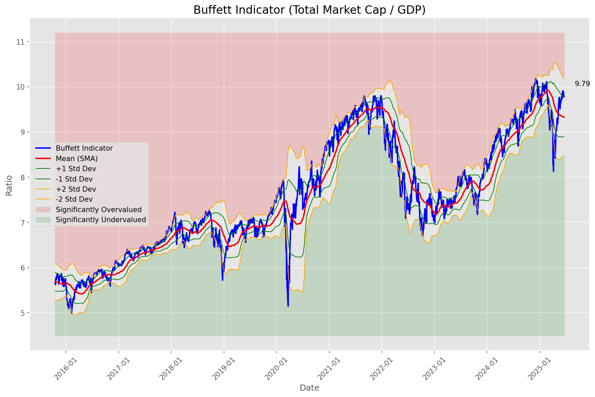
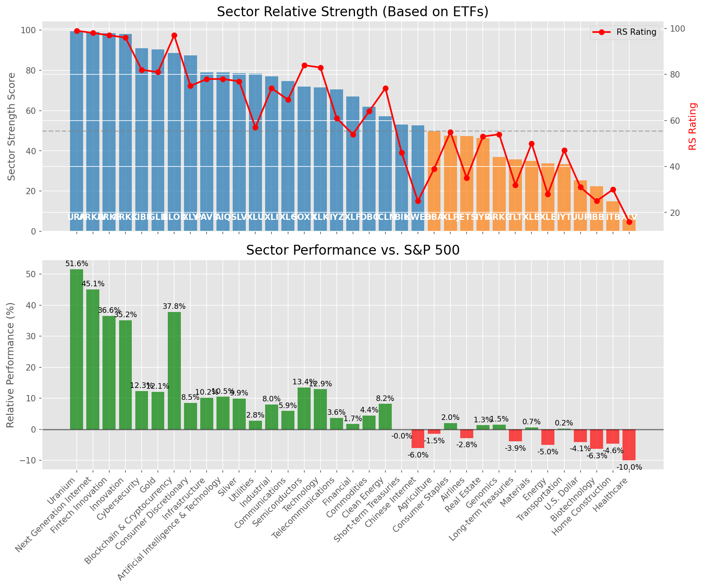

# **Daily Relative Strength Report**

**Date:** 2025-06-23

## **Market Valuation (Buffett Indicator)**

| Metric | Value |
|--------|-------|
| **Market Valuation** | **Overvalued** |
| **Current Ratio** | 9.81 |
| **Historical Mean** | 9.33 |
| **Standard Deviation** | 0.43 |
| **Z-Score (StdDev from Mean)** | 1.07 |
| **Total Market Cap** | $293.94 trillion |
| **GDP** | $29.98 trillion |

## **Market Insights**

### **Market is Overvalued**

The market appears to be trading above historical average valuations. While not at extreme levels, this suggests more modest future returns may be expected. Investors should:

- Focus on companies with reasonable valuations relative to their growth
- Be more selective with new positions
- Look for stocks showing relative strength within their sectors
- Consider trimming positions in extremely overvalued names

Historically, periods of mild overvaluation can persist for extended periods, but returns tend to be below average.

### **Buffett Indicator Overview**

The Buffett Indicator (Total Market Cap / GDP) is a measure of the stock market's valuation relative to the size of the economy. It is named after Warren Buffett, who described it as "probably the best single measure of where valuations stand at any given moment."

- **Values above +2 standard deviations:** Market significantly overvalued
- **Values above +1 standard deviation:** Market overvalued
- **Values between -1 and +1 standard deviations:** Market fairly valued
- **Values below -1 standard deviation:** Market undervalued
- **Values below -2 standard deviations:** Market significantly undervalued

---

## **Sector Relative Strength**

Based on William O'Neil's Relative Strength Methodology

| ETF | Strength | RS Rating | Performance | Above Key MAs | Trend | Sector |
|-----|----------|-----------|-------------|--------------|-------|--------|
| [URA](https://www.tradingview.com/chart/?symbol=URA) | 99.5 | 99.0 | 49.16% | 10d ✓, 50d ✓, 200d ✓ | ↗️ | Uranium |
| [ARKW](https://www.tradingview.com/chart/?symbol=ARKW) | 99.0 | 98.0 | 43.30% | 10d ✓, 50d ✓, 200d ✓ | ↗️ | Next Generation Internet |
| [ARKF](https://www.tradingview.com/chart/?symbol=ARKF) | 98.5 | 97.0 | 35.06% | 10d ✓, 50d ✓, 200d ✓ | ↗️ | Fintech Innovation |
| [ARKK](https://www.tradingview.com/chart/?symbol=ARKK) | 98.0 | 96.0 | 33.26% | 10d ✓, 50d ✓, 200d ✓ | ↗️ | Innovation |
| [GLD](https://www.tradingview.com/chart/?symbol=GLD) | 90.5 | 81.0 | 12.07% | 10d ✓, 50d ✓, 200d ✓ | ↗️ | Gold |
| [CIBR](https://www.tradingview.com/chart/?symbol=CIBR) | 90.5 | 81.0 | 12.08% | 10d ✓, 50d ✓, 200d ✓ | ↗️ | Cybersecurity |
| [BLOK](https://www.tradingview.com/chart/?symbol=BLOK) | 88.1 | 96.0 | 32.33% | 10d ✗, 50d ✓, 200d ✓ | ↗️ | Blockchain & Cryptocurrency |
| [XLY](https://www.tradingview.com/chart/?symbol=XLY) | 87.0 | 74.0 | 8.11% | 10d ✓, 50d ✓, 200d ✓ | ↗️ | Consumer Discretionary |
| [AIQ](https://www.tradingview.com/chart/?symbol=AIQ) | 79.1 | 78.0 | 10.00% | 10d ✗, 50d ✓, 200d ✓ | ↗️ | Artificial Intelligence & Technology |
| [SLV](https://www.tradingview.com/chart/?symbol=SLV) | 78.6 | 77.0 | 9.78% | 10d ✗, 50d ✓, 200d ✓ | ↗️ | Silver |
| [PAVE](https://www.tradingview.com/chart/?symbol=PAVE) | 78.6 | 77.0 | 9.76% | 10d ✗, 50d ✓, 200d ✓ | ↗️ | Infrastructure |
| [XLI](https://www.tradingview.com/chart/?symbol=XLI) | 76.6 | 73.0 | 7.50% | 10d ✗, 50d ✓, 200d ✓ | ↗️ | Industrial |
| [XLC](https://www.tradingview.com/chart/?symbol=XLC) | 73.6 | 67.0 | 5.31% | 10d ✗, 50d ✓, 200d ✓ | ↗️ | Communications |
| [IYZ](https://www.tradingview.com/chart/?symbol=IYZ) | 71.6 | 63.0 | 3.93% | 10d ✗, 50d ✓, 200d ✓ | ↗️ | Telecommunications |
| [XLU](https://www.tradingview.com/chart/?symbol=XLU) | 69.1 | 58.0 | 2.53% | 10d ✗, 50d ✓, 200d ✓ | ↗️ | Utilities |
| [XLF](https://www.tradingview.com/chart/?symbol=XLF) | 67.1 | 54.0 | 1.36% | 10d ✗, 50d ✓, 200d ✓ | ↗️ | Financial |
| [DBC](https://www.tradingview.com/chart/?symbol=DBC) | 63.0 | 66.0 | 4.91% | 10d ✓, 50d ✓, 200d ✓ | ↘️ | Commodities |
| [SOXX](https://www.tradingview.com/chart/?symbol=SOXX) | 61.6 | 83.0 | 12.95% | 10d ✗, 50d ✓, 200d ✓ | ↘️ | Semiconductors |
| [XLK](https://www.tradingview.com/chart/?symbol=XLK) | 61.6 | 83.0 | 12.63% | 10d ✗, 50d ✓, 200d ✓ | ↘️ | Technology |
| [ICLN](https://www.tradingview.com/chart/?symbol=ICLN) | 57.1 | 74.0 | 7.72% | 10d ✗, 50d ✓, 200d ✓ | ↘️ | Clean Energy |
| [BIL](https://www.tradingview.com/chart/?symbol=BIL) | 53.0 | 46.0 | -0.01% | 10d ✓, 50d ✓, 200d ✓ | ↘️ | Short-term Treasuries |
| [KWEB](https://www.tradingview.com/chart/?symbol=KWEB) | 52.6 | 25.0 | -6.34% | 10d ✗, 50d ✓, 200d ✓ | ↗️ | Chinese Internet |
| [DBA](https://www.tradingview.com/chart/?symbol=DBA) | 50.2 | 40.0 | -1.39% | 10d ✗, 50d ✗, 200d ✓ | ↗️ | Agriculture |
| [XLP](https://www.tradingview.com/chart/?symbol=XLP) | 47.5 | 55.0 | 1.58% | 10d ✗, 50d ✗, 200d ✗ | ↗️ | Consumer Staples |
| [IYR](https://www.tradingview.com/chart/?symbol=IYR) | 45.3 | 51.0 | 0.68% | 10d ✓, 50d ✓, 200d ✗ | ↘️ | Real Estate |
| [XLE](https://www.tradingview.com/chart/?symbol=XLE) | 45.0 | 30.0 | -4.73% | 10d ✓, 50d ✓, 200d ✓ | ↘️ | Energy |
| [JETS](https://www.tradingview.com/chart/?symbol=JETS) | 37.5 | 35.0 | -3.09% | 10d ✗, 50d ✗, 200d ✗ | ↗️ | Airlines |
| [TLT](https://www.tradingview.com/chart/?symbol=TLT) | 36.3 | 33.0 | -3.71% | 10d ✓, 50d ✓, 200d ✗ | ↘️ | Long-term Treasuries |
| [XLB](https://www.tradingview.com/chart/?symbol=XLB) | 33.9 | 48.0 | 0.19% | 10d ✗, 50d ✓, 200d ✗ | ↘️ | Materials |
| [ARKG](https://www.tradingview.com/chart/?symbol=ARKG) | 33.9 | 48.0 | 0.26% | 10d ✗, 50d ✓, 200d ✗ | ↘️ | Genomics |
| [IYT](https://www.tradingview.com/chart/?symbol=IYT) | 31.9 | 44.0 | -0.22% | 10d ✗, 50d ✓, 200d ✗ | ↘️ | Transportation |
| [UUP](https://www.tradingview.com/chart/?symbol=UUP) | 25.9 | 32.0 | -3.98% | 10d ✓, 50d ✗, 200d ✗ | ↘️ | U.S. Dollar |
| [IBB](https://www.tradingview.com/chart/?symbol=IBB) | 21.9 | 24.0 | -6.71% | 10d ✗, 50d ✓, 200d ✗ | ↘️ | Biotechnology |
| [ITB](https://www.tradingview.com/chart/?symbol=ITB) | 15.0 | 30.0 | -4.62% | 10d ✗, 50d ✗, 200d ✗ | ↘️ | Home Construction |
| [XLV](https://www.tradingview.com/chart/?symbol=XLV) | 8.0 | 16.0 | -10.27% | 10d ✗, 50d ✗, 200d ✗ | ↘️ | Healthcare |

### **Sector ETF Performance Interpretation**

This table shows the relative strength metrics for different market sectors based on their representative ETFs:

- **ETF**: The ETF used to measure sector performance (click for chart)
- **Strength**: Overall sector strength score (0-100) combining multiple factors
- **RS Rating**: O'Neil RS rating of the sector ETF
- **Performance**: Performance of the sector ETF relative to SPY
- **Above Key MAs**: Whether the ETF is trading above its 10, 50, and 200-day moving averages
- **Trend**: Whether the sector is in an uptrend (↗️) or downtrend (↘️)

### **Current Sector Leadership**

The current market leadership is coming from the following sectors: **Uranium, Next Generation Internet, Fintech Innovation**.

The **Uranium** sector (represented by **URA**) is showing particularly strong relative strength with an RS rating of 99.0 and performance of 49.16% vs. the S&P 500. This sector is trading above its 10-day, 50-day, 200-day moving average(s). Investors should consider focusing on high RS stocks within these leading sectors for potential outperformance.

---

## **Buy Recommendations**

The following 95 stocks show exceptional relative strength:

| RS Rating | Buy Score | Current Price | Chart | Name | Ticker |
|-----------|-----------|---------------|-------|------|--------|
| 100 | 100 | $76.61 | [Chart](https://www.tradingview.com/chart/?symbol=HOOD) | Robinhood Markets, Inc. Class A Common Stock | HOOD |
| 100 | 100 | $72.47 | [Chart](https://www.tradingview.com/chart/?symbol=ODD) | ODDITY Tech Ltd. Class A Ordinary Shares | ODD |
| 100 | 100 | $144.98 | [Chart](https://www.tradingview.com/chart/?symbol=SEZL) | Sezzle Inc. Common Stock | SEZL |
| 100 | 100 | $189.62 | [Chart](https://www.tradingview.com/chart/?symbol=LEU) | Centrus Energy Corp. | LEU |
| 100 | 100 | $103.56 | [Chart](https://www.tradingview.com/chart/?symbol=RBLX) | Roblox Corporation | RBLX |
| 99 | 100 | $30.48 | [Chart](https://www.tradingview.com/chart/?symbol=CRK) | Comstock Resources, Inc. | CRK |
| 99 | 100 | $43.76 | [Chart](https://www.tradingview.com/chart/?symbol=FARO) | Faro Technologies Inc | FARO |
| 99 | 100 | $139.10 | [Chart](https://www.tradingview.com/chart/?symbol=PLTR) | Palantir Technologies Inc. Class A Common Stock | PLTR |
| 99 | 100 | $180.15 | [Chart](https://www.tradingview.com/chart/?symbol=NET) | Cloudflare, Inc. Class A common stock, par value $0.001 per share | NET |
| 98 | 100 | $52.85 | [Chart](https://www.tradingview.com/chart/?symbol=BBW) | Build-A-Bear Workshop, Inc. | BBW |
| 98 | 100 | $206.50 | [Chart](https://www.tradingview.com/chart/?symbol=JBL) | Jabil Inc. | JBL |
| 98 | 100 | $96.08 | [Chart](https://www.tradingview.com/chart/?symbol=VRNA) | Verona Pharma plc | VRNA |
| 98 | 100 | $147.56 | [Chart](https://www.tradingview.com/chart/?symbol=COOP) | Mr. Cooper Group Inc. Common Stock | COOP |
| 98 | 100 | $485.96 | [Chart](https://www.tradingview.com/chart/?symbol=GEV) | GE Vernova Inc. | GEV |
| 98 | 100 | $44.63 | [Chart](https://www.tradingview.com/chart/?symbol=KTOS) | Kratos Defense & Security Solutions, Inc. | KTOS |
| 97 | 100 | $133.88 | [Chart](https://www.tradingview.com/chart/?symbol=CLS) | Celestica, Inc. | CLS |
| 97 | 100 | $21.48 | [Chart](https://www.tradingview.com/chart/?symbol=MAG) | MAG Silver Corp. | MAG |
| 97 | 100 | $48.83 | [Chart](https://www.tradingview.com/chart/?symbol=AU) | AngloGold Ashanti plc | AU |
| 97 | 100 | $256.75 | [Chart](https://www.tradingview.com/chart/?symbol=CRS) | Carpenter Technology Corp | CRS |
| 97 | 100 | $48.08 | [Chart](https://www.tradingview.com/chart/?symbol=ARKF) | ARK Fintech Innovation ETF | ARKF |
| 97 | 100 | $36.32 | [Chart](https://www.tradingview.com/chart/?symbol=MP) | MP Materials Corp. | MP |
| 97 | 100 | $779.43 | [Chart](https://www.tradingview.com/chart/?symbol=AXON) | Axon Enterprise, Inc. Common Stock | AXON |
| 97 | 100 | $44.87 | [Chart](https://www.tradingview.com/chart/?symbol=DRS) | Leonardo DRS, Inc. Common Stock | DRS |
| 96 | 100 | $32.89 | [Chart](https://www.tradingview.com/chart/?symbol=PRDO) | Perdoceo Education Corporation | PRDO |
| 96 | 100 | $174.04 | [Chart](https://www.tradingview.com/chart/?symbol=HWM) | Howmet Aerospace Inc. | HWM |
| 96 | 100 | $484.83 | [Chart](https://www.tradingview.com/chart/?symbol=CRWD) | CrowdStrike Holdings, Inc. Class A Common Stock | CRWD |
| 96 | 100 | $70.98 | [Chart](https://www.tradingview.com/chart/?symbol=ULS) | UL Solutions Inc. | ULS |
| 96 | 100 | $288.74 | [Chart](https://www.tradingview.com/chart/?symbol=TLN) | Talen Energy Corporation Common Stock | TLN |
| 95 | 100 | $127.92 | [Chart](https://www.tradingview.com/chart/?symbol=ATGE) | Adtalem Global Education Inc. Common Shares | ATGE |
| 95 | 100 | $1240.20 | [Chart](https://www.tradingview.com/chart/?symbol=NFLX) | NetFlix Inc | NFLX |
| 95 | 100 | $25.09 | [Chart](https://www.tradingview.com/chart/?symbol=TFPM) | Triple Flag Precious Metals Corp. | TFPM |
| 94 | 100 | $500.27 | [Chart](https://www.tradingview.com/chart/?symbol=CASY) | Casey's General Stores Inc | CASY |
| 94 | 100 | $238.91 | [Chart](https://www.tradingview.com/chart/?symbol=WWD) | Woodward, Inc. | WWD |
| 94 | 100 | $33.98 | [Chart](https://www.tradingview.com/chart/?symbol=UTI) | Universal Technical Institute, Inc. | UTI |
| 94 | 100 | $26.22 | [Chart](https://www.tradingview.com/chart/?symbol=OR) | OR Royalties Inc. | OR |
| 94 | 100 | $58.63 | [Chart](https://www.tradingview.com/chart/?symbol=SHLD) | Global X Defense Tech ETF | SHLD |
| 93 | 100 | $72.50 | [Chart](https://www.tradingview.com/chart/?symbol=CORT) | Corcept Therapeutics Inc. | CORT |
| 93 | 100 | $163.53 | [Chart](https://www.tradingview.com/chart/?symbol=CAH) | Cardinal Health, Inc. | CAH |
| 93 | 100 | $22.35 | [Chart](https://www.tradingview.com/chart/?symbol=BTSG) | BrightSpring Health Services, Inc. Common Stock | BTSG |
| 93 | 100 | $36.45 | [Chart](https://www.tradingview.com/chart/?symbol=AHR) | American Healthcare REIT, Inc. | AHR |
| 92 | 100 | $184.22 | [Chart](https://www.tradingview.com/chart/?symbol=PM) | Philip Morris International Inc. | PM |
| 92 | 100 | $148.68 | [Chart](https://www.tradingview.com/chart/?symbol=LRN) | Stride, Inc. | LRN |
| 92 | 100 | $91.19 | [Chart](https://www.tradingview.com/chart/?symbol=WPM) | Wheaton Precious Metals Corp. Common Stock | WPM |
| 91 | 100 | $36.43 | [Chart](https://www.tradingview.com/chart/?symbol=UGL) | ProShares Ultra Gold | UGL |
| 91 | 100 | $58.63 | [Chart](https://www.tradingview.com/chart/?symbol=CAKE) | Cheesecake Factory (The) | CAKE |
| 91 | 100 | $103.61 | [Chart](https://www.tradingview.com/chart/?symbol=FWONK) | Liberty Media Corporation Series C Liberty Formula One Common Stock | FWONK |
| 91 | 100 | $728.59 | [Chart](https://www.tradingview.com/chart/?symbol=SPOT) | Spotify Technology S.A. | SPOT |
| 91 | 100 | $149.15 | [Chart](https://www.tradingview.com/chart/?symbol=LYV) | Live Nation Entertainment Inc. | LYV |
| 90 | 100 | $44.27 | [Chart](https://www.tradingview.com/chart/?symbol=EXEL) | Exelixis Inc | EXEL |
| 90 | 100 | $23.06 | [Chart](https://www.tradingview.com/chart/?symbol=LAUR) | Laureate Education, Inc. Common Stock | LAUR |
| 90 | 100 | $48.67 | [Chart](https://www.tradingview.com/chart/?symbol=BTI) | British American Tobacco p.l.c. American Depositary Shares, American Depositary Shares, each representing one Ordinary Share | BTI |
| 90 | 100 | $41.79 | [Chart](https://www.tradingview.com/chart/?symbol=BBIO) | BridgeBio Pharma, Inc. Common Stock | BBIO |
| 90 | 100 | $170.25 | [Chart](https://www.tradingview.com/chart/?symbol=SFM) | Sprouts Farmers Market, Inc. | SFM |
| 90 | 100 | $74.24 | [Chart](https://www.tradingview.com/chart/?symbol=CTVA) | Corteva, Inc. Common Stock | CTVA |
| 89 | 100 | $227.19 | [Chart](https://www.tradingview.com/chart/?symbol=DASH) | DoorDash, Inc. Class A Common Stock | DASH |
| 89 | 100 | $79.82 | [Chart](https://www.tradingview.com/chart/?symbol=LLYVK) | Liberty Media Corporation Series C Liberty Live Common Stock | LLYVK |
| 89 | 100 | $243.06 | [Chart](https://www.tradingview.com/chart/?symbol=GE) | GE Aerospace | GE |
| 89 | 100 | $123.44 | [Chart](https://www.tradingview.com/chart/?symbol=AEM) | Agnico Eagle Mines Ltd. | AEM |
| 88 | 100 | $285.29 | [Chart](https://www.tradingview.com/chart/?symbol=IBM) | International Business Machines Corporation | IBM |
| 87 | 100 | $73.07 | [Chart](https://www.tradingview.com/chart/?symbol=WRB) | W.R. Berkley Corporation | WRB |
| 87 | 100 | $173.34 | [Chart](https://www.tradingview.com/chart/?symbol=TKO) | TKO Group Holdings, Inc. | TKO |
| 86 | 100 | $25.61 | [Chart](https://www.tradingview.com/chart/?symbol=SRAD) | Sportradar Group AG Class A Ordinary Shares | SRAD |
| 88 | 99 | $181.99 | [Chart](https://www.tradingview.com/chart/?symbol=ITA) | iShares U.S. Aerospace & Defense ETF | ITA |
| 88 | 99 | $184.58 | [Chart](https://www.tradingview.com/chart/?symbol=RGLD) | Royal Gold Inc | RGLD |
| 87 | 99 | $52.62 | [Chart](https://www.tradingview.com/chart/?symbol=MRCY) | Mercury Systems Inc. | MRCY |
| 86 | 99 | $282.10 | [Chart](https://www.tradingview.com/chart/?symbol=VRSN) | VeriSign Inc | VRSN |
| 86 | 98 | $307.55 | [Chart](https://www.tradingview.com/chart/?symbol=PODD) | Insulet Corporation | PODD |
| 86 | 98 | $84.06 | [Chart](https://www.tradingview.com/chart/?symbol=TPR) | Tapestry, Inc. Common Stock | TPR |
| 85 | 98 | $60.22 | [Chart](https://www.tradingview.com/chart/?symbol=EQT) | EQT CORP | EQT |
| 83 | 97 | $240.80 | [Chart](https://www.tradingview.com/chart/?symbol=TTWO) | Take-Two Interactive Software Inc | TTWO |
| 86 | 96 | $89.85 | [Chart](https://www.tradingview.com/chart/?symbol=SANM) | Sanmina  Corp | SANM |
| 85 | 96 | $218.43 | [Chart](https://www.tradingview.com/chart/?symbol=BAP) | Credicorp LTD | BAP |
| 85 | 95 | $86.38 | [Chart](https://www.tradingview.com/chart/?symbol=NDAQ) | Nasdaq, Inc. Common Stock | NDAQ |
| 85 | 95 | $107.50 | [Chart](https://www.tradingview.com/chart/?symbol=SPMO) | Invesco S&P 500 Momentum ETF | SPMO |
| 85 | 95 | $58.47 | [Chart](https://www.tradingview.com/chart/?symbol=EPR) | EPR Properties | EPR |
| 82 | 95 | $63.88 | [Chart](https://www.tradingview.com/chart/?symbol=IAU) | iShares Gold Trust | IAU |
| 82 | 95 | $32.31 | [Chart](https://www.tradingview.com/chart/?symbol=SGOL) | abrdn Physical Gold Shares ETF | SGOL |
| 82 | 95 | $67.08 | [Chart](https://www.tradingview.com/chart/?symbol=GLDM) | SPDR Gold MiniShares | GLDM |
| 82 | 95 | $33.47 | [Chart](https://www.tradingview.com/chart/?symbol=AAAU) | Goldman Sachs Physical Gold ETF Shares | AAAU |
| 82 | 95 | $73.44 | [Chart](https://www.tradingview.com/chart/?symbol=KR) | The Kroger Co. | KR |
| 84 | 94 | $171.32 | [Chart](https://www.tradingview.com/chart/?symbol=NTRA) | Natera, Inc. Common Stock | NTRA |
| 82 | 94 | $33.79 | [Chart](https://www.tradingview.com/chart/?symbol=IAUM) | iShares Gold Trust Micro | IAUM |
| 81 | 94 | $41.89 | [Chart](https://www.tradingview.com/chart/?symbol=VIRT) | Virtu Financial, Inc. Class A | VIRT |
| 81 | 94 | $312.10 | [Chart](https://www.tradingview.com/chart/?symbol=GLD) | SPDR Gold Trust, SPDR Gold Shares | GLD |
| 84 | 93 | $197.85 | [Chart](https://www.tradingview.com/chart/?symbol=COF) | Capital One Financial | COF |
| 84 | 93 | $29.11 | [Chart](https://www.tradingview.com/chart/?symbol=PAAS) | Pan American Silver Corp. | PAAS |
| 83 | 93 | $47.04 | [Chart](https://www.tradingview.com/chart/?symbol=INOD) | Innodata Inc. | INOD |
| 81 | 93 | $72.83 | [Chart](https://www.tradingview.com/chart/?symbol=CIBR) | First Trust Exchange-Traded Fund II First Trust NASDAQ Cybersecurity ETF | CIBR |
| 81 | 93 | $96.30 | [Chart](https://www.tradingview.com/chart/?symbol=WMT) | Walmart Inc. | WMT |
| 80 | 93 | $26.01 | [Chart](https://www.tradingview.com/chart/?symbol=PHYS) | Sprott Physical Gold Trust | PHYS |
| 80 | 93 | $30.59 | [Chart](https://www.tradingview.com/chart/?symbol=CEF) | Sprott Physical Gold and Silver Trust | CEF |
| 80 | 92 | $188.59 | [Chart](https://www.tradingview.com/chart/?symbol=LOPE) | Grand Canyon Education, Inc | LOPE |
| 80 | 92 | $66.84 | [Chart](https://www.tradingview.com/chart/?symbol=CSCO) | Cisco Systems, Inc. Common Stock (DE) | CSCO |
| 80 | 90 | $84.08 | [Chart](https://www.tradingview.com/chart/?symbol=SEIC) | SEI Investments Co | SEIC |
| 80 | 90 | $206.57 | [Chart](https://www.tradingview.com/chart/?symbol=GPOR) | Gulfport Energy Corporation | GPOR |

---

## **Sell Recommendations**

The following 99 stocks show deteriorating relative strength:

| RS Rating | Sell Score | Current Price | Chart | Name | Ticker |
|-----------|------------|---------------|-------|------|--------|
| 1 | 100 | $13.44 | [Chart](https://www.tradingview.com/chart/?symbol=RXST) | RxSight, Inc. Common Stock | RXST |
| 1 | 100 | $14.07 | [Chart](https://www.tradingview.com/chart/?symbol=EWTX) | Edgewise Therapeutics, Inc. Common Stock | EWTX |
| 1 | 100 | $26.22 | [Chart](https://www.tradingview.com/chart/?symbol=HELE) | Helen Of Troy Ltd | HELE |
| 1 | 100 | $31.20 | [Chart](https://www.tradingview.com/chart/?symbol=TECS) | Direxion Daily Technology Bear 3x Shares | TECS |
| 1 | 100 | $14.93 | [Chart](https://www.tradingview.com/chart/?symbol=ZVZZT) | SUPER Montage TEST SYMBOL | ZVZZT |
| 2 | 100 | $11.72 | [Chart](https://www.tradingview.com/chart/?symbol=NRIX) | Nurix Therapeutics, Inc. Common stock | NRIX |
| 2 | 100 | $16.74 | [Chart](https://www.tradingview.com/chart/?symbol=NVDS) | Investment Managers Series Trust II Tradr 1.5X Short NVDA Daily ETF | NVDS |
| 2 | 100 | $23.50 | [Chart](https://www.tradingview.com/chart/?symbol=CRTO) | Criteo S.A. | CRTO |
| 3 | 100 | $13.87 | [Chart](https://www.tradingview.com/chart/?symbol=DQ) | Daqo New Energy Corp. American Depositary Shares (each representing 5 Ordinary Shares) | DQ |
| 3 | 100 | $20.98 | [Chart](https://www.tradingview.com/chart/?symbol=AMRK) | A-Mark Precious Metals, Inc. | AMRK |
| 3 | 100 | $13.26 | [Chart](https://www.tradingview.com/chart/?symbol=INMD) | InMode Ltd. Ordinary Shares | INMD |
| 3 | 100 | $56.79 | [Chart](https://www.tradingview.com/chart/?symbol=ALB) | Albemarle Corporation | ALB |
| 4 | 100 | $27.88 | [Chart](https://www.tradingview.com/chart/?symbol=QID) | ProShares UltraShort QQQ | QID |
| 4 | 100 | $31.40 | [Chart](https://www.tradingview.com/chart/?symbol=ZD) | Ziff Davis, Inc. Common Stock | ZD |
| 5 | 100 | $24.00 | [Chart](https://www.tradingview.com/chart/?symbol=ASTH) | Astrana Health Inc. Common Stock | ASTH |
| 5 | 100 | $44.98 | [Chart](https://www.tradingview.com/chart/?symbol=LINE) | Lineage, Inc. Common Stock | LINE |
| 6 | 100 | $29.84 | [Chart](https://www.tradingview.com/chart/?symbol=FUN) | Six Flags Entertainment Corporation | FUN |
| 6 | 100 | $19.84 | [Chart](https://www.tradingview.com/chart/?symbol=SPT) | Sprout Social, Inc Class A Common Stock | SPT |
| 6 | 100 | $10.64 | [Chart](https://www.tradingview.com/chart/?symbol=M) | Macy's Inc. | M |
| 6 | 100 | $16.69 | [Chart](https://www.tradingview.com/chart/?symbol=AMTB) | Amerant Bancorp Inc. | AMTB |
| 7 | 100 | $20.95 | [Chart](https://www.tradingview.com/chart/?symbol=BITI) | ProShares Short Bitcoin ETF | BITI |
| 7 | 100 | $78.89 | [Chart](https://www.tradingview.com/chart/?symbol=LNTH) | Lantheus Holdings, Inc | LNTH |
| 9 | 100 | $20.29 | [Chart](https://www.tradingview.com/chart/?symbol=KIDS) | OrthoPediatrics Corp. Common Stock | KIDS |
| 10 | 100 | $10.05 | [Chart](https://www.tradingview.com/chart/?symbol=LBTYK) | Liberty Global Ltd. Class C Common Shares | LBTYK |
| 11 | 100 | $17.21 | [Chart](https://www.tradingview.com/chart/?symbol=ZTO) | ZTO Express (Cayman) Inc. American Depositary Shares, each representing one Class A ordinary share | ZTO |
| 13 | 100 | $73.56 | [Chart](https://www.tradingview.com/chart/?symbol=FND) | Floor & Decor Holdings, Inc. | FND |
| 13 | 100 | $30.19 | [Chart](https://www.tradingview.com/chart/?symbol=CRNX) | Crinetics Pharmaceuticals, Inc. | CRNX |
| 15 | 100 | $83.72 | [Chart](https://www.tradingview.com/chart/?symbol=BIDU) | Baidu, Inc. | BIDU |
| 6 | 99 | $50.09 | [Chart](https://www.tradingview.com/chart/?symbol=FBIN) | Fortune Brands Innovations, Inc. | FBIN |
| 9 | 99 | $10.29 | [Chart](https://www.tradingview.com/chart/?symbol=ABR) | Arbor Realty Trust, Inc. | ABR |
| 11 | 99 | $31.39 | [Chart](https://www.tradingview.com/chart/?symbol=MBIN) | Merchants Bancorp Common Stock | MBIN |
| 2 | 98 | $11.26 | [Chart](https://www.tradingview.com/chart/?symbol=VFC) | V.F. Corporation | VFC |
| 4 | 98 | $27.41 | [Chart](https://www.tradingview.com/chart/?symbol=DOCN) | DigitalOcean Holdings, Inc. | DOCN |
| 15 | 98 | $29.51 | [Chart](https://www.tradingview.com/chart/?symbol=BAX) | Baxter International Inc. | BAX |
| 4 | 97 | $32.41 | [Chart](https://www.tradingview.com/chart/?symbol=SQM) | Sociedad Quimica y Minera de Chile SA | SQM |
| 7 | 97 | $13.19 | [Chart](https://www.tradingview.com/chart/?symbol=TZA) | Direxion Daily Small Cap Bear 3x Shares | TZA |
| 10 | 97 | $24.41 | [Chart](https://www.tradingview.com/chart/?symbol=VKTX) | Viking Therapeutics, Inc | VKTX |
| 11 | 97 | $13.50 | [Chart](https://www.tradingview.com/chart/?symbol=OCSL) | Oaktree Specialty Lending Corporation | OCSL |
| 12 | 97 | $24.52 | [Chart](https://www.tradingview.com/chart/?symbol=AMPH) | Amphastar Pharmaceuticals, Inc. | AMPH |
| 14 | 97 | $16.66 | [Chart](https://www.tradingview.com/chart/?symbol=SVOL) | Simplify Volatility Premium ETF | SVOL |
| 4 | 96 | $10.07 | [Chart](https://www.tradingview.com/chart/?symbol=SONO) | Sonos, Inc. Common Stock | SONO |
| 8 | 96 | $26.59 | [Chart](https://www.tradingview.com/chart/?symbol=WMG) | Warner Music Group Corp. Class A Common Stock | WMG |
| 9 | 96 | $12.32 | [Chart](https://www.tradingview.com/chart/?symbol=PMT) | PennyMac Mortgage Investment Trust | PMT |
| 10 | 96 | $25.91 | [Chart](https://www.tradingview.com/chart/?symbol=ZSL) | ProShares UltraShort Silver | ZSL |
| 12 | 96 | $50.84 | [Chart](https://www.tradingview.com/chart/?symbol=AMWD) | American Woodmark Corp | AMWD |
| 16 | 96 | $47.53 | [Chart](https://www.tradingview.com/chart/?symbol=SDOW) | ProShares UltraPro Short Dow 30 | SDOW |
| 13 | 95 | $25.02 | [Chart](https://www.tradingview.com/chart/?symbol=ATHM) | Autohome Inc. American Depositary Shares, each representing four Class A Ordinary Shares | ATHM |
| 14 | 95 | $30.77 | [Chart](https://www.tradingview.com/chart/?symbol=WGO) | Winnebago Industries, Inc. | WGO |
| 15 | 95 | $19.49 | [Chart](https://www.tradingview.com/chart/?symbol=FOR) | Forestar Group Inc. | FOR |
| 10 | 93 | $17.68 | [Chart](https://www.tradingview.com/chart/?symbol=IRT) | Independence Realty Trust Inc. | IRT |
| 15 | 93 | $43.83 | [Chart](https://www.tradingview.com/chart/?symbol=PRKS) | United Parks & Resorts Inc. | PRKS |
| 9 | 92 | $47.84 | [Chart](https://www.tradingview.com/chart/?symbol=SNY) | Sanofi American Depositary Shares (Each representing one-half of one ordinary share) | SNY |
| 15 | 92 | $26.34 | [Chart](https://www.tradingview.com/chart/?symbol=WSC) | WillScot Holdings Corporation Class A Common Stock | WSC |
| 12 | 91 | $10.91 | [Chart](https://www.tradingview.com/chart/?symbol=LSPD) | Lightspeed Commerce Inc. | LSPD |
| 15 | 91 | $65.17 | [Chart](https://www.tradingview.com/chart/?symbol=BBY) | Best Buy Company, Inc. | BBY |
| 17 | 91 | $27.85 | [Chart](https://www.tradingview.com/chart/?symbol=APPN) | Appian Corporation Class A Common Stock | APPN |
| 20 | 91 | $36.60 | [Chart](https://www.tradingview.com/chart/?symbol=LIT) | Global X Lithium & Battery Tech ETF | LIT |
| 22 | 91 | $43.14 | [Chart](https://www.tradingview.com/chart/?symbol=SON) | Sonoco Products Company | SON |
| 11 | 90 | $127.74 | [Chart](https://www.tradingview.com/chart/?symbol=ICUI) | ICU Medical Inc | ICUI |
| 22 | 89 | $16.37 | [Chart](https://www.tradingview.com/chart/?symbol=STAA) | Staar Surgical Co | STAA |
| 25 | 89 | $10.27 | [Chart](https://www.tradingview.com/chart/?symbol=NMZ) | Nuveen Municipal High Income Opportunity Fund | NMZ |
| 21 | 88 | $17.66 | [Chart](https://www.tradingview.com/chart/?symbol=JPMpM) | JPMorgan Chase & Co. Depositary Shares, each representing a 1/400th interest in a share of 4.20% Non-Cumulative Preferred Stock, Series MM | JPMpM |
| 21 | 87 | $15.28 | [Chart](https://www.tradingview.com/chart/?symbol=HQH) | abrdn Healthcare Investors | HQH |
| 14 | 86 | $16.54 | [Chart](https://www.tradingview.com/chart/?symbol=NBBK) | NB Bancorp, Inc. Common Stock | NBBK |
| 17 | 86 | $22.36 | [Chart](https://www.tradingview.com/chart/?symbol=COLB) | Columbia Banking Systems Inc | COLB |
| 28 | 86 | $11.77 | [Chart](https://www.tradingview.com/chart/?symbol=NVG) | Nuveen AMT-Free Municipal Credit Income Fund | NVG |
| 23 | 85 | $12.73 | [Chart](https://www.tradingview.com/chart/?symbol=UTZ) | Utz Brands, Inc. | UTZ |
| 24 | 85 | $136.81 | [Chart](https://www.tradingview.com/chart/?symbol=LSTR) | Landstar System Inc | LSTR |
| 25 | 85 | $36.00 | [Chart](https://www.tradingview.com/chart/?symbol=STBA) | S&T Bancorp Inc | STBA |
| 20 | 84 | $200.07 | [Chart](https://www.tradingview.com/chart/?symbol=AAPL) | Apple Inc. | AAPL |
| 26 | 84 | $12.84 | [Chart](https://www.tradingview.com/chart/?symbol=MRTN) | Marten Transport Ltd | MRTN |
| 19 | 83 | $43.12 | [Chart](https://www.tradingview.com/chart/?symbol=FBK) | FB Financial Corporation | FBK |
| 20 | 83 | $76.09 | [Chart](https://www.tradingview.com/chart/?symbol=PFG) | Principal Financial Group, Inc. | PFG |
| 23 | 83 | $28.69 | [Chart](https://www.tradingview.com/chart/?symbol=RNA) | Avidity Biosciences, Inc. Common Stock | RNA |
| 25 | 83 | $41.48 | [Chart](https://www.tradingview.com/chart/?symbol=SW) | Smurfit Westrock plc | SW |
| 29 | 83 | $15.68 | [Chart](https://www.tradingview.com/chart/?symbol=BBN) | BlackRock Taxable Municipal Bond Trust | BBN |
| 20 | 82 | $43.46 | [Chart](https://www.tradingview.com/chart/?symbol=ABM) | ABM Industries, Inc. | ABM |
| 20 | 82 | $18.99 | [Chart](https://www.tradingview.com/chart/?symbol=MSDL) | Morgan Stanley Direct Lending Fund | MSDL |
| 30 | 82 | $10.38 | [Chart](https://www.tradingview.com/chart/?symbol=MYI) | BLACKROCK MUNIYIELD QUALITY FUND III, INC. | MYI |
| 32 | 82 | $11.79 | [Chart](https://www.tradingview.com/chart/?symbol=NZF) | Nuveen Municipal Credit Income Fund | NZF |
| 23 | 81 | $92.89 | [Chart](https://www.tradingview.com/chart/?symbol=CHRW) | C.H. Robinson Worldwide, Inc. | CHRW |
| 25 | 81 | $14.15 | [Chart](https://www.tradingview.com/chart/?symbol=BMEZ) | BlackRock Health Sciences Term Trust | BMEZ |
| 20 | 80 | $73.42 | [Chart](https://www.tradingview.com/chart/?symbol=MKC) | McCormick & Company, Incorporated Non-VTG CS | MKC |
| 22 | 79 | $20.05 | [Chart](https://www.tradingview.com/chart/?symbol=PEY) | Invesco High Yield Equity Dividend Achievers ETF | PEY |
| 30 | 79 | $16.19 | [Chart](https://www.tradingview.com/chart/?symbol=PFS) | Provident Financial Services, Inc. | PFS |
| 27 | 78 | $14.29 | [Chart](https://www.tradingview.com/chart/?symbol=GBDC) | Golub Capital BDC, Inc. | GBDC |
| 28 | 78 | $13.67 | [Chart](https://www.tradingview.com/chart/?symbol=DNLI) | Denali Therapeutics Inc. Common Stock | DNLI |
| 34 | 78 | $118.05 | [Chart](https://www.tradingview.com/chart/?symbol=SITE) | SiteOne Landscape Supply, Inc. | SITE |
| 25 | 77 | $14.60 | [Chart](https://www.tradingview.com/chart/?symbol=HBNC) | Horizon Bancorp, Inc. Common Stock | HBNC |
| 28 | 77 | $54.06 | [Chart](https://www.tradingview.com/chart/?symbol=CBU) | Community Financial System, Inc. | CBU |
| 32 | 76 | $11.20 | [Chart](https://www.tradingview.com/chart/?symbol=NAD) | Nuveen Quality Municipal Income Fund | NAD |
| 33 | 75 | $13.30 | [Chart](https://www.tradingview.com/chart/?symbol=PDO) | PIMCO Dynamic Income Opportunities Fund | PDO |
| 33 | 74 | $12.66 | [Chart](https://www.tradingview.com/chart/?symbol=ARDT) | Ardent Health, Inc. | ARDT |
| 29 | 73 | $28.59 | [Chart](https://www.tradingview.com/chart/?symbol=HMC) | Honda Motor Co., Ltd. American Depositary Share, each representing three (3) shares of Common Stock | HMC |
| 31 | 73 | $240.68 | [Chart](https://www.tradingview.com/chart/?symbol=ITW) | Illinois Tool Works Inc. | ITW |
| 31 | 73 | $11.26 | [Chart](https://www.tradingview.com/chart/?symbol=NFBK) | Northfield Bancorp, Inc. | NFBK |
| 32 | 73 | $24.95 | [Chart](https://www.tradingview.com/chart/?symbol=DRV) | Direxion Daily Real Estate Bear 3X Shares | DRV |
| 28 | 72 | $292.92 | [Chart](https://www.tradingview.com/chart/?symbol=MOH) | Molina Healthcare, Inc. | MOH |
| 35 | 72 | $48.52 | [Chart](https://www.tradingview.com/chart/?symbol=KNG) | FT Vest S&P 500 Dividend Aristocrats Target Income ETF | KNG |

## **Methodology**

This report uses William O'Neil's relative strength methodology from Investors Business Daily:

* **RS Rating**: Percentile rank of stock's performance vs. S&P 500 over the past 63 trading days (1-99 scale)
* **Buy Criteria**: RS Rating >= 80, price above 50-day MA, strong uptrend, increasing volume
* **Sell Criteria**: RS Rating < 40, price below 50-day MA, downtrend, decreasing volume

### **O'Neil's Key Principles**

1. **Focus on relative performance** - stocks outperforming the market
2. **Price trend confirmation** - stock must be in an uptrend
3. **Volume confirmation** - strong volume supports price moves
4. **Moving average validation** - price above key moving averages
5. **Market leaders only** - concentrate on top-performing stocks

*Report generated automatically after market close*