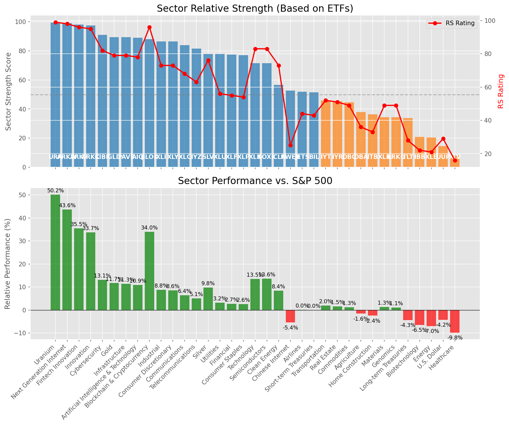

# **Daily Relative Strength Report**

**Date:** 2025-06-23

## **Market Valuation (Buffett Indicator)**

| Metric | Value |
|--------|-------|
| **Market Valuation** | **Overvalued** |
| **Current Ratio** | 9.86 |
| **Historical Mean** | 9.33 |
| **Standard Deviation** | 0.43 |
| **Z-Score (StdDev from Mean)** | 1.07 |
| **Total Market Cap** | $295.70 trillion |
| **GDP** | $29.98 trillion |

## **Market Insights**

### **Market is Overvalued**

The market appears to be trading above historical average valuations. While not at extreme levels, this suggests more modest future returns may be expected. Investors should:

- Focus on companies with reasonable valuations relative to their growth
- Be more selective with new positions
- Look for stocks showing relative strength within their sectors
- Consider trimming positions in extremely overvalued names

Historically, periods of mild overvaluation can persist for extended periods, but returns tend to be below average.

### **Buffett Indicator Overview**

The Buffett Indicator (Total Market Cap / GDP) is a measure of the stock market's valuation relative to the size of the economy. It is named after Warren Buffett, who described it as "probably the best single measure of where valuations stand at any given moment."

- **Values above +2 standard deviations:** Market significantly overvalued
- **Values above +1 standard deviation:** Market overvalued
- **Values between -1 and +1 standard deviations:** Market fairly valued
- **Values below -1 standard deviation:** Market undervalued
- **Values below -2 standard deviations:** Market significantly undervalued

---

## **Sector Relative Strength**

Based on William O'Neil's Relative Strength Methodology

| ETF | Strength | RS Rating | Performance | Above Key MAs | Trend | Sector |
|-----|----------|-----------|-------------|--------------|-------|--------|
| [URA](https://www.tradingview.com/chart/?symbol=URA) | 99.5 | 99.0 | 50.07% | 10d ✓, 50d ✓, 200d ✓ | ↗️ | Uranium |
| [ARKW](https://www.tradingview.com/chart/?symbol=ARKW) | 99.0 | 98.0 | 43.56% | 10d ✓, 50d ✓, 200d ✓ | ↗️ | Next Generation Internet |
| [ARKF](https://www.tradingview.com/chart/?symbol=ARKF) | 98.0 | 96.0 | 35.39% | 10d ✓, 50d ✓, 200d ✓ | ↗️ | Fintech Innovation |
| [ARKK](https://www.tradingview.com/chart/?symbol=ARKK) | 97.5 | 95.0 | 33.46% | 10d ✓, 50d ✓, 200d ✓ | ↗️ | Innovation |
| [CIBR](https://www.tradingview.com/chart/?symbol=CIBR) | 91.0 | 82.0 | 12.91% | 10d ✓, 50d ✓, 200d ✓ | ↗️ | Cybersecurity |
| [GLD](https://www.tradingview.com/chart/?symbol=GLD) | 90.0 | 80.0 | 11.83% | 10d ✓, 50d ✓, 200d ✓ | ↗️ | Gold |
| [PAVE](https://www.tradingview.com/chart/?symbol=PAVE) | 89.5 | 79.0 | 11.02% | 10d ✓, 50d ✓, 200d ✓ | ↗️ | Infrastructure |
| [BLOK](https://www.tradingview.com/chart/?symbol=BLOK) | 88.1 | 96.0 | 34.13% | 10d ✗, 50d ✓, 200d ✓ | ↗️ | Blockchain & Cryptocurrency |
| [XLY](https://www.tradingview.com/chart/?symbol=XLY) | 87.0 | 74.0 | 8.65% | 10d ✓, 50d ✓, 200d ✓ | ↗️ | Consumer Discretionary |
| [IYZ](https://www.tradingview.com/chart/?symbol=IYZ) | 82.0 | 64.0 | 4.88% | 10d ✓, 50d ✓, 200d ✓ | ↗️ | Telecommunications |
| [AIQ](https://www.tradingview.com/chart/?symbol=AIQ) | 79.1 | 78.0 | 10.68% | 10d ✗, 50d ✓, 200d ✓ | ↗️ | Artificial Intelligence & Technology |
| [SLV](https://www.tradingview.com/chart/?symbol=SLV) | 78.6 | 77.0 | 9.96% | 10d ✗, 50d ✓, 200d ✓ | ↗️ | Silver |
| [XLU](https://www.tradingview.com/chart/?symbol=XLU) | 78.0 | 56.0 | 2.94% | 10d ✓, 50d ✓, 200d ✓ | ↗️ | Utilities |
| [XLF](https://www.tradingview.com/chart/?symbol=XLF) | 77.5 | 55.0 | 2.38% | 10d ✓, 50d ✓, 200d ✓ | ↗️ | Financial |
| [XLI](https://www.tradingview.com/chart/?symbol=XLI) | 76.6 | 73.0 | 8.39% | 10d ✗, 50d ✓, 200d ✓ | ↗️ | Industrial |
| [XLC](https://www.tradingview.com/chart/?symbol=XLC) | 74.1 | 68.0 | 6.11% | 10d ✗, 50d ✓, 200d ✓ | ↗️ | Communications |
| [SOXX](https://www.tradingview.com/chart/?symbol=SOXX) | 71.5 | 83.0 | 13.50% | 10d ✓, 50d ✓, 200d ✓ | ↘️ | Semiconductors |
| [XLK](https://www.tradingview.com/chart/?symbol=XLK) | 71.5 | 83.0 | 13.32% | 10d ✓, 50d ✓, 200d ✓ | ↘️ | Technology |
| [XLP](https://www.tradingview.com/chart/?symbol=XLP) | 57.2 | 54.0 | 2.38% | 10d ✗, 50d ✗, 200d ✓ | ↗️ | Consumer Staples |
| [ICLN](https://www.tradingview.com/chart/?symbol=ICLN) | 56.6 | 73.0 | 8.13% | 10d ✗, 50d ✓, 200d ✓ | ↘️ | Clean Energy |
| [DBC](https://www.tradingview.com/chart/?symbol=DBC) | 56.0 | 52.0 | 1.81% | 10d ✓, 50d ✓, 200d ✓ | ↘️ | Commodities |
| [KWEB](https://www.tradingview.com/chart/?symbol=KWEB) | 53.1 | 26.0 | -5.42% | 10d ✗, 50d ✓, 200d ✓ | ↗️ | Chinese Internet |
| [BIL](https://www.tradingview.com/chart/?symbol=BIL) | 52.0 | 44.0 | -0.00% | 10d ✓, 50d ✓, 200d ✓ | ↘️ | Short-term Treasuries |
| [JETS](https://www.tradingview.com/chart/?symbol=JETS) | 51.9 | 44.0 | 0.00% | 10d ✗, 50d ✓, 200d ✗ | ↗️ | Airlines |
| [IYT](https://www.tradingview.com/chart/?symbol=IYT) | 45.8 | 52.0 | 1.58% | 10d ✓, 50d ✓, 200d ✗ | ↘️ | Transportation |
| [IYR](https://www.tradingview.com/chart/?symbol=IYR) | 44.8 | 50.0 | 1.29% | 10d ✓, 50d ✓, 200d ✗ | ↘️ | Real Estate |
| [DBA](https://www.tradingview.com/chart/?symbol=DBA) | 38.5 | 37.0 | -1.51% | 10d ✗, 50d ✗, 200d ✗ | ↗️ | Agriculture |
| [ITB](https://www.tradingview.com/chart/?symbol=ITB) | 36.8 | 34.0 | -2.67% | 10d ✓, 50d ✓, 200d ✗ | ↘️ | Home Construction |
| [ARKG](https://www.tradingview.com/chart/?symbol=ARKG) | 34.9 | 50.0 | 1.16% | 10d ✗, 50d ✓, 200d ✗ | ↘️ | Genomics |
| [TLT](https://www.tradingview.com/chart/?symbol=TLT) | 34.8 | 30.0 | -4.17% | 10d ✓, 50d ✓, 200d ✗ | ↘️ | Long-term Treasuries |
| [XLB](https://www.tradingview.com/chart/?symbol=XLB) | 34.4 | 49.0 | 1.05% | 10d ✗, 50d ✓, 200d ✗ | ↘️ | Materials |
| [IBB](https://www.tradingview.com/chart/?symbol=IBB) | 21.4 | 23.0 | -6.48% | 10d ✗, 50d ✓, 200d ✗ | ↘️ | Biotechnology |
| [XLE](https://www.tradingview.com/chart/?symbol=XLE) | 20.4 | 21.0 | -7.10% | 10d ✗, 50d ✓, 200d ✗ | ↘️ | Energy |
| [UUP](https://www.tradingview.com/chart/?symbol=UUP) | 14.5 | 29.0 | -4.30% | 10d ✗, 50d ✗, 200d ✗ | ↘️ | U.S. Dollar |
| [XLV](https://www.tradingview.com/chart/?symbol=XLV) | 8.0 | 16.0 | -10.05% | 10d ✗, 50d ✗, 200d ✗ | ↘️ | Healthcare |

### **Sector ETF Performance Interpretation**

This table shows the relative strength metrics for different market sectors based on their representative ETFs:

- **ETF**: The ETF used to measure sector performance (click for chart)
- **Strength**: Overall sector strength score (0-100) combining multiple factors
- **RS Rating**: O'Neil RS rating of the sector ETF
- **Performance**: Performance of the sector ETF relative to SPY
- **Above Key MAs**: Whether the ETF is trading above its 10, 50, and 200-day moving averages
- **Trend**: Whether the sector is in an uptrend (↗️) or downtrend (↘️)

### **Current Sector Leadership**

The current market leadership is coming from the following sectors: **Uranium, Next Generation Internet, Fintech Innovation**.

The **Uranium** sector (represented by **URA**) is showing particularly strong relative strength with an RS rating of 99.0 and performance of 50.07% vs. the S&P 500. This sector is trading above its 10-day, 50-day, 200-day moving average(s). Investors should consider focusing on high RS stocks within these leading sectors for potential outperformance.

---

## **Buy Recommendations**

The following 108 stocks show exceptional relative strength:

| RS Rating | Buy Score | Current Price | Chart | Name | Ticker |
|-----------|-----------|---------------|-------|------|--------|
| 100 | 100 | $193.61 | [Chart](https://www.tradingview.com/chart/?symbol=LEU) | Centrus Energy Corp. | LEU |
| 100 | 100 | $74.23 | [Chart](https://www.tradingview.com/chart/?symbol=ODD) | ODDITY Tech Ltd. Class A Ordinary Shares | ODD |
| 100 | 100 | $320.52 | [Chart](https://www.tradingview.com/chart/?symbol=CVNA) | Carvana Co. | CVNA |
| 100 | 100 | $145.21 | [Chart](https://www.tradingview.com/chart/?symbol=SEZL) | Sezzle Inc. Common Stock | SEZL |
| 100 | 100 | $76.61 | [Chart](https://www.tradingview.com/chart/?symbol=HOOD) | Robinhood Markets, Inc. Class A Common Stock | HOOD |
| 100 | 100 | $102.86 | [Chart](https://www.tradingview.com/chart/?symbol=RBLX) | Roblox Corporation | RBLX |
| 99 | 100 | $80.57 | [Chart](https://www.tradingview.com/chart/?symbol=SLNO) | Soleno Therapeutics, Inc. Common Stock | SLNO |
| 99 | 100 | $183.83 | [Chart](https://www.tradingview.com/chart/?symbol=NET) | Cloudflare, Inc. Class A common stock, par value $0.001 per share | NET |
| 99 | 100 | $139.45 | [Chart](https://www.tradingview.com/chart/?symbol=PLTR) | Palantir Technologies Inc. Class A Common Stock | PLTR |
| 99 | 100 | $152.41 | [Chart](https://www.tradingview.com/chart/?symbol=NRG) | NRG Energy, Inc. | NRG |
| 98 | 100 | $151.71 | [Chart](https://www.tradingview.com/chart/?symbol=COOP) | Mr. Cooper Group Inc. Common Stock | COOP |
| 98 | 100 | $261.09 | [Chart](https://www.tradingview.com/chart/?symbol=CRS) | Carpenter Technology Corp | CRS |
| 98 | 100 | $207.62 | [Chart](https://www.tradingview.com/chart/?symbol=JBL) | Jabil Inc. | JBL |
| 98 | 100 | $29.52 | [Chart](https://www.tradingview.com/chart/?symbol=CRK) | Comstock Resources, Inc. | CRK |
| 98 | 100 | $96.52 | [Chart](https://www.tradingview.com/chart/?symbol=VRNA) | Verona Pharma plc | VRNA |
| 98 | 100 | $149.30 | [Chart](https://www.tradingview.com/chart/?symbol=IRTC) | iRhythm Technologies, Inc | IRTC |
| 98 | 100 | $495.32 | [Chart](https://www.tradingview.com/chart/?symbol=GEV) | GE Vernova Inc. | GEV |
| 98 | 100 | $43.74 | [Chart](https://www.tradingview.com/chart/?symbol=FARO) | Faro Technologies Inc | FARO |
| 97 | 100 | $48.42 | [Chart](https://www.tradingview.com/chart/?symbol=AU) | AngloGold Ashanti plc | AU |
| 97 | 100 | $43.14 | [Chart](https://www.tradingview.com/chart/?symbol=KTOS) | Kratos Defense & Security Solutions, Inc. | KTOS |
| 97 | 100 | $52.92 | [Chart](https://www.tradingview.com/chart/?symbol=BBW) | Build-A-Bear Workshop, Inc. | BBW |
| 97 | 100 | $44.74 | [Chart](https://www.tradingview.com/chart/?symbol=DRS) | Leonardo DRS, Inc. Common Stock | DRS |
| 97 | 100 | $36.31 | [Chart](https://www.tradingview.com/chart/?symbol=MP) | MP Materials Corp. | MP |
| 97 | 100 | $779.58 | [Chart](https://www.tradingview.com/chart/?symbol=AXON) | Axon Enterprise, Inc. Common Stock | AXON |
| 97 | 100 | $135.41 | [Chart](https://www.tradingview.com/chart/?symbol=CLS) | Celestica, Inc. | CLS |
| 96 | 100 | $174.66 | [Chart](https://www.tradingview.com/chart/?symbol=HWM) | Howmet Aerospace Inc. | HWM |
| 96 | 100 | $48.20 | [Chart](https://www.tradingview.com/chart/?symbol=ARKF) | ARK Fintech Innovation ETF | ARKF |
| 96 | 100 | $32.95 | [Chart](https://www.tradingview.com/chart/?symbol=PRDO) | Perdoceo Education Corporation | PRDO |
| 96 | 100 | $488.30 | [Chart](https://www.tradingview.com/chart/?symbol=CRWD) | CrowdStrike Holdings, Inc. Class A Common Stock | CRWD |
| 96 | 100 | $290.25 | [Chart](https://www.tradingview.com/chart/?symbol=TLN) | Talen Energy Corporation Common Stock | TLN |
| 95 | 100 | $241.12 | [Chart](https://www.tradingview.com/chart/?symbol=WWD) | Woodward, Inc. | WWD |
| 95 | 100 | $25.02 | [Chart](https://www.tradingview.com/chart/?symbol=TFPM) | Triple Flag Precious Metals Corp. | TFPM |
| 95 | 100 | $20.14 | [Chart](https://www.tradingview.com/chart/?symbol=MIR) | Mirion Technologies, Inc. | MIR |
| 95 | 100 | $34.63 | [Chart](https://www.tradingview.com/chart/?symbol=UTI) | Universal Technical Institute, Inc. | UTI |
| 95 | 100 | $89.68 | [Chart](https://www.tradingview.com/chart/?symbol=RBRK) | Rubrik, Inc. | RBRK |
| 95 | 100 | $1249.72 | [Chart](https://www.tradingview.com/chart/?symbol=NFLX) | NetFlix Inc | NFLX |
| 95 | 100 | $71.39 | [Chart](https://www.tradingview.com/chart/?symbol=ULS) | UL Solutions Inc. | ULS |
| 94 | 100 | $127.78 | [Chart](https://www.tradingview.com/chart/?symbol=ATGE) | Adtalem Global Education Inc. Common Shares | ATGE |
| 94 | 100 | $509.82 | [Chart](https://www.tradingview.com/chart/?symbol=CASY) | Casey's General Stores Inc | CASY |
| 94 | 100 | $272.81 | [Chart](https://www.tradingview.com/chart/?symbol=RCL) | Royal Caribbean Group | RCL |
| 94 | 100 | $37.02 | [Chart](https://www.tradingview.com/chart/?symbol=AS) | Amer Sports, Inc. | AS |
| 93 | 100 | $58.50 | [Chart](https://www.tradingview.com/chart/?symbol=SHLD) | Global X Defense Tech ETF | SHLD |
| 93 | 100 | $19.50 | [Chart](https://www.tradingview.com/chart/?symbol=SPNT) | SiriusPoint Ltd. | SPNT |
| 93 | 100 | $73.54 | [Chart](https://www.tradingview.com/chart/?symbol=CORT) | Corcept Therapeutics Inc. | CORT |
| 93 | 100 | $22.60 | [Chart](https://www.tradingview.com/chart/?symbol=BTSG) | BrightSpring Health Services, Inc. Common Stock | BTSG |
| 93 | 100 | $27.09 | [Chart](https://www.tradingview.com/chart/?symbol=UVE) | UNIVERSAL INSURANCE HLDG, INC. | UVE |
| 93 | 100 | $36.72 | [Chart](https://www.tradingview.com/chart/?symbol=AHR) | American Healthcare REIT, Inc. | AHR |
| 93 | 100 | $164.07 | [Chart](https://www.tradingview.com/chart/?symbol=CAH) | Cardinal Health, Inc. | CAH |
| 92 | 100 | $159.16 | [Chart](https://www.tradingview.com/chart/?symbol=PLMR) | Palomar Holdings, Inc. Common stock | PLMR |
| 92 | 100 | $120.12 | [Chart](https://www.tradingview.com/chart/?symbol=EHC) | Encompass Health Corporation Common Stock | EHC |
| 92 | 100 | $151.24 | [Chart](https://www.tradingview.com/chart/?symbol=LYV) | Live Nation Entertainment Inc. | LYV |
| 92 | 100 | $60.07 | [Chart](https://www.tradingview.com/chart/?symbol=CAKE) | Cheesecake Factory (The) | CAKE |
| 92 | 100 | $178.28 | [Chart](https://www.tradingview.com/chart/?symbol=EAT) | Brinker International, Inc. | EAT |
| 91 | 100 | $729.50 | [Chart](https://www.tradingview.com/chart/?symbol=SPOT) | Spotify Technology S.A. | SPOT |
| 91 | 100 | $184.45 | [Chart](https://www.tradingview.com/chart/?symbol=PM) | Philip Morris International Inc. | PM |
| 91 | 100 | $104.20 | [Chart](https://www.tradingview.com/chart/?symbol=FWONK) | Liberty Media Corporation Series C Liberty Formula One Common Stock | FWONK |
| 90 | 100 | $90.42 | [Chart](https://www.tradingview.com/chart/?symbol=WPM) | Wheaton Precious Metals Corp. Common Stock | WPM |
| 90 | 100 | $246.87 | [Chart](https://www.tradingview.com/chart/?symbol=GE) | GE Aerospace | GE |
| 90 | 100 | $147.26 | [Chart](https://www.tradingview.com/chart/?symbol=LRN) | Stride, Inc. | LRN |
| 90 | 100 | $128.45 | [Chart](https://www.tradingview.com/chart/?symbol=OLLI) | Ollie's Bargain Outlet Holdings, Inc. Common Stock | OLLI |
| 90 | 100 | $36.26 | [Chart](https://www.tradingview.com/chart/?symbol=UGL) | ProShares Ultra Gold | UGL |
| 90 | 100 | $172.19 | [Chart](https://www.tradingview.com/chart/?symbol=SFM) | Sprouts Farmers Market, Inc. | SFM |
| 90 | 100 | $229.68 | [Chart](https://www.tradingview.com/chart/?symbol=DASH) | DoorDash, Inc. Class A Common Stock | DASH |
| 90 | 100 | $41.95 | [Chart](https://www.tradingview.com/chart/?symbol=BBIO) | BridgeBio Pharma, Inc. Common Stock | BBIO |
| 90 | 100 | $74.19 | [Chart](https://www.tradingview.com/chart/?symbol=CTVA) | Corteva, Inc. Common Stock | CTVA |
| 89 | 100 | $23.02 | [Chart](https://www.tradingview.com/chart/?symbol=LAUR) | Laureate Education, Inc. Common Stock | LAUR |
| 89 | 100 | $62.77 | [Chart](https://www.tradingview.com/chart/?symbol=CHEF) | The Chef's Warehouse Inc | CHEF |
| 89 | 100 | $48.69 | [Chart](https://www.tradingview.com/chart/?symbol=BTI) | British American Tobacco p.l.c. American Depositary Shares, American Depositary Shares, each representing one Ordinary Share | BTI |
| 89 | 100 | $79.82 | [Chart](https://www.tradingview.com/chart/?symbol=LLYVK) | Liberty Media Corporation Series C Liberty Live Common Stock | LLYVK |
| 88 | 100 | $43.57 | [Chart](https://www.tradingview.com/chart/?symbol=EXEL) | Exelixis Inc | EXEL |
| 88 | 100 | $122.65 | [Chart](https://www.tradingview.com/chart/?symbol=AEM) | Agnico Eagle Mines Ltd. | AEM |
| 88 | 100 | $288.35 | [Chart](https://www.tradingview.com/chart/?symbol=IBM) | International Business Machines Corporation | IBM |
| 87 | 100 | $175.60 | [Chart](https://www.tradingview.com/chart/?symbol=TKO) | TKO Group Holdings, Inc. | TKO |
| 86 | 100 | $25.91 | [Chart](https://www.tradingview.com/chart/?symbol=SRAD) | Sportradar Group AG Class A Ordinary Shares | SRAD |
| 89 | 99 | $136.59 | [Chart](https://www.tradingview.com/chart/?symbol=PPA) | Invesco Aerospace & Defense ETF | PPA |
| 88 | 99 | $76.38 | [Chart](https://www.tradingview.com/chart/?symbol=USFD) | US Foods Holding Corp. | USFD |
| 88 | 99 | $182.52 | [Chart](https://www.tradingview.com/chart/?symbol=ITA) | iShares U.S. Aerospace & Defense ETF | ITA |
| 87 | 99 | $85.89 | [Chart](https://www.tradingview.com/chart/?symbol=TPR) | Tapestry, Inc. Common Stock | TPR |
| 86 | 99 | $282.57 | [Chart](https://www.tradingview.com/chart/?symbol=VRSN) | VeriSign Inc | VRSN |
| 86 | 99 | $73.69 | [Chart](https://www.tradingview.com/chart/?symbol=WRB) | W.R. Berkley Corporation | WRB |
| 87 | 98 | $183.19 | [Chart](https://www.tradingview.com/chart/?symbol=RGLD) | Royal Gold Inc | RGLD |
| 85 | 97 | $308.98 | [Chart](https://www.tradingview.com/chart/?symbol=PODD) | Insulet Corporation | PODD |
| 86 | 96 | $91.33 | [Chart](https://www.tradingview.com/chart/?symbol=SANM) | Sanmina  Corp | SANM |
| 82 | 96 | $240.74 | [Chart](https://www.tradingview.com/chart/?symbol=TTWO) | Take-Two Interactive Software Inc | TTWO |
| 85 | 95 | $108.20 | [Chart](https://www.tradingview.com/chart/?symbol=SPMO) | Invesco S&P 500 Momentum ETF | SPMO |
| 85 | 95 | $64.75 | [Chart](https://www.tradingview.com/chart/?symbol=SLF) | Sun Life Financial Inc. | SLF |
| 83 | 95 | $97.51 | [Chart](https://www.tradingview.com/chart/?symbol=WMT) | Walmart Inc. | WMT |
| 82 | 95 | $73.83 | [Chart](https://www.tradingview.com/chart/?symbol=KR) | The Kroger Co. | KR |
| 84 | 94 | $86.53 | [Chart](https://www.tradingview.com/chart/?symbol=NDAQ) | Nasdaq, Inc. Common Stock | NDAQ |
| 84 | 94 | $58.90 | [Chart](https://www.tradingview.com/chart/?symbol=EPR) | EPR Properties | EPR |
| 82 | 94 | $73.37 | [Chart](https://www.tradingview.com/chart/?symbol=CIBR) | First Trust Exchange-Traded Fund II First Trust NASDAQ Cybersecurity ETF | CIBR |
| 81 | 94 | $42.23 | [Chart](https://www.tradingview.com/chart/?symbol=VIRT) | Virtu Financial, Inc. Class A | VIRT |
| 81 | 94 | $59.39 | [Chart](https://www.tradingview.com/chart/?symbol=EQT) | EQT CORP | EQT |
| 84 | 93 | $200.53 | [Chart](https://www.tradingview.com/chart/?symbol=COF) | Capital One Financial | COF |
| 83 | 93 | $171.12 | [Chart](https://www.tradingview.com/chart/?symbol=NTRA) | Natera, Inc. Common Stock | NTRA |
| 83 | 93 | $117.49 | [Chart](https://www.tradingview.com/chart/?symbol=TWLO) | Twilio Inc. | TWLO |
| 83 | 93 | $47.36 | [Chart](https://www.tradingview.com/chart/?symbol=INOD) | Innodata Inc. | INOD |
| 81 | 93 | $394.52 | [Chart](https://www.tradingview.com/chart/?symbol=CYBR) | CyberArk Software Ltd. | CYBR |
| 80 | 93 | $63.75 | [Chart](https://www.tradingview.com/chart/?symbol=IAU) | iShares Gold Trust | IAU |
| 80 | 93 | $311.43 | [Chart](https://www.tradingview.com/chart/?symbol=GLD) | SPDR Gold Trust, SPDR Gold Shares | GLD |
| 80 | 93 | $32.25 | [Chart](https://www.tradingview.com/chart/?symbol=SGOL) | abrdn Physical Gold Shares ETF | SGOL |
| 80 | 93 | $66.95 | [Chart](https://www.tradingview.com/chart/?symbol=GLDM) | SPDR Gold MiniShares | GLDM |
| 80 | 93 | $33.39 | [Chart](https://www.tradingview.com/chart/?symbol=AAAU) | Goldman Sachs Physical Gold ETF Shares | AAAU |
| 80 | 93 | $32.58 | [Chart](https://www.tradingview.com/chart/?symbol=OUNZ) | VanEck Merk Gold ETF | OUNZ |
| 80 | 92 | $33.70 | [Chart](https://www.tradingview.com/chart/?symbol=IAUM) | iShares Gold Trust Micro | IAUM |
| 80 | 92 | $67.31 | [Chart](https://www.tradingview.com/chart/?symbol=CSCO) | Cisco Systems, Inc. Common Stock (DE) | CSCO |
| 81 | 90 | $28.95 | [Chart](https://www.tradingview.com/chart/?symbol=PAAS) | Pan American Silver Corp. | PAAS |
| 80 | 90 | $84.61 | [Chart](https://www.tradingview.com/chart/?symbol=SEIC) | SEI Investments Co | SEIC |

---

## **Sell Recommendations**

The following 79 stocks show deteriorating relative strength:

| RS Rating | Sell Score | Current Price | Chart | Name | Ticker |
|-----------|------------|---------------|-------|------|--------|
| 1 | 100 | $13.43 | [Chart](https://www.tradingview.com/chart/?symbol=RXST) | RxSight, Inc. Common Stock | RXST |
| 1 | 100 | $30.63 | [Chart](https://www.tradingview.com/chart/?symbol=TECS) | Direxion Daily Technology Bear 3x Shares | TECS |
| 1 | 100 | $23.45 | [Chart](https://www.tradingview.com/chart/?symbol=CRTO) | Criteo S.A. | CRTO |
| 1 | 100 | $16.67 | [Chart](https://www.tradingview.com/chart/?symbol=NVDS) | Investment Managers Series Trust II Tradr 1.5X Short NVDA Daily ETF | NVDS |
| 1 | 100 | $27.27 | [Chart](https://www.tradingview.com/chart/?symbol=HELE) | Helen Of Troy Ltd | HELE |
| 1 | 100 | $14.31 | [Chart](https://www.tradingview.com/chart/?symbol=EWTX) | Edgewise Therapeutics, Inc. Common Stock | EWTX |
| 1 | 100 | $14.93 | [Chart](https://www.tradingview.com/chart/?symbol=ZVZZT) | SUPER Montage TEST SYMBOL | ZVZZT |
| 2 | 100 | $10.10 | [Chart](https://www.tradingview.com/chart/?symbol=SONO) | Sonos, Inc. Common Stock | SONO |
| 3 | 100 | $11.86 | [Chart](https://www.tradingview.com/chart/?symbol=NRIX) | Nurix Therapeutics, Inc. Common stock | NRIX |
| 3 | 100 | $13.87 | [Chart](https://www.tradingview.com/chart/?symbol=DQ) | Daqo New Energy Corp. American Depositary Shares (each representing 5 Ordinary Shares) | DQ |
| 3 | 100 | $13.54 | [Chart](https://www.tradingview.com/chart/?symbol=INMD) | InMode Ltd. Ordinary Shares | INMD |
| 3 | 100 | $57.53 | [Chart](https://www.tradingview.com/chart/?symbol=ALB) | Albemarle Corporation | ALB |
| 3 | 100 | $20.98 | [Chart](https://www.tradingview.com/chart/?symbol=AMRK) | A-Mark Precious Metals, Inc. | AMRK |
| 4 | 100 | $31.59 | [Chart](https://www.tradingview.com/chart/?symbol=ZD) | Ziff Davis, Inc. Common Stock | ZD |
| 5 | 100 | $45.67 | [Chart](https://www.tradingview.com/chart/?symbol=LINE) | Lineage, Inc. Common Stock | LINE |
| 6 | 100 | $20.54 | [Chart](https://www.tradingview.com/chart/?symbol=BITI) | ProShares Short Bitcoin ETF | BITI |
| 6 | 100 | $20.06 | [Chart](https://www.tradingview.com/chart/?symbol=SPT) | Sprout Social, Inc Class A Common Stock | SPT |
| 6 | 100 | $24.70 | [Chart](https://www.tradingview.com/chart/?symbol=ASTH) | Astrana Health Inc. Common Stock | ASTH |
| 6 | 100 | $25.45 | [Chart](https://www.tradingview.com/chart/?symbol=ZSL) | ProShares UltraShort Silver | ZSL |
| 6 | 100 | $16.69 | [Chart](https://www.tradingview.com/chart/?symbol=AMTB) | Amerant Bancorp Inc. | AMTB |
| 7 | 100 | $80.54 | [Chart](https://www.tradingview.com/chart/?symbol=LNTH) | Lantheus Holdings, Inc | LNTH |
| 7 | 100 | $30.45 | [Chart](https://www.tradingview.com/chart/?symbol=FUN) | Six Flags Entertainment Corporation | FUN |
| 10 | 100 | $10.22 | [Chart](https://www.tradingview.com/chart/?symbol=LBTYK) | Liberty Global Ltd. Class C Common Shares | LBTYK |
| 10 | 100 | $31.39 | [Chart](https://www.tradingview.com/chart/?symbol=MBIN) | Merchants Bancorp Common Stock | MBIN |
| 11 | 100 | $17.32 | [Chart](https://www.tradingview.com/chart/?symbol=ZTO) | ZTO Express (Cayman) Inc. American Depositary Shares, each representing one Class A ordinary share | ZTO |
| 12 | 100 | $30.01 | [Chart](https://www.tradingview.com/chart/?symbol=CRNX) | Crinetics Pharmaceuticals, Inc. | CRNX |
| 12 | 100 | $20.52 | [Chart](https://www.tradingview.com/chart/?symbol=KIDS) | OrthoPediatrics Corp. Common Stock | KIDS |
| 14 | 100 | $84.05 | [Chart](https://www.tradingview.com/chart/?symbol=BIDU) | Baidu, Inc. | BIDU |
| 4 | 97 | $27.62 | [Chart](https://www.tradingview.com/chart/?symbol=DOCN) | DigitalOcean Holdings, Inc. | DOCN |
| 5 | 97 | $12.80 | [Chart](https://www.tradingview.com/chart/?symbol=TZA) | Direxion Daily Small Cap Bear 3x Shares | TZA |
| 10 | 97 | $10.45 | [Chart](https://www.tradingview.com/chart/?symbol=ABR) | Arbor Realty Trust, Inc. | ABR |
| 11 | 97 | $50.84 | [Chart](https://www.tradingview.com/chart/?symbol=AMWD) | American Woodmark Corp | AMWD |
| 13 | 97 | $16.66 | [Chart](https://www.tradingview.com/chart/?symbol=SVOL) | Simplify Volatility Premium ETF | SVOL |
| 13 | 97 | $46.59 | [Chart](https://www.tradingview.com/chart/?symbol=SDOW) | ProShares UltraPro Short Dow 30 | SDOW |
| 21 | 97 | $10.41 | [Chart](https://www.tradingview.com/chart/?symbol=NMCO) | Nuveen Municipal Credit Opportunities Fund | NMCO |
| 8 | 96 | $26.81 | [Chart](https://www.tradingview.com/chart/?symbol=WMG) | Warner Music Group Corp. Class A Common Stock | WMG |
| 12 | 96 | $24.64 | [Chart](https://www.tradingview.com/chart/?symbol=AMPH) | Amphastar Pharmaceuticals, Inc. | AMPH |
| 14 | 96 | $19.49 | [Chart](https://www.tradingview.com/chart/?symbol=FOR) | Forestar Group Inc. | FOR |
| 16 | 96 | $29.80 | [Chart](https://www.tradingview.com/chart/?symbol=BAX) | Baxter International Inc. | BAX |
| 10 | 94 | $12.53 | [Chart](https://www.tradingview.com/chart/?symbol=PMT) | PennyMac Mortgage Investment Trust | PMT |
| 14 | 93 | $25.36 | [Chart](https://www.tradingview.com/chart/?symbol=ATHM) | Autohome Inc. American Depositary Shares, each representing four Class A Ordinary Shares | ATHM |
| 16 | 93 | $65.48 | [Chart](https://www.tradingview.com/chart/?symbol=ZROZ) | PIMCO 25+ Year Zero Coupon U.S. Treasury Index Exchange-Traded Fund | ZROZ |
| 10 | 92 | $17.71 | [Chart](https://www.tradingview.com/chart/?symbol=IRT) | Independence Realty Trust Inc. | IRT |
| 15 | 92 | $31.20 | [Chart](https://www.tradingview.com/chart/?symbol=WGO) | Winnebago Industries, Inc. | WGO |
| 16 | 92 | $27.80 | [Chart](https://www.tradingview.com/chart/?symbol=APPN) | Appian Corporation Class A Common Stock | APPN |
| 22 | 92 | $10.22 | [Chart](https://www.tradingview.com/chart/?symbol=NMZ) | Nuveen Municipal High Income Opportunity Fund | NMZ |
| 9 | 91 | $48.16 | [Chart](https://www.tradingview.com/chart/?symbol=SNY) | Sanofi American Depositary Shares (Each representing one-half of one ordinary share) | SNY |
| 15 | 91 | $26.55 | [Chart](https://www.tradingview.com/chart/?symbol=WSC) | WillScot Holdings Corporation Class A Common Stock | WSC |
| 20 | 91 | $36.80 | [Chart](https://www.tradingview.com/chart/?symbol=LIT) | Global X Lithium & Battery Tech ETF | LIT |
| 11 | 90 | $127.74 | [Chart](https://www.tradingview.com/chart/?symbol=ICUI) | ICU Medical Inc | ICUI |
| 18 | 90 | $15.19 | [Chart](https://www.tradingview.com/chart/?symbol=HQH) | abrdn Healthcare Investors | HQH |
| 16 | 89 | $66.19 | [Chart](https://www.tradingview.com/chart/?symbol=BBY) | Best Buy Company, Inc. | BBY |
| 24 | 89 | $43.81 | [Chart](https://www.tradingview.com/chart/?symbol=SON) | Sonoco Products Company | SON |
| 26 | 88 | $11.78 | [Chart](https://www.tradingview.com/chart/?symbol=NVG) | Nuveen AMT-Free Municipal Credit Income Fund | NVG |
| 24 | 86 | $36.00 | [Chart](https://www.tradingview.com/chart/?symbol=STBA) | S&T Bancorp Inc | STBA |
| 25 | 85 | $16.67 | [Chart](https://www.tradingview.com/chart/?symbol=STAA) | Staar Surgical Co | STAA |
| 18 | 84 | $43.12 | [Chart](https://www.tradingview.com/chart/?symbol=FBK) | FB Financial Corporation | FBK |
| 27 | 84 | $13.08 | [Chart](https://www.tradingview.com/chart/?symbol=MRTN) | Marten Transport Ltd | MRTN |
| 28 | 84 | $10.38 | [Chart](https://www.tradingview.com/chart/?symbol=MYI) | BLACKROCK MUNIYIELD QUALITY FUND III, INC. | MYI |
| 20 | 83 | $201.33 | [Chart](https://www.tradingview.com/chart/?symbol=AAPL) | Apple Inc. | AAPL |
| 24 | 83 | $12.86 | [Chart](https://www.tradingview.com/chart/?symbol=UTZ) | Utz Brands, Inc. | UTZ |
| 20 | 82 | $22.75 | [Chart](https://www.tradingview.com/chart/?symbol=COLB) | Columbia Banking Systems Inc | COLB |
| 29 | 82 | $15.84 | [Chart](https://www.tradingview.com/chart/?symbol=BBN) | BlackRock Taxable Municipal Bond Trust | BBN |
| 31 | 82 | $11.77 | [Chart](https://www.tradingview.com/chart/?symbol=NZF) | Nuveen Municipal Credit Income Fund | NZF |
| 19 | 81 | $19.03 | [Chart](https://www.tradingview.com/chart/?symbol=MSDL) | Morgan Stanley Direct Lending Fund | MSDL |
| 20 | 81 | $15.07 | [Chart](https://www.tradingview.com/chart/?symbol=VRE) | Veris Residential, Inc. | VRE |
| 24 | 81 | $14.23 | [Chart](https://www.tradingview.com/chart/?symbol=BMEZ) | BlackRock Health Sciences Term Trust | BMEZ |
| 23 | 79 | $14.60 | [Chart](https://www.tradingview.com/chart/?symbol=HBNC) | Horizon Bancorp, Inc. Common Stock | HBNC |
| 26 | 79 | $54.06 | [Chart](https://www.tradingview.com/chart/?symbol=CBU) | Community Financial System, Inc. | CBU |
| 27 | 79 | $29.25 | [Chart](https://www.tradingview.com/chart/?symbol=RNA) | Avidity Biosciences, Inc. Common Stock | RNA |
| 25 | 78 | $24.51 | [Chart](https://www.tradingview.com/chart/?symbol=DRV) | Direxion Daily Real Estate Bear 3X Shares | DRV |
| 27 | 78 | $44.57 | [Chart](https://www.tradingview.com/chart/?symbol=ABM) | ABM Industries, Inc. | ABM |
| 29 | 78 | $42.28 | [Chart](https://www.tradingview.com/chart/?symbol=SW) | Smurfit Westrock plc | SW |
| 26 | 76 | $14.30 | [Chart](https://www.tradingview.com/chart/?symbol=GBDC) | Golub Capital BDC, Inc. | GBDC |
| 31 | 76 | $11.20 | [Chart](https://www.tradingview.com/chart/?symbol=NAD) | Nuveen Quality Municipal Income Fund | NAD |
| 29 | 75 | $11.26 | [Chart](https://www.tradingview.com/chart/?symbol=NFBK) | Northfield Bancorp, Inc. | NFBK |
| 32 | 75 | $13.32 | [Chart](https://www.tradingview.com/chart/?symbol=PDO) | PIMCO Dynamic Income Opportunities Fund | PDO |
| 35 | 74 | $26.61 | [Chart](https://www.tradingview.com/chart/?symbol=DOG) | ProShares Short Dow30 | DOG |
| 35 | 71 | $12.86 | [Chart](https://www.tradingview.com/chart/?symbol=ARDT) | Ardent Health, Inc. | ARDT |

## **Methodology**

This report uses William O'Neil's relative strength methodology from Investors Business Daily:

* **RS Rating**: Percentile rank of stock's performance vs. S&P 500 over the past 63 trading days (1-99 scale)
* **Buy Criteria**: RS Rating >= 80, price above 50-day MA, strong uptrend, increasing volume
* **Sell Criteria**: RS Rating < 40, price below 50-day MA, downtrend, decreasing volume

### **O'Neil's Key Principles**

1. **Focus on relative performance** - stocks outperforming the market
2. **Price trend confirmation** - stock must be in an uptrend
3. **Volume confirmation** - strong volume supports price moves
4. **Moving average validation** - price above key moving averages
5. **Market leaders only** - concentrate on top-performing stocks

*Report generated automatically after market close*