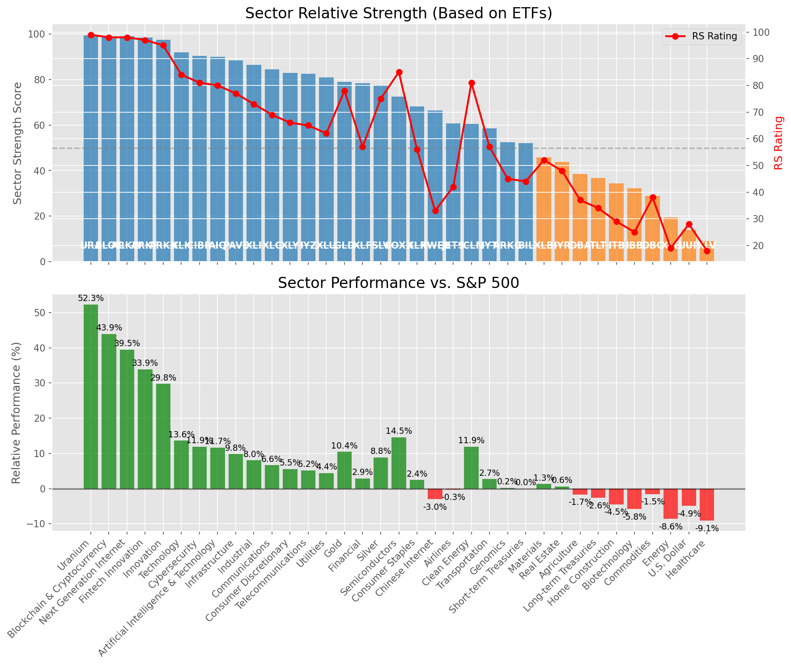

# **Daily Relative Strength Report**

**Date:** 2025-06-24

## **Market Valuation (Buffett Indicator)**

| Metric | Value |
|--------|-------|
| **Market Valuation** | **Overvalued** |
| **Current Ratio** | 10.01 |
| **Historical Mean** | 9.33 |
| **Standard Deviation** | 0.43 |
| **Z-Score (StdDev from Mean)** | 1.28 |
| **Total Market Cap** | $300.07 trillion |
| **GDP** | $29.98 trillion |

## **Market Insights**

### **Market is Overvalued**

The market appears to be trading above historical average valuations. While not at extreme levels, this suggests more modest future returns may be expected. Investors should:

- Focus on companies with reasonable valuations relative to their growth
- Be more selective with new positions
- Look for stocks showing relative strength within their sectors
- Consider trimming positions in extremely overvalued names

Historically, periods of mild overvaluation can persist for extended periods, but returns tend to be below average.

### **Buffett Indicator Overview**

The Buffett Indicator (Total Market Cap / GDP) is a measure of the stock market's valuation relative to the size of the economy. It is named after Warren Buffett, who described it as "probably the best single measure of where valuations stand at any given moment."

- **Values above +2 standard deviations:** Market significantly overvalued
- **Values above +1 standard deviation:** Market overvalued
- **Values between -1 and +1 standard deviations:** Market fairly valued
- **Values below -1 standard deviation:** Market undervalued
- **Values below -2 standard deviations:** Market significantly undervalued

---

## **Sector Relative Strength**

Based on William O'Neil's Relative Strength Methodology

| ETF | Strength | RS Rating | Performance | Above Key MAs | Trend | Sector |
|-----|----------|-----------|-------------|--------------|-------|--------|
| [URA](https://www.tradingview.com/chart/?symbol=URA) | 99.5 | 99.0 | 52.40% | 10d ✓, 50d ✓, 200d ✓ | ↗️ | Uranium |
| [BLOK](https://www.tradingview.com/chart/?symbol=BLOK) | 99.0 | 98.0 | 43.67% | 10d ✓, 50d ✓, 200d ✓ | ↗️ | Blockchain & Cryptocurrency |
| [ARKW](https://www.tradingview.com/chart/?symbol=ARKW) | 99.0 | 98.0 | 39.59% | 10d ✓, 50d ✓, 200d ✓ | ↗️ | Next Generation Internet |
| [ARKF](https://www.tradingview.com/chart/?symbol=ARKF) | 98.5 | 97.0 | 33.96% | 10d ✓, 50d ✓, 200d ✓ | ↗️ | Fintech Innovation |
| [ARKK](https://www.tradingview.com/chart/?symbol=ARKK) | 97.5 | 95.0 | 29.71% | 10d ✓, 50d ✓, 200d ✓ | ↗️ | Innovation |
| [XLK](https://www.tradingview.com/chart/?symbol=XLK) | 92.0 | 84.0 | 13.73% | 10d ✓, 50d ✓, 200d ✓ | ↗️ | Technology |
| [CIBR](https://www.tradingview.com/chart/?symbol=CIBR) | 90.5 | 81.0 | 11.96% | 10d ✓, 50d ✓, 200d ✓ | ↗️ | Cybersecurity |
| [AIQ](https://www.tradingview.com/chart/?symbol=AIQ) | 90.5 | 81.0 | 11.71% | 10d ✓, 50d ✓, 200d ✓ | ↗️ | Artificial Intelligence & Technology |
| [PAVE](https://www.tradingview.com/chart/?symbol=PAVE) | 88.5 | 77.0 | 9.82% | 10d ✓, 50d ✓, 200d ✓ | ↗️ | Infrastructure |
| [XLI](https://www.tradingview.com/chart/?symbol=XLI) | 86.5 | 73.0 | 8.06% | 10d ✓, 50d ✓, 200d ✓ | ↗️ | Industrial |
| [XLC](https://www.tradingview.com/chart/?symbol=XLC) | 84.5 | 69.0 | 6.63% | 10d ✓, 50d ✓, 200d ✓ | ↗️ | Communications |
| [XLY](https://www.tradingview.com/chart/?symbol=XLY) | 83.5 | 67.0 | 5.84% | 10d ✓, 50d ✓, 200d ✓ | ↗️ | Consumer Discretionary |
| [IYZ](https://www.tradingview.com/chart/?symbol=IYZ) | 82.0 | 64.0 | 5.01% | 10d ✓, 50d ✓, 200d ✓ | ↗️ | Telecommunications |
| [XLU](https://www.tradingview.com/chart/?symbol=XLU) | 81.0 | 62.0 | 4.48% | 10d ✓, 50d ✓, 200d ✓ | ↗️ | Utilities |
| [GLD](https://www.tradingview.com/chart/?symbol=GLD) | 79.1 | 78.0 | 10.20% | 10d ✗, 50d ✓, 200d ✓ | ↗️ | Gold |
| [XLF](https://www.tradingview.com/chart/?symbol=XLF) | 78.5 | 57.0 | 3.06% | 10d ✓, 50d ✓, 200d ✓ | ↗️ | Financial |
| [SLV](https://www.tradingview.com/chart/?symbol=SLV) | 77.6 | 75.0 | 8.77% | 10d ✗, 50d ✓, 200d ✓ | ↗️ | Silver |
| [SOXX](https://www.tradingview.com/chart/?symbol=SOXX) | 72.5 | 85.0 | 14.45% | 10d ✓, 50d ✓, 200d ✓ | ↘️ | Semiconductors |
| [XLP](https://www.tradingview.com/chart/?symbol=XLP) | 67.6 | 55.0 | 2.44% | 10d ✓, 50d ✗, 200d ✓ | ↗️ | Consumer Staples |
| [KWEB](https://www.tradingview.com/chart/?symbol=KWEB) | 67.0 | 34.0 | -2.87% | 10d ✓, 50d ✓, 200d ✓ | ↗️ | Chinese Internet |
| [ICLN](https://www.tradingview.com/chart/?symbol=ICLN) | 60.6 | 81.0 | 12.22% | 10d ✗, 50d ✓, 200d ✓ | ↘️ | Clean Energy |
| [JETS](https://www.tradingview.com/chart/?symbol=JETS) | 60.3 | 41.0 | -0.44% | 10d ✓, 50d ✓, 200d ✗ | ↗️ | Airlines |
| [IYT](https://www.tradingview.com/chart/?symbol=IYT) | 58.0 | 56.0 | 2.78% | 10d ✓, 50d ✓, 200d ✓ | ↘️ | Transportation |
| [IYR](https://www.tradingview.com/chart/?symbol=IYR) | 54.5 | 49.0 | 0.86% | 10d ✓, 50d ✓, 200d ✓ | ↘️ | Real Estate |
| [ARKG](https://www.tradingview.com/chart/?symbol=ARKG) | 52.0 | 44.0 | 0.12% | 10d ✓, 50d ✓, 200d ✓ | ↘️ | Genomics |
| [BIL](https://www.tradingview.com/chart/?symbol=BIL) | 51.5 | 43.0 | 0.01% | 10d ✓, 50d ✓, 200d ✓ | ↘️ | Short-term Treasuries |
| [DBA](https://www.tradingview.com/chart/?symbol=DBA) | 38.5 | 37.0 | -1.68% | 10d ✗, 50d ✗, 200d ✗ | ↗️ | Agriculture |
| [TLT](https://www.tradingview.com/chart/?symbol=TLT) | 36.8 | 34.0 | -2.67% | 10d ✓, 50d ✓, 200d ✗ | ↘️ | Long-term Treasuries |
| [XLB](https://www.tradingview.com/chart/?symbol=XLB) | 35.4 | 51.0 | 1.22% | 10d ✗, 50d ✓, 200d ✗ | ↘️ | Materials |
| [ITB](https://www.tradingview.com/chart/?symbol=ITB) | 34.3 | 29.0 | -4.12% | 10d ✓, 50d ✓, 200d ✗ | ↘️ | Home Construction |
| [IBB](https://www.tradingview.com/chart/?symbol=IBB) | 32.3 | 25.0 | -5.72% | 10d ✓, 50d ✓, 200d ✗ | ↘️ | Biotechnology |
| [DBC](https://www.tradingview.com/chart/?symbol=DBC) | 28.4 | 37.0 | -1.74% | 10d ✗, 50d ✓, 200d ✗ | ↘️ | Commodities |
| [XLE](https://www.tradingview.com/chart/?symbol=XLE) | 18.9 | 18.0 | -8.65% | 10d ✗, 50d ✓, 200d ✗ | ↘️ | Energy |
| [UUP](https://www.tradingview.com/chart/?symbol=UUP) | 13.5 | 27.0 | -4.93% | 10d ✗, 50d ✗, 200d ✗ | ↘️ | U.S. Dollar |
| [XLV](https://www.tradingview.com/chart/?symbol=XLV) | 9.0 | 18.0 | -9.12% | 10d ✗, 50d ✗, 200d ✗ | ↘️ | Healthcare |

### **Sector ETF Performance Interpretation**

This table shows the relative strength metrics for different market sectors based on their representative ETFs:

- **ETF**: The ETF used to measure sector performance (click for chart)
- **Strength**: Overall sector strength score (0-100) combining multiple factors
- **RS Rating**: O'Neil RS rating of the sector ETF
- **Performance**: Performance of the sector ETF relative to SPY
- **Above Key MAs**: Whether the ETF is trading above its 10, 50, and 200-day moving averages
- **Trend**: Whether the sector is in an uptrend (↗️) or downtrend (↘️)

### **Current Sector Leadership**

The current market leadership is coming from the following sectors: **Uranium, Blockchain & Cryptocurrency, Next Generation Internet**.

The **Uranium** sector (represented by **URA**) is showing particularly strong relative strength with an RS rating of 99.0 and performance of 52.40% vs. the S&P 500. This sector is trading above its 10-day, 50-day, 200-day moving average(s). Investors should consider focusing on high RS stocks within these leading sectors for potential outperformance.

---

## **Buy Recommendations**

The following 112 stocks show exceptional relative strength:

| RS Rating | Buy Score | Current Price | Chart | Name | Ticker |
|-----------|-----------|---------------|-------|------|--------|
| 100 | 100 | $82.00 | [Chart](https://www.tradingview.com/chart/?symbol=HOOD) | Robinhood Markets, Inc. Class A Common Stock | HOOD |
| 100 | 100 | $161.25 | [Chart](https://www.tradingview.com/chart/?symbol=SEZL) | Sezzle Inc. Common Stock | SEZL |
| 100 | 100 | $189.56 | [Chart](https://www.tradingview.com/chart/?symbol=LEU) | Centrus Energy Corp. | LEU |
| 100 | 100 | $83.36 | [Chart](https://www.tradingview.com/chart/?symbol=SLNO) | Soleno Therapeutics, Inc. Common Stock | SLNO |
| 100 | 100 | $214.22 | [Chart](https://www.tradingview.com/chart/?symbol=AGX) | Argan, Inc | AGX |
| 100 | 100 | $227.89 | [Chart](https://www.tradingview.com/chart/?symbol=DAVE) | Dave Inc. Class A Common Stock | DAVE |
| 100 | 100 | $105.04 | [Chart](https://www.tradingview.com/chart/?symbol=RBLX) | Roblox Corporation | RBLX |
| 99 | 100 | $43.78 | [Chart](https://www.tradingview.com/chart/?symbol=FARO) | Faro Technologies Inc | FARO |
| 99 | 100 | $143.10 | [Chart](https://www.tradingview.com/chart/?symbol=PLTR) | Palantir Technologies Inc. Class A Common Stock | PLTR |
| 99 | 100 | $74.06 | [Chart](https://www.tradingview.com/chart/?symbol=ODD) | ODDITY Tech Ltd. Class A Ordinary Shares | ODD |
| 99 | 100 | $509.50 | [Chart](https://www.tradingview.com/chart/?symbol=GEV) | GE Vernova Inc. | GEV |
| 99 | 100 | $153.63 | [Chart](https://www.tradingview.com/chart/?symbol=NRG) | NRG Energy, Inc. | NRG |
| 99 | 100 | $187.30 | [Chart](https://www.tradingview.com/chart/?symbol=NET) | Cloudflare, Inc. Class A common stock, par value $0.001 per share | NET |
| 99 | 100 | $324.45 | [Chart](https://www.tradingview.com/chart/?symbol=CVNA) | Carvana Co. | CVNA |
| 98 | 100 | $143.47 | [Chart](https://www.tradingview.com/chart/?symbol=CLS) | Celestica, Inc. | CLS |
| 98 | 100 | $155.75 | [Chart](https://www.tradingview.com/chart/?symbol=COOP) | Mr. Cooper Group Inc. Common Stock | COOP |
| 98 | 100 | $799.66 | [Chart](https://www.tradingview.com/chart/?symbol=AXON) | Axon Enterprise, Inc. Common Stock | AXON |
| 98 | 100 | $29.53 | [Chart](https://www.tradingview.com/chart/?symbol=CRK) | Comstock Resources, Inc. | CRK |
| 98 | 100 | $211.60 | [Chart](https://www.tradingview.com/chart/?symbol=JBL) | Jabil Inc. | JBL |
| 98 | 100 | $153.58 | [Chart](https://www.tradingview.com/chart/?symbol=IRTC) | iRhythm Technologies, Inc | IRTC |
| 97 | 100 | $265.28 | [Chart](https://www.tradingview.com/chart/?symbol=CRS) | Carpenter Technology Corp | CRS |
| 97 | 100 | $52.34 | [Chart](https://www.tradingview.com/chart/?symbol=BBW) | Build-A-Bear Workshop, Inc. | BBW |
| 97 | 100 | $133.82 | [Chart](https://www.tradingview.com/chart/?symbol=NTES) | NetEase, inc. | NTES |
| 97 | 100 | $49.50 | [Chart](https://www.tradingview.com/chart/?symbol=ARKF) | ARK Fintech Innovation ETF | ARKF |
| 97 | 100 | $35.58 | [Chart](https://www.tradingview.com/chart/?symbol=MP) | MP Materials Corp. | MP |
| 97 | 100 | $294.48 | [Chart](https://www.tradingview.com/chart/?symbol=TLN) | Talen Energy Corporation Common Stock | TLN |
| 97 | 100 | $43.64 | [Chart](https://www.tradingview.com/chart/?symbol=GRAL) | GRAIL, Inc. Common Stock | GRAL |
| 97 | 100 | $72.54 | [Chart](https://www.tradingview.com/chart/?symbol=ULS) | UL Solutions Inc. | ULS |
| 96 | 100 | $486.34 | [Chart](https://www.tradingview.com/chart/?symbol=CRWD) | CrowdStrike Holdings, Inc. Class A Common Stock | CRWD |
| 96 | 100 | $1280.25 | [Chart](https://www.tradingview.com/chart/?symbol=NFLX) | NetFlix Inc | NFLX |
| 95 | 100 | $76.91 | [Chart](https://www.tradingview.com/chart/?symbol=CORT) | Corcept Therapeutics Inc. | CORT |
| 95 | 100 | $32.68 | [Chart](https://www.tradingview.com/chart/?symbol=PRDO) | Perdoceo Education Corporation | PRDO |
| 95 | 100 | $27.50 | [Chart](https://www.tradingview.com/chart/?symbol=UVE) | UNIVERSAL INSURANCE HLDG, INC. | UVE |
| 95 | 100 | $176.66 | [Chart](https://www.tradingview.com/chart/?symbol=HWM) | Howmet Aerospace Inc. | HWM |
| 95 | 100 | $20.16 | [Chart](https://www.tradingview.com/chart/?symbol=MIR) | Mirion Technologies, Inc. | MIR |
| 95 | 100 | $37.85 | [Chart](https://www.tradingview.com/chart/?symbol=AS) | Amer Sports, Inc. | AS |
| 94 | 100 | $243.63 | [Chart](https://www.tradingview.com/chart/?symbol=WWD) | Woodward, Inc. | WWD |
| 94 | 100 | $34.37 | [Chart](https://www.tradingview.com/chart/?symbol=UTI) | Universal Technical Institute, Inc. | UTI |
| 94 | 100 | $753.21 | [Chart](https://www.tradingview.com/chart/?symbol=SPOT) | Spotify Technology S.A. | SPOT |
| 94 | 100 | $281.14 | [Chart](https://www.tradingview.com/chart/?symbol=RCL) | Royal Caribbean Group | RCL |
| 93 | 100 | $23.09 | [Chart](https://www.tradingview.com/chart/?symbol=BTSG) | BrightSpring Health Services, Inc. Common Stock | BTSG |
| 93 | 100 | $512.12 | [Chart](https://www.tradingview.com/chart/?symbol=CASY) | Casey's General Stores Inc | CASY |
| 93 | 100 | $164.04 | [Chart](https://www.tradingview.com/chart/?symbol=CAH) | Cardinal Health, Inc. | CAH |
| 93 | 100 | $19.14 | [Chart](https://www.tradingview.com/chart/?symbol=AVPT) | AvePoint, Inc. Class A Common Stock | AVPT |
| 92 | 100 | $184.47 | [Chart](https://www.tradingview.com/chart/?symbol=PM) | Philip Morris International Inc. | PM |
| 92 | 100 | $46.02 | [Chart](https://www.tradingview.com/chart/?symbol=EXEL) | Exelixis Inc | EXEL |
| 92 | 100 | $90.00 | [Chart](https://www.tradingview.com/chart/?symbol=RBRK) | Rubrik, Inc. | RBRK |
| 92 | 100 | $126.60 | [Chart](https://www.tradingview.com/chart/?symbol=ATGE) | Adtalem Global Education Inc. Common Shares | ATGE |
| 92 | 100 | $103.66 | [Chart](https://www.tradingview.com/chart/?symbol=JCI) | Johnson Controls International plc | JCI |
| 92 | 100 | $39.30 | [Chart](https://www.tradingview.com/chart/?symbol=LTM) | LATAM Airlines Group S.A. American Depositary Shares (each representing two thousand (2,000) shares of Common Stock) | LTM |
| 91 | 100 | $121.07 | [Chart](https://www.tradingview.com/chart/?symbol=EHC) | Encompass Health Corporation Common Stock | EHC |
| 90 | 100 | $19.43 | [Chart](https://www.tradingview.com/chart/?symbol=SPNT) | SiriusPoint Ltd. | SPNT |
| 90 | 100 | $237.18 | [Chart](https://www.tradingview.com/chart/?symbol=DASH) | DoorDash, Inc. Class A Common Stock | DASH |
| 90 | 100 | $129.22 | [Chart](https://www.tradingview.com/chart/?symbol=OLLI) | Ollie's Bargain Outlet Holdings, Inc. Common Stock | OLLI |
| 90 | 100 | $36.51 | [Chart](https://www.tradingview.com/chart/?symbol=AHR) | American Healthcare REIT, Inc. | AHR |
| 89 | 100 | $64.60 | [Chart](https://www.tradingview.com/chart/?symbol=CHEF) | The Chef's Warehouse Inc | CHEF |
| 89 | 100 | $293.94 | [Chart](https://www.tradingview.com/chart/?symbol=IBM) | International Business Machines Corporation | IBM |
| 89 | 100 | $105.28 | [Chart](https://www.tradingview.com/chart/?symbol=FWONK) | Liberty Media Corporation Series C Liberty Formula One Common Stock | FWONK |
| 89 | 100 | $160.51 | [Chart](https://www.tradingview.com/chart/?symbol=PLMR) | Palomar Holdings, Inc. Common stock | PLMR |
| 89 | 100 | $60.54 | [Chart](https://www.tradingview.com/chart/?symbol=CAKE) | Cheesecake Factory (The) | CAKE |
| 89 | 100 | $29.30 | [Chart](https://www.tradingview.com/chart/?symbol=DB) | Deutsche Bank Aktiengesellschaft | DB |
| 89 | 100 | $44.22 | [Chart](https://www.tradingview.com/chart/?symbol=BBIO) | BridgeBio Pharma, Inc. Common Stock | BBIO |
| 89 | 100 | $248.63 | [Chart](https://www.tradingview.com/chart/?symbol=GE) | GE Aerospace | GE |
| 89 | 100 | $73.41 | [Chart](https://www.tradingview.com/chart/?symbol=CTVA) | Corteva, Inc. Common Stock | CTVA |
| 88 | 100 | $27.10 | [Chart](https://www.tradingview.com/chart/?symbol=SRAD) | Sportradar Group AG Class A Ordinary Shares | SRAD |
| 88 | 100 | $181.49 | [Chart](https://www.tradingview.com/chart/?symbol=EAT) | Brinker International, Inc. | EAT |
| 89 | 99 | $245.12 | [Chart](https://www.tradingview.com/chart/?symbol=WTS) | Watts Water Technologies, Inc. Class A | WTS |
| 87 | 99 | $79.89 | [Chart](https://www.tradingview.com/chart/?symbol=LLYVK) | Liberty Media Corporation Series C Liberty Live Common Stock | LLYVK |
| 86 | 99 | $168.25 | [Chart](https://www.tradingview.com/chart/?symbol=SFM) | Sprouts Farmers Market, Inc. | SFM |
| 86 | 99 | $23.05 | [Chart](https://www.tradingview.com/chart/?symbol=LAUR) | Laureate Education, Inc. Common Stock | LAUR |
| 86 | 99 | $176.84 | [Chart](https://www.tradingview.com/chart/?symbol=TKO) | TKO Group Holdings, Inc. | TKO |
| 86 | 99 | $284.81 | [Chart](https://www.tradingview.com/chart/?symbol=VRSN) | VeriSign Inc | VRSN |
| 85 | 99 | $20.26 | [Chart](https://www.tradingview.com/chart/?symbol=KT) | KT Corp. | KT |
| 88 | 98 | $136.54 | [Chart](https://www.tradingview.com/chart/?symbol=PPA) | Invesco Aerospace & Defense ETF | PPA |
| 88 | 98 | $63.42 | [Chart](https://www.tradingview.com/chart/?symbol=RYTM) | Rhythm Pharmaceuticals, Inc. Common Stock | RYTM |
| 87 | 98 | $5513.35 | [Chart](https://www.tradingview.com/chart/?symbol=BKNG) | Booking Holdings Inc. Common Stock | BKNG |
| 87 | 98 | $148.60 | [Chart](https://www.tradingview.com/chart/?symbol=LYV) | Live Nation Entertainment Inc. | LYV |
| 87 | 98 | $76.73 | [Chart](https://www.tradingview.com/chart/?symbol=USFD) | US Foods Holding Corp. | USFD |
| 86 | 98 | $87.47 | [Chart](https://www.tradingview.com/chart/?symbol=TPR) | Tapestry, Inc. Common Stock | TPR |
| 84 | 98 | $243.22 | [Chart](https://www.tradingview.com/chart/?symbol=TTWO) | Take-Two Interactive Software Inc | TTWO |
| 86 | 97 | $40.85 | [Chart](https://www.tradingview.com/chart/?symbol=KD) | Kyndryl Holdings, Inc. | KD |
| 85 | 97 | $43.78 | [Chart](https://www.tradingview.com/chart/?symbol=EWP) | iShares MSCI Spain ETF | EWP |
| 84 | 97 | $18.29 | [Chart](https://www.tradingview.com/chart/?symbol=BCS) | Barclays PLC | BCS |
| 84 | 97 | $73.27 | [Chart](https://www.tradingview.com/chart/?symbol=WRB) | W.R. Berkley Corporation | WRB |
| 86 | 96 | $93.48 | [Chart](https://www.tradingview.com/chart/?symbol=SANM) | Sanmina  Corp | SANM |
| 85 | 96 | $51.65 | [Chart](https://www.tradingview.com/chart/?symbol=IBKR) | Interactive Brokers Group, Inc. Class A Common Stock | IBKR |
| 85 | 96 | $182.00 | [Chart](https://www.tradingview.com/chart/?symbol=ITA) | iShares U.S. Aerospace & Defense ETF | ITA |
| 84 | 96 | $312.22 | [Chart](https://www.tradingview.com/chart/?symbol=PODD) | Insulet Corporation | PODD |
| 85 | 95 | $121.65 | [Chart](https://www.tradingview.com/chart/?symbol=TWLO) | Twilio Inc. | TWLO |
| 85 | 95 | $28.37 | [Chart](https://www.tradingview.com/chart/?symbol=NTGR) | NETGEAR, Inc. | NTGR |
| 83 | 95 | $398.17 | [Chart](https://www.tradingview.com/chart/?symbol=CYBR) | CyberArk Software Ltd. | CYBR |
| 83 | 95 | $191.67 | [Chart](https://www.tradingview.com/chart/?symbol=LOPE) | Grand Canyon Education, Inc | LOPE |
| 84 | 94 | $88.15 | [Chart](https://www.tradingview.com/chart/?symbol=NDAQ) | Nasdaq, Inc. Common Stock | NDAQ |
| 84 | 94 | $65.27 | [Chart](https://www.tradingview.com/chart/?symbol=SLF) | Sun Life Financial Inc. | SLF |
| 83 | 94 | $218.84 | [Chart](https://www.tradingview.com/chart/?symbol=BAP) | Credicorp LTD | BAP |
| 82 | 94 | $98.53 | [Chart](https://www.tradingview.com/chart/?symbol=WMT) | Walmart Inc. | WMT |
| 81 | 94 | $58.77 | [Chart](https://www.tradingview.com/chart/?symbol=SKWD) | Skyward Specialty Insurance Group, Inc. Common Stock | SKWD |
| 81 | 94 | $73.21 | [Chart](https://www.tradingview.com/chart/?symbol=KR) | The Kroger Co. | KR |
| 81 | 94 | $60.65 | [Chart](https://www.tradingview.com/chart/?symbol=EQT) | EQT CORP | EQT |
| 84 | 93 | $206.50 | [Chart](https://www.tradingview.com/chart/?symbol=COF) | Capital One Financial | COF |
| 83 | 93 | $110.00 | [Chart](https://www.tradingview.com/chart/?symbol=SPMO) | Invesco S&P 500 Momentum ETF | SPMO |
| 82 | 93 | $95.51 | [Chart](https://www.tradingview.com/chart/?symbol=LBRDK) | Liberty Broadband Corporation Class C | LBRDK |
| 81 | 93 | $73.93 | [Chart](https://www.tradingview.com/chart/?symbol=CIBR) | First Trust Exchange-Traded Fund II First Trust NASDAQ Cybersecurity ETF | CIBR |
| 82 | 92 | $58.40 | [Chart](https://www.tradingview.com/chart/?symbol=EPR) | EPR Properties | EPR |
| 82 | 92 | $378.70 | [Chart](https://www.tradingview.com/chart/?symbol=MSTR) | MicroStrategy Inc | MSTR |
| 80 | 92 | $67.70 | [Chart](https://www.tradingview.com/chart/?symbol=CSCO) | Cisco Systems, Inc. Common Stock (DE) | CSCO |
| 81 | 91 | $89.64 | [Chart](https://www.tradingview.com/chart/?symbol=SCHW) | The Charles Schwab Corporation | SCHW |
| 81 | 91 | $205.76 | [Chart](https://www.tradingview.com/chart/?symbol=GPOR) | Gulfport Energy Corporation | GPOR |
| 80 | 90 | $79.85 | [Chart](https://www.tradingview.com/chart/?symbol=BBCA) | JPMorgan BetaBuilders Canada ETF | BBCA |
| 80 | 90 | $86.35 | [Chart](https://www.tradingview.com/chart/?symbol=SEIC) | SEI Investments Co | SEIC |
| 80 | 90 | $171.40 | [Chart](https://www.tradingview.com/chart/?symbol=NTRA) | Natera, Inc. Common Stock | NTRA |
| 80 | 90 | $262.92 | [Chart](https://www.tradingview.com/chart/?symbol=LH) | Labcorp Holdings Inc. | LH |

---

## **Sell Recommendations**

The following 62 stocks show deteriorating relative strength:

| RS Rating | Sell Score | Current Price | Chart | Name | Ticker |
|-----------|------------|---------------|-------|------|--------|
| 1 | 100 | $13.80 | [Chart](https://www.tradingview.com/chart/?symbol=RXST) | RxSight, Inc. Common Stock | RXST |
| 1 | 100 | $28.59 | [Chart](https://www.tradingview.com/chart/?symbol=TECS) | Direxion Daily Technology Bear 3x Shares | TECS |
| 1 | 100 | $16.07 | [Chart](https://www.tradingview.com/chart/?symbol=NVDS) | Investment Managers Series Trust II Tradr 1.5X Short NVDA Daily ETF | NVDS |
| 1 | 100 | $27.84 | [Chart](https://www.tradingview.com/chart/?symbol=HELE) | Helen Of Troy Ltd | HELE |
| 1 | 100 | $14.93 | [Chart](https://www.tradingview.com/chart/?symbol=ZVZZT) | SUPER Montage TEST SYMBOL | ZVZZT |
| 2 | 100 | $12.02 | [Chart](https://www.tradingview.com/chart/?symbol=NRIX) | Nurix Therapeutics, Inc. Common stock | NRIX |
| 3 | 100 | $13.81 | [Chart](https://www.tradingview.com/chart/?symbol=INMD) | InMode Ltd. Ordinary Shares | INMD |
| 3 | 100 | $20.74 | [Chart](https://www.tradingview.com/chart/?symbol=AMRK) | A-Mark Precious Metals, Inc. | AMRK |
| 3 | 100 | $35.74 | [Chart](https://www.tradingview.com/chart/?symbol=SARK) | Investment Managers Series Trust II Tradr 1X Short Innovation Daily ETF | SARK |
| 4 | 100 | $26.63 | [Chart](https://www.tradingview.com/chart/?symbol=QID) | ProShares UltraShort QQQ | QID |
| 4 | 100 | $46.49 | [Chart](https://www.tradingview.com/chart/?symbol=LINE) | Lineage, Inc. Common Stock | LINE |
| 5 | 100 | $30.55 | [Chart](https://www.tradingview.com/chart/?symbol=FUN) | Six Flags Entertainment Corporation | FUN |
| 7 | 100 | $20.58 | [Chart](https://www.tradingview.com/chart/?symbol=SPT) | Sprout Social, Inc Class A Common Stock | SPT |
| 7 | 100 | $20.07 | [Chart](https://www.tradingview.com/chart/?symbol=BITI) | ProShares Short Bitcoin ETF | BITI |
| 7 | 100 | $26.20 | [Chart](https://www.tradingview.com/chart/?symbol=ASTH) | Astrana Health Inc. Common Stock | ASTH |
| 7 | 100 | $17.31 | [Chart](https://www.tradingview.com/chart/?symbol=AMTB) | Amerant Bancorp Inc. | AMTB |
| 7 | 100 | $81.08 | [Chart](https://www.tradingview.com/chart/?symbol=LNTH) | Lantheus Holdings, Inc | LNTH |
| 10 | 100 | $10.56 | [Chart](https://www.tradingview.com/chart/?symbol=ABR) | Arbor Realty Trust, Inc. | ABR |
| 10 | 100 | $10.26 | [Chart](https://www.tradingview.com/chart/?symbol=LBTYK) | Liberty Global Ltd. Class C Common Shares | LBTYK |
| 12 | 100 | $31.32 | [Chart](https://www.tradingview.com/chart/?symbol=CRNX) | Crinetics Pharmaceuticals, Inc. | CRNX |
| 13 | 100 | $32.11 | [Chart](https://www.tradingview.com/chart/?symbol=MBIN) | Merchants Bancorp Common Stock | MBIN |
| 8 | 99 | $27.04 | [Chart](https://www.tradingview.com/chart/?symbol=WMG) | Warner Music Group Corp. Class A Common Stock | WMG |
| 3 | 98 | $10.32 | [Chart](https://www.tradingview.com/chart/?symbol=SONO) | Sonos, Inc. Common Stock | SONO |
| 4 | 98 | $28.35 | [Chart](https://www.tradingview.com/chart/?symbol=DOCN) | DigitalOcean Holdings, Inc. | DOCN |
| 13 | 98 | $17.61 | [Chart](https://www.tradingview.com/chart/?symbol=ZTO) | ZTO Express (Cayman) Inc. American Depositary Shares, each representing one Class A ordinary share | ZTO |
| 13 | 98 | $44.63 | [Chart](https://www.tradingview.com/chart/?symbol=SDOW) | ProShares UltraPro Short Dow 30 | SDOW |
| 6 | 97 | $12.05 | [Chart](https://www.tradingview.com/chart/?symbol=TZA) | Direxion Daily Small Cap Bear 3x Shares | TZA |
| 4 | 96 | $67.01 | [Chart](https://www.tradingview.com/chart/?symbol=WK) | Workiva Inc. | WK |
| 11 | 96 | $13.59 | [Chart](https://www.tradingview.com/chart/?symbol=OCSL) | Oaktree Specialty Lending Corporation | OCSL |
| 7 | 95 | $101.96 | [Chart](https://www.tradingview.com/chart/?symbol=DECK) | Deckers Outdoor Corp | DECK |
| 9 | 94 | $17.80 | [Chart](https://www.tradingview.com/chart/?symbol=IRT) | Independence Realty Trust Inc. | IRT |
| 16 | 93 | $52.14 | [Chart](https://www.tradingview.com/chart/?symbol=AMWD) | American Woodmark Corp | AMWD |
| 16 | 93 | $31.50 | [Chart](https://www.tradingview.com/chart/?symbol=WGO) | Winnebago Industries, Inc. | WGO |
| 12 | 92 | $128.07 | [Chart](https://www.tradingview.com/chart/?symbol=ICUI) | ICU Medical Inc | ICUI |
| 15 | 92 | $25.43 | [Chart](https://www.tradingview.com/chart/?symbol=ATHM) | Autohome Inc. American Depositary Shares, each representing four Class A Ordinary Shares | ATHM |
| 21 | 92 | $21.23 | [Chart](https://www.tradingview.com/chart/?symbol=KIDS) | OrthoPediatrics Corp. Common Stock | KIDS |
| 15 | 91 | $99.06 | [Chart](https://www.tradingview.com/chart/?symbol=CROX) | Crocs, Inc. | CROX |
| 20 | 91 | $15.50 | [Chart](https://www.tradingview.com/chart/?symbol=HQH) | abrdn Healthcare Investors | HQH |
| 23 | 91 | $10.25 | [Chart](https://www.tradingview.com/chart/?symbol=NMZ) | Nuveen Municipal High Income Opportunity Fund | NMZ |
| 13 | 90 | $23.58 | [Chart](https://www.tradingview.com/chart/?symbol=DRV) | Direxion Daily Real Estate Bear 3X Shares | DRV |
| 17 | 89 | $30.15 | [Chart](https://www.tradingview.com/chart/?symbol=RNA) | Avidity Biosciences, Inc. Common Stock | RNA |
| 26 | 89 | $13.16 | [Chart](https://www.tradingview.com/chart/?symbol=MRTN) | Marten Transport Ltd | MRTN |
| 26 | 88 | $11.80 | [Chart](https://www.tradingview.com/chart/?symbol=NVG) | Nuveen AMT-Free Municipal Credit Income Fund | NVG |
| 19 | 87 | $29.00 | [Chart](https://www.tradingview.com/chart/?symbol=APPN) | Appian Corporation Class A Common Stock | APPN |
| 19 | 86 | $298.57 | [Chart](https://www.tradingview.com/chart/?symbol=POOL) | Pool Corporation | POOL |
| 23 | 86 | $12.81 | [Chart](https://www.tradingview.com/chart/?symbol=UTZ) | Utz Brands, Inc. | UTZ |
| 17 | 84 | $23.26 | [Chart](https://www.tradingview.com/chart/?symbol=COLB) | Columbia Banking Systems Inc | COLB |
| 26 | 84 | $44.37 | [Chart](https://www.tradingview.com/chart/?symbol=SON) | Sonoco Products Company | SON |
| 31 | 84 | $11.80 | [Chart](https://www.tradingview.com/chart/?symbol=NZF) | Nuveen Municipal Credit Income Fund | NZF |
| 22 | 83 | $93.33 | [Chart](https://www.tradingview.com/chart/?symbol=CHRW) | C.H. Robinson Worldwide, Inc. | CHRW |
| 18 | 82 | $19.47 | [Chart](https://www.tradingview.com/chart/?symbol=VSCO) | Victorias Secret & Co. | VSCO |
| 19 | 82 | $201.82 | [Chart](https://www.tradingview.com/chart/?symbol=AAPL) | Apple Inc. | AAPL |
| 29 | 82 | $10.82 | [Chart](https://www.tradingview.com/chart/?symbol=NEA) | Nuveen AMT-Free Quality Municipal Income Fund | NEA |
| 31 | 82 | $10.40 | [Chart](https://www.tradingview.com/chart/?symbol=MYI) | BLACKROCK MUNIYIELD QUALITY FUND III, INC. | MYI |
| 32 | 80 | $15.89 | [Chart](https://www.tradingview.com/chart/?symbol=BBN) | BlackRock Taxable Municipal Bond Trust | BBN |
| 27 | 79 | $45.23 | [Chart](https://www.tradingview.com/chart/?symbol=ABM) | ABM Industries, Inc. | ABM |
| 35 | 77 | $26.23 | [Chart](https://www.tradingview.com/chart/?symbol=DOG) | ProShares Short Dow30 | DOG |
| 29 | 76 | $11.18 | [Chart](https://www.tradingview.com/chart/?symbol=NAD) | Nuveen Quality Municipal Income Fund | NAD |
| 29 | 75 | $76.01 | [Chart](https://www.tradingview.com/chart/?symbol=CNS) | Cohen & Steers Inc. | CNS |
| 31 | 75 | $13.35 | [Chart](https://www.tradingview.com/chart/?symbol=PDO) | PIMCO Dynamic Income Opportunities Fund | PDO |
| 27 | 74 | $14.41 | [Chart](https://www.tradingview.com/chart/?symbol=GBDC) | Golub Capital BDC, Inc. | GBDC |
| 30 | 71 | $28.89 | [Chart](https://www.tradingview.com/chart/?symbol=HMC) | Honda Motor Co., Ltd. American Depositary Share, each representing three (3) shares of Common Stock | HMC |

## **Methodology**

This report uses William O'Neil's relative strength methodology from Investors Business Daily:

* **RS Rating**: Percentile rank of stock's performance vs. S&P 500 over the past 63 trading days (1-99 scale)
* **Buy Criteria**: RS Rating >= 80, price above 50-day MA, strong uptrend, increasing volume
* **Sell Criteria**: RS Rating < 40, price below 50-day MA, downtrend, decreasing volume

### **O'Neil's Key Principles**

1. **Focus on relative performance** - stocks outperforming the market
2. **Price trend confirmation** - stock must be in an uptrend
3. **Volume confirmation** - strong volume supports price moves
4. **Moving average validation** - price above key moving averages
5. **Market leaders only** - concentrate on top-performing stocks

*Report generated automatically after market close*