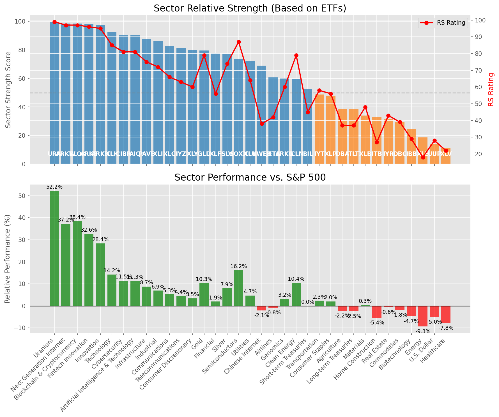

# **Daily Relative Strength Report**

**Date:** 2025-06-25

## **Market Valuation (Buffett Indicator)**

| Metric | Value |
|--------|-------|
| **Market Valuation** | **Overvalued** |
| **Current Ratio** | 9.99 |
| **Historical Mean** | 9.34 |
| **Standard Deviation** | 0.44 |
| **Z-Score (StdDev from Mean)** | 1.52 |
| **Total Market Cap** | $299.36 trillion |
| **GDP** | $29.98 trillion |

## **Market Insights**

### **Market is Overvalued**

The market appears to be trading above historical average valuations. While not at extreme levels, this suggests more modest future returns may be expected. Investors should:

- Focus on companies with reasonable valuations relative to their growth
- Be more selective with new positions
- Look for stocks showing relative strength within their sectors
- Consider trimming positions in extremely overvalued names

Historically, periods of mild overvaluation can persist for extended periods, but returns tend to be below average.

### **Buffett Indicator Overview**

The Buffett Indicator (Total Market Cap / GDP) is a measure of the stock market's valuation relative to the size of the economy. It is named after Warren Buffett, who described it as "probably the best single measure of where valuations stand at any given moment."

- **Values above +2 standard deviations:** Market significantly overvalued
- **Values above +1 standard deviation:** Market overvalued
- **Values between -1 and +1 standard deviations:** Market fairly valued
- **Values below -1 standard deviation:** Market undervalued
- **Values below -2 standard deviations:** Market significantly undervalued

---

## **Sector Relative Strength**

Based on William O'Neil's Relative Strength Methodology

| ETF | Strength | RS Rating | Performance | Above Key MAs | Trend | Sector |
|-----|----------|-----------|-------------|--------------|-------|--------|
| [URA](https://www.tradingview.com/chart/?symbol=URA) | 99.5 | 99.0 | 52.15% | 10d ✓, 50d ✓, 200d ✓ | ↗️ | Uranium |
| [BLOK](https://www.tradingview.com/chart/?symbol=BLOK) | 98.5 | 97.0 | 38.40% | 10d ✓, 50d ✓, 200d ✓ | ↗️ | Blockchain & Cryptocurrency |
| [ARKW](https://www.tradingview.com/chart/?symbol=ARKW) | 98.5 | 97.0 | 37.22% | 10d ✓, 50d ✓, 200d ✓ | ↗️ | Next Generation Internet |
| [ARKF](https://www.tradingview.com/chart/?symbol=ARKF) | 98.0 | 96.0 | 32.64% | 10d ✓, 50d ✓, 200d ✓ | ↗️ | Fintech Innovation |
| [ARKK](https://www.tradingview.com/chart/?symbol=ARKK) | 97.5 | 95.0 | 28.37% | 10d ✓, 50d ✓, 200d ✓ | ↗️ | Innovation |
| [XLK](https://www.tradingview.com/chart/?symbol=XLK) | 92.5 | 85.0 | 14.20% | 10d ✓, 50d ✓, 200d ✓ | ↗️ | Technology |
| [CIBR](https://www.tradingview.com/chart/?symbol=CIBR) | 90.5 | 81.0 | 11.46% | 10d ✓, 50d ✓, 200d ✓ | ↗️ | Cybersecurity |
| [AIQ](https://www.tradingview.com/chart/?symbol=AIQ) | 90.5 | 81.0 | 11.35% | 10d ✓, 50d ✓, 200d ✓ | ↗️ | Artificial Intelligence & Technology |
| [PAVE](https://www.tradingview.com/chart/?symbol=PAVE) | 87.5 | 75.0 | 8.72% | 10d ✓, 50d ✓, 200d ✓ | ↗️ | Infrastructure |
| [XLI](https://www.tradingview.com/chart/?symbol=XLI) | 86.0 | 72.0 | 6.91% | 10d ✓, 50d ✓, 200d ✓ | ↗️ | Industrial |
| [XLC](https://www.tradingview.com/chart/?symbol=XLC) | 83.0 | 66.0 | 5.27% | 10d ✓, 50d ✓, 200d ✓ | ↗️ | Communications |
| [IYZ](https://www.tradingview.com/chart/?symbol=IYZ) | 81.5 | 63.0 | 4.41% | 10d ✓, 50d ✓, 200d ✓ | ↗️ | Telecommunications |
| [XLY](https://www.tradingview.com/chart/?symbol=XLY) | 80.0 | 60.0 | 3.46% | 10d ✓, 50d ✓, 200d ✓ | ↗️ | Consumer Discretionary |
| [GLD](https://www.tradingview.com/chart/?symbol=GLD) | 79.6 | 79.0 | 10.29% | 10d ✗, 50d ✓, 200d ✓ | ↗️ | Gold |
| [XLF](https://www.tradingview.com/chart/?symbol=XLF) | 78.0 | 56.0 | 1.94% | 10d ✓, 50d ✓, 200d ✓ | ↗️ | Financial |
| [SLV](https://www.tradingview.com/chart/?symbol=SLV) | 77.1 | 74.0 | 7.95% | 10d ✗, 50d ✓, 200d ✓ | ↗️ | Silver |
| [SOXX](https://www.tradingview.com/chart/?symbol=SOXX) | 73.5 | 87.0 | 16.17% | 10d ✓, 50d ✓, 200d ✓ | ↘️ | Semiconductors |
| [XLU](https://www.tradingview.com/chart/?symbol=XLU) | 72.1 | 64.0 | 4.65% | 10d ✗, 50d ✓, 200d ✓ | ↗️ | Utilities |
| [KWEB](https://www.tradingview.com/chart/?symbol=KWEB) | 69.0 | 38.0 | -2.10% | 10d ✓, 50d ✓, 200d ✓ | ↗️ | Chinese Internet |
| [JETS](https://www.tradingview.com/chart/?symbol=JETS) | 60.8 | 42.0 | -0.84% | 10d ✓, 50d ✓, 200d ✗ | ↗️ | Airlines |
| [ARKG](https://www.tradingview.com/chart/?symbol=ARKG) | 60.0 | 60.0 | 3.24% | 10d ✓, 50d ✓, 200d ✓ | ↘️ | Genomics |
| [ICLN](https://www.tradingview.com/chart/?symbol=ICLN) | 59.6 | 79.0 | 10.45% | 10d ✗, 50d ✓, 200d ✓ | ↘️ | Clean Energy |
| [BIL](https://www.tradingview.com/chart/?symbol=BIL) | 52.5 | 45.0 | 0.00% | 10d ✓, 50d ✓, 200d ✓ | ↘️ | Short-term Treasuries |
| [IYT](https://www.tradingview.com/chart/?symbol=IYT) | 48.8 | 58.0 | 2.35% | 10d ✓, 50d ✓, 200d ✗ | ↘️ | Transportation |
| [XLP](https://www.tradingview.com/chart/?symbol=XLP) | 48.0 | 56.0 | 1.98% | 10d ✗, 50d ✗, 200d ✗ | ↗️ | Consumer Staples |
| [DBA](https://www.tradingview.com/chart/?symbol=DBA) | 38.5 | 37.0 | -2.25% | 10d ✗, 50d ✗, 200d ✗ | ↗️ | Agriculture |
| [TLT](https://www.tradingview.com/chart/?symbol=TLT) | 38.3 | 37.0 | -2.51% | 10d ✓, 50d ✓, 200d ✗ | ↘️ | Long-term Treasuries |
| [XLB](https://www.tradingview.com/chart/?symbol=XLB) | 33.9 | 48.0 | 0.35% | 10d ✗, 50d ✓, 200d ✗ | ↘️ | Materials |
| [ITB](https://www.tradingview.com/chart/?symbol=ITB) | 33.3 | 27.0 | -5.45% | 10d ✓, 50d ✓, 200d ✗ | ↘️ | Home Construction |
| [IYR](https://www.tradingview.com/chart/?symbol=IYR) | 31.4 | 43.0 | -0.62% | 10d ✗, 50d ✓, 200d ✗ | ↘️ | Real Estate |
| [DBC](https://www.tradingview.com/chart/?symbol=DBC) | 29.4 | 39.0 | -1.80% | 10d ✗, 50d ✓, 200d ✗ | ↘️ | Commodities |
| [IBB](https://www.tradingview.com/chart/?symbol=IBB) | 24.4 | 29.0 | -4.72% | 10d ✗, 50d ✓, 200d ✗ | ↘️ | Biotechnology |
| [XLE](https://www.tradingview.com/chart/?symbol=XLE) | 18.9 | 18.0 | -9.32% | 10d ✗, 50d ✓, 200d ✗ | ↘️ | Energy |
| [UUP](https://www.tradingview.com/chart/?symbol=UUP) | 14.0 | 28.0 | -5.05% | 10d ✗, 50d ✗, 200d ✗ | ↘️ | U.S. Dollar |
| [XLV](https://www.tradingview.com/chart/?symbol=XLV) | 11.0 | 22.0 | -7.83% | 10d ✗, 50d ✗, 200d ✗ | ↘️ | Healthcare |

### **Sector ETF Performance Interpretation**

This table shows the relative strength metrics for different market sectors based on their representative ETFs:

- **ETF**: The ETF used to measure sector performance (click for chart)
- **Strength**: Overall sector strength score (0-100) combining multiple factors
- **RS Rating**: O'Neil RS rating of the sector ETF
- **Performance**: Performance of the sector ETF relative to SPY
- **Above Key MAs**: Whether the ETF is trading above its 10, 50, and 200-day moving averages
- **Trend**: Whether the sector is in an uptrend (↗️) or downtrend (↘️)

### **Current Sector Leadership**

The current market leadership is coming from the following sectors: **Uranium, Blockchain & Cryptocurrency, Next Generation Internet**.

The **Uranium** sector (represented by **URA**) is showing particularly strong relative strength with an RS rating of 99.0 and performance of 52.15% vs. the S&P 500. This sector is trading above its 10-day, 50-day, 200-day moving average(s). Investors should consider focusing on high RS stocks within these leading sectors for potential outperformance.

---

## **Buy Recommendations**

The following 91 stocks show exceptional relative strength:

| RS Rating | Buy Score | Current Price | Chart | Name | Ticker |
|-----------|-----------|---------------|-------|------|--------|
| 100 | 100 | $154.79 | [Chart](https://www.tradingview.com/chart/?symbol=SEZL) | Sezzle Inc. Common Stock | SEZL |
| 100 | 100 | $85.79 | [Chart](https://www.tradingview.com/chart/?symbol=SLNO) | Soleno Therapeutics, Inc. Common Stock | SLNO |
| 100 | 100 | $226.11 | [Chart](https://www.tradingview.com/chart/?symbol=DAVE) | Dave Inc. Class A Common Stock | DAVE |
| 100 | 100 | $181.18 | [Chart](https://www.tradingview.com/chart/?symbol=LEU) | Centrus Energy Corp. | LEU |
| 100 | 100 | $82.75 | [Chart](https://www.tradingview.com/chart/?symbol=HOOD) | Robinhood Markets, Inc. Class A Common Stock | HOOD |
| 100 | 100 | $102.84 | [Chart](https://www.tradingview.com/chart/?symbol=RBLX) | Roblox Corporation | RBLX |
| 99 | 100 | $149.04 | [Chart](https://www.tradingview.com/chart/?symbol=CLS) | Celestica, Inc. | CLS |
| 99 | 100 | $190.12 | [Chart](https://www.tradingview.com/chart/?symbol=NET) | Cloudflare, Inc. Class A common stock, par value $0.001 per share | NET |
| 99 | 100 | $142.90 | [Chart](https://www.tradingview.com/chart/?symbol=PLTR) | Palantir Technologies Inc. Class A Common Stock | PLTR |
| 99 | 100 | $46.17 | [Chart](https://www.tradingview.com/chart/?symbol=GRAL) | GRAIL, Inc. Common Stock | GRAL |
| 99 | 100 | $43.79 | [Chart](https://www.tradingview.com/chart/?symbol=FARO) | Faro Technologies Inc | FARO |
| 99 | 100 | $153.32 | [Chart](https://www.tradingview.com/chart/?symbol=NRG) | NRG Energy, Inc. | NRG |
| 99 | 100 | $502.67 | [Chart](https://www.tradingview.com/chart/?symbol=GEV) | GE Vernova Inc. | GEV |
| 98 | 100 | $151.47 | [Chart](https://www.tradingview.com/chart/?symbol=IRTC) | iRhythm Technologies, Inc | IRTC |
| 98 | 100 | $28.33 | [Chart](https://www.tradingview.com/chart/?symbol=CRK) | Comstock Resources, Inc. | CRK |
| 98 | 100 | $315.76 | [Chart](https://www.tradingview.com/chart/?symbol=CVNA) | Carvana Co. | CVNA |
| 98 | 100 | $150.05 | [Chart](https://www.tradingview.com/chart/?symbol=COOP) | Mr. Cooper Group Inc. Common Stock | COOP |
| 98 | 100 | $214.66 | [Chart](https://www.tradingview.com/chart/?symbol=JBL) | Jabil Inc. | JBL |
| 97 | 100 | $52.56 | [Chart](https://www.tradingview.com/chart/?symbol=BBW) | Build-A-Bear Workshop, Inc. | BBW |
| 97 | 100 | $264.00 | [Chart](https://www.tradingview.com/chart/?symbol=CRS) | Carpenter Technology Corp | CRS |
| 97 | 100 | $21.50 | [Chart](https://www.tradingview.com/chart/?symbol=MIR) | Mirion Technologies, Inc. | MIR |
| 97 | 100 | $785.07 | [Chart](https://www.tradingview.com/chart/?symbol=AXON) | Axon Enterprise, Inc. Common Stock | AXON |
| 96 | 100 | $35.40 | [Chart](https://www.tradingview.com/chart/?symbol=MP) | MP Materials Corp. | MP |
| 96 | 100 | $49.09 | [Chart](https://www.tradingview.com/chart/?symbol=ARKF) | ARK Fintech Innovation ETF | ARKF |
| 96 | 100 | $288.00 | [Chart](https://www.tradingview.com/chart/?symbol=TLN) | Talen Energy Corporation Common Stock | TLN |
| 95 | 100 | $1275.25 | [Chart](https://www.tradingview.com/chart/?symbol=NFLX) | NetFlix Inc | NFLX |
| 95 | 100 | $176.08 | [Chart](https://www.tradingview.com/chart/?symbol=HWM) | Howmet Aerospace Inc. | HWM |
| 95 | 100 | $494.09 | [Chart](https://www.tradingview.com/chart/?symbol=CRWD) | CrowdStrike Holdings, Inc. Class A Common Stock | CRWD |
| 95 | 100 | $42.33 | [Chart](https://www.tradingview.com/chart/?symbol=KTOS) | Kratos Defense & Security Solutions, Inc. | KTOS |
| 95 | 100 | $37.31 | [Chart](https://www.tradingview.com/chart/?symbol=AS) | Amer Sports, Inc. | AS |
| 94 | 100 | $284.34 | [Chart](https://www.tradingview.com/chart/?symbol=RCL) | Royal Caribbean Group | RCL |
| 94 | 100 | $243.41 | [Chart](https://www.tradingview.com/chart/?symbol=WWD) | Woodward, Inc. | WWD |
| 94 | 100 | $42.63 | [Chart](https://www.tradingview.com/chart/?symbol=CHWY) | Chewy, Inc. | CHWY |
| 94 | 100 | $73.99 | [Chart](https://www.tradingview.com/chart/?symbol=CORT) | Corcept Therapeutics Inc. | CORT |
| 93 | 100 | $18.82 | [Chart](https://www.tradingview.com/chart/?symbol=AVPT) | AvePoint, Inc. Class A Common Stock | AVPT |
| 93 | 100 | $131.47 | [Chart](https://www.tradingview.com/chart/?symbol=OLLI) | Ollie's Bargain Outlet Holdings, Inc. Common Stock | OLLI |
| 93 | 100 | $163.75 | [Chart](https://www.tradingview.com/chart/?symbol=CAH) | Cardinal Health, Inc. | CAH |
| 92 | 100 | $26.82 | [Chart](https://www.tradingview.com/chart/?symbol=UVE) | UNIVERSAL INSURANCE HLDG, INC. | UVE |
| 92 | 100 | $61.27 | [Chart](https://www.tradingview.com/chart/?symbol=IBIT) | iShares Bitcoin Trust ETF | IBIT |
| 92 | 100 | $90.56 | [Chart](https://www.tradingview.com/chart/?symbol=RBRK) | Rubrik, Inc. | RBRK |
| 92 | 100 | $30.50 | [Chart](https://www.tradingview.com/chart/?symbol=HODL) | VanEck Bitcoin ETF | HODL |
| 92 | 100 | $103.35 | [Chart](https://www.tradingview.com/chart/?symbol=JCI) | Johnson Controls International plc | JCI |
| 92 | 100 | $58.66 | [Chart](https://www.tradingview.com/chart/?symbol=SHLD) | Global X Defense Tech ETF | SHLD |
| 92 | 100 | $39.01 | [Chart](https://www.tradingview.com/chart/?symbol=LTM) | LATAM Airlines Group S.A. American Depositary Shares (each representing two thousand (2,000) shares of Common Stock) | LTM |
| 91 | 100 | $95.25 | [Chart](https://www.tradingview.com/chart/?symbol=SANM) | Sanmina  Corp | SANM |
| 91 | 100 | $22.61 | [Chart](https://www.tradingview.com/chart/?symbol=BTSG) | BrightSpring Health Services, Inc. Common Stock | BTSG |
| 91 | 100 | $55.04 | [Chart](https://www.tradingview.com/chart/?symbol=AKRO) | Akero Therapeutics, Inc. Common Stock | AKRO |
| 91 | 100 | $44.38 | [Chart](https://www.tradingview.com/chart/?symbol=BBIO) | BridgeBio Pharma, Inc. Common Stock | BBIO |
| 90 | 100 | $63.80 | [Chart](https://www.tradingview.com/chart/?symbol=CHEF) | The Chef's Warehouse Inc | CHEF |
| 90 | 100 | $736.30 | [Chart](https://www.tradingview.com/chart/?symbol=SPOT) | Spotify Technology S.A. | SPOT |
| 90 | 100 | $120.67 | [Chart](https://www.tradingview.com/chart/?symbol=EHC) | Encompass Health Corporation Common Stock | EHC |
| 90 | 100 | $36.16 | [Chart](https://www.tradingview.com/chart/?symbol=AHR) | American Healthcare REIT, Inc. | AHR |
| 89 | 100 | $249.90 | [Chart](https://www.tradingview.com/chart/?symbol=GE) | GE Aerospace | GE |
| 89 | 100 | $26.85 | [Chart](https://www.tradingview.com/chart/?symbol=SRAD) | Sportradar Group AG Class A Ordinary Shares | SRAD |
| 89 | 100 | $41.27 | [Chart](https://www.tradingview.com/chart/?symbol=KD) | Kyndryl Holdings, Inc. | KD |
| 89 | 100 | $59.78 | [Chart](https://www.tradingview.com/chart/?symbol=CAKE) | Cheesecake Factory (The) | CAKE |
| 87 | 100 | $29.28 | [Chart](https://www.tradingview.com/chart/?symbol=DB) | Deutsche Bank Aktiengesellschaft | DB |
| 87 | 100 | $232.68 | [Chart](https://www.tradingview.com/chart/?symbol=DASH) | DoorDash, Inc. Class A Common Stock | DASH |
| 87 | 100 | $291.06 | [Chart](https://www.tradingview.com/chart/?symbol=IBM) | International Business Machines Corporation | IBM |
| 90 | 99 | $136.80 | [Chart](https://www.tradingview.com/chart/?symbol=PPA) | Invesco Aerospace & Defense ETF | PPA |
| 88 | 99 | $76.19 | [Chart](https://www.tradingview.com/chart/?symbol=USFD) | US Foods Holding Corp. | USFD |
| 86 | 99 | $282.44 | [Chart](https://www.tradingview.com/chart/?symbol=VRSN) | VeriSign Inc | VRSN |
| 86 | 99 | $43.53 | [Chart](https://www.tradingview.com/chart/?symbol=EXEL) | Exelixis Inc | EXEL |
| 87 | 98 | $52.26 | [Chart](https://www.tradingview.com/chart/?symbol=IBKR) | Interactive Brokers Group, Inc. Class A Common Stock | IBKR |
| 87 | 98 | $103.80 | [Chart](https://www.tradingview.com/chart/?symbol=FWONK) | Liberty Media Corporation Series C Liberty Formula One Common Stock | FWONK |
| 86 | 98 | $97.26 | [Chart](https://www.tradingview.com/chart/?symbol=WMT) | Walmart Inc. | WMT |
| 86 | 97 | $146.19 | [Chart](https://www.tradingview.com/chart/?symbol=LYV) | Live Nation Entertainment Inc. | LYV |
| 86 | 97 | $5485.35 | [Chart](https://www.tradingview.com/chart/?symbol=BKNG) | Booking Holdings Inc. Common Stock | BKNG |
| 85 | 97 | $85.42 | [Chart](https://www.tradingview.com/chart/?symbol=TPR) | Tapestry, Inc. Common Stock | TPR |
| 84 | 97 | $174.94 | [Chart](https://www.tradingview.com/chart/?symbol=TKO) | TKO Group Holdings, Inc. | TKO |
| 86 | 96 | $244.03 | [Chart](https://www.tradingview.com/chart/?symbol=WTS) | Watts Water Technologies, Inc. Class A | WTS |
| 86 | 96 | $28.49 | [Chart](https://www.tradingview.com/chart/?symbol=NTGR) | NETGEAR, Inc. | NTGR |
| 85 | 96 | $182.04 | [Chart](https://www.tradingview.com/chart/?symbol=ITA) | iShares U.S. Aerospace & Defense ETF | ITA |
| 84 | 96 | $78.48 | [Chart](https://www.tradingview.com/chart/?symbol=LLYVK) | Liberty Media Corporation Series C Liberty Live Common Stock | LLYVK |
| 86 | 95 | $124.33 | [Chart](https://www.tradingview.com/chart/?symbol=FUTU) | Futu Holdings Limited American Depositary Shares | FUTU |
| 82 | 95 | $18.17 | [Chart](https://www.tradingview.com/chart/?symbol=BCS) | Barclays PLC | BCS |
| 82 | 95 | $72.22 | [Chart](https://www.tradingview.com/chart/?symbol=KR) | The Kroger Co. | KR |
| 82 | 95 | $22.55 | [Chart](https://www.tradingview.com/chart/?symbol=LAUR) | Laureate Education, Inc. Common Stock | LAUR |
| 85 | 94 | $208.03 | [Chart](https://www.tradingview.com/chart/?symbol=COF) | Capital One Financial | COF |
| 84 | 94 | $88.05 | [Chart](https://www.tradingview.com/chart/?symbol=NDAQ) | Nasdaq, Inc. Common Stock | NDAQ |
| 84 | 94 | $119.82 | [Chart](https://www.tradingview.com/chart/?symbol=TWLO) | Twilio Inc. | TWLO |
| 82 | 94 | $68.19 | [Chart](https://www.tradingview.com/chart/?symbol=CSCO) | Cisco Systems, Inc. Common Stock (DE) | CSCO |
| 82 | 94 | $306.23 | [Chart](https://www.tradingview.com/chart/?symbol=PODD) | Insulet Corporation | PODD |
| 80 | 94 | $241.64 | [Chart](https://www.tradingview.com/chart/?symbol=TTWO) | Take-Two Interactive Software Inc | TTWO |
| 83 | 93 | $64.90 | [Chart](https://www.tradingview.com/chart/?symbol=SLF) | Sun Life Financial Inc. | SLF |
| 83 | 93 | $109.95 | [Chart](https://www.tradingview.com/chart/?symbol=SPMO) | Invesco S&P 500 Momentum ETF | SPMO |
| 83 | 93 | $57.51 | [Chart](https://www.tradingview.com/chart/?symbol=EPR) | EPR Properties | EPR |
| 81 | 93 | $399.44 | [Chart](https://www.tradingview.com/chart/?symbol=CYBR) | CyberArk Software Ltd. | CYBR |
| 81 | 93 | $74.43 | [Chart](https://www.tradingview.com/chart/?symbol=CIBR) | First Trust Exchange-Traded Fund II First Trust NASDAQ Cybersecurity ETF | CIBR |
| 81 | 91 | $89.80 | [Chart](https://www.tradingview.com/chart/?symbol=SCHW) | The Charles Schwab Corporation | SCHW |
| 80 | 90 | $86.85 | [Chart](https://www.tradingview.com/chart/?symbol=SEIC) | SEI Investments Co | SEIC |

---

## **Sell Recommendations**

The following 66 stocks show deteriorating relative strength:

| RS Rating | Sell Score | Current Price | Chart | Name | Ticker |
|-----------|------------|---------------|-------|------|--------|
| 1 | 100 | $14.96 | [Chart](https://www.tradingview.com/chart/?symbol=NVDS) | Investment Managers Series Trust II Tradr 1.5X Short NVDA Daily ETF | NVDS |
| 1 | 100 | $27.97 | [Chart](https://www.tradingview.com/chart/?symbol=TECS) | Direxion Daily Technology Bear 3x Shares | TECS |
| 1 | 100 | $13.18 | [Chart](https://www.tradingview.com/chart/?symbol=RXST) | RxSight, Inc. Common Stock | RXST |
| 1 | 100 | $27.60 | [Chart](https://www.tradingview.com/chart/?symbol=HELE) | Helen Of Troy Ltd | HELE |
| 1 | 100 | $14.33 | [Chart](https://www.tradingview.com/chart/?symbol=EWTX) | Edgewise Therapeutics, Inc. Common Stock | EWTX |
| 2 | 100 | $11.62 | [Chart](https://www.tradingview.com/chart/?symbol=NRIX) | Nurix Therapeutics, Inc. Common stock | NRIX |
| 2 | 100 | $36.14 | [Chart](https://www.tradingview.com/chart/?symbol=SARK) | Investment Managers Series Trust II Tradr 1X Short Innovation Daily ETF | SARK |
| 3 | 100 | $44.00 | [Chart](https://www.tradingview.com/chart/?symbol=LINE) | Lineage, Inc. Common Stock | LINE |
| 4 | 100 | $26.28 | [Chart](https://www.tradingview.com/chart/?symbol=QID) | ProShares UltraShort QQQ | QID |
| 4 | 100 | $31.29 | [Chart](https://www.tradingview.com/chart/?symbol=ZD) | Ziff Davis, Inc. Common Stock | ZD |
| 4 | 100 | $10.14 | [Chart](https://www.tradingview.com/chart/?symbol=IMXI) | International Money Express, Inc. | IMXI |
| 4 | 100 | $21.54 | [Chart](https://www.tradingview.com/chart/?symbol=AMRK) | A-Mark Precious Metals, Inc. | AMRK |
| 5 | 100 | $17.74 | [Chart](https://www.tradingview.com/chart/?symbol=DJT) | Trump Media & Technology Group Corp. Common Stock | DJT |
| 5 | 100 | $14.21 | [Chart](https://www.tradingview.com/chart/?symbol=INMD) | InMode Ltd. Ordinary Shares | INMD |
| 6 | 100 | $20.24 | [Chart](https://www.tradingview.com/chart/?symbol=SPT) | Sprout Social, Inc Class A Common Stock | SPT |
| 6 | 100 | $69.02 | [Chart](https://www.tradingview.com/chart/?symbol=WD) | Walker & Dunlop, Inc. | WD |
| 6 | 100 | $19.63 | [Chart](https://www.tradingview.com/chart/?symbol=BITI) | ProShares Short Bitcoin ETF | BITI |
| 7 | 100 | $80.55 | [Chart](https://www.tradingview.com/chart/?symbol=LNTH) | Lantheus Holdings, Inc | LNTH |
| 7 | 100 | $17.50 | [Chart](https://www.tradingview.com/chart/?symbol=AMTB) | Amerant Bancorp Inc. | AMTB |
| 7 | 100 | $30.25 | [Chart](https://www.tradingview.com/chart/?symbol=FUN) | Six Flags Entertainment Corporation | FUN |
| 7 | 100 | $25.04 | [Chart](https://www.tradingview.com/chart/?symbol=ASTH) | Astrana Health Inc. Common Stock | ASTH |
| 8 | 100 | $10.03 | [Chart](https://www.tradingview.com/chart/?symbol=LBTYK) | Liberty Global Ltd. Class C Common Shares | LBTYK |
| 12 | 100 | $10.45 | [Chart](https://www.tradingview.com/chart/?symbol=ABR) | Arbor Realty Trust, Inc. | ABR |
| 12 | 100 | $30.41 | [Chart](https://www.tradingview.com/chart/?symbol=CRNX) | Crinetics Pharmaceuticals, Inc. | CRNX |
| 7 | 99 | $26.19 | [Chart](https://www.tradingview.com/chart/?symbol=WMG) | Warner Music Group Corp. Class A Common Stock | WMG |
| 8 | 99 | $12.51 | [Chart](https://www.tradingview.com/chart/?symbol=TZA) | Direxion Daily Small Cap Bear 3x Shares | TZA |
| 14 | 99 | $44.61 | [Chart](https://www.tradingview.com/chart/?symbol=SDOW) | ProShares UltraPro Short Dow 30 | SDOW |
| 9 | 98 | $16.12 | [Chart](https://www.tradingview.com/chart/?symbol=MLNK) | MeridianLink, Inc. | MLNK |
| 10 | 98 | $50.84 | [Chart](https://www.tradingview.com/chart/?symbol=AMWD) | American Woodmark Corp | AMWD |
| 12 | 98 | $10.02 | [Chart](https://www.tradingview.com/chart/?symbol=LBTYA) | Liberty Global Ltd. Class A Common Shares | LBTYA |
| 8 | 97 | $17.25 | [Chart](https://www.tradingview.com/chart/?symbol=CODI) | Compass Diversified | CODI |
| 13 | 97 | $16.98 | [Chart](https://www.tradingview.com/chart/?symbol=SVOL) | Simplify Volatility Premium ETF | SVOL |
| 4 | 96 | $65.17 | [Chart](https://www.tradingview.com/chart/?symbol=WK) | Workiva Inc. | WK |
| 10 | 96 | $15.13 | [Chart](https://www.tradingview.com/chart/?symbol=SAFE) | Safehold Inc. | SAFE |
| 19 | 96 | $86.65 | [Chart](https://www.tradingview.com/chart/?symbol=BIDU) | Baidu, Inc. | BIDU |
| 13 | 93 | $98.64 | [Chart](https://www.tradingview.com/chart/?symbol=CROX) | Crocs, Inc. | CROX |
| 8 | 92 | $17.41 | [Chart](https://www.tradingview.com/chart/?symbol=IRT) | Independence Realty Trust Inc. | IRT |
| 10 | 92 | $12.20 | [Chart](https://www.tradingview.com/chart/?symbol=WSR) | Whitestone REIT | WSR |
| 17 | 92 | $17.84 | [Chart](https://www.tradingview.com/chart/?symbol=ZTO) | ZTO Express (Cayman) Inc. American Depositary Shares, each representing one Class A ordinary share | ZTO |
| 14 | 91 | $132.07 | [Chart](https://www.tradingview.com/chart/?symbol=ICUI) | ICU Medical Inc | ICUI |
| 16 | 91 | $26.07 | [Chart](https://www.tradingview.com/chart/?symbol=WY) | Weyerhaeuser Company | WY |
| 23 | 91 | $10.21 | [Chart](https://www.tradingview.com/chart/?symbol=NMZ) | Nuveen Municipal High Income Opportunity Fund | NMZ |
| 14 | 90 | $28.16 | [Chart](https://www.tradingview.com/chart/?symbol=APPN) | Appian Corporation Class A Common Stock | APPN |
| 25 | 89 | $12.87 | [Chart](https://www.tradingview.com/chart/?symbol=MRTN) | Marten Transport Ltd | MRTN |
| 24 | 87 | $29.90 | [Chart](https://www.tradingview.com/chart/?symbol=RNA) | Avidity Biosciences, Inc. Common Stock | RNA |
| 26 | 87 | $15.50 | [Chart](https://www.tradingview.com/chart/?symbol=HQH) | abrdn Healthcare Investors | HQH |
| 22 | 86 | $25.65 | [Chart](https://www.tradingview.com/chart/?symbol=ATHM) | Autohome Inc. American Depositary Shares, each representing four Class A Ordinary Shares | ATHM |
| 22 | 86 | $138.00 | [Chart](https://www.tradingview.com/chart/?symbol=LSTR) | Landstar System Inc | LSTR |
| 25 | 86 | $21.43 | [Chart](https://www.tradingview.com/chart/?symbol=KIDS) | OrthoPediatrics Corp. Common Stock | KIDS |
| 16 | 85 | $22.92 | [Chart](https://www.tradingview.com/chart/?symbol=COLB) | Columbia Banking Systems Inc | COLB |
| 28 | 85 | $10.42 | [Chart](https://www.tradingview.com/chart/?symbol=MYI) | BLACKROCK MUNIYIELD QUALITY FUND III, INC. | MYI |
| 30 | 85 | $11.79 | [Chart](https://www.tradingview.com/chart/?symbol=NVG) | Nuveen AMT-Free Municipal Credit Income Fund | NVG |
| 21 | 83 | $298.17 | [Chart](https://www.tradingview.com/chart/?symbol=POOL) | Pool Corporation | POOL |
| 23 | 83 | $12.65 | [Chart](https://www.tradingview.com/chart/?symbol=UTZ) | Utz Brands, Inc. | UTZ |
| 23 | 82 | $92.71 | [Chart](https://www.tradingview.com/chart/?symbol=CHRW) | C.H. Robinson Worldwide, Inc. | CHRW |
| 21 | 81 | $11.40 | [Chart](https://www.tradingview.com/chart/?symbol=PTLO) | Portillo's Inc. Class A Common Stock | PTLO |
| 25 | 81 | $44.45 | [Chart](https://www.tradingview.com/chart/?symbol=ABM) | ABM Industries, Inc. | ABM |
| 24 | 80 | $42.48 | [Chart](https://www.tradingview.com/chart/?symbol=SW) | Smurfit Westrock plc | SW |
| 23 | 78 | $17.51 | [Chart](https://www.tradingview.com/chart/?symbol=DIV) | Global X SuperDividend U.S. ETF | DIV |
| 24 | 78 | $25.60 | [Chart](https://www.tradingview.com/chart/?symbol=DRV) | Direxion Daily Real Estate Bear 3X Shares | DRV |
| 32 | 78 | $75.77 | [Chart](https://www.tradingview.com/chart/?symbol=CNS) | Cohen & Steers Inc. | CNS |
| 33 | 77 | $10.82 | [Chart](https://www.tradingview.com/chart/?symbol=NEA) | Nuveen AMT-Free Quality Municipal Income Fund | NEA |
| 36 | 76 | $26.09 | [Chart](https://www.tradingview.com/chart/?symbol=DOG) | ProShares Short Dow30 | DOG |
| 33 | 74 | $15.31 | [Chart](https://www.tradingview.com/chart/?symbol=PLSE) | Pulse Biosciences, Inc Common Stock (DE) | PLSE |
| 34 | 66 | $34.48 | [Chart](https://www.tradingview.com/chart/?symbol=PECO) | Phillips Edison & Company, Inc. Common Stock | PECO |
| 35 | 66 | $35.81 | [Chart](https://www.tradingview.com/chart/?symbol=AMH) | AMERICAN HOMES 4 RENT | AMH |

## **Methodology**

This report uses William O'Neil's relative strength methodology from Investors Business Daily:

* **RS Rating**: Percentile rank of stock's performance vs. S&P 500 over the past 63 trading days (1-99 scale)
* **Buy Criteria**: RS Rating >= 80, price above 50-day MA, strong uptrend, increasing volume
* **Sell Criteria**: RS Rating < 40, price below 50-day MA, downtrend, decreasing volume

### **O'Neil's Key Principles**

1. **Focus on relative performance** - stocks outperforming the market
2. **Price trend confirmation** - stock must be in an uptrend
3. **Volume confirmation** - strong volume supports price moves
4. **Moving average validation** - price above key moving averages
5. **Market leaders only** - concentrate on top-performing stocks

*Report generated automatically after market close*