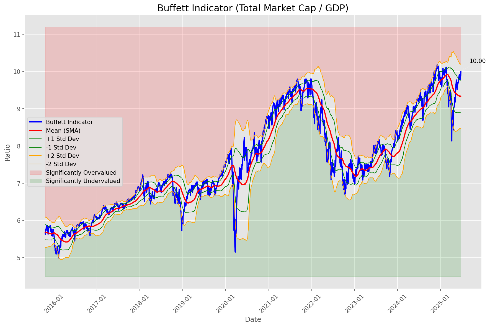
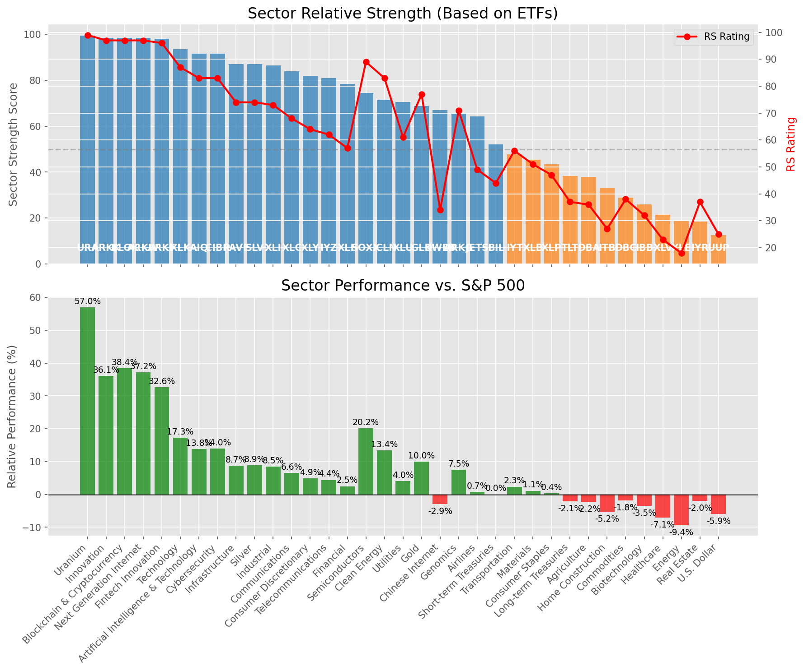

# **Daily Relative Strength Report**

**Date:** 2025-06-26

## **Market Valuation (Buffett Indicator)**

| Metric | Value |
|--------|-------|
| **Market Valuation** | **Overvalued** |
| **Current Ratio** | 10.07 |
| **Historical Mean** | 9.34 |
| **Standard Deviation** | 0.44 |
| **Z-Score (StdDev from Mean)** | 1.47 |
| **Total Market Cap** | $301.73 trillion |
| **GDP** | $29.96 trillion |

## **Market Insights**

### **Market is Overvalued**

The market appears to be trading above historical average valuations. While not at extreme levels, this suggests more modest future returns may be expected. Investors should:

- Focus on companies with reasonable valuations relative to their growth
- Be more selective with new positions
- Look for stocks showing relative strength within their sectors
- Consider trimming positions in extremely overvalued names

Historically, periods of mild overvaluation can persist for extended periods, but returns tend to be below average.

### **Buffett Indicator Overview**

The Buffett Indicator (Total Market Cap / GDP) is a measure of the stock market's valuation relative to the size of the economy. It is named after Warren Buffett, who described it as "probably the best single measure of where valuations stand at any given moment."

- **Values above +2 standard deviations:** Market significantly overvalued
- **Values above +1 standard deviation:** Market overvalued
- **Values between -1 and +1 standard deviations:** Market fairly valued
- **Values below -1 standard deviation:** Market undervalued
- **Values below -2 standard deviations:** Market significantly undervalued

---

## **Sector Relative Strength**

Based on William O'Neil's Relative Strength Methodology

| ETF | Strength | RS Rating | Performance | Above Key MAs | Trend | Sector |
|-----|----------|-----------|-------------|--------------|-------|--------|
| [URA](https://www.tradingview.com/chart/?symbol=URA) | 99.5 | 99.0 | 59.14% | 10d ✓, 50d ✓, 200d ✓ | ↗️ | Uranium |
| [ARKW](https://www.tradingview.com/chart/?symbol=ARKW) | 99.0 | 98.0 | 45.28% | 10d ✓, 50d ✓, 200d ✓ | ↗️ | Next Generation Internet |
| [ARKF](https://www.tradingview.com/chart/?symbol=ARKF) | 98.5 | 97.0 | 39.50% | 10d ✓, 50d ✓, 200d ✓ | ↗️ | Fintech Innovation |
| [BLOK](https://www.tradingview.com/chart/?symbol=BLOK) | 98.5 | 97.0 | 40.20% | 10d ✓, 50d ✓, 200d ✓ | ↗️ | Blockchain & Cryptocurrency |
| [ARKK](https://www.tradingview.com/chart/?symbol=ARKK) | 98.0 | 96.0 | 37.35% | 10d ✓, 50d ✓, 200d ✓ | ↗️ | Innovation |
| [XLK](https://www.tradingview.com/chart/?symbol=XLK) | 93.0 | 86.0 | 17.62% | 10d ✓, 50d ✓, 200d ✓ | ↗️ | Technology |
| [AIQ](https://www.tradingview.com/chart/?symbol=AIQ) | 91.5 | 83.0 | 14.61% | 10d ✓, 50d ✓, 200d ✓ | ↗️ | Artificial Intelligence & Technology |
| [CIBR](https://www.tradingview.com/chart/?symbol=CIBR) | 91.0 | 82.0 | 14.11% | 10d ✓, 50d ✓, 200d ✓ | ↗️ | Cybersecurity |
| [PAVE](https://www.tradingview.com/chart/?symbol=PAVE) | 89.0 | 78.0 | 11.47% | 10d ✓, 50d ✓, 200d ✓ | ↗️ | Infrastructure |
| [XLI](https://www.tradingview.com/chart/?symbol=XLI) | 86.0 | 72.0 | 8.84% | 10d ✓, 50d ✓, 200d ✓ | ↗️ | Industrial |
| [SLV](https://www.tradingview.com/chart/?symbol=SLV) | 86.0 | 72.0 | 8.91% | 10d ✓, 50d ✓, 200d ✓ | ↗️ | Silver |
| [XLC](https://www.tradingview.com/chart/?symbol=XLC) | 84.0 | 68.0 | 7.21% | 10d ✓, 50d ✓, 200d ✓ | ↗️ | Communications |
| [XLY](https://www.tradingview.com/chart/?symbol=XLY) | 82.0 | 64.0 | 5.74% | 10d ✓, 50d ✓, 200d ✓ | ↗️ | Consumer Discretionary |
| [IYZ](https://www.tradingview.com/chart/?symbol=IYZ) | 81.0 | 62.0 | 5.34% | 10d ✓, 50d ✓, 200d ✓ | ↗️ | Telecommunications |
| [GLD](https://www.tradingview.com/chart/?symbol=GLD) | 77.6 | 75.0 | 10.22% | 10d ✗, 50d ✓, 200d ✓ | ↗️ | Gold |
| [XLF](https://www.tradingview.com/chart/?symbol=XLF) | 77.5 | 55.0 | 2.86% | 10d ✓, 50d ✓, 200d ✓ | ↗️ | Financial |
| [SOXX](https://www.tradingview.com/chart/?symbol=SOXX) | 74.0 | 88.0 | 20.41% | 10d ✓, 50d ✓, 200d ✓ | ↘️ | Semiconductors |
| [ICLN](https://www.tradingview.com/chart/?symbol=ICLN) | 70.5 | 81.0 | 13.79% | 10d ✓, 50d ✓, 200d ✓ | ↘️ | Clean Energy |
| [XLU](https://www.tradingview.com/chart/?symbol=XLU) | 69.6 | 59.0 | 4.34% | 10d ✗, 50d ✓, 200d ✓ | ↗️ | Utilities |
| [ARKG](https://www.tradingview.com/chart/?symbol=ARKG) | 66.5 | 73.0 | 9.05% | 10d ✓, 50d ✓, 200d ✓ | ↘️ | Genomics |
| [KWEB](https://www.tradingview.com/chart/?symbol=KWEB) | 66.0 | 32.0 | -3.01% | 10d ✓, 50d ✓, 200d ✓ | ↗️ | Chinese Internet |
| [JETS](https://www.tradingview.com/chart/?symbol=JETS) | 64.3 | 49.0 | 1.32% | 10d ✓, 50d ✓, 200d ✗ | ↗️ | Airlines |
| [IYT](https://www.tradingview.com/chart/?symbol=IYT) | 59.5 | 59.0 | 4.10% | 10d ✓, 50d ✓, 200d ✓ | ↘️ | Transportation |
| [BIL](https://www.tradingview.com/chart/?symbol=BIL) | 51.0 | 42.0 | 0.01% | 10d ✓, 50d ✓, 200d ✓ | ↘️ | Short-term Treasuries |
| [XLB](https://www.tradingview.com/chart/?symbol=XLB) | 44.3 | 49.0 | 1.18% | 10d ✓, 50d ✓, 200d ✗ | ↘️ | Materials |
| [XLP](https://www.tradingview.com/chart/?symbol=XLP) | 42.0 | 44.0 | 0.21% | 10d ✗, 50d ✗, 200d ✗ | ↗️ | Consumer Staples |
| [TLT](https://www.tradingview.com/chart/?symbol=TLT) | 37.8 | 36.0 | -1.66% | 10d ✓, 50d ✓, 200d ✗ | ↘️ | Long-term Treasuries |
| [DBA](https://www.tradingview.com/chart/?symbol=DBA) | 37.0 | 34.0 | -2.32% | 10d ✗, 50d ✗, 200d ✗ | ↗️ | Agriculture |
| [IBB](https://www.tradingview.com/chart/?symbol=IBB) | 35.3 | 31.0 | -3.30% | 10d ✓, 50d ✓, 200d ✗ | ↘️ | Biotechnology |
| [ITB](https://www.tradingview.com/chart/?symbol=ITB) | 32.8 | 26.0 | -5.02% | 10d ✓, 50d ✓, 200d ✗ | ↘️ | Home Construction |
| [DBC](https://www.tradingview.com/chart/?symbol=DBC) | 28.4 | 37.0 | -1.42% | 10d ✗, 50d ✓, 200d ✗ | ↘️ | Commodities |
| [IYR](https://www.tradingview.com/chart/?symbol=IYR) | 18.5 | 37.0 | -1.60% | 10d ✗, 50d ✗, 200d ✗ | ↘️ | Real Estate |
| [XLE](https://www.tradingview.com/chart/?symbol=XLE) | 18.4 | 17.0 | -8.85% | 10d ✗, 50d ✓, 200d ✗ | ↘️ | Energy |
| [UUP](https://www.tradingview.com/chart/?symbol=UUP) | 12.0 | 24.0 | -5.88% | 10d ✗, 50d ✗, 200d ✗ | ↘️ | U.S. Dollar |
| [XLV](https://www.tradingview.com/chart/?symbol=XLV) | 10.0 | 20.0 | -7.47% | 10d ✗, 50d ✗, 200d ✗ | ↘️ | Healthcare |

### **Sector ETF Performance Interpretation**

This table shows the relative strength metrics for different market sectors based on their representative ETFs:

- **ETF**: The ETF used to measure sector performance (click for chart)
- **Strength**: Overall sector strength score (0-100) combining multiple factors
- **RS Rating**: O'Neil RS rating of the sector ETF
- **Performance**: Performance of the sector ETF relative to SPY
- **Above Key MAs**: Whether the ETF is trading above its 10, 50, and 200-day moving averages
- **Trend**: Whether the sector is in an uptrend (↗️) or downtrend (↘️)

### **Current Sector Leadership**

The current market leadership is coming from the following sectors: **Uranium, Next Generation Internet, Fintech Innovation**.

The **Uranium** sector (represented by **URA**) is showing particularly strong relative strength with an RS rating of 99.0 and performance of 59.14% vs. the S&P 500. This sector is trading above its 10-day, 50-day, 200-day moving average(s). Investors should consider focusing on high RS stocks within these leading sectors for potential outperformance.

---

## **Buy Recommendations**

The following 91 stocks show exceptional relative strength:

| RS Rating | Buy Score | Current Price | Chart | Name | Ticker |
|-----------|-----------|---------------|-------|------|--------|
| 100 | 100 | $150.57 | [Chart](https://www.tradingview.com/chart/?symbol=CLS) | Celestica, Inc. | CLS |
| 100 | 100 | $83.94 | [Chart](https://www.tradingview.com/chart/?symbol=HOOD) | Robinhood Markets, Inc. Class A Common Stock | HOOD |
| 100 | 100 | $83.94 | [Chart](https://www.tradingview.com/chart/?symbol=SLNO) | Soleno Therapeutics, Inc. Common Stock | SLNO |
| 100 | 100 | $243.59 | [Chart](https://www.tradingview.com/chart/?symbol=DAVE) | Dave Inc. Class A Common Stock | DAVE |
| 100 | 100 | $163.31 | [Chart](https://www.tradingview.com/chart/?symbol=SEZL) | Sezzle Inc. Common Stock | SEZL |
| 100 | 100 | $105.16 | [Chart](https://www.tradingview.com/chart/?symbol=RBLX) | Roblox Corporation | RBLX |
| 100 | 100 | $214.97 | [Chart](https://www.tradingview.com/chart/?symbol=AGX) | Argan, Inc | AGX |
| 99 | 100 | $72.60 | [Chart](https://www.tradingview.com/chart/?symbol=ODD) | ODDITY Tech Ltd. Class A Ordinary Shares | ODD |
| 99 | 100 | $144.52 | [Chart](https://www.tradingview.com/chart/?symbol=PLTR) | Palantir Technologies Inc. Class A Common Stock | PLTR |
| 99 | 100 | $506.45 | [Chart](https://www.tradingview.com/chart/?symbol=GEV) | GE Vernova Inc. | GEV |
| 99 | 100 | $190.73 | [Chart](https://www.tradingview.com/chart/?symbol=NET) | Cloudflare, Inc. Class A common stock, par value $0.001 per share | NET |
| 99 | 100 | $161.98 | [Chart](https://www.tradingview.com/chart/?symbol=NRG) | NRG Energy, Inc. | NRG |
| 99 | 100 | $43.84 | [Chart](https://www.tradingview.com/chart/?symbol=FARO) | Faro Technologies Inc | FARO |
| 98 | 100 | $152.51 | [Chart](https://www.tradingview.com/chart/?symbol=IRTC) | iRhythm Technologies, Inc | IRTC |
| 98 | 100 | $216.85 | [Chart](https://www.tradingview.com/chart/?symbol=JBL) | Jabil Inc. | JBL |
| 98 | 100 | $293.04 | [Chart](https://www.tradingview.com/chart/?symbol=TLN) | Talen Energy Corporation Common Stock | TLN |
| 97 | 100 | $21.43 | [Chart](https://www.tradingview.com/chart/?symbol=MIR) | Mirion Technologies, Inc. | MIR |
| 97 | 100 | $49.90 | [Chart](https://www.tradingview.com/chart/?symbol=ARKF) | ARK Fintech Innovation ETF | ARKF |
| 97 | 100 | $270.45 | [Chart](https://www.tradingview.com/chart/?symbol=CRS) | Carpenter Technology Corp | CRS |
| 97 | 100 | $28.35 | [Chart](https://www.tradingview.com/chart/?symbol=CRK) | Comstock Resources, Inc. | CRK |
| 97 | 100 | $801.56 | [Chart](https://www.tradingview.com/chart/?symbol=AXON) | Axon Enterprise, Inc. Common Stock | AXON |
| 97 | 100 | $150.78 | [Chart](https://www.tradingview.com/chart/?symbol=COOP) | Mr. Cooper Group Inc. Common Stock | COOP |
| 96 | 100 | $35.59 | [Chart](https://www.tradingview.com/chart/?symbol=MP) | MP Materials Corp. | MP |
| 96 | 100 | $504.11 | [Chart](https://www.tradingview.com/chart/?symbol=CRWD) | CrowdStrike Holdings, Inc. Class A Common Stock | CRWD |
| 96 | 100 | $774.66 | [Chart](https://www.tradingview.com/chart/?symbol=SPOT) | Spotify Technology S.A. | SPOT |
| 96 | 100 | $37.80 | [Chart](https://www.tradingview.com/chart/?symbol=AS) | Amer Sports, Inc. | AS |
| 96 | 100 | $52.56 | [Chart](https://www.tradingview.com/chart/?symbol=BBW) | Build-A-Bear Workshop, Inc. | BBW |
| 95 | 100 | $176.76 | [Chart](https://www.tradingview.com/chart/?symbol=HWM) | Howmet Aerospace Inc. | HWM |
| 95 | 100 | $295.47 | [Chart](https://www.tradingview.com/chart/?symbol=RCL) | Royal Caribbean Group | RCL |
| 95 | 100 | $72.16 | [Chart](https://www.tradingview.com/chart/?symbol=ULS) | UL Solutions Inc. | ULS |
| 95 | 100 | $92.17 | [Chart](https://www.tradingview.com/chart/?symbol=RBRK) | Rubrik, Inc. | RBRK |
| 95 | 100 | $1303.90 | [Chart](https://www.tradingview.com/chart/?symbol=NFLX) | NetFlix Inc | NFLX |
| 95 | 100 | $43.73 | [Chart](https://www.tradingview.com/chart/?symbol=CHWY) | Chewy, Inc. | CHWY |
| 94 | 100 | $247.32 | [Chart](https://www.tradingview.com/chart/?symbol=WWD) | Woodward, Inc. | WWD |
| 94 | 100 | $55.73 | [Chart](https://www.tradingview.com/chart/?symbol=AKRO) | Akero Therapeutics, Inc. Common Stock | AKRO |
| 93 | 100 | $60.30 | [Chart](https://www.tradingview.com/chart/?symbol=SHLD) | Global X Defense Tech ETF | SHLD |
| 93 | 100 | $73.40 | [Chart](https://www.tradingview.com/chart/?symbol=CORT) | Corcept Therapeutics Inc. | CORT |
| 92 | 100 | $20.70 | [Chart](https://www.tradingview.com/chart/?symbol=SPNT) | SiriusPoint Ltd. | SPNT |
| 92 | 100 | $104.67 | [Chart](https://www.tradingview.com/chart/?symbol=JCI) | Johnson Controls International plc | JCI |
| 92 | 100 | $39.85 | [Chart](https://www.tradingview.com/chart/?symbol=LTM) | LATAM Airlines Group S.A. American Depositary Shares (each representing two thousand (2,000) shares of Common Stock) | LTM |
| 91 | 100 | $238.45 | [Chart](https://www.tradingview.com/chart/?symbol=DASH) | DoorDash, Inc. Class A Common Stock | DASH |
| 91 | 100 | $97.05 | [Chart](https://www.tradingview.com/chart/?symbol=SANM) | Sanmina  Corp | SANM |
| 91 | 100 | $61.10 | [Chart](https://www.tradingview.com/chart/?symbol=IBIT) | iShares Bitcoin Trust ETF | IBIT |
| 91 | 100 | $44.76 | [Chart](https://www.tradingview.com/chart/?symbol=BBIO) | BridgeBio Pharma, Inc. Common Stock | BBIO |
| 91 | 100 | $165.44 | [Chart](https://www.tradingview.com/chart/?symbol=CAH) | Cardinal Health, Inc. | CAH |
| 91 | 100 | $133.21 | [Chart](https://www.tradingview.com/chart/?symbol=OLLI) | Ollie's Bargain Outlet Holdings, Inc. Common Stock | OLLI |
| 91 | 100 | $22.88 | [Chart](https://www.tradingview.com/chart/?symbol=BTSG) | BrightSpring Health Services, Inc. Common Stock | BTSG |
| 90 | 100 | $50.71 | [Chart](https://www.tradingview.com/chart/?symbol=INOD) | Innodata Inc. | INOD |
| 90 | 100 | $41.82 | [Chart](https://www.tradingview.com/chart/?symbol=KD) | Kyndryl Holdings, Inc. | KD |
| 90 | 100 | $158.57 | [Chart](https://www.tradingview.com/chart/?symbol=SE) | Sea Limited American Depositary Shares, each representing one Class A Ordinary Share | SE |
| 90 | 100 | $252.33 | [Chart](https://www.tradingview.com/chart/?symbol=GE) | GE Aerospace | GE |
| 90 | 100 | $53.32 | [Chart](https://www.tradingview.com/chart/?symbol=IBKR) | Interactive Brokers Group, Inc. Class A Common Stock | IBKR |
| 90 | 100 | $26.82 | [Chart](https://www.tradingview.com/chart/?symbol=UVE) | UNIVERSAL INSURANCE HLDG, INC. | UVE |
| 89 | 100 | $29.90 | [Chart](https://www.tradingview.com/chart/?symbol=DB) | Deutsche Bank Aktiengesellschaft | DB |
| 89 | 100 | $61.04 | [Chart](https://www.tradingview.com/chart/?symbol=CAKE) | Cheesecake Factory (The) | CAKE |
| 89 | 100 | $27.12 | [Chart](https://www.tradingview.com/chart/?symbol=SRAD) | Sportradar Group AG Class A Ordinary Shares | SRAD |
| 88 | 100 | $121.05 | [Chart](https://www.tradingview.com/chart/?symbol=EHC) | Encompass Health Corporation Common Stock | EHC |
| 88 | 100 | $63.38 | [Chart](https://www.tradingview.com/chart/?symbol=CHEF) | The Chef's Warehouse Inc | CHEF |
| 88 | 100 | $35.99 | [Chart](https://www.tradingview.com/chart/?symbol=AHR) | American Healthcare REIT, Inc. | AHR |
| 89 | 99 | $138.59 | [Chart](https://www.tradingview.com/chart/?symbol=PPA) | Invesco Aerospace & Defense ETF | PPA |
| 86 | 99 | $181.38 | [Chart](https://www.tradingview.com/chart/?symbol=EAT) | Brinker International, Inc. | EAT |
| 87 | 98 | $74.36 | [Chart](https://www.tradingview.com/chart/?symbol=CTVA) | Corteva, Inc. Common Stock | CTVA |
| 87 | 98 | $5627.95 | [Chart](https://www.tradingview.com/chart/?symbol=BKNG) | Booking Holdings Inc. Common Stock | BKNG |
| 86 | 98 | $86.46 | [Chart](https://www.tradingview.com/chart/?symbol=TPR) | Tapestry, Inc. Common Stock | TPR |
| 85 | 98 | $43.11 | [Chart](https://www.tradingview.com/chart/?symbol=EXEL) | Exelixis Inc | EXEL |
| 85 | 98 | $292.00 | [Chart](https://www.tradingview.com/chart/?symbol=IBM) | International Business Machines Corporation | IBM |
| 86 | 97 | $184.37 | [Chart](https://www.tradingview.com/chart/?symbol=ITA) | iShares U.S. Aerospace & Defense ETF | ITA |
| 85 | 97 | $308.41 | [Chart](https://www.tradingview.com/chart/?symbol=PODD) | Insulet Corporation | PODD |
| 84 | 97 | $28.10 | [Chart](https://www.tradingview.com/chart/?symbol=FMS) | Fresenius Medical Care AG | FMS |
| 85 | 96 | $76.54 | [Chart](https://www.tradingview.com/chart/?symbol=USFD) | US Foods Holding Corp. | USFD |
| 85 | 96 | $104.31 | [Chart](https://www.tradingview.com/chart/?symbol=FWONK) | Liberty Media Corporation Series C Liberty Formula One Common Stock | FWONK |
| 84 | 96 | $402.63 | [Chart](https://www.tradingview.com/chart/?symbol=CYBR) | CyberArk Software Ltd. | CYBR |
| 82 | 96 | $90.84 | [Chart](https://www.tradingview.com/chart/?symbol=SNEX) | StoneX Group Inc. Common Stock | SNEX |
| 85 | 95 | $111.19 | [Chart](https://www.tradingview.com/chart/?symbol=SPMO) | Invesco S&P 500 Momentum ETF | SPMO |
| 84 | 95 | $146.99 | [Chart](https://www.tradingview.com/chart/?symbol=LYV) | Live Nation Entertainment Inc. | LYV |
| 83 | 95 | $79.17 | [Chart](https://www.tradingview.com/chart/?symbol=LLYVK) | Liberty Media Corporation Series C Liberty Live Common Stock | LLYVK |
| 82 | 95 | $176.30 | [Chart](https://www.tradingview.com/chart/?symbol=TKO) | TKO Group Holdings, Inc. | TKO |
| 82 | 95 | $282.89 | [Chart](https://www.tradingview.com/chart/?symbol=VRSN) | VeriSign Inc | VRSN |
| 82 | 95 | $18.37 | [Chart](https://www.tradingview.com/chart/?symbol=BCS) | Barclays PLC | BCS |
| 85 | 94 | $210.59 | [Chart](https://www.tradingview.com/chart/?symbol=COF) | Capital One Financial | COF |
| 84 | 94 | $244.03 | [Chart](https://www.tradingview.com/chart/?symbol=WTS) | Watts Water Technologies, Inc. Class A | WTS |
| 82 | 94 | $74.88 | [Chart](https://www.tradingview.com/chart/?symbol=CIBR) | First Trust Exchange-Traded Fund II First Trust NASDAQ Cybersecurity ETF | CIBR |
| 81 | 94 | $43.82 | [Chart](https://www.tradingview.com/chart/?symbol=VIRT) | Virtu Financial, Inc. Class A | VIRT |
| 80 | 94 | $20.15 | [Chart](https://www.tradingview.com/chart/?symbol=KT) | KT Corp. | KT |
| 81 | 93 | $43.34 | [Chart](https://www.tradingview.com/chart/?symbol=EWP) | iShares MSCI Spain ETF | EWP |
| 80 | 93 | $22.70 | [Chart](https://www.tradingview.com/chart/?symbol=LAUR) | Laureate Education, Inc. Common Stock | LAUR |
| 83 | 92 | $123.47 | [Chart](https://www.tradingview.com/chart/?symbol=FUTU) | Futu Holdings Limited American Depositary Shares | FUTU |
| 82 | 92 | $65.23 | [Chart](https://www.tradingview.com/chart/?symbol=SLF) | Sun Life Financial Inc. | SLF |
| 82 | 92 | $88.33 | [Chart](https://www.tradingview.com/chart/?symbol=NDAQ) | Nasdaq, Inc. Common Stock | NDAQ |
| 82 | 92 | $28.16 | [Chart](https://www.tradingview.com/chart/?symbol=NTGR) | NETGEAR, Inc. | NTGR |
| 81 | 91 | $88.94 | [Chart](https://www.tradingview.com/chart/?symbol=SEIC) | SEI Investments Co | SEIC |

---

## **Sell Recommendations**

The following 96 stocks show deteriorating relative strength:

| RS Rating | Sell Score | Current Price | Chart | Name | Ticker |
|-----------|------------|---------------|-------|------|--------|
| 1 | 100 | $10.09 | [Chart](https://www.tradingview.com/chart/?symbol=HIBS) | Direxion Daily S&P 500 High Beta Bear 3X Shares | HIBS |
| 1 | 100 | $27.33 | [Chart](https://www.tradingview.com/chart/?symbol=TECS) | Direxion Daily Technology Bear 3x Shares | TECS |
| 1 | 100 | $14.80 | [Chart](https://www.tradingview.com/chart/?symbol=NVDS) | Investment Managers Series Trust II Tradr 1.5X Short NVDA Daily ETF | NVDS |
| 1 | 100 | $13.21 | [Chart](https://www.tradingview.com/chart/?symbol=RXST) | RxSight, Inc. Common Stock | RXST |
| 1 | 100 | $27.89 | [Chart](https://www.tradingview.com/chart/?symbol=HELE) | Helen Of Troy Ltd | HELE |
| 2 | 100 | $49.88 | [Chart](https://www.tradingview.com/chart/?symbol=LGIH) | LGI Homes, Inc. | LGIH |
| 2 | 100 | $25.84 | [Chart](https://www.tradingview.com/chart/?symbol=QID) | ProShares UltraShort QQQ | QID |
| 2 | 100 | $11.72 | [Chart](https://www.tradingview.com/chart/?symbol=NRIX) | Nurix Therapeutics, Inc. Common stock | NRIX |
| 3 | 100 | $35.34 | [Chart](https://www.tradingview.com/chart/?symbol=SARK) | Investment Managers Series Trust II Tradr 1X Short Innovation Daily ETF | SARK |
| 3 | 100 | $31.32 | [Chart](https://www.tradingview.com/chart/?symbol=ZD) | Ziff Davis, Inc. Common Stock | ZD |
| 3 | 100 | $44.72 | [Chart](https://www.tradingview.com/chart/?symbol=LINE) | Lineage, Inc. Common Stock | LINE |
| 4 | 100 | $12.02 | [Chart](https://www.tradingview.com/chart/?symbol=TZA) | Direxion Daily Small Cap Bear 3x Shares | TZA |
| 4 | 100 | $23.17 | [Chart](https://www.tradingview.com/chart/?symbol=JANX) | Janux Therapeutics, Inc. Common Stock | JANX |
| 4 | 100 | $13.90 | [Chart](https://www.tradingview.com/chart/?symbol=INMD) | InMode Ltd. Ordinary Shares | INMD |
| 4 | 100 | $21.54 | [Chart](https://www.tradingview.com/chart/?symbol=AMRK) | A-Mark Precious Metals, Inc. | AMRK |
| 5 | 100 | $19.71 | [Chart](https://www.tradingview.com/chart/?symbol=BITI) | ProShares Short Bitcoin ETF | BITI |
| 5 | 100 | $15.10 | [Chart](https://www.tradingview.com/chart/?symbol=PD) | PagerDuty, Inc. | PD |
| 5 | 100 | $10.60 | [Chart](https://www.tradingview.com/chart/?symbol=OEC) | Orion S.A. | OEC |
| 6 | 100 | $26.46 | [Chart](https://www.tradingview.com/chart/?symbol=WMG) | Warner Music Group Corp. Class A Common Stock | WMG |
| 6 | 100 | $79.33 | [Chart](https://www.tradingview.com/chart/?symbol=LNTH) | Lantheus Holdings, Inc | LNTH |
| 6 | 100 | $69.02 | [Chart](https://www.tradingview.com/chart/?symbol=WD) | Walker & Dunlop, Inc. | WD |
| 6 | 100 | $24.61 | [Chart](https://www.tradingview.com/chart/?symbol=ASTH) | Astrana Health Inc. Common Stock | ASTH |
| 6 | 100 | $17.50 | [Chart](https://www.tradingview.com/chart/?symbol=AMTB) | Amerant Bancorp Inc. | AMTB |
| 7 | 100 | $30.66 | [Chart](https://www.tradingview.com/chart/?symbol=FUN) | Six Flags Entertainment Corporation | FUN |
| 7 | 100 | $22.68 | [Chart](https://www.tradingview.com/chart/?symbol=RYN) | Rayonier Inc. | RYN |
| 7 | 100 | $17.25 | [Chart](https://www.tradingview.com/chart/?symbol=CODI) | Compass Diversified | CODI |
| 8 | 100 | $20.43 | [Chart](https://www.tradingview.com/chart/?symbol=SPT) | Sprout Social, Inc Class A Common Stock | SPT |
| 8 | 100 | $11.09 | [Chart](https://www.tradingview.com/chart/?symbol=M) | Macy's Inc. | M |
| 9 | 100 | $17.79 | [Chart](https://www.tradingview.com/chart/?symbol=DJT) | Trump Media & Technology Group Corp. Common Stock | DJT |
| 10 | 100 | $43.55 | [Chart](https://www.tradingview.com/chart/?symbol=SDOW) | ProShares UltraPro Short Dow 30 | SDOW |
| 12 | 100 | $30.12 | [Chart](https://www.tradingview.com/chart/?symbol=CRNX) | Crinetics Pharmaceuticals, Inc. | CRNX |
| 12 | 100 | $10.70 | [Chart](https://www.tradingview.com/chart/?symbol=ABR) | Arbor Realty Trust, Inc. | ABR |
| 14 | 100 | $86.67 | [Chart](https://www.tradingview.com/chart/?symbol=BIDU) | Baidu, Inc. | BIDU |
| 3 | 99 | $12.38 | [Chart](https://www.tradingview.com/chart/?symbol=ERII) | Energy Recovery, Inc. | ERII |
| 4 | 99 | $17.33 | [Chart](https://www.tradingview.com/chart/?symbol=SRTY) | ProShares UltraPro Short Russell2000 | SRTY |
| 7 | 99 | $51.60 | [Chart](https://www.tradingview.com/chart/?symbol=FBIN) | Fortune Brands Innovations, Inc. | FBIN |
| 8 | 99 | $16.12 | [Chart](https://www.tradingview.com/chart/?symbol=MLNK) | MeridianLink, Inc. | MLNK |
| 8 | 99 | $10.15 | [Chart](https://www.tradingview.com/chart/?symbol=LBTYK) | Liberty Global Ltd. Class C Common Shares | LBTYK |
| 2 | 98 | $11.62 | [Chart](https://www.tradingview.com/chart/?symbol=VFC) | V.F. Corporation | VFC |
| 4 | 98 | $10.61 | [Chart](https://www.tradingview.com/chart/?symbol=SONO) | Sonos, Inc. Common Stock | SONO |
| 5 | 98 | $65.68 | [Chart](https://www.tradingview.com/chart/?symbol=WK) | Workiva Inc. | WK |
| 9 | 98 | $50.98 | [Chart](https://www.tradingview.com/chart/?symbol=AMWD) | American Woodmark Corp | AMWD |
| 11 | 98 | $10.02 | [Chart](https://www.tradingview.com/chart/?symbol=LBTYA) | Liberty Global Ltd. Class A Common Shares | LBTYA |
| 14 | 98 | $17.69 | [Chart](https://www.tradingview.com/chart/?symbol=ZTO) | ZTO Express (Cayman) Inc. American Depositary Shares, each representing one Class A ordinary share | ZTO |
| 6 | 97 | $130.33 | [Chart](https://www.tradingview.com/chart/?symbol=INSP) | Inspire Medical Systems, Inc. | INSP |
| 10 | 96 | $52.06 | [Chart](https://www.tradingview.com/chart/?symbol=CNMD) | CONMED Corporation | CNMD |
| 7 | 95 | $28.52 | [Chart](https://www.tradingview.com/chart/?symbol=OMCL) | Omnicell Inc | OMCL |
| 13 | 95 | $102.91 | [Chart](https://www.tradingview.com/chart/?symbol=MHK) | Mohawk Industries, Inc. | MHK |
| 10 | 94 | $12.49 | [Chart](https://www.tradingview.com/chart/?symbol=WSR) | Whitestone REIT | WSR |
| 11 | 94 | $129.24 | [Chart](https://www.tradingview.com/chart/?symbol=ICUI) | ICU Medical Inc | ICUI |
| 21 | 94 | $10.27 | [Chart](https://www.tradingview.com/chart/?symbol=NMZ) | Nuveen Municipal High Income Opportunity Fund | NMZ |
| 22 | 94 | $15.48 | [Chart](https://www.tradingview.com/chart/?symbol=HQH) | abrdn Healthcare Investors | HQH |
| 10 | 93 | $101.84 | [Chart](https://www.tradingview.com/chart/?symbol=DECK) | Deckers Outdoor Corp | DECK |
| 16 | 93 | $66.05 | [Chart](https://www.tradingview.com/chart/?symbol=MTH) | Meritage Homes Corporation | MTH |
| 17 | 92 | $99.76 | [Chart](https://www.tradingview.com/chart/?symbol=CROX) | Crocs, Inc. | CROX |
| 17 | 92 | $137.66 | [Chart](https://www.tradingview.com/chart/?symbol=LSTR) | Landstar System Inc | LSTR |
| 22 | 92 | $12.88 | [Chart](https://www.tradingview.com/chart/?symbol=MRTN) | Marten Transport Ltd | MRTN |
| 13 | 91 | $202.32 | [Chart](https://www.tradingview.com/chart/?symbol=EXP) | Eagle Materials, Inc. | EXP |
| 22 | 91 | $29.84 | [Chart](https://www.tradingview.com/chart/?symbol=RNA) | Avidity Biosciences, Inc. Common Stock | RNA |
| 16 | 89 | $28.43 | [Chart](https://www.tradingview.com/chart/?symbol=APPN) | Appian Corporation Class A Common Stock | APPN |
| 18 | 89 | $93.25 | [Chart](https://www.tradingview.com/chart/?symbol=CHRW) | C.H. Robinson Worldwide, Inc. | CHRW |
| 22 | 89 | $21.43 | [Chart](https://www.tradingview.com/chart/?symbol=KIDS) | OrthoPediatrics Corp. Common Stock | KIDS |
| 13 | 88 | $20.21 | [Chart](https://www.tradingview.com/chart/?symbol=RVLV) | Revolve Group, Inc. | RVLV |
| 25 | 88 | $10.42 | [Chart](https://www.tradingview.com/chart/?symbol=MYI) | BLACKROCK MUNIYIELD QUALITY FUND III, INC. | MYI |
| 15 | 87 | $290.73 | [Chart](https://www.tradingview.com/chart/?symbol=MOH) | Molina Healthcare, Inc. | MOH |
| 16 | 87 | $294.84 | [Chart](https://www.tradingview.com/chart/?symbol=POOL) | Pool Corporation | POOL |
| 16 | 87 | $46.20 | [Chart](https://www.tradingview.com/chart/?symbol=GLPI) | Gaming and Leisure Properties, Inc. | GLPI |
| 21 | 87 | $25.84 | [Chart](https://www.tradingview.com/chart/?symbol=ATHM) | Autohome Inc. American Depositary Shares, each representing four Class A Ordinary Shares | ATHM |
| 17 | 86 | $18.05 | [Chart](https://www.tradingview.com/chart/?symbol=S) | SentinelOne, Inc. | S |
| 21 | 86 | $12.81 | [Chart](https://www.tradingview.com/chart/?symbol=UTZ) | Utz Brands, Inc. | UTZ |
| 16 | 85 | $200.87 | [Chart](https://www.tradingview.com/chart/?symbol=AAPL) | Apple Inc. | AAPL |
| 18 | 85 | $40.07 | [Chart](https://www.tradingview.com/chart/?symbol=SH) | ProShares Short S&P500 | SH |
| 21 | 85 | $73.61 | [Chart](https://www.tradingview.com/chart/?symbol=TNET) | TRINET GROUP, INC. | TNET |
| 32 | 84 | $11.82 | [Chart](https://www.tradingview.com/chart/?symbol=NVG) | Nuveen AMT-Free Municipal Credit Income Fund | NVG |
| 20 | 83 | $25.02 | [Chart](https://www.tradingview.com/chart/?symbol=DXD) | ProShares UltraShort Dow 30 | DXD |
| 22 | 83 | $10.30 | [Chart](https://www.tradingview.com/chart/?symbol=PFLT) | PennantPark Floating Rate Capital Ltd. | PFLT |
| 23 | 82 | $11.12 | [Chart](https://www.tradingview.com/chart/?symbol=SD) | SandRidge Energy, Inc. | SD |
| 29 | 82 | $75.77 | [Chart](https://www.tradingview.com/chart/?symbol=CNS) | Cohen & Steers Inc. | CNS |
| 20 | 81 | $40.63 | [Chart](https://www.tradingview.com/chart/?symbol=NBTB) | NBT Bancorp Inc | NBTB |
| 23 | 81 | $11.50 | [Chart](https://www.tradingview.com/chart/?symbol=PTLO) | Portillo's Inc. Class A Common Stock | PTLO |
| 24 | 81 | $42.65 | [Chart](https://www.tradingview.com/chart/?symbol=SW) | Smurfit Westrock plc | SW |
| 21 | 80 | $17.56 | [Chart](https://www.tradingview.com/chart/?symbol=DIV) | Global X SuperDividend U.S. ETF | DIV |
| 32 | 80 | $25.89 | [Chart](https://www.tradingview.com/chart/?symbol=DOG) | ProShares Short Dow30 | DOG |
| 28 | 77 | $45.54 | [Chart](https://www.tradingview.com/chart/?symbol=ABM) | ABM Industries, Inc. | ABM |
| 31 | 77 | $16.99 | [Chart](https://www.tradingview.com/chart/?symbol=STAA) | Staar Surgical Co | STAA |
| 25 | 76 | $26.36 | [Chart](https://www.tradingview.com/chart/?symbol=DRV) | Direxion Daily Real Estate Bear 3X Shares | DRV |
| 31 | 76 | $15.31 | [Chart](https://www.tradingview.com/chart/?symbol=PLSE) | Pulse Biosciences, Inc Common Stock (DE) | PLSE |
| 27 | 75 | $32.85 | [Chart](https://www.tradingview.com/chart/?symbol=INVH) | Invitation Homes Inc. Common Stock | INVH |
| 30 | 75 | $48.65 | [Chart](https://www.tradingview.com/chart/?symbol=KNG) | FT Vest S&P 500 Dividend Aristocrats Target Income ETF | KNG |
| 38 | 74 | $52.99 | [Chart](https://www.tradingview.com/chart/?symbol=LW) | Lamb Weston Holdings, Inc. | LW |
| 34 | 73 | $26.72 | [Chart](https://www.tradingview.com/chart/?symbol=FREL) | Fidelity MSCI Real Estate Index ETF | FREL |
| 30 | 72 | $35.91 | [Chart](https://www.tradingview.com/chart/?symbol=AMH) | AMERICAN HOMES 4 RENT | AMH |
| 39 | 70 | $37.43 | [Chart](https://www.tradingview.com/chart/?symbol=RVMD) | Revolution Medicines, Inc. Common Stock | RVMD |
| 39 | 69 | $134.28 | [Chart](https://www.tradingview.com/chart/?symbol=SPSC) | SPS Commerce, Inc. | SPSC |
| 32 | 68 | $34.91 | [Chart](https://www.tradingview.com/chart/?symbol=PECO) | Phillips Edison & Company, Inc. Common Stock | PECO |
| 35 | 66 | $13.77 | [Chart](https://www.tradingview.com/chart/?symbol=DOLE) | Dole plc | DOLE |

## **Methodology**

This report uses William O'Neil's relative strength methodology from Investors Business Daily:

* **RS Rating**: Percentile rank of stock's performance vs. S&P 500 over the past 63 trading days (1-99 scale)
* **Buy Criteria**: RS Rating >= 80, price above 50-day MA, strong uptrend, increasing volume
* **Sell Criteria**: RS Rating < 40, price below 50-day MA, downtrend, decreasing volume

### **O'Neil's Key Principles**

1. **Focus on relative performance** - stocks outperforming the market
2. **Price trend confirmation** - stock must be in an uptrend
3. **Volume confirmation** - strong volume supports price moves
4. **Moving average validation** - price above key moving averages
5. **Market leaders only** - concentrate on top-performing stocks

*Report generated automatically after market close*