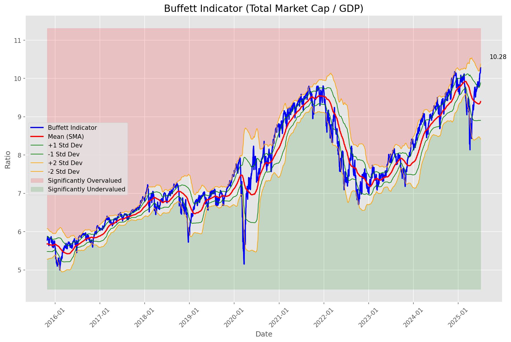
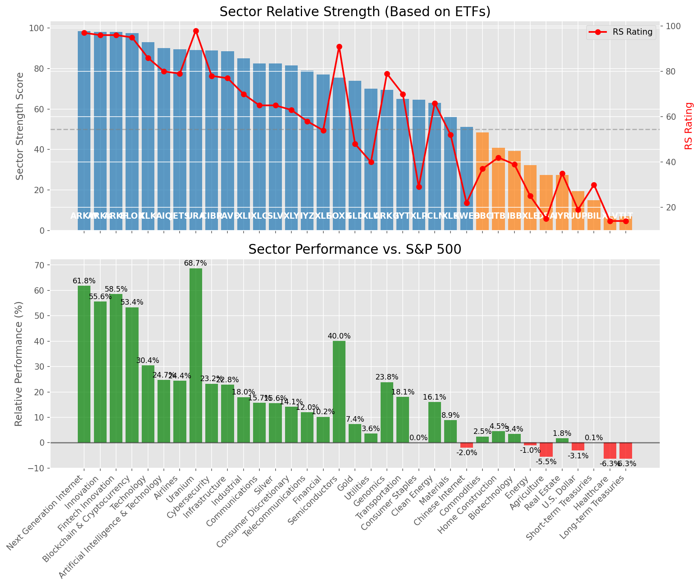

# **Daily Relative Strength Report**

**Date:** 2025-07-07

## **Market Valuation (Buffett Indicator)**

| Metric | Value |
|--------|-------|
| **Market Valuation** | **Overvalued** |
| **Current Ratio** | 10.24 |
| **Historical Mean** | 9.40 |
| **Standard Deviation** | 0.49 |
| **Z-Score (StdDev from Mean)** | 1.81 |
| **Total Market Cap** | $306.88 trillion |
| **GDP** | $29.96 trillion |

## **Market Insights**

### **Market is Overvalued**

The market appears to be trading above historical average valuations. While not at extreme levels, this suggests more modest future returns may be expected. Investors should:

- Focus on companies with reasonable valuations relative to their growth
- Be more selective with new positions
- Look for stocks showing relative strength within their sectors
- Consider trimming positions in extremely overvalued names

Historically, periods of mild overvaluation can persist for extended periods, but returns tend to be below average.

### **Buffett Indicator Overview**

The Buffett Indicator (Total Market Cap / GDP) is a measure of the stock market's valuation relative to the size of the economy. It is named after Warren Buffett, who described it as "probably the best single measure of where valuations stand at any given moment."

- **Values above +2 standard deviations:** Market significantly overvalued
- **Values above +1 standard deviation:** Market overvalued
- **Values between -1 and +1 standard deviations:** Market fairly valued
- **Values below -1 standard deviation:** Market undervalued
- **Values below -2 standard deviations:** Market significantly undervalued

---

## **Sector Relative Strength**

Based on William O'Neil's Relative Strength Methodology

| ETF | Strength | RS Rating | Performance | Above Key MAs | Trend | Sector |
|-----|----------|-----------|-------------|--------------|-------|--------|
| [ARKF](https://www.tradingview.com/chart/?symbol=ARKF) | 98.5 | 97.0 | 58.54% | 10d ✓, 50d ✓, 200d ✓ | ↗️ | Fintech Innovation |
| [ARKK](https://www.tradingview.com/chart/?symbol=ARKK) | 98.5 | 97.0 | 56.09% | 10d ✓, 50d ✓, 200d ✓ | ↗️ | Innovation |
| [BLOK](https://www.tradingview.com/chart/?symbol=BLOK) | 98.0 | 96.0 | 53.46% | 10d ✓, 50d ✓, 200d ✓ | ↗️ | Blockchain & Cryptocurrency |
| [ARKW](https://www.tradingview.com/chart/?symbol=ARKW) | 97.5 | 95.0 | 49.06% | 10d ✓, 50d ✓, 200d ✓ | ↗️ | Next Generation Internet |
| [XLK](https://www.tradingview.com/chart/?symbol=XLK) | 94.0 | 88.0 | 30.93% | 10d ✓, 50d ✓, 200d ✓ | ↗️ | Technology |
| [JETS](https://www.tradingview.com/chart/?symbol=JETS) | 92.5 | 85.0 | 27.07% | 10d ✓, 50d ✓, 200d ✓ | ↗️ | Airlines |
| [AIQ](https://www.tradingview.com/chart/?symbol=AIQ) | 91.5 | 83.0 | 25.15% | 10d ✓, 50d ✓, 200d ✓ | ↗️ | Artificial Intelligence & Technology |
| [CIBR](https://www.tradingview.com/chart/?symbol=CIBR) | 90.5 | 81.0 | 23.82% | 10d ✓, 50d ✓, 200d ✓ | ↗️ | Cybersecurity |
| [PAVE](https://www.tradingview.com/chart/?symbol=PAVE) | 90.5 | 81.0 | 24.15% | 10d ✓, 50d ✓, 200d ✓ | ↗️ | Infrastructure |
| [URA](https://www.tradingview.com/chart/?symbol=URA) | 89.1 | 98.0 | 66.43% | 10d ✗, 50d ✓, 200d ✓ | ↗️ | Uranium |
| [XLI](https://www.tradingview.com/chart/?symbol=XLI) | 87.5 | 75.0 | 18.84% | 10d ✓, 50d ✓, 200d ✓ | ↗️ | Industrial |
| [XLC](https://www.tradingview.com/chart/?symbol=XLC) | 85.5 | 71.0 | 16.20% | 10d ✓, 50d ✓, 200d ✓ | ↗️ | Communications |
| [SLV](https://www.tradingview.com/chart/?symbol=SLV) | 84.5 | 69.0 | 15.21% | 10d ✓, 50d ✓, 200d ✓ | ↗️ | Silver |
| [XLY](https://www.tradingview.com/chart/?symbol=XLY) | 84.0 | 68.0 | 14.59% | 10d ✓, 50d ✓, 200d ✓ | ↗️ | Consumer Discretionary |
| [XLF](https://www.tradingview.com/chart/?symbol=XLF) | 80.5 | 61.0 | 11.10% | 10d ✓, 50d ✓, 200d ✓ | ↗️ | Financial |
| [IYZ](https://www.tradingview.com/chart/?symbol=IYZ) | 76.5 | 53.0 | 8.22% | 10d ✓, 50d ✓, 200d ✓ | ↗️ | Telecommunications |
| [SOXX](https://www.tradingview.com/chart/?symbol=SOXX) | 76.5 | 93.0 | 41.44% | 10d ✓, 50d ✓, 200d ✓ | ↘️ | Semiconductors |
| [ARKG](https://www.tradingview.com/chart/?symbol=ARKG) | 71.5 | 83.0 | 25.15% | 10d ✓, 50d ✓, 200d ✓ | ↘️ | Genomics |
| [XLU](https://www.tradingview.com/chart/?symbol=XLU) | 71.0 | 42.0 | 3.70% | 10d ✓, 50d ✓, 200d ✓ | ↗️ | Utilities |
| [ICLN](https://www.tradingview.com/chart/?symbol=ICLN) | 66.0 | 72.0 | 16.81% | 10d ✓, 50d ✓, 200d ✓ | ↘️ | Clean Energy |
| [XLP](https://www.tradingview.com/chart/?symbol=XLP) | 64.5 | 29.0 | -0.34% | 10d ✓, 50d ✓, 200d ✓ | ↗️ | Consumer Staples |
| [XLB](https://www.tradingview.com/chart/?symbol=XLB) | 58.5 | 57.0 | 9.68% | 10d ✓, 50d ✓, 200d ✓ | ↘️ | Materials |
| [IYT](https://www.tradingview.com/chart/?symbol=IYT) | 57.0 | 54.0 | 8.74% | 10d ✓, 50d ✓, 200d ✓ | ↘️ | Transportation |
| [GLD](https://www.tradingview.com/chart/?symbol=GLD) | 54.7 | 49.0 | 6.71% | 10d ✗, 50d ✗, 200d ✓ | ↗️ | Gold |
| [KWEB](https://www.tradingview.com/chart/?symbol=KWEB) | 53.1 | 26.0 | -1.17% | 10d ✗, 50d ✓, 200d ✓ | ↗️ | Chinese Internet |
| [ITB](https://www.tradingview.com/chart/?symbol=ITB) | 43.3 | 47.0 | 5.85% | 10d ✓, 50d ✓, 200d ✗ | ↘️ | Home Construction |
| [DBC](https://www.tradingview.com/chart/?symbol=DBC) | 42.0 | 24.0 | -1.63% | 10d ✓, 50d ✓, 200d ✓ | ↘️ | Commodities |
| [IBB](https://www.tradingview.com/chart/?symbol=IBB) | 41.3 | 43.0 | 3.92% | 10d ✓, 50d ✓, 200d ✗ | ↘️ | Biotechnology |
| [IYR](https://www.tradingview.com/chart/?symbol=IYR) | 39.3 | 39.0 | 2.68% | 10d ✓, 50d ✓, 200d ✗ | ↘️ | Real Estate |
| [XLE](https://www.tradingview.com/chart/?symbol=XLE) | 35.8 | 32.0 | 0.14% | 10d ✓, 50d ✓, 200d ✗ | ↘️ | Energy |
| [DBA](https://www.tradingview.com/chart/?symbol=DBA) | 29.5 | 19.0 | -3.86% | 10d ✗, 50d ✗, 200d ✗ | ↗️ | Agriculture |
| [XLV](https://www.tradingview.com/chart/?symbol=XLV) | 27.8 | 16.0 | -5.75% | 10d ✓, 50d ✓, 200d ✗ | ↘️ | Healthcare |
| [UUP](https://www.tradingview.com/chart/?symbol=UUP) | 20.4 | 21.0 | -3.29% | 10d ✓, 50d ✗, 200d ✗ | ↘️ | U.S. Dollar |
| [BIL](https://www.tradingview.com/chart/?symbol=BIL) | 15.5 | 31.0 | 0.05% | 10d ✗, 50d ✗, 200d ✗ | ↘️ | Short-term Treasuries |
| [TLT](https://www.tradingview.com/chart/?symbol=TLT) | 7.5 | 15.0 | -5.93% | 10d ✗, 50d ✗, 200d ✗ | ↘️ | Long-term Treasuries |

### **Sector ETF Performance Interpretation**

This table shows the relative strength metrics for different market sectors based on their representative ETFs:

- **ETF**: The ETF used to measure sector performance (click for chart)
- **Strength**: Overall sector strength score (0-100) combining multiple factors
- **RS Rating**: O'Neil RS rating of the sector ETF
- **Performance**: Performance of the sector ETF relative to SPY
- **Above Key MAs**: Whether the ETF is trading above its 10, 50, and 200-day moving averages
- **Trend**: Whether the sector is in an uptrend (↗️) or downtrend (↘️)

### **Current Sector Leadership**

The current market leadership is coming from the following sectors: **Fintech Innovation, Innovation, Blockchain & Cryptocurrency**.

The **Fintech Innovation** sector (represented by **ARKF**) is showing particularly strong relative strength with an RS rating of 97.0 and performance of 58.54% vs. the S&P 500. This sector is trading above its 10-day, 50-day, 200-day moving average(s). Investors should consider focusing on high RS stocks within these leading sectors for potential outperformance.

---

## **Buy Recommendations**

The following 56 stocks show exceptional relative strength:

| RS Rating | Buy Score | Current Price | Chart | Name | Ticker |
|-----------|-----------|---------------|-------|------|--------|
| 100 | 100 | $155.89 | [Chart](https://www.tradingview.com/chart/?symbol=CLS) | Celestica, Inc. | CLS |
| 100 | 100 | $94.20 | [Chart](https://www.tradingview.com/chart/?symbol=HOOD) | Robinhood Markets, Inc. Class A Common Stock | HOOD |
| 100 | 100 | $280.51 | [Chart](https://www.tradingview.com/chart/?symbol=DAVE) | Dave Inc. Class A Common Stock | DAVE |
| 100 | 100 | $174.40 | [Chart](https://www.tradingview.com/chart/?symbol=SEZL) | Sezzle Inc. Common Stock | SEZL |
| 99 | 100 | $192.30 | [Chart](https://www.tradingview.com/chart/?symbol=NET) | Cloudflare, Inc. Class A common stock, par value $0.001 per share | NET |
| 99 | 100 | $333.64 | [Chart](https://www.tradingview.com/chart/?symbol=RCL) | Royal Caribbean Group | RCL |
| 99 | 100 | $105.94 | [Chart](https://www.tradingview.com/chart/?symbol=RBLX) | Roblox Corporation | RBLX |
| 99 | 100 | $149.20 | [Chart](https://www.tradingview.com/chart/?symbol=LMB) | Limbach Holdings, Inc Common Stock | LMB |
| 99 | 100 | $36.65 | [Chart](https://www.tradingview.com/chart/?symbol=GRPN) | Groupon, Inc.Common Stock | GRPN |
| 99 | 100 | $352.57 | [Chart](https://www.tradingview.com/chart/?symbol=CVNA) | Carvana Co. | CVNA |
| 98 | 100 | $521.84 | [Chart](https://www.tradingview.com/chart/?symbol=GEV) | GE Vernova Inc. | GEV |
| 97 | 100 | $71.62 | [Chart](https://www.tradingview.com/chart/?symbol=URBN) | Urban Outfitters Inc | URBN |
| 97 | 100 | $75.96 | [Chart](https://www.tradingview.com/chart/?symbol=ODD) | ODDITY Tech Ltd. Class A Ordinary Shares | ODD |
| 97 | 100 | $313.71 | [Chart](https://www.tradingview.com/chart/?symbol=ZS) | Zscaler, Inc. Common Stock | ZS |
| 97 | 100 | $43.92 | [Chart](https://www.tradingview.com/chart/?symbol=FARO) | Faro Technologies Inc | FARO |
| 97 | 100 | $50.40 | [Chart](https://www.tradingview.com/chart/?symbol=ARKF) | ARK Fintech Innovation ETF | ARKF |
| 96 | 100 | $50.25 | [Chart](https://www.tradingview.com/chart/?symbol=REVG) | REV Group, Inc. | REVG |
| 96 | 100 | $89.12 | [Chart](https://www.tradingview.com/chart/?symbol=RBRK) | Rubrik, Inc. | RBRK |
| 96 | 100 | $38.28 | [Chart](https://www.tradingview.com/chart/?symbol=AS) | Amer Sports, Inc. | AS |
| 95 | 100 | $45.19 | [Chart](https://www.tradingview.com/chart/?symbol=KTOS) | Kratos Defense & Security Solutions, Inc. | KTOS |
| 95 | 100 | $48.77 | [Chart](https://www.tradingview.com/chart/?symbol=INOD) | Innodata Inc. | INOD |
| 94 | 100 | $503.13 | [Chart](https://www.tradingview.com/chart/?symbol=CRWD) | CrowdStrike Holdings, Inc. Class A Common Stock | CRWD |
| 94 | 100 | $181.85 | [Chart](https://www.tradingview.com/chart/?symbol=HWM) | Howmet Aerospace Inc. | HWM |
| 94 | 100 | $58.19 | [Chart](https://www.tradingview.com/chart/?symbol=IBKR) | Interactive Brokers Group, Inc. Class A Common Stock | IBKR |
| 93 | 100 | $17.76 | [Chart](https://www.tradingview.com/chart/?symbol=DAN) | Dana Incorporated | DAN |
| 93 | 100 | $795.48 | [Chart](https://www.tradingview.com/chart/?symbol=AXON) | Axon Enterprise, Inc. Common Stock | AXON |
| 93 | 100 | $46.62 | [Chart](https://www.tradingview.com/chart/?symbol=DRS) | Leonardo DRS, Inc. Common Stock | DRS |
| 93 | 100 | $21.37 | [Chart](https://www.tradingview.com/chart/?symbol=MAG) | MAG Silver Corp. | MAG |
| 93 | 100 | $43.60 | [Chart](https://www.tradingview.com/chart/?symbol=KD) | Kyndryl Holdings, Inc. | KD |
| 92 | 100 | $91.31 | [Chart](https://www.tradingview.com/chart/?symbol=TPR) | Tapestry, Inc. Common Stock | TPR |
| 90 | 100 | $28.30 | [Chart](https://www.tradingview.com/chart/?symbol=SRAD) | Sportradar Group AG Class A Ordinary Shares | SRAD |
| 90 | 100 | $52.89 | [Chart](https://www.tradingview.com/chart/?symbol=BBW) | Build-A-Bear Workshop, Inc. | BBW |
| 89 | 100 | $30.60 | [Chart](https://www.tradingview.com/chart/?symbol=HODL) | VanEck Bitcoin ETF | HODL |
| 89 | 99 | $61.46 | [Chart](https://www.tradingview.com/chart/?symbol=IBIT) | iShares Bitcoin Trust ETF | IBIT |
| 89 | 99 | $102.34 | [Chart](https://www.tradingview.com/chart/?symbol=SANM) | Sanmina  Corp | SANM |
| 89 | 99 | $252.34 | [Chart](https://www.tradingview.com/chart/?symbol=WWD) | Woodward, Inc. | WWD |
| 86 | 99 | $18.32 | [Chart](https://www.tradingview.com/chart/?symbol=BCS) | Barclays PLC | BCS |
| 89 | 98 | $66.26 | [Chart](https://www.tradingview.com/chart/?symbol=RYTM) | Rhythm Pharmaceuticals, Inc. Common Stock | RYTM |
| 85 | 96 | $188.00 | [Chart](https://www.tradingview.com/chart/?symbol=ITA) | iShares U.S. Aerospace & Defense ETF | ITA |
| 85 | 96 | $25.80 | [Chart](https://www.tradingview.com/chart/?symbol=KAR) | OPENLANE, Inc | KAR |
| 85 | 95 | $46.96 | [Chart](https://www.tradingview.com/chart/?symbol=AU) | AngloGold Ashanti plc | AU |
| 83 | 95 | $59.65 | [Chart](https://www.tradingview.com/chart/?symbol=SHLD) | Global X Defense Tech ETF | SHLD |
| 84 | 94 | $112.08 | [Chart](https://www.tradingview.com/chart/?symbol=SPMO) | Invesco S&P 500 Momentum ETF | SPMO |
| 84 | 94 | $82.98 | [Chart](https://www.tradingview.com/chart/?symbol=WFC) | Wells Fargo & Co. | WFC |
| 83 | 94 | $71.71 | [Chart](https://www.tradingview.com/chart/?symbol=ULS) | UL Solutions Inc. | ULS |
| 83 | 94 | $284.29 | [Chart](https://www.tradingview.com/chart/?symbol=VEEV) | Veeva Systems Inc. | VEEV |
| 83 | 94 | $77.14 | [Chart](https://www.tradingview.com/chart/?symbol=CTVA) | Corteva, Inc. Common Stock | CTVA |
| 84 | 93 | $48.86 | [Chart](https://www.tradingview.com/chart/?symbol=SIL) | Global X Silver Miners ETF (NEW) | SIL |
| 84 | 93 | $123.33 | [Chart](https://www.tradingview.com/chart/?symbol=FUTU) | Futu Holdings Limited American Depositary Shares | FUTU |
| 82 | 93 | $132.85 | [Chart](https://www.tradingview.com/chart/?symbol=NTES) | NetEase, inc. | NTES |
| 81 | 93 | $75.86 | [Chart](https://www.tradingview.com/chart/?symbol=CIBR) | First Trust Exchange-Traded Fund II First Trust NASDAQ Cybersecurity ETF | CIBR |
| 81 | 93 | $403.87 | [Chart](https://www.tradingview.com/chart/?symbol=CYBR) | CyberArk Software Ltd. | CYBR |
| 82 | 92 | $18.86 | [Chart](https://www.tradingview.com/chart/?symbol=AVPT) | AvePoint, Inc. Class A Common Stock | AVPT |
| 82 | 92 | $24.17 | [Chart](https://www.tradingview.com/chart/?symbol=TFPM) | Triple Flag Precious Metals Corp. | TFPM |
| 81 | 91 | $35.13 | [Chart](https://www.tradingview.com/chart/?symbol=ATAT) | Atour Lifestyle Holdings Limited American Depositary Shares | ATAT |
| 80 | 90 | $252.69 | [Chart](https://www.tradingview.com/chart/?symbol=WTS) | Watts Water Technologies, Inc. Class A | WTS |

---

## **Sell Recommendations**

The following 55 stocks show deteriorating relative strength:

| RS Rating | Sell Score | Current Price | Chart | Name | Ticker |
|-----------|------------|---------------|-------|------|--------|
| 1 | 100 | $10.09 | [Chart](https://www.tradingview.com/chart/?symbol=HIBS) | Direxion Daily S&P 500 High Beta Bear 3X Shares | HIBS |
| 1 | 100 | $14.37 | [Chart](https://www.tradingview.com/chart/?symbol=NVDS) | Investment Managers Series Trust II Tradr 1.5X Short NVDA Daily ETF | NVDS |
| 1 | 100 | $25.99 | [Chart](https://www.tradingview.com/chart/?symbol=TECS) | Direxion Daily Technology Bear 3x Shares | TECS |
| 1 | 100 | $25.26 | [Chart](https://www.tradingview.com/chart/?symbol=QID) | ProShares UltraShort QQQ | QID |
| 2 | 100 | $16.43 | [Chart](https://www.tradingview.com/chart/?symbol=SDS) | ProShares UltraShort S&P500 | SDS |
| 2 | 100 | $19.55 | [Chart](https://www.tradingview.com/chart/?symbol=BITI) | ProShares Short Bitcoin ETF | BITI |
| 2 | 100 | $39.99 | [Chart](https://www.tradingview.com/chart/?symbol=SDOW) | ProShares UltraPro Short Dow 30 | SDOW |
| 2 | 100 | $10.20 | [Chart](https://www.tradingview.com/chart/?symbol=HPK) | HighPeak Energy, Inc. Common Stock | HPK |
| 2 | 100 | $24.92 | [Chart](https://www.tradingview.com/chart/?symbol=CRTO) | Criteo S.A. | CRTO |
| 3 | 100 | $35.25 | [Chart](https://www.tradingview.com/chart/?symbol=SARK) | Investment Managers Series Trust II Tradr 1X Short Innovation Daily ETF | SARK |
| 3 | 100 | $43.52 | [Chart](https://www.tradingview.com/chart/?symbol=LINE) | Lineage, Inc. Common Stock | LINE |
| 4 | 100 | $80.42 | [Chart](https://www.tradingview.com/chart/?symbol=LNTH) | Lantheus Holdings, Inc | LNTH |
| 4 | 100 | $33.63 | [Chart](https://www.tradingview.com/chart/?symbol=PSQ) | ProShares Short QQQ | PSQ |
| 4 | 100 | $23.66 | [Chart](https://www.tradingview.com/chart/?symbol=DXD) | ProShares UltraShort Dow 30 | DXD |
| 4 | 100 | $49.82 | [Chart](https://www.tradingview.com/chart/?symbol=ASGN) | ASGN Incorporated | ASGN |
| 5 | 100 | $93.50 | [Chart](https://www.tradingview.com/chart/?symbol=ZBH) | Zimmer Biomet Holdings, Inc. | ZBH |
| 5 | 100 | $33.50 | [Chart](https://www.tradingview.com/chart/?symbol=CYTK) | Cytokinetics Inc. | CYTK |
| 6 | 100 | $39.43 | [Chart](https://www.tradingview.com/chart/?symbol=SH) | ProShares Short S&P500 | SH |
| 6 | 100 | $23.46 | [Chart](https://www.tradingview.com/chart/?symbol=AMPH) | Amphastar Pharmaceuticals, Inc. | AMPH |
| 7 | 100 | $52.30 | [Chart](https://www.tradingview.com/chart/?symbol=LW) | Lamb Weston Holdings, Inc. | LW |
| 9 | 100 | $84.64 | [Chart](https://www.tradingview.com/chart/?symbol=KSPI) | Joint Stock Company Kaspi.kz American Depository Shares | KSPI |
| 10 | 100 | $131.59 | [Chart](https://www.tradingview.com/chart/?symbol=KMB) | Kimberly-Clark Corp. | KMB |
| 10 | 100 | $25.19 | [Chart](https://www.tradingview.com/chart/?symbol=DOG) | ProShares Short Dow30 | DOG |
| 13 | 100 | $12.12 | [Chart](https://www.tradingview.com/chart/?symbol=LBRT) | Liberty Energy Inc. | LBRT |
| 13 | 100 | $47.62 | [Chart](https://www.tradingview.com/chart/?symbol=KBR) | KBR, Inc. | KBR |
| 14 | 100 | $86.33 | [Chart](https://www.tradingview.com/chart/?symbol=SIGI) | Selective Insurance Group | SIGI |
| 14 | 99 | $14.04 | [Chart](https://www.tradingview.com/chart/?symbol=OCSL) | Oaktree Specialty Lending Corporation | OCSL |
| 8 | 98 | $48.44 | [Chart](https://www.tradingview.com/chart/?symbol=SNY) | Sanofi American Depositary Shares (Each representing one-half of one ordinary share) | SNY |
| 12 | 98 | $62.29 | [Chart](https://www.tradingview.com/chart/?symbol=ELS) | Equity Lifestyle Properties, Inc. | ELS |
| 7 | 97 | $80.62 | [Chart](https://www.tradingview.com/chart/?symbol=OKE) | Oneok, Inc. | OKE |
| 5 | 96 | $24.77 | [Chart](https://www.tradingview.com/chart/?symbol=DRV) | Direxion Daily Real Estate Bear 3X Shares | DRV |
| 9 | 96 | $93.75 | [Chart](https://www.tradingview.com/chart/?symbol=GLOB) | GLOBANT S.A. | GLOB |
| 9 | 95 | $37.26 | [Chart](https://www.tradingview.com/chart/?symbol=VNOM) | Viper Energy, Inc. Class A Common Stock | VNOM |
| 12 | 92 | $104.80 | [Chart](https://www.tradingview.com/chart/?symbol=PDD) | PDD Holdings Inc. American Depositary Shares | PDD |
| 15 | 92 | $86.41 | [Chart](https://www.tradingview.com/chart/?symbol=TLT) | iShares 20+ Year Treasury Bond ETF | TLT |
| 20 | 92 | $104.00 | [Chart](https://www.tradingview.com/chart/?symbol=DEO) | Diageo plc | DEO |
| 13 | 90 | $38.95 | [Chart](https://www.tradingview.com/chart/?symbol=LKQ) | LKQ Corporation | LKQ |
| 22 | 90 | $767.04 | [Chart](https://www.tradingview.com/chart/?symbol=LLY) | Eli Lilly & Co. | LLY |
| 17 | 89 | $291.86 | [Chart](https://www.tradingview.com/chart/?symbol=UTHR) | United Therapeutics Corp | UTHR |
| 16 | 88 | $41.34 | [Chart](https://www.tradingview.com/chart/?symbol=UDR) | UDR, Inc. | UDR |
| 16 | 88 | $19.17 | [Chart](https://www.tradingview.com/chart/?symbol=MSDL) | Morgan Stanley Direct Lending Fund | MSDL |
| 17 | 86 | $36.80 | [Chart](https://www.tradingview.com/chart/?symbol=OHI) | Omega Healthcare Investors Inc. | OHI |
| 18 | 86 | $32.55 | [Chart](https://www.tradingview.com/chart/?symbol=INVH) | Invitation Homes Inc. Common Stock | INVH |
| 22 | 85 | $127.47 | [Chart](https://www.tradingview.com/chart/?symbol=RGEN) | Repligen Corp | RGEN |
| 23 | 85 | $29.17 | [Chart](https://www.tradingview.com/chart/?symbol=RNA) | Avidity Biosciences, Inc. Common Stock | RNA |
| 24 | 85 | $61.50 | [Chart](https://www.tradingview.com/chart/?symbol=UL) | Unilever plc | UL |
| 20 | 83 | $35.78 | [Chart](https://www.tradingview.com/chart/?symbol=AMH) | AMERICAN HOMES 4 RENT | AMH |
| 20 | 83 | $57.27 | [Chart](https://www.tradingview.com/chart/?symbol=DAY) | Dayforce, Inc. | DAY |
| 26 | 82 | $197.79 | [Chart](https://www.tradingview.com/chart/?symbol=RGA) | Reinsurance Group of America, Incorporated | RGA |
| 25 | 78 | $69.68 | [Chart](https://www.tradingview.com/chart/?symbol=BRC) | Brady Corporation | BRC |
| 30 | 77 | $22.84 | [Chart](https://www.tradingview.com/chart/?symbol=IBTG) | iShares iBonds Dec 2026 Term Treasury ETF | IBTG |
| 27 | 76 | $21.70 | [Chart](https://www.tradingview.com/chart/?symbol=TUA) | Simplify Short Term Treasury Futures Strategy ETF | TUA |
| 29 | 74 | $29.14 | [Chart](https://www.tradingview.com/chart/?symbol=SPTS) | SPDR Portfolio Short Term Treasury ETF | SPTS |
| 34 | 74 | $303.61 | [Chart](https://www.tradingview.com/chart/?symbol=ACN) | Accenture PLC | ACN |
| 31 | 70 | $110.12 | [Chart](https://www.tradingview.com/chart/?symbol=SHV) | iShares Short Treasury Bond ETF | SHV |

## **Methodology**

This report uses William O'Neil's relative strength methodology from Investors Business Daily:

* **RS Rating**: Percentile rank of stock's performance vs. S&P 500 over the past 63 trading days (1-99 scale)
* **Buy Criteria**: RS Rating >= 80, price above 50-day MA, strong uptrend, increasing volume
* **Sell Criteria**: RS Rating < 40, price below 50-day MA, downtrend, decreasing volume

### **O'Neil's Key Principles**

1. **Focus on relative performance** - stocks outperforming the market
2. **Price trend confirmation** - stock must be in an uptrend
3. **Volume confirmation** - strong volume supports price moves
4. **Moving average validation** - price above key moving averages
5. **Market leaders only** - concentrate on top-performing stocks

*Report generated automatically after market close*