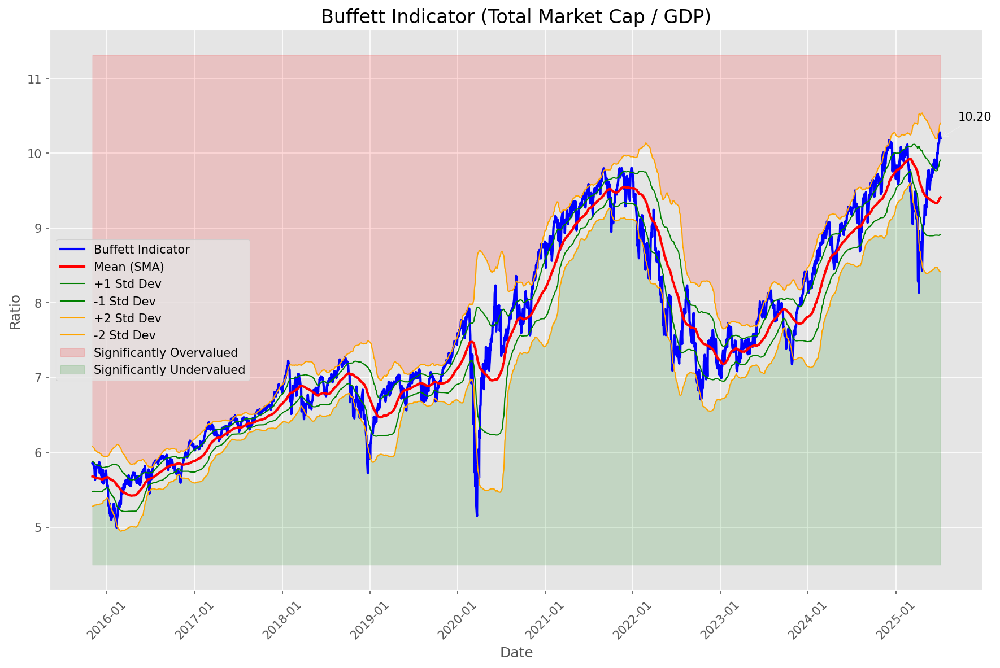
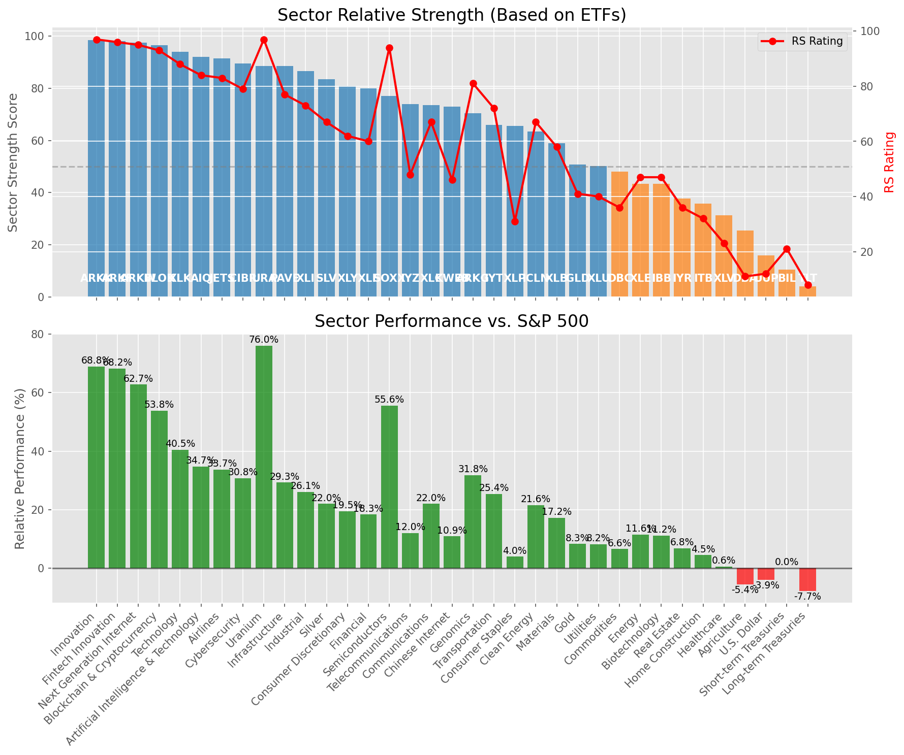

# **Daily Relative Strength Report**

**Date:** 2025-07-08

## **Market Valuation (Buffett Indicator)**

| Metric | Value |
|--------|-------|
| **Market Valuation** | **Overvalued** |
| **Current Ratio** | 10.20 |
| **Historical Mean** | 9.41 |
| **Standard Deviation** | 0.50 |
| **Z-Score (StdDev from Mean)** | 1.59 |
| **Total Market Cap** | $305.58 trillion |
| **GDP** | $29.96 trillion |

## **Market Insights**

### **Market is Overvalued**

The market appears to be trading above historical average valuations. While not at extreme levels, this suggests more modest future returns may be expected. Investors should:

- Focus on companies with reasonable valuations relative to their growth
- Be more selective with new positions
- Look for stocks showing relative strength within their sectors
- Consider trimming positions in extremely overvalued names

Historically, periods of mild overvaluation can persist for extended periods, but returns tend to be below average.

### **Buffett Indicator Overview**

The Buffett Indicator (Total Market Cap / GDP) is a measure of the stock market's valuation relative to the size of the economy. It is named after Warren Buffett, who described it as "probably the best single measure of where valuations stand at any given moment."

- **Values above +2 standard deviations:** Market significantly overvalued
- **Values above +1 standard deviation:** Market overvalued
- **Values between -1 and +1 standard deviations:** Market fairly valued
- **Values below -1 standard deviation:** Market undervalued
- **Values below -2 standard deviations:** Market significantly undervalued

---

## **Sector Relative Strength**

Based on William O'Neil's Relative Strength Methodology

| ETF | Strength | RS Rating | Performance | Above Key MAs | Trend | Sector |
|-----|----------|-----------|-------------|--------------|-------|--------|
| [ARKW](https://www.tradingview.com/chart/?symbol=ARKW) | 98.5 | 97.0 | 72.71% | 10d ✓, 50d ✓, 200d ✓ | ↗️ | Next Generation Internet |
| [ARKK](https://www.tradingview.com/chart/?symbol=ARKK) | 98.0 | 96.0 | 69.05% | 10d ✓, 50d ✓, 200d ✓ | ↗️ | Innovation |
| [ARKF](https://www.tradingview.com/chart/?symbol=ARKF) | 98.0 | 96.0 | 68.74% | 10d ✓, 50d ✓, 200d ✓ | ↗️ | Fintech Innovation |
| [BLOK](https://www.tradingview.com/chart/?symbol=BLOK) | 96.5 | 93.0 | 56.07% | 10d ✓, 50d ✓, 200d ✓ | ↗️ | Blockchain & Cryptocurrency |
| [XLK](https://www.tradingview.com/chart/?symbol=XLK) | 93.5 | 87.0 | 40.53% | 10d ✓, 50d ✓, 200d ✓ | ↗️ | Technology |
| [AIQ](https://www.tradingview.com/chart/?symbol=AIQ) | 91.0 | 82.0 | 34.81% | 10d ✓, 50d ✓, 200d ✓ | ↗️ | Artificial Intelligence & Technology |
| [JETS](https://www.tradingview.com/chart/?symbol=JETS) | 90.0 | 80.0 | 32.56% | 10d ✓, 50d ✓, 200d ✓ | ↗️ | Airlines |
| [CIBR](https://www.tradingview.com/chart/?symbol=CIBR) | 89.5 | 79.0 | 31.53% | 10d ✓, 50d ✓, 200d ✓ | ↗️ | Cybersecurity |
| [URA](https://www.tradingview.com/chart/?symbol=URA) | 88.6 | 97.0 | 77.81% | 10d ✗, 50d ✓, 200d ✓ | ↗️ | Uranium |
| [PAVE](https://www.tradingview.com/chart/?symbol=PAVE) | 88.0 | 76.0 | 29.33% | 10d ✓, 50d ✓, 200d ✓ | ↗️ | Infrastructure |
| [XLI](https://www.tradingview.com/chart/?symbol=XLI) | 85.5 | 71.0 | 26.22% | 10d ✓, 50d ✓, 200d ✓ | ↗️ | Industrial |
| [SLV](https://www.tradingview.com/chart/?symbol=SLV) | 83.0 | 66.0 | 22.93% | 10d ✓, 50d ✓, 200d ✓ | ↗️ | Silver |
| [XLY](https://www.tradingview.com/chart/?symbol=XLY) | 79.5 | 59.0 | 19.08% | 10d ✓, 50d ✓, 200d ✓ | ↗️ | Consumer Discretionary |
| [IYZ](https://www.tradingview.com/chart/?symbol=IYZ) | 79.5 | 59.0 | 19.13% | 10d ✓, 50d ✓, 200d ✓ | ↗️ | Telecommunications |
| [SOXX](https://www.tradingview.com/chart/?symbol=SOXX) | 76.5 | 93.0 | 54.37% | 10d ✓, 50d ✓, 200d ✓ | ↘️ | Semiconductors |
| [XLC](https://www.tradingview.com/chart/?symbol=XLC) | 72.6 | 65.0 | 22.41% | 10d ✗, 50d ✓, 200d ✓ | ↗️ | Communications |
| [KWEB](https://www.tradingview.com/chart/?symbol=KWEB) | 70.5 | 41.0 | 10.16% | 10d ✓, 50d ✓, 200d ✓ | ↗️ | Chinese Internet |
| [ARKG](https://www.tradingview.com/chart/?symbol=ARKG) | 69.5 | 79.0 | 32.05% | 10d ✓, 50d ✓, 200d ✓ | ↘️ | Genomics |
| [XLF](https://www.tradingview.com/chart/?symbol=XLF) | 68.6 | 57.0 | 18.12% | 10d ✗, 50d ✓, 200d ✓ | ↗️ | Financial |
| [IYT](https://www.tradingview.com/chart/?symbol=IYT) | 65.0 | 70.0 | 25.18% | 10d ✓, 50d ✓, 200d ✓ | ↘️ | Transportation |
| [ICLN](https://www.tradingview.com/chart/?symbol=ICLN) | 61.5 | 63.0 | 21.46% | 10d ✓, 50d ✓, 200d ✓ | ↘️ | Clean Energy |
| [XLU](https://www.tradingview.com/chart/?symbol=XLU) | 59.6 | 39.0 | 8.87% | 10d ✗, 50d ✓, 200d ✓ | ↗️ | Utilities |
| [XLB](https://www.tradingview.com/chart/?symbol=XLB) | 57.5 | 55.0 | 17.14% | 10d ✓, 50d ✓, 200d ✓ | ↘️ | Materials |
| [XLP](https://www.tradingview.com/chart/?symbol=XLP) | 53.6 | 27.0 | 3.68% | 10d ✓, 50d ✗, 200d ✓ | ↗️ | Consumer Staples |
| [XLE](https://www.tradingview.com/chart/?symbol=XLE) | 52.5 | 45.0 | 12.38% | 10d ✓, 50d ✓, 200d ✓ | ↘️ | Energy |
| [GLD](https://www.tradingview.com/chart/?symbol=GLD) | 49.2 | 38.0 | 8.74% | 10d ✗, 50d ✗, 200d ✓ | ↗️ | Gold |
| [DBC](https://www.tradingview.com/chart/?symbol=DBC) | 47.0 | 34.0 | 6.59% | 10d ✓, 50d ✓, 200d ✓ | ↘️ | Commodities |
| [IBB](https://www.tradingview.com/chart/?symbol=IBB) | 40.8 | 42.0 | 10.39% | 10d ✓, 50d ✓, 200d ✗ | ↘️ | Biotechnology |
| [ITB](https://www.tradingview.com/chart/?symbol=ITB) | 33.3 | 27.0 | 3.47% | 10d ✓, 50d ✓, 200d ✗ | ↘️ | Home Construction |
| [XLV](https://www.tradingview.com/chart/?symbol=XLV) | 28.8 | 18.0 | -0.23% | 10d ✓, 50d ✓, 200d ✗ | ↘️ | Healthcare |
| [IYR](https://www.tradingview.com/chart/?symbol=IYR) | 26.9 | 34.0 | 6.52% | 10d ✗, 50d ✓, 200d ✗ | ↘️ | Real Estate |
| [DBA](https://www.tradingview.com/chart/?symbol=DBA) | 25.0 | 10.0 | -4.60% | 10d ✗, 50d ✗, 200d ✗ | ↗️ | Agriculture |
| [UUP](https://www.tradingview.com/chart/?symbol=UUP) | 15.4 | 11.0 | -4.14% | 10d ✓, 50d ✗, 200d ✗ | ↘️ | U.S. Dollar |
| [BIL](https://www.tradingview.com/chart/?symbol=BIL) | 9.5 | 19.0 | 0.03% | 10d ✗, 50d ✗, 200d ✗ | ↘️ | Short-term Treasuries |
| [TLT](https://www.tradingview.com/chart/?symbol=TLT) | 4.0 | 8.0 | -7.35% | 10d ✗, 50d ✗, 200d ✗ | ↘️ | Long-term Treasuries |

### **Sector ETF Performance Interpretation**

This table shows the relative strength metrics for different market sectors based on their representative ETFs:

- **ETF**: The ETF used to measure sector performance (click for chart)
- **Strength**: Overall sector strength score (0-100) combining multiple factors
- **RS Rating**: O'Neil RS rating of the sector ETF
- **Performance**: Performance of the sector ETF relative to SPY
- **Above Key MAs**: Whether the ETF is trading above its 10, 50, and 200-day moving averages
- **Trend**: Whether the sector is in an uptrend (↗️) or downtrend (↘️)

### **Current Sector Leadership**

The current market leadership is coming from the following sectors: **Next Generation Internet, Innovation, Fintech Innovation**.

The **Next Generation Internet** sector (represented by **ARKW**) is showing particularly strong relative strength with an RS rating of 97.0 and performance of 72.71% vs. the S&P 500. This sector is trading above its 10-day, 50-day, 200-day moving average(s). Investors should consider focusing on high RS stocks within these leading sectors for potential outperformance.

---

## **Buy Recommendations**

The following 43 stocks show exceptional relative strength:

| RS Rating | Buy Score | Current Price | Chart | Name | Ticker |
|-----------|-----------|---------------|-------|------|--------|
| 100 | 100 | $262.07 | [Chart](https://www.tradingview.com/chart/?symbol=DAVE) | Dave Inc. Class A Common Stock | DAVE |
| 100 | 100 | $155.70 | [Chart](https://www.tradingview.com/chart/?symbol=CLS) | Celestica, Inc. | CLS |
| 100 | 100 | $91.27 | [Chart](https://www.tradingview.com/chart/?symbol=HOOD) | Robinhood Markets, Inc. Class A Common Stock | HOOD |
| 100 | 100 | $37.37 | [Chart](https://www.tradingview.com/chart/?symbol=GRPN) | Groupon, Inc.Common Stock | GRPN |
| 99 | 100 | $104.94 | [Chart](https://www.tradingview.com/chart/?symbol=RBLX) | Roblox Corporation | RBLX |
| 99 | 100 | $345.92 | [Chart](https://www.tradingview.com/chart/?symbol=CVNA) | Carvana Co. | CVNA |
| 99 | 100 | $143.48 | [Chart](https://www.tradingview.com/chart/?symbol=LMB) | Limbach Holdings, Inc Common Stock | LMB |
| 99 | 100 | $530.00 | [Chart](https://www.tradingview.com/chart/?symbol=GEV) | GE Vernova Inc. | GEV |
| 99 | 100 | $192.81 | [Chart](https://www.tradingview.com/chart/?symbol=NET) | Cloudflare, Inc. Class A common stock, par value $0.001 per share | NET |
| 98 | 100 | $312.44 | [Chart](https://www.tradingview.com/chart/?symbol=ZS) | Zscaler, Inc. Common Stock | ZS |
| 98 | 100 | $139.71 | [Chart](https://www.tradingview.com/chart/?symbol=PLTR) | Palantir Technologies Inc. Class A Common Stock | PLTR |
| 97 | 100 | $43.89 | [Chart](https://www.tradingview.com/chart/?symbol=FARO) | Faro Technologies Inc | FARO |
| 96 | 100 | $49.68 | [Chart](https://www.tradingview.com/chart/?symbol=REVG) | REV Group, Inc. | REVG |
| 96 | 100 | $50.25 | [Chart](https://www.tradingview.com/chart/?symbol=ARKF) | ARK Fintech Innovation ETF | ARKF |
| 96 | 100 | $50.97 | [Chart](https://www.tradingview.com/chart/?symbol=INOD) | Innodata Inc. | INOD |
| 95 | 100 | $179.46 | [Chart](https://www.tradingview.com/chart/?symbol=HWM) | Howmet Aerospace Inc. | HWM |
| 95 | 100 | $44.34 | [Chart](https://www.tradingview.com/chart/?symbol=KTOS) | Kratos Defense & Security Solutions, Inc. | KTOS |
| 94 | 100 | $507.71 | [Chart](https://www.tradingview.com/chart/?symbol=CRWD) | CrowdStrike Holdings, Inc. Class A Common Stock | CRWD |
| 94 | 100 | $34.32 | [Chart](https://www.tradingview.com/chart/?symbol=APG) | APi Group Corporation | APG |
| 94 | 100 | $249.85 | [Chart](https://www.tradingview.com/chart/?symbol=WWD) | Woodward, Inc. | WWD |
| 93 | 100 | $46.44 | [Chart](https://www.tradingview.com/chart/?symbol=DRS) | Leonardo DRS, Inc. Common Stock | DRS |
| 93 | 100 | $130.53 | [Chart](https://www.tradingview.com/chart/?symbol=FUTU) | Futu Holdings Limited American Depositary Shares | FUTU |
| 93 | 100 | $56.62 | [Chart](https://www.tradingview.com/chart/?symbol=IBKR) | Interactive Brokers Group, Inc. Class A Common Stock | IBKR |
| 92 | 100 | $102.23 | [Chart](https://www.tradingview.com/chart/?symbol=SANM) | Sanmina  Corp | SANM |
| 92 | 100 | $30.24 | [Chart](https://www.tradingview.com/chart/?symbol=NTGR) | NETGEAR, Inc. | NTGR |
| 92 | 100 | $43.38 | [Chart](https://www.tradingview.com/chart/?symbol=KD) | Kyndryl Holdings, Inc. | KD |
| 90 | 100 | $92.21 | [Chart](https://www.tradingview.com/chart/?symbol=TPR) | Tapestry, Inc. Common Stock | TPR |
| 89 | 100 | $284.92 | [Chart](https://www.tradingview.com/chart/?symbol=RL) | Ralph Lauren Corporation | RL |
| 89 | 100 | $29.40 | [Chart](https://www.tradingview.com/chart/?symbol=DB) | Deutsche Bank Aktiengesellschaft | DB |
| 88 | 100 | $28.84 | [Chart](https://www.tradingview.com/chart/?symbol=SRAD) | Sportradar Group AG Class A Ordinary Shares | SRAD |
| 88 | 99 | $43.54 | [Chart](https://www.tradingview.com/chart/?symbol=TOST) | Toast, Inc. | TOST |
| 86 | 99 | $18.31 | [Chart](https://www.tradingview.com/chart/?symbol=BCS) | Barclays PLC | BCS |
| 86 | 99 | $29.96 | [Chart](https://www.tradingview.com/chart/?symbol=CAE) | CAE INC | CAE |
| 85 | 99 | $95.96 | [Chart](https://www.tradingview.com/chart/?symbol=SNEX) | StoneX Group Inc. Common Stock | SNEX |
| 86 | 97 | $25.00 | [Chart](https://www.tradingview.com/chart/?symbol=KAR) | OPENLANE, Inc | KAR |
| 85 | 97 | $63.22 | [Chart](https://www.tradingview.com/chart/?symbol=CAKE) | Cheesecake Factory (The) | CAKE |
| 84 | 96 | $59.71 | [Chart](https://www.tradingview.com/chart/?symbol=SHLD) | Global X Defense Tech ETF | SHLD |
| 84 | 95 | $76.45 | [Chart](https://www.tradingview.com/chart/?symbol=CTVA) | Corteva, Inc. Common Stock | CTVA |
| 85 | 94 | $65.14 | [Chart](https://www.tradingview.com/chart/?symbol=RYTM) | Rhythm Pharmaceuticals, Inc. Common Stock | RYTM |
| 82 | 92 | $35.25 | [Chart](https://www.tradingview.com/chart/?symbol=ATAT) | Atour Lifestyle Holdings Limited American Depositary Shares | ATAT |
| 81 | 92 | $5713.33 | [Chart](https://www.tradingview.com/chart/?symbol=BKNG) | Booking Holdings Inc. Common Stock | BKNG |
| 81 | 91 | $81.59 | [Chart](https://www.tradingview.com/chart/?symbol=WFC) | Wells Fargo & Co. | WFC |
| 80 | 90 | $267.17 | [Chart](https://www.tradingview.com/chart/?symbol=FDN) | First Trust Dow Jones Internet Index Fund ETF | FDN |

---

## **Sell Recommendations**

The following 68 stocks show deteriorating relative strength:

| RS Rating | Sell Score | Current Price | Chart | Name | Ticker |
|-----------|------------|---------------|-------|------|--------|
| 1 | 100 | $14.16 | [Chart](https://www.tradingview.com/chart/?symbol=NVDS) | Investment Managers Series Trust II Tradr 1.5X Short NVDA Daily ETF | NVDS |
| 1 | 100 | $16.57 | [Chart](https://www.tradingview.com/chart/?symbol=SDS) | ProShares UltraShort S&P500 | SDS |
| 1 | 100 | $25.82 | [Chart](https://www.tradingview.com/chart/?symbol=TECS) | Direxion Daily Technology Bear 3x Shares | TECS |
| 1 | 100 | $25.30 | [Chart](https://www.tradingview.com/chart/?symbol=QID) | ProShares UltraShort QQQ | QID |
| 1 | 100 | $41.08 | [Chart](https://www.tradingview.com/chart/?symbol=SDOW) | ProShares UltraPro Short Dow 30 | SDOW |
| 2 | 100 | $33.68 | [Chart](https://www.tradingview.com/chart/?symbol=PSQ) | ProShares Short QQQ | PSQ |
| 2 | 100 | $24.08 | [Chart](https://www.tradingview.com/chart/?symbol=DXD) | ProShares UltraShort Dow 30 | DXD |
| 2 | 100 | $19.43 | [Chart](https://www.tradingview.com/chart/?symbol=BITI) | ProShares Short Bitcoin ETF | BITI |
| 2 | 100 | $35.36 | [Chart](https://www.tradingview.com/chart/?symbol=SARK) | Investment Managers Series Trust II Tradr 1X Short Innovation Daily ETF | SARK |
| 3 | 100 | $39.59 | [Chart](https://www.tradingview.com/chart/?symbol=SH) | ProShares Short S&P500 | SH |
| 3 | 100 | $35.91 | [Chart](https://www.tradingview.com/chart/?symbol=IBTA) | Ibotta, Inc. | IBTA |
| 3 | 100 | $24.79 | [Chart](https://www.tradingview.com/chart/?symbol=CRTO) | Criteo S.A. | CRTO |
| 3 | 100 | $43.52 | [Chart](https://www.tradingview.com/chart/?symbol=LINE) | Lineage, Inc. Common Stock | LINE |
| 4 | 100 | $12.78 | [Chart](https://www.tradingview.com/chart/?symbol=CCRN) | Cross Country Healthcare Inc | CCRN |
| 4 | 100 | $10.28 | [Chart](https://www.tradingview.com/chart/?symbol=LBTYK) | Liberty Global Ltd. Class C Common Shares | LBTYK |
| 4 | 100 | $25.42 | [Chart](https://www.tradingview.com/chart/?symbol=DOG) | ProShares Short Dow30 | DOG |
| 5 | 100 | $52.34 | [Chart](https://www.tradingview.com/chart/?symbol=LW) | Lamb Weston Holdings, Inc. | LW |
| 5 | 100 | $63.99 | [Chart](https://www.tradingview.com/chart/?symbol=ZROZ) | PIMCO 25+ Year Zero Coupon U.S. Treasury Index Exchange-Traded Fund | ZROZ |
| 7 | 100 | $14.60 | [Chart](https://www.tradingview.com/chart/?symbol=VRE) | Veris Residential, Inc. | VRE |
| 8 | 100 | $52.45 | [Chart](https://www.tradingview.com/chart/?symbol=CNMD) | CONMED Corporation | CNMD |
| 9 | 100 | $45.45 | [Chart](https://www.tradingview.com/chart/?symbol=CWT) | California Water Service | CWT |
| 10 | 100 | $131.40 | [Chart](https://www.tradingview.com/chart/?symbol=KMB) | Kimberly-Clark Corp. | KMB |
| 12 | 100 | $10.33 | [Chart](https://www.tradingview.com/chart/?symbol=MUC) | BLACKROCK MUNIHOLDINGS CALIFORNIA QUALITY FUND, INC | MUC |
| 13 | 100 | $14.38 | [Chart](https://www.tradingview.com/chart/?symbol=BMEZ) | BlackRock Health Sciences Term Trust | BMEZ |
| 8 | 99 | $86.03 | [Chart](https://www.tradingview.com/chart/?symbol=TLT) | iShares 20+ Year Treasury Bond ETF | TLT |
| 9 | 99 | $38.60 | [Chart](https://www.tradingview.com/chart/?symbol=LKQ) | LKQ Corporation | LKQ |
| 10 | 99 | $77.00 | [Chart](https://www.tradingview.com/chart/?symbol=CNS) | Cohen & Steers Inc. | CNS |
| 14 | 99 | $17.87 | [Chart](https://www.tradingview.com/chart/?symbol=ZTO) | ZTO Express (Cayman) Inc. American Depositary Shares, each representing one Class A ordinary share | ZTO |
| 17 | 99 | $29.12 | [Chart](https://www.tradingview.com/chart/?symbol=SPTS) | SPDR Portfolio Short Term Treasury ETF | SPTS |
| 17 | 99 | $85.96 | [Chart](https://www.tradingview.com/chart/?symbol=SIGI) | Selective Insurance Group | SIGI |
| 10 | 98 | $40.68 | [Chart](https://www.tradingview.com/chart/?symbol=POR) | Portland General Electric Company | POR |
| 4 | 97 | $10.76 | [Chart](https://www.tradingview.com/chart/?symbol=SONO) | Sonos, Inc. Common Stock | SONO |
| 6 | 96 | $25.28 | [Chart](https://www.tradingview.com/chart/?symbol=DRV) | Direxion Daily Real Estate Bear 3X Shares | DRV |
| 7 | 96 | $26.58 | [Chart](https://www.tradingview.com/chart/?symbol=VCYT) | Veracyte, Inc. | VCYT |
| 8 | 96 | $48.18 | [Chart](https://www.tradingview.com/chart/?symbol=SNY) | Sanofi American Depositary Shares (Each representing one-half of one ordinary share) | SNY |
| 10 | 95 | $68.95 | [Chart](https://www.tradingview.com/chart/?symbol=BRC) | Brady Corporation | BRC |
| 14 | 94 | $15.92 | [Chart](https://www.tradingview.com/chart/?symbol=BNL) | Broadstone Net Lease, Inc. | BNL |
| 12 | 93 | $76.09 | [Chart](https://www.tradingview.com/chart/?symbol=AWR) | American States Water Company | AWR |
| 16 | 93 | $32.23 | [Chart](https://www.tradingview.com/chart/?symbol=INVH) | Invitation Homes Inc. Common Stock | INVH |
| 12 | 92 | $21.66 | [Chart](https://www.tradingview.com/chart/?symbol=TUA) | Simplify Short Term Treasury Futures Strategy ETF | TUA |
| 10 | 91 | $132.54 | [Chart](https://www.tradingview.com/chart/?symbol=ICUI) | ICU Medical Inc | ICUI |
| 14 | 91 | $39.67 | [Chart](https://www.tradingview.com/chart/?symbol=TOTL) | SSgA Active ETF Trust SPDR DoubleLine Total Return Tactical ETF | TOTL |
| 18 | 91 | $22.84 | [Chart](https://www.tradingview.com/chart/?symbol=IBTG) | iShares iBonds Dec 2026 Term Treasury ETF | IBTG |
| 14 | 90 | $34.35 | [Chart](https://www.tradingview.com/chart/?symbol=PECO) | Phillips Edison & Company, Inc. Common Stock | PECO |
| 18 | 90 | $47.36 | [Chart](https://www.tradingview.com/chart/?symbol=KBR) | KBR, Inc. | KBR |
| 18 | 88 | $14.00 | [Chart](https://www.tradingview.com/chart/?symbol=DOLE) | Dole plc | DOLE |
| 21 | 88 | $83.58 | [Chart](https://www.tradingview.com/chart/?symbol=KSPI) | Joint Stock Company Kaspi.kz American Depository Shares | KSPI |
| 22 | 88 | $105.19 | [Chart](https://www.tradingview.com/chart/?symbol=DEO) | Diageo plc | DEO |
| 23 | 87 | $60.91 | [Chart](https://www.tradingview.com/chart/?symbol=UL) | Unilever plc | UL |
| 24 | 83 | $23.10 | [Chart](https://www.tradingview.com/chart/?symbol=IBHF) | iShares iBonds 2026 Term High Yield and Income ETF | IBHF |
| 19 | 82 | $110.14 | [Chart](https://www.tradingview.com/chart/?symbol=SHV) | iShares Short Treasury Bond ETF | SHV |
| 19 | 82 | $35.47 | [Chart](https://www.tradingview.com/chart/?symbol=AMH) | AMERICAN HOMES 4 RENT | AMH |
| 23 | 81 | $19.07 | [Chart](https://www.tradingview.com/chart/?symbol=MSDL) | Morgan Stanley Direct Lending Fund | MSDL |
| 22 | 79 | $40.96 | [Chart](https://www.tradingview.com/chart/?symbol=UDR) | UDR, Inc. | UDR |
| 23 | 79 | $35.26 | [Chart](https://www.tradingview.com/chart/?symbol=LTC) | LTC Properties, Inc. | LTC |
| 26 | 79 | $12.70 | [Chart](https://www.tradingview.com/chart/?symbol=PCN) | PIMCO Corporate & Income Strategy Fund | PCN |
| 28 | 78 | $118.17 | [Chart](https://www.tradingview.com/chart/?symbol=ITGR) | Integer Holdings Corporation | ITGR |
| 26 | 77 | $30.60 | [Chart](https://www.tradingview.com/chart/?symbol=AXTA) | Axalta Coating Systems Ltd. | AXTA |
| 29 | 77 | $346.00 | [Chart](https://www.tradingview.com/chart/?symbol=SHW) | The Sherwin-Williams Company | SHW |
| 31 | 77 | $777.66 | [Chart](https://www.tradingview.com/chart/?symbol=LLY) | Eli Lilly & Co. | LLY |
| 35 | 77 | $463.01 | [Chart](https://www.tradingview.com/chart/?symbol=LMT) | Lockheed Martin Corp. | LMT |
| 32 | 73 | $12.14 | [Chart](https://www.tradingview.com/chart/?symbol=DSL) | DOUBLELINE INCOME SOLUTIONS FUND | DSL |
| 29 | 72 | $89.91 | [Chart](https://www.tradingview.com/chart/?symbol=LPX) | Louisiana-Pacific Corp. | LPX |
| 33 | 71 | $303.33 | [Chart](https://www.tradingview.com/chart/?symbol=ACN) | Accenture PLC | ACN |
| 31 | 70 | $39.25 | [Chart](https://www.tradingview.com/chart/?symbol=LZB) | La-Z-Boy Incorporated | LZB |
| 33 | 68 | $17.51 | [Chart](https://www.tradingview.com/chart/?symbol=NVCR) | NovoCure Limited Ordinary Shares | NVCR |
| 39 | 68 | $29.37 | [Chart](https://www.tradingview.com/chart/?symbol=CRNX) | Crinetics Pharmaceuticals, Inc. | CRNX |
| 35 | 65 | $15.53 | [Chart](https://www.tradingview.com/chart/?symbol=PLSE) | Pulse Biosciences, Inc Common Stock (DE) | PLSE |

## **Methodology**

This report uses William O'Neil's relative strength methodology from Investors Business Daily:

* **RS Rating**: Percentile rank of stock's performance vs. S&P 500 over the past 63 trading days (1-99 scale)
* **Buy Criteria**: RS Rating >= 80, price above 50-day MA, strong uptrend, increasing volume
* **Sell Criteria**: RS Rating < 40, price below 50-day MA, downtrend, decreasing volume

### **O'Neil's Key Principles**

1. **Focus on relative performance** - stocks outperforming the market
2. **Price trend confirmation** - stock must be in an uptrend
3. **Volume confirmation** - strong volume supports price moves
4. **Moving average validation** - price above key moving averages
5. **Market leaders only** - concentrate on top-performing stocks

*Report generated automatically after market close*