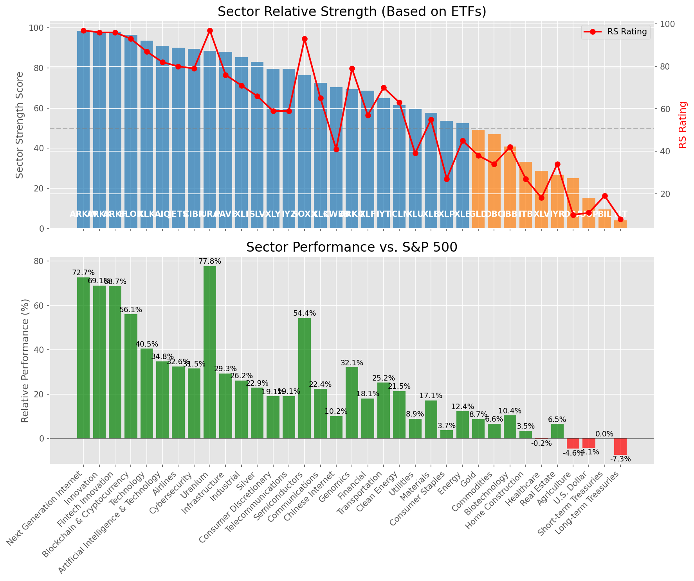

# **Daily Relative Strength Report**

**Date:** 2025-07-08

## **Market Valuation (Buffett Indicator)**

| Metric | Value |
|--------|-------|
| **Market Valuation** | **Overvalued** |
| **Current Ratio** | 10.21 |
| **Historical Mean** | 9.41 |
| **Standard Deviation** | 0.50 |
| **Z-Score (StdDev from Mean)** | 1.59 |
| **Total Market Cap** | $305.94 trillion |
| **GDP** | $29.96 trillion |

## **Market Insights**

### **Market is Overvalued**

The market appears to be trading above historical average valuations. While not at extreme levels, this suggests more modest future returns may be expected. Investors should:

- Focus on companies with reasonable valuations relative to their growth
- Be more selective with new positions
- Look for stocks showing relative strength within their sectors
- Consider trimming positions in extremely overvalued names

Historically, periods of mild overvaluation can persist for extended periods, but returns tend to be below average.

### **Buffett Indicator Overview**

The Buffett Indicator (Total Market Cap / GDP) is a measure of the stock market's valuation relative to the size of the economy. It is named after Warren Buffett, who described it as "probably the best single measure of where valuations stand at any given moment."

- **Values above +2 standard deviations:** Market significantly overvalued
- **Values above +1 standard deviation:** Market overvalued
- **Values between -1 and +1 standard deviations:** Market fairly valued
- **Values below -1 standard deviation:** Market undervalued
- **Values below -2 standard deviations:** Market significantly undervalued

---

## **Sector Relative Strength**

Based on William O'Neil's Relative Strength Methodology

| ETF | Strength | RS Rating | Performance | Above Key MAs | Trend | Sector |
|-----|----------|-----------|-------------|--------------|-------|--------|
| [ARKK](https://www.tradingview.com/chart/?symbol=ARKK) | 98.5 | 97.0 | 69.12% | 10d ✓, 50d ✓, 200d ✓ | ↗️ | Innovation |
| [ARKF](https://www.tradingview.com/chart/?symbol=ARKF) | 98.0 | 96.0 | 68.60% | 10d ✓, 50d ✓, 200d ✓ | ↗️ | Fintech Innovation |
| [ARKW](https://www.tradingview.com/chart/?symbol=ARKW) | 97.5 | 95.0 | 62.73% | 10d ✓, 50d ✓, 200d ✓ | ↗️ | Next Generation Internet |
| [BLOK](https://www.tradingview.com/chart/?symbol=BLOK) | 96.5 | 93.0 | 53.81% | 10d ✓, 50d ✓, 200d ✓ | ↗️ | Blockchain & Cryptocurrency |
| [XLK](https://www.tradingview.com/chart/?symbol=XLK) | 93.5 | 87.0 | 40.46% | 10d ✓, 50d ✓, 200d ✓ | ↗️ | Technology |
| [AIQ](https://www.tradingview.com/chart/?symbol=AIQ) | 91.5 | 83.0 | 34.86% | 10d ✓, 50d ✓, 200d ✓ | ↗️ | Artificial Intelligence & Technology |
| [JETS](https://www.tradingview.com/chart/?symbol=JETS) | 90.5 | 81.0 | 33.17% | 10d ✓, 50d ✓, 200d ✓ | ↗️ | Airlines |
| [CIBR](https://www.tradingview.com/chart/?symbol=CIBR) | 89.5 | 79.0 | 31.20% | 10d ✓, 50d ✓, 200d ✓ | ↗️ | Cybersecurity |
| [URA](https://www.tradingview.com/chart/?symbol=URA) | 88.6 | 97.0 | 76.13% | 10d ✗, 50d ✓, 200d ✓ | ↗️ | Uranium |
| [PAVE](https://www.tradingview.com/chart/?symbol=PAVE) | 88.5 | 77.0 | 29.43% | 10d ✓, 50d ✓, 200d ✓ | ↗️ | Infrastructure |
| [XLI](https://www.tradingview.com/chart/?symbol=XLI) | 86.0 | 72.0 | 26.26% | 10d ✓, 50d ✓, 200d ✓ | ↗️ | Industrial |
| [XLY](https://www.tradingview.com/chart/?symbol=XLY) | 81.0 | 62.0 | 19.64% | 10d ✓, 50d ✓, 200d ✓ | ↗️ | Consumer Discretionary |
| [XLF](https://www.tradingview.com/chart/?symbol=XLF) | 79.5 | 59.0 | 18.22% | 10d ✓, 50d ✓, 200d ✓ | ↗️ | Financial |
| [SOXX](https://www.tradingview.com/chart/?symbol=SOXX) | 76.5 | 93.0 | 54.59% | 10d ✓, 50d ✓, 200d ✓ | ↘️ | Semiconductors |
| [IYZ](https://www.tradingview.com/chart/?symbol=IYZ) | 73.5 | 47.0 | 12.04% | 10d ✓, 50d ✓, 200d ✓ | ↗️ | Telecommunications |
| [XLC](https://www.tradingview.com/chart/?symbol=XLC) | 73.1 | 66.0 | 22.29% | 10d ✗, 50d ✓, 200d ✓ | ↗️ | Communications |
| [SLV](https://www.tradingview.com/chart/?symbol=SLV) | 73.1 | 66.0 | 21.75% | 10d ✗, 50d ✓, 200d ✓ | ↗️ | Silver |
| [KWEB](https://www.tradingview.com/chart/?symbol=KWEB) | 72.0 | 44.0 | 10.76% | 10d ✓, 50d ✓, 200d ✓ | ↗️ | Chinese Internet |
| [ARKG](https://www.tradingview.com/chart/?symbol=ARKG) | 70.0 | 80.0 | 31.82% | 10d ✓, 50d ✓, 200d ✓ | ↘️ | Genomics |
| [IYT](https://www.tradingview.com/chart/?symbol=IYT) | 65.5 | 71.0 | 25.23% | 10d ✓, 50d ✓, 200d ✓ | ↘️ | Transportation |
| [XLP](https://www.tradingview.com/chart/?symbol=XLP) | 65.0 | 30.0 | 3.91% | 10d ✓, 50d ✓, 200d ✓ | ↗️ | Consumer Staples |
| [ICLN](https://www.tradingview.com/chart/?symbol=ICLN) | 62.5 | 65.0 | 21.24% | 10d ✓, 50d ✓, 200d ✓ | ↘️ | Clean Energy |
| [XLB](https://www.tradingview.com/chart/?symbol=XLB) | 58.0 | 56.0 | 16.94% | 10d ✓, 50d ✓, 200d ✓ | ↘️ | Materials |
| [GLD](https://www.tradingview.com/chart/?symbol=GLD) | 50.2 | 40.0 | 8.55% | 10d ✗, 50d ✗, 200d ✓ | ↗️ | Gold |
| [XLU](https://www.tradingview.com/chart/?symbol=XLU) | 49.7 | 39.0 | 8.20% | 10d ✗, 50d ✗, 200d ✓ | ↗️ | Utilities |
| [DBC](https://www.tradingview.com/chart/?symbol=DBC) | 47.5 | 35.0 | 6.68% | 10d ✓, 50d ✓, 200d ✓ | ↘️ | Commodities |
| [XLE](https://www.tradingview.com/chart/?symbol=XLE) | 42.8 | 46.0 | 11.73% | 10d ✓, 50d ✓, 200d ✗ | ↘️ | Energy |
| [IBB](https://www.tradingview.com/chart/?symbol=IBB) | 42.3 | 45.0 | 11.08% | 10d ✓, 50d ✓, 200d ✗ | ↘️ | Biotechnology |
| [ITB](https://www.tradingview.com/chart/?symbol=ITB) | 34.3 | 29.0 | 3.72% | 10d ✓, 50d ✓, 200d ✗ | ↘️ | Home Construction |
| [XLV](https://www.tradingview.com/chart/?symbol=XLV) | 30.8 | 22.0 | 0.27% | 10d ✓, 50d ✓, 200d ✗ | ↘️ | Healthcare |
| [IYR](https://www.tradingview.com/chart/?symbol=IYR) | 27.4 | 35.0 | 6.60% | 10d ✗, 50d ✓, 200d ✗ | ↘️ | Real Estate |
| [DBA](https://www.tradingview.com/chart/?symbol=DBA) | 25.0 | 10.0 | -5.41% | 10d ✗, 50d ✗, 200d ✗ | ↗️ | Agriculture |
| [UUP](https://www.tradingview.com/chart/?symbol=UUP) | 15.9 | 12.0 | -4.02% | 10d ✓, 50d ✗, 200d ✗ | ↘️ | U.S. Dollar |
| [BIL](https://www.tradingview.com/chart/?symbol=BIL) | 10.0 | 20.0 | 0.03% | 10d ✗, 50d ✗, 200d ✗ | ↘️ | Short-term Treasuries |
| [TLT](https://www.tradingview.com/chart/?symbol=TLT) | 4.0 | 8.0 | -7.65% | 10d ✗, 50d ✗, 200d ✗ | ↘️ | Long-term Treasuries |

### **Sector ETF Performance Interpretation**

This table shows the relative strength metrics for different market sectors based on their representative ETFs:

- **ETF**: The ETF used to measure sector performance (click for chart)
- **Strength**: Overall sector strength score (0-100) combining multiple factors
- **RS Rating**: O'Neil RS rating of the sector ETF
- **Performance**: Performance of the sector ETF relative to SPY
- **Above Key MAs**: Whether the ETF is trading above its 10, 50, and 200-day moving averages
- **Trend**: Whether the sector is in an uptrend (↗️) or downtrend (↘️)

### **Current Sector Leadership**

The current market leadership is coming from the following sectors: **Innovation, Fintech Innovation, Next Generation Internet**.

The **Innovation** sector (represented by **ARKK**) is showing particularly strong relative strength with an RS rating of 97.0 and performance of 69.12% vs. the S&P 500. This sector is trading above its 10-day, 50-day, 200-day moving average(s). Investors should consider focusing on high RS stocks within these leading sectors for potential outperformance.

---

## **Buy Recommendations**

The following 35 stocks show exceptional relative strength:

| RS Rating | Buy Score | Current Price | Chart | Name | Ticker |
|-----------|-----------|---------------|-------|------|--------|
| 100 | 100 | $91.88 | [Chart](https://www.tradingview.com/chart/?symbol=HOOD) | Robinhood Markets, Inc. Class A Common Stock | HOOD |
| 100 | 100 | $155.38 | [Chart](https://www.tradingview.com/chart/?symbol=CLS) | Celestica, Inc. | CLS |
| 100 | 100 | $265.31 | [Chart](https://www.tradingview.com/chart/?symbol=DAVE) | Dave Inc. Class A Common Stock | DAVE |
| 100 | 100 | $173.34 | [Chart](https://www.tradingview.com/chart/?symbol=SEZL) | Sezzle Inc. Common Stock | SEZL |
| 99 | 100 | $74.40 | [Chart](https://www.tradingview.com/chart/?symbol=ODD) | ODDITY Tech Ltd. Class A Ordinary Shares | ODD |
| 99 | 100 | $148.26 | [Chart](https://www.tradingview.com/chart/?symbol=LMB) | Limbach Holdings, Inc Common Stock | LMB |
| 99 | 100 | $348.17 | [Chart](https://www.tradingview.com/chart/?symbol=CVNA) | Carvana Co. | CVNA |
| 99 | 100 | $191.45 | [Chart](https://www.tradingview.com/chart/?symbol=NET) | Cloudflare, Inc. Class A common stock, par value $0.001 per share | NET |
| 99 | 100 | $526.50 | [Chart](https://www.tradingview.com/chart/?symbol=GEV) | GE Vernova Inc. | GEV |
| 98 | 100 | $137.29 | [Chart](https://www.tradingview.com/chart/?symbol=PLTR) | Palantir Technologies Inc. Class A Common Stock | PLTR |
| 97 | 100 | $43.99 | [Chart](https://www.tradingview.com/chart/?symbol=FARO) | Faro Technologies Inc | FARO |
| 96 | 100 | $50.21 | [Chart](https://www.tradingview.com/chart/?symbol=ARKF) | ARK Fintech Innovation ETF | ARKF |
| 96 | 100 | $50.47 | [Chart](https://www.tradingview.com/chart/?symbol=INOD) | Innodata Inc. | INOD |
| 95 | 100 | $250.96 | [Chart](https://www.tradingview.com/chart/?symbol=WWD) | Woodward, Inc. | WWD |
| 94 | 100 | $43.62 | [Chart](https://www.tradingview.com/chart/?symbol=KTOS) | Kratos Defense & Security Solutions, Inc. | KTOS |
| 94 | 100 | $503.16 | [Chart](https://www.tradingview.com/chart/?symbol=CRWD) | CrowdStrike Holdings, Inc. Class A Common Stock | CRWD |
| 94 | 100 | $57.08 | [Chart](https://www.tradingview.com/chart/?symbol=IBKR) | Interactive Brokers Group, Inc. Class A Common Stock | IBKR |
| 94 | 100 | $130.72 | [Chart](https://www.tradingview.com/chart/?symbol=FUTU) | Futu Holdings Limited American Depositary Shares | FUTU |
| 94 | 100 | $33.98 | [Chart](https://www.tradingview.com/chart/?symbol=APG) | APi Group Corporation | APG |
| 93 | 100 | $46.06 | [Chart](https://www.tradingview.com/chart/?symbol=DRS) | Leonardo DRS, Inc. Common Stock | DRS |
| 92 | 100 | $43.64 | [Chart](https://www.tradingview.com/chart/?symbol=KD) | Kyndryl Holdings, Inc. | KD |
| 90 | 100 | $92.12 | [Chart](https://www.tradingview.com/chart/?symbol=TPR) | Tapestry, Inc. Common Stock | TPR |
| 87 | 100 | $30.06 | [Chart](https://www.tradingview.com/chart/?symbol=CAE) | CAE INC | CAE |
| 87 | 100 | $28.39 | [Chart](https://www.tradingview.com/chart/?symbol=SRAD) | Sportradar Group AG Class A Ordinary Shares | SRAD |
| 84 | 98 | $94.56 | [Chart](https://www.tradingview.com/chart/?symbol=SNEX) | StoneX Group Inc. Common Stock | SNEX |
| 87 | 97 | $29.89 | [Chart](https://www.tradingview.com/chart/?symbol=NTGR) | NETGEAR, Inc. | NTGR |
| 86 | 97 | $24.96 | [Chart](https://www.tradingview.com/chart/?symbol=KAR) | OPENLANE, Inc | KAR |
| 87 | 96 | $65.57 | [Chart](https://www.tradingview.com/chart/?symbol=RYTM) | Rhythm Pharmaceuticals, Inc. Common Stock | RYTM |
| 85 | 96 | $76.23 | [Chart](https://www.tradingview.com/chart/?symbol=CTVA) | Corteva, Inc. Common Stock | CTVA |
| 84 | 96 | $59.54 | [Chart](https://www.tradingview.com/chart/?symbol=SHLD) | Global X Defense Tech ETF | SHLD |
| 84 | 95 | $134.07 | [Chart](https://www.tradingview.com/chart/?symbol=NTES) | NetEase, inc. | NTES |
| 83 | 93 | $35.34 | [Chart](https://www.tradingview.com/chart/?symbol=ATAT) | Atour Lifestyle Holdings Limited American Depositary Shares | ATAT |
| 82 | 92 | $81.36 | [Chart](https://www.tradingview.com/chart/?symbol=WFC) | Wells Fargo & Co. | WFC |
| 81 | 92 | $5699.56 | [Chart](https://www.tradingview.com/chart/?symbol=BKNG) | Booking Holdings Inc. Common Stock | BKNG |
| 81 | 91 | $267.55 | [Chart](https://www.tradingview.com/chart/?symbol=FDN) | First Trust Dow Jones Internet Index Fund ETF | FDN |

---

## **Sell Recommendations**

The following 89 stocks show deteriorating relative strength:

| RS Rating | Sell Score | Current Price | Chart | Name | Ticker |
|-----------|------------|---------------|-------|------|--------|
| 1 | 100 | $25.25 | [Chart](https://www.tradingview.com/chart/?symbol=QID) | ProShares UltraShort QQQ | QID |
| 1 | 100 | $16.53 | [Chart](https://www.tradingview.com/chart/?symbol=SDS) | ProShares UltraShort S&P500 | SDS |
| 1 | 100 | $14.20 | [Chart](https://www.tradingview.com/chart/?symbol=NVDS) | Investment Managers Series Trust II Tradr 1.5X Short NVDA Daily ETF | NVDS |
| 1 | 100 | $25.83 | [Chart](https://www.tradingview.com/chart/?symbol=TECS) | Direxion Daily Technology Bear 3x Shares | TECS |
| 1 | 100 | $40.90 | [Chart](https://www.tradingview.com/chart/?symbol=SDOW) | ProShares UltraPro Short Dow 30 | SDOW |
| 2 | 100 | $35.41 | [Chart](https://www.tradingview.com/chart/?symbol=SARK) | Investment Managers Series Trust II Tradr 1X Short Innovation Daily ETF | SARK |
| 2 | 100 | $19.57 | [Chart](https://www.tradingview.com/chart/?symbol=BITI) | ProShares Short Bitcoin ETF | BITI |
| 2 | 100 | $24.02 | [Chart](https://www.tradingview.com/chart/?symbol=DXD) | ProShares UltraShort Dow 30 | DXD |
| 2 | 100 | $33.64 | [Chart](https://www.tradingview.com/chart/?symbol=PSQ) | ProShares Short QQQ | PSQ |
| 2 | 100 | $10.17 | [Chart](https://www.tradingview.com/chart/?symbol=HPK) | HighPeak Energy, Inc. Common Stock | HPK |
| 2 | 100 | $10.38 | [Chart](https://www.tradingview.com/chart/?symbol=EMBC) | Embecta Corp. Common Stock | EMBC |
| 2 | 100 | $13.18 | [Chart](https://www.tradingview.com/chart/?symbol=IART) | Integra LifeSciences Holdings | IART |
| 3 | 100 | $44.70 | [Chart](https://www.tradingview.com/chart/?symbol=LINE) | Lineage, Inc. Common Stock | LINE |
| 3 | 100 | $39.55 | [Chart](https://www.tradingview.com/chart/?symbol=SH) | ProShares Short S&P500 | SH |
| 3 | 100 | $35.92 | [Chart](https://www.tradingview.com/chart/?symbol=IBTA) | Ibotta, Inc. | IBTA |
| 3 | 100 | $139.74 | [Chart](https://www.tradingview.com/chart/?symbol=KRYS) | Krystal Biotech, Inc. Common Stock | KRYS |
| 4 | 100 | $51.07 | [Chart](https://www.tradingview.com/chart/?symbol=ASGN) | ASGN Incorporated | ASGN |
| 4 | 100 | $25.38 | [Chart](https://www.tradingview.com/chart/?symbol=DOG) | ProShares Short Dow30 | DOG |
| 4 | 100 | $12.75 | [Chart](https://www.tradingview.com/chart/?symbol=CCRN) | Cross Country Healthcare Inc | CCRN |
| 4 | 100 | $10.23 | [Chart](https://www.tradingview.com/chart/?symbol=LBTYK) | Liberty Global Ltd. Class C Common Shares | LBTYK |
| 4 | 100 | $24.97 | [Chart](https://www.tradingview.com/chart/?symbol=CRTO) | Criteo S.A. | CRTO |
| 5 | 100 | $17.18 | [Chart](https://www.tradingview.com/chart/?symbol=HP) | Helmerich & Payne, Inc. | HP |
| 5 | 100 | $14.54 | [Chart](https://www.tradingview.com/chart/?symbol=VRE) | Veris Residential, Inc. | VRE |
| 5 | 100 | $52.11 | [Chart](https://www.tradingview.com/chart/?symbol=LW) | Lamb Weston Holdings, Inc. | LW |
| 6 | 100 | $64.07 | [Chart](https://www.tradingview.com/chart/?symbol=ZROZ) | PIMCO 25+ Year Zero Coupon U.S. Treasury Index Exchange-Traded Fund | ZROZ |
| 6 | 100 | $17.90 | [Chart](https://www.tradingview.com/chart/?symbol=APLS) | Apellis Pharmaceuticals, Inc. Common Stock | APLS |
| 6 | 100 | $82.34 | [Chart](https://www.tradingview.com/chart/?symbol=LNTH) | Lantheus Holdings, Inc | LNTH |
| 7 | 100 | $27.17 | [Chart](https://www.tradingview.com/chart/?symbol=GTY) | Getty Realty Corp. | GTY |
| 8 | 100 | $45.54 | [Chart](https://www.tradingview.com/chart/?symbol=CWT) | California Water Service | CWT |
| 8 | 100 | $85.75 | [Chart](https://www.tradingview.com/chart/?symbol=TLT) | iShares 20+ Year Treasury Bond ETF | TLT |
| 8 | 100 | $85.60 | [Chart](https://www.tradingview.com/chart/?symbol=SIGI) | Selective Insurance Group | SIGI |
| 9 | 100 | $38.56 | [Chart](https://www.tradingview.com/chart/?symbol=LKQ) | LKQ Corporation | LKQ |
| 10 | 100 | $52.73 | [Chart](https://www.tradingview.com/chart/?symbol=CNMD) | CONMED Corporation | CNMD |
| 11 | 100 | $40.68 | [Chart](https://www.tradingview.com/chart/?symbol=POR) | Portland General Electric Company | POR |
| 11 | 100 | $131.59 | [Chart](https://www.tradingview.com/chart/?symbol=KMB) | Kimberly-Clark Corp. | KMB |
| 12 | 100 | $10.32 | [Chart](https://www.tradingview.com/chart/?symbol=MUC) | BLACKROCK MUNIHOLDINGS CALIFORNIA QUALITY FUND, INC | MUC |
| 2 | 99 | $232.59 | [Chart](https://www.tradingview.com/chart/?symbol=MOH) | Molina Healthcare, Inc. | MOH |
| 6 | 99 | $13.70 | [Chart](https://www.tradingview.com/chart/?symbol=EIC) | Eagle Point Income Company Inc. | EIC |
| 7 | 99 | $26.41 | [Chart](https://www.tradingview.com/chart/?symbol=VCYT) | Veracyte, Inc. | VCYT |
| 9 | 99 | $61.77 | [Chart](https://www.tradingview.com/chart/?symbol=ELS) | Equity Lifestyle Properties, Inc. | ELS |
| 11 | 99 | $10.38 | [Chart](https://www.tradingview.com/chart/?symbol=NMZ) | Nuveen Municipal High Income Opportunity Fund | NMZ |
| 16 | 99 | $17.89 | [Chart](https://www.tradingview.com/chart/?symbol=ZTO) | ZTO Express (Cayman) Inc. American Depositary Shares, each representing one Class A ordinary share | ZTO |
| 11 | 98 | $15.07 | [Chart](https://www.tradingview.com/chart/?symbol=SEM) | SELECT MEDICAL HOLDINGS CORP | SEM |
| 18 | 98 | $29.12 | [Chart](https://www.tradingview.com/chart/?symbol=SPTS) | SPDR Portfolio Short Term Treasury ETF | SPTS |
| 9 | 97 | $48.63 | [Chart](https://www.tradingview.com/chart/?symbol=SNY) | Sanofi American Depositary Shares (Each representing one-half of one ordinary share) | SNY |
| 17 | 96 | $15.58 | [Chart](https://www.tradingview.com/chart/?symbol=HQH) | abrdn Healthcare Investors | HQH |
| 7 | 95 | $25.28 | [Chart](https://www.tradingview.com/chart/?symbol=DRV) | Direxion Daily Real Estate Bear 3X Shares | DRV |
| 10 | 95 | $76.49 | [Chart](https://www.tradingview.com/chart/?symbol=CNS) | Cohen & Steers Inc. | CNS |
| 10 | 95 | $12.67 | [Chart](https://www.tradingview.com/chart/?symbol=PCN) | PIMCO Corporate & Income Strategy Fund | PCN |
| 7 | 94 | $129.71 | [Chart](https://www.tradingview.com/chart/?symbol=ICUI) | ICU Medical Inc | ICUI |
| 9 | 94 | $71.22 | [Chart](https://www.tradingview.com/chart/?symbol=RLI) | RLI Corp. | RLI |
| 12 | 94 | $76.47 | [Chart](https://www.tradingview.com/chart/?symbol=AWR) | American States Water Company | AWR |
| 16 | 94 | $15.97 | [Chart](https://www.tradingview.com/chart/?symbol=BNL) | Broadstone Net Lease, Inc. | BNL |
| 18 | 93 | $32.33 | [Chart](https://www.tradingview.com/chart/?symbol=INVH) | Invitation Homes Inc. Common Stock | INVH |
| 18 | 93 | $47.21 | [Chart](https://www.tradingview.com/chart/?symbol=KBR) | KBR, Inc. | KBR |
| 21 | 92 | $83.20 | [Chart](https://www.tradingview.com/chart/?symbol=KSPI) | Joint Stock Company Kaspi.kz American Depository Shares | KSPI |
| 12 | 91 | $68.82 | [Chart](https://www.tradingview.com/chart/?symbol=BRC) | Brady Corporation | BRC |
| 18 | 91 | $13.97 | [Chart](https://www.tradingview.com/chart/?symbol=DOLE) | Dole plc | DOLE |
| 16 | 89 | $22.95 | [Chart](https://www.tradingview.com/chart/?symbol=SCHZ) | Schwab US Aggregate Bond ETF | SCHZ |
| 19 | 89 | $22.84 | [Chart](https://www.tradingview.com/chart/?symbol=IBTG) | iShares iBonds Dec 2026 Term Treasury ETF | IBTG |
| 24 | 89 | $105.35 | [Chart](https://www.tradingview.com/chart/?symbol=DEO) | Diageo plc | DEO |
| 18 | 88 | $34.70 | [Chart](https://www.tradingview.com/chart/?symbol=PECO) | Phillips Edison & Company, Inc. Common Stock | PECO |
| 23 | 86 | $340.63 | [Chart](https://www.tradingview.com/chart/?symbol=EG) | Everest Group, Ltd. | EG |
| 25 | 86 | $61.13 | [Chart](https://www.tradingview.com/chart/?symbol=UL) | Unilever plc | UL |
| 18 | 85 | $105.36 | [Chart](https://www.tradingview.com/chart/?symbol=DECK) | Deckers Outdoor Corp | DECK |
| 18 | 84 | $35.20 | [Chart](https://www.tradingview.com/chart/?symbol=LTC) | LTC Properties, Inc. | LTC |
| 20 | 83 | $110.14 | [Chart](https://www.tradingview.com/chart/?symbol=SHV) | iShares Short Treasury Bond ETF | SHV |
| 22 | 83 | $35.63 | [Chart](https://www.tradingview.com/chart/?symbol=AMH) | AMERICAN HOMES 4 RENT | AMH |
| 25 | 83 | $23.12 | [Chart](https://www.tradingview.com/chart/?symbol=IBHF) | iShares iBonds 2026 Term High Yield and Income ETF | IBHF |
| 23 | 81 | $40.88 | [Chart](https://www.tradingview.com/chart/?symbol=UDR) | UDR, Inc. | UDR |
| 25 | 81 | $19.11 | [Chart](https://www.tradingview.com/chart/?symbol=MSDL) | Morgan Stanley Direct Lending Fund | MSDL |
| 25 | 79 | $297.91 | [Chart](https://www.tradingview.com/chart/?symbol=UTHR) | United Therapeutics Corp | UTHR |
| 29 | 79 | $118.03 | [Chart](https://www.tradingview.com/chart/?symbol=ITGR) | Integer Holdings Corporation | ITGR |
| 30 | 79 | $194.41 | [Chart](https://www.tradingview.com/chart/?symbol=RGA) | Reinsurance Group of America, Incorporated | RGA |
| 31 | 77 | $346.83 | [Chart](https://www.tradingview.com/chart/?symbol=SHW) | The Sherwin-Williams Company | SHW |
| 37 | 77 | $463.87 | [Chart](https://www.tradingview.com/chart/?symbol=LMT) | Lockheed Martin Corp. | LMT |
| 29 | 76 | $30.87 | [Chart](https://www.tradingview.com/chart/?symbol=AXTA) | Axalta Coating Systems Ltd. | AXTA |
| 27 | 75 | $70.33 | [Chart](https://www.tradingview.com/chart/?symbol=AZN) | AstraZeneca PLC | AZN |
| 27 | 75 | $219.41 | [Chart](https://www.tradingview.com/chart/?symbol=MKTX) | MarketAxess Holdings Inc. | MKTX |
| 34 | 75 | $30.50 | [Chart](https://www.tradingview.com/chart/?symbol=BAX) | Baxter International Inc. | BAX |
| 28 | 74 | $240.12 | [Chart](https://www.tradingview.com/chart/?symbol=RNR) | RenaissanceRe Holdings Ltd. | RNR |
| 33 | 74 | $21.33 | [Chart](https://www.tradingview.com/chart/?symbol=SPT) | Sprout Social, Inc Class A Common Stock | SPT |
| 35 | 74 | $103.47 | [Chart](https://www.tradingview.com/chart/?symbol=FMX) | FOMENTO ECONOMICO MEXICANO, S.A.B. DE C.V. | FMX |
| 33 | 73 | $12.14 | [Chart](https://www.tradingview.com/chart/?symbol=DSL) | DOUBLELINE INCOME SOLUTIONS FUND | DSL |
| 30 | 72 | $26.29 | [Chart](https://www.tradingview.com/chart/?symbol=TBBB) | BBB Foods Inc. | TBBB |
| 33 | 72 | $17.43 | [Chart](https://www.tradingview.com/chart/?symbol=NVCR) | NovoCure Limited Ordinary Shares | NVCR |
| 33 | 71 | $39.48 | [Chart](https://www.tradingview.com/chart/?symbol=LZB) | La-Z-Boy Incorporated | LZB |
| 36 | 70 | $304.82 | [Chart](https://www.tradingview.com/chart/?symbol=ACN) | Accenture PLC | ACN |
| 35 | 67 | $25.52 | [Chart](https://www.tradingview.com/chart/?symbol=BRX) | BRIXMOR PROPERTY GROUP INC. | BRX |

## **Methodology**

This report uses William O'Neil's relative strength methodology from Investors Business Daily:

* **RS Rating**: Percentile rank of stock's performance vs. S&P 500 over the past 63 trading days (1-99 scale)
* **Buy Criteria**: RS Rating >= 80, price above 50-day MA, strong uptrend, increasing volume
* **Sell Criteria**: RS Rating < 40, price below 50-day MA, downtrend, decreasing volume

### **O'Neil's Key Principles**

1. **Focus on relative performance** - stocks outperforming the market
2. **Price trend confirmation** - stock must be in an uptrend
3. **Volume confirmation** - strong volume supports price moves
4. **Moving average validation** - price above key moving averages
5. **Market leaders only** - concentrate on top-performing stocks

*Report generated automatically after market close*