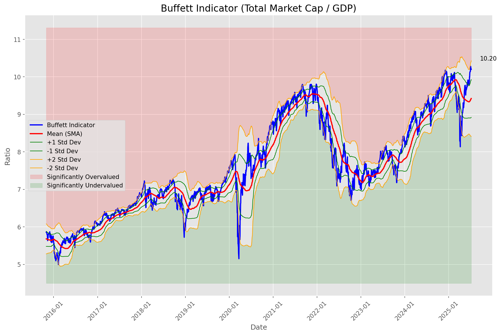
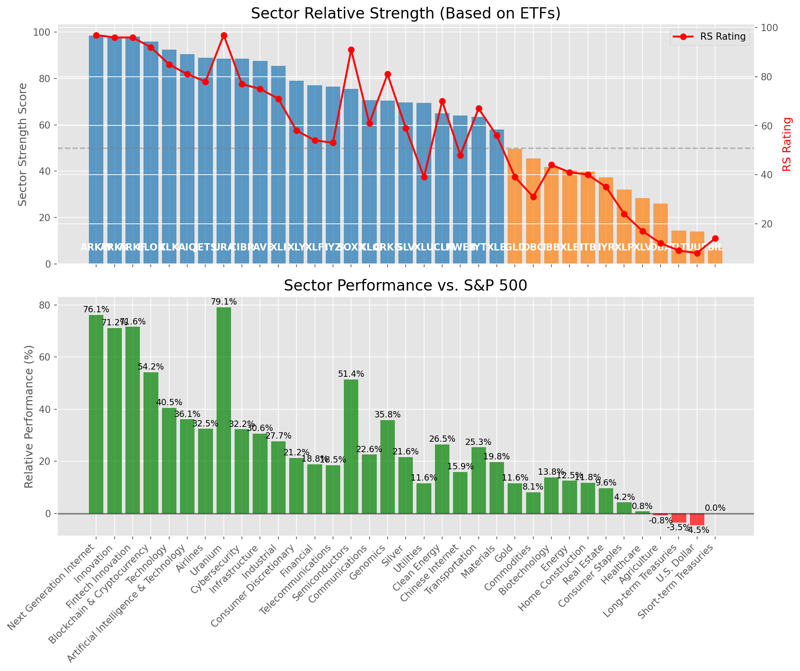

# **Daily Relative Strength Report**

**Date:** 2025-07-09

## **Market Valuation (Buffett Indicator)**

| Metric | Value |
|--------|-------|
| **Market Valuation** | **Overvalued** |
| **Current Ratio** | 10.26 |
| **Historical Mean** | 9.42 |
| **Standard Deviation** | 0.50 |
| **Z-Score (StdDev from Mean)** | 1.54 |
| **Total Market Cap** | $307.50 trillion |
| **GDP** | $29.96 trillion |

## **Market Insights**

### **Market is Overvalued**

The market appears to be trading above historical average valuations. While not at extreme levels, this suggests more modest future returns may be expected. Investors should:

- Focus on companies with reasonable valuations relative to their growth
- Be more selective with new positions
- Look for stocks showing relative strength within their sectors
- Consider trimming positions in extremely overvalued names

Historically, periods of mild overvaluation can persist for extended periods, but returns tend to be below average.

### **Buffett Indicator Overview**

The Buffett Indicator (Total Market Cap / GDP) is a measure of the stock market's valuation relative to the size of the economy. It is named after Warren Buffett, who described it as "probably the best single measure of where valuations stand at any given moment."

- **Values above +2 standard deviations:** Market significantly overvalued
- **Values above +1 standard deviation:** Market overvalued
- **Values between -1 and +1 standard deviations:** Market fairly valued
- **Values below -1 standard deviation:** Market undervalued
- **Values below -2 standard deviations:** Market significantly undervalued

---

## **Sector Relative Strength**

Based on William O'Neil's Relative Strength Methodology

| ETF | Strength | RS Rating | Performance | Above Key MAs | Trend | Sector |
|-----|----------|-----------|-------------|--------------|-------|--------|
| [ARKW](https://www.tradingview.com/chart/?symbol=ARKW) | 98.5 | 97.0 | 76.14% | 10d ✓, 50d ✓, 200d ✓ | ↗️ | Next Generation Internet |
| [ARKF](https://www.tradingview.com/chart/?symbol=ARKF) | 98.0 | 96.0 | 71.57% | 10d ✓, 50d ✓, 200d ✓ | ↗️ | Fintech Innovation |
| [ARKK](https://www.tradingview.com/chart/?symbol=ARKK) | 98.0 | 96.0 | 71.17% | 10d ✓, 50d ✓, 200d ✓ | ↗️ | Innovation |
| [BLOK](https://www.tradingview.com/chart/?symbol=BLOK) | 96.0 | 92.0 | 54.17% | 10d ✓, 50d ✓, 200d ✓ | ↗️ | Blockchain & Cryptocurrency |
| [XLK](https://www.tradingview.com/chart/?symbol=XLK) | 92.5 | 85.0 | 40.54% | 10d ✓, 50d ✓, 200d ✓ | ↗️ | Technology |
| [AIQ](https://www.tradingview.com/chart/?symbol=AIQ) | 90.5 | 81.0 | 36.06% | 10d ✓, 50d ✓, 200d ✓ | ↗️ | Artificial Intelligence & Technology |
| [JETS](https://www.tradingview.com/chart/?symbol=JETS) | 89.0 | 78.0 | 32.46% | 10d ✓, 50d ✓, 200d ✓ | ↗️ | Airlines |
| [URA](https://www.tradingview.com/chart/?symbol=URA) | 88.6 | 97.0 | 79.08% | 10d ✗, 50d ✓, 200d ✓ | ↗️ | Uranium |
| [CIBR](https://www.tradingview.com/chart/?symbol=CIBR) | 88.5 | 77.0 | 32.25% | 10d ✓, 50d ✓, 200d ✓ | ↗️ | Cybersecurity |
| [PAVE](https://www.tradingview.com/chart/?symbol=PAVE) | 87.5 | 75.0 | 30.64% | 10d ✓, 50d ✓, 200d ✓ | ↗️ | Infrastructure |
| [XLI](https://www.tradingview.com/chart/?symbol=XLI) | 85.5 | 71.0 | 27.69% | 10d ✓, 50d ✓, 200d ✓ | ↗️ | Industrial |
| [XLY](https://www.tradingview.com/chart/?symbol=XLY) | 79.0 | 58.0 | 21.21% | 10d ✓, 50d ✓, 200d ✓ | ↗️ | Consumer Discretionary |
| [XLF](https://www.tradingview.com/chart/?symbol=XLF) | 77.0 | 54.0 | 18.85% | 10d ✓, 50d ✓, 200d ✓ | ↗️ | Financial |
| [IYZ](https://www.tradingview.com/chart/?symbol=IYZ) | 76.5 | 53.0 | 18.50% | 10d ✓, 50d ✓, 200d ✓ | ↗️ | Telecommunications |
| [SOXX](https://www.tradingview.com/chart/?symbol=SOXX) | 75.5 | 91.0 | 51.37% | 10d ✓, 50d ✓, 200d ✓ | ↘️ | Semiconductors |
| [XLC](https://www.tradingview.com/chart/?symbol=XLC) | 70.6 | 61.0 | 22.56% | 10d ✗, 50d ✓, 200d ✓ | ↗️ | Communications |
| [ARKG](https://www.tradingview.com/chart/?symbol=ARKG) | 70.5 | 81.0 | 35.78% | 10d ✓, 50d ✓, 200d ✓ | ↘️ | Genomics |
| [SLV](https://www.tradingview.com/chart/?symbol=SLV) | 69.6 | 59.0 | 21.59% | 10d ✗, 50d ✓, 200d ✓ | ↗️ | Silver |
| [XLU](https://www.tradingview.com/chart/?symbol=XLU) | 69.5 | 39.0 | 11.60% | 10d ✓, 50d ✓, 200d ✓ | ↗️ | Utilities |
| [ICLN](https://www.tradingview.com/chart/?symbol=ICLN) | 65.0 | 70.0 | 26.51% | 10d ✓, 50d ✓, 200d ✓ | ↘️ | Clean Energy |
| [KWEB](https://www.tradingview.com/chart/?symbol=KWEB) | 64.1 | 48.0 | 15.91% | 10d ✗, 50d ✓, 200d ✓ | ↗️ | Chinese Internet |
| [IYT](https://www.tradingview.com/chart/?symbol=IYT) | 63.5 | 67.0 | 25.32% | 10d ✓, 50d ✓, 200d ✓ | ↘️ | Transportation |
| [XLB](https://www.tradingview.com/chart/?symbol=XLB) | 58.0 | 56.0 | 19.77% | 10d ✓, 50d ✓, 200d ✓ | ↘️ | Materials |
| [GLD](https://www.tradingview.com/chart/?symbol=GLD) | 49.7 | 39.0 | 11.62% | 10d ✗, 50d ✗, 200d ✓ | ↗️ | Gold |
| [DBC](https://www.tradingview.com/chart/?symbol=DBC) | 45.5 | 31.0 | 8.10% | 10d ✓, 50d ✓, 200d ✓ | ↘️ | Commodities |
| [IBB](https://www.tradingview.com/chart/?symbol=IBB) | 41.8 | 44.0 | 13.84% | 10d ✓, 50d ✓, 200d ✗ | ↘️ | Biotechnology |
| [XLE](https://www.tradingview.com/chart/?symbol=XLE) | 40.3 | 41.0 | 12.54% | 10d ✓, 50d ✓, 200d ✗ | ↘️ | Energy |
| [ITB](https://www.tradingview.com/chart/?symbol=ITB) | 39.8 | 40.0 | 11.81% | 10d ✓, 50d ✓, 200d ✗ | ↘️ | Home Construction |
| [IYR](https://www.tradingview.com/chart/?symbol=IYR) | 37.3 | 35.0 | 9.63% | 10d ✓, 50d ✓, 200d ✗ | ↘️ | Real Estate |
| [XLP](https://www.tradingview.com/chart/?symbol=XLP) | 32.0 | 24.0 | 4.22% | 10d ✗, 50d ✗, 200d ✗ | ↗️ | Consumer Staples |
| [XLV](https://www.tradingview.com/chart/?symbol=XLV) | 28.3 | 17.0 | 0.76% | 10d ✓, 50d ✓, 200d ✗ | ↘️ | Healthcare |
| [DBA](https://www.tradingview.com/chart/?symbol=DBA) | 26.0 | 12.0 | -0.80% | 10d ✗, 50d ✗, 200d ✗ | ↗️ | Agriculture |
| [TLT](https://www.tradingview.com/chart/?symbol=TLT) | 14.4 | 9.0 | -3.46% | 10d ✗, 50d ✓, 200d ✗ | ↘️ | Long-term Treasuries |
| [UUP](https://www.tradingview.com/chart/?symbol=UUP) | 13.9 | 8.0 | -4.55% | 10d ✓, 50d ✗, 200d ✗ | ↘️ | U.S. Dollar |
| [BIL](https://www.tradingview.com/chart/?symbol=BIL) | 7.0 | 14.0 | 0.03% | 10d ✗, 50d ✗, 200d ✗ | ↘️ | Short-term Treasuries |

### **Sector ETF Performance Interpretation**

This table shows the relative strength metrics for different market sectors based on their representative ETFs:

- **ETF**: The ETF used to measure sector performance (click for chart)
- **Strength**: Overall sector strength score (0-100) combining multiple factors
- **RS Rating**: O'Neil RS rating of the sector ETF
- **Performance**: Performance of the sector ETF relative to SPY
- **Above Key MAs**: Whether the ETF is trading above its 10, 50, and 200-day moving averages
- **Trend**: Whether the sector is in an uptrend (↗️) or downtrend (↘️)

### **Current Sector Leadership**

The current market leadership is coming from the following sectors: **Next Generation Internet, Fintech Innovation, Innovation**.

The **Next Generation Internet** sector (represented by **ARKW**) is showing particularly strong relative strength with an RS rating of 97.0 and performance of 76.14% vs. the S&P 500. This sector is trading above its 10-day, 50-day, 200-day moving average(s). Investors should consider focusing on high RS stocks within these leading sectors for potential outperformance.

---

## **Buy Recommendations**

The following 55 stocks show exceptional relative strength:

| RS Rating | Buy Score | Current Price | Chart | Name | Ticker |
|-----------|-----------|---------------|-------|------|--------|
| 100 | 100 | $36.53 | [Chart](https://www.tradingview.com/chart/?symbol=GRPN) | Groupon, Inc.Common Stock | GRPN |
| 100 | 100 | $179.37 | [Chart](https://www.tradingview.com/chart/?symbol=LEU) | Centrus Energy Corp. | LEU |
| 100 | 100 | $94.54 | [Chart](https://www.tradingview.com/chart/?symbol=HOOD) | Robinhood Markets, Inc. Class A Common Stock | HOOD |
| 99 | 100 | $75.77 | [Chart](https://www.tradingview.com/chart/?symbol=ODD) | ODDITY Tech Ltd. Class A Ordinary Shares | ODD |
| 99 | 100 | $106.68 | [Chart](https://www.tradingview.com/chart/?symbol=RBLX) | Roblox Corporation | RBLX |
| 99 | 100 | $145.69 | [Chart](https://www.tradingview.com/chart/?symbol=LMB) | Limbach Holdings, Inc Common Stock | LMB |
| 99 | 100 | $351.09 | [Chart](https://www.tradingview.com/chart/?symbol=CVNA) | Carvana Co. | CVNA |
| 98 | 100 | $43.90 | [Chart](https://www.tradingview.com/chart/?symbol=FARO) | Faro Technologies Inc | FARO |
| 98 | 100 | $143.13 | [Chart](https://www.tradingview.com/chart/?symbol=PLTR) | Palantir Technologies Inc. Class A Common Stock | PLTR |
| 98 | 100 | $104.77 | [Chart](https://www.tradingview.com/chart/?symbol=VRNA) | Verona Pharma plc | VRNA |
| 98 | 100 | $535.77 | [Chart](https://www.tradingview.com/chart/?symbol=GEV) | GE Vernova Inc. | GEV |
| 97 | 100 | $142.40 | [Chart](https://www.tradingview.com/chart/?symbol=FUTU) | Futu Holdings Limited American Depositary Shares | FUTU |
| 97 | 100 | $316.50 | [Chart](https://www.tradingview.com/chart/?symbol=ZS) | Zscaler, Inc. Common Stock | ZS |
| 96 | 100 | $49.06 | [Chart](https://www.tradingview.com/chart/?symbol=REVG) | REV Group, Inc. | REVG |
| 96 | 100 | $51.23 | [Chart](https://www.tradingview.com/chart/?symbol=ARKF) | ARK Fintech Innovation ETF | ARKF |
| 96 | 100 | $91.59 | [Chart](https://www.tradingview.com/chart/?symbol=RBRK) | Rubrik, Inc. | RBRK |
| 96 | 100 | $38.50 | [Chart](https://www.tradingview.com/chart/?symbol=AS) | Amer Sports, Inc. | AS |
| 95 | 100 | $52.04 | [Chart](https://www.tradingview.com/chart/?symbol=INOD) | Innodata Inc. | INOD |
| 94 | 100 | $34.49 | [Chart](https://www.tradingview.com/chart/?symbol=APG) | APi Group Corporation | APG |
| 94 | 100 | $21.36 | [Chart](https://www.tradingview.com/chart/?symbol=MAG) | MAG Silver Corp. | MAG |
| 94 | 100 | $89.00 | [Chart](https://www.tradingview.com/chart/?symbol=RYTM) | Rhythm Pharmaceuticals, Inc. Common Stock | RYTM |
| 94 | 100 | $46.02 | [Chart](https://www.tradingview.com/chart/?symbol=KTOS) | Kratos Defense & Security Solutions, Inc. | KTOS |
| 94 | 100 | $57.84 | [Chart](https://www.tradingview.com/chart/?symbol=IBKR) | Interactive Brokers Group, Inc. Class A Common Stock | IBKR |
| 93 | 100 | $181.42 | [Chart](https://www.tradingview.com/chart/?symbol=HWM) | Howmet Aerospace Inc. | HWM |
| 93 | 100 | $71.93 | [Chart](https://www.tradingview.com/chart/?symbol=URBN) | Urban Outfitters Inc | URBN |
| 93 | 100 | $30.38 | [Chart](https://www.tradingview.com/chart/?symbol=DB) | Deutsche Bank Aktiengesellschaft | DB |
| 93 | 100 | $252.03 | [Chart](https://www.tradingview.com/chart/?symbol=WWD) | Woodward, Inc. | WWD |
| 93 | 100 | $513.51 | [Chart](https://www.tradingview.com/chart/?symbol=CRWD) | CrowdStrike Holdings, Inc. Class A Common Stock | CRWD |
| 92 | 100 | $352.74 | [Chart](https://www.tradingview.com/chart/?symbol=APP) | Applovin Corporation Class A Common Stock | APP |
| 92 | 100 | $47.01 | [Chart](https://www.tradingview.com/chart/?symbol=DRS) | Leonardo DRS, Inc. Common Stock | DRS |
| 92 | 100 | $42.85 | [Chart](https://www.tradingview.com/chart/?symbol=KD) | Kyndryl Holdings, Inc. | KD |
| 91 | 100 | $95.31 | [Chart](https://www.tradingview.com/chart/?symbol=TPR) | Tapestry, Inc. Common Stock | TPR |
| 91 | 100 | $45.98 | [Chart](https://www.tradingview.com/chart/?symbol=BBIO) | BridgeBio Pharma, Inc. Common Stock | BBIO |
| 91 | 100 | $290.56 | [Chart](https://www.tradingview.com/chart/?symbol=RL) | Ralph Lauren Corporation | RL |
| 90 | 100 | $246.06 | [Chart](https://www.tradingview.com/chart/?symbol=DASH) | DoorDash, Inc. Class A Common Stock | DASH |
| 90 | 100 | $250.33 | [Chart](https://www.tradingview.com/chart/?symbol=GE) | GE Aerospace | GE |
| 89 | 100 | $44.64 | [Chart](https://www.tradingview.com/chart/?symbol=TOST) | Toast, Inc. | TOST |
| 89 | 100 | $18.63 | [Chart](https://www.tradingview.com/chart/?symbol=BCS) | Barclays PLC | BCS |
| 88 | 100 | $64.14 | [Chart](https://www.tradingview.com/chart/?symbol=CAKE) | Cheesecake Factory (The) | CAKE |
| 87 | 100 | $29.41 | [Chart](https://www.tradingview.com/chart/?symbol=SRAD) | Sportradar Group AG Class A Ordinary Shares | SRAD |
| 89 | 99 | $103.46 | [Chart](https://www.tradingview.com/chart/?symbol=SANM) | Sanmina  Corp | SANM |
| 89 | 99 | $29.98 | [Chart](https://www.tradingview.com/chart/?symbol=NTGR) | NETGEAR, Inc. | NTGR |
| 88 | 99 | $31.65 | [Chart](https://www.tradingview.com/chart/?symbol=HODL) | VanEck Bitcoin ETF | HODL |
| 88 | 99 | $49.57 | [Chart](https://www.tradingview.com/chart/?symbol=BTC) | Grayscale Bitcoin Mini Trust ETF | BTC |
| 88 | 98 | $63.58 | [Chart](https://www.tradingview.com/chart/?symbol=IBIT) | iShares Bitcoin Trust ETF | IBIT |
| 85 | 98 | $29.54 | [Chart](https://www.tradingview.com/chart/?symbol=CAE) | CAE INC | CAE |
| 86 | 97 | $36.21 | [Chart](https://www.tradingview.com/chart/?symbol=ATAT) | Atour Lifestyle Holdings Limited American Depositary Shares | ATAT |
| 83 | 97 | $97.10 | [Chart](https://www.tradingview.com/chart/?symbol=SNEX) | StoneX Group Inc. Common Stock | SNEX |
| 85 | 96 | $25.24 | [Chart](https://www.tradingview.com/chart/?symbol=KAR) | OPENLANE, Inc | KAR |
| 84 | 96 | $60.30 | [Chart](https://www.tradingview.com/chart/?symbol=SHLD) | Global X Defense Tech ETF | SHLD |
| 85 | 95 | $46.53 | [Chart](https://www.tradingview.com/chart/?symbol=AU) | AngloGold Ashanti plc | AU |
| 82 | 94 | $26.62 | [Chart](https://www.tradingview.com/chart/?symbol=OR) | OR Royalties Inc. | OR |
| 82 | 93 | $76.20 | [Chart](https://www.tradingview.com/chart/?symbol=CTVA) | Corteva, Inc. Common Stock | CTVA |
| 82 | 92 | $256.57 | [Chart](https://www.tradingview.com/chart/?symbol=WTS) | Watts Water Technologies, Inc. Class A | WTS |
| 80 | 90 | $112.07 | [Chart](https://www.tradingview.com/chart/?symbol=SPMO) | Invesco S&P 500 Momentum ETF | SPMO |

---

## **Sell Recommendations**

The following 75 stocks show deteriorating relative strength:

| RS Rating | Sell Score | Current Price | Chart | Name | Ticker |
|-----------|------------|---------------|-------|------|--------|
| 1 | 100 | $25.37 | [Chart](https://www.tradingview.com/chart/?symbol=TECS) | Direxion Daily Technology Bear 3x Shares | TECS |
| 1 | 100 | $24.94 | [Chart](https://www.tradingview.com/chart/?symbol=QID) | ProShares UltraShort QQQ | QID |
| 1 | 100 | $16.38 | [Chart](https://www.tradingview.com/chart/?symbol=SDS) | ProShares UltraShort S&P500 | SDS |
| 1 | 100 | $40.48 | [Chart](https://www.tradingview.com/chart/?symbol=SDOW) | ProShares UltraPro Short Dow 30 | SDOW |
| 2 | 100 | $23.85 | [Chart](https://www.tradingview.com/chart/?symbol=DXD) | ProShares UltraShort Dow 30 | DXD |
| 2 | 100 | $18.90 | [Chart](https://www.tradingview.com/chart/?symbol=BITI) | ProShares Short Bitcoin ETF | BITI |
| 2 | 100 | $34.67 | [Chart](https://www.tradingview.com/chart/?symbol=SARK) | Investment Managers Series Trust II Tradr 1X Short Innovation Daily ETF | SARK |
| 2 | 100 | $33.43 | [Chart](https://www.tradingview.com/chart/?symbol=PSQ) | ProShares Short QQQ | PSQ |
| 2 | 100 | $13.05 | [Chart](https://www.tradingview.com/chart/?symbol=IART) | Integra LifeSciences Holdings | IART |
| 3 | 100 | $25.29 | [Chart](https://www.tradingview.com/chart/?symbol=DOG) | ProShares Short Dow30 | DOG |
| 3 | 100 | $39.35 | [Chart](https://www.tradingview.com/chart/?symbol=SH) | ProShares Short S&P500 | SH |
| 3 | 100 | $24.78 | [Chart](https://www.tradingview.com/chart/?symbol=CRTO) | Criteo S.A. | CRTO |
| 3 | 100 | $17.08 | [Chart](https://www.tradingview.com/chart/?symbol=HP) | Helmerich & Payne, Inc. | HP |
| 3 | 100 | $12.55 | [Chart](https://www.tradingview.com/chart/?symbol=CCRN) | Cross Country Healthcare Inc | CCRN |
| 3 | 100 | $37.27 | [Chart](https://www.tradingview.com/chart/?symbol=IBTA) | Ibotta, Inc. | IBTA |
| 3 | 100 | $42.86 | [Chart](https://www.tradingview.com/chart/?symbol=LINE) | Lineage, Inc. Common Stock | LINE |
| 4 | 100 | $65.01 | [Chart](https://www.tradingview.com/chart/?symbol=ZROZ) | PIMCO 25+ Year Zero Coupon U.S. Treasury Index Exchange-Traded Fund | ZROZ |
| 4 | 100 | $16.26 | [Chart](https://www.tradingview.com/chart/?symbol=COLD) | Americold Realty Trust, Inc. | COLD |
| 4 | 100 | $10.37 | [Chart](https://www.tradingview.com/chart/?symbol=LBTYK) | Liberty Global Ltd. Class C Common Shares | LBTYK |
| 5 | 100 | $51.26 | [Chart](https://www.tradingview.com/chart/?symbol=LW) | Lamb Weston Holdings, Inc. | LW |
| 5 | 100 | $32.47 | [Chart](https://www.tradingview.com/chart/?symbol=CRI) | Carter's Inc. | CRI |
| 5 | 100 | $10.09 | [Chart](https://www.tradingview.com/chart/?symbol=LBTYA) | Liberty Global Ltd. Class A Common Shares | LBTYA |
| 8 | 100 | $52.91 | [Chart](https://www.tradingview.com/chart/?symbol=CNMD) | CONMED Corporation | CNMD |
| 8 | 100 | $14.59 | [Chart](https://www.tradingview.com/chart/?symbol=VRE) | Veris Residential, Inc. | VRE |
| 8 | 100 | $10.35 | [Chart](https://www.tradingview.com/chart/?symbol=NMZ) | Nuveen Municipal High Income Opportunity Fund | NMZ |
| 10 | 100 | $96.35 | [Chart](https://www.tradingview.com/chart/?symbol=RWR) | SPDR Dow Jones REIT ETF | RWR |
| 11 | 100 | $17.70 | [Chart](https://www.tradingview.com/chart/?symbol=ZTO) | ZTO Express (Cayman) Inc. American Depositary Shares, each representing one Class A ordinary share | ZTO |
| 11 | 100 | $40.91 | [Chart](https://www.tradingview.com/chart/?symbol=POR) | Portland General Electric Company | POR |
| 13 | 100 | $29.16 | [Chart](https://www.tradingview.com/chart/?symbol=SPTS) | SPDR Portfolio Short Term Treasury ETF | SPTS |
| 3 | 99 | $10.60 | [Chart](https://www.tradingview.com/chart/?symbol=EMBC) | Embecta Corp. Common Stock | EMBC |
| 6 | 99 | $49.28 | [Chart](https://www.tradingview.com/chart/?symbol=CCOI) | Cogent Communications Holdings, Inc. | CCOI |
| 11 | 99 | $131.49 | [Chart](https://www.tradingview.com/chart/?symbol=KMB) | Kimberly-Clark Corp. | KMB |
| 6 | 98 | $27.08 | [Chart](https://www.tradingview.com/chart/?symbol=VCYT) | Veracyte, Inc. | VCYT |
| 11 | 98 | $38.85 | [Chart](https://www.tradingview.com/chart/?symbol=LKQ) | LKQ Corporation | LKQ |
| 6 | 97 | $25.28 | [Chart](https://www.tradingview.com/chart/?symbol=DRV) | Direxion Daily Real Estate Bear 3X Shares | DRV |
| 6 | 97 | $17.11 | [Chart](https://www.tradingview.com/chart/?symbol=NOMD) | Nomad Foods Limited | NOMD |
| 10 | 97 | $46.27 | [Chart](https://www.tradingview.com/chart/?symbol=CWT) | California Water Service | CWT |
| 10 | 97 | $71.64 | [Chart](https://www.tradingview.com/chart/?symbol=TNET) | TRINET GROUP, INC. | TNET |
| 13 | 97 | $82.84 | [Chart](https://www.tradingview.com/chart/?symbol=KSPI) | Joint Stock Company Kaspi.kz American Depository Shares | KSPI |
| 12 | 96 | $104.91 | [Chart](https://www.tradingview.com/chart/?symbol=DECK) | Deckers Outdoor Corp | DECK |
| 14 | 96 | $77.08 | [Chart](https://www.tradingview.com/chart/?symbol=CNS) | Cohen & Steers Inc. | CNS |
| 14 | 96 | $22.85 | [Chart](https://www.tradingview.com/chart/?symbol=IBTG) | iShares iBonds Dec 2026 Term Treasury ETF | IBTG |
| 13 | 95 | $13.76 | [Chart](https://www.tradingview.com/chart/?symbol=TSLT) | T-REX 2X Long Tesla Daily Target ETF | TSLT |
| 10 | 94 | $21.74 | [Chart](https://www.tradingview.com/chart/?symbol=TUA) | Simplify Short Term Treasury Futures Strategy ETF | TUA |
| 9 | 93 | $48.83 | [Chart](https://www.tradingview.com/chart/?symbol=SNY) | Sanofi American Depositary Shares (Each representing one-half of one ordinary share) | SNY |
| 13 | 92 | $161.95 | [Chart](https://www.tradingview.com/chart/?symbol=HSY) | The Hershey Company | HSY |
| 21 | 91 | $32.27 | [Chart](https://www.tradingview.com/chart/?symbol=INVH) | Invitation Homes Inc. Common Stock | INVH |
| 13 | 90 | $69.13 | [Chart](https://www.tradingview.com/chart/?symbol=BRC) | Brady Corporation | BRC |
| 14 | 89 | $110.16 | [Chart](https://www.tradingview.com/chart/?symbol=SHV) | iShares Short Treasury Bond ETF | SHV |
| 25 | 89 | $86.33 | [Chart](https://www.tradingview.com/chart/?symbol=SIGI) | Selective Insurance Group | SIGI |
| 17 | 87 | $34.57 | [Chart](https://www.tradingview.com/chart/?symbol=PECO) | Phillips Edison & Company, Inc. Common Stock | PECO |
| 21 | 87 | $13.97 | [Chart](https://www.tradingview.com/chart/?symbol=DOLE) | Dole plc | DOLE |
| 23 | 86 | $15.86 | [Chart](https://www.tradingview.com/chart/?symbol=BNL) | Broadstone Net Lease, Inc. | BNL |
| 23 | 86 | $47.72 | [Chart](https://www.tradingview.com/chart/?symbol=KBR) | KBR, Inc. | KBR |
| 26 | 86 | $60.80 | [Chart](https://www.tradingview.com/chart/?symbol=UL) | Unilever plc | UL |
| 15 | 85 | $59.88 | [Chart](https://www.tradingview.com/chart/?symbol=FTSM) | First Trust Enhanced Short Maturity ETF | FTSM |
| 22 | 85 | $104.74 | [Chart](https://www.tradingview.com/chart/?symbol=DEO) | Diageo plc | DEO |
| 18 | 84 | $25.19 | [Chart](https://www.tradingview.com/chart/?symbol=TBBB) | BBB Foods Inc. | TBBB |
| 22 | 83 | $20.56 | [Chart](https://www.tradingview.com/chart/?symbol=SPT) | Sprout Social, Inc Class A Common Stock | SPT |
| 30 | 83 | $463.06 | [Chart](https://www.tradingview.com/chart/?symbol=LMT) | Lockheed Martin Corp. | LMT |
| 22 | 82 | $77.65 | [Chart](https://www.tradingview.com/chart/?symbol=AWR) | American States Water Company | AWR |
| 22 | 80 | $23.98 | [Chart](https://www.tradingview.com/chart/?symbol=EWM) | iShares MSCI Malaysia ETF | EWM |
| 35 | 80 | $18.52 | [Chart](https://www.tradingview.com/chart/?symbol=S) | SentinelOne, Inc. | S |
| 24 | 79 | $40.72 | [Chart](https://www.tradingview.com/chart/?symbol=UDR) | UDR, Inc. | UDR |
| 24 | 79 | $19.10 | [Chart](https://www.tradingview.com/chart/?symbol=MSDL) | Morgan Stanley Direct Lending Fund | MSDL |
| 29 | 79 | $120.47 | [Chart](https://www.tradingview.com/chart/?symbol=ITGR) | Integer Holdings Corporation | ITGR |
| 25 | 78 | $35.51 | [Chart](https://www.tradingview.com/chart/?symbol=AMH) | AMERICAN HOMES 4 RENT | AMH |
| 25 | 77 | $297.40 | [Chart](https://www.tradingview.com/chart/?symbol=ACN) | Accenture PLC | ACN |
| 31 | 71 | $39.94 | [Chart](https://www.tradingview.com/chart/?symbol=LZB) | La-Z-Boy Incorporated | LZB |
| 34 | 71 | $166.84 | [Chart](https://www.tradingview.com/chart/?symbol=EGP) | EastGroup Properties Inc. | EGP |
| 33 | 69 | $89.19 | [Chart](https://www.tradingview.com/chart/?symbol=VNQ) | Vanguard Real Estate ETF | VNQ |
| 33 | 68 | $240.25 | [Chart](https://www.tradingview.com/chart/?symbol=RNR) | RenaissanceRe Holdings Ltd. | RNR |
| 35 | 68 | $56.44 | [Chart](https://www.tradingview.com/chart/?symbol=USRT) | iShares Core U.S. REIT ETF | USRT |
| 37 | 66 | $102.46 | [Chart](https://www.tradingview.com/chart/?symbol=FMX) | FOMENTO ECONOMICO MEXICANO, S.A.B. DE C.V. | FMX |
| 38 | 65 | $58.71 | [Chart](https://www.tradingview.com/chart/?symbol=ESNT) | Essent Group LTD | ESNT |

## **Methodology**

This report uses William O'Neil's relative strength methodology from Investors Business Daily:

* **RS Rating**: Percentile rank of stock's performance vs. S&P 500 over the past 63 trading days (1-99 scale)
* **Buy Criteria**: RS Rating >= 80, price above 50-day MA, strong uptrend, increasing volume
* **Sell Criteria**: RS Rating < 40, price below 50-day MA, downtrend, decreasing volume

### **O'Neil's Key Principles**

1. **Focus on relative performance** - stocks outperforming the market
2. **Price trend confirmation** - stock must be in an uptrend
3. **Volume confirmation** - strong volume supports price moves
4. **Moving average validation** - price above key moving averages
5. **Market leaders only** - concentrate on top-performing stocks

*Report generated automatically after market close*