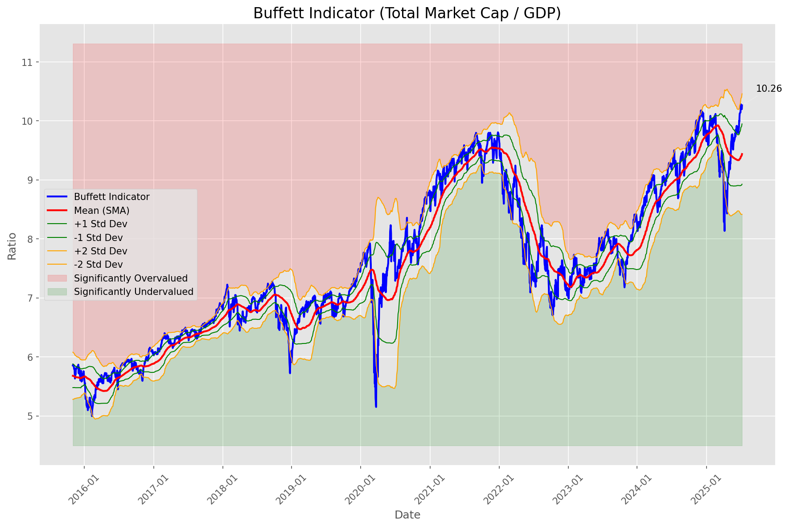
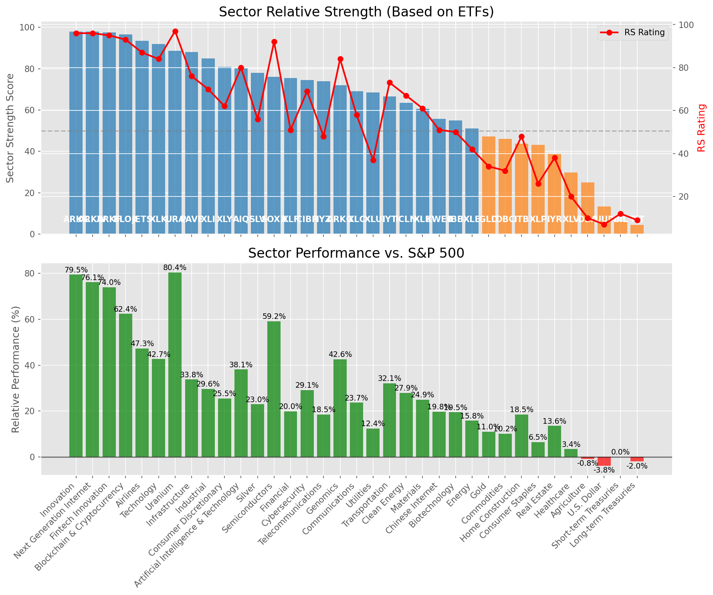

# **Daily Relative Strength Report**

**Date:** 2025-07-10

## **Market Valuation (Buffett Indicator)**

| Metric | Value |
|--------|-------|
| **Market Valuation** | **Overvalued** |
| **Current Ratio** | 10.29 |
| **Historical Mean** | 9.44 |
| **Standard Deviation** | 0.51 |
| **Z-Score (StdDev from Mean)** | 1.62 |
| **Total Market Cap** | $308.32 trillion |
| **GDP** | $29.96 trillion |

## **Market Insights**

### **Market is Overvalued**

The market appears to be trading above historical average valuations. While not at extreme levels, this suggests more modest future returns may be expected. Investors should:

- Focus on companies with reasonable valuations relative to their growth
- Be more selective with new positions
- Look for stocks showing relative strength within their sectors
- Consider trimming positions in extremely overvalued names

Historically, periods of mild overvaluation can persist for extended periods, but returns tend to be below average.

### **Buffett Indicator Overview**

The Buffett Indicator (Total Market Cap / GDP) is a measure of the stock market's valuation relative to the size of the economy. It is named after Warren Buffett, who described it as "probably the best single measure of where valuations stand at any given moment."

- **Values above +2 standard deviations:** Market significantly overvalued
- **Values above +1 standard deviation:** Market overvalued
- **Values between -1 and +1 standard deviations:** Market fairly valued
- **Values below -1 standard deviation:** Market undervalued
- **Values below -2 standard deviations:** Market significantly undervalued

---

## **Sector Relative Strength**

Based on William O'Neil's Relative Strength Methodology

| ETF | Strength | RS Rating | Performance | Above Key MAs | Trend | Sector |
|-----|----------|-----------|-------------|--------------|-------|--------|
| [ARKF](https://www.tradingview.com/chart/?symbol=ARKF) | 98.0 | 96.0 | 76.67% | 10d ✓, 50d ✓, 200d ✓ | ↗️ | Fintech Innovation |
| [ARKW](https://www.tradingview.com/chart/?symbol=ARKW) | 98.0 | 96.0 | 82.19% | 10d ✓, 50d ✓, 200d ✓ | ↗️ | Next Generation Internet |
| [ARKK](https://www.tradingview.com/chart/?symbol=ARKK) | 98.0 | 96.0 | 81.58% | 10d ✓, 50d ✓, 200d ✓ | ↗️ | Innovation |
| [BLOK](https://www.tradingview.com/chart/?symbol=BLOK) | 97.0 | 94.0 | 64.59% | 10d ✓, 50d ✓, 200d ✓ | ↗️ | Blockchain & Cryptocurrency |
| [JETS](https://www.tradingview.com/chart/?symbol=JETS) | 93.0 | 86.0 | 47.44% | 10d ✓, 50d ✓, 200d ✓ | ↗️ | Airlines |
| [XLK](https://www.tradingview.com/chart/?symbol=XLK) | 91.5 | 83.0 | 42.98% | 10d ✓, 50d ✓, 200d ✓ | ↗️ | Technology |
| [AIQ](https://www.tradingview.com/chart/?symbol=AIQ) | 89.5 | 79.0 | 38.57% | 10d ✓, 50d ✓, 200d ✓ | ↗️ | Artificial Intelligence & Technology |
| [URA](https://www.tradingview.com/chart/?symbol=URA) | 88.1 | 96.0 | 82.77% | 10d ✗, 50d ✓, 200d ✓ | ↗️ | Uranium |
| [PAVE](https://www.tradingview.com/chart/?symbol=PAVE) | 86.5 | 73.0 | 33.48% | 10d ✓, 50d ✓, 200d ✓ | ↗️ | Infrastructure |
| [XLI](https://www.tradingview.com/chart/?symbol=XLI) | 84.0 | 68.0 | 29.48% | 10d ✓, 50d ✓, 200d ✓ | ↗️ | Industrial |
| [XLY](https://www.tradingview.com/chart/?symbol=XLY) | 80.0 | 60.0 | 25.54% | 10d ✓, 50d ✓, 200d ✓ | ↗️ | Consumer Discretionary |
| [SLV](https://www.tradingview.com/chart/?symbol=SLV) | 79.0 | 58.0 | 24.36% | 10d ✓, 50d ✓, 200d ✓ | ↗️ | Silver |
| [SOXX](https://www.tradingview.com/chart/?symbol=SOXX) | 76.0 | 92.0 | 59.21% | 10d ✓, 50d ✓, 200d ✓ | ↘️ | Semiconductors |
| [XLF](https://www.tradingview.com/chart/?symbol=XLF) | 74.5 | 49.0 | 20.01% | 10d ✓, 50d ✓, 200d ✓ | ↗️ | Financial |
| [CIBR](https://www.tradingview.com/chart/?symbol=CIBR) | 73.1 | 66.0 | 28.28% | 10d ✗, 50d ✓, 200d ✓ | ↗️ | Cybersecurity |
| [ARKG](https://www.tradingview.com/chart/?symbol=ARKG) | 71.5 | 83.0 | 42.45% | 10d ✓, 50d ✓, 200d ✓ | ↘️ | Genomics |
| [XLC](https://www.tradingview.com/chart/?symbol=XLC) | 68.6 | 57.0 | 23.88% | 10d ✗, 50d ✓, 200d ✓ | ↗️ | Communications |
| [XLU](https://www.tradingview.com/chart/?symbol=XLU) | 68.0 | 36.0 | 12.97% | 10d ✓, 50d ✓, 200d ✓ | ↗️ | Utilities |
| [GLD](https://www.tradingview.com/chart/?symbol=GLD) | 66.5 | 33.0 | 11.26% | 10d ✓, 50d ✓, 200d ✓ | ↗️ | Gold |
| [IYT](https://www.tradingview.com/chart/?symbol=IYT) | 65.5 | 71.0 | 31.37% | 10d ✓, 50d ✓, 200d ✓ | ↘️ | Transportation |
| [KWEB](https://www.tradingview.com/chart/?symbol=KWEB) | 65.1 | 50.0 | 20.44% | 10d ✗, 50d ✓, 200d ✓ | ↗️ | Chinese Internet |
| [IYZ](https://www.tradingview.com/chart/?symbol=IYZ) | 65.1 | 50.0 | 20.26% | 10d ✗, 50d ✓, 200d ✓ | ↗️ | Telecommunications |
| [ICLN](https://www.tradingview.com/chart/?symbol=ICLN) | 63.0 | 66.0 | 28.31% | 10d ✓, 50d ✓, 200d ✓ | ↘️ | Clean Energy |
| [XLB](https://www.tradingview.com/chart/?symbol=XLB) | 58.5 | 57.0 | 24.24% | 10d ✓, 50d ✓, 200d ✓ | ↘️ | Materials |
| [IBB](https://www.tradingview.com/chart/?symbol=IBB) | 54.0 | 48.0 | 19.31% | 10d ✓, 50d ✓, 200d ✓ | ↘️ | Biotechnology |
| [XLE](https://www.tradingview.com/chart/?symbol=XLE) | 50.5 | 41.0 | 16.08% | 10d ✓, 50d ✓, 200d ✓ | ↘️ | Energy |
| [DBC](https://www.tradingview.com/chart/?symbol=DBC) | 45.5 | 31.0 | 10.22% | 10d ✓, 50d ✓, 200d ✓ | ↘️ | Commodities |
| [XLP](https://www.tradingview.com/chart/?symbol=XLP) | 42.2 | 24.0 | 6.23% | 10d ✗, 50d ✗, 200d ✓ | ↗️ | Consumer Staples |
| [ITB](https://www.tradingview.com/chart/?symbol=ITB) | 41.3 | 43.0 | 17.20% | 10d ✓, 50d ✓, 200d ✗ | ↘️ | Home Construction |
| [IYR](https://www.tradingview.com/chart/?symbol=IYR) | 37.8 | 36.0 | 13.08% | 10d ✓, 50d ✓, 200d ✗ | ↘️ | Real Estate |
| [XLV](https://www.tradingview.com/chart/?symbol=XLV) | 28.8 | 18.0 | 2.51% | 10d ✓, 50d ✓, 200d ✗ | ↘️ | Healthcare |
| [DBA](https://www.tradingview.com/chart/?symbol=DBA) | 27.5 | 15.0 | 1.18% | 10d ✗, 50d ✗, 200d ✗ | ↗️ | Agriculture |
| [TLT](https://www.tradingview.com/chart/?symbol=TLT) | 14.4 | 9.0 | -1.54% | 10d ✗, 50d ✓, 200d ✗ | ↘️ | Long-term Treasuries |
| [UUP](https://www.tradingview.com/chart/?symbol=UUP) | 13.4 | 7.0 | -3.93% | 10d ✓, 50d ✗, 200d ✗ | ↘️ | U.S. Dollar |
| [BIL](https://www.tradingview.com/chart/?symbol=BIL) | 5.5 | 11.0 | 0.03% | 10d ✗, 50d ✗, 200d ✗ | ↘️ | Short-term Treasuries |

### **Sector ETF Performance Interpretation**

This table shows the relative strength metrics for different market sectors based on their representative ETFs:

- **ETF**: The ETF used to measure sector performance (click for chart)
- **Strength**: Overall sector strength score (0-100) combining multiple factors
- **RS Rating**: O'Neil RS rating of the sector ETF
- **Performance**: Performance of the sector ETF relative to SPY
- **Above Key MAs**: Whether the ETF is trading above its 10, 50, and 200-day moving averages
- **Trend**: Whether the sector is in an uptrend (↗️) or downtrend (↘️)

### **Current Sector Leadership**

The current market leadership is coming from the following sectors: **Fintech Innovation, Next Generation Internet, Innovation**.

The **Fintech Innovation** sector (represented by **ARKF**) is showing particularly strong relative strength with an RS rating of 96.0 and performance of 76.67% vs. the S&P 500. This sector is trading above its 10-day, 50-day, 200-day moving average(s). Investors should consider focusing on high RS stocks within these leading sectors for potential outperformance.

---

## **Buy Recommendations**

The following 40 stocks show exceptional relative strength:

| RS Rating | Buy Score | Current Price | Chart | Name | Ticker |
|-----------|-----------|---------------|-------|------|--------|
| 100 | 100 | $197.46 | [Chart](https://www.tradingview.com/chart/?symbol=LEU) | Centrus Energy Corp. | LEU |
| 100 | 100 | $98.70 | [Chart](https://www.tradingview.com/chart/?symbol=HOOD) | Robinhood Markets, Inc. Class A Common Stock | HOOD |
| 99 | 100 | $105.03 | [Chart](https://www.tradingview.com/chart/?symbol=RBLX) | Roblox Corporation | RBLX |
| 99 | 100 | $149.22 | [Chart](https://www.tradingview.com/chart/?symbol=LMB) | Limbach Holdings, Inc Common Stock | LMB |
| 99 | 100 | $45.23 | [Chart](https://www.tradingview.com/chart/?symbol=MP) | MP Materials Corp. | MP |
| 99 | 100 | $35.44 | [Chart](https://www.tradingview.com/chart/?symbol=GRPN) | Groupon, Inc.Common Stock | GRPN |
| 98 | 100 | $104.85 | [Chart](https://www.tradingview.com/chart/?symbol=VRNA) | Verona Pharma plc | VRNA |
| 98 | 100 | $143.49 | [Chart](https://www.tradingview.com/chart/?symbol=FUTU) | Futu Holdings Limited American Depositary Shares | FUTU |
| 98 | 100 | $345.55 | [Chart](https://www.tradingview.com/chart/?symbol=CVNA) | Carvana Co. | CVNA |
| 97 | 100 | $142.50 | [Chart](https://www.tradingview.com/chart/?symbol=PLTR) | Palantir Technologies Inc. Class A Common Stock | PLTR |
| 97 | 100 | $539.36 | [Chart](https://www.tradingview.com/chart/?symbol=GEV) | GE Vernova Inc. | GEV |
| 96 | 100 | $51.57 | [Chart](https://www.tradingview.com/chart/?symbol=ARKF) | ARK Fintech Innovation ETF | ARKF |
| 95 | 100 | $21.64 | [Chart](https://www.tradingview.com/chart/?symbol=MAG) | MAG Silver Corp. | MAG |
| 95 | 100 | $49.22 | [Chart](https://www.tradingview.com/chart/?symbol=REVG) | REV Group, Inc. | REVG |
| 94 | 100 | $72.47 | [Chart](https://www.tradingview.com/chart/?symbol=URBN) | Urban Outfitters Inc | URBN |
| 93 | 100 | $52.70 | [Chart](https://www.tradingview.com/chart/?symbol=INOD) | Innodata Inc. | INOD |
| 92 | 100 | $58.92 | [Chart](https://www.tradingview.com/chart/?symbol=IBKR) | Interactive Brokers Group, Inc. Class A Common Stock | IBKR |
| 92 | 100 | $97.64 | [Chart](https://www.tradingview.com/chart/?symbol=TPR) | Tapestry, Inc. Common Stock | TPR |
| 92 | 100 | $46.27 | [Chart](https://www.tradingview.com/chart/?symbol=KTOS) | Kratos Defense & Security Solutions, Inc. | KTOS |
| 92 | 100 | $289.87 | [Chart](https://www.tradingview.com/chart/?symbol=RL) | Ralph Lauren Corporation | RL |
| 92 | 100 | $34.60 | [Chart](https://www.tradingview.com/chart/?symbol=APG) | APi Group Corporation | APG |
| 90 | 100 | $46.27 | [Chart](https://www.tradingview.com/chart/?symbol=BBIO) | BridgeBio Pharma, Inc. Common Stock | BBIO |
| 89 | 100 | $29.99 | [Chart](https://www.tradingview.com/chart/?symbol=DB) | Deutsche Bank Aktiengesellschaft | DB |
| 87 | 100 | $18.81 | [Chart](https://www.tradingview.com/chart/?symbol=BCS) | Barclays PLC | BCS |
| 90 | 99 | $89.04 | [Chart](https://www.tradingview.com/chart/?symbol=RYTM) | Rhythm Pharmaceuticals, Inc. Common Stock | RYTM |
| 88 | 99 | $36.03 | [Chart](https://www.tradingview.com/chart/?symbol=ATAT) | Atour Lifestyle Holdings Limited American Depositary Shares | ATAT |
| 88 | 99 | $252.57 | [Chart](https://www.tradingview.com/chart/?symbol=GE) | GE Aerospace | GE |
| 87 | 98 | $50.27 | [Chart](https://www.tradingview.com/chart/?symbol=BTC) | Grayscale Bitcoin Mini Trust ETF | BTC |
| 86 | 98 | $46.24 | [Chart](https://www.tradingview.com/chart/?symbol=DRS) | Leonardo DRS, Inc. Common Stock | DRS |
| 87 | 97 | $64.50 | [Chart](https://www.tradingview.com/chart/?symbol=IBIT) | iShares Bitcoin Trust ETF | IBIT |
| 87 | 97 | $104.34 | [Chart](https://www.tradingview.com/chart/?symbol=SANM) | Sanmina  Corp | SANM |
| 86 | 97 | $44.26 | [Chart](https://www.tradingview.com/chart/?symbol=TOST) | Toast, Inc. | TOST |
| 85 | 97 | $64.17 | [Chart](https://www.tradingview.com/chart/?symbol=CAKE) | Cheesecake Factory (The) | CAKE |
| 85 | 95 | $29.38 | [Chart](https://www.tradingview.com/chart/?symbol=NTGR) | NETGEAR, Inc. | NTGR |
| 84 | 95 | $25.47 | [Chart](https://www.tradingview.com/chart/?symbol=KAR) | OPENLANE, Inc | KAR |
| 81 | 95 | $29.17 | [Chart](https://www.tradingview.com/chart/?symbol=SRAD) | Sportradar Group AG Class A Ordinary Shares | SRAD |
| 84 | 93 | $49.11 | [Chart](https://www.tradingview.com/chart/?symbol=SIL) | Global X Silver Miners ETF (NEW) | SIL |
| 82 | 92 | $258.16 | [Chart](https://www.tradingview.com/chart/?symbol=WTS) | Watts Water Technologies, Inc. Class A | WTS |
| 80 | 92 | $26.80 | [Chart](https://www.tradingview.com/chart/?symbol=OR) | OR Royalties Inc. | OR |
| 81 | 91 | $46.53 | [Chart](https://www.tradingview.com/chart/?symbol=AU) | AngloGold Ashanti plc | AU |

---

## **Sell Recommendations**

The following 79 stocks show deteriorating relative strength:

| RS Rating | Sell Score | Current Price | Chart | Name | Ticker |
|-----------|------------|---------------|-------|------|--------|
| 1 | 100 | $23.96 | [Chart](https://www.tradingview.com/chart/?symbol=ZSL) | ProShares UltraShort Silver | ZSL |
| 1 | 100 | $25.61 | [Chart](https://www.tradingview.com/chart/?symbol=TECS) | Direxion Daily Technology Bear 3x Shares | TECS |
| 1 | 100 | $16.28 | [Chart](https://www.tradingview.com/chart/?symbol=SDS) | ProShares UltraShort S&P500 | SDS |
| 1 | 100 | $25.02 | [Chart](https://www.tradingview.com/chart/?symbol=QID) | ProShares UltraShort QQQ | QID |
| 1 | 100 | $39.97 | [Chart](https://www.tradingview.com/chart/?symbol=SDOW) | ProShares UltraPro Short Dow 30 | SDOW |
| 2 | 100 | $34.10 | [Chart](https://www.tradingview.com/chart/?symbol=SARK) | Investment Managers Series Trust II Tradr 1X Short Innovation Daily ETF | SARK |
| 2 | 100 | $33.48 | [Chart](https://www.tradingview.com/chart/?symbol=PSQ) | ProShares Short QQQ | PSQ |
| 2 | 100 | $23.64 | [Chart](https://www.tradingview.com/chart/?symbol=DXD) | ProShares UltraShort Dow 30 | DXD |
| 2 | 100 | $13.17 | [Chart](https://www.tradingview.com/chart/?symbol=IART) | Integra LifeSciences Holdings | IART |
| 2 | 100 | $39.25 | [Chart](https://www.tradingview.com/chart/?symbol=SH) | ProShares Short S&P500 | SH |
| 2 | 100 | $20.79 | [Chart](https://www.tradingview.com/chart/?symbol=ERY) | Direxion Daily Energy Bear 2X Shares | ERY |
| 2 | 100 | $10.25 | [Chart](https://www.tradingview.com/chart/?symbol=SNDX) | Syndax Pharmaceuticals, Inc. | SNDX |
| 2 | 100 | $18.65 | [Chart](https://www.tradingview.com/chart/?symbol=BITI) | ProShares Short Bitcoin ETF | BITI |
| 2 | 100 | $228.58 | [Chart](https://www.tradingview.com/chart/?symbol=MOH) | Molina Healthcare, Inc. | MOH |
| 3 | 100 | $12.46 | [Chart](https://www.tradingview.com/chart/?symbol=CCRN) | Cross Country Healthcare Inc | CCRN |
| 3 | 100 | $10.73 | [Chart](https://www.tradingview.com/chart/?symbol=EMBC) | Embecta Corp. Common Stock | EMBC |
| 3 | 100 | $24.26 | [Chart](https://www.tradingview.com/chart/?symbol=CRTO) | Criteo S.A. | CRTO |
| 3 | 100 | $25.20 | [Chart](https://www.tradingview.com/chart/?symbol=DOG) | ProShares Short Dow30 | DOG |
| 3 | 100 | $60.30 | [Chart](https://www.tradingview.com/chart/?symbol=STC) | Stewart Information Services Corporation | STC |
| 3 | 100 | $10.82 | [Chart](https://www.tradingview.com/chart/?symbol=SD) | SandRidge Energy, Inc. | SD |
| 3 | 100 | $37.31 | [Chart](https://www.tradingview.com/chart/?symbol=IBTA) | Ibotta, Inc. | IBTA |
| 4 | 100 | $43.07 | [Chart](https://www.tradingview.com/chart/?symbol=LINE) | Lineage, Inc. Common Stock | LINE |
| 4 | 100 | $10.52 | [Chart](https://www.tradingview.com/chart/?symbol=LBTYK) | Liberty Global Ltd. Class C Common Shares | LBTYK |
| 4 | 100 | $17.22 | [Chart](https://www.tradingview.com/chart/?symbol=HP) | Helmerich & Payne, Inc. | HP |
| 5 | 100 | $65.13 | [Chart](https://www.tradingview.com/chart/?symbol=ZROZ) | PIMCO 25+ Year Zero Coupon U.S. Treasury Index Exchange-Traded Fund | ZROZ |
| 5 | 100 | $10.23 | [Chart](https://www.tradingview.com/chart/?symbol=LBTYA) | Liberty Global Ltd. Class A Common Shares | LBTYA |
| 6 | 100 | $16.56 | [Chart](https://www.tradingview.com/chart/?symbol=COLD) | Americold Realty Trust, Inc. | COLD |
| 6 | 100 | $10.39 | [Chart](https://www.tradingview.com/chart/?symbol=NMZ) | Nuveen Municipal High Income Opportunity Fund | NMZ |
| 8 | 100 | $71.20 | [Chart](https://www.tradingview.com/chart/?symbol=TNET) | TRINET GROUP, INC. | TNET |
| 8 | 100 | $51.38 | [Chart](https://www.tradingview.com/chart/?symbol=LW) | Lamb Weston Holdings, Inc. | LW |
| 9 | 100 | $16.17 | [Chart](https://www.tradingview.com/chart/?symbol=TNDM) | Tandem Diabetes Care, Inc. | TNDM |
| 9 | 100 | $131.95 | [Chart](https://www.tradingview.com/chart/?symbol=KMB) | Kimberly-Clark Corp. | KMB |
| 10 | 100 | $29.15 | [Chart](https://www.tradingview.com/chart/?symbol=SPTS) | SPDR Portfolio Short Term Treasury ETF | SPTS |
| 12 | 100 | $41.47 | [Chart](https://www.tradingview.com/chart/?symbol=POR) | Portland General Electric Company | POR |
| 6 | 99 | $17.38 | [Chart](https://www.tradingview.com/chart/?symbol=NOMD) | Nomad Foods Limited | NOMD |
| 10 | 99 | $22.85 | [Chart](https://www.tradingview.com/chart/?symbol=IBTG) | iShares iBonds Dec 2026 Term Treasury ETF | IBTG |
| 8 | 98 | $46.29 | [Chart](https://www.tradingview.com/chart/?symbol=CWT) | California Water Service | CWT |
| 12 | 97 | $14.77 | [Chart](https://www.tradingview.com/chart/?symbol=VRE) | Veris Residential, Inc. | VRE |
| 6 | 96 | $25.05 | [Chart](https://www.tradingview.com/chart/?symbol=DRV) | Direxion Daily Real Estate Bear 3X Shares | DRV |
| 7 | 96 | $21.72 | [Chart](https://www.tradingview.com/chart/?symbol=TUA) | Simplify Short Term Treasury Futures Strategy ETF | TUA |
| 12 | 96 | $16.80 | [Chart](https://www.tradingview.com/chart/?symbol=MLN) | VanEck Long Muni ETF | MLN |
| 14 | 96 | $47.14 | [Chart](https://www.tradingview.com/chart/?symbol=KBR) | KBR, Inc. | KBR |
| 9 | 95 | $139.25 | [Chart](https://www.tradingview.com/chart/?symbol=INSP) | Inspire Medical Systems, Inc. | INSP |
| 16 | 95 | $39.21 | [Chart](https://www.tradingview.com/chart/?symbol=LKQ) | LKQ Corporation | LKQ |
| 6 | 94 | $27.52 | [Chart](https://www.tradingview.com/chart/?symbol=VCYT) | Veracyte, Inc. | VCYT |
| 9 | 94 | $49.34 | [Chart](https://www.tradingview.com/chart/?symbol=SNY) | Sanofi American Depositary Shares (Each representing one-half of one ordinary share) | SNY |
| 10 | 93 | $82.47 | [Chart](https://www.tradingview.com/chart/?symbol=SHY) | iShares 1-3 Year Treasury Bond ETF | SHY |
| 14 | 93 | $25.81 | [Chart](https://www.tradingview.com/chart/?symbol=PNTG) | The Pennant Group, Inc. Common Stock | PNTG |
| 20 | 93 | $86.41 | [Chart](https://www.tradingview.com/chart/?symbol=SIGI) | Selective Insurance Group | SIGI |
| 21 | 92 | $464.31 | [Chart](https://www.tradingview.com/chart/?symbol=LMT) | Lockheed Martin Corp. | LMT |
| 11 | 91 | $110.17 | [Chart](https://www.tradingview.com/chart/?symbol=SHV) | iShares Short Treasury Bond ETF | SHV |
| 19 | 91 | $104.95 | [Chart](https://www.tradingview.com/chart/?symbol=DECK) | Deckers Outdoor Corp | DECK |
| 19 | 90 | $53.57 | [Chart](https://www.tradingview.com/chart/?symbol=CNMD) | CONMED Corporation | CNMD |
| 12 | 89 | $59.89 | [Chart](https://www.tradingview.com/chart/?symbol=FTSM) | First Trust Enhanced Short Maturity ETF | FTSM |
| 15 | 89 | $13.28 | [Chart](https://www.tradingview.com/chart/?symbol=BSM) | Black Stone Minerals, L.P. | BSM |
| 24 | 89 | $32.38 | [Chart](https://www.tradingview.com/chart/?symbol=INVH) | Invitation Homes Inc. Common Stock | INVH |
| 17 | 88 | $90.62 | [Chart](https://www.tradingview.com/chart/?symbol=CL) | Colgate-Palmolive Company | CL |
| 18 | 88 | $25.53 | [Chart](https://www.tradingview.com/chart/?symbol=TBBB) | BBB Foods Inc. | TBBB |
| 19 | 88 | $34.55 | [Chart](https://www.tradingview.com/chart/?symbol=PECO) | Phillips Edison & Company, Inc. Common Stock | PECO |
| 24 | 88 | $61.47 | [Chart](https://www.tradingview.com/chart/?symbol=UL) | Unilever plc | UL |
| 18 | 87 | $19.75 | [Chart](https://www.tradingview.com/chart/?symbol=SPT) | Sprout Social, Inc Class A Common Stock | SPT |
| 18 | 86 | $77.11 | [Chart](https://www.tradingview.com/chart/?symbol=AWR) | American States Water Company | AWR |
| 23 | 86 | $14.02 | [Chart](https://www.tradingview.com/chart/?symbol=DOLE) | Dole plc | DOLE |
| 17 | 83 | $26.60 | [Chart](https://www.tradingview.com/chart/?symbol=FCPT) | Four Corners Property Trust, Inc. | FCPT |
| 20 | 82 | $36.83 | [Chart](https://www.tradingview.com/chart/?symbol=PBA) | PEMBINA PIPELINE CORPORATION | PBA |
| 28 | 81 | $22.27 | [Chart](https://www.tradingview.com/chart/?symbol=SGRY) | Surgery Partners, Inc. Common Stock | SGRY |
| 31 | 81 | $17.92 | [Chart](https://www.tradingview.com/chart/?symbol=S) | SentinelOne, Inc. | S |
| 25 | 80 | $40.49 | [Chart](https://www.tradingview.com/chart/?symbol=UDR) | UDR, Inc. | UDR |
| 29 | 80 | $16.02 | [Chart](https://www.tradingview.com/chart/?symbol=BNL) | Broadstone Net Lease, Inc. | BNL |
| 23 | 79 | $238.44 | [Chart](https://www.tradingview.com/chart/?symbol=RNR) | RenaissanceRe Holdings Ltd. | RNR |
| 27 | 79 | $559.90 | [Chart](https://www.tradingview.com/chart/?symbol=TYL) | Tyler Technologies, Inc. | TYL |
| 29 | 76 | $101.50 | [Chart](https://www.tradingview.com/chart/?symbol=FMX) | FOMENTO ECONOMICO MEXICANO, S.A.B. DE C.V. | FMX |
| 28 | 75 | $19.19 | [Chart](https://www.tradingview.com/chart/?symbol=MSDL) | Morgan Stanley Direct Lending Fund | MSDL |
| 29 | 75 | $35.73 | [Chart](https://www.tradingview.com/chart/?symbol=AMH) | AMERICAN HOMES 4 RENT | AMH |
| 29 | 75 | $30.94 | [Chart](https://www.tradingview.com/chart/?symbol=AXTA) | Axalta Coating Systems Ltd. | AXTA |
| 34 | 67 | $104.97 | [Chart](https://www.tradingview.com/chart/?symbol=PDD) | PDD Holdings Inc. American Depositary Shares | PDD |
| 39 | 67 | $163.01 | [Chart](https://www.tradingview.com/chart/?symbol=NICE) | NICE Ltd | NICE |
| 35 | 66 | $40.03 | [Chart](https://www.tradingview.com/chart/?symbol=LZB) | La-Z-Boy Incorporated | LZB |
| 38 | 63 | $56.62 | [Chart](https://www.tradingview.com/chart/?symbol=ALRM) | Alarm.com Holdings, Inc. | ALRM |

## **Methodology**

This report uses William O'Neil's relative strength methodology from Investors Business Daily:

* **RS Rating**: Percentile rank of stock's performance vs. S&P 500 over the past 63 trading days (1-99 scale)
* **Buy Criteria**: RS Rating >= 80, price above 50-day MA, strong uptrend, increasing volume
* **Sell Criteria**: RS Rating < 40, price below 50-day MA, downtrend, decreasing volume

### **O'Neil's Key Principles**

1. **Focus on relative performance** - stocks outperforming the market
2. **Price trend confirmation** - stock must be in an uptrend
3. **Volume confirmation** - strong volume supports price moves
4. **Moving average validation** - price above key moving averages
5. **Market leaders only** - concentrate on top-performing stocks

*Report generated automatically after market close*