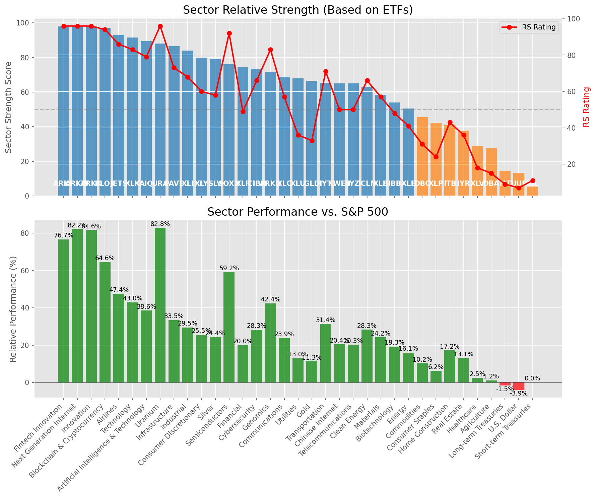

# **Daily Relative Strength Report**

**Date:** 2025-07-10

## **Market Valuation (Buffett Indicator)**

| Metric | Value |
|--------|-------|
| **Market Valuation** | **Overvalued** |
| **Current Ratio** | 10.28 |
| **Historical Mean** | 9.44 |
| **Standard Deviation** | 0.51 |
| **Z-Score (StdDev from Mean)** | 1.62 |
| **Total Market Cap** | $308.08 trillion |
| **GDP** | $29.96 trillion |

## **Market Insights**

### **Market is Overvalued**

The market appears to be trading above historical average valuations. While not at extreme levels, this suggests more modest future returns may be expected. Investors should:

- Focus on companies with reasonable valuations relative to their growth
- Be more selective with new positions
- Look for stocks showing relative strength within their sectors
- Consider trimming positions in extremely overvalued names

Historically, periods of mild overvaluation can persist for extended periods, but returns tend to be below average.

### **Buffett Indicator Overview**

The Buffett Indicator (Total Market Cap / GDP) is a measure of the stock market's valuation relative to the size of the economy. It is named after Warren Buffett, who described it as "probably the best single measure of where valuations stand at any given moment."

- **Values above +2 standard deviations:** Market significantly overvalued
- **Values above +1 standard deviation:** Market overvalued
- **Values between -1 and +1 standard deviations:** Market fairly valued
- **Values below -1 standard deviation:** Market undervalued
- **Values below -2 standard deviations:** Market significantly undervalued

---

## **Sector Relative Strength**

Based on William O'Neil's Relative Strength Methodology

| ETF | Strength | RS Rating | Performance | Above Key MAs | Trend | Sector |
|-----|----------|-----------|-------------|--------------|-------|--------|
| [ARKK](https://www.tradingview.com/chart/?symbol=ARKK) | 98.0 | 96.0 | 79.47% | 10d ✓, 50d ✓, 200d ✓ | ↗️ | Innovation |
| [ARKW](https://www.tradingview.com/chart/?symbol=ARKW) | 98.0 | 96.0 | 76.14% | 10d ✓, 50d ✓, 200d ✓ | ↗️ | Next Generation Internet |
| [ARKF](https://www.tradingview.com/chart/?symbol=ARKF) | 97.5 | 95.0 | 73.96% | 10d ✓, 50d ✓, 200d ✓ | ↗️ | Fintech Innovation |
| [BLOK](https://www.tradingview.com/chart/?symbol=BLOK) | 96.5 | 93.0 | 62.39% | 10d ✓, 50d ✓, 200d ✓ | ↗️ | Blockchain & Cryptocurrency |
| [JETS](https://www.tradingview.com/chart/?symbol=JETS) | 93.5 | 87.0 | 47.32% | 10d ✓, 50d ✓, 200d ✓ | ↗️ | Airlines |
| [XLK](https://www.tradingview.com/chart/?symbol=XLK) | 92.0 | 84.0 | 42.67% | 10d ✓, 50d ✓, 200d ✓ | ↗️ | Technology |
| [URA](https://www.tradingview.com/chart/?symbol=URA) | 88.6 | 97.0 | 80.43% | 10d ✗, 50d ✓, 200d ✓ | ↗️ | Uranium |
| [PAVE](https://www.tradingview.com/chart/?symbol=PAVE) | 88.0 | 76.0 | 33.77% | 10d ✓, 50d ✓, 200d ✓ | ↗️ | Infrastructure |
| [XLI](https://www.tradingview.com/chart/?symbol=XLI) | 85.0 | 70.0 | 29.63% | 10d ✓, 50d ✓, 200d ✓ | ↗️ | Industrial |
| [XLY](https://www.tradingview.com/chart/?symbol=XLY) | 81.0 | 62.0 | 25.48% | 10d ✓, 50d ✓, 200d ✓ | ↗️ | Consumer Discretionary |
| [AIQ](https://www.tradingview.com/chart/?symbol=AIQ) | 80.1 | 80.0 | 38.11% | 10d ✗, 50d ✓, 200d ✓ | ↗️ | Artificial Intelligence & Technology |
| [SLV](https://www.tradingview.com/chart/?symbol=SLV) | 78.0 | 56.0 | 22.97% | 10d ✓, 50d ✓, 200d ✓ | ↗️ | Silver |
| [SOXX](https://www.tradingview.com/chart/?symbol=SOXX) | 76.0 | 92.0 | 59.17% | 10d ✓, 50d ✓, 200d ✓ | ↘️ | Semiconductors |
| [XLF](https://www.tradingview.com/chart/?symbol=XLF) | 75.5 | 51.0 | 19.96% | 10d ✓, 50d ✓, 200d ✓ | ↗️ | Financial |
| [CIBR](https://www.tradingview.com/chart/?symbol=CIBR) | 74.6 | 69.0 | 29.12% | 10d ✗, 50d ✓, 200d ✓ | ↗️ | Cybersecurity |
| [IYZ](https://www.tradingview.com/chart/?symbol=IYZ) | 74.0 | 48.0 | 18.50% | 10d ✓, 50d ✓, 200d ✓ | ↗️ | Telecommunications |
| [ARKG](https://www.tradingview.com/chart/?symbol=ARKG) | 72.0 | 84.0 | 42.58% | 10d ✓, 50d ✓, 200d ✓ | ↘️ | Genomics |
| [XLC](https://www.tradingview.com/chart/?symbol=XLC) | 69.1 | 58.0 | 23.66% | 10d ✗, 50d ✓, 200d ✓ | ↗️ | Communications |
| [XLU](https://www.tradingview.com/chart/?symbol=XLU) | 68.5 | 37.0 | 12.44% | 10d ✓, 50d ✓, 200d ✓ | ↗️ | Utilities |
| [IYT](https://www.tradingview.com/chart/?symbol=IYT) | 66.5 | 73.0 | 32.09% | 10d ✓, 50d ✓, 200d ✓ | ↘️ | Transportation |
| [ICLN](https://www.tradingview.com/chart/?symbol=ICLN) | 63.5 | 67.0 | 27.94% | 10d ✓, 50d ✓, 200d ✓ | ↘️ | Clean Energy |
| [XLB](https://www.tradingview.com/chart/?symbol=XLB) | 60.5 | 61.0 | 24.94% | 10d ✓, 50d ✓, 200d ✓ | ↘️ | Materials |
| [KWEB](https://www.tradingview.com/chart/?symbol=KWEB) | 55.7 | 51.0 | 19.78% | 10d ✗, 50d ✗, 200d ✓ | ↗️ | Chinese Internet |
| [IBB](https://www.tradingview.com/chart/?symbol=IBB) | 55.0 | 50.0 | 19.49% | 10d ✓, 50d ✓, 200d ✓ | ↘️ | Biotechnology |
| [XLE](https://www.tradingview.com/chart/?symbol=XLE) | 51.0 | 42.0 | 15.84% | 10d ✓, 50d ✓, 200d ✓ | ↘️ | Energy |
| [GLD](https://www.tradingview.com/chart/?symbol=GLD) | 47.2 | 34.0 | 11.04% | 10d ✗, 50d ✗, 200d ✓ | ↗️ | Gold |
| [DBC](https://www.tradingview.com/chart/?symbol=DBC) | 46.0 | 32.0 | 10.17% | 10d ✓, 50d ✓, 200d ✓ | ↘️ | Commodities |
| [ITB](https://www.tradingview.com/chart/?symbol=ITB) | 43.8 | 48.0 | 18.50% | 10d ✓, 50d ✓, 200d ✗ | ↘️ | Home Construction |
| [XLP](https://www.tradingview.com/chart/?symbol=XLP) | 43.2 | 26.0 | 6.48% | 10d ✗, 50d ✗, 200d ✓ | ↗️ | Consumer Staples |
| [IYR](https://www.tradingview.com/chart/?symbol=IYR) | 38.8 | 38.0 | 13.55% | 10d ✓, 50d ✓, 200d ✗ | ↘️ | Real Estate |
| [XLV](https://www.tradingview.com/chart/?symbol=XLV) | 29.8 | 20.0 | 3.41% | 10d ✓, 50d ✓, 200d ✗ | ↘️ | Healthcare |
| [DBA](https://www.tradingview.com/chart/?symbol=DBA) | 25.0 | 10.0 | -0.80% | 10d ✗, 50d ✗, 200d ✗ | ↗️ | Agriculture |
| [UUP](https://www.tradingview.com/chart/?symbol=UUP) | 13.4 | 7.0 | -3.84% | 10d ✓, 50d ✗, 200d ✗ | ↘️ | U.S. Dollar |
| [BIL](https://www.tradingview.com/chart/?symbol=BIL) | 6.0 | 12.0 | 0.03% | 10d ✗, 50d ✗, 200d ✗ | ↘️ | Short-term Treasuries |
| [TLT](https://www.tradingview.com/chart/?symbol=TLT) | 4.5 | 9.0 | -1.98% | 10d ✗, 50d ✗, 200d ✗ | ↘️ | Long-term Treasuries |

### **Sector ETF Performance Interpretation**

This table shows the relative strength metrics for different market sectors based on their representative ETFs:

- **ETF**: The ETF used to measure sector performance (click for chart)
- **Strength**: Overall sector strength score (0-100) combining multiple factors
- **RS Rating**: O'Neil RS rating of the sector ETF
- **Performance**: Performance of the sector ETF relative to SPY
- **Above Key MAs**: Whether the ETF is trading above its 10, 50, and 200-day moving averages
- **Trend**: Whether the sector is in an uptrend (↗️) or downtrend (↘️)

### **Current Sector Leadership**

The current market leadership is coming from the following sectors: **Innovation, Next Generation Internet, Fintech Innovation**.

The **Innovation** sector (represented by **ARKK**) is showing particularly strong relative strength with an RS rating of 96.0 and performance of 79.47% vs. the S&P 500. This sector is trading above its 10-day, 50-day, 200-day moving average(s). Investors should consider focusing on high RS stocks within these leading sectors for potential outperformance.

---

## **Buy Recommendations**

The following 35 stocks show exceptional relative strength:

| RS Rating | Buy Score | Current Price | Chart | Name | Ticker |
|-----------|-----------|---------------|-------|------|--------|
| 100 | 100 | $94.56 | [Chart](https://www.tradingview.com/chart/?symbol=HOOD) | Robinhood Markets, Inc. Class A Common Stock | HOOD |
| 100 | 100 | $187.70 | [Chart](https://www.tradingview.com/chart/?symbol=LEU) | Centrus Energy Corp. | LEU |
| 99 | 100 | $145.69 | [Chart](https://www.tradingview.com/chart/?symbol=LMB) | Limbach Holdings, Inc Common Stock | LMB |
| 98 | 100 | $143.04 | [Chart](https://www.tradingview.com/chart/?symbol=FUTU) | Futu Holdings Limited American Depositary Shares | FUTU |
| 98 | 100 | $75.77 | [Chart](https://www.tradingview.com/chart/?symbol=ODD) | ODDITY Tech Ltd. Class A Ordinary Shares | ODD |
| 98 | 100 | $43.35 | [Chart](https://www.tradingview.com/chart/?symbol=MP) | MP Materials Corp. | MP |
| 98 | 100 | $104.92 | [Chart](https://www.tradingview.com/chart/?symbol=VRNA) | Verona Pharma plc | VRNA |
| 98 | 100 | $350.00 | [Chart](https://www.tradingview.com/chart/?symbol=CVNA) | Carvana Co. | CVNA |
| 97 | 100 | $531.20 | [Chart](https://www.tradingview.com/chart/?symbol=GEV) | GE Vernova Inc. | GEV |
| 97 | 100 | $140.12 | [Chart](https://www.tradingview.com/chart/?symbol=PLTR) | Palantir Technologies Inc. Class A Common Stock | PLTR |
| 97 | 100 | $43.91 | [Chart](https://www.tradingview.com/chart/?symbol=FARO) | Faro Technologies Inc | FARO |
| 95 | 100 | $21.36 | [Chart](https://www.tradingview.com/chart/?symbol=MAG) | MAG Silver Corp. | MAG |
| 95 | 100 | $50.78 | [Chart](https://www.tradingview.com/chart/?symbol=ARKF) | ARK Fintech Innovation ETF | ARKF |
| 95 | 100 | $72.88 | [Chart](https://www.tradingview.com/chart/?symbol=URBN) | Urban Outfitters Inc | URBN |
| 94 | 100 | $17.40 | [Chart](https://www.tradingview.com/chart/?symbol=DAN) | Dana Incorporated | DAN |
| 93 | 100 | $34.43 | [Chart](https://www.tradingview.com/chart/?symbol=APG) | APi Group Corporation | APG |
| 93 | 100 | $97.40 | [Chart](https://www.tradingview.com/chart/?symbol=TPR) | Tapestry, Inc. Common Stock | TPR |
| 92 | 100 | $51.09 | [Chart](https://www.tradingview.com/chart/?symbol=INOD) | Innodata Inc. | INOD |
| 92 | 100 | $58.35 | [Chart](https://www.tradingview.com/chart/?symbol=IBKR) | Interactive Brokers Group, Inc. Class A Common Stock | IBKR |
| 91 | 100 | $45.17 | [Chart](https://www.tradingview.com/chart/?symbol=KTOS) | Kratos Defense & Security Solutions, Inc. | KTOS |
| 90 | 100 | $46.06 | [Chart](https://www.tradingview.com/chart/?symbol=BBIO) | BridgeBio Pharma, Inc. Common Stock | BBIO |
| 89 | 100 | $30.00 | [Chart](https://www.tradingview.com/chart/?symbol=DB) | Deutsche Bank Aktiengesellschaft | DB |
| 89 | 100 | $36.29 | [Chart](https://www.tradingview.com/chart/?symbol=ATAT) | Atour Lifestyle Holdings Limited American Depositary Shares | ATAT |
| 87 | 100 | $18.69 | [Chart](https://www.tradingview.com/chart/?symbol=BCS) | Barclays PLC | BCS |
| 90 | 99 | $87.73 | [Chart](https://www.tradingview.com/chart/?symbol=RYTM) | Rhythm Pharmaceuticals, Inc. Common Stock | RYTM |
| 87 | 97 | $103.75 | [Chart](https://www.tradingview.com/chart/?symbol=SANM) | Sanmina  Corp | SANM |
| 86 | 97 | $43.65 | [Chart](https://www.tradingview.com/chart/?symbol=TOST) | Toast, Inc. | TOST |
| 86 | 97 | $25.69 | [Chart](https://www.tradingview.com/chart/?symbol=KAR) | OPENLANE, Inc | KAR |
| 86 | 96 | $63.19 | [Chart](https://www.tradingview.com/chart/?symbol=IBIT) | iShares Bitcoin Trust ETF | IBIT |
| 86 | 96 | $29.98 | [Chart](https://www.tradingview.com/chart/?symbol=NTGR) | NETGEAR, Inc. | NTGR |
| 82 | 96 | $28.96 | [Chart](https://www.tradingview.com/chart/?symbol=SRAD) | Sportradar Group AG Class A Ordinary Shares | SRAD |
| 81 | 94 | $29.27 | [Chart](https://www.tradingview.com/chart/?symbol=CAE) | CAE INC | CAE |
| 80 | 94 | $96.62 | [Chart](https://www.tradingview.com/chart/?symbol=SNEX) | StoneX Group Inc. Common Stock | SNEX |
| 80 | 91 | $14.27 | [Chart](https://www.tradingview.com/chart/?symbol=CNH) | CNH INDUSTRIAL N.V. | CNH |
| 81 | 90 | $25.00 | [Chart](https://www.tradingview.com/chart/?symbol=PUK) | PRUDENTIAL PLC ADS (REP 2 ORD SHARES) | PUK |

---

## **Sell Recommendations**

The following 86 stocks show deteriorating relative strength:

| RS Rating | Sell Score | Current Price | Chart | Name | Ticker |
|-----------|------------|---------------|-------|------|--------|
| 1 | 100 | $25.77 | [Chart](https://www.tradingview.com/chart/?symbol=TECS) | Direxion Daily Technology Bear 3x Shares | TECS |
| 1 | 100 | $16.32 | [Chart](https://www.tradingview.com/chart/?symbol=SDS) | ProShares UltraShort S&P500 | SDS |
| 1 | 100 | $25.16 | [Chart](https://www.tradingview.com/chart/?symbol=QID) | ProShares UltraShort QQQ | QID |
| 1 | 100 | $24.70 | [Chart](https://www.tradingview.com/chart/?symbol=ZSL) | ProShares UltraShort Silver | ZSL |
| 1 | 100 | $39.72 | [Chart](https://www.tradingview.com/chart/?symbol=SDOW) | ProShares UltraPro Short Dow 30 | SDOW |
| 2 | 100 | $34.67 | [Chart](https://www.tradingview.com/chart/?symbol=SARK) | Investment Managers Series Trust II Tradr 1X Short Innovation Daily ETF | SARK |
| 2 | 100 | $23.55 | [Chart](https://www.tradingview.com/chart/?symbol=DXD) | ProShares UltraShort Dow 30 | DXD |
| 2 | 100 | $33.57 | [Chart](https://www.tradingview.com/chart/?symbol=PSQ) | ProShares Short QQQ | PSQ |
| 2 | 100 | $235.60 | [Chart](https://www.tradingview.com/chart/?symbol=MOH) | Molina Healthcare, Inc. | MOH |
| 2 | 100 | $10.25 | [Chart](https://www.tradingview.com/chart/?symbol=SNDX) | Syndax Pharmaceuticals, Inc. | SNDX |
| 2 | 100 | $39.29 | [Chart](https://www.tradingview.com/chart/?symbol=SH) | ProShares Short S&P500 | SH |
| 2 | 100 | $19.02 | [Chart](https://www.tradingview.com/chart/?symbol=BITI) | ProShares Short Bitcoin ETF | BITI |
| 3 | 100 | $236.70 | [Chart](https://www.tradingview.com/chart/?symbol=HUM) | Humana Inc. | HUM |
| 3 | 100 | $12.55 | [Chart](https://www.tradingview.com/chart/?symbol=CCRN) | Cross Country Healthcare Inc | CCRN |
| 3 | 100 | $25.15 | [Chart](https://www.tradingview.com/chart/?symbol=DOG) | ProShares Short Dow30 | DOG |
| 3 | 100 | $24.78 | [Chart](https://www.tradingview.com/chart/?symbol=CRTO) | Criteo S.A. | CRTO |
| 3 | 100 | $37.27 | [Chart](https://www.tradingview.com/chart/?symbol=IBTA) | Ibotta, Inc. | IBTA |
| 4 | 100 | $43.72 | [Chart](https://www.tradingview.com/chart/?symbol=LINE) | Lineage, Inc. Common Stock | LINE |
| 4 | 100 | $10.49 | [Chart](https://www.tradingview.com/chart/?symbol=LBTYK) | Liberty Global Ltd. Class C Common Shares | LBTYK |
| 4 | 100 | $65.01 | [Chart](https://www.tradingview.com/chart/?symbol=ZROZ) | PIMCO 25+ Year Zero Coupon U.S. Treasury Index Exchange-Traded Fund | ZROZ |
| 4 | 100 | $55.80 | [Chart](https://www.tradingview.com/chart/?symbol=AMWD) | American Woodmark Corp | AMWD |
| 5 | 100 | $10.20 | [Chart](https://www.tradingview.com/chart/?symbol=LBTYA) | Liberty Global Ltd. Class A Common Shares | LBTYA |
| 5 | 100 | $49.28 | [Chart](https://www.tradingview.com/chart/?symbol=CCOI) | Cogent Communications Holdings, Inc. | CCOI |
| 6 | 100 | $14.63 | [Chart](https://www.tradingview.com/chart/?symbol=SEM) | SELECT MEDICAL HOLDINGS CORP | SEM |
| 6 | 100 | $10.35 | [Chart](https://www.tradingview.com/chart/?symbol=NMZ) | Nuveen Municipal High Income Opportunity Fund | NMZ |
| 7 | 100 | $52.91 | [Chart](https://www.tradingview.com/chart/?symbol=CNMD) | CONMED Corporation | CNMD |
| 7 | 100 | $16.66 | [Chart](https://www.tradingview.com/chart/?symbol=COLD) | Americold Realty Trust, Inc. | COLD |
| 7 | 100 | $14.59 | [Chart](https://www.tradingview.com/chart/?symbol=VRE) | Veris Residential, Inc. | VRE |
| 8 | 100 | $71.64 | [Chart](https://www.tradingview.com/chart/?symbol=TNET) | TRINET GROUP, INC. | TNET |
| 8 | 100 | $15.88 | [Chart](https://www.tradingview.com/chart/?symbol=TNDM) | Tandem Diabetes Care, Inc. | TNDM |
| 9 | 100 | $86.61 | [Chart](https://www.tradingview.com/chart/?symbol=TLT) | iShares 20+ Year Treasury Bond ETF | TLT |
| 9 | 100 | $51.31 | [Chart](https://www.tradingview.com/chart/?symbol=LW) | Lamb Weston Holdings, Inc. | LW |
| 10 | 100 | $132.32 | [Chart](https://www.tradingview.com/chart/?symbol=KMB) | Kimberly-Clark Corp. | KMB |
| 11 | 100 | $29.14 | [Chart](https://www.tradingview.com/chart/?symbol=SPTS) | SPDR Portfolio Short Term Treasury ETF | SPTS |
| 11 | 100 | $41.32 | [Chart](https://www.tradingview.com/chart/?symbol=POR) | Portland General Electric Company | POR |
| 4 | 99 | $17.11 | [Chart](https://www.tradingview.com/chart/?symbol=NOMD) | Nomad Foods Limited | NOMD |
| 4 | 98 | $25.28 | [Chart](https://www.tradingview.com/chart/?symbol=DRV) | Direxion Daily Real Estate Bear 3X Shares | DRV |
| 6 | 98 | $27.23 | [Chart](https://www.tradingview.com/chart/?symbol=VCYT) | Veracyte, Inc. | VCYT |
| 8 | 98 | $46.27 | [Chart](https://www.tradingview.com/chart/?symbol=CWT) | California Water Service | CWT |
| 9 | 98 | $13.15 | [Chart](https://www.tradingview.com/chart/?symbol=GO) | Grocery Outlet Holding Corp. Common Stock | GO |
| 11 | 98 | $22.85 | [Chart](https://www.tradingview.com/chart/?symbol=IBTG) | iShares iBonds Dec 2026 Term Treasury ETF | IBTG |
| 12 | 98 | $77.08 | [Chart](https://www.tradingview.com/chart/?symbol=CNS) | Cohen & Steers Inc. | CNS |
| 3 | 97 | $50.30 | [Chart](https://www.tradingview.com/chart/?symbol=TAP) | Molson Coors Beverage Company Class B | TAP |
| 8 | 97 | $21.70 | [Chart](https://www.tradingview.com/chart/?symbol=TUA) | Simplify Short Term Treasury Futures Strategy ETF | TUA |
| 9 | 96 | $49.17 | [Chart](https://www.tradingview.com/chart/?symbol=SNY) | Sanofi American Depositary Shares (Each representing one-half of one ordinary share) | SNY |
| 16 | 96 | $47.39 | [Chart](https://www.tradingview.com/chart/?symbol=KBR) | KBR, Inc. | KBR |
| 11 | 94 | $82.44 | [Chart](https://www.tradingview.com/chart/?symbol=SHY) | iShares 1-3 Year Treasury Bond ETF | SHY |
| 22 | 93 | $462.06 | [Chart](https://www.tradingview.com/chart/?symbol=LMT) | Lockheed Martin Corp. | LMT |
| 11 | 91 | $36.03 | [Chart](https://www.tradingview.com/chart/?symbol=OHI) | Omega Healthcare Investors Inc. | OHI |
| 12 | 91 | $110.17 | [Chart](https://www.tradingview.com/chart/?symbol=SHV) | iShares Short Treasury Bond ETF | SHV |
| 19 | 91 | $13.97 | [Chart](https://www.tradingview.com/chart/?symbol=DOLE) | Dole plc | DOLE |
| 21 | 91 | $105.93 | [Chart](https://www.tradingview.com/chart/?symbol=DECK) | Deckers Outdoor Corp | DECK |
| 13 | 90 | $59.90 | [Chart](https://www.tradingview.com/chart/?symbol=FTSM) | First Trust Enhanced Short Maturity ETF | FTSM |
| 15 | 90 | $34.57 | [Chart](https://www.tradingview.com/chart/?symbol=PECO) | Phillips Edison & Company, Inc. Common Stock | PECO |
| 18 | 90 | $24.62 | [Chart](https://www.tradingview.com/chart/?symbol=HYMB) | SPDR Nuveen ICE High Yield Municipal Bond ETF | HYMB |
| 23 | 90 | $86.33 | [Chart](https://www.tradingview.com/chart/?symbol=SIGI) | Selective Insurance Group | SIGI |
| 13 | 89 | $100.29 | [Chart](https://www.tradingview.com/chart/?symbol=MINT) | PIMCO Enhanced Short Maturity Active Exchange-Traded Fund | MINT |
| 25 | 89 | $61.41 | [Chart](https://www.tradingview.com/chart/?symbol=UL) | Unilever plc | UL |
| 26 | 89 | $32.57 | [Chart](https://www.tradingview.com/chart/?symbol=INVH) | Invitation Homes Inc. Common Stock | INVH |
| 13 | 87 | $50.56 | [Chart](https://www.tradingview.com/chart/?symbol=ICSH) | iShares Ultra Short Duration Bond Active ETF | ICSH |
| 18 | 87 | $26.16 | [Chart](https://www.tradingview.com/chart/?symbol=PNTG) | The Pennant Group, Inc. Common Stock | PNTG |
| 19 | 87 | $36.22 | [Chart](https://www.tradingview.com/chart/?symbol=PBA) | PEMBINA PIPELINE CORPORATION | PBA |
| 21 | 87 | $105.83 | [Chart](https://www.tradingview.com/chart/?symbol=DEO) | Diageo plc | DEO |
| 21 | 86 | $165.03 | [Chart](https://www.tradingview.com/chart/?symbol=HSY) | The Hershey Company | HSY |
| 16 | 84 | $35.57 | [Chart](https://www.tradingview.com/chart/?symbol=VERX) | Vertex, Inc. Class A Common Stock | VERX |
| 16 | 84 | $25.19 | [Chart](https://www.tradingview.com/chart/?symbol=TBBB) | BBB Foods Inc. | TBBB |
| 20 | 84 | $13.99 | [Chart](https://www.tradingview.com/chart/?symbol=CGBD) | Carlyle Secured Lending, Inc. Common Stock | CGBD |
| 20 | 84 | $77.65 | [Chart](https://www.tradingview.com/chart/?symbol=AWR) | American States Water Company | AWR |
| 19 | 83 | $20.41 | [Chart](https://www.tradingview.com/chart/?symbol=CON) | Concentra Group Holdings Parent, Inc. | CON |
| 29 | 83 | $15.96 | [Chart](https://www.tradingview.com/chart/?symbol=BNL) | Broadstone Net Lease, Inc. | BNL |
| 26 | 82 | $120.47 | [Chart](https://www.tradingview.com/chart/?symbol=ITGR) | Integer Holdings Corporation | ITGR |
| 26 | 82 | $40.73 | [Chart](https://www.tradingview.com/chart/?symbol=UDR) | UDR, Inc. | UDR |
| 26 | 81 | $99.70 | [Chart](https://www.tradingview.com/chart/?symbol=FMX) | FOMENTO ECONOMICO MEXICANO, S.A.B. DE C.V. | FMX |
| 34 | 80 | $18.07 | [Chart](https://www.tradingview.com/chart/?symbol=S) | SentinelOne, Inc. | S |
| 28 | 77 | $19.15 | [Chart](https://www.tradingview.com/chart/?symbol=MSDL) | Morgan Stanley Direct Lending Fund | MSDL |
| 27 | 76 | $35.12 | [Chart](https://www.tradingview.com/chart/?symbol=LTC) | LTC Properties, Inc. | LTC |
| 29 | 76 | $57.29 | [Chart](https://www.tradingview.com/chart/?symbol=ESNT) | Essent Group LTD | ESNT |
| 31 | 76 | $56.44 | [Chart](https://www.tradingview.com/chart/?symbol=USRT) | iShares Core U.S. REIT ETF | USRT |
| 28 | 75 | $39.94 | [Chart](https://www.tradingview.com/chart/?symbol=LZB) | La-Z-Boy Incorporated | LZB |
| 31 | 75 | $35.90 | [Chart](https://www.tradingview.com/chart/?symbol=AMH) | AMERICAN HOMES 4 RENT | AMH |
| 31 | 75 | $166.84 | [Chart](https://www.tradingview.com/chart/?symbol=EGP) | EastGroup Properties Inc. | EGP |
| 33 | 75 | $18.18 | [Chart](https://www.tradingview.com/chart/?symbol=INFY) | Infosys Limited American Depositary Shares | INFY |
| 31 | 74 | $67.47 | [Chart](https://www.tradingview.com/chart/?symbol=EQR) | Equity Residential | EQR |
| 30 | 70 | $240.25 | [Chart](https://www.tradingview.com/chart/?symbol=RNR) | RenaissanceRe Holdings Ltd. | RNR |
| 35 | 68 | $104.87 | [Chart](https://www.tradingview.com/chart/?symbol=PDD) | PDD Holdings Inc. American Depositary Shares | PDD |
| 38 | 65 | $67.87 | [Chart](https://www.tradingview.com/chart/?symbol=QSR) | Restaurant Brands International Inc. | QSR |

## **Methodology**

This report uses William O'Neil's relative strength methodology from Investors Business Daily:

* **RS Rating**: Percentile rank of stock's performance vs. S&P 500 over the past 63 trading days (1-99 scale)
* **Buy Criteria**: RS Rating >= 80, price above 50-day MA, strong uptrend, increasing volume
* **Sell Criteria**: RS Rating < 40, price below 50-day MA, downtrend, decreasing volume

### **O'Neil's Key Principles**

1. **Focus on relative performance** - stocks outperforming the market
2. **Price trend confirmation** - stock must be in an uptrend
3. **Volume confirmation** - strong volume supports price moves
4. **Moving average validation** - price above key moving averages
5. **Market leaders only** - concentrate on top-performing stocks

*Report generated automatically after market close*