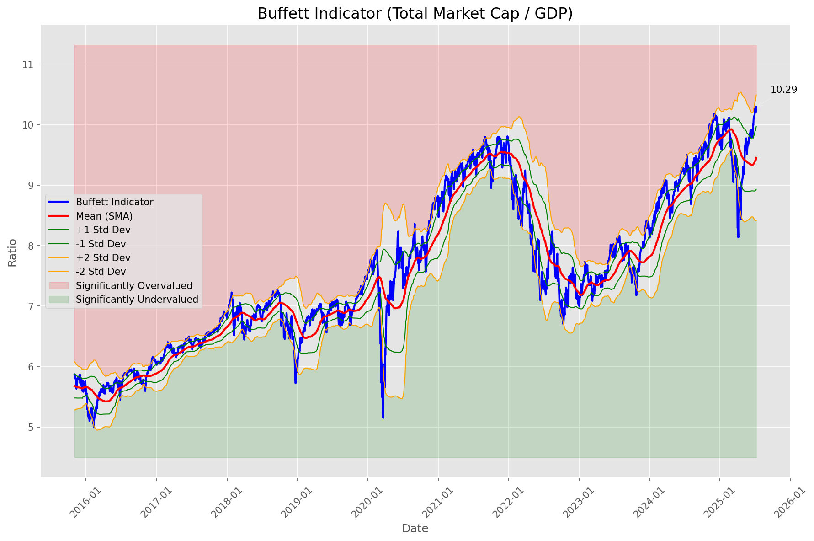
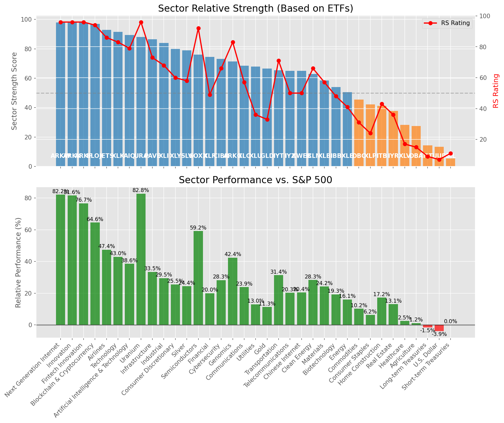

# **Daily Relative Strength Report**

**Date:** 2025-07-11

## **Market Valuation (Buffett Indicator)**

| Metric | Value |
|--------|-------|
| **Market Valuation** | **Overvalued** |
| **Current Ratio** | 10.25 |
| **Historical Mean** | 9.45 |
| **Standard Deviation** | 0.52 |
| **Z-Score (StdDev from Mean)** | 1.62 |
| **Total Market Cap** | $307.03 trillion |
| **GDP** | $29.96 trillion |

## **Market Insights**

### **Market is Overvalued**

The market appears to be trading above historical average valuations. While not at extreme levels, this suggests more modest future returns may be expected. Investors should:

- Focus on companies with reasonable valuations relative to their growth
- Be more selective with new positions
- Look for stocks showing relative strength within their sectors
- Consider trimming positions in extremely overvalued names

Historically, periods of mild overvaluation can persist for extended periods, but returns tend to be below average.

### **Buffett Indicator Overview**

The Buffett Indicator (Total Market Cap / GDP) is a measure of the stock market's valuation relative to the size of the economy. It is named after Warren Buffett, who described it as "probably the best single measure of where valuations stand at any given moment."

- **Values above +2 standard deviations:** Market significantly overvalued
- **Values above +1 standard deviation:** Market overvalued
- **Values between -1 and +1 standard deviations:** Market fairly valued
- **Values below -1 standard deviation:** Market undervalued
- **Values below -2 standard deviations:** Market significantly undervalued

---

## **Sector Relative Strength**

Based on William O'Neil's Relative Strength Methodology

| ETF | Strength | RS Rating | Performance | Above Key MAs | Trend | Sector |
|-----|----------|-----------|-------------|--------------|-------|--------|
| [ARKW](https://www.tradingview.com/chart/?symbol=ARKW) | 99.0 | 98.0 | 82.19% | 10d ✓, 50d ✓, 200d ✓ | ↗️ | Next Generation Internet |
| [BLOK](https://www.tradingview.com/chart/?symbol=BLOK) | 98.5 | 97.0 | 64.59% | 10d ✓, 50d ✓, 200d ✓ | ↗️ | Blockchain & Cryptocurrency |
| [ARKF](https://www.tradingview.com/chart/?symbol=ARKF) | 97.0 | 94.0 | 53.74% | 10d ✓, 50d ✓, 200d ✓ | ↗️ | Fintech Innovation |
| [ARKK](https://www.tradingview.com/chart/?symbol=ARKK) | 97.0 | 94.0 | 53.65% | 10d ✓, 50d ✓, 200d ✓ | ↗️ | Innovation |
| [URA](https://www.tradingview.com/chart/?symbol=URA) | 88.6 | 97.0 | 68.40% | 10d ✗, 50d ✓, 200d ✓ | ↗️ | Uranium |
| [XLK](https://www.tradingview.com/chart/?symbol=XLK) | 87.0 | 74.0 | 25.73% | 10d ✓, 50d ✓, 200d ✓ | ↗️ | Technology |
| [SLV](https://www.tradingview.com/chart/?symbol=SLV) | 85.5 | 71.0 | 23.81% | 10d ✓, 50d ✓, 200d ✓ | ↗️ | Silver |
| [JETS](https://www.tradingview.com/chart/?symbol=JETS) | 85.0 | 70.0 | 23.18% | 10d ✓, 50d ✓, 200d ✓ | ↗️ | Airlines |
| [PAVE](https://www.tradingview.com/chart/?symbol=PAVE) | 83.5 | 67.0 | 21.54% | 10d ✓, 50d ✓, 200d ✓ | ↗️ | Infrastructure |
| [XLI](https://www.tradingview.com/chart/?symbol=XLI) | 81.0 | 62.0 | 18.59% | 10d ✓, 50d ✓, 200d ✓ | ↗️ | Industrial |
| [AIQ](https://www.tradingview.com/chart/?symbol=AIQ) | 74.6 | 69.0 | 22.70% | 10d ✗, 50d ✓, 200d ✓ | ↗️ | Artificial Intelligence & Technology |
| [XLY](https://www.tradingview.com/chart/?symbol=XLY) | 73.5 | 47.0 | 12.64% | 10d ✓, 50d ✓, 200d ✓ | ↗️ | Consumer Discretionary |
| [IYZ](https://www.tradingview.com/chart/?symbol=IYZ) | 72.6 | 65.0 | 20.26% | 10d ✗, 50d ✓, 200d ✓ | ↗️ | Telecommunications |
| [SOXX](https://www.tradingview.com/chart/?symbol=SOXX) | 71.5 | 83.0 | 33.60% | 10d ✓, 50d ✓, 200d ✓ | ↘️ | Semiconductors |
| [GLD](https://www.tradingview.com/chart/?symbol=GLD) | 69.0 | 38.0 | 8.61% | 10d ✓, 50d ✓, 200d ✓ | ↗️ | Gold |
| [XLU](https://www.tradingview.com/chart/?symbol=XLU) | 68.5 | 37.0 | 8.16% | 10d ✓, 50d ✓, 200d ✓ | ↗️ | Utilities |
| [CIBR](https://www.tradingview.com/chart/?symbol=CIBR) | 67.6 | 55.0 | 15.39% | 10d ✗, 50d ✓, 200d ✓ | ↗️ | Cybersecurity |
| [ARKG](https://www.tradingview.com/chart/?symbol=ARKG) | 66.0 | 72.0 | 24.37% | 10d ✓, 50d ✓, 200d ✓ | ↘️ | Genomics |
| [XLC](https://www.tradingview.com/chart/?symbol=XLC) | 64.1 | 48.0 | 12.79% | 10d ✗, 50d ✓, 200d ✓ | ↗️ | Communications |
| [XLF](https://www.tradingview.com/chart/?symbol=XLF) | 61.6 | 43.0 | 10.62% | 10d ✗, 50d ✓, 200d ✓ | ↗️ | Financial |
| [IYT](https://www.tradingview.com/chart/?symbol=IYT) | 59.0 | 58.0 | 16.85% | 10d ✓, 50d ✓, 200d ✓ | ↘️ | Transportation |
| [KWEB](https://www.tradingview.com/chart/?symbol=KWEB) | 54.2 | 48.0 | 12.98% | 10d ✗, 50d ✗, 200d ✓ | ↗️ | Chinese Internet |
| [XLB](https://www.tradingview.com/chart/?symbol=XLB) | 54.0 | 48.0 | 12.85% | 10d ✓, 50d ✓, 200d ✓ | ↘️ | Materials |
| [ICLN](https://www.tradingview.com/chart/?symbol=ICLN) | 53.1 | 66.0 | 20.69% | 10d ✗, 50d ✓, 200d ✓ | ↘️ | Clean Energy |
| [DBC](https://www.tradingview.com/chart/?symbol=DBC) | 51.0 | 42.0 | 10.22% | 10d ✓, 50d ✓, 200d ✓ | ↘️ | Commodities |
| [XLE](https://www.tradingview.com/chart/?symbol=XLE) | 49.0 | 38.0 | 8.37% | 10d ✓, 50d ✓, 200d ✓ | ↘️ | Energy |
| [IBB](https://www.tradingview.com/chart/?symbol=IBB) | 42.3 | 45.0 | 11.18% | 10d ✓, 50d ✓, 200d ✗ | ↘️ | Biotechnology |
| [ITB](https://www.tradingview.com/chart/?symbol=ITB) | 39.3 | 39.0 | 8.66% | 10d ✓, 50d ✓, 200d ✗ | ↘️ | Home Construction |
| [DBA](https://www.tradingview.com/chart/?symbol=DBA) | 32.0 | 24.0 | 2.18% | 10d ✗, 50d ✗, 200d ✗ | ↗️ | Agriculture |
| [XLP](https://www.tradingview.com/chart/?symbol=XLP) | 31.0 | 22.0 | 1.53% | 10d ✗, 50d ✗, 200d ✗ | ↗️ | Consumer Staples |
| [IYR](https://www.tradingview.com/chart/?symbol=IYR) | 26.4 | 33.0 | 6.29% | 10d ✗, 50d ✓, 200d ✗ | ↘️ | Real Estate |
| [BIL](https://www.tradingview.com/chart/?symbol=BIL) | 17.9 | 16.0 | 0.06% | 10d ✓, 50d ✗, 200d ✗ | ↘️ | Short-term Treasuries |
| [XLV](https://www.tradingview.com/chart/?symbol=XLV) | 15.4 | 11.0 | -3.09% | 10d ✗, 50d ✓, 200d ✗ | ↘️ | Healthcare |
| [UUP](https://www.tradingview.com/chart/?symbol=UUP) | 14.9 | 10.0 | -3.88% | 10d ✓, 50d ✗, 200d ✗ | ↘️ | U.S. Dollar |
| [TLT](https://www.tradingview.com/chart/?symbol=TLT) | 5.5 | 11.0 | -3.20% | 10d ✗, 50d ✗, 200d ✗ | ↘️ | Long-term Treasuries |

### **Sector ETF Performance Interpretation**

This table shows the relative strength metrics for different market sectors based on their representative ETFs:

- **ETF**: The ETF used to measure sector performance (click for chart)
- **Strength**: Overall sector strength score (0-100) combining multiple factors
- **RS Rating**: O'Neil RS rating of the sector ETF
- **Performance**: Performance of the sector ETF relative to SPY
- **Above Key MAs**: Whether the ETF is trading above its 10, 50, and 200-day moving averages
- **Trend**: Whether the sector is in an uptrend (↗️) or downtrend (↘️)

### **Current Sector Leadership**

The current market leadership is coming from the following sectors: **Next Generation Internet, Blockchain & Cryptocurrency, Fintech Innovation**.

The **Next Generation Internet** sector (represented by **ARKW**) is showing particularly strong relative strength with an RS rating of 98.0 and performance of 82.19% vs. the S&P 500. This sector is trading above its 10-day, 50-day, 200-day moving average(s). Investors should consider focusing on high RS stocks within these leading sectors for potential outperformance.

---

## **Buy Recommendations**

The following 41 stocks show exceptional relative strength:

| RS Rating | Buy Score | Current Price | Chart | Name | Ticker |
|-----------|-----------|---------------|-------|------|--------|
| 100 | 100 | $199.31 | [Chart](https://www.tradingview.com/chart/?symbol=LEU) | Centrus Energy Corp. | LEU |
| 100 | 100 | $100.24 | [Chart](https://www.tradingview.com/chart/?symbol=HOOD) | Robinhood Markets, Inc. Class A Common Stock | HOOD |
| 100 | 100 | $149.22 | [Chart](https://www.tradingview.com/chart/?symbol=LMB) | Limbach Holdings, Inc Common Stock | LMB |
| 99 | 100 | $46.16 | [Chart](https://www.tradingview.com/chart/?symbol=MP) | MP Materials Corp. | MP |
| 99 | 100 | $106.97 | [Chart](https://www.tradingview.com/chart/?symbol=RBLX) | Roblox Corporation | RBLX |
| 99 | 100 | $146.93 | [Chart](https://www.tradingview.com/chart/?symbol=FUTU) | Futu Holdings Limited American Depositary Shares | FUTU |
| 99 | 100 | $43.95 | [Chart](https://www.tradingview.com/chart/?symbol=FARO) | Faro Technologies Inc | FARO |
| 98 | 100 | $104.83 | [Chart](https://www.tradingview.com/chart/?symbol=VRNA) | Verona Pharma plc | VRNA |
| 97 | 100 | $49.22 | [Chart](https://www.tradingview.com/chart/?symbol=REVG) | REV Group, Inc. | REVG |
| 97 | 100 | $542.89 | [Chart](https://www.tradingview.com/chart/?symbol=GEV) | GE Vernova Inc. | GEV |
| 96 | 100 | $22.24 | [Chart](https://www.tradingview.com/chart/?symbol=MAG) | MAG Silver Corp. | MAG |
| 96 | 100 | $51.88 | [Chart](https://www.tradingview.com/chart/?symbol=KTOS) | Kratos Defense & Security Solutions, Inc. | KTOS |
| 95 | 100 | $142.23 | [Chart](https://www.tradingview.com/chart/?symbol=PLTR) | Palantir Technologies Inc. Class A Common Stock | PLTR |
| 95 | 100 | $348.70 | [Chart](https://www.tradingview.com/chart/?symbol=CVNA) | Carvana Co. | CVNA |
| 94 | 100 | $35.28 | [Chart](https://www.tradingview.com/chart/?symbol=ATAT) | Atour Lifestyle Holdings Limited American Depositary Shares | ATAT |
| 94 | 100 | $215.10 | [Chart](https://www.tradingview.com/chart/?symbol=AGX) | Argan, Inc | AGX |
| 94 | 100 | $51.24 | [Chart](https://www.tradingview.com/chart/?symbol=ARKF) | ARK Fintech Innovation ETF | ARKF |
| 94 | 100 | $35.22 | [Chart](https://www.tradingview.com/chart/?symbol=ATRO) | Astronics Corp | ATRO |
| 92 | 100 | $34.65 | [Chart](https://www.tradingview.com/chart/?symbol=APG) | APi Group Corporation | APG |
| 92 | 100 | $88.62 | [Chart](https://www.tradingview.com/chart/?symbol=RYTM) | Rhythm Pharmaceuticals, Inc. Common Stock | RYTM |
| 91 | 100 | $97.53 | [Chart](https://www.tradingview.com/chart/?symbol=TPR) | Tapestry, Inc. Common Stock | TPR |
| 91 | 100 | $29.38 | [Chart](https://www.tradingview.com/chart/?symbol=NTGR) | NETGEAR, Inc. | NTGR |
| 90 | 100 | $66.94 | [Chart](https://www.tradingview.com/chart/?symbol=IBIT) | iShares Bitcoin Trust ETF | IBIT |
| 90 | 100 | $52.20 | [Chart](https://www.tradingview.com/chart/?symbol=BTC) | Grayscale Bitcoin Mini Trust ETF | BTC |
| 87 | 100 | $29.24 | [Chart](https://www.tradingview.com/chart/?symbol=CAE) | CAE INC | CAE |
| 86 | 100 | $96.35 | [Chart](https://www.tradingview.com/chart/?symbol=SNEX) | StoneX Group Inc. Common Stock | SNEX |
| 89 | 99 | $258.16 | [Chart](https://www.tradingview.com/chart/?symbol=WTS) | Watts Water Technologies, Inc. Class A | WTS |
| 88 | 99 | $46.24 | [Chart](https://www.tradingview.com/chart/?symbol=BBIO) | BridgeBio Pharma, Inc. Common Stock | BBIO |
| 89 | 98 | $34.95 | [Chart](https://www.tradingview.com/chart/?symbol=NNE) | Nano Nuclear Energy Inc. Common Stock | NNE |
| 87 | 98 | $59.13 | [Chart](https://www.tradingview.com/chart/?symbol=IBKR) | Interactive Brokers Group, Inc. Class A Common Stock | IBKR |
| 86 | 98 | $47.32 | [Chart](https://www.tradingview.com/chart/?symbol=DRS) | Leonardo DRS, Inc. Common Stock | DRS |
| 86 | 97 | $5718.51 | [Chart](https://www.tradingview.com/chart/?symbol=BKNG) | Booking Holdings Inc. Common Stock | BKNG |
| 85 | 96 | $255.35 | [Chart](https://www.tradingview.com/chart/?symbol=GE) | GE Aerospace | GE |
| 84 | 96 | $27.55 | [Chart](https://www.tradingview.com/chart/?symbol=OR) | OR Royalties Inc. | OR |
| 83 | 96 | $29.55 | [Chart](https://www.tradingview.com/chart/?symbol=DB) | Deutsche Bank Aktiengesellschaft | DB |
| 86 | 95 | $50.65 | [Chart](https://www.tradingview.com/chart/?symbol=SIL) | Global X Silver Miners ETF (NEW) | SIL |
| 85 | 94 | $50.45 | [Chart](https://www.tradingview.com/chart/?symbol=INOD) | Innodata Inc. | INOD |
| 81 | 94 | $18.44 | [Chart](https://www.tradingview.com/chart/?symbol=BCS) | Barclays PLC | BCS |
| 82 | 93 | $25.10 | [Chart](https://www.tradingview.com/chart/?symbol=KAR) | OPENLANE, Inc | KAR |
| 80 | 92 | $48.53 | [Chart](https://www.tradingview.com/chart/?symbol=EWI) | iShares MSCI Italy ETF | EWI |
| 81 | 91 | $110.14 | [Chart](https://www.tradingview.com/chart/?symbol=PSMT) | Pricesmart Inc | PSMT |

---

## **Sell Recommendations**

The following 104 stocks show deteriorating relative strength:

| RS Rating | Sell Score | Current Price | Chart | Name | Ticker |
|-----------|------------|---------------|-------|------|--------|
| 1 | 100 | $12.54 | [Chart](https://www.tradingview.com/chart/?symbol=IART) | Integra LifeSciences Holdings | IART |
| 1 | 100 | $25.83 | [Chart](https://www.tradingview.com/chart/?symbol=TECS) | Direxion Daily Technology Bear 3x Shares | TECS |
| 1 | 100 | $34.10 | [Chart](https://www.tradingview.com/chart/?symbol=SARK) | Investment Managers Series Trust II Tradr 1X Short Innovation Daily ETF | SARK |
| 1 | 100 | $221.06 | [Chart](https://www.tradingview.com/chart/?symbol=MOH) | Molina Healthcare, Inc. | MOH |
| 2 | 100 | $25.22 | [Chart](https://www.tradingview.com/chart/?symbol=QID) | ProShares UltraShort QQQ | QID |
| 2 | 100 | $40.83 | [Chart](https://www.tradingview.com/chart/?symbol=SDOW) | ProShares UltraPro Short Dow 30 | SDOW |
| 2 | 100 | $10.25 | [Chart](https://www.tradingview.com/chart/?symbol=SNDX) | Syndax Pharmaceuticals, Inc. | SNDX |
| 2 | 100 | $16.44 | [Chart](https://www.tradingview.com/chart/?symbol=SDS) | ProShares UltraShort S&P500 | SDS |
| 2 | 100 | $17.93 | [Chart](https://www.tradingview.com/chart/?symbol=BITI) | ProShares Short Bitcoin ETF | BITI |
| 2 | 100 | $20.79 | [Chart](https://www.tradingview.com/chart/?symbol=ERY) | Direxion Daily Energy Bear 2X Shares | ERY |
| 3 | 100 | $42.77 | [Chart](https://www.tradingview.com/chart/?symbol=LINE) | Lineage, Inc. Common Stock | LINE |
| 3 | 100 | $81.45 | [Chart](https://www.tradingview.com/chart/?symbol=LNTH) | Lantheus Holdings, Inc | LNTH |
| 3 | 100 | $228.61 | [Chart](https://www.tradingview.com/chart/?symbol=HUM) | Humana Inc. | HUM |
| 3 | 100 | $10.74 | [Chart](https://www.tradingview.com/chart/?symbol=SONO) | Sonos, Inc. Common Stock | SONO |
| 4 | 100 | $24.00 | [Chart](https://www.tradingview.com/chart/?symbol=DXD) | ProShares UltraShort Dow 30 | DXD |
| 4 | 100 | $33.62 | [Chart](https://www.tradingview.com/chart/?symbol=PSQ) | ProShares Short QQQ | PSQ |
| 4 | 100 | $16.30 | [Chart](https://www.tradingview.com/chart/?symbol=COLD) | Americold Realty Trust, Inc. | COLD |
| 4 | 100 | $32.32 | [Chart](https://www.tradingview.com/chart/?symbol=CRI) | Carter's Inc. | CRI |
| 4 | 100 | $10.20 | [Chart](https://www.tradingview.com/chart/?symbol=LBTYK) | Liberty Global Ltd. Class C Common Shares | LBTYK |
| 4 | 100 | $12.46 | [Chart](https://www.tradingview.com/chart/?symbol=CCRN) | Cross Country Healthcare Inc | CCRN |
| 4 | 100 | $60.30 | [Chart](https://www.tradingview.com/chart/?symbol=STC) | Stewart Information Services Corporation | STC |
| 5 | 100 | $101.97 | [Chart](https://www.tradingview.com/chart/?symbol=DECK) | Deckers Outdoor Corp | DECK |
| 5 | 100 | $39.45 | [Chart](https://www.tradingview.com/chart/?symbol=SH) | ProShares Short S&P500 | SH |
| 5 | 100 | $10.82 | [Chart](https://www.tradingview.com/chart/?symbol=SD) | SandRidge Energy, Inc. | SD |
| 5 | 100 | $15.67 | [Chart](https://www.tradingview.com/chart/?symbol=TNDM) | Tandem Diabetes Care, Inc. | TNDM |
| 5 | 100 | $24.26 | [Chart](https://www.tradingview.com/chart/?symbol=CRTO) | Criteo S.A. | CRTO |
| 5 | 100 | $37.31 | [Chart](https://www.tradingview.com/chart/?symbol=IBTA) | Ibotta, Inc. | IBTA |
| 6 | 100 | $17.26 | [Chart](https://www.tradingview.com/chart/?symbol=NOMD) | Nomad Foods Limited | NOMD |
| 6 | 100 | $49.91 | [Chart](https://www.tradingview.com/chart/?symbol=LW) | Lamb Weston Holdings, Inc. | LW |
| 6 | 100 | $22.22 | [Chart](https://www.tradingview.com/chart/?symbol=GPK) | Graphic Packaging Holding Company | GPK |
| 7 | 100 | $38.55 | [Chart](https://www.tradingview.com/chart/?symbol=LKQ) | LKQ Corporation | LKQ |
| 7 | 100 | $65.13 | [Chart](https://www.tradingview.com/chart/?symbol=ZROZ) | PIMCO 25+ Year Zero Coupon U.S. Treasury Index Exchange-Traded Fund | ZROZ |
| 7 | 100 | $25.38 | [Chart](https://www.tradingview.com/chart/?symbol=DOG) | ProShares Short Dow30 | DOG |
| 7 | 100 | $46.67 | [Chart](https://www.tradingview.com/chart/?symbol=KBR) | KBR, Inc. | KBR |
| 7 | 100 | $10.23 | [Chart](https://www.tradingview.com/chart/?symbol=LBTYA) | Liberty Global Ltd. Class A Common Shares | LBTYA |
| 8 | 100 | $17.59 | [Chart](https://www.tradingview.com/chart/?symbol=S) | SentinelOne, Inc. | S |
| 10 | 100 | $10.35 | [Chart](https://www.tradingview.com/chart/?symbol=NMZ) | Nuveen Municipal High Income Opportunity Fund | NMZ |
| 10 | 100 | $130.10 | [Chart](https://www.tradingview.com/chart/?symbol=KMB) | Kimberly-Clark Corp. | KMB |
| 11 | 100 | $86.03 | [Chart](https://www.tradingview.com/chart/?symbol=TLT) | iShares 20+ Year Treasury Bond ETF | TLT |
| 14 | 100 | $27.24 | [Chart](https://www.tradingview.com/chart/?symbol=GTY) | Getty Realty Corp. | GTY |
| 16 | 100 | $29.15 | [Chart](https://www.tradingview.com/chart/?symbol=SPTS) | SPDR Portfolio Short Term Treasury ETF | SPTS |
| 10 | 99 | $102.95 | [Chart](https://www.tradingview.com/chart/?symbol=DEO) | Diageo plc | DEO |
| 7 | 98 | $12.88 | [Chart](https://www.tradingview.com/chart/?symbol=GO) | Grocery Outlet Holding Corp. Common Stock | GO |
| 9 | 98 | $24.96 | [Chart](https://www.tradingview.com/chart/?symbol=TBBB) | BBB Foods Inc. | TBBB |
| 16 | 98 | $32.25 | [Chart](https://www.tradingview.com/chart/?symbol=INVH) | Invitation Homes Inc. Common Stock | INVH |
| 3 | 97 | $49.38 | [Chart](https://www.tradingview.com/chart/?symbol=TAP) | Molson Coors Beverage Company Class B | TAP |
| 10 | 97 | $30.51 | [Chart](https://www.tradingview.com/chart/?symbol=AXTA) | Axalta Coating Systems Ltd. | AXTA |
| 9 | 96 | $12.68 | [Chart](https://www.tradingview.com/chart/?symbol=PMT) | PennyMac Mortgage Investment Trust | PMT |
| 9 | 96 | $48.56 | [Chart](https://www.tradingview.com/chart/?symbol=SNY) | Sanofi American Depositary Shares (Each representing one-half of one ordinary share) | SNY |
| 12 | 96 | $71.20 | [Chart](https://www.tradingview.com/chart/?symbol=TNET) | TRINET GROUP, INC. | TNET |
| 13 | 96 | $21.65 | [Chart](https://www.tradingview.com/chart/?symbol=TUA) | Simplify Short Term Treasury Futures Strategy ETF | TUA |
| 12 | 95 | $40.18 | [Chart](https://www.tradingview.com/chart/?symbol=UDR) | UDR, Inc. | UDR |
| 17 | 95 | $41.47 | [Chart](https://www.tradingview.com/chart/?symbol=POR) | Portland General Electric Company | POR |
| 8 | 94 | $19.91 | [Chart](https://www.tradingview.com/chart/?symbol=CON) | Concentra Group Holdings Parent, Inc. | CON |
| 9 | 94 | $25.05 | [Chart](https://www.tradingview.com/chart/?symbol=DRV) | Direxion Daily Real Estate Bear 3X Shares | DRV |
| 12 | 94 | $54.83 | [Chart](https://www.tradingview.com/chart/?symbol=VGLT) | Vanguard Long-Term Treasury ETF | VGLT |
| 14 | 94 | $107.38 | [Chart](https://www.tradingview.com/chart/?symbol=BAH) | Booz Allen Hamilton Holding Corporation | BAH |
| 10 | 93 | $33.35 | [Chart](https://www.tradingview.com/chart/?symbol=KDP) | Keurig Dr Pepper Inc. | KDP |
| 14 | 93 | $89.66 | [Chart](https://www.tradingview.com/chart/?symbol=CL) | Colgate-Palmolive Company | CL |
| 14 | 93 | $66.38 | [Chart](https://www.tradingview.com/chart/?symbol=EQR) | Equity Residential | EQR |
| 18 | 93 | $16.80 | [Chart](https://www.tradingview.com/chart/?symbol=MLN) | VanEck Long Muni ETF | MLN |
| 11 | 92 | $18.32 | [Chart](https://www.tradingview.com/chart/?symbol=AKR) | Acadia Realty Trust | AKR |
| 13 | 92 | $139.25 | [Chart](https://www.tradingview.com/chart/?symbol=INSP) | Inspire Medical Systems, Inc. | INSP |
| 20 | 92 | $465.48 | [Chart](https://www.tradingview.com/chart/?symbol=LMT) | Lockheed Martin Corp. | LMT |
| 15 | 91 | $82.44 | [Chart](https://www.tradingview.com/chart/?symbol=SHY) | iShares 1-3 Year Treasury Bond ETF | SHY |
| 18 | 91 | $14.77 | [Chart](https://www.tradingview.com/chart/?symbol=VRE) | Veris Residential, Inc. | VRE |
| 24 | 89 | $60.67 | [Chart](https://www.tradingview.com/chart/?symbol=UL) | Unilever plc | UL |
| 21 | 88 | $56.74 | [Chart](https://www.tradingview.com/chart/?symbol=DAY) | Dayforce, Inc. | DAY |
| 21 | 87 | $25.81 | [Chart](https://www.tradingview.com/chart/?symbol=PNTG) | The Pennant Group, Inc. Common Stock | PNTG |
| 24 | 87 | $11.90 | [Chart](https://www.tradingview.com/chart/?symbol=NVG) | Nuveen AMT-Free Municipal Credit Income Fund | NVG |
| 24 | 87 | $21.99 | [Chart](https://www.tradingview.com/chart/?symbol=SGRY) | Surgery Partners, Inc. Common Stock | SGRY |
| 26 | 86 | $15.87 | [Chart](https://www.tradingview.com/chart/?symbol=BNL) | Broadstone Net Lease, Inc. | BNL |
| 16 | 85 | $110.21 | [Chart](https://www.tradingview.com/chart/?symbol=SHV) | iShares Short Treasury Bond ETF | SHV |
| 21 | 85 | $13.28 | [Chart](https://www.tradingview.com/chart/?symbol=BSM) | Black Stone Minerals, L.P. | BSM |
| 26 | 85 | $53.57 | [Chart](https://www.tradingview.com/chart/?symbol=CNMD) | CONMED Corporation | CNMD |
| 28 | 85 | $103.61 | [Chart](https://www.tradingview.com/chart/?symbol=CROX) | Crocs, Inc. | CROX |
| 19 | 84 | $224.19 | [Chart](https://www.tradingview.com/chart/?symbol=LOW) | Lowe's Companies Inc. | LOW |
| 20 | 84 | $109.78 | [Chart](https://www.tradingview.com/chart/?symbol=FTAI) | FTAI Aviation Ltd. Common Stock | FTAI |
| 21 | 84 | $35.55 | [Chart](https://www.tradingview.com/chart/?symbol=AMH) | AMERICAN HOMES 4 RENT | AMH |
| 24 | 83 | $340.45 | [Chart](https://www.tradingview.com/chart/?symbol=EG) | Everest Group, Ltd. | EG |
| 26 | 83 | $75.37 | [Chart](https://www.tradingview.com/chart/?symbol=IFF) | International Flavors & Fragrances Inc. | IFF |
| 28 | 83 | $86.41 | [Chart](https://www.tradingview.com/chart/?symbol=SIGI) | Selective Insurance Group | SIGI |
| 33 | 83 | $17.68 | [Chart](https://www.tradingview.com/chart/?symbol=SVOL) | Simplify Volatility Premium ETF | SVOL |
| 22 | 82 | $113.22 | [Chart](https://www.tradingview.com/chart/?symbol=CPT) | Camden Property Trust | CPT |
| 24 | 82 | $78.12 | [Chart](https://www.tradingview.com/chart/?symbol=AKAM) | Akamai Technologies Inc | AKAM |
| 26 | 82 | $34.55 | [Chart](https://www.tradingview.com/chart/?symbol=PECO) | Phillips Edison & Company, Inc. Common Stock | PECO |
| 25 | 81 | $19.75 | [Chart](https://www.tradingview.com/chart/?symbol=SPT) | Sprout Social, Inc Class A Common Stock | SPT |
| 29 | 81 | $11.84 | [Chart](https://www.tradingview.com/chart/?symbol=SHC) | Sotera Health Company Common Stock | SHC |
| 25 | 80 | $345.57 | [Chart](https://www.tradingview.com/chart/?symbol=SHW) | The Sherwin-Williams Company | SHW |
| 25 | 80 | $100.25 | [Chart](https://www.tradingview.com/chart/?symbol=FMX) | FOMENTO ECONOMICO MEXICANO, S.A.B. DE C.V. | FMX |
| 32 | 80 | $70.66 | [Chart](https://www.tradingview.com/chart/?symbol=AZN) | AstraZeneca PLC | AZN |
| 25 | 79 | $77.11 | [Chart](https://www.tradingview.com/chart/?symbol=AWR) | American States Water Company | AWR |
| 26 | 79 | $25.55 | [Chart](https://www.tradingview.com/chart/?symbol=BRX) | BRIXMOR PROPERTY GROUP INC. | BRX |
| 30 | 79 | $25.45 | [Chart](https://www.tradingview.com/chart/?symbol=HPQ) | HP Inc. | HPQ |
| 22 | 78 | $13.38 | [Chart](https://www.tradingview.com/chart/?symbol=PDO) | PIMCO Dynamic Income Opportunities Fund | PDO |
| 31 | 78 | $14.02 | [Chart](https://www.tradingview.com/chart/?symbol=DOLE) | Dole plc | DOLE |
| 31 | 78 | $29.56 | [Chart](https://www.tradingview.com/chart/?symbol=APPN) | Appian Corporation Class A Common Stock | APPN |
| 23 | 77 | $26.60 | [Chart](https://www.tradingview.com/chart/?symbol=FCPT) | Four Corners Property Trust, Inc. | FCPT |
| 28 | 75 | $56.76 | [Chart](https://www.tradingview.com/chart/?symbol=PRCT) | PROCEPT BioRobotics Corporation Common Stock | PRCT |
| 38 | 72 | $22.34 | [Chart](https://www.tradingview.com/chart/?symbol=KRG) | Kite Realty Group Trust | KRG |
| 32 | 71 | $41.40 | [Chart](https://www.tradingview.com/chart/?symbol=XLRE) | Real Estate Select Sector SPDR Fund | XLRE |
| 36 | 71 | $559.90 | [Chart](https://www.tradingview.com/chart/?symbol=TYL) | Tyler Technologies, Inc. | TYL |
| 31 | 70 | $238.44 | [Chart](https://www.tradingview.com/chart/?symbol=RNR) | RenaissanceRe Holdings Ltd. | RNR |
| 37 | 66 | $19.19 | [Chart](https://www.tradingview.com/chart/?symbol=MSDL) | Morgan Stanley Direct Lending Fund | MSDL |

## **Methodology**

This report uses William O'Neil's relative strength methodology from Investors Business Daily:

* **RS Rating**: Percentile rank of stock's performance vs. S&P 500 over the past 63 trading days (1-99 scale)
* **Buy Criteria**: RS Rating >= 80, price above 50-day MA, strong uptrend, increasing volume
* **Sell Criteria**: RS Rating < 40, price below 50-day MA, downtrend, decreasing volume

### **O'Neil's Key Principles**

1. **Focus on relative performance** - stocks outperforming the market
2. **Price trend confirmation** - stock must be in an uptrend
3. **Volume confirmation** - strong volume supports price moves
4. **Moving average validation** - price above key moving averages
5. **Market leaders only** - concentrate on top-performing stocks

*Report generated automatically after market close*