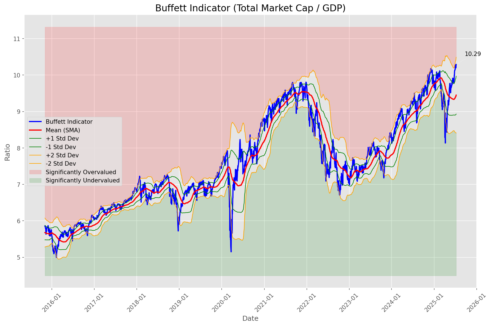
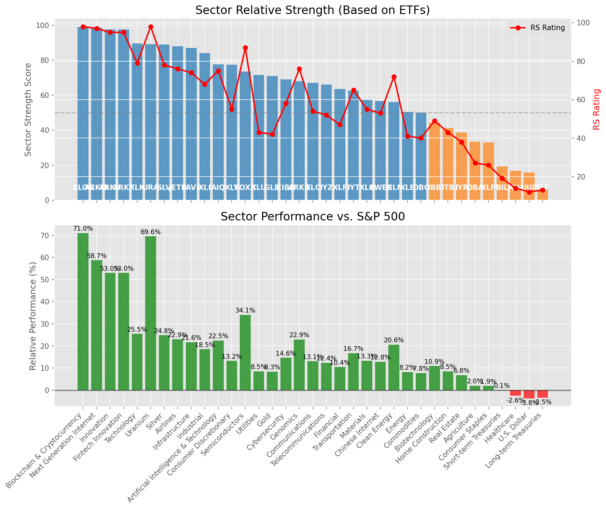

# **Daily Relative Strength Report**

**Date:** 2025-07-12

## **Market Valuation (Buffett Indicator)**

| Metric | Value |
|--------|-------|
| **Market Valuation** | **Overvalued** |
| **Current Ratio** | 10.25 |
| **Historical Mean** | 9.45 |
| **Standard Deviation** | 0.52 |
| **Z-Score (StdDev from Mean)** | 1.62 |
| **Total Market Cap** | $307.02 trillion |
| **GDP** | $29.96 trillion |

## **Market Insights**

### **Market is Overvalued**

The market appears to be trading above historical average valuations. While not at extreme levels, this suggests more modest future returns may be expected. Investors should:

- Focus on companies with reasonable valuations relative to their growth
- Be more selective with new positions
- Look for stocks showing relative strength within their sectors
- Consider trimming positions in extremely overvalued names

Historically, periods of mild overvaluation can persist for extended periods, but returns tend to be below average.

### **Buffett Indicator Overview**

The Buffett Indicator (Total Market Cap / GDP) is a measure of the stock market's valuation relative to the size of the economy. It is named after Warren Buffett, who described it as "probably the best single measure of where valuations stand at any given moment."

- **Values above +2 standard deviations:** Market significantly overvalued
- **Values above +1 standard deviation:** Market overvalued
- **Values between -1 and +1 standard deviations:** Market fairly valued
- **Values below -1 standard deviation:** Market undervalued
- **Values below -2 standard deviations:** Market significantly undervalued

---

## **Sector Relative Strength**

Based on William O'Neil's Relative Strength Methodology

| ETF | Strength | RS Rating | Performance | Above Key MAs | Trend | Sector |
|-----|----------|-----------|-------------|--------------|-------|--------|
| [BLOK](https://www.tradingview.com/chart/?symbol=BLOK) | 99.0 | 98.0 | 71.04% | 10d ✓, 50d ✓, 200d ✓ | ↗️ | Blockchain & Cryptocurrency |
| [ARKW](https://www.tradingview.com/chart/?symbol=ARKW) | 98.5 | 97.0 | 58.71% | 10d ✓, 50d ✓, 200d ✓ | ↗️ | Next Generation Internet |
| [ARKK](https://www.tradingview.com/chart/?symbol=ARKK) | 97.5 | 95.0 | 52.99% | 10d ✓, 50d ✓, 200d ✓ | ↗️ | Innovation |
| [ARKF](https://www.tradingview.com/chart/?symbol=ARKF) | 97.5 | 95.0 | 53.02% | 10d ✓, 50d ✓, 200d ✓ | ↗️ | Fintech Innovation |
| [XLK](https://www.tradingview.com/chart/?symbol=XLK) | 89.5 | 79.0 | 25.50% | 10d ✓, 50d ✓, 200d ✓ | ↗️ | Technology |
| [URA](https://www.tradingview.com/chart/?symbol=URA) | 89.1 | 98.0 | 69.58% | 10d ✗, 50d ✓, 200d ✓ | ↗️ | Uranium |
| [SLV](https://www.tradingview.com/chart/?symbol=SLV) | 89.0 | 78.0 | 24.84% | 10d ✓, 50d ✓, 200d ✓ | ↗️ | Silver |
| [JETS](https://www.tradingview.com/chart/?symbol=JETS) | 88.0 | 76.0 | 22.94% | 10d ✓, 50d ✓, 200d ✓ | ↗️ | Airlines |
| [PAVE](https://www.tradingview.com/chart/?symbol=PAVE) | 87.0 | 74.0 | 21.65% | 10d ✓, 50d ✓, 200d ✓ | ↗️ | Infrastructure |
| [XLI](https://www.tradingview.com/chart/?symbol=XLI) | 84.0 | 68.0 | 18.49% | 10d ✓, 50d ✓, 200d ✓ | ↗️ | Industrial |
| [AIQ](https://www.tradingview.com/chart/?symbol=AIQ) | 77.6 | 75.0 | 22.47% | 10d ✗, 50d ✓, 200d ✓ | ↗️ | Artificial Intelligence & Technology |
| [XLY](https://www.tradingview.com/chart/?symbol=XLY) | 77.5 | 55.0 | 13.24% | 10d ✓, 50d ✓, 200d ✓ | ↗️ | Consumer Discretionary |
| [SOXX](https://www.tradingview.com/chart/?symbol=SOXX) | 73.5 | 87.0 | 34.06% | 10d ✓, 50d ✓, 200d ✓ | ↘️ | Semiconductors |
| [XLU](https://www.tradingview.com/chart/?symbol=XLU) | 71.5 | 43.0 | 8.53% | 10d ✓, 50d ✓, 200d ✓ | ↗️ | Utilities |
| [GLD](https://www.tradingview.com/chart/?symbol=GLD) | 71.0 | 42.0 | 8.33% | 10d ✓, 50d ✓, 200d ✓ | ↗️ | Gold |
| [CIBR](https://www.tradingview.com/chart/?symbol=CIBR) | 69.1 | 58.0 | 14.64% | 10d ✗, 50d ✓, 200d ✓ | ↗️ | Cybersecurity |
| [ARKG](https://www.tradingview.com/chart/?symbol=ARKG) | 68.0 | 76.0 | 22.88% | 10d ✓, 50d ✓, 200d ✓ | ↘️ | Genomics |
| [XLC](https://www.tradingview.com/chart/?symbol=XLC) | 67.1 | 54.0 | 13.09% | 10d ✗, 50d ✓, 200d ✓ | ↗️ | Communications |
| [IYZ](https://www.tradingview.com/chart/?symbol=IYZ) | 66.1 | 52.0 | 12.36% | 10d ✗, 50d ✓, 200d ✓ | ↗️ | Telecommunications |
| [XLF](https://www.tradingview.com/chart/?symbol=XLF) | 63.6 | 47.0 | 10.44% | 10d ✗, 50d ✓, 200d ✓ | ↗️ | Financial |
| [IYT](https://www.tradingview.com/chart/?symbol=IYT) | 62.5 | 65.0 | 16.74% | 10d ✓, 50d ✓, 200d ✓ | ↘️ | Transportation |
| [XLB](https://www.tradingview.com/chart/?symbol=XLB) | 57.5 | 55.0 | 13.32% | 10d ✓, 50d ✓, 200d ✓ | ↘️ | Materials |
| [KWEB](https://www.tradingview.com/chart/?symbol=KWEB) | 56.7 | 53.0 | 12.83% | 10d ✗, 50d ✗, 200d ✓ | ↗️ | Chinese Internet |
| [ICLN](https://www.tradingview.com/chart/?symbol=ICLN) | 56.1 | 72.0 | 20.56% | 10d ✗, 50d ✓, 200d ✓ | ↘️ | Clean Energy |
| [XLE](https://www.tradingview.com/chart/?symbol=XLE) | 50.5 | 41.0 | 8.22% | 10d ✓, 50d ✓, 200d ✓ | ↘️ | Energy |
| [DBC](https://www.tradingview.com/chart/?symbol=DBC) | 50.0 | 40.0 | 7.75% | 10d ✓, 50d ✓, 200d ✓ | ↘️ | Commodities |
| [IBB](https://www.tradingview.com/chart/?symbol=IBB) | 44.3 | 49.0 | 10.92% | 10d ✓, 50d ✓, 200d ✗ | ↘️ | Biotechnology |
| [ITB](https://www.tradingview.com/chart/?symbol=ITB) | 41.3 | 43.0 | 8.52% | 10d ✓, 50d ✓, 200d ✗ | ↘️ | Home Construction |
| [IYR](https://www.tradingview.com/chart/?symbol=IYR) | 38.8 | 38.0 | 6.79% | 10d ✓, 50d ✓, 200d ✗ | ↘️ | Real Estate |
| [DBA](https://www.tradingview.com/chart/?symbol=DBA) | 33.5 | 27.0 | 1.98% | 10d ✗, 50d ✗, 200d ✗ | ↗️ | Agriculture |
| [XLP](https://www.tradingview.com/chart/?symbol=XLP) | 33.0 | 26.0 | 1.89% | 10d ✗, 50d ✗, 200d ✗ | ↗️ | Consumer Staples |
| [BIL](https://www.tradingview.com/chart/?symbol=BIL) | 19.4 | 19.0 | 0.05% | 10d ✓, 50d ✗, 200d ✗ | ↘️ | Short-term Treasuries |
| [XLV](https://www.tradingview.com/chart/?symbol=XLV) | 16.9 | 14.0 | -2.57% | 10d ✗, 50d ✓, 200d ✗ | ↘️ | Healthcare |
| [UUP](https://www.tradingview.com/chart/?symbol=UUP) | 15.9 | 12.0 | -3.78% | 10d ✓, 50d ✗, 200d ✗ | ↘️ | U.S. Dollar |
| [TLT](https://www.tradingview.com/chart/?symbol=TLT) | 6.5 | 13.0 | -3.47% | 10d ✗, 50d ✗, 200d ✗ | ↘️ | Long-term Treasuries |

### **Sector ETF Performance Interpretation**

This table shows the relative strength metrics for different market sectors based on their representative ETFs:

- **ETF**: The ETF used to measure sector performance (click for chart)
- **Strength**: Overall sector strength score (0-100) combining multiple factors
- **RS Rating**: O'Neil RS rating of the sector ETF
- **Performance**: Performance of the sector ETF relative to SPY
- **Above Key MAs**: Whether the ETF is trading above its 10, 50, and 200-day moving averages
- **Trend**: Whether the sector is in an uptrend (↗️) or downtrend (↘️)

### **Current Sector Leadership**

The current market leadership is coming from the following sectors: **Blockchain & Cryptocurrency, Next Generation Internet, Innovation**.

The **Blockchain & Cryptocurrency** sector (represented by **BLOK**) is showing particularly strong relative strength with an RS rating of 98.0 and performance of 71.04% vs. the S&P 500. This sector is trading above its 10-day, 50-day, 200-day moving average(s). Investors should consider focusing on high RS stocks within these leading sectors for potential outperformance.

---

## **Buy Recommendations**

The following 45 stocks show exceptional relative strength:

| RS Rating | Buy Score | Current Price | Chart | Name | Ticker |
|-----------|-----------|---------------|-------|------|--------|
| 100 | 100 | $98.34 | [Chart](https://www.tradingview.com/chart/?symbol=HOOD) | Robinhood Markets, Inc. Class A Common Stock | HOOD |
| 100 | 100 | $206.40 | [Chart](https://www.tradingview.com/chart/?symbol=LEU) | Centrus Energy Corp. | LEU |
| 99 | 100 | $149.99 | [Chart](https://www.tradingview.com/chart/?symbol=FUTU) | Futu Holdings Limited American Depositary Shares | FUTU |
| 99 | 100 | $105.69 | [Chart](https://www.tradingview.com/chart/?symbol=RBLX) | Roblox Corporation | RBLX |
| 99 | 100 | $149.42 | [Chart](https://www.tradingview.com/chart/?symbol=LMB) | Limbach Holdings, Inc Common Stock | LMB |
| 99 | 100 | $45.11 | [Chart](https://www.tradingview.com/chart/?symbol=MP) | MP Materials Corp. | MP |
| 99 | 100 | $43.94 | [Chart](https://www.tradingview.com/chart/?symbol=FARO) | Faro Technologies Inc | FARO |
| 98 | 100 | $104.83 | [Chart](https://www.tradingview.com/chart/?symbol=VRNA) | Verona Pharma plc | VRNA |
| 97 | 100 | $22.31 | [Chart](https://www.tradingview.com/chart/?symbol=MAG) | MAG Silver Corp. | MAG |
| 97 | 100 | $51.71 | [Chart](https://www.tradingview.com/chart/?symbol=KTOS) | Kratos Defense & Security Solutions, Inc. | KTOS |
| 97 | 100 | $539.16 | [Chart](https://www.tradingview.com/chart/?symbol=GEV) | GE Vernova Inc. | GEV |
| 96 | 100 | $142.10 | [Chart](https://www.tradingview.com/chart/?symbol=PLTR) | Palantir Technologies Inc. Class A Common Stock | PLTR |
| 96 | 100 | $343.67 | [Chart](https://www.tradingview.com/chart/?symbol=CVNA) | Carvana Co. | CVNA |
| 96 | 100 | $35.46 | [Chart](https://www.tradingview.com/chart/?symbol=ATAT) | Atour Lifestyle Holdings Limited American Depositary Shares | ATAT |
| 96 | 100 | $36.11 | [Chart](https://www.tradingview.com/chart/?symbol=ATRO) | Astronics Corp | ATRO |
| 95 | 100 | $51.00 | [Chart](https://www.tradingview.com/chart/?symbol=ARKF) | ARK Fintech Innovation ETF | ARKF |
| 95 | 100 | $212.25 | [Chart](https://www.tradingview.com/chart/?symbol=AGX) | Argan, Inc | AGX |
| 94 | 100 | $34.41 | [Chart](https://www.tradingview.com/chart/?symbol=APG) | APi Group Corporation | APG |
| 94 | 100 | $98.43 | [Chart](https://www.tradingview.com/chart/?symbol=TPR) | Tapestry, Inc. Common Stock | TPR |
| 93 | 100 | $67.21 | [Chart](https://www.tradingview.com/chart/?symbol=IBIT) | iShares Bitcoin Trust ETF | IBIT |
| 93 | 100 | $52.38 | [Chart](https://www.tradingview.com/chart/?symbol=BTC) | Grayscale Bitcoin Mini Trust ETF | BTC |
| 93 | 100 | $86.70 | [Chart](https://www.tradingview.com/chart/?symbol=RYTM) | Rhythm Pharmaceuticals, Inc. Common Stock | RYTM |
| 92 | 100 | $72.28 | [Chart](https://www.tradingview.com/chart/?symbol=URBN) | Urban Outfitters Inc | URBN |
| 91 | 100 | $254.64 | [Chart](https://www.tradingview.com/chart/?symbol=WTS) | Watts Water Technologies, Inc. Class A | WTS |
| 91 | 100 | $46.47 | [Chart](https://www.tradingview.com/chart/?symbol=BBIO) | BridgeBio Pharma, Inc. Common Stock | BBIO |
| 90 | 100 | $47.57 | [Chart](https://www.tradingview.com/chart/?symbol=DRS) | Leonardo DRS, Inc. Common Stock | DRS |
| 90 | 100 | $286.99 | [Chart](https://www.tradingview.com/chart/?symbol=RL) | Ralph Lauren Corporation | RL |
| 89 | 100 | $255.42 | [Chart](https://www.tradingview.com/chart/?symbol=GE) | GE Aerospace | GE |
| 89 | 100 | $27.87 | [Chart](https://www.tradingview.com/chart/?symbol=OR) | OR Royalties Inc. | OR |
| 89 | 100 | $58.60 | [Chart](https://www.tradingview.com/chart/?symbol=IBKR) | Interactive Brokers Group, Inc. Class A Common Stock | IBKR |
| 88 | 100 | $29.64 | [Chart](https://www.tradingview.com/chart/?symbol=DB) | Deutsche Bank Aktiengesellschaft | DB |
| 88 | 100 | $64.77 | [Chart](https://www.tradingview.com/chart/?symbol=CAKE) | Cheesecake Factory (The) | CAKE |
| 90 | 99 | $34.22 | [Chart](https://www.tradingview.com/chart/?symbol=NNE) | Nano Nuclear Energy Inc. Common Stock | NNE |
| 89 | 98 | $50.84 | [Chart](https://www.tradingview.com/chart/?symbol=SIL) | Global X Silver Miners ETF (NEW) | SIL |
| 87 | 97 | $104.17 | [Chart](https://www.tradingview.com/chart/?symbol=SANM) | Sanmina  Corp | SANM |
| 82 | 96 | $28.57 | [Chart](https://www.tradingview.com/chart/?symbol=SRAD) | Sportradar Group AG Class A Ordinary Shares | SRAD |
| 84 | 94 | $108.17 | [Chart](https://www.tradingview.com/chart/?symbol=PSMT) | Pricesmart Inc | PSMT |
| 84 | 94 | $47.11 | [Chart](https://www.tradingview.com/chart/?symbol=AU) | AngloGold Ashanti plc | AU |
| 82 | 94 | $51.17 | [Chart](https://www.tradingview.com/chart/?symbol=BTI) | British American Tobacco p.l.c. American Depositary Shares, American Depositary Shares, each representing one Ordinary Share | BTI |
| 81 | 94 | $44.86 | [Chart](https://www.tradingview.com/chart/?symbol=EXEL) | Exelixis Inc | EXEL |
| 83 | 93 | $60.37 | [Chart](https://www.tradingview.com/chart/?symbol=EPR) | EPR Properties | EPR |
| 80 | 93 | $36.65 | [Chart](https://www.tradingview.com/chart/?symbol=AHR) | American Healthcare REIT, Inc. | AHR |
| 80 | 91 | $60.99 | [Chart](https://www.tradingview.com/chart/?symbol=NTR) | Nutrien Ltd. Common Shares | NTR |
| 80 | 91 | $103.32 | [Chart](https://www.tradingview.com/chart/?symbol=FWONK) | Liberty Media Corporation Series C Liberty Formula One Common Stock | FWONK |
| 81 | 90 | $174.96 | [Chart](https://www.tradingview.com/chart/?symbol=ASND) | Ascendis Pharma A/S American Depositary Shares | ASND |

---

## **Sell Recommendations**

The following 92 stocks show deteriorating relative strength:

| RS Rating | Sell Score | Current Price | Chart | Name | Ticker |
|-----------|------------|---------------|-------|------|--------|
| 1 | 100 | $26.01 | [Chart](https://www.tradingview.com/chart/?symbol=TECS) | Direxion Daily Technology Bear 3x Shares | TECS |
| 1 | 100 | $12.59 | [Chart](https://www.tradingview.com/chart/?symbol=IART) | Integra LifeSciences Holdings | IART |
| 1 | 100 | $221.55 | [Chart](https://www.tradingview.com/chart/?symbol=MOH) | Molina Healthcare, Inc. | MOH |
| 2 | 100 | $25.16 | [Chart](https://www.tradingview.com/chart/?symbol=QID) | ProShares UltraShort QQQ | QID |
| 2 | 100 | $34.70 | [Chart](https://www.tradingview.com/chart/?symbol=SARK) | Investment Managers Series Trust II Tradr 1X Short Innovation Daily ETF | SARK |
| 2 | 100 | $16.42 | [Chart](https://www.tradingview.com/chart/?symbol=SDS) | ProShares UltraShort S&P500 | SDS |
| 2 | 100 | $10.25 | [Chart](https://www.tradingview.com/chart/?symbol=SNDX) | Syndax Pharmaceuticals, Inc. | SNDX |
| 2 | 100 | $40.79 | [Chart](https://www.tradingview.com/chart/?symbol=SDOW) | ProShares UltraPro Short Dow 30 | SDOW |
| 2 | 100 | $23.73 | [Chart](https://www.tradingview.com/chart/?symbol=CRTO) | Criteo S.A. | CRTO |
| 3 | 100 | $17.17 | [Chart](https://www.tradingview.com/chart/?symbol=HP) | Helmerich & Payne, Inc. | HP |
| 3 | 100 | $42.96 | [Chart](https://www.tradingview.com/chart/?symbol=LINE) | Lineage, Inc. Common Stock | LINE |
| 3 | 100 | $230.67 | [Chart](https://www.tradingview.com/chart/?symbol=HUM) | Humana Inc. | HUM |
| 3 | 100 | $81.31 | [Chart](https://www.tradingview.com/chart/?symbol=LNTH) | Lantheus Holdings, Inc | LNTH |
| 3 | 100 | $37.24 | [Chart](https://www.tradingview.com/chart/?symbol=IBTA) | Ibotta, Inc. | IBTA |
| 4 | 100 | $20.62 | [Chart](https://www.tradingview.com/chart/?symbol=ERY) | Direxion Daily Energy Bear 2X Shares | ERY |
| 4 | 100 | $23.98 | [Chart](https://www.tradingview.com/chart/?symbol=DXD) | ProShares UltraShort Dow 30 | DXD |
| 4 | 100 | $16.61 | [Chart](https://www.tradingview.com/chart/?symbol=COLD) | Americold Realty Trust, Inc. | COLD |
| 4 | 100 | $33.59 | [Chart](https://www.tradingview.com/chart/?symbol=PSQ) | ProShares Short QQQ | PSQ |
| 4 | 100 | $60.49 | [Chart](https://www.tradingview.com/chart/?symbol=STC) | Stewart Information Services Corporation | STC |
| 5 | 100 | $10.26 | [Chart](https://www.tradingview.com/chart/?symbol=LBTYK) | Liberty Global Ltd. Class C Common Shares | LBTYK |
| 5 | 100 | $39.41 | [Chart](https://www.tradingview.com/chart/?symbol=SH) | ProShares Short S&P500 | SH |
| 5 | 100 | $12.07 | [Chart](https://www.tradingview.com/chart/?symbol=CCRN) | Cross Country Healthcare Inc | CCRN |
| 6 | 100 | $101.73 | [Chart](https://www.tradingview.com/chart/?symbol=DECK) | Deckers Outdoor Corp | DECK |
| 6 | 100 | $10.77 | [Chart](https://www.tradingview.com/chart/?symbol=WNC) | Wabash National Corp. | WNC |
| 6 | 100 | $15.59 | [Chart](https://www.tradingview.com/chart/?symbol=TNDM) | Tandem Diabetes Care, Inc. | TNDM |
| 7 | 100 | $51.27 | [Chart](https://www.tradingview.com/chart/?symbol=CNMD) | CONMED Corporation | CNMD |
| 7 | 100 | $10.96 | [Chart](https://www.tradingview.com/chart/?symbol=SD) | SandRidge Energy, Inc. | SD |
| 8 | 100 | $17.29 | [Chart](https://www.tradingview.com/chart/?symbol=S) | SentinelOne, Inc. | S |
| 8 | 100 | $25.37 | [Chart](https://www.tradingview.com/chart/?symbol=DOG) | ProShares Short Dow30 | DOG |
| 9 | 100 | $38.60 | [Chart](https://www.tradingview.com/chart/?symbol=LKQ) | LKQ Corporation | LKQ |
| 9 | 100 | $51.32 | [Chart](https://www.tradingview.com/chart/?symbol=LW) | Lamb Weston Holdings, Inc. | LW |
| 9 | 100 | $10.23 | [Chart](https://www.tradingview.com/chart/?symbol=LBTYA) | Liberty Global Ltd. Class A Common Shares | LBTYA |
| 10 | 100 | $63.60 | [Chart](https://www.tradingview.com/chart/?symbol=ZROZ) | PIMCO 25+ Year Zero Coupon U.S. Treasury Index Exchange-Traded Fund | ZROZ |
| 12 | 100 | $10.36 | [Chart](https://www.tradingview.com/chart/?symbol=NMZ) | Nuveen Municipal High Income Opportunity Fund | NMZ |
| 13 | 100 | $27.40 | [Chart](https://www.tradingview.com/chart/?symbol=GTY) | Getty Realty Corp. | GTY |
| 3 | 99 | $10.53 | [Chart](https://www.tradingview.com/chart/?symbol=SONO) | Sonos, Inc. Common Stock | SONO |
| 4 | 99 | $130.26 | [Chart](https://www.tradingview.com/chart/?symbol=INSP) | Inspire Medical Systems, Inc. | INSP |
| 6 | 99 | $18.85 | [Chart](https://www.tradingview.com/chart/?symbol=SPT) | Sprout Social, Inc Class A Common Stock | SPT |
| 9 | 99 | $13.31 | [Chart](https://www.tradingview.com/chart/?symbol=BSM) | Black Stone Minerals, L.P. | BSM |
| 18 | 99 | $29.14 | [Chart](https://www.tradingview.com/chart/?symbol=SPTS) | SPDR Portfolio Short Term Treasury ETF | SPTS |
| 6 | 98 | $132.16 | [Chart](https://www.tradingview.com/chart/?symbol=ICUI) | ICU Medical Inc | ICUI |
| 11 | 98 | $14.67 | [Chart](https://www.tradingview.com/chart/?symbol=VRE) | Veris Residential, Inc. | VRE |
| 18 | 98 | $182.52 | [Chart](https://www.tradingview.com/chart/?symbol=UHS) | Universal Health Services, Inc. Class B | UHS |
| 7 | 97 | $61.45 | [Chart](https://www.tradingview.com/chart/?symbol=COLM) | Columbia Sportswear Co | COLM |
| 11 | 97 | $129.38 | [Chart](https://www.tradingview.com/chart/?symbol=KMB) | Kimberly-Clark Corp. | KMB |
| 14 | 97 | $41.12 | [Chart](https://www.tradingview.com/chart/?symbol=POR) | Portland General Electric Company | POR |
| 9 | 95 | $25.10 | [Chart](https://www.tradingview.com/chart/?symbol=DRV) | Direxion Daily Real Estate Bear 3X Shares | DRV |
| 13 | 95 | $85.79 | [Chart](https://www.tradingview.com/chart/?symbol=TLT) | iShares 20+ Year Treasury Bond ETF | TLT |
| 8 | 94 | $17.55 | [Chart](https://www.tradingview.com/chart/?symbol=NOMD) | Nomad Foods Limited | NOMD |
| 9 | 94 | $24.57 | [Chart](https://www.tradingview.com/chart/?symbol=TBBB) | BBB Foods Inc. | TBBB |
| 10 | 93 | $12.59 | [Chart](https://www.tradingview.com/chart/?symbol=PMT) | PennyMac Mortgage Investment Trust | PMT |
| 11 | 93 | $48.61 | [Chart](https://www.tradingview.com/chart/?symbol=SNY) | Sanofi American Depositary Shares (Each representing one-half of one ordinary share) | SNY |
| 14 | 93 | $339.35 | [Chart](https://www.tradingview.com/chart/?symbol=EG) | Everest Group, Ltd. | EG |
| 15 | 93 | $21.66 | [Chart](https://www.tradingview.com/chart/?symbol=TUA) | Simplify Short Term Treasury Futures Strategy ETF | TUA |
| 17 | 93 | $86.25 | [Chart](https://www.tradingview.com/chart/?symbol=SIGI) | Selective Insurance Group | SIGI |
| 20 | 93 | $32.35 | [Chart](https://www.tradingview.com/chart/?symbol=INVH) | Invitation Homes Inc. Common Stock | INVH |
| 12 | 92 | $30.52 | [Chart](https://www.tradingview.com/chart/?symbol=AXTA) | Axalta Coating Systems Ltd. | AXTA |
| 14 | 92 | $551.80 | [Chart](https://www.tradingview.com/chart/?symbol=TYL) | Tyler Technologies, Inc. | TYL |
| 19 | 92 | $16.73 | [Chart](https://www.tradingview.com/chart/?symbol=MLN) | VanEck Long Muni ETF | MLN |
| 15 | 91 | $55.25 | [Chart](https://www.tradingview.com/chart/?symbol=DAY) | Dayforce, Inc. | DAY |
| 16 | 91 | $34.59 | [Chart](https://www.tradingview.com/chart/?symbol=PECO) | Phillips Edison & Company, Inc. Common Stock | PECO |
| 15 | 90 | $40.40 | [Chart](https://www.tradingview.com/chart/?symbol=UDR) | UDR, Inc. | UDR |
| 17 | 88 | $89.58 | [Chart](https://www.tradingview.com/chart/?symbol=CL) | Colgate-Palmolive Company | CL |
| 18 | 87 | $66.79 | [Chart](https://www.tradingview.com/chart/?symbol=EQR) | Equity Residential | EQR |
| 27 | 87 | $21.16 | [Chart](https://www.tradingview.com/chart/?symbol=AMN) | AMN Healthcare Services | AMN |
| 24 | 86 | $467.51 | [Chart](https://www.tradingview.com/chart/?symbol=LMT) | Lockheed Martin Corp. | LMT |
| 17 | 85 | $237.46 | [Chart](https://www.tradingview.com/chart/?symbol=RNR) | RenaissanceRe Holdings Ltd. | RNR |
| 18 | 85 | $82.45 | [Chart](https://www.tradingview.com/chart/?symbol=SHY) | iShares 1-3 Year Treasury Bond ETF | SHY |
| 27 | 85 | $60.79 | [Chart](https://www.tradingview.com/chart/?symbol=UL) | Unilever plc | UL |
| 28 | 81 | $14.09 | [Chart](https://www.tradingview.com/chart/?symbol=DOLE) | Dole plc | DOLE |
| 28 | 81 | $22.04 | [Chart](https://www.tradingview.com/chart/?symbol=SGRY) | Surgery Partners, Inc. Common Stock | SGRY |
| 27 | 80 | $28.69 | [Chart](https://www.tradingview.com/chart/?symbol=APPN) | Appian Corporation Class A Common Stock | APPN |
| 32 | 80 | $103.75 | [Chart](https://www.tradingview.com/chart/?symbol=CROX) | Crocs, Inc. | CROX |
| 22 | 79 | $39.22 | [Chart](https://www.tradingview.com/chart/?symbol=LZB) | La-Z-Boy Incorporated | LZB |
| 36 | 79 | $17.60 | [Chart](https://www.tradingview.com/chart/?symbol=SVOL) | Simplify Volatility Premium ETF | SVOL |
| 24 | 78 | $154.84 | [Chart](https://www.tradingview.com/chart/?symbol=NICE) | NICE Ltd | NICE |
| 28 | 78 | $25.23 | [Chart](https://www.tradingview.com/chart/?symbol=PNTG) | The Pennant Group, Inc. Common Stock | PNTG |
| 26 | 77 | $35.76 | [Chart](https://www.tradingview.com/chart/?symbol=AMH) | AMERICAN HOMES 4 RENT | AMH |
| 26 | 77 | $110.98 | [Chart](https://www.tradingview.com/chart/?symbol=FTAI) | FTAI Aviation Ltd. Common Stock | FTAI |
| 29 | 77 | $119.96 | [Chart](https://www.tradingview.com/chart/?symbol=ITGR) | Integer Holdings Corporation | ITGR |
| 31 | 77 | $17.60 | [Chart](https://www.tradingview.com/chart/?symbol=NVCR) | NovoCure Limited Ordinary Shares | NVCR |
| 33 | 77 | $16.03 | [Chart](https://www.tradingview.com/chart/?symbol=BNL) | Broadstone Net Lease, Inc. | BNL |
| 26 | 76 | $113.76 | [Chart](https://www.tradingview.com/chart/?symbol=CPT) | Camden Property Trust | CPT |
| 32 | 76 | $11.80 | [Chart](https://www.tradingview.com/chart/?symbol=SHC) | Sotera Health Company Common Stock | SHC |
| 28 | 75 | $19.25 | [Chart](https://www.tradingview.com/chart/?symbol=MSDL) | Morgan Stanley Direct Lending Fund | MSDL |
| 33 | 75 | $76.77 | [Chart](https://www.tradingview.com/chart/?symbol=CNS) | Cohen & Steers Inc. | CNS |
| 29 | 74 | $345.93 | [Chart](https://www.tradingview.com/chart/?symbol=SHW) | The Sherwin-Williams Company | SHW |
| 29 | 74 | $100.67 | [Chart](https://www.tradingview.com/chart/?symbol=FMX) | FOMENTO ECONOMICO MEXICANO, S.A.B. DE C.V. | FMX |
| 35 | 71 | $22.98 | [Chart](https://www.tradingview.com/chart/?symbol=RTO) | Rentokil Initial plc American Depositary Shares (each representing five (5) Ordinary Shares) | RTO |
| 31 | 70 | $18.91 | [Chart](https://www.tradingview.com/chart/?symbol=OWL) | Blue Owl Capital Inc. | OWL |
| 38 | 67 | $194.49 | [Chart](https://www.tradingview.com/chart/?symbol=RGA) | Reinsurance Group of America, Incorporated | RGA |
| 36 | 65 | $41.57 | [Chart](https://www.tradingview.com/chart/?symbol=XLRE) | Real Estate Select Sector SPDR Fund | XLRE |

## **Methodology**

This report uses William O'Neil's relative strength methodology from Investors Business Daily:

* **RS Rating**: Percentile rank of stock's performance vs. S&P 500 over the past 63 trading days (1-99 scale)
* **Buy Criteria**: RS Rating >= 80, price above 50-day MA, strong uptrend, increasing volume
* **Sell Criteria**: RS Rating < 40, price below 50-day MA, downtrend, decreasing volume

### **O'Neil's Key Principles**

1. **Focus on relative performance** - stocks outperforming the market
2. **Price trend confirmation** - stock must be in an uptrend
3. **Volume confirmation** - strong volume supports price moves
4. **Moving average validation** - price above key moving averages
5. **Market leaders only** - concentrate on top-performing stocks

*Report generated automatically after market close*