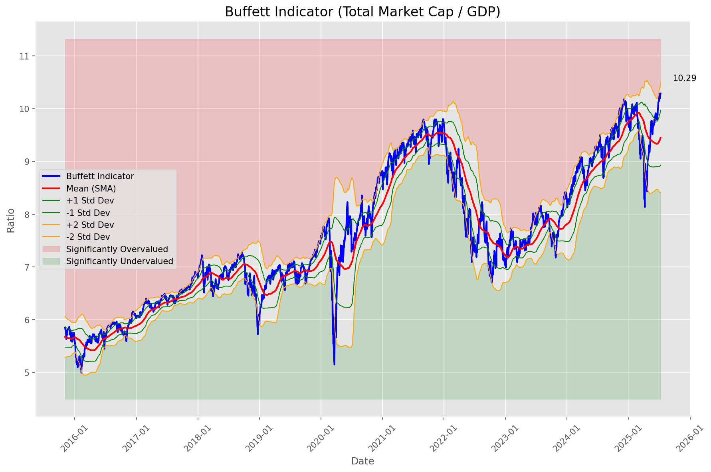
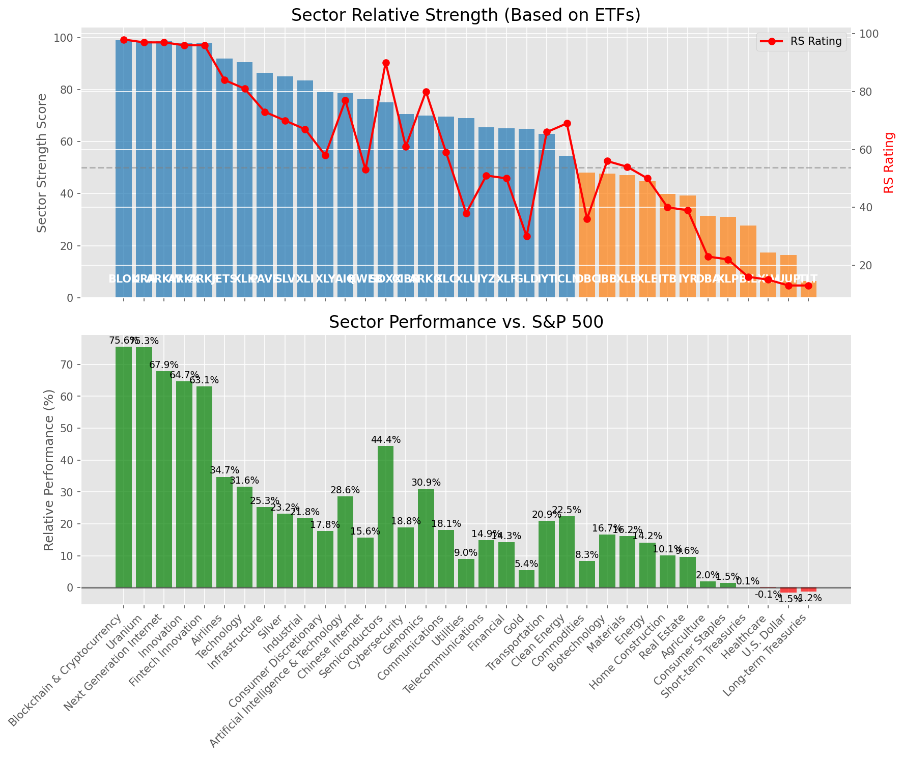

# **Daily Relative Strength Report**

**Date:** 2025-07-14

## **Market Valuation (Buffett Indicator)**

| Metric | Value |
|--------|-------|
| **Market Valuation** | **Overvalued** |
| **Current Ratio** | 10.27 |
| **Historical Mean** | 9.46 |
| **Standard Deviation** | 0.53 |
| **Z-Score (StdDev from Mean)** | 1.49 |
| **Total Market Cap** | $307.79 trillion |
| **GDP** | $29.96 trillion |

## **Market Insights**

### **Market is Overvalued**

The market appears to be trading above historical average valuations. While not at extreme levels, this suggests more modest future returns may be expected. Investors should:

- Focus on companies with reasonable valuations relative to their growth
- Be more selective with new positions
- Look for stocks showing relative strength within their sectors
- Consider trimming positions in extremely overvalued names

Historically, periods of mild overvaluation can persist for extended periods, but returns tend to be below average.

### **Buffett Indicator Overview**

The Buffett Indicator (Total Market Cap / GDP) is a measure of the stock market's valuation relative to the size of the economy. It is named after Warren Buffett, who described it as "probably the best single measure of where valuations stand at any given moment."

- **Values above +2 standard deviations:** Market significantly overvalued
- **Values above +1 standard deviation:** Market overvalued
- **Values between -1 and +1 standard deviations:** Market fairly valued
- **Values below -1 standard deviation:** Market undervalued
- **Values below -2 standard deviations:** Market significantly undervalued

---

## **Sector Relative Strength**

Based on William O'Neil's Relative Strength Methodology

| ETF | Strength | RS Rating | Performance | Above Key MAs | Trend | Sector |
|-----|----------|-----------|-------------|--------------|-------|--------|
| [URA](https://www.tradingview.com/chart/?symbol=URA) | 99.0 | 98.0 | 79.23% | 10d ✓, 50d ✓, 200d ✓ | ↗️ | Uranium |
| [BLOK](https://www.tradingview.com/chart/?symbol=BLOK) | 98.5 | 97.0 | 76.58% | 10d ✓, 50d ✓, 200d ✓ | ↗️ | Blockchain & Cryptocurrency |
| [ARKF](https://www.tradingview.com/chart/?symbol=ARKF) | 98.0 | 96.0 | 63.56% | 10d ✓, 50d ✓, 200d ✓ | ↗️ | Fintech Innovation |
| [ARKW](https://www.tradingview.com/chart/?symbol=ARKW) | 98.0 | 96.0 | 68.14% | 10d ✓, 50d ✓, 200d ✓ | ↗️ | Next Generation Internet |
| [ARKK](https://www.tradingview.com/chart/?symbol=ARKK) | 98.0 | 96.0 | 64.90% | 10d ✓, 50d ✓, 200d ✓ | ↗️ | Innovation |
| [JETS](https://www.tradingview.com/chart/?symbol=JETS) | 92.0 | 84.0 | 35.53% | 10d ✓, 50d ✓, 200d ✓ | ↗️ | Airlines |
| [XLK](https://www.tradingview.com/chart/?symbol=XLK) | 90.0 | 80.0 | 31.62% | 10d ✓, 50d ✓, 200d ✓ | ↗️ | Technology |
| [PAVE](https://www.tradingview.com/chart/?symbol=PAVE) | 86.0 | 72.0 | 25.90% | 10d ✓, 50d ✓, 200d ✓ | ↗️ | Infrastructure |
| [SLV](https://www.tradingview.com/chart/?symbol=SLV) | 84.0 | 68.0 | 23.18% | 10d ✓, 50d ✓, 200d ✓ | ↗️ | Silver |
| [XLI](https://www.tradingview.com/chart/?symbol=XLI) | 83.0 | 66.0 | 22.26% | 10d ✓, 50d ✓, 200d ✓ | ↗️ | Industrial |
| [XLY](https://www.tradingview.com/chart/?symbol=XLY) | 78.5 | 57.0 | 18.17% | 10d ✓, 50d ✓, 200d ✓ | ↗️ | Consumer Discretionary |
| [AIQ](https://www.tradingview.com/chart/?symbol=AIQ) | 78.1 | 76.0 | 28.72% | 10d ✗, 50d ✓, 200d ✓ | ↗️ | Artificial Intelligence & Technology |
| [KWEB](https://www.tradingview.com/chart/?symbol=KWEB) | 75.5 | 51.0 | 15.67% | 10d ✓, 50d ✓, 200d ✓ | ↗️ | Chinese Internet |
| [SOXX](https://www.tradingview.com/chart/?symbol=SOXX) | 74.5 | 89.0 | 44.56% | 10d ✓, 50d ✓, 200d ✓ | ↘️ | Semiconductors |
| [CIBR](https://www.tradingview.com/chart/?symbol=CIBR) | 69.6 | 59.0 | 18.88% | 10d ✗, 50d ✓, 200d ✓ | ↗️ | Cybersecurity |
| [ARKG](https://www.tradingview.com/chart/?symbol=ARKG) | 69.5 | 79.0 | 30.24% | 10d ✓, 50d ✓, 200d ✓ | ↘️ | Genomics |
| [XLC](https://www.tradingview.com/chart/?symbol=XLC) | 69.1 | 58.0 | 18.38% | 10d ✗, 50d ✓, 200d ✓ | ↗️ | Communications |
| [XLU](https://www.tradingview.com/chart/?symbol=XLU) | 69.0 | 38.0 | 9.64% | 10d ✓, 50d ✓, 200d ✓ | ↗️ | Utilities |
| [IYZ](https://www.tradingview.com/chart/?symbol=IYZ) | 65.6 | 51.0 | 15.36% | 10d ✗, 50d ✓, 200d ✓ | ↗️ | Telecommunications |
| [GLD](https://www.tradingview.com/chart/?symbol=GLD) | 64.5 | 29.0 | 5.53% | 10d ✓, 50d ✓, 200d ✓ | ↗️ | Gold |
| [XLF](https://www.tradingview.com/chart/?symbol=XLF) | 64.1 | 48.0 | 14.39% | 10d ✗, 50d ✓, 200d ✓ | ↗️ | Financial |
| [IYT](https://www.tradingview.com/chart/?symbol=IYT) | 62.5 | 65.0 | 21.35% | 10d ✓, 50d ✓, 200d ✓ | ↘️ | Transportation |
| [XLB](https://www.tradingview.com/chart/?symbol=XLB) | 56.5 | 53.0 | 16.37% | 10d ✓, 50d ✓, 200d ✓ | ↘️ | Materials |
| [XLE](https://www.tradingview.com/chart/?symbol=XLE) | 54.5 | 49.0 | 14.58% | 10d ✓, 50d ✓, 200d ✓ | ↘️ | Energy |
| [ICLN](https://www.tradingview.com/chart/?symbol=ICLN) | 53.6 | 67.0 | 22.78% | 10d ✗, 50d ✓, 200d ✓ | ↘️ | Clean Energy |
| [IYR](https://www.tradingview.com/chart/?symbol=IYR) | 49.5 | 39.0 | 9.93% | 10d ✓, 50d ✓, 200d ✓ | ↘️ | Real Estate |
| [DBC](https://www.tradingview.com/chart/?symbol=DBC) | 47.5 | 35.0 | 8.36% | 10d ✓, 50d ✓, 200d ✓ | ↘️ | Commodities |
| [IBB](https://www.tradingview.com/chart/?symbol=IBB) | 46.8 | 54.0 | 16.64% | 10d ✓, 50d ✓, 200d ✗ | ↘️ | Biotechnology |
| [XLP](https://www.tradingview.com/chart/?symbol=XLP) | 41.2 | 22.0 | 1.91% | 10d ✗, 50d ✗, 200d ✓ | ↗️ | Consumer Staples |
| [ITB](https://www.tradingview.com/chart/?symbol=ITB) | 40.3 | 41.0 | 11.04% | 10d ✓, 50d ✓, 200d ✗ | ↘️ | Home Construction |
| [DBA](https://www.tradingview.com/chart/?symbol=DBA) | 31.0 | 22.0 | 1.98% | 10d ✗, 50d ✗, 200d ✗ | ↗️ | Agriculture |
| [BIL](https://www.tradingview.com/chart/?symbol=BIL) | 27.3 | 15.0 | 0.06% | 10d ✓, 50d ✓, 200d ✗ | ↘️ | Short-term Treasuries |
| [XLV](https://www.tradingview.com/chart/?symbol=XLV) | 17.4 | 15.0 | 0.13% | 10d ✗, 50d ✓, 200d ✗ | ↘️ | Healthcare |
| [UUP](https://www.tradingview.com/chart/?symbol=UUP) | 15.9 | 12.0 | -1.52% | 10d ✓, 50d ✗, 200d ✗ | ↘️ | U.S. Dollar |
| [TLT](https://www.tradingview.com/chart/?symbol=TLT) | 6.5 | 13.0 | -0.97% | 10d ✗, 50d ✗, 200d ✗ | ↘️ | Long-term Treasuries |

### **Sector ETF Performance Interpretation**

This table shows the relative strength metrics for different market sectors based on their representative ETFs:

- **ETF**: The ETF used to measure sector performance (click for chart)
- **Strength**: Overall sector strength score (0-100) combining multiple factors
- **RS Rating**: O'Neil RS rating of the sector ETF
- **Performance**: Performance of the sector ETF relative to SPY
- **Above Key MAs**: Whether the ETF is trading above its 10, 50, and 200-day moving averages
- **Trend**: Whether the sector is in an uptrend (↗️) or downtrend (↘️)

### **Current Sector Leadership**

The current market leadership is coming from the following sectors: **Uranium, Blockchain & Cryptocurrency, Fintech Innovation**.

The **Uranium** sector (represented by **URA**) is showing particularly strong relative strength with an RS rating of 98.0 and performance of 79.23% vs. the S&P 500. This sector is trading above its 10-day, 50-day, 200-day moving average(s). Investors should consider focusing on high RS stocks within these leading sectors for potential outperformance.

---

## **Buy Recommendations**

The following 50 stocks show exceptional relative strength:

| RS Rating | Buy Score | Current Price | Chart | Name | Ticker |
|-----------|-----------|---------------|-------|------|--------|
| 100 | 100 | $99.44 | [Chart](https://www.tradingview.com/chart/?symbol=HOOD) | Robinhood Markets, Inc. Class A Common Stock | HOOD |
| 100 | 100 | $214.69 | [Chart](https://www.tradingview.com/chart/?symbol=LEU) | Centrus Energy Corp. | LEU |
| 99 | 100 | $146.08 | [Chart](https://www.tradingview.com/chart/?symbol=FUTU) | Futu Holdings Limited American Depositary Shares | FUTU |
| 99 | 100 | $48.41 | [Chart](https://www.tradingview.com/chart/?symbol=MP) | MP Materials Corp. | MP |
| 99 | 100 | $111.47 | [Chart](https://www.tradingview.com/chart/?symbol=RBLX) | Roblox Corporation | RBLX |
| 99 | 100 | $104.70 | [Chart](https://www.tradingview.com/chart/?symbol=VRNA) | Verona Pharma plc | VRNA |
| 98 | 100 | $554.43 | [Chart](https://www.tradingview.com/chart/?symbol=GEV) | GE Vernova Inc. | GEV |
| 98 | 100 | $148.69 | [Chart](https://www.tradingview.com/chart/?symbol=LMB) | Limbach Holdings, Inc Common Stock | LMB |
| 98 | 100 | $39.04 | [Chart](https://www.tradingview.com/chart/?symbol=AS) | Amer Sports, Inc. | AS |
| 97 | 100 | $43.95 | [Chart](https://www.tradingview.com/chart/?symbol=FARO) | Faro Technologies Inc | FARO |
| 97 | 100 | $348.87 | [Chart](https://www.tradingview.com/chart/?symbol=CVNA) | Carvana Co. | CVNA |
| 96 | 100 | $152.25 | [Chart](https://www.tradingview.com/chart/?symbol=ARKW) | ARK Next Generation Internet ETF | ARKW |
| 96 | 100 | $52.03 | [Chart](https://www.tradingview.com/chart/?symbol=ARKF) | ARK Fintech Innovation ETF | ARKF |
| 96 | 100 | $448.42 | [Chart](https://www.tradingview.com/chart/?symbol=MSTR) | MicroStrategy Inc | MSTR |
| 96 | 100 | $148.39 | [Chart](https://www.tradingview.com/chart/?symbol=PLTR) | Palantir Technologies Inc. Class A Common Stock | PLTR |
| 96 | 100 | $52.31 | [Chart](https://www.tradingview.com/chart/?symbol=KTOS) | Kratos Defense & Security Solutions, Inc. | KTOS |
| 95 | 100 | $35.38 | [Chart](https://www.tradingview.com/chart/?symbol=ATRO) | Astronics Corp | ATRO |
| 95 | 100 | $221.56 | [Chart](https://www.tradingview.com/chart/?symbol=AGX) | Argan, Inc | AGX |
| 94 | 100 | $22.11 | [Chart](https://www.tradingview.com/chart/?symbol=MAG) | MAG Silver Corp. | MAG |
| 94 | 100 | $101.30 | [Chart](https://www.tradingview.com/chart/?symbol=TPR) | Tapestry, Inc. Common Stock | TPR |
| 94 | 100 | $35.62 | [Chart](https://www.tradingview.com/chart/?symbol=NNE) | Nano Nuclear Energy Inc. Common Stock | NNE |
| 93 | 100 | $35.64 | [Chart](https://www.tradingview.com/chart/?symbol=ATAT) | Atour Lifestyle Holdings Limited American Depositary Shares | ATAT |
| 93 | 100 | $88.06 | [Chart](https://www.tradingview.com/chart/?symbol=RYTM) | Rhythm Pharmaceuticals, Inc. Common Stock | RYTM |
| 93 | 100 | $20.80 | [Chart](https://www.tradingview.com/chart/?symbol=MIR) | Mirion Technologies, Inc. | MIR |
| 92 | 100 | $52.57 | [Chart](https://www.tradingview.com/chart/?symbol=AKRO) | Akero Therapeutics, Inc. Common Stock | AKRO |
| 92 | 100 | $68.06 | [Chart](https://www.tradingview.com/chart/?symbol=IBIT) | iShares Bitcoin Trust ETF | IBIT |
| 92 | 100 | $53.08 | [Chart](https://www.tradingview.com/chart/?symbol=BTC) | Grayscale Bitcoin Mini Trust ETF | BTC |
| 91 | 100 | $184.15 | [Chart](https://www.tradingview.com/chart/?symbol=HWM) | Howmet Aerospace Inc. | HWM |
| 91 | 100 | $47.91 | [Chart](https://www.tradingview.com/chart/?symbol=BBIO) | BridgeBio Pharma, Inc. Common Stock | BBIO |
| 89 | 100 | $260.61 | [Chart](https://www.tradingview.com/chart/?symbol=GE) | GE Aerospace | GE |
| 89 | 100 | $59.30 | [Chart](https://www.tradingview.com/chart/?symbol=IBKR) | Interactive Brokers Group, Inc. Class A Common Stock | IBKR |
| 88 | 100 | $48.12 | [Chart](https://www.tradingview.com/chart/?symbol=DRS) | Leonardo DRS, Inc. Common Stock | DRS |
| 87 | 99 | $151.07 | [Chart](https://www.tradingview.com/chart/?symbol=COOP) | Mr. Cooper Group Inc. Common Stock | COOP |
| 86 | 99 | $29.77 | [Chart](https://www.tradingview.com/chart/?symbol=DB) | Deutsche Bank Aktiengesellschaft | DB |
| 88 | 98 | $87.27 | [Chart](https://www.tradingview.com/chart/?symbol=C) | Citigroup Inc. | C |
| 85 | 98 | $18.61 | [Chart](https://www.tradingview.com/chart/?symbol=BCS) | Barclays PLC | BCS |
| 87 | 97 | $104.59 | [Chart](https://www.tradingview.com/chart/?symbol=SANM) | Sanmina  Corp | SANM |
| 85 | 97 | $74.45 | [Chart](https://www.tradingview.com/chart/?symbol=TPB) | Turning Point Brands, Inc. | TPB |
| 84 | 97 | $242.72 | [Chart](https://www.tradingview.com/chart/?symbol=DASH) | DoorDash, Inc. Class A Common Stock | DASH |
| 84 | 95 | $358.50 | [Chart](https://www.tradingview.com/chart/?symbol=APP) | Applovin Corporation Class A Common Stock | APP |
| 81 | 95 | $29.12 | [Chart](https://www.tradingview.com/chart/?symbol=SRAD) | Sportradar Group AG Class A Ordinary Shares | SRAD |
| 84 | 94 | $219.98 | [Chart](https://www.tradingview.com/chart/?symbol=COF) | Capital One Financial | COF |
| 83 | 94 | $44.56 | [Chart](https://www.tradingview.com/chart/?symbol=TOST) | Toast, Inc. | TOST |
| 81 | 94 | $29.40 | [Chart](https://www.tradingview.com/chart/?symbol=CAE) | CAE INC | CAE |
| 81 | 94 | $45.58 | [Chart](https://www.tradingview.com/chart/?symbol=EXEL) | Exelixis Inc | EXEL |
| 83 | 93 | $29.88 | [Chart](https://www.tradingview.com/chart/?symbol=NTGR) | NETGEAR, Inc. | NTGR |
| 82 | 93 | $72.95 | [Chart](https://www.tradingview.com/chart/?symbol=ULS) | UL Solutions Inc. | ULS |
| 81 | 90 | $50.65 | [Chart](https://www.tradingview.com/chart/?symbol=SIL) | Global X Silver Miners ETF (NEW) | SIL |
| 80 | 90 | $60.94 | [Chart](https://www.tradingview.com/chart/?symbol=EPR) | EPR Properties | EPR |
| 80 | 90 | $83.30 | [Chart](https://www.tradingview.com/chart/?symbol=WFC) | Wells Fargo & Co. | WFC |

---

## **Sell Recommendations**

The following 122 stocks show deteriorating relative strength:

| RS Rating | Sell Score | Current Price | Chart | Name | Ticker |
|-----------|------------|---------------|-------|------|--------|
| 1 | 100 | $34.16 | [Chart](https://www.tradingview.com/chart/?symbol=SARK) | Investment Managers Series Trust II Tradr 1X Short Innovation Daily ETF | SARK |
| 1 | 100 | $25.99 | [Chart](https://www.tradingview.com/chart/?symbol=TECS) | Direxion Daily Technology Bear 3x Shares | TECS |
| 1 | 100 | $24.98 | [Chart](https://www.tradingview.com/chart/?symbol=QID) | ProShares UltraShort QQQ | QID |
| 1 | 100 | $220.10 | [Chart](https://www.tradingview.com/chart/?symbol=MOH) | Molina Healthcare, Inc. | MOH |
| 2 | 100 | $16.35 | [Chart](https://www.tradingview.com/chart/?symbol=SDS) | ProShares UltraShort S&P500 | SDS |
| 2 | 100 | $228.33 | [Chart](https://www.tradingview.com/chart/?symbol=HUM) | Humana Inc. | HUM |
| 2 | 100 | $40.60 | [Chart](https://www.tradingview.com/chart/?symbol=SDOW) | ProShares UltraPro Short Dow 30 | SDOW |
| 2 | 100 | $12.29 | [Chart](https://www.tradingview.com/chart/?symbol=IART) | Integra LifeSciences Holdings | IART |
| 2 | 100 | $21.04 | [Chart](https://www.tradingview.com/chart/?symbol=ERY) | Direxion Daily Energy Bear 2X Shares | ERY |
| 2 | 100 | $10.25 | [Chart](https://www.tradingview.com/chart/?symbol=SNDX) | Syndax Pharmaceuticals, Inc. | SNDX |
| 3 | 100 | $23.90 | [Chart](https://www.tradingview.com/chart/?symbol=DXD) | ProShares UltraShort Dow 30 | DXD |
| 3 | 100 | $23.78 | [Chart](https://www.tradingview.com/chart/?symbol=CRTO) | Criteo S.A. | CRTO |
| 3 | 100 | $60.33 | [Chart](https://www.tradingview.com/chart/?symbol=STC) | Stewart Information Services Corporation | STC |
| 3 | 100 | $10.76 | [Chart](https://www.tradingview.com/chart/?symbol=SONO) | Sonos, Inc. Common Stock | SONO |
| 3 | 100 | $10.24 | [Chart](https://www.tradingview.com/chart/?symbol=WNC) | Wabash National Corp. | WNC |
| 3 | 100 | $48.62 | [Chart](https://www.tradingview.com/chart/?symbol=ASGN) | ASGN Incorporated | ASGN |
| 3 | 100 | $11.98 | [Chart](https://www.tradingview.com/chart/?symbol=CCRN) | Cross Country Healthcare Inc | CCRN |
| 3 | 100 | $33.46 | [Chart](https://www.tradingview.com/chart/?symbol=PSQ) | ProShares Short QQQ | PSQ |
| 3 | 100 | $41.73 | [Chart](https://www.tradingview.com/chart/?symbol=LINE) | Lineage, Inc. Common Stock | LINE |
| 3 | 100 | $37.16 | [Chart](https://www.tradingview.com/chart/?symbol=IBTA) | Ibotta, Inc. | IBTA |
| 4 | 100 | $39.34 | [Chart](https://www.tradingview.com/chart/?symbol=SH) | ProShares Short S&P500 | SH |
| 4 | 100 | $10.41 | [Chart](https://www.tradingview.com/chart/?symbol=LBTYK) | Liberty Global Ltd. Class C Common Shares | LBTYK |
| 4 | 100 | $32.01 | [Chart](https://www.tradingview.com/chart/?symbol=CRI) | Carter's Inc. | CRI |
| 4 | 100 | $99.00 | [Chart](https://www.tradingview.com/chart/?symbol=ONTO) | Onto Innovation Inc. | ONTO |
| 4 | 100 | $50.66 | [Chart](https://www.tradingview.com/chart/?symbol=SLVM) | Sylvamo Corporation | SLVM |
| 4 | 100 | $16.36 | [Chart](https://www.tradingview.com/chart/?symbol=COLD) | Americold Realty Trust, Inc. | COLD |
| 5 | 100 | $98.53 | [Chart](https://www.tradingview.com/chart/?symbol=DECK) | Deckers Outdoor Corp | DECK |
| 5 | 100 | $25.34 | [Chart](https://www.tradingview.com/chart/?symbol=DOG) | ProShares Short Dow30 | DOG |
| 5 | 100 | $16.50 | [Chart](https://www.tradingview.com/chart/?symbol=HP) | Helmerich & Payne, Inc. | HP |
| 5 | 100 | $132.16 | [Chart](https://www.tradingview.com/chart/?symbol=ICUI) | ICU Medical Inc | ICUI |
| 5 | 100 | $27.56 | [Chart](https://www.tradingview.com/chart/?symbol=OMCL) | Omnicell Inc | OMCL |
| 6 | 100 | $130.53 | [Chart](https://www.tradingview.com/chart/?symbol=INSP) | Inspire Medical Systems, Inc. | INSP |
| 6 | 100 | $10.75 | [Chart](https://www.tradingview.com/chart/?symbol=SD) | SandRidge Energy, Inc. | SD |
| 6 | 100 | $10.12 | [Chart](https://www.tradingview.com/chart/?symbol=LBTYA) | Liberty Global Ltd. Class A Common Shares | LBTYA |
| 6 | 100 | $69.17 | [Chart](https://www.tradingview.com/chart/?symbol=TNET) | TRINET GROUP, INC. | TNET |
| 7 | 100 | $63.26 | [Chart](https://www.tradingview.com/chart/?symbol=ZROZ) | PIMCO 25+ Year Zero Coupon U.S. Treasury Index Exchange-Traded Fund | ZROZ |
| 7 | 100 | $38.29 | [Chart](https://www.tradingview.com/chart/?symbol=LKQ) | LKQ Corporation | LKQ |
| 7 | 100 | $127.34 | [Chart](https://www.tradingview.com/chart/?symbol=KMB) | Kimberly-Clark Corp. | KMB |
| 7 | 100 | $60.42 | [Chart](https://www.tradingview.com/chart/?symbol=COLM) | Columbia Sportswear Co | COLM |
| 8 | 100 | $47.44 | [Chart](https://www.tradingview.com/chart/?symbol=BMY) | Bristol-Myers Squibb Co. | BMY |
| 8 | 100 | $15.91 | [Chart](https://www.tradingview.com/chart/?symbol=TNDM) | Tandem Diabetes Care, Inc. | TNDM |
| 9 | 100 | $51.16 | [Chart](https://www.tradingview.com/chart/?symbol=LW) | Lamb Weston Holdings, Inc. | LW |
| 10 | 100 | $50.29 | [Chart](https://www.tradingview.com/chart/?symbol=CNMD) | CONMED Corporation | CNMD |
| 11 | 100 | $14.71 | [Chart](https://www.tradingview.com/chart/?symbol=VRE) | Veris Residential, Inc. | VRE |
| 12 | 100 | $21.65 | [Chart](https://www.tradingview.com/chart/?symbol=TUA) | Simplify Short Term Treasury Futures Strategy ETF | TUA |
| 14 | 100 | $29.15 | [Chart](https://www.tradingview.com/chart/?symbol=SPTS) | SPDR Portfolio Short Term Treasury ETF | SPTS |
| 17 | 100 | $27.83 | [Chart](https://www.tradingview.com/chart/?symbol=GTY) | Getty Realty Corp. | GTY |
| 10 | 99 | $13.13 | [Chart](https://www.tradingview.com/chart/?symbol=BSM) | Black Stone Minerals, L.P. | BSM |
| 10 | 99 | $46.59 | [Chart](https://www.tradingview.com/chart/?symbol=CWT) | California Water Service | CWT |
| 11 | 98 | $19.21 | [Chart](https://www.tradingview.com/chart/?symbol=SPT) | Sprout Social, Inc Class A Common Stock | SPT |
| 17 | 98 | $10.31 | [Chart](https://www.tradingview.com/chart/?symbol=NMZ) | Nuveen Municipal High Income Opportunity Fund | NMZ |
| 4 | 97 | $10.22 | [Chart](https://www.tradingview.com/chart/?symbol=SPDN) | Direxion Daily S&P 500 Bear 1X Shares | SPDN |
| 8 | 97 | $15.45 | [Chart](https://www.tradingview.com/chart/?symbol=PRO) | Pros Holdings, Inc. | PRO |
| 10 | 97 | $13.65 | [Chart](https://www.tradingview.com/chart/?symbol=GO) | Grocery Outlet Holding Corp. Common Stock | GO |
| 11 | 97 | $89.13 | [Chart](https://www.tradingview.com/chart/?symbol=CL) | Colgate-Palmolive Company | CL |
| 13 | 97 | $41.16 | [Chart](https://www.tradingview.com/chart/?symbol=POR) | Portland General Electric Company | POR |
| 14 | 97 | $16.74 | [Chart](https://www.tradingview.com/chart/?symbol=MLN) | VanEck Long Muni ETF | MLN |
| 6 | 96 | $17.30 | [Chart](https://www.tradingview.com/chart/?symbol=NOMD) | Nomad Foods Limited | NOMD |
| 7 | 96 | $25.10 | [Chart](https://www.tradingview.com/chart/?symbol=DRV) | Direxion Daily Real Estate Bear 3X Shares | DRV |
| 10 | 96 | $13.48 | [Chart](https://www.tradingview.com/chart/?symbol=EIC) | Eagle Point Income Company Inc. | EIC |
| 13 | 96 | $107.78 | [Chart](https://www.tradingview.com/chart/?symbol=BAH) | Booz Allen Hamilton Holding Corporation | BAH |
| 13 | 96 | $21.06 | [Chart](https://www.tradingview.com/chart/?symbol=LGOV) | First Trust Long Duration Opportunities ETF | LGOV |
| 13 | 96 | $85.58 | [Chart](https://www.tradingview.com/chart/?symbol=TLT) | iShares 20+ Year Treasury Bond ETF | TLT |
| 11 | 95 | $48.49 | [Chart](https://www.tradingview.com/chart/?symbol=SNY) | Sanofi American Depositary Shares (Each representing one-half of one ordinary share) | SNY |
| 15 | 95 | $341.54 | [Chart](https://www.tradingview.com/chart/?symbol=EG) | Everest Group, Ltd. | EG |
| 13 | 94 | $54.56 | [Chart](https://www.tradingview.com/chart/?symbol=VGLT) | Vanguard Long-Term Treasury ETF | VGLT |
| 14 | 94 | $58.48 | [Chart](https://www.tradingview.com/chart/?symbol=VGSH) | Vanguard Short-Term Treasury ETF | VGSH |
| 9 | 93 | $33.22 | [Chart](https://www.tradingview.com/chart/?symbol=KDP) | Keurig Dr Pepper Inc. | KDP |
| 23 | 92 | $32.32 | [Chart](https://www.tradingview.com/chart/?symbol=INVH) | Invitation Homes Inc. Common Stock | INVH |
| 12 | 91 | $102.40 | [Chart](https://www.tradingview.com/chart/?symbol=AFL) | Aflac Inc. | AFL |
| 14 | 91 | $82.45 | [Chart](https://www.tradingview.com/chart/?symbol=SHY) | iShares 1-3 Year Treasury Bond ETF | SHY |
| 16 | 90 | $49.11 | [Chart](https://www.tradingview.com/chart/?symbol=BNDX) | Vanguard Total International Bond ETF | BNDX |
| 19 | 90 | $34.88 | [Chart](https://www.tradingview.com/chart/?symbol=PECO) | Phillips Edison & Company, Inc. Common Stock | PECO |
| 18 | 89 | $562.47 | [Chart](https://www.tradingview.com/chart/?symbol=TYL) | Tyler Technologies, Inc. | TYL |
| 19 | 89 | $30.52 | [Chart](https://www.tradingview.com/chart/?symbol=AXTA) | Axalta Coating Systems Ltd. | AXTA |
| 22 | 89 | $61.09 | [Chart](https://www.tradingview.com/chart/?symbol=UL) | Unilever plc | UL |
| 23 | 89 | $40.43 | [Chart](https://www.tradingview.com/chart/?symbol=UDR) | UDR, Inc. | UDR |
| 12 | 88 | $37.80 | [Chart](https://www.tradingview.com/chart/?symbol=WTRG) | Essential Utilities, Inc. | WTRG |
| 12 | 88 | $760.18 | [Chart](https://www.tradingview.com/chart/?symbol=EQIX) | Equinix, Inc. Common Stock REIT | EQIX |
| 16 | 88 | $18.62 | [Chart](https://www.tradingview.com/chart/?symbol=AKR) | Acadia Realty Trust | AKR |
| 16 | 88 | $39.66 | [Chart](https://www.tradingview.com/chart/?symbol=TOTL) | SSgA Active ETF Trust SPDR DoubleLine Total Return Tactical ETF | TOTL |
| 16 | 88 | $94.28 | [Chart](https://www.tradingview.com/chart/?symbol=IEF) | iShares 7-10 Year Treasury Bond ETF | IEF |
| 17 | 88 | $38.65 | [Chart](https://www.tradingview.com/chart/?symbol=LZB) | La-Z-Boy Incorporated | LZB |
| 22 | 88 | $55.11 | [Chart](https://www.tradingview.com/chart/?symbol=DAY) | Dayforce, Inc. | DAY |
| 13 | 87 | $20.14 | [Chart](https://www.tradingview.com/chart/?symbol=CON) | Concentra Group Holdings Parent, Inc. | CON |
| 16 | 87 | $222.18 | [Chart](https://www.tradingview.com/chart/?symbol=LOW) | Lowe's Companies Inc. | LOW |
| 18 | 87 | $40.41 | [Chart](https://www.tradingview.com/chart/?symbol=FE) | FirstEnergy Corp. | FE |
| 18 | 87 | $165.32 | [Chart](https://www.tradingview.com/chart/?symbol=HSY) | The Hershey Company | HSY |
| 15 | 86 | $110.22 | [Chart](https://www.tradingview.com/chart/?symbol=SHV) | iShares Short Treasury Bond ETF | SHV |
| 26 | 86 | $66.79 | [Chart](https://www.tradingview.com/chart/?symbol=EQR) | Equity Residential | EQR |
| 23 | 84 | $17.93 | [Chart](https://www.tradingview.com/chart/?symbol=S) | SentinelOne, Inc. | S |
| 20 | 83 | $76.62 | [Chart](https://www.tradingview.com/chart/?symbol=AWR) | American States Water Company | AWR |
| 32 | 83 | $102.02 | [Chart](https://www.tradingview.com/chart/?symbol=CROX) | Crocs, Inc. | CROX |
| 18 | 82 | $26.88 | [Chart](https://www.tradingview.com/chart/?symbol=FCPT) | Four Corners Property Trust, Inc. | FCPT |
| 27 | 82 | $13.96 | [Chart](https://www.tradingview.com/chart/?symbol=DOLE) | Dole plc | DOLE |
| 27 | 82 | $25.32 | [Chart](https://www.tradingview.com/chart/?symbol=PNTG) | The Pennant Group, Inc. Common Stock | PNTG |
| 31 | 82 | $122.10 | [Chart](https://www.tradingview.com/chart/?symbol=RGEN) | Repligen Corp | RGEN |
| 28 | 81 | $74.78 | [Chart](https://www.tradingview.com/chart/?symbol=IFF) | International Flavors & Fragrances Inc. | IFF |
| 28 | 81 | $119.37 | [Chart](https://www.tradingview.com/chart/?symbol=ITGR) | Integer Holdings Corporation | ITGR |
| 35 | 81 | $20.80 | [Chart](https://www.tradingview.com/chart/?symbol=AMN) | AMN Healthcare Services | AMN |
| 23 | 79 | $98.92 | [Chart](https://www.tradingview.com/chart/?symbol=FMX) | FOMENTO ECONOMICO MEXICANO, S.A.B. DE C.V. | FMX |
| 28 | 79 | $76.77 | [Chart](https://www.tradingview.com/chart/?symbol=CNS) | Cohen & Steers Inc. | CNS |
| 39 | 79 | $29.10 | [Chart](https://www.tradingview.com/chart/?symbol=QDEL) | QuidelOrtho Corporation Common Stock | QDEL |
| 27 | 78 | $35.88 | [Chart](https://www.tradingview.com/chart/?symbol=AMH) | AMERICAN HOMES 4 RENT | AMH |
| 28 | 78 | $344.88 | [Chart](https://www.tradingview.com/chart/?symbol=SHW) | The Sherwin-Williams Company | SHW |
| 30 | 78 | $114.10 | [Chart](https://www.tradingview.com/chart/?symbol=CPT) | Camden Property Trust | CPT |
| 32 | 77 | $297.12 | [Chart](https://www.tradingview.com/chart/?symbol=UTHR) | United Therapeutics Corp | UTHR |
| 32 | 77 | $29.11 | [Chart](https://www.tradingview.com/chart/?symbol=APPN) | Appian Corporation Class A Common Stock | APPN |
| 26 | 76 | $241.14 | [Chart](https://www.tradingview.com/chart/?symbol=RNR) | RenaissanceRe Holdings Ltd. | RNR |
| 27 | 76 | $27.50 | [Chart](https://www.tradingview.com/chart/?symbol=IVT) | InvenTrust Properties Corp. | IVT |
| 30 | 76 | $37.26 | [Chart](https://www.tradingview.com/chart/?symbol=PBA) | PEMBINA PIPELINE CORPORATION | PBA |
| 33 | 76 | $149.40 | [Chart](https://www.tradingview.com/chart/?symbol=EA) | Electronic Arts Inc | EA |
| 34 | 76 | $22.45 | [Chart](https://www.tradingview.com/chart/?symbol=SGRY) | Surgery Partners, Inc. Common Stock | SGRY |
| 33 | 73 | $69.01 | [Chart](https://www.tradingview.com/chart/?symbol=BRC) | Brady Corporation | BRC |
| 34 | 73 | $30.12 | [Chart](https://www.tradingview.com/chart/?symbol=MGPI) | MGP Ingredients Inc | MGPI |
| 37 | 73 | $17.53 | [Chart](https://www.tradingview.com/chart/?symbol=NVCR) | NovoCure Limited Ordinary Shares | NVCR |
| 38 | 73 | $11.63 | [Chart](https://www.tradingview.com/chart/?symbol=SHC) | Sotera Health Company Common Stock | SHC |
| 33 | 72 | $14.32 | [Chart](https://www.tradingview.com/chart/?symbol=BMEZ) | BlackRock Health Sciences Term Trust | BMEZ |
| 35 | 72 | $24.80 | [Chart](https://www.tradingview.com/chart/?symbol=HPQ) | HP Inc. | HPQ |
| 33 | 71 | $54.82 | [Chart](https://www.tradingview.com/chart/?symbol=ALRM) | Alarm.com Holdings, Inc. | ALRM |
| 30 | 70 | $22.19 | [Chart](https://www.tradingview.com/chart/?symbol=BLFS) | BioLife Solutions Inc. | BLFS |
| 37 | 66 | $85.75 | [Chart](https://www.tradingview.com/chart/?symbol=BIDU) | Baidu, Inc. | BIDU |

## **Methodology**

This report uses William O'Neil's relative strength methodology from Investors Business Daily:

* **RS Rating**: Percentile rank of stock's performance vs. S&P 500 over the past 63 trading days (1-99 scale)
* **Buy Criteria**: RS Rating >= 80, price above 50-day MA, strong uptrend, increasing volume
* **Sell Criteria**: RS Rating < 40, price below 50-day MA, downtrend, decreasing volume

### **O'Neil's Key Principles**

1. **Focus on relative performance** - stocks outperforming the market
2. **Price trend confirmation** - stock must be in an uptrend
3. **Volume confirmation** - strong volume supports price moves
4. **Moving average validation** - price above key moving averages
5. **Market leaders only** - concentrate on top-performing stocks

*Report generated automatically after market close*